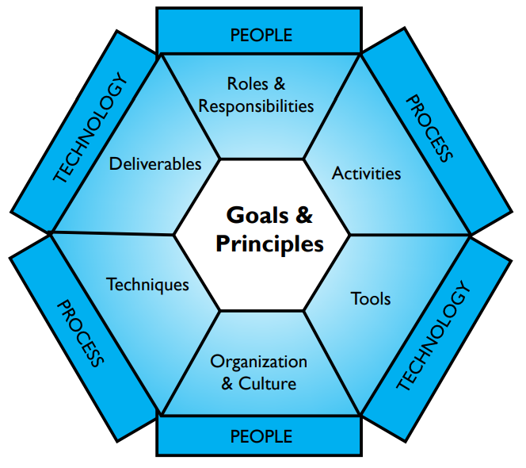

# CHAPTER 1 Data Management

## 1. Introduction
Many organizations recognize that their data is a vital enterprise asset. Data and information can give them insight about their customers, products, and services. It can help them innovate and reach strategic goals. Despite that recognition, few organizations actively manage data as an asset from which they can derive ongoing value (Evans and Price, 2012). Deriving value from data does not happen in a vacuum or by accident. It requires intention, planning, coordination, and commitment. It requires management and leadership.

Data Management is the development, execution, and supervision of plans, policies, programs, and practices that deliver, control, protect, and enhance the value of data and information assets throughout their lifecycles.

A Data Management Professional is any person who works in any facet of data management (from technical management of data throughout its lifecycle to ensuring that data is properly utilized and leveraged) to meet strategic organizational goals. Data management professionals fill numerous roles, from the highly technical (e.g., database administrators, network administrators, programmers) to strategic business (e.g., Data Stewards, Data Strategists, Chief Data Officers).

Data management activities are wide-ranging. They include everything from the ability to make consistent decisions about how to get strategic value from data to the technical deployment and performance of databases. Thus data management requires both technical and non-technical (i.e., ‘business’) skills. Responsibility for managing data must be shared between business and information technology roles, and people in both areas must be able to collaborate to ensure an organization has high quality data that meets its strategic needs.

Data and information are not just assets in the sense that organizations invest in them in order to derive future value. Data and information are also vital to the day-to-day operations of most organizations. They have been called the ‘currency’, the ‘life blood’, and even the ‘new oil’ of the information economy.[^1] Whether or not an organization gets value from its analytics, it cannot even transact business without data.

To support the data management professionals who carry out the work, DAMA International (The Data Management Association) has produced this book, the second edition of The DAMA Guide to the Data

Management Body of Knowledge (DMBOK2). This edition builds on the first one, published in 2009, which provided foundational knowledge on which to build as the profession advanced and matured.

This chapter outlines a set of principles for data management. It discusses challenges related to following those principles and suggests approaches for meeting these challenges. The chapter also describes the DAMA Data Management Framework, which provides the context for the work carried out by data management professionals within various Data Management Knowledge Areas.

### 1.1 Business Drivers

Information and knowledge hold the key to competitive advantage. Organizations that have reliable, high quality data about their customers, products, services, and operations can make better decisions than those without data or with unreliable data. Failure to manage data is similar to failure to manage capital. It results in waste and lost opportunity. The primary driver for data management is to enable organizations to get value from their data assets, just as effective management of financial and physical assets enables organizations to get value from those assets.

### 1.2 Goals
Within an organization, data management goals include:

* Understanding and supporting the information needs of the enterprise and its stakeholders, including customers, employees, and business partners
* Capturing, storing, protecting, and ensuring the integrity of data assets
* Ensuring the quality of data and information
* Ensuring the privacy and confidentiality of stakeholder data
* Preventing unauthorized or inappropriate access, manipulation, or use of data and information
* Ensuring data can be used effectively to add value to the enterprise

## 2. Essential Concepts

### 2.1 Data 
Long-standing definitions of data emphasize its role in representing facts about the world.[^2] In relation to information technology, data is also understood as information that has been stored in digital form (though data is not limited to information that has been digitized and data management principles apply to data captured on paper as well as in databases). Still, because today we can capture so much information electronically, we call many things ‘data’ that would not have been called ‘data’ in earlier times – things like names, addresses, birthdates, what one ate for dinner on Saturday, the most recent book one purchased. 

Such facts about individual people can be aggregated, analyzed, and used to make a profit, improve health, orinfluence public policy. Moreover our technological capacity to measure a wide range of events and activities (fromthe repercussions of the Big Bang to our own heartbeats) and to collect, store, and analyze electronic versions ofthings that were not previously thought of as data (videos, pictures, sound recordings, documents) is close tosurpassing our ability to synthesize these data into usable information.[^3] To take advantage of the variety of datawithout being overwhelmed by its volume and velocity requires reliable, extensible data management practices. 

Most people assume that, because data represents facts, it is a form of truth about the world and that the facts will fit together. But ‘facts’ are not always simple or straightforward. Data is a means of representation. It stands for things other than itself (Chisholm, 2010). Data is both an interpretation of the objects it represents and an object that must be interpreted (Sebastian-Coleman, 2013). This is another way of saying that we need context for data to be meaningful. Context can be thought of as data’s representational system; such a system includes a common vocabulary and a set of relationships between components. If we know the conventions of such a system, then we can interpret the data within it.[^4] These conventions are often documented in a specific kind of data referred to as Metadata.

However, because people often make different choices about how to represent concepts, they create different ways of representing the same concepts. From these choices, data takes on different shapes. Think of the range of ways we have to represent calendar dates, a concept about which there is an agreed-to definition. Now consider more complex concepts (such as customer or product), where the granularity and level of detail of what needs to be represented is not always self-evident, and the process of representation grows more complex, as does the process of managing that information over time. (See Chapter 10)

Even within a single organization, there are often multiple ways of representing the same idea. Hence the need for Data Architecture, modeling, governance, and stewardship, and Metadata and Data Quality management, all of which help people understand and use data. Across organizations, the problem of multiplicity multiplies. Hence the need for industry-level data standards that can bring more consistency to data. 

Organizations have always needed to manage their data, but changes in technology have expanded the scope of this management need as they have changed people’s understanding of what data is. These changes have enabled organizations to use data in new ways to create products, share information, create knowledge, and improve organizational success. But the rapid growth of technology and with it human capacity to produce, capture, and mine data for meaning has intensified the need to manage data effectively. 

### 2.2 Data and Information
Much ink has been spilled over the relationship between data and information. Data has been called the “raw material of information” and information has been called “data in context”.[^5] Often a layered pyramid is used to describe the relationship between data (at the base), information, knowledge, and wisdom (at the very top). While the pyramid can be helpful in describing why data needs to be well-managed, this representation presents several challenges for data management.

* It is based on the assumption that data simply exists. But data does not simply exist. Data has to be created.
* By describing a linear sequence from data through wisdom, it fails to recognize that it takes knowledge to create data in the first place.
* It implies that data and information are separate things, when in reality, the two concepts are intertwined with and dependent on each other. Data is a form of information and information is a form of data.

Within an organization, it may be helpful to draw a line between information and data for purposes of clear communication about the requirements and expectations of different uses by different stakeholders. (“Here is a sales report for the last quarter [information]. It is based on data from our data warehouse [data]. Next quarter these results [data] will be used to generate our quarter-over-quarter performance measures [information]”). Recognizing data and information need to be prepared for different purposes drives home a central tenet of data management: Both data and information need to be managed. Both will be of higher quality if they are managed together with uses and customer requirements in mind. Throughout the DMBOK, the terms will be used interchangeably.

### 2.3 Data as an Organizational Asset

An asset is an economic resource, that can be owned or controlled, and that holds or produces value. Assets can be converted to money. Data is widely recognized as an enterprise asset, though understanding of what it means to manage data as an asset is still evolving. In the early 1990s, some organizations found it questionable whether the value of goodwill should be given a monetary value. Now, the ‘value of goodwill’ commonly shows up as an item on the Profit and Loss Statement (P&L). Similarly, while not universally adopted, monetization of data is becoming increasingly common. It will not be too long before we see this as a feature of P&Ls. (See Chapter 3.)

Today’s organizations rely on their data assets to make more effective decisions and to operate more efficiently. Businesses use data to understand their customers, create new products and services, and improve operational efficiency by cutting costs and controlling risks. Government agencies, educational institutions, and not-for-profit organizations also need high quality data to guide their operational, tactical, and strategic activities. As organizations increasingly depend on data, the value of data assets can be more clearly established.

Many organizations identify themselves as ‘data-driven’. Businesses aiming to stay competitive must stop making decisions based on gut feelings or instincts, and instead use event triggers and apply analytics to gain actionable insight. Being data-driven includes the recognition that data must be managed efficiently and with professional discipline, through a partnership of business leadership and technical expertise.

Furthermore, the pace of business today means that change is no longer optional; digital disruption is the norm. To react to this, business must co-create information solutions with technical data professionals working alongside line-of-business counterparts. They must plan for how to obtain and manage data that they know they need to support business strategy. They must also position themselves to take advantage of opportunities to leverage data in new ways.

### 2.4 Data Management Principles
Data management shares characteristics with other forms of asset management, as seen in Figure 1. It involves knowing what data an organization has and what might be accomplished with it, then determining how best to use data assets to reach organizational goals.

Like other management processes, it must balance strategic and operational needs. This balance can best be struck by following a set of principles that recognize salient features of data management and guide data management practice.

* Data is an asset with unique properties: Data is an asset, but it differs from other assets in important ways that influence how it is managed. The most obvious of these properties is that data is not consumed when it is used, as are financial and physical assets.
* The value of data can and should be expressed in economic terms: Calling data an asset implies that it has value. While there are techniques for measuring data’s qualitative and quantitative value, there are not yet standards for doing so. Organizations that want to make better decisions about their data should develop consistent ways to quantify that value. They should also measure both the costs of low quality data and the benefits of high quality data.
* Managing data means managing the quality of data: Ensuring that data is fit for purpose is a primary goal of data management. To manage quality, organizations must ensure they understand stakeholders’ requirements for quality and measure data against these requirements.
* It takes Metadata to manage data: Managing any asset requires having data about that asset (number of employees, accounting codes, etc.). The data used to manage and use data is called Metadata. Because data cannot be held or touched, to understand what it is and how to use it requires definition and knowledge in the form of Metadata. Metadata originates from a range of processes related to data creation, processing, and use, including architecture, modeling, stewardship, governance, Data Quality management, systems development, IT and business operations, and analytics.

* It takes planning to manage data: Even small organizations can have complex technical and business process landscapes. Data is created in many places and is moved between places for use. To coordinate work and keep the end results aligned requires planning from an architectural and process perspective.
* Data management is cross-functional; it requires a range of skills and expertise: A single team cannot manage all of an organization’s data. Data management requires both technical and non-technical skills and the ability to collaborate.
* Data management requires an enterprise perspective: Data management has local applications, but it must be applied across the enterprise to be as effective as possible. This is one reason why data management and data governance are intertwined.
* Data management must account for a range of perspectives: Data is fluid. Data management must constantly evolve to keep up with the ways data is created and used and the data consumers who use it.
* Data management is lifecycle management: Data has a lifecycle and managing data requires managing its lifecycle. Because data begets more data, the data lifecycle itself can be very complex. Data management practices need to account for the data lifecycle.
* Different types of data have different lifecycle characteristics: And for this reason, they have different management requirements. Data management practices have to recognize these differences and be flexible enough to meet different kinds of data lifecycle requirements.
* Managing data includes managing the risks associated with data: In addition to being an asset, data also represents risk to an organization. Data can be lost, stolen, or misused. Organizations must consider the ethical implications of their uses of data. Data-related risks must be managed as part of the data lifecycle.
* Data management requirements must drive Information Technology decisions: Data and data management are deeply intertwined with information technology and information technology management. Managing data requires an approach that ensures technology serves, rather than drives, an organization’s strategic data needs.
* Effective data management requires leadership commitment: Data management involves a complex set of processes that, to be effective, require coordination, collaboration, and commitment. Getting there requires not only management skills, but also the vision and purpose that come from committed leadership.

### 2.5 Data Management Challenges

Because data management has distinct characteristics derived from the properties of data itself, it also presents challenges in following these principles. Details of these challenges are discussed in Sections 2.5.1 through 2.5.13. Many of these challenges refer to more than one principle. 

### 2.5.1 Data Differs from Other Assets[^6]

Physical assets can be pointed to, touched, and moved around. They can be in only one place at a time. Financial assets must be accounted for on a balance sheet. However, data is different. Data is not tangible. Yet it is durable; it does not wear out, though the value of data often changes as it ages. Data is easy to copy and transport. But it is not easy to reproduce if it is lost or destroyed. Because it is not consumed when used, it can even be stolen without being gone. Data is dynamic and can be used for multiple purposes. The same data can even be used by multiple people at the same time – something that is impossible with physical or financial assets. Many uses of data beget more data. Most organizations must manage increasing volumes of data and the relation between data sets. 

These differences make it challenging to put a monetary value on data. Without this monetary value, it is difficult to measure how data contributes to organizational success. These differences also raise other issues that affect data management, such as defining data ownership, inventorying how much data an organization has, protecting against the misuse of data, managing risk associated with data redundancy, and defining and enforcing standards for Data Quality. 

Despite the challenges with measuring the value of data, most people recognize that data, indeed, has value. An organization’s data is unique to itself. Were organizationally unique data (such as customer lists, product inventories, or claim history) to be lost or destroyed, replacing it would be impossible or extremely costly. Data is also the means by which an organization knows itself – it is a meta-asset that describes other assets. As such, it provides the foundation for organizational insight. 

Within and between organizations, data and information are essential to conducting business. Most operational business transactions involve the exchange of information. Most information is exchanged electronically, creating a data trail. This data trail can serve purposes in addition to marking the exchanges that have taken place. It can provide information about how an organization functions.

Because of the important role that data plays in any organization, it needs to be managed with care.

### 2.5.2 Data Valuation

Value is the difference between the cost of a thing and the benefit derived from that thing. For some assets, like stock, calculating value is easy. It is the difference between what the stock cost when it was purchased and what it was sold for. But for data, these calculations are more complicated, because neither the costs nor the benefits of data are standardized. 

Since each organization’s data is unique to itself, an approach to data valuation needs to begin by articulating general cost and benefit categories that can be applied consistently within an organization. Sample categories include[^7] :

* Cost of obtaining and storing data
* Cost of replacing data if it were lost
* Impact to the organization if data were missing
* Cost of risk mitigation and potential cost of risks associated with data
* Cost of improving data
* Benefits of higher quality data
* What competitors would pay for data
* What the data could be sold for
* Expected revenue from innovative uses of data

A primary challenge to data asset valuation is that the value of data is contextual (what is of value to one organization may not be of value to another) and often temporal (what was valuable yesterday may not be valuable today). That said, within an organization, certain types of data are likely to be consistently valuable over time. Take reliable customer information, for example. Customer information may even grow more valuable over time, as more data accumulates related to customer activity

In relation to data management, establishing ways to associate financial value with data is critical, since organizations need to understand assets in financial terms in order to make consistent decisions. Putting value on data becomes the basis of putting value on data management activities.[^8] The process of data valuation can also be used a means of change management. Asking data management professionals and the stakeholders they support to understand the financial meaning of their work can help an organization transform its understanding of its own data and, through that, its approach to data management. 

### 2.5.3 Data Quality

Ensuring that data is of high quality is central to data management. Organizations manage their data because they want to use it. If they cannot rely on it to meet business needs, then the effort to collect, store, secure, and enable access to it is wasted. To ensure data meets business needs, they must work with data consumers to define these needs, including characteristics that make data of high quality.

Largely because data has been associated so closely with information technology, managing Data Quality has historically been treated as an afterthought. IT teams are often dismissive of the data that the systems they create are supposed to store. It was probably a programmer who first observed ‘garbage in, garbage out’ – and who no doubt wanted to let it go at that. But the people who want to use the data cannot afford to be dismissive of quality. They generally assume data is reliable and trustworthy, until they have a reason to doubt these things. Once they lose trust, it is difficult to regain it.

Most uses of data involve learning from it in order to apply that learning and create value. Examples include understanding customer habits in order to improve a product or service and assessing organizational performance or market trends in order to develop a better business strategy, etc. Poor quality data will have a negative impact on these decisions.

As importantly, poor quality data is simply costly to any organization. Estimates differ, but experts think organizations spend between 10-30% of revenue handling data quality issues. IBM estimated the cost of poor quality data in the US in 2016 was $3.1 Trillion.[^9] Many of the costs of poor quality data are hidden, indirect, and therefore hard to measure. Others, like fines, are direct and easy to calculate. Costs come from:

* Scrap and rework
* Work-arounds and hidden correction processes
* Organizational inefficiencies or low productivity
* Organizational conflict
* Low job satisfaction
* Customer dissatisfaction
* Opportunity costs, including inability to innovate
* Compliance costs or fines
* Reputational costs

The corresponding benefits of high quality data include:

* Improved customer experience
* Higher productivity
* Reduced risk
* Ability to act on opportunities
* Increased revenue
* Competitive advantage gained from insights on customers, products, processes, and opportunities

As these costs and benefits imply, managing Data Quality is not a one-time job. Producing high quality data requires planning, commitment, and a mindset that builds quality into processes and systems. All data management functions can influence Data Quality, for good or bad, so all of them must account for it as they execute their work. (See Chapter 13).

### 2.5.4 Planning for Better Data

As stated in the chapter introduction, deriving value from data does not happen by accident. It requires planning in many forms. It starts with the recognition that organizations can control how they obtain and create data. If they view data as a product that they create, they will make better decisions about it throughout its lifecycle. These decisions require systems thinking because they involve:

* The ways data connects business processes that might otherwise be seen as separate
* The relationship between business processes and the technology that supports them
* The design and architecture of systems and the data they produce and store
* The ways data might be used to advance organizational strategy

Planning for better data requires a strategic approach to architecture, modeling, and other design functions. It also depends on strategic collaboration between business and IT leadership. And, of course, it depends on the ability to execute effectively on individual projects.

The challenge is that there are usually organizational pressures, as well as the perennial pressures of time and money, that get in the way of better planning. Organizations must balance long- and short-term goals as they execute their strategies. Having clarity about the trade-offs leads to better decisions.

### 2.5.5 Metadata and Data Management

Organizations require reliable Metadata to manage data as an asset. Metadata in this sense should be understood comprehensively. It includes not only the business, technical, and operational Metadata described in Chapter 12, but also the Metadata embedded in Data Architecture, data models, data security requirements, data integration standards, and data operational processes. (See Chapters 4 – 11.)

Metadata describes what data an organization has, what it represents, how it is classified, where it came from, how it moves within the organization, how it evolves through use, who can and cannot use it, and whether it is of high quality. Data is abstract. Definitions and other descriptions of context enable it to be understood. They make data, the data lifecycle, and the complex systems that contain data comprehensible. 

The challenge is that Metadata is a form of data and needs to be managed as such. Organizations that do not manage their data well generally do not manage their Metadata at all. Metadata management often provides a starting point for improvements in data management overall. 

### 2.5.6 Data Management is Cross-functional

Data management is a complex process. Data is managed in different places within an organization by teams that have responsibility for different phases of the data lifecycle. Data management requires design skills to plan for systems, highly technical skills to administer hardware and build software, data analysis skills to understand issues and problems, analytic skills to interpret data, language skills to bring consensus to definitions and models, as well as strategic thinking to see opportunities to serve customers and meet goals. 

The challenge is getting people with this range of skills and perspectives to recognize how the pieces fit together so that they collaborate well as they work toward common goals. 

### 2.5.7 Establishing an Enterprise Perspective

Managing data requires understanding the scope and range of data within an organization. Data is one of the ‘horizontals’ of an organization. It moves across verticals, such as sales, marketing, and operations… Or at least it should. Data is not only unique to an organization; sometimes it is unique to a department or other sub-part of an organization. Because data is often viewed simply as a by-product of operational processes (for example, sales transaction records are the by-product of the selling process), it is not always planned for beyond the immediate need. 

Even within an organization, data can be disparate. Data originates in multiple places within an organization. Different departments may have different ways of representing the same concept (e.g., customer, product, vendor). As anyone involved in a data integration or Master Data Management project can testify, subtle (or blatant) differences in representational choices present challenges in managing data across an organization. At the same time, stakeholders assume that an organization’s data should be coherent, and a goal of managing data is to make it fit together in common sense ways so that it is usable by a wide range of data consumers. 

One reason data governance has become increasingly important is to help organizations make decisions about data across verticals. (See Chapter 3.) 

### 2.5.8 Accounting for Other Perspectives

Today’s organizations use data that they create internally, as well as data that they acquire from external sources. They have to account for different legal and compliance requirements across national and industry lines. People who create data often forget that someone else will use that data later. Knowledge of the potential uses of data enables better planning for the data lifecycle and, with that, for better quality data. Data can also be misused. Accounting for this risk reduces the likelihood of misuse. 

### 2.5.9 The Data Lifecycle

Like other assets, data has a lifecycle. To effectively manage data assets, organizations need to understand and plan for the data lifecycle. Well-managed data is managed strategically, with a vision of how the organization will use its data. A strategic organization will define not only its data content requirements, but also its data management requirements. These include policies and expectations for use, quality, controls, and security; an enterprise approach to architecture and design; and a sustainable approach to both infrastructure and software development.

The data lifecycle is based on the product lifecycle. It should not be confused with the systems development lifecycle. Conceptually, the data lifecycle is easy to describe (see Figure 2). It includes processes that create or obtain data, those that move, transform, and store it and enable it to be maintained and shared, and those that use or apply it, as well as those that dispose of it.[^10] Throughout its lifecycle, data may be cleansed, transformed, merged, enhanced, or aggregated. As data is used or enhanced, new data is often created, so the lifecycle has internal iterations that are not shown on the diagram. Data is rarely static. Managing data involves a set of interconnected processes aligned with the data lifecycle.

The specifics of the data lifecycle within a given organization can be quite complicated, because data not only has a lifecycle, it also has lineage (i.e., a pathway along which it moves from its point of origin to its point of usage, sometimes called the data chain). Understanding the data lineage requires documenting the origin of data sets, as well as their movement and transformation through systems where they are accessed and used. Lifecycle and lineage intersect and can be understood in relation to each other. The better an organization understands the lifecycle and lineage of its data, the better able it will be to manage its data. 

The focus of data management on the data lifecycle has several important implications: 

* Creation and usage are the most critical points in the data lifecycle: Data management must be executed with an understanding of how data is produced, or obtained, as well as how data is used. It costs money to produce data. Data is valuable only when it is consumed or applied. (See Chapters 5, 6, 8, 11, and 14.)

* **Data Quality must be managed throughout the data lifecycle:** Data Quality Management is central to data management. Low quality data represents cost and risk, rather than value. Organizations often find it challenging to manage the quality of data because, as described previously, data is often created as a byproduct or operational processes and organizations often do not set explicit standards for quality. Because the quality of quality can be impacted by a range of lifecycle events, quality must be planned for as part of the data lifecycle (see Chapter 13).
* **Metadata Quality must be managed through the data lifecycle:** Because Metadata is a form of data, and because organizations rely on it to manage other data, Metadata quality must be managed in the same way as the quality of other data (see Chapter 12).
* **Data Security must be managed throughout the data lifecycle:** Data management also includes ensuring that data is secure and that risks associated with data are mitigated. Data that requires protection must be protected throughout its lifecycle, from creation to disposal (see Chapter 7 Data Security).
* **Data Management efforts should focus on the most critical data:** Organizations produce a lot of data, a large portion of which is never actually used. Trying to manage every piece of data is not possible. Lifecycle management requires focusing on an organization’s most critical data and minimizing data ROT (Data that is Redundant, Obsolete, Trivial) (Aiken, 2014).

### 2.5.10 Different Types of Data

Managing data is made more complicated by the fact that there are different types of data that have different lifecycle management requirements. Any management system needs to classify the objects that are managed. Data can be classified by type of data (e.g., transactional data, Reference Data, Master Data, Metadata; alternatively category data, resource data, event data, detailed transaction data) or by content (e.g., data domains, subject areas) or by format or by the level of protection the data requires. Data can also be classified by how and where it is stored or accessed. (See Chapters 5 and 10.)

Because different types of data have different requirements, are associated with different risks, and play different roles within an organization, many of the tools of data management are focused on aspects of classification and control (Bryce, 2005). For example, Master Data has different uses and consequently different management requirements than does transactional data. (See Chapters 9, 10, 12, and 14.)

### 2.5.11 Data and Risk

Data not only represents value, it also represents risk. Low quality data (inaccurate, incomplete, or out-of-date) obviously represents risk because its information is not right. But data is also risky because it can be misunderstood and misused.

Organizations get the most value from the highest quality data – available, relevant, complete, accurate, consistent, timely, usable, meaningful, and understood. Yet, for many important decisions, we have information gaps – the difference between what we know and what we need to know to make an effective decision. Information gaps represent enterprise liabilities with potentially profound impacts on operational effectiveness and profitability. Organizations that recognize the value of high quality data can take concrete, proactive steps to improve the quality and usability of data and information within regulatory and ethical cultural frameworks.

The increased role of information as an organizational asset across all sectors has led to an increased focus by regulators and legislators on the potential uses and abuses of information. From Sarbanes-Oxley (focusing on controls over accuracy and validity of financial transaction data from transaction to balance sheet) to Solvency II (focusing on data lineage and quality of data underpinning risk models and capital adequacy in the insurance sector), to the rapid growth in the last decade of data privacy regulations (covering the processing of data about people across a wide range of industries and jurisdictions), it is clear that, while we are still waiting for Accounting to put Information on the balance sheet as an asset, the regulatory environment increasingly expects to see it on the risk register, with appropriate mitigations and controls being applied.

Likewise, as consumers become more aware of how their data is used, they expect not only smoother and more efficient operation of processes, but also protection of their information and respect for their privacy. This means the scope of who our strategic stakeholders are as data management professionals can often be broader than might have traditionally been the case. (See Chapters 2 Data Handling Ethics and 7 Data Security.)

Increasingly, the balance sheet impact of information management, unfortunately, all too often arises when these risks are not managed and shareholders vote with their share portfolios, regulators impose fines or restrictions on operations, and customers vote with their wallets.

### 2.5.12 Data Management and Technology

As noted in the chapter introduction and elsewhere, data management activities are wide-ranging and require both technical and business skills. Because almost all of today’s data is stored electronically, data management tactics are strongly influenced by technology. From its inception, the concept of data management has been deeply intertwined with management of technology. That legacy continues. In many organizations, there is ongoing tension between the drive to build new technology and the desire to have more reliable data – as if the two were opposed to each other instead of necessary to each other. 

Successful data management requires sound decisions about technology, but managing technology is not the same as managing data. Organizations need to understand the impact of technology on data, in order to prevent technological temptation from driving their decisions about data. Instead, data requirements aligned with business strategy should drive decisions about technology. 

### 2.5.13 Effective Data Management Requires Leadership and Commitment

The Leader’s Data Manifesto (2017) recognized that an “organization’s best opportunities for organic growth lie in data.” Although most organizations recognize their data as an asset, they are far from being data-driven. Many don’t know what data they have or what data is most critical to their business. They confuse data and information technology and mismanage both. They do not approach data strategically. And they underestimate the work involved with data management. These conditions add to the challenges of managing data and point to a factor critical to an organization’s potential for success: committed leadership and the involvement of everyone at all levels of the organization.[^11] 

The challenges outlined here should drive this point home: Data management is neither easy nor simple. But because few organizations do it well, it is a source of largely untapped opportunity. To become better at it requires vision, planning, and willingness to change. (See Chapters 15-17.) 

Advocacy for the role of Chief Data Officer (CDO) stems from a recognition that managing data presents unique challenges and that successful data management must be business-driven, rather than IT-driven. A CDO can lead data management initiatives and enable an organization to leverage its data assets and gain competitive advantage from them. However, a CDO not only leads initiatives. He or she must also lead cultural change that enables an organization to have a more strategic approach to its data.

### 2.6 Data Management Strategy 

A strategy is a set of choices and decisions that together chart a high-level course of action to achieve high-level goals. In the game of chess, a strategy is a sequenced set of moves to win by checkmate or to survive by stalemate. A strategic plan is a high-level course of action to achieve high-level goals.

[^11]: The full text of The Leader’s Data Manifesto can be found at: http://bit.ly/2sQhcy7.

A data strategy should include business plans to use information to competitive advantage and support enterprise goals. Data strategy must come from an understanding of the data needs inherent in the business strategy: what data the organization needs, how it will get the data, how it will manage it and ensure its reliability over time, and how it will utilize it. 

Typically, a data strategy requires a supporting Data Management program strategy – a plan for maintaining and improving the quality of data, data integrity, access, and security while mitigating known and implied risks. The strategy must also address known challenges related to data management. 

In many organizations, the data management strategy is owned and maintained by the CDO and enacted through a data governance team, supported by a Data Governance Council. Often, the CDO will draft an initial data strategy and data management strategy even before a Data Governance Council is formed, in order to gain senior management’s commitment to establishing data stewardship and governance.

The components of a data management strategy should include:

* A compelling vision for data management
* A summary business case for data management, with selected examples
* Guiding principles, values, and management perspectives
* The mission and long-term directional goals of data management
* Proposed measures of data management success
* Short-term (12-24 months) Data Management program objectives that are SMART (specific, measurable, actionable, realistic, time-bound)
* Descriptions of data management roles and organizations, along with a summary of their responsibilities and decision rights
* Descriptions of Data Management program components and initiatives
* A prioritized program of work with scope boundaries
* A draft implementation roadmap with projects and action items

Deliverables from strategic planning for data management include:

* A Data Management Charter: Overall vision, business case, goals, guiding principles, measures of success, critical success factors, recognized risks, operating model, etc.
* A Data Management Scope Statement: Goals and objectives for some planning horizon (usually 3 years) and the roles, organizations, and individual leaders accountable for achieving these objectives.
* A Data Management Implementation Roadmap: Identifying specific programs, projects, task assignments, and delivery milestones (see Chapter 15).

The data management strategy should address all DAMA Data Management Framework Knowledge Areas relevant to the organization. (See Figure 5 Figure 5 The DAMA-DMBOK2 Data Management Framework (The DAMA Wheeland Sections 3.3 and 4.)

## 3. Data Management Frameworks

Data management involves a set of interdependent functions, each with its own goals, activities, and responsibilities. Data management professionals need to account for the challenges inherent in trying to derive value from an abstract enterprise asset while balancing strategic and operational goals, specific business and technical requirements, risk and compliance demands, and conflicting understandings of what the data represents and whether it is of high quality.

There is a lot to keep track of, which is why it helps to have a framework to understand the data management comprehensively and see relationships between its component pieces. Because the functions depend on one another and need to be aligned, in any organization, people responsible for the different aspects of data management need to collaborate if the organization is to derive value from its data.

Frameworks developed at different levels of abstraction provide a range of perspectives on how to approach data management. These perspectives provide insight that can be used to clarify strategy, develop roadmaps, organize teams, and align functions. 

The ideas and concepts presented in the DMBOK2 will be applied differently across organizations. An organization’s approach to data management depends on key factors such as its industry, the range of data it uses, its culture, maturity level, strategy, vision, and the specific challenges it is addressing. The frameworks described in this section provide some lenses through which to see data management and apply concepts presented in the DMBOK. 

* The first two, the Strategic Alignment Model and the Amsterdam Information Model show high-level relationships that influence how an organization manages data.
* The DAMA DMBOK Framework (The DAMA Wheel, Hexagon, and Context Diagram) describes Data Management Knowledge Areas, as defined by DAMA, and explains how their visual representation within the DMBOK.
* The final two take the DAMA Wheel as a starting point and rearrange the pieces in order to better understand and describe the relationships between them.

### 3.1 Strategic Alignment Model 

The Strategic Alignment Model (Henderson and Venkatraman, 1999) abstracts the fundamental drivers for any approach to data management. At its center is the relationship between data and information. Information is most often associated with business strategy and the operational use of data. Data is associated with information technology and processes which support physical management of systems that make data accessible for use. Surrounding this concept are the four fundamental domains of strategic choice: business strategy, information technology strategy, organizational infrastructure and processes, and information technology infrastructure and processes.

The fully articulated Strategic Alignment Model is more complex than is illustrated in Figure 3. Each of the corner hexagons has its own underlying dimensions. For example, within both Business and IT strategy, there is a need to account for scope, competencies, and governance. Operations must account for infrastructure, processes, and skills. The relationships between the pieces help an organization understand both the strategic fit of the different components and the functional integration of the pieces. Even the high-level depiction of the model is useful in understanding the organizational factors that influence decisions about data and data management. 

![Figure 3 Strategic Alignment Model[^12]](figure_3.png)
Figure 3 Strategic Alignment Model[^12]

### 3.2 The Amsterdam Information Model

The Amsterdam Information Model, like the Strategic Alignment Model, takes a strategic perspective on business and IT alignment (Abcouwer, Maes, and Truijens, 1997),[^13] Known as the 9-cell, it recognizes a middle layer that focuses on structure and tactics, including planning and architecture. Moreover, it recognizes the necessity of information communication (expressed as the information governance and data quality pillar in Figure 4).

The creators of both the SAM and AIM frameworks describe in detail the relation between the components, from both a horizontal (Business / IT strategy) and vertical (Business Strategy / Business Operations) perspective. 

Figure 4 Amsterdam Information Model[^14]

### 3.3 The DAMA-DMBOK Framework

The DAMA-DMBOK Framework goes into more depth about the Knowledge Areas that make up the overall scope of data management. Three visuals depict DAMA’s Data Management Framework:

* The DAMA Wheel (Figure 5)
* The Environmental Factors hexagon (Figure 6)
* The Knowledge Area Context Diagram (Figure 7)

The DAMA Wheel defines the Data Management Knowledge Areas. It places data governance at the center of data management activities, since governance is required for consistency within and balance between the functions. The other Knowledge Areas (Data Architecture, Data Modeling, etc.) are balanced around the Wheel. They are all necessary parts of a mature data management function, but they may be implemented at different times, depending on the requirements of the organization. These Knowledge Areas are the focus of Chapters 3 – 13 of the DMBOK2. (See Figure 5.)

The Environmental Factors hexagon shows the relationship between people, process, and technology and provides a key for reading the DMBOK context diagrams. It puts goals and principles at the center, since these provide guidance for how people should execute activities and effectively use the tools required for successful data management. (See Figure 6.)

Figure 5 The DAMA-DMBOK2 Data Management Framework (The DAMA Wheel)

Figure 6 DAMA Environmental Factors Hexagon

The Knowledge Area Context Diagrams (See Figure 7) describe the detail of the Knowledge Areas, including detail related to people, processes and technology. They are based on the concept of a SIPOC diagram used for product management (Suppliers, Inputs, Processes, Outputs, and Consumers). Context Diagrams put activities at the center, since they produce the deliverables that meet the requirements of stakeholders.

Each context diagram begins with the Knowledge Area’s definition and goals. Activities that drive the goals (center) are classified into four phases: Plan (P), Develop (D), Operate (O), and Control (C). On the left side (flowing into the activities) are the Inputs and Suppliers. On the right side (flowing out of the activities) are Deliverables and Consumers. Participants are listed below the Activities. On the bottom are Tools, Techniques, and Metrics that influence aspects of the Knowledge Area.

Lists in the context diagram are illustrative, not exhaustive. Items will apply differently to different organizations. The high-level role lists include only the most important roles. Each organization can adapt this pattern to address its own needs. 

Figure 7 Knowledge Area Context Diagram

The component pieces of the context diagram include: 

1. Definition: This section concisely defines the Knowledge Area.
2. Goals describe the purpose the Knowledge Area and the fundamental principles that guide performance of activities within each Knowledge Area.
3. Activities are the actions and tasks required to meet the goals of the Knowledge Area. Some activities are described in terms of sub-activities, tasks, and steps Activities are classified into four categories: Plan, Develop, Operate, and Control.
   1. (P) Planning Activities set the strategic and tactical course for meeting data management goals. Planning activities occur on a recurring basis.
   2. (D) Development Activities are organized around the system development lifecycle (SDLC) (analysis, design, build, test, preparation, and deployment).
   3. (C) Control Activities ensure the ongoing quality of data and the integrity, reliability, and security of systems through which data is accessed and used.
   4. (O) Operational Activities support the use, maintenance, and enhancement of systems and processes through which data is accessed and used.
4. Inputs are the tangible things that each Knowledge Area requires to initiate its activities. Many activities require the same inputs. For example, many require knowledge of the Business Strategy as input.
5. Deliverables are the outputs of the activities within the Knowledge Area, the tangible things that each function is responsible for producing. Deliverables may be ends in themselves or inputs into other activities. Several primary deliverables are created by multiple functions.
6. Roles and Responsibilities describe how individuals and teams contribute to activities within the Knowledge Area. Roles are described conceptually, with a focus on groups of roles required in most organizations. Roles for individuals are defined in terms of skills and qualification requirements. Skills Framework for the Information Age (SFIA) was used to help align role titles. Many roles will be crossfunctional.[^15] (See Chapter 16).
7. Suppliers are the people responsible for providing or enabling access to inputs for the activities.
8. Consumers those that directly benefit from the primary deliverables created by the data management activities.
9. Participants are the people that perform, manage the performance of, or approve the activities in the Knowledge Area.
10. Tools are the applications and other technologies that enable the goals of the Knowledge Area.[^16]
11. Techniques are the methods and procedures used to perform activities and produce deliverables within a Knowledge Area. Techniques include common conventions, best practice recommendations, standards and protocols, and, where applicable, emerging alternative approaches.
12. Metrics are standards for measurement or evaluation of performance, progress, quality, efficiency, or other effect. The metrics sections identify measurable facets of the work that is done within each Knowledge Area. Metrics may also measure more abstract characteristics, like improvement or value.

While the DAMA Wheel presents the set of Knowledge Areas at a high level, the Hexagon recognizes components of the structure of Knowledge Areas, and the Context Diagrams present the detail within each Knowledge Area. None of the pieces of the existing DAMA Data Management framework describe the relationship between the different Knowledge Areas. Efforts to address that question have resulted in reformulations of the DAMA Framework, which are described in the next two sections.

[^15]: http://bit.ly/2sTusD0.

### 3.4 DMBOK Pyramid (Aiken)

If asked, many organizations would say that they want to get the most of out of their data – they are striving for that golden pyramid of advanced practices (data mining, analytics, etc.). But that pyramid is only the top of a larger structure, a pinnacle on a foundation. Most organizations do not have the luxury of defining a data management strategy before they start having to manage data. Instead, they build toward that capability, most times under less than optimal conditions. 

Peter Aiken’s framework uses the DMBOK functional areas to describe the situation in which many organizations find themselves. An organization can use it to define a way forward to a state where they have reliable data and processes to support strategic business goals. In trying to reach this goal, many organizations go through a similar logical progression of steps (See Figure 8):

* Phase 1: The organization purchases an application that includes database capabilities. This means the organization has a starting point for data modeling / design, data storage, and data security (e.g., let some people in and keep others out). To get the system functioning within their environment and with their data requires work on integration and interoperability.
* Phase 2: Once they start using the application, they will find challenges with the quality of their data. But getting to higher quality data depends on reliable Metadata and consistent Data Architecture. These provide clarity on how data from different systems works together.
* Phase 3: Disciplined practices for managing Data Quality, Metadata, and architecture require Data Governance that provides structural support for data management activities. Data Governance also enables execution of strategic initiatives, such as Document and Content Management, Reference Data Management, Master Data Management, Data Warehousing, and Business Intelligence, which fully enable the advanced practices within the golden pyramid.
* Phase 4: The organization leverages the benefits of well-managed data and advances its analytic capabilities.

Figure 8 Purchased or Built Database Capability[^17]

Aiken’s pyramid draws from the DAMA Wheel, but also informs it by showing the relation between the Knowledge Areas. They are not all interchangeable; they have various kinds of interdependencies. The Pyramid framework has two drivers. First, the idea of building on a foundation, using components that need to be in the right places to support each other. Second, the somewhat contradictory idea that these may be put in place in an arbitrary order. 

### 3.5 DAMA Data Management Framework Evolved

Aiken’s pyramid describes how organizations evolve toward better data management practices. Another way to look at the DAMA Knowledge Areas is to explore the dependencies between them. Developed by Sue Geuens, the framework in Figure 9 recognizes that Business Intelligence and Analytic functions have dependencies on all other data management functions. They depend directly on Master Data and data warehouse solutions. But those, in turn, are dependent on feeding systems and applications. Reliable Data Quality, data design, and data interoperability practices are at the foundation of reliable systems and applications. In addition, data governance, which within this model includes Metadata Management, data security, Data Architecture and Reference Data Management, provides a foundation on which all other functions are dependent.

Figure 9 DAMA Functional Area Dependencies

A third alternative to DAMA Wheel is depicted in Figure 10. This also draws on architectural concepts to propose a set of relationships between the DAMA Knowledge Areas. It provides additional detail about the content of some Knowledge Areas in order to clarify these relationships.

The framework starts with the guiding purpose of data management: To enable organizations to get value from their data assets as they do from other assets. Deriving value requires lifecycle management, so data management functions related to the data lifecycle are depicted in the center of the diagram. These include planning and designing for reliable, high quality data; establishing processes and functions through which data can be enabled for use and also maintained; and, finally, using the data in various types of analysis and through those processes, enhancing its value.

The lifecycle management section depicts the data management design and operational functions (modeling, architecture, storage and operations, etc.) that are required to support traditional uses of data (Business Intelligence, document and content management). It also recognizes emerging data management functions (Big Data storage) that support emerging uses of data (Data Science, predictive analytics, etc.). In cases where data is truly managed as an asset, organizations may be able to get direct value from their data by selling it to other organizations (data monetization). 

Figure 10 DAMA Data Management Function Framework

Organizations that focus only on direct lifecycle functions will not get as much value from their data as those that support the data lifecycle through foundational and oversight activities. Foundational activities, like data risk management, Metadata, and Data Quality management, span the data lifecycle. They enable better design decisions and make data easier to use. If these are executed well, data is less expensive to maintain, data consumers have more confidence in it, and the opportunities for using it expand. 

To successfully support data production and use and to ensure that foundational activities are executed with discipline, many organizations establish oversight in the form of data governance. A data governance program enables an organization to be data-driven, by putting in place the strategy and supporting principles, policies, and stewardship practices that ensure the organization recognizes and acts on opportunities to get value from its data. A data governance program should also engage in organizational change management activities to educate the organization and encourage behaviors that enable strategic uses of data. Thus, the necessity of culture change spans the breadth of data governance responsibilities, especially as an organization matures its data management practices.

The DAMA Data Management Framework can also be depicted as an evolution of the DAMA Wheel, with core activities surrounded by lifecycle and usage activities, contained within the strictures of governance. (See Figure 11.) 

Core activities, including Metadata Management, Data Quality Management, and data structure definition (architecture) are at the center of the framework.

Lifecycle management activities may be defined from a planning perspective (risk management, modeling, data design, Reference Data Management) and an enablement perspective (Master Data Management, data technology development, data integration and interoperability, data warehousing, and data storage and operations).

Usages emerge from the lifecycle management activities: Master data usage, Document and content management, Business Intelligence, Data Science, predictive analytics, data visualization. Many of these create more data by enhancing or developing insights about existing data. Opportunities for data monetization may be identified as uses of data.

Data governance activities provide oversight and containment, through strategy, principles, policy, and stewardship. They enable consistency through data classification and data valuation.

The intention in presenting different visual depictions of the DAMA Data Management Framework is to provide additional perspective and to open discussion about how to apply the concepts presented in DMBOK. As the importance of data management grows, such frameworks become useful communications tools both within the data management community and between the data management community and our stakeholders.

## 4. DAMA and the DMBOK

While data management presents many challenges, few of them are new. Since at least the 1980s, organizations have recognized that managing data is central to their success. As our ability and desire to create and exploit data has increased, so too has the need for reliable data management practices. 

Figure 11 DAMA Wheel Evolved

DAMA was founded to address these challenges. The DMBOK, an accessible, authoritative reference book for data management professionals, supports DAMA’s mission by:

* Providing a functional framework for the implementation of enterprise data management practices;including guiding principles, widely adopted practices, methods and techniques, functions, roles, deliverables and metrics.
* Establishing a common vocabulary for data management concepts and serving as the basis for best practices for data management professionals.
* Serving as the fundamental reference guide for the CDMP (Certified Data Management Professional) and other certification exams.

The DMBOK is structured around the eleven Knowledge Areas of the DAMA-DMBOK Data Management Framework (also known as the DAMA Wheel, see Figure 5). Chapters 3 – 13 are focused on Knowledge Areas. Each Knowledge Area chapter follows a common structure:

1. Introduction
   1. Business Drivers
   2. Goals and Principles
   3. Essential Concepts
2. Activities
3. Tools
4. Techniques
5. Implementation Guidelines
6. Relation to Data Governance
7. Metrics

Knowledge Areas describe the scope and context of sets of data management activities. Embedded in the Knowledge Areas are the fundamental goals and principles of data management. Because data moves horizontally within organizations, Knowledge Area activities intersect with each other and with other organizational functions.

1. Data Governance provides direction and oversight for data management by establishing a system of decision rights over data that accounts for the needs of the enterprise. (Chapter 3)
2. Data Architecture defines the blueprint for managing data assets by aligning with organizational strategy to establish strategic data requirements and designs to meet these requirements. (Chapter 4)
3. Data Modeling and Design is the process of discovering, analyzing, representing, and communicating data requirements in a precise form called the data model. (Chapter 5)
4. Data Storage and Operations includes the design, implementation, and support of stored data to maximize its value. Operations provide support throughout the data lifecycle from planning for to disposal of data. (Chapter 6)
5. Data Security ensures that data privacy and confidentiality are maintained, that data is not breached, and that data is accessed appropriately. (Chapter 7)
6. Data Integration and Interoperability includes processes related to the movement and consolidation of data within and between data stores, applications, and organizations. (Chapter 8)
7. Document and Content Management includes planning, implementation, and control activities used to manage the lifecycle of data and information found in a range of unstructured media, especially documents needed to support legal and regulatory compliance requirements. (Chapter 9)
8. Reference and Master Data includes ongoing reconciliation and maintenance of core critical shared data to enable consistent use across systems of the most accurate, timely, and relevant version of truth about essential business entities. (Chapter 10)
9. Data Warehousing and Business Intelligence includes the planning, implementation, and control processes to manage decision support data and to enable knowledge workers to get value from data via analysis and reporting. (Chapter 11)
10. Metadata includes planning, implementation, and control activities to enable access to high quality, integrated Metadata, including definitions, models, data flows, and other information critical to understanding data and the systems through which it is created, maintained, and accessed. (Chapter 12)
11. Data Quality includes the planning and implementation of quality management techniques to measure, assess, and improve the fitness of data for use within an organization. (Chapter 13)

In addition to chapters on the Knowledge Areas, the DAMA-DMBOK contains chapters on the following topics:

* Data Handling Ethics describes the central role that data ethics plays in making informed, socially responsible decisions about data and its uses. Awareness of the ethics of data collection, analysis, and use should guide all data management professionals. (Chapter 2)
* Big Data and Data Science describes the technologies and business processes that emerge as our ability to collect and analyze large and diverse data sets increases. (Chapter 14.)
* Data Management Maturity Assessment outlines an approach to evaluating and improving an organization’s data management capabilities. (Chapter 15)
* Data Management Organization and Role Expectations provide best practices and considerations for organizing data management teams and enabling successful data management practices. (Chapter 16)
* Data Management and Organizational Change Management describes how to plan for and successfully move through the cultural changes that are necessary to embed effective data management practices within an organization. (Chapter 17)

How a particular organization manages its data depends on its goals, size, resources, and complexity, as well as its perception of how data supports it overall strategy. Most enterprises do not perform all the activities described in each Knowledge Area. However, understanding the wider context of data management will enable organizations to make better decisions about where to focus as they work to improve practices within and across these related functions.

## 5. Works Cited / Recommended

Abcouwer, A. W., Maes, R., Truijens, J.: “Contouren van een generiek Model voor Informatienmanagement.” Primavera Working Paper 97-07, 1997. http://bit.ly/2rV5dLx.

Adelman, Sid, Larissa Moss, and Majid Abai. Data Strategy. Addison-Wesley Professional, 2005. Print.

Aiken, Peter and Billings, Juanita. Monetizing Data Management. Technics Publishing, LLC, 2014. Print.

Aiken, Peter and Harbour, Todd. Data Strategy and the Enterprise Data Executive. Technics Publishing, LLC. 2017. Print.

APRA (Australian Prudential Regulation Authority). Prudential Practice Guide CPG 234, Management of Security Risk in Information and Information Technology. May 2013. http://bit.ly/2sAKe2y.

APRA (Australian Prudential Regulation Authority). Prudential Practice Guide CPG 235, Managing Data Risk. September 2013. http://bit.ly/2sVIFil.

Borek, Alexander et al. Total Information Risk Management: Maximizing the Value of Data and Information Assets. Morgan Kaufmann, 2013. Print.

Brackett, Michael. Data Resource Design: Reality Beyond Illusion. Technics Publishing, LLC. 2014. Print.

Bryce, Tim. Benefits of a Data Taxonomy. Blog 2005-07-11. http://bit.ly/2sTeU1U.

Chisholm, Malcolm and Roblyn-Lee, Diane. Definitions in Data Management: A Guide to Fundamental Semantic Metadata. Design Media, 2008. Print.

Devlin, Barry. Business Unintelligence. Technics Publishing, LLC. 2013. Print.

English, Larry. Improving Data Warehouse and Business Information Quality: Methods For Reducing Costs And Increasing Profits. John Wiley and Sons, 1999. Print.

Evans, Nina and Price, James. “Barriers to the Effective Deployment of Information Assets: An Executive Management Perspective.” Interdisciplinary Journal of Information, Knowledge, and Management Volume 7, 2012. Accessed from http://bit.ly/2sVwvG4.

Fisher, Tony. The Data Asset: How Smart Companies Govern Their Data for Business Success. Wiley, 2009. Print. Wiley and SAS Business Ser.

Henderson, J.C., H Venkatraman, H. “Leveraging information technology for transforming Organizations.” IBM System Journal. Volume 38, Issue 2.3, 1999. [1993 Reprint] http://bit.ly/2sV86Ay and http://bit.ly/1uW8jMQ.

Kent, William. Data and Reality: A Timeless Perspective on Perceiving and Managing Information in Our Imprecise World. 3d ed. Technics Publications, LLC, 2012. Print.

Kring, Kenneth L. Business Strategy Mapping - The Power of Knowing How it All Fits Together. Langdon Street Press (a division of Hillcrest Publishing Group, Inc.), 2009. Print.

Loh, Steve. Data-ism: The Revolution Transforming Decision Making, Consumer Behavior, and Almost Everything Else. HarperBusiness, 2015. Print.

Loshin, David. Enterprise Knowledge Management: The Data Quality Approach. Morgan Kaufmann, 2001. Print.

Maes, R.: “A Generic Framework for Information Management.” PrimaVera Working Paper 99-02, 1999.

McGilvray, Danette. Executing Data Quality Projects: Ten Steps to Quality Data and Trusted Information. Morgan Kaufmann, 2008. Print.

McKnight, William. Information Management: Strategies for Gaining a Competitive Advantage with Data. Morgan Kaufmann, 2013. Print. The Savvy Manager's Guides.

Moody, Daniel and Walsh, Peter. “Measuring The Value Of Information: An Asset Valuation Approach.” European Conference on Information Systems (ECIS), 1999. http://bit.ly/29JucLO.

Olson, Jack E. Data Quality: The Accuracy Dimension. Morgan Kaufmann, 2003. Print.

Redman, Thomas. “Bad Data Costs U.S. $3 Trillion per Year.” Harvard Business Review. 22 September 2016. Web.

Redman, Thomas. Data Driven: Profiting from Your Most Important Business Asset. Harvard Business Review Press. 2008. Print.

Redman, Thomas. Data Quality: The Field Guide. Digital Press, 2001. Print.

Reid, Roger, Gareth Fraser-King, and W. David Schwaderer. Data Lifecycles: Managing Data for Strategic Advantage. Wiley, 2007. Print.

Rockley, Ann and Charles Cooper. Managing Enterprise Content: A Unified Content Strategy. 2nd ed. New Riders, 2012. Print.

Voices That Matter.

Sebastian-Coleman, Laura. Measuring Data Quality for Ongoing Improvement: A Data Quality Assessment Framework.

Morgan Kaufmann, 2013. Print. The Morgan Kaufmann Series on Business Intelligence.

Simsion, Graeme. Data Modeling: Theory and Practice. Technics Publications, LLC, 2007. Print.

Surdak, Christopher. Data Crush: How the Information Tidal Wave is Driving New Business Opportunities. AMACOM, 2014. Print.

Waclawski, Janine. Organization Development: A Data-Driven Approach to Organizational Change. Pfeiffer, 2001. Print.

White, Stephen. Show Me the Proof: Tools and Strategies to Make Data Work for the Common Core State Standards. 2nd ed. Advanced Learning Press, 2011. Print.

[^1]: Google ‘data as currency’, ‘data as life blood’, and ‘the new oil’, for numerous references.
[^2]: The New Oxford American Dictionary defines data as “facts and statistics collected together for analysis.” The American Society for Quality (ASQ) defines data as “A set of collected facts” and describes two kinds of numerical data: measured or variable and counted or attributed. The International Standards Organization (ISO) defines data as “re-interpretable
[^3]: [http://ubm.io/2c4yPOJ]() (Accessed 20016-12-04). http://bit.ly/1rOQkt1 (Accessed 20016-12-04)
[^4]: For additional information on the constructed-ness of data see: Kent, Data and Reality (2012) and Devlin, Business
Unintelligence (2013).
[^5]: See English, 1999 and DAMA, 2009
[^6]: This section derives from Redman, Thomas. Data Quality for the Information Age (1996) pp. 41-42, 232-36; and Data Driven (2008), Chapter One, “The Wondrous and Perilous Properties of Data and Information.” 
[^7]: While the DMBOK2 was preparing to go to press, another means of valuing data was in the news: Wannacry ransomware attack (17 May 2017) impacted more than 100K organizations in 150 countries. The culprits used the software to hold data hostage until victims paid ransom to get their data released. http://bit.ly/2tNoyQ7.
[^8]: For case studies and examples, see Aiken and Billings, Monetizing Data Management (2014).
[^9]: Reported in Redman, Thomas. “Bad Data Costs U.S. $3 Trillion per Year.” Harvard Business Review. 22 September 2016. https://hbr.org/2016/09/bad-data-costs-the-u-s-3-trillion-per-year
[^10]: See McGilvray (2008) and English (1999) for information on the product lifecycle and data.
[^11]: The full text of The Leader’s Data Manifesto can be found at: http://bit.ly/2sQhcy7.
[^12]: Adapted by Henderson and Venkatraman.
[^13]: See also: Business IT Alignment Blog, The Amsterdam Information Model (AIM) 9-Cells (posted 2010-12-08). https://businessitalignment.wordpress.com/tag/amsterdam-information-model/ Frameworks for IT Management, Chapter 13. Van Haren Publishing, 2006. http://bit.ly/2sq2Ow1. 
[^14]: Adapted from Maas.
[^15]: [http://bit.ly/2sTusD0](http://bit.ly/2sTusD0).
[^16]: DAMA International does not endorse specific tools or vendors.
[^17]: Golden Pyramid figure copyright Data BluePrint, used with permission.