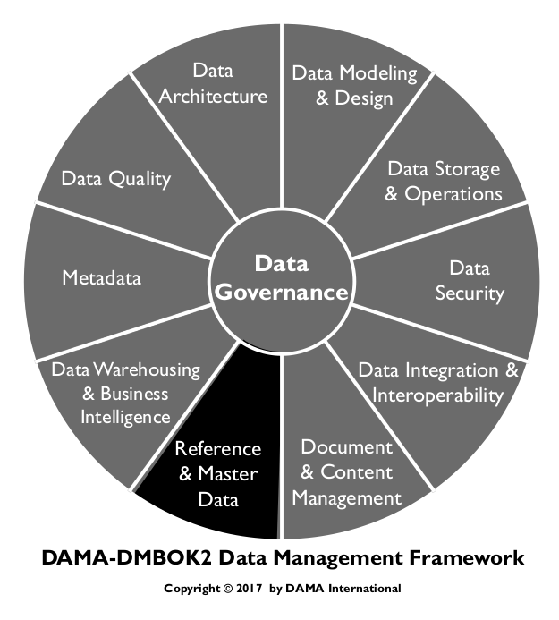
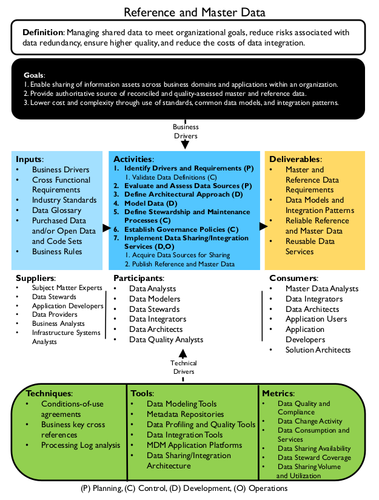
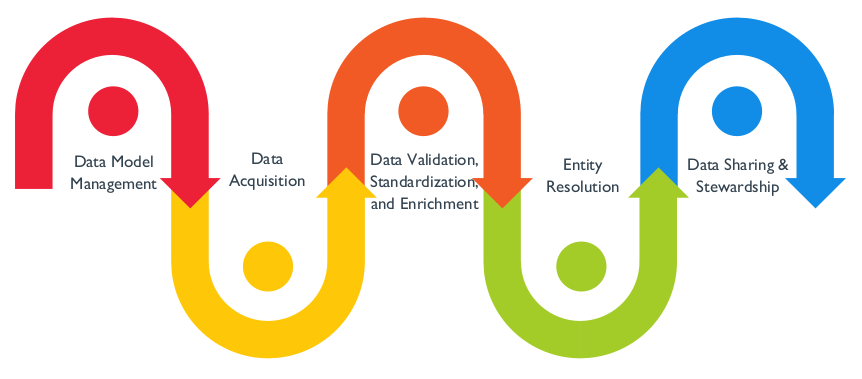
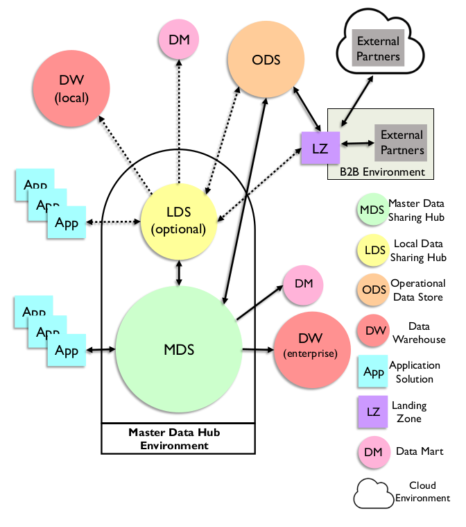

# Reference and Master Data

## 1. Introduction

In any organization, certain data is required across business areas, processes, and systems. The overall organization and its customers benefit if this data is shared and all business units can access the same customer lists, geographic location codes, business unit lists, delivery options, part lists, accounting cost center codes, governmental tax codes, and other data used to run the business. People using data generally assume a level of consistency exists across the organization, until they see disparate data.

In most organizations, systems and data evolve more organically than data management professionals would like. Particularly in large organizations, various projects and initiatives, mergers and acquisitions, and other business activities result in multiple systems executing essentially the same functions, isolated from each other. These conditions inevitably lead to inconsistencies in data structure and data values between systems. This variability increases costs and risks. Both can be reduced through the management of Master Data and Reference Data.

Figure 75 Context Diagram: Reference and Master Data

### 1.1 Business Drivers

The most common drivers for initiating a Master Data Management program are:

* **Meeting organizational data requirements:** Multiple areas within an organization need access to the same data sets, with the confidence that the data sets are complete, current, and consistent. Master Data often form the basis of these data sets (e.g., determining whether an analysis includes all customers depends on having a consistently applied definition of a customer).
* **Managing data quality:** Data inconsistencies, quality issues, and gaps, lead to incorrect decisions or lost opportunities; Master Data Management reduces these risks by enabling a consistent representation of the entities critical to the organization.
* **Managing the costs of data integration:** The cost of integrating new data sources into an already complex environment are higher in the absence of Master Data, which reduces variation in how critical entities are defined and identified.
* **Reducing risk:** Master Data can enable simplification of data sharing architecture to reduce costs and risk associated with a complex environment.

The drivers for managing Reference Data are similar. Centrally managed Reference Data enables organizations
to:

* Meet data requirements for multiple initiatives and reduce the risks and costs of data integration through use of consistent Reference Data
* Manage the quality of Reference Data

While data-driven organizational initiatives focus on transactional data (increasing sales or market share, reducing costs, demonstrating compliance), the ability to leverage such transactional data is highly dependent on the availability and quality of Reference and Master Data. Improving the availability and quality of Reference and Master Data has a dramatic impact on overall quality of the data and business confidence in data. These processes have additional benefits to an organization, including simplification of IT landscape, improved efficiency and productivity, and with these, the potential to improve the customer experience.

### 1.2 Goals and Principles

The goals of a Reference and Master Data Management program include:

* Ensuring the organization has complete, consistent, current, authoritative Master and Reference Data across organizational processes
* Enabling Master and Reference Data to be shared across enterprise functions and applications
* Lowering the cost and reducing the complexity of data usage and integration through standards, common data models, and integration patterns

Reference and Master Data Management follow these guiding principles:

* **Shared Data:** Reference and Master Data must be managed so that they are shareable across the organization.
* **Ownership:** Reference and Master Data belong to the organization, not to a particular application or department. Because they are widely shared, they require a high level of stewardship.
* **Quality:** Reference and Master Data Management require ongoing Data Quality monitoring and governance.
* **Stewardship:** Business Data Stewards are accountable for controlling and ensuring the quality of Reference Data.
* **Controlled Change:**
  * At a given point of time, Master Data values should represent the organization’s best understanding of what is accurate and current. Matching rules that change values should be applied with caution and oversight. Any identifier merged or split should be reversible.
  * Changes to Reference Data values should follow a defined process; changes should be approved and communicated before they are implemented.
* **Authority:** Master Data values should be replicated only from the system of record. A system of reference may be required to enable sharing of Master Data across an organization.

### 1.3 Essential Concepts

#### 1.3.1 Differences Between Master and Reference Data

Different types of data play different roles within an organization. They also have different management requirements. A distinction is often made between Transaction and Master Data, as well as between Master Data and Reference Data. Malcolm Chisholm has proposed a six-layer taxonomy of data that includes Metadata, Reference Data, enterprise structure data, transaction structure data, transaction activity data, and transaction audit data (Chisholm, 2008; Talburt and Zhou, 2015). Within this taxonomy, he defines Master Data as an aggregation of Reference Data, enterprise structure data, and transaction structure data:

* Reference Data, for example, code and description tables, is data that is used solely to characterize other data in an organization, or solely to relate data in a database to information beyond the boundaries of the organization.
* Enterprise Structure Data, for example, a chart of accounts, enables reporting of business activity by business responsibility.
* Transaction Structure Data, for example customer identifiers, describes the things must be present for a transaction to occur: products, customers, vendors.

Chisholm’s definition distinguishes Master Data from transaction activity data that records details about transactions, and from transaction audit data that describes the state of transactions, as well as from Metadata, which describes other data (Chisholm, 2008). In this respect, Chisholm’s definition is similar to the DAMA Dictionary’s definition: Master Data is “the data that provides the context for business activity data in the form of common and abstract concepts that relate to the activity. It includes the details (definitions and identifiers) of internal and external objects involved in business transactions, such as customers, products, employees, vendors, and controlled domains (code values)” (DAMA, 2009).

Many people understand Master Data to include both transaction structure data and enterprise structure data. David Loshin’s definition of Master Data aligns largely with these types. He describes Master Data objects as core business objects used in different applications across an organization, along with their associated Metadata, attributes, definitions, roles, connections, and taxonomies. Master Data objects represent those ‘things’ that matter most to an organization – those that are logged in transactions, reported on, measured, analyzed (Loshin, 2008).

Master Data requires identifying and / or developing a trusted version of truth for each instance of conceptual entities such as product, place, account, person, or organization and maintaining the currency of that version. The primary challenge with Master Data is entity resolution (also called identity management), the process of discerning and managing associations between data from different systems and processes. The entity instances represented by Master Data rows will be represented differently across systems. Master Data Management works to resolve these differences in order to consistently identify individual entity instances (i.e., specific customers, products, etc.) in different contexts. This process must also be managed over time, so that the identifiers for these Master Data entity instances remain consistent. [^56]

Reference Data and Master Data share conceptually similar purposes. Both provide context critical to the creation and use of transactional data. (Reference Data also provides context for Master Data.) They enable data to be meaningfully understood. Importantly, both are shared resources that should be managed at the enterprise level. Having multiple instances of the same Reference Data is inefficient and inevitably leads to inconsistency between them. Inconsistency leads to ambiguity, and ambiguity introduces risk to an organization. A successful Reference Data or Master Data Management program involves the full range of data management functions (Data Governance, Data Quality, Metadata Management, Data Integration, etc.).

Reference Data also has characteristics that distinguish it from other kinds of Master Data (e.g., enterprise and transactional structure data). It is less volatile. Reference Data sets are generally less complex and smaller than either Transactional or Master Data sets. They have fewer columns and fewer rows. The challenges of entity resolution are not part of Reference Data Management.

The focus of data management differs between Reference and Master Data:

* Master Data Management (MDM) entails control over Master Data values and identifiers that enable consistent use, across systems, of the most accurate and timely data about essential business entities. The goals of MDM include ensuring availability of accurate, current values while reducing risks associated with ambiguous identifiers (those identified with more than one instance of an entity and those that refer to more than one entity).
* Reference Data Management (RDM) entails control over defined domain values and their definitions. The goal of RDM is to ensure the organization has access to a complete set of accurate and current values for each concept represented.

One challenge of Reference Data Management is that of ownership or responsibility for definition and maintenance. Some Reference Data originates outside of the organizations that use it. Some crosses internal organizational boundaries and may not be owned by a single department. Other Reference Data may be created and maintained within a department but have potential value elsewhere in an organization. Determining responsibility for obtaining data and managing updates is part of RDM. Lack of accountability introduces risk, as differences in Reference Data may cause misunderstanding of data context (as when two business units have different values to classify the same concept).

Because Master and Reference Data provide context for transactions, they shape the Transaction data entering an organization during operations (for example, in CRM and ERP systems). They also frame analysis performed on Transaction Data.

#### 1.3.2 Reference Data

As noted, Reference Data is any data used to characterize or classify other data, or to relate data to information external to an organization (Chisholm, 2001). The most basic Reference Data consists of codes and descriptions, but some Reference Data can be more complex and incorporate mappings and hierarchies. Reference Data exists in virtually every data store. Classifications and categories may include statuses or types (e.g., Order Status: New, In Progress, Closed, Cancelled). External information may include geographic or standards information (e.g., Country Code: DE, US, TR).

Reference Data may be stored in different ways to meet the different needs. For example, data integration (e.g., data mappings for standardization or data quality checks), or other application functionality (e.g., synonym rings to enable search and discovery). It may also have device specific user interface considerations (e.g., multiple languages). Common storage techniques use:

* Code tables in relational databases, linked via foreign keys to other tables to maintain referential integrity functions within the database management system
* Reference Data Management systems that maintain business entities, allowed, future-state, or deprecated values, and term mapping rules to support broader application and data integration use
* Object attribute specific Metadata to specify permissible values with a focus on API or user interface access

Reference Data Management entails control and maintenance of defined domain values, definitions, and the relationships within and across domain values. The goal of Reference Data Management is to ensure values are consistent and current across different functions and that the data is accessible to the organization. Like other data, Reference Data requires Metadata. An important Metadata attribute for Reference Data includes its source. For example, the governing body for industry standard Reference Data.

##### 1.3.2.1 Reference Data Structure

Depending on the granularity and complexity of what the Reference Data represents, it may be structured as a simple list, a cross-reference, or a taxonomy. The ability to use and maintain Reference Data should be accounted for when structuring it within a database or a Reference Data Management system.

###### 1.3.2.1.1 Lists

The simplest form of Reference Data pairs a code value with a description in a list, such as in Table 17. The code value is the primary identifier, the short form reference value that appears in other contexts. The description states what the code represents. The description may be displayed in place of the code on screens, pages, drop-down lists, and reports. Note that in this example, the code value for United Kingdom is GB according to international standards, and not UK, even though UK is a common short form used in many forms of communication. Balance between standards compliance and usability when defining Reference Data requirements.

Table 17 Simple Reference List

<table>
  <thead>
    <tr>
      <th>Code Value</th>
      <th>Description</th>
    </tr>
  </thead>
  <tbody>
    <tr>
      <td>US</td>
      <td>United States of America</td>
    </tr>
    <tr>
      <td>GB</td>
      <td>United Kingdom (Great Britain)</td>
    </tr>
  </tbody>
</table>

Depending on the content and complexity of the Reference Data, additional attributes may be required to define the meaning of the code. Definitions provide information that the label alone does not provide. Definitions rarely appear on reports or drop-down lists. However, they do appear in places like Help functions for applications, which guide the appropriate use of codes in context.

Lists, like any Reference Data, must meet the requirements of data consumers, including requirements for the appropriate level of detail. If a list of values is intended to support data classification by casual users, a highly detailed list will likely cause data quality issues and adoption challenges. Similarly, a list of values that is too generic would prevent knowledge workers from capturing sufficient level of detail. To accommodate such cases, it is better to maintain distinct lists that are related vs. attempting to have a single list that is the standard for all user communities. Table 18 provides an example related to status codes for help desk tickets. Without the information provided by the definition, ticket status would be ambiguous to anyone unfamiliar with the system. This differentiation is especially necessary for classifications driving performance metrics or other Business Intelligence analytics.

Table 18 Simple Reference List Expanded

<table>
  <thead>
    <tr>
      <th>Code</th>
      <th>Description</th>
      <th>Definition</th>
    </tr>
  </thead>
  <tbody>
    <tr>
      <td>1</td>
      <td>New</td>
      <td>Indicates a newly created ticket without an assigned resource</td>
    </tr>
    <tr>
      <td>2</td>
      <td>Assigned</td>
      <td>Indicates a ticket that has a named resource assigned</td>
    </tr>
    <tr>
      <td>3</td>
      <td>Work In Progress</td>
      <td>Indicates the assigned resource started working on the ticket</td>
    </tr>
    <tr>
      <td>4</td>
      <td>Resolved</td>
      <td>Indicates request is assumed to be fulfilled per the assigned resource</td>
    </tr>
    <tr>
      <td>5</td>
      <td>Cancelled</td>
      <td>Indicates request was cancelled based on requester interaction</td>
    </tr>
    <tr>
      <td>6</td>
      <td>Pending</td>
      <td>Indicates request cannot proceed without additional information</td>
    </tr>
    <tr>
      <td>7</td>
      <td>Fulfilled</td>
      <td>Indicates request was fulfilled and verified by the requester</td>
    </tr>
  </tbody>
</table>

###### 1.3.2.1.2 Cross-Reference Lists

Different applications may use different code sets to represent the same concept. These code sets may be at different granularities or the same granularity with different values. Cross-reference data sets translate between codes values. Table 19 presents a US State Code cross-reference (an example of multiple representations at the same level of grain). The US Postal Service State Codes are two character alpha codes. FIPS uses a numeric to express the same concept. The ISO State Code also includes a reference to the country.

Table 19 Cross-Reference List

<table>
  <thead>
    <tr>
      <th>USPS State Code</th>
      <th>ISO State Code</th>
      <th>FIPS Numeric State Code</th>
      <th>State Abbreviation</th>
      <th>State Name</th>
      <th>Formal State Name</th>
    </tr>
  </thead>
  <tbody>
    <tr>
      <td>CA</td>
      <td>US-CA</td>
      <td>06</td>
      <td>Calif.</td>
      <td>California</td>
      <td>State of California</td>
    </tr>
    <tr>
      <td>KY</td>
      <td>US-KY</td>
      <td>21</td>
      <td>Ky.</td>
      <td>Kentucky</td>
      <td>Commonwealth of Kentucky</td>
    </tr>
    <tr>
      <td>WI</td>
      <td>US-WI</td>
      <td>55</td>
      <td>Wis.</td>
      <td>Wisconsin</td>
      <td>State of Wisconsin</td>
    </tr>
  </tbody>
</table>

Language requirements may affect Reference Data structure. Multi-language lists are a specific instance of a cross-reference list. While code lists provide a standard, machine-readable format, language-specific glossaries provide usable content. Table 20 provides an example from the ISO 3166 standard. There are different ways to handle multi-language lists depending on how many languages and character sets are involved. Lists do not need to be normalized to be effective. The denormalized structure makes it somewhat easier to comprehend the relationships.

Table 20 Multi-Language Reference List

<table>
  <thead>
    <tr>
      <th>ISO 3166-1 Alpha 2 Country Code</th>
      <th>English Name</th>
      <th>Local Name</th>
      <th>Local Name Local Alphabet</th>
      <th>French Name</th>
    </tr>
  </thead>
  <tbody>
    <tr>
      <td>CN</td>
      <td>China</td>
      <td>Zhong Guo</td>
      <td>中国/中國</td>
      <td>Chine</td>
    </tr>
  </tbody>
</table>

###### 1.3.2.1.3 Taxonomies

Taxonomic Reference Data structures capture information at different levels of specificity. For example, a US ZIP Code may be a meaningful category itself, and it exists within a town, a county, and a state. These relationships can be expressed within reference table and multiple levels of analysis could be done using ZIP code as a driver.

Taxonomies enable content classification and multi-faceted navigation to support Business Intelligence. Taxonomic Reference Data can be stored in a recursive relationship. Taxonomy management tools also maintain hierarchical information. Table 21 and Table 22 show examples of two common hierarchical taxonomies. In both cases, the hierarchy includes a code, description, and a reference to a parent code that classifies the individual codes. For example, in Table 21, Floral plants (10161600) is a parent code to Roses, Poinsettias, and Orchids. In Table 22, Retail Trade (440000) is the parent to Food and Beverage Stores (445000), which is the parent to Specialty Food Stores (445200).

Table 21 UNSPSC (Universal Standard Products and Services Classification) [^57]

<table>
  <thead>
    <tr>
      <th>Code Value</th>
      <th>Description</th>
      <th>Parent Code</th>
    </tr>
  </thead>
  <tbody>
    <tr>
      <td>10161600</td>
      <td>Floral plants</td>
      <td>10160000</td>
    </tr>
    <tr>
      <td>10161601</td>
      <td>Rose plants</td>
      <td>10161600</td>
    </tr>
    <tr>
      <td>10161602</td>
      <td>Poinsettias plants</td>
      <td>10161600</td>
    </tr>
    <tr>
      <td>10161603</td>
      <td>Orchid plants</td>
      <td>10161600</td>
    </tr>
    <tr>
      <td>10161700</td>
      <td>Cut flowers</td>
      <td>10160000</td>
    </tr>
    <tr>
      <td>10161705</td>
      <td>Cut roses</td>
      <td>10161700</td>
    </tr>
  </tbody>
</table>

Table 22 NAICS (North America Industry Classification System) [^58]

<table>
  <thead>
    <tr>
      <th>Code Value</th>
      <th>Description</th>
      <th>Parent Code</th>
    </tr>
  </thead>
  <tbody>
    <tr>
      <td>440000</td>
      <td>Retail Trade</td>
      <td>440000</td>
    </tr>
    <tr>
      <td>445000</td>
      <td>Food and Beverage Stores</td>
      <td>440000</td>
    </tr>
    <tr>
      <td>445200</td>
      <td>Specialty Food Stores</td>
      <td>445000</td>
    </tr>
    <tr>
      <td>445210</td>
      <td>Meat Markets</td>
      <td>445200</td>
    </tr>
    <tr>
      <td>445220</td>
      <td>Fish and Seafood Markets</td>
      <td>445200</td>
    </tr>
    <tr>
      <td>445290</td>
      <td>Other Specialty Food Stores</td>
      <td>445200</td>
    </tr>
    <tr>
      <td>445291</td>
      <td>Baked Goods Stores</td>
      <td>445290</td>
    </tr>
    <tr>
      <td>445292</td>
      <td>Confectionary and Nut Stores</td>
      <td>445290</td>
    </tr>
  </tbody>
</table>

###### 1.3.2.1.4 Ontologies

Some organizations include ontologies used to manage website content as part of Reference Data. They fit this category in that they are used to characterize other data or to relate organizational data to information beyond the boundaries of the organization. Ontologies can also be understood as a form of Metadata. Ontologies and other complex taxonomies need to be managed in ways similar to how Reference Data is managed. Values need to be complete, current, and clearly defined. Best practices for maintaining ontologies are similar to those for Reference Data Management. One of the primary use cases for ontologies is content management. They are described in more detail in Chapter 9.

##### 1.3.2.2 Proprietary or Internal Reference Data

Many organizations create Reference Data to support internal processes and applications. Often this proprietary reference data often grows organically over time. Part of RDM includes managing these data sets and, ideally, creating consistency between them, where this consistency serves the organization. For example, if different business units use different terms to describe the status of an account, then it is difficult for anyone in the organization to determine overall number of clients it serves at a point in time. In helping manage internal Reference Data sets, Data Stewards must balance between the need to have common words for the same information and the need for flexibility where processes differ from one another.

##### 1.3.2.3 Industry Reference Data

Industry Reference Data is a broad term to describe data sets that are created and maintained by industry associations or government bodies, rather than by individual organizations, in order to provide a common standard for codifying important concepts. This codification leads to a common way to understand data, and is a prerequisite for data sharing and interoperability. For example, the International Classification of Diseases (ICD) codes provide a common way to classify health conditions (diagnoses) and treatments (procedures) and thus to have a consistent approach to delivering health care and understanding outcomes. If every doctor and hospital creates their own code set for diseases, it would be virtually impossible to understand trends and patterns.

Industry Reference Data is produced and maintained external to the organizations that use it, but it is required to understand transactions within those organizations. It may be needed to support specific Data Quality Management efforts (e.g., third party business directories), business calculations (e.g., foreign exchange rates), or business data augmentation (e.g., marketing data). These data sets vary widely, depending on the industry and the individual code set. (See Chapter 10.)

##### 1.3.2.4 Geographic or Geo-statistical Data

Geographic or geo-statistical reference enables classification or analysis based on geography. For example, census bureau reports describe population density and demographic shifts that support market planning and research. Weather history mapped to strict geographic classification can support inventory management and promotional planning.

#### 1.3.2.5 Computational Reference Data

Many business activities rely on access to common, consistent calculations. For example, foreign exchange calculations rely on managed, time stamped exchange value tables. Computational Reference Data differs from other types because of the frequency with which it changes. Many organizations purchase this kind of data from third parties who ensure that it is complete and accurate. Attempting to maintain this data internally is likely to be fraught with latency issues.

##### 1.3.2.6 Standard Reference Data Set Metadata

Reference Data, like other data, can change over time. Given its prevalence within any organization, it is important to maintain key Metadata about Reference Data sets to ensure their lineage and currency are understood and maintained. Table 23 provides examples of this Metadata.

Table 23 Critical Reference Data Metadata Attributes

<table>
  <thead>
    <tr>
      <th>Reference Data Set Key Information</th>
      <th>Description</th>
    </tr>
  </thead>
  <tbody>
    <tr>
      <td>Formal Name</td>
      <td>
        Official, especially if external name of the Reference Data set (e.g., ISO 3166-1991 Country Code List)
      </td>
    </tr>
    <tr>
      <td>Internal Name</td>
      <td>
        Name associated with the data set within the organization (e.g., Country Codes – ISO)
      </td>
    </tr>
    <tr>
      <td>Data Provider</td>
      <td>
        The party that provides and maintains the Reference Data set. This can be external (ISO), internal (a specific department), or external – extended (obtained from an external party but then extended and modified internally).
      </td>
    </tr>
    <tr>
      <td>Data Provider Data Set Source</td>
      <td>
        Description of where data provider’s data sets can be obtained. This is likely a Universal Resource Identifier (URI) within or outside of the enterprise network.
      </td>
    </tr>
    <tr>
      <td>Data Provider Latest Version Number</td>
      <td>
        If available and maintained, this describes the latest version of the external data provider’s data set where information may be added or deprecated from the version in the organization
      </td>
    </tr>
    <tr>
      <td>Data Provider Latest Version Date</td>
      <td>
        If available and maintained, this describes when the standard list was last updated
      </td>
    </tr>
    <tr>
      <td>Internal Version Number</td>
      <td>
        Version number of the current Reference Data set or version number of the last update that was applied against the data set
      </td>
    </tr>
    <tr>
      <td>Internal Version Reconciliation Date</td>
      <td>
        Date when data set was last updated based on the external source
      </td>
    </tr>
    <tr>
      <td>Internal Version Last Update Date</td>
      <td>
        Date data set was last changed. This does not mean reconciliation with an external version.
      </td>
    </tr>
  </tbody>
</table>

#### 1.3.3 Master Data

Master Data is data about the business entities (e.g., employees, customers, products, financial structures, assets, and locations) that provide context for business transactions and analysis. An entity is a real world object (person, organization, place, or thing). Entities are represented by entity instances, in the form of data / records.

Master Data should represent the authoritative, most accurate data available about key business entities. When managed well, Master Data values are trusted and can be used with confidence.

Business rules typically dictate the format and allowable ranges of Master Data values. Common organizational Master Data includes data about:

* Parties, made up of individuals and organizations, and their roles, such as customers, citizens, patients, vendors, suppliers, agents, business partners, competitors, employees, or students
* Products and Services, both internal and external
* Financial structures, such as contracts, general ledger accounts, cost centers, or profit centers
* Locations, such as addresses and GPS coordinates

##### 1.3.3.1 System of Record, System of Reference

When there are potentially different versions of ‘the truth’, it is necessary to distinguish between them. In order to do so, one must know where data originates or is accessed, and which data has been prepared for particular uses. A System of Record is an authoritative system where data is created/captured, and/or maintained through a defined set of rules and expectations (e.g., an ERP system may be the System of Record for sell-to customers). A System of Reference is an authoritative system where data consumers can obtain reliable data to support transactions and analysis, even if the information did not originate in the system of reference. MDM applications, Data Sharing Hubs, and Data Warehouses often serve as systems of reference.

##### 1.3.3.2 Trusted Source, Golden Record

A Trusted Source is recognized as the ‘best version of the truth’ based on a combination of automated rules and manual stewardship of data content. A trusted source may also be referred to as a Single View, 360° View. Any

MDM system should be managed so that it is a trusted source. Within a trusted source, records that represent the most accurate data about entity instances can be referred to as Golden Records. The term Golden Record can be misleading. Tech Target defines a Golden Record as “the ‘single version of the truth’, where ‘truth’ is understood to mean the reference to which data users can turn when they want to ensure that they have the correct version of a piece of information. The golden record encompasses all the data in every system of record (SOR) within a particular organization.” [^59]

However, the two parts of this definition bring the concept into question, as data in different systems may not align into ‘a single version of the truth’.

Within any Master Data effort, the merging/resolution of data from multiple sources into a ‘Golden Record’ does not mean that it is always a 100% complete and 100% accurate representation of all the entities within the

organization (especially in organizations that have multiple SOR’s supplying data to the Master Data environment). Promising that data is ‘Golden’ when it is not can undermine the confidence of data consumers. This is why some prefer the term Trusted Source to refer to the “best version we have” of the Master Data. Doing so puts the emphasis on how data is defined and managed to get to a best version. It also helps different data consumers see the component pieces of the ‘single version’ that are important to them. Finance and Actuarial areas often have a different perspective of ‘single version’ of Customer than does the Marketing area. The Trusted Source provides multiple perspectives of business entities as identified and defined by Data Stewards.

##### 1.3.3.3 Master Data Management

As described in the chapter introduction, Master Data Management entails control over Master Data values and identifiers that enable consistent use, across systems, of the most accurate and timely data about essential business entities. The goals include ensuring availability of accurate, current values while reducing the risk of ambiguous identifiers.

Gartner defines Master Data Management as “a technology-enabled discipline in which business and IT work together to ensure the uniformity, accuracy, stewardship, semantic consistency, and accountability of the enterprise’s official shared Master Data assets. Master Data is the consistent and uniform set of identifiers and extended attributes that describes the core entities of the enterprise including customers, prospects, citizens, suppliers, sites, hierarchies, and chart of accounts.” [^60]

Gartner’s definition stresses that MDM is a discipline, made up of people, processes, and technology. It is not a specific application solution. Unfortunately, the acronym MDM (Master Data Management) is often used to refer to systems or products used to manage Master Data. 61 MDM applications can facilitate the methods, and sometimes quite effectively, but using an MDM application does not guarantee that Master Data is being managed to meet the organizational needs.

Assessing an organization’s MDM requirements includes identifying:

* Which roles, organizations, places, and things are referenced repeatedly
* What data is used to describe people, organizations, places, and things
* How the data is defined and structured, including the granularity of the data
* Where the data is created/sourced, stored, made available, and accessed
* How the data changes as it moves through systems within the organization
* Who uses the data and for what purposes
* What criteria are used to understand the quality and reliability of the data and its sources

Master Data Management is challenging. It illustrates a fundamental challenge with data: People choose different ways to represent similar concepts and reconciliation between these representations is not always straightforward; as importantly, information changes over time and systematically accounting for these changes takes planning, data knowledge, and technical skills. In short, it takes work.

Any organization that has recognized the need for MDM probably already has a complex system landscape, with multiple ways of capturing and storing references to real world entities. Because of both organic growth over time or from mergers and acquisitions, the systems that provided input to the MDM process may have different definitions of the entities themselves and very likely have different standards for Data Quality. Because of this complexity, it is best to approach Master Data Management one data domain at a time. Start small, with a handful of attributes, and build out over time.

Planning for Master Data Management includes several basic steps. Within a domain:

* Identify candidate sources that will provide a comprehensive view of the Master Data entities
* Develop rules for accurately matching and merging entity instances
* Establish an approach to identify and restore inappropriately matched and merged data
* Establish an approach to distribute trusted data to systems across the enterprise

Executing the process, though, is not as simple as these steps imply, as MDM is a lifecycle management process. Activities critical to the lifecycle include:

* Establishing the context of Master Data entities, including definitions of associated attributes and the conditions of their use. This process requires governance.
* Identifying multiple instances of the same entity represented within and across data sources; building and maintaining identifiers and cross-references to enable information integration.
* Reconciling and consolidating data across sources to provide a master record or the best version of the truth. Consolidated records provide a merged view of information across systems and seek to address attribute naming and data value inconsistencies.
* Identifying improperly matched or merged instances and ensuring they are resolved and correctly associated with identifiers.
* Provisioning of access to trusted data across applications, either through direct reads, data services, or by replication feeds to transactional, warehousing or analytical data stores.
* Enforcing the use of Master Data values within the organization. This process also requires governance and change management to assure a shared enterprise perspective.

##### 1.3.3.4 Master Data Management Key Processing Steps

Key processing steps for MDM are illustrated in Figure 76. They include data model management; data acquisition; data validation, standardization, and enrichment; entity resolution; and stewardship and sharing. In a comprehensive MDM environment, the logical data model will be physically instantiated in multiple platforms. It guides the implementation of the MDM solution, providing the basis of data integration services. It should guide how applications are configured to take advantage of data reconciliation and data quality verification capabilities.

Figure 76 Key Processing Steps for MDM

###### 1.3.3.4.1 Data Model Management

Master Data work brings to light the importance of clear and consistent logical data definitions. The model should help the organization overcome ‘system speak’. Terms and definitions used within a source system may make sense within the confines of that system but they do not always make sense at an enterprise level. For Master Data, terms and definitions used at an enterprise level should be in context of the business conducted across the organization and not necessarily dependent on the source system contributing data values.

For attributes that make up Master Data, the granularity of the definition and associated data values must also make sense across the organization. Source systems may present the identical attribute name but the data values are in completely different contexts at the enterprise level. Similarly, source systems may present differently named attributes that at the enterprise level coalesce to a single attribute and the data values are in the proper context. Sometimes multiple attributes are presented from a single source and their respective data values are used to derive a single data value for an attribute defined at the enterprise level.

###### 1.3.3.4.2 Data Acquisition

Even within a given source, data representing the same entity instance can look different, as illustrated in Table 24, where there are inconsistencies in how names, addresses, and telephone numbers are presented. This example will be referenced again later in the chapter.

Table 24 Source Data as Received by the MDM System

<table>
  <thead>
    <tr>
      <th>Source ID</th>
      <th>Name</th>
      <th>Address</th>
      <th>Telephone</th>
    </tr>
  </thead>
  <tbody>
    <tr>
      <td>123</td>
      <td>John Smith</td>
      <td>123 Main, Dataland, SQ 98765</td>
      <td></td>
    </tr>
    <tr>
      <td>234</td>
      <td>J. Smith</td>
      <td>123 Main, Dataland, DA</td>
      <td>2345678900</td>
    </tr>
    <tr>
      <td>345</td>
      <td>Jane Smith</td>
      <td>123 Main, Dataland, DA</td>
      <td>234-567-8900</td>
    </tr>
  </tbody>
</table>

Planning for, evaluating, and incorporating new data sources into the Master Data Management solution must be a reliable, repeatable process. Data acquisition activities involve:

* Receiving and responding to new data source acquisition requests
* Performing rapid, ad-hoc, match and high-level data quality assessments using data cleansing and data profiling tools
* Assessing and communicating complexity of data integration to the requesters to help them with their cost-benefit analysis
* Piloting acquisition of data and its impact on match rules
* Finalizing data quality metrics for the new data source
* Determining who will be responsible for monitoring and maintaining the quality of a new source’s data
* Completing integration into the overall data management environment

###### 1.3.3.4.3 Data Validation, Standardization, and Enrichment

To enable entity resolution, data must be made as consistent as possible. This entails, at a minimum, reducing variation in format and reconciling values. Consistent input data reduces the chance or errors in associating records. Preparation processes include:

* Validation: Identifying data prove-ably erroneous or likely incorrect or defaulted (for example, removal of clearly fake email addresses)
* Standardization: Ensuring data content conforms to standard Reference Data values (e.g., country codes), formats (e.g., telephone numbers) or fields (e.g., addresses)
* Enrichment: Adding attributes that can improve entity resolution services (e.g., Dunn and Bradstreet DUNS Number and Ultimate DUNS Number for relating company records, Acxiom or Experian Consumer IDs for individual records)

Table 25 illustrates the results of the cleansing and standardization process on the example from Table 24. Addresses that had had different formats are now recognizably the same. Phone numbers include standard formatting.

Table 25 Standardized and Enriched Input Data

<table>
  <thead>
    <tr>
      <th>Source ID</th>
      <th>Name</th>
      <th>Address (Cleansed)</th>
      <th>Telephone (Cleansed)</th>
    </tr>
  </thead>
  <tbody>
    <tr>
      <td>123</td>
      <td>John Smith</td>
      <td>123 Main, Dataland, SQ 98765</td>
      <td></td>
    </tr>
    <tr>
      <td>234</td>
      <td>J. Smith</td>
      <td>123 Main, Dataland, SQ 98765</td>
      <td>+1 234 567 8900</td>
    </tr>
    <tr>
      <td>345</td>
      <td>Jane Smith</td>
      <td>123 Main, Dataland, SQ 98765</td>
      <td>+1 234 567 8900</td>
    </tr>
  </tbody>
</table>

###### 1.3.3.4.4 Entity Resolution and Identifier Management

Entity resolution is the process of determining whether two references to real world objects refer to the same object or to different objects (Talburt, 2011). Entity resolution is a decision-making process. Models for executing the process differ based on the approach they take to determining similarity between two references. While resolution always takes place between pairs of references, the process can be systematically extended to include large data sets. Entity resolution is critical to MDM, as the process of matching and merging records enables the construction of the Master Data set.

Entity resolution includes a set of activities (reference extraction, reference preparation, reference resolution, identity management, relationship analysis) that enable the identity of entity instances and the relationship between entity instances, to be managed over time. Within the process of reference resolution, two references may be identified as representing the same entity, through the process of determining equivalency. These references can then be linked through a value (a global identifier) that indicates that they are equivalent (Talburt, 2011).

###### 1.3.3.4.4.1 Matching

Matching, or candidate identification, is the process of identifying how different records may relate to a single entity. The risks with this process are:

* False positives: Two references that do not represent the same entity are linked with a single identifier. This results in one identifier that refers to more than one real-world entity instance.
* False negatives: Two references represent the same entity but they are not linked with a single identifier. This results in multiple identifiers that refer to the same real-world entity when each instance is expected to have one-and-only-one identifier.

Both situations are addressed through a process called similarity analysis or matching, in which the degree of similarity between any two records is scored, often based on weighted approximate matching between corresponding attribute values. If the score is above a specified threshold, the two records are considered to represent the same entity (a match). Through similarity analysis, slight variations in data can be recognized and data values can be consolidated. Two basic approaches, which can be used together, are deterministic and probabilistic:

* Deterministic algorithms, like parsing and standardization, rely on defined patterns and rules for assigning weights and scores for determining similarity. Deterministic algorithms are predictable in that the patterns matched and the rules applied will always yield the same results. This type of matching works out-of-the-box with relatively good performance, but it is only as good as the situations anticipated by the people who developed the rules.
* Probabilistic algorithms rely on statistical techniques for assessing the probability that any pair of records represents the same entity. This relies on the ability to take data samples for training purposes by looking at the expected results for a subset of the records and tuning the matcher to self-adjust based on statistical analysis. These matchers are not reliant on rules, so the results may be nondeterministic. However, because the probabilities can be refined based on experience, probabilistic matchers are able to improve their matching precision as more data is analyzed.

###### 1.3.3.4.4.2 Identity Resolution

Some matches occur with great confidence, based on exact data matches across multiple fields. Other matches are suggested with less confidence due to conflicting values. For example:

* If two records share the same last name, first name, birth date, and social security number, but the street address differs, is it safe to assume they refer to the same person who has changed their mailing address?
* If two records share the same social security number, street address, and first name, but the last name differs, is it safe to assume they refer to the same person who has changed their last name? Would the likelihood be increased or decreased based on gender and age?
* How do these examples change if the social security number is unknown for one record? What other identifiers are useful to determine the likelihood of a match? How much confidence is required for the organization to assert a match?

Table 26 illustrates the conclusion of the process for the sample records in Table 24 and Table 25. Here the second two entity instances (Source ID 234 and 345) are determined to represent the same person (Jane Smith), while the first one (Source ID 123) is identified as representing a different person (John Smith).

Table 26 Candidate Identification and Identity Resolution

<table>
  <thead>
    <tr>
      <th>Source ID</th>
      <th>Name</th>
      <th>Address (Cleansed)</th>
      <th>Telephone (Cleansed)</th>
      <th>Candidate ID</th>
      <th>Party ID</th>
    </tr>
  </thead>
  <tbody>
    <tr>
      <td>123</td>
      <td>John Smith</td>
      <td>123 Main, Dataland, SQ 98765</td>
      <td></td>
      <td>XYZ</td>
      <td>1</td>
    </tr>
    <tr>
      <td>234</td>
      <td>J. Smith</td>
      <td>123 Main, Dataland, SQ 98765</td>
      <td>+1 234 567 8900</td>
      <td>XYZ, ABC</td>
      <td>2</td>
    </tr>
    <tr>
      <td>345</td>
      <td>Jane Smith</td>
      <td>123 Main, Dataland, SQ 98765</td>
      <td>+1 234 567 8900</td>
      <td>ABC</td>
      <td>2</td>
    </tr>
  </tbody>
</table>

Despite the best efforts, match decisions sometimes prove to be incorrect. It is essential to maintain the history of matches so that matches can be undone when discovered to be incorrect. Match rate metrics enable organizations to monitor the impact and effectiveness of their matching inference rules. Reprocessing of match rules can help identify better match candidates as new information is received by the entity resolution process.

###### 1.3.3.4.4.3 Matching Workflows / Reconciliation Types

Match rules for different scenarios require different workflows:

* Duplicate identification match rules focus on a specific set of data elements that uniquely identify an entity and identify merge opportunities without taking automatic action. Business Data Stewards can review these occurrences and decide to take action on a case-by-case basis.
* Match-link rules identify and cross-reference records that appear to relate to a master record without updating the content of the cross-referenced record. Match-link rules are easier to implement and much easier to reverse.
* Match-merge rules match records and merge the data from these records into a single, unified, reconciled, and comprehensive record. If the rules apply across data sources, create a single, unique, and comprehensive record in each data store. Minimally, use trusted data from one data store to supplement data in other data stores, replacing missing values or values thought to be inaccurate.

Match-merge rules are complex, and seek to provide the unified, reconciled version of information across multiple records and data sources. The complexity is due to the need to identify which field from which source can be trusted based on a series of rules. The introduction of each new source can change these rules over time. The challenges with match-merge rules include the operational complexity of reconciling the data and the cost of reversing the operation if there is a false merge.

Match-link is a simpler operation, as it acts on the cross-reference registry and not the individual attributes of the merged Master Data record, even though it may be more difficult to present comprehensive information from multiple records.

Periodically re-evaluate match-merge and match-link rules because confidence levels change over time. Many data matching engines provide statistical correlations of data values to help establish confidence levels. (See Chapter 13.)

###### 1.3.3.4.4.4 Master Data ID Management

Managing Master Data involves managing identifiers. There are two types of identifiers that need to be managed across data sources in an MDM environment: Global IDs and Cross-Reference (x-Ref) information.

A Global ID is the MDM solution-assigned and -maintained unique identifier attached to reconciled records. Its purpose is to uniquely identify the entity instance. In the example in Table 26, when multiple records were determined to represent the same entity instance, the value ‘ABC’ was assigned to both as a candidate ID. The records were resolved to the single Party ID of ‘2’.

Global IDs should be generated by only one authorized solution, regardless of which technology is performing Master Data integration activities, to avoid any risk of duplicate values. Global IDs can be numbers or GUIDs (Global Unique Identifiers), as long as uniqueness can be maintained. The key complexity that needs to be handled for Global ID generation is to how to maintain the right global ID (to perform appropriate downstream data updates) due to an unmerge-remerge. X-Ref Management is management of the relationship between source IDs and the Global ID. X-Ref management should include capabilities to maintain history of such mappings to support match rate metrics, and to expose lookup services to enable data integration.

###### 1.3.3.4.4.5 Affiliation Management

Affiliation Management is establishing and maintaining relationships between Master Data records of entities that have real-world relationships. Examples include ownership affiliations (e.g., Company X is a subsidiary of Company Y, a parent-child relationship) or other associations (e.g., Person XYZ works at Company X).

Data architecture design of an MDM solution must resolve whether to leverage parent-child relationships, affiliation relationships, or both for a given entity.

* Affiliation relationships provide the greatest flexibility through programming logic. The relationships type can be used to expose such data in a parent-child hierarchy. Many downstream solutions, such as reporting or account navigation tools would want to see a hierarchical view of the information.
* Parent-Child relationships require less programming logic as the navigation structure is implied. However, if the relationship changes and there isn’t an available affiliation structure, this may influence the quality of the data and Business Intelligence dimensions.

###### 1.3.3.4.5 Data Sharing and Stewardship

Although much of the work of Master Data Management can be automated through tools that enable processing of large numbers of records, it still requires stewardship to resolve situations where data is incorrectly matched. Ideally, lessons learned from the stewardship process can be used to improve matching algorithms and reduce instances of manual work. (See Chapters 3 and 8.)

##### 1.3.3.5 Party Master Data

Party Master Data includes data about individuals, organizations, and the roles they play in business relationships. In the commercial environment, parties include customers, employees, vendors, partners, and competitors. In the public sector, parties are usually citizens. Law enforcement focuses on suspects, witnesses, and victims. Not-for-profit organizations focus on members and donors. While in healthcare, the focus is on patients and providers; in education, it is on students and faculty.

Customer Relationship Management (CRM) systems manage Master Data about customers. The goal of CRM is to provide complete and accurate information about each and every customer.

An essential aspect of CRM is identifying duplicate, redundant, or conflicting data from different systems and determining whether the data represents one or more than one customer. CRM must be able to resolve conflicting values, reconcile differences, and accurately represent current knowledge of the customer. This process requires robust rules as well as knowledge of the structure, granularity, lineage, and quality of data sources.

Specialized MDM systems perform similar functions for individuals, organizations and their roles, employees, and vendors. Regardless of industry or focus, managing business party Master Data poses unique challenges:

* The complexity of roles and relationships played by individuals and organizations
* Difficulties in unique identification
* The number of data sources and the differences between them
* The multiple mobile and social communications channels
* The importance of the data
* The expectations of how customers want to be engaged

Master Data is particularly challenging for parties playing multiple roles across an organization (e.g., an employee who is also a customer) and utilizing differing points of contact or engagement methods (e.g., interaction via mobile device application that is tied to a social media site).

##### 1.3.3.6 Financial Master Data

Financial Master Data includes data about business units, cost centers, profit centers, general ledger accounts, budgets, projections, and projects. Typically, an Enterprise Resource Planning (ERP) system serves as the central hub for financial Master Data (chart of accounts), with project details and transactions created and maintained in one or more spoke applications. This is especially common in organizations with distributed back-office functions.

Financial Master Data solutions not only create, maintain, and share information; many can also simulate how changes to existing financial data may affect the organization’s bottom line. Financial Master Data simulations are often part of Business Intelligence reporting, analysis, and planning modules, as well as more straightforward budgeting and projecting. Through these applications, versions of financial structures can be modeled to understand potential financial impacts. Once a decision is made, the agreed upon structural changes can be disseminated to all appropriate systems.

##### 1.3.3.7 Legal Master Data

Legal Master Data includes data about contracts, regulations, and other legal matters. Legal Master Data allows analysis of contracts for different entities providing the same products or services, to enable better negotiation or to combine contracts into Master Agreements.

##### 1.3.3.8 Product Master Data

Product Master Data can focus on an organization’s internal products and services or on industry-wide (including competitor) products and services. Different types of product Master Data solutions support different business functions.

* Product Lifecycle Management (PLM) focuses on managing the lifecycle of a product or service from conception, through development, manufacturing, sale / delivery, service, and disposal. Organizations implement PLM systems to reduce time to market. In industries with long product development cycles (as much as 8 to 12 years in the pharmaceutical industry), PLM systems enable organizations to track cross-process cost and legal agreements as product concepts evolve from ideas to potential products under different names and potentially different licensing agreements.
* Product Data Management (PDM) supports engineering and manufacturing functions by capturing and enabling secure sharing of product information such as design documents (e.g., CAD drawings), recipes (manufacturing instructions), standard operating procedures, and bills of materials. PDM functionality can be enabled through specialized systems or ERP applications.
* Product data in Enterprise Resource Planning (ERP) systems focuses on SKUs to support order entry down to inventory level, where individual units can be identified through a variety of techniques.
* Product data in Manufacturing Execution Systems (MES) focus on raw inventory, semi-finished goods, and finished goods, where finished goods tie to products that can be stored and ordered through the ERP system. This data is also important across the supply chain and logistics systems.
* Product data in a Customer Relationship Management (CRM) system that supports marketing, sales, and support interactions can include product family and brands, sales rep association, and customer territory management, as well as marketing campaigns.

Many product masters closely tie to Reference Data Management systems.

##### 1.3.3.9 Location Master Data

Location Master Data provides the ability to track and share geographic information and to create hierarchical relationships or territories based on geographic information. The distinction between reference and Master Data blurs for location data. Here is the difference:

* Location Reference Data typically includes geopolitical data, such as countries, states or provinces, counties, cities or towns, postal codes, and geographic positioning coordinates, such as latitude, longitude, and altitude. This data rarely changes, and changes are handled by external organizations. Location Reference Data may also include geographic regions and sales territories as defined by the organization.
* Location Master Data includes business party addresses and business party location, as well as facility addresses for locations owned by the organization. As organizations grow or contract, these addresses change more frequently than other Location Reference Data.

Different industries require specialized earth science data (geographic data about seismic faults, flood plains, soil, annual rainfall, and severe weather risk areas) and related sociological data (population, ethnicity, income, and terrorism risk), usually supplied from external sources.

#### 1.3.3.10 Industry Master Data – Reference Directories

Reference Directories are authoritative listings of Master Data entities (companies, people, products, etc.) that organizations can purchase and use as the basis of their transactions. While reference directories are created by external organizations, a managed and reconciled version of the information is maintained in the organization’s own systems.

Examples of licensed reference directories include Dun and Bradstreet’s (D&B) Company Directory of worldwide Company Headquarters, Subsidiaries, and Branch locations, and the American Medical Association’s Prescriber Database.

Reference directories enable Master Data use by:

* Providing a starting point for matching and linking new records. For example, in an environment with five data sources, each source can be compared against the directory (5 comparison points) vs. against each other (10 comparison points).
* Providing additional data elements that may not be as easily available at the time of record creation (e.g., for a physician, this may include medical license status; for a company, this may include a six digit NAICS industry classification).

As an organization’s records match and reconcile with the reference directories, the trusted record will deviate from the reference directory with traceability to other source records, contributing attributes, and transformation rules.

#### 1.3.4 Data Sharing Architecture

There are several basic architectural approaches to reference and Master Data integration. Each Master Data subject area will likely have its own system of record. For example, the human resource system usually serves as the system of record for employee data. A CRM system might serve as the system of record for customer data, while an ERP system might serve as the system of record for financial and product data.

The data sharing hub architecture model shown in Figure 77 represents a hub-and-spoke architecture for Master Data. The Master Data hub can handle interactions with spoke items such as source systems, business applications, and data stores while minimizing the number of integration points. A local data hub can extend and scale the Master Data hub. (See Chapter 8.)

Each of the three basic approaches to implementing a Master Data hub environment has pros and cons:

* A Registry is an index that points to Master Data in the various systems of record. The systems of record manage Master Data local to their applications. Access to Master Data comes from the master index. A registry is relatively easy to implement because it requires few changes in the systems of record. But often, complex queries are required to assemble Master Data from multiple systems. Moreover, multiple business rules need to be implemented to address semantic differences across systems in multiple places.
* In a Transaction Hub, applications interface with the hub to access and update Master Data. The Master Data exists within the Transaction Hub and not within any other applications. The Transaction Hub is the system of record for Master Data. Transaction Hubs enable better governance and provide a consistent source of Master Data. However, it is costly to remove the functionality to update Master Data from existing systems of record. Business rules are implemented in a single system: the Hub.
* A Consolidated approach is a hybrid of Registry and Transaction Hub. The systems of record manage Master Data local to their applications. Master Data is consolidated within a common repository and made available from a data-sharing hub, the system of reference for Master Data. This eliminates the need to access directly from the systems of record. The Consolidated approach provides an enterprise view with limited impact on systems of record. However, it entails replication of data and there will be latency between the hub and the systems of record.

Figure 77 Master Data Sharing Architecture Example

## 2. Activities

As emphasized in Section 1.3.1, Master Data and Reference Data share certain characteristics (they are shared resources that provide context and meaning for other data and should be managed at the enterprise level), but they also differ in important ways (Reference Data sets are smaller, less volatile, do not require matching, merging, and linking, etc.). The activities section will first describe activities associated with MDM, and then describe those related to Reference Data.

### 2.1 MDM Activities

#### 2.1.1 Define MDM Drivers and Requirements

Each organization has different MDM drivers and obstacles, influenced by the number and type of systems, their age, the business processes they support, and how data is used for both transactions and analytics. Drivers often include opportunities to improve customer service and/or operational efficiency, as well as to reduce risks related to privacy and compliance. Obstacles include differences in data meaning and structure between systems. These are often tied to cultural barriers – some business units may not want to incur the costs of changing their processes, even if change is presented as good for the enterprise as a whole.

It is relatively easy to define requirements for Master Data within an application. It is more difficult to define standard requirements across applications. Most organizations will want to approach one Master Data subject area, or even one entity, at a time. Prioritize Master Data efforts based on cost / benefit of proposed improvements and on the relative complexity of the Master Data subject area. Start with the simplest category in order to learn from the process.

#### 2.1.2 Evaluate and Assess Data Sources

Data in existing applications forms the basis of a Master Data Management effort. It is important to understand the structure and content of this data and the processes through which it is collected or created. One outcome from an MDM effort can be improvements in Metadata generated through the effort to assess the quality of existing data. One goal of assessment is to understand how complete data is with respect to the attributes that comprise Master Data. This process includes clarifying the definitions and granularity of those attributes. Semantic issues will arise at some point when defining and describing attributes. The Data Stewards will need to collaborate with the business areas on reconciliation and agreement on attribute naming and enterprise level definitions. (See Chapters 3 and 13.)

The other part of assessing sources is to understand the quality of the data. Data quality problems will complicate a Master Data project, so the assessment process should include addressing root causes of data issues. Never assume that data will be of high quality – it is safer to assume that is it not of high quality. Always assess its quality and suitability for a Master Data environment.

The biggest challenge, as noted, will be disparity between sources. Data may be of high quality within any given source, but still not fit together with data from other sources, due to structural differences and differences in the values by which similar attributes are represented. Master Data initiatives provide the opportunity to define and implement standards in applications in which data is created or collected.

For some Master Data entities, such as client, customer, or vendor, it is possible to purchase standardized data (such as Reference Directories) to enable the MDM effort. Several vendors have services that will supply cleansed data related to individual people or business entities or professions (e.g., health care professionals), that can be compared to an organization’s internal data to improve contact information, addresses, and names (see Chapter 10). In addition to assessing the quality of existing data, it also necessary to understand the technology that supports the collection of inputs to an MDM effort. Existing technology will influence the architectural approach to MDM.

#### 2.1.3 Define Architectural Approach

The architectural approach to MDM depends on business strategy, the platforms of existing data sources, and the data itself, particularly its lineage and volatility, and the implications of high or low latency. Architecture must account for data consumption and sharing models. Tooling for maintenance depends on both business requirements and architecture options. Tooling helps define and is dependent on the approach to stewardship and maintenance.

The number of source systems to be integrated into the Master Data solution and the platforms of those systems need to be accounted for when determining the approach to integration. The size and geographic spread of an organization will also influence the integration approach. Small organizations may effectively utilize a transaction hub whereas a global organization with multiple systems is more likely to utilize a registry. An organization with ‘siloed’ business units and various source systems may decide that a consolidated approach is the correct path to follow. Business domain experts, Data Architects, and Enterprise Architects should provide perspective on approach.

The data sharing hub architecture is particularly useful when there is no clear system of record for Master Data. In this case, multiple systems supply data. New data or updates from one system can be reconciled with data already supplied by another system. The data-sharing hub becomes the source of Master Data content for data warehouses or marts, reducing the complexity of extracts and the processing time for data transformation, remediation, and reconciliation. Of course, data warehouses must reflect changes made to the data-sharing hub for historical purposes, while the data-sharing hub itself may need to reflect just the current state.

#### 2.1.4 Model Master Data

Master Data Management is a data integration process. To achieve consistent results and to manage the integration of new sources as an organization expands, it is necessary to model the data within subject areas. A logical or canonical model can be defined over the subject areas within the data-sharing hub. This would allow establishment of enterprise level definitions of subject area entities and attributes. (See Chapters 5 and 8.)

#### 2.1.5 Define Stewardship and Maintenance Processes

Technical solutions can do remarkable work matching, merging, and managing identifiers for master records. However, the process also requires stewardship, not only to address records that fall out of the process, but also to remediate and improve the processes that cause them to fall out in the first place. MDM projects should account for resources required to support the ongoing quality of Master Data. There is a need to analyze records, provide feedback to source systems, and provide input that can be used to tune and improve the algorithms that drive the MDM solution.

#### 2.1.6 Establish Governance Policies to Enforce Use of Master Data

The initial launch of a Master Data effort is challenging and takes a lot of focus. The real benefits (operational efficiency, higher quality, better customer service) come once people and systems start using the Master Data. The overall effort has to include a roadmap for systems to adopt master values and identifiers as input to processes. Establish unidirectional closed loops between systems to maintain consistency of values across systems.

### 2.2 Reference Data Activities

#### 2.2.1 Define Drivers and Requirements

The primary drivers for Reference Data Management are operational efficiency and higher data quality. Managing Reference Data centrally is more cost effective than having multiple business units maintain their own data sets. It also reduces the risk of inconsistency between systems. That said, some Reference Data sets are more important than others; complex Reference Data sets take more work to set up and maintain than do simple ones. The most important Reference Data sets should drive requirements for a Reference Data Management system. Once such a system is in place, new Reference Data sets can be set up as part of projects. Existing Reference Data sets should be maintained based on a published schedule.

#### 2.2.2 Assess Data Sources

Most industry standard Reference Data sets can be obtained from the organizations that create and maintain them. Some organizations supply such data free of charge. Others charge a fee. Intermediaries also package and sell Reference Data, often with value-added features. Depending on the number and type of Reference Data sets needed by an organization, it may be better to purchase from a vendor, especially if that vendor will guarantee the delivery of updates on a set schedule and will perform basic quality control on the data.

Most organizations also rely on Reference Data that is internally created and maintained. Determining the source for internal or local reference data is often more challenging than doing so for industry standard Reference Data. As is the case with Master Data, internal sources for Reference Data must be identified, compared, and assessed. Owners of existing data must understand the benefits of central management and agree to support processes to steward the data for the good of the enterprise.

#### 2.2.3 Define Architectural Approach

Before purchasing or building a tool to manage Reference Data, it is critical to account for requirements and for the challenges posed by the Reference Data to be managed. For example, the volatility of data (most Reference Data is relatively static, but some is quite volatile), the frequency of updates, and the consumption models. Determine whether it is required to keep historical data on changes to the values or the definitions of the values. If the organization will purchase data from a vendor, account for the delivery and integration method.

The architectural approach needs to recognize that, invariably, some Reference Data will need to be updated manually. Ensure that the interface for updates is straightforward and can be configured to enforce basic data entry rules, such as ensuring parent/child relationships are maintained in Reference Data that includes hierarchies. The RDM tool should enable Stewards to make ad hoc updates without the need for technical support and should include workflows to ensure approvals and notifications are automated. Data Stewards should schedule known updates to align with the publication of new codes. Data consumers should be informed of all changes. In cases where Reference Data drives programming logic, the potential impact of changes should be assessed and accounted for before the changes are introduced.

#### 2.2.4 Model Reference Data Sets

Many people think of Reference Data as simply codes and descriptions. However, much Reference Data is more complicated than that. For example, a ZIP Code data set will usually include information on state and county, as well as other geo-political attributes. For purposes of enabling long-term usage and establishing accurate Metadata, as well as for the maintenance process itself, it is valuable to create data models of Reference Data sets. Models help data consumers understand the relationships within the Reference Data set and they can be used to establish data quality rules.

#### 2.2.5 Define Stewardship and Maintenance Processes

Reference Data requires stewardship to ensure that values are complete and current and that definitions are clear and understandable. In some cases, stewards will be directly responsible for hands-on maintenance of Reference Data; in other cases, they may facilitate the process. For example, if several different business units require Reference Data to support the same concept, a steward may facilitate discussions that define common values in a crosswalk.

As part of the stewardship process, it is helpful to capture basic Metadata about each Reference Data set. This could include: steward name, originating organization, expected frequency of updates, schedule for updates, processes using the Reference Data, whether historical versions of the data need to be retained, and more (see Section 1.3.2.6). Documenting what processes use Reference Data will enable more effective communication regarding changes to the data.

Many Reference Data Management tools include workflows to manage review and approval of changes to Reference Data. These workflows themselves depend on identifying who within an organization is responsible for Reference Data content.

#### 2.2.6 Establish Reference Data Governance Policies

An organization only gets value from a centrally-managed Reference Data repository if people actually use the data from that repository. It is important to have policies in place that govern the quality and mandate the use of Reference Data from that repository, whether directly through publication from that repository or indirectly from a system of reference that is populated with data from the central repository.

## 3. Tools and Techniques

MDM requires tooling specifically designed to enable identity management. Master Data Management can be implemented through data integration tools, data remediation tools, operational data stores (ODS), data sharing hubs (DSH) or specialized MDM applications. Several vendors offer solutions that can cover one or more Master Data subject areas. Other vendors promote use of their data integration software products and implementation services to create custom Master Data solutions.

Packaged solutions for product, account and party as well as packaged data quality check services can jumpstart large programs. Incorporation of such services can enable organizations to use best-of-breed solutions, while integrating them to their overall business architecture to meet specific needs.

## 4. Implementation Guidelines

Master and Reference Data Management are forms of data integration. The implementation principles that apply to data integration and interoperability apply to MDM and RDM. (See Chapter 8.)

MDM and RDM capabilities cannot be implemented overnight. Solutions require specialized business and technical knowledge. Organizations should expect to implement Reference and Master Data solutions incrementally through a series of projects defined in an implementation roadmap, prioritized based on business needs and guided by an overall architecture.

Note that MDM programs will fail without proper governance. Data governance professionals must understand the challenges of MDM and RDM and assess the organization’s maturity and ability to meet them. (See Chapter 15.)

### 4.1 Adhere to Master Data Architecture

Establishing and following proper reference architecture is critical to managing and sharing Master Data across an organization. The integration approach should take into account the organizational structure of the business, the number of distinct systems of record, the data governance implementation, the importance of access and latency of data values, and the number of consuming systems and applications.

### 4.2 Monitor Data Movement

Data integration processes for Master and Reference Data should be designed to ensure timely extraction and distribution of data across the organization. As data flows within a Reference or Master Data sharing environment, data flow should be monitored in order to:

* Show how data is shared and used across the organization
* Identify data lineage from / to administrative systems and applications
* Assist root cause analysis of issues
* Show effectiveness of data ingestion and consumption integration techniques
* Denote latency of data values from source systems through consumption
* Determine validity of business rules and transformations executed within integration components

### 4.3 Manage Reference Data Change

Since Reference Data is a shared resource, it cannot be changed arbitrarily. The key to successful Reference Data Management is organizational willingness to relinquish local control of shared data. To sustain this support, provide channels to receive and respond to requests for changes to Reference Data. The Data Governance Council should ensure that policies and procedures are implemented to handle changes to data within reference and Master Data environments.

Changes to Reference Data will need to be managed. Minor changes may affect a few rows of data. For example, when the Soviet Union broke into independent states, the term Soviet Union was deprecated and new codes were added. In the healthcare industry, procedure and diagnosis codes are updated annually to account for refinement of existing codes, obsoleting of codes, and the introduction of new codes. Major revisions to Reference Data impact data structure. For example, ICD-10 Diagnostic Codes are structured in ways very different from ICD-9. ICD10 has a different format. There are different values for the same concepts. More importantly, ICD-10 has additional principles of organization. ICD10 codes have a different granularity and are much more specific, so more information is conveyed in a single code. Consequently, there are many more of them (as of 2015, there were 68,000 ICD-10 codes, compared with 13,000 ICD-9s). [^62]

The mandated use of ICD-10 codes in the US in 2015 required significant planning. Healthcare companies needed to make system changes as well as adjustments to impacted reporting to account for the new standard.

Types of changes include:

* Row level changes to external Reference Data sets
* Structural changes to external Reference Data sets
* Row level changes to internal Reference Data sets
* Structural changes to internal Reference Data sets
* Creation of new Reference Data sets

Changes can be planned / scheduled or ad hoc. Planned changes, such as monthly or annual updates to industry standard codes, require less governance than ad hoc updates. The process to request new Reference Data sets should account for potential uses beyond those of the original requestor.

Change requests should follow a defined process, as illustrated in Figure 78. When requests are received, stakeholders should be notified so that impacts can be assessed. If changes need approval, discussions should be held to get that approval. Changes should be communicated.

Figure 78 Reference Data Change Request Process

### 4.4 Data Sharing Agreements

Sharing and using Reference and Master Data across an organization requires collaboration between multiple parties internal to the organization and sometimes with parties external to it. To assure proper access and use, establish sharing agreements that stipulate what data can be shared and under what conditions. Having these agreements in place will help when issues arise regarding the availability of data within or quality of data brought into the data-sharing environment. This effort should be driven by the Data Governance program. It may involve Data Architects, Data Providers, Data Stewards, Application Developers, Business Analysts as well as Compliance / Privacy Officers and Security Officers.

Those responsible for the data-sharing environment have an obligation to downstream data consumers to provide high quality data. To fulfill this responsibility, they are dependent on upstream systems. SLA’s and metrics should be established to measure the availability and quality of shared data. Processes should be put in place to address the root causes of issues with data quality or availability. A standard approach to communications should be put in place to keep all affected parties informed about the existence of issues and the status of remediation efforts. (See Chapter 8.)

## 5. Organization and Cultural Change

Reference and Master Data Management require people to relinquish control of some of their data and processes in order to create shared resources. It is not always easy to do this. While data management professionals can see that locally managed data is risky, the people who manage it locally need to get their work done and they may perceive MDM or RDM efforts as adding complication to their processes.

Fortunately, most people recognize that these efforts make fundamental sense. It is better to have one accurate and complete view of a single customer than to have multiple partial views.

Improving the availability and quality of reference and Master Data will undoubtedly require changes to procedures and traditional practices. Solutions should be scoped and implemented based on current organizational readiness and future needs tied to the organization’s mission and vision.

Perhaps the most challenging cultural change is central to governance: Determining which individuals are accountable for which decisions – business Data Stewards, Architects, Managers, and Executives – and which decisions data stewardship teams, program steering committees, and the Data Governance Council should make collaboratively.

## 6. Reference and Master Data Governance

Because they are shared resources, Reference and Master Data require governance and stewardship. Not all data inconsistencies can be resolved through automation. Some require that people talk to each other. Without governance, Reference and Master Data solutions will just be additional data integration utilities, unable to deliver their full potential.

Governance processes will determine:

* The data sources to be integrated
* The data quality rules to be enforced
* The conditions of use rules to be followed
* The activities to be monitored and the frequency of monitoring
* The priority and response levels of data stewardships efforts
* How information is to be represented to meet stakeholder needs
* Standard approval gates, expectations in RDM and MDM deployment

Governance processes also bring compliance and legal stakeholders together with information consumers to ensure organizational risks are mitigated through definition and incorporation of privacy, security, and retention policies.

As an ongoing process, data governance must have the ability to review, receive, and consider new requirements and changes to existing rules, while making principles, rules, and guidelines available to those using Reference and Master Data.

### 6.1 Metrics

Certain metrics can be tied to Reference and Master Data quality and the processes that support these efforts:

* **Data quality and compliance:** DQ dashboards can describe the quality of Reference and Master Data. These metrics should denote the confidence (as a percentage) of a subject area entity or associated attribute and its fit-for-purpose for use across the organization.
* **Data change activity:** Auditing the lineage of trusted data is imperative to improving data quality in a data-sharing environment. Metrics should denote the rate of change of data values. These metrics will provide insight to the systems supplying data to the sharing environment, and can be used to tune algorithms in MDM processes.
* **Data ingestion and consumption:** Data is supplied by upstream systems and used by downstream systems and processes. These metrics should denote and track what systems are contributing data and what business areas are subscribing data from the sharing environment.
* **Service Level Agreements:** SLAs should be established and communicated to contributors and subscribers to ensure usage and adoption of the data-sharing environment. The level of adherence to SLAs can provide insight into both support processes and the technical and data problems that might slow down the MDM application.
* **Data Steward coverage:** These metrics should note the name or group responsible for data content, and how often the coverage is evaluated. They can be used to identify gaps in support.
* **Total Cost of Ownership:** There are multiple factors of this metric and different ways to represent it. From a solution view, costs can include environment infrastructure, software licenses, support staff, consulting fees, training, etc. Effectiveness of this metric is largely based on its consistent application across the organization.
* **Data sharing volume and usage:** Data ingestion and consumption volumes need to be tracked to determine the effectiveness of the data-sharing environment. These metrics should denote the volume and velocity of data defined, ingested, and subscribed to and from the data-sharing environment.

## 7. Works Cited / Recommended

Abbas, June. Structures for Organizing Knowledge: Exploring Taxonomies, Ontologies, and Other Schema. Neal-Schuman
Publishers, 2010. Print.

Abernethy, Kenneth and J. Thomas Allen. Exploring the Digital Domain: An Introduction to Computers and Information Fluency. 2nd ed., 2004. Print.

Allen Mark and Dalton Cervo. Multi-Domain Master Data Management: Advanced MDM and Data Governance in Practice. Morgan Kaufmann, 2015. Print.

Bean, James. XML for Data Architects: Designing for Reuse and Integration. Morgan Kaufmann, 2003. Print. The Morgan Kaufmann Series in Data Management Systems.

Berson, Alex and Larry Dubov. Master Data Management and Customer Data Integration for a Global Enterprise. McGraw-Hill, 2007. Print.

Brackett, Michael. Data Sharing Using a Common Data Architecture. Wiley, 1994. Print. Wiley Professional Computing.

Cassell, Kay Ann and Uma Hiremath. Reference and Information Services: An Introduction. 3d ed. ALA Neal-Schuman, 2012. Print.

Cervo, Dalton and Mark Allen. Master Data Management in Practice: Achieving True Customer MDM. Wiley, 2011. Print.

Chisholm, Malcolm. “What is Master Data?” BeyeNetwork, February 6, 2008. http://bit.ly/2spTYOA Web.

Chisholm, Malcolm. Managing Reference Data in Enterprise Databases: Binding Corporate Data to the Wider World.

Morgan Kaufmann, 2000. Print. The Morgan Kaufmann Series in Data Management Systems.

Dreibelbis, Allen, et al. Enterprise Master Data Management: An SOA Approach to Managing Core Information. IBM Press, 2008. Print.

Dyche, Jill and Evan Levy. Customer Data Integration: Reaching a Single Version of the Truth. John Wiley and Sons, 2006. Print.

Effingham, Nikk. An Introduction to Ontology. Polity, 2013. Print.

Finkelstein, Clive. Enterprise Architecture for Integration: Rapid Delivery Methods and Techniques. Artech House Print on Demand, 2006. Print. Artech House Mobile Communications Library.

Forte, Eric J., et al. Fundamentals of Government Information: Mining, Finding, Evaluating, and Using Government Resources. Neal-Schuman Publishers, 2011. Print.

Hadzic, Fedja, Henry Tan, Tharam S. Dillon. Mining of Data with Complex Structures. Springer, 2013. Print. Studies in Computational Intelligence.

Lambe, Patrick. Organising Knowledge: Taxonomies, Knowledge and Organisational Effectiveness. Chandos Publishing, 2007. Print. Chandos Knowledge Management.

Loshin, David. Enterprise Knowledge Management: The Data Quality Approach. Morgan Kaufmann, 2001. Print. The Morgan Kaufmann Series in Data Management Systems.

Loshin, David. Master Data Management. Morgan Kaufmann, 2008. Print. The MK/OMG Press.

Menzies, Tim, et al. Sharing Data and Models in Software Engineering. Morgan Kaufmann, 2014. Print.

Millett, Scott and Nick Tune. Patterns, Principles, and Practices of Domain-Driven Design. Wrox, 2015. Print.

Stewart, Darin L. Building Enterprise Taxonomies. Mokita Press, 2011. Print.

Talburt, John and Yinle Zhou. Entity Information Management Lifecycle for Big Data. Morgan Kauffman, 2015. Print.

Talburt, John. Entity Resolution and Information Quality. Morgan Kaufmann, 2011. Print.

[^56]: John Talburt and Yinle Zhou (2015) describe the two step process in ER: first, determine whether two records refer to the
same entity, then merge and reconcile data in the records in order to create a master record. They refer to Entity Identity
Information Management (EIIM) as the process of ensuring that “an entity under management in the MDM system is
consistently labeled with the same unique identifier from process to process.”
[^57]: http://bit.ly/2sAMU06
[^58]: http://bit.ly/1mWACqg
[^59]: http://bit.ly/2rRJI3b
[^60]: http://gtnr.it/2rQOT33.
[^61]: Note that, throughout the DAMA-DMBOK, MDM refers to the overall process of managing Master Data, rather than to just the tools used to manage this data.
[^62]: http://bit.ly/1SSpds9 (accessed 8/13/16)