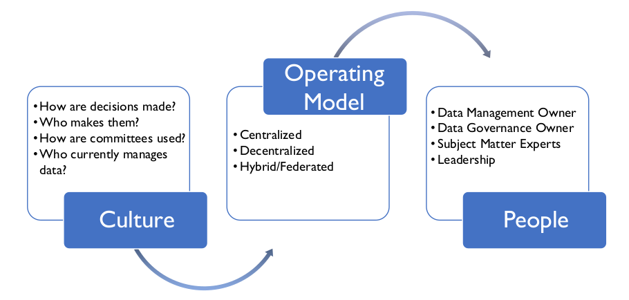
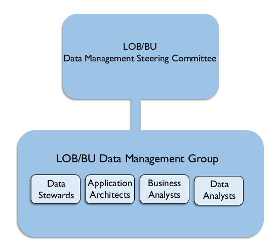
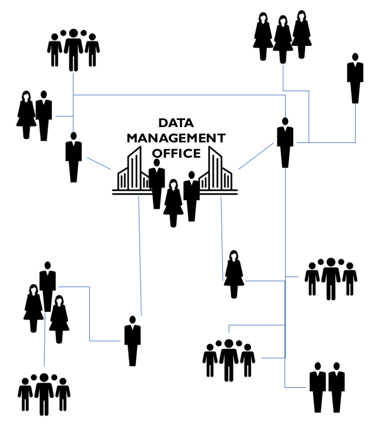
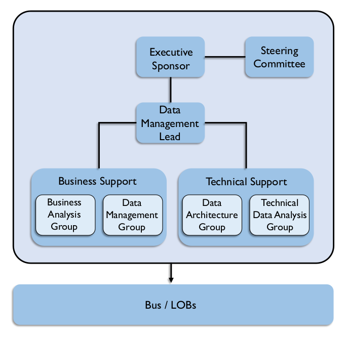
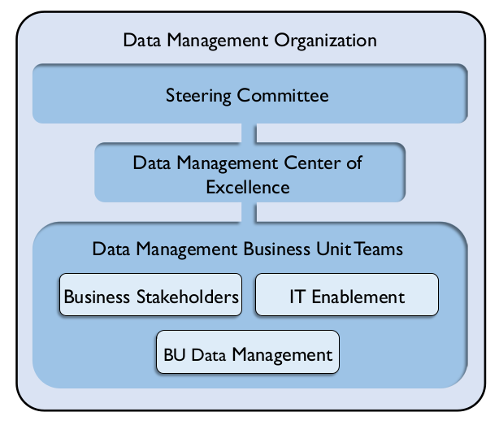
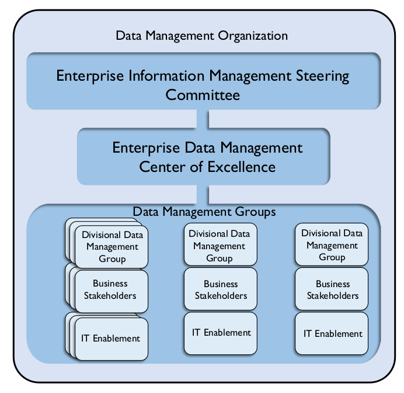
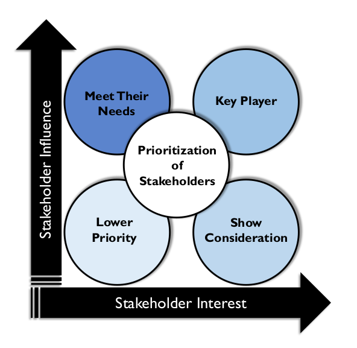

# Data Management Organization and Role Expectations

## 1. Introduction

The data landscape is quickly evolving and with it, organizations need to evolve the ways they manage and govern data. Most organizations today are faced with an increasing volume of data captured through a wide range of processes in a range of formats. The increase in volume and variety adds complexity to data management. At the same time, data consumers now demand quick and easy access to data. They want to be able to understand data and use it to address critical business questions in a timely manner. Data management and data governance organizations must be flexible enough to work effectively in this evolving environment. To do so, they need to clarify basic questions about ownership, collaboration, accountability, and decision-making.

This section will describe a set of principles that should be considered when putting together a data management or data governance organization. It refers to both data governance and data management because data governance provides the guidance and business context for the activities executed by the Data Management Organization. There is no perfect organizational structure for either. While common principles should be applied to organizing around data governance and data management, much of the detail will depend on the drivers of that enterprise’s industry and the corporate culture of the enterprise itself.

## 2. Understand Existing Organization and Cultural Norms

Awareness, ownership, and accountability are the keys to activating and engaging people in data management initiatives, policies, and processes. Before defining any new organization or attempting to improve an existing one, it is important to understand current state of component pieces, related to culture, the existing operating model, and people. See Figure 106. For example:

* The role of data in the organization: What key processes are data-driven? How are data requirements defined and understood? How well-recognized is the role that data plays in organizational strategy?

Figure 106 Assess Current State to Create an Operating Model

* **Cultural norms about data:** Are there potential cultural obstacles to implementing or improving management and governance structures?
* **Data management and data governance practices:** How and by whom is data-related work executed? How and by whom are decisions about data made?
* **How work is organized and executed:** For example, what is the relation between project-focused and operational execution? What committee structures are in place that can support the data management effort?
* **How reporting relationships are organized:** For example, is the organization centralized or decentralized, hierarchical or flat?
* **Skill levels:** What is the level of data knowledge and data management knowledge of SMEs and other stakeholders, from line staff to executives?

After forming a picture of current state, assess the level of satisfaction with current state in order to gain insight into the organization’s data management needs and priorities. For example:

* Does the organization have the information it needs to make sound, timely business decisions?
* Does the organization have confidence in its revenue reports?
* Can it track the organizational key performance indicators?
* Is the organization in compliance with all laws regarding management of data?

Most organizations that seek to improve their data management or governance practices are in the middle of the capability maturity scale (i.e., they are neither 0’s nor 5’s on the CMM scale). (See Chapter 15.) To craft a relevant Data Management Organization, it is important to understand and accommodate the existing company culture and organizational norms. If the Data Management Organization is not aligned to the existing decision-making and committee constructs, it will be challenging to sustain it over time. Therefore, it makes sense to evolve these organizations, rather than imposing radical changes.

A Data Management Organization should align with a company’s organizational hierarchy and resources. Finding the right people requires an understanding of both the functional and the political role of data management within an organization. The aim should be cross-functional participation from the various business stakeholders. To accomplish this:

* Identify employees currently performing data management functions; recognize and involve them first. Hire additional resources only as data management and governance needs grow.
* Examine the methods the organization is using to manage data and determine how processes can be improved. Determine how much change is likely to be required to improve data management practices.
* Roadmap the kinds of changes that need to take place from an organizational perspective to better meet requirements.

## 3. Data Management Organizational Constructs

A critical step in Data Management Organization design is identifying the best-fit operating model for the organization. The operating model is a framework articulating roles, responsibilities, and decision-making processes. It describes how people and functions will collaborate.

A reliable operating model helps create accountability by ensuring the right functions within the organization are represented. It facilitates communication and provides a process to resolve issues. While it forms the basis for the organizational structure, the operating model is not an org chart – it is not about putting names in boxes, but about describing the relationship between the component pieces of the organization.

This section will present a high-level overview of the pros and cons of decentralized, network, hybrid, federated, and centralized operating models.

### 3.1 Decentralized Operating Model

In a decentralized model, data management responsibilities are distributed across different lines of business and IT (see Figure 107). Collaboration is committee-based; there is no single owner. Many Data Management programs start as grass root efforts to unify the data management practices across an organization and therefore have a decentralized structure.

The benefits of this model include its relatively flat structure and its alignment of data management to lines of business or IT. This alignment generally means there is a clear understanding of data requirements. It is also relatively easy to implement or improve.

The drawbacks include the challenge of having many participants involved with governance bodies and in decision-making. It is generally harder to implement collaborative decisions than centralized edicts. Decentralized models are generally less formal and because of this, they can be harder to sustain over time. To be successful, they need to have ways to enforce consistency of practices. This can be difficult to coordinate. It is also often difficult to define data ownership with a decentralized model.

Figure 107 Decentralized Operating Model

### 3.2 Network Operating Model

Decentralized informality can be made more formal through a documented series of connections and accountabilities via a RACI (Responsible, Accountable, Consulted, and Informed) matrix. This is called a networked model because it operates as a series of known connections between people and roles and can be diagrammed as a ‘network.’ (See Figure 108.)

Figure 108 Network Operating Model

A network model’s benefits are similar to those of a decentralized model (flat structure, alignment, quick set up). The addition of a RACI helps create accountability without impacting the organizational charts. The additional drawback is the need to maintain and enforce expectations related to the RACI.

### 3.3 Centralized Operating Model

The most formal and mature data management operating model is a centralized one (see Figure 109). Here everything is owned by the Data Management Organization. Those involved in governing and managing data report directly to a data management leader who is responsible for Governance, Stewardship, Metadata Management, Data Quality Management, Master and Reference Data Management, Data Architecture, Business Analysis, etc.

Figure 109 Centralized Operating Model

The benefit of a centralized model is that it establishes a formal executive position for data management or data governance. There is one person at the top. Decision-making is easier because accountability is clear. Within the organization, data can be managed by type or subject area. The drawback is that implementation of a centralized model generally requires significant organizational change. There is also a risk that formal separation of the data management role moves it away for core business processes and can result in knowledge being lost over time.

A centralized model generally requires a new organization. The question arises: Where does the Data Management Organization fit within the overall enterprise? Who leads it and to whom does the leader report? It is becoming more common for a Data Management Organization not to report to the CIO because of the desire to maintain a business, rather than IT, perspective on data. These organizations are also commonly part of a shared services or operations team or part of the Chief Data Officer’s organization. (See Section 6.1.)

### 3.4 Hybrid Operating Model

As its name implies, the hybrid operating model encompasses benefits of both the decentralized and centralized models (see Figure 110). In a hybrid model, a centralized data management Center of Excellence works with decentralized business unit groups, usually through both an executive steering committee representing key lines of business and a set of tactical working groups addressing specific problems.

Figure 110 Hybrid Operating Model

In this model, some roles remain decentralized. For example, Data Architects may stay within an Enterprise Architecture group; lines of business may have their own Data Quality teams. Which roles are centralized and which stay decentralized can vary widely, depending largely on organizational culture.

The primary benefit of a hybrid model is that it establishes appropriate direction from the top of the organization. There is an executive accountable for data management and/or governance. Business Unit teams have broad accountability and can align to business priorities to provide greater focus. They benefit from the support of a dedicated data management Center of Excellence that can help bring focus to specific challenges.

The challenges include getting the organization set up, since doing so generally requires additional headcount to staff a Center of Excellence. Business Unit teams may have different priorities, and these will need to be managed from an enterprise perspective. In addition, there are sometimes conflicts between the priorities of the central organization and those of the decentralized organizations.

### 3.5 Federated Operating Model

A variation on the hybrid operating model, the federated model provides additional layers of centralization / decentralization, which are often required in large global enterprises. Imagine an enterprise Data Management Organization with multiple hybrid data management models delineated based on division or region. (See Figure 111.)

Figure 111 Federated Operating Model

A federated model provides a centralized strategy with decentralized execution. Therefore, for large enterprises it may be the only model that can work. A data management executive who is accountable across the organization runs the enterprise Center of Excellence. Of course, different lines of business are empowered to meet requirements based on their needs and priorities. Federation enables the organization to prioritize based on specific data entities, divisional challenges, or regional priorities.

The main drawback is complexity. There are a lot of layers, and there needs to be a balance between autonomy for lines of business and the needs of the enterprise. This balance can impact enterprise priorities.

### 3.6 Identifying the Best Model for an Organization

The operating model is a starting point for improving data management and data governance practices. Introducing it requires an understanding of how it may impact the current organization and how it will likely need to evolve over time. Since the operating model will serve as the structure through which policies and processes will be defined, approved, and executed, it is critical to identify the best fit for an organization. Assess whether the current organizational structure is centralized, decentralized, or a combination, hierarchical or relatively flat. Characterize how independent divisions or regions are. Do they operate almost self-sufficiently? Are their requirements and goals very different from each other? Most importantly, try to determine how decisions are made (e.g., democratically or by fiat), as well as how they are implemented.

The answers should give a starting point to understand the organization’s location on the spectrum between decentralized and centralized.

### 3.7 DMO Alternatives and Design Considerations

Most organizations start with a decentralized model before they move toward a formal Data Management Organization (DMO). As an organization sees the impact of improvements in data quality, it may start to formalize accountability through a data management RACI matrix and evolve into a network model. Over time, synergies between the distributed roles will become more obvious and economies of scale will be identified that will pull some roles and people into organized groups. Eventually, this can morph into a hybrid or federated model.

Some organizations don’t have the luxury of going through this maturity process. They are forced to mature quickly based on a market shock or new government regulations. In such a case, it is important to proactively address the discomfort associated with the organizational change if it is to be successful and sustainable. (See Chapter 17.)

Whichever model is chosen, remember that simplicity and usability are essential for acceptance and sustainability. If the operating model fits the culture of a company, then data management and proper governance can be embedded in operations and aligned with strategy. Keep these tips in mind when constructing an Operating Model:

* Determine the starting point by assessing current state
* Tie the operating model to organization structure
* Take into account:
  * Organization Complexity + Maturity
  * Domain Complexity + Maturity
  * Scalability
* Get executive sponsorship – a must for a sustainable model
* Ensure that any leadership forum (steering committee, advisory council, board) is a decision-making body
* Consider pilot programs and waves of implementation
* Focus on high-value, high-impact data domains
* Use what already exists
* Never take a One-Size-Fits-All approach

## 4. Critical Success Factors

Ten factors have been consistently shown to play a key role in the success of effective Data Management Organizations, regardless of their structure:

1. Executive sponsorship
2. Clear vision
3. Proactive change management
4. Leadership alignment
5. Communication
6. Stakeholder engagement
7. Orientation and training
8. Adoption measurement
9. Adherence to guiding principles
10. Evolution not revolution

### 4.1 Executive Sponsorship

Having the right executive sponsor ensures that stakeholders affected by a Data Management program receive the necessary guidance to transition efficiently and effectively through the changes needed to put the new data-focused organization together and sustain it for the long term. The executive sponsor should understand and believe in the initiative. He or she must be able to effectively engage other leaders in support of the changes.

### 4.2 Clear Vision

A clear vision for the Data Management Organization, along with a plan to drive it, is critical to success. Organizational leaders must ensure that all stakeholders who are affected by data management – both internal and external – understand and internalize what data management is, why it is important, and how their work will affect and be affected by it.

### 4.3 Proactive Change Management

Managing the change associated with creating a Data Management Organization requires planning for, managing, and sustaining change. Applying organizational change management to the establishment of a Data Management Organization addresses the people challenges and increases the likelihood that desired Data Management Organization is sustainable over time. (See Chapter 17.)

### 4.4 Leadership Alignment

Leadership alignment ensures that there is agreement on – and unified support for – the need for a Data Management program and that there is agreement on how success will be defined. Leadership alignment includes both the alignment between the leaders’ goals and the data management outcomes and value and alignment in purpose amongst the leaders.

If leaders are not aligned with each other, they will end up sending mixed messages that can lead to resistance and eventually derail the change. Therefore, it is critical to assess – and regularly re-assess – leaders at all levels to identify disconnects and take steps to quickly address them.

### 4.5 Communication

Communication should start early and continue openly and often. The organization must ensure that stakeholders have a clear understanding of what data management is and why it is important to the company, what is changing, and what changes in behavior are required. People can’t improve the way they manage data if they don’t know what they are supposed to do differently. Creating a story around the data management initiative and building key messages around it helps these processes.

Messages must be consistent, underscoring the importance of data management. In addition, they should be customized according to stakeholder group. For example, the level of education or amount of training needed by different groups concerning data management will vary. Messages should be repeated as needed and continually tested over time to ensure they are effectively getting out there and that awareness and understanding are building.

### 4.6 Stakeholder Engagement

Individuals, as well as groups, affected by a data management initiative will react differently to the new program and their role within it. How the organization engages these stakeholders – how they communicate with, respond to, and involve them – will have a significant impact on the success of the initiative. A stakeholder analysis helps the organization better understand those affected by data management changes. By taking that information and mapping stakeholders according to level of influence within the organization and level of interest in (or affect due to) the data management implementation, the organization can determine the best approach to engaging different stakeholders in the change process. (See Section 5.3.)

### 4.7 Orientation and Training

Education is essential to making data management happen, although different groups will require different types and levels of education.

Leaders will need orientation to the broader aspects of data management and the value to the company. Data stewards, owners, and custodians (i.e., those on the frontlines of change) will require in-depth understanding of the data management initiative. Focused training will allow them to perform their roles effectively. This means training on new policies, processes, techniques, procedures, and even tools.

### 4.8 Adoption Measurement

It is important to build metrics around the progress and adoption of the data management guidelines and plan to know that the data management roadmap is working and that it will continue working. Plan to measure:

* Adoption
* Amount of improvement, or the delta from a previous state
* The enabling aspects of data management – how well does data management influence solutions with measurable results?
* Improved processes, projects
* Improved identification and reaction to risk
* The innovation aspect of data management – how well does data management fundamentally change how business is conducted?
* Trusted analytics

The enabling aspect of data management could focus on the improvement of data-centric processes, such as month-end closing, identification of risk, and efficiency of project execution. The innovation aspect of data management could focus on improvement in decision-making and analytics through improved and trusted data.

### 4.9 Adherence to Guiding Principles

A guiding principle is a statement that articulates shared organizational values, underlies strategic vision and mission, and serves as a basis for integrated decision-making. Guiding principles constitute the rules, constraints, overriding criteria, and behaviors by which an organization abides in its daily activities in the long term. Regardless of whether there is a decentralized or centralized operating model, or anything in between, it is critical to establish and agree upon guiding principles so that all participants behave in synchronistic ways. The guiding principles serve as the reference points from which all decisions will be made. Establishing them is an important first step in creating a Data Management program that effectively drives changes in behavior.

### 4.10 Evolution Not Revolution

In all aspects of data management, the philosophy of ‘evolution not revolution’ helps to minimize big changes or large-scale high-risk projects. It is important to establish an organization that evolves and matures over time. Incrementally improving the way that data is managed and prioritized by business objectives will ensure that new policies and processes are adopted and behavioral change is sustained. Incremental change is also much easier to justify so it is easier to gain stakeholder support and buy-in, and get those critical participants involved.

## 5. Build the Data Management Organization

### 5.1 Identify Current Data Management Participants

When implementing the operating model, start with teams already engaged in data management activities. This will minimize the effect on the organization and will help to ensure that the focus of the team is data, not HR or politics.

Start by reviewing existing data management activities, such as who creates and manages data, who measures data quality, or even who has ‘data’ in their job title. Survey the organization to find out who may already be fulfilling needed roles and responsibilities. Such individuals may hold different titles. They are likely part of a distributed organization and not necessarily recognized by the enterprise. After compiling a list of ‘data people,’ identify gaps. What additional roles and skill sets are required to execute the data strategy? In many cases, people in other parts of the organization have analogous, transferrable skill sets. Remember, people already in the organization bring valuable knowledge and experience to a data management effort.

Once an inventory is complete, and people are assigned to the roles, review their compensation and align it with the expectations of data management. Likely, the Human Resources department will get involved to validate the titles, roles, compensation, and performance objectives. Ensure that the roles are assigned to the right people at the right level within the organization, so that when they are involved in decision-making, they have the credibility to make decisions that stick.

### 5.2 Identify Committee Participants

No matter which operating model an organization chooses, some governance work will need to be done by a Data Governance Steering Committee and by working groups. It is important to get the right people on the Steering Committee and to use their time well. Keep them well-informed and focused on the ways that improved data management will help them reach business objectives, including strategic goals.

Many organizations are reluctant to start yet another committee since there are so many already existing. It is often easier to take advantage of existing committees to advance data management topics than it is to start a new one. But take this route cautiously. The main risk in using an existing committee is that data management may not get the attention it requires, especially in the early stages. The process to staff either a senior steering committee or a more tactical working group requires conducting stakeholder analysis and, through that, identifying executive sponsors.

### 5.3 Identify and Analyze Stakeholders

A stakeholder is any person or group who can influence or be affected by the Data Management program. Stakeholders can be internal to or external to the organization. They include individual SMEs, senior leaders, teams of employees, committees, customers, government or regulatory agencies, brokers, agents, vendors, etc. Internal stakeholders can come from IT, operations, compliance, legal, HR, finance or other lines of business. External stakeholders can be influential, and it is important that their needs be accounted for by the Data Management Organization.

A stakeholder analysis can help the organization determine the best approach to engaging participants in the data management process and leveraging their roles within the operating model. Insight gained from the analysis is also helpful in determining how to best allocate time and other limited resources. The earlier this analysis is conducted, the better, since the more the organization is able to anticipate reactions to change, the more it can plan for them. A stakeholder analysis will help answer questions like:

* Who will be affected by data management?
* How will roles and responsibilities shift?
* How might those affected respond to the changes?
* What issues and concerns will people have?

The analysis will result in a list of stakeholders, their goals and priorities, and why those goals are important to them. Figure out what actions are needed for stakeholders based on the analysis. Pay particular attention to what needs to be done to bring along critical stakeholders, those that can make or break an organization’s data management success, especially its initial priorities. Consider:

* Who controls critical resources
* Who could block data management initiatives, either directly or indirectly
* Who could influence other critical constituents
* How supportive stakeholders are of the upcoming changes

Figure 112 provides a simple map to help prioritize stakeholders based on their influence, their level of interest in the program, or the degree to which the program will impact them.

### 5.4 Involve the Stakeholders

After identifying the stakeholders and a good Executive Sponsor, or a short list from which to choose, it is important to clearly articulate why each of the stakeholders should be involved. They may not jump at the chance. The person or team driving the data management effort should articulate the reasons each stakeholder is necessary to the success of the program. This means understanding their personal and professional goals, and being able to link the output from data management processes to their goals, so they can see a direct connection. Without an understanding of this direct connection, they may be willing to help out in the short term, but they will not provide long-term support or assistance.

Figure 112 Stakeholder Interest Map

## 6. Interactions Between the DMO and Other Data-oriented Bodies

Once the operating model is established and participants are identified, it is time to move the people into the newly authorized roles. Operationalizing the organization means establishing the committees and engaging with stakeholders. In a centralized model, most of the data management activity will be controlled within one organization. With a decentralized or network model, though, the Data Management Organization will need to work with other groups that have a significant impact on the way that data is managed. Those groups are typically:

* Chief Data Officer Organization
* Data Governance Bodies
* Data Quality
* Enterprise Architecture

## 6.1 The Chief Data Officer

While most companies recognize at some level that data is a valuable corporate asset, only a few have appointed a Chief Data Officer (CDO) to help bridge the gap between technology and business and evangelize an enterprise-wide data management strategy at a senior level. This role is on the rise, however, with Gartner estimating that half of all regulated companies will employ a CDO by 2017 (Gartner, 2015).

While the requirements and functions of a CDO are specific to each company’s culture, organizational structure, and business needs, many CDOs tend to be part business strategist, adviser, data quality steward and all around data management ambassador.

In 2014, Dataversity published research outlining common mandates for a CDO. [^103] These included:

* Establishing an organizational data strategy
* Aligning data-centric requirements with available IT and business resources
* Establishing data governance standards, policies and procedures
* Providing advice (and perhaps services) to the business for data-dependent initiatives, such as business analytics, Big Data, data quality, and data technologies
* Evangelizing the importance of good information management principles to internal and external business stakeholders
* Oversight of data usage in analytics and Business Intelligence

Dataversity’s findings also highlighted shifting focuses across different industries. Regardless of industry, it is common for a Data Management Organization to report up through the CDO. In a more decentralized operating model, the CDO is responsible for the data strategy, but resources that are in IT, operations, or other lines of business execute that strategy. Some DMOs are established initially with the CDO just determining the strategy, and over time other aspects of data management, governance, and analytics are folded under the CDO umbrella as efficiencies and economies of scale are identified.

### 6.2 Data Governance

Data Governance is the organizing framework for establishing the strategy, objectives, and policy for effectively managing corporate data. It consists of the processes, policies, organization, and technologies required to manage and ensure the availability, usability, integrity, consistency, auditability, and security of data. Since a Data Governance Program consists of the inter-workings of strategy, standards, policies and communication regarding data, it has a synergistic relationship with data management. Governance provides a framework for data management to engage and align with the business priorities and stakeholders.

Within a centralized model, the Data Governance Office can report to the Data Management Organization or vice versa. When a Data Management program is focused on establishing policies and guidelines needed to manage data as an asset, the Data Governance Office can act as the lead, and the Data Management Organization reports to (or is matrixed to) the Data Governance Office. This occurs many times in highly regulated environments where the emphasis is on policy and accountability.

Even in a very decentralized model, there should be a tight partnership between the Data Governance Office, which creates the guidelines and policies for how data should be managed, and the Data Management Organization that implements them. John Ladley succinctly clarifies this relationship: data governance is about

‘Doing the right things’ and data management is about ‘Doing things right’ (Ladley, 2012). They are two sides of the equation needed to produce valuable data. In this way, data governance provides the marching orders for data management.

Most importantly, there needs to be an understanding of this synergy and agreement upon roles, responsibilities, and accountabilities that support the guidelines of data governance and the efficiencies of data management. Participants in a Data Governance Working Group can be drawn from a Data Management Organization, and a Data Management Organization can use the mandate and ‘air cover’ provided by the governance oversight.

### 6.3 Data Quality

Data Quality Management is a key capability of a data management practice and organization. Many Data Management Organizations start with a focus on the quality of data because there is a desire to measure and improve the quality of data across the organization. It is possible to address Data Quality within a line of business, or even within an application, without having to involve other groups or manage cross-functional complexities. However, as a data quality practice matures, the organization will benefit from a unified approach to data quality; for example, by establishing a Center of Excellence. The goal shifts to improving the quality of data that is shared across lines of business or applications, often with a focus on Master Data Management. It is common that a Data Management Organization develops organically out of a Data Quality initiative as the investment in improving data quality adds value across the company, and efforts associated with improving quality expand into other disciplines like Master, Reference, and Metadata Management.

A Data Quality program can evolve into similar operating models as an over-arching Data Management program, although it is rare for Data Quality functions to become completely centralized in any sizable company because there is most often aspects of data quality that are executed on a line-of-business or application level. Because a Data Quality program can be decentralized, networked, or a hybrid (using a Center of Excellence approach), align the Data Quality operating model to that of the overall Data Management Organization, in order to use consistent stakeholders, relationships, accountabilities, standards, processes, and even tools.

### 6.4 Enterprise Architecture

An Enterprise Architecture group designs and documents the master blueprints for an organization to articulate and optimize how to meet its strategic objectives. The disciplines within an Enterprise Architecture practice include:

* Technology Architecture
* Application Architecture
* Information (or Data) Architecture
* Business Architecture

Data Architecture is a key capability of an effective Data Management Organization. Therefore, Data Architects can sit in either group, with a dotted line to the other group.

When Data Architects sit within a Data Management Organization, typically they interface with the rest of their architecture peers via Architecture Review Boards (ARB), committees that review and give guidance on the way that architecture standards are implemented or affected by projects and programs. An ARB can approve or disapprove new projects and systems based on their level of adherence to architectural standards. When an organization does not have Data Architects, Data Management can interface with the Architecture organization in a few ways:

* **Through Data Governance:** Since both Data Management and Enterprise Architecture participate in a Data Governance program, the governance working group and committee structure can provide a platform for aligning goals, expectations, standards, and activities.
* **Through the ARB:** As data management projects are brought to the ARB, the Architecture group would provide guidance, feedback, and approvals.
* **Ad-hoc:** If there are no formal committees, then the Data Management Lead should periodically meet with the Architecture Lead to ensure there is shared knowledge and understanding of projects and processes that impact the other party. Over time, the difficulty of managing this ad hoc process will likely lead to the development of a formal role or committee to facilitate discussions and decisions.

If there were Data Architects, then they would represent architecture in governance discussions and would lead the discussions in the ARB.

### 6.5 Managing a Global Organization

Global companies face complex data management challenges based on the volume and variety of country-specific laws and regulations, especially those regarding the privacy and security of certain types of data. Add these issues to the typical management challenges of a global organization (distributed work force, systems, time zones, and languages), and the task of efficiently and effectively managing data can seem like an endless exercise of herding cats.

Global organizations need to pay special attention to:

* Adhering to standards
* Synchronizing processes
* Aligning accountability
* Training and communication
* Monitoring and measuring effectively
* Developing economies of scale
* Reducing duplication of effort

As Data Management programs and Organizations become more global, the networked or federated models become more attractive where accountabilities can be aligned, standards can be followed, and regional variations can still be accommodated.

## 7. Data Management Roles

Data management roles can be defined at the functional or individual level. Names for the roles will differ between organizations and some organizations will have greater or lesser need for some of the roles. All IT roles can be mapped to points in the data lifecycle, so they all impact the management of data, whether directly (as with a Data Architect who designs a data warehouse) or indirectly (as with a Web Developer who programs a website). Likewise, many business roles create, access, or manipulate data. Some roles, such as Data Quality Analyst, require a mix of technical skills and business knowledge. The functions and roles described below focus on those that are directed engaged in the management of data.

### 7.1 Organizational Roles

IT Data Management Organizations provide a range of services from data, application, and technical architecture to database administration. A centralized Data Management Services Organization is focused solely on data management. This team may include a DM Executive, other DM Managers, Data Architects, Data Analysts, Data Quality Analysts, Database Administrators, Data Security Administrators, Metadata Specialists, Data Modelers, Data Administrators, Data Warehouse Architects, Data Integration Architects, and Business Intelligence Analysts.

A federated Data Management Services approach will include a set of IT units, each focused on a facet of data management. Especially in large organizations, IT functions are often decentralized. For example, each business function may have its own team of Software Developers. A hybrid approach is also taken. For example, while each business function may have its own developers, the DBA function may be centralized.

Business functions focused on data management are most often associated with Data Governance or Enterprise Information Management teams. For example, Data Stewards are often part of a Data Governance Organization. Such an organization will facilitate Data Governance bodies, such as the Data Governance Council.

### 7.2 Individual Roles

Individual roles may be defined under business or IT. Some are hybrid roles that require knowledge of systems and business processes.

#### 7.2.1 Executive Roles

Data Management executives may be on the business or technology side of the house. Chief Information Officer and Chief Technology Officer are well-established roles in IT. The concept of Chief Data Officer on the business-side has gained a lot of credibility in the past decade and many organizations have hired CDOs.

#### 7.2.2 Business Roles

Business roles focus largely on data governance functions, especially stewardship. Data Stewards are usually recognized subject matter experts who are assigned accountability for Metadata and data quality of business entities, subject areas, or databases. Stewards play different roles, depending on organizational priorities. The initial focus of stewardship is often on defining business terms and valid values for their subject areas. In many organizations, Stewards also define and maintain data quality requirements and business rules for assigned data attributes, help identify and resolve data issues, and provide input into data standards, policies, and procedures. Stewards may function at the enterprise, business unit, or functional level. Their role may be formal (‘data steward’ is part of the title) or informal (they steward data, but have another job title).

In addition to Data Stewards, Business Process Analysts and Process Architects contribute to ensuring that business process models and the actual processes that create data are sound and support downstream uses. Other business-based knowledge workers, such as business analyst consumers of data and information who add value to the data for the organization, contribute to the overall management of data.

#### 7.2.3 IT Roles

IT Roles include different types of architects, developers at different levels, database administrators, and a range of supporting functions.

* **Data Architect:** A senior analyst responsible for data architecture and data integration. Data Architects may work at the enterprise level or a functional level. Data Architects may specialize in data warehousing, data marts, and their associated integration processes.
* **Data Modeler:** Responsible for capturing and modeling data requirements, data definitions, business rules, data quality requirements, and logical and physical data models.
* **Data Model Administrator:** Responsible for data model version control and change control.
* **Database Administrator:** Responsible for the design, implementation, and support of structured data assets and the performance of the technology that makes data accessible.
* **Data Security Administrator:** Responsible for ensuring controlled access to data requiring different levels of protection.
* **Data Integration Architect:** A senior data integration developer responsible for designing technology to integrate and improve the quality of enterprise data assets.
* **Data Integration Specialist:** A software designer or developer responsible for implementing systems to integrate (replicate, extract, transform, load) data assets in batch or near-real-time.
* **Analytics / Report Developer:** A software developer responsible for creating reporting and analytical application solutions.
* **Application Architect:** Senior developer responsible for integrating application systems.
* **Technical Architect:** Senior technical engineer responsible for coordinating and integrating the IT infrastructure and the IT technology portfolio.
* **Technical Engineer:** Senior technical analyst responsible for researching, implementing, administering, and supporting a portion of the information technology infrastructure.
* **Help Desk Administrator:** Responsible for handling, tracking, and resolving issues related to use of information, information systems, or the IT infrastructure.
* **IT Auditor:** An internal or external auditor of IT responsibilities, including data quality and data security.

#### 7.2.4 Hybrid Roles

Hybrid roles require a mix of business and technical knowledge. Depending on the organization, people in these
roles may report through the IT or business side.

* **Data Quality Analyst:** Responsible for determining the fitness of data for use and monitoring the ongoing condition of the data; contributes to root cause analysis of data issues and helps the organization identify business process and technical improvements that contribute to higher quality data.
* **Metadata Specialist:** Responsible for integration, control, and delivery of Metadata, including administration of Metadata repositories.
* **Business Intelligence Architect:** A senior Business Intelligence analyst responsible for the design of the Business Intelligence user environment.
* **Business Intelligence Analyst / Administrator:** Responsible for supporting effective use of Business Intelligence data by business professionals.
* **Business Intelligence Program Manager:** Coordinates BI requirements and initiatives across the corporation and integrates them into a cohesive prioritized program and roadmap.

## 8. Works Cited / Recommended

Aiken, Peter and Juanita Billings. Monetizing Data Management: Finding the Value in your Organization's Most Important Asset. Technics Publications, LLC, 2013. Print.

Aiken, Peter and Michael M. Gorman. The Case for the Chief Data Officer: Recasting the C-Suite to Leverage Your Most Valuable Asset. Morgan Kaufmann, 2013. Print.

Anderson, Carl. Creating a Data-Driven Organization. O'Reilly Media, 2015. Print.

Arthur, Lisa. Big Data Marketing: Engage Your Customers More Effectively and Drive Value. Wiley, 2013. Print.

Blokdijk, Gerard. Stakeholder Analysis - Simple Steps to Win, Insights and Opportunities for Maxing Out Success. Complete Publishing, 2015. Print.

Borek, Alexander et al. Total Information Risk Management: Maximizing the Value of Data and Information Assets. Morgan Kaufmann, 2013. Print.

Brestoff, Nelson E. and William H. Inmon. Preventing Litigation: An Early Warning System to Get Big Value Out of Big Data. Business Expert Press, 2015. Print.

Collier, Ken W. Agile Analytics: A Value-Driven Approach to Business Intelligence and Data Warehousing. Addison-Wesley Professional, 2011. Print. Agile Software Development Ser.

Dean, Jared. Big Data, Data Mining, and Machine Learning: Value Creation for Business Leaders and Practitioners. Wiley, 2014. Print. Wiley and SAS Business Ser.

Dietrich, Brenda L., Emily C. Plachy and Maureen F. Norton. Analytics Across the Enterprise: How IBM Realizes Business Value from Big Data and Analytics. IBM Press, 2014. Print.

Freeman, R. Edward. Strategic Management: A Stakeholder Approach. Cambridge University Press, 2010. Print.

Gartner, Tom McCall, contributor. “Understanding the Chief Data Officer Role.” 18 February 2015. http://gtnr.it/1RIDKa6.

Gemignani, Zach, et al. Data Fluency: Empowering Your Organization with Effective Data Communication. Wiley, 2014. Print.

Gibbons, Paul. The Science of Successful Organizational Change: How Leaders Set Strategy, Change Behavior, and Create an Agile Culture. Pearson FT Press, 2015. Print.

Harrison, Michael I. Diagnosing Organizations: Methods, Models, and Processes. 3rd ed. SAGE Publications, Inc, 2004. Print. Applied Social Research Methods (Book 8).

Harvard Business Review, John P. Kotter et al. HBR's 10 Must Reads on Change Management. Harvard Business Review Press, 2011. Print. HBR's 10 Must Reads.

Hatch, Mary Jo and Ann L. Cunliffe. Organization Theory: Modern, Symbolic, and Postmodern Perspectives. 3rd ed. Oxford University Press, 2013. Print.

Hiatt, Jeffrey and Timothy Creasey. Change Management: The People Side of Change. Prosci Learning Center Publications, 2012. Print.

Hillard, Robert. Information-Driven Business: How to Manage Data and Information for Maximum Advantage. Wiley, 2010. Print.

Hoverstadt, Patrick. The Fractal Organization: Creating sustainable organizations with the Viable System Model. Wiley, 2009. Print.

Howson, Cindi. Successful Business Intelligence: Unlock the Value of BI and Big Data. 2nd ed. Mcgraw-Hill Osborne Media, 2013. Print.

Kates, Amy and Jay R. Galbraith. Designing Your Organization: Using the STAR Model to Solve 5 Critical Design Challenges. Jossey-Bass, 2007. Print.

Kesler, Gregory and Amy Kates. Bridging Organization Design and Performance: Five Ways to Activate a Global Operation Model. Jossey-Bass, 2015. Print.

Little, Jason. Lean Change Management: Innovative practices for managing organizational change. Happy Melly Express, 2014. Print.

National Renewable Energy Laboratory. Stakeholder Analysis Methodologies Resource Book. BiblioGov, 2012. Print.

Prokscha, Susanne. Practical Guide to Clinical Data Management. 2nd ed. CRC Press, 2006. Print.

Schmarzo, Bill. Big Data MBA: Driving Business Strategies with Data Science. Wiley, 2015. Print.

Soares, Sunil. The Chief Data Officer Handbook for Data Governance. Mc Press, 2015. Print.

Stubbs, Evan. The Value of Business Analytics: Identifying the Path to Profitability. Wiley, 2011. Print.

Tompkins, Jonathan R. Organization Theory and Public Management. Wadsworth Publishing, 2004. Print.

Tsoukas, Haridimos and Christian Knudsen, eds. The Oxford Handbook of Organization Theory: Meta-theoretical Perspectives. Oxford University Press, 2005. Print. Oxford Handbooks.

Verhoef, Peter C., Edwin Kooge and Natasha Walk. Creating Value with Big Data Analytics: Making Smarter Marketing Decisions. Routledge, 2016. Print.

Willows, David and Brian Bedrick, eds. Effective Data Management for Schools. John Catt Educational Ltd, 2012. Print. Effective International Schools Ser.

[^103]: http://bit.ly/2sTf3Cy
