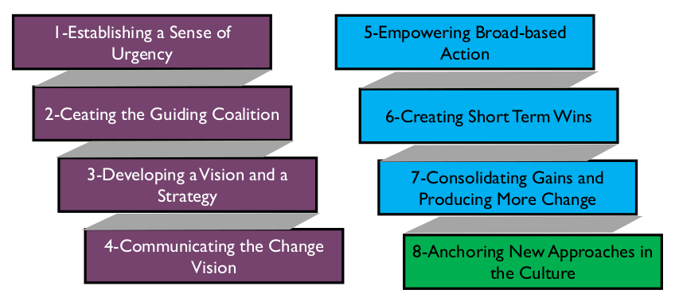

# Data Management and Organizational Change Management

## 1. Introduction

For most organizations, improving data management practices requires changing how people work together and how they understand the role of data in their organizations, as well as the way they use data and deploy technology to support organizational processes. Successful data management practices require, among other factors:

* Learning to manage on the horizontal by aligning accountabilities along the Information Value chain
* Changing focus from vertical (silo) accountability to shared stewardship of information
* Evolving information quality from a niche business concern or the job of the IT department into a core value of the organization
* Shifting thinking about information quality from ‘data cleansing and scorecards’ to a more fundamental organizational capability
* Implementing processes to measure the cost of poor data management and the value of disciplined data management

This level of change is not achieved through technology, even though appropriate use of software tools can support delivery. It is instead achieved through a careful and structured approach to the management of change in the organization. Change will be required at all levels. It is critical to manage and coordinate change to avoid dead-end initiatives, loss of trust, and damage to the credibility of the information management function and its leadership.

Data management professionals who understand formal change management will be more successful in bringing about changes that will help their organizations get more value from their data. To do so, it is important to understand:

* Why change fails
* The triggers for effective change
* The barriers to change
* How people experience change

## 2. Laws of Change

Experts in organizational change management recognize a set of fundamental ‘Laws of Change’ that describe why change is not easy. Recognizing these at the beginning of the change process enables success.

* **Organizations don’t change, people change:** Change does not happen because a new organization is announced or a new system is implemented. It takes place when people behave differently because they recognize the value in doing so. The process of improving data management practices and implementing formal data governance will have far-reaching effects on an organization. People will be asked to change how they work with data and how they interact with each other on activities involving data.
* **People don’t resist change. They resist being changed:** Individuals will not adopt change if they see it as arbitrary or dictatorial. They are more likely to change if they have been engaged in defining the change and if they understand the vision driving the change, as well as when and how change will take place. Part of change management for data initiatives involves working with teams to build organizational understanding of the value of improved data management practices.
* **Things are the way they are because they got that way:** There may be good historic reasons for things being the way they are. At some point in the past, someone defined the business requirements, defined the process, designed the systems, wrote the policy, or defined the business model that now requires change. Understanding the origins of current data management practices will help the organization avoid past mistakes. If staff members are given a voice in the change, they are more likely to understand new initiatives as improvements.
* **Unless there is push to change, things will likely stay the same:** If you want an improvement, something must be done differently. As Einstein famously said: “You can’t solve a problem with the level of thinking that created it in the first place.”
* **Change would be easy if it weren’t for all the people:** The ‘technology’ of change is often easy. The challenge comes in dealing with the natural variation that arises in people.

Change requires Change Agents, people who pay attention to the people and not just the systems. Change Agents actively listen to employees, customers, and other stakeholders to catch problems before they arise and execute the change more smoothly.

Ultimately, change requires a clear VISION of Change Goals communicated vividly and regularly to stakeholders to get engagement, buy-in, backing, and (importantly) continued support when challenges arise.

## 3. Not Managing a Change: Managing a Transition

Change management expert William Bridges emphasizes the centrality of transition in the change management process. He defines transition as the psychological process that people go through to come to terms with the new situation. While many people think of change solely in terms of a new beginning, Bridges asserts that change involves moving through three distinct phases, starting with the ending of the existing state. Endings are difficult because people need to let go of existing conditions. People then enter the Neutral Zone, in which the existing state has not quite ended and the new state has not quite begun. Change is complete when the new state is established (see Table 34). Of these three, the Neutral Zone is the least predictable and most confusing, because it is a mix of old and new. If the people in the organization do not transition through the Neutral Zone, then the organization is at risk of slipping back into old habits and failing to sustain the change.

Bridges maintains that the single biggest reason organizational changes fail is that people driving change rarely think about endings and therefore do not manage the impact of endings on people. He states: “Most organizations try to start with a beginning, rather than finishing with it. They pay no attention to endings. They do not acknowledge the existence of the neutral zone, and then wonder why people have so much difficulty with change” (Bridges, 2009).

When experiencing a change, all individuals go through all three phases, but at different speeds. Progression depends on factors such as past experience, personal preferred style, the degree of involvement in recognizing the problem and developing possible solutions, and the extent to which they feel pushed towards a change rather than moving towards it voluntarily.

*Table 34 Bridges’s Transition Phases*

<table>
  <thead>
    <tr>
      <th>Transition Phase</th>
      <th>Description</th>
    </tr>
  </thead>
  <tbody>
    <tr>
      <td>
      The Ending
      </td>
      <td>
      <ul>
        <li>
          When we acknowledge that there are things we need to let go of.
        </li>
        <li>
          When we recognize that we have lost something.
        </li>
        <li>
          Example: Changing jobs – even when an individual chooses to change jobs, there are still losses such as losing close working friends.
        </li>
      </ul>
      </td>
    </tr>
    <tr>
      <td>
        The Neutral Zone
      </td>
      <td>
      <ul>
        <li>
          When the old way has finished but the new way isn’t here yet.
        </li>
        <li>
          When everything is in flux and it feels like no one knows what they should be doing.
        </li>
        <li>
          When things are confusing and disorderly.
        </li>
        <li>
          Example: Moving to a new house. The first few days or even months after moving, the new house is not home yet and things are quite probably in turmoil.
        </li>
      </ul>
      </td>
    </tr>
    <tr>
      <td>
        The New Beginning
      </td>
      <td>
      <ul>
        <li>When the new way feels comfortable, right, and the only way.</li>
        <li>Example: Having a baby. After a few months in the neutral zone of turmoil, you come to a stage when you cannot imagine life without your new baby.</li>
      </ul>
      </td>
    </tr>
  </tbody>
</table>

Bridges emphasizes that while the first task of the Change Manager is to understand the Destination (or VISION) and how to get there, the ultimate goal of transition management is to convince people that they need to start the journey. When managing change and transition, the role of the Change Agent, and of any manager or leader in the process, is to help people recognize that the process and the stages of a transition are perfectly Level of Management natural.

Figure 113 Bridges’s Transition Phases

The following checklist for managing transition summarizes key point managers should be aware of as they help people transition.

* The Ending
  * Help everyone to understand the current problems and why the change is necessary.
  * Identify who is likely to lose what. Remember that loss of friends and close working colleagues is as important to some as the loss of status and power is to others.
  * Losses are subjective. The things one person grieves about may mean nothing to someone else. Accept the importance of subjective losses. Don’t argue with others about how they perceive the loss, and don’t be surprised at other people’s reactions to loss.
  * Expect and accept signs of grieving and acknowledge losses openly and sympathetically.
  * Define what is over and what is not. People must make the break at some time and trying to cling on to old ways prolongs difficulties.
  * Treat the past with respect. People have probably worked extremely hard in what may have been very difficult conditions. Recognize that and show that the work is valued.
  * Show how ending something ensures the things that matter to people are continued and improved.
  * Give people information. Then do it again and again and again in a variety of ways – written information to go away and read, as well as the opportunity to talk and ask questions.
  * Use the stakeholder analysis to map out how best to approach different individuals – understand how their perspectives might need to be engaged to initiate the change and what likely points of resistance might be.
* The Neutral Zone
  * Recognize this as a difficult phase (mix of old and new) but that everyone must go through it.
  * Get people involved and working together; give them time and space to experiment and test new ideas.
  * Help people to feel that they are still valued.
  * Praise people with good ideas, even if not every good idea works as expected. The Plan, Do, Study, Act (PDSA) model encourages trying things out, and learning from each cycle.
  * Give people information; do it again and again and again in a variety of ways.
  * Provide feedback about the results of the ideas being tested and decisions made.
* The New Beginning
  * Do not force a beginning before its time.
  * Ensure people know what part they are to play in the new system.
  * Make sure policies, procedures, and priorities are clear; do not send mixed messages.
  * Plan to celebrate the new beginning and give the credit to those who have made the change.
  * Give people information; do it again and again in a variety of ways.

## 4. Kotter’s Eight Errors of Change Management

In Leading Change, John P. Kotter, one of the most respected researchers in the field of Change Management, outlines eight reasons why organization fail to execute change. These provide perspective on issues that commonly arise in the context of information and data management.

### 4.1 Error #1: Allowing Too Much Complacency

According to Kotter, the biggest mistake people make when trying to change organizations is plunging ahead without first establishing a high enough sense of urgency among their peers and superiors. (This is related to the need to drive up dissatisfaction with the status quo identified in the Gleicher formula; see Section 6.) Kotter’s analysis provides valuable pointers for Change Managers looking to avoid the errors of others. Change Agents often:

* Overestimate their ability to force big changes on the organization
* Underestimate how difficult it can be to shift people out of their comfort zones
* Don’t see how their actions and approach might reinforce the status quo by driving up defensiveness
* Rush in where angels fear to tread – kicking off change activities without sufficient communication of
* Confuse urgency with anxiety, which in turn leads to fear and resistance as stakeholders retrench (often what change is required or why change is required (the Vision) quite literally) in their silos

While it is tempting to think that in the face of organizational crisis, complacency would not be a problem, often the opposite is the case. Stakeholders often cling to the status quo in the face of too many (often conflicting) demands for change (which are often processed as ‘if everything is important, then nothing is important’).

#### 4.1.1 Examples in Information Management Context

Table 35 describes examples of how complacency can manifest in an information management context:

<table>
  <thead>
    <tr>
      <th>Example Scenario</th>
      <th>How it might manifest</th>
    </tr>
  </thead>
  <tbody>
    <tr>
      <td>
        Response to a Regulatory Change
      </td>
      <td>
        “We’re OK. We haven’t been fined under the current rules.”
      </td>
    </tr>
    <tr>
      <td>
        Response to Business Change
      </td>
      <td>
        “We’ve been supporting the business successfully for years. We’ll be OK.”
      </td>
    </tr>
    <tr>
      <td>
        Response to Technology Change
      </td>
      <td>
        “That new technology is unproven. Our current systems are stable and we know how to work around issues.”
      </td>
    </tr>
    <tr>
      <td>
        Response to Problems or Errors
      </td>
      <td>
        “We can assign a troubleshooting team to that and patch the issues up. There are bound to be some people available in [Insert name of Department or Team here].”
      </td>
    </tr>
  </tbody>
</table>

### 4.2 Error #2: Failing to Create a Sufficiently Powerful Guiding Coalition

Kotter identifies that major change is almost impossible without the active support from the head of the organization and without a coalition of other leaders coming together to guide the change. Leadership engagement is especially important in data governance efforts, as these require significant behavioral changes. Without commitment from top leaders, short-term self-interest will outweigh the argument for the long-term benefits of better governance.

A Guiding Coalition is a powerful and enthusiastic team of volunteers from across the organization that helps to put new strategies into effect and transform the organization. A key challenge in developing a Guiding Coalition is identifying who needs to be involved. (See Section 5.2.)

### 4.3 Error #3: Underestimating the Power of Vision

Urgency and a strong guiding team are useless without a clear, sensible vision of the change. The vision provides the context of the change effort. It helps people understand the meaning of any individual component. A well-defined and communicated vision can help drive the level of energy required to properly implement the change. Without a public statement of vision to guide decision-making, every choice risks becoming a debate and any action could derail the change initiative or undermine it.

Vision is not the same thing as planning or program management. The vision is not the project plan or project charter or a detailed breakdown of all the components of the change.

A Vision is a Clear and Compelling Statement of where the Change is leading. Communicating vision means connecting with people. For data management initiatives, the vision must articulate the challenges with existing data management practices, the benefits of improvement, and the path to get to a better future state.

#### 4.3.1 Example in Information Management

All too often in information management, the vision for a particular project is presented as the implementation of a new technology. The technology, while important, is not the change and not the vision. What the organization can do with the technology constitutes the vision.

For example, stating, “We will implement a new integrated financial reporting and analytics suite built on [insert name of technology here] by the end of Quarter 1” is a laudable and measurable goal. However, it does little to communicate a clear and compelling statement of where the change will lead.

On the other hand, asserting, “We will improve the accuracy and timeliness of financial reports and make them more readily available to all stakeholders. Improved understanding of how data flows into and out of our reporting processes will support trust in our numbers, save time, and reduce unnecessary stress during end-of-period processes. We will take our first step to achieve this by implementing [System X] by the end of Q1” clarifies what will be done, and why it is being done. If you can point out the benefits of the change to the organization, you will build support for change.

### 4.4 Error #4: Under Communicating the Vision by a Factor of 10, 100, or 1000

Even if everyone agrees that the current situation is unsatisfactory, people will still not change unless they perceive the benefits of change as a significant improvement over the status quo.

Consistent, effective communication of the vision, followed by action, is critical to successful change management. Kotter advises that communication comes in both words and deeds. Congruence between the two is critical for success. Nothing kills a change effort as fast as a situation where people receive the message: ‘Do as I say, not as I do.’

### 4.5 Error #5: Permitting Obstacles to Block the Vision

New initiatives fail when people feel disempowered by huge obstacles in their path, even when they fully embrace the need for and direction of the proposed change. As part of its transformation, the organization must identify and respond to different kinds of roadblocks:

* **Psychological:** Roadblocks that exist in people’s heads must be addressed based on their causes. Do they stem from fear, lack of knowledge, or some other cause?
* **Structural:** Roadblocks due to organizational structures such as narrow job categories or performance appraisal systems that force people to choose between the Vision and their own self-interest must be addressed as part of the change management process. Change management should address structural incentives and disincentives to change.
* **Active resistance:** What roadblocks exist due to people who refuse to adapt to the new set of circumstances and who make demands that are inconsistent with the Transformation? If key members of the organization make the right noises about the change vision but fail to alter their behaviors or reward the required behaviors or continue to operate in incompatible ways, the execution of the vision will falter and could fail.

Kotter calls on “smart people” in organizations to confront these obstacles. If they do not, others will feel disempowered and change will be undermined.

### 4.6 Error #6: Failing to Create Short-Term Wins

Real change takes time. Anyone who has ever embarked on a fitness regime or a weight-loss plan knows that the secret to keeping going is to have regular milestone targets that keep up momentum and motivation by marking progress. Anything that involves a long-term commitment and investment of effort and resources requires some element of early and regular feedback of success.

Complex change efforts require short-term goals in support of long-term objectives. Meeting these goals allows the team to celebrate and maintain momentum. The key thing is to create the short-term win rather than merely hoping for it. In successful transformations, managers actively establish early goals, achieve these goals, and reward the team. Without systematic efforts to guarantee success, change is likely to fail.

#### 4.6.1 Examples in Information Management Context

In an information management context, the short-term wins and goals often arise from the resolution of an identified problem. For example, if the development of a Business Glossary is a key deliverable of a data governance initiative, a short-term win might come from solving a problem related to inconsistent understanding of data (i.e., two business areas report different KPI results because they used different rules in their calculations).

Identifying the problem, solving it, and linking the solution to the overall long-term vision for the change allow the team to celebrate that goal and demonstrate the vision in action. It also provides valuable collateral for communication about the vision and helps to reinforce the change message.

### 4.7 Error #7: Declaring Victory Too Soon

All too often in Change projects, particularly ones stretching over several years, there is a temptation to declare success at the first major performance improvement. Quick wins and early wins are powerful tools to keep up momentum and morale. However, any suggestion that the job is done is usually a mistake. Until the changes are embedded in the culture of the organization new approaches are fragile and old habits and practices can reassert themselves. Kotter suggests that changing an entire company can take between three and ten years.

#### 4.7.1 Example in Information Management Context

The classic example of ‘Mission Accomplished’ syndrome is the scenario where the implementation of a technology is viewed as the route to improving the management of information or resolving an issue with the quality or reliability of data. Once the technology has been deployed, it can be difficult to keep the project moving towards the goal, particularly if the overall vision has been poorly defined. Table 36 captures several examples related to the consequences of declaring victory too soon.

*Table 36 Declaring Victory Too Soon Scenarios*

<table>
  <thead>
    <tr>
      <th>Example Scenario</th>
      <th>How it might manifest</th>
    </tr>
  </thead>
  <tbody>
    <tr>
      <td>
        Addressing Data Quality
      </td>
      <td>
        “We’ve bought a Data Quality tool. That’s fixed that now.”
        <ul>
          <li>No one in the organization is reviewing or acting on data quality reports</li>
        </ul>
      </td>
    </tr>
    <tr>
      <td>
        Confusing capability delivery with implementation and operation
      </td>
      <td>
        “We’ve implemented the reporting stack for Regulation X. We are now compliant with the legislation.”
        <ul>
          <li>Regulatory requirement changes</li>
          <li>Nobody is reviewing or acting on issues identified in reporting</li>
        </ul>
      </td>
    </tr>
    <tr>
      <td>
        Migration of data
      </td>
      <td>
        “All the data in System X is now in System Y.”
        <ul>
          <li>Record counts match, but the data in System Y is incomplete, or truncated due to failures in the migration process. Manual interventions needed</li>
        </ul>
      </td>
    </tr>
  </tbody>
</table>

### 4.8 Error # 8: Neglecting to Anchor Changes Firmly in the Corporate Culture

Organizations don’t change, people change. Until new behaviors are embedded in to the social norms and shared values of an organization, they are subject to decay and degradation as soon as the focus of the change effort is removed. Kotter is clear: You ignore culture at your peril when engaging in any change activity.

The two keys to anchoring the change in the culture of the organization are:

* Consciously showing people how specific behaviors and attitudes have influenced performance.
* Taking sufficient time to embed the change of approach in the next generation of management.

#### 4.8.1 Example in Information Management Context

This risk highlights the importance of human factors in the overall change that might be implemented to bring about improvements in data governance execution, Metadata management and use, or data quality practices (to name but three).

For example, an organization may have introduced a Metadata tagging requirement on all documentation to support automated classification and archiving processes in their content management system. Staff begin to comply in the first few weeks, but as time passes, they revert to old habits and do not correctly tag documents, leading to a massive backlog of unclassified records that needs to be reviewed manually to bring them into line with requirements of the technology solution.

This highlights the simple fact that improvements in Information Management are delivered through a combination of processes, people, and technology. Very often that middle component is missed, leading to sub-optimal delivery and backsliding on progress made. It is important when introducing new technology or new processes to consider how the people will carry the change forward and sustain the gains.

## 5. Kotter’s Eight Stage Process for Major Change

In addition to the Eight Errors of Change Management, Kotter recognizes a set of common obstacles to change:

* Inward focused cultures
* Paralyzing bureaucracy
* Parochial politics
* Low levels of trust
* Lack of team work
* Arrogance
* Lack of or failure of leadership
* Fear of the unknown

To combat these, he proposes an eight-step model for major change. Kotter’s model provides a framework within which each of these issues can be addressed in a way that supports sustainable long-term change. Each step is associated with one of the fundamental errors that undermine transformation efforts.

The first four steps of the model soften entrenched status quo positions. As Kotter says, this effort is only needed because change is not easy.

The next three steps (5 to 7) introduce new practices and ways of working. The last step locks the changes in place and provides the platform for future gains and improvement.

Kotter advises that there is no short cut in following these steps. All successful change efforts must go through all eight steps. Focusing on steps 5, 6, and 7 is tempting. However, that does not provide a solid foundation for sustaining the change (no vision, no Guiding Coalition, no dissatisfaction with the status quo). Likewise, it is important to reinforce each step of as you move through the process, using quick wins to bolster the vision and the communication and highlight the problems with the status quo.

Figure 114 Kotter’s Eight Stage Process for Major Change

### 5.1 Establishing a Sense of Urgency

People will find a thousand ways to withhold cooperation from something they think is unnecessary. A clear and compelling sense of urgency is required to motivate a sufficient critical mass of people to support a change effort. Winning co-operation and collaboration requires a rallying call.

The opposite of urgency is complacency. When complacency is high, it is difficult if not impossible to put together a sufficiently powerful group to create the change vision and guide the change effort. In rare instances, individuals can make some headway in the face of complacency but this is almost inevitably unsustainable. In the information management context, several factors can create a sense of urgency:

* Regulatory changes
* Threats to security of information
* Risks to business continuity
* Changes to business strategy
* Mergers and acquisitions
* Regulatory audit or litigation threats
* Changes to technology
* Changes to capability of competitors in the market
* Media commentary about an organization’s or an industry’s information management issues

#### 5.1.1 Sources of Complacency

Kotter identifies nine reasons why organizations and people can be complacent. (See Figure 115)

* In the absence of a visible crisis, it is difficult to raise a sense of urgency.
* The trappings of success can drown out the urgency of some situations.
* Measuring staff against low performance standards or standards that don’t compare against external benchmarks or internal long-term trends.
* Overly narrow functional goals, with different performance metrics for different functional units, can lead to a situation where no one is responsible when overall organizational performance is poor or suffering.
* If internal planning and control systems are (or can be) rigged or gamed to make it easy for everyone to reach their goals, it is easy to be complacent.
* If the only source of performance feedback is from the faulty internal systems, there is no sanity check
* Where problems are identified or where external performance feedback is gathered, it is often attacked of the correctness of complacency. as being damaging to morale, hurtful to others, or likely to cause an argument. Rather than take the information as an input into an evaluation of organization performance, the culture is to ‘kill the messenger’.
* For very simple psychological reasons people don’t accept things they don’t want to hear. When evidence of a big problem appears, people will often ignore the information or reinterpret it in a less painful way.
* Even in organizations where the first eight challenges are not significant, there is a risk that ‘happy talk’ from senior management or senior figures in the organization can create an unwarranted sense of security and success. Often this ‘happy talk’ is the result of a history of past successes. Past success can give individuals an ego and create an arrogant culture. Both factors can keep the sense of urgency low and hamper change.

A good rule of thumb in any change initiative is never to underestimate the power of forces that might reinforce complacency and promote the status quo. The challenge of complacency must be addressed. An organization can’t make any important decisions without tackling the real issues.

#### 5.1.2 Pushing up the Urgency Level

To push up the urgency level requires removal of the sources of complacency or reduction of their impact. Creating a strong sense of urgency requires that leaders take bold or even risky actions. It is worth recalling how Deming admonished management to institute leadership as part of his 14 Points of Transformation. [^104]

Figure 115 Sources of Complacency

Bold means doing something that might cause short term pain, not just something that looks good in a marketing email. In other words, it requires an adoption of the new philosophy (to borrow again from Deming). Moves bold enough to reduce complacency tend to cause short-term conflict and anxiety. However, if the conflict and anxiety can be channeled towards the change vision then a leader can capitalize on the short-term discomfort to build the long-term goals.

Bold moves are difficult in the absence of supported and supportive leadership. Cautious senior managers who are unable to increase the sense of urgency will reduce the ability of an organization to change.

#### 5.1.3 Using Crisis with Care

One way to push up urgency levels is to latch on to a visible crisis. It is sometimes said that major change is not possible until the very economic survival of the organization is at risk. However, it is not necessarily that the change comes even then. An economic or financial crisis in an organization can often result in scarce but necessary resources being difficult to come by to support the change vision.

It is possible to create a perceived crisis by bombarding the organization with information about problems, potential problems, potential opportunities, or by setting ambitious goals that disrupted the status quo. Kotter suggests that it is often easier to create a problem that (coincidentally) you have the plan to address.

#### 5.1.4 The Role of Middle and Lower-level Managers

Depending on the scale of the target for the change (e.g., a department or business unit versus an entire organization), the key players will be the managers in charge of that unit. They will need to be able to reduce complacency in the teams under their direct control. If they have enough autonomy, they may be able to do this regardless of the pace of change in the rest of the organization.

If there is not sufficient autonomy, then a change effort in a small unit can be doomed from the start as the external forces of inertia come to bear. Often senior executives need to reduce those forces. However, middle or lower-level managers can drive this kind of change if they act in a strategic way. For example, if they use analysis to clearly show the impact of not making the required change on a key strategic project. This is particularly effective when the debate can be diffused by directing it onto an external group such as an external consultancy who may have helped with the analysis.

#### 5.1.5 How Much Urgency is Enough?

A sense of urgency about a problem leads people to conclude that the status quo is unacceptable. To sustain transformation for the long term, support from a critical mass of managers is required. Kotter suggests 75%. However, creating too much urgency can be counterproductive. Too much urgency may result in competing visions of change or cause a focus on ‘firefighting’.

A sufficiently compelling sense of urgency will help get the change process started and give it momentum. Sufficient urgency will also help in getting the right level of leadership in the Guiding Coalition. Ultimately, the sense of urgency needs to be strong enough to prevent complacency from reasserting itself after initial successes are achieved. One key approach is to tap into the ‘voice of the customer’ and speak to external customers, suppliers, shareholders, or other stakeholders about their perspective on the level of urgency that is being created.

### 5.2 The Guiding Coalition

No one person has all the answers, or all the insights necessary to create a vision, or has the right range and variation of connections to support the effective communication of a vision. For successful change, two specific scenarios must be avoided:

* The Lone CEO / Lone Champion
* The Low Credibility Committee

The Lone CEO scenario puts the success or failure of the change effort in the hands of one person. The pace of change in most organization these days is such that one person cannot possibly manage it all. The pace of decision-making and communication slows, unless decisions are being taken without a full assessment of the issues. Either option is a recipe for failure.

The Low Credibility Committee arises where a capable champion is given a ‘task force’ with representatives from a variety of functional departments (and perhaps some external consultants). What the task force lacks is sufficient representation (if any) from people at a senior level on the executive pecking order. If it is seen as “important but not that important” (again, because of the lack of commitment from top brass), people don’t feel motivated to get a true understanding of the situation. Inevitably, the task force fails.

It is essential to create a suitable Guiding Coalition that has the necessary management commitment to support the urgency of the need for change. In addition, the team has to support effective decision-making – which requires high levels of trust within the team. A Guiding Coalition that works as a team can process more information faster. It also speeds the implementation of ideas because the decision-makers with power are truly informed and committed to key decisions.

An effective Guiding Coalition has four key characteristics:

* **Position Power:** Are enough key players on board, especially main line managers, so that those who are left out can’t easily block progress?
* **Expertise:** Are relevant points of view adequately represented so that informed and intelligent decisions will be made?
* **Credibility:** Are enough people with good reputations in the organization on the team so that it will be taken seriously?
* **Leadership:** Does the team have enough proven leaders on board to drive the change process?

Leadership is a key concern. There must be a good balance between management and leadership skills on the Guiding Coalition. Management keeps the whole process under control. Leadership drives the change. One without the other will not achieve a sustainable result.

Key issues that arise in the context of a building your Guiding Coalition include:

*How many people do I need to help me define and guide this change?*

The answer to this is a painfully consultant-like “It depends”, but the size of the coalition relates to the size of the overall group being influenced. A balance needs to be struck between having a group that is too big and having a group that leaves key stakeholders feeling left ‘outside the tent’.

*Who should be involved or invited to join the Guiding Coalition?*

The Guiding Coalition differs from a formal project or program steering committee in that it needs to provide a platform for influence throughout the organization. As such, the coalition needs to include representatives from different stakeholder communities. However, it is not a general stakeholder requirements gathering forum either. Seek perspectives from people who may be impacted in the information value chain of the organization. One key attribute of the members of the Guiding Coalition is their ability to influence their peers, either through formal authority in the hierarchy or through their status and experience in the organization.

Behavior is key in the Guiding Coalition.

In the formulation of the Guiding Coalition, change leaders need to avoid behaviors that weaken the effectiveness, function, and reach of the team. For example, avoid:

* Naysaying: Naysayers can hamper positive and open dialogue needed for the Guiding Coalition to develop creative ideas, to refine, implement, and evolve the change vision and identify opportunities for growth.
* Distraction: Guiding Coalition team members need to be focused on the change activity. Unfocussed individuals can take the team off course, leading to delays or the failure to capitalize on early wins.
* Selfishness: The Guiding Coalition’s efforts move the organization as a whole and affect everyone. Hidden agendas must not be allowed to derail the team’s efforts.

#### 5.2.1 The Importance of Effective Leadership in the Coalition

There is a difference between management and leadership. A Guiding Coalition with good managers but no leaders will not succeed. Missing leadership can be addressed by hiring from the outside, promoting leaders from within, and encouraging staff to step up to the challenge of leading.

When putting your coalition together you need to be wary of what Kotter terms ‘Egos’, ‘Snakes’, and ‘Reluctant Players’. ‘Egos’ are individuals who fill up the room and do not let others contribute. ‘Snakes’ are people who create and spread mistrust and distrust. ‘Reluctant Players’ are (usually) senior figures who see a moderate need for the change but don’t fully grasp the urgency.

Any of these personality types can hijack or undermine the change effort. Efforts should be made to keep them off the team or manage them closely to keep them on message.

#### 5.2.2 Example in Information Management Context

In the context of an information management change initiative, the Guiding Coalition can help the organization identify opportunities to link initiatives in different areas that are engaged in different aspects of the same overall change.

For example, in response to a regulatory requirement, a firm’s in-house counsel may have begun to develop a map of data flows and processes in the organization. At the same time, a data warehousing initiative may have begun to map the lineage of data for verification of reporting accuracy and quality.

A data governance change leader might bring the head of legal and the head of reporting together on their Guiding Coalition to improve documentation and control of information processes in the context of data governance. This in turn might require input from the front-line teams using and creating data to understand the impacts of any proposed changes.

Ultimately, a good understanding of the information value chain will help identify potential candidates to include in the Guiding Coalition.

#### 5.2.3 Building an Effective Team

An effective team is based on two simple foundations: trust and a common goal. An absence of trust is often caused by a lack of communications and other factors such as misplaced rivalry. The classic ‘Business vs. IT’ divide is a good example of where trust breaks down. To build trust, engage in team building activities that create and promote mutual understanding, respect, and caring. In achieving that mutual understanding, though, care should be taken to avoid ‘Group Think’.

#### 5.2.4 Combating Group Think

‘Group Think’ is a psychological effect that arises in highly coherent and cohesive groups, particularly ones that are isolated from sources of information that might contradict their opinions, or those that are dominated by a leader who encourages people to agree with his or her position rather than opening up discussion.

In Group Think, everyone goes along with a proposal even where they have reservations about it. Group Think is probably operating if:

* No one raises objections
* No alternatives are offered
* Different perspectives are quickly dismissed and die forever
* Information that might challenge the thinking is not actively sought

To prevent Group Think it is important to:

* Encourage all participants to follow the scientific method of gathering data to help understand the nature and causes of a problem
* Develop a list of criteria for evaluating all decisions
* Learn to work together efficiently so that Group Think is not the short cut to getting things done faster
* Encourage brainstorming
* Leaders should speak last
* Actively search for outside knowledge and input into meetings
* Once a solution has been identified, have the team develop not just one plan but also a ‘Plan B’ (which forces them to rethink assumptions in the original plan)

#### 5.2.5 Examples in Information Management Context

Group Think can arise in a variety of contexts. One potential area is the traditional ‘Business vs IT divide’, in which different parts of the organization are resistant to changes proposed by the other. Another potential scenario is where the organization’s goal is to become data-driven with a focus on analytics and data gathering, which may result in privacy, security, or ethical issues in relation to information handling being discounted or deprioritized in the overall work plan.

There are many reasons to apply data governance discipline in organizations. One key function is to ensure clarity about models and methods to be applied. This clarity will allow issues such as the Business / IT divide or balancing of competing priorities to be addressed appropriately and consistently.

#### 5.2.6 Common Goals

If every member of the Guiding Coalition is pulling in a different direction, trust will break down. Typical goals that bind people are a commitment to excellence or a desire to see the organization perform at the highest level possible in a given area. These goals should not be confused with the vision for change but should be complementary to it.

### 5.3 Developing a Vision and Strategy

A common mistake in change management efforts is to rely on either authoritarian decree or micromanagement to get the change moving. Neither approach is effective if the change situation is complex.

If the goal is behavior change, unless the boss is very powerful, authoritarian decree approaches work poorly even in simple situations. Without ‘the power of kings’ behind it, an authoritarian decree is unlikely to break through all the forces of resistance. The Change Agents tend to be ignored, undermined, or worked around. Almost inevitably, some change resister will call the Change Agent’s bluff to test the authority and clout behind the change process.

Micromanagement tries to get around this weakness by defining in specific detail what employees should do and then monitoring compliance. This can overcome some of the barriers to change but will, over time, take increasing lengths of time as management have to spend more time detailing the work practices and methods for the new changed behaviors as the level of complexity associated with the change increases.

The only approach that consistently allows Change Agents to break through the status quo is to base change on a clear and compelling vision that provides momentum.

Figure 116 Vision Breaks Through Status Quo

#### 5.3.1 Why Vision is Essential

A vision is a picture of the future with some implicit or explicit commentary about why people should strive to create that future. A good vision shares three important purposes: Clarification, motivation, and alignment.

* **Clarification:** A good vision clarifies the direction of change and simplifies a range of more detailed decisions by setting key parameters. An effective vision (and supporting back up strategies) helps resolve issues that arise out of disagreements about direction or confusion about the motivation or drivers for the change. Endless debates can be avoided with a simple question: Is the planned action in line with the vision? Similarly, the vision can help clear the decks of clutter, allowing the team to focus efforts on priority projects that are contributing to the transformation effort.
* **Motivation:** A clear vision motivates people to take steps in the right direction, even if the initial steps are personally painful. This is particularly true in organizations where people are being forced out of their comfort zones on a regular basis. When the future is depressing and demoralizing, the right vision can give the people an appealing cause to fight for.
* **Alignment:** A compelling vision helps to align individuals and coordinate the actions of motivated people in an efficient way. The alternative is to have a flurry of detailed directives or endless meetings. Experience shows that without a shared sense of direction interdependent people can end up in cycles of constant conflict and nonstop meetings.

#### 5.3.2 The Nature of an Effective Vision

A vision can be mundane and simple. It doesn’t need to be grand or overarching. It is one element in the system of tools and processes for change; this system also includes strategies, plans, budgets, and more. Nevertheless, a vision is a very important factor because it demands that teams focus on tangible improvements.

A effective vision has several key characteristics:

* Imaginable: It conveys a picture of what the future looks like.
* Desirable: It appeals to the long-term interests of employees, customers, shareholders, and other stakeholders.
* Feasible: It comprises realistic and attainable goals.
* Focused: It is clear enough to provide guidance in decision-making.
* Flexible: It is general enough to allow individuals to take the initiative and to allow for alternative plans and responses when conditions or constraints change.
* Communicable: It is easy to share and to communicate in five minutes or less.

The key test for the effectiveness of a vision is how easy it is to imagine it and for it to be desirable. A good vision can demand sacrifice but must keep the long-term interests of the people involved in scope. Visions that don’t focus for the long term on the benefits to people are eventually challenged. Likewise, the vision must be rooted in the reality of the product or service market. In most markets, reality is that the end customer needs to be considered constantly.

Key questions to ask are:

* If this became real, how would it affect customers (internal and external)?
* If this became real how would it affect shareholders? Will it make them happier? Will it deliver longer-term value for them?
* If this became real, how would it affect employees? Would the work place be better, happier, less stressed, more fulfilling? Will we be able to become a better place to work in?

Another key test is the strategic feasibility of the vision. A feasible vision is more than a wish. It may stretch resources and stretch capabilities but people recognize that is can be reached. Feasible does not mean easy, however. The vision must be challenging enough to force fundamental rethinking. Regardless of which stretch goals are set, the organization must ground that vision in a rational understanding of the market trends and the organization’s capability.

The vision must be focused enough to guide people but not so rigid that it handcuffs staff to increasingly irrational modes of behavior. Often the best approach is to aim for simplicity of vision while at the same time embedding enough specific hooks that the vision is still a valuable cornerstone and reference point for decision-making:

*It is our goal to become the world leader in our industry within 5 years. In this context, leadership means managing information more effectively to deliver greater revenues, more profit, and a more rewarding place for our people to work. Achieving this ambition will require a solid foundation of trust in our ability to make decisions, clarity in our internal and external communications, an improved understanding of the information landscape in which we operate, and rational investments in appropriate tools and technologies to support a data-driven culture and ethos. This culture will be trusted and admired by shareholders, customers, employees, and communities.*

#### 5.3.3 Creating the Effective Vision

Kotter advises that creating an effective vision is an iterative process that must have several clear elements to be successful.

* **First draft:** A single individual makes an initial statement reflecting their dreams and the needs of the market place.
* **Role of the Guiding Coalition:** The Guiding Coalition reworks the first draft to fit the wider strategic perspective.
* **Importance of teamwork:** The group process never works well without teamwork. Encourage people to engage and contribute.
* **Role of the head and heart:** Both analytical thinking and ‘blue sky dreaming’ are required throughout the activity.
* **Messiness of the process:** This won't be a straightforward procedure; there will be much debate, rework, and change. If there isn’t, something is wrong with the vision or the team.
* **Time frame:** The activity is not a one meeting deal. It can take weeks, months, or even longer. Ideally, the vision should be constantly evolving.
* **End product:** A direction for the future that is desirable, feasible, focused, flexible, and can be conveyed in five minutes or less.

Figure 117 Management/Leadership Contrast

### 5.4 Communicating the Change Vision

A vision only has power when those involved in the change activity have a common understanding of its goals and direction, a common outlook on the desired future. Problems that commonly arise with communicating the vision include:

* Failure to communicate, or to communicate enough.
* Poor communication: Cumbersome or unwieldy wording that hides the sense of urgency; as a result, people don’t listen carefully.
* Not communicating far enough: Managers are trained to communicate up and down. Leaders need to communicate out and into broader constituencies. This range of communication requires leaders to have a clear sense of the problem and how it can be solved.

Another challenge is dealing with the questions that are about the vision, from stakeholders, the Guiding Coalition, and the team implementing the change itself. Often the Guiding Coalition spends a lot of time working out these questions and preparing answers to them only to dump them on the organization in one quick hit (an FAQ page, notes to a briefing). The resulting information overload clouds the vision, creates short-term panic and resistance.

Given that, in the average organization, the change message will account for not much more than one-half of one percent of the total communication going to an employee it is clear that simply dumping information will not be effective. The message needs to be communicated in a way that increases its effectiveness and amplifies the communication.

Kotter identifies seven key elements in effective communication of vision:

* Keep it simple: Strip out the jargon, internal vocabulary, and complex sentences.
* Use metaphor, analogy, and example: A verbal picture (or even a graphical one) can be worth a thousand words.
* Use multiple forums: The message needs to be communicable across a variety of different forums from elevator pitch to broadcast memo, from small meeting to an all-hands briefing.
* Repeat, repeat, repeat: Ideas have to be heard many times before they are internalized and understood.
* Lead by example: Behavior from important people needs to be consistent with the vision. Inconsistent behavior overwhelms all other forms of communication.
* Explain seeming inconsistencies: Loose ends and unaddressed disconnects undermine the credibility of all communication.
* Give and take: Two-way communication is always more powerful than one-way communication.

#### 5.4.1 Examples in Information Management Context

In an information management context, the failure to define or communicate a clear and compelling vision for a change can often be seen in initiatives where a new technology or capability is being rolled out driven by a focus on technology deployment. In the absence of an understanding or appreciation of the potential information-handling benefits from the new technology or methods, there may be resistance on the part of stakeholders to adopt new ways of working.

For example, if an organization is implementing Metadata-driven document and content management processes, business stakeholders may not engage with the up-front effort of understanding or applying Metadata tagging or classification of records if there is no clearly communicated vision of how this will be a benefit to the organization and to them. Absent that, the otherwise valuable initiative may get bogged down with lower than required levels of adoption and compliance.

#### 5.4.2 Keeping it Simple

It is hard to emotionally connect with language that is unnatural, densely written, or difficult to understand. These examples illustrate the communication problems that can arise when the vision is not kept simple. The example below illustrates this point.

Our goal is to reduce our mean ‘time to repair’ parameter so that it is demonstrably lower than all major competitors in our target geographic and demographic markets. In a similar vein, we have targeted new-product development cycle times, order processing times, and other customer-related process vectors for change.

Translation: “We’re going to become faster than anyone in our industry at meeting customer needs.” When the vision is articulated in a simple way, it is easier for teams, stakeholders, and customers to understand the proposed change, how it might affect them, and their role in it. This, in turn, helps them to more easily communicate it to their peers.

#### 5.4.3 Use Many Different Forums

The communication of vision is usually more effective when different channels are used. There are various reasons for this, ranging from the fact that some channels can be overloaded with information or with ‘baggage’ of previous change initiatives, to the fact that different people interpret and process information differently. If people are being hit with the same message through different channels, it increases the likelihood that the message will be heard, internalized, and acted on. Related to this ‘multi-channel / multi-format’ approach is the need to keep repeating the vision and communicating progress.

#### 5.4.4 Repetition, Repetition, Repetition

In many respects, change vision and change messages are like water in a river that encounters a boulder that must be overcome. The water does not burst through the dam immediately (unless it has a lot of force behind it, in which case it tends to do so destructively) but over time, through iterative erosion the water wears down the boulder so it can flow around it.

In the same way, change initiatives have to apply iterative retellings of the change vision in different forums and formats to engender a change that is ‘sticky’. Which of these scenarios would be more effective?

* Senior management put out a video message to all staff and a voicemail drop announcement to brief everyone on the change. Details on execution will follow from line managers. The intranet carries three articles over the next six months about the Vision, and there is a briefing session at the quarterly management conference (delivered at the end of the day). The plan includes six instances of communication with no fleshing out of details.
* Senior management undertake to find four chances each day to have a change conversation and tie it back to the ‘Big Picture’. They in turn task their direct reports with finding four chances, and with tasking their direct reports to find four chances. So, when Frank is meeting Product Development, he asks them to review their plans in the context of the Big Vision. When Mary is presenting a status update she ties it back to the contribution to the Vision. When Garry is presenting negative internal audit findings, he explains the impact in terms of the Vision. At each level of management, per manager there are countless opportunities for communication per year where the vision can be referenced. (This is also known as “Adopting the New Philosophy” and “Instituting Leadership”, which are key points in W. Edwards Deming’s 14 Points for Transformation in Quality Management.)

#### 5.4.5 Walking the Talk

There is no substitute for leadership by example. It makes the values and cultural aspects of the desired change tangible in a way that no amount of words can do. If for no other reason than that senior managers walking the talk engenders the development of stories about the vision and triggers discussion about the vision, this is an exceptionally powerful tool. The corollary is that telling people one thing and doing the opposite sends a clear message that the vision isn’t that important and can be ignored when push comes to shove. Nothing undermines the change vision and efforts more than a senior member of the Guiding Coalition acting incongruently to the vision.

#### 5.4.6 Example in Information Management Context

In information management context, failure to ‘Walk the Talk’ can be as simple as a senior manager sending files containing personal information about customers by an unsecured or unencrypted email channel in contravention of the information security policy, but receiving no sanction.

It can also be as simple as the team leading an information governance initiative applying the principles and rigor they are asking the rest of the organization to adopt to their own activities, information handling, reporting, and responses to issues and errors.

Consider the impact in the implementation of a Metadata management project if the team were to apply Metadata standards and practices to their own internal project records. If nothing else, it would help them to understand the practicalities of the change, but would also provide them with a good demonstration for others of the benefits of properly tagged and classified records and information.

#### 5.4.7 Explaining Inconsistencies

Sometimes the inconsistency is unavoidable. It may be that, for tactical or operational reasons, or simply to get things moving within the overall organization system, a Change Agent might need to take an action that looks at variance with the stated vision. When this happens, it must be handled and addressed carefully to ensure the vision is sustained, even if a ‘scenic route’ is being taken. Examples of inconsistencies that can arise might include the use of external consultants when the organization is seeking to reduce costs or headcount. “Why is the organization bringing in these expensive suits when we’re rationing printer paper?” people may ask. There are two ways to deal with apparent inconsistency. One of them is guaranteed to kill your vision. The other gives you a fighting chance of being able to keep things on track.

The first option is to either ignore the question or react defensively and shoot the messenger. Invariably this winds up in an embarrassing climb down where the inconsistency is removed, and not always in a manner that is beneficial to the long-term objectives of the change. The second option is to engage with the question and explain the rationale for the inconsistency. The explanation must be simple, clear, and honest. For example, an organization bringing in consultants might respond like this:

*We appreciate that it looks odd spending money on consultants when we are shaving costs everywhere else to achieve our vision of being lean, mean, and sustainably profitable. However, to make the savings sustainable we need to break out of old habits of thinking and learn new skills. That requires us investing in knowledge. And where we don’t have that knowledge internally we must buy it in in the short term, and use that opportunity to build the knowledge up internally for the future. Every consultant is assigned to a specific project. And every project team has been tasked with learning as much as possible about their new function through shadowing the consultants and using them for formal training. In this way, we will make sure that we will have sustainable improvements into the future.*

The key thing is to be explicit about the inconsistency and explicit about why the inconsistency is valid, and how long it will exist for if it is only a transient inconsistency.

#### 5.4.8 Example in Information Management Context

Explaining inconsistencies is a very good example of the importance of data governance models that create agreed upon protocols for decision-making and promote the formal recognition and control of exceptions to rules.

For example, if a governance standard requires that no testing should be done with live production data but a project requires this to verify data matching algorithms or to prove the effectiveness of data cleansing routines, then there must be a clear and explicit explanation of this variance from the expected standard. That is arrived at through appropriate governance controls. Where that project executes testing using live data without having appropriate approvals and risk assessments in place, then there should be a sanction (‘walk the talk’) or the basis for the non-application of the sanction should be equally clearly and explicitly explained.

#### 5.4.9 Listen and Be Listened To

Stephen Covey advises people who want to be highly effective to “Seek first to understand, then to be understood.” In other words, listen so that you will be listened to (Covey, 2013).

Often the leadership team don’t quite get the vision right, or they encounter a barrier or bottle neck that could have been avoided if they had been better informed. This lack of information leads to expensive errors and weakens the buy-in to and commitment to the Vision. Two-way conversations are an essential method of identifying and answering concerns people have about a change or about a vision for change. The Voice of the Customer is as important to the definition of and development of the vision as it is to any metric of quality in the data itself. And if every conversation is regarded as an opportunity to discuss the vision and to illicit feedback then, without having to formally tie people up in meetings, it is possible to have thousands of hours of discussion and to evolve the vision and how to execute it effectively.

#### 5.4.10 Example in Information Management Context

In an information management context, two-way communication is best illustrated by a scenario where the IT function’s view is that all data that is needed by key business stakeholders is available in a timely and appropriate manner, but business stakeholders are consistently expressing frustration at delays in getting information they require to do their jobs and so they have developed a cottage industry in spreadsheet-based reporting and data marts.

A vision to improve the information management and governance capability that doesn’t identify and address the gap in perception between the IT function’s view of the information environment and the business stakeholders’ perception of their information environment will inevitably falter and fail to gain the broad-based support needed to ensure effective and sustainable change is delivered.

## 6. The Formula for Change

One of the most famous methods for describing the ‘recipe’ required for effective change, the Gleicher Formula, describes factors that need to be in place to overcome the resistance to change in the organization.

$$
𝐶 = (𝐷 × 𝑉 × 𝐹) > 𝑅
$$

According to the Gleicher Formula, Change (C) occurs when the level of dissatisfaction with the status quo (D) is combined with a vision of a better alternative (V) and some actionable first steps to get there (F) and the product of the three is enticing enough to overcome resistance (R) in the organization.

Influencing any of the four variables in the Gleicher formula increases the effectiveness and success of the change effort. However, as with any complex machine, it is important to be aware of the risks inherent in pushing buttons and pulling levers:

* Increasing dissatisfaction within the organization with the way things are working is a powerful tool and needs to be wielded with care lest it increases Resistance.
* Developing a vision of the future will require a concrete and vivid vision of what people will do differently, what people will stop doing, or what they will start doing that they aren’t doing now. Ensure that people can appreciate the new skills, attitudes, or work methods that will be required. Present these in a way that doesn’t scare people away or create political barriers to the change by causing people to defend the status quo.
* When describing the first steps to change, ensure they are achievable and explicitly tie them back to the vision.
* Act to reduce resistance and avoid increasing resistance to change. To be blunt: Avoid alienating people. This requires a good understanding of the Stakeholders.

## 7. Diffusion of Innovations and Sustaining Change

Ultimately, training and education must be put in place to deliver a sustainable information quality and data management change in an organization. Implementing change requires understanding how new ideas spread around the organization. This aspect of change is known as Diffusion of Innovations.

Diffusion of Innovations is a theory that seeks to explain how, why, and at what rate new ideas and technology spread through cultures. Formulated in 1962 by Everett Rogers, it is related to the pop culture concept of the Idea Virus (http://bit.ly/2tNwUHD) as popularized by Seth Godin. Diffusion of Innovations has been applied consistently across a diverse range of fields from medical prescribing, to changes in farm husbandry methods, to the adoption of consumer electronics.

The Diffusion of Innovations theory asserts that changes are initiated by a very small percentage (2.5%) of the total population, the Innovators, who tend (in the context of the society being examined) to be young, high in social class, and financially secure enough to absorb losses on bad choices. They have contact with technological innovators and a high risk tolerance. These are then followed by a further 13.5% of the population, Early Adopters, who share traits with Innovators, but are less tolerant of risk. Early Adopters understand how getting the choice right can help them maintain a central role in the society as people to be respected. Change is adopted next by the largest segments of the population, the Early and Late Majorities, which comprise 68% in total. Laggards are the last to adopt any specific innovation. (See Figure 118 and Table 37.)

Figure 118 Everett Rogers Diffusion of Innovations

*Table 37 Diffusion of Innovations Categories Adapted to Information Management [^105]*

<table>
  <thead>
    <tr>
      <th>Adopter Category</th>
      <th>Definition (Information Management Perspective)</th>
    </tr>
  </thead>
  <tbody>
    <tr>
      <td>
        Innovators
      </td>
      <td>
        Innovators are the first individuals to spot a better way to tackle problems with the quality of information. They take risks trying to develop profiling of data, build tentative scorecards, and begin to put the symptoms experienced by the business into the language of Information Management. Often these innovators will use their own resources to get information and develop skills about best practices.
      </td>
    </tr>
    <tr>
      <td>
        Early Adopters
      </td>
      <td>
        Early Adopters are the second fastest category of individuals to adopt an innovation. These individuals have the highest degree of opinion leadership among the other adopter categories. They are perceived as ‘visionary’ managers (or experienced managers, or managers responsible for emergent business strategy areas) who have realized information quality issues are a barrier to their success. Often they piggy back on the initial work of the Innovators to develop their business case and begin to formalize information practices
      </td>
    </tr>
    <tr>
      <td>
        Early Majority
      </td>
      <td>
        It takes the Early Majority significantly longer than the Early Adopters to adopt an innovation. Early Majority tend to be slower in the adoption process, have above average social status, contact with early adopters, and seldom hold positions of opinion leadership in a system. They could be in the ‘traditional core’ areas of the organization where the impact of poor quality data is masked as the ‘cost of business’.
      </td>
    </tr>
    <tr>
      <td>
        Late Majority
      </td>
      <td>
        Individuals in the Late Majority approach an innovation with a high degree of skepticism and after most society has adopted the innovation. Late Majority typically have below average social status, very little financial lucidity, in contact with others in late majority and early majority, very little opinion leadership. In Information Management terms, these can be areas of the organization where tight budgets might combine with skepticism about the proposed changes to generate resistance.
      </td>
    </tr>
    <tr>
      <td>
        Laggards
      </td>
      <td>
        Laggards are the last to adopt an innovation. Individuals in this category show little to no opinion leadership. They are typically averse to change-agents and tend to be advanced in age. Laggards tend to focus on ‘traditions’. In Information Management, terms these are often the people or areas of the business who resist because the ‘new thing’ means having to do the ‘old thing’ differently or not at all.
      </td>
    </tr>
  </tbody>
</table>

### 7.1 The Challenges to be Overcome as Innovations Spread

Two key challenge areas exist with the spread of innovations through the organization. The first is breaking past the Early Adopter stage. This requires careful management of change to ensure that the Early Adopters can identify a sufficient level of dissatisfaction with the status quo that they will make and persist with the change. This step is needed to reach the ‘Tipping Point’ where the innovation is adopted by enough people that it begins to become mainstream.

The second key challenge point is as the innovation moves out of the Late Majority stage into the Laggards stage. The team needs to accept that they cannot necessarily convert 100% of the population to the new way of doing things. A certain percentage of the group may continue to resist change and the organization will need to decide what to do about this element of the group.

### 7.2 Key Elements in the Diffusion of Innovation

Four key elements need to be considered when looking at how an innovation spreads through an organization:

* **Innovation:** An idea, practice, or object that is perceived as new by an individual or other unit of adoption
* **Communication channels:** The means by which messages get from one individual to another
* **Time:** The speed at which the innovation is adopted by members of the social system
* **Social system:** The set of interrelated units that are engaged in joint problem solving to accomplish a common goal

In the context of information management, an innovation could be something as simple as the idea of the role of a Data Steward and the need for Stewards to work cross-functionally on common data problems rather than traditional ‘silo’ thinking.

The process by which that innovation is communicated, and the channels through which it is communicated most effectively, are the communication channels which must be considered and managed.

Finally, the idea of the Social System as a set of interrelated units that are engaged towards a joint venture. This is reminiscent of the System as described by W. Edwards Deming which must be optimized as a whole rather than piece-by-piece in isolation. An innovation that doesn’t spread outside of a single business unit or team is not a well diffused change.

### 7.3 The Five Stages of Adoption

The adoption of any change tends to follow a five-step cycle. It starts with individuals becoming aware of the innovation (Knowledge), being persuaded as to the value of the innovation and its relevance to them (Persuasion), and reaching the point of making a Decision about their relation to the innovation. If they do not reject the innovation, they then move Implement and finally Confirm the adoption of the innovation. (See Table 38 and Figure 119.)

Of course, because an idea can always be Rejected rather than adopted, the Tipping Point of critical mass of the Early Adopters and Early Majority is important.

*Table 38 The Stages of Adoption (Adapted from Rogers, 1964)*

<table>
  <thead>
    <tr>
      <th>Stage</th>
      <th>Definition</th>
    </tr>
  </thead>
  <tbody>
    <tr>
      <td>
        Knowledge
      </td>
      <td>
        In the knowledge stage the individual is first exposed to an innovation but lacks information about the innovation. During this stage the individual has not yet been inspired to find more information about the innovation.
      </td>
    </tr>
    <tr>
      <td>
        Persuasion
      </td>
      <td>
        In the persuasion stage the individual is interested in the innovation and actively seeks information about the innovation.
      </td>
    </tr>
    <tr>
      <td>
        Decision
      </td>
      <td>
        In the Decision stage the individual weighs the advantages and disadvantages of using the innovation and decides whether to adopt or reject it. Rogers notes that the individualistic nature of this stage makes it the most difficult stage about which to acquire empirical evidence.
      </td>
    </tr>
    <tr>
      <td>
        Implementation
      </td>
      <td>
        In the Implementation stage the individual employs the innovation and determines its usefulness or searches for further information about it.
      </td>
    </tr>
    <tr>
      <td>
        Confirmation
      </td>
      <td>
        In the Confirmation stage, the individual finalizes his/her decision to continue using the innovation and may end up using it to its fullest potential.
      </td>
    </tr>
  </tbody>
</table>

Figure 119 The Stages of Adoption

### 7.4 Factors Affecting Acceptance or Rejection of an Innovation or Change

People make largely rational choices when accepting or rejecting an innovation or change. Key to these is whether the innovation offers any relative advantage over the previous way of doing things.

Consider the modern smartphone. It presented a clear advantage over previous smartphones because it was easy to use, stylish to look at, and has an App store where the product’s capabilities could be extended quickly and easily. Likewise, implementation of data management tools, technologies, and techniques have relative advantages over manual rekeying of data, bespoke coding, or resource intensive manual data search and discovery activities.

For example, in many organizations there can be resistance to simple document and content management changes such as tagging files with Metadata to provide context. However, the use of that Metadata in turn provides a relative advantage in terms of supporting security controls, retention schedules, and simple tasks such as information search and retrieval. Linking the hassle of tagging to the time saved either searching for information or dealing with issues where information is shared or disclosed without authorization can help demonstrate this relative advantage.

Once individuals see that an improvement is proposed, they will ask whether the improvement is compatible with their life, their way of working, etc. Returning to the smartphone example, the fact that it blended a high quality mp3 player, email, phone, etc., meant that it was compatible with the lifestyle and ways of working of its target users.

To understand compatibility, a consumer will (consciously or sub-consciously) consider several factors. For example, the complexity or simplicity of the change. If the innovation is too difficult to use, then it is less likely to be adopted. Again, the evolution of smartphone and tablet platforms is littered with failed attempts that didn’t achieve the goal of a simple user interface. The ones that did so redefined the expectation of the market and inspired similar interfaces on other devices.

Trialability refers to how easy it is for the consumer to experiment with the new tool or technology. Hence freemium offers for tools. The easier it is to ‘kick the tires’ the more likely the user will adopt the new tool or innovation. The importance of this is that it helps establish the understanding of relative advantage, the compatibility with the life style and culture of the organization, and the simplicity of the change. As a set of first steps towards a change vision, iterative prototyping and ‘trying it out’ with stakeholders is essential and can help cement the Guiding Coalition as well as ensuring early adopters are on-board.

Observability is the extent that the innovation is visible. Making the innovation visible will drive communication about it through formal and personal networks. This can trigger negative reactions as well as positive reactions. Plan on how to handle negative feedback. The experience of seeing people using a new technology or working with information in a particular way (e.g., visualization of traditionally ‘dry’ numbers) can influence how to better communicate back the experience.

## 8. Sustaining Change

Getting change started requires a clear and compelling vision and clear and immediate first steps, a sense of urgency or dissatisfaction with the status quo, a Guiding Coalition, and a plan to avoid the pitfalls and traps that Change Agents can fall into as they begin their change journey.

However, a common problem in information management initiatives (e.g., Data Governance programs) is that they are initiated in response to a specific driver or to a particular symptom of sub-optimal capability in the organization. As the symptom is addressed, the sense of dissatisfaction and urgency lessens. It becomes harder to sustain political or financial support, particularly when competing with other projects.

It is outside the scope of this work to provide detailed analysis or tools for how these complex issues might be addressed. However, in the context of a Body Of Knowledge it is appropriate to refer back to the change management principles outlined in this chapter to provide some insight as to how solutions might be found.

### 8.1 Sense of Urgency / Dissatisfaction

It is important to maintain the sense of urgency. The corollary of this is to be alert to emerging areas of dissatisfaction in the organization and how the information management change might help support improvement.

For example, the scope of a data governance initiative that has been implemented to support a data privacy regulatory requirement can be broadened to address information quality issues in relation to personal data. That can be related back to the primary scope of the initiative, as most data privacy regulations have a data quality component and provide a right of access to data to individuals, so there is a risk of poor quality data being exposed. However, it opens the vision of the data governance program up to include information quality methods and practices which can be implemented as a ‘second wave’ once the core data privacy governance controls are in place.

### 8.2 Framing the Vision

A common mistake is to confuse project scope with change vision. Many projects may be required achieve the vision. It is important the vision be set in a way that allows broad based action and does not create a cul-de-sac for the change leaders once the initial ‘low hanging fruit’ projects are delivered.

There is a difference between a vision that says:

*We will implement a structured governance framework for personal data to ensure compliance with EU Data Privacy rules.*

and one that says:

*We will lead our industry in repeatable and scalable approaches and methods for managing our critical information assets to ensure profits, reduce risks, improve quality of service, and balance our ethical obligations as stewards of personal information.*

The first is, more or less, an objective. The second provides direction for the organization.

### 8.3 The Guiding Coalition

Restricting the membership of the Guiding Coalition to the most immediately affected stakeholders will restrict change effectiveness. As with vision, it is important not to confuse project steering groups who are overseeing the delivery of specific deliverables with the coalition who are guiding and evolving the vision for change in the organization.

### 8.4 Relative Advantage and Observability

While the specific application or focus of a change initiative might be narrow, in most cases the principles, practices, and tools that are applied may be transferrable to other initiatives. Being able to demonstrate how the approach and methods can give a relative advantage to other initiatives in the organization can help extend the Guiding Coalition and identify new areas of urgency or dissatisfaction that the change initiative can support.

For example, in a utility company, data quality profiling and score-carding methods and tools that are implemented for a single view of customer implementation may be directly transferrable to a regulatory billing compliance program. Linking the two would lend itself to an Enterprise Data Quality Scorecard and associated data governance and remediation initiatives, particularly where sub-optimal approaches such as manual data clean-up might be the default option for billing data.

## 9. Communicating Data Management Value

Helping an organization understand the importance of data management often requires a formal organizational change management plan, as described in this chapter. Such a plan helps the organization recognize the value of its data and the contribution of data management practices to that value. Once a Data Management program is established, however, it is also necessary to cultivate ongoing support. Ongoing communication promotes understanding and sustains support. If communications are structured as a two-way channel, a communications plan can help strengthen partnerships by enabling stakeholders to share concerns and ideas. This kind of communications effort requires planning.

### 9.1 Communications Principles

The purpose of any communication is to send a message to a receiver. When planning communications, one needs to account for the message, the media used to convey it, and the audiences for which it is intended. To support this basic structure, certain general principles apply to any formal communications plan, regardless of topic. These are very important when communicating about data management because many people do not understand the importance of data management to organizational success. An overall communications plan and each individual communication should:

* Have a clear objective and a desired outcome
* Consist of key messages to support the desired outcome
* Be tailored to the audience / stakeholders
* Be delivered via media that are appropriate to the audience / stakeholders

While communications may be on a range of topics, the general goals of communicating boil down to:

* Informing
* Educating
* Setting goals or a vision
* Defining a solution to a problem
* Promoting change
* Influencing or motivating action
* Gaining feedback
* Generating support

Most importantly, in order to communicate clearly, it is necessary to have substantive messages to share with people. Overall communications about data management will be more successful if the data management team understands the current state of data management practices and has a vision and mission statement that connects improvement in data management practices directly to the strategic goals of the organization. Data management communications should strive to:

* Convey the tangible and intangible value of data management initiatives
* Describe how data management capabilities contribute to business strategy and results
* Share concrete examples of how data management reduces costs, supports revenue growth, reduces risk, or improves decision quality
* Educate people on fundamental data management concepts to increase the base of knowledge about data management within the organization

### 9.2 Audience Evaluation and Preparation

Communications planning should include a stakeholder analysis to help identify audiences for the communications that will be developed. Based on results of the analysis, content can be then tailored to be relevant, meaningful, and at the appropriate level, based on the stakeholder needs. For example, if the goal of the communications plan is to gain sponsorship for an initiative, target the communications to the highest possible influencers, usually executives who want to know the bottom line benefit of any program they fund. Tactics for persuading people to act on communications include various ways of getting people to see how their interests align with the goals of the program.

* **Solve problems:** Messages should describe how the data management effort will help solve problems pertinent to the needs of the stakeholders being addressed. For example, individual contributors have needs different from executives. IT has needs that are different from those of business people.
* **Address pain points:** Different stakeholders will have different pain points. Accounting for these pain points in communications materials will help the audience understand the value of what is being proposed. For example, a compliance stakeholder will be interested in how a Data Management program will reduce risk. A marketing stakeholder will be interested in how the program helps them generate new opportunities.
* **Present changes as improvements:** In most cases, introducing data management practices requires that people change how they work. Communications need to motivate people to desire the proposed changes. In other words, they need to recognize changes as improvements from which they will benefit.
* **Have a vision of success:** Describing what it will be like to live in the future state enables stakeholders to understand how the program impacts them. Sharing what success looks and feels like can help the audience understand the benefits of the Data Management program.
* **Avoid jargon:** Data management jargon and an emphasis on technical aspects will turn some people off and detract from the message.
* **Share stories and examples:** Analogies and stories are effective ways to describe and help people remember the purposes of the Data Management program.
* **Recognize fear as motivation:** Some people are motivated by fear. Sharing the consequences of not managing data (e.g., fines, penalties) is a way to imply the value of managing data well. Examples of how the lack of data management practices has negatively affected a business unit will resonate.

Effective delivery of communications involves monitoring the listeners’ reactions to the message. If a given tactic is not working, adapt and try a different angle.

### 9.3 The Human Element

The facts, examples, and stories shared about a Data Management program, are not the only things that will influence stakeholder perceptions about its value. People are influenced by their colleagues, and leaders. For this reason, communication should use the stakeholder analysis to find where groups have like interests and needs. As support broadens for the data management effort, supporters can help share the message with their peers and leadership.

### 9.4 Communication Plan

A communication plan brings planning elements together. A good plan serves as a roadmap to guide the work towards the goals. The communication plan should include elements listed in Table 39.

*Table 39 Communication Plan Elements*

<table>
  <thead>
    <tr>
      <th>Element</th>
      <th>Description</th>
    </tr>
  </thead>
  <tbody>
    <tr>
      <td>Message</td>
      <td>
      The information that needs to be conveyed.
      </td>
    </tr>
    <tr>
      <td>Goal / Objective</td>
      <td>
        The desired outcome of conveying a message or set of messages (i.e., why the message needs to be conveyed).
      </td>
    </tr>
    <tr>
      <td>Audience</td>
      <td>
        Group or individual targeted by the communication. The plan will have different objectives for different audiences.
      </td>
    </tr>
    <tr>
      <td>Style</td>
      <td>
        Both the level of formality and the level of detail in messages should be tailored to the audience. Executives need less detail than teams responsible for implementation of projects. Style is also influenced by organizational culture.
      </td>
    </tr>
    <tr>
      <td>Channel, Method, Medium</td>
      <td>
        The means and format through which the message will be conveyed (e.g., web page, blog, email, one-on-one meetings, small group or large group presentations, lunch and learn sessions, workshops, etc.) Different media have different effects.
      </td>
    </tr>
    <tr>
      <td>Timing</td>
      <td>
        How a message is received may be influenced by when it is received. Employees are more likely to read an email that comes out first thing Monday morning than one that comes out last thing on Friday afternoon. If the purpose of a communication is to gain support in advance to a budget cycle, then it should be timed in relation to the budget cycle. Information about impending changes to processes should be shared in a timely manner and in advance of a change taking place.
      </td>
    </tr>
    <tr>
      <td>Frequency</td>
      <td>
        Most messages need to be repeated in order to ensure all stakeholders hear them. The communications plan should schedule the sharing of messages so that repetition is helpful in getting the message across and does not become an annoyance. In addition, ongoing communications (for example, a newsletter) should be published based on an agreed-to schedule.
      </td>
    </tr>
    <tr>
      <td>Materials</td>
      <td>
        The communications plan should identify any materials that need to be created to execute the plan. For example, short and long versions of presentation and other written communications, elevator speeches, executive summaries, and marketing materials like posters, mugs, and other means of visual branding.
      </td>
    </tr>
    <tr>
      <td>Communicators</td>
      <td>
        The communications plan should identify the person or people who will deliver communications. Often the person delivering the message has a profound influence on the target audience. If the data management sponsor or other executive delivers a message, stakeholders will have a different response than if a lower level manager delivers it. Decisions about who will communicate which messages to which stakeholders should be based on the goals of the message.
      </td>
    </tr>
    <tr>
      <td>Expected Response</td>
      <td>
        The communications plan should anticipate how different stakeholder groups, and sometimes how individual stakeholders, will respond to communications. This work can be accomplished by anticipating questions or objections and formulating responses. Thinking through potential responses is a good way to clarify goals and build robust messages to support them.
      </td>
    </tr>
    <tr>
      <td>Metrics</td>
      <td>
        The communications plan should include measures of its own effectiveness. The goal is to ensure that people have understood and are willing and able to act on the messages in the plan. This can be accomplished through surveys, interviews, focus groups, and other feedback mechanisms. Changes in behavior are the ultimate test of a communications plan’s success.
      </td>
    </tr>
    <tr>
      <td>Budget and Resource Plan</td>
      <td>
        The communications plan must account for what resources are needed to carry out goals within a given budget.
      </td>
    </tr>
  </tbody>
</table>

### 9.5 Keep Communicating

A Data Management program is an ongoing effort, not a one-time project. Communications efforts that support the program need to be measured and sustained for ongoing success.

New employees are hired and existing employees change roles. As changes happen, communication plans need to be refreshed. Stakeholder needs change over time as Data Management programs mature. Time is needed for people to absorb messages, and hearing messages multiple times helps stakeholders to retain this knowledge. The methods of communication and messages will also need to be adapted over time as understanding grows.

The competition for funding never goes away. One goal of a communications plan is to remind stakeholders of the value and benefits of the Data Management program. Showing progress and celebrating successes is vital to gaining continued support for the effort.

Effective planning and ongoing communication will demonstrate the impact that data management practices have had on the organization over time. Over time, knowledge of data’s importance changes the organization’s way of thinking about data. Successful communication provides a better understanding that data management can generate business value from information assets and have a long lasting impact on the organization.

## 10. Works Cited / Recommended

Ackerman Anderson, Linda and Dean Anderson. The Change Leader's Roadmap and Beyond Change Management. Two Book Set. 2nd ed. Pfeiffer, 2010. Print.

Ackerman Anderson, Linda, Dean Anderson. Beyond Change Management: How to Achieve Breakthrough Results Through Conscious Change Leadership. 2nd ed. Pfeiffer, 2010. Print.

Ackerman Anderson, Linda, Dean Anderson. The Change Leader's Roadmap: How to Navigate Your Organization's Transformation. 2nd ed. Pfeiffer, 2010. Print.

Barksdale, Susan and Teri Lund. 10 Steps to Successful Strategic Planning. ASTD, 2006. Print. 10 Steps.

Becker, Ethan F. and Jon Wortmann. Mastering Communication at Work: How to Lead, Manage, and Influence. McGraw-Hill, 2009. Print.

Bevan, Richard. Changemaking: Tactics and resources for managing organizational change. CreateSpace Independent Publishing Platform, 2011. Print.

Bounds, Andy. The Snowball Effect: Communication Techniques to Make You Unstoppable. Capstone, 2013. Print.

Bridges, William. Managing Transitions: Making the Most of Change. Da Capo Lifelong Books, 2009. Print.

Center for Creative Leadership (CCL), Talula Cartwright, and David Baldwin. Communicating Your Vision. Pfeiffer, 2007. Print.

Contreras, Melissa. People Skills for Business: Winning Social Skills That Put You Ahead of The Competition. CreateSpace Independent Publishing Platform, 2013. Print.

Covey, Stephen R. Franklin Covey Style Guide: For Business and Technical Communication. 5th ed. FT Press, 2012.Print.

Covey, Stephen R. The 7 Habits of Highly Effective People: Powerful Lessons in Personal Change. Simon and Schuster, 2013. Print.

Franklin, Melanie. Agile Change Management: A Practical Framework for Successful Change Planning and Implementation. Kogan Page, 2014. Print.

Garcia, Helio Fred. Power of Communication: The: Skills to Build Trust, Inspire Loyalty, and Lead Effectively. FT Press, 2012. Print.

Godin, Seth and Malcolm Gladwell. Unleashing the Ideavirus. Hachette Books, 2001.

Harvard Business School Press. Business Communication. Harvard Business Review Press, 2003. Print. Harvard Business Essentials.

HBR’s 10 Must Reads on Change Management. Harvard Business Review Press, 2011. Print.

Hiatt, Jeffrey, and Timothy Creasey. Change Management: The People Side of Change. Prosci Learning Center Publications, 2012. Print.

Holman, Peggy, Tom Devane, Steven Cady. The Change Handbook: The Definitive Resource on Today's Best Methods for Engaging Whole Systems. 2nd ed. Berrett-Koehler Publishers, 2007. Print.

Hood, J H. How to book of Interpersonal Communication: Improve Your Relationships. Vol. 3. WordCraft Global Pty Limited, 2013. Print. “How to” Books.

Jones, Phil. Communicating Strategy. Ashgate, 2008. Print.

Kotter, John P. Leading Change. Harvard Business Review Press, 2012. Print.

Locker, Kitty, and Stephen Kaczmarek. Business Communication: Building Critical Skills. 5th ed. McGraw-Hill/Irwin, 2010. Print.

Luecke, Richard. Managing Change and Transition. Harvard Business Review Press, 2003. Print. Harvard Business Essentials.

Rogers, Everett M. Diffusion of Innovations. 5th Ed. Free Press, 2003. Print.

[^104]: In Out of the Crisis (1982), W. Edwards Deming published his 14 Points for Management Transformation. http://bit.ly/1KJ3JIS.
[^105]: © 2014 Daragh O Brien. Used with permission.