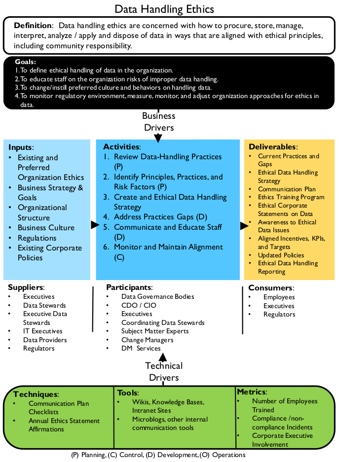
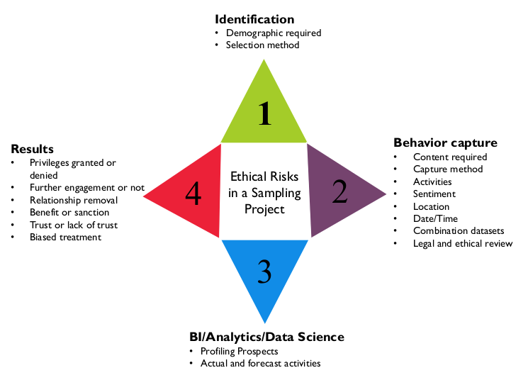

# Data Handling Ethics

## 1. Introduction

Defined simply, ethics are principles of behavior based on ideas of right and wrong. Ethical principles often focus on ideas such as fairness, respect, responsibility, integrity, quality, reliability, transparency, and trust. Data handling ethics are concerned with how to procure, store, manage, use, and dispose of data in ways that are aligned with ethical principles. Handling data in an ethical manner is necessary to the long-term success of any organization that wants to get value from its data. Unethical data handling can result in the loss of reputation and customers, because it puts at risk people whose data is exposed. In some cases, unethical practices are also illegal.[^18] Ultimately, for data management professionals and the organizations for which they work, data ethics are a matter of social responsibility.

The ethics of data handling are complex, but they center on several core concepts:

* Impact on people: Because data represents characteristics of individuals and is used to make decisions that affect people’s lives, there is an imperative to manage its quality and reliability.
* Potential for misuse: Misusing data can negatively affect people and organizations, so there is an ethical imperative to prevent the misuse of data.
* Economic value of data: Data has economic value. Ethics of data ownership should determine how that value can be accessed and by whom.

Organizations protect data based largely on laws and regulatory requirements. Nevertheless, because data represents people (customers, employees, patients, vendors, etc.), data management professionals should recognize that there are ethical (as well as legal) reasons to protect data and ensure it is not misused. Even data that does not directly represent individuals can still be used to make decisions that affect people’s lives.

There is an ethical imperative not only to protect data, but also to manage its quality. People making decisions, as well as those impacted by decisions, expect data to be complete and accurate. From both a business and a technical perspective, data management professionals have an ethical responsibility to manage data in a way that reduces the risk that it may misrepresent, be misused, or be misunderstood. This responsibility extends across the data lifecycle, from creation to destruction of data.

Figure 12 Context Diagram: Data Handling Ethics

Unfortunately, many organizations fail to recognize and respond to the ethical obligations inherent in data management. They may adopt a traditional technical perspective and profess not to understand the data; or they assume that if they follow the letter of the law, they have no risk related to data handling. This is a dangerous assumption.

The data environment is evolving rapidly. Organizations are using data in ways they would not have imagined even a few years ago. While laws codify some ethical principles, legislation cannot keep up with the risks associated with evolution of the data environment. Organizations must recognize and respond to their ethical obligation to protect data entrusted to them by fostering and sustaining a culture that values the ethical handling of information.

## 2. Business Drivers

Like W. Edward Deming’s statements on quality, ethics means “doing it right when no one is looking.” An ethical approach to data use is increasingly being recognized as a competitive business advantage (Hasselbalch and Tranberg, 2016). Ethical data handling can increase the trustworthiness of an organization and the organization’s data and process outcomes. This can create better relationships between the organization and its stakeholders. Creating an ethical culture entails introducing proper governance, including institution of controls to ensure that both intended and resulting outcomes of data processing are ethical and do not violate trust or infringe on human dignity.

Data handling doesn’t happen in a vacuum, and customers and stakeholders expect ethical behavior and outcomes from businesses and their data processes. Reducing the risk that data for which the organization is responsible will be misused by employees, customers, or partners is a primary reason for an organization to cultivate ethical principles for data handling. There is also an ethical responsibility to secure data from criminals (i.e., to protect against hacking and potential data breaches. (See Chapter 7.)

Different models of data ownership influence the ethics of data handling. For example, technology has improved the ability of organizations to share data with each other. This ability means organizations need to make ethical decisions about their responsibility for sharing data that does not belong to them.

The emerging roles of Chief Data Officer, Chief Risk Officer, Chief Privacy Officer, and Chief Analytics Officer are focused on controlling risk by establishing acceptable practices for data handling. But responsibility extends beyond people in these roles. Handling data ethically requires organization-wide recognition of the risks associated with misuse of data and organizational commitment to handling data based on principles that protect individuals and respect the imperatives related to data ownership.

## 3. Essential Concepts

### 3.1 Ethical Principles for Data

The accepted tenets of bioethics, which focus on preserving human dignity, provide a good general starting point for principles of data ethics. For example, the Belmont Principles for medical research may be adapted in Information Management disciplines (US-HSS, 1979).

* Respect for Persons: This principle reflects the fundamental ethical requirement that people be treated in a way that respects their dignity and autonomy as human individuals. It also requires that in cases where people have ‘diminished autonomy’, extra care be taken to protect their dignity and rights.

When we consider data as an asset, do we keep in mind that data also affects, represents, or touches people? Personal data is different from other raw ‘assets’, like oil or coal. Unethical use of personal data can directly influence people’s interactions, employment opportunities, and place in the community. Do we design information systems in a way that limits autonomy or freedom of choice? Have we considered how processing data may affect people with mental or physical disabilities? Have we accounted for how they will access and utilize data? Does data processing take place on the basis of informed, valid consent?

* Beneficence: This principle has two elements: first, do not harm; second, maximize possible benefits and
minimize possible harms.

The ethical principle of ‘do not harm’ has a long history in medical ethics, but also has clear application in the context of data and information management. Ethical data and information practitioners should identify stakeholders and consider the outcomes of data processing and work to maximize benefit and minimize risk of harm caused by the processes designed. Is a process designed in a way that assumes a zero-sum outcome rather than a win-win situation? Is data processing unnecessarily invasive and is there a less risky way to meet the requirements of the business need? Is the data handling in question lacking transparency in a way that might hide possible harm to people?

* Justice: This principle considers the fair and equitable treatment of people.

Some questions that might be asked regarding this principle: Are people or groups of people being treated unequally under similar circumstances? Does the outcome of a process or algorithm result in effects that disproportionately benefit or harm a certain group of people? Is machine learning being trained using datasets that contain data inadvertently reinforcing cultural prejudices?

The United States Department of Homeland Security’s Menlo Report adapts the Belmont Principles to Information and Communication Technology Research, adding a fourth principle: Respect for Law and Public Interest (US-DHS, 2012).

In 2015, the European Data Protection Supervisor published an opinion on digital ethics highlighting the “engineering, philosophical, legal, and moral implications” of developments in data processing and Big Data. It called for a focus on data processing that upholds human dignity, and set out four pillars required for an information ecosystem that ensures ethical treatment of data (EDPS, 2015):

* Future-oriented regulation of data processing and respect for the rights to privacy and to data protection
* Accountable controllers who determine personal information processing
* Privacy conscious engineering and design of data processing products and services
* Empowered individuals

These principles map broadly to the principle set out in the Belmont Report, focusing on promoting human dignity and autonomy. The EDPS states that privacy is a fundamental human right. It challenges innovators to see dignity, privacy, and autonomy as a platform on which a sustainable digital environment is shaped, rather than an obstacle to development, and calls for transparency and communication with stakeholders.

Data Governance is a vital tool for ensuring these principles are considered in deciding who can do what with which data and under what circumstances processing is appropriate or necessary. The ethical impacts and risks of data processing on all stakeholders must be considered by practitioners, and managed in a similar manner to data quality.

### 3.2 Principles Behind Data Privacy Law

Public policy and law try to codify right and wrong based on ethical principles. But they cannot codify every circumstance. For example, privacy laws in the European Union, Canada, and the United States show different approaches to codifying data ethics. These principles can also provide a framework for organizational policy.

Privacy law is not new. Privacy and information privacy as concepts are firmly linked to the ethical imperative to respect human rights. In 1890, American legal scholars Samuel Warren and Louis Brandeis described privacy and information privacy as human rights with protections in common law that underpin several rights in the US constitution. In 1973, a code of Fair Information Practice was proposed, and the concept of information privacy as a fundamental right was reaffirmed in the US Privacy Act of 1974, which states that “the right to privacy is a personal and fundamental right protected by the Constitution of the United States”.

In the wake of human rights violations during the Second World War, the European Convention of Human Rights (1950) established both the general right to privacy and the specific right to information privacy (or the right to protection of one’s personal data) as human rights which are fundamental to upholding the right to Human Dignity. In 1980, the Organization for Economic Co-operation and Development (OECD) established Guidelines and Principles for Fair Information Processing that became the basis for the European Union’s data protection laws.

OECD’s eight core principles, the Fair Information Processing Standards, are intended to ensure that personal data is processed in a manner that respects individuals’ right to privacy. They include: limitations on data collection; an expectation that data will be of high quality; the requirement that when data is collected, it is done for a specific purpose; limitations on data usage; security safeguards; an expectation of openness and transparency; the right of an individual to challenge the accuracy of data related to himself or herself; and accountability for organizations to follow the guidelines.

The OECD principles have since been superseded by principles underlying the General Data Protection Regulation of the EU, (GDPR, 2016). See Table 1.

Table 1 GDPR Principles

| GDPR Principle | Description of Principle |
|----------------|--------------------------|
| Fairness, Lawfulness, Transparency  | Personal data shall be processed lawfully, fairly, and in a transparent manner in relation to the data subject. |
| Purpose Limitation                  | Personal data must be collected for specified, explicit, and legitimate purposes, and not processed in a manner that is incompatible with those purposes. |
| Data Minimization                   | Personal data must be adequate, relevant, and limited to what is necessary in relation to the purposes for which they are processed. |
| Accuracy                            | Personal data must be accurate, and where necessary, kept up-to-date. Every reasonable step must be taken to ensure that personal data that are inaccurate, having regard to the purpose for which they are processed, are erased or rectified without delay. |
| Storage Limitation                  | Data must be kept in a form that permits identification of data subjects [individuals] for no longer than is necessary for the purposes for which the personal data are processed. |
| Integrity and Confidentiality       | Data must be processed in a manner that ensures appropriate security of the personal data, including protection against unauthorized or unlawful processing and against accidental loss, destruction or damage, using appropriate technical or organizational measures. |
| Accountability                      | Data Controllers shall be responsible for, and be able to demonstrate compliance with [these principles]. |

These principles are balanced by and support certain qualified rights individuals have to their data, including the rights to access, rectification of inaccurate data, portability, the right to object to processing of personal data that may cause damage or distress, and erasure. When processing of personal data is done based on consent, that consent must be an affirmative action that is freely given, specific, informed, and unambiguous. The GDPR requires effective governance and documentation to enable and demonstrate compliance and mandates Privacy by Design.

Canadian privacy law combines a comprehensive regime of privacy protection with industry self-regulation. PIPEDA (Personal Information Protection and Electronic Documents Act) applies to every organization that collects, uses, and disseminates personal information in the course of commercial activities. It stipulates rules, with exceptions, that organizations must follow in their use of consumers’ personal information. Table 2 describes statutory obligations based on PIPEDA.[^19]

In Canada, the Federal Privacy Commissioner has the sole responsibility for handling privacy complaints against organizations. However, they fill an ombudsman role; their decisions are only recommendations (not legally binding and with no precedential value, even within the commissioner’s office).

Table 2 Canadian Privacy Statutory Obligations

| PIPEDA Principle | Description of Principle |
|------------------|--------------------------|
| Accountability                                      | An organization is responsible for personal information under its control and must designate an individual to be accountable for the organization's compliance with the principle.
| Identifying Purposes                                | An organization must identify the purposes for which personal information is collected at or before the time the information is collected.
| Consent                                             | An organization must obtain the knowledge and consent of the individual for the collection, use, or disclosure of personal information, except where inappropriate.
| Limiting Collection, Use, Disclosure, and Retention | The collection of personal information must be limited to that which is necessary for the purposes identified by the organization. Information shall be collected by fair and lawful means. Personal information shall not be used or disclosed for purposes other than those for which it was collected, except with the consent of the individual or as required by law. Personal information shall be retained only as long as necessary for the fulfillment of those purposes.
| Accuracy                                            | Personal information must be as accurate, complete, and up-to-date as is necessary for the purposes for which it is to be used.
| Safeguards                                          | Personal information must be protected by security safeguards appropriate to the sensitivity of the information.
| Openness                                            | An organization must make specific information about its policies and practices relating to the management of their personal information readily available to individuals.
| Individual Access                                   | Upon request, an individual shall be informed of the existence, use, and disclosure of his or her personal information, and shall be given access to that information. An individual shall be able to challenge the accuracy and completeness of the information and have it amended as appropriate.
| Compliance Challenges                               | An individual shall be able to address a challenge concerning compliance with the above principles to the designated individual or individuals accountable for the organization's compliance.

In March 2012, the US Federal Trade Commission (FTC) issued a report recommending organizations design and implement their own privacy programs based on best practices described in the report (i.e., Privacy by Design) (FTC 2012). The report reaffirms the FTC’s focus on Fair Information Processing Principles (see Table 3).

Table 3 United States Privacy Program Criteria

| Principle | Description of Principle |
|-----------|--------------------------|
| Notice / Awareness      | Data collectors must disclose their information practices before collecting personal information from consumers.
| Choice / Consent        | Consumers must be given options with respect to whether and how personal information collected from them may be used for purposes beyond those for which the information was provided.
| Access / Participation  | Consumers should be able to view and contest the accuracy and completeness of data collected about them.
| Integrity / Security    | Data collectors must take reasonable steps to assure that information collected from consumers is accurate and secure from unauthorized use.
| Enforcement / Redress   | The use of a reliable mechanism to impose sanctions for noncompliance with these fair information practices.

These principles are developed to embody the concepts in the OECD Fair Information Processing Guidelines, including emphasis on data minimization (reasonable collection limitation) and storage limitation (sound retention), accuracy, and the requirement that companies must provide reasonable security for consumer data. Other focuses for fair information practices include:

* Simplified consumer choice to reduce the burden placed on consumers
* The recommendation to maintain comprehensive data management procedure throughout the information lifecycle
* Do Not Track option
* Requirements for affirmative express consent
* Concerns regarding the data collection capabilities of large platform providers; transparency and clear privacy notices and policies
* Individuals’ access to data
* Educating consumers about data privacy practices
* Privacy by Design

There is a global trend towards increasing legislative protection of individuals’ information privacy, following the standards set by EU legislation. Laws around the world place different kinds of restrictions on the movement of data across international boundaries. Even within a multinational organization, there will be legal limits to sharing information globally. It is therefore important that organizations have policies and guidelines that enable staff to follow legal requirements as well as use data within the risk appetite of the organization.

### 3.3 Online Data in an Ethical Context

There are now emerging dozens of initiatives and programs designed to create a codified set of principles to inform ethical behaviors online in the United States (Davis, 2012). Topics include:

* Ownership of data: The rights to control one’s personal data in relation to social media sites and data brokers. Downstream aggregators of personal data can embed data into deep profiles that individuals are not aware of.
* The Right to be Forgotten: To have information about an individual be erased from the web, particularly to adjust online reputation. This topic is part of data retention practices in general.
* Identity: Having the right to expect one identity and a correct identity, and to opt for a private identity.
* Freedom of speech online: Expressing one’s opinions versus bullying, terror inciting, ‘trolling,’ or insulting.

### 3.4 Risks of Unethical Data Handling Practices

Most people who work with data know that it is possible to use data to misrepresent facts. The classic book How to Lie with Statistics by Darrell Huff (1954) describes a range of ways that data can be used to misrepresent facts while creating a veneer of factuality. Methods include judicious data selection, manipulation of scale, and omission of some data points. These approaches are still at work today.

One way to understand the implications of ethical handling of data is to examine practices that most people would agree are unethical. Ethical data handling entails a positive duty to handle data according to ethical principles such as trustworthiness. Ensuring data is trustworthy may include measuring is against Data Quality dimensions such as accuracy and timeliness. It also includes a base level of truthfulness and transparency – not using data to lie or mislead, and being transparent regarding the sources, uses, and intent behind an organization’s data handling. The following scenarios describe unethical data practices that violate these principles among others.

### 3.4.1 Timing

It is possible to lie through omission or inclusion of certain data points in a report or activity based on timing. Equity market manipulation through ‘end of day’ stock trades can artificially raise a stock price at closing of the market giving an artificial view of the stock’s worth. This is called market timing and is illegal.

Business Intelligence staff may be the first to notice anomalies. In fact, they are now seen as valuable players in the stock trading centers of the world recreating trading patterns looking for such problems as well as analyzing reports and reviewing and monitoring rules and alerts. Ethical Business Intelligence staff may need to alert appropriate governance or management functions to such anomalies.

### 3.4.2 Misleading Visualizations

Charts and graphs can be used to present data in a misleading manner. For instance, changing scale can make a trend line look better or worse. Leaving data points out, comparing two facts without clarifying their relationship, or ignoring accepted visual conventions (such as that the numbers in a pie chart representing percentages must add up to 100 and only 100), can also be used to trick people into interpreting visualizations in ways that are not supported by the data itself. [^20]

### 3.4.3 Unclear Definitions or Invalid Comparisons

A US news outlet reported, based on 2011 US Census Bureau data, that 108.6 million people in the US were on welfare yet only 101.7 million people had full time jobs, making it seem that a disproportionate percentage of the overall population was on welfare. [^21] Media Matters explained the discrepancy: The 108.6 million figure for the number of “people on welfare” comes from a Census Bureau’s account ... of participation in means-tested programs, which include “anyone residing in a household in which one or more people received benefits” in the fourth quarter of 2011, thus including individuals who did not themselves receive government benefits. On the other hand, the “people with a full time job” figure ... included only individuals who worked, not individuals residing in a household where at least one person works. [^22]

The ethical thing to do, in presenting information, is to provide context that informs its meaning, such as a clear, unambiguous definition of the population being measured and what it means to be “on welfare.” When required context is left out, the surface of the presentation may imply meaning that the data does not support. Whether this effect is gained through the intent to deceive or through simply clumsiness, it is an unethical use of data.

It is also simply necessary, from an ethical perspective, not to misuse statistics.

Statistical ‘smoothing’ of numbers over a period could completely change perception of the number. ‘Data mining snooping’ is a recently coined term for a phenomenon in data mining statistical investigations where exhaustive correlations are performed on a data set, essentially over training a statistical model. Because of the behavior of ‘statistical significance’, it is reasonable to expect some statistically significant-looking results that are actually random results. The untrained can be misled. This is common in the financial and medical sectors (Jensen, 2000; ma.utexas.edu, 2012). [^23]

### 3.4.4 Bias

Bias refers to an inclination of outlook. On the personal level, the term is associated with unreasoned judgments or prejudices. In statistics, bias refers to deviations from expected values. These are often introduced through systematic errors in sampling or data selection. [^24] Bias can be introduced at different points in the data lifecycle: when data is collected or created, when it is selected for inclusion in analysis, through the methods by which it is analyzed, and in how the results of analysis are presented.

The ethical principle of justice creates a positive duty to be aware of possible biases that might influence data collection, processing, analysis, or interpretation. This is particularly important in the case of large-scale data processing that might disproportionately affect groups of people that have been historically subjected to prejudice or unfair treatment. Using data without addressing the ways in which bias may be introduced can compound prejudice while reducing transparency in process, giving the resulting outcomes the veneer of impartiality or neutrality when they are not neutral. There are several types of bias:

* Data Collection for pre-defined result: The analyst is pressured to collect data and produce results in order to reach a pre-defined conclusion, rather than as an effort to draw an objective conclusion.
* Biased use of data collected: Data may be collected with limited bias, but an analyst is pressured to use it to confirm a pre-determined approach. Data may even be manipulated to this end (i.e., some data may be discarded if it does not confirm the approach).
* Hunch and search: The analyst has a hunch and wants to satisfy that hunch, but uses only the data that confirms the hunch and does not account for other possibilities that the data may surface.
* Biased sampling methodology: Sampling is often a necessary part of data collection. But bias can be introduced by the method used to select the sample set. It is virtually impossible for humans to sample without bias of some sort. To limit bias, use statistical tools to select samples and establish adequate sample sizes. Awareness of bias in data sets used for training is particularly important.
* Context and Culture: Biases are often culturally or contextually-based, so stepping outside that culture or context is required for a neutral look at the situation.

Questions of bias are dependent on many factors, such as the type of data processing in question, the stakeholders involved, how data sets are populated, the business need being fulfilled, and the expected outcomes of the process. However, it is not always possible or even desirable to remove all bias. Business bias against poor customers (customers with whom no further business is sought) is a foundational piece to many scenarios built by business analysts; they are de-selected from samples, or ignored in the analysis. In such a case, analysts should document the criteria they used to define the population they are studying. In contrast, predictive algorithms determining ‘criminal risk’ of individuals or predictive policing sending resources to specific neighborhoods would have a much higher risk of violating ethical principles of justice or fairness, and should have greater precautions to ensure algorithmic transparency and accountability and to counter bias in data sets training any predictive algorithms. [^25]

### 3.4.5 Transforming and Integrating Data

Data integration presents ethical challenges because data is changed as it moves from system to system. If data is not integrated with care, it presents risk for unethical or even illegal data handling. These ethical risks intersect with fundamental problems in data management, including:

* Limited knowledge of data’s origin and lineage: If an organization does not know where data came from and how it has changed as it has moved between systems, then the organization cannot prove that the data represents what they claim it represents.
* Data of poor quality: Organizations should have clear, measurable standards for data quality, and should measure their data to confirm that it meets standards for quality. Without this confirmation, an organization cannot vouch for the data and data consumers may be at risk or put others at risk when they use the data.
* Unreliable Metadata: Data consumers depend on reliable Metadata, including consistent definitions of individual data elements, documentation of data’s origin, and documentation of lineage (e.g., rules by which data is integrated). Without reliable Metadata, data may be misunderstood and potentially misused.In cases where data may move between organizations and especially where it may move across borders, Metadata should include tags that indicate its provenance, who owns it, and if it requires specific protection.
* No documentation of data remediation history: Organizations should also have auditable information related to the ways data has been changed. Even if the intention of data remediation is to improve the quality of data, doing so may be illegal. Data remediation should always follow a formal, auditable change control process.

### 3.4.6 Obfuscation / Redaction of Data

Obfuscating or redacting data is the practice of making information anonymous, or removing sensitive information. But obfuscation alone may not be sufficient to protect data if a downstream activity (analysis or combination with other datasets) can expose the data. This risk is present in the following instances:

* Data aggregation: When aggregating data across some set of dimensions, and removing identifying data, a dataset can still serve an analytic purpose without concern for disclosing personal identifying information (PII). Aggregations into geographic areas are a common practice (see Chapters 7 and 14).
* Data marking: Data marking is used to classify data sensitivity (secret, confidential, personal, etc.) and to control release to appropriate communities such as the public or vendors, or even vendors from certain countries or other community considerations.
* Data masking: Data masking is a practice where only appropriate submitted data will unlock processes. Operators cannot see what the appropriate data might be; they simply type in responses given to them, and if those responses are correct, further activities are permitted. Business processes using data masking include outsourced call centers, or sub-contractors who should only have partial access to information.

The use of extremely large data sets in Data Science analyses raises practical rather than merely theoretical concerns about the effectiveness of anonymization. Within large data sets, it is possible to combine data in ways enable individuals to be specifically identified, even if input data sets have been anonymized. The first concern when data lands in a data lake is to analyze it for sensitive data and apply accepted protection methods. These alone may not offer enough safeguard, however; this is why it is vital that organizations have strong governance and a commitment to ethical data handling. (See Chapter 14.)

### 3.5 Establishing an Ethical Data Culture

Establishing a culture of ethical data handling requires understanding existing practices, defining expected behaviors, codifying these in policies and a code of ethics, and providing training and oversight to enforce expected behaviors. As with other initiatives related to governing data and to changing culture, this process requires strong leadership.

Ethical handling of data obviously includes following the law, but also influences how data is analyzed and interpreted, as well as how it is leveraged internally and externally. An organizational culture that clearly values ethical behavior will not only have codes of conduct, but will ensure that clear communication and governance controls are in place to support employees with queries and proper escalation paths so that if employees become aware of unethical practices or ethical risk they are able to highlight the problem or stop the process without fear of retaliation. Improving an organization’s ethical behavior regarding data requires a formal Organizational Change Management (OCM) process. (See Chapter 17.)

### 3.5.1 Review Current State Data Handling Practices

The first step to improvement is understanding the current state. The purpose of reviewing existing data handling practices is to understand the degree to which they are directly and explicitly connected to ethical and compliance drivers. This review should also identify how well employees understand the ethical implications of existing practices in building and preserving the trust of customers, partners, and other stakeholders. The deliverable from the review should document ethical principles that underlie the organization’s collection, use, and oversight of data, throughout the data lifecycle, including data sharing activities.

### 3.5.2 Identify Principles, Practices, and Risk Factors

The purpose of formalizing ethical practices around data handling is to reduce the risk that data might be misused and cause harm to customers, employees, vendors, other stakeholders, or the organization as a whole. An organization trying to improve its practices should be aware of general principles, such as the necessity of protecting the privacy of individuals, as well as industry-specific concerns, such as the need to protect financial or health-related information.

An organization’s approach to data ethics must align with legal and regulatory compliance requirements. For example, organizations that operate globally need to have a broad knowledge of the ethical principles at the foundation of the laws of the countries in which they operate, as well as specific knowledge of the agreements between countries. In addition, most organizations have specific risks, which may be related to their technology footprint, their rate of employee turnover, the means by which they collect customer data, or other factors.

Principles should be aligned with risks (bad things that can happen if the principles are not adhered to) and practices (the right ways of doing things so that risks are avoided). Practices should be supported by controls, as illustrated in the following example:

* Guiding principle: People have a right to privacy with respect to information about their health. Therefore, the personal health data of patients should not be accessed except by people who are authorized to access it as part of caring for patients.
* Risk: If there is wide access to the personal health data of patients, then information about individuals could become public knowledge, thereby jeopardizing their right to privacy.
* Practice: Only nurses and doctors will be allowed to access the personal health data of patients and only for purposes of providing care.
* Control: There will be an annual review of all users of the systems that contain personal health information of patients to ensure that only those people who need to have access do have access.

### 3.5.3 Create an Ethical Data Handling Strategy and Roadmap

After a review of current state and the development of a set of principles, an organization can formalize a strategy to improve its data handling practices. This strategy must express both ethical principles and expected behavior related to data, expressed in values statements and a code of ethical behavior. The component pieces of such a strategy include:

* Values statements: Values statements describe what the organization believes in. Examples might include truth, fairness, or justice. These statements provide a framework for ethical handling of data and decision-making.
* Ethical data handling principles: Ethical data handling principles describe how an organization approaches challenges presented by data; for example, how to respect the right of individuals to privacy. Principles and expected behaviors can be summarized in a code of ethics and supported through an ethics policy. Socialization of the code and policy should be included in the training and communications plan. • Compliance framework: A compliance framework includes factors that drive organizational obligations. Ethical behaviors should enable the organization to meet compliance requirements. Compliance requirements are influenced by geographic and sector concerns.
* Risk assessments: Risk assessments identify the likelihood and the implications of specific problems arising within the organization. These should be used to prioritize actions related to mitigation, including employee compliance with ethical principles.
* Training and communications: Training should include review of the code of ethics. Employee must sign off that they are familiar with the code and the implications of unethical handling of data. Training needs to be ongoing; for example, through a requirement for an annual ethics statement affirmation. Communications should reach all employees.
* Roadmap: The roadmap should include a timeline with activities that can be approved by management. Activities will include execution of the training and communications plan, identification and remediation of gaps in existing practices, risk mitigation, and monitoring plans. Develop detailed statements that reflect the target position of the organization on the appropriate handling of data, include roles, responsibilities, and processes, and references to experts for more information. The roadmap should cover all applicable laws, and cultural factors.
* Approach to auditing and monitoring: Ethical ideas and the code of ethics can be reinforced through training. It is also advisable to monitor specific activities to ensure that they are being executed in compliance with ethical principles.

### 3.5.4 Adopt a Socially Responsible Ethical Risk Model

Data professionals involved in Business Intelligence, analytics, and Data Science are often responsible for data that describes:

* Who people are, including their countries of origin and their racial, ethnic, and religious characteristics
* What people do, including political, social, and potentially criminal activities
* Where people live, how much money they have, what they buy, who they talk with or text or send email to
* How people are treated, including outcomes of analysis, such as scoring and preference tracking that will tag them as ultimately privileged or not for future business

This data can be misused and counteract the principles underlying data ethics: respect for persons, beneficence, and justice.

Executing BI, analytics, and Data Science activities fairly requires an ethical perspective that looks beyond the boundaries of the organization for which people work and accounts for implications to the wider community. An ethical perspective is necessary not only because data can easily be misused but also because organizations have a social responsibility not to do harm with their data.

For example, an organization might set criteria for what it considers ‘bad’ customers in order to stop doing business with those individuals. But if that organization has a monopoly on an essential service in a particular geographic area, then some of those individuals may find themselves without that essential service and they will be in harm’s way because of the organization’s decision.

Projects that use personal data should have a disciplined approach to the use of that data. See Figure 13. They should account for:

* How they select their populations for study (arrow 1)
* How data will be captured (arrow 2)
* What activities analytics will focus on (arrow 3)
* How the results will be made accessible (arrow 4)

Within each area of consideration, they should address potential ethical risks, with a particular focus on possible negative effects on customers or citizens.

A risk model can be used to determine whether to execute the project. It will also influence how to execute the project. For example, the data will be made anonymous, the private information removed from the file, the security on the files tightened or confirmed, and a review of the local and other applicable privacy law reviewed with legal. Dropping customers may not be permitted under law if the organization is a monopoly in a jurisdiction, and citizens have no other provider options such as energy or water.

Because data analytics projects are complex, people may not see the ethical challenges. Organizations need to actively identify potential risks. They also need to protect whistleblowers who do see risks and raise concerns. Automated monitoring is not sufficient protection from unethical activities. People – the analysts themselves – need to reflect on possible bias. Cultural norms and ethics in the workplace influence corporate behavior – learn and use the ethical risk model. DAMA International encourages data professionals to take a professional stand, and present the risk situation to business leaders who may not have recognized the implications of particular uses of data and these implications in their work.

Figure 13 Ethical Risk Model for Sampling Projects

### 3.6 Data Ethics and Governance

Oversight for the appropriate handling of data falls under both data governance and legal counsel. Together they are required to keep up-to-date on legal changes, and reduce the risk of ethical impropriety by ensuring employees are aware of their obligations. Data Governance must set standards and policies for and provide oversight of data handling practices. Employees must expect fair handling, protection from reporting possible breaches, and non-interference in their personal lives. Data Governance has a particular oversight requirement to review plans and decisions proposed by BI, analytics and Data Science studies.

DAMA International’s Certified Data Management Professional (CDMP) certification requires that data management professional subscribe to a formal code of ethics, including an obligation to handle data ethically for the sake of society beyond the organization that employs them.

## 4. Works Cited / Recommended

Blann, Andrew. Data Handling and Analysis. Oxford University Press, 2015. Print. Fundamentals of Biomedical Science.

Council for Big Data, Ethics, and Society (website) http://bit.ly/2sYAGAq.

Davis, Kord. Ethics of Big Data: Balancing Risk and Innovation. O'Reilly Media, 2012. Print.

European Data Protection Supervisor (EDPS). Opinion 4/2015 “Towards a new digital ethics: Data, dignity and technology.” http://bit.ly/2sTFVlI.

Federal Trade Commission, US (FTC). Federal Trade Commission Report Protecting Consumer Privacy in an Era of Rapid Change. March 2012. http://bit.ly/2rVgTxQ and http://bit.ly/1SHOpRB.

GDPR REGULATION (EU) 2016/679 OF THE EUROPEAN PARLIAMENT AND OF THE COUNCIL of 27 April 2016 on the protection of natural persons with regard to the processing of personal data and on the free movement of such data, and repealing Directive 95/46/EC (General Data Protection Regulation).

Hasselbalch, Gry and Pernille Tranberg. Data Ethics: The New Competitive Advantage. Publishare. 2016.

Huff, Darrell. How to Lie with Statistics. Norton, 1954. Print.

Jensen, David. “Data Snooping, Dredging and Fishing: The Dark Side of Data Mining A SIGKDD99 Panel Report.” SIGKDD Explorations. ACM SIGKDD, Vol. 1, Issue 2. January 2000. http://bit.ly/2tNThMK.

Johnson, Deborah G. Computer Ethics. 4th ed. Pearson, 2009. Print.

Kaunert, C. and S. Leonard, eds. European Security, Terrorism and Intelligence: Tackling New Security Challenges in Europe. Palgrave Macmillan, 2013. Print. Palgrave Studies in European Union Politics.

Kim, Jae Kwan and Jun Shao. Statistical Methods for Handling Incomplete Data. Chapman and Hall/CRC, 2013. Chapman and Hall/CRC Texts in Statistical Science.

Lake, Peter. A Guide to Handling Data Using Hadoop: An exploration of Hadoop, Hive, Pig, Sqoop and Flume. Peter Lake, 2015.

Lewis, Colin and Dagmar Monett. AI and Machine Learning Black Boxes: The Need for Transparency and Accountability. KD Nuggets (website), April 2017. http://bit.ly/2q3jXLr.

Lipschultz, Jeremy Harris. Social Media Communication: Concepts, Practices, Data, Law and Ethics. Routledge, 2014. Print.

Mayfield, M.I. On Handling the Data. CreateSpace Independent Publishing Platform, 2015. Print.

Mazurczyk, Wojciech et al. Information Hiding in Communication Networks: Fundamentals, Mechanisms, and Applications. Wiley-IEEE Press, 2016. Print. IEEE Press Series on Information and Communication Networks Security.

Naes, T. and E. Risvik eds. Multivariate Analysis of Data in Sensory Science. Volume 16. Elsevier Science, 1996. Print. Data Handling in Science and Technology (Book 16).

Olivieri, Alejandro C. et al, eds. Fundamentals and Analytical Applications of Multi-way Calibration. Volume 29. Elsevier, 2015. Print. Data Handling in Science and Technology (Book 29).

ProPublica (website). “Machine Bias: Algorithmic injustice and the formulas that increasingly influence our lives.” May 2016 http://bit.ly/2oYmNRu.

Provost, Foster and Tom Fawcett. Data Science for Business: What you need to know about data mining and data-analytic thinking. O'Reilly Media, 2013. Print.

Quinn, Michael J. Ethics for the Information Age. 6th ed. Pearson, 2014. Print.

Richards, Lyn. Handling Qualitative Data: A Practical Guide. 3 Pap/Psc ed. SAGE Publications Ltd, 2014. Print.

Thomas, Liisa M. Thomas on Data Breach: A Practical Guide to Handling Data Breach Notifications Worldwide. LegalWorks, 2015. Print.

Tufte, Edward R. The Visual Display of Quantitative Information. 2nd ed. Graphics Pr., 2001. Print.

University of Texas at Austin, Department of Mathematics (website). Common Misteaks Mistakes in Using Statistics. http://bit.ly/2tsWthM. Web.

US Department of Health and Human Services. The Belmont Report. 1979. http://bit.ly/2tNjb3u (US-HSS, 2012).

US Department of Homeland Security. “Applying Principles to Information and Communication Technology Research: A Companion to the Department of Homeland Security Menlo Report”. January 3, 2012. http://bit.ly/2rV2mSR (US-DHS, 1979).

Witten, Ian H., Eibe Frank and Mark A. Hall. Data Mining: Practical Machine Learning Tools and Techniques. 3rd ed. Morgan Kaufmann, 2011. Print. Morgan Kaufmann Series in Data Management Systems.

[^18]: HIPAA (Health Insurance Portability and Accountability Act) in the US, PIPEDA (Personal Information Protection and Electronic Documents Act) in Canada, the EU General Data Protection Regulation (GDPR) and other data protection / information privacy laws describe obligations toward the handling of personal identifying data (e.g., name, addresses, religious affiliation, or sexual orientation) and privacy (access or restriction to this information).
[^19]: http://bit.ly/2tNM53c.
[^20]: How To Statistics (Website). Misleading Graphs: Real Life Examples. 24 January 2014. http://bit.ly/1jRLgRH See also io9 (Website). The Most Useless and Misleading Infographics on the Internet. http://bit.ly/1YDgURl See http://bit.ly/2tNktve Google “misleading data visualization” for additional examples. For counter examples, i.e., visuals with an ethical base, see Tufte (2001).
[^21]: As of 2015, the overall population of the US is estimated to be 321.4 million people. http://bit.ly/2iMlP58
[^22]: http://mm4a.org/2spKToU The example also demonstrates misleading visuals, as on the bar graph, the 108.6 million bar was shown as approximately 5 times larger than the 101.7 million column.
[^23]: See also numerous articles by W. Edwards Deming at: http://bit.ly/2tNnlZh
[^24]: http://bit.ly/2lOzJqU
[^25]: For examples of machine learning bias see Brennan (2015) and the Ford Foundation and ProPublica websites. In addition to bias, there is the problem of opaqueness. As predictive algorithms of learning machines become more complex, it is difficult to track the logic and lineage of their decisions. See Lewis and Monett (2017). http://bit.ly/1Om41ap; http://bit.ly/2oYmNRu.