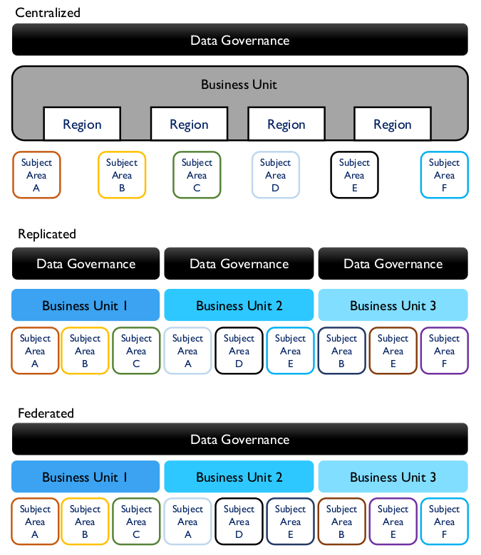

# Data Governance

## 1. Introduction

Data Governance (DG) is defined as the exercise of authority and control (planning, monitoring, and enforcement) over the management of data assets. All organizations make decisions about data, regardless of whether they have a formal Data Governance function. Those that establish a formal Data Governance program exercise authority and control with greater intentionality (Seiner, 2014). Such organizations are better able to increase the value they get from their data assets.

The Data Governance function guides all other data management functions. The purpose of Data Governance is to ensure that data is managed properly, according to policies and best practices (Ladley, 2012). While the driver of data management overall is to ensure an organization gets value out of its data, Data Governance focuses on how decisions are made about data and how people and processes are expected to behave in relation to data. The scope and focus of a particular data governance program will depend on organizational needs, but most programs include:

* Strategy: Defining, communicating, and driving execution of Data Strategy and Data Governance Strategy
* Policy: Setting and enforcing policies related to data and Metadata management, access, usage, security, and quality
* Standards and quality: Setting and enforcing Data Quality and Data Architecture standards
* Oversight: Providing hands-on observation, audit, and correction in key areas of quality, policy, and data management (often referred to as stewardship)
* Compliance: Ensuring the organization can meet data-related regulatory compliance requirements
* Issue management: Identifying, defining, escalating, and resolving issues related to data security, data access, data quality, regulatory compliance, data ownership, policy, standards, terminology, or data governance procedures
* Data management projects: Sponsoring efforts to improve data management practices
* Data asset valuation: Setting standards and processes to consistently define the business value of data assets

To accomplish these goals, a Data Governance program will develop policies and procedures, cultivate data stewardship practices at multiple levels within the organization, and engage in organizational change management efforts that actively communicate to the organization the benefits of improved data governance and the behaviors necessary to successfully manage data as an asset.

For most organizations, adopting formal Data Governance requires the support of organizational change management (see Chapter 17), as well as sponsorship from a C-level executive, such as Chief Risk Officer, Chief Financial Officer, or Chief Data Officer.

The ability to create and share data and information has transformed our personal and economic interactions. Dynamic market conditions and a heightened awareness of data as a competitive differentiator are causing organizations to realign data management responsibilities. This type of change is clear in the financial, ecommerce, government, and retail sectors. Organizations increasingly strive to become data-driven – proactively considering data requirements as part of strategy development, program planning, and technology implementation. However, doing so often entails significant cultural challenges. Moreover, because culture can derail any strategy, Data Governance efforts need to include a cultural change component – again, supported by strong leadership.

To benefit from data as a corporate asset, the organizational culture must learn to value data and data management activities. Even with the best data strategy, data governance and data management plans will not succeed unless the organization accepts and manages change. For many organizations, cultural change is a major challenge. One of the foundational tenets of change management is that organizational change requires individual change (Hiatt and Creasey, 2012). When data governance and data management demand significant behavioral changes, formal change management is required for success.

### 1.1 Business Drivers

The most common driver for data governance is often regulatory compliance, especially for heavily regulated industries, such as financial services and healthcare. Responding to evolving legislation requires strict data governance processes. The explosion in advanced analytics and Data Science has created an additional driving force.

While compliance or analytics may drive governance, many organizations back into data governance via an information management program driven by other business needs, such as Master Data Management (MDM), by major data problems, or both. A typical scenario: a company needs better customer data, it chooses to develop Customer MDM, and then it realizes successful MDM requires data governance.

Data governance is not an end in itself. It needs to align directly with organizational strategy. The more clearly it helps solve organizational problems, the more likely people will change behaviors and adopt governance practices. Drivers for data governance most often focus on reducing risks or improving processes.

* Reducing Risk
  * General risk management: Oversight of the risks data poses to finances or reputation, including response to legal (E-Discovery) and regulatory issues.
  * Data security: Protection of data assets through controls for the availability, usability, integrity, consistency, auditability and security of data.
  * Privacy: Control of private / confidential / Personal Identifying Information (PII) through policy and compliance monitoring.
* Improving Processes
  * Regulatory compliance: The ability to respond efficiently and consistently to regulatory requirements.
  * Data quality improvement: The ability to contribute to improved business performance by making data more reliable.
  * Metadata Management: Establishment of a business glossary to define and locate data in the organization; ensuring the wide range of other Metadata is managed and made available to the organization.
  * Efficiency in development projects: SDLC improvements to address issues and opportunities in data management across the organization, including management of data-specific technical debt through governance of the data lifecycle.
  * Vendor management: Control of contracts dealing with data, such as cloud storage, external data purchase, sales of data as a product, and outsourcing data operations.

It is essential to clarify the particular business drivers for data governance within an organization and to align them with overall business strategy. Focusing the ‘DG organization’ often alienates leadership who perceive extra overhead without apparent benefits. Sensitivity to organizational culture is necessary to determine the right language, operating model, and roles for the program. As of the writing of the DMBOK2, the term organization is being replaced with terms like operating model or operating framework.

While people sometimes claim it is difficult to understand what data governance is, governance itself is a common concept. Rather than inventing new approaches, data management professionals can apply the concepts and principles of other types of governance to the governance of data. A common analogy is to equate data governance to auditing and accounting. Auditors and controllers set the rules for managing financial assets. Data governance professionals set rules for managing data assets. Other areas carry out these rules.

Data governance is not a one-time thing. Governing data requires an ongoing program focused on ensuring that an organization gets value from its data and reduces risks related to data. A Data Governance team can be a virtual organization or a line organization with specific accountabilities. To be effective, the roles and activities within data governance need to be well understood. They should be built around an operating framework that functions well in the organization. A data governance program should take into account distinctive organizational and cultural issues and the specific data management challenges and opportunities within the organization. (See Chapters 1 and 16.)

Data governance is separate from IT governance. IT governance makes decisions about IT investments, the IT application portfolio, and the IT project portfolio – in other words, hardware, software, and overall technical architecture. IT governance aligns the IT strategies and investments with enterprise goals and strategies. The COBIT (Control Objectives for Information and Related Technology) framework provides standards for IT governance, but only a small portion of the COBIT framework addresses managing data and information. Some critical topics, such as Sarbanes-Oxley compliance (U.S.A.), span the concerns of corporate governance, IT governance, and data governance. In contrast, Data Governance focuses exclusively on the management of data assets and of data as an asset.

### 1.2 Goals and Principles

The goal of Data Governance is to enable an organization to manage data as an asset. DG provides the principles, policy, processes, framework, metrics, and oversight to manage data as an asset and to guide data management activities at all levels. To achieve this overall goal, a DG program must be:

* Sustainable: The DG program needs to be ‘sticky’. DG is not a project with a defined end; it is an ongoing process that requires organizational commitment. DG necessitates changes in how data is managed and used. This does not always mean massive new organizations and upheaval. It does mean managing change in a way that is sustainable beyond the initial implementation of any data governance component. Sustainable data governance depends on business leadership, sponsorship, and ownership.
* Embedded: DG is not an add-on process. DG activities need to be incorporated into development methods for software, use of data for analytics, management of Master Data, and risk management.
* Measured: DG done well has positive financial impact, but demonstrating this impact requires understanding the starting point and planning for measurable improvement.

Implementing a DG program requires commitment to change. The following principles, developed since the early 2000s, can help set a strong foundation for data governance. [^26]

* Leadership and strategy: Successful Data Governance starts with visionary and committed leadership. Data management activities are guided by a data strategy that is itself driven by the enterprise business strategy.
* Business-driven: Data Governance is a business program, and, as such, must govern IT decisions related to data as much as it governs business interaction with data.
* Shared responsibility: Across all Data Management Knowledge Areas, data governance is a shared responsibility between business data stewards and technical data management professionals.
* Multi-layered: Data governance occurs at both the enterprise and local levels and often at levels in between.
* Framework-based: Because data governance activities require coordination across functional areas, the DG program must establish an operating framework that defines accountabilities and interactions.
* Principle-based: Guiding principles are the foundation of DG activities, and especially of DG policy. Often, organizations develop policy without formal principles – they are trying to solve particularproblems. Principles can sometimes be reverse-engineered from policy. However, it is best to articulate a core set of principles and best practices as part of policy work. Reference to principles can mitigate potential resistance. Additional guiding principles will emerge over time within an organization. Publish them in a shared internal environment along with other data governance artifacts.

### 1.3 Essential Concepts

Just as an auditor controls financial processes but does not actually execute financial management, data governance ensures data is properly managed without directly executing data management (see Figure 15). Data governance represents an inherent separation of duty between oversight and execution.

Figure 15 Data Governance and Data Management

### 1.3.1 Data-centric Organization

A data-centric organization values data as an asset and manages data through all phases of its lifecycle, including project development and ongoing operations. To become data-centric, an organization must change the way it translates strategy into action. Data is no longer treated as a by-product of process and applications. Ensuring data is of high quality is a goal of business processes. As organizations strive to make decisions based on insights gained from analytics, effective data management becomes a very high priority.

People tend to conflate data and information technology. To become data-centric, organizations need to think differently and recognize that managing data is different from managing IT. This shift is not easy. Existing culture, with its internal politics, ambiguity about ownership, budgetary competition, and legacy systems, can be a huge obstacle to establishing an enterprise vision of data governance and data management.

While each organization needs to evolve its own principles, those that seek to get more value from their data are likely to share the following:

* Data should be managed as a corporate asset
* Data management best practices should be incented across the organization
* Enterprise data strategy must be directly aligned with overall business strategy
* Data management processes should be continuously improved

### 1.3.2 Data Governance Organization

The core word in governance is govern. Data governance can be understood in terms of political governance. It includes legislative-like functions (defining policies, standards, and the Enterprise Data Architecture), judicial-like functions (issue management and escalation), and executive functions (protecting and serving, administrative responsibilities). To better manage risk, most organizations adopt a representative form of data governance, so that all stakeholders can be heard.

Each organization should adopt a governance model that supports its business strategy and is likely to succeed within its own cultural context. Organizations should also be prepared to evolve that model to meet new challenges. Models differ with respect to their organizational structure, level of formality, and approach to decision-making. Some models are centrally organized, while others are distributed.

Data governance organizations may also have multiple layers to address concerns at different levels within an enterprise – local, divisional, and enterprise-wide. The work of governance is often divided among multiple committees, each with a purpose and level of oversight different from the others.

Figure 16 represents a generic data governance model, with activities at different levels within the organization (vertical axis), as well as separation of governance responsibilities within organizational functions and between technical (IT) and business areas. Table 4 describes the typical committees that might be established within a data governance operating framework. Note this is not an organization chart. The diagram explains how various areas work together to carry out DG, in-line with the aforementioned trend to de-emphasize the term organization.

Figure 16 Data Governance Organization Parts

Table 4 Typical Data Governance Committees / Bodies

| Data Governance Body | Description |
|----------------------|-------------|
| Data Governance Steering Committee  | The primary and highest authority organization for data governance in an organization, responsible for oversight, support, and funding of data governance activities. Consists of a cross-functional group of senior executives. Typically releases funding for data governance and data governance-sponsored activities as recommended by the DGC and CDO. This committee may in turn have oversight from higher-level funding or initiative-based steering committees. |
| Data Governance Council (DGC)       | Manages data governance initiatives (e.g., development of policies or metrics), issues, and escalations. Consists of executive according to the operating model used. See Figure 17. |
| Data Governance Office (DGO)        | Ongoing focus on enterprise-level data definitions and data management standards across all DAMA-DMBOK Knowledge Areas. Consists of coordinating roles that are labelled as data stewards or custodians, and data owners. |
| Data Stewardship Teams              | Communities of interest focused on one or more specific subject-areas or projects, collaborating or consulting with project teams on data definitions and data management standards related to the focus. Consists of business and technical data stewards and data analysts. |
| Local Data Governance Committee     | Large organizations may have divisional or departmental data governance councils working under the auspices of an Enterprise DGC. Smaller organizations should try to avoid such complexity. |

### 1.3.3 Data Governance Operating Model Types

In a centralized model, one Data Governance organization oversees all activities in all subject areas. In a replicated model, the same DG operating model and standards are adopted by each business unit. In a federated model, one Data Governance organization coordinates with multiple Business Units to maintain consistent definitions and standards. (See Figure 17 and Chapter 16.)

Figure 17 Enterprise DG Operating Framework Examples [^27]

### 1.3.4 Data Stewardship
Data Stewardship is the most common label to describe accountability and responsibility for data and processes that ensure effective control and use of data assets. Stewardship can be formalized through job titles and descriptions, or it can be a less formal function driven by people trying to help an organization get value from its data. Often terms like custodian or trustee are synonyms for those who carry out steward-like functions.

The focus of stewardship activities will differ from organization to organization, depending on organizational strategy, culture, the problems an organization is trying to solve, its level of data management maturity, and the formality of its stewardship program. However, in most cases, data stewardship activities will focus on some, if not all, of the following:

* Creating and managing core Metadata: Definition and management of business terminology, valid data values, and other critical Metadata. Stewards are often responsible for an organization’s Business Glossary, which becomes the system of record for business terms related to data.
* Documenting rules and standards: Definition/documentation of business rules, data standards, and data quality rules. Expectations used to define high quality data are often formulated in terms of rules rooted in the business processes that create or consume data. Stewards help surface these rules in order to ensure that there is consensus about them within the organization and that they are used consistently.
* Managing data quality issues: Stewards are often involved with the identification and resolution of data related issues or in facilitating the process of resolution.
* Executing operational data governance activities: Stewards are responsible for ensuring that, day-to-day and project-by-project, data governance policies and initiatives are adhered to. They should influence decisions to ensure that data is managed in ways that support the overall goals of the organization.

### 1.3.5 Types of Data Stewards

A steward is a person whose job it is to manage the property of another person. Data Stewards manage data assets on behalf of others and in the best interests of the organization (McGilvray, 2008). Data Stewards represent the interests of all stakeholders and must take an enterprise perspective to ensure enterprise data is of high quality and can be used effectively. Effective Data Stewards are accountable and responsible for data governance activities and have a portion of their time dedicate to these activities.

Depending on the complexity of the organization and the goals of its DG program, formally appointed Data Stewards may be differentiated by their place within an organization, by the focus of their work, or by both. For example:

* Chief Data Stewards may chair data governance bodies in lieu of the CDO or may act as a CDO in a virtual (committee-based) or distributed data governance organization. They may also be Executive Sponsors.
* Executive Data Stewards are senior managers who serve on a Data Governance Council.
* Enterprise Data Stewards have oversight of a data domain across business functions.
* Business Data Stewards are business professionals, most often recognized subject matter experts, accountable for a subset of data. They work with stakeholders to define and control data.
* A Data Owner is a business Data Steward, who has approval authority for decisions about data within their domain.
* Technical Data Stewards are IT professionals operating within one of the Knowledge Areas, such as Data Integration Specialists, Database Administrators, Business Intelligence Specialists, Data Quality Analysts or Metadata Administrators.
* Coordinating Data Stewards lead and represent teams of business and technical Data Stewards in discussions across teams and with executive Data Stewards. Coordinating Data Stewards are particularly important in large organizations.

The first edition of the DAMA-DMBOK stated that “the best Data Stewards are often found, not made” (DAMA, 2009). This assertion acknowledges that in most organizations, there are people who steward data, even in the absence of a formal data governance program. Such individuals are already involved in helping the organization reduce data-related risks and get more value from its data. Formalizing their stewardship accountabilities recognizes the work they are doing and enables them to be more successful and to contribute more. All of that said, Data Stewards can be ‘made’; people can be trained to be Data Stewards. And people who are already stewarding data can develop their skills and knowledge so that they become better at the work of stewardship (Plotkin, 2014).

### 1.3.6 Data Policies

Data policies are directives that codify principles and management intent into fundamental rules governing the creation, acquisition, integrity, security, quality, and use of data and information.

Data policies are global. They support data standards, as well as expected behaviors related to key aspects of data management and use. Data policies vary widely across organizations. Data policies describe the ‘what’ of data governances (what to do and what not to do), while standards and procedures describe ‘how’ to do data governance. There should be relatively few data policies, and they should be stated briefly and directly.

### 1.3.7 Data Asset Valuation

Data asset valuation is the process of understanding and calculating the economic value of data to an organization. Because data, information, and even Business Intelligence are abstract concepts, people have difficulty aligning them with economic impact. The key to understanding the value of a non-fungible item (like data) is understanding how it is used and the value brought by its usage (Redman, 1996). Unlike many other assets (e.g., money, physical equipment), data sets are not interchangeable (fungible). One organization’s customer data differs from another organization’s in important ways; not only the customers themselves, but the data associated with them (purchasing history, preferences, etc.) How an organization gets value from customer data (i.e., what it learns about its customers from this data and how it applies what it learns) can be a competitive differentiator.

Most phases of the data lifecycle involve costs (including acquiring, storing, administering, and disposing of data). Data only brings value when it is used. When used, data also creates costs related to risk management. So value comes when the economic benefit of using data outweighs the costs of acquiring and storing it, as well as managing risk related to usage.

Some other ways to measure value include:

* Replacement cost: The replacement or recovery cost of data lost in a disaster or data breach, including the transactions, domains, catalogs, documents and metrics within an organization.
* Market value: The value as a business asset at the time of a merger or acquisition.
* Identified opportunities: The value of income that can be gained from opportunities identified in the data (in Business Intelligence), by using the data for transactions, or by selling the data.
* Selling data: Some organizations package data as a product or sell insights gained from their data.
* Risk cost: A valuation based on potential penalties, remediation costs, and litigation expenses, derived from legal or regulatory risk from:
  * The absence of data that is required to be present.
  * The presence of data that should not be present (e.g., unexpected data found during legal discovery; data that is required to be purged but has not been purged).
  * Data that is incorrect, causing damage to customers, company finances, and reputation in addition to the above costs.
  * Reduction in risk and risk cost is offset by the operational intervention costs to improve and certify data

To describe the concept of information asset value, one can translate Generally Accepted Accounting Principles into Generally Accepted Information Principles[^28] (see Table 5).

Table 5 Principles for Data Asset Accounting

| Principle                 | Description |
|---------------------------|-------------|
| Accountability Principle      | An organization must identify individuals who are ultimately accountable for data and content of all types. |
| Asset Principle               | Data and content of all types are assets and have characteristics of other assets. They should be managed, secured, and accounted for as other material or financial assets. |
| Audit Principle               | The accuracy of data and content is subject to periodic audit by an independent body. |
| Due Diligence Principle       | If a risk is known, it must be reported. If a risk is possible, it must be confirmed. Data risks include risks related to poor data management practices. |
| Going Concern Principle       | Data and content are critical to successful, ongoing business operations and management (i.e., they are not viewed as temporary means to achieve results or merely as a business by-product). |
| Level of Valuation Principle  | Value the data as an asset at a level that makes the most sense, or is the easiest to measure. |
| Liability Principle           | There is a financial liability connected to data or content based on regulatory and ethical misuse or mismanagement. |
| Quality Principle             | The meaning, accuracy, and lifecycle of data and content can affect the financial status of the organization. |
| Risk Principle                | There is risk associated with data and content. This risk must be formally recognized, either as a liability or through incurring costs to manage and reduce the inherent risk. |
| Value Principle               | There is value in data and content, based on the ways these are used to meet an organization’s objectives, their intrinsic marketability, and/or their contribution to the organization’s goodwill (balance sheet) valuation. The value of information reflects its contribution to the organization offset by the cost of maintenance and movement. |

## 2. Activities

### 2.1 Define Data Governance for the Organization

Data Governance efforts must support business strategy and goals. An organization’s business strategy and goals inform both the enterprise data strategy and how data governance and data management activities need to be operationalized in the organization.

Data governance enables shared responsibility for data-related decisions. Data governance activities cross organizational and system boundaries in support of an integrated view of data. Successful data governance requires a clear understanding of what is being governed and who is being governed, as well as who is governing.

Data governance is most effective when it is an enterprise effort, rather than isolated to a particular functional area. Defining the scope of data governance in an enterprise usually entails defining what enterprise means. Data governance, in turn, governs that defined enterprise.

### 2.2 Perform Readiness Assessment

Assessments that describe the current state of an organization’s information management capabilities, maturity, and effectiveness are crucial to planning a DG program. Because they can be used to measure a program’s effectiveness, assessments are also valuable in managing and sustaining a DG program.

Typical assessments include:

* Data management maturity: Understand what the organization does with data; measure its current data management capabilities and capacity. The focus is on the impressions business personnel have about how well the company manages data and uses data to its advantage, as well as on objective criteria, such as use of tools, levels of reporting, etc. (See Chapter 15.) 
* Capacity to change: Since DG requires behavioral change, it is important to measure the capacity for the organization to change behaviors required for adapting DG. Secondarily, this activity will help identify potential resistance points. Often DG requires formal organizational change management. In assessing the capacity to change, the change management process will evaluate existing organizational structure, perceptions of culture, and the change management process itself (Hiatt and Creasey, 2012). (See Chapter 17.)
* Collaborative readiness: This assessment characterizes the organization’s ability to collaborate in the management and use of data. Since stewardship by definition crosses functional areas, it is collaborative in nature. If an organization does not know how to collaborate, culture will be an obstacle to stewardship. Never assume an organization knows how to collaborate. When done in conjunction with change capacity this assessment offers insight into the cultural capacity for implementing DG.
* Business alignment: Sometimes included with the change capacity, a business alignment assessment examines how well the organization aligns uses of data with business strategy. It is often surprising to discover how ad hoc data-related activities can be.

### 2.3 Perform Discovery and Business Alignment

A DG program must contribute to the organization by identifying and delivering on specific benefits (e.g., reduce fines paid to regulators). Discovery activity will identify and assess the effectiveness of existing policies and guidelines – what risks they address, what behaviors they encourage, and how well they have been implemented. Discovery can also identify opportunities for DG to improve the usefulness of data and content. Business alignment attaches business benefits to DG program elements.

Data Quality (DQ) analysis is part of discovery. DQ assessment will provide insight into existing issues and obstacles, as well as the impact and risks associated with poor quality data. DQ assessment can identify business processes that are at risk if executed using poor quality data, as well as the financial and other benefits of creating a Data Quality program as part of data governance efforts. (See Chapter 13.)

Assessment of data management practices is another key aspect of the data governance discovery process. For example, this might mean identifying power users to create an initial list of potential agents for ongoing DG activity.

Derive a list of DG requirements from the discovery and alignment activities. For example, if regulatory risks generate a financial concern to the business, then specify DG activities that support risk management. These requirements will drive DG strategy and tactics.

### 2.4 Develop Organizational Touch Points

Part of alignment includes developing organizational touchpoints for Data Governance work. Figure 18 illustrates examples of touch points that support alignment and cohesiveness of an enterprise data governance and data management approach in areas outside the direct authority of the Chief Data Officer.

* Procurement and Contracts: The CDO works with Vendor/Partner Management or Procurement to develop and enforce standard contract language vis-à-vis data management contracts. These could include Data-as-a-Service (DaaS) and cloud-related procurements, other outsourcing arrangements, third-party development efforts, or content acquisition/ licensing deals, and possibly data-centric IT tools acquisitions and upgrades.
* Budget and Funding: If the CDO is not directly in control of all data acquisition-related budgets, then the office can be a focal point for preventing duplicate efforts and ensuring optimization of acquired data assets.
* Regulatory Compliance: The CDO understands and works within required local, national, and international regulatory environments, and how these impact the organization and their data management activities. Ongoing monitoring is performed to identify and track new and potential impacts and requirements.
* SDLC / development framework: The data governance program identifies control points whereenterprise policies, processes, and standards can be developed in the system or application development lifecycles.

The touch points that the CDO influences support the organization’s cohesiveness in managing its data, therefore, increasing its nimbleness to use its data. In essence, this is a vision of how DG will be perceived by the organization.

Figure 18 CDO Organizational Touch Points

### 2.5 Develop Data Governance Strategy

A data governance strategy defines the scope and approach to governance efforts. DG strategy should be defined comprehensively and articulated in relation to the overall business strategy, as well as to data management and IT strategies. It should be implemented iteratively as the pieces are developed and approved. The specific content will be tailored to each organization, but the deliverables include:

* Charter: Identifies the business drivers, vision, mission, and principles for data governance, including readiness assessment, internal process discovery, and current issues or success criteria
* Operating framework and accountabilities: Defines structure and responsibility for data governance activities
* Implementation roadmap: Timeframes for the roll out of policies and directives, business glossary, architecture, asset valuation, standards and procedures, expected changes to business and technology processes, and deliverables to support auditing activities and regulatory compliance
* Plan for operational success: Describing a target state of sustainable data governance activities

### 2.6 Define the DG Operating Framework

While developing a basic definition of DG is easy, creating an operating model that an organization will adopt can be difficult. Consider these areas when constructing an organization’s operating model:

* Value of data to the organization: If an organization sells data, obviously DG has a huge business impact. Organizations that use data as a crucial commodity (e.g., Facebook, Amazon) will need an operating model that reflects the role of data. For organizations where data is an operational lubricant, the form of DG will be less intense.
* Business model: Decentralized business vs. centralized, local vs. international, etc. are factors that influence how business occurs, and therefore, how the DG operating model is defined. Links with specific IT strategy, Data Architecture, and application integration functions should be reflected in the target operating framework design (per Figure 16).
* Cultural factors: Such as acceptance of discipline and adaptability to change. Some organizations will resist the imposition of governance by policy and principle. Governance strategy will need to advocate for an operating model that fits with organizational culture, while still progressing change.
* Impact of regulation: Highly regulated organizations will have a different mindset and operating model of DG than those less regulated. There may be links to the Risk Management group or Legal as well.

Layers of data governance are often part of the solution. This means determining where accountability should reside for stewardship activities, who owns the data, etc. The operating model also defines the interaction between the governance organization and the people responsible for data management projects or initiatives, the engagement of change management activities to introduce this new program, and the model for issue management resolution pathways through governance. Figure 19 shows an example of an operating framework. The example is illustrative. This kind of artifact must be customized to meet the needs of a specific organization.

Figure 19 An Example of an Operating Framework

### 2.7 Develop Goals, Principles, and Policies

Development of goals, principles, and policies derived from the Data Governance Strategy will guide the organization into the desired future state.

Goals, principles, and policies are typically drafted by either by data management professionals, business policy staff, or a combination, under the auspices of data governance. Next, Data Stewards and management review and refine them. Then, the Data Governance Council (or similar body) conducts the final review, revision, and adoption.

Policies may take different shapes, as in the following examples:

* The Data Governance Office (DGO) will certify data for use by the organization.
* Business owners will be approved by the Data Governance Office.
* Business owners will designate Data Stewards from their business capability areas. The Data Stewards will have day-to-day responsibility for coordinating data governance activities.
* Whenever possible, standardized reporting and/or dashboards/scorecards will be made available to serve the majority of business needs.
* Certified Users will be granted access to Certified Data for ad hoc /non-standard reporting.
* All certified data will be evaluated on a regular basis to assess its accuracy, completeness, consistency, accessibility, uniqueness, compliance, and efficiency.

Data policies must be effectively communicated, monitored, enforced, and periodically re-evaluated. The Data Governance Council may delegate this authority to the Data Stewardship Steering Committee.

### 2.8 Underwrite Data Management Projects

Initiatives to improve data management capabilities provide enterprise-wide benefits. These usually require cross-functional sponsorship or visibility from the DGC. They can be hard to sell because they can be perceived as obstacles to ‘just getting things done’. The key to promoting them is to articulate the ways they improve efficiency and reduce risk. Organizations that want to get more value from their data need to prioritize development of or improvement of data management capabilities.

The DGC helps define the business case and oversees project status and progress on data management improvement projects. The DGC coordinates its efforts with a Project Management Office (PMO), where one exists. Data management projects may be considered part of the overall IT project portfolio.

The DGC may also coordinate data management improvement efforts with large programs with enterprise-wide scope. Master Data Management projects, such as Enterprise Resource Planning (ERP), Customer or Citizen Relationship Management (CRM), global parts lists, are good candidates for this kind of coordination.

Data management activity in other projects must be accommodated by the internal SDLC, service delivery management, other Information Technology Infrastructure Library (ITIL) components, and PMO processes. 29 Every project with a significant data component (and almost every project has these) should capture data management requirements early in the SDLC (planning and design phases). These include architecture, regulatory compliance, system-of-record identification and analysis, and data quality inspection and remediation. There may also be data management support activities, including requirements verification testing using standard test beds.

### 2.9 Engage Change Management

Organizational Change Management (OCM) is the vehicle for bringing about change in an organization’s systems and processes. The Change Management Institute posits that organizational change management is more than just the ‘people side of projects’. It should be viewed as the approach the whole organization uses to manage change well. Organizations often manage the transitions of projects rather than the evolution of the organization (Anderson and Ackerson, 2012). An organization that is mature in its management of change builds a clear organizational vision, actively leads and monitors change from the top, and designs and manages smaller change efforts. It adapts change initiatives based on the feedback and collaboration of the whole organization (Change Management Institute, 2012). (See Chapter 17.)

For many organizations, the formality and discipline inherent in DG differ from existing practices. Adopting them requires that people change their behaviors and interactions. A formal OCM program, with the right executive sponsor, is critical to driving the behavioral changes required to sustain DG. Organizations should create a team responsible for:

* Planning: Planning change management, including performing stakeholder analysis, gaining sponsorship, and establishing a communications approach to overcome resistance to change.
* Training: Creating and executing training plans for data governance programs.
* Influencing systems development: Engaging with the PMO to add data governance steps the SDLC.
* Policy implementation: Communicating data policies and the organization’s commitment to data management activities.
* Communications: Increasing awareness of the role and responsibilities of Data Stewards and other data governance professionals, as well as the objectives and expectations for data management projects.

Communications are vital to the change management process. A change management program supporting formal Data Governance should focus communications on:

* Promoting the value of data assets: Educate and inform employees about the role data plays in achieving organizational goals.
* Monitoring and acting on feedback about data governance activities: In addition to sharing information, communications plans should elicit feedback that can guide both the DG program and the change management process. Actively seeking and using input from stakeholders can build commitment to the program’s goals, while also identifying successes and opportunities for improvement.
* Implementing data management training: Training at all levels of the organization increases awareness of data management best practices and processes.
* Measuring the effects of change management on in five key areas: [^30]
  * Awareness of the need to change
  * Desire to participate and support the change
  * Knowledge about how to change
  * Ability to implement new skills and behaviors
  * Reinforcement to keep the change in place
* Implementing new metrics and KPIs: Employee incentives should be realigned to support behaviors connected to data management best practices. Since enterprise data governance requires cross-functional cooperation, incentives should encourage cross-unit activities and collaboration.

### 2.10 Engage in Issue Management

Issue management is the process for identifying, quantifying, prioritizing, and resolving data governance-related issues, including:

* Authority: Questions regarding decision rights and procedures
* Change management escalations: Issues arising from the change management process
* Compliance: Issues with meeting compliance requirements
* Conflicts: Conflicting policies, procedures, business rules, names, definitions, standards, architecture, data ownerships and conflicting stakeholder interests in data and information
* Conformance: Issue related to conformance to policies, standards, architecture, and procedures
* Contracts: Negotiation and review of data sharing agreements, buying and selling data, and cloud storage
* Data security and identity: Privacy and confidentiality issues, including breach investigations
* Data quality: Detection and resolution of data quality issues, including disasters or security breaches

Many issues can be resolved locally in Data Stewardship teams. Issues requiring communication and / or escalation must be logged, and may be escalated to the Data Stewardship teams, or higher to the DGC, as shown in Figure 20. A Data Governance Scorecard can be used to identify trends related to issues, such as where within the organization they occur, what their root causes are, etc. Issues that cannot be resolved by the DGC should be escalated to corporate governance and / or management.

Figure 20 Data Issue Escalation Path

Data governance requires control mechanisms and procedures for:

* Identifying, capturing, logging, tracking, and updating issues
* Assignment and tracking of action items
* Documenting stakeholder viewpoints and resolution alternatives
* Determining, documenting, and communicating issue resolutions
* Facilitating objective, neutral discussions where all viewpoints are heard
* Escalating issues to higher levels of authority

Data issue management is very important. It builds credibility for the DG team, has direct, positive effects on data consumers, and relieves the burden on production support teams. Solving issues also proves that data can be managed and its quality improved. Successful issue management requires control mechanisms that demonstrate the work effort and impact of resolution.

### 2.11 Assess Regulatory Compliance Requirements

Every enterprise is affected by governmental and industry regulations, including regulations that dictate how data and information are to be managed. Part of the data governance function is to monitor and ensure regulatory compliance. Regulatory compliance is often the initial reason for implementing data governance. Data governance guides the implementation of adequate controls to monitor and document compliance with data-related regulations.

Several global regulations have significant implications on data management practices. For example:

* Accounting Standards: The Government Accounting Standards Board (GASB) and the Financial Accounting Standards Board (FASB) accounting standards also have significant implications on how information assets are managed (in the US).
* BCBS 239 (Basel Committee on Banking Supervision) and Basel II refer to Principles for Effective Risk Data Aggregation and risk reporting, a wide ranging set of regulations for banks. Since 2006, financial institutions doing business in European Union countries are required to report standard information proving liquidity.
* CPG 235: The Australian Prudential Regulation Authority (APRA) provides oversight of banking and insurance entities. It publishes standards and guides to assist in meeting these standards. Among these is CGP 235, a standard for managing data risk. It focuses on addressing the sources of data risk and on managing data throughout its lifecycle.
* PCI-DSS: The Payment Card Industry Data Security Standards (PCI-DSS).
* Solvency II: European Union regulations, similar to Basel II, for the insurance industry.
* Privacy laws: Local, sovereign, and international laws all apply.

Data governance organizations work with other business and technical leadership to evaluate the implications of regulations. The organization must determine, for example,

* In what ways is a regulation relevant to the organization?
* What constitutes compliance? What policies and procedures will be required to achieve compliance?
* When is compliance required? How and when is compliance monitored?
* Can the organization adopt industry standards to achieve compliance?
* How is compliance demonstrated?
* What is the risk of and penalty for non-compliance?
* How is non-compliance identified and reported? How is non-compliance managed and rectified?

DG monitors the organization’s response to regulatory requirements or audit undertakings involving data and data practices (for example, certifying the quality of data in regulatory reporting). (See Chapter 6.)

### 2.12 Implement Data Governance

Data governance cannot be implemented overnight. It requires planning – not only to account for organizational change, but also simply because it includes many complex activities that need to be coordinated. It is best to create an implementation roadmap that illustrates the timeframes for and relationship between different activities. For example, if the DG program is focused on improving compliance, priorities may be driven by specific regulatory requirements. In a federated DG organization, implementation in various lines of business can occur on different schedules, based on their level of engagement and maturity, as well as funding.

Some DG work is foundational. Other work depends on it. This work has an initial release and ongoing cultivation. Prioritized activities in the early stages include:

* Defining data governance procedures required to meet high priority goals
* Establishing a business glossary and documenting terminology and standards
* Coordinating with Enterprise Architecture and Data Architecture to support better understanding of the data and the systems
* Assigning financial value to data assets to enable better decision-making and to increase understanding of the role that data plays in organizational success

### 2.13 Sponsor Data Standards and Procedures

A standard is defined as “something that is very good and that is used to make judgments about the quality of other things” or as “something set up and established by authority as a rule for the measure of quantity, weight, extent, value, or quality.” 31 Standards help define quality because they provide a means of comparison. They also offer the potential to simplify processes. By adopting a standard, an organization makes a decision once and codifies it in a set of assertions (the standard). It does not need to make the same decision all over again for each project. Enforcing standards should promote consistent results from the processes using them.

Unfortunately, creating or adopting standards is often a politicized process and these goals get lost. Most organizations are not well-practiced at developing or enforcing data or data governance standards. In some cases, they have not recognized the value in doing so and therefore have not taken the time to do so. Other times they simply don’t know how to. Consequently, ‘standards’ vary widely within and across organizations, as do expectations for conformance. DG standards should be mandatory.

Data standards can take different forms depending on what they describe: assertions about how a field must be populated, rules governing the relationships between fields, detailed documentation of acceptable and unacceptable values, format, etc. They are usually drafted by data management professionals. Data standards should be reviewed, approved and adopted by the DGC, or a delegated workgroup, such as a Data Standards Steering Committee. The level of detail in data standards documentation depends, in part, on organizational culture. Keep in mind that documenting data standards presents an opportunity to capture details and knowledge that otherwise may be lost. Recreating or reverse engineering to access this knowledge is very expensive, compared to documenting it up front.

Data standards must be effectively communicated, monitored, and periodically reviewed and updated. Most importantly, there must be a means to enforce them. Data can be measured against standards. Data management activities can be audited for standards compliance by the DGC or the Data Standards Steering Committee on a defined schedule or as part of SDLC approval processes.

Data management procedures are the documented methods, techniques, and steps followed to accomplish specific activities that produce certain outcomes and supporting artifacts. Like policies and standards, procedures vary widely across organizations. As is the case with data standards, procedural documents capture organizational knowledge in an explicit form. Procedural documentation is usually drafted by data management professionals.

Examples of concepts that can be standardized within the Data Management Knowledge Areas include:

* Data Architecture: Enterprise data models, tool standards, and system naming conventions
* Data Modeling and Design: Data model management procedures, data modeling naming conventions, definition standards, standard domains, and standard abbreviations
* Data Storage and Operations: Tool standards, standards for database recovery and business continuity, database performance, data retention, and external data acquisition
* Data Security: Data access security standards, monitoring and audit procedures, storage security standards, and training requirements
* Data Integration: Standard methods and tools used for data integration and interoperability
* Documents and Content: Content management standards and procedures, including use of enterprise taxonomies, support for legal discovery, document and email retention periods, electronic signatures, and report distribution approaches
* Reference and Master Data: Reference Data Management control procedures, systems of data record, assertions establishing and mandating use, standards for entity resolution
* Data Warehousing and Business Intelligence: Tool standard, processing standards and procedures, report and visualization formatting standards, standards for Big Data handling
* Metadata: Standard business and technical Metadata to be captured, Metadata integration procedures and usage
* Data Quality: Data quality rules, standard measurement methodologies, data remediation standards and procedures
* Big Data and Data Science: Data source identification, authority, acquisition, system of record, sharing and refresh

### 2.14 Develop a Business Glossary

Data Stewards are generally responsible for business glossary content. A glossary is necessary because people use words differently. It is particularly important to have clear definitions for data, because data represents things other than itself (Chisholm, 2010). In addition, many organizations develop their own internal vocabulary. A glossary is a means of sharing this vocabulary within the organization. Developing and documenting standard data definitions reduces ambiguity and improves communication. Definitions must be clear, rigorous in wording, and explain any exceptions, synonyms or variants. Approvers of terminology should include representatives from core user groups. Data Architecture often can supply draft definitions and type breakouts from subject area models.

Business glossaries have the following objectives:

* Enable common understanding of the core business concepts and terminology
* Reduce the risk that data will be misused due to inconsistent understanding of the business concepts
* Improve the alignment between technology assets (with their technical naming conventions) and the business organization
* Maximize search capability and enable access to documented institutional knowledge

A business glossary is not merely a list of terms and definitions. Each term will also be associated with other valuable Metadata: synonyms, metrics, lineage, business rules, the steward responsible for the term, etc.

### 2.15 Coordinate with Architecture Groups

The DGC sponsors and approves data architecture artifacts, such as a business-oriented enterprise data model. The DGC may appoint or interact with an Enterprise Data Architecture Steering Committee or Architecture Review Board (ARB) to oversee the program and its iterative projects. The enterprise data model should be developed and maintained jointly by data architects and Data Stewards working together in subject area teams. Depending on the organization, this work can be coordinated either by the Enterprise Data Architect or by the steward. As business requirements evolve, the Data Stewardship teams should propose changes and develop extensions to the enterprise data model.

The enterprise data model should be reviewed, approved, and formally adopted by the DGC. This model must align with key business strategies, processes, organizations, and systems. Data strategy and Data Architecture are central to coordination between the ‘Doing things right’ and ‘Doing the right things’ when managing data assets.

### 2.16 Sponsor Data Asset Valuation

Data and information are assets because they have or can create value. Today’s accounting practices consider data an intangible asset, much like software, documentation, expert knowledge, trade secrets, and other intellectual property. That said, organizations find it challenging to put monetary value on data. The DGC should organize the effort and set standards for doing so.

Some organizations start by estimating the value of business losses due to inadequate information. Information gaps – the difference between what information is needed and what is available – represent business liabilities. The cost of closing or preventing gaps can be used to estimate of business value of the missing data. From there, the organization can develop models to estimate the value of the information that does exist.

Value estimates can be built into a data strategy roadmap that will justify business cases for root cause solutions to quality issues, as well as for other governance initiatives.

### 2.17 Embed Data Governance

One goal of the data governance organization is to embed in a range of processes behaviors related to managing data as an asset. The ongoing operation of DG requires planning. The operations plan contains the list of events required to implement and operate DG activities. It outlines activities, timing, and techniques necessary to sustain success.

Sustainability means acting to ensure that processes and funding are in place to enable the continued performance of the DG organizational framework. Central to this requirement is that the organization accepts the governance of data; that the function is managed, its results are monitored and measured, and the obstacles that so often cause DG programs to falter or fail are overcome.

In order to deepen the organization’s understanding of data governance in general, its application locally, and to learn from each other, create a Data Governance Community of Interest. This is particularly useful in the first years of governance, and will likely taper off as the DG operations become mature.

## 3. Tools and Techniques

Data governance is fundamentally about organizational behavior. This is not a problem that can be solved through technology. However, there are tools that support the overall process. For example, DG requires ongoing communication. A DG program should take advantage of existing communications channels to communicate key messages in a consistent manner and to keep stakeholders informed about policies, standards, and requirements.

In addition, a DG program must manage its own work and its own data effectively. Tools help not only with these tasks, but also with the metrics that support them. Before choosing a tool for a specific function, like a business glossary solution, an organization should define its overall governance goals and requirements with an eye to building out a tool set. For example, some glossary solutions include additional components for policy and workflow management. If such additional functionality is desired, requirements should be clarified and tested before a tool is adopted. Otherwise, the organization will have multiple tools, none of which may meet its needs.

### 3.1 Online Presence / Websites

The Data Governance program should have an online presence. It can make core documents available via a central website or a collaboration portal. Websites can house documentation libraries, give access to search capabilities, and help manage simple workflow. A website can also help establish a brand for the program through logos and a consistent visual representation. A DG program website should include:

* The Data Governance strategy and program charter, including vision, benefits, goals, principles, and implementation roadmap
* Data policies and data standards
* Descriptions of data stewardship roles and responsibilities
* Program news announcements
* Links to forums for a Data Governance Community of Interest
* Links to executive messages regarding data governance topics
* Reports on Data Quality measurements
* Procedures for issue identification and escalation
* Links to request services or capture issues
* Documents, presentations, and training programs with links to related online resources
* Data Governance program contact information

### 3.2 Business Glossary

A Business Glossary is a core DG tool. It houses agreed-upon definitions of business terms and relates these to data. There are many business glossary tools available, some as part of larger ERP systems, data integration tools, or Metadata management tools, and some as standalone tools.

### 3.3 Workflow Tools

Larger organizations may want to consider a robust workflow tool to manage processes, such as the implementation of new data governance policies. These tools connect processes to documents, and can be useful in policy administration and issue resolution.

### 3.4 Document Management Tools

Very often, a document management tool is used by governance teams to assist in managing policies and procedures.

### 3.5 Data Governance Scorecards

The collection of metrics to track data governance activities and compliance with policies can be reported up to the Data Governance Council and Data Governance Steering Committees on an automated scorecard.

## 4. Implementation Guidelines

Once the data governance program is defined, an operating plan developed, and an implementation roadmap prepared with the support of information gathered in the data maturity assessment (see Chapter 15), the organization can begin to implement processes and policies. Most rollout strategies are incremental, either applying DG first to a large effort, such as MDM, or by a region or division. Rarely is DG deployed enterprise-wide as a first effort.

### 4.1 Organization and Culture

As noted in Section 2.9, the formality and discipline inherent in data governance will be new and different for many organizations. Data governance adds value by bringing about changes in behavior. There may be resistance to change and a learning or adoption curve for new methods of making decisions and governing projects.

Effective and long-lasting data governance programs require a cultural shift in organizational thinking and behavior about data, as well as an ongoing program of change management to support the new thinking, behaviors, policies, and processes to achieve the desired future state of behavior around data. No matter how precise or exotic the data governance strategy, ignoring culture will diminish chances for success. Focus on managing change must be part of the implementation strategy.

The target of organization change is sustainability. Sustainability is a quality of a process that measures how easy it is for the process to continue to add value. Sustaining a data governance program requires planning for change. (See Chapter 17.)

### 4.2 Adjustment and Communication

Data Governance programs are implemented incrementally within the context of a wider business and data management strategy. Success requires keeping the wider goals in mind while putting the pieces in place. The DG team will need to be flexible and adjust its approach as conditions shift. Tools required to manage and communicate changes include:

* Business / DG strategy map: This map connects DG activity with business needs. Periodically measuring and communicating how DG is helping the business is vital to obtain ongoing support for the program.
* DG roadmap: The roadmap to DG should not be rigid. It should be adapted to changes in business environment or priorities.
* Ongoing business case for DG: The business case must be adjusted periodically to reflect changing priorities and financial realities of the organization.
* DG metrics: Metrics will need to grow and change as the DG program matures.

## 5. Metrics

To counter resistance or the challenge of a long learning curve, a DG program must be able to measure progress and success through metrics that demonstrate how DG participants have added business value and attained objectives.

In order to manage the behavior changes required, it is important to measure progress of the rollout of data governance, compliance with the data governance requirements, and the value data governance is bringing to the organization. Metrics that reinforce DG’s value and those that verify the organization has the resources required to support DG after it is rolled out are also important to sustaining a DG program. Sample metrics include:

* Value
  * Contributions to business objectives
  * Reduction of risk
  * Improved efficiency in operations
* Effectiveness
  * Achievement of goals and objectives
  * Extent stewards are using the relevant tools
  * Effectiveness of communication
  * Effectiveness of education/training
  * Speed of change adoption
* Sustainability
  * Performance of policies and processes (i.e., are they working appropriately?)
  * Conformance to standards and procedures (i.e., are staff following the guidance and changing behavior as necessary?)

## 6. Works Cited / Recommended

Adelman, Sid, Larissa Moss and Majid Abai. Data Strategy. Addison-Wesley Professional, 2005. Print.

Anderson, Dean and Anderson, Linda Ackerson. Beyond Change Management. Pfeiffer, 2012.

Avramov, Lucien and Maurizio Portolani. The Policy Driven Data Center with ACI: Architecture, Concepts, and Methodology. Cisco Press, 2014. Print. Networking Technology.

Axelos Global Best Practice (ITIL website). http://bit.ly/1H6SwxC.

Brzezinski, Robert. HIPAA Privacy and Security Compliance - Simplified: Practical Guide for Healthcare Providers and Practice Managers. CreateSpace Independent Publishing Platform, 2014. Print.

Calder, Alan. IT Governance: Implementing Frameworks and Standards for the Corporate Governance of IT. IT Governance Publishing, 2009. Print.

Change Management Institute and Carbon Group. Organizational Change Maturity Model, 2012. http://bit.ly/1Q62tR1.

Change Management Institute (website). http://bit.ly/1Q62tR1.

Chisholm, Malcolm and Roblyn-Lee, Diane. Definitions in Data Management: A Guide to Fundamental Semantic Metadata. Design Media, 2008. Print.

Cokins, Gary et al. CIO Best Practices: Enabling Strategic Value with Information Technology, 2nd ed. Wiley, 2010. Print.

De Haes, Steven and Wim Van Grembergen. Enterprise Governance of Information Technology: Achieving Alignment and Value, Featuring COBIT 5. 2nd ed. Springer, 2015. Print. Management for Professionals.

DiStefano, Robert S. Asset Data Integrity Is Serious Business. Industrial Press, Inc., 2010. Print.

Doan, AnHai, Alon Halevy and Zachary Ives. Principles of Data Integration. Morgan Kaufmann, 2012. Print.

Fisher, Tony. The Data Asset: How Smart Companies Govern Their Data for Business Success. Wiley, 2009. Print.

Giordano, Anthony David. Performing Information Governance: A Step-by-step Guide to Making Information Governance Work. IBM Press, 2014. Print. IBM Press.

Hiatt, Jeff and Creasey, Timothy. Change Management: The People Side of Change. Prosci, 2012.

Huwe, Ruth A. Metrics 2.0: Creating Scorecards for High-Performance Work Teams and Organizations. Praeger, 2010. Print.

Ladley, John. Data Governance: How to Design, Deploy and Sustain an Effective Data Governance Program. Morgan Kaufmann, 2012. Print. The Morgan Kaufmann Series on Business Intelligence.

Ladley, John. Making Enterprise Information Management (EIM) Work for Business: A Guide to Understanding Information as an Asset. Morgan Kaufmann, 2010. Print.

Marz, Nathan and James Warren. Big Data: Principles and best practices of scalable realtime data systems. Manning
Publications, 2015. Print.

McGilvray, Danette. Executing Data Quality Projects: Ten Steps to Quality Data and Trusted Information. Morgan Kaufmann, 2008. Print.

Osborne, Jason W. Best Practices in Data Cleaning: A Complete Guide to Everything You Need to Do Before and After Collecting Your Data. SAGE Publications, Inc, 2013. Print.

Plotkin, David. Data Stewardship: An Actionable Guide to Effective Data Management and Data Governance. Morgan Kaufmann, 2013. Print.

PROSCI (website). http://bit.ly/2tt1bf9.

Razavi, Behzad. Principles of Data Conversion System Design. Wiley-IEEE Press, 1994. Print.

Redman, Thomas C. Data Driven: Profiting from Your Most Important Business Asset. Harvard Business Review Press, 2008. Print.

Reinke, Guido. The Regulatory Compliance Matrix: Regulation of Financial Services, Information and Communication Technology, and Generally Related Matters. GOLD RUSH Publishing, 2015. Print. Regulatory Compliance.

Seiner, Robert S. Non-Invasive Data Governance. Technics Publications, LLC, 2014. Print.

Selig, Gad. Implementing IT Governance: A Practical Guide to Global Best Practices in IT Management. Van Haren Publishing, 2008. Print. Best Practice.

Smallwood, Robert F. Information Governance: Concepts, Strategies, and Best Practices. Wiley, 2014. Print. Wiley CIO.

Soares, Sunil. Selling Information Governance to the Business: Best Practices by Industry and Job Function. Mc Press, 2011. Print.

Tarantino, Anthony. The Governance, Risk, and Compliance Handbook: Technology, Finance, Environmental, and International Guidance and Best Practices. Wiley, 2008. Print.

The Data Governance Institute (website). http://bit.ly/1ef0tnb.

The KPI Institute and Aurel Brudan, ed. The Governance, Compliance and Risk KPI Dictionary: 130+ Key Performance Indicator Definitions. CreateSpace Independent Publishing Platform, 2015. Print.

[^26]: The Data Governance Institute. http://bit.ly/1ef0tnb.
[^27]: Adapted from Ladley (2012).
[^28]: Adapted from Ladley (2010). See pp 108-09, Generally Accepted Information Principles.