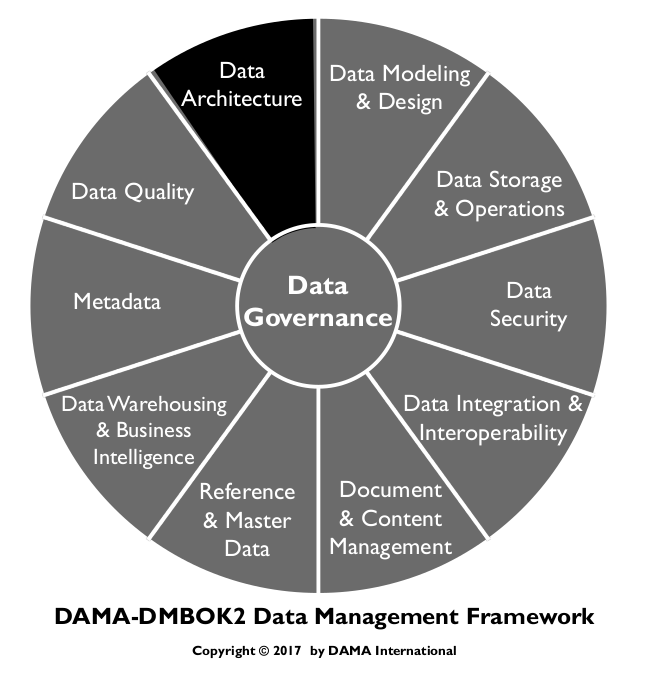
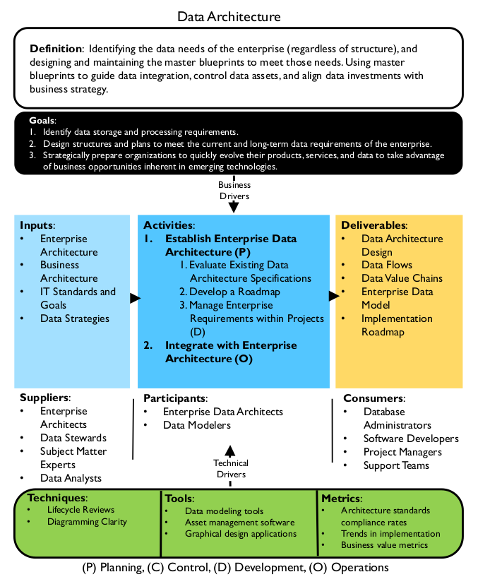
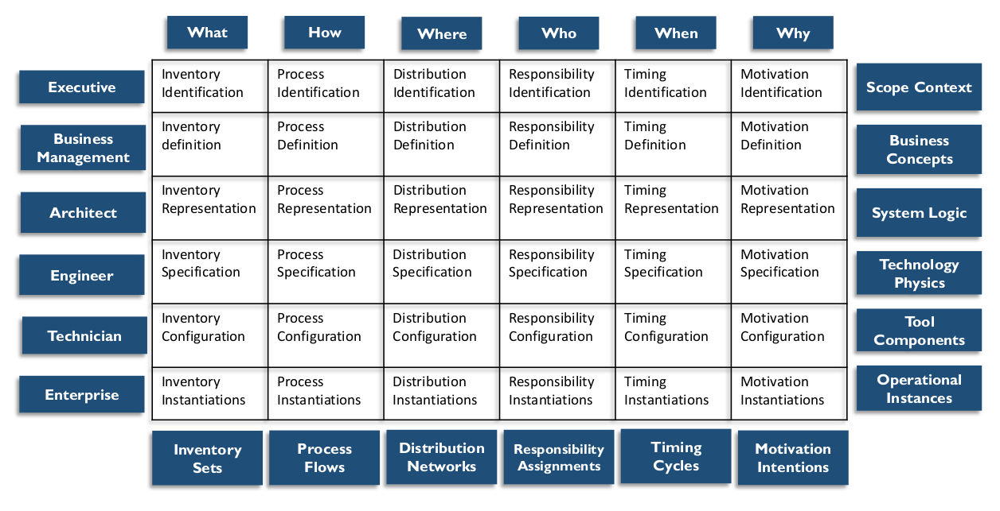
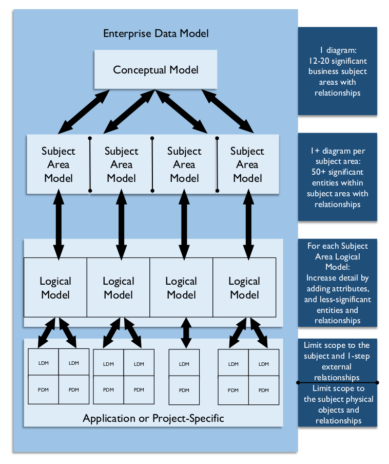
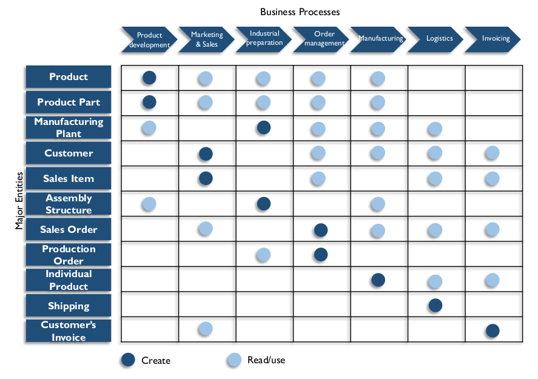
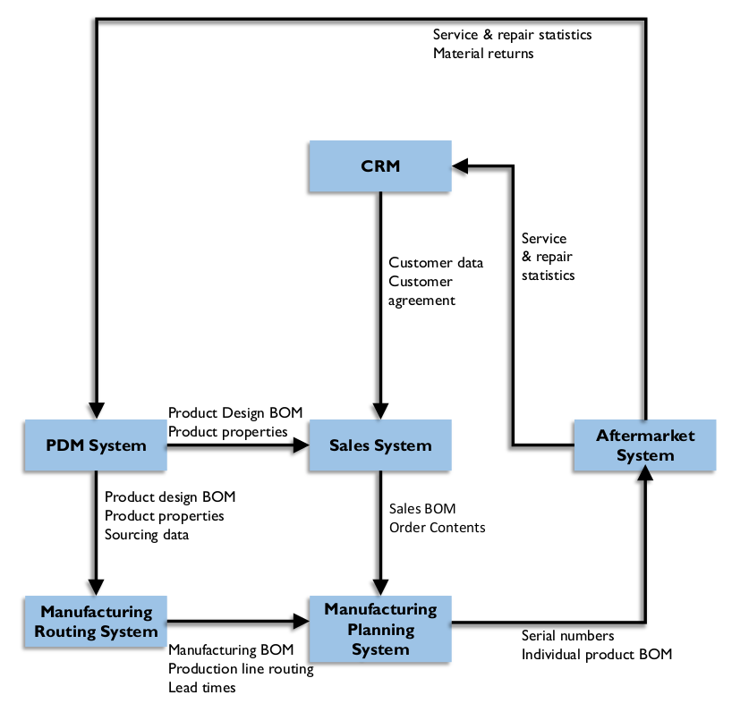

# Data Architecture

## 1. Introduction

Architecture refers to the art and science of building things (especially habitable structures) and to the results of the process of building – the buildings themselves. In a more general sense, architecture refers to an organized arrangement of component elements intended to optimize the function, performance, feasibility, cost, and aesthetics of an overall structure or system.

The term architecture has been adopted to describe several facets of information systems design. ISO/IEC 42010:2007 Systems and Software Engineering – Architecture Description (2011) defines architecture as “the fundamental organization of a system, embodied in its components, their relationships to each other and the environment, and the principles governing its design and evolution.” However, depending on context, the word architecture can refer to a description of the current state of systems, the components of a set of systems, the discipline of designing systems (architecture practice), the intentional design of a system or a set of systems (future state or proposed architecture), the artifacts that describe a system (architecture documentation), or the team that does the design work (the Architects or the Architecture team).

Architecture practice is carried out at different levels within an organization (enterprise, domain, project, etc.) and with different areas of focus (infrastructure, application, and data). Exactly what architects do can be confusing to people who are not architects and who do not recognize the distinctions implied by these levels and focus areas. One reason architectural frameworks are valuable is that they enable non-architects to understand these relationships.

The discipline of Enterprise Architecture encompasses domain architectures, including business, data, application, and technology. Well-managed enterprise architecture practices help organizations understand the current state of their systems, promote desirable change toward future state, enable regulatory compliance, and improve effectiveness. Effective management of data and the systems in which data is stored and used is a common goal of the breadth of architecture disciplines.

In this chapter, Data Architecture will be considered from the following perspectives:

* Data Architecture outcomes, such models, definitions and data flows on various levels, usually referred as Data Architecture artifacts
* Data Architecture activities, to form, deploy and fulfill Data Architecture intentions
* Data Architecture behavior, such as collaborations, mindsets, and skills among the various roles that affect the enterprise’s Data Architecture

Together, these three form the essential components of Data Architecture.

Data Architecture is fundamental to data management. Because most organizations have more data than individual people can comprehend, it is necessary to represent organizational data at different levels of abstraction so that it can be understood and management can make decisions about it.

Data Architecture artifacts includes specifications used to describe existing state, define data requirements, guide data integration, and control data assets as put forth in a data strategy. An organization’s Data Architecture is described by an integrated collection of master design documents at different levels of abstraction, including standards that govern how data is collected, stored, arranged, used, and removed. It is also classified by descriptions of all the containers and paths that data takes through an organization’s systems.

The most detailed Data Architecture design document is a formal enterprise data model, containing data names, comprehensive data and Metadata definitions, conceptual and logical entities and relationships, and business rules. Physical data models are included, but as a product of data modeling and design, rather than Data Architecture.

Data Architecture is most valuable when it fully supports the needs of the entire enterprise. Enterprise Data Architecture enables consistent data standardization and integration across the enterprise.

The artifacts that architects create constitute valuable Metadata. Ideally, architectural artifacts should be stored and managed in an enterprise architecture artifact repository.

We are in the middle of the third wave of end customer digitalization. Banks and financial transactions came first; various digital service interactions were in the second wave; and the internet of things and telematics drive the third. Traditional industries, like automotive, health care equipment, and tooling, are going digital in this third wave.

This happens in almost every industry. New Volvo cars have now on-call 24/7 service, not only for vehicle-related matters, but also to locate restaurants and shopping. Overhead cranes, pallet loaders, and anesthesia equipment are collecting and sending operational data that enables up-time services. Offerings have moved from suppling equipment to pay-per-use or availability contracts. Many of these companies have little if any experience in these areas, since they were previously taken care of by retailers or aftermarket service providers.

Forward-looking organizations should include data management professionals (e.g., Enterprise Data Architects or a strategic Data Stewards) when they are designing new market offerings, because nowadays these usually include hardware, software, and services that capture data, depend on data access, or both.

### 1.1 Business Drivers

The goal of Data Architecture is to be a bridge between business strategy and technology execution. As part of Enterprise Architecture, Data Architects:

* Strategically prepare organizations to quickly evolve their products, services, and data to take advantage of business opportunities inherent in emerging technologies
* Translate business needs into data and system requirements so that processes consistently have the data they require
* Manage complex data and information delivery throughout the enterprise
* Facilitate alignment between Business and IT
* Act as agents for change, transformation, and agility

These business drivers should influence measures of the value of Data Architecture.

Data architects create and maintain organizational knowledge about data and the systems through which it moves. This knowledge enables an organization to manage its data as an asset and increase the value it gets from its data by identifying opportunities for data usage, cost reduction, and risk mitigation.

### 1.2 Data Architecture Outcomes and Practices

Primary Data Architecture outcomes include:

* Data storage and processing requirements
* Designs of structures and plans that meet the current and long-term data requirements of the enterprise

Figure 21 Context Diagram: Data Architecture

Architects seek to design in a way that brings value to the organization. This value comes through an optimal technical footprint, operational and project efficiencies, and the increased ability of the organization to use its data. To get there requires good design, planning, and the ability to ensure that the designs and plans are executed effectively.

To reach these goals, Data Architects define and maintain specifications that:

* Define the current state of data in the organization
* Provide a standard business vocabulary for data and components
* Align Data Architecture with enterprise strategy and business architecture
* Express strategic data requirements
* Outline high-level integrated designs to meet these requirements
* Integrate with overall enterprise architecture roadmap

An overall Data Architecture practice includes:

* Using Data Architecture artifacts (master blueprints) to define data requirements, guide data
* Collaborating with, learning from and influencing various stakeholders that are engaged with integration, control data assets, and align data investments with business strategy improving the business or IT systems development
* Using Data Architecture to establish the semantics of an enterprise, via a common business vocabulary

### 1.3 Essential Concepts

#### 1.3.1 Enterprise Architecture Domains

Data Architecture operates in context of other architecture domains, including business, application, and technical architecture. Table 6 describes and compares these domains. Architects from different domains must address development directions and requirements collaboratively, as each domain influences and put constraints on the other domains. (See also Figure 22.)

Table 6 Architecture Domains

<table>
<head>
  <tr>
    <th>Domain</th>
    <th>Enterprise Business Architecture</th>
    <th>Enterprise Data Architecture</th>
    <th>Enterprise Applications Architecture</th>
    <th>Enterprise Technology Architecture</th>
  </tr>
</thead>
<tbody>
  <tr>
    <td>
      Purpose
    </td>
    <td>
      To identify how an enterprise creates value for customers and other stakeholders
    </td>
    <td>
      To describe how data should be organized and managed
    </td>
    <td>
      To describe the structure and functionality of applications in an enterprise
    </td>
    <td>
      To describe the physical technology needed to enable systems to function and deliver value
    </td>
  </tr>
  <tr>
    <td>
      Elements
    </td>
    <td>
      Business models, processes, capabilities, services, events, strategies, vocabulary
    </td>
    <td>
      Data models, data definitions, data mapping specifications, data flows, structured data APIs
    </td>
    <td>
      Business systems, software packages, databases
    </td>
    <td>
      Technical platforms, networks, security, integration tools
    </td>
  </tr>
  <tr>
    <td>
      Dependencies
    </td>
    <td>
      Establishes requirements for the other domains
    </td>
    <td>
      Manages data created and required by business architecture
    </td>
    <td>
      Acts on specified data according to business requirements
    </td>
    <td>
      Hosts and executes the application architecture
    </td>
  </tr>
  <tr>
    <td>
      Roles
    </td>
    <td>
      Business architects and analysts, business data stewards
    </td>
    <td>
      Data architects and modelers, data stewards
    </td>
    <td>
      Applications architects
    </td>
    <td>
      Infrastructure architects
    </td>
  </tr>
</tbody>
</table>

#### 1.3.2 Enterprise Architecture Frameworks

An architecture framework is a foundational structure used to develop a broad range of related architectures. Architectural frameworks provide ways of thinking about and understanding architecture. They represent an overall ‘architecture for architecture.’

IEEE Computer Society maintains a standard for Enterprise Architecture Frameworks, ISO/IEC/IEEE 42010:2011, Systems and software engineering — Architecture description and a comparison table. [^32] Common frameworks and methods include Data Architecture as one of the architectural domains.

#### 1.3.2.1 Zachman Framework for Enterprise Architecture

The most well-known enterprise architectural framework, the Zachman Framework, was developed by John A. Zachman in the 1980s. (See Figure 22.) It has continued to evolve. Zachman recognized that in creating buildings, airplanes, enterprises, value chains, projects, or systems, there are many audiences, and each has a different perspective about architecture. He applied this concept to the requirements for different types and levels of architecture within an enterprise.

The Zachman Framework is an ontology – the 6x6 matrix comprises the complete set of models required to describe an enterprise and the relationships between them. It does not define how to create the models. It simply shows what models should exist.

Figure 22 Simplified Zachman Framework

The two dimensions in the matrix framework are the communication interrogatives (i.e., what, how, where, who, when, why) as columns and the reification transformations (Identification, Definition, Representation, Specification, Configuration, and Instantiation) as rows. The framework classifications are represented by the cells (the intersection between the interrogatives and the transformations). Each cell in the Zachman Framework represents a unique type of design artifact.

Communication interrogatives are the fundamental questions that can be asked about any entity. Translated to enterprise architecture, the columns can be understood as follows:

* What (the inventory column): Entities used to build the architecture
* How (the process column): Activities performed
* Where (the distribution column): Business location and technology location
* Who (the responsibility column): Roles and organizations
* When (the timing column): Intervals, events, cycles, and schedules
* Why (the motivation column): Goals, strategies, and means

Reification transformations represent the steps necessary to translate an abstract idea into a concrete instance (an instantiation). These are represented in the rows: planner, owner, designer, builder, implementer, and user. Each has a different perspective on the overall process and different problems to solve. These perspectives are depicted as rows. For example, each perspective has a different relation to the What (inventory or data) column:

* **The executive perspective (business context):** Lists of business elements defining scope in identification models.
* **The business management perspective (business concepts):** Clarification of the relationships between business concepts defined by Executive Leaders as Owners in definition models.
* **The architect perspective (business logic):** System logical models detailing system requirements and unconstrained design represented by Architects as Designers in representation models.
* **The engineer perspective (business physics):** Physical models optimizing the design for implementation for specific use under the constraints of specific technology, people, costs, and timeframes specified by Engineers as Builders in specification models.
* **The technician perspective (component assemblies):** A technology-specific, out-of-context view of how components are assembled and operate configured by Technicians as Implementers in configuration models.
* **The user perspective (operations classes):** Actual functioning instances used by Workers as Participants. There are no models in this perspective.

As noted previously, each cell in the Zachman Framework represents a unique type of design artifact, defined by the intersection of its row and column. Each artifact represents how the specific perspective answers the fundamental questions.

#### 1.3.3 Enterprise Data Architecture

Enterprise Data Architecture defines standard terms and designs for the elements that are important to the organization. The design of an Enterprise Data Architecture includes depiction of the business data as such, including the collection, storage, integration, movement, and distribution of data.

As data flows in an organization through feeds or interfaces, it is secured, integrated, stored, recorded, catalogued, shared, reported on, analyzed, and delivered to stakeholders. Along the way, the data may be verified, enhanced, linked, certified, aggregated, anonymized, and used for analytics until archived or purged. The Enterprise Data Architecture descriptions must therefore include both Enterprise Data Models (e.g., data structures and data specifications), as well as Data Flow Design:

* Enterprise Data Model (EDM): The EDM is a holistic, enterprise-level, implementation-independent conceptual or logical data model providing a common consistent view of data across the enterprise. It is common to use the term to mean a high-level, simplified data model, but that is a question of abstraction for presentation. An EDM includes key enterprise data entities (i.e., business concepts), their relationships, critical guiding business rules, and some critical attributes. It sets forth the foundation for all data and data-related projects. Any project-level data model must be based on the EDM. The EDM should be reviewed by stakeholders, so that there is consensus that it effectively represents the enterprise.
* Data Flow Design: Defines the requirements and master blueprint for storage and processing across databases, applications, platforms, and networks (the components). These data flows map the movement of data to business processes, locations, business roles, and to technical components.

These two types of specifications need to fit well together. As mentioned, both need to be reflected in current state and target state (architecture perspective), and also in transition state (project perspective).

#### 1.3.3.1 Enterprise Data Model

Some organizations create an EDM as a stand-alone artifact. In other organizations, it is understood as composed of data models from different perspectives and at different levels of detail, that consistently describe an organization’s understanding of data entities, data attributes, and their relationships across the enterprise. An EDM includes both universal (Enterprise-wide Conceptual and Logical Models) and application- or project-specific data models, along with definitions, specifications, mappings, and business rules.

Adopting an industry standard model can jumpstart the process of developing an EDM. These models provide a useful guide and references. However, even if an organization starts with a purchased data model, producing enterprise-wide data models requires a significant investment. Work includes defining and documenting an organization’s vocabulary, business rules, and business knowledge. Maintaining and enriching an EDM requires an ongoing commitment of time and effort.

An organization that recognizes the need for an enterprise data model must decide how much time and effort it can devote to building and maintaining it. EDMs can be built at different levels of detail, so resource availability will influence initial scope. Over time, as the needs of the enterprise demand, the scope and level of detail captured within an enterprise data model typically expands. Most successful enterprise data models are built incrementally and iteratively, using layers. Figure 23 shows how different types of models are related and how conceptual models are ultimately linkable to physical application data models. It distinguishes:

* A conceptual overview over the enterprise’s subject areas
* Views of entities and relationships for each subject area
* Detailed, partially attributed logical views of these same subject areas
* Logical and physical models specific to an application or project

All levels are part of the Enterprise Data Model, and linkages create paths to trace an entity from top to bottom and between models in the same level.

* Vertical: Models in each level map to models in other levels. Model lineage is created using these maps. For example, a table or file MobileDevice in a project-specific physical model may link to a MobileDevice entity in the project-specific logical model, a MobileDevice entity in the Product subject area in the Enterprise Logical Model, a Product conceptual entity in the Product Subject Area Model, and to the Product entity in the Enterprise Conceptual Model.
* Horizontal: Entities and relationships may appear in multiple models in the same level; entities in logical models centered on one topic may relate to entities in other topics, marked or noted as external to the subject area on the model images. A Product Part entity may appear in the Product subject area models and in the Sales Order, Inventory, and Marketing subject areas, related as external links.

An enterprise data model at all levels is developed using data modeling techniques. (See Chapter 5.)

Figure 23 Enterprise Data Model

Figure 24 depicts three Subject Area diagrams (simplified examples), each containing a Conceptual Data Model with a set of entities. Relationships may cross Subject Area borders; each entity in an enterprise data model should reside in only one Subject Area, but can be related to entities in any other Subject Area.

Hence, the conceptual enterprise data model is built up by the combination of Subject Area models. The enterprise data model can be built using a top-down approach or using a bottom-up approach. The top-down approach means starting with forming the Subject Areas and then populating them with models. When using a bottom-up approach the Subject Area structure is based on existing data models. A combination of the approaches is usually recommended; starting with bottom-up using existing models and completing the enterprise data model by populating the models by delegating Subject Area modeling to projects.

Figure 24 Subject Area Models Diagram Example

The Subject Area discriminator (i.e., the principles that form the Subject Area structure) must be consistent throughout the enterprise data model. Frequently used subject area discriminator principles include: using normalization rules, dividing Subject Areas from systems portfolios (i.e., funding), forming Subject Areas from data governance structure and data ownership (organizational), using top-level processes (based on the business value chains), or using business capabilities (enterprise architecture-based). The Subject Area structure is usually most effective for Data Architecture work if it is formed using normalization rules. The normalization process will establish the major entities that carry/constitute each Subject Area.

##### 1.3.3.2 Data Flow Design

Data flows are a type of data lineage documentation that depicts how data moves through business processes and systems. End-to-end data flows illustrate where the data originated, where it is stored and used, and how it is transformed as it moves inside and between diverse processes and systems. Data lineage analysis can help explain the state of data at a given point in the data flow.

Data flows map and document relationships between data and

* Applications within a business process
* Data stores or databases in an environment
* Network segments (useful for security mapping)
* Business roles, depicting which roles have responsibility for creating, updating, using, and deleting data (CRUD)
* Locations where local differences occur

Data flows can be documented at different levels of detail: Subject Area, business entity, or even the attribute level. Systems can be represented by network segments, platforms, common application sets, or individual servers. Data flows can be represented by two-dimensional matrices (Figure 25) or in data flow diagrams (Figure 26).

Figure 25 Data Flow Depicted in a Matrix

A matrix gives a clear overview of what data the processes create and use. The benefits of showing the data requirements in a matrix is that it takes into consideration that data does not flow in only one direction; the data exchange between processes are many-to-many in a quite complex way, where any data may appear anywhere. In addition, a matrix can be used to clarify the processes’ data acquisition responsibilities and the data dependencies between the processes, which in turn improves the process documentation. Those who prefer working with business capabilities could show this in the same way – just exchanging the processes axis to capabilities. Building such matrices is a long-standing practice in enterprise modeling. IBM introduced this practice in its Business Systems Planning (BSP) method. James Martin later popularized it in his Information Systems Planning (ISP) method during the 1980’s.

The data flow in Figure 26 is a traditional high-level data flow diagram depicting what kind of data flows between systems. Such diagrams can be described in many formats and detail levels.

Figure 26 Data Flow Diagram Example

## 2. Activities

Data and enterprise architecture deal with complexity from two viewpoints:

* Quality-oriented: Focus on improving execution within business and IT development cycles. Unless architecture is managed, architecture will deteriorate. Systems will gradually become more complex and inflexible, creating risk for an organization. Uncontrolled data delivery, data copies, and interface ‘spaghetti’ relationships make organizations less efficient and reduce trust in the data.
* Innovation-oriented: Focus on transforming business and IT to address new expectations and opportunities. Driving innovation with disruptive technologies and data uses has become a role of the modern Enterprise Architect.

These two drivers require separate approaches. The quality-oriented approach aligns with traditional Data Architecture work where architectural quality improvements are accomplished incrementally. The architecture tasks are distributed to projects, where architects participate or the project carries out by delegation. Typically, the architect keeps the entirety of architecture in mind and focuses on long-term goals directly connected to governance, standardization, and structured development. The innovation-oriented approach can have a shorter-term perspective and be using unproven business logic and leading edge technologies. This orientation often requires architects make contact with people within the organization with whom IT professionals do not usually interact (e.g., product development representatives and business designers).

### 2.1 Establish Data Architecture Practice

Ideally, Data Architecture should be an integral part of enterprise architecture. If there is not an enterprise architecture function, a Data Architecture team can still be established. Under these conditions, an organization should adopt a framework that helps articulate the goals and drivers for Data Architecture. These drivers will influence approach, scope, and the priorities on the roadmap.

Choose a framework applicable to the business type (e.g., use a government framework for a governmental organization). The views and taxonomy in the framework must be useful in communication to the various stakeholders. This is especially important for Data Architecture initiatives, as they address business and systems terminology. Data Architecture has an inherently close relationship to business architecture.

An Enterprise Data Architecture practice generally includes the following work streams, executed serially or in parallel:

* Strategy: Select frameworks, state approaches, develop roadmap
* Acceptance and culture: Inform and motivate changes in behavior
* Organization: Organize Data Architecture work by assigning accountabilities and responsibilities
* Working methods: Define best practices and perform Data Architecture work within development projects, in coordination with Enterprise Architecture
* Results: Produce Data Architecture artifacts within an overall roadmap

Enterprise Data Architecture also influences the scope boundaries of projects and system releases:

* Defining project data requirements: Data Architects provide enterprise data requirements for individual projects.
* Reviewing project data designs: Design reviews ensure that conceptual, logical, and physical data models are consistent with architecture and in support of long-term organizational strategy.
* Determining data lineage impact: Ensures that business rules in the applications along the data flow are consistent and traceable.
* Data replication control: Replication is a common way to improve application performance and make data more readily available, but it can also create inconsistencies in the data. Data Architecture governance ensures that sufficient replication control (methods and mechanisms) are in place to achieve required consistency. (Not all applications need strict consistency.)
* Enforcing Data Architecture standards: Formulating and enforcing standards for the Enterprise Data Architecture lifecycle. Standards can be expressed as principles and procedures, guidelines and as well as blueprints with compliance expectations.
* Guide data technology and renewal decisions: The Data Architect works with Enterprise Architects to manage data technology versions, patches, and policies each application uses, as a roadmap for data technology.

#### 2.1.1 Evaluate Existing Data Architecture Specifications

Every organization has some form of documentation for its existing systems. Identify these documents and evaluate them for accuracy, completeness, and level of detail. If necessary, update them to reflect the current state.

#### 2.1.2 Develop a Roadmap

If an enterprise were developed from scratch (free from dependence on existing processes), an optimal architecture would be based solely on the data required to run the enterprise, priorities would be set by business strategy, and decisions could be made unencumbered by the past. Very few organizations are ever in this state. Even in an ideal situation, data dependencies would quickly arise and need to be managed. A roadmap provides a means to manage these dependencies and make forward-looking decisions. A roadmap helps an organization see trade-offs and formulate a pragmatic plan, aligned with business needs and opportunities, external requirements, and available resources.

A roadmap for Enterprise Data Architecture describes the architecture’s 3-5 year development path. Together with the business requirements, consideration of actual conditions, and technical assessments, the roadmap describes how the target architecture will become reality. The Enterprise Data Architecture roadmap must be integrated into an overall enterprise architecture roadmap that includes high-level milestones, resources needed, and costs estimations, divided in business capability work streams. The roadmap should be guided by a data management maturity assessment. (See Chapter 15.)

Most business capabilities require data as an input; others also produce data on which other business capabilities are dependent. The enterprise architecture and the Enterprise Data Architecture can be formed coherently by resolving this data flow in a chain of dependencies between business capabilities. A business-data-driven roadmap starts with the business capabilities that are most independent (i.e., have the least dependency from other activities), and ends with those who are most dependent on others. Dealing with each business capability in sequence will follow an overall business data origination order. Figure 27 shows an example chain of dependency, with the lowest dependency at the top. Product Management and Customer Management do not depend on anything else and thus constitute Master Data. The highest dependency items are on the bottom where Customer’s Invoice Management depends on Customer Management and Sales Order Management, which in turn depends on two others.

Figure 27 The Data Dependencies of Business Capabilities

Therefore, the roadmap would ideally advise starting at Product Management and Customer Management capabilities and then resolve each dependency in steps from top to bottom.

#### 2.1.3 Manage Enterprise Requirements within Projects

Architecture should not be locked into the limitations that prevail at the time it is developed. Data models and other specifications describing an organization’s Data Architecture must be flexible enough to accommodate future requirements. A data model at the architectural level should have a global view of the enterprise along with clear definitions that can be understood throughout the organization.

Development projects implement solutions for capturing, storing, and distributing data based on business requirements and the standards established by the Enterprise Data Architecture. This process, by its nature, is accomplished incrementally.

At the project level, the process of specifying requirements via a data model begins with review of business needs. Often these needs will be specific to the goals of the project and will not have enterprise implications. The process should still include developing definitions of terms and other activities that support use of the data. Importantly, data architects must be able to understand requirements in relation to the overall architecture. When a project specification is completed, the data architects should determine:

Importantly, data architects must be able to understand requirements in relation to the overall architecture. When a project specification is completed, the data architects should determine:

* Whether enterprise-wide entities represented in the specification conform to agreed-upon standards
* What entities in the requirements specification should be included in the overall Enterprise Data Architecture
* Whether entities and definitions in this specification need to be generalized or improved upon to handle future trends
* Whether new data delivery architectures are indicated or whether to point the developers in the direction of reuse

Organizations often wait to address Data Architecture concerns until projects need to design data storage and integration. However, it is preferable to include these considerations early in planning and throughout the entire project lifecycle.

Enterprise Data Architecture project-related activities include:

* Define scope: Ensure the scope and interface are aligned with the enterprise data model. Understand the project’s potential contribution to the overall Enterprise Data Architecture, with respect to what the project will model and design and in terms of what existing components should (or can) be reused. In those areas that should be designed, the project needs to determine dependencies with stakeholders outside the project scope, such as down-stream processes. The data artifacts that the project determines to be shareable or reusable need to be incorporated into the enterprise logical data model and designated repositories.
* Understand business requirements: Capture data-related requirements such as entity, source(s), availability, quality, and pain points, and estimate the business value of meeting these requirements.
* Design: Form detailed target specifications, including business rules in a data lifecycle perspective. Validate the outcome and, when needed, address needs for extended and improved standardized models. The enterprise logical data model and enterprise architecture repository are good places for project data architects to look and reuse constructs that are shareable across the enterprise. Review and use data technology standards.
* Implement:
  * When buying, reverse engineer purchased applications (Commercial Off the Shelf – COTS) and map against data structure. Identify and document gaps and differences in structures, definitions, and rules. Ideally, vendors will supply data models for their products; however, many do not, as they consider these proprietary. If possible, negotiate for a model with in-depth definitions.
  * When reusing data, map application data models against common data structures and existing and new processes to understand CRUD operations. Enforce the use of system of record or other authoritative data. Identify and document gaps.
  * When building, implement data storage according to the data structure. Integrate according to standardized or designed specifications. (See Chapter 8.)

The role of Enterprise Data Architects in projects depends on the development methodology. The process of building architectural activities into projects also differs between methodologies.

* **Waterfall methods:** Understand the requirements and construct systems in sequential phases as part of an overall enterprise design. This method includes tollgates designed to control change. It is usually no problem to include Data Architecture activities in such models. Be sure to include an enterprise perspective.
* **Incremental methods:** Learn and construct in gradual steps (i.e., mini-waterfalls). This method creates prototypes based on vague overall requirements. The initiation phase is crucial; it is best to create a comprehensive data design in early iterations.
* **Agile, iterative, methods:** Learn, construct, and test in discrete delivery packages (called ‘sprints’) that are small enough that if work needs to be discarded, not much is lost. Agile methods (Scrum, Rapid Development, and Unified Process) promote object-oriented modeling that emphasizes user interface design, software design, and systems behavior. Complete such methods with specifications for data models, data capture, data storage, and data distribution. Experience from DevOps, an emerging and popular agile approach, testifies about improved data design and effective design choices when programmers and data architects have a strong working relationship and both comply with standards and guidelines.

### 2.2 Integrate with Enterprise Architecture

The work of developing Enterprise Data Architecture specifications from the subject area level to more detailed levels and in relation to other architecture domains is typically performed within funded projects. Funded projects generally drive architecture priorities. Nevertheless, enterprise-wide Data Architecture matters should be addressed proactively. In fact, Data Architecture may influence the scope of projects. It is best, therefore, to integrate Enterprise Data Architecture matters with project portfolio management. Doing so enables implementation of the roadmap and contributes to better project outcomes.

Likewise, the Enterprise Data Architects need to be included with enterprise application development and integration planning. Apply the Data Architecture view on the target application landscape and the roadmap to that landscape.

## 3. Tools

### 3.1 Data Modeling Tools

Data modeling tools and model repositories are necessary for managing the enterprise data model in all levels. Most data modeling tools include lineage and relation tracking functions, which enable architects to manage linkages between models created for different purposes and at different levels of abstraction. (See Chapter 5.)

### 3.2 Asset Management Software

Asset management software is used to inventory systems, describe their content, and track the relationships between them. Among other things, these tools enable an organization to ensure that it follows contractual obligations related to software licenses and to collect data related to assets that can be used to minimize costs and optimize their IT footprint. Because they compile an inventory of IT assets, such tools collect and contain valuable Metadata about systems and the data they contain. This Metadata is very helpful when creating data flows or researching current state.

### 3.3 Graphical Design Applications

Graphical design applications are used to create architectural design diagrams, data flows, data value chains, and other architectural artifacts.

## 4. Techniques

### 4.1 Lifecycle Projections

Architecture designs can be aspirational or future-looking, implemented and active, or plans for retirement. What they represent should be clearly documented. For example:

* Current: Products currently supported and used
* Deployment period: Products deployed for use in the next 1-2 years
* Strategic period: Products expected to be available for use in the next 2+ years
* Retirement: Products the organization has retired or intends to retire within a year
* Preferred: Products preferred for use by most applications
* Containment: Products limited to use by certain applications
* Emerging: Products being researched and piloted for possible future deployment
* Reviewed: Products that have been evaluated, the evaluation results and are currently not in any other status above

See Chapter 6 for more about managing data technologies.

### 4.2 Diagramming Clarity

Models and diagrams present information based on an established set of visual conventions. These need to be used consistently or they will be misunderstood and may, in fact, be incorrect. Characteristics that minimize distractions, and maximize useful information include:

• A clear and consistent legend: The legend should identify all objects and lines and what they signify. The legend should be placed in the same spot in all diagrams.
• A match between all diagram objects and the legend: In legends that are used as templates, not all legend objects may appear in the diagram, but all diagram objects should match a legend objects.
• A clear and consistent line direction: All flows should start at one side or corner (generally the left) and flow toward the opposite side or corner as much as possible. Loops and circles will occur, so make the lines going backward flow out and around to be clear.
• A consistent line cross display method: Lines can cross as long as it is clear that the crossing point is not a join. Use line jumps for all lines in one direction. Do not join lines to lines. Minimize the number of lines that cross.
• Consistent object attributes: Any difference in sizes, colors, line thickness, etc. should signify something, otherwise differences are distracting.
• Linear symmetry: Diagrams with objects placed in lines and columns are more readable than those with random placement. While it is rarely possible to align all objects, lining up at least half (horizontally and/or vertically) will greatly improve readability of any diagram.

## 5. Implementation Guidelines

As stated in the chapter introduction, Data Architecture is about artifacts, activities and behavior. Implementing
Enterprise Data Architecture is therefore about:

* Organizing the Enterprise Data Architecture teams and forums
* Producing the initial versions of Data Architecture artifacts, such as enterprise data model, enterprise- wide data flow and road maps
* Forming and establishing a data architectural way of working in development projects
* Creating awareness throughout the organization of the value of Data Architecture efforts

A Data Architecture implementation should include at least two of these as they benefit from being launched simultaneously, or at least as parallel activities. The implementation can begin in a part of the organization, or, in a data domain, such as product data or customer data. After learning and maturing, the implementation may grow wider.

Data models and other Data Architecture artifacts are usually captured within development projects, and then standardized and managed by data architects. Therefore, the first projects will have larger portions of Data Architecture work before there are any artifacts to reuse. These early projects could benefit from special architecture funding.

The Enterprise Data Architect collaborates with other business and technology architects who share the common goal of improving organizational effectiveness and agility. The business drivers for the overall enterprise architecture also influence Enterprise Data Architecture implementation strategy significantly.

Establishing an Enterprise Data Architecture in a solution-oriented culture where new inventions are tried using disruptive technology will require an agile implementation approach. This can include having an outlined subject area model on an overall level while participating on a detail level in agile sprints. Thus, the Enterprise Data Architecture will evolve incrementally. However, this agile approach needs to ensure that data architects are engaged early in development initiatives, as these evolve rapidly in an inventive culture.

Having a quality driver for enterprise architecture may force some initial Data Architecture work on an enterprise level for planned development projects. Typically, the Enterprise Data Architecture starts with Master Data areas that are in great need for improvements and, once established and accepted, expands to include business event oriented data (i.e., transactional data). This is the traditional implementation approach where Enterprise Data Architects produce blueprints and templates to be used throughout the system landscape, and ensuring compliance using various governance means.

### 5.1 Readiness Assessment / Risk Assessment

Architecture initiation projects expose more risks than other projects, especially during the first attempt within the organization. The most significant risks are:

* Lack of management support: Any reorganization of the enterprise during the planned execution of the project will affect the architecture process. For example, new decision makers may question the process and be tempted to withdraw from opportunities for participants to continue their work on the Data Architecture. It is by establishing support among management that an architecture process can survive reorganization. Therefore, be certain to enlist into the Data Architecture development process more than one member of top-level management, or at least senior management, who understand the benefits of Data Architecture.
* No proven record of accomplishment: Having a sponsor is essential to the success of the effort, as is his or her confidence in those carrying out the Data Architecture function. Enlist the help of a senior architect colleague to help carry out the most important steps.
* Apprehensive sponsor: If the sponsor requires all communication to pass through them, it may be an indication that that person is uncertain of their role, has interests other than the objectives of the Data Architecture process, or is uncertain of the data architect’s capability. Regardless of the reason, the sponsor must allow the project manager and data architect to take the leading roles in the project. Try to establish independence in the workplace, along with the sponsor’s confidence.
* Counter-productive executive decisions: It may be the case that although management understands the value of a well-organized Data Architecture, they do not know how to achieve it. Therefore, they may make decisions that counteract the data architect’s efforts. This is not a sign of disloyal management but rather an indication that the data architect needs to communicate more clearly or frequently with management.
* Culture shock: Consider how the working culture will change among those who will be affected by the Data Architecture. Try to imagine how easy or difficult it will be for the employees to change their behavior within the organization.
* Inexperienced project leader: Make sure that the project manager has experience with Enterprise Data Architecture particularly if the project has a heavy data component. If this is not the case, encourage the sponsor to change or educate the project manager (Edvinsson, 2013).
* Dominance of a one-dimensional view: Sometimes the owner(s) of one business application might tend to dictate their view about the overall enterprise-level Data Architecture (e.g., the owners of an ERP system) at the expense of a more well-balanced, all-inclusive view.

### 5.2 Organization and Cultural Change

The speed with which an organization adopts architectural practices depends on how adaptive its culture is. The nature of design work requires that architects collaborate with developers and other creative thinkers throughout the organization. Often such people are used to working in their own ways. They may embrace or resist the change required to adopt formal architecture principles and tools.

Output-oriented, strategically aligned organizations are in the best position to adopt architectural practices. These organizations are most often goal-oriented, aware of customer and partner challenges, and capable of prioritizing based on common objectives.

The ability of an organization to adopt Data Architecture practices depends on several factors:

* Cultural receptivity to architectural approach (developing an architecture-friendly culture)
* Organizational recognition of data as a business asset, not just an IT concern
* Organizational ability to let go of a local perspective and adopt an enterprise perspective on data
* Organizational ability to integrate architectural deliverables into project methodology
* Level of acceptance of formal data governance
* Ability to look holistically at the enterprise, rather than being focused solely on project delivery and IT solutioning (Edvinsson, 2013)

## 6. Data Architecture Governance

Data Architecture activities directly support the alignment and control of data. Data architects often act as business liaisons for data governance activities. Therefore, Enterprise Data Architecture and the Data Governance organization have to be well aligned. Ideally, both a data architect and a Data Steward should be assigned to each subject area and even to each entity within a subject area. In addition, business oversight should be aligned to process oversight. Business event subject areas should be aligned with business process governance as each event entity usually corresponds to a business process. Data Architecture governance activities include:

* Overseeing Projects: This includes ensuring that projects comply with required Data Architecture activities, use and improve architectural assets, and implement according to stated architectural standards.
* Managing architectural designs, lifecycle, and tools: Architectural designs must be defined, evaluated and maintained. Enterprise Data Architecture serves as a ‘zoning plan’ for long-term integration. Future state architecture affects project objectives and influences the priority of the projects in the project portfolio.
* Defining standards: Setting the rules, guidelines, and specifications for how data is used within the organization.
* Creating data-related artifacts: Artifacts that enable compliance with governance directives.

### 6.1 Metrics

Performance metrics on Enterprise Data Architecture reflect the architectural goals: architectural compliance,
implementation trends, and business value from Data Architecture. Data Architecture metrics are often
monitored annually as part of overall business customer satisfaction with projects.

* **Architecture standard compliance rate** measures how closely projects comply with established Data Architectures and how well projects adhere to processes for engaging with enterprise architecture. Metrics that track project exceptions may also be useful as a means of understanding obstacles to adoption.
* **Implementation trends** track the degree to which enterprise architecture has improved the organization’s ability to implement projects, along at least two lines:
  * **Use/reuse/replace/retire measurements:** Determine the proportion of new architecture artifacts versus reused, replaced, or retired artifacts.
  * **Project execution efficiency measurements:** These measure lead times for projects and their resource costs for delivery improvements with reusable artifacts and guiding artifacts.
* **Business value measurements** track progress toward expected business effects and benefits.
  * **Business agility improvements:** Measurements that account for the benefits of lifecycle improvements or alternative, the cost of delay.
  * **Business quality:** Measurements of whether business cases are fulfilled as intended; measuring whether projects actually deliver changes that lead to business improvements based on newly created or integrated data.
  * **Business operation quality:** Measurements of improved efficiency. Examples include improved accuracy, and reducing the time and expense of correcting mistakes due to data errors.
  * **Business environment improvements:** Examples include improved client retention rate related to reducing data errors, and reduced incidence of remarks from authorities on submitted reports.

## 7. Works Cited / Recommended

Ahlemann, Frederik, Eric Stettiner, Marcus Messerschmidt, and Christine Legner, eds. Strategic Enterprise Architecture
Management: Challenges, Best Practices, and Future Developments. Springer, 2012. Print. Management for Professionals.

Bernard, Scott A. An Introduction to Enterprise Architecture. 2nd ed. Authorhouse, 2005. Print.

Brackett, Michael H. Data Sharing Using a Common Data Architecture. John Wiley and Sons, 1994. Print.

Carbone, Jane. IT Architecture Toolkit. Prentice Hall, 2004. Print.

Cook, Melissa. Building Enterprise Information Architectures: Re-Engineering Information Systems. Prentice Hall, 1996.
Print.

Edvinsson, Hakan and Lottie Aderinne. Enterprise Architecture Made Simple Using the Ready, Set, Go Approach to
Achieving Information Centricity. Technics Publications, LCC, 2013. Print.

Executive Office of the President of the United States. The Common Approach to Federal Enterprise Architecture.
whitehouse.gov, 2012. Web.

Fong, Joseph. Information Systems Reengineering and Integration. 2nd ed. Springer, 2006. Print.

Gane, Chris and Trish Sarson. Structured Systems Analysis: Tools and Techniques. Prentice Hall, 1979. Print.

Hagan, Paula J., ed. EABOK: Guide to the (Evolving) Enterprise Architecture Body of Knowledge. mitre.org MITRE
Corporation, 2004. Web.

Harrison, Rachel. TOGAF Version 8.1.1 Enterprise Edition - Study Guide. The Open Group. 2nd ed. Van Haren Publishing,
2007. Print. TOGAF.

Hoberman, Steve, Donna Burbank, and Chris Bradley. Data Modeling for the Business: A Handbook for Aligning the
Business with IT using High-Level Data Models. Technics Publications, LLC, 2009. Print. Take It with You Guides.

Hoberman, Steve. Data Modeling Made Simple: A Practical Guide for Business and Information Technology Professionals.
2nd ed. Technics Publications, LLC, 2009. Print.

Hoogervorst, Jan A. P. Enterprise Governance and Enterprise Engineering. Springer, 2009. Print. The Enterprise
Engineering Ser.

ISO (website). http://bit.ly/2sTp2rA, http://bit.ly/2ri8Gqk.

Inmon, W. H., John A. Zachman, and Jonathan G. Geiger. Data Stores, Data Warehousing and the Zachman Framework:
Managing Enterprise Knowledge. McGraw-Hill, 1997. Print.

Lankhorst, Marc. Enterprise Architecture at Work: Modeling, Communication and Analysis. Springer, 2005. Print.

Martin, James and Joe Leben. Strategic Information Planning Methodologies, 2nd ed. Prentice Hall, 1989. Print.

Osterwalder, Alexander and Yves Pigneur. Business Model Generation: A Handbook for Visionaries, Game Changers, and
Challengers. Wiley, 2010. Print.

Perks, Col and Tony Beveridge. Guide to Enterprise IT Architecture. Springer, 2003. Print. Springer Professional
Computing.

Poole, John, Dan Chang, Douglas Tolbert, and David Mellor. Common Warehouse Metamodel. Wiley, 2001. Print. OMG
(Book 17).

Radhakrishnan, Rakesh. Identity and Security: A Common Architecture and Framework For SOA and Network
Convergence. futuretext, 2007. Print.

Ross, Jeanne W., Peter Weill, and David Robertson. Enterprise Architecture As Strategy: Creating a Foundation For
Business Execution. Harvard Business School Press, 2006. Print.

Schekkerman, Jaap. How to Survive in the Jungle of Enterprise Architecture Frameworks: Creating or Choosing an
Enterprise Architecture Framework. Trafford Publishing, 2006. Print.

Spewak, Steven and Steven C. Hill. Enterprise Architecture Planning: Developing a Blueprint for Data, Applications, and
Technology. 2nd ed. A Wiley-QED Publication, 1993. Print.

Ulrich, William M. and Philip Newcomb. Information Systems Transformation: Architecture-Driven Modernization Case
Studies. Morgan Kaufmann, 2010. Print. The MK/OMG Press.

[^32]: http://bit.ly/2tNnD2j; http://bit.ly/2rVinIq.