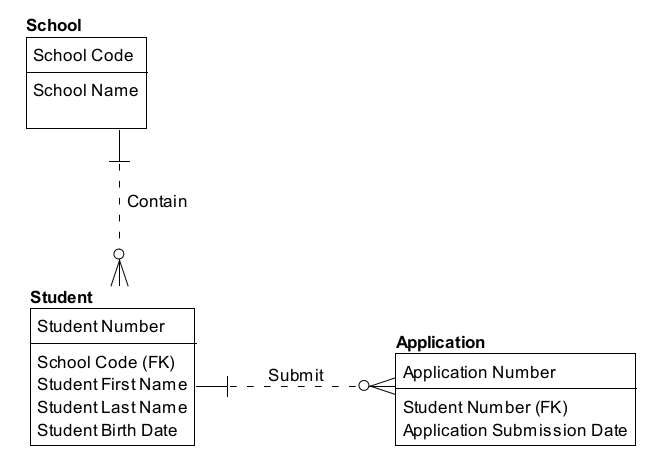

# Data Modeling and Design

## 1. Introduction

Data modeling is the process of discovering, analyzing, and scoping data requirements, and then representing and communicating these data requirements in a precise form called the data model. Data modeling is a critical component of data management. The modeling process requires that organizations discover and document how their data fits together. The modeling process itself designs how data fits together (Simsion, 2013). Data models depict and enable an organization to understand its data assets.

There are a number of different schemes used to represent data. The six most commonly used schemes are: Relational, Dimensional, Object-Oriented, Fact-Based, Time-Based, and NoSQL. Models of these schemes exist at three levels of detail: conceptual, logical, and physical. Each model contains a set of components. Examples of components are entities, relationships, facts, keys, and attributes. Once a model is built, it needs to be reviewed and once approved, maintained.

Figure 28 Context Diagram: Data Modeling and Design

Data models comprise and contain Metadata essential to data consumers. Much of this Metadata uncovered during the data modeling process is essential to other data management functions. For example, definitions for data governance and lineage for data warehousing and analytics.

This chapter will describe the purpose of data models, the essential concepts and common vocabulary used in data modeling, and data modeling goals and principles. It will use a set of examples from data related to education to illustrate how data models work and to show differences between them.

### 1.1 Business Drivers

Data models are critical to effective management of data. They:

* Provide a common vocabulary around data
* Capture and document explicit knowledge about an organization’s data and systems
* Serve as a primary communications tool during projects
* Provide the starting point for customization, integration, or even replacement of an application

### 1.2 Goals and Principles

The goal of data modeling is to confirm and document understanding of different perspectives, which leads to applications that more closely align with current and future business requirements, and creates a foundation to successfully complete broad-scoped initiatives such as Master Data Management and data governance programs. Proper data modeling leads to lower support costs and increases the reusability opportunities for future initiatives, thereby reducing the costs of building new applications. Data models are an important form of Metadata.

Confirming and documenting understanding of different perspectives facilitates:

* Formalization: A data model documents a concise definition of data structures and relationships. It enables assessment of how data is affected by implemented business rules, for current as-is states or desired target states. Formal definition imposes a disciplined structure to data that reduces the possibility of data anomalies occurring when accessing and persisting data. By illustrating the structures and relationships in the data, a data model makes data easier to consume.
* Scope definition: A data model can help explain the boundaries for data context and implementation of purchased application packages, projects, initiatives, or existing systems.
* Knowledge retention/documentation: A data model can preserve corporate memory regarding a system or project by capturing knowledge in an explicit form. It serves as documentation for future projects to use as the as-is version. Data models help us understand an organization or business area, an existing application, or the impact of modifying an existing data structure. The data model becomes a reusable map to help business professionals, project managers, analysts, modelers, and developers understand data structure within the environment. In much the same way as the mapmaker learned and documented a geographic landscape for others to use for navigation, the modeler enables others to understand an information landscape (Hoberman, 2009).

### 1.3 Essential Concepts

This section will explain the different types of data that can be modeled, the component pieces of data models, the types of data models that can be developed, and the reasons for choosing different types in different situations. This set of definitions is extensive, in part, because data modeling itself is about the process of definition. It is important to understand the vocabulary that supports the practice.

#### 1.3.1 Data Modeling and Data Models

Data modeling is most frequently performed in the context of systems development and maintenance efforts, known as the system development lifecycle (SDLC). Data modeling can also be performed for broad-scoped initiatives (e.g., Business and Data Architecture, Master Data Management, and data governance initiatives) where the immediate end result is not a database but an understanding of organizational data.

A model is a representation of something that exists or a pattern for something to be made. A model can contain one or more diagrams. Model diagrams make use of standard symbols that allow one to understand content. Maps, organization charts, and building blueprints are examples of models in use every day.

A data model describes an organization’s data as the organization understands it, or as the organization wants it to be. A data model contains a set of symbols with text labels that attempts visually to represent data requirements as communicated to the data modeler, for a specific set of data that can range in size from small, for a project, to large, for an organization. The model is a form of documentation for data requirements and data definitions resulting from the modeling process. Data models are the main medium used to communicate data requirements from business to IT and within IT from analysts, modelers, and architects, to database designers and developers.

#### 1.3.2 Types of Data that are Modeled

Four main types of data can be modeled (Edvinsson, 2013). The types of data being modeled in any given organization reflect the priorities of the organization or the project that requires a data model:

* Category information: Data used to classify and assign types to things. For example, customers classified by market categories or business sectors; products classified by color, model, size, etc.; orders classified by whether they are open or closed.
* Resource information: Basic profiles of resources needed conduct operational processes such as Product, Customer, Supplier, Facility, Organization, and Account. Among IT professionals, resource entities are sometimes referred to as Reference Data. 
* Business event information: Data created while operational processes are in progress. Examples include Customer Orders, Supplier Invoices, Cash Withdrawal, and Business Meetings. Among IT professionals, event entities are sometimes referred to as transactional business data.
* Detail transaction information: Detailed transaction information is often produced through point-of- sale systems (either in stores or online). It is also produced through social media systems, other Internet interactions (clickstream, etc.), and by sensors in machines, which can be parts of vessels and vehicles, industrial components, or personal devices (GPS, RFID, Wi-Fi, etc.). This type of detailed information can be aggregated, used to derive other data, and analyzed for trends, similar to how the business information events are used. This type of data (large volume and/or rapidly changing) is usually referred to as Big Data.

These types refer to ‘data at rest’. Data in motion can also be modeled, for example, in schemes for systems, including protocols, and schemes for messaging and event-based systems.

#### 1.3.3 Data Model Components

As will be discussed later in the chapter, different types of data models represent data through different conventions (See Section 1.3.4). However, most data models contain the same basic building blocks: entities, relationships, attributes, and domains.

##### 1.3.3.1 Entity

Outside of data modeling, the definition of entity is a thing that exists separate from other things. Within data modeling, an entity is a thing about which an organization collects information. Entities are sometimes referred to as the nouns of an organization. An entity can be thought of as the answer to a fundamental question – who, what, when, where, why, or how – or to a combination of these questions (see Chapter 4). Table 7 defines and gives examples of commonly used entity categories (Hoberman, 2009).

Table 7 Commonly Used Entity Categories

<table>
  <thead>
    <tr>
      <th>Category</th>
      <th>Definition</th>
      <th>Examples</th>
    </tr>
  </thead>
  <tbody>
    <tr>
      <td>
      Who
      </td>
      <td>
      Person or organization of interest. That is, Who is important to the business? Often a ‘who’ is associated with a party generalization, or role such as Customer or Vendor. Persons or organizations can have multiple roles or be included in multiple parties.
      </td>
      <td>
      Employee, Patient, Player, Suspect, Customer, Vendor, Student, Passenger, Competitor, Author
      </td>
    </tr>
    <tr>
      <td>
      What
      </td>
      <td>
      Product or service of interest to the enterprise. It often refers to what the organization makes or what service it provides. That is, What is important to the business? Attributes for categories, types, etc. are very important here.
      </td>
      <td>
      Product, Service, Raw Material, Finished Good, Course, Song, Photograph, Book
      </td>
    </tr>
    <tr>
      <td>
      When
      </td>
      <td>
      Calendar or time interval of interest to the enterprise. That is, When is the business in operation?
      </td>
      <td>
      Time, Date, Month, Quarter, Year, Calendar, Semester, Fiscal Period, Minute, Departure Time
      </td>
    </tr>
    <tr>
      <td>
      Where
      </td>
      <td>
      Location of interest to the enterprise. Location can refer to actual places as well as electronic places. That is, Where is business conducted?
      </td>
      <td>
      Mailing Address, Distribution Point, Website URL, IP Address
      </td>
    </tr>
    <tr>
      <td>
      Why
      </td>
      <td>
      Event or transaction of interest to the enterprise. These events keep the business afloat. That is, Why is the business in business?
      </td>
      <td>
      Order, Return, Complaint, Withdrawal, Deposit, Compliment, Inquiry, Trade, Claim
      </td>
    </tr>
    <tr>
      <td>
      How
      </td>
      <td>
      Documentation of the event of interest to the enterprise. Documents provide the evidence that the events occurred, such as a Purchase Order recording an Order event. That is, How do we know that an event occurred?
      </td>
      <td>
      Invoice, Contract, Agreement, Account, Purchase Order, Speeding Ticket, Packing Slip, Trade Confirmation
      </td>
    </tr>
    <tr>
      <td>
      Measurement
      </td>
      <td>
      Counts, sums, etc. of the other categories (what, where) at or over points in time (when).
      </td>
      <td>
      Sales, Item Count, Payments, Balance
      </td>
    </tr>
  <tbody>
</table>

##### 1.3.3.1.1 Entity Aliases

The generic term entity can go by other names. The most common is entity-type, as a type of something is being represented (e.g., Jane is of type Employee), therefore Jane is the entity and Employee is the entity type. However, in widespread use today is using the term entity for Employee and entity instance for Jane.

Table 8 Entity, Entity Type, and Entity Instance

<table>
  <thead>
    <tr>
      <th>Usage</th>
      <th>Entity</th>
      <th>Entity Type</th>
      <th>Entity Instance</th>
    </tr>
  </thead>
  <tbody>
    <tr>
      <td>
      Common Use
      </td>
      <td>
      Jane
      </td>
      <td>
      Employee
      </td>
      <td>
      </td>
    </tr>
    <tr>
      <td>
      Recommended Use
      </td>
      <td>
      Employee
      </td>
      <td>
      </td>
      <td>
      Jane
      </td>
    </tr>
  </tbody>
</table>

Entity instances are the occurrences or values of a particular entity. The entity Student may have multiple student instances, with names Bob Jones, Joe Jackson, Jane Smith, and so forth. The entity Course can have instances of Data Modeling Fundamentals, Advanced Geology, and English Literature in the 17th Century.

Entity aliases can also vary based on scheme. (Schemes will be discussed in Section 1.3.4.) In relational schemes the term entity is often used, in dimensional schemes the terms dimension and fact table are often used, in object-oriented schemes the terms class or object are often used, in time-based schemes the terms hub, satellite, and link are often used, and in NoSQL schemes terms such as document or node are used.

Entity aliases can also vary based on level of detail. (The three levels of detail will be discussed in Section 1.3.5.) An entity at the conceptual level can be called a concept or term, an entity at the logical level is called an entity (or a different term depending on the scheme), and at the physical level the terms vary based on database technology, the most common term being table.

##### 1.3.3.1.2 Graphic Representation of Entities

In data models, entities are generally depicted as rectangles (or rectangles with rounded edges) with their names inside, such as in Figure 29, where there are three entities: Student, Course, and Instructor.

Figure 29 Entities

##### 1.3.3.1.3 Definition of Entities

Entity definitions are essential contributors to the business value of any data model. They are core Metadata. High quality definitions clarify the meaning of business vocabulary and provide rigor to the business rules governing entity relationships. They assist business and IT professionals in making intelligent business and application design decisions. High quality data definitions exhibit three essential characteristics:

* Clarity: The definition should be easy to read and grasp. Simple, well-written sentences without obscure acronyms or unexplained ambiguous terms such as sometimes or normally.
* Accuracy: The definition is a precise and correct description of the entity. Definitions should be reviewed by experts in the relevant business areas to ensure that they are accurate.
* Completeness: All of the parts of the definition are present. For example, in defining a code, examples of the code values are included. In defining an identifier, the scope of uniqueness in included in the definition.

#### 1.3.3.2 Relationship

A relationship is an association between entities (Chen, 1976). A relationship captures the high-level interactions between conceptual entities, the detailed interactions between logical entities, and the constraints between physical entities.

##### 1.3.3.2.1 Relationship Aliases

The generic term relationship can go by other names. Relationship aliases can vary based on scheme. In relational schemes the term relationship is often used, dimensional schemes the term navigation path is often used, and in NoSQL schemes terms such as edge or link are used, for example. Relationship aliases can also vary based on level of detail. A relationship at the conceptual and logical levels is called a relationship, but a relationship at the physical level may be called by other names, such as constraint or reference, depending on the database technology.

##### 1.3.3.2.2 Graphic Representation of Relationships

Relationships are shown as lines on the data modeling diagram. See Figure 30 for an Information Engineering example.

Figure 30 Relationships

In this example, the relationship between Student and Course captures the rule that a Student may attend Courses. The relationship between Instructor and Course captures the rule than an Instructor may teach Courses. The symbols on the line (called cardinality) capture the rules in a precise syntax. (These will be explained in Section 1.3.3.2.3.) A relationship is represented through foreign keys in a relational database and through alternative methods for NoSQL databases such as through edges or links.

##### 1.3.3.2.3 Relationship Cardinality

In a relationship between two entities, cardinality captures how many of one entity (entity instances) participates in the relationship with how many of the other entity. Cardinality is represented by the symbols that appear on both ends of a relationship line. Data rules are specified and enforced through cardinality. Without cardinality, the most one can say about a relationship is that two entities are connected in some way.

For cardinality, the choices are simple: zero, one, or many. Each side of a relationship can have any combination of zero, one, or many (‘many’ means could be more than ‘one’). Specifying zero or one allows us to capture whether or not an entity instance is required in a relationship. Specifying one or many allows us to capture how many of a particular instance participates in a given relationship.

These cardinality symbols are illustrated in the following information engineering example of Student and Course.

Figure 31 Cardinality Symbols

The business rules are:

* Each Student may attend one or many Courses.
* Each Course may be attended by one or many Students.

##### 1.3.3.2.4 Arity of Relationships

The number of entities in a relationship is the ‘arity’ of the relationship. The most common are unary, binary, and ternary relationships.

##### 1.3.3.2.4.1 Unary (Recursive) Relationship

A unary (also known as a recursive or self-referencing) relationship involves only one entity. A one-to-many recursive relationship describes a hierarchy, whereas a many-to-many relationship describes a network or graph. In a hierarchy, an entity instance has at most one parent (or higher-level entity). In relational modeling, child entities are on the many side of the relationship, with parent entities on the one side of the relationship. In a network, an entity instance can have more than one parent.

For example, a Course can require prerequisites. If, in order to take the Biology Workshop, one would first need to complete the Biology Lecture, the Biology Lecture is the prerequisite for the Biology Workshop. In the following relational data models, which use information engineering notation, one can model this recursive relationship as either a hierarchy or network:

Figure 32 Unary Relationship - Hierarchy

Figure 33 Unary Relationship - Network

This first example (Figure 32) is a hierarchy and the second (Figure 33) is a network. In the first example, the Biology Workshop requires first taking the Biology Lecture and the Chemistry Lecture. Once the Biology Lecture is chosen as the prerequisite for the Biology Workshop, the Biology Lecture cannot be the prerequisite for any other courses. The second example allows the Biology Lecture to be the prerequisite for other courses as well.

##### 1.3.3.2.4.2 Binary Relationship

An arity of two is also known as binary. A binary relationship, the most common on a traditional data model diagram, involves two entities. Figure 34, a UML class diagram, shows that both Student and Course are entities participating in a binary relationship.

Figure 34 Binary Relationship

##### 1.3.3.2.4.3 Ternary Relationship

An arity of three, known as ternary, is a relationship that includes three entities. An example in fact-based modeling (object-role notation) appears in Figure 35. Here Student can register for a particular Course in a given Semester.

Figure 35 Ternary Relationship

##### 1.3.3.2.5 Foreign Key

A foreign key is used in physical and sometimes logical relational data modeling schemes to represent a relationship. A foreign key may be created implicitly when a relationship is defined between two entities, depending on the database technology or data modeling tool, and whether the two entities involved have mutual dependencies.

In the example shown in Figure 36, Registration contains two foreign keys, Student Number from Student and Course Code from Course. Foreign keys appear in the entity on the many side of the relationship, often called the child entity. Student and Course are parent entities and Registration is the child entity.

Figure 36 Foreign Keys

#### 1.3.3.3 Attribute

An attribute is a property that identifies, describes, or measures an entity. Attributes may have domains, which will be discussed in Section 1.3.3.4. The physical correspondent of an attribute in an entity is a column, field, tag, or node in a table, view, document, graph, or file.

##### 1.3.3.3.1 Graphic Representation of Attributes

In data models, attributes are generally depicted as a list within the entity rectangle, as shown in Figure 37, where the attributes of the entity Student include Student Number, Student First Name, Student Last Name, and Student Birth Date.

Figure 37 Attributes

##### 1.3.3.3.2 Identifiers

An identifier (also called a key) is a set of one or more attributes that uniquely defines an instance of an entity. This section defines types of keys by construction (simple, compound, composite, surrogate) and function (candidate, primary, alternate).

###### 1.3.3.3.2.1 Construction-type Keys

A simple key is one attribute that uniquely identifies an entity instance. Universal Product Codes (UPCs) and Vehicle Identification Numbers (VINs) are examples of simple keys. A surrogate key is also an example of a simple key. A surrogate key is a unique identifier for a table. Often a counter and always system-generated without intelligence, a surrogate key is an integer whose meaning is unrelated to its face value. (In other words, a Month Identifier of 1 cannot be assumed to represent January.) Surrogate keys serve technical functions and should not be visible to end users of a database. They remain behind the scenes to help maintain uniqueness, allow for more efficient navigation across structures, and facilitate integration across applications.

A compound key is a set of two or more attributes that together uniquely identify an entity instance. Examples are US phone number (area code + exchange + local number) and credit card number (issuer ID + account ID + check digit).

A composite key contains one compound key and at least one other simple or compound key or non-key attribute. An example is a key on a multi-dimensional fact table, which may contain several compound keys, simple keys, and optionally a load timestamp.

###### 1.3.3.3.2.2 Function-type Keys

A super key is any set of attributes that uniquely identify an entity instance. A candidate key is a minimal set of one or more attributes (i.e., a simple or compound key) that identifies the entity instance to which it belongs. Minimal means that no subset of the candidate key uniquely identifies the entity instance. An entity may have multiple candidate keys. Examples of candidate keys for a customer entity are email address, cell phone number, and customer account number. Candidate keys can be business keys (sometimes called natural keys). A business key is one or more attributes that a business professional would use to retrieve a single entity instance. Business keys and surrogate keys are mutually exclusive.

A primary key is the candidate key that is chosen to be the unique identifier for an entity. Even though an entity may contain more than one candidate key, only one candidate key can serve as the primary key for an entity. An alternate key is a candidate key that although unique, was not chosen as the primary key. An alternate key can still be used to find specific entity instances. Often the primary key is a surrogate key and the alternate keys are business keys.

###### 1.3.3.3.2.3 Identifying vs. Non-Identifying Relationships

An independent entity is one where the primary key contains only attributes that belong to that entity. A dependent entity is one where the primary key contains at least one attribute from another entity. In relational schemes, most notations depict independent entities on the data modeling diagram as rectangles and dependent entities as rectangles with rounded corners.

In the student example shown in Figure 38, Student and Course are independent entities and Registration is a dependent entity.

Figure 38 Dependent and Independent Entity

Dependent entities have at least one identifying relationship. An identifying relationship is one where the primary key of the parent (the entity on the one side of the relationship) is migrated as a foreign key to the child’s primary key, as can be seen with the relationship from Student to Registration, and from Course to Registration. In non-identifying relationships, the primary key of the parent is migrated as a non-primary foreign key attribute to the child.

#### 1.3.3.4 Domain

In data modeling, a domain is the complete set of possible values that an attribute can be assigned. A domain may be articulated in different ways (see points at the end of this section). A domain provides a means of standardizing the characteristics of the attributes. For example, the domain Date, which contains all possible valid dates, can be assigned to any date attribute in a logical data model or date columns/fields in a physical data model, such as:

* EmployeeHireDate
* OrderEntryDate
* ClaimSubmitDate
* CourseStartDate

All values inside the domain are valid values. Those outside the domain are referred to as invalid values. An attribute should not contain values outside of its assigned domain. EmployeeGenderCode, for example, may be limited to the domain of female and male. The domain for EmployeeHireDate may be defined simply as valid dates. Under this rule, the domain for EmployeeHireDate does not include February 30 of any year.

One can restrict a domain with additional rules, called constraints. Rules can relate to format, logic, or both. For example, by restricting the EmployeeHireDate domain to dates earlier than today’s date, one would eliminate March 10, 2050 from the domain of valid values, even though it is a valid date. EmployeeHireDate could also be restricted to days in a typical workweek (e.g., dates that fall on a Monday, Tuesday, Wednesday, Thursday, or Friday).

Domains can be defined in different ways.

* Data Type: Domains that specify the standard types of data one can have in an attribute assigned to that domain. For example, Integer, Character(30), and Date are all data type domains.
* Data Format: Domains that use patterns including templates and masks, such as are found in postal codes and phone numbers, and character limitations (alphanumeric only, alphanumeric with certain special characters allowed, etc.) to define valid values.
* List: Domains that contain a finite set of values. These are familiar to many people from functionality like dropdown lists. For example, the list domain for OrderStatusCode can restrict values to only {Open, Shipped, Closed, Returned}.
* Range: Domains that allow all values of the same data type that are between one or more minimum and/or maximum values. Some ranges can be open-ended. For example, OrderDeliveryDate must be between OrderDate and three months in the future.
* Rule-based: Domains defined by the rules that values must comply with in order to be valid. These include rules comparing values to calculated values or other attribute values in a relation or set. For example, ItemPrice must be greater than ItemCost.

### 1.3.4 Data Modeling Schemes

The six most common schemes used to represent data are: Relational, Dimensional, Object-Oriented, Fact- Based, Time-Based, and NoSQL. Each scheme uses specific diagramming notations (see Table 9).

Table 9 Modeling Schemes and Notations

<table>
  <thead>
    <tr>
      <th>Scheme</th>
      <th>Sample Notations</th>
    </tr>
  </thead>
  <tbody>
    <tr>
      <td>Relational</td>
      <td>
        Information Engineering (IE), Integration Definition for Information Modeling (IDEF1X), Barker Notation, Chen
      </td>
    </tr>
    <tr>
      <td>Dimensional</td>
      <td>Dimensional</td>
    </tr>
    <tr>
      <td>Object-Oriented</td>
      <td>Unified Modeling Language (UML)</td>
    </tr>
    <tr>
      <td>Fact-Based</td>
      <td>
        Object Role Modeling (ORM or ORM2), Fully Communication Oriented Modeling (FCO-IM)
      </td>
    </tr>
    <tr>
      <td>Time-Based</td>
      <td>
        Data Vault, Anchor Modeling
      </td>
    </tr>
    <tr>
      <td>NoSQL</td>
      <td>
        Document, Column, Graph, Key-Value
      </td>
    </tr>
  </tbody>
</table>

This section will briefly explain each of these schemes and notations. The use of schemes depends in part on the database being built, as some are suited to particular technologies, as shown in Table 10.

For the relational scheme, all three levels of models can be built for RDBMS, but only conceptual and logical models can be built for the other types of databases. This is true for the fact-based scheme as well. For the dimensional scheme, all three levels of models can be built for both RDBMS and MDBMS databases. The object-oriented scheme works well for RDBMS and object databases.

The time-based scheme is a physical data modeling technique primarily for data warehouses in a RDBMS environment. The NoSQL scheme is heavily dependent on the underlying database structure (document, column, graph, or key-value), and is therefore a physical data modeling technique. Table 10 illustrates several important points including that even with a non-traditional database such as one that is document-based, a relational CDM and LDM can be built followed by a document PDM.

Table 10 Scheme to Database Cross Reference

<table>
  <thead>
    <tr>
      <th>Scheme</th>
      <th>Relational Database Management System (RDBMS)</th>
      <th>System (MDBMS) Database Management Multidimensional</th>
      <th>Object Databases</th>
      <th>Document</th>
      <th>Column</th>
      <th>Graph</th>
      <th>Key-Value</th>
    </tr>
  </thead>
  <tbody>
    <tr>
      <td>Relational</td>
      <td>
        CDM, LDM, PDM
      </td>
      <td>
        CDM, LDM
      </td>
      <td>
        CDM, LDM
      </td>
      <td>
        CDM, LDM
      </td>
      <td>
        CDM, LDM
      </td>
      <td>
        CDM, LDM
      </td>
      <td>
        CDM, LDM
      </td>
    </tr>
    <tr>
      <td>Dimensional</td>
      <td>
        CDM, LDM, PDM
      </td>
      <td>
        CDM, LDM, PDM
      </td>
      <td>
      </td>
      <td>
      </td>
      <td>
      </td>
      <td>
      </td>
      <td>
      </td>
    </tr>
    <tr>
      <td>Object-Oriented</td>
      <td>
        CDM, LDM, PDM
      </td>
      <td>
      </td>
      <td>
        CDM, LDM, PDM
      </td>
      <td>
      </td>
      <td>
      </td>
      <td>
      </td>
      <td>
      </td>
    </tr>
    <tr>
      <td>Fact-Based</td>
      <td>
        CDM, LDM, PDM
      </td>
      <td>
        CDM, LDM
      </td>
      <td>
        CDM, LDM
      </td>
      <td>
        CDM, LDM
      </td>
      <td>
        CDM, LDM
      </td>
      <td>
        CDM, LDM
      </td>
      <td>
        CDM, LDM
      </td>
    </tr>
    <tr>
      <td>Time-Based</td>
      <td>
        PDM
      </td>
      <td>
      </td>
      <td>
      </td>
      <td>
      </td>
      <td>
      </td>
      <td>
      </td>
      <td>
      </td>
    </tr>
    <tr>
      <td>NoSQL</td>
      <td>
      </td>
      <td>
      </td>
      <td>
        PDM
      </td>
      <td>
        PDM
      </td>
      <td>
        PDM
      </td>
      <td>
        PDM
      </td>
      <td>
        PDM
      </td>
    </tr>
  </tbody>
</table>

#### 1.3.4.1 Relational

First articulated by Dr. Edward Codd in 1970, relational theory provides a systematic way to organize data so that they reflected their meaning (Codd, 1970). This approach had the additional effect of reducing redundancy in data storage. Codd’s insight was that data could most effectively be managed in terms of two-dimensional relations. The term relation was derived from the mathematics (set theory) upon which his approach was based. (See Chapter 6.)

The design objectives for the relational model are to have an exact expression of business data and to have one fact in one place (the removal of redundancy). Relational modeling is ideal for the design of operational systems, which require entering information quickly and having it stored accurately (Hay, 2011).

There are several different kinds of notation to express the association between entities in relational modeling, including Information Engineering (IE), Integration Definition for Information Modeling (IDEF1X), Barker Notation, and Chen Notation. The most common form is IE syntax, with its familiar tridents or ‘crow’s feet’ to depict cardinality. (See Figure 39.)

#### 1.3.4.2 Dimensional

The concept of dimensional modeling started from a joint research project conducted by General Mills and Dartmouth College in the 1960’s. [^33] In dimensional models, data is structured to optimize the query and analysis of large amounts of data. In contrast, operational systems that support transaction processing are optimized for fast processing of individual transactions.

Dimensional data models capture business questions focused on a particular business process. The process being measured on the dimensional model in Figure 40 is Admissions. Admissions can be viewed by the Zone the student is from, School Name, Semester, and whether the student is receiving financial aid. Navigation can be made from Zone up to Region and Country, from Semester up to Year, and from School Name up to School Level.

The diagramming notation used to build this model – the ‘axis notation’ – can be a very effective communication tool with those who prefer not to read traditional data modeling syntax.

Both the relational and dimensional conceptual data models can be based on the same business process (as in this example with Admissions). The difference is in the meaning of the relationships, where on the relational model the relationship lines capture business rules, and on the dimensional model, they capture the navigation paths needed to answer business questions.

##### 1.3.4.2.1 Fact Tables

Within a dimensional scheme, the rows of a fact table correspond to particular measurements and are numeric, such as amounts, quantities, or counts. Some measurements are the results of algorithms, in which case Metadata is critical to proper understanding and usage. Fact tables take up the most space in the database (90% is a reasonable rule of thumb), and tend to have large numbers of rows.

##### 1.3.4.2.2 Dimension Tables

Dimension tables represent the important objects of the business and contain mostly textual descriptions. Dimensions serve as the primary source for ‘query by’ or ‘report by’ constraints, by acting as the entry points or links into the fact tables. Dimensions are typically highly denormalized and typically account for about 10% of the total data.

Dimensions must have a unique identifier for each row. The two main approaches to identifying keys for dimension tables are surrogate keys and natural keys.

Dimensions also have attributes that change at different rates. Slowly changing dimensions (SCDs) manage changes based on the rate and type of change. The three main types of change are sometimes known by ORC.

* Overwrite (Type 1): The new value overwrites the old value in place.
* New Row (Type 2): The new values are written in a new row, and the old row is marked as not current.
* New Column (Type 3): Multiple instances of a value are listed in columns on the same row, and a new value means writing the values in the series one spot down to make space at the front for the new value. The last value is discarded.

##### 1.3.4.2.3 Snowflaking

Snowflaking is the term given to normalizing the flat, single-table, dimensional structure in a star schema into the respective component hierarchical or network structures.

##### 1.3.4.2.4 Grain

The term grain stands for the meaning or description of a single row of data in a fact table; this is the most detail any row will have. Defining the grain of a fact table is one of the key steps in dimensional design. For example, if a dimensional model is measuring the student registration process, the grain may be student, day, and class.

##### 1.3.4.2.5 Conformed Dimensions

Conformed dimensions are built with the entire organization in mind instead of just a particular project; this allows these dimensions to be shared across dimensional models, due to containing consistent terminology and values. For example, if Calendar is a conformed dimension, a dimensional model built to count student applicants by Semester will contain the same values and definition of Semester as a dimensional model built to count student graduates.

##### 1.3.4.2.6 Conformed Facts

Conformed facts use standardized definitions of terms across individual marts. Different business users may use the same term in different ways. ‘Customer additions’ may be different from ‘gross additions’ or ‘adjusted additions.’ Developers need to be keenly aware of things that may be named the same but actually represent different concepts across organizations, or conversely things that are named differently but are actually the same concept across organizations.

#### 1.3.4.3 Object-Oriented (UML)

The Unified Modeling Language (UML) is a graphical language for modeling software. The UML has a variety of notations of which one (the class model) concerns databases. The UML class model specifies classes (entity types) and their relationship types (Blaha, 2013).

Figure 41 UML Class Model

Figure 41 illustrates the characteristics of a UML Class Model:

* A Class diagram resembles an ER diagram except that the Operations or Methods section is not present in ER.
* In ER, the closest equivalent to Operations would be Stored Procedures.
* Attribute types (e.g., Date, Minutes) are expressed in the implementable application code language and not in the physical database implementable terminology.
* Default values can be optionally shown in the notation.
* Access to data is through the class’ exposed interface. Encapsulation or data hiding is based on a ‘localization effect’. A class and the instances that it maintains are exposed through Operations.

The class has Operations or Methods (also called its “behavior”). Class behavior is only loosely connected to business logic because it still needs to be sequenced and timed. In ER terms, the table has stored procedures/triggers.

Class Operations can be:

* Public: Externally visible
* Internally Visible: Visible to children Objects
* Private: Hidden

In comparison, ER Physical models only offer Public access; all data is equally exposed to processes, queries, or manipulations.

#### 1.3.4.4 Fact-Based Modeling (FBM)

Fact-Based Modeling, a family of conceptual modeling languages, originated in the late 1970s. These languages are based in the analysis of natural verbalization (plausible sentences) that might occur in the business domain. Fact-based languages view the world in terms of objects, the facts that relate or characterize those objects, and each role that each object plays in each fact. An extensive and powerful constraint system relies on fluent automatic verbalization and automatic checking against the concrete examples. Fact-based models do not use attributes, reducing the need for intuitive or expert judgment by expressing the exact relationships between objects (both entities and values). The most widely used of the FBM variants is Object Role Modeling (ORM), which was formalized as a first-order logic by Terry Halpin in 1989.

##### 1.3.4.4.1 Object Role Modeling (ORM or ORM2)

Object‐Role Modeling (ORM) is a model‐driven engineering approach that starts with typical examples of required information or queries presented in any external formulation familiar to users, and then verbalizes these examples at the conceptual level, in terms of simple facts expressed in a controlled natural language. This language is a restricted version of natural language that is unambiguous, so the semantics are readily grasped byhumans; it is also formal, so it can be used to automatically map the structures to lower levels for implementation (Halpin, 2015).

Figure 42 illustrates an ORM model.

##### 1.3.4.4.2 Fully Communication Oriented Modeling (FCO-IM)

FCO-IM is similar in notation and approach to ORM. The numbers in Figure 43 are references to verbalizations of facts. For example, 2 might refer to several verbalizations including “Student 1234 has first name Bill.”

Figure 43 FCO-IM Model

#### 1.3.4.5 Time-Based

Time-based patterns are used when data values must be associated in chronological order and with specific time values.

##### 1.3.4.5.1 Data Vault

The Data Vault is a detail-oriented, time-based, and uniquely linked set of normalized tables that support one or more functional areas of business. It is a hybrid approach, encompassing the best of breed between third normal form (3NF, to be discussed in Section 1.3.6) and star schema. Data Vaults are designed specifically to meet the needs of enterprise data warehouses. There are three types of entities: hubs, links, and satellites. The Data Vault design is focused around the functional areas of business with the hub representing the primary key. The links provide transaction integration between the hubs. The satellites provide the context of the hub primary key (Linstedt, 2012).

In Figure 44, Student and Course are hubs, which represent the main concepts within a subject. Attendance is a link, which relates two hubs to each other. Student Contact, Student Characteristics, and Course Description are satellites that provide the descriptive information on the hub concepts and can support varying types of history.

Anchor Modeling is a technique suited for information that changes over time in both structure and content. It provides graphical notation used for conceptual modeling similar to traditional data modeling, with extensions for working with temporal data. Anchor Modeling has four basic modeling concepts: anchors, attributes, ties, and knots. Anchors model entities and events, attributes model properties of anchors, ties model the relationships between anchors, and knots are used to model shared properties, such as states.

Figure 44 Data Vault Model

##### 1.3.4.5.2 Anchor Modeling

On the anchor model in Figure 45, Student, Course, and Attendance are anchors, the gray diamonds represent ties, and the circles represent attributes.

Figure 45 Anchor Model

##### 1.3.4.6 NoSQL

NoSQL is a name for the category of databases built on non-relational technology. Some believe that NoSQL is not a good name for what it represents, as it is less about how to query the database (which is where SQL comes in) and more about how the data is stored (which is where relational structures comes in).

There are four main types of NoSQL databases: document, key-value, column-oriented, and graph.

##### 1.3.4.6.1 Document

Instead of taking a business subject and breaking it up into multiple relational structures, document databases frequently store the business subject in one structure called a document. For example, instead of storing Student, Course, and Registration information in three distinct relational structures, properties from all three will exist in a single document called Registration.

##### 1.3.4.6.2 Key-value

Key-value databases allow an application to store its data in only two columns (‘key’ and ‘value’), with the feature of storing both simple (e.g., dates, numbers, codes) and complex information (unformatted text, video, music, documents, photos) stored within the ‘value’ column.

##### 1.3.4.6.3 Column-oriented

Out of the four types of NoSQL databases, column-oriented is closest to the RDBMS. Both have a similar way of looking at data as rows and values. The difference, though, is that RDBMSs work with a predefined structure and simple data types, such as amounts and dates, whereas column-oriented databases, such as Cassandra, can work with more complex data types including unformatted text and imagery. In addition, column-oriented databases store each column in its own structure.

##### 1.3.4.6.4 Graph

A graph database is designed for data whose relations are well represented as a set of nodes with an undetermined number of connections between these nodes. Examples where a graph database can work best are social relations (where nodes are people), public transport links (where nodes could be bus or train stations), or roadmaps (where nodes could be street intersections or highway exits). Often requirements lead to traversing the graph to find the shortest routes, nearest neighbors, etc., all of which can be complex and time-consuming to navigate with a traditional RDMBS. Graph databases include Neo4J, Allegro, and Virtuoso.

### 1.3.5 Data Model Levels of Detail

In 1975, the American National Standards Institute’s Standards Planning and Requirements Committee (SPARC) published their three-schema approach to database management. The three key components were:

* Conceptual: This embodies the ‘real world’ view of the enterprise being modeled in the database. It represents the current ‘best model’ or ‘way of doing business’ for the enterprise.
* External: The various users of the database management system operate on sub-sets of the total enterprise model that are relevant to their particular needs. These subsets are represented as ‘external schemas’.
* Internal: The ‘machine view’ of the data is described by the internal schema. This schema describes the stored representation of the enterprise’s information (Hay, 2011).

These three levels most commonly translate into the conceptual, logical, and physical levels of detail, respectively. Within projects, conceptual data modeling and logical data modeling are part of requirements planning and analysis activities, while physical data modeling is a design activity. This section provides an overview of conceptual, logical, and physical data modeling. In addition, each level will be illustrated with examples from two schemes: relational and dimensional.

#### 1.3.5.1 Conceptual

A conceptual data model captures the high-level data requirements as a collection of related concepts. It contains only the basic and critical business entities within a given realm and function, with a description of each entity and the relationships between entities.

For example, if we were to model the relationship between students and a school, as a relational conceptual data model using the IE notation, it might look like Figure 46.

Each School may contain one or many Students, and each Student must come from one School. In addition, each Student may submit one or many Applications, and each Application must be submitted by one Student.

The relationship lines capture business rules on a relational data model. For example, Bob the student can attend County High School or Queens College, but cannot attend both when applying to this particular university. In addition, an application must be submitted by a single student, not two and not zero.

Recall Figure 40, which is reproduced below as Figure 47. This dimensional conceptual data model using the Axis notation, illustrates concepts related to school:

Figure 47 Dimensional Conceptual Model

#### 1.3.5.2 Logical

A logical data model is a detailed representation of data requirements, usually in support of a specific usage context, such as application requirements. Logical data models are still independent of any technology or specific implementation constraints. A logical data model often begins as an extension of a conceptual data model.

In a relational logical data model, the conceptual data model is extended by adding attributes. Attributes are assigned to entities by applying the technique of normalization (see Section 1.3.6), as shown in Figure 48. There is a very strong relationship between each attribute and the primary key of the entity in which it resides. For instance, School Name has a strong relationship to School Code. For example, each value of a School Code brings back at most one value of a School Name.

Figure 48 Relational Logical Data Model

A dimensional logical data model is in many cases a fully-attributed perspective of the dimensional conceptual data model, as illustrated in Figure 49. Whereas the logical relational data model captures the business rules of a business process, the logical dimensional captures the business questions to determine the health and performance of a business process.

Admissions Count in Figure 49 is the measure that answers the business questions related to Admissions. The entities surrounding the Admissions provide the context to view Admissions Count at different levels of granularity, such as by Semester and Year.

Figure 49 Dimensional Logical Data Model

#### 1.3.5.3 Physical

A physical data model (PDM) represents a detailed technical solution, often using the logical data model as a starting point and then adapted to work within a set of hardware, software, and network tools. Physical data models are built for a particular technology. Relational DBMSs, for example, should be designed with the specific capabilities of a database management system in mind (e.g., IBM DB2, UDB, Oracle, Teradata, Sybase, Microsoft SQL Server, or Microsoft Access).

Figure 50 illustrates a relational physical data model. In this data model, School has been denormalized into the Student entity to accommodate a particular technology. Perhaps whenever a Student is accessed, their school information is as well and therefore storing school information with Student is a more performant structure than having two separate structures.

Figure 50 Relational Physical Data Model

Because the physical data model accommodates technology limitations, structures are often combined (denormalized) to improve retrieval performance, as shown in this example with Student and School.

Figure 51 illustrates a dimensional physical data model (usually a star schema, meaning there is one structure for each dimension).

Similar to the relational physical data model, this structure has been modified from its logical counterpart to work with a particular technology to ensure business questions can be answered with simplicity and speed.

##### 1.3.5.3.1 Canonical

A variant of a physical scheme is a Canonical Model, used for data in motion between systems. This model describes the structure of data being passed between systems as packets or messages. When sending data through web services, an Enterprise Service Bus (ESB), or through Enterprise Application Integration (EAI), the canonical model describes what data structure the sending service and any receiving services should use. These structures should be designed to be as generic as possible to enable re-use and simplify interface requirements.

This structure may only be instantiated as a buffer or queue structure on an intermediary messaging system (middleware) to hold message contents temporarily.

Figure 51 Dimensional Physical Data Model

##### 1.3.5.3.2 Views

A view is a virtual table. Views provide a means to look at data from one or many tables that contain or reference the actual attributes. A standard view runs SQL to retrieve data at the point when an attribute in the view is requested. An instantiated (often called ‘materialized’) view runs at a predetermined time. Views are used to simplify queries, control data access, and rename columns, without the redundancy and loss of referential integrity due to denormalization.

##### 1.3.5.3.3 Partitioning

Partitioning refers to the process of splitting a table. It is performed to facilitate archiving and to improve
retrieval performance. Partitioning can be either vertical (separating groups of columns) or horizontal
(separating groups of rows).

* Vertically split: To reduce query sets, create subset tables that contain subsets of columns. For example, split a customer table in two based on whether the fields are mostly static or mostly volatile (to improve load / index performance), or based on whether the fields are commonly or uncommonly included in queries (to improve table scan performance).
* Horizontally split: To reduce query sets, create subset tables using the value of a column as the differentiator. For example, create regional customer tables that contain only customers in a specific region.

##### 1.3.5.3.4 Denormalization

Denormalization is the deliberate transformation of normalized logical data model entities into physical tables with redundant or duplicate data structures. In other words, denormalization intentionally puts one attribute in multiple places. There are several reasons to denormalize data. The first is to improve performance by:

* Combining data from multiple other tables in advance to avoid costly run-time joins
* Creating smaller, pre-filtered copies of data to reduce costly run-time calculations and/or table scans of large tables
* Pre-calculating and storing costly data calculations to avoid run-time system resource competition

Denormalization can also be used to enforce user security by segregating data into multiple views or copies of tables according to access needs.

This process does introduce a risk of data errors due to duplication. Therefore, denormalization is frequently chosen if structures such as views and partitions fall short in producing an efficient physical design. It is good practice to implement data quality checks to ensure that the copies of the attributes are correctly stored. In general, denormalize only to improve database query performance or to facilitate enforcement of user security.

Although the term denormalization is used in this section, the process does not apply just to relational data models. For example, one can denormalize in a document database, but it would be called something different – such as embedding.

In dimensional data modeling, denormalization is called collapsing or combining. If each dimension is collapsed into a single structure, the resulting data model is called a Star Schema (see Figure 51). If the dimensions are not collapsed, the resulting data model is called a Snowflake (See Figure 49).

### 1.3.6 Normalization

Normalization is the process of applying rules in order to organize business complexity into stable data structures. The basic goal of normalization is to keep each attribute in only one place to eliminate redundancy and the inconsistencies that can result from redundancy. The process requires a deep understanding of each attribute and each attribute’s relationship to its primary key.

Normalization rules sort attributes according to primary and foreign keys. Normalization rules sort into levels, with each level applying granularity and specificity in search of the correct primary and foreign keys. Each level comprises a separate normal form, and each successive level does not need to include previous levels. Normalization levels include:

* First normal form (1NF): Ensures each entity has a valid primary key, and every attribute depends on the primary key; removes repeating groups, and ensures each attribute is atomic (not multi-valued). 1NF includes the resolution of many-to-many relationships with an additional entity often called an associative entity.
* Second normal form (2NF): Ensures each entity has the minimal primary key and that every attribute depends on the complete primary key.
* Third normal form (3NF): Ensures each entity has no hidden primary keys and that each attribute depends on no attributes outside the key (“the key, the whole key and nothing but the key”).
* Boyce / Codd normal form (BCNF): Resolves overlapping composite candidate keys. A candidate key is either a primary or an alternate key. ‘Composite’ means more than one (i.e., two or more attributes in an entity’s primary or alternate keys), and ‘overlapping’ means there are hidden business rules between the keys.
* Fourth normal form (4NF): Resolves all many-to-many-to-many relationships (and beyond) in pairs until they cannot be broken down into any smaller pieces.
* Fifth normal form (5NF): Resolves inter-entity dependencies into basic pairs, and all join dependencies use parts of primary keys.

The term normalized model usually means the data is in 3NF. Situations requiring BCNF, 4NF, and 5NF occur rarely.

### 1.3.7 Abstraction

Abstraction is the removal of details in such a way as to broaden applicability to a wide class of situations while preserving the important properties and essential nature from concepts or subjects. An example of abstraction is the Party/Role structure, which can be used to capture how people and organizations play certain roles (e.g., employee and customer). Not all modelers or developers are comfortable with, or have the ability to work with abstraction. The modeler needs to weigh the cost of developing and maintaining an abstract structure versus the amount of rework required if the unabstracted structure needs to be modified in the future (Giles 2011).

Abstraction includes generalization and specialization. Generalization groups the common attributes and relationships of entities into supertype entities, while specialization separates distinguishing attributes within an entity into subtype entities. This specialization is usually based on attribute values within an entity instance.

Subtypes can also be created using roles or classification to separate instances of an entity into groups by function. An example is Party, which can have subtypes of Individual and Organization.

The subtyping relationship implies that all of the properties from the supertype are inherited by the subtype. In the relational example shown in Figure 52, University and High School are subtypes of School.

Figure 52 Supertype and Subtype Relationships

Subtyping reduces redundancy on a data model. It also makes it easier to communicate similarities across what otherwise would appear to be distinct and separate entities.

## 2. Activities

This section will briefly cover the steps for building conceptual, logical, and physical data models, as well as maintaining and reviewing data models. Both forward engineering and reverse engineering will be discussed.

### 2.1 Plan for Data Modeling

A plan for data modeling contains tasks such as evaluating organizational requirements, creating standards, and determining data model storage.

The deliverables of the data modeling process include:

* Diagram: A data model contains one or more diagrams. The diagram is the visual that captures the requirements in a precise form. It depicts a level of detail (e.g., conceptual, logical, or physical), a scheme (relational, dimensional, object-oriented, fact-based, time-based, or NoSQL), and a notation within that scheme (e.g., information engineering, unified modeling language, object-role modeling).
* Definitions: Definitions for entities, attributes, and relationships are essential to maintaining the precision on a data model.
* Issues and outstanding questions: Frequently the data modeling process raises issues and questions that may not be addressed during the data modeling phase. In addition, often the people or groups responsible for resolving these issues or answering these questions reside outside of the group building the data model. Therefore, often a document is delivered that contains the current set of issues and outstanding questions. An example of an outstanding issue for the student model might be, “If a Student leaves and then returns, are they assigned a different Student Number or do they keep their original Student Number?”
* Lineage: For physical and sometimes logical data models, it is important to know the data lineage, that is, where the data comes from. Often lineage takes the form of a source/target mapping, where one can capture the source system attributes and how they populate the target system attributes. Lineage can also trace the data modeling components from conceptual to logical to physical within the same modeling effort. There are two reasons why lineage is important to capture during the data modeling. First, the data modeler will obtain a very strong understanding of the data requirements and therefore is in the best position to determine the source attributes. Second, determining the source attributes can be an effective tool to validate the accuracy of the model and the mapping (i.e., a reality check).

### 2.2 Build the Data Model

To build the models, modelers often rely heavily on previous analysis and modeling work. They may study existing data models and databases, refer to published standards, and incorporate any data requirements. After studying these inputs, they start building the model. Modeling is a very iterative process (Figure 53). Modelers draft the model, and then return to business professionals and business analysts to clarify terms and business rules. They then update the model and ask more questions (Hoberman, 2014).

Figure 53 Modeling is Iterative

#### 2.2.1 Forward Engineering

Forward engineering is the process of building a new application beginning with the requirements. The CDM is completed first to understand the scope of the initiative and the key terminology within that scope. Then the LDM is completed to document the business solution, followed by the PDM to document the technical solution.

##### 2.2.1.1 Conceptual Data Modeling

Creating the CDM involves the following steps:

* Select Scheme: Decide whether the data model should be built following a relational, dimensional, fact-based, or NoSQL scheme. Refer to the earlier discussion on scheme and when to choose each scheme (see Section 1.3.4).
* Select Notation: Once the scheme is selected, choose the appropriate notation, such as information engineering or object role modeling. Choosing a notation depends on standards within an organization and the familiarity of users of a particular model with a particular notation.
* Complete Initial CDM: The initial CDM should capture the viewpoint of a user group. It should not complicate the process by trying to figure out how their viewpoint fits with other departments or with the organization as a whole.
  * Collect the highest-level concepts (nouns) that exist for the organization. Common concepts
  * Then collect the activities (verbs) that connect these concepts. Relationships can go both are Time, Geography, Customer/Member/Client, Product/Service, and Transaction. ways, or involve more than two concepts. Examples are: Customers have multiple Geographic Locations (home, work, etc.), Geographic Locations have many Customers. Transactions occur at a Time, at a Facility, for a Customer, selling a Product.
* Incorporate Enterprise Terminology: Once the data modeler has captured the users’ view in the boxes and lines, the data modeler next captures the enterprise perspective by ensuring consistency with enterprise terminology and rules. For example, there would be some reconciliation work involved if the audience conceptual data model had an entity called Client, and the enterprise perspective called this same concept Customer.
* Obtain Sign-off: After the initial model is complete, make sure the model is reviewed for data modeling best practices as well as its ability to meet the requirements. Usually email verification that the model looks accurate will suffice.

##### 2.2.1.2 Logical Data Modeling

A logical data model (LDM) captures the detailed data requirements within the scope of a CDM.

###### 2.2.1.2.1 Analyze Information Requirements

To identify information requirements, one must first identify business information needs, in the context of one or more business processes. As their input, business processes require information products that are themselves the output from other business processes. The names of these information products often identify an essential business vocabulary that serves as the basis for data modeling. Regardless of whether processes or data are modeled sequentially (in either order), or concurrently, effective analysis and design should ensure a relatively balanced view of data (nouns) and processes (verbs), with equal emphasis on both process and data modeling.

Requirements analysis includes the elicitation, organization, documentation, review, refinement, approval, and change control of business requirements. Some of these requirements identify business needs for data and information. Express requirement specifications in both words and diagrams.

Logical data modeling is an important means of expressing business data requirements. For many people, as the old saying goes, ‘a picture is worth a thousand words’. However, some people do not relate easily to pictures; they relate better to reports and tables created by data modeling tools.

Many organizations have formal requirements. Management may guide drafting and refining formal requirement statements, such as “The system shall…” Written data requirement specification documents may be maintained using requirements management tools. The specifications gathered through the contents of any such documentation should carefully synchronize with the requirements captured with data models to facilitate impact analysis so one can answer questions like “Which parts of my data models represent or implement Requirement X?” or “Why is this entity here?”

###### 2.2.1.2.2 Analyze Existing Documentation

It can often be a great jump-start to use pre-existing data artifacts, including already built data models and databases. Even if the data models are out-of-date, parts can be useful to start a new model. Make sure however, that any work done based on existing artifacts is validated by the SMEs for accuracy and currency. Companies often use packaged applications, such as Enterprise Resource Planning (ERP) systems, that have their own data models. Creation of the LDM should take into account these data models and either use them, where applicable, or map them to the new enterprise data model. In addition, there could be useful data modeling patterns, such as a standard way of modeling the Party Role concept. Numerous industry data models capture how a generic industry, such as retail or manufacturing, should be modeled. These patterns or industry data models can then be customized to work for the particular project or initiative.

###### 2.2.1.2.3 Add Associative Entities

Associative entities are used to describe Many-to-Many (or Many-to-Many-to-Many, etc.) relationships. An associative entity takes the identifying attributes from the entities involved in the relationship, and puts them into a new entity that just describes the relationship between the entities. This allows the addition of attributes to describe that relationship, like in effective and expiration dates. Associative entities may have more than two parents. Associative entities may become nodes in graph databases. In dimensional modeling, associative entities usually become fact tables.

###### 2.2.1.2.4 Add Attributes

Add attributes to the conceptual entities. An attribute in a logical data model should be atomic. It should contain one and only one piece of data (fact) that cannot be divided into smaller pieces. For example, a conceptual attribute called phone number divides into several logical attributes for phone type code (home, office, fax, mobile, etc.), country code, (1 for US and Canada), area code, prefix, base phone number, and extension.

###### 2.2.1.2.5 Assign Domains

Domains, which were discussed in Section 1.3.3.4, allow for consistency in format and value sets within and across projects. Student Tuition Amount and Instructor Salary Amount can both be assigned the Amount domain, for example, which will be a standard currency domain.

###### 2.2.1.2.6 Assign Keys

Attributes assigned to entities are either key or non-key attributes. A key attribute helps identify one unique entity instance from all others, either fully (by itself) or partially (in combination with other key elements). Non-key attributes describe the entity instance but do not help uniquely identify it. Identify primary and alternate keys.

##### 2.2.1.3 Physical Data Modeling

Logical data models require modifications and adaptations in order to have the resulting design perform well within storage applications. For example, changes required to accommodate Microsoft Access would be different from changes required to accommodate Teradata. Going forward, the term table will be used to refer to tables, files, and schemas; the term column to refer to columns, fields, and elements; and the term row to refer to rows, records, or instances.

###### 2.2.1.3.1 Resolve Logical Abstractions

Logical abstraction entities (supertypes and subtypes) become separate objects in the physical database design using one of two methods.

* Subtype absorption: The subtype entity attributes are included as nullable columns into a table representing the supertype entity.
* Supertype partition: The supertype entity’s attributes are included in separate tables created for each subtype.

###### 2.2.1.3.2 Add Attribute Details

Add details to the physical model, such as the technical name of each table and column (relational databases), or file and field (non-relational databases), or schema and element (XML databases).

Define the physical domain, physical data type, and length of each column or field. Add appropriate constraints (e.g., nullability and default values) for columns or fields, especially for NOT NULL constraints.

###### 2.2.1.3.3 Add Reference Data Objects

Small Reference Data value sets in the logical data model can be implemented in a physical model in three common ways:

* Create a matching separate code table: Depending on the model, these can be unmanageably numerous.
* Create a master shared code table: For models with a large number of code tables, this can collapse them into one table; however, this means that a change to one reference list will change the entire table. Take care to avoid code value collisions as well.
* Embed rules or valid codes into the appropriate object’s definition: Create a constraint in the object definition code that embeds the rule or list. For code lists that are only used as reference for one other object, this can be a good solution.

###### 2.2.1.3.4 Assign Surrogate Keys

Assign unique key values that are not visible to the business and have no meaning or relationship with the data with which they are matched. This is an optional step and depends primarily on whether the natural key is large, composite, and whose attributes are assigned values that could change over time.

If a surrogate key is assigned to be the primary key of a table, make sure there is an alternate key on the original primary key. For example, if on the LDM the primary key for Student was Student First Name, Student Last Name, and Student Birth Date (i.e., a composite primary key), on the PDM the primary key for Student may be the surrogate key Student ID. In this case, there should be an alternate key defined on the original primary key of Student First Name, Student Last Name, and Student Birth Date.

###### 2.2.1.3.5 Denormalize for Performance

In some circumstances, denormalizing or adding redundancy can improve performance so much that it outweighs the cost of the duplicate storage and synchronization processing. Dimensional structures are the main means of denormalization.

###### 2.2.1.3.6 Index for Performance

An index is an alternate path for accessing data in the database to optimize query (data retrieval) performance. Indexing can improve query performance in many cases. The database administrator or database developer must select and define appropriate indexes for database tables. Major RDBMS products support many types of indexes. Indexes can be unique or non-unique, clustered or non-clustered, partitioned or non-partitioned, single column or multi-column, b-tree or bitmap or hashed. Without an appropriate index, the DBMS will revert to reading every row in the table (table scan) to retrieve any data. On large tables, this is very costly. Try to build indexes on large tables to support the most frequently run queries, using the most frequently referenced columns, particularly keys (primary, alternate, and foreign).

###### 2.2.1.3.7 Partition for Performance

Great consideration must be given to the partitioning strategy of the overall data model (dimensional) especially when facts contain many optional dimensional keys (sparse). Ideally, partitioning on a date key is recommended; when this is not possible, a study is required based on profiled results and workload analysis to propose and refine the subsequent partitioning model.

###### 2.2.1.3.8 Create Views

Views can be used to control access to certain data elements, or to embed common join conditions or filters to standardize common objects or queries. Views themselves should be requirements-driven. In many cases, they will need to be developed via a process that mirrors the development of the LDM and PDM.

#### 2.2.2 Reverse Engineering

Reverse engineering is the process of documenting an existing database. The PDM is completed first to understand the technical design of an existing system, followed by an LDM to document the business solution that the existing system meets, followed by the CDM to document the scope and key terminology within the existing system. Most data modeling tools support reverse engineering from a variety of databases; however, creating a readable layout of the model elements still requires a modeler. There are several common layouts(orthogonal, dimensional, and hierarchical) which can be selected to get the process started, but contextual organization (grouping entities by subject area or function) is still largely a manual process.

### 2.3 Review the Data Models

As do other areas of IT, models require quality control. Continuous improvement practices should be employed. Techniques such as time-to-value, support costs, and data model quality validators such as the Data Model Scorecard® (Hoberman, 2009), can all be used to evaluate the model for correctness, completeness, and consistency. Once the CDM, LDM, and PDM are complete, they become very useful tools for any roles that need to understand the model, ranging from business analysts through developers.

### 2.4 Maintain the Data Models

Once the data models are built, they need to be kept current. Updates to the data model need to be made when requirements change and frequently when business processes change. Within a specific project, often when one model level needs to change, a corresponding higher level of model needs to change. For example, if a new column is added to a physical data model, that column frequently needs to be added as an attribute to the corresponding logical data model. A good practice at the end of each development iteration is to reverse engineer the latest physical data model and make sure it is still consistent with its corresponding logical data model. Many data modeling tools help automate this process of comparing physical with logical.

## 3. Tools

There are many types of tools that can assist data modelers in completing their work, including data modeling, lineage, data profiling tools, and Metadata repositories.

### 3.1 Data Modeling Tools

Data modeling tools are software that automate many of the tasks the data modeler performs. Entry-level data modeling tools provide basic drawing functionality including a data modeling pallet so that the user can easily create entities and relationships. These entry-level tools also support rubber banding, which is the automatic redrawing of relationship lines when entities are moved. More sophisticated data modeling tools support forward engineering from conceptual to logical to physical to database structures, allowing the generation of database data definition language (DDL). Most will also support reverse engineering from database up to conceptual data model. These more sophisticated tools often support functionality such as naming standards validation, spellcheckers, a place to store Metadata (e.g., definitions and lineage), and sharing features (such as publishing to the Web).

### 3.2 Lineage Tools

A lineage tool is software that allows the capture and maintenance of the source structures for each attribute on the data model. These tools enable impact analysis; that is, one can use them to see if a change in one system or part of system has effects in another system. For example, the attribute Gross Sales Amount might be sourced from several applications and require a calculation to populate – lineage tools would store this information. Microsoft Excel® is a frequently-used lineage tool. Although easy to use and relatively inexpensive, Excel does not enable real impact analysis and leads to manually managing Metadata. Lineage is also frequently captured in a data modeling tool, Metadata repository, or data integration tool. (See Chapters 11 and 12.)

### 3.3 Data Profiling Tools

A data profiling tool can help explore the data content, validate it against existing Metadata, and identify Data Quality gaps/deficiencies, as well as deficiencies in existing data artifacts, such as logical and physical models, DDL, and model descriptions. For example, if the business expects that an Employee can have only one job position at a time, but the system shows Employees have more than one job position in the same timeframe, this will be logged as a data anomaly. (See Chapters 8 and 13.)

### 3.4 Metadata Repositories

A Metadata repository is a software tool that stores descriptive information about the data model, including the diagram and accompanying text such as definitions, along with Metadata imported from other tools and processes (software development and BPM tools, system catalogs, etc.). The repository itself should enable Metadata integration and exchange. Even more important than storing the Metadata is sharing the Metadata. Metadata repositories must have an easily accessible way for people to view and navigate the contents of the repository. Data modeling tools generally include a limited repository. (See Chapter 13.)

### 3.5 Data Model Patterns

Data model patterns are reusable modeling structures that can be applied to a wide class of situations. There are elementary, assembly, and integration data model patterns. Elementary patterns are the ‘nuts and bolts’ of data modeling. They include ways to resolve many-to-many relationships, and to construct self-referencing hierarchies. Assembly patterns represent the building blocks that span the business and data modeler worlds. Business people can understand them – assets, documents, people and organizations, and the like. Equally importantly, they are often the subject of published data model patterns that can give the modeler proven, robust, extensible, and implementable designs. Integration patterns provide the framework for linking the assembly patterns in common ways (Giles, 2011).

### 3.6 Industry Data Models

Industry data models are data models pre-built for an entire industry, such as healthcare, telecom, insurance, banking, or manufacturing. These models are often both broad in scope and very detailed. Some industry data models contain thousands of entities and attributes. Industry data models can be purchased through vendors or obtained through industry groups such as ARTS (for retail), SID (for communications), or ACORD (for insurance).

Any purchased data model will need to be customized to fit an organization, as it will have been developed from multiple other organizations’ needs. The level of customization required will depend on how close the model is to an organization’s needs, and how detailed the most important parts are. In some cases, it can be a reference for an organization’s in-progress efforts to help the modelers make models that are more complete. In others, it can merely save the data modeler some data entry effort for annotated common elements.

## 4. Best Practices

### 4.1 Best Practices in Naming Conventions

The ISO 11179 Metadata Registry, an international standard for representing Metadata in an organization, contains several sections related to data standards, including naming attributes and writing definitions.

Data modeling and database design standards serve as the guiding principles to effectively meet business data needs, conform to Enterprise and Data Architecture (see Chapter 4) and ensure the quality of data (see Chapter 14). Data architects, data analysts, and database administrators must jointly develop these standards. They must complement and not conflict with related IT standards.

Publish data model and database naming standards for each type of modeling object and database object. Naming standards are particularly important for entities, tables, attributes, keys, views, and indexes. Names should be unique and as descriptive as possible.

Logical names should be meaningful to business users, using full words as much as possible and avoiding all but the most familiar abbreviations. Physical names must conform to the maximum length allowed by the DBMS, so use abbreviations where necessary. While logical names use blank spaces as separators between words, physical names typically use underscores as word separators.

Naming standards should minimize name changes across environments. Names should not reflect their specific environment, such as test, QA, or production. Class words, which are the last terms in attribute names such as Quantity, Name, and Code, can be used to distinguish attributes from entities and column names from table names. They can also show which attributes and columns are quantitative rather than qualitative, which can be important when analyzing the contents of those columns.

### 4.2 Best Practices in Database Design

In designing and building the database, the DBA should keep the following design principles in mind (remember the acronym PRISM):

* Performance and ease of use: Ensure quick and easy access to data by approved users in a usable and business-relevant form, maximizing the business value of both applications and data.
* Reusability: The database structure should ensure that, where appropriate, multiple applications can use the data and that the data can serve multiple purposes (e.g., business analysis, quality improvement, strategic planning, customer relationship management, and process improvement). Avoid coupling a database, data structure, or data object to a single application.
* Integrity: The data should always have a valid business meaning and value, regardless of context, and should always reflect a valid state of the business. Enforce data integrity constraints as close to the data as possible, and immediately detect and report violations of data integrity constraints.
* Security: True and accurate data should always be immediately available to authorized users, but only to authorized users. The privacy concerns of all stakeholders, including customers, business partners, and government regulators, must be met. Enforce data security, like data integrity, as close to the data as possible, and immediately detect and report security violations.
* Maintainability: Perform all data work at a cost that yields value by ensuring that the cost of creating, storing, maintaining, using, and disposing of data does not exceed its value to the organization. Ensure the fastest possible response to changes in business processes and new business requirements.

## 5. Data Model Governance

### 5.1 Data Model and Design Quality Management

Data analysts and designers act as intermediaries between information consumers (the people with business requirements for data) and the data producers who capture the data in usable form. Data professionals must balance the data requirements of the information consumers and the application requirements of data producers.

Data professionals must also balance the short-term versus long-term business interests. Information consumers need data in a timely fashion to meet short-term business obligations and to take advantage of current business opportunities. System-development project teams must meet time and budget constraints. However, they must also meet the long-term interests of all stakeholders by ensuring that an organization’s data resides in data structures that are secure, recoverable, sharable, and reusable, and that this data is as correct, timely, relevant, and usable as possible. Therefore, data models and database designs should be a reasonable balance between the short-term needs and the long-term needs of the enterprise.

#### 5.1.1 Develop Data Modeling and Design Standards

As previously noted (in Section 4.1) data modeling and database design standards provide guiding principles to meet business data requirements, conform to Enterprise and Data Architecture standards, and ensure the quality of data. Data modeling and database design standards should include the following:

* A list and description of standard data modeling and database design deliverables
* A list of standard names, acceptable abbreviations, and abbreviation rules for uncommon words, that apply to all data model objects
* A list of standard naming formats for all data model objects, including attribute and column class words
* A list and description of standard methods for creating and maintaining these deliverables
* A list and description of data modeling and database design roles and responsibilities
* A list and description of all Metadata properties captured in data modeling and database design, including both business Metadata and technical Metadata. For example, guidelines may set the expectation that the data model captures lineage for each attribute.
* Metadata quality expectations and requirements (see Chapter 13)
* Guidelines for how to use data modeling tools
* Guidelines for preparing for and leading design reviews
* Guidelines for versioning of data models
* Practices that are discouraged

#### 5.1.2 Review Data Model and Database Design Quality

Project teams should conduct requirements reviews and design reviews of the conceptual data model, logical data model, and physical database design. The agenda for review meetings should include items for reviewing the starting model (if any), the changes made to the model and any other options that were considered and rejected, and how well the new model conforms to any modeling or architecture standards in place.

Conduct design reviews with a group of subject matter experts representing different backgrounds, skills, expectations, and opinions. It may require executive mandate to get expert resources allocated to these reviews. Participants must be able to discuss different viewpoints and reach group consensus without personal conflict, as all participants share the common goal of promoting the most practical, best performing and most usable design. Chair each design review with one leader who facilitates the meeting. The leader creates and follows an agenda, ensures all required documentation is available and distributed, solicits input from all participants, maintains order and keeps the meeting moving, and summarizes the group’s consensus findings. Many design reviews also use a scribe to capture points of discussion.

In reviews where there is no approval, the modeler must rework the design to resolve the issues. If there are issues that the modeler cannot resolve on their own, the final say should be given by the owner of the system reflected by the model.

#### 5.1.3 Manage Data Model Versioning and Integration

Data models and other design specifications require careful change control, just like requirements specifications and other SDLC deliverables. Note each change to a data model to preserve the lineage of changes over time. If a change affects the logical data model, such as a new or changed business data requirement, the data analyst or architect must review and approve the change to the model.

Each change should note:

* Why the project or situation required the change
* What and How the object(s) changed, including which tables had columns added, modified, or removed, etc.
* When the change was approved and when the change was made to the model (not necessarily when the change was implemented in a system)
* Who made the change
* Where the change was made (in which models)

Some data modeling tools include repositories that provide data model versioning and integration functionality. Otherwise, preserve data models in DDL exports or XML files, checking them in and out of a standard source code management system just like application code.

### 5.2 Data Modeling Metrics

There are several ways of measuring a data model’s quality, and all require a standard for comparison. One method that will be used to provide an example of data model validation is The Data Model Scorecard®, which provides 11 data model quality metrics: one for each of ten categories that make up the Scorecard and an overall score across all ten categories (Hoberman, 2015). Table 11 contains the Scorecard template.

Table 11 Data Model Scorecard® Template

<table>
  <thead>
    <tr>
      <th>#</th>
      <th>Category</th>
      <th>Total score</th>
      <th>Model score</th>
      <th>%</th>
      <th>Comments</th>
    </tr>
  </thead>
  <tbody>
    <tr>
      <td>1</td>
      <td>How well does the model capture the requirements?</td>
      <td>15</td>
      <td></td>
      <td></td>
      <td></td>
    </tr>
    <tr>
      <td>2</td>
      <td>How complete is the model?</td>
      <td>15</td>
      <td></td>
      <td></td>
      <td></td>
    </tr>
    <tr>
      <td>3</td>
      <td>How well does the model match its scheme?</td>
      <td>10</td>
      <td></td>
      <td></td>
      <td></td>
    </tr>
    <tr>
      <td>4</td>
      <td>How structurally sound is the model?</td>
      <td>15</td>
      <td></td>
      <td></td>
      <td></td>
    </tr>
    <tr>
      <td>5</td>
      <td>How well does the model leverage generic structures?</td>
      <td>10</td>
      <td></td>
      <td></td>
      <td></td>
    </tr>
    <tr>
      <td>6</td>
      <td>How well does the model follow naming standards?</td>
      <td>5</td>
      <td></td>
      <td></td>
      <td></td>
    </tr>
    <tr>
      <td>7</td>
      <td>How well has the model been arranged for readability?</td>
      <td>5</td>
      <td></td>
      <td></td>
      <td></td>
    </tr>
    <tr>
      <td>8</td>
      <td>How good are the definitions?</td>
      <td>10</td>
      <td></td>
      <td></td>
      <td></td>
    </tr>
    <tr>
      <td>9</td>
      <td>How consistent is the model with the enterprise?</td>
      <td>5</td>
      <td></td>
      <td></td>
      <td></td>
    </tr>
    <tr>
      <td>10</td>
      <td>How well does the metadata match the data?</td>
      <td>10</td>
      <td></td>
      <td></td>
      <td></td>
    </tr>
    <tr>
      <td></td>
      <td>TOTAL SCORE</td>
      <td>100</td>
      <td></td>
      <td></td>
      <td></td>
    </tr>
  </tbody>
</table>

The model score column contains the reviewer’s assessment of how well a particular model met the scoring criteria, with a maximum score being the value that appears in the total score column. For example, a reviewer might give a model a score of 10 on “How well does the model capture the requirements?” The % column presents the Model Score for the category divided by the Total Score for the category. For example, receiving 10 out of 15 would lead to 66%. The comments column should document information that explains the score in more detail or captures the action items required to fix the model. The last row contains the overall score assigned to the model, a sum of each of the columns.

A brief description of each category follows:

1. How well does the model capture the requirements? Here we ensure that the data model represents the requirements. If there is a requirement to capture order information, in this category we check the model to make sure it captures order information. If there is a requirement to view Student Count by Semester and Major, in this category we make sure the data model supports this query.
2. How complete is the model? Here completeness means two things: completeness of requirements and completeness of Metadata. Completeness of requirements means that each requirement that has been requested appears on the model. It also means that the data model only contains what is being asked for and nothing extra. It’s easy to add structures to the model anticipating that they will be used in the near future; we note these sections of the model during the review. The project may become too hard to deliver if the modeler includes something that was never asked for. We need to consider the likely cost of including a future requirement in the case that it never eventuates. Completeness of Metadata means that all of the descriptive information surrounding the model is present as well; for example, if we are reviewing a physical data model, we would expect formatting and nullability to appear on the data model.
3. How well does the model match its scheme? Here we ensure that the model level of detail (conceptual, logical, or physical), and the scheme (e.g., relational, dimensional, NoSQL) of the model being reviewed matches the definition for this type of model.
4. How structurally sound is the model? Here we validate the design practices employed to build the model to ensure one can eventually build a database from the data model. This includes avoiding design issues such as having two attributes with the same exact name in the same entity or having a null attribute in a primary key.
5. How well does the model leverage generic structures? Here we confirm an appropriate use of abstraction. Going from Customer Location to a more generic Location, for example, allows the design to more easily handle other types of locations such as warehouses and distribution centers.
6. How well does the model follow naming standards? Here we ensure correct and consistent naming standards have been applied to the data model. We focus on naming standard structure, term, and style. Structure means that the proper building blocks are being used for entities, relationships, and attributes. For example, a building block for an attribute would be the subject of the attribute such as ‘Customer’or ‘Product’. Term means that the proper name is given to the attribute or entity. Term also includes proper spelling and abbreviation. Style means that the appearance, such as upper case or camel case, is consistent with standard practices.
7. How well has the model been arranged for readability? Here we ensure the data model is easy to read. This question is not the most important of the ten categories. However, if your model is hard to read, you may not accurately address the more important categories on the scorecard. Placing parent entities above their child entities, displaying related entities together, and minimizing relationship line length all improve model readability.
8. How good are the definitions? Here we ensure the definitions are clear, complete, and accurate.
9. How consistent is the model with the enterprise? Here we ensure the structures on the data model are represented in a broad and consistent context, so that one set of terminology and rules can be spoken in the organization. The structures that appear in a data model should be consistent in terminology and usage with structures that appear in related data models, and ideally with the enterprise data model (EDM), if one exists.
10. How well does the Metadata match the data? Here we confirm that the model and the actual data that will be stored within the resulting structures are consistent. Does the column Customer_Last_Name really contain the customer’s last name, for example? The Data category is designed to reduce these surprises and help ensure the structures on the model match the data these structures will be holding.

The scorecard provides an overall assessment of the quality of the model and identifies specific areas for improvement.

## 6. Works Cited / Recommended

Ambler, Scott. Agile Database Techniques: Effective Strategies for the Agile Software Developer. Wiley and Sons, 2003. Print.

Avison, David and Christine Cuthbertson. A Management Approach to Database Applications. McGraw-Hill Publishing Co., 2002. Print. Information systems ser.

Blaha, Michael. UML Database Modeling Workbook. Technics Publications, LLC, 2013. Print.

Brackett, Michael H. Data Resource Design: Reality Beyond Illusion. Technics Publications, LLC, 2012. Print.

Brackett, Michael H. Data Resource Integration: Understanding and Resolving a Disparate Data Resource. Technics Publications, LLC, 2012. Print.

Brackett, Michael H. Data Resource Simplexity: How Organizations Choose Data Resource Success or Failure. Technics Publications, LLC, 2011. Print.

Bruce, Thomas A. Designing Quality Databases with IDEF1X Information Models. Dorset House, 1991. Print.

Burns, Larry. Building the Agile Database: How to Build a Successful Application Using Agile Without Sacrificing Data Management. Technics Publications, LLC, 2011. Print.

Carlis, John and Joseph Maguire. Mastering Data Modeling - A User-Driven Approach. Addison-Wesley Professional, 2000. Print.

Codd, Edward F. “A Relational Model of Data for Large Shared Data Banks”. Communications of the ACM, 13, No. 6 (June 1970).

DAMA International. The DAMA Dictionary of Data Management. 2nd Edition: Over 2,000 Terms Defined for IT and Business Professionals. 2nd ed. Technics Publications, LLC, 2011. Print.

Daoust, Norman. UML Requirements Modeling for Business Analysts: Steps to Modeling Success. Technics Publications, LLC, 2012. Print.

Date, C. J. An Introduction to Database Systems. 8th ed. Addison-Wesley, 2003. Print.

Date, C. J. and Hugh Darwen. Databases, Types and the Relational Model. 3d ed. Addison Wesley, 2006. Print.

Date, Chris J. The Relational Database Dictionary: A Comprehensive Glossary of Relational Terms and Concepts, with Illustrative Examples. O'Reilly Media, 2006. Print.

Dorsey, Paul. Enterprise Data Modeling Using UML. McGraw-Hill Osborne Media, 2009. Print.

Edvinsson, Håkan and Lottie Aderinne. Enterprise Architecture Made Simple: Using the Ready, Set, Go Approach to Achieving Information Centricity. Technics Publications, LLC, 2013. Print.

Fleming, Candace C. and Barbara Von Halle. The Handbook of Relational Database Design. Addison Wesley, 1989. Print.

Giles, John. The Nimble Elephant: Agile Delivery of Data Models using a Pattern-based Approach. Technics Publications, LLC, 2012. Print.

Golden, Charles. Data Modeling 152 Success Secrets - 152 Most Asked Questions On Data Modeling - What You Need to Know. Emereo Publishing, 2015. Print. Success Secrets.

Halpin, Terry, Ken Evans, Pat Hallock, and Bill McLean. Database Modeling with Microsoft Visio for Enterprise Architects. Morgan Kaufmann, 2003. Print. The Morgan Kaufmann Series in Data Management Systems.

Halpin, Terry. Information Modeling and Relational Databases. Morgan Kaufmann, 2001. Print. The Morgan Kaufmann Series in Data Management Systems.

Halpin, Terry. Information Modeling and Relational Databases: From Conceptual Analysis to Logical Design. Morgan Kaufmann, 2001. Print. The Morgan Kaufmann Series in Data Management Systems.

Harrington, Jan L. Relational Database Design Clearly Explained. 2nd ed. Morgan Kaufmann, 2002. Print. The Morgan Kaufmann Series in Data Management Systems.

Hay, David C. Data Model Patterns: A Metadata Map. Morgan Kaufmann, 2006. Print. The Morgan Kaufmann Series in Data Management Systems.

Hay, David C. Enterprise Model Patterns: Describing the World (UML Version). Technics Publications, LLC, 2011. Print.

Hay, David C. Requirements Analysis from Business Views to Architecture. Prentice Hall, 2002. Print.

Hay, David C. UML and Data Modeling: A Reconciliation. Technics Publications, LLC, 2011. Print.

Hernandez, Michael J. Database Design for Mere Mortals: A Hands-On Guide to Relational Database Design. 2nd ed. Addison-Wesley Professional, 2003. Print.

Hoberman, Steve, Donna Burbank, Chris Bradley, et al. Data Modeling for the Business: A Handbook for Aligning the Business with IT using High-Level Data Models. Technics Publications, LLC, 2009. Print. Take It with You Guides.

Hoberman, Steve. Data Model Scorecard. Technics Publications, LLC, 2015. Print.

Hoberman, Steve. Data Modeling Made Simple with ER/Studio Data Architect. Technics Publications, LLC, 2013. Print.

Hoberman, Steve. Data Modeling Made Simple: A Practical Guide for Business and IT Professionals. 2nd ed. Technics Publications, LLC, 2009. Print.

Hoberman, Steve. Data Modeling Master Class Training Manual. 7th ed. Technics Publications, LLC, 2017. Print.

Hoberman, Steve. The Data Modeler's Workbench. Tools and Techniques for Analysis and Design. Wiley, 2001. Print.

Hoffer, Jeffrey A., Joey F. George, and Joseph S. Valacich. Modern Systems Analysis and Design. 7th ed. Prentice Hall, 2013. Print.

IIBA and Kevin Brennan, ed. A Guide to the Business Analysis Body of Knowledge (BABOK Guide). International Institute of Business Analysis, 2009. Print.

Kent, William. Data and Reality: A Timeless Perspective on Perceiving and Managing Information in Our Imprecise World. 3d ed. Technics Publications, LLC, 2012. Print.

Krogstie, John, Terry Halpin, and Keng Siau, eds. Information Modeling Methods and Methodologies: Advanced Topics in Database Research. Idea Group Publishing, 2005. Print. Advanced Topics in Database Research.

Linstedt, Dan. Super Charge Your Data Warehouse: Invaluable Data Modeling Rules to Implement Your Data Vault. Amazon Digital Services. 2012. Data Warehouse Architecture Book 1.

Muller, Robert. J. Database Design for Smarties: Using UML for Data Modeling. Morgan Kaufmann, 1999. Print. The Morgan Kaufmann Series in Data Management Systems.

Needham, Doug. Data Structure Graphs: The structure of your data has meaning. Doug Needham Amazon Digital Services, 2015. Kindle.

Newton, Judith J. and Daniel Wahl, eds. Manual for Data Administration. NIST Special Publications, 1993. Print.

Pascal, Fabian. Practical Issues in Database Management: A Reference for The Thinking Practitioner. Addison-Wesley Professional, 2000. Print.

Reingruber, Michael. C. and William W. Gregory. The Data Modeling Handbook: A Best-Practice Approach to Building Quality Data Models. Wiley, 1994. Print.

Riordan, Rebecca M. Designing Effective Database Systems. Addison-Wesley Professional, 2005. Print. 

Rob, Peter and Carlos Coronel. Database Systems: Design, Implementation, and Management. 7th ed. Cengage Learning, 2006. Print.

Schmidt, Bob. Data Modeling for Information Professionals. Prentice Hall, 1998. Print.

Silverston, Len and Paul Agnew. The Data Model Resource Book, Volume 3: Universal Patterns for Data Modeling. Wiley, 2008. Print.

Silverston, Len. The Data Model Resource Book, Volume 1: A Library of Universal Data Models for All Enterprises. Rev. ed. Wiley, 2001. Print.

Silverston, Len. The Data Model Resource Book, Volume 2: A Library of Data Models for Specific Industries. Rev. ed. Wiley, 2001. Print.

Simsion, Graeme C. and Graham C. Witt. Data Modeling Essentials. 3rd ed. Morgan Kaufmann, 2004. Print.

Simsion, Graeme. Data Modeling: Theory and Practice. Technics Publications, LLC, 2007. Print.

Teorey, Toby, et al. Database Modeling and Design: Logical Design, 4th ed. Morgan Kaufmann, 2010. Print. The Morgan Kaufmann Series in Data Management Systems.

Thalheim, Bernhard. Entity-Relationship Modeling: Foundations of Database Technology. Springer, 2000. Print.

Watson, Richard T. Data Management: Databases and Organizations. 5th ed. Wiley, 2005. Print.

[^33]: http://bit.ly/2tsSP7w.