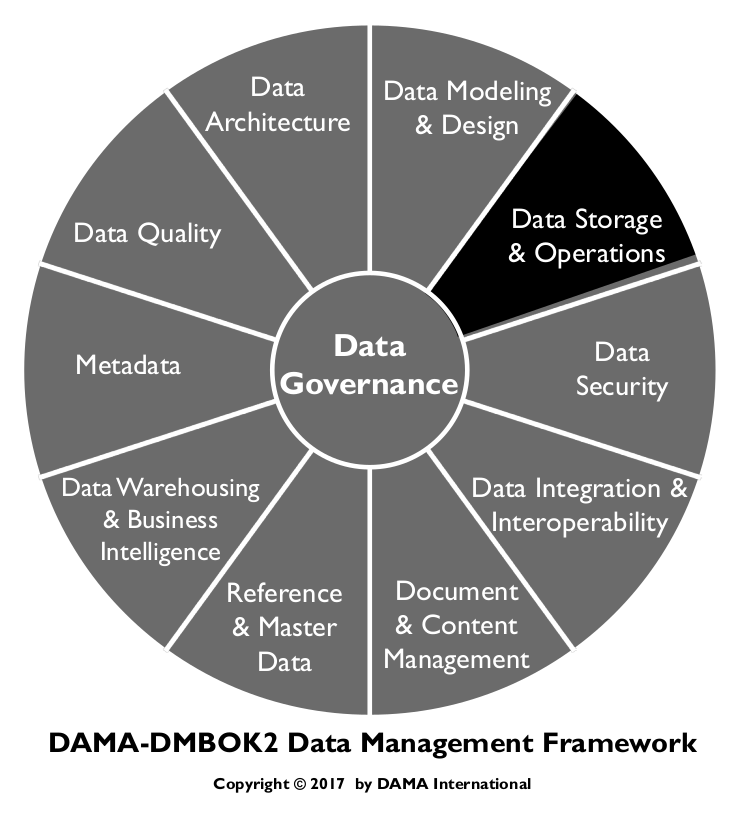
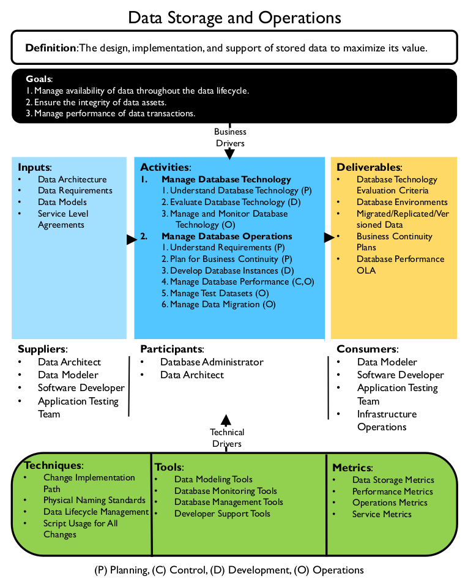
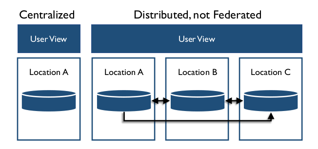
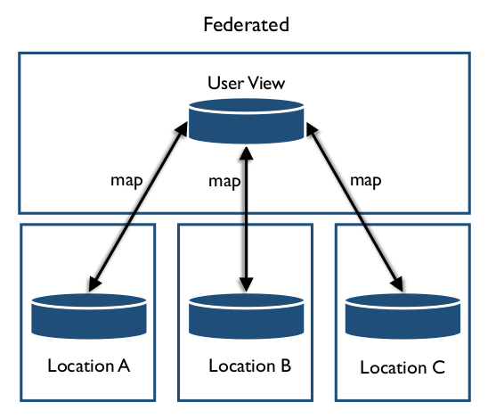
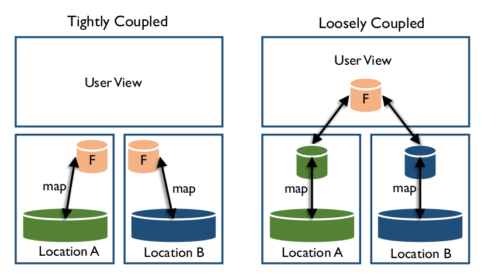
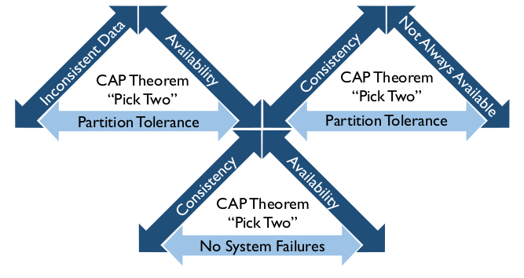
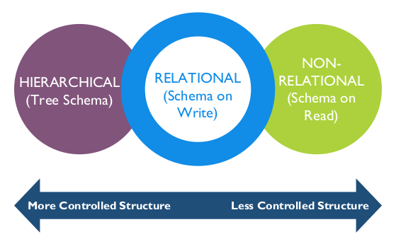
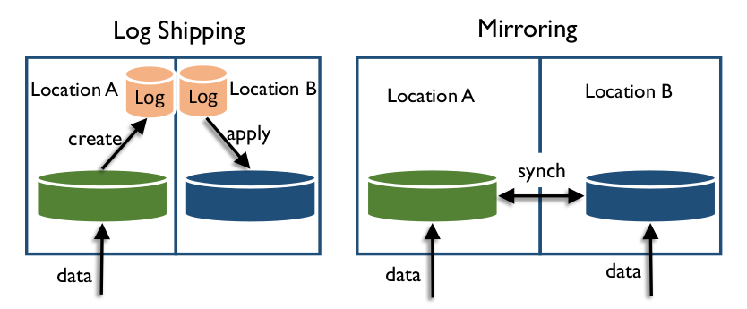
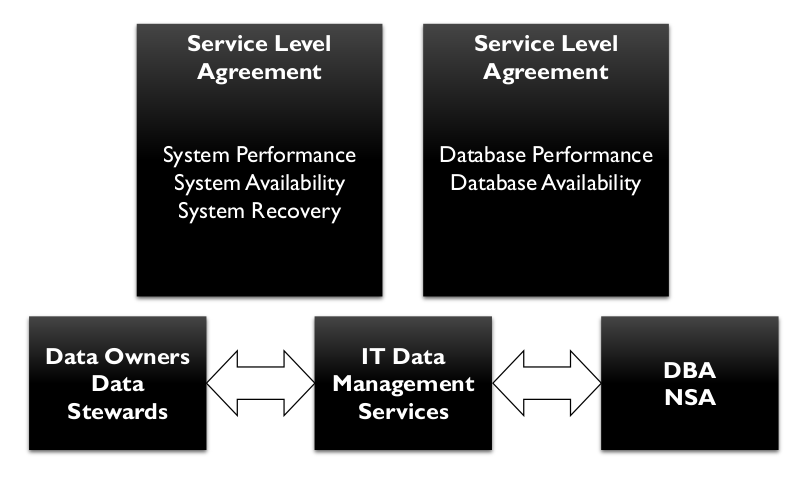

# Data Storage and Operations

## 1. Introduction

Data Storage and Operations includes the design, implementation, and support of stored data, to
maximize its value throughout its lifecycle, from creation/acquisition to disposal (see Chapter 1).
Data Storage and Operations includes two sub-activities:

* Database support focuses on activities related to the data lifecycle, from initial implementation of a database environment, through obtaining, backing up, and purging data. It also includes ensuring the database performs well. Monitoring and tuning are critical to database support.
* Database technology support includes defining technical requirements that will meet organizational needs, defining technical architecture, installing and administering technology, and resolving issues related to technology.

Database administrators (DBAs) play key roles in both aspects of data storage and operations. The role of DBA is the most established and most widely adopted data professional role, and database administration practices are perhaps the most mature of all data management practices. DBAs also play dominant roles in data operations and data security. (See Chapter 7.)

Figure 54 Context Diagram: Data Storage and Operations

### 1.1 Business Drivers

Companies rely on their information systems to run their operations. Data Storage and Operations activities are crucial to organizations that rely on data. Business continuity is the primary driver of these activities. If a system becomes unavailable, company operations may be impaired or stopped completely. A reliable data storage infrastructure for IT operations minimizes the risk of disruption.

### 1.2 Goals and Principles

The goals of data storage and operations include:

* Managing the availability of data throughout the data lifecycle
* Ensuring the integrity of data assets
* Managing the performance of data transactions

Data Storage and Operations represent a highly technical side of data management. DBAs and others involved in this work can do their jobs better and help the overall work of data management when they follow these guiding principles:

* Identify and act on automation opportunities: Automate database development processes, developing tools, and processes that shorten each development cycle, reduce errors and rework, and minimize the impact on the development team. In this way, DBAs can adapt to more iterative (agile) approaches to application development. This improvement work should be done in collaboration with data modeling and Data Architecture.
* Build with reuse in mind: Develop and promote the use of abstracted and reusable data objects that prevent applications from being tightly coupled to database schemas (the so-called ‘object-relational impedance mismatch’). A number of mechanisms exist to this end, including database views, triggers, functions and stored procedures, application data objects and data-access layers, XML and XSLT, ADO.NET typed data sets, and web services. The DBA should be able to assess the best approach virtualizing data. The end goal is to make using the database as quick, easy, and painless as possible.
* Understand and appropriately apply best practices: DBAs should promote database standards and best practices as requirements, but be flexible enough to deviate from them if given acceptable reasons for these deviations. Database standards should never be a threat to the success of a project.
* Connect database standards to support requirements: For example, the Service Level Agreement (SLA) can reflect DBA-recommended and developer-accepted methods of ensuring data integrity and data security. The SLA should reflect the transfer of responsibility from the DBAs to the development team if the development team will be coding their own database update procedures or data access layer. This prevents an ‘all or nothing’ approach to standards.
* Set expectations for the DBA role in project work: Ensuring project methodology includes onboarding the DBA in project definition phase can help throughout the SDLC. The DBA can understand project needs and support requirements up-front. This will improve communication by clarifying the project team’s expectations from the data group. Having a dedicated primary and secondary DBA during analysis and design clarify expectations about DBA tasks, standards, work effort, and timelines for development work. Teams should also clarify expectations for support after implementation.

### 1.3 Essential Concepts

#### 1.3.1 Database Terms

Database terminology is specific and technical. In working as a DBA or with DBAs, it is important to understand the specifics of this technical language:

* Database: Any collection of stored data, regardless of structure or content. Some large databases refer to instances and schema.
* Instance: An execution of database software controlling access to a certain area of storage. An organization will usually have multiple instances executing concurrently, using different areas of storage. Each instance is independent of all other instances.
* Schema: A subset of a database objects contained within the database or an instance. Schemas are used to organize objects into more manageable parts. Usually, a schema has an owner and an access list particular to the schema’s contents. Common uses of schemas are to isolate objects containing sensitive data from the general user base, or to isolate read-only views from the underlying tables in relational databases. Schema can also be used to refer to a collection of database structures with something in common.
* Node: An individual computer hosting either processing or data as part of a distributed database.
* Database abstraction means that a common application interface (API) is used to call database functions, such that an application can connect to multiple different databases without the programmer having to know all function calls for all possible databases. ODBC (Open Database Connectivity) is an example of an API that enables database abstraction. Advantages include portability; disadvantages include inability to use specific database functions that are not common across databases.

#### 1.3.2 Data Lifecycle Management

DBAs maintain and assure the accuracy and consistency of data over its entire lifecycle through the design, implementation, and usage of any system that stores, processes, or retrieves data. The DBA is the custodian of all database changes. While many parties may request changes, the DBA defines the precise changes to make to the database, implements the changes, and controls the changes.

Data lifecycle management includes implementing policies and procedures for acquisition, migration, retention, expiration, and disposition of data. It is prudent to prepare checklists to ensure all tasks are performed at a high level of quality. DBAs should use a controlled, documented, and auditable process for moving application database changes to the Quality Assurance or Certification (QA) and Production environments. A manager-approved service request or change request usually initiates the process. The DBA should have a back out plan to reverse changes in case of problems.

#### 1.3.3 Administrators

The role of Database Administrator (DBA) is the most established and the most widely adopted data professional role. DBAs play the dominant roles in Data Storage and Operations, and critical roles in Data Security (see Chapter 7), the physical side of data modeling, and database design (see Chapter 5). DBAs provide support for development, test, QA, and special use database environments.

DBAs do not exclusively perform all the activities of Data Storage and Operations. Data stewards, data architects, network administrators, data analysts, and security analysts participate in planning for performance, retention, and recovery. These teams may also participate in obtaining and processing data from external sources.

Many DBAs specialize as Production, Application, Procedural and Development DBAs. Some organizations also have Network Storage Administrators (NSA) who specialize in supporting the data storage system separately from the data storage applications or structures.

In some organizations, each specialized role reports to a different organization within IT. Production DBAs may be part of production infrastructure or application operations support groups. Application, Development, and Procedural DBAs are sometimes integrated into application development organizations. NSAs usually are connected to Infrastructure organizations.

##### 1.3.3.1 Production DBA

Production DBAs take primary responsibility for data operations management, including:

* Ensuring the performance and reliability of the database, through performance tuning, monitoring, error reporting, and other activities
* Implementing backup and recovery mechanisms to ensure data can be recovered if lost in any circumstance
* Implementing mechanisms for clustering and failover of the database, if continual data availability data is a requirement
* Executing other database maintenance activities, such as implementing mechanisms for archiving data

As part of managing data operations, Production DBAs create the following deliverables:

* A production database environment, including an instance of the DBMS (Database Management System) on the supporting server, of a sufficient size and capacity to ensure adequate performance, configured for the appropriate level of security, reliability, and availability. Database System Administration is responsible for the DBMS environment.
* Mechanisms and processes for controlled implementation of changes to databases in the production environment
* Mechanisms for ensuring the availability, integrity, and recoverability of data in response to all circumstances that could result in loss or corruption of data
* Mechanisms for detecting and reporting any error that occurs in the database, the DBMS, or the data server
* Database availability, recovery, and performance in accordance with service level agreements
* Mechanisms and processes for monitoring database performance as workloads and data volumes vary

##### 1.3.3.2 Application DBA

An application DBA is responsible for one or more databases in all environments (development / test, QA, and production), as opposed to database systems administration for any of these environments. Sometimes, application DBAs report to the organizational units responsible for development and maintenance of the applications supported by their databases. There are pros and cons to staffing application DBAs.

Application DBAs are viewed as integral members of an application support team. By focusing on a specific database, they can provide better service to application developers. However, application DBAs can easily become isolated and lose sight of the organization’s overall data needs and common DBA practices. Application DBAs collaborate closely with data analysts, modelers, and architects.

##### 1.3.3.3 Procedural and Development DBAs

Procedural DBAs lead the review and administration of procedural database objects. A procedural DBA specializes in development and support of procedural logic controlled and execute by the DBMS: stored procedures, triggers, and user-defined functions (UDFs). The procedural DBA ensures this procedural logic is planned, implemented, tested, and shared (reused).

Development DBAs focus on data design activities including creating and managing special use databases, such as ‘sandbox’ or exploration areas.

In many cases, these two functions are combined under one position.

##### 1.3.3.4 NSA
Network Storage Administrators are concerned with the hardware and software supporting data storage arrays. Multiple network storage array systems have different needs and monitoring requirements than simple database systems.

#### 1.3.4 Database Architecture Types

A database can be classified as either centralized or distributed. A centralized system manages a single database, while a distributed system manages multiple databases on multiple systems. A distributed system’s components can be classified depending on the autonomy of the component systems into two types: federated (autonomous) or non-federated (non-autonomous). Figure 55 illustrates the difference between centralized and distributed.

Figure 55 Centralized vs. Distributed

##### 1.3.4.1 Centralized Databases

Centralized databases have all the data in one system in one place. All users come to the one system to access the data. For certain restricted data, centralization can be ideal, but for data that needs to be widely available, centralized databases have risks. For example, if the centralized system is unavailable, there are no other alternatives for accessing the data.

##### 1.3.4.2 Distributed Databases

Distributed databases make possible quick access to data over a large number of nodes. Popular distributed database technologies are based on using commodity hardware servers. They are designed to scale out from single servers to thousands of machines, each offering local computation and storage. Rather than rely on hardware to deliver high-availability, the database management software itself is designed to replicate data amongst the servers, thereby delivering a highly available service on top of a cluster of computers. Database management software is also designed to detect and handle failures. While any given computer may fail, the system overall is unlikely to.

Some distributed databases implement a computational paradigm named MapReduce to further improve performance. In MapReduce, the data request is divided into many small fragments of work, each of which may be executed or re-executed on any node in the cluster. In addition, data is co-located on the compute nodes, providing very high aggregate bandwidth across the cluster. Both the filesystem and the application are designed to automatically handle node failures.

###### 1.3.4.2.1 Federated Databases

Federation provisions data without additional persistence or duplication of source data. A federated database system maps multiple autonomous database systems into a single federated database. The constituent databases, sometimes geographically separated, are interconnected via a computer network. They remain autonomous yet participate in a federation to allow partial and controlled sharing of their data. Federation provides an alternative to merging disparate databases. There is no actual data integration in the constituent databases because of data federation; instead, data interoperability manages the view of the federated databases as one large object (see Chapter 8). In contrast, a non-federated database system is an integration of component DBMS’s that are not autonomous; they are controlled, managed and governed by a centralized DBMS.

Federated databases are best for heterogeneous and distributed integration projects such as enterprise information integration, data virtualization, schema matching, and Master Data Management.

Federated architectures differ based on levels of integration with the component database systems and the extent of services offered by the federation. A FDBMS can be categorized as either loosely or tightly coupled.

Figure 56 Federated Databases

Loosely coupled systems require component databases to construct their own federated schema. A user will typically access other component database systems by using a multi-database language, but this removes any levels of location transparency, forcing the user to have direct knowledge of the federated schema. A user imports the data required from other component databases, and integrates it with their own to form a federated schema.

Tightly coupled systems consist of component systems that use independent processes to construct and publish an integrated federated schema, as illustrated in Figure 57. The same schema can apply to all parts of the federation, with no data replication.

Figure 57 Coupling

###### 1.3.4.2.2 Blockchain Database

Blockchain databases are a type of federated database used to securely manage financial transactions. They can also be used for contract management or exchange of health information. There are two types of structures: individual records and blocks. Each transaction has a record. The database creates chains of time-bound groups of transactions (blocks) that also contain information from the previous block in the chain. Hash algorithms are used to create information about transactions to store in blocks while the block is the end of the chain. Once a new block is created, the old block hash should never change, which means that no transactions contained within that block may change. Any change to transactions or blocks (tampering) will be apparent when the hash values no longer match.

##### 1.3.4.3 Virtualization / Cloud Platforms

Virtualization (also called ‘cloud computing’) provides computation, software, data access, and storage services that do not require end-user knowledge of the physical location and configuration of the system that delivers the service(s). Parallels are often drawn between the concept of cloud computing and the electricity grid: end users consume power without needing to understand the component devices or infrastructure required to provide the service. However, virtualization can be on-premises or off-premises.

Cloud computing is a natural evolution of the widespread adoption of virtualization, service oriented architectures, and utility computing. Here are some methods for implementing databases on the cloud:

* Virtual machine image: Cloud platforms allow users to purchase virtual machine instances for a limited time. It is possible to run a database on these virtual machines. Users can either upload their own machine image with a database installed on it, or use ready-made machine images that already include an optimized installation of a database.
* Database-as-a-service (DaaS): Some cloud platforms offer options for using a database-as-a-service, without physically launching a virtual machine instance for the database. In this configuration, application owners do not have to install and maintain the database on their own. Instead, the database service provider is responsible for installing and maintaining the database, and application owners pay according to their usage.
* Managed database hosting on the cloud: Here the database is not offered as a service; instead, the cloud provider hosts the database and manages it on the application owner’s behalf.

DBAs, in coordination with network and system administrators, need to establish a systematic integrated project approach to include standardization, consolidation, virtualization, and automation of data backup and recovery functions, as well as security of these functions.

* Standardization/consolidation: Consolidation reduces the number of data storage locations an organization has, including the number of data stores and processes within a data center. Based on Data Governance policy, Data Architects and DBAs may develop the standard procedures that include identifying mission critical data, duration of data retention, data encryption procedures, and data replication policies.
* Server virtualization: Virtualization technologies allow equipment, such as servers from multiple data centers, to be replaced or consolidated. Virtualization lowers capital and operational expenses and reduces energy consumption. Virtualization technologies are also used to create virtual desktops, which can then be hosted in data centers and rented out on a subscription basis. Gartner views virtualization as a catalyst for modernization (Bittman, 2009). Virtualization provides data storage operations much more flexibility in provisioning storage at local or cloud environment.
* Automation: Data automation involves automating tasks such as provisioning, configuration, patching, release management, and compliance.
* Security: The security of data on virtual systems needs to be integrated with existing security of physical infrastructures (see Chapter 7).

#### 1.3.5 Database Processing Types

There are two basic types of database processing. ACID and BASE are on opposite ends of a spectrum, so the coincidental names matching ends of a pH spectrum are helpful. The CAP Theorem is used to define how closely a distributed system may match either ACID or BASE.

##### 1.3.5.1 ACID

The acronym ACID was coined in the early 1980’s as the indispensable constraint for achieving reliability within database transactions. For decades, it has provided transaction processing with a reliable foundation on which to build. [^34]

* Atomicity: All operations are performed, or none of them is, so that if one part of the transaction fails, then the entire transaction fails.
* Consistency: The transaction must meet all rules defined by the system at all times and must void half- completed transactions.
* Isolation: Each transaction is independent unto itself.
* Durability: Once complete, the transaction cannot be undone.

Relational ACID technologies are the dominant tools in relational database storage; most use SQL as the interface.

##### 1.3.5.2 BASE

The unprecedented increase in data volumes and variability, the need to document and store unstructured data, the need for read-optimized data workloads, and subsequent need for greater flexibility in scaling, design, processing, cost, and disaster recovery gave rise to the diametric opposite of ACID, appropriately termed BASE:

* Basically Available: The system guarantees some level of availability to the data even when there are node failures. The data may be stale, but the system will still give and accept responses.
* Soft State: The data is in a constant state of flux; while a response may be given, the data is not guaranteed to be current.
* Eventual Consistency: The data will eventually be consistent through all nodes and in all databases, but not every transaction will be consistent at every moment.

BASE-type systems are common in Big Data environments. Large online organizations and social media companies commonly use BASE implementations, as immediate accuracy of all data elements at all times is not necessary. Table 12 summarizes the differences between ACID and BASE.

Table 12 ACID vs BASE

<table>
  <thead>
    <tr>
      <th>Item</th>
      <th>ACID</th>
      <th>BASE</th>
    </tr>
  </thead>
  <tbody>
    <tr>
      <td rowspan="3">Casting (data structure)</td>
      <td>Schema must exist</td>
      <td>Dynamic</td>
    </tr>
    <tr>
      <td>Table structure exists</td>
      <td>Adjust on the fly</td>
    </tr>
    <tr>
      <td>Columns data typed</td>
      <td>Store dissimilar data</td>
    </tr>
    <tr>
      <td>Consistency</td>
      <td>Strong Consistency Available</td>
      <td>Strong, Eventual, or None</td>
    </tr>
    <tr>
      <td>Processing Focus</td>
      <td>STransactional</td>
      <td>Key-value stores</td>
    </tr>
    <tr>
      <td>Processing Focus</td>
      <td>Row/Column</td>
      <td>Wide-column stores</td>
    </tr>
    <tr>
      <td>History</td>
      <td>1970s application storage</td>
      <td>2000s unstructured storage</td>
    </tr>
    <tr>
      <td>Scaling</td>
      <td>Product Dependent</td>
      <td>Automatically spreads data across commodity servers</td>
    </tr>
    <tr>
      <td>Origin</td>
      <td>Mixture</td>
      <td>Open-source</td>
    </tr>
    <tr>
      <td>Transaction</td>
      <td>Yes</td>
      <td>Possible</td>
    </tr>
  </tbody>
</table>

##### 1.3.5.3 CAP

The CAP Theorem (or Brewer’s Theorem) was developed in response to a shift toward more distributed systems (Brewer, 2000). The theorem asserts that a distributed system cannot comply with all parts of ACID at all time. The larger the system, the lower the compliance. A distributed system must instead trade-off between properties.

* Consistency: The system must operate as designed and expected at all times.
* Availability: The system must be available when requested and must respond to each request.
* Partition Tolerance: The system must be able to continue operations during occasions of data loss or partial system failure.

The CAP Theorem states that at most two of the three properties can exist in any shared-data system. This is usually stated with a ‘pick two’ statement, illustrated in Figure 58.

Figure 58 CAP Theorem

An interesting use of this theorem drives the Lambda Architecture design discussed in Chapter 14. Lambda Architecture uses two paths for data: a Speed path where availability and partition tolerance are most important, and a Batch path where consistency and availability are most important.

#### 1.3.6 Data Storage Media

Data can be stored on a variety of media, including disks, volatile memory, and flash drives. Some systems can combine multiple storage types. The most commonly used are Disk and Storage Area Networks (SAN), In-Memory, Columnar Compression Solutions, Virtual Storage Area Network VSAN, Cloud-based storage solutions, Radio Frequency Identification (RFID), Digital wallets, Data centers and Private, Public, and Hybrid Cloud Storage. (See Chapter 14.)

##### 1.3.6.1 Disk and Storage Area Networks (SAN)

Disk storage is a very stable method of storing data persistently. Multiple types of disk can exist in the same system. Data can be stored according to usage patterns, with less-used data stored on slower-access disks, which are usually cheaper than high performance disk systems.

Disk arrays can be collected into Storage Area Networks (SAN). Data movement on a SAN may not require a network, as data can be moved on the backplane.

##### 1.3.6.2 In-Memory

In-Memory databases (IMDB) are loaded from permanent storage into volatile memory when the system is turned on, and all processing occurs within the memory array, providing faster response time than disk-based systems. Most in-memory databases also have features to set and configure durability in case of unexpected shutdown.

If the application can be reasonably assured to fit most/all data into memory, then significant optimization can be made available from in-memory database systems. These IMDB’s provide more predictable access time to data than do disk storage mechanisms, but they require a much larger investment. IMDB’s provide functionality for real-time processing of analytics and are generally reserved for this due to the investment required.

##### 1.3.6.3 Columnar Compression Solutions

Columnar-based databases are designed to handle data sets in which data values are repeated to a great extent. For example, in a table with 256 columns, a lookup for a value that exists in a row will retrieve all the data in the row (and be somewhat disk-bound). Columnar storage reduces this I/O bandwidth by storing column data using compression – where the state (for example) is stored as a pointer to a table of states, compressing the master table significantly.

##### 1.3.6.4 Flash Memory

Recent advances in memory storage have made flash memory or solid state drives (SSDs) an attractive alternative to disks. Flash memory combines the access speed of memory-based storage with the persistence of disk-based storage.

#### 1.3.7 Database Environments

Databases are used in a variety of environments during the systems development lifecycle. When testing changes, DBAs should be involved in designing the data structures in the Development environment. The DBA team should implement any changes to the QA environment, and must be the only team implementing changes to the Production environment. Production changes must adhere strictly to standard processes and procedures.

While most data technology is software running on general purpose hardware, occasionally specialized hardware is used to support unique data management requirements. Types of specialized hardware include data appliances – servers built specifically for data transformation and distribution. These servers integrate with existing infrastructure either directly as a plug-in, or peripherally as a network connection.

##### 1.3.7.1 Production Environment

The production environment is the technical environment where all business processes occur. Production is mission-critical – if this environment ceases to operate, business processes will stop, resulting in bottom-line losses, as well as a negative impact on customers who are unable to access services. In an emergency, or for public service systems, unexpected loss of function can be disastrous.

The production environment is the ‘real’ environment from a business perspective. However, in order to have a reliable production environment, other non-production environments must exist and be used appropriately. For example, production environments should not be used for development and testing as these activities put production processes and data at risk.

##### 1.3.7.2 Pre-production Environments

Pre-production environments are used to develop and test changes before such changes are introduced to the production environment. In pre-production environments, issues with changes can be detected and addressed without affecting normal business processes. In order to detect potential issues, the configuration of pre-production environments must closely resemble the production environment.

Due to space and cost, it is usually not possible to exactly replicate production in the pre-production environments. The closer on the development path the non-production environment is to the production environment, the more closely the non-production environment needs to match the production environment. Any deviation from the production system equipment and configuration can itself create issues or errors that are unrelated to the change, complicating issue research and resolution.

Common types of pre-production environments include development, test, support, and special use environments.

###### 1.3.7.2.1 Development

The development environment is usually a slimmer version of the production environment. It generally has less disk space, fewer CPUs, less RAM, etc. Developers use this environment to create and test code for changes in separate environments, which then are combined in the QA environment for full integration testing. Development can have many copies of production data models, depending on how development projects are managed. Larger organizations may give individual developers their own environments to manage with all appropriate rights.

The development environment should be the first place any patches or updates are applied for testing. This environment should be isolated from and on different physical hardware than the production environments. Due to the isolation, data from production systems may need to be copied to the development environments. However, in many industries, production data is protected through regulation. Do not move data from production environments without first determining what restrictions there are on doing so. (See Chapter 7.)

###### 1.3.7.2.2 Test

The test environment is used to execute quality assurance and user acceptance testing and, in some cases, stress or performance tests. In order to prevent test results from being distorted due to environmental differences, the test environment ideally also has the same software and hardware as the production environment. This is especially important for performance testing. Test may or may not be connected via network to production systems in order to read production data. Test environments should never write to production systems.

Test environments serve many uses:

* Quality Assurance Testing (QA): Used to test functionality against requirements.
* Integration Testing: Used for testing as a whole multiple parts of a system that have been developed or upgraded independently.
* User Acceptance Testing (UAT): Used for testing the system functionality from a user perspective. Use Cases are the most common inputs for testing performed in this environment.
* Performance Testing: Used to perform high-volume or high-complexity tests at any time, rather than having to wait for off hours, or adversely affecting production system peak time.

###### 1.3.7.2.3 Sandboxes or Experimental Environments

A sandbox is an alternate environment that allows read-only connections to production data and can be managed by the users. Sandboxes are used to experiment with development options and test hypotheses about data or merge production data with user-developed data or supplemental data obtained from external sources. Sandboxes are valuable, for example, when performing a Proof-of-Concept.

A sandbox environment can either be a sub-set of the production system, walled off from production processing, or a completely separate environment. Sandbox users often have CRUD rights over their own space so that they can quickly validate ideas and options for changes to the system. The DBAs usually have little to do with these environments other than setting them up, granting access, and monitoring usage. If the Sandbox areas are situated in production database systems, they must be isolated in order to avoid adversely affecting production operations. These environments should never write back to the production systems.

Sandbox environments could be handled by virtual machines (VMs), unless licensing costs for separate instances becomes prohibitive.

#### 1.3.8 Database Organization

Data storage systems provide a way to encapsulate the instructions necessary to put data on disks and manage processing, so developers can simply use instructions to manipulate data. Databases are organized in three general ways: Hierarchical, Relational, and Non-Relational. These classes are not mutually exclusive (see Figure 59). Some database systems can read and write data organized in relational and non-relational structures. Hierarchical databases can be mapped to relational tables. Flat files with line delimiters can be read as tables with rows, and one or more columns can be defined to describe the row contents.

Figure 59 Database Organization Spectrum

##### 1.3.8.1 Hierarchical

Hierarchical database organization is the oldest database model, used in early mainframe DBMS, and is the most rigid of structures. In hierarchical databases, data is organized into a tree-like structure with mandatory parent/child relationships: each parent can have many children, but each child has only one parent (also known as a 1-to-many relationship). Directory trees are an example of a hierarchy. XML also uses a hierarchical model. It can be represented as a relational database, although the actual structure is that of a tree traversal path.

##### 1.3.8.2 Relational

People sometimes think that relational databases are named for the relation between tables. This is not the case. Relational databases are based on set theory and relational algebra, where data elements or attributes (columns) are related into tuples (rows). (See Chapter 5.) Tables are sets of relations with identical structure. Set operations (like union, intersect, and minus) are used to organize and retrieve data from relational databases, in the form of Structured Query Language (SQL). In order to write data, the structure (schema) has to be known in advance (schema on write). Relational databases are row-oriented.

The database management system (DBMS) of a relational database is called RDBMS. A relational database is the predominant choice in storing data that constantly changes. Variations on relational databases include Multidimensional and Temporal.

###### 1.3.8.2.1 Multidimensional

Multidimensional database technologies store data in a structure that allows searching using several data element filters simultaneously. This type of structure is used most frequently in Data Warehousing and Business Intelligence. Some of these database types are proprietary, although most large databases have cube technology built in as objects. Access to the data uses a variant of SQL called MDX or Multidimensional eXpression.

###### 1.3.8.2.2 Temporal

A temporal database is a relational database with built-in support for handling data involving time. The temporal aspects usually include valid time and transaction time. These attributes can be combined to form bi- temporal data.

* Valid time is the timeframe when a fact is true with respect to the entity it represents in the real world.
* Transaction time is the period during which a fact stored in the database is considered true.

It is possible to have timelines other than Valid Time and Transaction Time, such as Decision Time, in the database. In that case, the database is called a multi-temporal database as opposed to a bi-temporal database. Temporal databases enable application developers and DBAs to manage current, proposed, and historical versions of data in the same database.

##### 1.3.8.3 Non-relational

Non-relational databases can store data as simple strings or complete files. Data in these files can be read in different ways, depending on the need (this characteristic is referred to as ‘schema on read’). Non-relational databases may be row-oriented, but this is not required.

A non-relational database provides a mechanism for storage and retrieval of data that employs less constrained consistency models than traditional relational databases. Motivations for this approach include simplicity of design, horizontal scaling, and finer control over availability.

Non-relational databases are usually referred to as NoSQL (which stands for “Not Only SQL”). The primary differentiating factor is the storage structure itself, where the data structure is no longer bound to a tabular relational design. It could be a tree, a graph, a network, or a key-value pairing. The NoSQL tag emphasizes that some editions may in fact support conventional SQL directives. These databases are often highly optimized data stores intended for simple retrieval and appending operations. The goal is improved performance, especially with respect to latency and throughput. NoSQL databases are used increasingly in Big Data and real-time web applications. (See Chapter 5.)

###### 1.3.8.3.1 Column-oriented

Column-oriented databases are used mostly in Business Intelligence applications because they can compress redundant data. For example, a state ID column only has unique values, instead of one value for each of a million rows.

There are trade-offs between column-oriented (non-relational) and row-oriented (usually relational) organization.

* Column-oriented organization is more efficient when an aggregate needs to be computed over many rows. This only holds true for a notably smaller subset of all columns of data, because reading that smaller subset of data can be faster than reading all data.
* Column-oriented organization is more efficient when new values of a column are supplied for all rows at once, because that column data can be written efficiently to replace old column data without touching any other columns for the rows.
* Row-oriented organization is more efficient when many columns of a single row are required at the same time, and when row-size is relatively small, as the entire row can be retrieved with a single disk seek.
* Row-oriented organization is more efficient when writing a new row if all of the row data is supplied at the same time; the entire row can be written with a single disk seek.
* In practice, row-oriented storage layouts are well suited for Online Transaction Processing (OLTP)- like workloads, which are more heavily loaded with interactive transactions. Column-oriented storage layouts are well suited for Online Analytical Processing (OLAP)-like workloads (e.g., data warehouses) which typically involve a smaller number of highly complex queries over all data (possibly terabytes).

###### 1.3.8.3.2 Spatial

A spatial database is optimized to store and query data that represents objects defined in a geometric space. Spatial databases support several primitive types (simple geometric shapes such as box, rectangle, cube, cylinder, etc.) and geometries composed of collections of points, lines, and shapes.

Spatial database systems use indexes to quickly look up values; the way that most databases index data is not optimal for spatial queries. Instead, spatial databases use a spatial index to speed up database operations.

Spatial databases can perform a wide variety of spatial operations. As per the Open Geospatial Consortium standard, a spatial database may perform one or more of the following operations:

* Spatial Measurements: Computes line length, polygon area, the distance between geometries, etc.
* Spatial Functions: Modifies existing features to create new ones; for example, by providing a buffer around them, intersecting features, etc.
* Spatial Predicates: Allows true/false queries about spatial relationships between geometries. Examples include “Do two polygons overlap?” or “Is there a residence located within a mile of the area of the proposed landfill?”
* Geometry Constructors: Creates new geometries, usually by specifying the vertices (points or nodes) which define the shape.
* Observer Functions: Queries that return specific information about a feature such as the location of the center of a circle.

###### 1.3.8.3.3 Object / Multi-media

A multimedia database includes a Hierarchical Storage Management system for the efficient management of a hierarchy of magnetic and optical storage media. It also includes a collection of objects classes, which represents the foundation of the system.

###### 1.3.8.3.4 Flat File Database

A flat file database describes any of various means to encode a data set as a single file. A flat file can be a plain text file or a binary file. Strictly, a flat file database consists of nothing but data, and contains records that may vary in length and delimiters. More broadly, the term refers to any database that exists in a single file in the form of rows and columns, with no relationships or links between records and fields except the structure. Plain text files usually contain one record per line. A list of names, addresses, and phone numbers, written by hand on a sheet of paper, is an example of a flat file database. Flat files are used not only as data storage tools in DBMS systems, but also as data transfer tools. Hadoop databases use flat file storage.

###### 1.3.8.3.5 Key-Value Pair

Key-Value pair databases contain sets of two items: a key identifier and a value. There are a few specific uses of these types of databases.

* Document Databases: Document-oriented databases contain collections of files including both structure and data. Each document is assigned a key. More advanced document-oriented databases also can store attributes for the document’s contents, such as dates or tags. This type of database can store both complete and incomplete documents. Document databases may use XML or JSON (Java Script Object Notation) structures.
* Graph Databases: Graph databases store key-value pairs where the focus is on the relationship between the nodes, rather than on the nodes themselves.

###### 1.3.8.3.6 Triplestore

A data entity composed of subject-predicate-object is known as a triplestore. In Resource Description Framework (RDF) terminology, a triplestore is composed of a subject that denotes a resource, the predicate that expresses a relationship between the subject and the object, and the object itself. A triplestore is a purpose-built database for the storage and retrieval of triples in the form of subject-predicate-object expressions.

Triplestores can be broadly classified into three categories: Native triplestores, RDBMS-backed triplestores and NoSQL triplestores.

* Native triplestores are those that are implemented from scratch and exploit the RDF data model to efficiently store and access the RDF data.
* RDBMS-backed triplestores are built by adding an RDF specific layer to an existing RDBMS.
* NoSQL Triplestores are currently being investigated as possible storage managers for RDF.

Triplestore databases are best for taxonomy and thesaurus management, linked data integration, and knowledge portals.

#### 1.3.9 Specialized Databases

Some specialized situations require specialized types of databases that are managed differently from traditional relational databases. Examples include:

* Computer Assisted Design and Manufacturing (CAD / CAM) applications require an Object database, as will most embedded real-time applications.
* Geographical Information Systems (GIS) make use of specialized geospatial databases, which have at least annual updates to their Reference Data. Some specialized GIS are used for utilities (electric grid, gas lines, etc.), for telecom in network management, or for ocean navigation.
* Shopping-cart applications found on most online retail websites, make use of XML databases to initially store the customer order data, and may be used real-time by social media databases for ad placement on other websites.

Some of this data is then copied into one or more traditional OLTP (Online Transaction Processing) databases or data warehouses. In addition, many off-the-shelf vendor applications may use their own proprietary databases. At the very least, their schemas will be proprietary and mostly concealed, even if they sit on top of traditional relational DBMSs.

#### 1.3.10 Common Database Processes

All databases, no matter the type, share the following processes in some way.

###### 1.3.10.1 Archiving

Archiving is the process of moving data off immediately accessible storage media and onto media with lower retrieval performance. Archives can be restored to the originating system for short-term use. Data that is not actively needed to support application processes should be moved to an archive on less-expensive disk, tape, or a CD / DVD jukebox. Restoring from an archive should be a matter of simply copying the data from the archive back into the system.

Archival processes must be aligned with the partitioning strategy to ensure optimal availability and retention. A robust approach involves:

* Creating a secondary storage area, preferably on a secondary database server
* Partitioning existing database tables into archival blocks
* Replicating the data that is needed less often to the separate database
* Creating tape or disk backups
* Creating database jobs that periodically purge unneeded data

It is wise to schedule regular tests of archive restoration to ensure avoid surprises in an emergency.

When changes are made to the technology or structure of a production system, the archive also needs to be evaluated to ensure that data moved from the archive into current storage will be readable. There are several ways of handling out-of-synch archives:

* Determine if or how much of the archive is required to be preserved. What is not required can be considered purged.
* For major changes in technology, restore the archives to the originating system before the technology change, upgrade or migrate to the new technology, and re-archive the data using the new technology.
* For high-value archives where the source database structures change, restore the archive, make any changes to the data structures, and re-archive the data with the new structure.
* For infrequent-access archives where the source technology or structure changes, keep a small version of the old system running with limited access, and extract from the archives using the old system as needed.

Archives that are not recoverable with current technology are useless, and keeping old machinery around to read archives that cannot be otherwise read, is not efficient or cost-effective.

##### 1.3.10.2 Capacity and Growth Projections

Think of a database as a box, the data as fruit, and overhead (indexes, etc.) as packing material. The box has dividers, and fruit and packing material go in the cells:

* First, decide the size of the box that will hold all the fruit and any packing material needed – that is the Capacity.
* How much fruit goes into the box, and how quickly?
* How much fruit comes out of the box, and how quickly?

Decide if the box will stay the same size over time, or must be expanded over time to hold more fruit. This projection of how much and how quickly the box must expand to hold incoming fruit and packing material is the growth projection. If the box cannot expand, the fruit must be taken out as fast as it is put in, and the growth projection is zero.

How long should the fruit stay in the cells? If the fruit in one cell gets dehydrated over time, or for any reason becomes not as useful, should that fruit be put in a separate box for longer term storage (i.e., archived)? Will there ever be a need to bring that dehydrated fruit back into the main box? Moving the fruit to another box with the ability to move it back into the first box is an important part of archiving. This allows the box to not have to be expanded quite as often or as much.

If a fruit becomes too stagnant to use, throw that fruit away (i.e., purge the data).

##### 1.3.10.3 Change Data Capture (CDC)

Change data capture refers to the process of detecting that data has changed and ensuring that information relevant to the change is stored appropriately. Often referred to as log-based replication, CDC is a non-invasive way to replicate data changes to a target without affecting the source. In a simplified CDC context, one computer system has data that may have changed from a previous point in time, and a second computer system needs to reflect the same change. Rather than sending the entire database over the network to reflect just a few minor changes, the idea is to just send what changed (deltas), so that the receiving system can make appropriate updates.

There are two different methods to detect and collect changes: data versioning, which evaluates columns that identify rows that have changed (e.g., last-update-timestamp columns, version-number columns, status-indicator columns), or by reading logs that document the changes and enable them to be replicated in secondary systems.

##### 1.3.10.4 Purging

It is incorrect to assume that all data will reside forever in primary storage. Eventually, the data will fill the available space, and performance will begin to degrade. At that point, data will need to be archived, purged, or both. Just as importantly, some data will degrade in value and is not worth keeping. Purging is the process of completely removing data from storage media such that it cannot be recovered. A principal goal of data management is that the cost of maintaining data should not exceed its value to the organization. Purging data reduces costs and risks. Data to be purged is generally deemed obsolete and unnecessary, even for regulatory purposes. Some data may become a liability if kept longer than necessary. Purging it reduces the risks that it may be misused.

##### 1.3.10.5 Replication

Data replication means same data is stored on multiple storage devices. In some situations, having duplicate databases is useful, such as in a high-availability environment where spreading the workload among identical databases in different hardware or even data centers can preserve functionality during peak usage times or disasters.

Replication can be active or passive:

* Active replication is performed by recreating and storing the same data at every replica from every other replica.
* Passive replication involves recreating and storing data on a single primary replica and then transforming its resultant state to other secondary replicas.

Replication has two dimensions of scaling:

* Horizontal data scaling has more data replicas.
* Vertical data scaling has data replicas located further away in distance geographically.

Multi-master replication, where updates can be submitted to any database node and then ripple through to other servers, is often desired, but increases complexity and cost.

Replication transparency occurs when data is replicated between database servers so that the information remains consistent throughout the database system and users cannot tell or even know which database copy they are using.

The two primary replication patterns are mirroring and log shipping (see Figure 60).

* In mirroring, updates to the primary database are replicated immediately (relatively speaking) to the secondary database, as part of a two-phase commit process.
* In log shipping, a secondary server receives and applies copies of the primary database’s transaction logs at regular intervals.

The choice of replication method depends on how critical the data is, and how important it is that failover to the secondary server be immediate. Mirroring is usually a more expensive option than log shipping. For one secondary server, mirroring is effective; log shipping may be used to update additional secondary servers.

Figure 60 Log Shipping vs. Mirroring

##### 1.3.10.6 Resiliency and Recovery

Resiliency in databases is the measurement of how tolerant a system is to error conditions. If a system can tolerate a high level of processing errors and still function as expected, it is highly resilient. If an application crashes upon the first unexpected condition, that system is not resilient. If the database can detect and either abort or automatically recover from common processing errors (runaway query, for example), it is considered resilient. There are always some conditions that no system can detect in advance, such as a power failure, and those conditions are considered disasters.

Three recovery types provide guidelines for how quickly recovery takes place and what it focuses on:

* Immediate recovery from some issues sometimes can be resolved through design; for example, predicting and automatically resolving issues, such as those that might be caused by a failover to backup system.
* Critical recovery refers to a plan to restore the system as quickly as possible in order to minimize delays or shut downs of business processes.
* Non-critical recovery means that restoration of function can be delayed until systems that are more critical have been restored.

Data processing errors include data load failures, query return failures, and obstacles to completing ETL or other processes. Common ways of increasing resilience in data processing systems are to trap and re-route data causing errors, detect and ignore data causing errors, and implement flags in processing for completed steps to avoid reprocessing data or repeating completed steps when restarting a process.

Each system should require a certain level of resiliency (high or low). Some applications may require that any error halts all processing (low resiliency), while others may only require that the errors be trapped and re-routed for review, if not outright ignored.

For extremely critical data, the DBA will need to implement a replication pattern in which data moves to another copy of the database on a remote server. In the event of database failure, applications can then ‘fail over’ to the remote database and continue processing.

##### 1.3.10.7 Retention

Data Retention refers to how long data is kept available. Data retention planning should be part of the physical database design. Retention requirements also affect capacity planning.

Data Security also affects data retention plans, as some data needs to be retained for specific timeframes for legal reasons. Failure to retain data for the appropriate length of time can have legal consequences. Likewise, there are also regulations related to purging data. Data can become a liability if kept longer than specified. Organizations should formulate retention policies based on regulatory requirements and risk management guidelines. These policies should drive specifications for purging and archiving of data.

##### 1.3.10.8 Sharding

Sharding is a process where small chunks of the database are isolated and can be updated independently of other shards, so replication is merely a file copy. Because the shards are small, refreshes/overwrites may be optimal.

## 2. Activities

The two main activities in Data Operations and Storage are Database Technology Support and Database Operations Support. Database Technology Support is specific to selecting and maintaining the software that stores and manages the data. Database Operations Support is specific to the data and processes that the software manages.

### 2.1 Manage Database Technology

Managing database technology should follow the same principles and standards for managing any technology.

The leading reference model for technology management is the Information Technology Infrastructure Library (ITIL), a technology management process model developed in the United Kingdom. ITIL principles apply to managing data technology. [^35]

#### 2.1.1 Understand Database Technology Characteristics

It is important to understand how technology works, and how it can provide value in the context of a particular business. The DBA, along with the rest of the data services teams, works closely with business users and managers to understand the data and information needs of the business. DBAs and Database Architects combine their knowledge of available tools with the business requirements in order to suggest the best possible applications of technology to meet organizational needs.

Data professionals must first understand the characteristics of a candidate database technology before determining which to recommend as a solution. For example, database technologies that do not have transaction-based capabilities (e.g., commit and rollback) are not suitable for operational situations supporting Point-of-Sale processes.

Do not assume that a single type of database architecture or DBMS works for every need. Most organizations have multiple database tools installed, to perform a range of functions, from performance tuning to backups, to managing the database itself. Only a few of these tool sets have mandated standards.

#### 2.1.2 Evaluate Database Technology

Selecting strategic DBMS software is particularly important. DBMS software has a major impact on data integration, application performance, and business productivity. Some of the factors to consider when selecting DBMS software include:

* Product architecture and complexity
* Volume and velocity limits, including streaming rate
* Application profile, such as transaction processing, Business Intelligence, and personal profiles
* Specific functionality, such as temporal calculation support
* Hardware platform and operating system support
* Availability of supporting software tools
* Performance benchmarks, including real-time statistics
* Scalability
* Software, memory, and storage requirements
* Resiliency, including error handling and reporting

Some factors are not directly related to the technology itself, but rather to the purchasing organization and to the tool vendors. For example:

* Organizational appetite for technical risk
* Available supply of trained technical professionals
* Cost of ownership, such as licensing, maintenance, and computing resources
* Vendor reputation
* Vendor support policy and release schedule
* Customer references

The expense of the product, including administration, licensing, and support, should not exceed the product’s value to the business. Ideally, the technology should be as user friendly, self-monitoring, and self-administering as possible. If it is not, then it may be necessary to bring in staff with experience using the tool.

It is a good idea to start with a small pilot project or a proof-of-concept (POC), to get a good idea of the true costs and benefits before proceeding with a full-blown production implementation.

#### 2.1.3 Manage and Monitor Database Technology

DBAs often serve as Level 2 technical support, working with help desks and technology vendor support to understand, analyze, and resolve user problems. The key to effective understanding and use of any technology is training. Organizations should make sure they have training plans and budgets in place for everyone involved in implementing, supporting, and using data and database technology. Training plans should include appropriate levels of cross-training to better support application development, especially Agile development. DBAs should have working knowledge of application development skills, such as data modeling, use-case analysis, and application data access.

The DBA will be responsible for ensuring databases have regular backups and for performing recovery tests. However, if data from these databases needs to be merged with other existing data in one or more databases, there may be a data integration challenge. DBAs should not simply merge data. Instead, they should work with other stakeholders to ensure that data can be integrated correctly and effectively.

When a business requires new technology, the DBAs will work with business users and application developers to ensure the most effective use of the technology, to explore new applications of the technology, and to address any problems or issues that surface from its use. The DBAs then deploy new technology products in pre-production and production environments. They will need to create and document processes and procedures for administering the product with the least amount of effort and expense.

### 2.2 Manage Databases

Database support, as provided by DBAs and Network Storage Administrators (NSAs), is at the heart of data management. Databases reside on managed storage areas. Managed storage can be as small as a disk drive on a personal computer (managed by the OS), or as large as RAID arrays on a storage area network or SAN. Backup media is also managed storage.

DBAs manage various data storage applications by assigning storage structures, maintaining physical databases (including physical data models and physical layouts of the data, such as assignments to specific files or disk areas), and establishing DBMS environments on servers.

#### 2.2.1 Understand Requirements

##### 2.2.1.1 Define Storage Requirements

DBAs establish storage systems for DBMS applications and file storage systems to support NoSQL. NSAs and DBAs together play a vital role in establishing file storage systems. Data enters the storage media during normal business operations and, depending on the requirements, can stay permanently or temporarily. It is important to plan for adding additional space well in advance of when that space is actually needed. Doing any sort of maintenance in an emergency is a risk.

All projects should have an initial capacity estimate for the first year of operations, and a growth projection for the following few years. Capacity and growth should be estimated not only for the space the data itself holds, but also for indexes, logs, and any redundant images such as mirrors.

Data storage requirements must account for regulation related to data retention. For legal reasons, organizations are required to retain some data for set periods (see Chapter 9). In some cases, they may also be required to purge data after a defined period. It’s a good idea to discuss data retention needs with the data owners at design time and reach agreement on how to treat data through its lifecycle.

The DBAs will work with application developers and other operations staff, including server and storage administrators, to implement the approved data retention plan.

##### 2.2.1.2 Identify Usage Patterns

Databases have predictable usage patterns. Basic types of patterns include:

* Transaction-based
* Large data set write- or retrieval-based
* Time-based (heavier at month end, lighter on weekends, etc.),
* Location-based (more densely populated areas have more transactions, etc.)
* Priority-based (some departments or batch IDs have higher priority than others)

Some systems will have a combination of these basic patterns. DBAs need to be able to predict ebbs and flows of usage patterns and have processes in place to handle peaks (such as query governors or priority management) as well as to take advantage of valleys (delay processes that need large amounts of resources until a valley pattern exists). This information can be used to maintain database performance.

##### 2.2.1.3 Define Access Requirements

Data access includes activities related to storing, retrieving, or acting on data housed in a database or other repository. Data Access is simply the authorization to access different data files.

Various standard languages, methods, and formats exist for accessing data from databases and other repositories: SQL, ODBC, JDBC, XQJ, ADO.NET, XML, X Query, X Path, and Web Services for ACID-type systems. BASE-type access method standards include C, C++, REST, XML, and Java [^36]. Some standards enable translation of data from unstructured (such as HTML or free-text files) to structured (such as XML or SOL).

Data architects and DBAs can assist organizations to select appropriate methods and tools required for data access.

#### 2.2.2 Plan for Business Continuity

Organizations need to plan for business continuity in the event of disaster or adverse event that impacts their systems and their ability to use their data. DBAs must make sure a recovery plan exists for all databases and database servers, covering scenarios that could result in loss or corruption of data, such as:

* Loss of the physical database server
* Loss of one or more disk storage devices
* Loss of a database, including the DBMS Master Database, temporary storage database, transaction log segment, etc.
* Corruption of database index or data pages
* Loss of the database or log segment filesystems
* Loss of database or transaction log backup files

Each database should be evaluated for criticality so that its restoration can be prioritized. Some databases will be essential to business operations and will need to be restored immediately. Less critical databases will not be restored until primary systems are up and running. Still other may not need to be restored at all; for example, if they are merely copies that are refreshed when loaded.

Management and the organization’s business continuity group, if one exists, should review and approve the data recovery plan. The DBA group should regularly review the plans for accuracy and comprehensiveness. Keep a copy of the plan, along with all the software needed to install and configure the DBMS, instructions, and security codes (e.g., the administrator password) in a secure, off-site location in the event of a disaster.

No system can be recovered from a disaster if the backups are unavailable or unreadable. Regular backups are essential to any recovery effort, but if they are unreadable, they are worse than useless; processing time making the unreadable backups will have been wasted, along with the opportunity for fixing the issue that made the backups unreadable. Keep all backups in a secure, off-site location.

##### 2.2.2.1 Make Backups

Make backups of databases and, if appropriate, the database transaction logs. The system’s Service Level Agreement (SLA) should specify backup frequency. Balance the importance of the data against the cost of protecting it. For large databases, frequent backups can consume large amounts of disk storage and server resources. In addition to incremental backups, periodically make a complete backup of each database. Furthermore, databases should reside on a managed storage area, ideally a RAID array on a storage area network or SAN, with daily back up to separate storage media. For OLTP databases, the frequency of transaction log backups will depend on the frequency of updating, and the amount of data involved. For frequently updated databases, more frequent log dumps will not only provide greater protection, but will also reduce the impact of the backups on server resources and applications.

Backup files should be kept on a separate filesystem from the databases, and should be backed up to some separate storage medium as specified in the SLA. Store copies of the daily backups in a secure off-site facility. Most DBMSs support hot backups of the database – backups taken while applications are running. When some updates occur in transit, they will roll either forward to completion, or roll back when the backup reloads. The alternative is a cold backup taken when the database is off-line. However, a cold backup may not be a viable option if applications need to be continuously available.

##### 2.2.2.2 Recover Data

Most backup software includes the option to read from the backup into the system. The DBA works with the infrastructure team to re-mount the media containing the backup and to execute the restoration. The specific utilities used to execute the restoration of the data depend on the type of databased.

Data in file system databases may be easier to restore than those in relational database management systems, which may have catalog information that needs to be updated during the data recovery, especially if the recovery is from logs instead of a full backup.

It is critical to periodically test recovery of data. Doing so will reduce bad surprises during a disaster or emergency. Practice runs can be executed on non-production system copies with identical infrastructure and configuration, or if the system has a failover, on the secondary system.

#### 2.2.3 Develop Database Instances

DBAs are responsible for the creation of database instances. Related activities include:

* Installing and updating DBMS software: DBAs install new versions of the DBMS software and apply maintenance patches supplied by the DBMS vendor in all environments (from development to production) as indicated by the vendor and vetted by and prioritized by DBA specialists, security specialists, and management. This is a critical activity to ensure against vulnerability to attacks, as well as to ensure ongoing data integrity in centralized and decentralized installations.
* Maintaining multiple environment installations, including different DBMS versions: DBAs may install and maintain multiple instances of DBMS software in sandbox, development, testing, user acceptance testing, system acceptance testing, quality assurance, pre-production, hot-fix, disaster recovery environments, and production, and manage migration of the DBMS software versions through environments relative to applications and systems versioning and changes.
* Installing and administering related data technology: DBAs may be involved in installing data integration software and third party data administration tools.

##### 2.2.3.1 Manage the Physical Storage Environment

Storage environment management needs to follow traditional Software Configuration Management (SCM) processes or Information Technology Infrastructure Library (ITIL) methods to record modification to the database configuration, structures, constraints, permissions, thresholds, etc. DBAs need to update the physical data model to reflect the changes to the storage objects as part of a standard configuration management process. With agile development and extreme programming methods, updates to the physical data model play important roles in preventing design or development errors.

DBAs need to apply the SCM process to trace changes and to verify that the databases in the development, test, and production environments have all of the enhancements included in each release – even if the changes are cosmetic or only in a virtualized data layer.

The four procedures required to ensure a sound SCM process are configuration identification, configuration change control, configuration status accounting, and configuration audits.

* During the configuration identification process, DBAs will work with data stewards, data architects, and data modelers to identify the attributes that define every aspect of a configuration for end-user purposes. These attributes are recorded in configuration documentation and baselined. Once an attribute is baselined a formal configuration change control processes is required to change the attribute.
* Configuration change control is a set of processes and approval stages required to change a configuration item’s attributes and to re-baseline them.
* Configuration status accounting is the ability to record and report on the configuration baseline associated with each configuration item at any point in time.
* Configuration audits occur both at delivery and when effecting a change. There are two types. A physical configuration audit ensures that a configuration item is installed in accordance with the requirements of its detailed design documentation, while a functional configuration audit ensures that performance attributes of a configuration item are achieved.

To maintain data integrity and traceability throughout the data lifecycle, DBAs communicate the changes to physical database attributes to modelers, developers, and Metadata managers.

DBAs must also maintain metrics on data volume, capacity projections, and query performance, as well as statistics on physical objects, in order to identify data replication needs, data migration volumes, and data recovery checkpoints. Larger databases will also have object partitioning, which must be monitored and maintained over time to ensure that the object maintains the desired distribution of data.

##### 2.2.3.2 Manage Database Access Controls

DBAs are responsible for managing the controls that enable access to the data. DBAs oversee the following
functions to protect data assets and data integrity:

* Controlled environment: DBAs work with NSAs to manage a controlled environment for data assets; this includes network roles and permissions management, 24x7 monitoring and network health monitoring, firewall management, patch management, and Microsoft Baseline Security Analyzer (MBSA) integration.
* Physical security: The physical security of data assets is managed by Simple Network Management Protocol (SNMP)-based monitoring, data audit logging, disaster management, and database backup planning. DBAs configure and monitor these protocols. Monitoring is especially important for security protocols.
* Monitoring: Database systems are made available by continuous hardware and software monitoring of critical servers.
* Controls: DBAs maintain information security by access controls, database auditing, intrusion detection, and vulnerability assessment tools.

Concepts and activities involved in setting up data security are discussed in Chapter 7.

##### 2.2.3.3 Create Storage Containers

All data must be stored on a physical drive and organized for ease of load, search, and retrieval. Storage containers themselves may contain storage objects, and each level must be maintained appropriate to the level of the object. For example, relational databases have schemas that contain tables, and non-relational databases have filesystems that contain files.

##### 2.2.3.4 Implement Physical Data Models

DBAs are typically responsible for creating and managing the complete physical data storage environment based on the physical data model. The physical data model includes storage objects, indexing objects, and any encapsulated code objects required to enforce data quality rules, connect database objects, and achieve database performance.

Depending on the organization, data modelers may provide the data model and the DBAs implement the physical layout of the data model in storage. In other organizations, DBAs may take a skeleton of a physical model and add all the database-specific implementation details, including indexes, constraints, partitions or clusters, capacity estimates, and storage allocation details.

For third-party database structures provided as part of an application, most data modeling tools allow reverse engineering of Commercial Off the Shelf (COTS) or Enterprise Resource Planning (ERP) system databases, as long as the modeling tool can read the storage tool catalog. These can be used to develop a Physical Model. DBAs or data modelers will still need to review and potentially update the physical model for application-based constraints or relationships; not all constraints and relationships are installed in database catalogs, especially for older applications where database abstraction was desired.

Well-maintained physical models are necessary when DBAs are providing Data-as-a-Service.

##### 2.2.3.5 Load Data

When first built, databases are empty. DBAs fill them. If the data to be loaded has been exported using a database utility, it may not be necessary to use a data integration tool to load it into the new database. Most database systems have bulk load capabilities, requiring that the data be in a format that matches the target database object, or having a simple mapping function to link data in the source to the target object.

Most organizations also obtain some data from external third-party sources, such as lists of potential customers purchased from an information broker, postal and address information, or product data provided by a supplier. The data can be licensed or provided as an open data service, free of charge; provided in a number of different formats (CD, DVD, EDI, XML, RSS feeds, text files); or provided upon request or regularly updated via a subscription service. Some acquisitions require legal agreements. DBAs need to be aware of these restrictions before loading data.

DBAs may be asked to handle these types of loads, or to create the initial load map. Limit manual execution of these loads to installations or other one-time situations, or ensure they are automated and scheduled.

A managed approach to data acquisition centralizes responsibility for data subscription services with data analysts. The data analyst will need to document the external data source in the logical data model and data dictionary. A developer may design and create scripts or programs to read the data and load it into a database. The DBA will be responsible for implementing the necessary processes to load the data into the database and / or make it available to the application.

##### 2.2.3.6 Manage Data Replication

DBAs can influence decisions about the data replication process by advising on:

* Active or passive replication
* Distributed concurrency control from distributed data systems
* The appropriate methods to identify updates to data through either timestamp or version numbers under Change Data Control process

For small systems or data objects, complete data refreshes may satisfy the requirements for concurrency. For larger objects where most of the data does NOT change, merging changes into the data object is more efficient than completely copying all data for every change. For large objects where most of the data is changed, it may still be better to do a refresh than to incur the overhead of so many updates.

#### 2.2.4 Manage Database Performance

The Database performance depends on two interdependent facets: availability and speed. Performance includes ensuring availability of space, query optimization, and other factors that enable a database to return data in an efficient way. Performance cannot be measured without availability. An unavailable database has a performance measure of zero. DBAs and NSAs manage database performance by:

* Setting and tuning operating system and application parameters.
* Managing database connectivity. NSAs and DBAs provide technical guidance and support for IT and business users requiring database connectivity based on policies enforced through standards and protocols of the organization.
* Working with system programmers and network administrators to tune operating systems, networks, and transaction processing middleware to work with the database.
* Dedicating appropriate storage and enabling the database to work with storage devices and storage management software. Storage management software optimizes the use of different storage technologies for cost-effective storage of older, less-frequently referenced data, by migrating that data to less expensive storage devices. This results in more rapid retrieval time for core data. DBAs work with storage administrators to set up and monitor effective storage management procedures.
* Providing volumetric growth studies to support storage acquisition and general data lifecycle management activities of retention, tuning, archiving, backup, purging, and disaster recovery.
* Working with system administrators to provide operating workloads and benchmarks of deployed data assets that support SLA management, charge-back calculations, server capacity, and lifecycle rotation within the prescribed planning horizon.

##### 2.2.4.1 Set Database Performance Service Levels

System performance, data availability and recovery expectations, and expectations for teams to respond to issues are usually governed through Service Level Agreements (SLAs) between IT data management services organizations and data owners (Figure 61).

Figure 61 SLAs for System and Database Performance

Typically, an SLA will identify the timeframes during which the database is expected to be available for use. Often an SLA will identify a specified maximum allowable execution time for a few application transactions (a mix of complex queries and updates). If the database is not available as agreed to, or if process execution times violate the SLA, the data owners will ask the DBA to identify and remediate the causes of the problem.

##### 2.2.4.2 Manage Database Availability

Availability is the percentage of time that a system or database can be used for productive work. As organizations increase their uses of data, availability requirements increase, as do the risks and costs of unavailable data. To meet higher demand, maintenance windows are shrinking. Four related factors affect availability:

* Manageability: The ability to create and maintain an environment
* Recoverability: The ability to reestablish service after interruption, and correct errors caused by unforeseen events or component failures
* Reliability: The ability to deliver service at specified levels for a stated period
* Serviceability: The ability to identify the existence of problems, diagnose their causes, and repair / solve them

Many things may prevent databases from being available, including:

* Planned outages
  * For maintenance
  * For upgrades
* Unplanned outages
  * Loss of the server hardware
  * Disk hardware failure
  * Operating system failure
  * DBMS software failure
  * Data center site loss
  * Network failure
* Application problems
  * Security and authorization problems
  * Severe performance problems
  * Recovery failures
* Data problems
  * Corruption of data (due to bugs, poor design, or user error)
  * Loss of database objects
  * Loss of data
  * Data replication failure
* Human error

DBAs are responsible for doing everything possible to ensure databases stay online and operational, including:

* Running database backup utilities
* Running database reorganization utilities
* Running statistics gathering utilities
* Running integrity checking utilities
* Automating the execution of these utilities
* Exploiting table space clustering and partitioning
* Replicating data across mirror databases to ensure high availability

##### 2.2.4.3 Manage Database Execution

DBAs also establish and monitor database execution, use of data change logs, and synchronization of duplicated environments. Log sizes and locations require space and in some cases can be treated like file-based databases on their own. Other applications that consume logs must also be managed, to ensure use of the correct logs at the required logging level. The more detail that is logged, the more space and processing required, which may adversely affect performance.

##### 2.2.4.4 Maintain Database Performance Service Levels

DBAs optimize database performance both proactively and reactively, by monitoring performance and by responding to problems quickly and competently. Most DBMSs provide the capability of monitoring performance, allowing DBAs to generate analysis reports. Most server operating systems have similar monitoring and reporting capabilities. DBAs should run activity and performance reports against both the DBMS and the server on a regular basis, including during periods of heavy activity. They should compare these reports to previous reports to identify any negative trends and save them to help analyze problems over time.

###### 2.2.4.4.1 Transaction Performance vs. Batch Performance

Data movement may occur in real time through online transactions. However, many data movement and transformation activities are performed through batch programs, which may move data between systems, or merely perform operations on data within a system. These batch jobs must complete within specified windows in the operating schedule. DBAs and data integration specialists monitor the performance of batch data jobs, noting exceptional completion times and errors, determining the root cause of errors, and resolving these issues.

###### 2.2.4.4.2 Issue Remediation

When performance problems occur, the DBA, NSA, and Server Administration teams should use the monitoring and administration tools of the DBMS to help identify the source of the problem. Common reasons for poor database performance include:

* Memory allocation or contention: A buffer or cache for data.
* Locking and blocking: In some cases, a process running in the database may lock up database resources, such as tables or data pages, and block another process that needs them. If the problem persists, the DBA can kill the blocking process. In some cases, two processes may ‘deadlock’, with each process locking resources needed by the other. Most DBMSs will automatically terminate one of these processes after an interval of time. These types of problems are often the result of poor coding, either in the database or in the application.
* Inaccurate database statistics: Most relational DBMSs have a built-in query optimizer, which relies on stored statistics about the data and indexes to make decisions about how to execute a given query most effectively. These statistics should be updated frequently, especially in active databases. Failure to do so will result in poorly performing queries.
* Poor coding: Perhaps the most common cause of poor database performance is poorly coded SQL. Query coders need a basic understanding of how the SQL query optimizer works. They should code SQL in a way that takes maximum advantage of the optimizer’s capabilities. Some systems allow encapsulation of complex SQL in stored procedures, which can be pre-compiled and pre-optimized, rather than embedded in application code or in script files.
* Inefficient complex table joins: Use views to pre-define complex table joins. In addition, avoid using complex SQL (e.g., table joins) in database functions; unlike stored procedures, these are opaque to the query optimizer.
* Insufficient indexing: Code complex queries and queries involving large tables to use indexes built on the tables. Create the indexes necessary to support these queries. Be careful about creating too many indexes on heavily updated tables, as this will slow down update processing.
* Application activity: Ideally, applications should be running on a server separate from the DBMS, so that they are not competing for resources. Configure and tune database servers for maximum performance. In addition, the new DBMSs allow application objects, such as Java and .NET classes, to be encapsulated in database objects and executed in the DBMS. Be careful about making use of this capability. It can be very useful in certain cases, but executing application code on the database server may affect the interoperability, application architecture, and performance of database processes.
* Overloaded servers: For DBMSs that support multiple databases and applications, there may be a breaking point where the addition of more databases has an adverse effect on the performance of existing databases. In this case, create a new database server. In addition, relocate databases that have grown very large, or that are being used more heavily than before, to a different server. In some cases, address problems with large databases by archiving less-used data to another location, or by deleting expired or obsolete data.
* Database volatility: In some cases, large numbers of table inserts and deletes over a short while can create inaccurate database distribution statistics. In these cases, turn off updating database statistics for these tables, as the incorrect statistics will adversely affect the query optimizer.
* Runaway queries: Users may unintentionally submit queries that use a majority of the system’s shared resources. Use rankings or query governors to kill or pause these queries until they can be evaluated and improved.

After the cause of the problem is identified, the DBA will take whatever action is needed to resolve the problem, including working with application developers to improve and optimize the database code, and archiving or deleting data that is no longer actively needed by application processes. In exceptional cases for OLTP-type databases, the DBA may consider working with the data modeler restructure the affected portion of the database. Do this only after other measures (e.g., the creation of views and indexes and the rewriting of SQL code) have been tried, and only after careful consideration of the possible consequences, such as loss of data integrity or the increase in complexity of SQL queries against denormalized tables.

For read-only reporting and analytical databases, denormalization for performance and ease of access is the rule rather than the exception, and poses no threat or risk.

##### 2.2.4.5 Maintain Alternate Environments

Databases do not appear once and remain unchanged. Business rules change, business processes change, and technology changes. Development and test environments enable changes to be tested before they are brought into a production environment. DBAs can make whole or subset copies of database structures and data onto other environments to enable development and testing of system changes. There are several types of alternate environments.

* Development environments are used to create and test changes that will be implemented in production. Development must be maintained to closely resemble the production environment, though with scaled down resources.
* Test environments serve several purposes: QA, integration testing, UAT, and performance testing. The test environment ideally also has the same software and hardware as production. In particular, environments used for performance testing should not be scaled down in resources.
* Sandboxes or experimental environments are used to test hypotheses and develop new uses of data. The DBAs generally set up, grant access to, and monitor usage of these environments. They should also ensure that sandboxes are isolated and do not adversely affecting production operations.
* Alternate production environments are required to support offline backups, failover, and resiliency support systems. These systems should be identical to the production systems, although the backup (and recovery) system can be scaled down in compute capacity, since it is mostly dedicated to I/O activities.

#### 2.2.5 Manage Test Data Sets

Software testing is labor-intensive and accounts for nearly half of the cost of the system development. Efficient testing requires high quality test data, and this data must be managed. Test data generation is a critical step in software testing.

Test data is data that has been specifically identified to test a system. Testing can include verifying that a given set of input produces expected output or challenging the ability of programming to respond to unusual, extreme, exceptional, or unexpected input. Test data can be completely fabricated or generated using meaningless values or it can be sample data. Sample data can be a subset of actual production data (by either content or structure), or generated from production data. Production data can be filtered or aggregated to create multiple sample data sets, depending on the need. In cases where production data contains protected or restricted data, sample data must be masked.

Test data may be produced in a focused or systematic way (as is typically the case in functionality testing) using statistics or filters, or by using other, less-focused approaches (as is typically the case in high-volume randomized automated tests). Test data may be produced by the tester, by a program or function that aids the tester, or by a copy of production data that has been selected and screened for the purpose. Test data may be recorded for short-term re-use, created and managed to support regression tests, or used once and then removed – although in most organizations, cleanup after projects does not include this step. DBAs should monitor project test data and ensure that obsolete test data is purged regularly to preserve capacity.

It is not always possible to produce enough data for some tests, especially performance tests. The amount of test data to be generated is determined or limited by considerations such as time, cost, and quality. It is also impacted by regulation that limits the use of production data in a test environment. (See Chapter 7.)

#### 2.2.6 Manage Data Migration

Data migration is the process of transferring data between storage types, formats, or computer systems, with as little change as possible. Changing data during migration is discussed in Chapter 8.

Data migration is a key consideration for any system implementation, upgrade, or consolidation. It is usually performed programmatically, being automated based on rules. However, people need to ensure that the rules and programs are executed correctly. Data migration occurs for a variety of reasons, including server or storage equipment replacements or upgrades, website consolidation, server maintenance, or data center relocation. Most implementations allow this to be done in a non-disruptive manner, such as concurrently while the host continues to perform I/O to the logical disk (or LUN).

The mapping granularity dictates how quickly the Metadata can be updated, how much extra capacity is required during the migration, and how quickly the previous location is marked as free. Smaller granularity means faster update, less space required, and quicker freeing up of old storage.

Many day-to-day tasks a storage administrator has to perform can be simply and concurrently completed using data migration techniques:

* Moving data off an over-used storage device to a separate environment
* Moving data onto a faster storage device as needs require
* Implementing an Information Lifecycle Management policy
* Migrating data off older storage devices (either being scrapped or off-lease) to offline or cloud storage

Automated and manual data remediation is commonly performed in migration to improve the quality of data, eliminate redundant or obsolete information, and match the requirements of the new system. Data migration phases (design, extraction, remediation, load, verification) for applications of moderate to high complexity are commonly repeated several times before the new system is deployed.

## 3. Tools

In addition to the database management systems themselves, DBAs use multiple other tools to manage databases. For example, modeling and other application development tools, interfaces that allow users to write and execute queries, data evaluation and modification tools for data quality improvement, and performance load monitoring tools.

### 3.1 Data Modeling Tools

Data modeling tools automate many of the tasks the data modeler performs. Some data modeling tools allow the generation of database data definition language (DDL). Most support reverse engineering from database into a data model. Tools that are more sophisticated validate naming standards, check spelling, store Metadata such as definitions and lineage, and even enable publishing to the web. (See Chapter 5.)

### 3.2 Database Monitoring Tools

Database monitoring tools automate monitoring of key metrics, such as capacity, availability, cache performance, user statistics, etc., and alert DBAs and NSAs to database issues. Most such tools can simultaneously monitor multiple database types.

### 3.3 Database Management Tools

Database systems have often included management tools. In addition, several third-party software packages allow DBAs to manage multiple databases. These applications include functions for configuration, installation of patches and upgrades, backup and restore, database cloning, test management, and data clean-up routines.

### 3.4 Developer Support Tools

Developer Support tools contain a visual interface for connecting to and executing commands on a database. Some are included with the database management software. Others include third-party applications.

## 4. Techniques

### 4.1 Test in Lower Environments

For upgrades and patches to operating systems, database software, database changes, and code changes, install and test on the lowest level environment first – usually development. Once tested on the lowest level, install on the next higher levels, and install on the production environment last. This ensures that the installers have experience with the upgrade or patch, and can minimize disruption to the production environments.

### 4.2 Physical Naming Standards

Consistency in naming speeds understanding. Data architects, database developers, and DBAs can use naming standards for defining Metadata or creating rules for exchanging documents between organizations. ISO/IEC 11179 – Metadata registries (MDR), addresses the semantics of data, the representation of data, and the registration of the descriptions of that data. It is through these descriptions that an accurate understanding of the semantics and a useful depiction of the data are found. The significant section for physical databases within that standards is Part 5 – Naming and Identification Principles, which describes how to form conventions for naming data elements and their components.

### 4.3 Script Usage for All Changes

It is extremely risky to directly change data in a database. However, there may be a need, such as an annual change in the chart of accounts structures, or in mergers and acquisitions, or emergencies, where these are indicated due to the ‘one-off’ nature of the request and/or the lack of appropriate tools for these circumstances.

It is helpful to place changes to be made into update script files and test them thoroughly in non-production environments before applying to production.

## 5. Implementation Guidelines

### 5.1 Readiness Assessment / Risk Assessment

A risk and readiness assessment revolves around two central ideas: risk of data loss and risks related to technology readiness.

* Data loss: Data can be lost through technical or procedural errors, or through malicious intent. Organizations need to put in place strategies to mitigate these risks. Service Level Agreements often specify the general requirements for protection. SLAs need to be supported by well-documented procedures. Ongoing assessment is required to ensure robust technical responses are in place to prevent data loss through malicious intent, as cyber threats are ever evolving. SLA audit and data audits are recommended to assess and plan risk mitigations.
* Technology readiness: Newer technologies such as NoSQL, Big Data, triple stores, and FDMS require skills and experience readiness in IT. Many organizations do not have the skill sets needed to take advantage of these new technologies. DBAs, systems engineers and application developers, and business users must be ready to use the benefits from these in the BI and other applications.

### 5.2 Organization and Cultural Change

DBAs often do not effectively promote the value of their work to the organization. They need to recognize the legitimate concerns of data owners and data consumers, balance short-term and long-term data needs, educate others in the organization about the importance of good data management practices, and optimize data development practices to ensure maximum benefit to the organization and minimal impact on data consumers.

By regarding data work as an abstract set of principles and practices, and disregarding the human elements involved, DBAs risk propagating an ‘us versus them’ mentality, and being regarded as dogmatic, impractical, unhelpful, and obstructionist.

Many disconnects – mostly clashes in frames of reference – contribute to this problem. Organizations generally regard information technology in terms of specific applications, not data, and usually see data from an application-centric point of view. The long-term value to organizations of secure, reusable, high quality data, such as data as a corporate resource, is not as easily recognized or appreciated.

Application development often sees data management as an impediment to application development, as something that makes development projects take longer and cost more without providing additional benefit. DBAs have been slow to adapt to changes in technology (e.g., XML, objects, and service-oriented architectures) and new methods of application development (e.g., Agile Development, XP, and Scrum). Developers, on the other hand, often fail to recognize how good data management practices can help them achieve their long-term goals of object and application reuse, and true service-oriented application architecture.

DBAs and other data management practitioners can help overcome these organizational and cultural obstacles. They can promote a more helpful and collaborative approach to meeting the organization’s data and information needs by following the guiding principles to identify and act on automation opportunities, building with reuse in mind, applying best practices, connecting databased standards to support requirements, and setting expectations for DBAs in project work. In addition, they should:

* Proactively communicate: DBAs should be in close communication with project teams, both during development and after implementation, to detect and resolve any issues as early as possible. They should review data access code, stored procedures, views, and database functions written by development teams and help surface any problems with database design.
* Communicate with people on their level and in their terms: It is better to talk with business people in terms of business needs and ROI, and with developers in terms of object-orientation, loose coupling, and ease of development.
* Stay business-focused: The objective of application development is to meet business requirements and derive maximum value from the project.
* Be helpful: Always telling people ‘no’ encourages them to ignore standards and find another path. Recognize that people need to do whatever they need to do and not helping them succeed becomes mutually detrimental.
* Learn continually: Assess setbacks encountered during a project for lessons learned and apply these to future projects. If problems arise from having done things wrong, point to them later as reasons for doing things right.

To sum up, understand stakeholders and their needs. Develop clear, concise, practical, business-focused standards for doing the best possible work in the best possible way. Moreover, teach and implement those standards in a way that provides maximum value to stakeholders and earns their respect.

## 6. Data Storage and Operations Governance

### 6.1 Metrics

Data Storage metrics may include:

* Count of databases by type
* Aggregated transaction statistics
* Capacity metrics, such as
  * Amount of storage used
  * Number of storage containers
  * Number of data objects in terms of committed and uncommitted block or pages
  * Data in queue
* Storage service usage
* Requests made against the storage services
* Improvements to performance of the applications that use a service

Performance metrics may be used to measure:

* Transaction frequency and quantity
* Query performance
* API (application programming interface) service performance

Operational metrics may consist of:

* Aggregated statistics about data retrieval time
* Backup size
* Data quality measurement
* Availability

Service metrics may include

* Issue submission, resolution, and escalation count by type
* Issue resolution time

DBAs need to discuss the need for metrics with data architects, Data Quality teams.

### 6.2 Information Asset Tracking

Part of data storage governance includes ensuring that an organization complies with all licensing agreements and regulatory requirements. Carefully track and conduct yearly audits of software license and annual support costs, as well as server lease agreements and other fixed costs. Being out of compliance with licensing agreements poses serious financial and legal risks for an organization.

Audit data can help determine the total cost-of-ownership (TCO) for each type of technology and technology product. Regularly evaluate technologies and products that are becoming obsolete, unsupported, less useful, or too expensive.

### 6.3 Data Audits and Data Validation

A data audit is the evaluation of a data set based on defined criteria. Typically, an audit is performed to investigate specific concerns about a data set and is designed to determine whether the data was stored in compliance with contractual and methodological requirements. The data audit approach may include a project-specific and comprehensive checklist, required deliverables, and quality control criteria.

Data validation is the process of evaluating stored data against established acceptance criteria to determine its quality and usability. Data validation procedures depend on the criteria established by the Data Quality team (if one is in place) or other data consumer requirements. DBAs support part of data audits and validation by:

* Helping develop and review the approach
* Performing preliminary data screening and review
* Developing data monitoring methods
* Applying statistical, geo-statistical, and bio-statistical techniques to optimize analysis of data
* Supporting sampling and analysis
* Reviewing data
* Providing support for data discovery
* Acting as SMEs for questions related to database administration

## 7. Works Cited / Recommended

Amir, Obaid. Storage Data Migration Guide. 2012. Kindle.

Armistead, Leigh. Information Operations Matters: Best Practices. Potomac Books Inc., 2010. Print.

Axelos Global Best Practice (ITIL website). http://bit.ly/1H6SwxC.

Bittman, Tom. “Virtualization with VMWare or HyperV: What you need to know.” Gartner Webinar, 25 November, 2009. http://gtnr.it/2rRl2aP, Web.

Brewer, Eric. “Toward Robust Distributed Systems.” PODC Keynote 2000. http://bit.ly/2sVsYYv Web.

Dunham, Jeff. Database Performance Tuning Handbook. McGraw-Hill, 1998. Print.

Dwivedi, Himanshu. Securing Storage: A Practical Guide to SAN and NAS Security. Addison-Wesley Professional, 2005. Print.

EMC Education Services, ed. Information Storage and Management: Storing, Managing, and Protecting Digital Information in Classic, Virtualized, and Cloud Environments. 2nd ed. Wiley, 2012. Print.

Finn, Aidan, et al. Microsoft Private Cloud Computing. Sybex, 2013. Print.

Finn, Aidan. Mastering Hyper-V Deployment. Sybex. 2010. Print.

Fitzsimmons, James A. and Mona J. Fitzsimmons. Service Management: Operations, Strategy, Information Technology. 6th ed. Irwin/McGraw-Hill, 2007. Print with CDROM.

Gallagher, Simon, et al. VMware Private Cloud Computing with vCloud Director. Sybex. 2013. Print.

Haerder, T. and A Reuter. “Principles of transaction-oriented database recovery”. ACM Computing Surveys 15 (4) (1983). https://web.stanford.edu/class/cs340v/papers/recovery.pdf Web.

Hitachi Data Systems Academy, Storage Concepts: Storing and Managing Digital Data. Volume 1. HDS Academy, Hitachi Data Systems, 2012. Print.

Hoffer, Jeffrey, Mary Prescott, and Fred McFadden. Modern Database Management. 7th Edition. Prentice Hall, 2004. Print.

Khalil, Mostafa. Storage Implementation in vSphere 5.0. VMware Press, 2012. Print.

Kotwal, Nitin. Data Storage Backup and Replication: Effective Data Management to Ensure Optimum Performance and Business Continuity. Nitin Kotwal, 2015. Amazon Digital Services LLC.

Kroenke, D. M. Database Processing: Fundamentals, Design, and Implementation. 10th Edition. Pearson Prentice Hall, 2005. Print.

Liebowitz, Matt et al. VMware vSphere Performance: Designing CPU, Memory, Storage, and Networking for Performance-Intensive Workloads. Sybex, 2014. Print.

Matthews, Jeanna N. et al. Running Xen: A Hands-On Guide to the Art of Virtualization. Prentice Hall, 2008. Print.

Mattison, Rob. Understanding Database Management Systems. 2nd Edition. McGraw-Hill, 1998. Print.

McNamara, Michael J. Scale-Out Storage: The Next Frontier in Enterprise Data Management. FriesenPress, 2014. Kindle.

Mullins, Craig S. Database Administration: The Complete Guide to Practices and Procedures. Addison-Wesley, 2002. Print.

Parsaye, Kamran and Mark Chignell. Intelligent Database Tools and Applications: Hyperinformation Access, Data Quality, Visualization, Automatic Discovery. John Wiley and Sons, 1993. Print.

Pascal, Fabian. Practical Issues in Database Management: A Reference for The Thinking Practitioner. Addison-Wesley, 2000. Print.

Paulsen, Karl. Moving Media Storage Technologies: Applications and Workflows for Video and Media Server Platforms. Focal Press, 2011. Print.

Piedad, Floyd, and Michael Hawkins. High Availability: Design, Techniques and Processes. Prentice Hall, 2001. Print.

Rob, Peter, and Carlos Coronel. Database Systems: Design, Implementation, and Management. 7th Edition. Course Technology, 2006. Print.

Sadalage, Pramod J., and Martin Fowler. NoSQL Distilled: A Brief Guide to the Emerging World of Polyglot Persistence. Addison-Wesley, 2012. Print. Addison-Wesley Professional.

Santana, Gustavo A. Data Center Virtualization Fundamentals: Understanding Techniques and Designs for Highly Efficient Data Centers with Cisco Nexus, UCS, MDS, and Beyond. Cisco Press, 2013. Print. Fundamentals.

Schulz, Greg. Cloud and Virtual Data Storage Networking. Auerbach Publications, 2011. Print.

Simitci, Huseyin. Storage Network Performance Analysis. Wiley, 2003. Print.

Tran, Duc A. Data Storage for Social Networks: A Socially Aware Approach. 2013 ed. Springer, 2012. Print. Springer Briefs in Optimization.

Troppens, Ulf, et al. Storage Networks Explained: Basics and Application of Fibre Channel SAN, NAS, iSCSI, InfiniBand and FCoE. Wiley, 2009. Print.

US Department of Defense. Information Operations: Doctrine, Tactics, Techniques, and Procedures. 2011. Kindle.

VMware. VMware vCloud Architecture Toolkit (vCAT): Technical and Operational Guidance for Cloud Success. VMwarePress, 2013. Print.

Wicker, Stephen B. Error Control Systems for Digital Communication and Storage. US ed. Prentice-Hall, 1994. Print.

Zarra, Marcus S. Core Data: Data Storage and Management for iOS, OS X, and iCloud. 2nd ed. Pragmatic Bookshelf, 2013. Print. Pragmatic Programmers.

[^34]: Jim Gray established the concept. Haerder and Rueter (1983) coined the term ACID.
[^35]: http://bit.ly/1gA4mpr.
[^36]: http://bit.ly/1rWAUxS (accessed 2/28/2016) has a list of all data access methods for BASE-type systems.