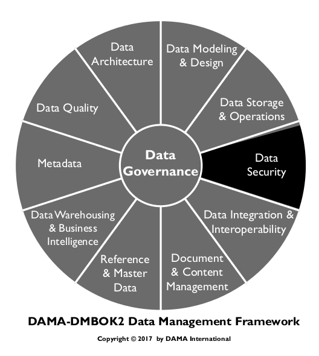
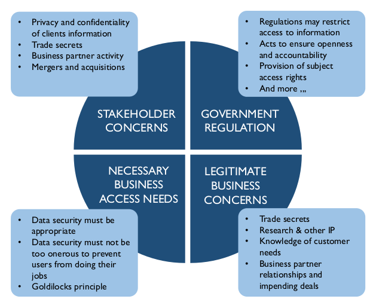
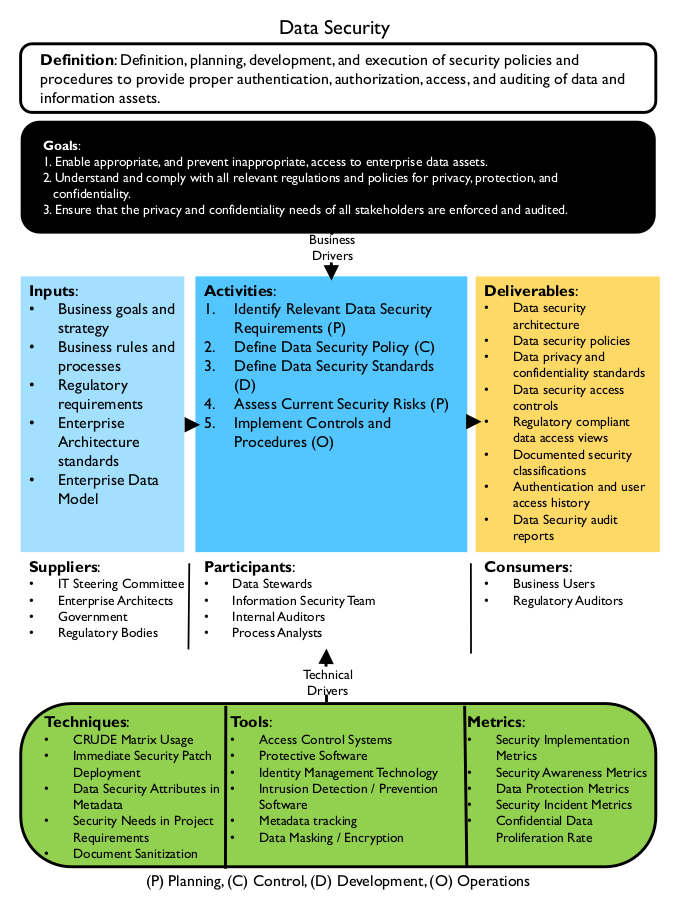
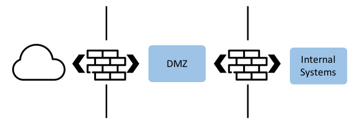
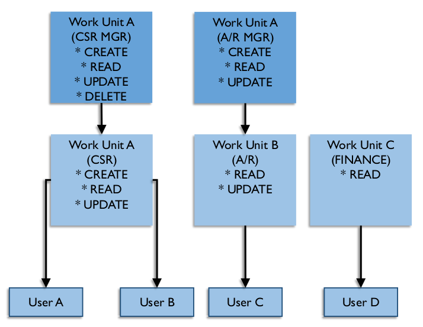

# Data Security

## 1. Introduction

Data Security includes the planning, development, and execution of security policies and procedures to provide proper authentication, authorization, access, and auditing of data and information assets. The specifics of data security (which data needs to be protected, for example) differ between industries and countries. Nevertheless, the goal of data security practices is the same: To protect information assets in alignment with privacy and confidentiality regulations, contractual agreements, and business requirements.

These requirements come from:

* Stakeholders: Organizations must recognize the privacy and confidentiality needs of their stakeholders, including clients, patients, students, citizens, suppliers, or business partners. Everyone in an organization must be a responsible trustee of data about stakeholders.
* Government regulations: Government regulations are in place to protect the interests of some stakeholders. Regulations have different goals. Some restrict access to information, while others ensure openness, transparency, and accountability.
* Proprietary business concerns: Each organization has proprietary data to protect. An organization’s data provides insight into its customers and, when leveraged effectively, can provide a competitive advantage. If confidential data is stolen or breached, an organization can lose competitive advantage.
* Legitimate access needs: When securing data, organizations must also enable legitimate access. Business processes require individuals in certain roles be able to access, use, and maintain data.
* Contractual obligations: Contractual and non-disclosure agreements also influence data security requirements. For example, the PCI Standard, an agreement among credit card companies and individual business enterprises, demands that certain types of data be protected in defined ways (e.g., mandatory encryption for customer passwords).

Effective data security policies and procedures ensure that the right people can use and update data in the right way, and that all inappropriate access and update is restricted (Ray, 2012) (see Figure 62). Understanding and complying with the privacy and confidentiality interests and needs of all stakeholders is in the best interest of every organization. Client, supplier, and constituent relationships all trust in, and depend on, the responsible use of data.

Figure 62 Sources of Data Security Requirements

Figure 63 Context Diagram: Data Security

### 1.1 Business Drivers
Risk reduction and business growth are the primary drivers of data security activities. Ensuring that an organization’s data is secure reduces risk and adds competitive advantage. Security itself is a valuable asset.

Data security risks are associated with regulatory compliance, fiduciary responsibility for the enterprise and stockholders, reputation, and a legal and moral responsibility to protect the private and sensitive information of employees, business partners, and customers. Organizations can be fined for failure to comply with regulations and contractual obligations. Data breaches can cause a loss of reputation and customer confidence. (See Chapter 2.)

Business growth includes attaining and sustaining operational business goals. Data security issues, breaches, and unwarranted restrictions on employee access to data can directly impact operational success.

The goals of mitigating risks and growing the business can be complementary and mutually supportive if they are integrated into a coherent strategy of information management and protection.

#### 1.1.1 Risk Reduction

As data regulations increase — usually in response to data thefts and breaches — so do compliance requirements. Security organizations are often tasked with managing not only IT compliance requirements, but also policies, practices, data classifications, and access authorization rules across the organization.

As with other aspects of data management, it is best to address data security as an enterprise initiative. Without a coordinated effort, business units will find different solutions to security needs, increasing overall cost while potentially reducing security due to inconsistent protection. Ineffective security architecture or processes can cost organizations through breaches and lost productivity. An operational security strategy that is properly funded, systems-oriented, and consistent across the enterprise will reduce these risks.

Information security begins by classifying an organization’s data in order to identify which data requires protection. The overall process includes the following steps:

* Identify and classify sensitive data assets: Depending on the industry and organization, there can be few or many assets, and a range of sensitive data (including personal identification, medical, financial, and more).
* Locate sensitive data throughout the enterprise: Security requirements may differ, depending on where data is stored. A significant amount of sensitive data in a single location poses a high risk due to the damage possible from a single breach.
* Determine how each asset needs to be protected: The measures necessary to ensure security can vary between assets, depending on data content and the type of technology.
* Identify how this information interacts with business processes: Analysis of business processes is required to determine what access is allowed and under what conditions.

In addition to classifying the data itself, it is necessary to assess external threats (such as those from hackers and criminals) and internal risks (posed by employees and processes). Much data is lost or exposed through the ignorance of employees who did not realize that the information was highly sensitive or who bypassed security policies. [^37] The customer sales data left on a web server that is hacked, the employee database downloaded onto a contractor’s laptop that is subsequently stolen, and trade secrets left unencrypted in an executive’s computer that goes missing, all result from missing or unenforced security controls.

The impact of security breaches on well-established brands in recent years has resulted in huge financial losses and a drop in customer trust. Not only are the external threats from the criminal hacking community becoming more sophisticated and targeted, the amount of damage done by external and internal threats, intentional or unintentional, has also been steadily increasing over the years (Kark, 2009).

In a world of almost all-electronic, business infrastructure, trustworthy information systems have become a business differentiator.

#### 1.1.2 Business Growth

Globally, electronic technology is pervasive in the office, the marketplace, and the home. Desktop and laptop computers, smart phones, tablets, and other devices are important elements of most business and government operations. The explosive growth of e-commerce has changed how organizations offer goods and services. In their personal lives, individuals have become accustomed to conducting business online with goods providers, medical agencies, utilities, governmental offices, and financial institutions. Trusted e-commerce drives profit and growth. Product and service quality relate to information security in a quite direct fashion: Robust information security enables transactions and builds customer confidence.

#### 1.1.3 Security as an Asset

One approach to managing sensitive data is via Metadata. Security classifications and regulatory sensitivity can be captured at the data element and data set level. Technology exists to tag data so that Metadata travel with the information as it flows across the enterprise. Developing a master repository of data characteristics means all parts of the enterprise can know precisely what level of protection sensitive information requires.

If a common standard is enforced, this approach enables multiple departments, business units, and vendors to use the same Metadata. Standard security Metadata can optimize data protection and guide business usage and technical support processes, leading to lower costs. This layer of information security can help prevent unauthorized access to and misuse of data assets. When sensitive data is correctly identified as such, organizations build trust with their customers and partners. Security-related Metadata itself becomes a strategic asset, increasing the quality of transactions, reporting, and business analysis, while reducing the cost of protection and associated risks that lost or stolen information cause.

### 1.2 Goals and Principles

#### 1.2.1 Goals

The goals of data security activities include:

* Enabling appropriate access and preventing inappropriate access to enterprise data assets
* Enabling compliance with regulations and policies for privacy, protection, and confidentiality
* Ensuring that stakeholder requirements for privacy and confidentiality are met

#### 1.2.2 Principles

Data security in an organization follows these guiding principles:

* Collaboration: Data Security is a collaborative effort involving IT security administrators, data stewards/data governance, internal and external audit teams, and the legal department.
* Enterprise approach: Data Security standards and policies must be applied consistently across the entire organization.
* Proactive management: Success in data security management depends on being proactive and dynamic, engaging all stakeholders, managing change, and overcoming organizational or cultural bottlenecks such as traditional separation of responsibilities between information security, information technology, data administration, and business stakeholders.
* Clear accountability: Roles and responsibilities must be clearly defined, including the ‘chain of custody’ for data across organizations and roles.
* Metadata-driven: Security classification for data elements is an essential part of data definitions.
* Reduce risk by reducing exposure: Minimize sensitive/confidential data proliferation, especially to non-production environments.

### 1.3 Essential Concepts

Information security has a specific vocabulary. Knowledge of key terms enables clearer articulation of governance requirements.

#### 1.3.1 Vulnerability

A vulnerability is a weaknesses or defect in a system that allows it to be successfully attacked and compromised – essentially a hole in an organization’s defenses. Some vulnerabilities are called exploits.

Examples include network computers with out-of-date security patches, web pages not protected with robust passwords, users not trained to ignore email attachments from unknown senders, or corporate software unprotected against technical commands that will give the attacker control of the system.

In many cases, non-production environments are more vulnerable to threats than production environments. Thus, it is critical to keep production data out of non-production environments.

#### 1.3.2 Threat

A threat is a potential offensive action that could be taken against an organization. Threats can be internal or external. They are not always malicious. An uniformed insider can take offensive actions again the organization without even knowing it. Threats may relate to specific vulnerabilities, which then can be prioritized for remediation. Each threat should match to a capability that either prevents the threat or limits the damage it might cause. An occurrence of a threat is also called an attack surface.

Examples of threats include virus-infected email attachments being sent to the organization, processes that overwhelm network servers and result in an inability to perform business transactions (also called denial-of-service attacks), and exploitation of known vulnerabilities.

#### 1.3.3 Risk

The term risk refers both to the possibility of loss and to the thing or condition that poses the potential loss. Risk can be calculated for each possible threat using the following factors.

* Probability that the threat will occur and its likely frequency
* The type and amount of damage created each occurrence might cause, including damage to reputation
* The effect damage will have on revenue or business operations
* The cost to fix the damage after an occurrence
* The cost to prevent the threat, including by remediation of vulnerabilities
* The goal or intent of the probable attacker

Risks can be prioritized by potential severity of damage to the company, or by likelihood of occurrence, with easily exploited vulnerabilities creating a higher likelihood of occurrence. Often a priority list combines both metrics. Prioritization of risk must be a formal process among the stakeholders.

#### 1.3.4 Risk Classifications

Risk classifications describe the sensitivity of the data and the likelihood that it might be sought after for malicious purposes. Classifications are used to determine who (i.e., people in which roles) can access the data. The highest security classification of any datum within a user entitlement determines the security classification of the entire aggregation. Example classifications include:

* Critical Risk Data (CRD): Personal information aggressively sought for unauthorized use by both internal and external parties due to its high direct financial value. Compromise of CRD would not only harm individuals, but would result in financial harm to the company from significant penalties, costs to retain customers and employees, as well as harm to brand and reputation.
* High Risk Data (HRD): HRD is actively sought for unauthorized use due to its potential direct financial value. HRD provides the company with a competitive edge. If compromised, it could expose the company to financial harm through loss of opportunity. Loss of HRD can cause mistrust leading to the loss of business and may result in legal exposure, regulatory fines and penalties, as well as damage to brand and reputation.
* Moderate Risk Data (MRD): Company information that has little tangible value to unauthorized parties; however, the unauthorized use of this non-public information would likely have a negative effect on the company.

#### 1.3.5 Data Security Organization

Depending on the size of the enterprise, the overall Information Security function may be the primary responsibility of a dedicated Information Security group, usually within the Information Technology (IT) area. Larger enterprises often have a Chief Information Security Officer (CISO) who reports to either the CIO or the CEO. In organizations without dedicated Information Security personnel, responsibility for data security will fall on data managers. In all cases, data managers need to be involved in data security efforts.

In large enterprises, the information security personnel may let specific data governance and user authorization functions be guided by the business managers. Examples include granting user authorizations and data regulatory compliance. Dedicated Information Security personnel are often most concerned with the technical aspects of information protection such as combating malicious software and system attacks. However, there is ample room for collaboration during development or an installation project.

This opportunity for synergy is often missed when the two governance entities, IT and Data Management, lack an organized process to share regulatory and security requirements. They need a standard procedure to inform each other of data regulations, data loss threats, and data protection requirements, and to do so at the commencement of every software development or installation project.

The first step in the NIST (National Institute of Standards and Technology) Risk Management Framework, for example, is to categorize all enterprise information. [^38] Creating an enterprise data model is essential to this goal. Without clear visibility to the location of all sensitive information, it is impossible to create a comprehensive and effective data protection program.

Data managers need to be actively engaged with information technology developers and cyber security professionals so that regulated data may be identified, sensitive systems can be properly protected, and user access controls can be designed to enforce confidentiality, integrity, and data regulatory compliance. The larger the enterprise, the more important becomes the need for teamwork and reliance on a correct and updated enterprise data model.

#### 1.3.6 Security Processes

Data security requirements and procedures are categorized into four groups, known as the four A’s: Access, Audit, Authentication, and Authorization. Recently an E, Entitlement, has been included, for effective data regulatory compliance. Information classification, access rights, role groups, users, and passwords are the means to implementing policy and satisfying the four A’s. Security Monitoring is also essential for proving the success of the other processes. Both monitoring and audit can be done continuously or intermittently. Formal audits must be done by a third party to be considered valid. The third party may be internal or external.

##### 1.3.6.1 The Four A’s

* Access: Enable individuals with authorization to access systems in a timely manner. Used as a verb, access means to actively connect to an information system and be working with the data. Used as a noun, access indicates that the person has a valid authorization to the data.
* Audit: Review security actions and user activity to ensure compliance with regulations and conformance with company policy and standards. Information security professionals periodically review logs and documents to validate compliance with security regulations, policies, and standards. Results of these audits are published periodically.
* Authentication: Validate users’ access. When a user tries to log into a system, the system needs to verify that the person is who he or she claims to be. Passwords are one way of doing this. More stringent authentication methods include the person having a security token, answering questions, or submitting a fingerprint. All transmissions during authentication are encrypted to prevent theft of the authenticating information.
* Authorization: Grant individuals privileges to access specific views of data, appropriate to their role. After the authorization decision, the Access Control System checks each time a user logs in to see if they have a valid authorization token. Technically, this is an entry in a data field in the corporate Active Directory indicating that the person has been authorized by somebody to access the data. It further indicates that a responsible person made the decision to grant this authorization because the user is entitled to it by virtue of their job or corporate status.
* Entitlement: An Entitlement is the sum total of all the data elements that are exposed to a user by a single access authorization decision. A responsible manager must decide that a person is ‘entitled’ to access this information before an authorization request is generated. An inventory of all the data exposed by each entitlement is necessary in determining regulatory and confidentiality requirements for Entitlement decisions.

##### 1.3.6.2 Monitoring

Systems should include monitoring controls that detect unexpected events, including potential security violations. Systems containing confidential information, such as salary or financial data, commonly implement active, real-time monitoring that alerts the security administrator to suspicious activity or inappropriate access.

Some security systems will actively interrupt activities that do not follow specific access profiles. The account or activity remains locked until security support personnel evaluate the details.

In contrast, passive monitoring tracks changes over time by taking snapshots of the system at regular intervals, and comparing trends against a benchmark or other criteria. The system sends reports to the data stewards or security administrator accountable for the data. While active monitoring is a detection mechanism, passive monitoring is an assessment mechanism.

#### 1.3.7 Data Integrity

In security, data integrity is the state of being whole – protected from improper alteration, deletion, or addition. For example, in the U.S., Sarbanes-Oxley regulations are mostly concerned with protecting financial information integrity by identifying rules for how financial information can be created and edited.

#### 1.3.8 Encryption

Encryption is the process of translating plain text into complex codes to hide privileged information, verify complete transmission, or verify the sender’s identity. Encrypted data cannot be read without the decryption key or algorithm, which is usually stored separately and cannot be calculated based on other data elements in the same data set. There are four main methods of encryption – hash, symmetric, private-key, and public-key – with varying levels of complexity and key structure.

##### 1.3.8.1 Hash

Hash encryption uses algorithms to convert data into a mathematical representation. The exact algorithms used and order of application must be known in order to reverse the encryption process and reveal the original data. Sometimes hashing is used as verification of transmission integrity or identity. Common hashing algorithms are Message Digest 5 (MD5) and Secure Hashing Algorithm (SHA).

##### 1.3.8.2 Private-key

Private-key encryption uses one key to encrypt the data. Both the sender and the recipient must have the key to read the original data. Data can be encrypted one character at a time (as in a stream) or in blocks. Common private-key algorithms include Data Encryption Standard (DES), Triple DES (3DES), Advanced Encryption Standard (AES), and International Data Encryption Algorithm (IDEA). Cyphers Twofish and Serpent are also considered secure. The use of simple DES is unwise as it is susceptible to many easy attacks.

##### 1.3.8.3 Public-key

In public-key encryption, the sender and the receiver have different keys. The sender uses a public key that is freely available, and the receiver uses a private key to reveal the original data. This type of encryption is useful when many data sources must send protected information to just a few recipients, such as when submitting data to clearinghouses. Public-key methods include Rivest-Shamir-Adelman (RSA) Key Exchange and Diffie- Hellman Key Agreement. PGP (Pretty Good Privacy) is a freely available application of public-key encryption.

##### 1.3.9 Obfuscation or Masking

Data can be made less available by obfuscation (making obscure or unclear) or masking, which removes, shuffles, or otherwise changes the appearance of the data, without losing the meaning of the data or the relationships the data has to other data sets, such as foreign key relationships to other objects or systems. The values within the attributes may change, but the new values are still valid for those attributes. Obfuscation is useful when displaying sensitive information on screens for reference, or creating test data sets from production data that comply with expected application logic.

Data masking is a type of data-centric security. There are two types of data masking, persistent and dynamic. Persistent masking can be executed in-flight or in-place.

##### 1.3.9.1 Persistent Data Masking

Persistent data masking permanently and irreversibly alters the data. This type of masking is not typically used in production environments, but rather between a production environment and development or test environments. Persistent masking changes the data, but the data must still be viable for use to test processes, application, report, etc.

* In-flight persistent masking occurs when the data is masked or obfuscated while it is moving between the source (typically production) and destination (typically non-production) environment. In-flight masking is very secure when properly executed because it does not leave an intermediate file or database with unmasked data. Another benefit is that it is re-runnable if issues are encountered part way through the masking.
* In-place persistent masking is used when the source and destination are the same. The unmasked data is read from the source, masked, and then used to overwrite the unmasked data. In-place masking assumes the sensitive data is in a location where it should not exist and the risk needs to be mitigated, or that there is an extra copy of the data in a secure location to mask before moving it to the non-secure location. There are risks to this process. If the masking process fails mid-masking, it can be difficult to restore the data to a useable format. This technique has a few niche uses, but in general, in-flight masking will more securely meet project needs.

##### 1.3.9.2 Dynamic Data Masking

Dynamic data masking changes the appearance of the data to the end user or system without changing the underlying data. This can be extremely useful when users need access to some sensitive production data, but not all of it. For example, in a database the social security number is stored as 123456789, but to the call center associate that needs to verify who they are speaking to, the data shows up as ***-**-6789.

##### 1.3.9.3 Masking Methods

There are several methods for masking or obfuscating data.

* Substitution: Replace characters or whole values with those in a lookup or as a standard pattern. For example, first names can be replaced with random values from a list.
* Shuffling: Swap data elements of the same type within a record, or swap data elements of one attribute between rows. For example, mixing vendor names among supplier invoices such that the original supplier is replaced with a different valid supplier on an invoice.
* Temporal variance: Move dates +/– a number of days – small enough to preserve trends, but significant enough to render them non-identifiable.
* Value variance: Apply a random factor +/– a percent, again small enough to preserve trends, but significant enough to be non-identifiable.
* Nulling or deleting: Remove data that should not be present in a test system.
* Randomization: Replace part or all of data elements with either random characters or a series of a single character.
* Encryption: Convert a recognizably meaningful character stream to an unrecognizable character stream by means of a cipher code. An extreme version of obfuscation in-place.
* Expression masking: Change all values to the result of an expression. For example, a simple expression would just hard code all values in a large free form database field (that could potentially contain confidential data) to be ‘This is a comment field’.
* Key masking: Designate that the result of the masking algorithm/process must be unique and repeatable because it is being used mask a database key field (or similar). This type of masking is extremely important for testing to maintain integrity around the organization.

#### 1.3.10 Network Security Terms

Data security includes both data-at-rest and data-in-motion. Data-in-motion requires a network in order to move between systems. It is no longer sufficient for an organization to wholly trust in the firewall to protect it from malicious software, poisoned email, or social engineering attacks. Each machine on the network needs to have a line of defense, and web servers need sophisticated protection as they are continually exposed to the entire world on the Internet.

##### 1.3.10.1 Backdoor

A backdoor refers to an overlooked or hidden entry into a computer system or application. It allows unauthorized users to bypass the password requirement to gain access. Backdoors are often created by developers for maintenance purposes. Any backdoor is a security risk. Other backdoors are put in place by the creators of commercial software packages.

Default passwords left unchanged when installing any software system or web page package is a backdoor and will undoubtedly be known to hackers. Any backdoor is a security risk.

##### 1.3.10.2 Bot or Zombie

A bot (short for robot) or Zombie is a workstation that has been taken over by a malicious hacker using a Trojan, a Virus, a Phish, or a download of an infected file. Remotely controlled, bots are used to perform malicious tasks, such as sending large amounts of spam, attacking legitimate businesses with network-clogging Internet packets, performing illegal money transfers, and hosting fraudulent websites. A Bot-Net is a network of robot computers (infected machines). [^39]

It was estimated in 2012 that globally 17% of all computers (approximately 187 million of 1.1 Billion computers) do not have anti-virus protection. [^40] In the USA that year, 19.32% of users surfed unprotected. A large percentage of them are Zombies. Estimates are that two billion computers are in operation as of 2016. [^41] Considering that desktop and laptop computers are being eclipsed in number by smart phones, tablets, wearables, and other devices, many of which are used for business transactions, the risks for data exposure will only increase. [^42]

##### 1.3.10.3 Cookie

A cookie is a small data file that a website installs on a computer’s hard drive, to identify returning visitors and profile their preferences. Cookies are used for Internet commerce. However, they are also controversial, as they raise questions of privacy because spyware sometimes uses them.

##### 1.3.10.4 Firewall

A firewall is software and/or hardware that filters network traffic to protect an individual computer or an entire network from unauthorized attempts to access or attack the system. A firewall may scan both incoming and outgoing communications for restricted or regulated information and prevent it from passing without permission (Data Loss Prevention). Some firewalls also restrict access to specific external websites.

##### 1.3.10.5 Perimeter

A perimeter is the boundary between an organization’s environments and exterior systems. Typically, a firewall will be in place between all internal and external environments.

##### 1.3.10.6 DMZ

Short for de-militarized zone, a DMZ is an area on the edge or perimeter of an organization, with a firewall between it and the organization. A DMZ environment will always have a firewall between it and the internet (see Figure 64). DMZ environments are used to pass or temporarily store data moving between organizations.

Figure 64 DMZ Example

##### 1.3.10.7 Super User Account

A Super User Account is an account that has administrator or root access to a system to be used only in an emergency. Credentials for these accounts are highly secured, only released in an emergency with appropriate documentation and approvals, and expire within a short time. For example, the staff assigned to production control might require access authorizations to multiple large systems, but these authorizations should be tightly controlled by time, user ID, location, or other requirement to prevent abuse.

##### 1.3.10.8 Key Logger

Key Loggers are a type of attack software that records all the keystrokes that a person types into their keyboard, then sends them elsewhere on the Internet. Thus, every password, memo, formula, document, and web address is captured. Often an infected website or malicious software download will install a key logger. Some types of document downloads will allow this to happen as well.

##### 1.3.10.9 Penetration Testing

Setting up a secure network and website is incomplete without testing it to make certain that it truly is secure. In Penetration Testing (sometimes called ‘penn test’), an ethical hacker, either from the organization itself or hired from an external security firm, attempts to break into the system from outside, as would a malicious hacker, in order to identify system vulnerabilities. Vulnerabilities found through penetration tests can be addressed before the application is released.

Some people are threatened by ethical hacking audits because they believe these audits will result only in finger pointing. The reality is that in the fast-moving conflict between business security and criminal hacking, all purchased and internally-developed software contains potential vulnerabilities that were not known at the time of their creation. Thus, all software implementations must be challenged periodically. Finding vulnerabilities is an ongoing procedure and no blame should be applied – only security patches.

As proof of the need for continual software vulnerability mitigation, observe a constant stream of security patches arriving from software vendors. This continual security patch update process is a sign of due diligence and professional customer support from these vendors. Many of these patches are the result of ethical hacking performed on behalf of the vendors.

##### 1.3.10.10 Virtual Private Network (VPN)

VPN connections use the unsecured internet to create a secure path or ‘tunnel’ into an organization’s environment. The tunnel is highly encrypted. It allows communication between users and the internal network by using multiple authentication elements to connect with a firewall on the perimeter of an organization’s environment. Then it strongly encrypts all transmitted data.

##### 1.3.11 Types of Data Security

Data security involves not just preventing inappropriate access, but also enabling appropriate access to data. Access to sensitive data should be controlled by granting permissions (opt-in). Without permission, a user should not be allowed to see data or take action within the system. ‘Least Privilege’ is an important security principle. A user, process, or program should be allowed to access only the information allowed by its legitimate purpose.

##### 1.3.11.1 Facility Security

Facility security is the first line of defense against bad actors. Facilities should have, at a minimum, a locked data center with access restricted to authorized employees. Social threats to security (See Section 1.3.15) recognize humans as the weakest point in facility security. Ensure that employees have the tools and training to protect data in facilities.

##### 1.3.11.2 Device Security

Mobile devices, including laptops, tablets, and smartphones, are inherently insecure, as they can be lost, stolen, and physically and electronically attacked by criminal hackers. They often contain corporate emails, spreadsheets, addresses, and documents that, if exposed, can be damaging to the organization, its employees, or its customers.

With the explosion of portable devices and media, a plan to manage the security of these devices (both company-owned and personal) must be part of any company’s overall strategic security architecture. This plan should include both software and hardware tools.

Device security standards include:

* Access policies regarding connections using mobile devices
* Storage of data on portable devices such as laptops, DVDs, CDs, or USB drives
* Data wiping and disposal of devices in compliance with records management policies
* Installation of anti-malware and encryption software
* Awareness of security vulnerabilities

##### 1.3.11.3 Credential Security

Each user is assigned credentials to use when obtaining access to a system. Most credentials are a combination of a User ID and a Password. There is a spectrum of how credentials are used across systems within an environment, depending on the sensitivity of the system’s data, and the system’s capabilities to link to credential repositories.

###### 1.3.11.3.1 Identity Management Systems

Traditionally, users have had different accounts and passwords for each individual resource, platform, application system, or workstation. This approach requires users to manage several passwords and accounts. Organizations with enterprise user directories may have a synchronization mechanism established between the heterogeneous resources to ease user password management. In such cases, the user is required to enter the password only once, usually when logging into the workstation, after which all authentication and authorization executes through a reference to the enterprise user directory. An identity management system implementing this capability is known as ‘single-sign-on’, and is optimal from a user perspective.

###### 1.3.11.3.2 User ID Standards for Email Systems

User IDs should be unique within the email domain. Most companies use some first name or initial, and full or partial last name as the email or network ID, with a number to differentiate collisions. Names are generally known and are more useful for business contact reasons.

Email or network IDs containing system employee ID numbers are discouraged, as that information is not generally available outside the organization, and provides data that should be secure within the systems.

###### 1.3.11.3.3 Password Standards

Passwords are the first line of defense in protecting access to data. Every user account should be required to have a password set by the user (account owner) with a sufficient level of password complexity defined in the security standards, commonly referred to as ‘strong’ passwords.

When creating a new user account, the generated temporary password should be set to expire immediately after the first use and the user must choose a new password for subsequent access. Do not permit blank passwords.

Most security experts recommend requiring users to change their passwords every 45 to 180 days, depending on the nature of the system, the type of data, and the sensitivity of the enterprise. However, changing passwords too frequently introduces risk, since it often causes employees write down their new passwords.

###### 1.3.11.3.4 Multiple Factor Identification

Some systems require additional identification procedures. These can include a return call to the user’s mobile device that contains a code, the use of a hardware item that must be used for login, or a biometric factor such as fingerprint, facial recognition, or retinal scan. Two-factor identification makes it much harder to break into an account or to log into a user’s device. All users with authorization entitlement to highly sensitive information should use two-factor identification to log into the network.

##### 1.3.11.4 Electronic Communication Security

Users must be trained to avoid sending their personal information or any restricted or confidential company information over email or direct communication applications. These insecure methods of communication can be read or intercepted by outside sources. Once a user sends an email, he or she no longer controls the information in it. It can be forwarded to other people without the sender’s knowledge or consent. Social media also applies here. Blogs, portals, wikis, forums, and other Internet or Intranet social media should be considered insecure and should not contain confidential or restricted information.

#### 1.3.12 Types of Data Security Restrictions

Two concepts drive security restrictions: the level of confidentiality of data and regulation related to data.

* Confidentiality level: Confidential means secret or private. Organizations determine which types of data should not be known outside the organization, or even within certain parts of the organization. Confidential information is shared only on a ‘need-to-know’ basis. Levels of confidentiality depend on who needs to know certain kinds of information.
* Regulation: Regulatory categories are assigned based on external rules, such as laws, treaties, customs agreements, and industry regulations. Regulatory information is shared on an ‘allowed-to-know’ basis. The ways in which data can be shared are governed by the details of the regulation.

The main difference between confidential and regulatory restrictions is where the restriction originates: confidentiality restrictions originate internally, while regulatory restrictions are externally defined.

Another difference is that any data set, such as a document or a database view, can only have one confidentiality level. This level is established based on the most sensitive (and highest classified) item in the data set. Regulatory categorizations, however, are additive. A single data set may have data restricted based on multiple regulatory categories. To assure regulatory compliance, enforce all actions required for each category, along with the confidentiality requirements.

When applied to the user entitlement (the aggregation of the particular data elements to which a user authorization provides access), all protection policies must be followed, regardless of whether they originated internally or externally.

##### 1.3.12.1 Confidential Data

Confidentiality requirements range from high (very few people have access, for example, to data about employee compensation) to low (everyone has access to product catalogs). A typical classification schema might include two or more of the five confidentiality classification levels listed here:

* For general audiences: Information available to anyone, including the public.
* Internal use only: Information limited to employees or members, but with minimal risk if shared. For internal use only; may be shown or discussed, but not copied, outside the organization.
* Confidential: Information that cannot be shared outside the organization without a properly executed non-disclosure agreement or similar in place. Client confidential information may not be shared with other clients.
* Restricted confidential: Information limited to individuals performing certain roles with the ‘need to know.’ Restricted confidential may require individuals to qualify through clearance. •Registered confidential: Information so confidential that anyone accessing the information must sign a legal agreement to access the data and assume responsibility for its secrecy. The confidentiality level does not imply any details about restrictions due to regulatory requirements. For example, it does not inform the data manager that data may not be exposed outside its country of origin, or that some employees are prohibited from seeing certain information based on regulations like HIPAA.

##### 1.3.12.2 Regulated Data

Certain types of information are regulated by external laws, industry standards, or contracts that influence how data can be used, as well as who can access it and for what purposes. As there are many overlapping regulations, it is easier to collect them by subject area into a few regulatory categories or families to better inform data managers of regulatory requirements.

Each enterprise, of course, must develop regulatory categories that meet their own compliance needs. Further, it is important that this process and the categories be as simple as possible to allow for an actionable protection capability. When category protective actions are similar, they should be combined into a regulation ‘family’. Each regulatory category should include auditable protective actions. This is not an organizational tool but an enforcement method.

Since different industries are affected by different types of regulations, the organization needs to develop regulatory groupings that meet their operational needs. For example, companies that do no business outside of their native land may not need to incorporate regulations pertaining to exports.

However, since all nations have some mixture of personal data privacy laws, and customers are likely to be from anywhere in the world, it may be wise and easier to gather all customer data privacy regulations into a single regulatory family, and comply with the requirements for all the nations. Doing so ensures compliance everywhere, and offers a single standard to enforce.

An example of the possible detail of regulatory compliance is one that prohibits by law a single type of data element in the database to travel outside the physical borders of the originating nation. Several regulations, both domestic and international, have this as a requirement.

An optimal number of regulatory action categories is nine or fewer. Sample regulatory categories follow.

###### 1.3.12.2.1 Sample Regulatory Families

Certain government regulations specify data elements by name, and demand that they be protected in specific ways. Each element does not need a different category; instead, use a single family of actions to protect all specifically targeted data fields. Some PCI data may be included in these categories even though it is a contractual obligation and not a governmental regulation. PCI contractual obligations are mostly uniform around the globe.

* Personal Identification Information (PII): Also known as Personally Private Information (PPI), includes any information that can personally identify the individual (individually or as a set), such as name, address, phone numbers, schedule, government ID number, account numbers, age, race, religion, ethnicity, birthday, family members’ names or friends’ names, employment information (HR data), and in many cases, remuneration. Highly similar protective actions will satisfy the EU Privacy Directives, Canadian Privacy law (PIPEDA), PIP Act 2003 in Japan, PCI standards, US FTC requirements, GLB, FTC standards, and most Security Breach of Information Acts.
* Financially Sensitive Data: All financial information, including what may be termed ‘shareholder’ or ‘insider’ data, including all current financial information that has not yet been reported publicly. It also includes any future business plans not made public, planned mergers, acquisitions, or spin-offs, non- public reports of significant company problems, unexpected changes in senior management, comprehensive sales, orders, and billing data. All of these can be captured within this one category, and protected by the same policies. In the US, this is covered under Insider Trading Laws, SOX (Sarbanes-Oxley Act), or GLBA (Gramm-Leach-Bliley/Financial Services Modernization Act). Note: Sarbanes-Oxley act restricts and manages who can change financial data, thus assuring data integrity, while Insider Trading laws affect all those who can see financial data.
* Medically Sensitive Data/Personal Health Information (PHI): All information regarding a person’s health or medical treatments. In the US, this is covered by HIPAA (Health Information Portability and Accountability Act). Other nations also have restrictive laws regarding protection of personal and medical information. As these are evolving, ensure Corporate Counsel is aware of the need to follow legal requirements in a nation in which the organization does business or has customers.
* Educational Records: All information regarding a person’s education. In the US, this is covered by FERPA (Family Educational Rights and Privacy Act).

###### 1.3.12.2.2 Industry or Contract-based Regulation

Some industries have specific standards for how to record, retain, and encrypt information. Some also disallow deletion, editing, or distributing to prohibited locations. For example, regulations for pharmaceuticals, other dangerous substances, food, cosmetics, and advanced technology prevent the transmission or storage of certain information outside the country of origin, or require data to be encrypted during transport.

* Payment Card Industry Data Security Standard (PCI-DSS): PCI-DSS is the most widely known industry data security standard. It addresses any information that can identify an individual with an account at a financial organization, such as name, credit card number (any number on the card), bank account number, or account expiration date. Most of these data fields are regulated by laws and policies. Any data with this classification in its Metadata definition automatically should be carefully reviewed by data stewards when included in any database, application, report, dashboard, or user view.
* Competitive advantage or trade secrets: Companies that use proprietary methods, mixtures, formulas, sources, designs, tools, recipes, or operational techniques to achieve a competitive advantage may be protected by industry regulations and/or intellectual property laws.
* Contractual restrictions: In its contracts with vendors and partners, an organization may stipulate how specific pieces of information may or may not be used, and which information can and cannot be shared. For example, environmental records, hazardous materials reports, batch numbers, cooking times, points of origin, customer passwords, account numbers, and certain national identity numbers of non-US nationals. Specific technical companies may need to include certain restricted products or ingredients in this category.

#### 1.3.13 System Security Risks

The first step in identifying risk is identifying where sensitive data is stored, and what protections are required for that data. It is also necessary to identify risks inherent in systems. System security risks include elements that can compromise a network or database. These threats allow legitimate employees to misuse information, either intentionally or accidentally, and enable malicious hacker success.

##### 1.3.13.1 Abuse of Excessive Privilege

In granting access to data, the principle of least privilege should be applied. A user, process, or program should be allowed to access only the information allowed by its legitimate purpose. The risk is that users with privileges that exceed the requirements of their job function may abuse these privileges for malicious purpose or accidentally. Users may be granted more access than they should have (excessive privilege) simply because it is challenging to manage user entitlements. The DBA may not have the time or Metadata to define and update granular access privilege control mechanisms for each user entitlement. As a result, many users receive generic default access privileges that far exceed specific job requirements. This lack of oversight to user entitlements is one reason why many data regulations specify data management security.

The solution to excessive privileges is query-level access control, a mechanism that restricts database privileges to minimum-required SQL operations and data. The granularity of data access control must extend beyond the table to specific rows and columns within a table. Query-level access control is useful for detecting excessive privilege abuse by malicious employees.

Most database software implementations integrate some level of query-level access control (triggers, row-level security, table security, views), but the manual nature of these ‘built-in’ features make them impractical for all but the most limited deployments. The process of manually defining a query-level access control policy for all users across database rows, columns, and operations is time consuming. To make matters worse, as user roles change over time, query policies must be updated to reflect those new roles. Most database administrators would have a hard time defining a useful query policy for a handful of users at a single point in time, much less hundreds of users over time. As a result, in a large number of organizations, automated tools are usually necessary to make real query-level access control functional.

##### 1.3.13.2 Abuse of Legitimate Privilege

Users may abuse legitimate database privileges for unauthorized purposes. Consider a criminally inclined healthcare worker with privileges to view individual patient records via a custom Web application. The structure of corporate Web applications normally limits users to viewing an individual patient’s healthcare history, where multiple records cannot be viewed simultaneously and electronic copies are not allowed. However, the worker may circumvent these limitations by connecting to the database using an alternative system such as MS-Excel. Using MS-Excel and his legitimate login credentials, the worker might retrieve and save all patient records.

There are two risks to consider: intentional and unintentional abuse. Intentional abuse occurs when an employee deliberately misuses organizational data. For example, an errant worker who wants to trade patient records for money or for intentional damage, such as releasing (or threatening to release) sensitive information publicly.

Unintentional abuse is a more common risk: The diligent employee who retrieves and stores large amounts of patient information to a work machine for what he or she considers legitimate work purposes. Once the data exists on an endpoint machine, it becomes vulnerable to laptop theft and loss.

The partial solution to the abuse of legitimate privilege is database access control that not only applies to specific queries, but also enforces policies for end-point machines using time of day, location monitoring, and amount of information downloaded, and reduces the ability of any user to have unlimited access to all records containing sensitive information unless it is specifically demanded by their job and approved by their supervisor. For example while it may be necessary for a field agent to access their customer’s personal records, they might not be allowed to download the entire customer database to their laptop just to ‘save time’.

##### 1.3.13.3 Unauthorized Privilege Elevation

Attackers may take advantage of database platform software vulnerabilities to convert access privileges from those of an ordinary user to those of an administrator. Vulnerabilities may occur in stored procedures, built-in functions, protocol implementations, and even SQL statements. For example, a software developer at a financial institution might take advantage of a vulnerable function to gain the database administrative privilege. With administrative privilege, the offending developer may turn off audit mechanisms, create bogus accounts, transfer funds, or close accounts.

Prevent privilege elevation exploits with a combination of traditional intrusion prevention systems (IPS) and query-level access control intrusion prevention. These systems inspect database traffic to identify patterns that correspond to known vulnerabilities. For example, if a given function is vulnerable to an attack, an IPS may either block all access to the procedure, or block those procedures allowing embedded attacks.

Combine IPS with alternative attack indicators, such as query access control, to improve accuracy in identifying attacks. IPS can detect whether a database request accesses a vulnerable function while query access control detects whether the request matches normal user behavior. If a single request indicates both access to a vulnerable function and unusual behavior, then an attack is almost certainly occurring.

##### 1.3.13.4 Service Account or Shared Account Abuse

Use of service accounts (batch IDs) and shared accounts (generic IDs) increases the risk of data security breaches and complicates the ability to trace the breach to its source. Some organizations further increase their risk when they configure monitoring systems to ignore any alerts related to these accounts. Information security managers should consider adopting tools to manage service accounts securely.

###### 1.3.13.4.1 Service Accounts

Service accounts are convenient because they can tailor enhanced access for the processes that use them. However, if they are used for other purposes, they are untraceable to a particular user or administrator. Unless they have access to decryption keys, service accounts do not threaten encrypted data. This may be especially important for data held on servers storing legal documents, medical information, trade secrets, or confidential executive planning.

Restrict the use of service accounts to specific tasks or commands on specific systems, and require documentation and approval for distributing the credentials. Consider assigning a new password every time distribution occurs, using processes such as those in place for Super User accounts.

###### 1.3.13.4.2 Shared Accounts

Shared accounts are created when an application cannot handle the number of user accounts needed or when adding specific users requires a large effort or incurs additional licensing costs. For shared accounts, credentials are given to multiple users, and the password is rarely changed due to the effort to notify all users. Because they provide essentially ungoverned access, any use of shared accounts should be carefully evaluated. They should never be used by default.

##### 1.3.13.5 Platform Intrusion Attacks

Software updates and intrusion prevention protection of database assets requires a combination of regular software updates (patches) and the implementation of a dedicated Intrusion Prevention Systems (IPS). An IPS is usually, but not always, implemented alongside of an Intrusion Detection System (IDS). The goal is to prevent the vast majority of network intrusion attempts and to respond quickly to any intrusion that has succeeded in working its way past a prevention system. The most primitive form of intrusion protection is a firewall, but with mobile users, web access, and mobile computing equipment a part of most enterprise environments, a simple firewall, while still necessary, is no longer sufficient.

Vendor-provided updates reduce vulnerabilities found in database platforms over time. Unfortunately, software updates are often implemented by enterprises according to periodic maintenance cycles rather than as soon as possible after the patches are made available. In between update cycles, databases are not protected. In addition, compatibility problems sometimes prevent software updates altogether. To address these problems, implement IPS.

##### 1.3.13.6 SQL Injection Vulnerability

In a SQL injection attack, a perpetrator inserts (or ‘injects’) unauthorized database statements into a vulnerable SQL data channel, such as stored procedures and Web application input spaces. These injected SQL statements are passed to the database, where they are often executed as legitimate commands. Using SQL injection, attackers may gain unrestricted access to an entire database.

SQL injections are also used to attack the DBMS, by passing SQL commands as a parameter of a function or stored procedure. For example, a component that provides backup functionality usually runs at a high privilege; calling a SQL injection vulnerable function in that specific component could allow a regular user to escalate their privileges, become a DBA and take over the database.

Mitigate this risk by sanitizing all inputs before passing them back to the server.

##### 1.3.13.7 Default Passwords

It is a long-standing practice in the software industry to create default accounts during the installation of software packages. Some are used in the installation itself. Others provide users with a means to test the software out of the box.

Default passwords are part of many demo packages. Installation of third party software creates others. For example, a CRM package might create several accounts in the backend database, for install, test, and admin and for regular users. SAP creates a number of default database users at the time of installation. The DBMS industry also engages in this practice.

Attackers are constantly looking for an easy way to steal sensitive data. Mitigate threats to sensitive data by creating the required username and password combinations, and ensuring the no default passwords are left in place in the DBMS. Eliminating the default passwords is an important security step after every implementation.

##### 1.3.13.8 Backup Data Abuse

Backups are made to reduce the risks associated with data loss, but backups also represent a security risk. The news offers many stories about lost backup media. Encrypt all database backups. Encryption prevents loss of a backup either in tangible media or in electronic transit. Securely manage backup decryption keys. Keys must be available off-site to be useful for disaster recovery.

#### 1.3.14 Hacking / Hacker

The term hacking came from an era when finding clever ways to perform some computer task was the goal. A hacker is a person who finds unknown operations and pathways within complex computer systems. Hackers can be good or bad.

An ethical or ‘White Hat’ hacker works to improve a system. (‘White Hat’ refers to American western movies in which the hero always wore a white hat.) Without ethical hackers, system vulnerabilities that could be corrected would be discovered only by accident. The systematic patching (updating) of computers to increase security results from ethical hacking.

A malicious hacker is someone who intentionally breaches or ‘hacks’ into a computer system to steal confidential information or to cause damage. Malicious Hackers usually look for financial or personal information in order to steal money or identities. They try to guess simple passwords, and seek to find undocumented weaknesses and backdoors in existing systems. They are sometimes called ‘Black Hat hackers’. (In those same American westerns where the heroes wore white hats, the villains wore black hats.)

#### 1.3.15 Social Threats to Security / Phishing

Social threats to security often involve direct communications (whether in person, by phone, or over the internet) designed to trick people who have access to protected data into providing that information (or access to the information) to people who will use it for criminal or malicious purposes.

Social engineering refers to how malicious hackers try to trick people into giving them either information or access. Hackers use any information they obtain to convince other employees that they have legitimate requests. Sometimes hackers will contact several people in sequence, collecting information at each step useful for gaining the trust of the next higher employee.

Phishing refers to a phone call, instant message, or email meant to lure recipients into giving out valuable or private information without realizing they are doing so. Often these calls or messages appear to be from a legitimate source. For example, sometimes they are framed as sales pitches for discounts or lowered interest rates. But they ask for personal information such as names, passwords, Social Security numbers, or credit card information. To reduce suspicion, these messages often request the recipient to ‘update’ or ‘confirm’ information. Phishing instant messages and emails might also direct users to phony websites to trick them into providing personal information. Of special danger are fake emails specifically targeted to senior executives by name. This is called ‘Spear-phishing for whales’. In addition to phoning and spoofing, hackers have been known to physically go to target sites and speak directly with employees, sometimes using disguises or posing as vendors, in order to gain access to sensitive information. [^43]

#### 1.3.16 Malware

Malware refers to any malicious software created to damage, change, or improperly access a computer or network. Computer viruses, worms, spyware, key loggers, and adware are all examples of malware. Any software installed without authorization can be considered malware, if for no other reason than that it takes up disk space and possibly processing cycles that the system owner did not authorize. Malware can take many forms, depending on its purpose (replication, destruction, information or processing theft, or behavior monitoring).

##### 1.3.16.1 Adware

Adware is a form of spyware that enters a computer from an Internet download. Adware monitors a computer’s use, such as what websites are visited. Adware also may insert objects and tool bars in the user’s browser. Adware is not illegal, but is used to develop complete profiles of the user’s browsing and buying habits to sell to other marketing firms. It can also be easily leveraged by malicious software for identity theft.

##### 1.3.16.2 Spyware

Spyware refers to any software program that slips into a computer without consent, in order to track online activity. These programs tend to piggyback on other software programs. When a user downloads and installs free software from a site on the Internet, spyware can also install, usually without the user’s knowledge. Different forms of spyware track different types of activity. Some programs monitor what websites are visited, while others record the user’s keystrokes to steal personal information, such as credit card numbers, bank account information, and passwords.

Many legitimate websites, including search engines, install tracking spyware, which is a form of Adware.

##### 1.3.16.3 Trojan Horse

The Trojan horse was a large wooden ‘gift statue’ of a horse that the Greeks gave to the people of Troy, who quickly brought it inside the city walls. Unfortunately for them, it concealed Greek soldiers, who, once inside the Troy, slipped out and attacked the city.

In computer security terms, a Trojan horse refers to a malicious program that enters a computer system disguised or embedded within legitimate software. Once installed, a Trojan horse will delete files, access personal information, install malware, reconfigure the computer, install a key logger, or even allow hackers to use the computer as a weapon (Bot or Zombie) against other computers on a network.

##### 1.3.16.4 Virus

A virus is a program that attaches itself to an executable file or vulnerable application and delivers a payload that ranges from annoying to extremely destructive. A file virus executes when an infected file opens. A virus always needs to accompany another program. Opening downloaded and infected programs can release a virus.

##### 1.3.16.5 Worm

A computer worm is a program built to reproduce and spread across a network by itself. A worm-infected computer will send out a continuous stream of infected messages. A worm may perform several different malicious activities, although the main function is to harm networks by consuming large amounts of bandwidth, potentially shutting the network down.

##### 1.3.16.6 Malware Sources

###### 1.3.16.6.1 Instant Messaging (IM)

IM allows users to relay messages to each other in real-time. IM is also becoming a new threat to network security. Because many IM systems have been slow to add security features, malicious hackers have found IM a useful means of spreading viruses, spyware, phishing scams, and a wide variety of worms. Typically, these threats infiltrate systems through contaminated attachments and messages.

###### 1.3.16.6.2 Social Networking Sites

Social networking sites, such as Facebook, Twitter, Vimeo, Google+, LinkedIn, Xanga, Instagram, Pinterest, or MySpace, where users build online profiles and share personal information, opinions, photographs, blog entries, and other information, have become targets of online predators, spammers, and identity thieves.

In addition to representing a threat from malicious people, these sites pose risks from employees who may post information sensitive to the enterprise or ‘insider’ knowledge that might affect the price of a public organization’s stock. Inform users of the dangers and the reality that whatever they post will become permanent on the Internet. Even if they later remove the data, many will have made copies. Some companies block these sites at their firewall.

###### 1.3.16.6.3 Spam

Spam refers to unsolicited, commercial email messages sent out in bulk, usually to tens of millions of users in hopes that a few may reply. A return rate of 1% can net millions of dollars. Most email routing systems have traps to filter out known spam message patterns to reduce internal traffic. These exclusion patterns include:

* Domains known for spam transmission
* CC: or BCC: address count above certain limits
* Email body has only an image as a hyperlink
* Specific text strings or words

Responding to a spam message will confirm to the sender that they have reached a legitimate email address and will increase future spam because lists of valid emails can be sold to other spammers.

Spam messages may also be Internet hoaxes or include malware attachments, with attachment names and extensions, message text, and images giving the appearance of a legitimate communication. One way to detect spam email is to hover the pointer over any hyperlinks, which will show the actual link that has nothing in common with the company shown in the text. Another way is the lack of a way to unsubscribe. In the US, advertising emails are required to list an unsubscribe link to stop further emails.

## 2. Activities

There is no one prescribed way of implementing data security to meet all necessary privacy and confidentiality requirements. Regulations focus on the ends of security, not the means for achieving it. Organizations should design their own security controls, demonstrate that the controls meet or exceed the requirements of the laws or regulations, document the implementation of those controls, and monitor and measure them over time. As in other Knowledge Areas, the activities include identifying requirements, assessing the current environment for gaps or risks, implementing security tools and processes, and auditing data security measures to ensure they are effective.

### 2.1 Identify Data Security Requirements

It is important to distinguish between business requirements, external regulatory restrictions, and the rules imposed by application software products. While application systems serve as vehicles to enforce business rules and procedures, it is common for these systems to have their own data security requirements over and above those required for business processes. These requirements are becoming more common with packaged and off-the-shelf systems. It is necessary, however, to see that they support organizational data security standards as well.

#### 2.1.1 Business Requirements

Implementing data security within an enterprise begins with a thorough understanding of business requirements. The business needs of an enterprise, its mission, strategy and size, and the industry to which it belongs define the degree of rigidity required for data security. For example, financial and securities enterprises in the United States are highly regulated and required to maintain stringent data security standards. In contrast, a small-scale retail enterprise may choose not to have the same kind of data security function that a large retailer has, even though both of them have similar core business activities.

Analyze business rules and processes to identify security touch points. Every event in the business workflow may have its own security requirements. Data-to-process and data-to-role relationship matrices are useful tools to map these needs and guide definition of data security role-groups, parameters, and permissions. Plan to address short-term and long-term goals to achieve a balanced and effective data security function.

#### 2.1.2 Regulatory Requirements

Today’s fast changing and global environment requires organizations to comply with a growing set of laws and regulations. The ethical and legal issues facing organizations in the Information Age are leading governments to establish new laws and standards. These have all imposed strict security controls on information management. (See Chapter 2.)

Create a central inventory of all relevant data regulations and the data subject area affected by each regulation. Add links to the corresponding security policies developed for compliance to these regulations (see Table 13), and the controls implemented. Regulations, policies, required actions, and data affected will change over time, so this inventory should be in a format that is simple to manage and maintain.

Table 13 Sample Regulation Inventory Table

| Regulation | Subject Area Affected | Security Policy Links | Controls Implemented |
|------------|-----------------------|-----------------------|----------------------|
|            |                       |                       |                      |
|            |                       |                       |                      |

Examples of laws that influence data security include:

* US
  * Sarbanes-Oxley Act of 2002
  * Health Information Technology for Economic and Clinical Health (HITECH) Act, enacted as part of the American Recovery and Reinvestment Act of 2009
  * Health Insurance Portability and Accountability Act of 1996 (HIPAA) Security Regulations
  * Gramm-Leach-Bliley I and II
  * SEC laws and Corporate Information Security Accountability Act
  * Homeland Security Act and USA Patriot Act
  * Federal Information Security Management Act (FISMA)
  * California: SB 1386, California Security Breach Information Act
* EU
  * Data Protection Directive (EU DPD 95/46/) AB 1901, Theft of electronic files or databases
* Canada
  * Canadian Bill 198
* Australia
  * The CLERP Act of Australia

Regulations that impact data security include:

* Payment Card Industry Data Security Standard (PCI DSS), in the form of a contractual agreement for all companies working with credit cards
* EU: The Basel II Accord, which imposes information controls for all financial institutions doing business in its related countries
* US: FTC Standards for Safeguarding Customer Info

Compliance with company policies or regulatory restrictions will often require adjustments to business processes. For example, the need to authorize access to health information (regulated data elements) to multiple unique groups of users, in order to accommodate HIPAA.

### 2.2 Define Data Security Policy

Organizations should create data security policies based on business and regulatory requirements. A policy is a statement of a selected course of action and high-level description of desired behavior to achieve a set of goals.

Data security policies describe behaviors that are determined to be in the best interests of an organization that wishes to protect its data. For policies to have a measurable impact, they must be auditable and audited. Corporate policies often have legal implications. A court may consider a policy instituted to support a legalregulatory requirement to be an intrinsic part of the organization’s effort to comply with that legal requirement. Failure to comply with a corporate policy might have negative legal ramifications after a data breach.

Defining security policy requires collaboration between IT security administrators, Security Architects, Data Governance committees, Data Stewards, internal and external audit teams, and the legal department. Data Stewards must also collaborate with all Privacy Officers (Sarbanes-Oxley supervisors, HIPAA Officers, etc.), and business managers having data expertise, to develop regulatory category Metadata and apply proper security classifications consistently. All data regulation compliance actions must be coordinated to reduce cost, work instruction confusion, and needless turf battles.

#### 2.2.1 Security Policy Contents

Different levels of policy are required to govern behavior related to enterprise security. For example:

* Enterprise Security Policy: Global policies for employee access to facilities and other assets, email standards and policies, security access levels based on position or title, and security breach reporting policies
* IT Security Policy: Directory structures standards, password policies, and an identity management framework
* Data Security Policy: Categories for individual application, database roles, user groups, and information sensitivity

Commonly, the IT Security Policy and Data Security Policy are part of a combined security policy. The preference, however, should be to separate them. Data security policies are more granular in nature, specific to content, and require different controls and procedures. The Data Governance Council should review and approve the Data Security Policy. The Data Management Executive owns and maintains the policy.

Employees need to understand and follow security policies. Develop security policies so that the required processes and the reasons behind them are clearly defined and achievable. Compliance should be made easier than non-compliance. Policies need to protect and secure data without stifling user access.

Security policies should be in a format easily accessible by the suppliers, consumers, and other stakeholders. They should be available and maintained on the company intranet or a similar collaboration portal.

Data security policies, procedures, and activities should be periodically reevaluated to strike the best possible balance between the data security requirements of all stakeholders.

### 2.3 Define Data Security Standards

Policies provide guidelines for behavior. They do not outline every possible contingency. Standards supplement policies and provide additional detail on how to meet the intention of the policies. For example, a policy may state that passwords must follow guidelines for strong passwords; the standards for strong passwords would be detailed separately; and the policy would be enforced through technology that prevents passwords from being created if they do not meet the standards for strong passwords.

#### 2.3.1 Define Data Confidentiality Levels

Confidentiality classification is an important Metadata characteristic, guiding how users are granted access privileges. Each organization should create or adopt a classification scheme that meets its business requirements. Any classification method should be clear and easy to apply. It will contain a range of levels, from the least to the most confidential (e.g., from “for general use” to “registered confidential”). (See Section 1.3.12.1.)

#### 2.3.2 Define Data Regulatory Categories

A growing number of highly publicized data breaches, in which sensitive personal information has been compromised, have resulted in data-specific laws to being introduced. Financially-focused data incidents have spurred governments across the globe to implement additional regulations.

This has created a new class of data, which might be called ‘Regulated Information’. Regulatory requirements are an extension of information security. Additional measures are required to manage regulatory requirements effectively. Consultation with corporate counsel is often helpful in determining what actions certain regulations require from the enterprise. Often the regulations imply a goal, and it is up to the corporation to determine the means for reaching that information protection goal. Actions that can be audited provide legal proof of compliance.

A useful way to handle the data-specific regulations is by analyzing and grouping similar regulations into categories, as was been done by grouping various risks into a few security classifications.

With more than one-hundred different data-specific ordinances around the world, it would be useless to develop a different category for each regulation. Most data regulations, imposed as they are by separate legal entities, seek to do the same thing. For example, the contractual obligations for protecting confidential customer data are remarkably similar to U.S., Japanese, and Canadian government regulations for protecting Personally Identifiable Information, and similar for compliance with EU privacy requirements. This pattern is easy to see when the auditable compliance actions for each regulation are listed and compared. Thus, they may all be managed properly by using the same protective action category.

A key principle for both security classification and regulatory categorization is that most information can be aggregated so that it has greater or lesser sensitivity. Developers need to know how aggregations affect the overall security classification and regulatory categories. When a developer of a dashboard, report, or database view knows that some of the data that is required may be personally private or insider or related to competitive advantage, the system can then be designed to eliminate aspects of that from the entitlement, or, if the data must remain in the user-entitlement, to enforce all the security and regulatory requirements at the time of user authorization.

The results of this classification work will be a formally approved set of security classifications and regulatory categories and a process for capturing this Metadata in a central repository so that employees, both business and technical, know the sensitivity if the information they are handling, transmitting, and authorizing

#### 2.3.3 Define Security Roles

Data access control can be organized at an individual or group level, depending on the need. That said, granting access and update privileges to individual user accounts entails a great deal of redundant effort. Smaller organizations may find it acceptable to manage data access at the individual level. However, larger organizations will benefit greatly from role-based access control, granting permissions to role groups and thereby to each group member.

Role groups enable security administrators to define privileges by role and to grant these privileges by enrolling users in the appropriate role group. While it is technically possible to enroll a user in more than one group, this practice may make it difficult to understand the privileges granted to a specific user. Whenever possible, try to assign each user to only one role group. This may require the creation of different user views of certain data entitlements to comply with regulations.

Data consistency in user and role management is a challenge. User information such as name, title, and employee ID must be stored redundantly in several locations. These islands of data often conflict, representing

multiple versions of the ‘truth’. To avoid data integrity issues, manage user identity data and role-group membership centrally. This is a requirement for the quality of data used for effective access control. Security administrators create, modify, and delete user accounts and role groups. Changes made to the group taxonomy and membership should receive appropriate approval. Changes should be tracked via a change management system.

Applying data security measures inconsistently or improperly within an organization can lead to employee dissatisfaction and significant risk to the organization. Role-based security depends on clearly defined, consistently assigned roles.

There are two ways to define and organize roles: as a grid (starting from the data), or in a hierarchy (starting from the user).

##### 2.3.3.1 Role Assignment Grid

A grid can be useful for mapping out access roles for data, based on data confidentiality, regulations, and user functions. The Public User role can have access to all data ranked for General Audiences and not subject to any regulations. A Marketing role may have access to some PII information for use in developing campaigns, but not to any restricted data, or Client Confidential data. Table 14 shows a very simplified example.

Table 14 Role Assignment Grid Example

<table>
  <thead>
    <tr>
      <th rowspan="2"></th>
      <th colspan="3">Confidentiality Level</th>
    </tr>
    <tr>
      <th>General Audience</th>
      <th>Client Confidential</th>
      <th>Restricted Confidential</th>
    </tr>
  <thead>
  <tbody>
    <tr>
      <td>Not Regulated</td>
      <td>Public User Role</td>
      <td>Client Manager Role</td>
      <td>Restricted Access Role</td>
    </tr>
    <tr>
      <td>PII</td>
      <td>Marketing Role</td>
      <td>Client Marketing Role</td>
      <td>HR Role</td>
    </tr>
    <tr>
      <td>PCI</td>
      <td>Financial Role</td>
      <td>Client Financial Role</td>
      <td>Restricted Financial Role</td>
    </tr>
  <tbody>
</table>

##### 2.3.3.2 Role Assignment Hierarchy

Construct group definitions at a workgroup or business unit level. Organize these roles in a hierarchy, so that child roles further restrict the privileges of parent roles. The ongoing maintenance of these hierarchies is a complex operation requiring reporting systems capable of granular drill down to individual user privileges. A security role hierarchy example is shown in Figure 65.

#### 2.3.4 Assess Current Security Risks

Security risks include elements that can compromise a network and/or database. The first step in identifying risk is identifying where sensitive data is stored, and what protections are required for that data. Evaluate each system for the following:

* The sensitivity of the data stored or in transit
* The requirements to protect that data, and
* The current security protections in place

Figure 65 Security Role Hierarchy Example Diagram

Document the findings, as they create a baseline for future evaluations. This documentation may also be a requirement for privacy compliance, such as in the European Union. Gaps must be remediated through improved security processes supported by technology. The impact of improvements should be measured and monitored to ensure risks are mitigated.

In larger organizations, white-hat hackers may be hired to assess vulnerabilities. A white hat exercise can be used as proof of an organization’s impenetrability, which can be used in publicity for market reputation.

#### 2.3.5 Implement Controls and Procedures

Implementation and administration of data security policy is primarily the responsibility of security administrators, in coordination with data stewards and technical teams. For example, database security is often a DBA responsibility.

Organizations must implement proper controls to meet the security policy requirements. Controls and procedures should (at a minimum) cover:

* How users gain and lose access to systems and/or applications
* How users are assigned to and removed from roles
* How privilege levels are monitored
* How requests for access changes are handled and monitored
* How data is classified according to confidentiality and applicable regulations
* How data breaches are handled once detected

Document the requirements for allowing original user authorizations so de-authorization may happen when these conditions no longer apply.

For instance, a policy to ‘maintain appropriate user privileges’ could have a control objective of ‘Review DBA and User rights and privileges on a monthly basis’. The organization’s procedure to satisfy this control might be to implement and maintain processes to:

* Validate assigned permissions against a change management system used for tracking all user permission requests
* Require a workflow approval process or signed paper form to record and document each change request
* Include a procedure for eliminating authorizations for people whose job status or department no longer qualifies them to have certain access rights

Some level of management must formally request, track, and approve all initial authorizations and subsequent changes to user and group authorizations

##### 2.3.5.1 Assign Confidentiality Levels

Data Stewards are responsible for evaluating and determining the appropriate confidentiality level for data based on the organization’s classification scheme.

The classification for documents and reports should be based on the highest level of confidentiality for any information found within the document. (See Chapter 9.) Label each page or screen with the classification in the header or footer. Information products classified as least confidential (e.g., “For General Audiences”) do not need labels. Assume any unlabeled products to be for General Audiences.

Document authors and information product designers are responsible for evaluating, correctly classifying, and labeling the appropriate confidentiality level for each document, as well as each database, including relational tables, columns, and user entitlement views.

In larger organizations, much of the security classification and protective effort will be the responsibility of a dedicated information security organization. While Information Security will be happy to have the Data Stewards work with these classifications, they usually take responsibility for enforcement and for physically protecting the network.

##### 2.3.5.2 Assign Regulatory Categories

Organizations should create or adopt a classification approach to ensure that they can meet the demands of regulatory compliance. (See Section 3.3.) This classification scheme provides a foundation for responding to internal and external audits. Once it is in place, information needs to be assessed and classified within the schema. Security staff may not be familiar with this concept, as they do not work with individual data regulations, but with infrastructure systems. They will need to have documented requirements for data protection relating to these categories defining actions they can implement.

##### 2.3.5.3 Manage and Maintain Data Security

Once all the requirements, policies, and procedures are in place, the main task is to ensure that security breaches do not occur, and if they do, to detect them as soon as possible. Continual monitoring of systems and auditing of the execution of security procedures are crucial to preserving data security.

###### 2.3.5.3.1 Control Data Availability / Data-centric Security

Controlling data availability requires management of user entitlements and of the structures (data masking, view creation, etc.) that technically control access based on entitlements. Some databases are better than others in providing structures and processes to protect data in storage. (See Section 3.7.)

Security Compliance managers may have direct responsibility for designing user entitlement profiles that allow the business to function smoothly, while following relevant restrictions.

Defining entitlements and granting authorizations requires an inventory of data, careful analysis of data needs, and documentation of the data exposed in each user entitlement. Often highly sensitive information is mixed with non-sensitive information. An enterprise data model is essential to identifying and locating sensitive data. (See Section 1.1.1.)

Data masking can protect data even if it is inadvertently exposed. Certain data regulations require encryption, an extreme version of in-place masking. Authorization to the decryption keys can be part of the user authorization process. Users authorized to access the decryption keys can see the unencrypted data, while others only see random characters.

Relational database views can used to enforce data security levels. Views can restrict access to certain rows based on data values or restrict access to certain columns, limiting access to confidential or regulated fields.

###### 2.3.5.3.2 Monitor User Authentication and Access Behavior

Reporting on access is a basic requirement for compliance audits. Monitoring authentication and access behavior provides information about who is connecting and accessing information assets. Monitoring also helps detect unusual, unforeseen, or suspicious transactions that warrant investigation. In this way, it compensates for gaps in data security planning, design, and implementation.

Deciding what needs monitoring, for how long, and what actions to take in the event of an alert, requires careful analysis driven by business and regulatory requirements. Monitoring entails a wide range of activities. It can be specific to certain data sets, users, or roles. It can be used to validate data integrity, configurations, or core Metadata. It can be implemented within a system or across dependent heterogeneous systems. It can focus on specific privileges, such as the ability to download large sets of data or to access data at off hours.

Monitoring can be automated or executed manually or executed through a combination of automation and oversight. Automated monitoring does impose overhead on the underlying systems and may affect system performance. Periodic snapshots of activity can be useful in understanding trends and comparing against standards criteria. Iterative configuration changes may be required to achieve the optimal parameters for proper monitoring.

Automated recording of sensitive or unusual database transactions should be part of any database deployment. Lack of automated monitoring represents serious risks:

* Regulatory risk: Organizations with weak database audit mechanisms will increasingly find that they are at odds with government regulatory requirements. Sarbanes-Oxley (SOX) in the financial services sector and the Healthcare Information Portability and Accountability Act (HIPAA) in the healthcare sector are just two examples of US government regulation with clear database audit requirements.
* Detection and recovery risk: Audit mechanisms represent the last line of defense. If an attacker circumvents other defenses, audit data can identify the existence of a violation after the fact. Audit data can also be used to link a violation to a particular user or as a guide to repair the system.
* Administrative and audit duties risk: Users with administrative access to the database server – whether that access was obtained legitimately or maliciously – can turn off auditing to hide fraudulent activity. Audit duties should ideally be separate from both database administrators and the database server platform support staff.
* Risk of reliance on inadequate native audit tools: Database software platforms often try to integrate basic audit capabilities but they often suffer from multiple weaknesses that limit or preclude deployment. When users access the database via Web applications (such as SAP, Oracle E-Business Suite, or PeopleSoft), native audit mechanisms have no awareness of specific user identities and all user activity is associated with the Web application account name. Therefore, when native audit logs reveal fraudulent database transactions, there is no link to the responsible user.

To mitigate the risks, implement a network-based audit appliance, which can address most of the weaknesses associated with native audit tools, but which does not take place of regular audits by trained auditors. This kind of appliance has the following benefits:

* High performance: Network-based audit appliances can operate at line speed with little impact on database performance.
* Separation of duties: Network-based audit appliances should operate independently of database administrators making it possible to separate audit duties from administrative duties as appropriate.
* Granular transaction tracking supports advanced fraud detection, forensics, and recovery. Logs include details such as source application name, complete query text, query response attributes, source OS, time, and source name.

##### 2.3.5.4 Manage Security Policy Compliance

Managing security policy compliance includes ongoing activities to ensure policies are followed and controls are effectively maintained. Management also includes providing recommendations to meet new requirements. In many cases, Data Stewards will act in conjunction with Information Security and Corporate Counsel so that operational policies and technical controls are aligned.

###### 2.3.5.4.1 Manage Regulatory Compliance

Managing regulatory compliance includes:

* Measuring compliance with authorization standards and procedures
* Ensuring that all data requirements are measurable and therefore auditable (i.e., assertions like “be careful” are not measurable)
* Ensuring regulated data in storage and in motion is protected using standard tools and processes
* Using escalation procedures and notification mechanisms when potential non-compliance issues are discovered, and in the event of a regulatory compliance breach

Compliance controls require audit trails. For example, if policy states that users must take training before accessing certain data, then the organization must be able to prove that any given user took the training. Without an audit trail, there is no evidence of compliance. Controls should be designed to ensure they are auditable.

###### 2.3.5.4.2 Audit Data Security and Compliance Activities

Internal audits of activities to ensure data security and regulatory compliance policies are followed should be conducted regularly and consistently. Compliance controls themselves must be revisited when new data regulation is enacted, when existing regulation changes, and periodically to ensure usefulness. Internal or external auditors may perform audits. In all cases, auditors must be independent of the data and / or process involved in the audit to avoid any conflict of interest and to ensure the integrity of the auditing activity and results.

Auditing is not a fault-finding mission. The goal of auditing is to provide management and the data governance council with objective, unbiased assessments, and rational, practical recommendations.

Data security policy statements, standards documents, implementation guides, change requests, access monitoring logs, report outputs, and other records (electronic or hard copy) form the input to an audit. In addition to examining existing evidence, audits often include performing tests and checks, such as:

* Analyzing policy and standards to assure that compliance controls are defined clearly and fulfill regulatory requirements
* Analyzing implementation procedures and user-authorization practices to ensure compliance with regulatory goals, policies, standards, and desired outcomes
* Assessing whether authorization standards and procedures are adequate and in alignment with technology requirements
* Evaluating escalation procedures and notification mechanisms to be executed when potential non-compliance issues are discovered or in the event of a regulatory compliance breach
* Reviewing contracts, data sharing agreements, and regulatory compliance obligations of outsourced and external vendors, that ensure business partners meet their obligations and that the organization meets its legal obligations for protecting regulated data
* Assessing the maturity of security practices within the organization and reporting to senior management and other stakeholders on the ‘State of Regulatory Compliance’
* Recommending Regulatory Compliance policy changes and operational compliance improvements

Auditing data security is not a substitute for management of data security. It is a supporting process that objectively assesses whether management is meeting goals.

## 3. Tools

The tools used for managing information security depend, in large part, on the size of the organization, the network architecture, and the policies and standards used by a security organization.

### 3.1 Anti-Virus Software / Security Software

Anti-virus software protects computers from viruses encountered on the Web. New viruses and other malware appear every day, so it is important to update security software regularly.

### 3.2 HTTPS

If a Web address begins with https://, it indicates that the website is equipped with an encrypted security layer. Typically, users must provide a password or other means of authentication to access the site. Making payments online or accessing classified information uses this encryption protection. Train users to look for this in the URL address when they are performing sensitive operations over the Internet, or even within the enterprise. Without encryption, people on the same network segment can read the plain text information.

### 3.3 Identity Management Technology

Identity management technology stores assigned credentials and shares them with systems upon request, such as when a user logs into a system. Some applications manage their own credential repository, although it is more convenient for users to have most or all applications use a central credential repository. There are protocols for managing credentials: Lightweight Directory Access Protocol (LDAP) is one.

Some companies choose and provide an enterprise approved ‘Password Safe’ product that creates an encrypted password file on each user’s computer. Users only need to learn one long pass-phrase to open the program and they can store all their passwords safely in the encrypted file. A single-sign-on system also can perform this role.

### 3.4 Intrusion Detection and Prevention Software
Tools that can detect incursions and dynamically deny access are necessary for when hackers do penetrate firewalls or other security measures.

An Intrusion Detection System (IDS) will notify appropriate people when an inappropriate incident happens. IDS should optimally be connected with an intrusion Prevention System (IPS) that automatically responds to known attacks and illogical combinations of user commands. Detection is often accomplished by analysis of patterns within the organization. Knowledge of expected patterns allows detection of out-of-the-ordinary events. When these take place, the system can send alerts.

### 3.5 Firewalls (Prevention)

Secure and sophisticated firewalls, with capacity to allow full speed data transmission while still performing detailed packet analysis, should be placed at the enterprise gateway. For web servers exposed to the Internet, a more complex firewall structure is advised, as many malicious hacker attacks exploit legitimate appearing traffic that is intentionally malformed to exploit database and web server vulnerabilities.

### 3.6 Metadata Tracking

Tools that track Metadata can help an organization track the movement of sensitive data. These tools create a risk that outside agents can detect internal information from metadata associated with documents. Identification of sensitive information using Metadata provides the best way to ensure that data is protected properly. Since the largest number of data loss incidents result from the lack of sensitive data protection due to ignorance of its sensitivity, Metadata documentation completely overshadows any hypothetical risk that might occur if the Metadata were to be somehow exposed from the Metadata repository. This risk is made more negligible since it is trivial for an experienced hacker to locate unprotected sensitive data on the network. The people most likely unaware of the need to protect sensitive data appear to be employees and managers.

### 3.7 Data Masking/Encryption

Tools that perform masking or encryption are useful for restricting movement of sensitive data. (See Section 1.3.9.)

## 4. Techniques

Techniques for managing information security depend on the size of the organization, the architecture of the network, the type of data that must be secured, and the policies and standards used by a security organization.

### 4.1 CRUD Matrix Usage

Creating and using data-to-process and data-to-role relationship (CRUD–Create, Read, Update, Delete) matrices help map data access needs and guide definition of data security role groups, parameters, and permissions. Some versions add an E for Execute to make CRUDE.

### 4.2 Immediate Security Patch Deployment

A process for installing security patches as quickly as possible on all machines should be in place. A malicious hacker only needs root access to one machine in order to conduct his attack successfully on the network. Users should not be able to delay this update.

### 4.3 Data Security Attributes in Metadata

A Metadata repository is essential to assure the integrity and consistent use of an Enterprise Data Model across business processes. Metadata should include security and regulatory classifications for data. (See Section 1.1.3.) Having security Metadata in place protects an organization from employees who may not recognize the data as sensitive. When Data Stewards apply confidentiality and regulatory categories, category information should be documented in the Metadata repository and, if technology allows, tagged to the data. (See Sections 3.3.1 and 3.3.2.) These classifications can be used to define and manage user entitlements and authorizations, as well as to inform development teams about risks related to sensitive data.

### 4.4 Metrics

It is essential to measure information protection processes to ensure that they are functioning as required. Metrics also enable improvement of these processes. Some metrics measure progress on processes: the number of audits performed, security systems installed, incidents reported, and the amount of unexamined data in systems. More sophisticated metrics will focus on findings from audits or the movement of the organization along a maturity model.

In larger organizations with existing information security staff, a significant number of these metrics may already exist. It is helpful to reuse existing metrics as a part of an overall threat management measurement process, and to prevent duplication of effort. Create a baseline (initial reading) of each metric to show progress over time.

While a great number of security activities and conditions can be measured and tracked, focus on actionable metrics. A few key metrics in organized groups are easier to manage than pages of apparently unrelated indicators. Improvement actions may include awareness training on data regulatory policies and compliance actions.

Many organizations face similar data security challenges. The following lists may assist in selecting applicable metrics.

#### 4.4.1 Security Implementation Metrics

These general security metrics can be framed as positive value percentages:

* Percentage of enterprise computers having the most recent security patches installed
* Percentage of computers having up-to-date anti-malware software installed and running
* Percentage of new-hires who have had successful background checks
* Percentage of employees scoring more than 80% on annual security practices quiz
* Percentage of business units for which a formal risk assessment analysis has been completed
* Percentage of business processes successfully tested for disaster recovery in the event of fire, earthquake, storm, flood, explosion or other disaster
* Percentage of audit findings that have been successfully resolved

Trends can be tracked on metrics framed as lists or statistics:

* Performance metrics of all security systems
* Background investigations and results
* Contingency planning and business continuity plan status
* Criminal incidents and investigations
* Due diligence examinations for compliance, and number of findings that need to be addressed
* Informational risk management analysis performed and number of those resulting in actionable changes
* Policy audit implications and results, such as clean desk policy checks, performed by evening-shift
* Security operations, physical security, and premises protection statistics
* Number of documented, accessible security standards (a.k.a. policies)
* The motivation of relevant parties to comply with security policies can also be measured security officers during rounds
* Business conduct and reputational risk analysis, including employee training
* Business hygiene and insider risk potential based on specific types of data such as financial, medical, trade secrets, and insider information
* Confidence and influence indicators among managers and employees as an indication of how data information security efforts and policies are perceived

Select and maintain a reasonable number of actionable metrics in appropriate categories over time to assure compliance, spot issues before they become crises, and indicate to senior management a determination to protect valuable corporate information.

#### 4.4.2 Security Awareness Metrics

Consider these general areas to select appropriate metrics:

* Risk assessment findings provide qualitative data that needs to be fed back to appropriate business units to make them more aware of their accountability.
* Risk events and profiles identify unmanaged exposures that need correction. Determine the absence or degree of measurable improvement in risk exposure or conformance to policy by conducting follow- up testing of the awareness initiative to see how well the messages got across.
* Formal feedback surveys and interviews identify the level of security awareness. Also, measure the number of employees who have successfully completed security awareness training within targeted populations.
* Incident post mortems, lessons learned, and victim interviews provide a rich source of information on gaps in security awareness. Measures may include how much vulnerability has been mitigated.
* Patching effectiveness audits involve specific machines that work with confidential and regulated information to assess the effectiveness of security patching. (An automated patching system is advised whenever possible.)

#### 4.4.3 Data Protection Metrics

Requirements will dictate which of these are pertinent to an organization:

* Criticality ranking of specific data types and information systems that, if made inoperable, would have profound impact on the enterprise.
* Annualized loss expectancy of mishaps, hacks, thefts, or disasters related to data loss, compromise, or corruption.
* Risk of specific data losses related to certain categories of regulated information, and remediation priority ranking.
* Risk mapping of data to specific business processes. Risks associated with Point of Sale devices would be included in the risk profile of the financial payment system.
* Threat assessments performed based on the likelihood of an attack against certain valuable data resources and the media through which they travel.
* Vulnerability assessments of specific parts of the business process where sensitive information could be exposed, either accidentally or intentionally.

Auditable list of locations where sensitive data is propagated throughout the organization.

#### 4.4.4 Security Incident Metrics

* Intrusion attempts detected and prevented
* Return on Investment for security costs using savings from prevented intrusions

#### 4.4.5 Confidential Data Proliferation

The number of copies of confidential data should be measured in order to reduce this proliferation. The more places confidential data is stored, the higher the risk of a breach.

### 4.5 Security Needs in Project Requirements

Every project that involves data must address system and data security. Identify detailed data and application security requirements in the analysis phase. Identification up front guides the design and prevents having to retrofit security processes. If implementation teams understand data protection requirements from the start, they can build compliance into the basic architecture of the system. This information can also be used for selecting appropriate vendor/purchased software packages.

### 4.6 Efficient Search of Encrypted Data

Searching encrypted data obviously includes the need to decrypt the data. One way to reduce the amount of data that needs decryption is to encrypt the search criteria (such as a string) using the same encryption method used for the data, and then seek matches. The amount of data matching the encrypted search criteria will be much less, and therefore less costly (and risky) to decrypt. Then search using clear text on the result set to get exact matches.

### 4.7 Document Sanitization

Document sanitization is the process of cleaning Metadata, such as tracked change history, from documents before sharing. Sanitization mitigates the risk of sharing confidential information that might be embedded in comments. In contracts especially, access to this information may negatively affect negotiations.

## 5. Implementation Guidelines

Implementation of data security practices depends on corporate culture, the nature of the risks, the sensitivity of what data the company manages, and the types of systems in place. Implementation system components should be guided by a strategic security plan and supporting architecture.

### 5.1 Readiness Assessment / Risk Assessment

Keeping data secure is deeply connected to corporate culture. Organizations often end up reacting to crises, rather than proactively managing accountability and ensuring auditability. While perfect data security is next to impossible, the best way to avoid data security breaches is to build awareness and understanding of security requirements, policies, and procedures. Organizations can increase compliance through:

* Training: Promotion of standards through training on security initiatives at all levels of the organization. Follow training with evaluation mechanisms such as online tests focused on improving employee awareness. Such training and testing should be mandatory and a prerequisite for employee performance evaluation.
* Consistent policies: Definition of data security policies and regulatory compliance policies for workgroups and departments that complement and align with enterprise policies. Adopting an ‘act local’ mindset helps engage people more actively.
* Measure the benefits of security: Link data security benefits to organizational initiatives. Organizations should include objective metrics for data security activities in their balanced scorecard measurements and project evaluations.
* Set security requirements for vendors: Include data security requirements in service level agreements and outsourcing contractual obligations. SLA agreements must include all data protection actions.
* Build a sense of urgency: Emphasize legal, contractual, and regulatory requirements to build a sense of urgency and an internal framework for data security management.
* Ongoing communications: Supporting a continual employee security-training program informing workers of safe computing practices and current threats. An ongoing program communicates that safe computing is important enough for management to support it.

### 5.2 Organization and Cultural Change

Organizations need to develop data policies that enable them to meet their goals while protecting sensitive and regulated information from misuse or unauthorized exposure. They must account for the interests of all stakeholders as they balance risks with ease of access. Often the technical architecture must accommodate the Data Architecture to balance these needs to create an effective and secure electronic environment. In most organizations, the behavior of both management and employees will need to change if they are to successfully protect their data.

In many larger companies, the existing information security group will have in place policies, safeguards, security tools, access control systems, and information protection devices and systems. There should be a clear understanding and appreciation where these elements complement the work done by the Data Stewards and data administrators. Data Stewards are generally responsible for data categorization. Information security teams assist with compliance enforcement and establish operational procedures based on data protection policies, and security and regulatory categorization.

Implementing data security measures without regard for the expectations of customers and employees can result in employee dissatisfaction, customer dissatisfaction, and organizational risk. To promote compliance, data security measures must account for the viewpoint of those who will be working with the data and systems. Well-planned and comprehensive technical security measures should make secure access easier for stakeholders.

### 5.3 Visibility into User Data Entitlement

Each user data entitlement, which is the sum total of all the data made available by a single authorization, must be reviewed during system implementation to determine if it contains any regulated information. Knowing who can see which data requires management of Metadata that describes the confidentiality and regulatory classifications of the data, as well as management of the entitlements and authorizations themselves. Classification of regulatory sensitivity should be a standard part of the data definition process.

### 5.4 Data Security in an Outsourced World

Anything can be outsourced except liability.

Outsourcing IT operations introduces additional data security challenges and responsibilities. Outsourcing increases the number of people who share accountability for data across organizational and geographic boundaries. Previously informal roles and responsibilities must be explicitly defined as contractual obligations.

Outsourcing contracts must specify the responsibilities and expectations of each role. Any form of outsourcing increases risk to the organization, including some loss of control over the technical environment and the people working with the organization’s data. Data security measures and processes must look at the risk from the outsource vendor as both an external and internal risk.

The maturity of IT outsourcing has enabled organizations to re-look at outsourced services. A broad consensus has emerged that architecture and ownership of IT, which includes data security architecture, should be an in-sourced function. In other words, the internal organization owns and manages the enterprise and security architecture. The outsourced partner may take the responsibility for implementing the architecture.

Transferring control, but not accountability, requires tighter risk management and control mechanisms. Some of these mechanisms include:

* Service level agreements
* Limited liability provisions in the outsourcing contract
* Right-to-audit clauses in the contract
* Clearly defined consequences to breaching contractual obligations
* Frequent data security reports from the service vendor
* Independent monitoring of vendor system activity
* Frequent and thorough data security auditing
* Constant communication with the service vendor
* Awareness of legal differences in contract law should the vendor be located in another country and a dispute arises

In an outsourced environment, it is critical to track the lineage, or flow, of data across systems and individuals to maintain a ‘chain of custody’. Outsourcing organizations especially benefit from developing CRUD (Create, Read, Update, and Delete) matrices that map data responsibilities across business processes, applications, roles, and organizations, tracing the transformation, lineage, and chain of custody for data. Additionally, the ability to execute business decisions or application functionality such as approving checks or orders, must be included as part of the matrix.

Responsible, Accountable, Consulted, and Informed (RACI) matrices also help clarify roles, the separation of duties, and responsibilities of different roles, including their data security obligations.

he RACI matrix can become part of the contractual agreements and data security policies. Defining responsibility matrices like RACI will establish clear accountability and ownership among the parties involved in the outsourcing engagement, leading to support of the overall data security policies and their implementation. In outsourcing information technology operations, the accountability for maintaining data still lies with the organization. It is critical to have appropriate compliance mechanisms in place and have realistic expectations from parties entering into the outsourcing agreements.

### 5.5 Data Security in Cloud Environments

The rapid emergence of web computing and business-to-business and business-to-consumer interaction has caused the boundaries of data to extend beyond the four walls of the organization. The recent advances in cloud computing have extended the boundaries a step further. The ‘as-a-service’ nomenclature is now common across all stacks of technology and business. ‘Data-as-a-Service’, ‘Software-as-a-Service’, ‘Platform-as-a-Service’ are commonly used terms today. Cloud computing, or having resources distributed over the internet to process data and information, is complementing the ‘X-as-a-Service’ provisioning.

Data security policies need to account for the distribution of data across the different service models. This includes the need to leverage external data security standards.

Shared responsibility, defining chain of custody of data and defining ownership and custodianship rights, is especially important in cloud computing. Infrastructure considerations (e.g., Who is responsible for the firewall when the cloud provider delivers the software over the web? Who is accountable for access rights on the servers?) have direct impacts to data security management and data policies.

Fine-tuning or even creating a new data security management policy geared towards cloud computing is necessary for organizations of all sizes. Even if an organization has not directly implemented resources in the cloud, business partners may. In a connected world of data, having a business partner use cloud computing means putting the organization’s data in the cloud. The same data proliferation security principles apply to sensitive/confidential production data.

Internal cloud data-center architecture, including virtual machines even though potentially more secure, should follow the same security policy as the rest of the enterprise.

## 6. Data Security Governance

Securing enterprise systems and the data they store requires cooperation between IT and business stakeholders. Strong, clear policies and procedures are at the foundation of security governance.

### 6.1 Data Security and Enterprise Architecture

Enterprise Architecture defines the information assets and components of an enterprise, their interrelationships, and business rules regarding transformation, principles, and guidelines. Data Security architecture is the component of enterprise architecture that describes how data security is implemented within the enterprise to satisfy the business rules and external regulations. Architecture influences:

* Tools used to manage data security
* Data encryption standards and mechanisms
* Access guidelines to external vendors and contractors
* Data transmission protocols over the internet
* Documentation requirements
* Remote access standards
* Security breach incident-reporting procedures

Security architecture is particularly important for the integration of data between:

* Internal systems and business units
* An organization and its external business partners
* An organization and regulatory agencies

For example, an architectural pattern of a service-oriented integration mechanism between internal and external parties would call for a data security implementation different from traditional electronic data interchange (EDI) integration architecture.

For a large enterprise, the formal liaison function between these disciplines is essential to protecting information from misuse, theft, exposure, and loss. Each party must be aware of elements that concern the others, so they can speak a common language and work toward shared goals.

## 7. Works Cited / Recommended

Andress, Jason. The Basics of Information Security: Understanding the Fundamentals of InfoSec in Theory and Practice. Syngress, 2011. Print.

Calder, Alan, and Steve Watkins. IT Governance: An International Guide to Data Security and ISO27001/ISO27002. 5th ed. Kogan Page, 2012. Print.

Fuster, Gloria González. The Emergence of Personal Data Protection as a Fundamental Right of the EU. Springer, 2014. Print. Law, Governance and Technology Series / Issues in Privacy and Data Protection.

Harkins, Malcolm. Managing Risk and Information Security: Protect to Enable (Expert's Voice in Information Technology). Apress, 2012. Kindle.

Hayden, Lance. IT Security Metrics: A Practical Framework for Measuring Security and Protecting Data. McGraw-Hill Osborne Media, 2010. Print.

Kark, Khalid. “Building A Business Case for Information Security”. Computer World. 2009-08-10 http://bit.ly/2rCu7QQ Web.

Kennedy, Gwen, and Leighton Peter Prabhu. Data Privacy: A Practical Guide. Interstice Consulting LLP, 2014. Kindle. Amazon Digital Services.

Murdoch, Don GSE. Blue Team Handbook: Incident Response Edition: A condensed field guide for the Cyber Security Incident Responder. 2nd ed. CreateSpace Independent Publishing Platform, 2014. Print.

National Institute for Standards and Technology (US Department of Commerce website) http://bit.ly/1eQYolG.

Rao, Umesh Hodeghatta and Umesha Nayak. The InfoSec Handbook: An Introduction to Information Security. Apress, 2014. Kindle. Amazon Digital Services.

Ray, Dewey E. The IT professional’s merger and acquisition handbook. Cognitive Diligence, 2012. Schlesinger, David. The Hidden Corporation: A Data Management Security Novel. Technics Publications, LLC, 2011. Print.

Singer, P.W. and Allan Friedman. Cybersecurity and Cyberwar: What Everyone Needs to Know®. Oxford University Press, 2014. Print. What Everyone Needs to Know.

Watts, John. Certified Information Privacy Professional Study Guide: Pass the IAPP's Certification Foundation Exam with Ease! CreateSpace Independent Publishing Platform, 2014. Print.

Williams, Branden R., Anton Chuvakin Ph.D. PCI Compliance: Understand and Implement Effective PCI Data Security Standard Compliance. 4th ed. Syngress, 2014. Print.

[^37]: One survey stated, “70 percent of IT professionals believe the use of unauthorized programs resulted in as many as half of
their companies’ data loss incidents. This belief was most common in the United States (74 percent), Brazil (75 percent),
and India (79 percent).” A report from the Ponomon group and Symantic Anti-Virus found that, “human errors and system
problems caused two-thirds of data breaches in 2012. http://bit.ly/1dGChAz, http://symc.ly/1FzNo5l, http://bit.ly/2sQ68Ba,
http://bit.ly/2tNEkKY.
[^38]: National Institute of Standards and Technology (US) http://bit.ly/1eQYolG.
[^39]: http://bit.ly/1FrKWR8, http://bit.ly/2rQQuWJ.
[^40]: http://tcrn.ch/2rRnsGr (17% globally lack AV), http://bit.ly/2rUE2R4, http://bit.ly/2sPLBN4, http://ubm.io/1157kyO (Windows 8 lack of AV).
[^41]: http://bit.ly/2tNLO0i (2016 number reaches 2 billion.), http://bit.ly/2rCzDCV, http://bit.ly/2tNpwfg.
[^42]: Cisco Corporation estimated that “By 2018, there will be 8.2 billion handheld or personal mobile-ready
devices and 2 billion machine-to-machine connections (e.g., GPS systems in cars, asset tracking systems in
shipping and manufacturing sectors, or medical applications making patient records and health status more
readily available.)” http://bit.ly/Msevdw ( future numbers of computers and devices).
[^43]: The FBI report on Russian Hacking during the 2016 US Presidential Election outlines how these techniques were used in that instance. http://bit.ly/2iKStXO.