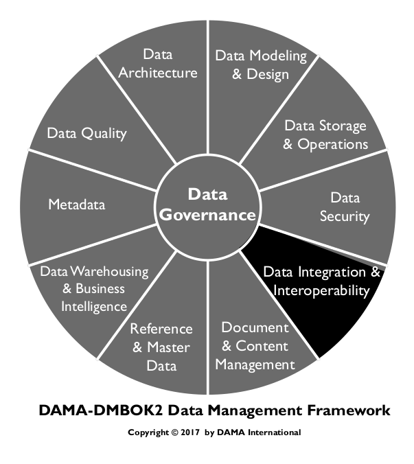
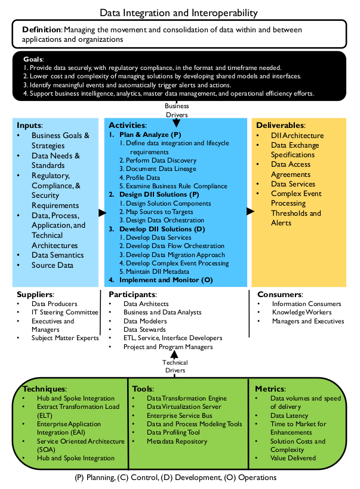
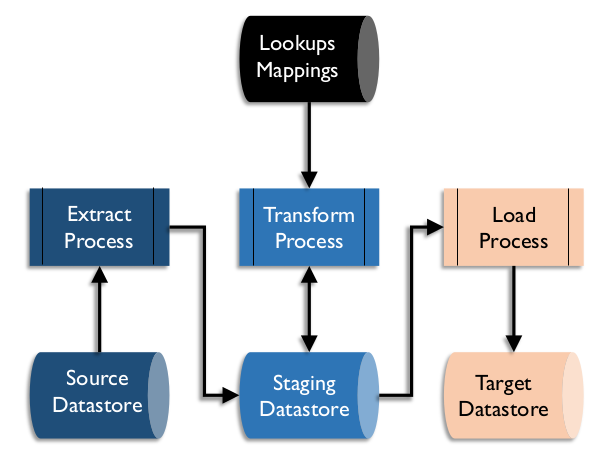
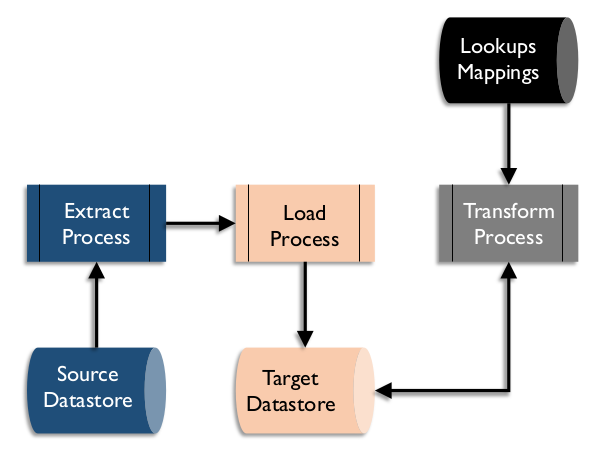
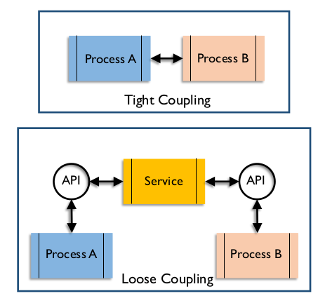
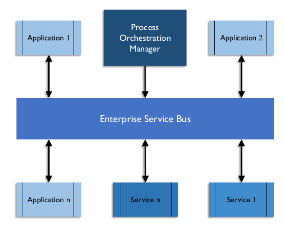

# Data Integration and Interoperability

## 1. Introduction

Data Integration and Interoperability (DII) describes processes related to the movement and consolidation of data within and between data stores, applications and organizations. Integration consolidates data into consistent forms, either physical or virtual. Data Interoperability is the ability for multiple systems to communicate. DII solutions enable basic data management functions on which most organizations depend:

* Data migration and conversion
* Data consolidation into hubs or marts
* Integration of vendor packages into an organization’s application portfolio
* Data sharing between applications and across organizations
* Distributing data across data stores and data centers
* Archiving data
* Managing data interfaces
* Obtaining and ingesting external data
* Integrating structured and unstructured data
* Providing operational intelligence and management decision support

DII is dependent on these other areas of data management:

* Data Governance: For governing the transformation rules and message structures
* Data Architecture: For designing solutions
* Data Security: For ensuring solutions appropriately protect the security of data, whether it is persistent, virtual, or in motion between applications and organizations
* Metadata: For tracking the technical inventory of data (persistent, virtual, and in motion), the business meaning of the data, the business rules for transforming the data, and the operational history and lineage of the data
* Data Storage and Operations: For managing the physical instantiation of the solutions
* Data Modeling and Design: For designing the data structures including physical persistence in databases, virtual data structures, and messages passing information between applications and organizations

Data Integration and Interoperability is critical to Data Warehousing and Business Intelligence, as well as Reference Data and Master Data Management, because all of these focus on transforming and integrating data from source systems to consolidated data hubs and from hubs to the target systems where it can be delivered to data consumers, both system and human.

Data Integration and Interoperability is central to the emerging area of Big Data management. Big Data seeks to integrate various types of data, including data structured and stored in databases, unstructured text data in documents or files, other types of unstructured data such as audio, video, and streaming data. This integrated data can be mined, used to develop predictive models, and deployed in operational intelligence activities.

### 1.1 Business Drivers

The need to manage data movement efficiently is a primary driver for DII. Since most organizations have hundreds or thousands of databases and stores, managing the processes for moving data between the data stores within the organization and to and from other organizations has become a central responsibility of every information technology organization. If not managed properly, the process of moving data can overwhelm IT resources and capabilities and dwarf the support requirements of traditional application and data management areas.

The advent of organizations purchasing applications from software vendors, rather than developing custom applications, has amplified the need for enterprise data integration and interoperability. Each purchased application comes with its own set of Master Data stores, transaction data stores, and reporting data stores that must integrate with the other data stores in the organization. Even Enterprise Resource Planning (ERP) systems that run the common functions of the organization, rarely, if ever, encompass all the data stores in the organization. They, too, have to have their data integrated with other organizational data.

Figure 66 Context Diagram: Data Integration and Interoperability

The need to manage complexity and the costs associated with complexity are reasons to architect data integration from an enterprise perspective. An enterprise design of data integration is demonstrably more efficient and cost effective than distributed or point-to-point solutions. Developing point-to-point solutions between applications can result in thousands to millions of interfaces and can quickly overwhelm the capabilities of even the most effective and efficient IT support organization.

Data hubs such as data warehouses and Master Data solutions help to alleviate this problem by consolidating the data needed by many applications and providing those applications with consistent views of the data. Similarly, the complexity of managing operational and transactional data that needs to be shared across the organization can be greatly simplified using enterprise data integration techniques such as hub-and-spoke integration and canonical message models.

Another business driver is managing the cost of support. Moving data using multiple technologies, each requiring specific development and maintenance skills, can drive support costs up. Standard tool implementations can reduce support and staffing costs and improve the efficiency of troubleshooting efforts. Reducing the complexity of interface management can lower the cost of interface maintenance, and allow support resources to be more effectively deployed on other organizational priorities.

DII also supports an organization’s ability to comply with data handling standards and regulations. Enterprise-level DII systems enable re-use of code to implement compliance rules and simplify verification of compliance.

### 1.2 Goals and Principles

The implementation of Data Integration and Interoperability practices and solutions aims to:

* Make data available in the format and timeframe needed by data consumers, both human and system
* Consolidate data physically and virtually into data hubs
* Lower cost and complexity of managing solutions by developing shared models and interfaces
* Identify meaningful events (opportunities and threats) and automatically trigger alerts and actions
* Support Business Intelligence, analytics, Master Data Management, and operational efficiency efforts

When implementing DII, an organization should follow these principles:

* Take an enterprise perspective in design to ensure future extensibility, but implement through iterative and incremental delivery
* Balance local data needs with enterprise data needs, including support and maintenance.
* Ensure business accountability for Data Integration and Interoperability design and activity. Business experts should be involved in the design and modification of data transformation rules, both persistent and virtual.

### 1.3 Essential Concepts

#### 1.3.1 Extract, Transform, and Load

Central to all areas in Data Integration and Interoperability is the basic process of Extract, Transform, and Load (ETL). Whether executed physically or virtually, in batch or real-time, these are the essential steps in moving data around and between applications and organizations.

Depending on data integration requirements, ETL can be performed as a periodically scheduled event (batch) or whenever new or updated data is available (real-time or event-driven). Operational data processing tends to be real-time or near real-time, while data needed for analysis or reporting is often scheduled in batch jobs.

Data integration requirements also determine whether the extracted and transformed data is physically stored in staging structures. Physical staging allows for an audit trail of steps that have occurred with the data and potential process restarts from an intermediate point. However, staging structures take up disk space and take time to write and read. Data integration needs that require very low latency will usually not include physical staging of the intermediate data integration results.

##### 1.3.1.1 Extract

The extract process includes selecting the required data and extracting it from its source. Extracted data is then staged, in a physical data store on disk or in memory. If physically staged on disk, the staging data store may be co-located with the source data store or with the target data store, or both. Ideally, if this process executes on an operational system, it is designed to use as few resources as possible, in order to avoid negatively affecting the operational processes. Batch processing during off-peak hours is an option for extracts that include complex processing to perform the selection or identify changed data to extract.

##### 1.3.1.2 Transform

The transform process makes the selected data compatible with the structure of the target data store. Transformation includes cases where data is removed from the source when it moves to the target, where data is copied to multiple targets, and where the data is used to trigger events but is not persisted.

Examples of transformation may include

* Format changes: Conversion of the technical format of the data; for example, from EBCDIC to ASCII format
* Structure changes: Changes to the structure of the data; for example, from denormalized to normalized records
* Semantic conversion: Conversion of data values to maintain consistent semantic representation. For example, the source gender codes might include 0, 1, 2, and 3, while the target gender codes might be represented as UNKNOWN, FEMALE, MALE, or NOT PROVIDED.
* De-duping: Ensuring that if rules require unique key values or records, a means for scanning the target, and detecting and removing duplicate rows, is included
* Re-ordering: Changing the order of the data elements or records to fit a defined pattern

Transformation may be performed in batch or real-time, either physically storing the result in a staging area, or virtually storing the transformed data in memory until ready to move to the load step. Data resulting from the transformation stage should be ready to integrate with data in the target structure.

##### 1.3.1.3 Load

The load step of ETL is physically storing or presenting the result of the transformations in the target system. Depending on the transformations performed, the target system’s purpose, and the intended use, the data may need further processing to be integrated with other data, or it may be in a final form, ready to present to consumers.

Figure 67 ETL Process Flow

##### 1.3.1.4 ELT

If the target system has more transformation capability than either the source or an intermediary application system, the order of processes may be switched to ELT – Extract, Load, and Transform. ELT allows transformations to occur after the load to the target system, often as part of the process. ELT allows source data to be instantiated on the target system as raw data, which can be useful for other processes. This is common in Big Data environments where ELT loads the data lake. (See Chapter 14.)

Figure 68 ELT Process Flow

##### 1.3.1.5 Mapping

A synonym for transformation, a mapping is both the process of developing the lookup matrix from source to target structures and the result of that process. A mapping defines the sources to be extracted, the rules for identifying data for extraction, targets to be loaded, rules for identifying target rows for update (if any), and any transformation rules or calculations to be applied. Many data integration tools offer visualizations of mappings that enable developers to use graphical interfaces to create transformation code.

#### 1.3.2 Latency

Latency is the time difference between when data is generated in the source system and when the data is available for use in the target system. Different approaches to data processing result in different degrees of data latency. Latency can be high (batch) or low (event-driven) to very low (real-time synchronous).

##### 1.3.2.1 Batch

Most data moves between applications and organizations in clumps or files either on request by a human data consumer or automatically on a periodic schedule. This type of interaction is called batch or ETL.

Data moving in batch mode will represent either the full set of data at a given point in time, such as account balances at the end of a period, or data that has changed values since the last time the data was sent, such as address changes that have been made in a day. The set of changed data is called the delta, and the data from a point in time is called a snapshot.

With batch data integration solutions, there is often a significant delay between when data changes in the source and when it is updated in the target, resulting in high latency. Batch processing is very useful for processing very high volumes of data in a short time window. It tends to be used for data warehouse data integration solutions, even when lower latency solutions are available.

To achieve fast processing and lower latency, some data integration solutions use micro-batch processing which schedules batch processing to run on a much higher frequency than daily, such as every five minutes.

Batch data integration is used for data conversions, migrations, and archiving, as well as for extracting from and loading data warehouses and data marts. There are risks associated with the timing of batch processing. To minimize issues with application updates, schedule data movement between applications at the end of logical processing for the business day, or after special processing of the data has occurred at night. To avoid incomplete data sets, jobs moving data to a data warehouse should be scheduled based on the daily, weekly, or monthly reporting schedule.

##### 1.3.2.2 Change Data Capture

Change Data Capture is a method of reducing bandwidth by filtering to include only data that has been changed within a defined timeframe. Change data capture monitors a data set for changes (inserts, changes, deletes) and then passes those changes (the deltas) to other data sets, applications, and organizations that consume the data. Data may also be tagged with identifiers such as flags or timestamps as part of the process. Change data capture may be data-based or log-based. (See Chapter 6.)

There are three techniques for data-based change data capture.

* The source system populates specific data elements, such as timestamps within a range, or codes or flags, which serve as change indicators. The extract process uses rules to identify rows to extract.
* The source system processes add to a simple list of objects and identifiers when changing data, which is then used to control selection of data for extraction.
* The source system processes copy data that has changed into a separate object as part of the transaction, which is then used for extract processing. This object does not need to be within the database management system.

These types of extraction use capabilities built into the source application, which may be resource intensive and require the ability to modify the source application.

In log-based change data captures, data activity logs created by the database management system are copied and processed, looking for specific changes that are then translated and applied to a target database. Complex translations may be difficult, but intermediary structures resembling the source object can be used as a way of staging the changes for further processing.

##### 1.3.2.3 Near-real-time and Event-driven

Most data integration solutions that are not performed in batches use a near-real-time or event-driven solution. Data is processed in smaller sets spread across the day in a defined schedule, or data is processed when an event happens, such as a data update. Near-real-time processing has a lower latency than batch processing and often a lower system load as the work is distributed over time, but it is usually slower than a synchronized data integration solution. Near-real-time data integration solutions are usually implemented using an enterprise service bus.

State information and process dependencies must be monitored by the target application load process. Data coming into the target may not be available in the exact order that the target needs to build the correct target data. For example, process Master Data or dimensional data prior to transactional data that uses that Master Data.

##### 1.3.2.4 Asynchronous

In an asynchronous data flow, the system providing data does not wait for the receiving system to acknowledge update before continuing processing. Asynchronous implies that either the sending or receiving system could be off-line for some period without the other system also being off-line.

Asynchronous data integration does not prevent the source application from continuing its processing, or cause the source application to be unavailable if any of the target applications are unavailable. Since the data updates made to applications in an asynchronous configuration are not immediate, the integration is called near-real-time. The delay between updates made in the source and relayed to target data sets in a near-real-time environment is usually measured in seconds or minutes.

##### 1.3.2.5 Real-time, Synchronous

There are situations where no time delay or other differences between source and target data is acceptable. When data in one data set must be kept perfectly in synch with the data in another data set, then a real-time, synchronous solution must be used.

In a synchronous integration solution, an executing process waits to receive confirmation from other applications or processes prior to executing its next activity or transaction. This means that the solution can process fewer transactions because it has to spend time waiting for confirmation of data synchronization. If any of the applications that need the update are not available then the transaction cannot be completed in the primary application. This situation keeps data synchronized but has the potential to make strategic applications dependent on less critical applications.

Solutions using this type of architecture exist on a continuum based on how much difference between data sets might be possible and how much such a solution is worth. Data sets may be kept in synch through database capabilities such as two-phase commits, which ensure that all updates in a business transaction are all successful, or none is made. For example, financial institutions use two-phase commit solutions to ensure that financial transaction tables are absolutely synchronized with financial balance tables. Most programming does not use two-phase commit. There is a very small possibility that if an application is interrupted unexpectedly then one data set may be updated but not another.

Real-time, synchronous solutions require less state management than asynchronous solutions because the order in which transactions are processed is clearly managed by the updating applications. However, they also may lead to blocking and delay other transactions.

##### 1.3.2.6 Low Latency or Streaming

Tremendous advances have been made in developing extremely fast data integration solutions. These solutions require a large investment in hardware and software. The extra costs of low latency solutions are justified if an organization requires extremely fast data movement across large distances. ‘Streaming data’ flows from computer systems on a real-time continuous basis immediately as events occur. Data streams capture events like the purchase of goods or financial securities, social media comments, and readouts from sensors monitoring location, temperature, usage, or other values.

Low latency data integration solutions are designed to minimize the response time to events. They may include the use of hardware solutions like solid-state disk or software solutions like in-memory databases so that the process does not have to slow down to read or write to traditional disk. The read and write processes to traditional disk drives is thousands of times slower than processing data in-memory or on solid-state disk drives.

Asynchronous solutions are usually used in low latency solutions so that transactions do not need to wait for confirmation from subsequent processes before processing the next piece of data. 

Massive multi-processing, or simultaneous processing, is also a common configuration in low latency solutions so that the processing of incoming data can be spread out over many processors simultaneously, and not bottlenecked by a single or small number of processors.

#### 1.3.3 Replication

To provide better response time for users located around the world, some applications maintain exact copies of data sets in multiple physical locations. Replication solutions minimize the performance impact of analytics and queries on the primary transactional operating environment.

Such a solution must synchronize the physically distributed data set copies. Most database management systems have replication utilities to do this work. These utilities work best when the data sets are all maintained in the same database management system technology. Replication solutions usually monitor the log of changes to the data set, not the data set itself. They minimize the impact on any operational applications because they do not compete with the applications for access to the data set. Only data from the change log passes between replicated copies. Standard replication solutions are near-real-time; there is a small delay between a change in one copy of the data set and another.

Because the benefits of replication solutions — minimal effect on the source data set and minimal amount of data being passed — are very desirable, replication is used in many data integration solutions, even those that do not include long distance physical distribution. The database management utilities do not require extensive programming, so there tend to be few programming bugs.

Replication utilities work optimally when source and target data sets are exact copies of each other. Differences between source and target introduce risks to synchronization. If the ultimate target is not an exact copy of the source then it is necessary to maintain a staging area to house an exact copy of the sources. This requires extra disk usage and possibly extra database technology.

Data replication solutions are not optimal if changes to the data may occur at multiple copy sites. If it is possible that the same piece of data is changed at two different sites, then there is a risk that the data might get unsynchronized, or one of the sites may have their changes overwritten without warning. (See Chapter 6.)

#### 1.3.4 Archiving

Data that is used infrequently or not actively used may be moved to an alternate data structure or storage solution that is less costly to the organization. ETL functions can be used to transport and possibly transform the archive data to the data structures in the archive environment. Use archives to store data from applications that are being retired, as well as data from production operational systems that have not been used for a long time, to improve operational efficiency.

It is critical to monitor archive technology to ensure that the data is still accessible when technology changes. Having an archive in an older structure or format unreadable by newer technology can be a risk, especially for data that is still legally required. (See Chapter 9.)

#### 1.3.5 Enterprise Message Format / Canonical Model

A canonical data model is a common model used by an organization or data exchange group that standardizes the format in which data will be shared. In a hub-and-spoke data interaction design pattern, all systems that want to provide or receive data interact only with a central information hub. Data is transformed from or to a sending or receiving system based on a common or enterprise message format for the organization (a canonical model). (See Chapter 5.) Use of a canonical model limits the number of data transformations needed by any system or organization exchanging data. Each system needs to transform data only to and from the central canonical model, rather than to the format of the multitude of systems with which it may want to exchange data.

Although developing and agreeing on a shared message format is a major undertaking, having a canonical model can significantly reduce the complexity of data interoperability in an enterprise, and thus greatly lower the cost of support. The creation and management of the common canonical data model for all data interactions is a complex item of overhead that is required in the implementation of an enterprise data integration solution using a hub-and-spoke interaction model. It is justifiable in support of managing the data interactions between more than three systems and critical for managing data interactions in environments of more than 100 application systems.

#### 1.3.6 Interaction Models

Interaction models describe ways to make connections between systems in order to transfer data.

##### 1.3.6.1 Point-to-point

The vast majority of interactions between systems that share data do so ‘point-to-point’; they pass data directly to each other. This model makes sense in the context of a small set of systems. However, it becomes quickly inefficient and increases organizational risk when many systems require the same data from the same sources.

* Impacts to processing: If source systems are operational, then the workload from supplying data could affect processing.
* Managing interfaces: The number of interfaces needed in a point-to-point interaction model approaches the number of systems squared (s2). Once they are built, these interfaces need to be maintained and supported. The workload to manage and support interfaces between the systems can quickly become greater than supporting the systems themselves.
* Potential for inconsistency: Design issues arise when multiple systems require different versions or formats of the data. The use of multiple interfaces to obtain data will lead to inconsistencies in the data sent to downstream systems.

##### 1.3.6.2 Hub-and-spoke

The hub-and-spoke model, an alternative to point-to-point, consolidates shared data (either physically or virtually) in a central data hub that many applications can use. All systems that want to exchange data do so through a central common data control system, rather than directly with one another (point-to-point). Data Warehouses, Data Marts, Operational Data Stores, and Master Data Management hubs are the most well-known examples of data hubs.

The hubs provide consistent views of the data with limited performance impact on the source systems. Data hubs even minimize the number of systems and extracts that must access the data sources, thus minimizing the impact on the source system resources. Adding new systems to the portfolio only requires building interfaces to the data hub. Hub-and-spoke interaction is more efficient and can be cost-justified even if the number of systems involved is relatively small, but it becomes critical to managing a portfolio of systems in the hundreds or thousands.

Enterprise Service Buses (ESB) are the data integration solution for near real-time sharing of data between many systems, where the hub is a virtual concept of the standard format or the canonical model for sharing data in the organization.

Hub-and-spoke may not always be the best solution. Some hub-and-spoke model latency is unacceptable or performance is insufficient. The hub itself creates overhead in a hub-and-spoke architecture. A point-to-point solution would not require the hub. However, the benefits of the hub outweigh the drawbacks of the overhead as soon as three or more systems are involved in sharing data. Use of the hub-and-spoke design pattern for the interchange of data can drastically reduce the proliferation of data transformation and integration solutions and thus dramatically simplify the necessary organizational support.

##### 1.3.6.3 Publish - Subscribe

A publish and subscribe model involves systems pushing data out (publish), and other systems pulling data in (subscribe). Systems providing data are listed in a catalog of data services, and systems looking to consume data subscribe to those services. When data is published, the data is automatically sent to the subscribers.

When multiple data consumers want a certain set of data or data in a certain format, developing that data set centrally and making it available to all who need it ensures that all constituents receive a consistent data set in a timely manner.

#### 1.3.7 DII Architecture Concepts

##### 1.3.7.1 Application Coupling

Coupling describes the degree to which two systems are entwined. Two systems that are tightly coupled usually have a synchronous interface, where one system waits for a response from the other. Tight coupling represents a riskier operation: if one system is unavailable then they are both effectively unavailable, and the business continuity plan for both have to be the same. (See Chapter 6.)

Where possible, loose coupling is a preferred interface design, where data is passed between systems without waiting for a response and one system may be unavailable without causing the other to be unavailable. Loose coupling can be implemented using various techniques with services, APIs, or message queues. Figure 69 illustrates a possible loose coupling design.

Figure 69 Application Coupling

Service Oriented Architecture using an Enterprise Service Bus is an example of a loosely coupled data interaction design pattern.

Where the systems are loosely coupled, replacement of systems in the application inventory can theoretically be performed without rewriting the systems with which they interact, because the interaction points are well-defined.

##### 1.3.7.2 Orchestration and Process Controls

Orchestration is the term used to describe how multiple processes are organized and executed in a system. All systems handling messages or data packets must be able to manage the order of execution of those processes, in order to preserve consistency and continuity.

Process Controls are the components that ensure shipment, delivery, extraction, and loading of data is accurate and complete. An often-overlooked aspect of basic data movement architecture, controls include:

* Database activity logs
* Batch job logs
* Alerts
* Exception logs
* Job dependence charts with remediation options, standard responses
* Job ‘clock’ information, such as the timing of dependent jobs, the expected length of the jobs, and the computing (available) window time

##### 1.3.7.3 Enterprise Application Integration (EAI)

In an enterprise application integration model (EAI), software modules interact with one another only through well-defined interface calls (application programming interfaces – APIs). Data stores are updated only by their own software modules and other software cannot reach in to the data in an application but only access through the defined APIs. EAI is built on object-oriented concepts, which emphasize reuse and the ability to replace any module without impact on any other.

##### 1.3.7.4 Enterprise Service Bus (ESB)

An Enterprise Service Bus is a system that acts as an intermediary between systems, passing messages between them. Applications can send and receive messages or files using the ESB, and are encapsulated from other processes existing on the ESB. An example of loose coupling, the ESB acts as the service between the applications. (See Figure 70.)

Figure 70 Enterprise Service Bus

##### 1.3.7.5 Service-Oriented Architecture (SOA)

Most mature enterprise data integration strategies utilize the idea of service-oriented architecture (SOA), where the functionality of providing data or updating data (or other data services) can be provided through well-defined service calls between applications. With this approach, applications do not have to have direct interaction with or knowledge of the inner workings of other applications. SOA enables application independence and the ability for an organization to replace systems without needing to make significant changes to the systems that interfaced with them.

The goal of service-oriented architecture is to have well-defined interaction between self-contained software modules. Each module performs functions (a.k.a. provides services) to other software modules or to human consumers. The key concept is that SOA architecture provides independent services: the service has no fore knowledge of the calling application and the implementation of the service is a black box to the calling application. A service-oriented architecture may be implemented with various technologies including web services, messaging, RESTful APIs, etc. Services are usually implemented as APIs (application programming interfaces) that are available to be called by application systems (or human consumers). A well-defined API registry describes what options are available, parameters that need to be provided, and resulting information that is provided.

Data services, which may include the addition, deletion, update, and retrieval of data, are specified in a catalog of available services. To achieve the enterprise goals of scalability (supporting integrations between all applications in the enterprise without using unreasonable amounts of resources to do so) and reuse (having services that are leveraged by all requestors of data of a type), a strong governance model must be established around the design and registration of services and APIs. Prior to developing new data services, it is necessary to ensure that no service already exists that could provide the requested data. In addition, new services need to be designed to meet broad requirements so that they will not be limited to the immediate need but can be reused.

##### 1.3.7.6 Complex Event Processing (CEP)

Event processing is a method of tracking and analyzing (processing) streams of information (data) about things that happen (events), and deriving a conclusion from them. Complex event processing (CEP) combines data from multiple sources to identify meaningful events (such as opportunities or threats) to predict behavior or activity and automatically trigger real-time response, such as suggesting a product for a consumer to purchase. Rules are set to guide the event processing and routing.

Organizations can use complex event processing to predict behavior or activity and automatically trigger real-time response. Events such as sales leads, web clicks, orders, or customer service calls may happen across the various layers of an organization. Alternatively, they may include news items, text messages, social media posts, stock market feeds, traffic reports, weather reports, or other kinds of data. An event may also be defined as a change of state, when a measurement exceeds a predefined threshold of time, temperature, or other value.

CEP presents some data challenges. In many cases, the rate at which events occur makes it impractical to retrieve the additional data necessary to interpret the event as it occurs. Efficient processing typically mandates pre-positioning some data in the CEP engine’s memory.

Supporting complex event processing requires an environment that can integrate vast amounts of data of various types. Because of the volume and variety of data usually involved in creating predictions, complex event processing is often tied to Big Data. It often requires use of technologies that support ultra-low latency requirements such as processing real-time streaming data and in-memory databases. (See Chapter 14.)

##### 1.3.7.7 Data Federation and Virtualization

When data exists in disparate data stores, it can be brought together in ways other than physical integration. Data Federation provides access to a combination of individual data stores, regardless of structure. Data Virtualization enables distributed databases, as well as multiple heterogeneous data stores, to be accessed and viewed as a single database. (See Chapter 6.)

##### 1.3.7.8 Data-as-a-Service (DaaS)

Software-as-a-service (SaaS) is a delivery and licensing model. An application is licensed to provide services, but the software and data are located at a data center controlled by the software vendor, rather than in the data center of the licensing organization. There are similar concepts for providing various tiers of computing infrastructure-as-a-service (IT-as-a-service, platform-as-a-service, database-as-a-service).

One definition of Data-as-a-Service (DaaS) is data licensed from a vendor and provided on demand, rather than stored and maintained in the data center of the licensing organization. A common example includes information on the securities sold through a stock exchange and associated prices (current and historical).

Although Data-as-a-Service certainly lends itself to vendors that sell data to stakeholders within an industry, the ‘service’ concept is also used within an organization to provide enterprise data or data services to various functions and operational systems. Service organizations provide a catalog of services available, service levels, and pricing schedules.

##### 1.3.7.9 Cloud-based Integration

Cloud-based integration (also known as integration platform-as-a-service or IPaaS) is a form of systems integration delivered as a cloud service that addresses data, process, service oriented architecture (SOA), and application integration use cases.

Prior to the emergence of cloud computing, integration could be categorized as either internal or business to business (B2B). Internal integration requirements are serviced through an on-premises middleware platform, and typically use a service bus (ESB) to manage exchange of data between systems. Business-to-business integration is serviced through EDI (electronic data interchange) gateways or value-added networks (VAN) or market places.

The advent of SaaS applications created a new kind of demand for integrating data located outside of an organization’s data center, met through cloud-based integration. Since their emergence, many such services have also developed the capability to integrate on-premises applications as well as function as EDI gateways. Cloud-based integration solutions are usually run as SaaS applications in the data centers of the vendors and not the organizations that own the data being integrated. Cloud-based integration involves interacting with the SaaS application data to be integrated using SOA interaction services. (See Chapter 6.)

#### 1.3.8 Data Exchange Standards

Data Exchange Standards are formal rules for the structure of data elements. ISO (International Standards Organization) has developed data exchange standards, as have many industries. A data exchange specification is a common model used by an organization or data exchange group that standardizes the format in which data will be shared. An exchange pattern defines a structure for data transformations needed by any system or organization exchanging data. Data needs to be mapped to the exchange specification.

Although developing and agreeing on a shared message format is a major undertaking, having an agreed upon exchange format or data layout between systems can significantly simplify data interoperability in an enterprise, lowering the cost of support and enabling better understanding of the data.

The National Information Exchange Model (NIEM) was developed to exchange documents and transactions across government organizations in the United States. The intention is that the sender and receiver of information share a common, unambiguous understanding of the meaning of that information. Conformance to NIEM ensures that a basic set of information is well understood and carries the same consistent meaning across various communities, thus allowing interoperability.

NIEM uses Extensible Markup Language (XML) for schema definitions and element representation, which allows the structure and meaning of data to be defined through simple, but carefully defined XML syntax rules.

## 2. Data Integration Activities

Data Integration and Interoperability involves getting data where it is needed, when it is needed, and in the form in which it is needed. Data integration activities follow a development lifecycle. They begin with planning and move through design, development, testing, and implementation. Once implemented, integrated systems must be managed, monitored and enhanced.

### 2.1 Plan and Analyze

#### 2.1.1 Define Data Integration and Lifecycle Requirements

Defining data integration requirements involves understanding the organization’s business objectives, as well as the data required and the technology initiatives proposed to meet those objectives. It is also necessary to gather any relevant laws or regulations regarding the data to be used. Some activities may need to be restricted due to the data contents, and knowing up front will prevent issues later. Requirements must also account for organizational policy on data retention and other parts of the data lifecycle. Often requirements for data retention will differ by data domain and type.

Data integration and lifecycle requirements are usually defined by business analysts, data stewards, and architects in various functions, including IT, who have a desire to get data in a certain place, in a certain format, and integrated with other data. The requirements will determine the type of DII interaction model, which then determines the technology and services necessary to fulfill the requirements.

The process of defining requirements creates and uncovers valuable Metadata. This Metadata should be managed throughout the data lifecycle, from discovery through operations. The more complete and accurate an organization’s Metadata, the better its ability to manage the risks and costs of data integration.

#### 2.1.2 Perform Data Discovery

Data discovery should be performed prior to design. The goal of data discovery is to identify potential sources of data for the data integration effort. Discovery will identify where data might be acquired and where it might be integrated. The process combines a technical search, using tools that scan the Metadata and/or actual contents on an organization’s data sets, with subject matter expertise (i.e., interviewing people who work with the data of interest).

Discovery also includes high-level assessment of data quality, to determine whether the data is fit for the purposes of the integration initiative. This assessment requires not only reviewing existing documentation, interviewing subject matter experts, but also verifying information gathered against the actual data through data profiling or other analysis. (See Section 2.1.4.) In almost all cases, there will be discrepancies between what is believed about a data set and what is actually found to be true.

Data discovery produces or adds to an inventory of organizational data. This inventory should be maintained in a Metadata repository. Ensure this inventory is maintained as a standard part of integration efforts: add or remove data stores, document structure changes.

Most organizations have a need to integrate data from their internal systems. However, data integration solutions may also involve the acquisition of data from outside the organization. There is a vast and ever growing amount of valuable information available for free, or from data vendors. Data from external sources can be extremely valuable when integrated with data from within an organization. However, acquiring and integrating external data takes planning.

#### 2.1.3 Document Data Lineage

The process of data discovery will also uncover information about how data flows through an organization. This information can be used to document high-level data lineage: how the data under analysis is acquired or created by the organization, where it moves and is changed within the organization, and how the data is used by the organization for analytics, decision-making, or event triggering. Detailed lineage can include the rules according to which data is changed, and the frequency of changes.

Analysis of lineage may identify updates required to documentation of systems in use. Custom-coded ETL and other legacy data manipulation objects should be documented to ensure that the organization can analyze the impact of any changes in the data flow.

The analysis process may also identify opportunities for improvements in the existing data flow. For example, finding that code can be upgraded to a simple call to a function in a tool, or can be discarded as no longer relevant. Sometimes an old tool is performing a transformation that is undone later in the process. Finding and removing these inefficiencies can greatly help with the project’s success and with an organization’s overall ability to use its data.

#### 2.1.4 Profile Data

Understanding data content and structure is essential to successful integration of data. Data profiling contributes to this end. Actual data structure and contents always differ from what is assumed. Sometimes differences are small; other times they are large enough to derail an integration effort. Profiling can help integration teams discover these differences and use that knowledge to make better decisions about sourcing and design. If data profiling is skipped, then information that should influence design will not be discovered until testing or operations.

Basic profiling involves analysis of:

* Data format as defined in the data structures and inferred from the actual data
* Data population, including the levels of null, blank, or defaulted data
* Data values and how closely they correspond to a defined set of valid values
* Patterns and relationships internal to the data set, such as related fields and cardinality rules
* Relationships to other data sets

More extensive profiling of the potential source and target data sets is required to understand how well the data meets the requirements of the particular data integration initiative. Profile both the sources and targets to understand how to transform the data to match requirements.

One goal of profiling is to assess the quality of data. Assessing the fitness of the data for a particular use requires documenting business rules and measuring how well the data meets those business rules. Assessing accuracy requires comparing to a definitive set of data that has been determined to be correct. Such data sets are not always available, so measuring accuracy may not be possible, especially as part of a profiling effort.

As with high-level data discovery, data profiling includes verifying assumptions about the data against the actual data. Capture results of data profiling in a Metadata repository for use on later projects and use what is learned from the process to improve the accuracy of existing Metadata (Olson, 2003). (See Chapter 13.)

The requirement to profile data must be balanced with an organization’s security and privacy regulations. (See Chapter 7.)

#### 2.1.5 Collect Business Rules

Business rules are a critical subset of requirements. A business rule is a statement that defines or constrains an aspect of business processing. Business rules are intended to assert business structure or to control or influence the behavior of the business. Business rules fall into one of four categories: definitions of business terms, facts relating terms to each other, constraints or action assertions, and derivations.

Use business rules to support Data Integration and Interoperability at various points, to:

* Assess data in potential source and target data sets
* Direct the flow of data in the organization
* Monitor the organization’s operational data
* Direct when to automatically trigger events and alerts

For Master Data Management, business rules include match rules, merge rules, survivorship rules, and trust rules. For data archiving, data warehousing, and other situations where a data store is in use, the business rules also include data retention rules.

Gathering business rules is also called rules harvesting or business rule mining. The business analyst or data steward can extract the rules from existing documentation (like use cases, specifications, or system code), or they may also organize workshops and interviews with subject matter experts (SMEs), or both.

### 2.2 Design Data Integration Solutions

#### 2.2.1 Design Data Integration Architecture

Data integration solutions should be specified at both the enterprise level and the individual solution level (see Chapter 4). By establishing enterprise standards, the organization saves time in implementing individual solutions, because assessments and negotiations have been performed in advance of need. An enterprise approach saves money in the cost of licenses through group discounts and in the costs of operating a consistent and less complex set of solutions. Operational resources that support and back up one another can be part of a shared pool.

Design a solution to meet the requirements, reusing as many of the existing Data Integration and Interoperability components as is feasible. A solution architecture indicates the techniques and technologies that will be used. It will include an inventory of the involved data structures (both persistent and transitive, existing and required), an indication of the orchestration and frequency of data flow, regulatory and security concerns and remediation, and operating concerns around backup and recovery, availability, and data archive and retention.

##### 2.2.1.1 Select Interaction Model

Determine which interaction model or combination will fulfill the requirements – hub-and-spoke, point-to-point, or publish-subscribe. If the requirements match an existing interaction pattern already implemented, re-use the existing system as much as possible, to reduce development efforts.

##### 2.2.1.2 Design Data Services or Exchange Patterns

Create or re-use existing integration flows to move the data. These data services should be companions to existing similar data services, but be careful to not create multiple almost-identical services, as troubleshooting and support increasingly become difficult if services proliferate. If an existing data flow can be modified to support multiple needs, it may be worthwhile to make that change instead of creating a new service. Any data exchange specification design should start with industry standards, or other exchange patterns already existing. When possible, make any changes to existing patterns generic enough to be useful to other systems; having specific exchange patterns that only relate to one exchange has the same issues as point-to-point connections.

#### 2.2.2 Model Data Hubs, Interfaces, Messages, and Data Services

Data structures needed in Data Integration and Interoperability include those in which data persists, such as Master Data Management hubs, data warehouses and marts, and operational data stores, and those that are transient and used only for moving or transforming data, such as interfaces, message layouts, and canonical models. Both types should be modeled. (See Chapter 5.)

#### 2.2.3 Map Data Sources to Targets

Almost all data integration solutions include transforming data from source to target structures. Mapping sources to targets involves specifying the rules for transforming data from one location and format to another. For each attribute mapped, a mapping specification

* Indicates the technical format of the source and target
* Specifies transformations required for all intermediate staging points between source and target
* Describes how each attribute in a final or intermediate target data store will be populated
* Describes whether data values need to be transformed; for example, by looking up the source value in a table that indicates the appropriate target value
* Describes what calculations are required

Transformation may be performed on a batch schedule, or triggered by the occurrence of a real-time event. It may be accomplished through physical persistence of the target format or through virtual presentation of the data in the target format.

#### 2.2.4 Design Data Orchestration

The flow of data in a data integration solution must be designed and documented. Data orchestration is the pattern of data flows from start to finish, including intermediate steps, required to complete the transformation and/or transaction.

Batch data integration orchestration will indicate the frequency of the data movement and transformation. Batch data integration is usually coded into a scheduler that triggers the start at a certain time, periodicity, or when an event occurs. The schedule may include multiple steps with dependencies.

Real-time data integration orchestration is usually triggered by an event, such as new or updated data. Real-time data integration orchestration is usually more complex and implemented across multiple tools. It may not be linear in nature.

### 2.3 Develop Data Integration Solutions

#### 2.3.1 Develop Data Services

Develop services to access, transform, and deliver data as specified, matching the interaction model selected. Tools or vendor suites are most frequently used to implement data integration solutions, such as data transformation, Master Data Management, data warehousing, etc. Using consistent tools or standard vendor suites across the organization for these various purposes can simplify operational support and lower operating costs by enabling shared support solutions.

#### 2.3.2 Develop Data Flows

Integration or ETL data flows will usually be developed within tools specialized to manage those flows in a proprietary way. Batch data flows will be developed in a scheduler (usually the enterprise standard scheduler) that will manage the order, frequency, and dependency of executing the data integration pieces that have been developed.

Interoperability requirements may include developing mappings or coordination points between data stores. Some organizations use an ESB to subscribe to data that is created or changed in the organization and other applications to publish changes to data. The enterprise service bus will poll the applications constantly to see if they have any data to publish and deliver to them new or changed data for which they have subscribed.

Developing real-time data integration flows involves monitoring for events that should trigger the execution of services to acquire, transform, or publish data. This is usually implemented within one or multiple proprietary technologies and is best implemented with a solution that can manage the operation across technologies.

#### 2.3.3 Develop Data Migration Approach

Data needs to be moved when new applications are implemented or when applications are retired or merged. This process involves transformation of data to the format of the receiving application. Almost all application development projects involve some data migration, even if all that is involved is the population of Reference Data. Migration is not quite a one-time process, as it needs to be executed for testing phases as well as final implementation.

Data migration projects are frequently under-estimated or under-designed, because programmers are told to simply move the data; they do not engage in the analysis and design activities required for data integration. When data is migrated without proper analysis, it often looks different from the data that came in through the normal processing. Or the migrated data may not work with the application as anticipated. Profiling data of core operational applications will usually highlight data that has been migrated from one or more generations of previous operational systems and does not meet the standards of the data that enters the data set through the current application code. (See Chapter 6.)

#### 2.3.4 Develop a Publication Approach

Systems where critical data is created or maintained need to make that data available to other systems in the organization. New or changed data should be pushed by data producing applications to other systems (especially data hubs and enterprise data buses) either at the time of data change (event-driven) or on a periodic schedule.

Best practice is to define common message definitions (canonical model) for the various types of data in the organization and let data consumers (either applications or individuals) who have appropriate access authority subscribe to receive notification of any changes to data of interest.

#### 2.3.5 Develop Complex Event Processing Flows

Developing complex event processing solutions requires:

* Preparation of the historical data about an individual, organization, product, or market and pre-population of the predictive models
* Processing the real-time data stream to fully populate the predictive model and identify meaningful events (opportunities or threats)
* Executing the triggered action in response to the prediction

Preparation and pre-processing of the historical data needed in the predictive model may be performed in nightly batch processes or in near real-time. Usually some of the predictive model can be populated in advance of the triggering event, such as identifying what products are usually bought together in preparation of suggesting an additional item for purchase.

Some processing flows trigger a response to every event in the real-time stream, such as adding an item to a shopping cart; other processing flows attempt to identify particularly meaningful events that trigger action, such as a suspected fraudulent charge attempt on a credit card.

The response to the identification of a meaningful event may be as simple as a warning being sent out or as complex as the automatic deployment of armed forces.

#### 2.3.6 Maintain DII Metadata

As previously noted (see Section 2.1), an organization will create and uncover valuable Metadata during the process of developing DII solutions. This Metadata should be managed and maintained to ensure proper understanding of the data in the system, and to prevent the need to rediscover it for future solutions. Reliable Metadata improves an organization’s ability to manage risks, reduce costs, and obtain more value from its data. Document the data structures of all systems involved in data integration as source, target, or staging. Include business definitions and technical definitions (structure, format, size), as well as the transformation of data between the persistent data stores. Whether data integration Metadata is stored in documents or a Metadata repository, it should not be changed without a review and approval process from both business and technical stakeholders.

Most ETL tool vendors package their Metadata repositories with additional functionality that enables governance and stewardship oversight. If the Metadata repository is utilized as an operational tool, then it may even include operational Metadata about when data was copied and transformed between systems.

Of particular importance for DII solutions is the SOA registry, which provides controlled access to an evolving catalog of information about the available services for accessing and using the data and functionality in an application.

### 2.4 Implement and Monitor

Activate the data services that have been developed and tested. Real-time data processing requires real-time monitoring for issues. Establish parameters that indicate potential problems with processing, as well as direct notification of issues. Automated as well as human monitoring for issues should be established, especially as the complexity and risk of the triggered responses rises. There are cases, for example, where issues with automated financial securities trading algorithms have triggered actions that have affected entire markets or bankrupted organizations.

Data interaction capabilities must be monitored and serviced at the same service level as the most demanding target application or data consumer.

## 3. Tools

### 3.1 Data Transformation Engine/ETL Tool

A data transformation engine (or ETL tool) is the primary tool in the data integration toolbox, central to every enterprise data integration program. These tools usually support the operation as well as the design of the data transformation activities.

Extremely sophisticated tools exist to develop and perform ETL, whether batch or real-time, physically or virtually. For single use point-to-point solutions, data integration processing is frequently implemented through custom coding. Enterprise level solutions usually require the use of tools to perform this processing in a standard way across the organization.

Basic considerations in selecting a data transformation engine should include whether it is necessary to handle batch as well as real-time functionality, and whether unstructured as well as structured data needs to be accommodated, as the most mature tools exist for batch-oriented processing of structured data only.

### 3.2 Data Virtualization Server

Data transformation engines usually perform extract, transform, and load physically on data; however, data virtualization servers perform data extract, transform, and integrate virtually. Data virtualization servers can combine structured and unstructured data. A data warehouse is frequently an input to a data virtualization server, but a data virtualization server does not replace the data warehouse in the enterprise information architecture.

### 3.3 Enterprise Service Bus

An enterprise service bus (ESB) refers to both a software architecture model and a type of message-oriented middleware used to implement near real-time messaging between heterogeneous data stores, applications, and servers that reside within the same organization. Most internal data integration solutions that need to execute more frequent than daily use this architecture and this technology. Most commonly, an ESB is used in asynchronous format to enable the free flow of data. An ESB can also be used synchronously in certain situations.

The enterprise service bus implements incoming and outgoing message queues on each of the systems participating in message interchange with an adapter or agent installed in each environment. The central processor for the ESB is usually implemented on a server separate from the other participating systems. The processor keeps track of which systems have subscribed interest in what kinds of messages. The central processor continuously polls each participating system for outgoing messages and deposits incoming messages into the message queue for subscribed types of messages and messages that have been directly addressed to that system.

This model is called ‘near real-time’ because the data can take up to a couple of minutes to get from sending system to receiving system. This is a loosely coupled model and the system sending data will not wait for confirmation of receipt and update from the receiving system before continuing processing.

### 3.4 Business Rules Engine

Many data integration solutions are dependent on business rules. An important form of Metadata, these rules can be used in basic integration and in solutions that incorporate complex event processing to enable an organization to respond to events in near real-time. A business rules engine that allows non-technical users to manage business rules implemented by software is a very valuable tool that will enable evolution of the solution at a lower cost, because a business rules engine can support changes to predictive models without technical code changes. For example, models that predict what a customer might want to purchase may be defined as business rules rather than code changes.

### 3.5 Data and Process Modeling Tools

Data modeling tools should be used to design not only the target but also the intermediate data structures needed in data integration solutions. The structure of the messages or streams of data that pass between systems and organizations, and are not usually persisted, should nevertheless be modeled. The flow of data between systems and organizations should also be designed, as should complex event processes.

### 3.6 Data Profiling Tool

Data profiling involves statistical analysis of data set contents to understand format, completeness, consistency, validity, and structure of the data. All data integration and interoperability development should include detailed assessment of potential data sources and targets to determine whether the actual data meets the needs of the proposed solution. Since most integration projects involve a significant amount of data, the most efficient means of conducting this analysis is to use a data profiling tool. (See Section 2.1.4 and Chapter 13.)

### 3.7 Metadata Repository

A Metadata repository contains information about the data in an organization, including data structure, content, and the business rules for managing the data. During data integration projects, one or more Metadata repositories may be used to document the technical structure and business meaning of the data being sourced, transformed, and targeted.

Usually the rules regarding data transformation, lineage, and processing used by the data integration tools are also stored in a Metadata repository as are the instructions for scheduled processes such as triggers and frequency.

Every tool usually has its own Metadata repository. Suites of tools from the same vendor may share a Metadata repository. One Metadata repository may be designated as a central point for consolidating data from the various operational tools. (See Chapter 12.)

## 4. Techniques

Several of the important techniques for designing data integration solutions are described in the Essential Concepts in this chapter. The basic goals are to keep the applications coupled loosely, limit the number of interfaces developed and requiring management by using a hub-and-spoke approach, and to create standard (or canonical) interfaces.

## 5. Implementation Guidelines

### 5.1 Readiness Assessment / Risk Assessment

All organizations have some form of DII already in place – so the readiness/risk assessment should be around enterprise integration tool implementation, or enhancing capabilities to allow interoperability.

Implementing enterprise data integration solutions is usually cost-justified based on implementation between many systems. Design an enterprise data integration solution to support the movement of data between many applications and organizations, and not just the first one to be implemented.

Many organizations spend their time reworking existing solutions instead of bringing additional value. Focus on implementing data integration solutions where none or limited integration currently exists, rather than replacing working data integration solutions with a common enterprise solution across the organization.

Certain data projects can justify a data integration solution focused only on a particular application, such as a data warehouse or Master Data Management hub. In those cases, any additional use of the data integration solution adds value to the investment, because the first system use already achieved the justification.

Application support teams prefer to manage data integration solutions locally. They will perceive that the cost of doing so is lower than leveraging an enterprise solution. The software vendors that support such teams will also prefer that they leverage the data integration tools that they sell. Therefore, it is necessary to sponsor the implementation of an enterprise data integration program from a level that has sufficient authority over solution design and technology purchase, such as from IT enterprise architecture. In addition, it may be necessary to encourage application systems to participate through positive incentives, such as funding the data integration technology centrally, and through negative incentives, such as refusing to approve the implementation of new alternative data integration technologies.

Development projects that implement new data integration technology frequently become focused on the technology and lose focus on the business goals. It is necessary to make sure that data integration solution implementation retain focus on the business goals and requirements, including making sure that some participants in every project are business- or application-oriented, and not just data integration tool experts.

### 5.2 Organization and Cultural Change

Organizations must determine whether responsibility for managing data integration implementations is centralized or whether it resides with decentralized application teams. Local teams understand the data in their applications. Central teams can build deep knowledge of tools and technologies. Many organizations develop a Center of Excellence specializing in the design and deployment of the enterprise data integration solutions. Local and central teams collaborate to develop solutions connecting an application into an enterprise data integration solution. The local team should take primary responsibility for managing the solution and resolving any problems, escalating to the Center of Excellence, if necessary.

Data integration solutions are frequently perceived as purely technical; however, to successfully deliver value, they must be developed based on deep business knowledge. The data analysis and modeling activities should be performed by business-oriented resources. Development of a canonical message model, or consistent standard for how data is shared in the organization, requires a large resource commitment that should involve business modeling resources as well as technical resources. Review all data transformation mapping design and changes with by business subject matter experts in each involved system.

## 6. DII Governance

Decisions about the design of data messages, data models, and data transformation rules have a direct impact on an organization’s ability to use its data. These decisions must be business-driven. While there are many technical considerations in implementing business rules, a purely technical approach to DII can lead to errors in the data mappings and transformations as data flows into, through and out of an organization.

Business stakeholders are responsible for defining rules for how data should be modeled and transformed. Business stakeholders should approve changes to any of these business rules. Rules should be captured as Metadata and consolidated for cross-enterprise analysis. Identifying and verifying the predictive models and defining what actions should be automatically triggered by the predictions are also business functions.

Without trust that the integration or interoperable design will perform as promised, in a secure, reliable way, there can be no effective business value. In DII, the landscape of governance controls to support trust can be complex and detailed. One approach is to determine what events trigger governance reviews (exceptions or critical events). Map each trigger to reviews that engage with governance bodies. Event triggers may be part of the System Development Life Cycle (SDLC) at Stage Gates when moving from one phase to another or as part of User Stories. For example, architecture design compliance checklists may include such questions as: If possible, are you using the ESB and tools? Was there a search for reusable services?

Controls may come from governance-driven management routines, such as mandated reviews of models, auditing of Metadata, gating of deliverables, and required approvals for changes to transformation rules.

In Service Level Agreements, and in Business Continuity/Disaster Recovery plans, real-time operational data integration solutions must be included in the same backup and recovery tier as the most critical system to which they provide data.

Policies need to be established to ensure that the organization benefits from an enterprise approach to DII. For example, policies can be put in place to ensure that SOA principles are followed, that new services are created only after a review of existing services, and that all data flowing between systems goes through the enterprise service bus.

### 6.1 Data Sharing Agreements

Prior to the development of interfaces or the provision of data electronically, develop a data sharing agreement or memorandum of understanding (MOU) which stipulates the responsibilities and acceptable use of data to be exchanged, approved by the business data stewards of the data in question. The data sharing agreements should specify anticipated use and access to the data, restrictions on use, as well as expected service levels, including required system up times and response times. These agreements are especially critical for regulated industries, or when personal or secure information is involved.

### 6.2 DII and Data Lineage

Data lineage is useful to the development of DII solutions. It is also often required for data consumers to use data, but it is becoming even more important as data is integrated between organizations. Governance is required to ensure that knowledge of data origins and movement is documented. Data sharing agreements may stipulate limitations to the uses of data and in order to abide by these, it is necessary to know where data moves and persists. There are emerging compliance standards (for example, Solvency II regulation in Europe) that require organizations be able to describe where their data originated and how it has been changed as it has moved through various systems.

In addition, data lineage information is required when making changes to data flows. This information must be managed as a critical part of solution Metadata. Forward and backward data lineage (i.e., where did data get used and where did it come from) is critical as part of the impact analysis needed when making changes to data structures, data flows, or data processing.

### 6.3 Data Integration Metrics

To measure the scale and benefits from implementing Data Integration solutions, include metrics on availability, volume, speed, cost, and usage:

* Data Availability
  * Availability of data requested
* Data Volumes and Speed
  * Volumes of data transported and transformed
  * Volumes of data analyzed
  * Speed of transmission
  * Latency between data update and availability
  * Latency between event and triggered action
  * Time to availability of new data sources
* Solution Costs and Complexity
  * Cost of developing and managing solutions
  * Ease of acquiring new data
  * Complexity of solutions and operations
  * Number of systems using data integration solutions

## 7. Works Cited / Recommended

Aiken, P. and Allen, D. M. XML in Data Management. Morgan Kaufmann, 2004. Print.

Bahga, Arshdeep, and Vijay Madisetti. Cloud Computing: A Hands-On Approach. CreateSpace Independent Publishing Platform, 2013. Print.

Bobak, Angelo R. Connecting the Data: Data Integration Techniques for Building an Operational Data Store (ODS). Technics Publications, LLC, 2012. Print.

Brackett, Michael. Data Resource Integration: Understanding and Resolving a Disparate Data Resource. Technics Publications, LLC, 2012. Print.

Carstensen, Jared, Bernard Golden, and JP Morgenthal. Cloud Computing - Assessing the Risks. IT Governance Publishing, 2012. Print.

Di Martino, Beniamino, Giuseppina Cretella, and Antonio Esposito. Cloud Portability and Interoperability: Issues and Current Trend. Springer, 2015. Print. SpringerBriefs in Computer Science.

Doan, AnHai, Alon Halevy, and Zachary Ives. Principles of Data Integration. Morgan Kaufmann, 2012. Print.

Erl, Thomas, Ricardo Puttini, and Zaigham Mahmood. Cloud Computing: Concepts, Technology and Architecture. Prentice Hall, 2013. Print. The Prentice Hall Service Technology Ser. from Thomas Erl.

Ferguson, M. Maximizing the Business Value of Data Virtualization. Enterprise Data World, 2012. Web. http://bit.ly/2sVAsui.

Giordano, Anthony David. Data Integration Blueprint and Modeling: Techniques for a Scalable and Sustainable Architecture. IBM Press, 2011. Print.

Haley, Beard. Cloud Computing Best Practices for Managing and Measuring Processes for On-demand Computing, Applications and Data Centers in the Cloud with SLAs. Emereo Publishing, 2008. Print.

Hohpe, Gregor and Bobby Woolf. Enterprise Integration Patterns: Designing, Building, and Deploying Messaging Solutions. Addison-Wesley Professional, 2003. Print.

Inmon, W. Building the Data Warehouse. 4th ed. Wiley, 2005. Print.

Inmon, W., Claudia Imhoff, and Ryan Sousa. The Corporate Information Factory. 2nd ed. Wiley 2001, Print.

Jamsa, Kris. Cloud Computing: SaaS, PaaS, IaaS, Virtualization, Business Models, Mobile, Security and More. Jones and Bartlett Learning, 2012. Print.

Kavis, Michael J. Architecting the Cloud: Design Decisions for Cloud Computing Service Models (SaaS, PaaS, and IaaS). Wiley, 2014. Print. Wiley CIO.

Kimball, Ralph and Margy Ross. The Data Warehouse Toolkit: The Complete Guide to Dimensional Modeling. 2nd ed. Wiley, 2002. Print.

Linthicum, David S. Cloud Computing and SOA Convergence in Your Enterprise: A Step-by-Step Guide. Addison-Wesley Professional, 2009. Print.

Linthicum, David S. Enterprise Application Integration. Addison-Wesley Professional, 1999. Print.

Linthicum, David S. Next Generation Application Integration: From Simple Information to Web Services. Addison-Wesley Professional, 2003. Print.

Loshin, David. Master Data Management. Morgan Kaufmann, 2009. Print.

Majkic, Zoran. Big Data Integration Theory: Theory and Methods of Database Mappings, Programming Languages, and Semantics. Springer, 2014. Print. Texts in Computer Science.

Mather, Tim, Subra Kumaraswamy, and Shahed Latif. Cloud Security and Privacy: An Enterprise Perspective on Risks and Compliance. O'Reilly Media, 2009. Print. Theory in Practice.

Reese, George. Cloud Application Architectures: Building Applications and Infrastructure in the Cloud. O'Reilly Media, 2009. Print. Theory in Practice (O'Reilly).

Reeve, April. Managing Data in Motion: Data Integration Best Practice Techniques and Technologies. Morgan Kaufmann, 2013. Print. The Morgan Kaufmann Series on Business Intelligence.

Rhoton, John. Cloud Computing Explained: Implementation Handbook for Enterprises. Recursive Press, 2009. Print.

Sarkar, Pushpak. Data as a Service: A Framework for Providing Reusable Enterprise Data Services. Wiley-IEEE Computer Society Pr, 2015. Print.

Sears, Jonathan. Data Integration 200 Success Secrets - 200 Most Asked Questions On Data Integration - What You Need to Know. Emereo Publishing, 2014. Kindle.

Sherman, Rick. Business Intelligence Guidebook: From Data Integration to Analytics. Morgan Kaufmann, 2014. Print.

U.S. Department of Commerce. Guidelines on Security and Privacy in Public Cloud Computing. CreateSpace Independent Publishing Platform, 2014. Print.

Van der Lans, Rick. Data Virtualization for Business Intelligence Systems: Revolutionizing Data Integration for Data Warehouses. Morgan Kaufmann, 2012. Print. The Morgan Kaufmann Series on Business Intelligence.

Zhao, Liang, Sherif Sakr, Anna Liu, and Athman Bouguettaya. Cloud Data Management. Springer; 2014. Print.

