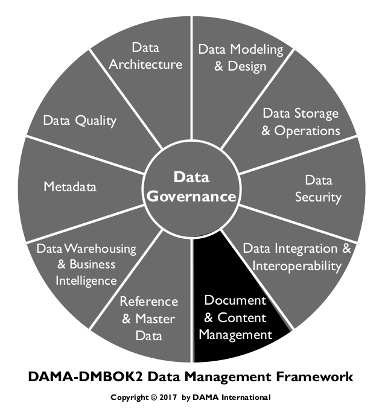
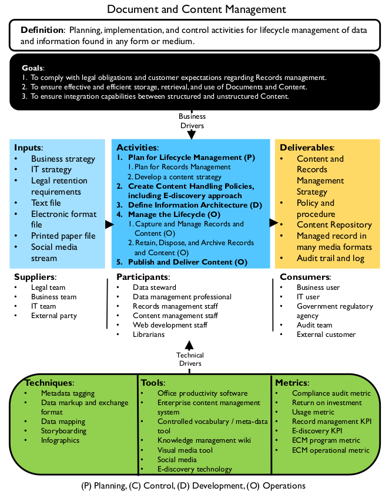
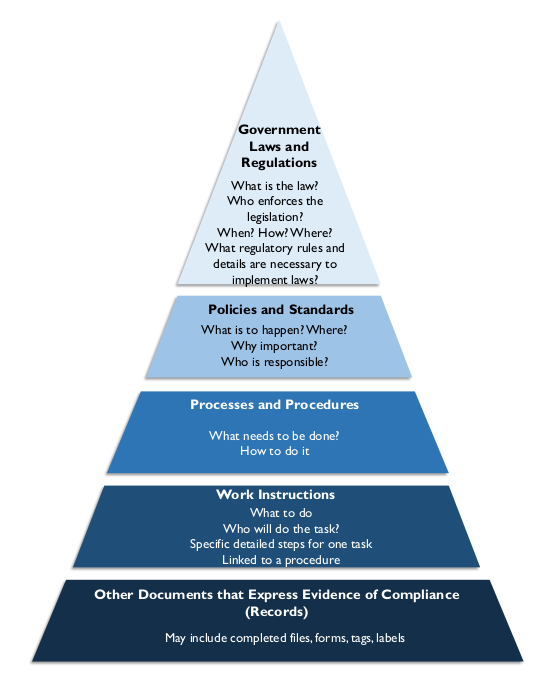
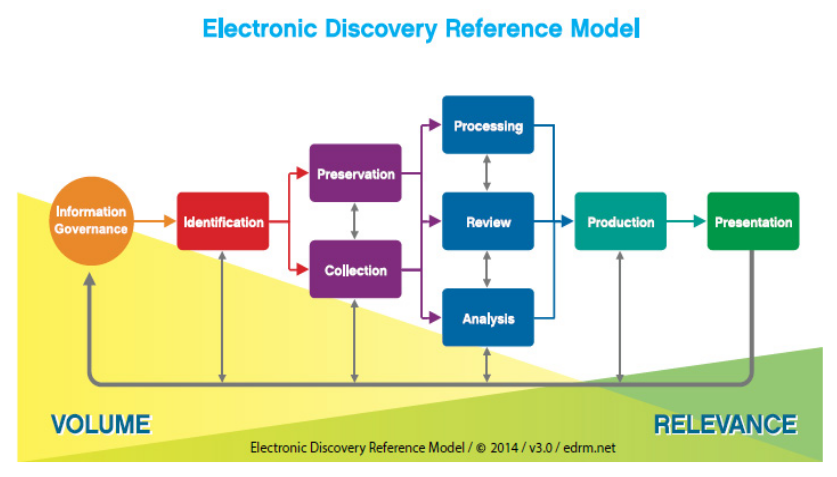
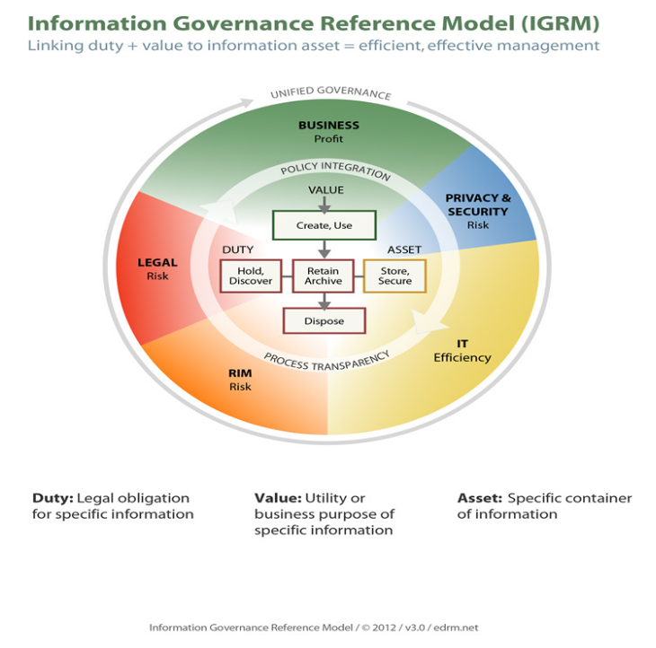

# Document and Content Management

Document and Content Management entails controlling the capture, storage, access, and use of data and information stored outside relational databases. [^44] Its focus is on maintaining the integrity of and enabling access to documents and other unstructured or semi-structured information which makes it roughly equivalent to data operations management for relational databases. However, it also has strategic drivers. In many organizations, unstructured data has a direct relationship to structured data. Management decisions about such content should be applied consistently. In addition, as are other types of data, documents and unstructured content are expected to be secure and of high quality. Ensuring security and quality requires governance, reliable architecture, and well-managed Metadata.

Figure 71 Context Diagram: Documents and Content

### 1.1 Business Drivers

The primary business drivers for document and content management include regulatory compliance, the ability to respond to litigation and e-discovery requests, and business continuity requirements. Good records management can also help organizations become more efficient. Well-organized, searchable websites that result from effective management of ontologies and other structures that facilitate searching help improve customer and employee satisfaction.

Laws and regulations require that organizations maintain records of certain kinds of activities. Most organizations also have policies, standards, and best practices for record keeping. Records include both paper documents and electronically stored information (ESI). Good records management is necessary for business continuity. It also enables an organization to respond in the case of litigation.

E-discovery is the process of finding electronic records that might serve as evidence in a legal action. As the technology for creating, storing, and using data has developed, the volume of ESI has increased exponentially. Some of this data will undoubtedly end up in litigation or regulatory requests.

The ability of an organization to respond to an e-discovery request depends on how proactively it has managed records such as email, chats, websites, and electronic documents, as well as raw application data and Metadata. Big Data has become a driver for more efficient e-discovery, records retention, and strong information governance.

Gaining efficiencies is a driver for improving document management. Technological advances in document management are helping organizations streamline processes, manage workflow, eliminate repetitive manual tasks, and enable collaboration. These technologies have the additional benefits of enabling people to locate, access, and share documents more quickly. They can also prevent documents from being lost. This is very important for e-discovery. Money is also saved by freeing up file cabinet space and reducing document handling costs.

### 1.2 Goals and Principles

The goals of implementing best practices around Document and Content Management include:

* Ensuring effective and efficient retrieval and use of data and information in unstructured formats
* Ensuring integration capabilities between structured and unstructured data
* Complying with legal obligations and customer expectations 

Management of Documents and Content follows these guiding principles:

* Everyone in an organization has a role to play in protecting the organization’s future. Everyone must create, use, retrieve, and dispose of records in accordance with the established policies and procedures.
* Experts in the handling of records and content should be fully engaged in policy and planning. Regulatory and best practices can vary significantly based on industry sector and legal jurisdiction.

Even if records management professionals are not available to the organization, everyone can be trained to understand the challenges, best practices, and issues. Once trained, business stewards and others can collaborate on an effective approach to records management.

In 2009, ARMA International, a not-for-profit professional association for managing records and information, published a set of Generally Acceptable Recordkeeping Principles® (GARP) [^45] that describes how business records should be maintained. It also provides a recordkeeping and information governance framework with associated metrics. The first sentence of each principle is stated below. Further explanation can be found on the ARMA website.

* Principle of Accountability: An organization shall assign a senior executive to appropriate individuals, adopt policies and processes to guide staff, and ensure program auditability.
* Principle of Integrity: An information governance program shall be constructed so the records and information generated or managed by or for the organization have a reasonable and suitable guarantee of authenticity and reliability.
* Principle of Protection: An information governance program shall be constructed to ensure a reasonable level of protection to information that is personal or that otherwise requires protection.
* Principle of Compliance: An information governance program shall be constructed to comply with applicable laws and other binding authorities, as well as the organization’s policies.
* Principle of Availability: An organization shall maintain its information in a manner that ensures timely, efficient, and accurate retrieval of its information.
* Principle of Retention: An organization shall retain its information for an appropriate time, taking into account all operational, legal, regulatory and fiscal requirements, and those of all relevant binding authorities.
* Principle of Disposition: An organization shall provide secure and appropriate disposition of information in accordance with its policies, and, applicable laws, regulations and other binding authorities.
* Principle of Transparency: An organization shall document its policies, processes and activities, including its information governance program, in a manner that is available to and understood by staff and appropriate interested parties.

### 1.3 Essential Concepts

#### 1.3.1 Content

A document is to content what a bucket is to water: a container. Content refers to the data and information inside the file, document, or website. Content is often managed based on the concepts represented by the documents, as well as the type or status of the documents. Content also has a lifecycle. In its completed form, some content becomes a matter of record for an organization. Official records are treated differently from other content.

##### 1.3.1.1 Content Management

Content management includes the processes, techniques, and technologies for organizing, categorizing, and structuring information resources so that they can be stored, published, and reused in multiple ways.

The lifecycle of content can be active, with daily changes through controlled processes for creation and modification; or it can be more static with only minor, occasional changes. Content may be managed formally (strictly stored, managed, audited, retained or disposed of) or informally through ad hoc updates.

Content management is particularly important in websites and portals, but the techniques of indexing based on keywords and organizing based on taxonomies can be applied across technology platforms. When the scope of content management includes the entire enterprise, it is referred to as Enterprise Content Management (ECM).

##### 1.3.1.2 Content Metadata

Metadata is essential to managing unstructured data, both what is traditionally thought of as content and documents and what we now understand as ‘Big Data’. Without Metadata, it is not possible to inventory and organize content. Metadata for unstructured data content is based on:

* Format: Often the format of the data dictates the method to access the data (such as electronic index for electronic unstructured data).
* Search-ability: Whether search tools already exist for use with related unstructured data. Self-documentation: Whether the Metadata is self-documenting (as in filesystems). In this case, development is minimal, as the existing tool is simply adopted.
* Existing patterns: Whether existing methods and patterns can be adopted or adapted (as in library catalogs).
* Content subjects: The things people are likely to be looking for.
* Requirements: Need for thoroughness and detail in retrieval (as in the pharmaceutical or nuclear industry [^46]). Therefore, detailed Metadata at the content level might be necessary, and a tool capable of content tagging might be necessary.

Generally, the maintenance of Metadata for unstructured data becomes the maintenance of a cross-reference between various local patterns and the official set of enterprise Metadata. Records managers and Metadata professionals recognize long-term embedded methods exist throughout the organization for documents, records, and other content that must be retained for many years, but that these methods are often costly to re-organize. In some organizations, a centralized team maintains cross-reference patterns between records management indexes, taxonomies, and even variant thesauri.

##### 1.3.1.3 Content Modeling

Content modeling is the process of converting logical content concepts into content types, attributes, and data types with relationships. An attribute describes something specific and distinguishable about the content to which it relates. A data type restricts the type of data the attribute may hold, enabling validation and processing.

Metadata management and data modeling techniques are used in the development of a content model. There are two levels of content modeling. The first is at the information product level, which creates an actual deliverable like a website. The second is at the component level, which further details the elements that make up the information product model. The level of detail in the model depends on the granularity desired for reuse and structure.

Content models support the content strategy by guiding content creation and promoting reuse. They support adaptive content, which is format-free and device-independent. The models become the specifications for the content implemented in such structures such as XML schema definition (XSDs), forms, or stylesheets.

##### 1.3.1.4 Content Delivery Methods

Content needs to be modular, structured, reusable, and device- and platform- independent. Delivery methods include web pages, print, and mobile apps as well as eBooks with interactive video and audio. Converting content into XML early in the workflow supports reuse across different media channels.

Content delivery systems are ‘push’, ‘pull’, or interactive.

* Push: In a push delivery system, users choose the type of content delivered to them on a pre- determined schedule. Syndication involves one party creating the content published in many places. Really Simple Syndication (RSS) is an example of a push content delivery mechanism. It distributes content (i.e., a feed) to syndicate news and other web content upon request.
* Pull: In a pull delivery system, users pull the content through the Internet. An example of a pull system is when shoppers visit online retail stores.
* Interactive: Interactive content delivery methods, such as third-party electronic point of sale (EPOS) apps or customer facing websites (e.g., for enrollment), need to exchange high volumes of real-time data between enterprise applications. Options for sharing data between applications include Enterprise Application Integration (EAI), Changed Data Capture, Data Integration and EII. (See Chapter 8.)

#### 1.3.2 Controlled Vocabularies

A controlled vocabulary is a defined list of explicitly allowed terms used to index, categorize, tag, sort, and retrieve content through browsing and searching. A controlled vocabulary is necessary to systematically organize documents, records, and content. Vocabularies range in complexity from simple lists or pick lists, to the synonym rings or authority lists, to taxonomies, and, the most complex, thesauri and ontologies. An example of a controlled vocabulary is the Dublin Core, used to catalog publications.

Defined policies control over who adds terms to the vocabulary (e.g., a taxonomist or indexer, or librarian). Librarians are particularly trained in the theory and development of controlled vocabularies. Users of the list may only apply terms from the list for its scoped subject area. (See Chapter 10.)

Ideally, controlled vocabularies should be aligned with the entity names and definitions in an enterprise conceptual data model. A bottom up approach to collecting terms and concepts is to compile them in a folksonomy, which is a collection of terms and concepts obtained through social tagging.

Controlled vocabularies constitute a type of Reference Data. Like other Reference Data, their values and definitions need to be managed for completeness and currency. They can also be thought of as Metadata, as they help explain and support the use of other data. They are described in this chapter because Document and Content Management are primary use cases for controlled vocabularies.

##### 1.3.2.1 Vocabulary Management

Because vocabularies evolve over time, they require management. ANSI/NISO Z39.19-2005 is an American standard, which provides guidelines for the Construction, Format, and Management of Monolingual Controlled Vocabularies, describes vocabulary management as a way to “to improve the effectiveness of information storage and retrieval systems, web navigation systems, and other environments that seek to both identify and locate desired content via some sort of description using language. The primary purpose of vocabulary control is to achieve consistency in the description of content objects and to facilitate retrieval.” [^47]

Vocabulary management is the function of defining, sourcing, importing, and maintaining any given vocabulary. Key questions to enable vocabulary management focus on uses, consumers, standards, and maintenance:

* What information concepts will this vocabulary support?
* Who is the audience for this vocabulary? What processes do they support? What roles do they play?
* Why is the vocabulary necessary? Will it support an application, content management, or analytics?
* What decision-making body is responsible for designating preferred terms?
* What existing vocabularies do different groups use to classify this information? Where are they located? How were they created? Who are their subject matter experts? Are there any security or privacy concerns for any of them?
* Is there an existing standard that can fulfill this need? Are there concerns of using an external standard vs. internal? How frequently is the standard updated and what is the degree of change of each update? Are standards accessible in an easy to import / maintain format, in a cost-efficient manner?

The results of this assessment will enable data integration. They will also help to establish internal standards, including associated preferred vocabulary through term and term relationship management functions.

If this kind of assessment is not done, preferred vocabularies would still be defined in an organization, except they would be done in silos, project by project, lead to a higher cost of integration and higher chances of data quality issues. (See Chapter 13.)

##### 1.3.2.2 Vocabulary Views and Micro-controlled Vocabulary

A vocabulary view is a subset of a controlled vocabulary, covering a limited range of topics within the domain of the controlled vocabulary. Vocabulary views are necessary when the goal is to use a standard vocabulary containing a large number of terms, but not all terms are relevant to some consumers of the information. For example, a view that only contains terms relevant to a Marketing Business Unit would not contain terms relevant only to Finance.

Vocabulary views increase information’s usability by limiting the content to what is appropriate to the users. Construct a vocabulary view of preferred vocabulary terms manually, or through business rules that act on preferred vocabulary term data or Metadata. Define rules for which terms are included in each vocabulary view.

A micro-controlled vocabulary is a vocabulary view containing highly specialized terms not present in the general vocabulary. An example of a micro-controlled vocabulary is a medical dictionary with subsets for medical disciplines. Such terms should map to the hierarchical structure of the broad controlled vocabulary. A micro-controlled vocabulary is internally consistent with respect to relationships among terms.

Micro-controlled vocabularies are necessary when the goal is to take advantage of a standard vocabulary, but the content is not sufficient and there is a need to manage additions/extensions for a specific group of information consumers. Building a micro-controlled vocabulary starts with the same steps as a vocabulary view, but it also includes addition or association of additional preferred terms that are differentiated from the pre-existing preferred terms by indicating a different source.

##### 1.3.2.3 Term and Pick Lists

Lists of terms are just that: lists. They do not describe relationships between the terms. Pick lists, web pull-down lists, and lists of menu choices in information systems use term lists. They provide little or no guidance to the user, but they help to control ambiguity by reducing the domain of values.

Pick lists are often buried in applications. Content management software can help transform pick lists and controlled vocabularies into pick lists searchable from the home page. These pick lists are managed as faceted taxonomies inside the software.

##### 1.3.2.4 Term Management

The standard ANSI/NISO Z39.19-2005 defines a term as “One or more words designating a concept.” [^48] Like vocabularies, individual terms also require management. Term Management includes specifying how terms are initially defined and classified and how this information is maintained once it starts being used in different systems. Terms should be managed through a governance processes. Stewards may need to arbitrate to ensure stakeholder feedback is accounted for before terms are changed. Z39.19 defines a preferred term as one of two or more synonyms or lexical variants selected as a term for inclusion in a controlled vocabulary.

Term management includes establishing relationships between terms within a controlled vocabulary. There are three types of relationships:

* Equivalent term relationship: A relationship between or among terms in a controlled vocabulary that leads to one or more terms to use instead of the term from which the cross-reference is made. This is the most commonly used term mapping in IT functions, indicating a term or value from one system or vocabulary is the same as another, so integration technologies can perform their mapping and standardization.
* Hierarchical relationship: A relationship between or among terms in a controlled vocabulary that depicts broader (general) to narrower (specific) or whole-part relationships.
* Related term relationship: A term that is associatively but not hierarchically linked to another term in a controlled vocabulary.

##### 1.3.2.5 Synonym Rings and Authority Lists

A synonym ring is a set of terms with roughly equivalent meaning. A synonym ring allows users who search on one of the terms to access content related to any of the terms. The manual development of synonym rings is for retrieval, not for indexing. They offer synonym control, and treat synonyms and near synonymous terms equally. Usage occurs where the indexing environment has an uncontrolled vocabulary or where there is no indexing. Search engines and different Metadata registries have synonym rings (See Chapter 13.) They can be difficult to implement on user interfaces.

An authority list is a controlled vocabulary of descriptive terms designed to facilitate retrieval of information within a specific domain or scope. Term treatment is not equal as it is within a synonym ring; instead, one term is preferred and the others are variants. An authority file cross-references synonyms and variants for each term to guide the user from a non-preferred to a preferred term. The list may or may not contain definitions of these terms. Authority lists should have designated managers. They may have structure. An example is the US Library of Congress’ Subject Headings. (See Section 1.3.2.1.)

##### 1.3.2.6 Taxonomies

Taxonomy is an umbrella term referring to any classification or controlled vocabulary. The best-known example of taxonomy is the classification system for all living things developed by the Swedish biologist Linnaeus.

In content management, a taxonomy is a naming structure containing a controlled vocabulary used for outlining topics and enabling navigation and search systems. Taxonomies help reduce ambiguity and control synonyms. A hierarchical taxonomy may contain different types of parent/child relationships useful for both indexers and searchers. Such taxonomies are used to create drill-down type interfaces.

Taxonomies can have different structures:

* A flat taxonomy has no relationships among the set of controlled categories. All the categories are equal. This is similar to a list; for example, a list of countries.
* A hierarchical taxonomy is a tree structure where nodes are related by a rule. A hierarchy has at least two levels and is bi-directional. Moving up the hierarchy expands the category; moving down refines the category. An example is geography, from continent down to street address.
* A polyhierarchy is a tree-like structure with more than one node relation rule. Child nodes may have multiple parents. Those parents may also share grandparents. As such, the traversal paths can be complicated and care must be taken to avoid potential invalid traversals: up the tree from a node that relates to the parent, but not to one of the grandparents. Complicated polyhierarchy structures may be better served with a facet taxonomy instead.
* A facet taxonomy looks like a star where each node is associated with the center node. Facets are attributes of the object in the center. An example is Metadata, where each attribute (creator, title, access rights, keywords, version, etc.) is a facet of a content object.
* A network taxonomy uses both hierarchical and facet structures. Any two nodes in network taxonomy establish linkages based on their associations. An example is a recommender engine (…if you liked that, you might also like this…). Another example is a thesaurus.

With the amount of data being generated, even with the best-defined taxonomies require automated flagging, correction, and routing rules. If taxonomies are not maintained, they will be underutilized or will produce incorrect results. This creates the risk that entities and staff governed by applicable regulations will be out of compliance. For example, in a financial taxonomy, the preferred term may be ‘Postemployment’. Content may come from systems that classify it as ‘Post-Employment’, ‘Post Employment’, or even Post Retirement. To support such cases, appropriate synonym ring and related term relationships should be defined (US GAAP, 2008).

Organizations develop their own taxonomies to formalize collective thinking about topics specific to their work. Taxonomies are particularly important for presenting and finding information on websites, as many search engines rely on exact word matches and can only find items tagged or using the same words in the same way.

##### 1.3.2.7 Classification Schemes and Tagging

Classification schemes are codes that represent controlled vocabulary. These schemes are often hierarchical and may have words associated with them, such as the Dewey Decimal System and the US Library of Congress Classification (main classes and subclasses). A number based taxonomy, the Dewey Decimal System is also a multi-lingual expression for subject coding, since numbers can be ‘decoded’ into any language.

Folksonomies are classification schemes for online content terms and names obtained through social tagging. Individual users and groups use them to annotate and categorize digital content. They typically do not have hierarchical structures or preferred terms. Folksonomies are not usually considered authoritative or applied to document indexing because experts do not compile them. However, because they directly reflect the vocabulary of users, they offer the potential to enhance information retrieval. Folksonomy terms can be linked to structured controlled vocabularies.

##### 1.3.2.8 Thesauri

A thesaurus is type of controlled vocabulary used for content retrieval. It combines characteristics of synonym lists and taxonomies. A thesaurus provides information about each term and its relationship to other terms. Relationships are either hierarchical (parent/child or broad/narrower), associative (‘see also’) or equivalent (synonym or used/used from). Synonyms must be acceptably equivalent in all context scenarios. A thesaurus may also include definitions, citations, etc.

Thesauri can be used to organize unstructured content, uncover relationships between content from different media, improve website navigation, and optimize search. When a user inputs a term, a system can use a non-exposed thesaurus (one not directly available to the user) to automatically direct the search to a similar term. Alternatively, the system can suggest related terms with which a user could continue the search.

Standards that provide guidance on creating thesauri include ISO 25964 and ANSI/NISO Z39.19. 10.2.2.1.5 Ontologies.

##### 1.3.2.9 Ontology

An ontology is a type of taxonomy that represents a set of concepts and their relationships within a domain. Ontologies provide the primary knowledge representation in the Semantic Web, and are used in the exchange of information between Semantic Web applications. [^49]

Ontology languages such as Resource Description Framework Schema (RDFS) are used to develop ontologies by encoding the knowledge about specific domains. They may include reasoning rules to support processing of that knowledge. OWL (Web Ontology Language), an extension to RDFS, is a formal syntax for defining ontologies.

Ontologies describe classes (concepts), individuals (instances), attributes, relations, and events. An ontology can be a collection of taxonomies and thesauri of common vocabulary for knowledge representation and exchange of information. Ontologies often relate to a taxonomic hierarchy of classes and definitions with the subsumption relation, such as decomposing intelligent behavior into many simpler behavior modules and then layers.

There are two key differences between a taxonomy (like a data model) and an ontology:

* A taxonomy provides data content classifications for a given concept area. A data model specifically calls out the entity to which an attribute belongs and the valid for that attribute. In an ontology, though, entity, attribute, and content concepts can be completely mixed. Differences are identified through Metadata or other relationships.
* In a taxonomy or data model, what is defined is what is known – and nothing else. This is referred to as a closed-world assumption. In an ontology, possible relationships are inferred based on the nature of existing relationships, so something that is not explicitly declared can be true. This is referred to as the open-world assumption.

While taxonomy management evolved under the Library Sciences, today the art and science of taxonomy and ontology management fall under the semantics management space. (See Chapter 10.)

Because the process of modeling ontologies is somewhat subjective, it is important to avoid common pitfalls that cause ambiguity and confusion:

* Failure to distinguish between an instance-of relationship and a subclass-of relationship
* Modeling events as relations
* Lack of clarity and uniqueness of terms
* Modeling roles as classes
* Failure to reuse
* Mixing semantics of modeling language and concepts
* Use of a web-based, platform-independent tool (e.g., OOPS!) for ontology validation helps with diagnosis and repair of pitfalls

#### 1.3.3 Documents and Records

Documents are electronic or paper objects that contain instructions for tasks, requirements for how and when to perform a task or function, and logs of task execution and decisions. Documents can communicate and share information and knowledge. Examples of documents include procedures, protocols, methods, and specifications.

Only a subset of documents will be designated as records. Records provide evidence that actions were taken and decisions were made in keeping with procedures; they can serve as evidence of the organization’s business activities and regulatory compliance. People usually create records, but instruments and monitoring equipment could also provide data to generate records automatically.

##### 1.3.3.1 Document Management

Document management encompasses the processes, techniques, and technologies for controlling and organizing documents and records throughout their lifecycle. It includes storage, inventory, and control, for both electronic and paper documents. More than 90% of the documents created today are electronic. While paperless documents are becoming more widely used, the world is still full of historical paper documents.

In general, document management concerns files, with little attention to file content. The information content within a file may guide how to manage that file, but document management treats the file as a single entity.

Both market and regulatory pressures put focus on records retention schedules, location, transport, and destruction. For example, some data about individuals cannot cross international boundaries.

Regulations and statutes, such as the U.S. Sarbanes-Oxley Act and E-Discovery Amendments to the Federal Rules of Civil Procedure and Canada’s Bill 198, are now concerns of corporate compliance officers who push for standardization of records management practices within their organizations. Managing the lifecycle of documents and records includes:

* Inventory: Identification of existing and newly created documents / records.
* Policy: Creation, approval, and enforcement of documents / records policies, including a document / records retention policy.
* Classification of documents / records.
* Storage: Short- and long-term storage of physical and electronic documents / records.
* Retrieval and Circulation: Allowing access to and circulation of documents / records in accordance with policies, security and control standards, and legal requirements.
* Preservation and Disposal: Archiving and destroying documents / records according to organizational needs, statutes, and regulations.

Data management professionals are stakeholders in decisions about document classification and retention. They must support consistency between the base structured data and specific unstructured data. For example, if finished output reports are deemed appropriate historic documentation, the structured data in an OLTP or warehousing environment may be relieved of storing the report’s base data.

Documents are often developed within a hierarchy with some documents more detailed than others are. Figure 72, based on text from ISO 9000 Introduction and Support Package: Guidance on the Documentation Requirements of ISO 9001, Clause 4.2, depicts a documentation-centric paradigm, appropriate for government or the military. ISO 9001 describes the minimal components of a basic quality management system. Commercial entities may have a different document hierarchies or flows to support business practices.

##### 1.3.3.2 Records Management

Document management includes records management. Managing records has special requirements. [^50] Records management includes the full lifecycle: from record creation or receipt through processing, distribution, organization, and retrieval, to disposition. Records can be physical (e.g., documents, memos, contracts, reports or microfiche); electronic (e.g., email content, attachments, and instant messaging); content on a website; documents on all types of media and hardware; and data captured in databases of all kinds. Hybrid records, such as aperture cards (paper record with a microfiche window imbedded with details or supporting material), combine formats. A Vital Record is type a record required to resume an organization’s operations the event of a disaster.

Figure 72 Document Hierarchy based on ISO 9001-4.2

Trustworthy records are important not only for record keeping but also for regulatory compliance. Having signatures on the record contributes to a record’s integrity. Other integrity actions include verification of the event (i.e., witnessing in real time) and double-checking the information after the event.

Well-prepared records have characteristics such as:

* Content: Content must be accurate, complete and truthful.
* Context: Descriptive information (Metadata) about the record’s creator, date of creation, or relationship to other records should be collected, structured and maintained with the record at the time of record creation.
* Timeliness: A record should be created promptly after the event, action or decision occurs.
* Permanency: Once they are designated as records, records cannot be changed for the legal length of their existence.
* Structure: The appearance and arrangement of a record’s content should be clear. They should be recorded on the correct forms or templates. Content should be legible, terminology should be used consistently.

Many records exist in both electronic and paper formats. Records Management requires the organization to know which copy (electronic or paper) is the official ‘copy of record’ to meet record keeping obligations. Once the copy of record is determined, the other copy can be safely destroyed.

##### 1.3.3.3 Digital Asset Management

Digital Asset Management (DAM) is process similar to document management that focuses on the storage, tracking and use of rich media documents like video, logos, photographs, etc.

#### 1.3.4 Data Map

A Data Map is an inventory of all ESI data sources, applications, and IT environments that includes the owners of the applications, custodians, relevant geographical locations, and data types.

#### 1.3.5 E-discovery

Discovery is a legal term that refers to pre-trial phase of a lawsuit where both parties request information from each other to find facts for the case and to see how strong the arguments are on either side. The US Federal Rules of Civil Procedure (FRCP) have governed the discovery of evidence in lawsuits and other civil cases since 1938. For decades, paper-based discovery rules were applied to e-discovery. In 2006, amendments to the FRCP accommodated the discovery practice and requirements of ESI in the litigation process.

Other global regulations have requirements specific to the ability of an organization to produce electronic evidence. Examples include the UK Bribery Act, Dodd-Frank Act, Foreign Account Tax Compliance Act (FATCA), Foreign Corrupt Practices Act, EU Data Protection Regulations and Rules, global anti-trust regulations, sector-specific regulations, and local court procedural rules.

Electronic documents usually have Metadata (which may not be available for paper documents) that plays an important part in evidence. Legal requirements come from the key legal processes such as e-discovery, as well as data and records retention practices, the legal hold notification (LHN) process, and legally defensible disposition practices. LHN includes identifying information that may be requested in a legal proceeding, locking that data or document down to prevent editing or deletion, and then notifying all parties in an organization that the data or document in question is subject to a legal hold.

Figure 73 depicts a high-level Electronic Discovery Reference Model developed by EDRM, a standards and guidelines organization for e-discovery. This framework provides an approach to e-discovery that is handy for people involved in identifying how and where the relevant internal data is stored, what retention policies apply, what data is not accessible, and what tools are available to assist in the identification process.

Figure 73 Electronic Discovery Reference Model [^51]

The EDRM model assumes that data or information governance is in place. The model includes eight e-discovery phases that can be iterative. As e-discovery progresses, the volume of discoverable data and information is greatly reduced as their relevance is greatly increased.

The first phase, Identification, has two sub-phases: Early Case Assessment and Early Data Assessment (not depicted in the diagram). In Early Case Assessment, the legal case itself is assessed for pertinent information, called descriptive information or Metadata (e.g., keywords, date ranges, etc.). In Early Data Assessment, the types and location of data relevant to the case is assessed. Data assessment should identify policies related to the retention or destruction of relevant data so that ESI can be preserved. Interviews should be held with records management personnel, data custodians or data owners, and information technology personnel to obtain pertinent information. In addition, the involved personnel need to understand the case background, legal hold, and their role in the litigation.

The next phases in the model are the Preservation and Collection. Preservation ensures that the data that has been identified as potentially relevant is placed in a legal hold so it is not destroyed. Collection includes the acquisition and transfer of identified data from the company to their legal counsel in a legally defensible manner.

During the Processing phase data is de-duplicated, searched, and analyzed to determine which data items will move forward to the Review phase. In the Review phase, documents are identified to be presented in response to the request. Review also identifies privileged documents that will be withheld. Much of the selection depends on Metadata associated with the documents. Processing takes place after the Review phase because it addresses content analysis to understand the circumstances, facts and potential evidence in litigation or investigation and to enhance the search and review processes.

Processing and Review depend on analysis, but Analysis is called out as a separate phase with a focus on content. The goal of content analysis is to understand the circumstances, facts, and potential evidence in litigation or investigation, in order to formulate a strategy in response to the legal situation.

In the Production phase, data and information are turned over to opposing counsel, based on agreed-to specifications. Original sources of information may be files, spreadsheets, email, databases, drawings, photographs, data from proprietary applications, website data, voicemail, and much more. The ESI can be collected, processed and output to a variety of formats. Native production retains the original format of the files. Near-native production alters the original format through extraction and conversion. ESI can be produced in an image, or near paper, format. Fielded data is Metadata and other information extracted from native files when ESI is processed and produced in a text-delimited file or XML load file. The lineage of the materials provided during the Production phase is important, because no one wants to be accused of altering data or information provided.

Displaying the ESI at depositions, hearings, and trials is part of the Presentation phase. The ESI exhibits can be presented in paper, near paper, near-native and native formats to support or refute elements of the case. They may be used to elicit further information, validate existing facts or positions, or persuade an audience.

#### 1.3.6 Information Architecture

Information Architecture is the process of creating structure for a body of information or content. It includes the following components:

* Controlled vocabularies
* Taxonomies and ontologies
* Navigation maps
* Metadata maps
* Search functionality specifications
* Use cases
* User flows

The information architecture and the content strategy together describe the ‘what’ – what content will be managed in a system. The design phases describe ‘how’ the content management strategy will be implemented.

For a document or content management system, the information architecture identifies the links and relationships between documents and content, specifies document requirements and attributes, and defines the structure of content in a document or content management system. Information architecture is central to developing effective websites. A storyboard provides a blueprint for a web project. It serves as an outline of the design approach, defines the elements that need to go on each web page, and shows the navigation and information flow of how the pages are to work together. This enables development of the navigational models, menus, and other components necessary for the management and use of the site.

#### 1.3.7 Search Engine

A search engine is software that searches for information based on terms and retrieves websites that have those terms within their content. One example is Google. Search functionality requires several components: search engine software proper, spider software that roams the Web and stores the Uniform Resource Locators (URLs) of the content it finds, indexing of the encountered keywords and text, and rules for ranking.

#### 1.3.8 Semantic Model

Semantic modeling is a type of knowledge modeling that describes a network of concepts (ideas or topics of concern) and their relationships. Incorporated into information systems, semantic models enable users to ask questions of the information in a non-technical way. For example, a semantic model can map database tables and views to concepts that are meaningful to business users.

Semantic models contain semantic objects and bindings. Semantic objects are things represented in the model. They can have attributes with cardinality and domains, and identifiers. Their structures can be simple, composite, compound, hybrid, association, parent / subtype, or archetype / version. Bindings represent associations or association classes in UML. These models help to identify patterns and trends and to discover relationships between pieces of information that might otherwise appear disparate. In doing so, they help enable integration of data across different knowledge domains or subject areas. Ontologies and controlled vocabularies are critical to semantic modeling.

Data integration uses ontologies in several different ways. A single ontology could be the reference model. If there are multiple data sources, then each individual data source is modeled using an ontology and later mapped to the other ontologies. The hybrid approach uses multiple ontologies that integrate with a common overall vocabulary.

#### 1.3.9 Semantic Search

Semantic searching focuses on meaning and context rather than predetermined keywords. A semantic search engine can use artificial intelligence to identify query matches based on words and their context. Such a search engine can analyze by location, intent, word variations, synonyms, and concept matching.

Requirements for semantic search involve figuring out what users want which means thinking like the users. If users want search engines to work like natural language, most likely they will want web content to behave this way. The challenge for marketing organizations is to incorporated associations and keywords that are relevant to their users as well as their brands.

Web content optimized for semantics incorporates natural key words, rather than depending on rigid keyword insertion. Types of semantic keywords include: Core keywords that contain variations; thematic keywords for conceptually related terms; and stem keywords that anticipate what people might ask. Content can be further optimized through content relevancy and ‘shareworthiness’, and sharing content through social media integration.

Users of Business Intelligence (BI) and analytics tools often have semantic search requirements. The BI tools need to be flexible so that business users can find the information they need for analysis, reports and dashboards. Users of Big Data have a similar need to find common meaning in data from disparate formats.

#### 1.3.10 Unstructured Data

It is estimated that as much as 80% of all stored data is maintained outside of relational databases. This unstructured data does not have a data model that enables users to understand its content or how it is organized; it is not tagged or structured into rows and columns. The term unstructured is somewhat misleading, as there often is structure in documents, graphics, and other formats, for instance, chapters or headers. Some refer to data stored outside relational databases as non-tabular or semi-structured data. No single term adequately describes the vast volume and diverse format of electronic information that is created and stored in today’s world.

Unstructured data is found in various electronic formats: word processing documents, electronic mail, social media, chats, flat files, spreadsheets, XML files, transactional messages, reports, graphics, digital images, microfiche, video recordings, and audio recordings. An enormous amount of unstructured data also exists in paper files.

The fundamental principles of data management apply to both structured and unstructured data. Unstructured data is a valuable corporate asset. Storage, integrity, security, content quality, access, and effective use guide the management of unstructured data. Unstructured data requires data governance, architecture, security Metadata, and data quality.

Unstructured and semi-structured data have become more important to data warehousing and Business Intelligence. Data warehouses and their data models may include structured indexes to help users find and analyze unstructured data. Some databases include the capacity to handle URLs to unstructured data that perform as hyperlinks when retrieved from the database table. Unstructured data in data lakes is described in Chapter 14.

#### 1.3.11 Workflow

Content development should be managed through a workflow that ensures content is created on schedule and receives proper approvals. Workflow components can include the creation, processing, routing, rules, administration, security, electronic signature, deadline, escalation (if problems occur), reporting and delivery. It should be automated through the use of a content management system (CMS) or a standalone system, rather than manual processes.

A CMS has the added benefit of providing version control. When content is checked into a CMS, it will be timestamped, assigned a version number, and tagged with the name of the person who made the updates. The workflow needs to be repeatable, ideally containing process steps common across a variety of content. A set of workflows and templates may be necessary if there are significant differences between content types. Alignment of the stakeholders and distribution points (including technology) is important. Deadlines need to be refined to improve workflows, otherwise you can quickly find your work flows are out of date or there is confusion over which stakeholder is responsible for which piece.

## 2. Activities

### 2.1 Plan for Lifecycle Management

The practice of document management involves planning for a document’s lifecycle, from its creation or receipt, through its distribution, storage, retrieval, archiving and potential destruction. Planning includes developing classification / indexing systems and taxonomies that enable storage and retrieval of documents. Importantly, lifecycle planning requires creating policy specifically for records.

First, identify the organizational unit responsible for managing the documents and records. That unit coordinates the access and distribution internally and externally, and integrates best practices and process flows with other departments throughout the organization. It also develops an overall document management plan that includes a business continuity plan for vital documents and records. The unit ensures it follows retention policies aligned with company standards and government regulations. It ensures that records required for long-term needs are properly archived and that others are properly destroyed at the end of their lifecycle in accordance with organizational requirements, statutes, and regulations.

#### 2.1.1 Plan for Records Management

Records management starts with a clear definition of what constitutes a record. The team that defines records for a functional area should include SMEs from that area along with people who understand the systems that enable management of the records.

Managing electronic records requires decisions about where to store current, active records and how to archive older records. Despite the widespread use of electronic media, paper records are not going away in the near term. A records management approach should account for paper records and unstructured data as well as structured electronic records.

#### 2.1.2 Develop a Content Strategy

Planning for content management should directly support the organization’s approach to providing relevant and useful content in an efficient and comprehensive manner. A plan should account for content drivers (the reasons content is needed), content creation and delivery. Content requirements should drive technology decisions, such as the selection of a content management system.

A content strategy should start with an inventory of current state and a gap assessment. The strategy defines how content will be prioritized, organized, and accessed. Assessment often reveals ways to streamline production, workflow, and approval processes for content creation. A unified content strategy emphasizes designing modular content components for reusability rather than creating standalone content.

Enabling people to find different types of content through Metadata categorization and search engine optimization (SEO) is critical to any content strategy. Provide recommendations on content creation, publication, and governance. Policies, standards, and guidelines that apply to content and its lifecycle are useful to sustain and evolve an organization’s content strategy.

#### 2.1.3 Create Content Handling Policies

Policies codify requirements by describing principles, direction, and guidelines for action. They help employees understand and comply with the requirements for document and records management.

Most document management programs have policies related to:

* Scope and compliance with audits
* Identification and protection of vital records
* Purpose and schedule for retaining records (a.k.a retention schedule)
* How to respond to information hold orders (special protection orders); these are requirements for retaining information for a lawsuit, even if retention schedules have expired
* Requirements for onsite and offsite storage of records
* Use and maintenance of hard drive and shared network drives
* Email management, addressed from content management perspective
* Proper destruction methods for records (e.g., with pre-approved vendors and receipt of destruction certificates)

##### 2.1.3.1 Social Media Policies

In addition to these standard topics, many organizations are developing policies to respond to new media. For example, an organization has to define if social media content posted on Facebook, Twitter, LinkedIn, chat rooms, blogs, wikis, or online forums constitutes a record, especially if employees post in the course of conducting business using organizational accounts.

##### 2.1.3.2 Device Access Policies

Since the pendulum is swinging towards user driven IT with BYOD (bring-your-own-devices), BYOA (bring-your-own-apps), and WYOD (wear-your-own-devices), the content and records management functions need to work with these scenarios in order to ensure compliance, security and privacy.

Policies should distinguish between informal content (e.g., Dropbox or Evernote) and formal content (e.g., contracts and agreements), in order to put controls on formal content. Policies can also provide guidance on informal content.

##### 2.1.3.3 Handling Sensitive Data

Organizations are legally required to protect privacy by identifying and protecting sensitive data. Data Security and/or Data Governance usually establish the confidentiality schemes and identify what assets are confidential or restricted. The people who produce or assemble content must apply these classifications. Documents, web pages, and other content components must be are marked as sensitive based on policies and legal requirements. Once marked, confidential data is either masked or deleted where appropriate. (See Chapter 7.)

##### 2.1.3.4 Responding to Litigation

Organizations should prepare for the possibility of litigation requests through proactive e-discovery. (Hope for the best; prepare for the worst.) They should create and manage an inventory of their data sources and the risks associated with each. By identifying data sources that may have relevant information, they can respond in a timely manner to a litigation hold notice and prevent data loss. The appropriate technologies should be deployed to automate e-discovery processes.

#### 2.1.4 Define Content Information Architecture

Many information systems such as the semantic web, search engines, web social mining, records compliance and risk management, geographic information systems (GIS), and Business Intelligence applications contain structured and unstructured data, documents, text, images, etc. Users have to submit their needs in a form understandable by the system retrieval mechanism to obtain information from these systems. Likewise, the inventory of documents and structured and unstructured data needs to be described / indexed in a format that allows the retrieval mechanism to identify the relevant matched data and information quickly. User queries may be imperfect in that they retrieve both relevant and irrelevant information, or do not retrieve all the relevant information.

Searches use either content-based indexing or Metadata. Indexing designs look at decision options for key aspects or attributes of indexes based on needs and preferences of users. They also look at the vocabulary management and the syntax for combining individual terms into headings or search statements.

Data management professionals may get involved with controlled vocabularies and terms in handling Reference Data (see Section 1.3.2.1) and Metadata for unstructured data and content. (See Chapter 12.) They should ensure that there is coordination with efforts to build controlled vocabularies, indexes, classification schemes for information retrieval, and data modeling and Metadata efforts executed as part of data management projects and applications.

### 2.2 Manage the Lifecycle

#### 2.2.1 Capture Records and Content

Capturing content is the first step to managing it. Electronic content is often already in a format to be stored in electronic repositories. To reduce the risk of losing or damaging records, paper content needs to be scanned and then uploaded to the corporate system, indexed, and stored in the repository. Use electronic signatures if possible.

When content is captured, it should be tagged (indexed) with appropriate Metadata, such as (at minimum) a document or image identifier, the data and time of capture, the title and author(s). Metadata is necessary for retrieval of the information, as well as for understanding the context of the content. Automated workflows and recognition technologies can help with the capture and ingestion process, providing audit trails.

Some social media platforms offer the capability of capturing records. Saving the social media content in a repository makes it available for review, meta tagging and classification, and management as records. Web crawlers can capture versions of websites. Web capture tools, application-programming interfaces (APIs), and RSS feeds can capture content or social media export tools. Social media records can also be captured manually or via predefined, automated workflows.

#### 2.2.2 Manage Versioning and Control

ANSI Standard 859 has three levels of control of data, based on the criticality of the data and the perceived harm that would occur if data were corrupted or otherwise unavailable: formal, revision, and custody:

* Formal control requires formal change initiation, thorough evaluation for impact, decision by a change authority, and full status accounting of implementation and validation to stakeholders
* Revision control is less formal, notifying stakeholders and incrementing versions when a change is required
* Custody control is the least formal, merely requiring safe storage and a means of retrieval

Table 15 shows a sample list of data assets and possible control levels.

*Table 15 Levels of Control for Documents per ANSI-859*

<table>
  <thead>
    <tr>
      <th>Data Asset</th>
      <th>Formal</th>
      <th>Revision</th>
      <th>Custody</th>
    </tr>
  </thead>
  <tbody>
    <tr>
      <td>Action item lists</td>
      <td></td>
      <td>X</td>
      <td></td>
    </tr>
    <tr>
      <td>Agendas</td>
      <td></td>
      <td></td>
      <td>X</td>
    </tr>
    <tr>
      <td>Audit findings</td>
      <td></td>
      <td>X</td>
      <td>X</td>
    </tr>
    <tr>
      <td>Budgets</td>
      <td>X</td>
      <td></td>
      <td></td>
    </tr>
    <tr>
      <td>DD 250s</td>
      <td></td>
      <td></td>
      <td>X</td>
    </tr>
    <tr>
      <td>Final Proposal</td>
      <td></td>
      <td></td>
      <td>X</td>
    </tr>
    <tr>
      <td>Financial data and reports</td>
      <td>X</td>
      <td>X</td>
      <td>X</td>
    </tr>
    <tr>
      <td>Human Resources data</td>
      <td></td>
      <td>X</td>
      <td></td>
    </tr>
    <tr>
      <td>Meeting minutes</td>
      <td></td>
      <td></td>
      <td>X</td>
    </tr>
    <tr>
      <td>Meeting notices and attendance lists</td>
      <td></td>
      <td>X</td>
      <td>X</td>
    </tr>
    <tr>
      <td>Project plans (including data management and configuration management plans)</td>
      <td>X</td>
      <td></td>
      <td></td>
    </tr>
    <tr>
      <td>Proposal (in process)</td>
      <td></td>
      <td>X</td>
      <td></td>
    </tr>
    <tr>
      <td>Schedules</td>
      <td>X</td>
      <td></td>
      <td></td>
    </tr>
    <tr>
      <td>Statements of Work</td>
      <td>X</td>
      <td></td>
      <td></td>
    </tr>
    <tr>
      <td>Trade studies</td>
      <td></td>
      <td>X</td>
      <td></td>
    </tr>
    <tr>
      <td>Training material</td>
      <td>X</td>
      <td>X</td>
      <td></td>
    </tr>
    <tr>
      <td>Working papers</td>
      <td></td>
      <td></td>
      <td>X</td>
    </tr>
  </tbody>
</table>

ANSI 859 recommends taking into account the following criteria when determining which control level applies to a data asset:

* Cost of providing and updating the asset
* Project impact, if changes will have significant cost or schedule consequences
* Other consequences of change to the enterprise or project
* Need to reuse the asset or earlier versions of the asset
* Maintenance of a history of change (when required by the enterprise or the project)

#### 2.2.3 Backup and Recovery

The document / record management system needs to be included in the organization’s overall corporate backup and recovery activities, including business continuity and disaster recovery planning. A vital records program provides the organization with access to the records necessary to conduct its business during a disaster and to resume normal business afterward. Vital records must be identified, and plans for their protection and recovery must be developed and maintained. A records manager should be involved in risk mitigation and business continuity planning, to ensure these activities account for the security for vital records.

Disasters could include power outages, human error, network and hardware failure, software malfunction, malicious attack, as well as natural disasters. A Business Continuity Plan (or Disaster Recovery Plan) contains written policies, procedures, and information designed to mitigate the impact of threats to an organization’s data, including documents, and to recover them as quickly as possible, with minimum disruption, in the event of a disaster.

#### 2.2.4 Manage Retention and Disposal

Effective document / records management requires clear policies and procedures, especially regarding retention and disposal of records. A retention and disposition policy will define the timeframes during which documents for operational, legal, fiscal or historical value must be maintained. It defines when inactive documents can be transferred to a secondary storage facility, such as off-site storage. The policy specifies the processes for compliance and the methods and schedules for the disposition of documents. Legal and regulatory requirements must be considered when setting up retention schedules.

Records managers or information asset owners provide oversight to ensure that teams account for privacy and data protection requirements, and take actions to prevent in identify theft.

Document retention presents software considerations. Access to electronic records may require specific versions of software and operating systems. Technological changes as simple as the installation of new software can make documents unreadable or inaccessible.

Non-value-added information should be removed from the organization’s holdings and disposed of to avoid wasting physical and electronic space, as well as the cost associated with its maintenance. There is also risk associated with retaining records past their legally required timeframes. This information remains discoverable for litigation.

Still, many organizations do not prioritize removal of non-value added information because:

* Policies are not adequate
* One person’s non-valued-added information is another’s valued information
* Inability to foresee future possible needs for current non-value-added physical and / or electronic records
* There is no buy-in for Records Management
* Inability to decide which records to delete
* Perceived cost of making a decision and removing physical and electronic records
* Electronic space is cheap. Buying more space when required is easier than archiving and removal processes

#### 2.2.5 Audit Documents / Records

Document / records management requires periodic auditing to ensure that the right information is getting to the right people at the right time for decision-making or performing operational activities. Table 16 contains examples of audit measures.

<table>
  <thead>
    <tr>
      <th>Document / Records Management Component</th>
      <th>Sample Audit Measure</th>
    </tr>
  </thead>
  <tbody>
    <tr>
      <td>Inventory</td>
      <td>Each location in the inventory is uniquely identified.</td>
    </tr>
    <tr>
      <td>Storage</td>
      <td>Storage areas for physical documents / records have adequate space to accommodate growth.</td>
    </tr>
    <tr>
      <td>Reliability and Accuracy</td>
      <td>Spot checks are executed to confirm that the documents / records are an adequate reflection of what has been created or received.</td>
    </tr>
    <tr>
      <td>Classification and Indexing Schemes</td>
      <td>Metadata and document file plans are well described.</td>
    </tr>
    <tr>
      <td>Access and Retrieval</td>
      <td>End users find and retrieve critical information easily.</td>
    </tr>
    <tr>
      <td>Retention Processes</td>
      <td>The retention schedule is structured in a logical way either by department, functional or major organizational functions.</td>
    </tr>
    <tr>
      <td>Disposition Methods</td>
      <td>Documents / records are disposed of as recommended.</td>
    </tr>
    <tr>
      <td>Security and Confidentiality</td>
      <td>Breaches of document / record confidentiality and loss of documents / records are recorded as security incidents and managed appropriately.</td>
    </tr>
    <tr>
      <td>Organizational understanding of documents / records management</td>
      <td>Appropriate training is provided to stakeholders and staff as to the roles and responsibilities related to document / records management.</td>
    </tr>
  </tbody>
</table>

An audit usually involves the following steps:

* Defining organizational drivers and identifying the stakeholders that comprise the ‘why’ of document /
* Gathering data on the process (the ‘how’), once it is determined what to examine / measure and what records management tools to use (such as standards, benchmarks, interview surveys)
* Reporting the outcomes
* Developing an action plan of next steps and timeframes

### 2.3 Publish and Deliver Content

#### 2.3.1 Provide Access, Search, and Retrieval

Once the content has been described by Metadata / key word tagging and classified within the appropriate information content architecture, it is available for retrieval and use. Portal technology that maintains profiles of users can help them find unstructured data. Search engines can return content based on keywords. Some organizations have professionals retrieve information through internal search tools.

#### 2.3.2 Deliver Through Acceptable Channels

There is a shift in delivery expectations as the content users now want to consume or use content on a device of their choosing. Many organizations are still creating content in something like MS Word and moving it into HTML, or delivering content for a given platform, a certain screen resolution, or a given size on the screen. If another delivery channel is desired, this content has to be prepared for that channel (e.g., print). There is the potential that any changed content may need to be brought back into the original format.

When structured data from databases is formatted into HTML, it becomes difficult to recover the original structured data, as separating the data from the formatting is not always straightforward.

## 3. Tools

### 3.1 Enterprise Content Management Systems

An ECM may consist of a platform of core components or a set of applications that can be integrated wholly or used separately. These components, discussed below, can be in-house or outside the enterprise in the cloud.

Reports can be delivered through a number of tools, including printers, email, websites, portals, and messaging, as well as through a document management system interface. Depending on the tool, users can search by drill-down, view, download / check-in and out, and print reports on demand. The ability to add, change, or delete reports organized in folders facilitates report management. Report retention can be set for automatic purge or archival to other media, such as disk, CD-ROM, COLD (Computer Output to Laser Disk), etc. Reports can also be retained in cloud storage. As noted, retaining content in unreadable, outdated formats presents risk to the organization. (See Chapters 6 and 8, and Section 3.1.8.)

The boundaries between document management and content management are blurring as business processes and roles intertwine, and vendors try to widen the markets for their products.

#### 3.1.1 Document Management

A document management system is an application used to track and store electronic documents and electronic images of paper documents. Document library systems, electronic mail systems and image management systems are specialized document management systems. Document management systems commonly provide storage, versioning, security, Metadata Management, content indexing, and retrieval capabilities. Extended capabilities of some systems can include Metadata views of documents.

Documents are created within a document management system, or captured via scanners or OCR software. These electronic documents must be indexed via keywords or text during the capture process so that the documents can be found. Metadata, such as the creator’s name, and the dates the document was created, revised, stored, is typically stored for each document. Documents can be categorized for retrieval using a unique document identifier or by specifying partial search terms involving the document identifier and / or parts of the expected Metadata. Metadata can be extracted from the document automatically or added by the user. Bibliographic records of documents are descriptive structured data, typically in Machine-Readable Cataloging (MARC) standard format that are stored in library databases locally and made available through shared catalogues worldwide, as privacy and permissions allow.

Some systems have advanced capabilities such as compound document support and content replication. Word processing software creates the compound document and integrates non-text elements such as spreadsheets, videos, audio and other multimedia types. In addition, a compound document can be an organized collection of user interfaces to form a single, integrated view. Document storage includes functions to manage documents. A document repository enables check-in and check-out features, versioning, collaboration, comparison, archiving, status state(s), migration from one storage media to another, and disposition. It may offer some access to and version management of documents external to its own repository (e.g., in a file share or cloud environment).

Some document management systems have a module that may support different types of workflows, such as:

* Manual workflows that indicate where the user sends the document
* Rules-based workflow, where rules are created that dictate the flow of the document within an organization
* Dynamic rules that allow for different workflows based on content

Document management systems have a rights management module where the administrator grants access based on document type and user credentials. Organizations may determine that certain types of documents require additional security or control procedures. Security restrictions, including privacy and confidentiality restrictions, apply during the document’s creation and management, as well as during delivery. An electronic signature ensures the identity of the document sender and the authenticity of the message, among other things.

Some systems focus more on control and security of data and information, than on its access, use, or retrieval, particularly in the intelligence, military, and scientific research sectors. Highly competitive or highly regulated industries, such as the pharmaceutical and financial sectors, also implement extensive security and control measures.

##### 3.1.1.1 Digital Asset Management

Since the functionality needed is similar, many document management systems include digital asset management. This is the management of digital assets such as audio, video, music, and digital photographs. Tasks involve cataloging, storage, and retrieval of digital assets.

##### 3.1.1.2 Image Processing

An image processing system captures, transforms, and manages images of paper and electronic documents. The capturing capability uses technologies such as scanning, optical and intelligence character recognition, or form processing. Users can index or enter Metadata into the system and save the digitized image in a repository.

Recognition technologies include optical character recognition (OCR), which is the mechanical or electronic conversion of scanned (digitized) printed or handwritten text into a form that can be recognized by computer software. Intelligent character recognition (ICR) is a more advanced OCR system that can deal with printed and cursive handwriting. Both are important for converting large amounts of forms or unstructured data to a CMS format.

Forms processing is the capture of printed forms via scanning or recognition technologies. Forms submitted through a website can be captured as long as the system recognizes the layout, structure, logic, and contents.

Besides document images, other digitized images such as digital photographs, infographics, spatial or non-spatial data images may be stored in repositories. Some ECM systems are able to ingest diverse types of digitized documents and images such as COLD information, .wav and .wmv (audio) files, XML and healthcare HL7 messages into an integrated repository.

Images are often created by using computer software or cameras rather than on paper. Binary file formats include vector and raster (bitmap) types as well as MS Word .DOC format. Vector images use mathematical formulas rather than individual colored blocks, and are very good for creating graphics that frequently require resizing. File formats include .EPS, .AI or .PDF. Raster images use a fixed number of colored pixels to form a complete image, and cannot be resized easily without compromising their resolution. Examples of raster files include .JPEG, .GIF, .PNG, or .TIFF.

##### 3.1.1.3 Records Management System

A records management system may offer capabilities such as automation of retention and disposition, e-discovery support, and long-term archiving to comply with legal and regulatory requirements. It should support a vital records program to retain critical business records. This type of system may be integrated with a documents management system.

#### 3.1.2 Content Management System

A content management system is used to collect, organize, index, and retrieve content, storing it either as components or whole documents, while maintaining links between components. A CMS may also provide controls for revising content within documents. While a document management system may provide content management functionality over the documents under its control, a content management system is essentially independent of where and how the documents are stored.

Content management systems manage content through its lifecycle. For example, a web content management system controls website content through authoring, collaboration, and management tools based on core repository. It may contain user-friendly content creation, workflow and change management, and deployment functions to handle intranet, Internet, and extranet applications. Delivery functions may include responsive design and adaptive capabilities to support a range of client devices. Additional components may include search, document composition, e-signature, content analytics, and mobile applications.

#### 3.1.3 Content and Document Workflow

Workflow tools support business processes, route content and documents, assign work tasks, track status, and create audit trails. A workflow provides for review and approval of content before it is published.

### 3.2 Collaboration Tools

Team collaboration tools enable the collection, storage, workflow, and management of documents pertinent to team activities. Social networking enables individual and teams to share documents and content inside the team and to reach out to an external group for input using blogs, wikis, RSS, and tagging.

### 3.3 Controlled Vocabulary and Metadata Tools

Tools that help develop or manage controlled vocabularies and Metadata range from office productivity software, Metadata repositories, and BI tools, to document and content management systems. For example:

* Data models used as guides to the data in an organization
* Document management systems and office productivity software
* Metadata repositories, glossaries, or directories
* Taxonomies and cross-reference schemes between taxonomies
* Indexes to collections (e.g., particular product, market or installation), filesystems, opinion polls, archives, locations, or offsite holdings
* Search engines
* BI tools that incorporate unstructured data
* Enterprise and departmental thesauri
* Published reports libraries, contents and bibliographies, and catalogs

### 3.4 Standard Markup and Exchange Formats

Computer applications cannot process unstructured data / content directly. Standard markup and exchange formats facilitate the sharing of data across information systems and the Internet.

#### 3.4.1 XML

Extensible Markup Language (XML) provides a language for representing both structured and unstructured data and information. XML uses Metadata to describe the content, structure, and business rules of any document or database.

XML requires translating the structure of the data into a document structure for data exchange. XML tags data elements to identify the meaning of the data. Simple nesting and references provide the relationships between data elements.

XML namespaces provide a method to avoid a name conflict when two different documents use the same element names. Older methods of markup include HTML and SGML, to name a few.

The need for XML-capable content management has grown for several reasons:

* XML provides the capability of integrating structured data into relational databases with unstructured data. Unstructured data can be stored in a relational DBMS BLOB (binary large object) or in XML files.
* XML can integrate structured data with unstructured data in documents, reports, email, images, graphics, audio, and video files. Data modeling should take into account the generation of unstructured reports from structured data, and include them in creating error-correction workflows, backup, recovery, and archiving.
* XML also can build enterprise or corporate portals, (Business-to-Business [B2B], Business-to-Customer [B2C]), which provide users with a single access point to a variety of content.
* XML provides identification and labeling of unstructured data / content so that computer applications can understand and process them. In this way, structured data appends to unstructured content. An Extensible Markup Interface (XMI) specification consists of rules for generating the XML document containing the actual Metadata and thus is a ‘structure’ for XML.

#### 3.4.2 JSON

JSON (JavaScript Object Notation) is an open, lightweight standard format for data interchange. Its text format is language-independent and easy to parse, but uses conventions from the C-family of languages. JSON has two structures: a collection of unordered name / value pairs known as objects and an ordered list of values realized as an array. It is emerging as the preferred format in web-centric, NoSQL databases.

An alternative to XML, JSON is used to transmit data between a server and web application. JSON is a similar but more compact way of representing, transmitting, and interpreting data than XML. Either XML or JSON content can be returned when using REST technology.

### 3.4.3 RDF and Related W3C Specifications

Resource Description Framework (RDF), a common framework used to describe information about any Web resource, is a standard model for data interchange on the Web. The RDF resources are saved in a triplestore, which is a database used to store and retrieve semantic queries using SPARQL.

RDF makes statements about a resource in the form of subject (resource)-predicate (property name)-object (property value) expressions or triples. Usually the subject-predicate-object is each described by a URI (Uniform Resource Identifier), but the subject and object could be blank nodes and the object could be a literal (null values and null strings are not supported). A URI names the relationship between resources as well as two ends of the link or triple. The most common form of URI is a URL (uniform resource locator). This allows structured and semi-structured data to be shared across applications.

The Semantic Web needs access to both data and relationships between data sets. The collection of interrelated data sets is also known as Linked Data. URIs provide a generic way to identify any entity that exists. HTML provides a means to structure and link documents on the Web. RDF provides a generic, graph-based data model to link data that describes things.

RDF uses XML as its encoding syntax. It views Metadata as data (e.g., author, date of creation, etc.). The described resources of RDF allow for the association of semantic meanings to resources. RDFS (RDF Schema) provides a data modeling vocabulary for RDF data and is an extension of the basic RDF vocabulary. SKOS (Simple Knowledge Organization System) is a RDF vocabulary (i.e., an application of the RDF data model to capture data depicted as a hierarchy of concepts). Any type of classification, taxonomy, or thesaurus can be represented in SKOS.

OWL (W3C Web Ontology Language) is a vocabulary extension of RDF. It is a semantic markup language for publishing and sharing OWL documents (ontologies) on the Web. It is used when information contained in documents needs to be processed by applications rather than humans. Both RDF and OWL are Semantic Web standards that provide a framework for sharing and reuse of data, as well as enabling data integration and interoperability, on the Web.

RDF can help with the ‘variety’ characteristic of Big Data. If the data is accessible using the RDF triples model, data from different sources can be mixed and the SPARQL query language used to find connections and patterns without predefining a schema. As W3C describes it, “RDF has features that facilitate data merging even if the underlying schemas differ, and it specifically supports the evolution of schemas over time without requiring all the data consumers to be changed.” [^52] It can integrate disparate data from many sources and formats and then either reduce or replace the data sets (known as data fusion) through semantic alignment. (See Chapter 14.)

#### 3.4.4 Schema.org

Labeling content with semantic markup (e.g., as defined by the open source Schema.org) makes it easier for semantic search engines to index content and for web crawlers to match content with a search query. Schema.org provides a collection of shared vocabularies or schemas for on-page markup so that the major search engines can understand them. It focuses on the meaning of the words on web pages as well as terms and keywords.

Snippets are the text that appears under every search result. Rich snippets are the detailed information on specific searches (e.g., gold star ratings under the link). To create rich snippets, the content on the web pages needs to be formatted properly with structured data like Microdata (a set of tags introduced with HTML5) and shared vocabularies from Schema.org.

The Schema.org vocabulary collection can also be used for structured data interoperability (e.g., with JSON).

### 3.5 E-discovery Technology

E-discovery often involves review of large volumes of documents. E-discovery technologies offer many capabilities and techniques such as early case assessment, collection, identification, preservation, processing, optical character recognition (OCR), culling, similarity analysis, and email thread analysis. Technology-assisted review (TAR) is a workflow or process where a team can review selected documents and mark them relevant or not. These decisions are become input for the predictive coding engine that reviews and sorts remaining documents according to relevancy. Support for information governance may be a feature as well.

## 4. Techniques

### 4.1 Litigation Response Playbook

E-discovery starts at the beginning of a lawsuit. However, an organization can plan for litigation response through the development of a playbook containing objectives, metrics and responsibilities before a major discovery project begins.

The playbook defines the target environment for e-discovery and assesses if gaps exist between current and target environments. It documents business processes for the lifecycle of e-discovery activities and identifies roles and responsibilities of the e-discovery team. A playbook can also enable an organization to identify risks and proactively prevent situations that might result in litigation.

To compile a playbook,

* Establish an inventory of policies and procedures for specific departments (Legal, Records Management, IT).
* Draft policies for topics, such as litigation holds, document retention, archiving, and backups.
* Evaluate IT tool capabilities such as e-discovery indexing, search and collection, data segregation and protection tools as well as the unstructured ESI sources / systems.
* Identify and analyze pertinent legal issues.
* Develop a communication and training plan to train employees on what is expected.
* Identify materials that may be prepared in advance for tailoring to a legal case.
* Analyze vendor services in case outside services are required.
* Develop processes on how to handle a notification and keep the playbook current.

### 4.2 Litigation Response Data Map

E-discovery often has a limited timeframe (e.g., 90 days). Providing attorneys with a data map of the IT and ESI environment available can enable an organization to respond more effectively. A data map is a catalog of information systems. It describes the systems and their uses, the information they contain, retention policies, and other characteristics. Catalogs often identify systems of record, originating applications, archives, disaster recovery copies, or backups, and media used for each. A data map should be comprehensive, containing all systems. Since email is often an object of scrutiny in litigation, the map should also describe how email is stored, processed, and consumed. Mapping business processes to the list of the systems and documenting user roles and privileges will enable assessment and documentation of information flows.

The process of creating the data map will demonstrate the value of creating Metadata as part of the document management process. Metadata is critical for searching. It also gives ESI documents context and enables cases, transcripts, undertakings, etc. to be associated with supporting documents.

An e-discovery data map should indicate which records are readily accessible and which are not. There are different e-discovery rules for these two categories. The inaccessible data needs to be identified and the reasons why it is inaccessible need to be documented. To respond appropriately to litigation, an organization should have an inventory of records in offsite storage, including external cloud storage.

Often, systems inventories already exist. For example, they may be maintained by Data Architecture, Metadata Management or IT Asset Management. The legal and / or records management functions should determine whether these can be extended for e-discovery purposes.

## 5. Implementation Guidelines

Implementing ECM is a long-term effort that can be perceived as expensive. As with any enterprise-wide effort, it requires buy-in from a wide range of stakeholders, and funding support from an executive committee for funding. With a large project, there is a risk that it will fall victim to budget cuts, business swings, management changes or inertia. To minimize risks, ensure that the content, not the technology, drives decisions for ECM implementation. Configure the workflow around the organizational needs to show value.

### 5.1 Readiness Assessment / Risk Assessment

The purpose of an ECM readiness assessment is to identify areas where content management improvement is needed and to determine how well adapted the organization is to changing its processes to meet these needs. A Data Management Maturity Assessment model can help in this process. (See Chapter 15.)

Some ECM critical success factors are similar to those in IT projects (e.g., executive support, involvement of users, user training, change management, corporate culture, and communication). Specific ECM critical success factors include content audit and classification for existing content, appropriate information architecture, support of the content lifecycle, definitions of appropriate Metadata tags, and the ability to customize functions in an ECM solution. Because ECM solutions involve technical and process complexity, the organization needs to ensure that it has the appropriate resources to support the process.

Risks can arise with ECM implementations due to project size, complexity in integrating with other software applications, process and organizational issues, and the effort required to migrate content. Lack of training for core team members and internal staff can lead to uneven use. Other risks include failure to put policies, processes, and procedures in place or lack of communication with stakeholders.

#### 5.1.1 Records Management Maturity

ARMA’s Generally Accepted Recordkeeping Principles® (See section 1.2) can guide an organization’s assessment of it policies and practices for Records Management. Along with GARP, ARMA International has an Information Governance Maturity Model that can help assess an organization’s recordkeeping program and practices. [^53] This Maturity Model describes the characteristics of the information governance and recordkeeping environment at five levels of maturity for each of the eight GARP principles:

* Level 1 Sub-Standard: Information governance and recordkeeping concerns are not addressed or just minimally
* Level 2 In Development: Developing recognition that information governance and recordkeeping can have an impact on the organization
* Level 3 Essential: Minimum requirements that must be addressed to meet the legal and regulatory requirements
* Level 4 Proactive: A proactive information governance program has been established with a focus on continuous improvement
* Level 5 Transformational: Information governance is integrated into the corporate infrastructure and business processes

Several standards can be applied for technical assessments of records management systems and applications. For example,

* DoD 5015.2 Electronic Records Management Software Applications Design Criteria Standard
* ISO 16175, Principles and Functional Requirements for Records in Electronic Office Environments
* The Model Requirements for the Management of Electronic Records (MoReq2)
* The Records Management Services (RMS) specification from the Object Management Group (OMG)

Gaps and risks identified in records management readiness assessments should be analyzed their potential impact on the organization. Businesses are subject to laws that require maintenance and secure destruction of records. If an organization does not inventory its records, it is already at risk since it cannot know if records have been stolen or destroyed. An organization can spend a lot of time and money trying to find records if it lacks a functional record retention program. Lack of adherence to legal and regulatory requirements can lead to costly fines. Failure to identify and protect vital records can put a company out of business.

#### 5.1.2 E-discovery Assessment

A readiness assessment should examine and identify improvement opportunities for the litigation response program. A mature program will specify clear roles and responsibilities, preservation protocols, data collection methodologies, and disclosure processes. Both the program and resulting processes should be documented, defensible, and auditable.

The program needs to understand the organization’s information lifecycle and develop an ESI data map for data sources (see Section 2.1.3.4). Since data preservation is a critical legal requirement, data retention policies should be proactively reviewed and assessed in anticipation of litigation. There should be a plan to work with IT to quickly implement litigation holds as required.

The risks of not having defined a proactive litigation response should be assessed and quantified. Sometimes organizations respond only if there is anticipated litigation, and then there is a scramble to find relevant documents and information to review. Most likely, this type of organization either over specifies the amount of data to be kept (i.e., everything) or does not have data deletion policies in place. Not having a retention schedule for data and information can lead to legal liabilities if older unpurged records are required for e-discovery, but not available.

### 5.2 Organization and Cultural Change

People can be a greater challenge than the technology. There may be issues in adapting the management practices in daily activities and getting people to use ECM. In that some cases, ECM can lead to more tasks; for example, scanning paper documents and defining required Metadata.

Often organizations manage information, including records, departmentally, creating information silos that hinder the sharing and proper management of data. A holistic enterprise approach to content and records management can eliminate users’ perception that they need to store copies of the content. The ideal solution is a single repository, centrally and securely managed, with clearly defined policies and processes enforced across the enterprise. Training and communication about the processes, policies, and tools are critical to the success of a records management or ECM program.

Privacy, data protection, confidentiality, intellectual property, encryption, ethical use, and identity are the important issues that document and content management professionals must deal with in cooperation with other employees, management, and regulators. A centralized organization often deals with processes to improve access to information, control the growth of materials taking up office space, reduce operating costs, minimize litigation risks, safeguard vital information, and support better decision-making.

Both content and records management need to be elevated organizationally, and not seen as low-level or low-priority functions. In heavily regulated industries, the Records and Information Management (RIM) function needs to be closely aligned with the corporate legal function along with the e-discovery function. If the organization has objectives to improve operational efficiency by managing information better, then RIM should be aligned with marketing or an operational support group. If the organization sees RIM as part of IT, the RIM function should report directly to the CIO or CDO. Often the RIM function is found in ECM program or Enterprise Information Management (EIM) program.

## 6. Documents and Content Governance

### 6.1 Information Governance Frameworks

Documents, records, and other unstructured content represent risk to an organization. Managing this risk and getting value from this information both require governance. Drivers include:

* Legal and regulatory compliance
* Defensible disposition of records
* Proactive preparation for e-discovery
* Security of sensitive information
* Management of risk areas such as email and Big Data

Principles of successful Information Governance programs are emerging. One set of principles is the ARMA GARP® principles (see Section 1.2). Other principles include:

* Assign executive sponsorship for accountability
* Educate employees on information governance responsibilities
* Classify information under the correct record code or taxonomy category
* Ensure authenticity and integrity of information
* Determine that the official record is electronic unless specified differently
* Develop policies for alignment of business systems and third-parties to information governance standards
* Store, manage, make accessible, monitor, and audit approved enterprise repositories and systems for records and content
* Secure confidential or personally identifiable information
* Control unnecessary growth of information
* Dispose information when it reaches the end of its lifecycle
* Comply with requests for information (e.g., discovery, subpoena, etc.)
* Improve continuously

The Information Governance Reference Model (IGRM) (Figure 74) shows the relationship of Information Governance to other organizational functions. The outer ring includes the stakeholders who put policies, standards, processes, tools and infrastructure in place to manage information. The center shows a lifecycle diagram with each lifecycle component within the color or colors of the stakeholder(s) who executes that component. The IGRM complements ARMA’s GARP®.

Figure 74 Information Governance Reference Model [^54]

Sponsorship by someone close to or within the ‘C’ suite is a critical requirement for the formation and sustainability of the Information Governance program. A cross-functional senior level Information Council or Steering Committee is established that meets on a regular basis. The Council is responsible for an enterprise Information Governance strategy, operating procedures, guidance on technology and standards, communications and training, monitoring, and funding. Information Governance policies are written for the stakeholder areas, and then ideally technology is applied for enforcement.

### 6.2 Proliferation of Information

Generally, unstructured data grows much faster than structured data. This adds to the challenge of governance. Unstructured data is not necessarily attached to a business function or department. Its ownership can be difficult to ascertain. It can also be difficult to classify the content of unstructured data, since the business purpose of the content cannot always be inferred from the system. Unmanaged unstructured data, without required Metadata, represents risk. It can be misinterpreted and, if content is not known, it may be mishandled or present privacy concerns. (See Chapter 14.)

### 6.3 Govern for Quality Content

Managing unstructured data requires effective partnership between data stewards and other data management professionals and records managers. For example, business data stewards can help define web portals, enterprise taxonomies, search engine indexes, and content management issues.

Document and content governance focuses on policies related to retention, electronic signatures, reporting formats, and report distribution. Policies will imply or state expectations about quality. Accurate, complete, and up-to-date information will aid in making decisions. High quality information improves competitive advantage and increases organizational effectiveness. Defining quality content requires understanding the context of its production and use.

* Producers: Who creates the content and why do they create it?
* Consumers: Who uses the information and for what purposes?
* Timing: When is the information needed? How frequently does it need to be updated or accessed?
* Format: Do consumers need the content in a specific format for to meet their goals? Are there unacceptable formats?
* Delivery: How will information be delivered? How will consumers access the information? How will security be enforced to prevent inappropriate access to electronic content?

### 6.4 Metrics

Key Performance Indicators (KPIs) are both quantitative and qualitative measures used to review organizational performance against its goals. KPIs can be developed at the strategic and operational levels. Some KPIs may be appropriate for both levels, especially if they measure lifecycle functions or risks.

#### 6.4.1 Records Management

At the strategic level, KPIs can be developed within such areas of records management compliance with regulatory requirements (e.g., time taken to meet requirements), and / or governance (e.g., compliance with policies). At the operational level, KPIs can be developed within such areas of records management resources (e.g., operational and capital costs), training (e.g., number of classes given, number of employees trained and at what level), delivery of daily records management services and operations (e.g., percentage meeting user SLAs), and / or integration of records management functions with other business systems (e.g., percentage of integration).

Criteria to measure success of a records management system implementation can include the following percentages:

* Percentage of total documents and email per user identified as corporate records
* Percentage of the identified corporate records declared as such and put under records control
* Percentage of total stored records that have the proper retention rules applied

These percentages can then be compared to determine best practice percentages.

Sometimes, measuring records management implementation success is a simple budgetary matter. A financial determination examines at what point the implementation of an electronic records management system becomes less expensive than acquiring more room to store paper records.

ARMA’s GARP principle categories and maturity model can guide the definition of KPIs. ARMA’s Information Governance Assessment software platform can identify information related compliance risks and develop metrics for governance program maturity in areas such as e-records and e-discovery (e.g., litigation holds).

#### 6.4.2 E-discovery

One common KPI of e-discovery is cost reduction. Another KPI is efficiency gained in collecting information ahead of time rather reactively (e.g., average time in days to turn around e-discovery requests). How quickly an organization can implement a legal hold notification process (LHN) is third type of KPI.

Measurement of e-discovery is critical to a better rate of litigation wins. The EDRM model can guide development of KPIs based on what is required by each phase. ERDM also publishes a Metrics Model for e-discovery metrics. [^55] The primary elements of Volume, Time, and Cost are in the center surrounded by the seven aspects of e-discovery work (Activities, Custodians, Systems, Media, Status, Format, and QA) which affect the outcome of the center elements.

#### 6.4.3 ECM

KPIs should be developed to measure both tangible and intangible benefits of ECM. Tangible benefits include increased productivity, cost reduction, improved information quality, and improved compliance. Intangible benefits include improved collaboration, and simplification of job routines and workflow.

As ECM is being established, KPIs will focus on program and operational metrics. Program metrics include number of ECM projects, adoption, and user satisfaction levels. Operational metrics include the typical system type KPIs, such as the amount of downtime, number of users, etc.

Specific ECM metrics such as storage utilization (e.g., comparison of amount used with ECM implementation vs. amount used before ECM) and search retrieval performance can also be used as KPIs. Information retrieval is measured by precision and recall. Precision is the proportion of the retrieved documents that are actually relevant. Recall is a proportion of all relevant documents that are actually retrieved.

Over time, KPIs related to the value of business solutions can be developed.

* Financial KPIs can include the cost of ECM system, reduced costs related to physical storage, and percentage decrease in operational costs.
* Customer KPIs can include percentage incidents resolved at first contact and number of customer complaints.
* KPIs representing more effective and productive internal business processes can include percentage of paperwork reduced, percentage of error reduction using workflow and process automation.
* Training KPIs can include number of training sessions for management and non-management.
* Risk mitigation KPIs can include reduction of discovery costs, and number of audit trails tracking e-discovery requests.

## 7. Works Cited / Recommended

Boiko, Bob. Content Management Bible. 2nd ed. Wiley, 2004. Print.

Diamond, David. Metadata for Content Management: Designing taxonomy, metadata, policy and workflow to make digital content systems better for users. CreateSpace, 2016. Print.

Hedden, Heather. The Accidental Taxonomist. Information Today, Inc., 2010. Print.

Lambe, Patrick. Organising Knowledge: Taxonomies, Knowledge and Organisational Effectiveness. Chandos Publishing, 2007. Print. Chandos Knowledge Management.

Liu, Bing. Web Data Mining: Exploring Hyperlinks, Contents, and Usage Data. 2nd ed. Springer, 2011. Print. Data-Centric Systems and Applications.

Nichols, Kevin. Enterprise Content Strategy: A Project Guide. XML Press, 2015. Print.

Read, Judith and Mary Lea Ginn. Records Management. 9th ed. Cengage Learning, 2015. Print. Advanced Office Systems and Procedures.

Rockley, Ann and Charles Cooper. Managing Enterprise Content: A Unified Content Strategy. 2nd ed. New Riders, 2012. Print. Voices That Matter.

Smallwood, Robert F. Information Governance: Concepts, Strategies, and Best Practices. Wiley, 2014. Print. Wiley CIO.

US GAAP Financial Statement Taxonomy Project. XBRL US GAAP Taxonomies. v1.0 Technical Guide Document Number: SECOFM-USGAAPT-TechnicalGuide. Version 1.0. April 28, 2008 http://bit.ly/2rRauZt.

[^44]: The types of unstructured data have evolved since the early 2000s, as the capacity to capture and store digital information has grown. The concept of unstructured data continues to refer to data that is not pre-defined through a data model, whether relational or otherwise.
[^45]: ARMA International, ARMA Generally Accepted Recordkeeping Principles®, http://bit.ly/2tNF1E4.
[^46]: These industries are responsible for supplying evidence of how certain kinds of materials are handled. Pharmacy manufacturers, for example, must keep detailed records of how a compound came to be and was then tested and handled, before being allowed to be used by people.
[^47]: http://bit.ly/2sTaI2h
[^48]: http://bit.ly/2sTaI2h
[^49]: Semantic Web, also known as Linked Data Web or Web 3.0, an enhancement of the current Web where meaning (i.e., semantics) is machine-process-able. Having a machine (computer) understand more makes it easier to find, share, and combine data / information more easily.
[^50]: The ISO 15489 standard defines records management as “The field of management responsible for the efficient and systematic control of the creation, receipt, maintenance, use and disposition of records, including the processes for capturing and maintaining evidence of and information about business activities and transactions in the form of records.” http://bit.ly/2sVG8EW.
[^51]: EDRM (edrm.net). Content posted at EDRM.net is licensed under a Creative Commons Attribution 3.0 Unported License.
[^52]: W3C, “Resource Description Framework (RDF),” http://bit.ly/1k9btZQ.
[^53]: ARMA International, Information Governance Maturity Model, http://bit.ly/2sPWGOe.
[^54]: EDRM (edrm.net). Content posted at EDRM.net is licensed under a Creative Commons Attribution 3.0 Unported License.
[^55]: EDRM Metrics Model, http://bit.ly/2rURq7R.