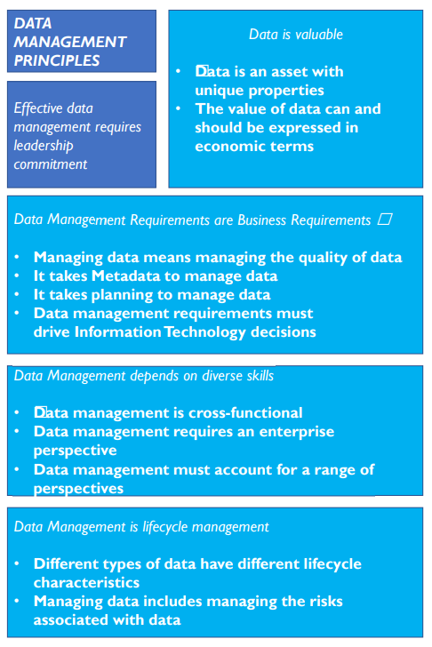
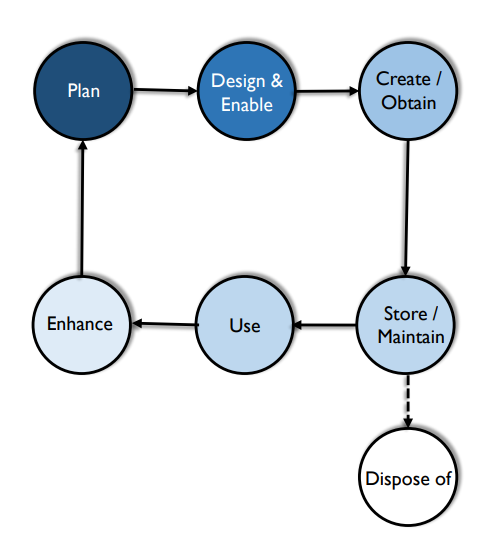
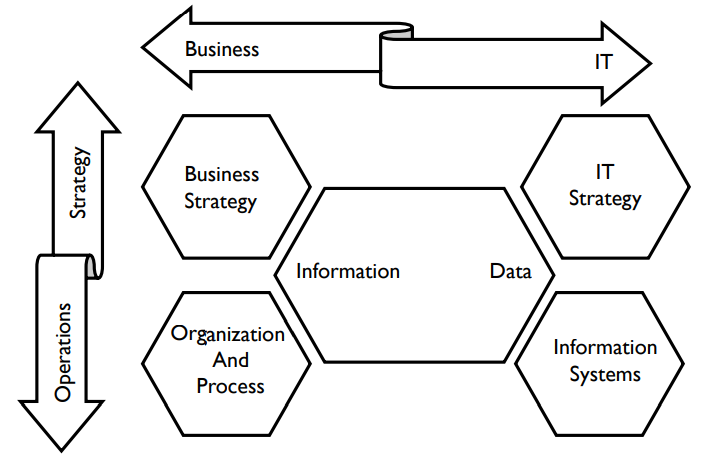
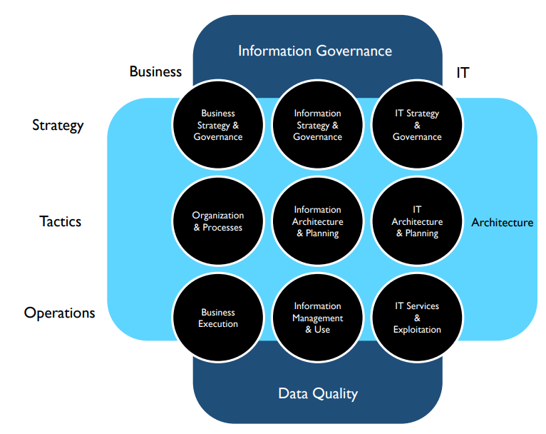
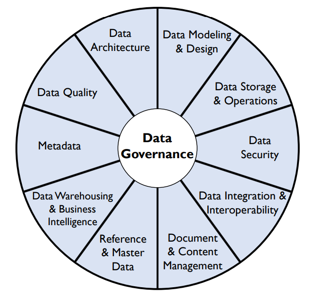
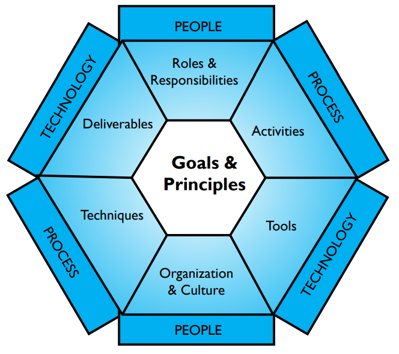
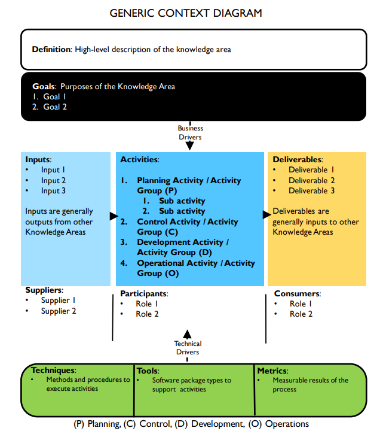
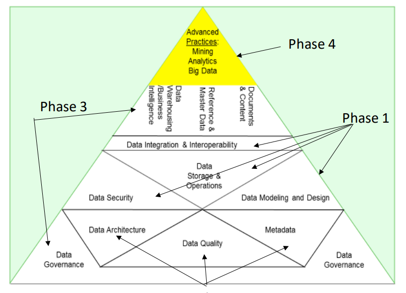
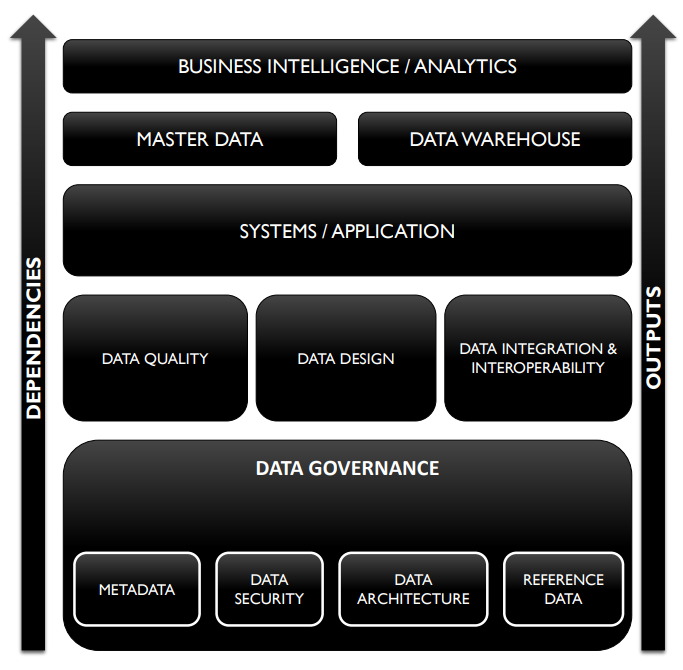

# CAPÍTULO 1 Gestão de Dados

## 1. Introdução
Muitas organizações reconhecem que seus dados são um ativo corporativo vital. Dados e informações podem fornecer insights sobre seus clientes, produtos e serviços. Podem ajudá-las a inovar e alcançar objetivos estratégicos. Apesar desse reconhecimento, poucas organizações gerenciam ativamente os dados como um ativo do qual podem extrair valor contínuo (Evans e Price, 2012). A obtenção de valor a partir dos dados não acontece no vácuo ou por acidente. Requer intenção, planejamento, coordenação e comprometimento. Requer gestão e liderança.

Gestão de Dados é o desenvolvimento, a execução e a supervisão de planos, políticas, programas e práticas que entregam, controlam, protegem e aprimoram o valor dos dados e ativos de informação ao longo de seus ciclos de vida.

Um Profissional de Gestão de Dados é qualquer pessoa que trabalhe em qualquer aspecto da gestão de dados (desde a gestão técnica de dados ao longo de seu ciclo de vida até a garantia de que os dados sejam utilizados e aproveitados adequadamente) para atingir os objetivos estratégicos da organização. Profissionais de gestão de dados desempenham inúmeras funções, desde as mais técnicas (por exemplo, administradores de banco de dados, administradores de rede, programadores) até as estratégicas de negócios (por exemplo, Administradores de Dados, Estrategistas de Dados, Diretores de Dados).

As atividades de gestão de dados são abrangentes. Elas incluem desde a capacidade de tomar decisões consistentes sobre como obter valor estratégico dos dados até a implantação técnica e o desempenho de bancos de dados. Portanto, a gestão de dados requer habilidades técnicas e não técnicas (ou seja, de negócios). A responsabilidade pela gestão de dados deve ser compartilhada entre as funções de negócios e de tecnologia da informação, e as pessoas em ambas as áreas devem ser capazes de colaborar para garantir que uma organização tenha dados de alta qualidade que atendam às suas necessidades estratégicas.

Dados e informações não são apenas ativos no sentido em que as organizações investem neles para obter valor futuro. Dados e informações também são vitais para as operações diárias da maioria das organizações. Eles têm sido chamados de "moeda", "sangue vital" e até mesmo "novo petróleo" da economia da informação.[^1] Independentemente de uma organização obter ou não valor com suas análises, ela não consegue sequer realizar transações comerciais sem dados.

Para apoiar os profissionais de gestão de dados que realizam esse trabalho, a DAMA International (Associação de Gestão de Dados) produziu este livro, a segunda edição do Guia DAMA para o Conjunto de Conhecimentos em Gestão de Dados (DMBOK2). Esta edição se baseia na primeira, publicada em 2009, que forneceu conhecimentos fundamentais sobre os quais se basear à medida que a profissão avançava e amadurecia.

Este capítulo descreve um conjunto de princípios para a gestão de dados. Ele discute os desafios relacionados à observância desses princípios e sugere abordagens para enfrentá-los. O capítulo também descreve a Estrutura de Gestão de Dados da DAMA, que fornece o contexto para o trabalho realizado por profissionais de gestão de dados em diversas Áreas de Conhecimento em Gestão de Dados.

### 1.1 Impulsionadores de Negócios

Informação e conhecimento são a chave para a vantagem competitiva. Organizações que possuem dados confiáveis ​​e de alta qualidade sobre seus clientes, produtos, serviços e operações podem tomar decisões melhores do que aquelas sem dados ou com dados não confiáveis. A falha em gerenciar dados é semelhante à falha em gerenciar capital. Isso resulta em desperdício e perda de oportunidades. O principal impulsionador da gestão de dados é permitir que as organizações obtenham valor de seus ativos de dados, assim como a gestão eficaz de ativos financeiros e físicos permite que as organizações obtenham valor desses ativos.

### 1.2 Objetivos
Dentro de uma organização, os objetivos da gestão de dados incluem:

* Compreender e atender às necessidades de informação da empresa e de suas partes interessadas, incluindo clientes, funcionários e parceiros de negócios
* Capturar, armazenar, proteger e garantir a integridade dos ativos de dados
* Garantir a qualidade dos dados e das informações
* Garantir a privacidade e a confidencialidade dos dados das partes interessadas
* Impedir o acesso, a manipulação ou o uso não autorizado ou inadequado de dados e informações
* Garantir que os dados possam ser usados ​​de forma eficaz para agregar valor à empresa

## 2. Conceitos Essenciais

### 2.1 Dados
Definições antigas de dados enfatizam seu papel na representação de fatos sobre o mundo.[^2] Em relação à tecnologia da informação, dados também são entendidos como informações armazenadas em formato digital (embora dados não se limitem a informações digitalizadas e os princípios de gerenciamento de dados se apliquem tanto a dados capturados em papel quanto em bancos de dados). Ainda assim, como hoje podemos capturar tanta informação eletronicamente, chamamos de "dados" muitas coisas que não seriam chamadas de "dados" antigamente – coisas como nomes, endereços, datas de nascimento, o que alguém comeu no jantar de sábado, o livro mais recente que alguém comprou.

Tais fatos sobre pessoas individuais podem ser agregados, analisados ​​e usados ​​para gerar lucro, melhorar a saúde ou influenciar políticas públicas. Além disso, nossa capacidade tecnológica de mensurar uma ampla gama de eventos e atividades (das repercussões do Big Bang aos nossos próprios batimentos cardíacos) e de coletar, armazenar e analisar versões eletrônicas de coisas que antes não eram consideradas dados (vídeos, imagens, gravações de som, documentos) está perto de superar nossa capacidade de sintetizar esses dados em informações utilizáveis.[^3] Aproveitar a variedade de dados sem sermos sobrecarregados por seu volume e velocidade requer práticas confiáveis ​​e extensíveis de gerenciamento de dados.

A maioria das pessoas presume que, como os dados representam fatos, são uma forma de verdade sobre o mundo e que os fatos se encaixam. Mas "fatos" nem sempre são simples ou diretos. Dados são um meio de representação. Eles representam coisas além de si mesmos (Chisholm, 2010). Dados são tanto uma interpretação dos objetos que representam quanto um objeto que deve ser interpretado (Sebastian-Coleman, 2013). Esta é outra maneira de dizer que precisamos de contexto para que os dados sejam significativos. O contexto pode ser considerado o sistema representacional dos dados; Tal sistema inclui um vocabulário comum e um conjunto de relacionamentos entre componentes. Se conhecermos as convenções de tal sistema, poderemos interpretar os dados nele contidos.[^4] Essas convenções são frequentemente documentadas em um tipo específico de dado denominado Metadados.

No entanto, como as pessoas frequentemente fazem escolhas diferentes sobre como representar conceitos, elas criam maneiras diferentes de representar os mesmos conceitos. A partir dessas escolhas, os dados assumem formas diferentes. Pense na variedade de maneiras que temos para representar datas do calendário, um conceito sobre o qual existe uma definição consensual. Agora, considere conceitos mais complexos (como cliente ou produto), onde a granularidade e o nível de detalhe do que precisa ser representado nem sempre são autoevidentes, e o processo de representação se torna mais complexo, assim como o processo de gerenciamento dessas informações ao longo do tempo. (Ver Capítulo 10)

Mesmo dentro de uma única organização, frequentemente existem várias maneiras de representar a mesma ideia. Daí a necessidade de Arquitetura de Dados, modelagem, governança e administração, e Metadados e Gestão da Qualidade de Dados, todos os quais ajudam as pessoas a entender e usar os dados. Em todas as organizações, o problema da multiplicidade se multiplica. Daí a necessidade de padrões de dados em nível industrial que possam trazer mais consistência aos dados.

As organizações sempre precisaram gerenciar seus dados, mas as mudanças tecnológicas expandiram o escopo dessa necessidade de gerenciamento, pois mudaram a compreensão das pessoas sobre o que são dados. Essas mudanças permitiram que as organizações utilizassem dados de novas maneiras para criar produtos, compartilhar informações, gerar conhecimento e aprimorar o sucesso organizacional. Mas o rápido crescimento da tecnologia e, com ela, da capacidade humana de produzir, capturar e extrair significado dos dados, intensificou a necessidade de gerenciá-los de forma eficaz.

### 2.2 Dados e Informação
Muito se tem falado sobre a relação entre dados e informação. Dados têm sido chamados de "matéria-prima da informação" e informação tem sido chamada de "dados em contexto".[^5] Frequentemente, uma pirâmide em camadas é usada para descrever a relação entre dados (na base), informação, conhecimento e sabedoria (no topo). Embora a pirâmide possa ser útil para descrever por que os dados precisam ser bem gerenciados, essa representação apresenta vários desafios para o gerenciamento de dados.

* Ela se baseia na suposição de que os dados simplesmente existem. Mas os dados não existem simplesmente. Os dados precisam ser criados.
* Ao descrever uma sequência linear dos dados até a sabedoria, ela falha em reconhecer que é necessário conhecimento para criar dados em primeiro lugar.
* Ela implica que dados e informação são coisas separadas, quando, na realidade, os dois conceitos estão interligados e dependentes um do outro. Dados são uma forma de informação e informação é uma forma de dados.

Dentro de uma organização, pode ser útil traçar uma linha entre informação e dados para fins de comunicação clara sobre os requisitos e expectativas de diferentes usos por diferentes partes interessadas. (“Aqui está um relatório de vendas do último trimestre [informações]. Ele se baseia em dados do nosso data warehouse [dados]. No próximo trimestre, esses resultados [dados] serão usados ​​para gerar nossas medidas de desempenho trimestrais [informações]”). Reconhecer que dados e informações precisam ser preparados para diferentes propósitos reforça um princípio central da gestão de dados: tanto dados quanto informações precisam ser gerenciados. Ambos terão maior qualidade se forem gerenciados em conjunto, levando em consideração os usos e as necessidades do cliente. Ao longo do DMBOK, os termos serão usados ​​indistintamente.

### 2.3 Dados como Ativo Organizacional

Um ativo é um recurso econômico que pode ser possuído ou controlado e que detém ou produz valor. Ativos podem ser convertidos em dinheiro. Dados são amplamente reconhecidos como um ativo empresarial, embora a compreensão do que significa gerenciar dados como um ativo ainda esteja em evolução. No início da década de 1990, algumas organizações questionavam se o valor do goodwill deveria receber um valor monetário. Atualmente, o "valor do goodwill" comumente aparece como um item na Demonstração de Lucros e Perdas (P&L). Da mesma forma, embora não seja universalmente adotada, a monetização de dados está se tornando cada vez mais comum. Não demorará muito para que vejamos isso como uma característica dos P&Ls. (Consulte o Capítulo 3.)

As organizações atuais dependem de seus ativos de dados para tomar decisões mais eficazes e operar com mais eficiência. As empresas usam dados para entender seus clientes, criar novos produtos e serviços e melhorar a eficiência operacional, cortando custos e controlando riscos. Órgãos governamentais, instituições educacionais e organizações sem fins lucrativos também precisam de dados de alta qualidade para orientar suas atividades operacionais, táticas e estratégicas. À medida que as organizações dependem cada vez mais de dados, o valor dos ativos de dados pode ser estabelecido com mais clareza.

Muitas organizações se identificam como "orientadas por dados". Empresas que buscam se manter competitivas devem parar de tomar decisões com base em sentimentos ou instintos e, em vez disso, usar gatilhos de eventos e aplicar análises para obter insights acionáveis. Ser orientado por dados inclui o reconhecimento de que os dados devem ser gerenciados de forma eficiente e com disciplina profissional, por meio de uma parceria entre liderança empresarial e expertise técnica.

Além disso, o ritmo dos negócios hoje significa que a mudança não é mais opcional; a disrupção digital é a norma. Para reagir a isso, as empresas devem cocriar soluções de informação com profissionais de dados técnicos trabalhando em conjunto com seus pares da linha de negócios. Elas devem planejar como obter e gerenciar os dados que sabem que precisam para apoiar a estratégia de negócios. Elas também devem se posicionar para aproveitar as oportunidades de alavancar dados de novas maneiras.

### 2.4 Princípios de Gestão de Dados
A gestão de dados compartilha características com outras formas de gestão de ativos, como visto na Figura 1. Envolve saber quais dados uma organização possui e o que pode ser realizado com eles, determinando então a melhor forma de usar os ativos de dados para atingir os objetivos organizacionais.

Como outros processos de gestão, ela deve equilibrar as necessidades estratégicas e operacionais. Esse equilíbrio pode ser alcançado seguindo um conjunto de princípios que reconhecem as principais características da gestão de dados e orientam a prática de gestão de dados.

* **Dados são um ativo com propriedades únicas:** Dados são um ativo, mas diferem de outros ativos em aspectos importantes que influenciam a forma como são gerenciados. A mais óbvia dessas propriedades é que os dados não são consumidos quando são usados, assim como os ativos financeiros e físicos.
* **O valor dos dados pode e deve ser expresso em termos econômicos:** Chamar dados de ativos implica que eles têm valor. Embora existam técnicas para mensurar o valor qualitativo e quantitativo dos dados, ainda não existem padrões para isso. As organizações que desejam tomar melhores decisões sobre seus dados devem desenvolver maneiras consistentes de quantificar esse valor. Elas também devem mensurar os custos de dados de baixa qualidade e os benefícios de dados de alta qualidade.
* **Gerenciar dados significa gerenciar a qualidade dos dados:** Garantir que os dados sejam adequados à finalidade é um objetivo principal do gerenciamento de dados. Para gerenciar a qualidade, as organizações devem garantir que entendam os requisitos de qualidade das partes interessadas e mensurar os dados em relação a esses requisitos.
* **É preciso Metadados para gerenciar dados:** Gerenciar qualquer ativo exige dados sobre ele (número de funcionários, códigos contábeis, etc.). Os dados usados ​​para gerenciar e utilizar dados são chamados de Metadados. Como os dados não podem ser armazenados ou tocados, entender o que são e como usá-los requer definição e conhecimento na forma de Metadados. Os metadados se originam de uma série de processos relacionados à criação, processamento e uso de dados, incluindo arquitetura, modelagem, administração, governança, gestão da qualidade de dados, desenvolvimento de sistemas, TI e operações de negócios, e análise.

* **É preciso planejamento para gerenciar dados:** Mesmo pequenas organizações podem ter cenários técnicos e de processos de negócios complexos. Os dados são criados em muitos lugares e movidos entre eles para uso. Coordenar o trabalho e manter os resultados finais alinhados exige planejamento de uma perspectiva arquitetônica e de processo.
* **O gerenciamento de dados é multifuncional:** requer uma variedade de habilidades e conhecimentos: Uma única equipe não consegue gerenciar todos os dados de uma organização. O gerenciamento de dados requer habilidades técnicas e não técnicas, além da capacidade de colaboração.
* **O gerenciamento de dados requer uma perspectiva corporativa:** O gerenciamento de dados tem aplicações locais, mas deve ser aplicado em toda a empresa para ser o mais eficaz possível. Esse é um dos motivos pelos quais o gerenciamento de dados e a governança de dados estão interligados.
* **O gerenciamento de dados deve considerar uma variedade de perspectivas:** Os dados são fluidos. O gerenciamento de dados deve evoluir constantemente para acompanhar as maneiras como os dados são criados e usados, bem como os consumidores de dados que os utilizam.
* **O gerenciamento de dados é gerenciamento do ciclo de vida:** Os dados têm um ciclo de vida e gerenciá-los requer o gerenciamento do seu ciclo de vida. Como os dados geram mais dados, o próprio ciclo de vida dos dados pode ser muito complexo. As práticas de gerenciamento de dados precisam levar em conta o ciclo de vida dos dados.
* **Diferentes tipos de dados têm diferentes características de ciclo de vida:** e por esse motivo, eles têm diferentes requisitos de gerenciamento. As práticas de gerenciamento de dados precisam reconhecer essas diferenças e ser flexíveis o suficiente para atender a diferentes tipos de requisitos de ciclo de vida de dados.
* **Gerenciar dados inclui gerenciar os riscos associados a eles:** além de serem um ativo, os dados também representam riscos para uma organização. Os dados podem ser perdidos, roubados ou mal utilizados. As organizações devem considerar as implicações éticas de seus usos de dados. Os riscos relacionados aos dados devem ser gerenciados como parte do ciclo de vida dos dados.
* **Os requisitos de gerenciamento de dados devem orientar as decisões de Tecnologia da Informação:** dados e gerenciamento de dados estão profundamente interligados com a tecnologia da informação e o gerenciamento de tecnologia da informação. Gerenciar dados requer uma abordagem que garanta que a tecnologia atenda, em vez de impulsionar, as necessidades estratégicas de dados de uma organização.
* **O gerenciamento eficaz de dados requer comprometimento da liderança:** o gerenciamento de dados envolve um conjunto complexo de processos que, para serem eficazes, exigem coordenação, colaboração e comprometimento. Chegar lá requer não apenas habilidades de gestão, mas também a visão e o propósito que advêm de uma liderança comprometida.

### 2.5 Desafios da Gestão de Dados

Como a gestão de dados possui características distintas derivadas das propriedades dos próprios dados, ela também apresenta desafios na implementação desses princípios. Detalhes desses desafios são discutidos nas Seções 2.5.1 a 2.5.13. Muitos desses desafios referem-se a mais de um princípio.

### 2.5.1 Dados Diferem de Outros Ativos[^6]

Ativos físicos podem ser apontados, tocados e movimentados. Eles podem estar em apenas um lugar por vez. Ativos financeiros devem ser contabilizados em um balanço patrimonial. No entanto, dados são diferentes. Dados não são tangíveis. No entanto, são duráveis; não se desgastam, embora o valor dos dados frequentemente mude com o tempo. Dados são fáceis de copiar e transportar. Mas não são fáceis de reproduzir se forem perdidos ou destruídos. Como não são consumidos quando usados, podem até ser roubados sem desaparecerem. Dados são dinâmicos e podem ser usados ​​para múltiplas finalidades. Os mesmos dados podem até ser usados ​​por várias pessoas ao mesmo tempo – algo impossível com ativos físicos ou financeiros. Muitos usos de dados geram mais dados. A maioria das organizações precisa gerenciar volumes crescentes de dados e a relação entre conjuntos de dados.

Essas diferenças tornam desafiador atribuir um valor monetário aos dados. Sem esse valor monetário, é difícil mensurar como os dados contribuem para o sucesso organizacional. Essas diferenças também levantam outras questões que afetam o gerenciamento de dados, como definir a propriedade dos dados, inventariar a quantidade de dados que uma organização possui, proteger contra o uso indevido de dados, gerenciar riscos associados à redundância de dados e definir e aplicar padrões de Qualidade de Dados.

Apesar dos desafios de mensurar o valor dos dados, a maioria das pessoas reconhece que os dados, de fato, têm valor. Os dados de uma organização são únicos. Caso dados exclusivos da organização (como listas de clientes, inventários de produtos ou histórico de reclamações) fossem perdidos ou destruídos, substituí-los seria impossível ou extremamente custoso. Os dados também são o meio pelo qual uma organização se autoconhece – são um metaativo que descreve outros ativos. Como tal, fornecem a base para o insight organizacional.

Dentro das organizações e entre elas, dados e informações são essenciais para a condução dos negócios. A maioria das transações comerciais operacionais envolve a troca de informações. A maioria das informações é trocada eletronicamente, criando um rastro de dados. Esse rastro de dados pode servir a propósitos que vão além de marcar as trocas ocorridas. Ele pode fornecer informações sobre o funcionamento de uma organização.

Devido ao papel importante que os dados desempenham em qualquer organização, eles precisam ser gerenciados com cuidado.

### 2.5.2 Valoração de Dados

Valor é a diferença entre o custo de algo e o benefício derivado dele. Para alguns ativos, como ações, calcular o valor é fácil. É a diferença entre o custo da ação quando foi comprada e o preço pelo qual foi vendida. Mas, para dados, esses cálculos são mais complicados, porque nem os custos nem os benefícios dos dados são padronizados.

Como os dados de cada organização são únicos, uma abordagem para valoração de dados precisa começar pela articulação de categorias gerais de custo e benefício que possam ser aplicadas de forma consistente dentro de uma organização. Exemplos de categorias incluem[^7]:

* Custo de obtenção e armazenamento de dados
* Custo de substituição de dados em caso de perda
* Impacto para a organização em caso de perda de dados
* Custo de mitigação de riscos e custo potencial dos riscos associados aos dados
* Custo de aprimoramento dos dados
* Benefícios de dados de maior qualidade
* Quanto os concorrentes pagariam pelos dados
* Por quanto os dados poderiam ser vendidos
* Receita esperada com o uso inovador dos dados

Um dos principais desafios para a avaliação de ativos de dados é que o valor dos dados é contextual (o que tem valor para uma organização pode não ter valor para outra) e, frequentemente, temporal (o que era valioso ontem pode não ter valor hoje). Dito isso, dentro de uma organização, certos tipos de dados provavelmente serão consistentemente valiosos ao longo do tempo. Tomemos como exemplo informações confiáveis ​​sobre clientes. As informações sobre clientes podem até se tornar mais valiosas com o tempo, à medida que mais dados relacionados à atividade do cliente se acumulam.

Em relação à gestão de dados, estabelecer maneiras de associar valor financeiro aos dados é fundamental, uma vez que as organizações precisam entender os ativos em termos financeiros para tomar decisões consistentes. Atribuir valor aos dados torna-se a base para a atribuição de valor às atividades de gestão de dados.[^8] O processo de valoração de dados também pode ser usado como meio de gestão de mudanças. Solicitar aos profissionais de gestão de dados e às partes interessadas que eles apoiam que entendam o significado financeiro de seu trabalho pode ajudar uma organização a transformar sua compreensão de seus próprios dados e, consequentemente, sua abordagem à gestão de dados. 

### 2.5.3 Qualidade dos Dados

Garantir a alta qualidade dos dados é fundamental para o gerenciamento de dados. As organizações gerenciam seus dados porque desejam utilizá-los. Se não puderem contar com eles para atender às necessidades do negócio, o esforço para coletar, armazenar, proteger e permitir o acesso a eles será em vão. Para garantir que os dados atendam às necessidades do negócio, elas devem trabalhar com os consumidores de dados para definir essas necessidades, incluindo as características que tornam os dados de alta qualidade.

Em grande parte porque os dados têm sido tão intimamente associados à tecnologia da informação, o gerenciamento da Qualidade dos Dados tem sido historicamente tratado como algo secundário. As equipes de TI frequentemente desconsideram os dados que os sistemas que criam devem armazenar. Provavelmente foi um programador quem primeiro observou a frase "entra lixo, sai lixo" – e que, sem dúvida, quis deixar por isso mesmo. Mas as pessoas que desejam usar os dados não podem se dar ao luxo de desconsiderar a qualidade. Geralmente, presumem que os dados são confiáveis ​​e confiáveis, até que tenham um motivo para duvidar disso. Uma vez que perdem a confiança, é difícil recuperá-la.

A maioria dos usos de dados envolve aprender com eles para aplicar esse aprendizado e criar valor. Exemplos incluem compreender os hábitos dos clientes para aprimorar um produto ou serviço e avaliar o desempenho organizacional ou tendências de mercado para desenvolver uma estratégia de negócios mais eficaz, etc. Dados de baixa qualidade terão um impacto negativo nessas decisões.

Tão importante quanto isso, dados de baixa qualidade são simplesmente caros para qualquer organização. As estimativas variam, mas especialistas acreditam que as organizações gastam entre 10% e 30% da receita lidando com problemas de qualidade de dados. A IBM estimou que o custo de dados de baixa qualidade nos EUA em 2016 foi de US$ 3,1 trilhões.[^9] Muitos dos custos de dados de baixa qualidade são ocultos, indiretos e, portanto, difíceis de mensurar. Outros, como multas, são diretos e fáceis de calcular. Os custos provêm de:

* Sucata e retrabalho
* Soluções alternativas e processos de correção ocultos
* Ineficiências organizacionais ou baixa produtividade
* Conflito organizacional
* Baixa satisfação no trabalho
* Insatisfação do cliente
* Custos de oportunidade, incluindo incapacidade de inovar
* Custos de conformidade ou multas
* Custos de reputação

Os benefícios correspondentes de dados de alta qualidade incluem:

* Melhor experiência do cliente
* Maior produtividade
* Redução de riscos
* Capacidade de aproveitar oportunidades
* Aumento da receita
* Vantagem competitiva obtida a partir de insights sobre clientes, produtos, processos e oportunidades

Como esses custos e benefícios implicam, gerenciar a Qualidade de Dados não é uma tarefa única. Produzir dados de alta qualidade requer planejamento, comprometimento e uma mentalidade que incorpore qualidade aos processos e sistemas. Todas as funções de gerenciamento de dados podem influenciar a Qualidade de Dados, para o bem ou para o mal, portanto, todas devem levar isso em conta ao executar seu trabalho. (Consulte o Capítulo 13).

### 2.5.4 Planejando para Obter Dados Melhores

Conforme mencionado na introdução do capítulo, extrair valor dos dados não acontece por acaso. Exige planejamento em diversas formas. Começa com o reconhecimento de que as organizações podem controlar como obtêm e criam dados. Se enxergarem os dados como um produto que criam, tomarão melhores decisões sobre eles ao longo de seu ciclo de vida. Essas decisões exigem pensamento sistêmico porque envolvem:

* As maneiras como os dados conectam processos de negócios que, de outra forma, poderiam ser vistos como separados
* A relação entre os processos de negócios e a tecnologia que os suporta
* O design e a arquitetura dos sistemas e os dados que eles produzem e armazenam
* As maneiras como os dados podem ser usados ​​para promover a estratégia organizacional

O planejamento para obter dados melhores requer uma abordagem estratégica para arquitetura, modelagem e outras funções de design. Também depende da colaboração estratégica entre a liderança de negócios e a de TI. E, claro, depende da capacidade de executar projetos individuais com eficácia.

O desafio é que geralmente há pressões organizacionais, bem como as pressões constantes de tempo e dinheiro, que atrapalham um planejamento melhor. As organizações devem equilibrar objetivos de longo e curto prazo ao executar suas estratégias. Ter clareza sobre as compensações leva a melhores decisões.

### 2.5.5 Metadados e Gestão de Dados

As organizações precisam de Metadados confiáveis ​​para gerenciar dados como um ativo. Metadados, nesse sentido, devem ser compreendidos de forma abrangente. Eles incluem não apenas os Metadados de negócios, técnicos e operacionais descritos no Capítulo 12, mas também os Metadados incorporados na Arquitetura de Dados, modelos de dados, requisitos de segurança de dados, padrões de integração de dados e processos operacionais de dados. (Consulte os Capítulos 4 a 11.)

Metadados descrevem quais dados uma organização possui, o que representam, como são classificados, de onde vieram, como se movem dentro da organização, como evoluem com o uso, quem pode e não pode usá-los e se são de alta qualidade. Dados são abstratos. Definições e outras descrições de contexto permitem que sejam compreendidos. Elas tornam os dados, o ciclo de vida dos dados e os sistemas complexos que os contêm compreensíveis.

O desafio é que Metadados são uma forma de dados e precisam ser gerenciados como tal. Organizações que não gerenciam bem seus dados geralmente não gerenciam seus Metadados. A gestão de metadados frequentemente fornece um ponto de partida para melhorias na gestão de dados em geral.

### 2.5.6 A Gestão de Dados é Multifuncional

A gestão de dados é um processo complexo. Os dados são gerenciados em diferentes locais dentro de uma organização por equipes responsáveis ​​por diferentes fases do ciclo de vida dos dados. A gestão de dados requer habilidades de design para planejar sistemas, habilidades altamente técnicas para administrar hardware e desenvolver software, habilidades de análise de dados para entender questões e problemas, habilidades analíticas para interpretar dados, habilidades linguísticas para gerar consenso em definições e modelos, bem como pensamento estratégico para enxergar oportunidades de atender clientes e atingir metas.

O desafio é fazer com que pessoas com essa gama de habilidades e perspectivas reconheçam como as peças se encaixam para que colaborem bem enquanto trabalham em direção a objetivos comuns.

### 2.5.7 Estabelecendo uma Perspectiva Corporativa

Gerenciar dados requer a compreensão do escopo e da abrangência dos dados dentro de uma organização. Os dados são uma das "horizontais" de uma organização. Eles se movem por verticais, como vendas, marketing e operações... Ou pelo menos deveriam. Os dados não são exclusivos apenas de uma organização; Às vezes, é exclusivo de um departamento ou outra subdivisão de uma organização. Como os dados são frequentemente vistos simplesmente como um subproduto dos processos operacionais (por exemplo, os registros de transações de vendas são o subproduto do processo de venda), eles nem sempre são planejados para além da necessidade imediata.

Mesmo dentro de uma organização, os dados podem ser díspares. Os dados se originam em vários locais dentro de uma organização. Diferentes departamentos podem ter diferentes maneiras de representar o mesmo conceito (por exemplo, cliente, produto, fornecedor). Como qualquer pessoa envolvida em um projeto de integração de dados ou Gestão de Dados Mestres pode testemunhar, diferenças sutis (ou flagrantes) nas escolhas de representação apresentam desafios no gerenciamento de dados em uma organização. Ao mesmo tempo, as partes interessadas presumem que os dados de uma organização devem ser coerentes, e um objetivo do gerenciamento de dados é fazer com que eles se encaixem de maneira sensata para que sejam utilizáveis ​​por uma ampla gama de consumidores de dados.

Um dos motivos pelos quais a governança de dados se tornou cada vez mais importante é ajudar as organizações a tomar decisões sobre dados em diferentes setores. (Ver Capítulo 3.)

### 2.5.8 Considerando Outras Perspectivas

As organizações atuais utilizam dados criados internamente, bem como dados adquiridos de fontes externas. Elas precisam considerar diferentes requisitos legais e de conformidade em diferentes países e setores. As pessoas que criam dados frequentemente se esquecem de que outra pessoa os utilizará posteriormente. O conhecimento dos usos potenciais dos dados permite um melhor planejamento do ciclo de vida dos dados e, consequentemente, a obtenção de dados de melhor qualidade. Os dados também podem ser mal utilizados. A contabilização desse risco reduz a probabilidade de uso indevido.

### 2.5.9 O Ciclo de Vida dos Dados

Assim como outros ativos, os dados têm um ciclo de vida. Para gerenciar ativos de dados com eficácia, as organizações precisam entender e planejar o ciclo de vida dos dados. Dados bem gerenciados são gerenciados estrategicamente, com uma visão de como a organização os utilizará. Uma organização estratégica definirá não apenas seus requisitos de conteúdo de dados, mas também seus requisitos de gerenciamento de dados. Estes incluem políticas e expectativas de uso, qualidade, controles e segurança; uma abordagem corporativa para arquitetura e design; e uma abordagem sustentável para infraestrutura e desenvolvimento de software.

O ciclo de vida dos dados é baseado no ciclo de vida do produto. Não deve ser confundido com o ciclo de vida de desenvolvimento de sistemas. Conceitualmente, o ciclo de vida dos dados é fácil de descrever (veja a Figura 2). Ele inclui os processos que criam ou obtêm dados, aqueles que os movem, transformam e armazenam, permitindo sua manutenção e compartilhamento, e aqueles que os utilizam ou aplicam, bem como aqueles que os descartam.[^10] Ao longo de seu ciclo de vida, os dados podem ser limpos, transformados, mesclados, aprimorados ou agregados. À medida que os dados são utilizados ou aprimorados, novos dados são frequentemente criados, de modo que o ciclo de vida tem iterações internas que não são mostradas no diagrama. Os dados raramente são estáticos. O gerenciamento de dados envolve um conjunto de processos interconectados alinhados com o ciclo de vida dos dados.

As especificidades do ciclo de vida dos dados dentro de uma determinada organização podem ser bastante complexas, pois os dados não apenas têm um ciclo de vida, mas também uma linhagem (ou seja, um caminho ao longo do qual se movem do seu ponto de origem ao seu ponto de uso, às vezes chamado de cadeia de dados). Compreender a linhagem dos dados requer documentar a origem dos conjuntos de dados, bem como sua movimentação e transformação pelos sistemas onde são acessados ​​e utilizados. Ciclo de vida e linhagem se interseccionam e podem ser compreendidos em relação um ao outro. Quanto melhor uma organização compreender o ciclo de vida e a linhagem de seus dados, mais capaz será de gerenciá-los.

O foco da gestão de dados no ciclo de vida dos dados tem várias implicações importantes:

* Criação e utilização são os pontos mais críticos do ciclo de vida dos dados: A gestão de dados deve ser executada com a compreensão de como os dados são produzidos ou obtidos, bem como de como são utilizados. Produzir dados custa dinheiro. Os dados só são valiosos quando são consumidos ou aplicados. (Consulte os Capítulos 5, 6, 8, 11 e 14.)

* **A Qualidade dos Dados deve ser gerenciada ao longo de todo o ciclo de vida dos dados:** A Gestão da Qualidade dos Dados é fundamental para a gestão de dados. Dados de baixa qualidade representam custo e risco, em vez de valor. As organizações frequentemente consideram desafiador gerenciar a qualidade dos dados porque, como descrito anteriormente, os dados são frequentemente criados como um subproduto de processos operacionais e as organizações frequentemente não definem padrões explícitos de qualidade. Como a qualidade da qualidade pode ser impactada por uma série de eventos do ciclo de vida, a qualidade deve ser planejada como parte do ciclo de vida dos dados (consulte o Capítulo 13).

* **A qualidade dos metadados deve ser gerenciada ao longo do ciclo de vida dos dados:** Como os metadados são uma forma de dado e as organizações dependem deles para gerenciar outros dados, a qualidade dos metadados deve ser gerenciada da mesma forma que a qualidade de outros dados (consulte o Capítulo 12).
* **A segurança dos dados deve ser gerenciada ao longo do ciclo de vida dos dados:** O gerenciamento de dados também inclui garantir que os dados estejam seguros e que os riscos associados a eles sejam mitigados. Os dados que requerem proteção devem ser protegidos durante todo o seu ciclo de vida, desde a criação até o descarte (consulte o Capítulo 7, Segurança de Dados).
* **Os esforços de gerenciamento de dados devem se concentrar nos dados mais críticos:** As organizações produzem muitos dados, uma grande parte dos quais nunca é realmente utilizada. Tentar gerenciar todos os dados não é possível. O gerenciamento do ciclo de vida exige foco nos dados mais críticos de uma organização e a minimização do ROT (dados redundantes, obsoletos e triviais) dos dados (Aiken, 2014).

### 2.5.10 Diferentes Tipos de Dados

O gerenciamento de dados se torna mais complexo pelo fato de existirem diferentes tipos de dados com diferentes requisitos de gerenciamento do ciclo de vida. Qualquer sistema de gerenciamento precisa classificar os objetos gerenciados. Os dados podem ser classificados por tipo (por exemplo, dados transacionais, Dados de Referência, Dados Mestres, Metadados; alternativamente, dados de categoria, dados de recursos, dados de eventos, dados detalhados de transações) ou por conteúdo (por exemplo, domínios de dados, áreas temáticas), por formato ou pelo nível de proteção que os dados exigem. Os dados também podem ser classificados por como e onde são armazenados ou acessados. (Consulte os Capítulos 5 e 10.)

Como diferentes tipos de dados têm diferentes requisitos, estão associados a diferentes riscos e desempenham diferentes papéis dentro de uma organização, muitas das ferramentas de gerenciamento de dados concentram-se em aspectos de classificação e controle (Bryce, 2005). Por exemplo, os Dados Mestres têm diferentes usos e, consequentemente, diferentes requisitos de gerenciamento em relação aos dados transacionais. (Ver Capítulos 9, 10, 12 e 14.)

### 2.5.11 Dados e Risco

Dados não representam apenas valor, mas também risco. Dados de baixa qualidade (imprecisos, incompletos ou desatualizados) obviamente representam risco, pois suas informações não estão corretas. Mas dados também são arriscados, pois podem ser mal compreendidos e mal utilizados.

As organizações obtêm o máximo valor de dados da mais alta qualidade – disponíveis, relevantes, completos, precisos, consistentes, oportunos, utilizáveis, significativos e compreendidos. No entanto, para muitas decisões importantes, temos lacunas de informação – a diferença entre o que sabemos e o que precisamos saber para tomar uma decisão eficaz. Lacunas de informação representam responsabilidades empresariais com impactos potencialmente profundos na eficácia operacional e na lucratividade. As organizações que reconhecem o valor de dados de alta qualidade podem tomar medidas concretas e proativas para melhorar a qualidade e a usabilidade de dados e informações dentro de estruturas culturais regulatórias e éticas.

O papel crescente da informação como um ativo organizacional em todos os setores levou a um foco maior por parte de reguladores e legisladores nos potenciais usos e abusos da informação. Da Lei Sarbanes-Oxley (com foco em controles sobre a precisão e validade dos dados de transações financeiras, da transação ao balanço patrimonial) à Solvência II (com foco na linhagem e na qualidade dos dados que sustentam modelos de risco e adequação de capital no setor de seguros), ao rápido crescimento na última década das regulamentações de privacidade de dados (abrangendo o processamento de dados sobre pessoas em uma ampla gama de setores e jurisdições), fica claro que, enquanto ainda aguardamos que a Contabilidade inclua a Informação no balanço patrimonial como um ativo, o ambiente regulatório espera cada vez mais vê-la no registro de riscos, com a aplicação de mitigações e controles apropriados.

Da mesma forma, à medida que os consumidores se tornam mais conscientes de como seus dados são usados, eles esperam não apenas uma operação de processos mais tranquila e eficiente, mas também a proteção de suas informações e o respeito à sua privacidade. Isso significa que o escopo de quem são nossos stakeholders estratégicos como profissionais de gestão de dados pode frequentemente ser mais amplo do que tradicionalmente. (Consulte os Capítulos 2, Ética no Tratamento de Dados e 7, Segurança de Dados.)

Infelizmente, o impacto da gestão da informação no balanço patrimonial surge cada vez mais quando esses riscos não são gerenciados e os acionistas votam com suas carteiras de ações, os reguladores impõem multas ou restrições às operações e os clientes votam com seus bolsos.

### 2.5.12 Gestão de Dados e Tecnologia

Conforme observado na introdução do capítulo e em outras partes, as atividades de gestão de dados são abrangentes e exigem habilidades técnicas e comerciais. Como quase todos os dados atuais são armazenados eletronicamente, as táticas de gestão de dados são fortemente influenciadas pela tecnologia. Desde o seu início, o conceito de gestão de dados tem sido profundamente interligado à gestão de tecnologia. Esse legado continua. Em muitas organizações, há uma tensão constante entre o impulso para desenvolver novas tecnologias e o desejo de ter dados mais confiáveis ​​– como se os dois fossem opostos em vez de necessários um ao outro.

A gestão de dados bem-sucedida exige decisões sólidas sobre tecnologia, mas gerenciar tecnologia não é o mesmo que gerenciar dados. As organizações precisam entender o impacto da tecnologia nos dados para evitar que a tentação tecnológica influencie suas decisões sobre dados. Em vez disso, os requisitos de dados alinhados à estratégia de negócios devem orientar as decisões sobre tecnologia.

### 2.5.13 A Gestão Eficaz de Dados Exige Liderança e Comprometimento

O Manifesto de Dados do Líder (2017) reconheceu que “as melhores oportunidades de crescimento orgânico de uma organização residem nos dados”. Embora a maioria das organizações reconheça seus dados como um ativo, elas estão longe de serem orientadas por dados. Muitas não sabem quais dados possuem ou quais são os mais críticos para seus negócios. Confundem dados com tecnologia da informação e administram mal ambos. Não abordam os dados estrategicamente. E subestimam o trabalho envolvido na gestão de dados. Essas condições aumentam os desafios da gestão de dados e apontam para um fator crucial para o potencial de sucesso de uma organização: liderança comprometida e o envolvimento de todos em todos os níveis da organização. [^11]

Os desafios aqui descritos devem reforçar este ponto: a gestão de dados não é fácil nem simples. Mas, como poucas organizações a fazem bem, ela é uma fonte de oportunidades amplamente inexploradas. Para se tornar melhor nessa área, é preciso visão, planejamento e disposição para mudar. (Ver Capítulos 15 a 17.)

A defesa da função de Chief Data Officer (CDO) decorre do reconhecimento de que a gestão de dados apresenta desafios únicos e que uma gestão de dados bem-sucedida deve ser orientada pelos negócios, e não pela TI. Um CDO pode liderar iniciativas de gestão de dados e permitir que uma organização aproveite seus ativos de dados e obtenha vantagem competitiva a partir deles. No entanto, um CDO não apenas lidera iniciativas. Ele também deve liderar mudanças culturais que permitam que uma organização tenha uma abordagem mais estratégica para seus dados.

### 2.6 Estratégia de Gestão de Dados

Uma estratégia é um conjunto de escolhas e decisões que, juntas, traçam um curso de ação de alto nível para atingir objetivos de alto nível. No jogo de xadrez, uma estratégia é um conjunto sequencial de movimentos para vencer por xeque-mate ou sobreviver por impasse. Um plano estratégico é um curso de ação de alto nível para atingir objetivos de alto nível.

Uma estratégia de dados deve incluir planos de negócios para usar as informações como vantagem competitiva e apoiar os objetivos da empresa. A estratégia de dados deve partir da compreensão das necessidades de dados inerentes à estratégia de negócios: quais dados a organização precisa, como os obterá, como os gerenciará e garantirá sua confiabilidade ao longo do tempo e como os utilizará.

Normalmente, uma estratégia de dados requer uma estratégia de programa de Gestão de Dados de apoio – um plano para manter e melhorar a qualidade, a integridade, o acesso e a segurança dos dados, mitigando, ao mesmo tempo, riscos conhecidos e implícitos. A estratégia também deve abordar os desafios conhecidos relacionados à gestão de dados.

Em muitas organizações, a estratégia de gestão de dados é de propriedade e mantida pelo CDO e implementada por meio de uma equipe de governança de dados, apoiada por um Conselho de Governança de Dados. Frequentemente, o CDO elabora uma estratégia de dados inicial e uma estratégia de gestão de dados antes mesmo da formação de um Conselho de Governança de Dados, a fim de obter o comprometimento da alta administração com o estabelecimento da administração e governança de dados.

Os componentes de uma estratégia de gerenciamento de dados devem incluir:

* Uma visão convincente para o gerenciamento de dados
* Um resumo do business case para gerenciamento de dados, com exemplos selecionados
* Princípios orientadores, valores e perspectivas de gestão
* A missão e os objetivos de longo prazo do gerenciamento de dados
* Medidas propostas para o sucesso do gerenciamento de dados
* Objetivos de curto prazo (12 a 24 meses) do programa de gerenciamento de dados que sejam SMART (específicos, mensuráveis, acionáveis, realistas e com prazo determinado)
* Descrições das funções e organizações de gerenciamento de dados, juntamente com um resumo de suas responsabilidades e direitos de decisão
* Descrições dos componentes e iniciativas do programa de gerenciamento de dados
* Um programa de trabalho priorizado com limites de escopo
* Um rascunho do roteiro de implementação com projetos e itens de ação

Os resultados do planejamento estratégico para gerenciamento de dados incluem:

* Uma Carta de Gerenciamento de Dados: Visão geral, business case, metas, princípios orientadores, medidas de sucesso, fatores críticos de sucesso, riscos reconhecidos, modelo operacional, etc.
* Uma Declaração de Escopo do Gerenciamento de Dados: Metas e objetivos para um horizonte de planejamento (geralmente 3 anos) e as funções, organizações e líderes individuais responsáveis para atingir esses objetivos.
* Um Roteiro de Implementação de Gestão de Dados: Identificando programas, projetos, atribuições de tarefas e marcos de entrega específicos (ver Capítulo 15).

A estratégia de gestão de dados deve abordar todas as Áreas de Conhecimento do Framework de Gestão de Dados DAMA relevantes para a organização. (Ver Figura 5: O Framework de Gestão de Dados DAMA-DMBOK2 (A Roda DAMA e Seções 3.3 e 4.)

## 3. Estruturas de Gestão de Dados

A gestão de dados envolve um conjunto de funções interdependentes, cada uma com seus próprios objetivos, atividades e responsabilidades. Os profissionais de gestão de dados precisam considerar os desafios inerentes à tentativa de derivar valor de um ativo corporativo abstrato, equilibrando objetivos estratégicos e operacionais, requisitos técnicos e de negócios específicos, demandas de risco e conformidade e entendimentos conflitantes sobre o que os dados representam e se são de alta qualidade.

Há muito a ser monitorado, e é por isso que é útil ter uma estrutura para compreender a gestão de dados de forma abrangente e visualizar as relações entre seus componentes. Como as funções dependem umas das outras e precisam estar alinhadas, em qualquer organização, as pessoas responsáveis ​​pelos diferentes aspectos da gestão de dados precisam colaborar para que a organização extraia valor de seus dados.

Estruturas desenvolvidas em diferentes níveis de abstração fornecem uma gama de perspectivas sobre como abordar a gestão de dados. Essas perspectivas fornecem insights que podem ser usados ​​para esclarecer estratégias, desenvolver roteiros, organizar equipes e alinhar funções.

As ideias e os conceitos apresentados no DMBOK2 serão aplicados de forma diferente em todas as organizações. A abordagem de uma organização para a gestão de dados depende de fatores-chave, como seu setor, a gama de dados que utiliza, sua cultura, nível de maturidade, estratégia, visão e os desafios específicos que está enfrentando. As estruturas descritas nesta seção fornecem algumas lentes para analisar a gestão de dados e aplicar os conceitos apresentados no DMBOK.

* Os dois primeiros, o Modelo de Alinhamento Estratégico e o Modelo de Informação de Amsterdã, apresentam relacionamentos de alto nível que influenciam a forma como uma organização gerencia dados.
* O Modelo DAMA DMBOK (A Roda DAMA, o Hexágono e o Diagrama de Contexto) descreve as Áreas de Conhecimento em Gestão de Dados, conforme definidas pelo DAMA, e explica como são representadas visualmente no DMBOK.
* Os dois últimos tomam a Roda DAMA como ponto de partida e reorganizam as peças para melhor compreender e descrever os relacionamentos entre elas.

### 3.1 Modelo de Alinhamento Estratégico

O Modelo de Alinhamento Estratégico (Henderson e Venkatraman, 1999) abstrai os motivadores fundamentais para qualquer abordagem à gestão de dados. Em seu cerne está a relação entre dados e informações. A informação é frequentemente associada à estratégia de negócios e ao uso operacional de dados. Os dados estão associados à tecnologia da informação e aos processos que suportam o gerenciamento físico de sistemas que tornam os dados acessíveis para uso. Em torno desse conceito estão os quatro domínios fundamentais da escolha estratégica: estratégia de negócios, estratégia de tecnologia da informação, infraestrutura e processos organizacionais e infraestrutura e processos de tecnologia da informação.

O Modelo de Alinhamento Estratégico totalmente articulado é mais complexo do que o ilustrado na Figura 3. Cada um dos hexágonos de vértice tem suas próprias dimensões subjacentes. Por exemplo, tanto na estratégia de negócios quanto na de TI, é necessário levar em conta o escopo, as competências e a governança. As operações devem levar em conta a infraestrutura, os processos e as habilidades. Os relacionamentos entre as peças ajudam uma organização a entender tanto o ajuste estratégico dos diferentes componentes quanto a integração funcional das peças. Mesmo a representação de alto nível do modelo é útil para entender os fatores organizacionais que influenciam as decisões sobre dados e gerenciamento de dados.

Figura 3 Modelo de Alinhamento Estratégico[^12]

### 3.2 O Modelo de Informação de Amsterdã

O Modelo de Informação de Amsterdã, assim como o Modelo de Alinhamento Estratégico, adota uma perspectiva estratégica sobre o alinhamento de negócios e TI (Abcouwer, Maes e Truijens, 1997).[^13] Conhecido como 9 células, ele reconhece uma camada intermediária que se concentra em estrutura e táticas, incluindo planejamento e arquitetura. Além disso, reconhece a necessidade da comunicação da informação (expressa como o pilar de governança da informação e qualidade dos dados na Figura 4).

Os criadores das estruturas SAM e AIM descrevem detalhadamente a relação entre os componentes, tanto de uma perspectiva horizontal (negócios/estratégia de TI) quanto vertical (estratégia de negócios/operações de negócios).

Figura 4 Modelo de Informação de Amsterdã[^14]

### 3.3 A Estrutura DAMA-DMBOK

A Estrutura DAMA-DMBOK aborda com mais detalhes as Áreas de Conhecimento que compõem o escopo geral da gestão de dados. Três visuais ilustram a Estrutura de Gestão de Dados da DAMA:

* A Roda DAMA (Figura 5)
* O hexágono dos Fatores Ambientais (Figura 6)
* O Diagrama de Contexto das Áreas de Conhecimento (Figura 7)

A Roda DAMA define as Áreas de Conhecimento da Gestão de Dados. Ela coloca a governança de dados no centro das atividades de gestão de dados, uma vez que a governança é necessária para a consistência e o equilíbrio entre as funções. As outras Áreas de Conhecimento (Arquitetura de Dados, Modelagem de Dados, etc.) são equilibradas em torno da Roda. Todas são partes necessárias de uma função madura de gestão de dados, mas podem ser implementadas em momentos diferentes, dependendo dos requisitos da organização. Essas Áreas de Conhecimento são o foco dos Capítulos 3 a 13 do DMBOK2. (Ver Figura 5.)

O hexágono dos Fatores Ambientais mostra a relação entre pessoas, processos e tecnologia e fornece uma chave para a leitura dos diagramas de contexto do DMBOK. Ela coloca metas e princípios no centro, pois estes fornecem orientação sobre como as pessoas devem executar atividades e usar efetivamente as ferramentas necessárias para um gerenciamento de dados bem-sucedido. (Veja a Figura 6.)

Figura 5 Estrutura de Gerenciamento de Dados DAMA-DMBOK2 (A Roda DAMA)

Figura 6 Hexágono de Fatores Ambientais DAMA

Os Diagramas de Contexto da Área de Conhecimento (ver Figura 7) descrevem os detalhes das Áreas de Conhecimento, incluindo detalhes relacionados a pessoas, processos e tecnologia. Eles se baseiam no conceito de diagrama SIPOC usado para gestão de produtos (Fornecedores, Entradas, Processos, Saídas e Consumidores). Os Diagramas de Contexto colocam as atividades no centro, uma vez que produzem as entregas que atendem aos requisitos das partes interessadas.

Cada diagrama de contexto começa com a definição e os objetivos da Área de Conhecimento. As atividades que impulsionam os objetivos (centro) são classificadas em quatro fases: Planejar (P), Desenvolver (D), Operar (O) e Controlar (C). No lado esquerdo (fluindo para as atividades) estão as Entradas e os Fornecedores. No lado direito (fluindo para fora das atividades) estão as Entregas e os Consumidores. Os participantes são listados abaixo das Atividades. Na parte inferior, estão as Ferramentas, Técnicas e Métricas que influenciam os aspectos da Área de Conhecimento.

As listas no diagrama de contexto são ilustrativas, não exaustivas. Os itens se aplicam de forma diferente a diferentes organizações. As listas de funções de alto nível incluem apenas as funções mais importantes. Cada organização pode adaptar esse padrão para atender às suas próprias necessidades.

Figura 7 Diagrama de Contexto da Área de Conhecimento

Os componentes do diagrama de contexto incluem:

1. Definição: Esta seção define concisamente a Área de Conhecimento.
2. Objetivos descrevem o propósito da Área de Conhecimento e os princípios fundamentais que orientam o desempenho das atividades dentro de cada Área de Conhecimento.
3. Atividades são as ações e tarefas necessárias para atingir os objetivos da Área de Conhecimento. Algumas atividades são descritas em termos de subatividades, tarefas e etapas. As atividades são classificadas em quatro categorias: Planejar, Desenvolver, Operar e Controlar.
  1. (P) As Atividades de Planejamento definem o curso estratégico e tático para atingir as metas de gerenciamento de dados. As atividades de planejamento ocorrem de forma recorrente.
  2. (D) As Atividades de Desenvolvimento são organizadas em torno do ciclo de vida de desenvolvimento de sistemas (SDLC) (análise, projeto, construção, teste, preparação e implantação).
  3. (C) As Atividades de Controle garantem a qualidade contínua dos dados e a integridade, confiabilidade e segurança dos sistemas por meio dos quais os dados são acessados ​​e utilizados.
  4. (O) As Atividades Operacionais apoiam o uso, a manutenção e o aprimoramento de sistemas e processos por meio dos quais os dados são acessados ​​e utilizados.
4. Entradas são os elementos tangíveis que cada Área de Conhecimento requer para iniciar suas atividades. Muitas atividades exigem os mesmos elementos. Por exemplo, muitas exigem conhecimento da Estratégia de Negócios como elemento de entrada.
5. Entregas são os resultados das atividades dentro da Área de Conhecimento, os elementos tangíveis pelos quais cada função é responsável. As entregas podem ser fins em si mesmas ou insumos para outras atividades. Diversas entregas primárias são criadas por múltiplas funções.
6. Funções e Responsabilidades descrevem como indivíduos e equipes contribuem para as atividades dentro da Área de Conhecimento. As funções são descritas conceitualmente, com foco nos grupos de funções exigidos na maioria das organizações. As funções individuais são definidas em termos de habilidades e requisitos de qualificação. O Skills Framework for the Information Age (SFIA) foi utilizado para ajudar a alinhar os títulos das funções. Muitas funções serão multifuncionais.[^15] (Ver Capítulo 16).
7. Fornecedores são as pessoas responsáveis ​​por fornecer ou viabilizar o acesso a insumos para as atividades.
8.  Consumidores são aqueles que se beneficiam diretamente das entregas primárias geradas pelas atividades de gerenciamento de dados.
9.  Participantes são as pessoas que executam, gerenciam a execução ou aprovam as atividades na Área de Conhecimento.
10. Ferramentas são os aplicativos e outras tecnologias que viabilizam os objetivos da Área de Conhecimento.[^16]
11. Técnicas são os métodos e procedimentos utilizados para executar atividades e produzir entregas dentro de uma Área de Conhecimento. Técnicas incluem convenções comuns, recomendações de melhores práticas, padrões e protocolos e, quando aplicável, abordagens alternativas emergentes.
12. Métricas são padrões para mensuração ou avaliação de desempenho, progresso, qualidade, eficiência ou outros efeitos. As seções de métricas identificam facetas mensuráveis ​​do trabalho realizado em cada Área de Conhecimento. Métricas também podem mensurar características mais abstratas, como melhoria ou valor.

Enquanto a Roda DAMA apresenta o conjunto de Áreas de Conhecimento em alto nível, o Hexágono reconhece os componentes da estrutura das Áreas de Conhecimento, e os Diagramas de Contexto apresentam os detalhes dentro de cada Área de Conhecimento. Nenhuma das partes da estrutura de Gerenciamento de Dados DAMA existente descreve a relação entre as diferentes Áreas de Conhecimento. Os esforços para abordar essa questão resultaram em reformulações da Estrutura DAMA, que são descritas nas próximas duas seções.

### 3.4 Pirâmide DMBOK (Aiken)

Se questionadas, muitas organizações diriam que desejam obter o máximo de seus dados – elas estão buscando aquela pirâmide de ouro de práticas avançadas (mineração de dados, análise de dados, etc.). Mas essa pirâmide é apenas o topo de uma estrutura maior, o pináculo de uma fundação. A maioria das organizações não tem o luxo de definir uma estratégia de gerenciamento de dados antes de começar a gerenciar dados. Em vez disso, elas constroem em direção a essa capacidade, na maioria das vezes em condições abaixo do ideal.

A estrutura de Peter Aiken utiliza as áreas funcionais do DMBOK para descrever a situação em que muitas organizações se encontram. Uma organização pode usá-lo para definir um caminho a seguir para um estado em que possua dados e processos confiáveis ​​para apoiar objetivos estratégicos de negócios. Ao tentar atingir esse objetivo, muitas organizações passam por uma progressão lógica semelhante de etapas (ver Figura 8):

* **Fase 1:** A organização adquire um aplicativo que inclui recursos de banco de dados. Isso significa que a organização tem um ponto de partida para modelagem/design de dados, armazenamento de dados e segurança de dados (por exemplo, permitir que algumas pessoas entrem e manter outras fora). Para que o sistema funcione em seu ambiente e com seus dados, é necessário trabalhar em integração e interoperabilidade.
* **Fase 2:** Assim que começarem a usar o aplicativo, encontrarão desafios com a qualidade de seus dados. Mas obter dados de maior qualidade depende de metadados confiáveis ​​e de uma arquitetura de dados consistente. Isso fornece clareza sobre como os dados de diferentes sistemas funcionam em conjunto.
* **Fase 3:** Práticas disciplinadas para gerenciar a qualidade de dados, metadados e arquitetura exigem governança de dados que forneça suporte estrutural para as atividades de gerenciamento de dados. A Governança de Dados também permite a execução de iniciativas estratégicas, como Gestão de Documentos e Conteúdo, Gestão de Dados de Referência, Gestão de Dados Mestres, Data Warehousing e Business Intelligence, que viabilizam plenamente as práticas avançadas da pirâmide áurea.
* **Fase 4:** A organização aproveita os benefícios de dados bem gerenciados e aprimora suas capacidades analíticas.

Figura 8 Capacidade de Banco de Dados Adquirida ou Construída[^17]

A pirâmide de Aiken se baseia na Roda DAMA, mas também a informa ao mostrar a relação entre as Áreas de Conhecimento. Elas não são todas intercambiáveis; elas têm vários tipos de interdependências. A estrutura da Pirâmide tem dois impulsionadores. Primeiro, a ideia de construir sobre uma base, usando componentes que precisam estar nos lugares certos para se apoiarem mutuamente. Segundo, a ideia um tanto contraditória de que estes podem ser colocados em uma ordem arbitrária.

### 3.5 A Evolução da Estrutura de Gerenciamento de Dados DAMA

A pirâmide de Aiken descreve como as organizações evoluem em direção a melhores práticas de gerenciamento de dados. Outra maneira de analisar as Áreas de Conhecimento DAMA é explorar as dependências entre elas. Desenvolvido por Sue Geuens, o framework da Figura 9 reconhece que as funções de Business Intelligence e Analytic dependem de todas as outras funções de gerenciamento de dados. Elas dependem diretamente de soluções de Dados Mestres e data warehouse. Mas estas, por sua vez, dependem de sistemas e aplicativos de alimentação. Práticas confiáveis ​​de Qualidade de Dados, design de dados e interoperabilidade de dados são a base de sistemas e aplicativos confiáveis. Além disso, a governança de dados, que neste modelo inclui Gerenciamento de Metadados, segurança de dados, Arquitetura de Dados e Gerenciamento de Dados de Referência, fornece uma base da qual todas as outras funções dependem.

Figura 9 Dependências da Área Funcional do DAMA

Uma terceira alternativa à Roda DAMA é apresentada na Figura 10. Ela também se baseia em conceitos arquitetônicos para propor um conjunto de relacionamentos entre as Áreas de Conhecimento DAMA. Ela fornece detalhes adicionais sobre o conteúdo de algumas Áreas de Conhecimento para esclarecer esses relacionamentos.

A estrutura parte do objetivo principal do gerenciamento de dados: permitir que as organizações obtenham valor de seus ativos de dados da mesma forma que o fazem com outros ativos. A obtenção de valor requer gerenciamento do ciclo de vida, portanto, as funções de gerenciamento de dados relacionadas ao ciclo de vida dos dados são representadas no centro do diagrama. Essas funções incluem o planejamento e o design para dados confiáveis ​​e de alta qualidade; o estabelecimento de processos e funções pelos quais os dados podem ser habilitados para uso e também mantidos; e, finalmente, o uso dos dados em vários tipos de análise e, por meio desses processos, aprimorando seu valor.

A seção de gerenciamento do ciclo de vida descreve o design do gerenciamento de dados e as funções operacionais (modelagem, arquitetura, armazenamento e operações, etc.) necessárias para dar suporte aos usos tradicionais de dados (Business Intelligence, gerenciamento de documentos e conteúdo). Ela também reconhece funções emergentes de gerenciamento de dados (armazenamento de Big Data) que dão suporte aos usos emergentes de dados (Ciência de Dados, análise preditiva, etc.). Nos casos em que os dados são verdadeiramente gerenciados como um ativo, as organizações podem obter valor direto de seus dados vendendo-os para outras organizações (monetização de dados).

Figura 10 Estrutura da Função de Gerenciamento de Dados DAMA

Organizações que se concentram apenas em funções diretas do ciclo de vida não obterão tanto valor de seus dados quanto aquelas que apoiam o ciclo de vida dos dados por meio de atividades fundamentais e de supervisão. Atividades fundamentais, como gerenciamento de riscos de dados, metadados e gerenciamento da qualidade de dados, abrangem todo o ciclo de vida dos dados. Elas permitem melhores decisões de design e facilitam o uso dos dados. Se forem bem executadas, a manutenção dos dados é mais barata, os consumidores de dados têm mais confiança neles e as oportunidades de uso se expandem.

Para apoiar com sucesso a produção e o uso de dados e garantir que as atividades fundamentais sejam executadas com disciplina, muitas organizações estabelecem a supervisão na forma de governança de dados. Um programa de governança de dados permite que uma organização seja orientada por dados, implementando a estratégia e apoiando princípios, políticas e práticas de administração que garantam que a organização reconheça e aproveite as oportunidades de obter valor de seus dados. Um programa de governança de dados também deve se envolver em atividades de gestão de mudanças organizacionais para educar a organização e incentivar comportamentos que permitam o uso estratégico dos dados. Assim, a necessidade de mudança cultural abrange toda a amplitude das responsabilidades de governança de dados, especialmente à medida que uma organização amadurece suas práticas de gestão de dados.

O Framework de Gestão de Dados DAMA também pode ser descrito como uma evolução da Roda DAMA, com atividades principais cercadas por atividades de ciclo de vida e uso, contidas dentro das restrições da governança. (Veja a Figura 11.)

As atividades principais, incluindo Gestão de Metadados, Gestão da Qualidade de Dados e definição da estrutura de dados (arquitetura), estão no centro do framework.

As atividades de gerenciamento do ciclo de vida podem ser definidas a partir de uma perspectiva de planejamento (gerenciamento de riscos, modelagem, design de dados, Gerenciamento de Dados de Referência) e de uma perspectiva de capacitação (Gerenciamento de Dados Mestres, desenvolvimento de tecnologia de dados, integração e interoperabilidade de dados, data warehousing e armazenamento e operações de dados).

Os usos emergem das atividades de gerenciamento do ciclo de vida: uso de dados mestres, gerenciamento de documentos e conteúdo, Business Intelligence, Ciência de Dados, análise preditiva e visualização de dados. Muitas delas geram mais dados, aprimorando ou desenvolvendo insights sobre os dados existentes. Oportunidades para monetização de dados podem ser identificadas como usos de dados.

As atividades de governança de dados fornecem supervisão e contenção, por meio de estratégia, princípios, políticas e administração. Elas permitem consistência por meio da classificação e valoração de dados.

A intenção ao apresentar diferentes representações visuais do DAMA Data Management Framework é fornecer uma perspectiva adicional e abrir o debate sobre como aplicar os conceitos apresentados no DMBOK. À medida que a importância do gerenciamento de dados cresce, tais frameworks se tornam ferramentas de comunicação úteis tanto dentro da comunidade de gerenciamento de dados quanto entre a comunidade de gerenciamento de dados e nossos stakeholders.

## 4. DAMA e o DMBOK

Embora a gestão de dados apresente muitos desafios, poucos deles são novos. Desde pelo menos a década de 1980, as organizações reconhecem que a gestão de dados é fundamental para o seu sucesso. À medida que nossa capacidade e desejo de criar e explorar dados aumentaram, também aumentou a necessidade de práticas confiáveis ​​de gestão de dados.

Figura 11: A Roda DAMA Evoluída

A DAMA foi fundada para enfrentar esses desafios. O DMBOK, um livro de referência acessível e confiável para profissionais de gestão de dados, apoia a missão da DAMA ao:

* Fornecer uma estrutura funcional para a implementação de práticas de gestão de dados corporativos, incluindo princípios orientadores, práticas amplamente adotadas, métodos e técnicas, funções, papéis, entregas e métricas.
* Estabelecer um vocabulário comum para conceitos de gestão de dados e servir como base para as melhores práticas para profissionais de gestão de dados.
* Servir como guia de referência fundamental para o CDMP (Certified Data Management Professional) e outros exames de certificação.

O DMBOK é estruturado em torno das onze Áreas de Conhecimento do Framework de Gerenciamento de Dados DAMA-DMBOK (também conhecido como Roda DAMA, veja a Figura 5). Os Capítulos 3 a 13 concentram-se nas Áreas de Conhecimento. Cada capítulo da Área de Conhecimento segue uma estrutura comum:

1. Introdução
   1. Diretrizes de Negócios
   2. Objetivos e Princípios
   3. Conceitos Essenciais
2. Atividades
3. Ferramentas
4. Técnicas
5. Diretrizes de Implementação
6. Relação com a Governança de Dados
7. Métricas

As Áreas de Conhecimento descrevem o escopo e o contexto de conjuntos de atividades de gerenciamento de dados. Incorporados às Áreas de Conhecimento estão os objetivos e princípios fundamentais do gerenciamento de dados. Como os dados se movem horizontalmente dentro das organizações, as atividades das Áreas de Conhecimento se interseccionam entre si e com outras funções organizacionais.

1. A Governança de Dados fornece direção e supervisão para o gerenciamento de dados, estabelecendo um sistema de direitos de decisão sobre os dados que leva em conta as necessidades da empresa. (Capítulo 3)
2. A Arquitetura de Dados define o modelo para o gerenciamento de ativos de dados, alinhando-se à estratégia organizacional para estabelecer requisitos estratégicos de dados e designs para atendê-los. (Capítulo 4)
3. Modelagem e Design de Dados é o processo de descobrir, analisar, representar e comunicar os requisitos de dados em um formato preciso, denominado modelo de dados. (Capítulo 5)
4. Armazenamento e Operações de Dados incluem o design, a implementação e o suporte dos dados armazenados para maximizar seu valor. As Operações fornecem suporte durante todo o ciclo de vida dos dados, desde o planejamento até o descarte. (Capítulo 6)
5. A Segurança de Dados garante que a privacidade e a confidencialidade dos dados sejam mantidas, que os dados não sejam violados e que sejam acessados ​​adequadamente. (Capítulo 7)
6. Integração e Interoperabilidade de Dados incluem processos relacionados à movimentação e consolidação de dados dentro e entre armazenamentos de dados, aplicativos e organizações. (Capítulo 8)
7. Gerenciamento de Documentos e Conteúdo inclui atividades de planejamento, implementação e controle usadas para gerenciar o ciclo de vida de dados e informações encontrados em uma variedade de mídias não estruturadas, especialmente documentos necessários para atender aos requisitos de conformidade legal e regulatória. (Capítulo 9)
8. Dados Mestres e de Referência incluem a reconciliação e a manutenção contínuas de dados essenciais compartilhados e críticos para permitir o uso consistente, em todos os sistemas, da versão mais precisa, oportuna e relevante da verdade sobre entidades empresariais essenciais. (Capítulo 10)
9. Armazenamento de Dados e Inteligência de Negócios inclui os processos de planejamento, implementação e controle para gerenciar dados de suporte à decisão e permitir que profissionais do conhecimento obtenham valor dos dados por meio de análises e relatórios. (Capítulo 11)
10. Metadados inclui atividades de planejamento, implementação e controle para permitir o acesso a Metadados integrados e de alta qualidade, incluindo definições, modelos, fluxos de dados e outras informações críticas para a compreensão dos dados e dos sistemas por meio dos quais eles são criados, mantidos e acessados. (Capítulo 12)
11. A Qualidade dos Dados inclui o planejamento e a implementação de técnicas de gestão da qualidade para mensurar, avaliar e aprimorar a adequação dos dados para uso dentro de uma organização. (Capítulo 13)

Além dos capítulos sobre as Áreas de Conhecimento, o DAMA-DMBOK contém capítulos sobre os seguintes tópicos:

* Ética no Tratamento de Dados descreve o papel central que a ética de dados desempenha na tomada de decisões informadas e socialmente responsáveis ​​sobre dados e seus usos. A conscientização sobre a ética na coleta, análise e uso de dados deve orientar todos os profissionais de gestão de dados. (Capítulo 2)
* Big Data e Ciência de Dados descrevem as tecnologias e os processos de negócios que surgem à medida que nossa capacidade de coletar e analisar conjuntos de dados grandes e diversos aumenta. (Capítulo 14)
* Avaliação da Maturidade em Gestão de Dados descreve uma abordagem para avaliar e aprimorar as capacidades de gestão de dados de uma organização. (Capítulo 15)
* Expectativas da Organização e dos Papéis em Gestão de Dados fornecem as melhores práticas e considerações para organizar equipes de gestão de dados e viabilizar práticas bem-sucedidas de gestão de dados. (Capítulo 16)
* Gestão de Dados e Gestão de Mudanças Organizacionais descreve como planejar e superar com sucesso as mudanças culturais necessárias para incorporar práticas eficazes de gestão de dados em uma organização. (Capítulo 17)

A forma como uma organização específica gerencia seus dados depende de seus objetivos, tamanho, recursos e complexidade, bem como de sua percepção de como os dados sustentam sua estratégia geral. A maioria das empresas não realiza todas as atividades descritas em cada Área de Conhecimento. No entanto, compreender o contexto mais amplo da gestão de dados permitirá que as organizações tomem melhores decisões sobre onde focar enquanto trabalham para aprimorar as práticas dentro e entre essas funções relacionadas.

## 5. Trabalhos Citados / Recomendados

Abcouwer, A. W., Maes, R., Truijens, J.: “Contouren van een generiek Model voor Informatienmanagement.” Primavera Working Paper 97-07, 1997. http://bit.ly/2rV5dLx.

Adelman, Sid, Larissa Moss, and Majid Abai. Data Strategy. Addison-Wesley Professional, 2005. Print.

Aiken, Peter and Billings, Juanita. Monetizing Data Management. Technics Publishing, LLC, 2014. Print.

Aiken, Peter and Harbour, Todd. Data Strategy and the Enterprise Data Executive. Technics Publishing, LLC. 2017. Print.

APRA (Australian Prudential Regulation Authority). Prudential Practice Guide CPG 234, Management of Security Risk in Information and Information Technology. May 2013. http://bit.ly/2sAKe2y.

APRA (Australian Prudential Regulation Authority). Prudential Practice Guide CPG 235, Managing Data Risk. September 2013. http://bit.ly/2sVIFil.

Borek, Alexander et al. Total Information Risk Management: Maximizing the Value of Data and Information Assets. Morgan Kaufmann, 2013. Print.

Brackett, Michael. Data Resource Design: Reality Beyond Illusion. Technics Publishing, LLC. 2014. Print.

Bryce, Tim. Benefits of a Data Taxonomy. Blog 2005-07-11. http://bit.ly/2sTeU1U.

Chisholm, Malcolm and Roblyn-Lee, Diane. Definitions in Data Management: A Guide to Fundamental Semantic Metadata. Design Media, 2008. Print.

Devlin, Barry. Business Unintelligence. Technics Publishing, LLC. 2013. Print.

English, Larry. Improving Data Warehouse and Business Information Quality: Methods For Reducing Costs And Increasing Profits. John Wiley and Sons, 1999. Print.

Evans, Nina and Price, James. “Barriers to the Effective Deployment of Information Assets: An Executive Management Perspective.” Interdisciplinary Journal of Information, Knowledge, and Management Volume 7, 2012. Accessed from http://bit.ly/2sVwvG4.

Fisher, Tony. The Data Asset: How Smart Companies Govern Their Data for Business Success. Wiley, 2009. Print. Wiley and SAS Business Ser.

Henderson, J.C., H Venkatraman, H. “Leveraging information technology for transforming Organizations.” IBM System Journal. Volume 38, Issue 2.3, 1999. [1993 Reprint] http://bit.ly/2sV86Ay and http://bit.ly/1uW8jMQ.

Kent, William. Data and Reality: A Timeless Perspective on Perceiving and Managing Information in Our Imprecise World. 3d ed. Technics Publications, LLC, 2012. Print.

Kring, Kenneth L. Business Strategy Mapping - The Power of Knowing How it All Fits Together. Langdon Street Press (a division of Hillcrest Publishing Group, Inc.), 2009. Print.

Loh, Steve. Data-ism: The Revolution Transforming Decision Making, Consumer Behavior, and Almost Everything Else. HarperBusiness, 2015. Print.

Loshin, David. Enterprise Knowledge Management: The Data Quality Approach. Morgan Kaufmann, 2001. Print.

Maes, R.: “A Generic Framework for Information Management.” PrimaVera Working Paper 99-02, 1999.

McGilvray, Danette. Executing Data Quality Projects: Ten Steps to Quality Data and Trusted Information. Morgan Kaufmann, 2008. Print.

McKnight, William. Information Management: Strategies for Gaining a Competitive Advantage with Data. Morgan Kaufmann, 2013. Print. The Savvy Manager's Guides.

Moody, Daniel and Walsh, Peter. “Measuring The Value Of Information: An Asset Valuation Approach.” European Conference on Information Systems (ECIS), 1999. http://bit.ly/29JucLO.

Olson, Jack E. Data Quality: The Accuracy Dimension. Morgan Kaufmann, 2003. Print.

Redman, Thomas. “Bad Data Costs U.S. $3 Trillion per Year.” Harvard Business Review. 22 September 2016. Web.

Redman, Thomas. Data Driven: Profiting from Your Most Important Business Asset. Harvard Business Review Press. 2008. Print.

Redman, Thomas. Data Quality: The Field Guide. Digital Press, 2001. Print.

Reid, Roger, Gareth Fraser-King, and W. David Schwaderer. Data Lifecycles: Managing Data for Strategic Advantage. Wiley, 2007. Print.

Rockley, Ann and Charles Cooper. Managing Enterprise Content: A Unified Content Strategy. 2nd ed. New Riders, 2012. Print.

Voices That Matter.

Sebastian-Coleman, Laura. Measuring Data Quality for Ongoing Improvement: A Data Quality Assessment Framework.

Morgan Kaufmann, 2013. Print. The Morgan Kaufmann Series on Business Intelligence.

Simsion, Graeme. Data Modeling: Theory and Practice. Technics Publications, LLC, 2007. Print.

Surdak, Christopher. Data Crush: How the Information Tidal Wave is Driving New Business Opportunities. AMACOM, 2014. Print.

Waclawski, Janine. Organization Development: A Data-Driven Approach to Organizational Change. Pfeiffer, 2001. Print.

White, Stephen. Show Me the Proof: Tools and Strategies to Make Data Work for the Common Core State Standards. 2nd ed. Advanced Learning Press, 2011. Print.

[^1]: Pesquise no Google “dados como moeda”, “dados como sangue vital” e “o novo petróleo” para obter inúmeras referências.
[^2]: O New Oxford American Dictionary define dados como “fatos e estatísticas coletados para análise”. A American Society for Quality (ASQ) define dados como “um conjunto de fatos coletados” e descreve dois tipos de dados numéricos: medidos ou variáveis ​​e contados ou atribuídos. A Organização Internacional de Padronização (ISO) define dados como “reinterpretáveis”.
[^3]: http://ubm.io/2c4yPOJ (Acessado em 04/12/20016). http://bit.ly/1rOQkt1 (Acessado em 04/12/20016).
[^4]: Para informações adicionais sobre a construção de dados, consulte: Kent, Data and Reality (2012) e Devlin, Business Unintelligence (2013).
[^5]: Consulte English, 1999 e DAMA, 2009.
[^6]: Esta seção é derivada de Redman, Thomas. Data Quality for the Information Age (1996), pp. 41-42, 232-36; e Data Driven (2008), Capítulo Um, “The Wondrous and Perilous Properties of Data and Information”.
[^7]: Enquanto o DMBOK2 se preparava para ser impresso, outra forma de valorar dados era notícia: o ataque do ransomware Wannacry (17 de maio de 2017) impactou mais de 100 mil organizações em 150 países. Os criminosos usaram o software para manter os dados reféns até que as vítimas pagassem o resgate para que seus dados fossem liberados. http://bit.ly/2tNoyQ7.
[^8]: Para estudos de caso e exemplos, consulte Aiken e Billings, Monetizing Data Management (2014).
[^9]: Reportado em Redman, Thomas. “Dados Ruins Custam US$ 3 Trilhões por Ano”. Harvard Business Review. 22 de setembro de 2016. https://hbr.org/2016/09/bad-data-costs-the-u-s-3-trillion-per-year
[^10]: Consulte McGilvray (2008) e English (1999) para obter informações sobre o ciclo de vida do produto e dados.
[^11]: O texto completo do Manifesto de Dados do Líder pode ser encontrado em: http://bit.ly/2sQhcy7.
[^12]: Adaptado por Henderson e Venkatraman.
[^13]: Consulte também: Business IT Alignment Blog, The Amsterdam Information Model (AIM) 9-Cells (publicado em 08/12/2010). https://businessitalignment.wordpress.com/tag/amsterdam-information-model/ Frameworks for IT Management, Capítulo 13. Van Haren Publishing, 2006. http://bit.ly/2sq2Ow1.
[^14]: Adaptado de Maas.
[^15]: http://bit.ly/2sTusD0
[^16]: A DAMA International não endossa ferramentas ou fornecedores específicos.
[^17]: Figura da Pirâmide Dourada, direitos autorais do Data BluePrint, usada com permissão.
