# CAPÍTULO 1 Gestão de Dados

## 1. Introdução

Muitas organizações reconhecem que seus dados são um ativo corporativo vital. Dados e informações podem fornecer insights sobre clientes, produtos e serviços, auxiliando-as a inovar e alcançar metas estratégicas. Apesar desse reconhecimento, poucas empresas gerenciam ativamente seus dados como um ativo do qual podem extrair valor continuamente (Evans & Price, 2012). Obter valor dos dados não acontece por acaso ou de forma espontânea. Isso exige intenção, planejamento, coordenação e comprometimento. É necessário ter gestão e liderança para torná-lo uma realidade.

Gestão de Dados refere-se ao desenvolvimento, execução e supervisão de planos, políticas, programas e práticas que entregam, controlam, protegem e aprimoram o valor dos dados e ativos de informação ao longo de seus ciclos de vida.

Um Profissional de Gestão de Dados é qualquer pessoa que trabalhe em qualquer aspecto da gestão de dados, desde a gestão técnica dos dados até a garantia de que os dados sejam utilizados e aproveitados adequadamente para atingir os objetivos estratégicos da organização. Profissionais de gestão de dados desempenham funções diversas, abrangendo aspectos técnicos, como gerenciamento de banco de dados, rede e programação, bem como funções estratégicas de negócios, tais como Administração de Dados, Estratégia de Dados e Direção de Dados.

As atividades de gestão de dados são abrangentes e diversificadas. Envolvem desde a tomada de decisões estratégicas sobre como extrair valor dos dados até a implementação técnica e o gerenciamento de bancos de dados. Assim, a gestão de dados exige uma mistura de habilidades técnicas e não técnicas, ou seja, de negócios. A responsabilidade por essa gestão deve ser compartilhada entre as equipes de negócios e tecnologia da informação, com colaboração mútua para garantir que a organização possua dados de alta qualidade que atendam às suas necessidades estratégicas.

Dados e informações são ativos valiosos para as organizações, pois são fundamentais para suas operações diárias e podem gerar valor estratégico no futuro. Eles foram comparados a "moeda", "sangue vital" e até mesmo o "novo petróleo" na economia da informação.[^1] Qualquer organização que não consiga extrair valor de seus dados através de análises corre o risco de ficar para trás nas transações comerciais diárias.

Para apoiar os profissionais de gestão de dados em suas funções, a DAMA International (Associação de Gestão de Dados) criou este guia abrangente, a segunda edição do DMBOK2 (Guia do Conjunto de Conhecimentos em Gestão de Dados). Esta atualização se baseia na primeira edição, publicada em 2009, fornecendo um conjunto de conhecimentos fundamental para a profissão à medida que evolui e amadurece.

Este capítulo introduz um conjunto abrangente de princípios para a gestão eficaz de dados e explora os desafios associados à sua implementação. Ele oferece insights valiosos e abordagens práticas para garantir a observância desses princípios, melhorando assim as práticas de gestão de dados. Além disso, o capítulo apresenta a Estrutura de Gestão de Dados da DAMA, fornecendo um quadro valioso para entender o papel dos profissionais de gestão de dados em diversas Áreas de Conhecimento em Gestão de Dados.

### 1.1 Impulsionadores de Negócios

Informação e conhecimento são a chave para a vantagem competitiva. Organizações que possuem dados confiáveis e de alta qualidade sobre seus clientes, produtos, serviços e operações podem tomar decisões melhores do que aquelas que não possuem dados ou que têm dados não confiáveis. A falta de gerenciamento de dados é semelhante à falta de gerenciamento de capital; resulta em desperdício e perda de oportunidades. O principal impulsionador da gestão de dados é permitir que as organizações extraiam valor de seus ativos de dados, assim como o gerenciamento eficaz de ativos financeiros e físicos permite que as organizações obtenham valor desses recursos.

### 1.2 Objetivos

Dentro de uma organização, os objetivos da gestão de dados incluem:

* Compreender e atender às necessidades de informação da empresa e de suas partes interessadas, incluindo clientes, funcionários e parceiros de negócios
* Capturar, armazenar, proteger e garantir a integridade dos ativos de dados
* Garantir a qualidade dos dados e das informações
* Garantir a privacidade e a confidencialidade dos dados das partes interessadas
* Impedir o acesso, a manipulação ou o uso não autorizado ou inadequado de dados e informações
* Garantir que os dados possam ser usados ​​de forma eficaz para agregar valor à empresa

## 2. Conceitos Essenciais

### 2.1 Dados

Definidas antigamente, as informações sobre dados enfatizam seu papel na representação de fatos sobre o mundo.[^2] Em relação à tecnologia da informação, dados também são entendidos como informações armazenadas em formato digital, embora dados não se limitem a informações digitais. Ainda assim, como hoje podemos capturar tanta informação eletronicamente, chamamos de "dados" muitas coisas que não seriam chamadas de "dados" antigamente – nomes, endereços, datas de nascimento, o que alguém comeu no jantar de sábado, o livro mais recente que alguém comprou.

Tais fatos sobre pessoas individuais podem ser agregados, analisados e utilizados para gerar lucro, melhorar a saúde ou influenciar políticas públicas. Além disso, nossa capacidade tecnológica de mensurar uma ampla gama de eventos e atividades – desde as repercussões do Big Bang até nossos próprios batimentos cardíacos – e de coletar, armazenar e analisar versões eletrônicas de coisas que antes não eram consideradas dados (vídeos, imagens, gravações de som, documentos) está a ponto de superar nossa capacidade de sintetizar esses dados em informações utilizáveis. Aproveitar a variedade de dados sem sermos sobrecarregados por seu volume e velocidade exige práticas confiáveis e extensíveis de gerenciamento de dados.

A maioria das pessoas assume que, como os dados representam fatos, são uma forma de verdade sobre o mundo e que os fatos se encaixam. Mas "fatos" nem sempre são simples ou diretos. Dados são um meio de representação – eles representam coisas além de si mesmos. (Chisholm, 2010). Dados são tanto uma interpretação dos objetos que representam quanto um objeto que deve ser interpretado (Sebastian-Coleman, 2013). Esta é outra maneira de dizer que precisamos de contexto para que os dados sejam significativos. O contexto pode ser considerado o sistema representacional dos dados; ele inclui um vocabulário comum e um conjunto de relacionamentos entre os componentes. Se conhecermos as convenções do sistema, poderemos interpretar os dados nele contidos.[^4]. Essas convenções são frequentemente documentadas em um tipo específico de dado denominado Metadados.

No entanto, como as pessoas frequentemente fazem escolhas diferentes sobre como representar conceitos, elas criam maneiras distintas de representar os mesmos. A partir dessas escolhas, os dados assumem formas diferentes. Pense na variedade de maneiras que temos para representar datas do calendário, um conceito que possui uma definição consensual. Agora, considere conceitos mais complexos (como cliente ou produto), onde a granularidade e o nível de detalhe do que precisa ser representado nem sempre são autoevidentes, e o processo de representação se torna mais complexo, assim como o processo de gerenciamento dessas informações ao longo do tempo. (Ver Capítulo 10).

Mesmo dentro de uma única organização, frequentemente existem várias maneiras de representar a mesma ideia. Dessa forma, a necessidade de Arquitetura de Dados, modelagem, governança e administração, e Metadados e Gestão da Qualidade de Dados, todos os quais auxiliam as pessoas a entender e usar os dados. Em todas as organizações, o problema da multiplicidade se multiplica. Desta forma, a necessidade de padrões de dados em nível industrial que possam trazer mais consistência aos dados é evidente.

As organizações sempre precisaram gerenciar seus dados, mas as mudanças tecnológicas expandiram o escopo dessa necessidade de gerenciamento, pois mudaram a compreensão das pessoas sobre o que são dados. Essas mudanças permitiram que as organizações utilizassem dados de novas maneiras para criar produtos, compartilhar informações, gerar conhecimento e aprimorar o sucesso organizacional. Mas o rápido crescimento da tecnologia e, com ele, da capacidade humana de produzir, capturar e extrair significado dos dados, intensificou a necessidade de gerenciá-los de forma eficaz.

### 2.2 Dados e Informação

Muito se tem falado sobre a relação entre dados e informação. Os dados são frequentemente chamados de “matéria-prima da informação” e a informação é chamada de “dados em contexto”.[^5] Frequentemente, uma pirâmide em camadas é utilizada para descrever a relação entre dados (na base), informação, conhecimento e sabedoria (no topo). Embora a pirâmide possa ser útil para descrever por que os dados precisam ser bem gerenciados, essa representação apresenta vários desafios para o gerenciamento de dados.

* Ela se baseia na suposição de que os dados simplesmente existem. Mas os dados não existem simplesmente. Os dados precisam ser criados.
* Ao descrever uma sequência linear dos dados até a compreensão, ela falha em reconhecer que é necessário conhecimento para criar dados em primeiro lugar.
* Ela implica que dados e informação são coisas separadas, quando, na realidade, os dois conceitos estão interligados e dependentes um do outro. Dados são uma forma de informação e informação é uma forma de dados.

Dentro de uma organização, pode ser útil traçar uma linha entre informação e dados para fins de comunicação clara sobre os requisitos e expectativas de diferentes partes interessadas. (“Aqui está um relatório de vendas do último trimestre [informações]. Ele se baseia em dados do nosso data warehouse [dados]. No próximo trimestre, esses resultados [dados] serão usados ​​para gerar nossas medidas de desempenho trimestrais [informações]”). Reconhecer que dados e informações precisam ser preparados para diferentes propósitos reforça um princípio central da gestão de dados: tanto dados quanto informações precisam ser gerenciados. Ambos terão maior qualidade se forem gerenciados em conjunto, levando em consideração os usos e as necessidades do cliente. Ao longo do DMBOK, os termos serão usados ​​indistintamente.

### 2.3 Dados como Ativo Organizacional

Um ativo é um recurso econômico que pode ser possuído ou controlado e que detém ou produz valor; ele pode ser convertido em dinheiro. Dados são amplamente reconhecidos como um ativo empresarial, embora a compreensão do que significa gerenciá-los como um ativo ainda esteja em evolução. No início da década de 1990, algumas organizações questionavam se o valor do goodwill deveria receber um valor monetário. Atualmente, o "valor do goodwill" é comumente apresentado como um item na Demonstração de Lucros e Perdas (P&L). Da mesma forma, embora não seja universalmente adotada, a monetização de dados está se tornando cada vez mais comum; não demorará muito para que vejamos isso como uma característica dos demonstrativos financeiros. (Consulte o Capítulo 3).

As organizações atuais dependem de seus ativos de dados para tomar decisões mais eficazes e operar com eficiência. As empresas usam dados para compreender seus clientes, criar novos produtos e serviços e melhorar a eficiência operacional, reduzindo custos e gerenciando riscos. Órgãos governamentais, instituições educacionais e organizações sem fins lucrativos também precisam de dados de alta qualidade para orientar suas atividades operacionais, táticas e estratégicas. À medida que as organizações dependem cada vez mais de dados, o valor dos ativos de dados pode ser estabelecido com clareza.

Muitas organizações se identificam como "orientadas por dados". Empresas que buscam manter a competitividade devem parar de tomar decisões baseadas em sentimentos ou instintos e, em vez disso, utilizar gatilhos de eventos e aplicar análises para obter insights acionáveis. Ser orientado por dados inclui o reconhecimento de que os dados devem ser gerenciados de forma eficiente e com disciplina profissional, por meio de uma parceria entre liderança empresarial e expertise técnica.

Além disso, o ritmo acelerado dos negócios hoje significa que a mudança não é mais uma opção; a disrupção digital é a nova norma. Para se adaptar a isso, as empresas devem cocriar soluções de informação com profissionais de dados técnicos trabalhando em conjunto com seus pares da linha de negócios. Elas devem planejar como obter e gerenciar os dados de que sabem ser necessários para apoiar sua estratégia de negócios. Também devem estar preparadas para explorar oportunidades de aproveitar os dados de novas maneiras.

### 2.4 Princípios de Gestão de Dados

A gestão de dados compartilha características com outras formas de gestão de ativos, como demonstrado na Figura 1. Envolve identificar quais dados uma organização possui, o que pode ser realizado com eles e determinar a melhor forma de utilizar esses ativos de dados para atingir os objetivos organizacionais.

Como outros processos de gestão, ela deve equilibrar as necessidades estratégicas e operacionais. Esse equilíbrio pode ser alcançado seguindo um conjunto de princípios que reconhecem as principais características da gestão de dados e orientam a prática de gestão de dados.

* **Dados são um ativo com propriedades únicas:** Dados são um ativo, mas diferem de outros ativos em aspectos importantes que influenciam a forma como são gerenciados. A mais óbvia dessas propriedades é que os dados não são consumidos quando são utilizados, assim como os ativos financeiros e físicos.
*  **O valor dos dados pode e deve ser expresso em termos econômicos:** Chamar dados de ativos implica que eles têm valor. Embora existam técnicas para mensurar o valor qualitativo e quantitativo dos dados, ainda não existem padrões para isso. As organizações que desejam tomar melhores decisões sobre seus dados devem desenvolver maneiras consistentes de quantificar esse valor. Elas também devem mensurar os custos de dados de baixa qualidade e os benefícios de dados de alta qualidade.
* **Gerenciar dados significa gerenciar a qualidade dos dados:** Garantir que os dados sejam adequados à finalidade é um objetivo central do gerenciamento de dados. Para gerenciar a qualidade, as organizações devem garantir que entendam os requisitos de qualidade das partes interessadas e mensurarem os dados em relação a esses requisitos.
* **É preciso Metadados para gerenciar dados:** Gerenciar qualquer ativo exige dados sobre ele (número de funcionários, códigos contábeis, etc.). Os dados usados ​​para gerenciar e utilizar dados são chamados de Metadados. Como os dados não podem ser armazenados ou tocados, entender o que são e como usá-los requer definição e conhecimento na forma de Metadados. Os metadados se originam de uma série de processos relacionados à criação, processamento e uso de dados, incluindo arquitetura, modelagem, administração, governança, gestão da qualidade de dados, desenvolvimento de sistemas, TI e operações de negócios, e análise.

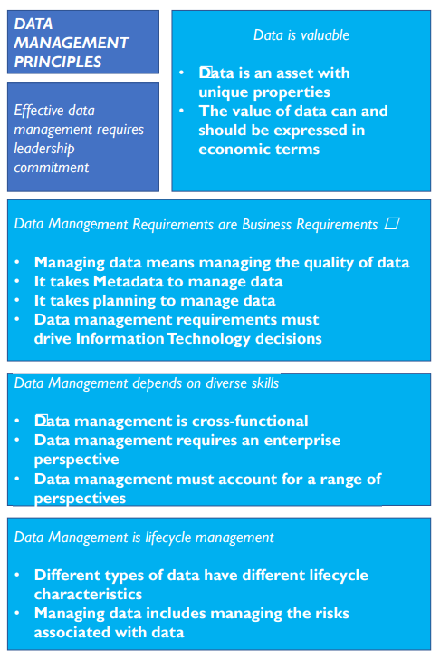

* **É preciso planejamento para gerenciar dados:** Mesmo em pequenas organizações, a complexidade dos processos e técnicos pode ser significativa. Os dados são gerados e movimentados entre diversos locais, exigindo coordenação e alinhamento de resultados. Gerenciar essa colaboração e garantir a consistência dos resultados exige um planejamento estratégico e arquitetônico.
* **O gerenciamento de dados é multifuncional:** Requer uma gama diversificada de habilidades e conhecimentos, além da capacidade de colaboração. Uma equipe única não consegue gerenciar todos os dados de uma organização. O gerenciamento de dados exige habilidades técnicas e não técnicas, além da capacidade de trabalho em equipe.
* **O gerenciamento de dados requer uma perspectiva corporativa:** A aplicação do gerenciamento de dados é local, mas deve ser abrangente para alcançar o máximo desempenho. Essa interligação entre o gerenciamento de dados e a governança de dados é crucial.
* **O gerenciamento de dados deve considerar uma variedade de perspectivas:** Os dados são inerentemente fluídos. O gerenciamento de dados deve ser adaptável e evoluir continuamente para acompanhar as mudanças na criação e utilização dos dados, bem como no comportamento dos usuários que os consomem.
* **O gerenciamento de dados é gerenciamento do ciclo de vida:** Os dados possuem um ciclo de vida, e a sua gestão requer o acompanhamento deste ciclo de vida. Como os dados geram mais dados, o próprio ciclo de vida dos dados pode ser muito complexo. As práticas de gerenciamento de dados devem considerar o ciclo de vida dos dados.
* **Diferentes tipos de dados têm diferentes características de ciclo de vida:** e, portanto, requerem diferentes abordagens de gerenciamento. As práticas de gerenciamento de dados devem reconhecer essas diferenças e ser flexíveis para atender a diferentes requisitos de ciclo de vida de dados.
* **Gerenciar dados envolve a gestão dos riscos associados a eles:** Os dados são, além de serem ativos valiosos, também portadores de riscos potenciais para uma organização. Perda, roubo ou uso indevido de dados podem gerar consequências negativas. As organizações devem considerar as implicações éticas do uso de seus dados. Os riscos associados aos dados devem ser gerenciados como parte do ciclo de vida dos dados.
* **Os requisitos de gerenciamento de dados devem orientar as decisões de TI:** Dados e gerenciamento de dados estão intrinsecamente ligados à tecnologia da informação e à gestão da TI. Gerenciar dados exige uma abordagem que priorize as necessidades estratégicas dos dados da organização, e não o contrário.
* **O gerenciamento eficaz de dados exige comprometimento da liderança:** O gerenciamento de dados exige uma série de processos complexos que, para serem efetivos, dependem de coordenação, colaboração e o compromisso da liderança. O sucesso nesse contexto exige muito mais do que habilidades de gestão – requer uma visão estratégica e um propósito que a liderança possa almejar.

### 2.5 Desafios da Gestão de Dados

Como a gestão de dados se distingue pelas propriedades inerentes dos dados, ela também enfrenta desafios na implementação desses princípios. Detalhes desses desafios são abordados nas Seções 2.5.1 a 2.5.13. Uma parcela significativa desses desafios se concentra em múltiplos princípios.

### 2.5.1 Dados Diferem de Outros Ativos[^6]

Ativos físicos podem ser observados, tocados e movidos. Geralmente, podem estar em um único local. Ativos financeiros devem ser registrados em um balanço patrimonial. No entanto, dados apresentam particularidades. Dados não são tangíveis; contudo, são duráveis; não se desgastam, embora o valor dos dados possa variar com o tempo. Dados são fáceis de copiar e transportar. Contudo, nem sempre são fácil de reproduzir em caso de perda ou destruição. Como não são consumidos quando utilizados, até podem ser roubados sem desaparecer. Dados são dinâmicos e podem ser aplicados a diversas finalidades. Da mesma forma, os mesmos dados podem ser utilizados por várias pessoas simultaneamente – uma característica que é, em geral, impossível com ativos físicos ou financeiros. A grande quantidade de dados gerados frequentemente resulta em um aumento significativo de dados. Muitas organizações necessitam gerenciar volumes crescentes de dados, e a relação entre diferentes conjuntos de dados é crucial.

Essas diferenças dificultam a atribuição de um valor monetário aos dados. Sem esse valor, é difícil determinar como os dados contribuem para o sucesso organizacional. Essas particularidades também levantam questões relevantes para o gerenciamento de dados, como definir a propriedade dos dados, inventariar a quantidade de dados que uma organização possui, proteger contra o uso indevido de dados, gerenciar riscos associados à redundância de dados e definir e aplicar padrões de Qualidade de Dados.

Apesar dos desafios em quantificar o valor dos dados, a maioria das pessoas reconhece que os dados, de fato, possuem valor. Os dados de uma organização são únicos, pois são representações específicas da organização (como listas de clientes, inventários de produtos ou histórico de reclamações) e, em caso de perda ou destruição, seriam impossíveis ou extremamente caros de substituir. Dados também são o meio pelo qual uma organização se conhece, atuando como um meta-ativo que descreve outros ativos. Assim, fornecem a base para a obtenção de insights organizacionais.

Dentro das organizações e entre elas, dados e informações são cruciais para o bom funcionamento dos negócios. A maioria das transações comerciais envolve a troca de informações. A maioria das informações são trocadas eletronicamente, gerando um rastro de dados. Esse rastro de dados pode ser utilizado para fins além de registrar as transações realizadas. Ele pode revelar informações sobre o funcionamento interno da organização.

Devido à importância dos dados em qualquer organização, é fundamental que sejam gerenciados com cuidado.

### 2.5.2 Valoração de Dados

O valor de algo é a diferença entre o custo de adquirir ou utilizar aquilo e o benefício que se obtém dele. Para muitos ativos, como ações, o cálculo do valor é relativamente simples. Este valor representa a diferença entre o custo da ação quando foi adquirida e o preço pelo qual foi vendida. No entanto, para dados, a avaliação é mais complexa, pois os custos e benefícios dos dados não são uniformes.

Como os dados de cada organização são distintos, a avaliação de dados requer uma abordagem sistemática que comece pela identificação de categorias gerais de custo e benefício que podem ser aplicadas de forma consistente dentro da organização. Exemplos de categorias incluem[^7]:

* Custo de obtenção e armazenamento de dados
* Custo de substituição de dados em caso de perda
* Impacto potencial para a organização em caso de perda de dados
* Custo de mitigação de riscos e o potencial de custos associados aos riscos relacionados aos dados
* Custo de aprimoramento dos dados
* Benefícios de dados de maior qualidade
* Quanto os concorrentes pagariam pelos dados
* Valor que os dados poderiam ser vendidos
* Receita esperada com o uso inovador dos dados

Um dos principais desafios na avaliação de ativos de dados reside na sua contextualização – ou seja, o valor de um dado pode variar significativamente dependendo da organização que o utiliza. Além disso, muitas vezes, o valor de um dado é temporal, ou seja, o valor que ele possui hoje pode mudar com o tempo. Contudo, dentro de uma organização, certos tipos de dados tendem a se tornar mais valiosos ao longo do tempo, como informações confiáveis ​​sobre clientes. A coleta de dados sobre clientes pode, por exemplo, se tornar mais relevante à medida que mais informações relacionadas ao cliente são agregadas.

Em relação à gestão de dados, estabelecer uma maneira de associar valor financeiro a esses dados é essencial. Uma vez que as organizações precisam compreender os ativos em termos econômicos para tomar decisões assertivas, a atribuição de valor aos dados se torna a base para a avaliação de atividades de gestão de dados.[^8] O processo de avaliação de dados também pode ser usado como ferramenta para a gestão de mudanças. Solicitar aos profissionais de gestão de dados e às partes interessadas que demonstrem o significado financeiro de seu trabalho pode auxiliar uma organização a transformar sua compreensão de seus próprios dados e, consequentemente, suas práticas de gestão de dados.

### 2.5.3 Qualidade dos Dados

Garantir a alta qualidade dos dados é essencial para um gerenciamento eficaz de dados. As organizações gerenciam seus dados porque buscam utilizá-los. Se não conseguirem contar com eles para satisfazer as necessidades do negócio, o esforço para coletar, armazenar, proteger e disponibilizar esses dados será inútil. Para garantir que os dados atendam às necessidades do negócio, elas devem colaborar com os consumidores de dados, definindo-as de forma a atender a esses requisitos. A qualidade dos dados é crucial para o sucesso do negócio, e isso deve ser priorizado.

Em grande parte, isso se deve à estreita relação entre os dados e a tecnologia da informação. Historicamente, o gerenciamento da Qualidade dos Dados foi visto como uma tarefa secundária, frequentemente negligenciado pelas equipes de TI, que muitas vezes consideram os dados que os sistemas devem armazenar como "lixo". Um observador, um programador, percebeu a frase "entra lixo, sai lixo", que, sem dúvida, quis deixar por isso mesmo. No entanto, aqueles que desejam utilizar os dados não podem se dar ao luxo de ignorar a qualidade. Geralmente, assume-se que os dados são confiáveis e confiáveis até que se apresente uma justificativa para duvidar dessa crença. Uma vez que a confiança é perdida, a recuperação é difícil.

A maioria das aplicações de dados se baseia no aprendizado com eles para gerar insights e criar valor. Exemplos incluem analisar os hábitos dos clientes para aprimorar produtos e serviços ou avaliar o desempenho organizacional ou tendências de mercado para desenvolver estratégias de negócios mais eficazes. Dados de baixa qualidade podem ter um impacto negativo em decisões estratégicas.

Tão importante quanto isso, dados de baixa qualidade representam um custo considerável para qualquer organização. As estimativas apontam para um intervalo de gastos entre 10% e 30% da receita, dedicados a lidar com problemas de qualidade de dados. A IBM estimou que o custo dos dados de baixa qualidade nos Estados Unidos em 2016 foi de US$ 3,1 trilhões. [^9] Muitos desses custos são discretos, indiretos e, portanto, difíceis de quantificar. Outros, como multas, são diretos e de fácil cálculo. Os custos emergem das seguintes fontes:

* Sucata e retrabalho
* Soluções alternativas e processos de correção ocultos
* Ineficiências organizacionais ou baixa produtividade
* Conflito organizacional
* Baixa satisfação no trabalho
* Insatisfação do cliente
* Custos de oportunidade, incluindo a incapacidade de inovar
* Custos de conformidade ou multas
* Custos de reputação

Os benefícios resultantes de dados de alta qualidade incluem:

* Melhor experiência do cliente
* Maior produtividade
* Redução de riscos
* Capacidade de aproveitar oportunidades
* Aumento da receita
* Vantagem competitiva obtida a partir de insights sobre clientes, produtos, processos e oportunidades

Como esses custos e benefícios se interligam, a gestão da Qualidade de Dados não é uma tarefa isolada. Produzir dados de alta qualidade exige planejamento, compromisso e uma mentalidade que inclua a qualidade em todos os processos e sistemas. Todas as funções de gerenciamento de dados podem influenciar a Qualidade de Dados, para o bem ou para o mal, portanto, todas devem considerar isso ao executar seu trabalho. (Consulte o Capítulo 13).

### 2.5.4 Planejando para Obter Dados Melhores

"Em consonância com a introdução do capítulo, a extração de valor dos dados não é um fenômeno aleatório. Requer planejamento em diversas modalidades. Começa com a identificação de que as organizações possuem controle sobre a fonte e o manejo dos dados. Se considerarem os dados como um produto que criam, tomarão decisões mais assertivas ao longo do ciclo de vida. Essas decisões exigem uma abordagem sistêmica, que engloba:

* As formas pelas quais os dados conectam processos de negócios que, de outra forma, poderiam ser considerados isolados;
* A relação entre os processos de negócios e a tecnologia que os sustenta;
* O design e a arquitetura dos sistemas e dos dados que produzem e armazenam;
* As maneiras pelas quais os dados podem ser utilizados para promover a estratégia organizacional.

O planejamento para obter dados de melhor qualidade requer uma estratégia de arquitetura, modelagem e outras funções de design. Ademais, depende da colaboração estratégica entre a liderança de negócios e a de TI. É fundamental também considerar a capacidade de conduzir projetos de forma eficaz.

O principal desafio reside, frequentemente, na pressão organizacional e nas demandas constantes de tempo e recursos, que podem dificultar a implementação de um planejamento otimizado. As organizações devem equilibrar objetivos de curto e médio prazo ao executar suas estratégias. A clareza sobre as compensações leva a decisões mais acertadas.

### 2.5.5 Metadados e Gestão de Dados

As organizações precisam de metadados confiáveis para gerenciar dados como um ativo. Metadados, nesse sentido, devem ser compreendidos em profundidade. Eles abrangem não apenas os metadados de negócios, técnicos e operacionais apresentados no Capítulo 12, mas também os metadados incorporados na Arquitetura de Dados, modelos de dados, requisitos de segurança de dados, padrões de integração de dados e processos operacionais de dados. (Consulte os Capítulos 4 a 11.)

Metadados descrevem os dados que uma organização possui, o que representam, como são classificados, de onde vieram, como se movem dentro da organização, como evoluem com o uso, quem pode e não pode usá-los e se são de alta qualidade. Dados são abstrações. Definições e outras descrições de contexto permitem que sejam compreendidos. Elas tornam os dados, o ciclo de vida dos dados e os sistemas complexos que os contêm compreensíveis.

O desafio é que metadados são uma forma de dados, e precisam ser gerenciados como tal. Organizações que não gerenciam seus dados geralmente não gerenciam seus metadados. A gestão de metadados frequentemente serve como um ponto de partida para melhorias mais amplas na gestão de dados em geral.

### 2.5.6 A Gestão de Dados é Multifuncional

A gestão de dados é um processo complexo. Os dados são distribuídos por diferentes locais dentro de uma organização por equipes responsáveis por etapas distintas do ciclo de vida dos dados. A gestão de dados exige habilidades de design para planejar sistemas, habilidades técnicas altamente especializadas para administrar hardware e desenvolver software, habilidades analíticas para compreender questões e problemas, habilidades analíticas para interpretar dados, habilidades linguísticas para gerar consenso sobre definições e modelos, e pensamento estratégico para identificar oportunidades de atender clientes e alcançar metas.

O desafio reside em que pessoas com essa variedade de habilidades e perspectivas reconheçam a interconexão entre os elementos, colaborando de forma eficaz e alinhada aos objetivos comuns.

### 2.5.7 Estabelecendo uma Perspectiva Corporativa

Gerenciar dados exige compreender o escopo e a amplitude dos dados dentro de uma organização. Dados são uma das "horizontalidades" de uma organização, abrangendo verticais como vendas, marketing e operações, ou, pelo menos, deveriam. Dados não são exclusivos de uma organização; frequentemente, são restritos a um departamento ou subdivisão interna. Como os dados são frequentemente considerados apenas um resultado dos processos operacionais – como os registros de vendas, que representam o subproduto do processo de venda – eles nem sempre são projetados para ir além da necessidade imediata.

Dentro de uma organização, os dados podem apresentar características distintas. Eles emergem de diversos locais dentro da organização. Diferentes departamentos podem modelar o mesmo conceito de maneiras distintas (por exemplo, cliente, produto, fornecedor). Como qualquer pessoa envolvida em um projeto de integração de dados ou Gestão de Dados Mestres pode observar, as escolhas de representação variadas podem gerar desafios no gerenciamento de dados em uma organização. Contudo, as partes interessadas presumem que os dados de uma organização devem ser consistentes, e um objetivo do gerenciamento de dados é garantir que sejam incorporados de maneira inteligível para que possam ser utilizados por uma ampla gama de usuários de dados.

A governança de dados tem se tornado cada vez mais relevante para ajudar as organizações a tomar decisões sobre dados em diferentes setores. (Ver Capítulo 3.)

### 2.5.8 Considerando Outras Perspectivas

As organizações atuais utilizam dados gerados internamente e dados obtidos de fontes externas. É crucial que considerem diferentes requisitos legais e de conformidade em diversos países e setores. Muitas vezes, as pessoas que criam dados não previnem o uso posterior por parte de outros. O conhecimento sobre o potencial de uso dos dados possibilita um melhor planejamento do ciclo de vida dos dados, o que, por sua vez, contribui para a obtenção de dados de maior qualidade. No entanto, os dados podem ser mal utilizados. A contabilização desse risco diminui a probabilidade de uso indevido.

### 2.5.9 O Ciclo de Vida dos Dados

Da mesma forma que outros ativos, os dados possuem um ciclo de vida. Para gerenciar eficazmente os dados, as organizações precisam compreender e planejar esse ciclo. Dados bem gerenciados são estratégicos, com uma visão clara de como serão utilizados. Uma organização estratégica definirá não apenas seus requisitos de conteúdo de dados, mas também seus requisitos de gerenciamento de dados. Estes abrangem políticas e expectativas de uso, qualidade, controles e segurança; uma abordagem corporativa para arquitetura e design, e uma abordagem sustentável para infraestrutura e desenvolvimento de software.

O ciclo de vida dos dados é intrinsecamente ligado ao ciclo de vida do produto. É importante distinguí-lo do ciclo de vida de desenvolvimento de sistemas. Formalmente, o ciclo de vida dos dados é relativamente simples de descrever (veja a Figura 2). Ele abrange os processos que geram ou obtêm dados, aqueles que os movem, transformam e armazenam, permitindo sua manutenção e compartilhamento, bem como aqueles que os utilizam ou aplicam, e aqueles que os descartam. [^10] Ao longo de seu ciclo de vida, os dados podem ser limpos, transformados, mesclados, aprimorados ou agregados. À medida que os dados são utilizados ou aprimorados, novos dados são frequentemente gerados, o que implica em iterações internas ao ciclo de vida, que não são visíveis no diagrama. Os dados raramente são estáticos. O gerenciamento de dados envolve um conjunto de processos interconectados, alinhados com o ciclo de vida dos dados.

As particularidades específicas do ciclo de vida dos dados dentro de uma organização podem ser complexas, pois os dados possuem um ciclo de vida, mas também uma linhagem (ou seja, um caminho de movimentação que acompanha o seu ponto de origem até o seu destino, frequentemente chamado de cadeia de dados). Entender essa linhagem requer a documentação da origem dos conjuntos de dados e de seu movimento e transformação pelos sistemas que os acessam e utilizam. Ciclo de vida e linhagem se complementam e podem ser entendidos em conjunto. Quanto mais uma organização compreender o ciclo de vida e a linhagem de seus dados, mais capaz será de gerenciá-los.

O foco da gestão de dados no ciclo de vida dos dados apresenta diversas implicações importantes:

* **A gestão dos dados deve ser executada com a compreensão de como são produzidos ou obtidos, bem como de como são utilizados.** A gestão de dados demanda atenção a cada etapa do processo, desde a sua origem até o seu destino final. Produzir dados exige investimento financeiro. Dados valiosos são aqueles que são consumidos ou aplicados. (Consulte os Capítulos 5, 6, 8, 11 e 14.)

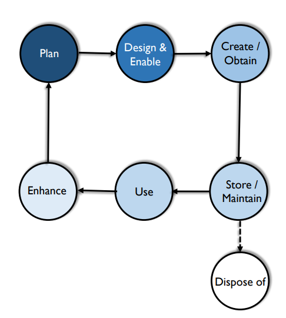

* **A qualidade dos dados deve ser gerenciada ao longo de todo o ciclo de vida dos dados.** A gestão da qualidade dos dados é fundamental para otimizar a gestão. Dados de baixa qualidade representam custo e risco, em vez de valor. As organizações frequentemente encontram desafiador gerenciar a qualidade dos dados, pois os dados são frequentemente criados como um subproduto de processos operacionais, e as organizações nem sempre definem padrões de qualidade explícitos. A qualidade da qualidade pode ser afetada por uma série de eventos do ciclo de vida, o que exige um planejamento estratégico como parte do ciclo de vida dos dados (consulte o Capítulo 13.)
* **A qualidade dos metadados deve ser gerenciada ao longo do ciclo de vida dos dados.** Como os metadados são um componente de dados, e as organizações dependem deles para gerenciar outros dados, a qualidade dos metadados deve ser gerenciada da mesma forma que a qualidade dos outros dados (consulte o Capítulo 12.)
* **A segurança dos dados deve ser gerenciada ao longo do ciclo de vida dos dados.** O gerenciamento de dados também envolve garantir que os dados estejam protegidos e mitigar os riscos associados a eles. Os dados que exigem proteção devem ser mantidos seguros durante todo o seu ciclo de vida, desde a criação até o descarte (consulte o Capítulo 7, Segurança de Dados.)
* **Os esforços de gestão de dados devem se concentrar nos dados mais críticos de uma organização.** Muitas organizações produzem uma grande quantidade de dados, muitos dos quais nunca são realmente utilizados. O gerenciamento do ciclo de vida exige focar nos dados mais relevantes para o negócio e minimizar o "dados redundantes, obsoletos e triviais" (Aiken, 2014).

### 2.5.10 Diferentes Tipos de Dados

O gerenciamento de dados se torna mais complexo devido à existência de diversos tipos de dados com requisitos de gestão distintos ao longo de seu ciclo de vida. Qualquer sistema de gerenciamento precisa classificar os objetos gerenciados. Os dados podem ser categorizados por tipo (como transacionais, referência, mestres, metadados, ou categorias, recursos, eventos, dados detalhados de transações) ou por conteúdo (como domínios de dados, áreas temáticas, formatos ou níveis de proteção que exigem). Além disso, os dados podem ser classificados por como são armazenados ou acessados. (Consulte os Capítulos 5 e 10.)

Como diferentes tipos de dados apresentam requisitos distintos, estão associados a diferentes riscos e desempenham papéis específicos dentro de uma organização. Muitas ferramentas de gerenciamento de dados se concentram em aspectos de classificação e controle (Bryce, 2005). Por exemplo, os Dados Mestres exigem gerenciamento distintos em relação aos dados transacionais. (Ver Capítulos 9, 10, 12 e 14.)

### 2.5.11 Dados e Riscos

Dados não se limitam a representarem apenas valor; também apresentam riscos significativos. Dados de baixa qualidade, como imprecisos, incompletos ou desatualizados, são inerentemente arriscados, pois suas informações são incorretas. Contudo, os dados em si são vulneráveis, pois podem ser mal compreendidos e mal utilizados.

As organizações buscam maximizar o valor dos dados de alta qualidade, disponíveis, relevantes, completos, precisos, consistentes, oportunos, utilizáveis, significativos e compreendidos. No entanto, frequentemente enfrentam lacunas de informação – a diferença entre o que possuem e o que precisam para tomar decisões eficazes. Essas lacunas representam responsabilidades empresariais com potenciais impactos significativos na eficácia operacional e na lucratividade. Organizações que reconhecem o valor de dados de alta qualidade buscam, por meio de medidas proativas e estratégicas, aprimorar a qualidade e a usabilidade de dados e informações, dentro de estruturas culturais regulatórias e éticas.

O crescente papel da informação como um ativo organizacional em todos os setores impulsionou um foco crescente por parte de reguladores e legisladores em relação aos potenciais usos e abusos da informação. A Lei Sarbanes-Oxley (com foco em controles sobre a precisão e validade dos dados de transações financeiras, da transação ao balanço patrimonial), a Solvência II (com foco na linhagem e na qualidade dos dados que sustentam modelos de risco e adequação de capital no setor de seguros) e o rápido crescimento na última década das regulamentações de privacidade de dados (abrangendo o processamento de dados sobre pessoas em uma ampla gama de setores e jurisdições), demonstram essa tendência.  Embora a Contabilidade ainda não inclua a Informação como um ativo no balanço patrimonial, o ambiente regulatório espera cada vez mais que essa informação seja integrada ao registro de riscos, com a aplicação de medidas de mitigação e controles apropriados.

Da mesma forma, com o crescente conhecimento dos consumidores sobre o uso de seus dados, eles buscam não apenas uma operação de processos mais eficiente e tranquila, mas também a proteção de suas informações e o respeito à sua privacidade. Isso implica que o escopo dos stakeholders estratégicos para a gestão de dados pode se expandir consideravelmente, em comparação com o que se costuma considerar. (Consulte os Capítulos 2, Ética no Tratamento de Dados e 7, Segurança de Dados.)

No entanto, o impacto da gestão da informação no balanço patrimonial tem se intensificado quando esses riscos não são gerenciados, e os acionistas, ao votarem em suas carteiras de ações, os reguladores impõem multas ou restringem as operações, e os clientes, por sua vez, votam com seus investimentos.

### 2.5.12 Gestão de Dados e Tecnologia

Conforme observado na introdução do capítulo e em outras partes, as atividades de gestão de dados são abrangentes e exigem habilidades técnicas e comerciais. Dada a predominância do armazenamento eletrônico de dados atualmente, as táticas de gestão de dados são fortemente influenciadas pela tecnologia. Essa interligação entre a gestão de dados e a gestão de tecnologia remonta ao início do conceito. Essa relação ainda se mantém presente em muitas organizações, onde frequentemente existe uma tensão entre o desejo de desenvolver novas tecnologias e o anseio por dados mais confiáveis – como se fossem obstáculos mútuos, quando na verdade são complementares.

Uma gestão de dados bem-sucedida demanda decisões sólidas sobre tecnologia, mas gerenciar a tecnologia não equivale a gerenciar os dados. As organizações precisam compreender o impacto da tecnologia nos dados para evitar que a influência tecnológica distorça suas decisões. Em vez disso, os requisitos de dados, alinhados à estratégia de negócios, devem nortear as decisões sobre tecnologia.

### 2.5.13 A Gestão Eficaz de Dados Exige Liderança e Comprometimento

O Manifesto de Dados do Líder (2017) apontou que “as melhores oportunidades de crescimento orgânico de uma organização residem nos dados”. Embora a maioria das organizações reconheça seus dados como um ativo, poucas são efetivamente orientadas por eles. Muitas não sabem quais dados possuem ou quais são os mais críticos para seus negócios, confundindo-os com a tecnologia da informação e administrando-os de forma inadequada. A falta de uma abordagem estratégica em relação aos dados e a subestimação do trabalho envolvido na sua gestão, contribuem para aumentar os desafios da gestão de dados, evidenciando um fator crucial para o potencial de sucesso de uma organização: liderança comprometida e o envolvimento de todos em todos os níveis. [^11]

Os desafios descritos acima devem reforçar este ponto: a gestão de dados não é simples, e sua complexidade representa uma fonte de oportunidades amplamente inexploradas. Para superar esses desafios, é preciso visão, planejamento e disposição para mudar. (Ver Capítulos 15 a 17.)

A defesa da função de Chief Data Officer (CDO) deriva do reconhecimento de que a gestão de dados apresenta desafios únicos, e que uma gestão bem-sucedida deve ser impulsionada pelos negócios, e não pela TI. Um CDO pode liderar iniciativas de gestão de dados, permitindo que uma organização aproveite seus ativos de dados e obtenha vantagem competitiva. No entanto, além de liderar iniciativas, o CDO deve promover mudanças culturais, facilitando uma abordagem mais estratégica para os dados da organização.

### 2.6 Estratégia de Gestão de Dados

Uma estratégia é um conjunto de escolhas e decisões que, em conjunto, definem um curso de ação de alto nível para alcançar objetivos ambiciosos. No xadrez, uma estratégia consiste em uma sequência de movimentos que visa a vitória por xeque-mate ou a sobrevivência por impasse. Um plano estratégico, por sua vez, é um curso de ação de alto nível, desenvolvido para atingir objetivos significativos.

Uma estratégia de dados deve incluir planos de negócios que explorem os dados como vantagem competitiva e que os utilizem para apoiar os objetivos da empresa. Essa estratégia deve partir da compreensão das necessidades de dados inerentes à estratégia de negócios: quais dados a organização precisa, como obtê-los-á, como os gerenciará e garantirá sua confiabilidade ao longo do tempo, além de como os utilizará.

Normalmente, uma estratégia de dados requer uma estratégia de programa de Gestão de Dados como suporte – um plano para manter e aprimorar a qualidade, a integridade, o acesso e a segurança dos dados, ao mesmo tempo em que mitiga riscos conhecidos e potenciais. A estratégia também deve abordar os desafios relacionados à gestão de dados.

Em muitas organizações, a estratégia de gestão de dados é responsabilidade do CDO e é implementada por uma equipe de governança de dados, com o apoio de um Conselho de Governança de Dados. Frequentemente, o CDO elabora uma estratégia de dados inicial e uma estratégia de gestão de dados antes mesmo da formação do Conselho de Governança de Dados, visando obter o compromisso da alta administração com o estabelecimento da administração e governança de dados.

Os componentes de uma estratégia de gerenciamento de dados devem incluir:

* Uma visão convincente para o gerenciamento de dados
* Um resumo do *business case* para gerenciamento de dados, com exemplos selecionados
* Princípios orientadores, valores e perspectivas de gestão
* A missão e os objetivos de longo prazo do gerenciamento de dados
* Medidas propostas para o sucesso do gerenciamento de dados
* Objetivos de curto prazo (12 a 24 meses) do programa de gerenciamento de dados que sejam SMART (específicos, mensuráveis, acionáveis, realistas e com prazo determinado)
* Descrições das funções e organizações de gerenciamento de dados, juntamente com um resumo de suas responsabilidades e direitos de decisão
* Descrições dos componentes e iniciativas do programa de gerenciamento de dados
* Um programa de trabalho priorizado com limites de escopo
* Um rascunho do roteiro de implementação com projetos e itens de ação

Os resultados do planejamento estratégico para gerenciamento de dados incluem:

* Uma relatório de gerenciamento de dados: visão geral, *business case*, metas, princípios orientadores, medidas de sucesso, fatores críticos de sucesso, riscos reconhecidos, modelo operacional, etc.
* Uma declaração de escopo do gerenciamento de dados: Metas e objetivos para um horizonte de planejamento (geralmente 3 anos) e as funções, organizações e líderes individuais responsáveis para atingir esses objetivos.
* Um roteiro de implementação de gestão de dados: Identificando programas, projetos, atribuições de tarefas e marcos de entrega específicos (ver Capítulo 15).

A estratégia de gestão de dados deve abordar todas as áreas de conhecimento do framework de gestão de dados relevantes para a organização. (Ver Figura 5: O Framework de Gestão de Dados DAMA-DMBOK2 (A Roda DAMA e Seções 3.3 e 4.)

## 3. Estruturas de Gestão de Dados

A gestão de dados envolve um conjunto de funções interdependentes, cada uma com seus próprios objetivos, atividades e responsabilidades. Os profissionais da gestão de dados precisam considerar os desafios inerentes à derivação de valor de um ativo corporativo abstrato, equilibrando objetivos estratégicos e operacionais, requisitos técnicos e de negócios específicos, demandas de risco e conformidade, e as divergências sobre a qualidade e representatividade dos dados.

Há muito a ser monitorado, e essa complexidade justifica a necessidade de uma estrutura para compreender a gestão de dados de forma abrangente e visualizar as relações entre seus componentes. Devido à dependência entre as funções e à necessidade de alinhamento, as pessoas responsáveis pelos diferentes aspectos da gestão de dados devem colaborar para que a organização extraia valor de seus dados.

Estruturas desenvolvidas em diferentes níveis de abstração oferecem uma gama de perspectivas sobre como abordar a gestão de dados. Essas perspectivas fornecem insights que podem ser utilizados para esclarecer estratégias, desenvolver roteiros, organizar equipes e alinhar funções.

As ideias e os conceitos apresentados no DMBOK2 serão aplicados de forma distinta em todas as organizações. A abordagem de uma organização para a gestão de dados depende de fatores-chave como seu setor, a amplitude dos dados utilizados, sua cultura, nível de maturidade, estratégia, visão e os desafios específicos que enfrenta. As estruturas descritas nesta seção fornecem lentes para analisar a gestão de dados e aplicar os conceitos apresentados no DMBOK.

* Os dois primeiros, o Modelo de Alinhamento Estratégico e o Modelo de Informação de Amsterdã, apresentam relacionamentos de alto nível que influenciam a forma como uma organização gerencia dados.
* O Modelo DAMA DMBOK (A Roda DAMA, o Hexágono e o Diagrama de Contexto) descreve as Áreas de Conhecimento em Gestão de Dados, conforme definidas pelo DAMA, e explica como são representadas visualmente no DMBOK.
* Os dois últimos tomam a Roda DAMA como ponto de partida e reorganizam as peças para melhor compreender e descrever os relacionamentos entre elas.

### 3.1 Modelo de Alinhamento Estratégico

O Modelo de Alinhamento Estratégico (Henderson e Venkatraman, 1999) abstrai os principais motivadores para qualquer abordagem à gestão de dados, concentrando-se na relação entre dados e informações. A informação está frequentemente associada à estratégia de negócios e ao uso operacional dos dados, enquanto os dados estão ligados à tecnologia da informação e aos processos que garantem o acesso físico aos dados para uso. Em torno desse conceito, definem-se quatro domínios fundamentais da escolha estratégica: estratégia de negócios, estratégia de tecnologia da informação, infraestrutura e processos organizacionais, e infraestrutura e processos de tecnologia da informação.

O Modelo de Alinhamento Estratégico, totalmente articulado, é mais complexo do que o representado na Figura 3. Cada um dos vértices possui dimensões subjacentes. Por exemplo, tanto na estratégia de negócios quanto na de TI, é necessário considerar o escopo, as competências e a governança. As operações devem levar em conta a infraestrutura, os processos e as habilidades envolvidas. Os relacionamentos entre os componentes auxiliam uma organização a entender o alinhamento estratégico dos diferentes elementos, bem como a integração funcional das peças. Mesmo a representação de alto nível do modelo é útil para compreender os fatores organizacionais que influenciam as decisões sobre dados e gerenciamento de dados.

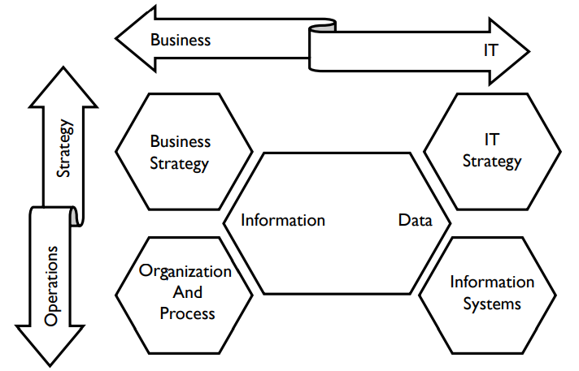
Figura 3 Modelo de Alinhamento Estratégico[^12]

### 3.2 O Modelo de Informação de Amsterdã

O Modelo de Informação de Amsterdã, assim como o Modelo de Alinhamento Estratégico (Abcouwer, Maes e Truijens, 1997), adota uma perspectiva estratégica sobre o alinhamento de negócios e TI. Conhecido como "9 células", ele reconhece uma camada intermediária que se concentra em estrutura e táticas, incluindo planejamento e arquitetura. Além disso, reconhece a necessidade de comunicação da informação, expressa como o pilar de governança da informação e qualidade dos dados (Figura 4).

Os criadores das estruturas SAM e AIM descrevem detalhadamente a relação entre os componentes, tanto de uma perspectiva horizontal (negócios/estratégia de TI) quanto vertical (estratégia de negócios/operações de negócios).

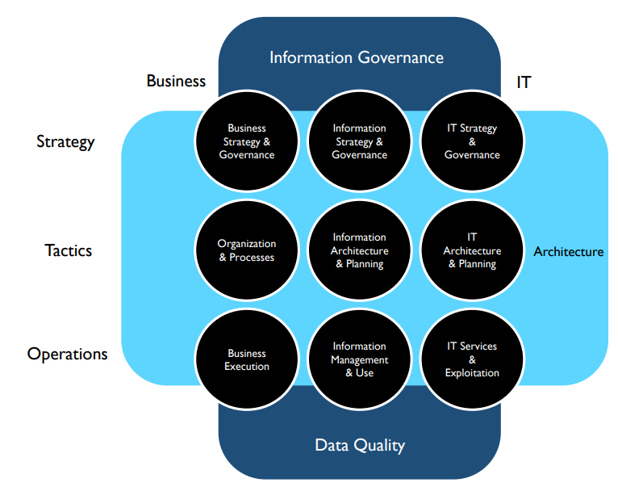
Figura 4 Modelo de Informação de Amsterdã[^14]

### 3.3 A Estrutura DAMA-DMBOK

A Estrutura DAMA-DMBOK aborda com mais detalhes as Áreas de Conhecimento que compõem o escopo geral da gestão de dados. Três visuais ilustram a Estrutura de Gestão de Dados da DAMA:

* A Roda DAMA (Figura 5)
* O hexágono dos Fatores Ambientais (Figura 6)
* O Diagrama de Contexto das Áreas de Conhecimento (Figura 7)

A Roda DAMA define as Áreas de Conhecimento da Gestão de Dados, posicionando a governança de dados como o elemento central das atividades de gestão. Isso ocorre porque a governança é crucial para garantir a consistência e o alinhamento entre as funções. As demais Áreas de Conhecimento (Arquitetura de Dados, Modelagem de Dados, etc.) são organizadas em torno da Roda, sendo todas partes integrantes de uma função madura de gestão de dados. No entanto, sua implementação pode ocorrer em momentos distintos, em função das necessidades da organização. Essas Áreas de Conhecimento são o foco dos Capítulos 3 a 13 do DMBOK2. (Ver Figura 5.)

O hexágono dos Fatores Ambientais ilustra a relação entre pessoas, processos e tecnologia, servindo como referência para a compreensão dos diagramas de contexto do DMBOK. Ele concentra-se em metas e princípios, que fornecem a orientação necessária para que as pessoas executem as atividades e utilizem as ferramentas adequadas para um gerenciamento de dados bem-sucedido. (Veja a Figura 6.)

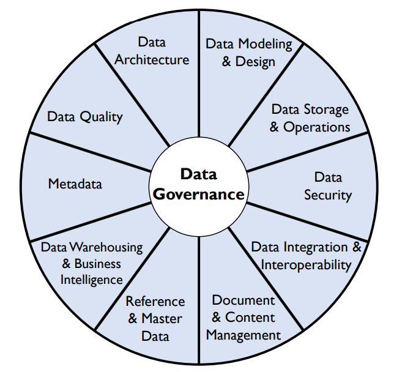
Figura 5 Estrutura de Gerenciamento de Dados DAMA-DMBOK2 (A Roda DAMA)

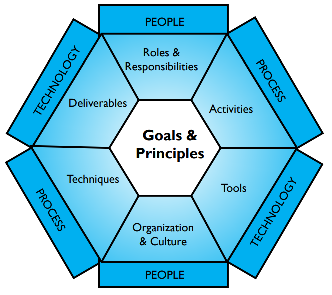
Figura 6 Hexágono de Fatores Ambientais DAMA

Os Diagramas de Contexto da Área de Conhecimento (ver Figura 7) descrevem os detalhes dessas áreas, incluindo pessoas, processos e tecnologia. Baseiam-se no conceito de diagrama SIPOC, utilizado na gestão de produtos (Fornecedores, Entradas, Processos, Saídas e Consumidores). Os Diagramas de Contexto situam as atividades no centro, pois são responsáveis pela produção das entregas que atendem aos requisitos das partes interessadas.

Cada diagrama de contexto inicia com a definição e os objetivos da Área de Conhecimento. As atividades que impulsionam esses objetivos (centralmente posicionadas) são categorizadas em quatro fases: Planejar (P), Desenvolver (D), Operar (O) e Controlar (C). No lado esquerdo (alimentando as atividades), encontram-se as Entradas e os Fornecedores. No lado direito (originando-se das atividades), estão as Entregas e os Consumidores. Os participantes são listados abaixo das Atividades. Na parte inferior, encontram-se as Ferramentas, Técnicas e Métricas que influenciam os aspectos da Área de Conhecimento.

As listas nos diagramas de contexto são ilustrativas e não exaustivas. Os itens podem variar de aplicação entre diferentes organizações. As listas de funções de alto nível contemplam apenas as funções mais relevantes. Cada organização pode adaptar este padrão para atender às suas próprias necessidades.

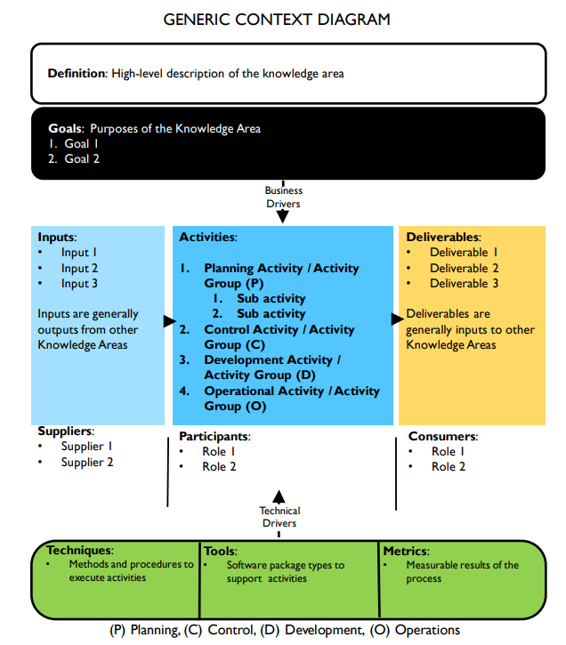
Figura 7 Diagrama de Contexto da Área de Conhecimento

Os componentes do diagrama de contexto incluem:

1. Definição: Esta seção define concisamente a Área de Conhecimento.
2. Objetivos descrevem o propósito da Área de Conhecimento e os princípios fundamentais que orientam o desempenho das atividades dentro de cada Área de Conhecimento.
3. Atividades são as ações e tarefas necessárias para atingir os objetivos da Área de Conhecimento. Algumas atividades são descritas em termos de subatividades, tarefas e etapas. As atividades são classificadas em quatro categorias: Planejar, Desenvolver, Operar e Controlar.
  1. (P) As Atividades de Planejamento definem o curso estratégico e tático para atingir as metas de gerenciamento de dados. As atividades de planejamento ocorrem de forma recorrente.
  2. (D) As Atividades de Desenvolvimento são organizadas em torno do ciclo de vida de desenvolvimento de sistemas (SDLC) (análise, projeto, construção, teste, preparação e implantação).
  3. (C) As Atividades de Controle garantem a qualidade contínua dos dados e a integridade, confiabilidade e segurança dos sistemas por meio dos quais os dados são acessados ​​e utilizados.
  4. (O) As Atividades Operacionais apoiam o uso, a manutenção e o aprimoramento de sistemas e processos por meio dos quais os dados são acessados ​​e utilizados.
4. Entradas são os elementos tangíveis que cada Área de Conhecimento requer para iniciar suas atividades. Muitas atividades exigem os mesmos elementos. Por exemplo, muitas exigem conhecimento da Estratégia de Negócios como elemento de entrada.
5. Entregas são os resultados das atividades dentro da Área de Conhecimento, os elementos tangíveis pelos quais cada função é responsável. As entregas podem ser fins em si mesmas ou insumos para outras atividades. Diversas entregas primárias são criadas por múltiplas funções.
6. Funções e Responsabilidades descrevem como indivíduos e equipes contribuem para as atividades dentro da Área de Conhecimento. As funções são descritas conceitualmente, com foco nos grupos de funções exigidos na maioria das organizações. As funções individuais são definidas em termos de habilidades e requisitos de qualificação. O Skills Framework for the Information Age (SFIA) foi utilizado para ajudar a alinhar os títulos das funções. Muitas funções serão multifuncionais.[^15] (Ver Capítulo 16).
7. Fornecedores são as pessoas responsáveis ​​por fornecer ou viabilizar o acesso a insumos para as atividades.
8.  Consumidores são aqueles que se beneficiam diretamente das entregas primárias geradas pelas atividades de gerenciamento de dados.
9.  Participantes são as pessoas que executam, gerenciam a execução ou aprovam as atividades na Área de Conhecimento.
10. Ferramentas são os aplicativos e outras tecnologias que viabilizam os objetivos da Área de Conhecimento.[^16]
11. Técnicas são os métodos e procedimentos utilizados para executar atividades e produzir entregas dentro de uma Área de Conhecimento. Técnicas incluem convenções comuns, recomendações de melhores práticas, padrões e protocolos e, quando aplicável, abordagens alternativas emergentes.
12. Métricas são padrões para mensuração ou avaliação de desempenho, progresso, qualidade, eficiência ou outros efeitos. As seções de métricas identificam facetas mensuráveis ​​do trabalho realizado em cada Área de Conhecimento. Métricas também podem mensurar características mais abstratas, como melhoria ou valor.

Enquanto a Roda DAMA apresenta o conjunto de Áreas de Conhecimento em alto nível, o Hexágono reconhece os componentes da estrutura das Áreas de Conhecimento, e os Diagramas de Contexto apresentam os detalhes dentro de cada Área de Conhecimento. Nenhuma das partes da estrutura de Gerenciamento de Dados DAMA existente descreve a relação entre as diferentes Áreas de Conhecimento. Os esforços para abordar essa questão resultaram em reformulações da Estrutura DAMA, que são descritas nas próximas duas seções.

### 3.4 Pirâmide DMBOK (Aiken)

Se questionadas, muitas organizações afirmariam que desejam maximizar seus dados – buscando a tão almejada “pirâmide de ouro” de práticas avançadas (mineração de dados, análise de dados, etc.). No entanto, essa pirâmide representa apenas o ápice de uma estrutura maior, o auge de uma base sólida. A maioria das organizações não dispõe do luxo de definir uma estratégia de gerenciamento de dados antes de iniciar essa jornada. Em vez disso, constroem essa capacidade, frequentemente em condições menos ideais.

A estrutura de Peter Aiken utiliza as áreas funcionais do DMBOK para descrever a situação comum em muitas organizações. Uma organização pode utilizá-la para traçar um caminho em direção a um estado em que possua dados e processos confiáveis, capazes de apoiar objetivos estratégicos de negócios. Ao perseguir esse objetivo, muitas organizações passam por uma progressão lógica de etapas (ver Figura 8):

* **Fase 1:** A organização adquire um aplicativo que inclui recursos de banco de dados. Isso significa que ela tem um ponto de partida para modelagem/design de dados, armazenamento de dados e segurança de dados (por exemplo, permitindo que algumas pessoas tenham acesso e restringindo o acesso de outras). Para que o sistema funcione adequadamente em seu ambiente e com seus dados, é necessário investir em integração e interoperabilidade.
* **Fase 2:** Ao utilizar o aplicativo, as organizações encontrarão desafios relacionados à qualidade de seus dados. No entanto, a obtenção de dados de maior qualidade depende de metadados confiáveis e de uma arquitetura de dados consistente. Isso proporciona clareza sobre como os dados de diferentes sistemas interagem.
* **Fase 3:** Práticas disciplinadas de gerenciamento da qualidade de dados, metadados e arquitetura exigem governança de dados que ofereça suporte estrutural às atividades de gerenciamento de dados. A Governança de Dados também permite a execução de iniciativas estratégicas, como Gestão de Documentos e Conteúdo, Gestão de Dados de Referência, Gestão de Dados Mestres, Data Warehousing e Business Intelligence, que viabilizam plenamente as práticas avançadas da “pirâmide de ouro”.
* **Fase 4:** A organização aproveita os benefícios de dados bem gerenciados e aprimora suas capacidades analíticas.

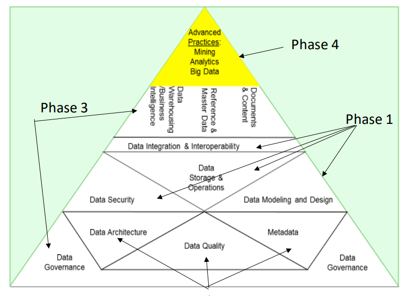
Figura 8 Capacidade de Banco de Dados Adquirida ou Construída[^17]

A pirâmide de Aiken se baseia na Roda DAMA, mas também a informa ao mostrar a relação entre as Áreas de Conhecimento. Estas não são todas intercambiáveis; elas possuem vários tipos de interdependência. A estrutura da pirâmide tem dois impulsionadores: primeiro, a ideia de construir sobre uma base, utilizando componentes que devem estar nos lugares certos para se apoiarem mutuamente; segundo, a ideia, por vezes contraditória, de que podem ser organizados em uma ordem arbitrária.

### 3.5 A Evolução da Estrutura de Gerenciamento de Dados DAMA

A pirâmide de Aiken descreve como as organizações evoluem em direção a melhores práticas de gerenciamento de dados. Outra abordagem para analisar as Áreas de Conhecimento DAMA é explorar as interdependências entre elas. Desenvolvido por Sue Geuens, o framework da Figura 9 reconhece que as funções de Business Intelligence e Analítica dependem de todas as outras funções de gerenciamento de dados. Estas, por sua vez, dependem de soluções de Dados Mestres e data warehouse. Sistemas e aplicativos de alimentação, por sua vez, dependem destas. Práticas confiáveis ​​de Qualidade de Dados, design de dados e interoperabilidade de dados formam a base de sistemas e aplicativos confiáveis. Adicionalmente, a governança de dados – que neste modelo inclui Gerenciamento de Metadados, segurança de dados, Arquitetura de Dados e Gerenciamento de Dados de Referência – fornece a base sobre a qual todas as outras funções dependem.

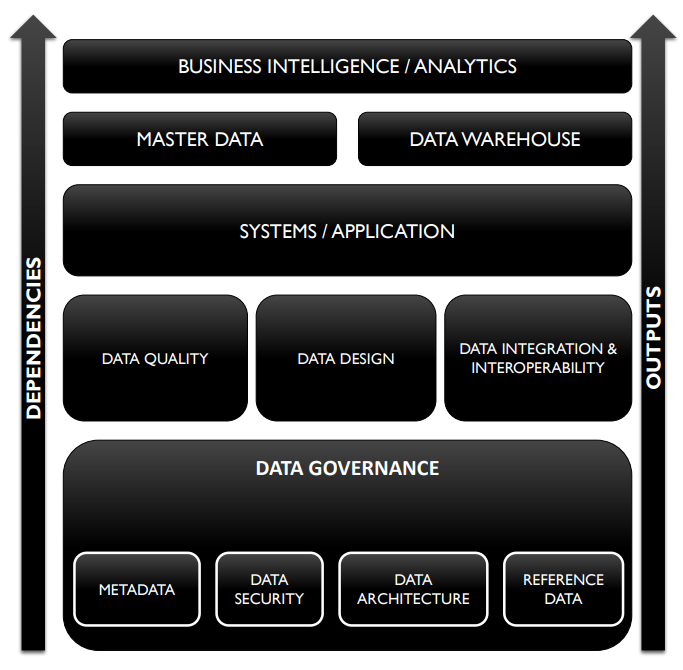
Figura 9 Dependências da Área Funcional do DAMA

Uma terceira alternativa à Roda DAMA é apresentada na Figura 10. Ela também se baseia em conceitos arquitetônicos para propor um conjunto de relacionamentos entre as Áreas de Conhecimento DAMA, fornecendo detalhes adicionais sobre o conteúdo de algumas delas para esclarecer esses relacionamentos.

A estrutura parte do objetivo principal do gerenciamento de dados: permitir que as organizações obtenham valor de seus ativos de dados, de forma similar ao que fazem com outros ativos. A obtenção desse valor requer gerenciamento do ciclo de vida, portanto, as funções de gerenciamento de dados relacionadas ao ciclo de vida dos dados são representadas no centro do diagrama. Essas funções incluem o planejamento e o design para dados confiáveis ​​e de alta qualidade; o estabelecimento de processos e funções pelos quais os dados podem ser habilitados para uso e mantidos; e, finalmente, o uso dos dados em diversos tipos de análise, aprimorando seu valor por meio desses processos.

A seção de gerenciamento do ciclo de vida descreve o design do gerenciamento de dados e as funções operacionais (modelagem, arquitetura, armazenamento e operações, etc.) necessárias para dar suporte aos usos tradicionais de dados (Business Intelligence, gerenciamento de documentos e conteúdo). Ela também reconhece funções emergentes de gerenciamento de dados (armazenamento de Big Data) que dão suporte aos usos emergentes de dados (Ciência de Dados, análise preditiva, etc.). Nos casos em que os dados são verdadeiramente gerenciados como um ativo, as organizações podem obter valor direto de seus dados, vendendo-os para outras organizações (monetização de dados).

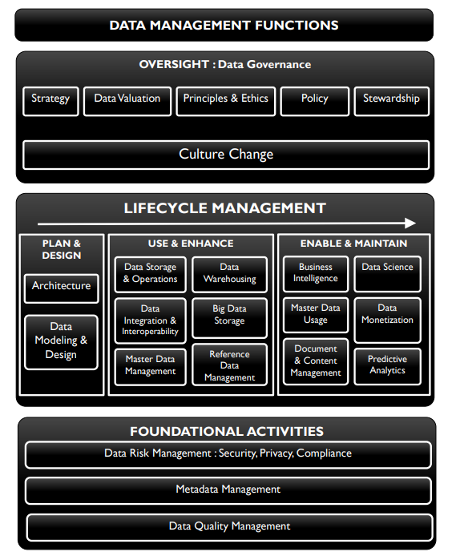
Figura 10 Estrutura da Função de Gerenciamento de Dados DAMA

Organizações que se concentram apenas em funções diretas do ciclo de vida dos dados não obtêm tanto valor de seus dados quanto aquelas que apoiam o ciclo de vida dos dados por meio de atividades fundamentais e de supervisão. Essas atividades fundamentais, como gerenciamento de riscos de dados, metadados e gestão da qualidade de dados, abrangem todo o ciclo de vida dos dados, permitindo melhores decisões de design e facilitando o uso dos dados. Se bem executadas, a manutenção dos dados se torna mais econômica, os consumidores de dados ganham mais confiança neles e as oportunidades de uso se expandem.

Para apoiar com sucesso a produção e o uso de dados e garantir que as atividades fundamentais sejam executadas com disciplina, muitas organizações estabelecem a supervisão por meio da governança de dados. Um programa de governança de dados permite que uma organização seja orientada por dados, implementando a estratégia e apoiando princípios, políticas e práticas de administração que garantam que a organização reconheça e aproveite as oportunidades de obter valor de seus dados. Um programa de governança de dados também deve se envolver em atividades de gestão de mudanças organizacionais, para educar a organização e incentivar comportamentos que permitam o uso estratégico dos dados. Assim, a necessidade de mudança cultural abrange toda a amplitude das responsabilidades de governança de dados, especialmente à medida que uma organização amadurece suas práticas de gestão de dados.

O Framework de Gestão de Dados DAMA também pode ser descrito como uma evolução da Roda DAMA, com atividades principais cercadas por atividades de ciclo de vida e uso, contidas dentro das restrições da governança. (Veja a Figura 11.)

As atividades principais, incluindo Gestão de Metadados, Gestão da Qualidade de Dados e definição da estrutura de dados (arquitetura), estão no cerne do framework.

As atividades de gerenciamento do ciclo de vida podem ser definidas a partir de uma perspectiva de planejamento (gerenciamento de riscos, modelagem, design de dados, Gerenciamento de Dados de Referência) e de uma perspectiva de capacitação (Gerenciamento de Dados Mestres, desenvolvimento de tecnologias de dados, integração e interoperabilidade de dados, data warehousing e armazenamento, e operações de dados).

Os usos emergem dessas atividades de gerenciamento do ciclo de vida: uso de dados mestres, gerenciamento de documentos e conteúdo, Business Intelligence, Ciência de Dados, análise preditiva e visualização de dados. Muitas delas geram mais dados, aprimorando ou desenvolvendo insights sobre os dados existentes. Oportunidades para a monetização de dados podem ser identificadas como usos de dados.

As atividades de governança de dados fornecem supervisão e controle, por meio de estratégia, princípios, políticas e administração. Elas permitem a consistência por meio da classificação e valoração de dados.

A intenção ao apresentar diferentes representações visuais do DAMA Data Management Framework é fornecer uma perspectiva adicional e promover o debate sobre como aplicar os conceitos apresentados no DMBOK. À medida que a importância do gerenciamento de dados cresce, tais frameworks se tornam ferramentas de comunicação úteis tanto dentro da comunidade de gerenciamento de dados quanto entre essa comunidade e seus stakeholders.

## 4. DAMA e o DMBOK

Embora a gestão de dados apresente muitos desafios, poucos são novos. Desde pelo menos a década de 1980, as organizações reconhecem que a gestão de dados é fundamental para o seu sucesso. À medida que nossa capacidade e desejo de criar e explorar dados aumentaram, também aumentou a necessidade de práticas confiáveis de gestão de dados.

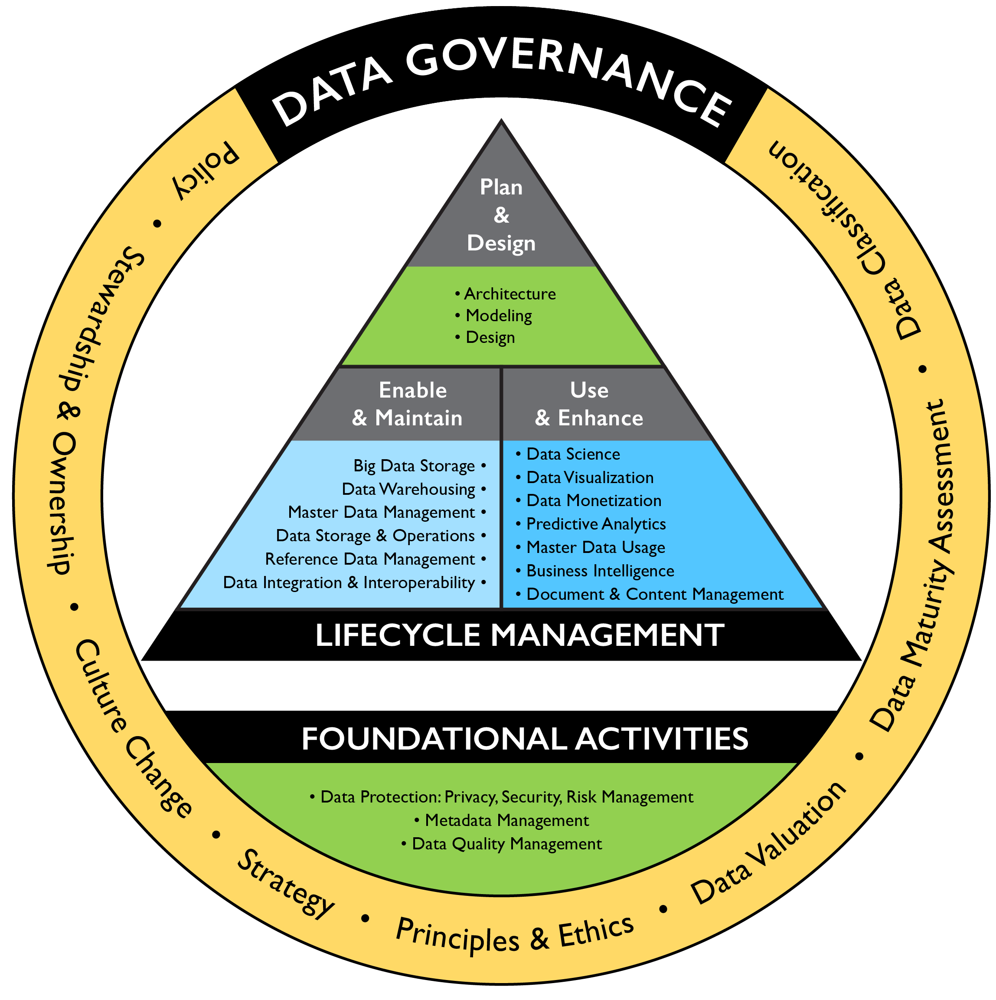
Figura 11: A Roda DAMA Evoluída

A DAMA foi fundada para enfrentar esses desafios. O DMBOK, um livro de referência acessível e confiável para profissionais de gestão de dados, apoia a missão da DAMA ao:

*   Fornecer uma estrutura funcional para a implementação de práticas de gestão de dados corporativos, incluindo princípios orientadores, práticas amplamente adotadas, métodos e técnicas, funções, papéis, entregas e métricas.
*   Estabelecer um vocabulário comum para conceitos de gestão de dados e servir como base para as melhores práticas para profissionais de gestão de dados.
*   Servir como guia de referência fundamental para o CDMP (Certified Data Management Professional) e outros exames de certificação.

O DMBOK é estruturado em torno das onze Áreas de Conhecimento do Framework de Gerenciamento de Dados DAMA-DMBOK (também conhecido como Roda DAMA – veja a Figura 5). Os Capítulos 3 a 13 concentram-se nessas Áreas de Conhecimento. Cada capítulo de uma Área de Conhecimento segue uma estrutura comum:

1. Introdução
   1. Diretrizes de Negócios
   2. Objetivos e Princípios
   3. Conceitos Essenciais
2. Atividades
3. Ferramentas
4. Técnicas
5. Diretrizes de Implementação
6. Relação com a Governança de Dados
7. Métricas

As Áreas de Conhecimento descrevem o escopo e o contexto de conjuntos de atividades de gerenciamento de dados. Incorporadas a essas áreas estão os objetivos e princípios fundamentais do gerenciamento de dados. Em virtude do fluxo horizontal dos dados dentro das organizações, as atividades das Áreas de Conhecimento se interligam entre si e com outras funções organizacionais.

1. A Governança de Dados fornece direção e supervisão para o gerenciamento de dados, estabelecendo um sistema de direitos de decisão sobre os dados, considerando as necessidades da empresa. (Capítulo 3)
2. A Arquitetura de Dados define o modelo para o gerenciamento de ativos de dados, alinhando-se à estratégia organizacional para estabelecer requisitos e designs estratégicos de dados. (Capítulo 4)
3. Modelagem e Design de Dados é o processo de descobrir, analisar, representar e comunicar os requisitos de dados em um formato preciso, denominado modelo de dados. (Capítulo 5)
4. Armazenamento e Operações de Dados incluem o design, a implementação e o suporte dos dados armazenados, visando maximizar seu valor. As Operações fornecem suporte durante todo o ciclo de vida dos dados, desde o planejamento até o descarte. (Capítulo 6)
5. A Segurança de Dados garante que a privacidade e a confidencialidade dos dados sejam mantidas, que não haja violações e que sejam acessados de forma adequada. (Capítulo 7)
6. Integração e Interoperabilidade de Dados incluem processos relacionados à movimentação e consolidação de dados dentro e entre armazenamentos de dados, aplicativos e organizações. (Capítulo 8)
7. Gerenciamento de Documentos e Conteúdo inclui atividades de planejamento, implementação e controle utilizadas para gerenciar o ciclo de vida de dados e informações encontradas em diversas mídias não estruturadas, especialmente documentos necessários para atender aos requisitos de conformidade legal e regulatória. (Capítulo 9)
8. Dados Mestres e de Referência incluem a reconciliação e a manutenção contínua de dados essenciais compartilhados e críticos, permitindo o uso consistente de todas as versões mais precisas, oportunas e relevantes da verdade sobre entidades empresariais essenciais. (Capítulo 10)
9. Armazenamento de Dados e Inteligência de Negócios incluem os processos de planejamento, implementação e controle para gerenciar dados de suporte à decisão, permitindo que profissionais do conhecimento obtenham valor dos dados por meio de análises e relatórios. (Capítulo 11)
10. Metadados inclui atividades de planejamento, implementação e controle para permitir o acesso a metadados integrados e de alta qualidade, incluindo definições, modelos, fluxos de dados e outras informações críticas para a compreensão dos dados e dos sistemas por meio dos quais eles são criados, mantidos e acessados. (Capítulo 12)
11. A Qualidade dos Dados inclui o planejamento e a implementação de técnicas de gestão da qualidade para mensurar, avaliar e aprimorar a adequação dos dados para uso dentro de uma organização. (Capítulo 13)
Além dos capítulos sobre as Áreas de Conhecimento, o DAMA-DMBOK contém capítulos sobre os seguintes tópicos:

* **Ética no Tratamento de Dados** descreve o papel central da ética de dados na tomada de decisões informadas e socialmente responsáveis sobre dados e seus usos. A conscientização sobre a ética na coleta, análise e uso de dados deve orientar todos os profissionais de gestão de dados. (Capítulo 2)
* **Big Data e Ciência de Dados** descrevem as tecnologias e os processos de negócios que surgem à medida que nossa capacidade de coletar e analisar conjuntos de dados grandes e diversos aumenta. (Capítulo 14)
* **Avaliação da Maturidade em Gestão de Dados** descreve uma abordagem para avaliar e aprimorar as capacidades de gestão de dados de uma organização. (Capítulo 15)
* **Expectativas da Organização e dos Papéis em Gestão de Dados** fornecem as melhores práticas e considerações para organizar equipes de gestão de dados e viabilizar práticas bem-sucedidas de gestão de dados. (Capítulo 16)
* **Gestão de Dados e Gestão de Mudanças Organizacionais** descreve como planejar e superar com sucesso as mudanças culturais necessárias para incorporar práticas eficazes de gestão de dados em uma organização. (Capítulo 17)

A forma como uma organização gerencia seus dados depende de seus objetivos, tamanho, recursos e complexidade, bem como de sua percepção sobre como os dados sustentam sua estratégia geral. A maioria das empresas não realiza todas as atividades descritas em cada Área de Conhecimento. No entanto, compreender o contexto mais amplo da gestão de dados permitirá que as organizações tomem melhores decisões sobre onde focar, enquanto trabalham para aprimorar as práticas dentro e entre essas funções relacionadas.

## 5. Trabalhos Citados / Recomendados

Abcouwer, A. W., Maes, R., Truijens, J.: “Contouren van een generiek Model voor Informatienmanagement.” Primavera Working Paper 97-07, 1997. http://bit.ly/2rV5dLx.

Adelman, Sid, Larissa Moss, and Majid Abai. Data Strategy. Addison-Wesley Professional, 2005. Print.

Aiken, Peter and Billings, Juanita. Monetizing Data Management. Technics Publishing, LLC, 2014. Print.

Aiken, Peter and Harbour, Todd. Data Strategy and the Enterprise Data Executive. Technics Publishing, LLC. 2017. Print.

APRA (Australian Prudential Regulation Authority). Prudential Practice Guide CPG 234, Management of Security Risk in Information and Information Technology. May 2013. http://bit.ly/2sAKe2y.

APRA (Australian Prudential Regulation Authority). Prudential Practice Guide CPG 235, Managing Data Risk. September 2013. http://bit.ly/2sVIFil.

Borek, Alexander et al. Total Information Risk Management: Maximizing the Value of Data and Information Assets. Morgan Kaufmann, 2013. Print.

Brackett, Michael. Data Resource Design: Reality Beyond Illusion. Technics Publishing, LLC. 2014. Print.

Bryce, Tim. Benefits of a Data Taxonomy. Blog 2005-07-11. http://bit.ly/2sTeU1U.

Chisholm, Malcolm and Roblyn-Lee, Diane. Definitions in Data Management: A Guide to Fundamental Semantic Metadata. Design Media, 2008. Print.

Devlin, Barry. Business Unintelligence. Technics Publishing, LLC. 2013. Print.

English, Larry. Improving Data Warehouse and Business Information Quality: Methods For Reducing Costs And Increasing Profits. John Wiley and Sons, 1999. Print.

Evans, Nina and Price, James. “Barriers to the Effective Deployment of Information Assets: An Executive Management Perspective.” Interdisciplinary Journal of Information, Knowledge, and Management Volume 7, 2012. Accessed from http://bit.ly/2sVwvG4.

Fisher, Tony. The Data Asset: How Smart Companies Govern Their Data for Business Success. Wiley, 2009. Print. Wiley and SAS Business Ser.

Henderson, J.C., H Venkatraman, H. “Leveraging information technology for transforming Organizations.” IBM System Journal. Volume 38, Issue 2.3, 1999. [1993 Reprint] http://bit.ly/2sV86Ay and http://bit.ly/1uW8jMQ.

Kent, William. Data and Reality: A Timeless Perspective on Perceiving and Managing Information in Our Imprecise World. 3d ed. Technics Publications, LLC, 2012. Print.

Kring, Kenneth L. Business Strategy Mapping - The Power of Knowing How it All Fits Together. Langdon Street Press (a division of Hillcrest Publishing Group, Inc.), 2009. Print.

Loh, Steve. Data-ism: The Revolution Transforming Decision Making, Consumer Behavior, and Almost Everything Else. HarperBusiness, 2015. Print.

Loshin, David. Enterprise Knowledge Management: The Data Quality Approach. Morgan Kaufmann, 2001. Print.

Maes, R.: “A Generic Framework for Information Management.” PrimaVera Working Paper 99-02, 1999.

McGilvray, Danette. Executing Data Quality Projects: Ten Steps to Quality Data and Trusted Information. Morgan Kaufmann, 2008. Print.

McKnight, William. Information Management: Strategies for Gaining a Competitive Advantage with Data. Morgan Kaufmann, 2013. Print. The Savvy Manager's Guides.

Moody, Daniel and Walsh, Peter. “Measuring The Value Of Information: An Asset Valuation Approach.” European Conference on Information Systems (ECIS), 1999. http://bit.ly/29JucLO.

Olson, Jack E. Data Quality: The Accuracy Dimension. Morgan Kaufmann, 2003. Print.

Redman, Thomas. “Bad Data Costs U.S. $3 Trillion per Year.” Harvard Business Review. 22 September 2016. Web.

Redman, Thomas. Data Driven: Profiting from Your Most Important Business Asset. Harvard Business Review Press. 2008. Print.

Redman, Thomas. Data Quality: The Field Guide. Digital Press, 2001. Print.

Reid, Roger, Gareth Fraser-King, and W. David Schwaderer. Data Lifecycles: Managing Data for Strategic Advantage. Wiley, 2007. Print.

Rockley, Ann and Charles Cooper. Managing Enterprise Content: A Unified Content Strategy. 2nd ed. New Riders, 2012. Print.

Voices That Matter.

Sebastian-Coleman, Laura. Measuring Data Quality for Ongoing Improvement: A Data Quality Assessment Framework.

Morgan Kaufmann, 2013. Print. The Morgan Kaufmann Series on Business Intelligence.

Simsion, Graeme. Data Modeling: Theory and Practice. Technics Publications, LLC, 2007. Print.

Surdak, Christopher. Data Crush: How the Information Tidal Wave is Driving New Business Opportunities. AMACOM, 2014. Print.

Waclawski, Janine. Organization Development: A Data-Driven Approach to Organizational Change. Pfeiffer, 2001. Print.

White, Stephen. Show Me the Proof: Tools and Strategies to Make Data Work for the Common Core State Standards. 2nd ed. Advanced Learning Press, 2011. Print.

[^1]: Pesquise no Google “dados como moeda”, “dados como sangue vital” e “o novo petróleo” para obter inúmeras referências.
[^2]: O New Oxford American Dictionary define dados como “fatos e estatísticas coletados para análise”. A American Society for Quality (ASQ) define dados como “um conjunto de fatos coletados” e descreve dois tipos de dados numéricos: medidos ou variáveis ​​e contados ou atribuídos. A Organização Internacional de Padronização (ISO) define dados como “reinterpretáveis”.
[^3]: http://ubm.io/2c4yPOJ (Acessado em 04/12/20016). http://bit.ly/1rOQkt1 (Acessado em 04/12/20016).
[^4]: Para informações adicionais sobre a construção de dados, consulte: Kent, Data and Reality (2012) e Devlin, Business Unintelligence (2013).
[^5]: Consulte English, 1999 e DAMA, 2009.
[^6]: Esta seção é derivada de Redman, Thomas. Data Quality for the Information Age (1996), pp. 41-42, 232-36; e Data Driven (2008), Capítulo Um, “The Wondrous and Perilous Properties of Data and Information”.
[^7]: Enquanto o DMBOK2 se preparava para ser impresso, outra forma de valorar dados era notícia: o ataque do ransomware Wannacry (17 de maio de 2017) impactou mais de 100 mil organizações em 150 países. Os criminosos usaram o software para manter os dados reféns até que as vítimas pagassem o resgate para que seus dados fossem liberados. http://bit.ly/2tNoyQ7.
[^8]: Para estudos de caso e exemplos, consulte Aiken e Billings, Monetizing Data Management (2014).
[^9]: Reportado em Redman, Thomas. “Dados Ruins Custam US$ 3 Trilhões por Ano”. Harvard Business Review. 22 de setembro de 2016. https://hbr.org/2016/09/bad-data-costs-the-u-s-3-trillion-per-year
[^10]: Consulte McGilvray (2008) e English (1999) para obter informações sobre o ciclo de vida do produto e dados.
[^11]: O texto completo do Manifesto de Dados do Líder pode ser encontrado em: http://bit.ly/2sQhcy7.
[^12]: Adaptado por Henderson e Venkatraman.
[^13]: Consulte também: Business IT Alignment Blog, The Amsterdam Information Model (AIM) 9-Cells (publicado em 08/12/2010). https://businessitalignment.wordpress.com/tag/amsterdam-information-model/ Frameworks for IT Management, Capítulo 13. Van Haren Publishing, 2006. http://bit.ly/2sq2Ow1.
[^14]: Adaptado de Maas.
[^15]: http://bit.ly/2sTusD0
[^16]: A DAMA International não endossa ferramentas ou fornecedores específicos.
[^17]: Figura da Pirâmide Dourada, direitos autorais do Data BluePrint, usada com permissão.
