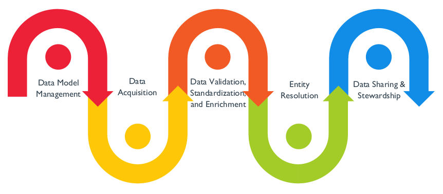

# Dados de Referência e Mestres

## 1. Introdução

Em qualquer organização, determinados dados são necessários em todas as áreas de negócios, processos e sistemas. A organização como um todo e seus clientes se beneficiam se esses dados forem compartilhados e todas as unidades de negócios puderem acessar as mesmas listas de clientes, códigos de localização geográfica, listas de unidades de negócios, opções de entrega, listas de peças, códigos de centros de custo contábeis, códigos tributários governamentais e outros dados usados ​​para administrar o negócio. Pessoas que utilizam dados geralmente presumem que existe um nível de consistência em toda a organização, até que se deparem com dados díspares.

Na maioria das organizações, os sistemas e os dados evoluem de forma mais orgânica do que os profissionais de gestão de dados gostariam. Particularmente em grandes organizações, vários projetos e iniciativas, fusões e aquisições e outras atividades de negócios resultam em múltiplos sistemas executando essencialmente as mesmas funções, isolados uns dos outros. Essas condições inevitavelmente levam a inconsistências na estrutura e nos valores dos dados entre os sistemas. Essa variabilidade aumenta os custos e os riscos. Ambos podem ser reduzidos por meio do gerenciamento de Dados Mestres e Dados de Referência.

Figura 75 Diagrama de Contexto: Dados de Referência e Mestres

### 1.1 Motivadores de Negócios

Os motivadores mais comuns para iniciar um programa de Gestão de Dados Mestres são:

* **Atender aos requisitos de dados organizacionais:** Várias áreas dentro de uma organização precisam acessar os mesmos conjuntos de dados, com a certeza de que eles estão completos, atualizados e consistentes. Os Dados Mestres frequentemente formam a base desses conjuntos de dados (por exemplo, determinar se uma análise inclui todos os clientes depende de ter uma definição de cliente aplicada de forma consistente).
* **Gerenciando a qualidade dos dados:** Inconsistências, problemas de qualidade e lacunas nos dados levam a decisões incorretas ou perda de oportunidades; a Gestão de Dados Mestres reduz esses riscos, permitindo uma representação consistente das entidades críticas para a organização.
* **Gerenciando os custos de integração de dados:** O custo de integrar novas fontes de dados em um ambiente já complexo é maior na ausência de Dados Mestres, o que reduz a variação na forma como as entidades críticas são definidas e identificadas.

* **Gerenciando os custos de integração de dados:** O custo de integrar novas fontes de dados em um ambiente já complexo é maior na ausência de Dados Mestres, o que reduz a variação na forma como as entidades críticas são definidas e identificadas. * **Redução de riscos:** Dados Mestres podem simplificar a arquitetura de compartilhamento de dados para reduzir custos e riscos associados a um ambiente complexo.

Os motivadores para o gerenciamento de Dados de Referência são semelhantes. Dados de Referência gerenciados centralmente permitem que as organizações
a:

* Atender aos requisitos de dados para diversas iniciativas e reduzir os riscos e custos da integração de dados por meio do uso de Dados de Referência consistentes
* Gerenciar a qualidade dos Dados de Referência

Embora as iniciativas organizacionais baseadas em dados se concentrem em dados transacionais (aumento de vendas ou participação de mercado, redução de custos, demonstração de conformidade), a capacidade de alavancar esses dados transacionais depende fortemente da disponibilidade e da qualidade dos Dados Mestres e de Referência. Melhorar a disponibilidade e a qualidade dos Dados Mestres e de Referência tem um impacto significativo na qualidade geral dos dados e na confiança da empresa nos dados. Esses processos trazem benefícios adicionais para uma organização, incluindo a simplificação do cenário de TI, maior eficiência e produtividade e, com isso, o potencial de aprimorar a experiência do cliente.

### 1.2 Objetivos e Princípios

Os objetivos de um programa de Gestão de Dados Mestres e de Referência incluem:

* Garantir que a organização tenha Dados Mestres e de Referência completos, consistentes, atuais e confiáveis ​​em todos os processos organizacionais
* Permitir que Dados Mestres e de Referência sejam compartilhados entre funções e aplicativos corporativos
* Reduzir o custo e a complexidade do uso e integração de dados por meio de padrões, modelos de dados comuns e padrões de integração

A Gestão de Dados Mestres e de Referência segue os seguintes princípios orientadores:

* **Dados Compartilhados:** Dados Mestres e de Referência devem ser gerenciados de forma que sejam compartilháveis ​​por toda a organização.
* **Propriedade:** Dados Mestres e de Referência pertencem à organização, não a um aplicativo ou departamento específico. Por serem amplamente compartilhados, exigem um alto nível de administração.
* **Qualidade:** A Gestão de Dados Mestres e de Referência exige monitoramento e governança contínuos da Qualidade dos Dados.
* **Administração:** Administradores de Dados Corporativos são responsáveis ​​por controlar e garantir a qualidade dos Dados de Referência.

* **Alteração Controlada:**
* Em um determinado momento, os valores dos Dados Mestres devem representar a melhor compreensão da organização sobre o que é preciso e atual. Regras de correspondência que alteram valores devem ser aplicadas com cautela e supervisão. Qualquer identificador mesclado ou dividido deve ser reversível.
* Alterações nos valores dos Dados de Referência devem seguir um processo definido; as alterações devem ser aprovadas e comunicadas antes de serem implementadas.
* **Autoridade:** Os valores dos Dados Mestres devem ser replicados apenas a partir do sistema de registro. Um sistema de referência pode ser necessário para permitir o compartilhamento dos Dados Mestres em uma organização.

### 1.3 Conceitos Essenciais

#### 1.3.1 Diferenças entre Dados Mestres e de Referência

Diferentes tipos de dados desempenham papéis diferentes dentro de uma organização. Eles também têm diferentes requisitos de gestão. Frequentemente, é feita uma distinção entre Dados Transacionais e Dados Mestres, bem como entre Dados Mestres e Dados de Referência. Malcolm Chisholm propôs uma taxonomia de dados de seis camadas que inclui Metadados, Dados de Referência, dados de estrutura empresarial, dados de estrutura transacional, dados de atividade transacional e dados de auditoria transacional (Chisholm, 2008; Talburt e Zhou, 2015). Dentro dessa taxonomia, ele define Dados Mestres como uma agregação de Dados de Referência, dados de estrutura empresarial e dados de estrutura transacional:

* Dados de Referência, por exemplo, tabelas de códigos e descrições, são dados usados ​​exclusivamente para caracterizar outros dados em uma organização ou exclusivamente para relacionar dados em um banco de dados a informações além dos limites da organização.
* Dados de Estrutura Empresarial, por exemplo, um plano de contas, permitem o relato da atividade empresarial por responsabilidade empresarial.

* Dados de Estrutura de Transação, por exemplo, identificadores de clientes, descrevem os elementos que devem estar presentes para que uma transação ocorra: produtos, clientes, fornecedores.

A definição de Chisholm distingue Dados Mestres dos dados de atividade de transação, que registram detalhes sobre transações, e dos dados de auditoria de transações, que descrevem o estado das transações, bem como dos Metadados, que descrevem outros dados (Chisholm, 2008). Nesse sentido, a definição de Chisholm é semelhante à definição do Dicionário DAMA: Dados Mestres são “os dados que fornecem o contexto para os dados de atividade de negócios na forma de conceitos comuns e abstratos relacionados à atividade. Inclui os detalhes (definições e identificadores) de objetos internos e externos envolvidos em transações de negócios, como clientes, produtos, funcionários, fornecedores e domínios controlados (valores de código)” (DAMA, 2009).

Muitas pessoas entendem que Dados Mestres incluem dados de estrutura de transação e dados de estrutura empresarial. A definição de Dados Mestres de David Loshin se alinha amplamente com esses tipos. Ele descreve os objetos de Dados Mestres como objetos de negócios essenciais usados ​​em diferentes aplicações em uma organização, juntamente com seus Metadados, atributos, definições, funções, conexões e taxonomias associados. Os objetos de Dados Mestres representam as "coisas" mais importantes para uma organização – aquelas que são registradas em transações, relatadas, medidas e analisadas (Loshin, 2008).

Os Dados Mestres exigem a identificação e/ou o desenvolvimento de uma versão confiável da verdade para cada instância de entidades conceituais, como produto, local, conta, pessoa ou organização, e a manutenção da vigência dessa versão. O principal desafio dos Dados Mestres é a resolução de entidades (também chamada de gerenciamento de identidades), o processo de discernir e gerenciar associações entre dados de diferentes sistemas e processos. As instâncias de entidades representadas por linhas de Dados Mestres serão representadas de forma diferente entre os sistemas. O Gerenciamento de Dados Mestres trabalha para resolver essas diferenças a fim de identificar consistentemente instâncias de entidades individuais (ou seja, clientes, produtos específicos, etc.) em diferentes contextos. Esse processo também deve ser gerenciado ao longo do tempo, para que os identificadores dessas instâncias de entidades de Dados Mestres permaneçam consistentes. [^56]

Dados de Referência e Dados Mestres compartilham propósitos conceitualmente semelhantes. Ambos fornecem contexto crítico para a criação e o uso de dados transacionais. (Dados de Referência também fornecem contexto para Dados Mestres.) Eles permitem que os dados sejam compreendidos de forma significativa. É importante ressaltar que ambos são recursos compartilhados que devem ser gerenciados no nível corporativo. Ter múltiplas instâncias dos mesmos Dados de Referência é ineficiente e inevitavelmente leva à inconsistência entre elas. A inconsistência leva à ambiguidade, e a ambiguidade introduz riscos para uma organização. Um programa bem-sucedido de Gerenciamento de Dados de Referência ou Dados Mestres envolve toda a gama de funções de gerenciamento de dados (Governança de Dados, Qualidade de Dados, Gerenciamento de Metadados, Integração de Dados, etc.).

Os Dados de Referência também possuem características que os distinguem de outros tipos de Dados Mestres (por exemplo, dados corporativos e de estrutura transacional). São menos voláteis. Os conjuntos de Dados de Referência são geralmente menos complexos e menores do que os conjuntos de Dados Transacionais ou de Dados Mestres. Eles têm menos colunas e menos linhas. Os desafios da resolução de entidades não fazem parte do Gerenciamento de Dados de Referência.

O foco do gerenciamento de dados difere entre Dados de Referência e Dados Mestres:

* O Gerenciamento de Dados Mestres (MDM) envolve o controle sobre os valores e identificadores dos Dados Mestres, permitindo o uso consistente, em todos os sistemas, dos dados mais precisos e oportunos sobre entidades empresariais essenciais. Os objetivos do MDM incluem garantir a disponibilidade de valores precisos e atuais, reduzindo os riscos associados a identificadores ambíguos (aqueles identificados com mais de uma instância de uma entidade e aqueles que se referem a mais de uma entidade).
* O Gerenciamento de Dados de Referência (RDM) envolve o controle sobre os valores de domínio definidos e suas definições. O objetivo do RDM é garantir que a organização tenha acesso a um conjunto completo de valores precisos e atuais para cada conceito representado.

Um desafio do Gerenciamento de Dados de Referência é a propriedade ou responsabilidade pela definição e manutenção. Alguns Dados de Referência se originam fora das organizações que os utilizam. Alguns cruzam os limites internos da organização e podem não pertencer a um único departamento. Outros Dados de Referência podem ser criados e mantidos dentro de um departamento, mas têm valor potencial em outras partes da organização. Determinar a responsabilidade pela obtenção de dados e gerenciar atualizações faz parte do RDM. A falta de responsabilização introduz riscos, pois diferenças nos Dados de Referência podem causar mal-entendidos sobre o contexto dos dados (como quando duas unidades de negócios têm valores diferentes para classificar o mesmo conceito).

Como os Dados Mestre e de Referência fornecem contexto para as transações, eles moldam os dados de transações que entram em uma organização durante as operações (por exemplo, em sistemas CRM e ERP). Eles também enquadram a análise realizada nos Dados de Transações.

#### 1.3.2 Dados de Referência

Conforme observado, Dados de Referência são quaisquer dados usados ​​para caracterizar ou classificar outros dados, ou para relacioná-los com informações externas a uma organização (Chisholm, 2001). Os Dados de Referência mais básicos consistem em códigos e descrições, mas alguns Dados de Referência podem ser mais complexos e incorporar mapeamentos e hierarquias. Dados de Referência existem em praticamente todos os repositórios de dados. Classificações e categorias podem incluir status ou tipos (por exemplo, Status do Pedido: Novo, Em Andamento, Fechado, Cancelado). Informações externas podem incluir informações geográficas ou padronizadas (por exemplo, Código do País: DE, US, TR).

Os Dados de Referência podem ser armazenados de diferentes maneiras para atender a diferentes necessidades. Por exemplo, integração de dados (por exemplo, mapeamentos de dados para padronização ou verificações de qualidade de dados) ou outras funcionalidades de aplicativos (por exemplo, anéis de sinônimos para permitir pesquisa e descoberta). Também pode ter considerações de interface de usuário específicas para cada dispositivo (por exemplo, vários idiomas). Técnicas comuns de armazenamento utilizam:

* Tabelas de código em bancos de dados relacionais, vinculadas por meio de chaves estrangeiras a outras tabelas para manter funções de integridade referencial dentro do sistema de gerenciamento de banco de dados
* Sistemas de Gerenciamento de Dados de Referência que mantêm entidades de negócios, valores permitidos, de estado futuro ou obsoletos, e regras de mapeamento de termos para oferecer suporte ao uso mais amplo de aplicativos e integração de dados
* Metadados específicos de atributos de objeto para especificar valores permitidos com foco no acesso à API ou à interface de usuário

O Gerenciamento de Dados de Referência envolve o controle e a manutenção de valores de domínio definidos, definições e os relacionamentos dentro e entre valores de domínio. O objetivo do Gerenciamento de Dados de Referência é garantir que os valores sejam consistentes e atuais em diferentes funções e que os dados sejam acessíveis à organização. Como outros dados, os Dados de Referência requerem Metadados. Um atributo importante de Metadados para Dados de Referência inclui sua fonte. Por exemplo, o órgão regulador para Dados de Referência padrão do setor.

##### 1.3.2.1 Estrutura de Dados de Referência

Dependendo da granularidade e complexidade do que os Dados de Referência representam, eles podem ser estruturados como uma lista simples, uma referência cruzada ou uma taxonomia. A capacidade de usar e manter Dados de Referência deve ser considerada ao estruturá-los em um banco de dados ou em um sistema de Gerenciamento de Dados de Referência.

###### 1.3.2.1.1 Listas

A forma mais simples de Dados de Referência combina um valor de código com uma descrição em uma lista, como na Tabela 17. O valor do código é o identificador principal, o valor de referência de forma abreviada que aparece em outros contextos. A descrição indica o que o código representa. A descrição pode ser exibida no lugar do código em telas, páginas, listas suspensas e relatórios. Observe que, neste exemplo, o valor do código para o Reino Unido é GB, de acordo com os padrões internacionais, e não UK, embora UK seja uma forma abreviada comum usada em muitas formas de comunicação. Equilíbrio entre conformidade com os padrões e usabilidade ao definir os requisitos dos Dados de Referência.

Tabela 17 Lista de Referências Simples

<table>
  <thead>
    <tr>
      <th>
        Valor do Código
      </th>
      <th>
        Descrição
      </th>
    </tr>
  </thead>
  <tbody>
    <tr>
      <td>
        EUA
      </td>
      <td>
        Estados Unidos da América
      </td>
    </tr>
    <tr>
      <td>
        GB
      </td>
      <td>
        Reino Unido (Grã-Bretanha)
      </td>
    </tr>
  </tbody>
</table>

Dependendo do conteúdo e da complexidade dos Dados de Referência, atributos adicionais podem ser necessários para definir o significado do código. As definições fornecem informações que o rótulo por si só não fornece. Definições raramente aparecem em relatórios ou listas suspensas. No entanto, elas aparecem em locais como funções de Ajuda para aplicativos, que orientam o uso apropriado de códigos em contexto.

As listas, como quaisquer Dados de Referência, devem atender aos requisitos dos consumidores de dados, incluindo os requisitos para o nível de detalhe apropriado. Se uma lista de valores se destina a dar suporte à classificação de dados por usuários casuais, uma lista altamente detalhada provavelmente causará problemas de qualidade dos dados e desafios de adoção. Da mesma forma, uma lista de valores muito genérica impediria que os profissionais do conhecimento capturassem o nível de detalhe suficiente. Para acomodar esses casos, é melhor manter listas distintas e relacionadas em vez de tentar ter uma única lista que seja o padrão para todas as comunidades de usuários. A Tabela 18 fornece um exemplo relacionado aos códigos de status para tickets de help desk. Sem as informações fornecidas pela definição, o status do ticket seria ambíguo para qualquer pessoa não familiarizada com o sistema. Essa diferenciação é especialmente necessária para classificações que direcionam métricas de desempenho ou outras análises de Business Intelligence.

Tabela 18 Lista de Referência Simples Expandida

<table>
  <thead>
    <tr>
      <th>
        Código
      </th>
      <th>
        Descrição
      </th>
      <th>
        Definição
      </th>
    </tr>
  </thead>
  <tbody>
    <tr>
      <td>
        1
      </td>
      <td>
        Novo
      </td>
      <td>
        Indica um ticket recém-criado sem um recurso atribuído
      </td>
    </tr>
    <tr>
      <td>
        2
      </td>
      <td>
        Atribuído
      </td>
      <td>
        Indica um ticket com um recurso nomeado atribuído
      </td>
    </tr>
    <tr>
      <td>
        3
      </td>
      <td>
        Trabalho em Andamento
      </td>
      <td>
        Indica que o recurso atribuído começou a trabalhar no ticket
      </td>
    </tr>
    <tr>
      <td>
        4
      </td>
      <td>
        Resolvido
      </td>
      <td>
        Indica que a solicitação foi considerada atendida de acordo com o recurso atribuído
      </td>
    </tr>
    <tr>
      <td>
        5
      </td>
      <td>
        Cancelado
      </td>
      <td>
        Indica que a solicitação foi cancelada com base na interação do solicitante
      </td>
    </tr>
    <tr>
      <td>
        6
      </td>
      <td>
        Pendente
      </td>
      <td>
        Indica que a solicitação não pode prosseguir sem informações adicionais
      </td>
    </tr>
    <tr>
      <td>
        7
      </td>
      <td>
        Atendido
      </td>
      <td>
        Indica que a solicitação foi atendida e verificada pelo solicitante
      </td>
    </tr>
  </tbody>
</table>

###### 1.3.2.1.2 Listas de Referência Cruzada

Diferentes aplicações podem usar conjuntos de códigos diferentes para representar o mesmo conceito. Esses conjuntos de códigos podem ter granularidades diferentes ou a mesma granularidade com valores diferentes. Conjuntos de dados de referência cruzada traduzem valores entre códigos. A Tabela 19 apresenta uma referência cruzada do Código de Estado dos EUA (um exemplo de múltiplas representações no mesmo nível de granularidade). Os Códigos de Estado do Serviço Postal dos EUA são códigos alfabéticos de dois caracteres. O FIPS usa um número para expressar o mesmo conceito. O Código de Estado ISO também inclui uma referência ao país.

Tabela 19 Lista de Referência Cruzada

<table>
  <thead>
    <tr>
      <th>
        Código Estadual do USPS
      </th>
      <th>
        Código Estadual ISO
      </th>
      <th>
        Código Estadual Numérico FIPS
      </th>
      <th>
        Abreviação do Estado
      </th>
      <th>
        Nome do Estado
      </th>
      <th>
        Nome Formal do Estado
      </th>
    </tr>
  </thead>
  <tbody>
    <tr>
      <td>CA</td>
      <td>US-CA</td>
      <td>06</td>
      <td>Calif.</td>
      <td>California</td>
      <td>Estado da Califórnia</td>
    </tr>
    <tr>
      <td>KY</td>
      <td>US-KY</td>
      <td>21</td>
      <td>Ky.</td>
      <td>Kentucky</td>
      <td>Comunidade do Kentucky</td>
    </tr>
    <tr>
      <td>WI</td>
      <td>US-WI</td>
      <td>55</td>
      <td>Wis.</td>
      <td>Wisconsin</td>
      <td>Estado de Wisconsin</td>
    </tr>
  </tbody>
</table>

Os requisitos de idioma podem afetar a estrutura dos Dados de Referência. Listas multilíngues são uma instância específica de uma lista de referências cruzadas. Enquanto as listas de códigos fornecem um formato padrão legível por máquina, os glossários específicos de cada idioma fornecem conteúdo utilizável. A Tabela 20 fornece um exemplo da norma ISO 3166. Existem diferentes maneiras de lidar com listas multilíngues, dependendo de quantos idiomas e conjuntos de caracteres estão envolvidos. As listas não precisam ser normalizadas para serem eficazes. A estrutura desnormalizada facilita um pouco a compreensão dos relacionamentos.

Tabela 20 Lista de Referências Multilíngues

<table>
  <thead>
    <tr>
      <th>
        Código de país ISO 3166-1 Alfa 2
      </th>
      <th>
        Nome em inglês
      </th>
      <th>
        Nome local
      </th>
      <th>
        Nome local Alfabeto local
      </th>
      <th>
        Nome em francês
      </th>
    </tr>
  </thead>
  <tbody>
    <tr>
      <td>CN</td>
      <td>China</td>
      <td>Zhong Guo</td>
      <td>中国/中國</td>
      <td>Chine</td>
    </tr>
  </tbody>
</table>

###### 1.3.2.1.3 Taxonomias

Estruturas de Dados de Referência Taxonômicos capturam informações em diferentes níveis de especificidade. Por exemplo, um CEP dos EUA pode ser uma categoria significativa por si só e existir dentro de uma cidade, um condado e um estado. Essas relações podem ser expressas em uma tabela de referência e múltiplos níveis de análise podem ser realizados usando o CEP como direcionador.

As taxonomias permitem a classificação de conteúdo e a navegação multifacetada para dar suporte à Inteligência de Negócios. Os Dados de Referência Taxonômicos podem ser armazenados em um relacionamento recursivo. Ferramentas de gerenciamento de taxonomia também mantêm informações hierárquicas. As Tabelas 21 e 22 mostram exemplos de duas taxonomias hierárquicas comuns. Em ambos os casos, a hierarquia inclui um código, uma descrição e uma referência a um código pai que classifica os códigos individuais. Por exemplo, na Tabela 21, Plantas florais (10161600) é um código pai para Rosas, Poinsétias e Orquídeas. Na Tabela 22, o Comércio Varejista (440000) é o ramo que corresponde às Lojas de Alimentos e Bebidas (445000), que por sua vez corresponde às Lojas de Alimentos Especiais (445200).

Tabela 21 UNSPSC (Classificação Universal Padrão de Produtos e Serviços) [^57]

<table>
  <thead>
    <tr>
      <th>
        Valor do Código
      </th>
      <th>
        Descrição
      </th>
      <th>
        Código Pai
      </th>
    </tr>
  </thead>
  <tbody>
    <tr>
      <td>10161600</td>
      <td>Plantas florais</td>
      <td>10160000</td>
    </tr>
    <tr>
      <td>10161601</td>
      <td>Rosas</td>
      <td>10161600</td>
    </tr>
    <tr>
      <td>10161602</td>
      <td>Poinsétias</td>
      <td>10161600</td>
    </tr>
    <tr>
      <td>10161603</td>
      <td>Orquídeas</td>
      <td>10161600</td>
    </tr>
    <tr>
      <td>10161700</td>
      <td>Flores de corte</td>
      <td>10160000</td>
    </tr>
    <tr>
      <td>10161705</td>
      <td>Rosas de corte</td>
      <td>10161700</td>
    </tr>
  </tbody>
</table>

Tabela 22 NAICS (Sistema de Classificação Industrial da América do Norte) [^58]

<table>
  <thead>
    <tr>
      <th>Valor do Código</th>
      <th>Descrição</th>
      <th>Código Pai</th>
    </tr>
  </thead>
  <tbody>
    <tr>
      <td>440000</td>
      <td>Comércio Varejista</td>
      <td>440000</td>
    </tr>
    <tr>
      <td>445000</td>
      <td>Lojas de Alimentos e Bebidas</td>
      <td>440000</td>
    </tr>
    <tr>
      <td>445200</td>
      <td>Lojas de Alimentos Especializados</td>
      <td>445000</td>
    </tr>
    <tr>
      <td>445210</td>
      <td>Açougues</td>
      <td>445200</td>
    </tr>
    <tr>
      <td>445220</td>
      <td>Peixes e Frutos do Mar</td>
      <td>445200</td>
    </tr>
    <tr>
      <td>445290</td>
      <td>Outras Lojas de Alimentos Especializados</td>
      <td>445200</td>
    </tr>
    <tr>
      <td>445291</td>
      <td>Lojas de Produtos de Panificação</td>
      <td>445290</td>
    </tr>
    <tr>
      <td>445292</td>
      <td>Confeitarias e Nozes</td>
      <td>445290</td>
    </tr>
  </tbody>
</table>

###### 1.3.2.1.4 Ontologias

Algumas organizações incluem ontologias usadas para gerenciar o conteúdo de sites como parte dos Dados de Referência. Elas se enquadram nessa categoria, pois são usadas para caracterizar outros dados ou relacionar dados organizacionais a informações além dos limites da organização. Ontologias também podem ser entendidas como uma forma de Metadados. Ontologias e outras taxonomias complexas precisam ser gerenciadas de maneira semelhante à forma como os Dados de Referência são gerenciados. Os valores precisam ser completos, atuais e claramente definidos. As melhores práticas para manter ontologias são semelhantes às do Gerenciamento de Dados de Referência. Um dos principais casos de uso para ontologias é o gerenciamento de conteúdo. Elas são descritas com mais detalhes no Capítulo 9.

##### 1.3.2.2 Dados de Referência Proprietários ou Internos

Muitas organizações criam Dados de Referência para dar suporte a processos e aplicativos internos. Frequentemente, esses dados de referência proprietários crescem organicamente ao longo do tempo. Parte do RDM inclui o gerenciamento desses conjuntos de dados e, idealmente, a criação de consistência entre eles, onde essa consistência for útil à organização. Por exemplo, se diferentes unidades de negócios usam termos diferentes para descrever o status de uma conta, torna-se difícil para qualquer pessoa na organização determinar o número total de clientes atendidos em um determinado momento. Ao ajudar a gerenciar conjuntos de Dados de Referência internos, os Administradores de Dados devem equilibrar a necessidade de ter palavras comuns para as mesmas informações e a necessidade de flexibilidade quando os processos diferem entre si.

##### 1.3.2.3 Dados de Referência do Setor

Dados de Referência do Setor é um termo amplo para descrever conjuntos de dados criados e mantidos por associações do setor ou órgãos governamentais, em vez de por organizações individuais, a fim de fornecer um padrão comum para a codificação de conceitos importantes. Essa codificação leva a uma maneira comum de entender os dados e é um pré-requisito para o compartilhamento e a interoperabilidade de dados. Por exemplo, os códigos da Classificação Internacional de Doenças (CID) fornecem uma maneira comum de classificar condições de saúde (diagnósticos) e tratamentos (procedimentos) e, assim, ter uma abordagem consistente para a prestação de cuidados de saúde e a compreensão dos resultados. Se cada médico e hospital criasse seu próprio conjunto de códigos para doenças, seria virtualmente impossível entender tendências e padrões.

Os Dados de Referência do Setor são produzidos e mantidos externamente às organizações que os utilizam, mas são necessários para compreender as transações dentro dessas organizações. Podem ser necessários para dar suporte a esforços específicos de Gestão da Qualidade de Dados (por exemplo, diretórios comerciais de terceiros), cálculos comerciais (por exemplo, taxas de câmbio) ou ampliação de dados comerciais (por exemplo, dados de marketing). Esses conjuntos de dados variam amplamente, dependendo do setor e do conjunto de códigos individual. (Consulte o Capítulo 10.)

##### 1.3.2.4 Dados Geográficos ou Geoestatísticos

A referência geográfica ou geoestatística permite a classificação ou análise com base na geografia. Por exemplo, relatórios de censos descrevem a densidade populacional e as mudanças demográficas que apoiam o planejamento e a pesquisa de mercado. O histórico meteorológico mapeado para uma classificação geográfica rigorosa pode auxiliar na gestão de estoques e no planejamento promocional.

#### 1.3.2.5 Dados de Referência Computacionais

Muitas atividades comerciais dependem do acesso a cálculos comuns e consistentes. Por exemplo, os cálculos de câmbio dependem de tabelas de valores de câmbio gerenciadas e com registro de data e hora. Dados de Referência Computacionais diferem de outros tipos devido à frequência com que mudam. Muitas organizações adquirem esse tipo de dados de terceiros, que garantem sua integridade e precisão. Tentar manter esses dados internamente provavelmente estará repleto de problemas de latência.

##### 1.3.2.6 Metadados do Conjunto de Dados de Referência Padrão

Os Dados de Referência, assim como outros dados, podem mudar ao longo do tempo. Dada sua prevalência em qualquer organização, é importante manter os Metadados principais sobre os conjuntos de Dados de Referência para garantir que sua linhagem e atualidade sejam compreendidas e mantidas. A Tabela 23 fornece exemplos desses Metadados.

Tabela 23 Atributos Críticos dos Metadados dos Dados de Referência

<table>
  <thead>
    <tr>
      <th>
        Informações Principais do Conjunto de Dados de Referência
      </th>
      <th>
        Descrição
      </th>
    </tr>
  </thead>
  <tbody>
    <tr>
      <td>
        Nome Formal
      </td>
      <td>
        Nome oficial, especialmente se externo, do Conjunto de Dados de Referência (por exemplo, Lista de Códigos de Países ISO 3166-1991)
      </td>
    </tr>
    <tr>
      <td>
        Nome Interno
      </td>
      <td>
        Nome associado ao conjunto de dados dentro da organização (por exemplo, Códigos de Países – ISO)
      </td>
    </tr>
    <tr>
      <td>
        Provedor de Dados
      </td>
      <td>
        A parte que fornece e mantém o Conjunto de Dados de Referência. Pode ser externo (ISO), interno (um departamento específico) ou externo – estendido (obtido de uma parte externa, mas posteriormente estendido e modificado internamente).
      </td>
    </tr>
    <tr>
      <td>
        Provedor de Dados Fonte do Conjunto de Dados
      </td>
      <td>
        Descrição de onde os conjuntos de dados do provedor de dados podem ser obtidos. Provavelmente, trata-se de um Identificador Universal de Recursos (URI) dentro ou fora da rede corporativa.
      </td>
    </tr>
    <tr>
      <td>
        Número da Versão Mais Recente do Provedor de Dados
      </td>
      <td>
        Se disponível e mantido, descreve a versão mais recente do conjunto de dados do provedor de dados externo, onde informações podem ser adicionadas ou descontinuadas da versão na organização.
      </td>
    </tr>
    <tr>
      <td>
        Data da Versão Mais Recente do Provedor de Dados
      </td>
      <td>
        Se disponível e mantido, descreve quando a lista de padrões foi atualizada pela última vez.
      </td>
    </tr>
    <tr>
      <td>
        Número da Versão Interna
      </td>
      <td>
        Número da versão do conjunto de dados de referência atual ou número da versão da última atualização aplicada ao conjunto de dados.
      </td>
    </tr>
    <tr>
      <td>
        Data de Reconciliação da Versão Interna
      </td>
      <td>
        Data da última atualização do conjunto de dados com base na fonte externa.
      </td>
    </tr>
    <tr>
      <td>
        Data da Última Atualização da Versão Interna
      </td>
      <td>
        Data da última alteração do conjunto de dados. Isso não significa reconciliação com uma versão externa.
      </td>
    </tr>
  </tbody>
</table>

#### 1.3.3 Dados Mestres

Dados Mestres são dados sobre entidades empresariais (por exemplo, funcionários, clientes, produtos, estruturas financeiras, ativos e localizações) que fornecem contexto para transações e análises comerciais. Uma entidade é um objeto do mundo real (pessoa, organização, lugar ou coisa). Entidades são representadas por instâncias de entidade, na forma de dados/registros.

Os Dados Mestres devem representar os dados mais confiáveis ​​e precisos disponíveis sobre as principais entidades empresariais. Quando bem gerenciados, os valores dos Dados Mestres são confiáveis ​​e podem ser usados ​​com segurança.

As regras de negócios normalmente determinam o formato e os intervalos permitidos dos valores dos Dados Mestres. Dados Mestres organizacionais comuns incluem dados sobre:

* Partes, compostas por indivíduos e organizações, e suas funções, como clientes, cidadãos, pacientes, fornecedores, agentes, parceiros de negócios, concorrentes, funcionários ou alunos
* Produtos e Serviços, internos e externos
* Estruturas financeiras, como contratos, contas contábeis, centros de custo ou centros de lucro
* Locais, como endereços e coordenadas de GPS

##### 1.3.3.1 Sistema de Registro, Sistema de Referência

Quando há versões potencialmente diferentes da "verdade", é necessário distingui-las. Para isso, é preciso saber onde os dados se originam ou são acessados, e quais dados foram preparados para usos específicos. Um Sistema de Registro é um sistema autoritativo onde os dados são criados/capturados e/ou mantidos por meio de um conjunto definido de regras e expectativas (por exemplo, um sistema ERP pode ser o Sistema de Registro para clientes de vendas). Um Sistema de Referência é um sistema autoritativo onde os consumidores de dados podem obter dados confiáveis ​​para apoiar transações e análises, mesmo que as informações não tenham se originado no sistema de referência. Aplicativos MDM, Hubs de Compartilhamento de Dados e Data Warehouses frequentemente servem como sistemas de referência.

##### 1.3.3.2 Fonte Confiável, Registro Dourado

Uma Fonte Confiável é reconhecida como a "melhor versão da verdade" com base em uma combinação de regras automatizadas e administração manual do conteúdo dos dados. Uma fonte confiável também pode ser chamada de Visão Única, Visão 360°. Qualquer

sistema MDM deve ser gerenciado para que seja uma fonte confiável. Dentro de uma fonte confiável, os registros que representam os dados mais precisos sobre instâncias de entidades podem ser chamados de Registros Dourados. O termo Registro Dourado pode ser enganoso. A Tech Target define um Registro Dourado como “a ‘versão única da verdade’, onde ‘verdade’ é entendida como a referência à qual os usuários de dados podem recorrer quando desejam garantir que possuem a versão correta de uma informação. O Registro Dourado abrange todos os dados em cada sistema de registro (SOR) dentro de uma determinada organização.” [^59]

No entanto, as duas partes desta definição colocam o conceito em questão, visto que dados em diferentes sistemas podem não se alinhar em ‘uma única versão da verdade’.

Em qualquer esforço de Dados Mestres, a fusão/resolução de dados de múltiplas fontes em um ‘Registro Dourado’ não significa que ele seja sempre uma representação 100% completa e 100% precisa de todas as entidades dentro da

organização (especialmente em organizações que possuem múltiplos SORs fornecendo dados para o ambiente de Dados Mestres). Prometer que os dados são ‘Ouro’ quando não são pode minar a confiança dos consumidores de dados. É por isso que alguns preferem o termo Fonte Confiável para se referir à “melhor versão que temos” dos Dados Mestres. Isso enfatiza como os dados são definidos e gerenciados para chegar à melhor versão. Também ajuda diferentes consumidores de dados a enxergar os componentes da "versão única" que são importantes para eles. As áreas de Finanças e Atuária frequentemente têm uma perspectiva diferente da "versão única" do Cliente em relação à área de Marketing. A Fonte Confiável fornece múltiplas perspectivas de entidades empresariais, conforme identificadas e definidas pelos Administradores de Dados.

##### 1.3.3.3 Gestão de Dados Mestres

Conforme descrito na introdução do capítulo, a Gestão de Dados Mestres envolve o controle sobre os valores e identificadores dos Dados Mestres, permitindo o uso consistente, em todos os sistemas, dos dados mais precisos e oportunos sobre entidades empresariais essenciais. Os objetivos incluem garantir a disponibilidade de valores precisos e atuais, reduzindo o risco de identificadores ambíguos.

O Gartner define a Gestão de Dados Mestres como “uma disciplina tecnológica na qual os negócios e a TI trabalham juntos para garantir a uniformidade, a precisão, a administração, a consistência semântica e a responsabilização dos ativos oficiais de Dados Mestres compartilhados da empresa. Dados Mestres são o conjunto consistente e uniforme de identificadores e atributos estendidos que descrevem as entidades centrais da empresa, incluindo clientes, clientes em potencial, cidadãos, fornecedores, locais, hierarquias e plano de contas.” [^60]

A definição do Gartner enfatiza que o MDM é uma disciplina, composta por pessoas, processos e tecnologia. Não é uma solução de aplicação específica. Infelizmente, a sigla MDM (Master Data Management) é frequentemente usada para se referir a sistemas ou produtos usados ​​para gerenciar Dados Mestres. [^61] Aplicações de MDM podem facilitar os métodos, e às vezes de forma bastante eficaz, mas o uso de uma aplicação de MDM não garante que os Dados Mestres estejam sendo gerenciados para atender às necessidades da organização.

Avaliar os requisitos de MDM de uma organização inclui identificar:

* Quais funções, organizações, lugares e coisas são referenciados repetidamente
* Quais dados são usados ​​para descrever pessoas, organizações, lugares e coisas
* Como os dados são definidos e estruturados, incluindo a granularidade dos dados
* Onde os dados são criados/originados, armazenados, disponibilizados e acessados
* Como os dados mudam à medida que se movem pelos sistemas dentro da organização
* Quem usa os dados e para quais finalidades
* Quais critérios são usados ​​para entender a qualidade e a confiabilidade dos dados e suas fontes

A Gestão de Dados Mestres é desafiadora. Ela ilustra um desafio fundamental com dados: as pessoas escolhem maneiras diferentes de representar conceitos semelhantes e a reconciliação entre essas representações nem sempre é simples; igualmente importante, as informações mudam ao longo do tempo e a contabilização sistemática dessas mudanças exige planejamento, conhecimento de dados e habilidades técnicas. Em suma, exige trabalho.

Qualquer organização que tenha reconhecido a necessidade do MDM provavelmente já possui um cenário de sistemas complexo, com múltiplas maneiras de capturar e armazenar referências a entidades do mundo real. Devido ao crescimento orgânico ao longo do tempo ou a fusões e aquisições, os sistemas que forneceram informações para o processo de MDM podem ter diferentes definições das próprias entidades e, muito provavelmente, diferentes padrões de Qualidade de Dados. Devido a essa complexidade, é melhor abordar o Gerenciamento de Dados Mestres (MDM) em um domínio de dados por vez. Comece pequeno, com alguns atributos, e expanda ao longo do tempo.

O planejamento para o Gerenciamento de Dados Mestres inclui várias etapas básicas. Dentro de um domínio:

* Identificar fontes candidatas que fornecerão uma visão abrangente das entidades de Dados Mestres
* Desenvolver regras para a correspondência e mesclagem precisas de instâncias de entidades
* Estabelecer uma abordagem para identificar e restaurar dados correspondidos e mesclados inadequadamente
* Estabelecer uma abordagem para distribuir dados confiáveis ​​para sistemas em toda a empresa

Executar o processo, no entanto, não é tão simples quanto essas etapas sugerem, pois o MDM é um processo de gerenciamento de ciclo de vida. As atividades críticas para o ciclo de vida incluem:

* Estabelecer o contexto das entidades de Dados Mestres, incluindo definições de atributos associados e as condições de seu uso. Este processo requer governança.
* Identificar múltiplas instâncias da mesma entidade representadas dentro e entre fontes de dados; construir e manter identificadores e referências cruzadas para permitir a integração de informações.
* Reconciliar e consolidar dados entre fontes para fornecer um registro mestre ou a melhor versão da verdade. Registros consolidados fornecem uma visão mesclada das informações entre sistemas e buscam resolver inconsistências na nomenclatura de atributos e no valor dos dados.
* Identificar instâncias incorretamente correspondidas ou mescladas e garantir que sejam resolvidas e corretamente associadas aos identificadores.
* Provisionar acesso a dados confiáveis ​​entre aplicativos, seja por meio de leituras diretas, serviços de dados ou por feeds de replicação para armazenamentos de dados transacionais, de armazenamento ou analíticos.
* Aplicar o uso dos valores de Dados Mestres dentro da organização. Este processo também requer governança e gerenciamento de mudanças para garantir uma perspectiva corporativa compartilhada.

##### 1.3.3.4 Etapas Principais de Processamento do Gerenciamento de Dados Mestres

As etapas principais de processamento para o MDM são ilustradas na Figura 76. Elas incluem gerenciamento do modelo de dados; aquisição de dados; validação, padronização e enriquecimento de dados; resolução de entidades; e administração e compartilhamento. Em um ambiente MDM abrangente, o modelo lógico de dados será fisicamente instanciado em múltiplas plataformas. Ele orienta a implementação da solução MDM, fornecendo a base para os serviços de integração de dados. Ele deve orientar como os aplicativos são configurados para aproveitar os recursos de reconciliação e verificação da qualidade dos dados.

Figura 76 Etapas Principais de Processamento para o MDM

###### 1.3.3.4.1 Gerenciamento do Modelo de Dados

O trabalho com Dados Mestres destaca a importância de definições de dados lógicos claras e consistentes. O modelo deve ajudar a organização a superar a "linguagem sistêmica". Termos e definições usados ​​em um sistema de origem podem fazer sentido dentro dos limites desse sistema, mas nem sempre fazem sentido em nível corporativo. Para Dados Mestres, os termos e definições usados ​​em nível empresarial devem estar no contexto dos negócios conduzidos em toda a organização e não necessariamente dependentes dos valores de dados contribuídos pelo sistema de origem.

Para atributos que compõem Dados Mestres, a granularidade da definição e os valores de dados associados também devem fazer sentido em toda a organização. Os sistemas de origem podem apresentar o mesmo nome de atributo, mas os valores de dados estão em contextos completamente diferentes no nível empresarial. Da mesma forma, os sistemas de origem podem apresentar atributos com nomes diferentes que, no nível empresarial, se fundem em um único atributo e os valores de dados estão no contexto apropriado. Às vezes, vários atributos são apresentados a partir de uma única fonte e seus respectivos valores de dados são usados ​​para derivar um único valor de dados para um atributo definido no nível empresarial.

###### 1.3.3.4.2 Aquisição de Dados

Mesmo dentro de uma determinada fonte, os dados que representam a mesma instância de entidade podem parecer diferentes, conforme ilustrado na Tabela 24, onde há inconsistências na forma como nomes, endereços e números de telefone são apresentados. Este exemplo será referenciado novamente mais adiante neste capítulo.

Tabela 24 Dados de origem recebidos pelo sistema MDM

<table>
  <thead>
    <tr>
      <th>ID da Fonte</th>
      <th>Nome</th>
      <th>Endereço</th>
      <th>Telefone</th>
    </tr>
  </thead>
  <tbody>
    <tr>
      <td>123</td>
      <td>John Smith</td>
      <td>123 Main, Dataland, SQ 98765</td>
      <td></td>
    </tr>
    <tr>
      <td>234</td>
      <td>J. Smith</td>
      <td>123 Main, Dataland, DA</td>
      <td>2345678900</td>
    </tr>
    <tr>
      <td>345</td>
      <td>Jane Smith</td>
      <td>123 Main, Dataland, DA</td>
      <td>234-567-8900</td>
    </tr>
  </tbody>
</table>

O planejamento, a avaliação e a incorporação de novas fontes de dados à solução de Gerenciamento de Dados Mestres devem ser um processo confiável e repetível. As atividades de aquisição de dados envolvem:

* Receber e responder a novas solicitações de aquisição de fontes de dados
* Realizar avaliações rápidas, ad hoc, de correspondência e de alto nível da qualidade dos dados, utilizando ferramentas de limpeza e criação de perfil de dados
* Avaliar e comunicar a complexidade da integração de dados aos solicitantes para auxiliá-los na análise de custo-benefício
* Testar a aquisição de dados e seu impacto nas regras de correspondência
* Finalizar as métricas de qualidade dos dados para a nova fonte de dados
* Determinar quem será responsável por monitorar e manter a qualidade dos dados de uma nova fonte
* Concluir a integração com o ambiente geral de gerenciamento de dados

###### 1.3.3.4.3 Validação, Padronização e Enriquecimento de Dados

Para permitir a resolução de entidades, os dados devem ser o mais consistentes possível. Isso implica, no mínimo, na redução da variação no formato e na reconciliação de valores. Dados de entrada consistentes reduzem a chance de erros na associação de registros. Os processos de preparação incluem:

* Validação: Identificar dados comprovadamente errôneos, provavelmente incorretos ou inadimplentes (por exemplo, remoção de endereços de e-mail claramente falsos)
* Padronização: Garantir que o conteúdo dos dados esteja em conformidade com os valores padrão dos Dados de Referência (por exemplo, códigos de país), formatos (por exemplo, números de telefone) ou campos (por exemplo, endereços)
* Enriquecimento: Adicionar atributos que possam aprimorar os serviços de resolução de entidades (por exemplo, Número DUNS da Dunn and Bradstreet e Número DUNS Final para registros de empresas relacionadas, IDs de Consumidor da Acxiom ou Experian para registros individuais)

A Tabela 25 ilustra os resultados do processo de limpeza e padronização no exemplo da Tabela 24. Endereços que tinham formatos diferentes agora são reconhecidamente os mesmos. Os números de telefone incluem a formatação padrão.

Tabela 25 Dados de Entrada Padronizados e Enriquecidos

<table>
  <thead>
    <tr>
      <th>ID da Fonte</th>
      <th>Nome</th>
      <th>Endereço (Limpo)</th>
      <th>Telefone (Limpo)</th>
    </tr>
  </thead>
  <tbody>
    <tr>
      <td>123</td>
      <td>John Smith</td>
      <td>123 Main, Dataland, SQ 98765</td>
      <td></td>
    </tr>
    <tr>
      <td>234</td>
      <td>J. Smith</td>
      <td>123 Main, Dataland, SQ 98765</td>
      <td>+1 234 567 8900</td>
    </tr>
    <tr>
      <td>345</td>
      <td>Jane Smith</td>
      <td>123 Main, Dataland, SQ 98765</td>
      <td>+1 234 567 8900</td>
    </tr>
  </tbody>
</table>

###### 1.3.3.4.4 Resolução de Entidades e Gerenciamento de Identificadores

Resolução de entidades é o processo de determinar se duas referências a objetos do mundo real se referem ao mesmo objeto ou a objetos diferentes (Talburt, 2011). A resolução de entidades é um processo de tomada de decisão. Os modelos para executar o processo diferem com base na abordagem adotada para determinar a similaridade entre duas referências. Embora a resolução sempre ocorra entre pares de referências, o processo pode ser sistematicamente estendido para incluir grandes conjuntos de dados. A resolução de entidades é fundamental para o MDM, pois o processo de correspondência e mesclagem de registros permite a construção do conjunto de Dados Mestres.

A resolução de entidades inclui um conjunto de atividades (extração de referências, preparação de referências, resolução de referências, gerenciamento de identidades, análise de relacionamentos) que permitem que a identidade das instâncias de entidades e o relacionamento entre elas sejam gerenciados ao longo do tempo. Dentro do processo de resolução de referências, duas referências podem ser identificadas como representando a mesma entidade, por meio do processo de determinação de equivalência. Essas referências podem então ser vinculadas por meio de um valor (um identificador global) que indica que são equivalentes (Talburt, 2011).

###### 1.3.3.4.4.1 Correspondência

A correspondência, ou identificação de candidatos, é o processo de identificar como diferentes registros podem se relacionar a uma única entidade. Os riscos desse processo são:

* Falsos positivos: Duas referências que não representam a mesma entidade são vinculadas a um único identificador. Isso resulta em um identificador que se refere a mais de uma instância de entidade do mundo real.
* Falsos negativos: Duas referências representam a mesma entidade, mas não estão vinculadas a um único identificador. Isso resulta em múltiplos identificadores que se referem à mesma entidade do mundo real, quando se espera que cada instância tenha apenas um identificador.

Ambas as situações são abordadas por meio de um processo chamado análise de similaridade ou correspondência, no qual o grau de similaridade entre dois registros é pontuado, geralmente com base na correspondência aproximada ponderada entre os valores de atributos correspondentes. Se a pontuação estiver acima de um limite especificado, os dois registros são considerados como representando a mesma entidade (uma correspondência). Por meio da análise de similaridade, pequenas variações nos dados podem ser reconhecidas e os valores dos dados podem ser consolidados. Duas abordagens básicas, que podem ser usadas em conjunto, são determinística e probabilística:

* Algoritmos determinísticos, como análise sintática e padronização, baseiam-se em padrões e regras definidos para atribuir pesos e pontuações para determinar a similaridade. Algoritmos determinísticos são previsíveis, pois os padrões correspondidos e as regras aplicadas sempre produzirão os mesmos resultados. Esse tipo de correspondência funciona imediatamente com um desempenho relativamente bom, mas é tão bom quanto as situações previstas pelas pessoas que desenvolveram as regras.
* Algoritmos probabilísticos baseiam-se em técnicas estatísticas para avaliar a probabilidade de qualquer par de registros representar a mesma entidade. Isso se baseia na capacidade de coletar amostras de dados para fins de treinamento, observando os resultados esperados para um subconjunto de registros e ajustando o comparador para se autoajustar com base na análise estatística. Esses comparadores não dependem de regras, portanto, os resultados podem ser não determinísticos. No entanto, como as probabilidades podem ser refinadas com base na experiência, os comparadores probabilísticos conseguem melhorar sua precisão de correspondência à medida que mais dados são analisados.

###### 1.3.3.4.4.2 Resolução de Identidade

Algumas correspondências ocorrem com grande confiança, com base em correspondências exatas de dados em vários campos. Outras correspondências são sugeridas com menos confiança devido a valores conflitantes. Por exemplo:

* Se dois registros compartilham o mesmo sobrenome, nome, data de nascimento e número do Seguro Social, mas o endereço é diferente, é seguro presumir que se referem à mesma pessoa que mudou seu endereço postal?
* Se dois registros compartilham o mesmo número do Seguro Social, endereço e nome, mas o sobrenome é diferente, é seguro presumir que se referem à mesma pessoa que mudou seu sobrenome? A probabilidade aumentaria ou diminuiria com base no sexo e na idade?
* Como esses exemplos mudam se o número do Seguro Social for desconhecido para um registro? Quais outros identificadores são úteis para determinar a probabilidade de uma correspondência? Qual o nível de confiança necessário para que a organização afirme uma correspondência?

A Tabela 26 ilustra a conclusão do processo para os registros de amostra nas Tabelas 24 e 25. Aqui, as duas segundas instâncias de entidade (ID de origem 234 e 345) são determinadas como representando a mesma pessoa (Jane Smith), enquanto a primeira (ID de origem 123) é identificada como representando uma pessoa diferente (John Smith).

Tabela 26 Identificação do Candidato e Resolução de Identidade

<table>
  <thead>
    <tr>
      <th>ID da Fonte</th>
      <th>Nome</th>
      <th>Endereço (Limpo)</th>
      <th>Telefone (Limpo)</th>
      <th>ID do Candidato</th>
      <th>ID do Partido</th>
    </tr>
  </thead>
  <tbody>
    <tr>
      <td>123</td>
      <td>John Smith</td>
      <td>123 Main, Dataland, SQ 98765</td>
      <td></td>
      <td>XYZ</td>
      <td>1</td>
    </tr>
    <tr>
      <td>234</td>
      <td>J. Smith</td>
      <td>123 Main, Dataland, SQ 98765</td>
      <td>+1 234 567 8900</td>
      <td>XYZ, ABC</td>
      <td>2</td>
    </tr>
    <tr>
      <td>345</td>
      <td>Jane Smith</td>
      <td>123 Main, Dataland, SQ 98765</td>
      <td>+1 234 567 8900</td>
      <td>ABC</td>
      <td>2</td>
    </tr>
  </tbody>
</table>

Apesar dos melhores esforços, as decisões de correspondência às vezes se mostram incorretas. É essencial manter o histórico de correspondências para que elas possam ser desfeitas quando forem descobertas incorretas. As métricas de taxa de correspondência permitem que as organizações monitorem o impacto e a eficácia de suas regras de inferência de correspondência. O reprocessamento das regras de correspondência pode ajudar a identificar melhores candidatos à correspondência à medida que novas informações são recebidas pelo processo de resolução de entidades.

###### 1.3.3.4.4.3 Fluxos de Trabalho de Correspondência / Tipos de Reconciliação

Regras de correspondência para diferentes cenários exigem fluxos de trabalho diferentes:

* As regras de correspondência de identificação de duplicatas focam em um conjunto específico de elementos de dados que identificam exclusivamente uma entidade e identificam oportunidades de mesclagem sem tomar medidas automáticas. Os Administradores de Dados Corporativos podem revisar essas ocorrências e decidir tomar medidas caso a caso.
* As regras de link de correspondência identificam e fazem referência cruzada a registros que parecem estar relacionados a um registro mestre sem atualizar o conteúdo do registro com referência cruzada. As regras de link de correspondência são mais fáceis de implementar e muito mais fáceis de reverter.

* As regras de correspondência e mesclagem combinam registros e mesclam os dados desses registros em um único registro unificado, reconciliado e abrangente. Se as regras se aplicarem a todas as fontes de dados, crie um registro único, exclusivo e abrangente em cada repositório de dados. No mínimo, use dados confiáveis ​​de um repositório de dados para complementar dados em outros repositórios de dados, substituindo valores ausentes ou valores considerados imprecisos.

As regras de correspondência e mesclagem são complexas e buscam fornecer uma versão unificada e reconciliada das informações em vários registros e fontes de dados. A complexidade se deve à necessidade de identificar qual campo de qual fonte pode ser confiável com base em uma série de regras. A introdução de cada nova fonte pode alterar essas regras ao longo do tempo. Os desafios das regras de correspondência e mesclagem incluem a complexidade operacional da reconciliação dos dados e o custo de reverter a operação em caso de uma mesclagem incorreta.

A vinculação de correspondência é uma operação mais simples, pois atua no registro de referência cruzada e não nos atributos individuais do registro de Dados Mestres mesclado, embora possa ser mais difícil apresentar informações abrangentes de vários registros.

Reavalie periodicamente as regras de correspondência-mesclagem e de vinculação de correspondência, pois os níveis de confiança mudam com o tempo. Muitos mecanismos de correspondência de dados fornecem correlações estatísticas de valores de dados para ajudar a estabelecer níveis de confiança. (Consulte o Capítulo 13.)

###### 1.3.3.4.4.4 Gerenciamento de IDs de Dados Mestres

Gerenciar Dados Mestres envolve o gerenciamento de identificadores. Existem dois tipos de identificadores que precisam ser gerenciados entre fontes de dados em um ambiente MDM: IDs Globais e informações de Referência Cruzada (x-Ref).

Um ID Global é o identificador exclusivo atribuído e mantido pela solução MDM, anexado aos registros reconciliados. Sua finalidade é identificar exclusivamente a instância da entidade. No exemplo da Tabela 26, quando vários registros foram determinados como representando a mesma instância de entidade, o valor "ABC" foi atribuído a ambos como ID candidato. Os registros foram resolvidos para o ID de Parte único "2".

Os IDs Globais devem ser gerados por apenas uma solução autorizada, independentemente da tecnologia que esteja executando as atividades de integração de Dados Mestres, para evitar qualquer risco de valores duplicados. Os IDs globais podem ser números ou GUIDs (Identificadores Globais Únicos), desde que a exclusividade possa ser mantida. A principal complexidade que precisa ser tratada para a geração de IDs globais é como manter o ID global correto (para realizar atualizações de dados posteriores apropriadas) devido a uma unmerge-remerge. O Gerenciamento de Referências Externas (X-Ref) é o gerenciamento do relacionamento entre os IDs de origem e o ID global. O gerenciamento de Referências Externas deve incluir recursos para manter o histórico desses mapeamentos para suportar métricas de taxa de correspondência e para expor serviços de pesquisa para permitir a integração de dados.

###### 1.3.3.4.4.5 Gerenciamento de Afiliações

O Gerenciamento de Afiliações consiste em estabelecer e manter relacionamentos entre registros de Dados Mestres de entidades que possuem relacionamentos reais. Exemplos incluem afiliações de propriedade (por exemplo, a Empresa X é uma subsidiária da Empresa Y, um relacionamento pai-filho) ou outras associações (por exemplo, a Pessoa XYZ trabalha na Empresa X).

O projeto de arquitetura de dados de uma solução MDM deve decidir se deve utilizar relacionamentos pai-filho, relacionamentos de afiliação ou ambos para uma determinada entidade.

* Os relacionamentos de afiliação oferecem a maior flexibilidade por meio da lógica de programação. O tipo de relacionamento pode ser usado para expor esses dados em uma hierarquia pai-filho. Muitas soluções posteriores, como ferramentas de relatórios ou navegação de contas, desejam uma visão hierárquica das informações.
* Os relacionamentos pai-filho exigem menos lógica de programação, pois a estrutura de navegação é implícita. No entanto, se o relacionamento mudar e não houver uma estrutura de afiliação disponível, isso poderá influenciar a qualidade dos dados e as dimensões de Business Intelligence.

###### 1.3.3.4.5 Compartilhamento e Administração de Dados

Embora grande parte do trabalho de Gestão de Dados Mestres possa ser automatizado por meio de ferramentas que permitem o processamento de um grande número de registros, ainda é necessária administração para resolver situações em que os dados são correspondidos incorretamente. Idealmente, as lições aprendidas com o processo de administração podem ser usadas para aprimorar algoritmos de correspondência e reduzir o trabalho manual. (Consulte os Capítulos 3 e 8.)

##### 1.3.3.5 Dados Mestres de Partes

Os Dados Mestres de Partes incluem dados sobre indivíduos, organizações e os papéis que desempenham nas relações comerciais. No ambiente comercial, as partes incluem clientes, funcionários, fornecedores, parceiros e concorrentes. No setor público, as partes geralmente são cidadãos. A aplicação da lei se concentra em suspeitos, testemunhas e vítimas. Organizações sem fins lucrativos se concentram em membros e doadores. Enquanto na área da saúde, o foco está em pacientes e provedores; na educação, em alunos e professores.

Os sistemas de Gestão de Relacionamento com o Cliente (CRM) gerenciam os Dados Mestres sobre os clientes. O objetivo do CRM é fornecer informações completas e precisas sobre cada cliente.

Um aspecto essencial do CRM é identificar dados duplicados, redundantes ou conflitantes de diferentes sistemas e determinar se os dados representam um ou mais clientes. O CRM deve ser capaz de resolver valores conflitantes, reconciliar diferenças e representar com precisão o conhecimento atual do cliente. Esse processo requer regras robustas, bem como conhecimento da estrutura, granularidade, linhagem e qualidade das fontes de dados.

Sistemas MDM especializados desempenham funções semelhantes para indivíduos, organizações e suas funções, funcionários e fornecedores. Independentemente do setor ou foco, o gerenciamento de Dados Mestres de partes comerciais apresenta desafios únicos:

* A complexidade das funções e relacionamentos desempenhados por indivíduos e organizações
* Dificuldades na identificação exclusiva
* O número de fontes de dados e as diferenças entre elas
* Os múltiplos canais de comunicação móvel e social
* A importância dos dados
* As expectativas de como os clientes desejam se engajar

Os Dados Mestres são particularmente desafiadores para partes que desempenham múltiplas funções em uma organização (por exemplo, um funcionário que também é cliente) e utilizam diferentes pontos de contato ou métodos de engajamento (por exemplo, interação por meio de aplicativo para dispositivos móveis vinculado a uma rede social).

##### 1.3.3.6 Dados Mestres Financeiros

Os Dados Mestres Financeiros incluem dados sobre unidades de negócios, centros de custo, centros de lucro, contas contábeis, orçamentos, projeções e projetos. Normalmente, um sistema de Planejamento de Recursos Empresariais (ERP) serve como central para os Dados Mestres Financeiros (plano de contas), com detalhes de projetos e transações criados e mantidos em um ou mais aplicativos de suporte. Isso é especialmente comum em organizações com funções de back-office distribuídas.

As soluções de Dados Mestres Financeiros não apenas criam, mantêm e compartilham informações; muitas também podem simular como as alterações nos dados financeiros existentes podem afetar os resultados da organização. As simulações de Dados Mestres Financeiros costumam fazer parte dos módulos de relatórios, análises e planejamento de Business Intelligence, bem como de orçamentos e projeções mais simples. Por meio desses aplicativos, versões de estruturas financeiras podem ser modeladas para compreender os potenciais impactos financeiros. Uma vez tomada a decisão, as mudanças estruturais acordadas podem ser disseminadas para todos os sistemas apropriados.

##### 1.3.3.7 Dados Mestres Legais

Os Dados Mestres Legais incluem dados sobre contratos, regulamentações e outras questões jurídicas. Os Dados Mestres Legais permitem a análise de contratos de diferentes entidades que fornecem os mesmos produtos ou serviços, permitindo uma melhor negociação ou a combinação de contratos em Contratos Mestres.

##### 1.3.3.8 Dados Mestres de Produto

Os Dados Mestres de Produto podem se concentrar nos produtos e serviços internos de uma organização ou em produtos e serviços de todo o setor (incluindo concorrentes). Diferentes tipos de soluções de Dados Mestres de Produto oferecem suporte a diferentes funções de negócios.

* O Gerenciamento do Ciclo de Vida do Produto (PLM) concentra-se no gerenciamento do ciclo de vida de um produto ou serviço, desde a concepção, passando pelo desenvolvimento, fabricação, venda/entrega, serviço e descarte. As organizações implementam sistemas de PLM para reduzir o tempo de lançamento no mercado. Em setores com longos ciclos de desenvolvimento de produtos (de 8 a 12 anos na indústria farmacêutica), os sistemas de PLM permitem que as organizações acompanhem os custos entre processos e os acordos legais, à medida que os conceitos do produto evoluem de ideias para produtos potenciais com nomes diferentes e potencialmente diferentes contratos de licenciamento.
* O Gerenciamento de Dados de Produto (PDM) oferece suporte às funções de engenharia e manufatura, capturando e permitindo o compartilhamento seguro de informações do produto, como documentos de projeto (por exemplo, desenhos CAD), receitas (instruções de fabricação), procedimentos operacionais padrão e listas de materiais. A funcionalidade do PDM pode ser habilitada por meio de sistemas especializados ou aplicativos ERP.

* Os dados de produtos em sistemas de Planejamento de Recursos Empresariais (ERP) concentram-se em SKUs para dar suporte à entrada de pedidos até o nível de estoque, onde unidades individuais podem ser identificadas por meio de diversas técnicas.
* Os dados de produtos em Sistemas de Execução de Manufatura (MES) concentram-se em estoque bruto, produtos semiacabados e produtos acabados, onde os produtos acabados se vinculam a produtos que podem ser armazenados e pedidos por meio do sistema ERP. Esses dados também são importantes em toda a cadeia de suprimentos e sistemas de logística.
* Os dados de produtos em um sistema de Gestão de Relacionamento com o Cliente (CRM) que oferece suporte a interações de marketing, vendas e suporte podem incluir famílias e marcas de produtos, associação de representantes de vendas e gestão de territórios de clientes, bem como campanhas de marketing.

Muitos dados mestres de produtos estão intimamente ligados a sistemas de Gestão de Dados de Referência.

##### 1.3.3.9 Dados Mestres de Localização

Os Dados Mestres de Localização permitem rastrear e compartilhar informações geográficas e criar relacionamentos hierárquicos ou territórios com base em informações geográficas. A distinção entre Dados Mestres e de referência se torna tênue para dados de localização. Aqui está a diferença:

* Os Dados de Referência de Localização geralmente incluem dados geopolíticos, como países, estados ou províncias, condados, cidades ou vilas, códigos postais e coordenadas de posicionamento geográfico, como latitude, longitude e altitude. Esses dados raramente mudam e as alterações são gerenciadas por organizações externas. Os Dados de Referência de Localização também podem incluir regiões geográficas e territórios de vendas, conforme definido pela organização.
* Os Dados Mestres de Localização incluem endereços de partes comerciais e a localização das partes comerciais, bem como endereços de instalações para locais de propriedade da organização. À medida que as organizações crescem ou diminuem, esses endereços mudam com mais frequência do que outros Dados de Referência de Localização.

Diferentes setores exigem dados especializados em ciências da terra (dados geográficos sobre falhas sísmicas, planícies de inundação, solo, precipitação anual e áreas de risco de clima severo) e dados sociológicos relacionados (população, etnia, renda e risco de terrorismo), geralmente fornecidos por fontes externas.

#### 1.3.3.10 Dados Mestres do Setor – Diretórios de Referência

Diretórios de Referência são listagens oficiais de entidades de Dados Mestres (empresas, pessoas, produtos, etc.) que as organizações podem adquirir e utilizar como base para suas transações. Embora os diretórios de referência sejam criados por organizações externas, uma versão gerenciada e reconciliada das informações é mantida nos sistemas da própria organização.

Exemplos de diretórios de referência licenciados incluem o Diretório de Empresas da Dun and Bradstreet (D&B), com sedes, subsidiárias e filiais em todo o mundo, e o Banco de Dados de Prescritores da Associação Médica Americana.

Os diretórios de referência permitem o uso de Dados Mestres por meio de:

* Fornecer um ponto de partida para a correspondência e vinculação de novos registros. Por exemplo, em um ambiente com cinco fontes de dados, cada fonte pode ser comparada com o diretório (5 pontos de comparação) e entre si (10 pontos de comparação).

* Fornecer elementos de dados adicionais que podem não estar tão facilmente disponíveis no momento da criação do registro (por exemplo, para um médico, isso pode incluir o status da licença médica; para uma empresa, isso pode incluir uma classificação de seis dígitos do setor NAICS).

À medida que os registros de uma organização correspondem e se reconciliam com os diretórios de referência, o registro confiável se desviará do diretório de referência com rastreabilidade para outros registros de origem, atributos contribuintes e regras de transformação.

#### 1.3.4 Arquitetura de Compartilhamento de Dados

Existem várias abordagens arquitetônicas básicas para referência e integração de Dados Mestres. Cada área temática de Dados Mestres provavelmente terá seu próprio sistema de registro. Por exemplo, o sistema de recursos humanos geralmente serve como sistema de registro para dados de funcionários. Um sistema de CRM pode servir como sistema de registro para dados de clientes, enquanto um sistema de ERP pode servir como sistema de registro para dados financeiros e de produtos.

O modelo de arquitetura de hub de compartilhamento de dados mostrado na Figura 77 representa uma arquitetura hub-and-spoke para Dados Mestres. O hub de Dados Mestres pode lidar com interações com itens spoke, como sistemas de origem, aplicativos de negócios e armazenamentos de dados, minimizando o número de pontos de integração. Um hub de dados local pode estender e escalar o hub de Dados Mestres. (Consulte o Capítulo 8.)

Cada uma das três abordagens básicas para implementar um ambiente de hub de Dados Mestres tem prós e contras:

* Um Registro é um índice que aponta para Dados Mestres nos vários sistemas de registro. Os sistemas de registro gerenciam Dados Mestres locais para seus aplicativos. O acesso aos Dados Mestres vem do índice mestre. Um registro é relativamente fácil de implementar porque requer poucas alterações nos sistemas de registro. No entanto, frequentemente, consultas complexas são necessárias para reunir Dados Mestres de vários sistemas. Além disso, várias regras de negócios precisam ser implementadas para lidar com diferenças semânticas entre sistemas em vários locais.
* Em um Hub de Transações, os aplicativos interagem com o hub para acessar e atualizar Dados Mestres. Os Dados Mestres existem dentro do Hub de Transações e não em nenhum outro aplicativo. O Hub de Transações é o sistema de registro para Dados Mestres. Os Hubs de Transações permitem melhor governança e fornecem uma fonte consistente de Dados Mestres. No entanto, é custoso remover a funcionalidade de atualização de Dados Mestres dos sistemas de registro existentes. As regras de negócios são implementadas em um único sistema: o Hub.
* Uma abordagem consolidada é um híbrido de Registro e Hub de Transações. Os sistemas de registro gerenciam Dados Mestres localmente em seus aplicativos. Os Dados Mestres são consolidados em um repositório comum e disponibilizados a partir de um hub de compartilhamento de dados, o sistema de referência para Dados Mestres. Isso elimina a necessidade de acesso direto dos sistemas de registro. A abordagem consolidada fornece uma visão corporativa com impacto limitado nos sistemas de registro. No entanto, isso implica na replicação de dados e haverá latência entre o hub e os sistemas de registro.

Figura 77 Exemplo de Arquitetura de Compartilhamento de Dados Mestres

## 2. Atividades

Conforme enfatizado na Seção 1.3.1, Dados Mestres e Dados de Referência compartilham certas características (são recursos compartilhados que fornecem contexto e significado para outros dados e devem ser gerenciados no nível corporativo), mas também diferem em aspectos importantes (conjuntos de Dados de Referência são menores, menos voláteis, não requerem correspondência, mesclagem e vinculação, etc.). A seção de atividades descreverá primeiro as atividades associadas ao MDM e, em seguida, aquelas relacionadas aos Dados de Referência.

### 2.1 Atividades do MDM

#### 2.1.1 Definir os Drivers e Requisitos do MDM

Cada organização tem diferentes drivers e obstáculos do MDM, influenciados pelo número e tipo de sistemas, sua idade, os processos de negócios que suportam e como os dados são usados ​​para transações e análises. Os impulsionadores geralmente incluem oportunidades para melhorar o atendimento ao cliente e/ou a eficiência operacional, bem como para reduzir riscos relacionados à privacidade e conformidade. Os obstáculos incluem diferenças no significado e na estrutura dos dados entre os sistemas. Esses obstáculos geralmente estão vinculados a barreiras culturais – algumas unidades de negócios podem não querer incorrer nos custos de alterar seus processos, mesmo que a mudança seja apresentada como benéfica para a empresa como um todo.

É relativamente fácil definir requisitos para Dados Mestres em uma aplicação. É mais difícil definir requisitos padrão para todas as aplicações. A maioria das organizações desejará abordar uma área temática de Dados Mestres, ou mesmo uma entidade, por vez. Priorize os esforços de Dados Mestres com base no custo/benefício das melhorias propostas e na complexidade relativa da área temática de Dados Mestres. Comece com a categoria mais simples para aprender com o processo.

#### 2.1.2 Avaliar e Analisar as Fontes de Dados

Os dados em aplicações existentes constituem a base de um esforço de Gestão de Dados Mestres. É importante compreender a estrutura e o conteúdo desses dados e os processos pelos quais são coletados ou criados. Um resultado de um esforço de Gestão de Dados Mestres pode ser a melhoria dos Metadados gerados por meio do esforço de avaliar a qualidade dos dados existentes. Um dos objetivos da avaliação é compreender o quão completos os dados estão em relação aos atributos que compõem os Dados Mestres. Esse processo inclui o esclarecimento das definições e da granularidade desses atributos. Problemas semânticos surgirão em algum momento ao definir e descrever atributos. Os Administradores de Dados precisarão colaborar com as áreas de negócios na reconciliação e no acordo sobre a nomenclatura de atributos e as definições em nível corporativo. (Consulte os Capítulos 3 e 13.)

A outra parte da avaliação das fontes é compreender a qualidade dos dados. Problemas de qualidade de dados complicarão um projeto de Dados Mestres, portanto, o processo de avaliação deve incluir o tratamento das causas-raízes dos problemas de dados. Nunca presuma que os dados serão de alta qualidade – é mais seguro presumir que não são de alta qualidade. Avalie sempre sua qualidade e adequação a um ambiente de Dados Mestres.

O maior desafio, como observado, será a disparidade entre as fontes. Os dados podem ser de alta qualidade em qualquer fonte, mas ainda assim não se encaixarem com dados de outras fontes, devido a diferenças estruturais e diferenças nos valores pelos quais atributos semelhantes são representados. As iniciativas de Dados Mestres oferecem a oportunidade de definir e implementar padrões em aplicativos nos quais os dados são criados ou coletados.

Para algumas entidades de Dados Mestres, como clientes ou fornecedores, é possível adquirir dados padronizados (como Diretórios de Referência) para viabilizar o esforço de MDM. Vários fornecedores oferecem serviços que fornecem dados limpos relacionados a pessoas, entidades comerciais ou profissões (por exemplo, profissionais de saúde), que podem ser comparados aos dados internos de uma organização para aprimorar informações de contato, endereços e nomes (consulte o Capítulo 10). Além de avaliar a qualidade dos dados existentes, também é necessário entender a tecnologia que suporta a coleta de dados para um esforço de MDM. A tecnologia existente influenciará a abordagem arquitetônica do MDM.

#### 2.1.3 Definir a Abordagem Arquitetônica

A abordagem arquitetônica para o MDM depende da estratégia de negócios, das plataformas das fontes de dados existentes e dos próprios dados, particularmente sua linhagem e volatilidade, e as implicações de alta ou baixa latência. A arquitetura deve levar em conta os modelos de consumo e compartilhamento de dados. As ferramentas para manutenção dependem tanto dos requisitos de negócios quanto das opções de arquitetura. As ferramentas ajudam a definir e dependem da abordagem de administração e manutenção.

O número de sistemas de origem a serem integrados à solução de Dados Mestres e as plataformas desses sistemas precisam ser considerados ao determinar a abordagem de integração. O tamanho e a distribuição geográfica de uma organização também influenciarão a abordagem de integração. Pequenas organizações podem utilizar efetivamente um hub de transações, enquanto uma organização global com múltiplos sistemas tem maior probabilidade de utilizar um registro. Uma organização com unidades de negócios isoladas e vários sistemas de origem pode decidir que uma abordagem consolidada é o caminho correto a seguir. Especialistas em domínio de negócios, Arquitetos de Dados e Arquitetos Corporativos devem fornecer uma perspectiva sobre a abordagem.

A arquitetura do hub de compartilhamento de dados é particularmente útil quando não há um sistema claro de registro para Dados Mestres. Nesse caso, vários sistemas fornecem dados. Novos dados ou atualizações de um sistema podem ser reconciliados com dados já fornecidos por outro sistema. O hub de compartilhamento de dados torna-se a fonte de conteúdo de Dados Mestres para data warehouses ou marts, reduzindo a complexidade das extrações e o tempo de processamento para transformação, correção e reconciliação de dados. Obviamente, os data warehouses devem refletir as alterações feitas no hub de compartilhamento de dados para fins históricos, enquanto o próprio hub de compartilhamento de dados pode precisar refletir apenas o estado atual.

#### 2.1.4 Modelar Dados Mestres

O Gerenciamento de Dados Mestres é um processo de integração de dados. Para obter resultados consistentes e gerenciar a integração de novas fontes à medida que uma organização se expande, é necessário modelar os dados dentro das áreas temáticas. Um modelo lógico ou canônico pode ser definido sobre as áreas temáticas dentro do hub de compartilhamento de dados. Isso permitiria o estabelecimento de definições em nível empresarial de entidades e atributos das áreas temáticas. (Consulte os Capítulos 5 e 8.)

#### 2.1.5 Definir Processos de Administração e Manutenção

Soluções técnicas podem realizar um trabalho notável na correspondência, fusão e gerenciamento de identificadores para registros mestres. No entanto, o processo também requer administração, não apenas para lidar com registros que não são incluídos no processo, mas também para remediar e aprimorar os processos que os causam. Os projetos de MDM devem considerar os recursos necessários para manter a qualidade contínua dos Dados Mestres. É necessário analisar registros, fornecer feedback aos sistemas de origem e fornecer informações que possam ser usadas para ajustar e aprimorar os algoritmos que orientam a solução de MDM.

#### 2.1.6 Estabelecer Políticas de Governança para Fiscalizar o Uso de Dados Mestres

O lançamento inicial de um projeto de Dados Mestres é desafiador e exige muito foco. Os benefícios reais (eficiência operacional, maior qualidade, melhor atendimento ao cliente) surgem quando as pessoas e os sistemas começam a usar os Dados Mestres. O esforço geral deve incluir um roteiro para que os sistemas adotem valores mestres e identificadores como entrada para os processos. Estabeleça ciclos fechados unidirecionais entre os sistemas para manter a consistência dos valores entre eles.

### 2.2 Atividades de Dados de Referência

#### 2.2.1 Definir Drivers e Requisitos

Os principais drivers para o Gerenciamento de Dados de Referência são a eficiência operacional e a maior qualidade dos dados. Gerenciar Dados de Referência centralmente é mais econômico do que ter várias unidades de negócios mantendo seus próprios conjuntos de dados. Também reduz o risco de inconsistência entre os sistemas. Dito isso, alguns conjuntos de Dados de Referência são mais importantes do que outros; conjuntos de Dados de Referência complexos exigem mais trabalho para configurar e manter do que conjuntos simples. Os conjuntos de Dados de Referência mais importantes devem orientar os requisitos para um sistema de Gerenciamento de Dados de Referência. Uma vez que tal sistema esteja implementado, novos conjuntos de Dados de Referência podem ser configurados como parte dos projetos. Os conjuntos de Dados de Referência existentes devem ser mantidos com base em um cronograma publicado.

#### 2.2.2 Avaliar Fontes de Dados

A maioria dos conjuntos de Dados de Referência padrão do setor pode ser obtida das organizações que os criam e mantêm. Algumas organizações fornecem esses dados gratuitamente. Outras cobram uma taxa. Intermediários também empacotam e vendem Dados de Referência, geralmente com recursos de valor agregado. Dependendo do número e do tipo de conjuntos de Dados de Referência necessários para uma organização, pode ser melhor adquirir de um fornecedor, especialmente se esse fornecedor garantir a entrega de atualizações em um cronograma definido e realizar o controle de qualidade básico dos dados.

A maioria das organizações também depende de Dados de Referência criados e mantidos internamente. Determinar a fonte de dados de referência internos ou locais costuma ser mais desafiador do que determinar a origem de Dados de Referência padrão do setor. Como no caso dos Dados Mestres, as fontes internas de Dados de Referência devem ser identificadas, comparadas e avaliadas. Os proprietários dos dados existentes devem compreender os benefícios do gerenciamento centralizado e concordar em apoiar processos para administrar os dados em benefício da empresa.

#### 2.2.3 Definir a Abordagem Arquitetural

Antes de adquirir ou desenvolver uma ferramenta para gerenciar Dados de Referência, é fundamental considerar os requisitos e os desafios impostos pelos Dados de Referência a serem gerenciados. Por exemplo, a volatilidade dos dados (a maioria dos Dados de Referência é relativamente estática, mas alguns são bastante voláteis), a frequência das atualizações e os modelos de consumo. Determine se é necessário manter dados históricos sobre alterações nos valores ou nas definições dos valores. Se a organização adquirir dados de um fornecedor, considere o método de entrega e integração.

A abordagem arquitetônica precisa reconhecer que, invariavelmente, alguns Dados de Referência precisarão ser atualizados manualmente. Certifique-se de que a interface para atualizações seja simples e possa ser configurada para aplicar regras básicas de entrada de dados, como garantir que os relacionamentos pai/filho sejam mantidos nos Dados de Referência que incluem hierarquias. A ferramenta RDM deve permitir que os Administradores de Dados façam atualizações ad hoc sem a necessidade de suporte técnico e deve incluir fluxos de trabalho para garantir que as aprovações e notificações sejam automatizadas. Os Administradores de Dados devem agendar atualizações conhecidas para alinhá-las à publicação de novos códigos. Os consumidores de dados devem ser informados de todas as alterações. Nos casos em que os Dados de Referência direcionam a lógica de programação, o impacto potencial das alterações deve ser avaliado e contabilizado antes que elas sejam introduzidas.

#### 2.2.4 Conjuntos de Dados de Referência de Modelo

Muitas pessoas pensam em Dados de Referência como meros códigos e descrições. No entanto, muitos Dados de Referência são mais complexos do que isso. Por exemplo, um conjunto de dados de CEP geralmente inclui informações sobre estado e município, bem como outros atributos geopolíticos. Para fins de permitir o uso a longo prazo e estabelecer Metadados precisos, bem como para o próprio processo de manutenção, é valioso criar modelos de dados de conjuntos de Dados de Referência. Os modelos ajudam os consumidores de dados a entender as relações dentro do conjunto de Dados de Referência e podem ser usados ​​para estabelecer regras de qualidade de dados.

#### 2.2.5 Definir Processos de Administração e Manutenção

Os Dados de Referência exigem administração para garantir que os valores estejam completos e atualizados e que as definições sejam claras e compreensíveis. Em alguns casos, os administradores serão diretamente responsáveis ​​pela manutenção prática dos Dados de Referência; em outros casos, eles podem facilitar o processo. Por exemplo, se várias unidades de negócios diferentes exigirem Dados de Referência para apoiar o mesmo conceito, um administrador pode facilitar discussões que definam valores comuns em um cruzamento.

Como parte do processo de administração, é útil capturar Metadados básicos sobre cada conjunto de Dados de Referência. Isso pode incluir: nome do administrador, organização de origem, frequência esperada de atualizações, cronograma de atualizações, processos que utilizam os Dados de Referência, se versões históricas dos dados precisam ser retidas e muito mais (consulte a Seção 1.3.2.6). Documentar quais processos utilizam os Dados de Referência permitirá uma comunicação mais eficaz sobre alterações nos dados.

Muitas ferramentas de Gerenciamento de Dados de Referência incluem fluxos de trabalho para gerenciar a revisão e a aprovação de alterações nos Dados de Referência. Esses fluxos de trabalho dependem da identificação de quem, dentro de uma organização, é responsável pelo conteúdo dos Dados de Referência.

#### 2.2.6 Estabelecer Políticas de Governança de Dados de Referência

Uma organização só obtém valor de um repositório de Dados de Referência gerenciado centralmente se as pessoas realmente utilizarem os dados desse repositório. É importante ter políticas em vigor que governem a qualidade e imponham o uso dos Dados de Referência desse repositório, seja diretamente por meio da publicação desse repositório ou indiretamente por meio de um sistema de referência preenchido com dados do repositório central.

## 3. Ferramentas e Técnicas

O MDM requer ferramentas projetadas especificamente para permitir o gerenciamento de identidades. O Gerenciamento de Dados Mestres pode ser implementado por meio de ferramentas de integração de dados, ferramentas de remediação de dados, repositórios de dados operacionais (ODS), hubs de compartilhamento de dados (DSH) ou aplicativos MDM especializados. Vários fornecedores oferecem soluções que podem abranger uma ou mais áreas temáticas de Dados Mestres. Outros fornecedores promovem o uso de seus produtos de software de integração de dados e serviços de implementação para criar soluções personalizadas de Dados Mestres.

Soluções em pacote para produtos, contas e partes, bem como serviços de verificação da qualidade de dados em pacote, podem impulsionar grandes programas. A incorporação desses serviços pode permitir que as organizações utilizem as melhores soluções, integrando-as à sua arquitetura geral de negócios para atender a necessidades específicas.

## 4. Diretrizes de Implementação

O Gerenciamento de Dados Mestres e de Referência são formas de integração de dados. Os princípios de implementação que se aplicam à integração e interoperabilidade de dados aplicam-se ao MDM e ao RDM. (Consulte o Capítulo 8.)

Os recursos de MDM e RDM não podem ser implementados da noite para o dia. As soluções exigem conhecimento técnico e comercial especializado. As organizações devem esperar implementar soluções de Dados Mestres e de Referência de forma incremental por meio de uma série de projetos definidos em um roteiro de implementação, priorizados com base nas necessidades do negócio e guiados por uma arquitetura geral.

Observe que os programas de MDM falharão sem uma governança adequada. Os profissionais de governança de dados devem compreender os desafios do MDM e do RDM e avaliar a maturidade e a capacidade da organização de enfrentá-los. (Consulte o Capítulo 15.)

### 4.1 Aderir à Arquitetura de Dados Mestres

Estabelecer e seguir uma arquitetura de referência adequada é fundamental para gerenciar e compartilhar Dados Mestres em uma organização. A abordagem de integração deve levar em consideração a estrutura organizacional da empresa, o número de sistemas de registro distintos, a implementação da governança de dados, a importância do acesso e da latência dos valores de dados e o número de sistemas e aplicativos consumidores.

### 4.2 Monitorar a Movimentação de Dados

Os processos de integração de dados para Dados Mestres e de Referência devem ser projetados para garantir a extração e a distribuição oportunas de dados por toda a organização. À medida que os dados fluem dentro de um ambiente de compartilhamento de Dados Mestres ou de Referência, o fluxo de dados deve ser monitorado para:

* Demonstrar como os dados são compartilhados e utilizados em toda a organização
* Identificar a linhagem dos dados de/para sistemas e aplicativos administrativos
* Auxiliar na análise da causa raiz dos problemas
* Demonstrar a eficácia das técnicas de integração de ingestão e consumo de dados
* Denotar a latência dos valores de dados dos sistemas de origem até o consumo
* Determinar a validade das regras de negócios e transformações executadas nos componentes de integração

### 4.3 Gerenciar Alterações nos Dados de Referência

Como os Dados de Referência são um recurso compartilhado, eles não podem ser alterados arbitrariamente. A chave para o sucesso do Gerenciamento de Dados de Referência é a disposição da organização em abrir mão do controle local dos dados compartilhados. Para sustentar esse suporte, forneça canais para receber e responder às solicitações de alterações nos Dados de Referência. O Conselho de Governança de Dados deve garantir que políticas e procedimentos sejam implementados para lidar com alterações nos dados dentro dos ambientes de Dados Mestres e de Referência.

Alterações nos Dados de Referência precisarão ser gerenciadas. Pequenas alterações podem afetar algumas linhas de dados. Por exemplo, quando a União Soviética se dividiu em estados independentes, o termo "União Soviética" foi descontinuado e novos códigos foram adicionados. No setor de saúde, os códigos de procedimento e diagnóstico são atualizados anualmente para levar em conta o refinamento dos códigos existentes, a obsolescência de códigos e a introdução de novos códigos. Revisões importantes nos Dados de Referência impactam a estrutura dos dados. Por exemplo, os Códigos de Diagnóstico da CID-10 são estruturados de maneiras muito diferentes da CID-9. A CID-10 tem um formato diferente. Há valores diferentes para os mesmos conceitos. Mais importante ainda, a CID-10 possui princípios adicionais de organização. Os códigos da CID-10 têm uma granularidade diferente e são muito mais específicos, portanto, mais informações são transmitidas em um único código. Consequentemente, há muito mais deles (em 2015, havia 68.000 códigos da CID-10, em comparação com 13.000 da CID-9). [^62]

O uso obrigatório dos códigos da CID-10 nos EUA em 2015 exigiu um planejamento significativo. As empresas de saúde precisaram fazer alterações no sistema, bem como ajustes nos relatórios impactados, para levar em conta o novo padrão.

Os tipos de alterações incluem:

* Alterações em nível de linha em conjuntos de dados de referência externos
* Alterações estruturais em conjuntos de dados de referência externos
* Alterações em nível de linha em conjuntos de dados de referência internos
* Alterações estruturais em conjuntos de dados de referência internos
* Criação de novos conjuntos de dados de referência

As alterações podem ser planejadas/agendadas ou ad hoc. Alterações planejadas, como atualizações mensais ou anuais em códigos padrão do setor, exigem menos governança do que atualizações ad hoc. O processo para solicitar novos conjuntos de dados de referência deve levar em conta usos potenciais além daqueles do solicitante original.

As solicitações de alteração devem seguir um processo definido, conforme ilustrado na Figura 78. Quando as solicitações são recebidas, as partes interessadas devem ser notificadas para que os impactos possam ser avaliados. Se as alterações precisarem de aprovação, discussões devem ser realizadas para obtê-la. As alterações devem ser comunicadas.

Figura 78 Processo de Solicitação de Alteração de Dados de Referência

### 4.4 Acordos de Compartilhamento de Dados

Compartilhar e usar Dados de Referência e Dados Mestres em uma organização requer colaboração entre várias partes internas à organização e, às vezes, com partes externas a ela. Para garantir o acesso e o uso adequados, estabeleça acordos de compartilhamento que estipulem quais dados podem ser compartilhados e sob quais condições. Ter esses acordos em vigor ajudará quando surgirem problemas relacionados à disponibilidade ou à qualidade dos dados inseridos no ambiente de compartilhamento de dados. Esse esforço deve ser conduzido pelo programa de Governança de Dados. Ele pode envolver Arquitetos de Dados, Provedores de Dados, Administradores de Dados, Desenvolvedores de Aplicativos, Analistas de Negócios, bem como Diretores de Conformidade/Privacidade e Diretores de Segurança.

Os responsáveis ​​pelo ambiente de compartilhamento de dados têm a obrigação, perante os consumidores de dados a jusante, de fornecer dados de alta qualidade. Para cumprir essa responsabilidade, eles dependem dos sistemas a montante. SLAs e métricas devem ser estabelecidos para mensurar a disponibilidade e a qualidade dos dados compartilhados. Devem ser implementados processos para abordar as causas-raiz dos problemas com a qualidade ou disponibilidade dos dados. Uma abordagem padrão de comunicação deve ser implementada para manter todas as partes afetadas informadas sobre a existência de problemas e o andamento dos esforços de correção. (Ver Capítulo 8.)

## 5. Mudança Organizacional e Cultural

A Gestão de Dados Mestres e de Referência exige que as pessoas abram mão do controle de alguns de seus dados e processos para criar recursos compartilhados. Nem sempre é fácil fazer isso. Embora os profissionais de gestão de dados percebam que dados gerenciados localmente são arriscados, as pessoas que os gerenciam localmente precisam realizar seu trabalho e podem perceber os esforços de MDM ou RDM como uma complicação adicional aos seus processos.

Felizmente, a maioria das pessoas reconhece que esses esforços fazem sentido fundamental. É melhor ter uma visão precisa e completa de um único cliente do que ter várias visões parciais.

Melhorar a disponibilidade e a qualidade dos Dados Mestres e de Referência, sem dúvida, exigirá mudanças nos procedimentos e práticas tradicionais. As soluções devem ser delimitadas e implementadas com base na prontidão organizacional atual e nas necessidades futuras vinculadas à missão e visão da organização.

Talvez a mudança cultural mais desafiadora seja central para a governança: determinar quais indivíduos são responsáveis ​​por quais decisões – Administradores de Dados, Arquitetos, Gerentes e Executivos de Negócios – e quais decisões as equipes de administração de dados, os comitês de direção de programas e o Conselho de Governança de Dados devem tomar em colaboração.

## 6. Governança de Dados de Referência e Mestres

Por serem recursos compartilhados, Dados de Referência e Mestres exigem governança e administração. Nem todas as inconsistências de dados podem ser resolvidas por meio da automação. Algumas exigem que as pessoas conversem entre si. Sem governança, as soluções de Dados de Referência e Mestres serão apenas utilitários adicionais de integração de dados, incapazes de atingir todo o seu potencial.

Os processos de governança determinarão:

* As fontes de dados a serem integradas
* As regras de qualidade de dados a serem aplicadas
* As regras de condições de uso a serem seguidas
* As atividades a serem monitoradas e a frequência do monitoramento
* Os níveis de prioridade e resposta dos esforços de administração de dados
* Como as informações devem ser representadas para atender às necessidades das partes interessadas
* Portões de aprovação padrão, expectativas na implantação de RDM e MDM

Os processos de governança também reúnem as partes interessadas em conformidade e questões legais com os consumidores de informações para garantir que os riscos organizacionais sejam mitigados por meio da definição e incorporação de políticas de privacidade, segurança e retenção.

Como um processo contínuo, a governança de dados deve ter a capacidade de revisar, receber e considerar novos requisitos e alterações nas regras existentes, ao mesmo tempo em que disponibiliza princípios, regras e diretrizes para aqueles que utilizam Dados de Referência e Dados Mestres.

### 6.1 Métricas

Certas métricas podem ser vinculadas à qualidade dos Dados de Referência e Dados Mestres e aos processos que apoiam esses esforços:

* **Qualidade e conformidade dos dados:** Os painéis de controle de qualidade (DQ) podem descrever a qualidade dos Dados de Referência e Dados Mestres. Essas métricas devem denotar a confiança (em porcentagem) de uma entidade de área temática ou atributo associado e sua adequação para uso em toda a organização.
* **Atividade de alteração de dados:** Auditar a linhagem de dados confiáveis ​​é fundamental para melhorar a qualidade dos dados em um ambiente de compartilhamento de dados. As métricas devem denotar a taxa de alteração dos valores dos dados. Essas métricas fornecerão insights aos sistemas que fornecem dados ao ambiente de compartilhamento e podem ser usadas para ajustar algoritmos em processos de MDM.
* **Ingestão e consumo de dados:** Os dados são fornecidos por sistemas upstream e usados ​​por sistemas e processos downstream. Essas métricas devem denotar e rastrear quais sistemas estão contribuindo com dados e quais áreas de negócios estão assinando dados do ambiente de compartilhamento.
* **Acordos de Nível de Serviço:** Os SLAs devem ser estabelecidos e comunicados aos contribuidores e assinantes para garantir o uso e a adoção do ambiente de compartilhamento de dados. O nível de adesão aos SLAs pode fornecer insights tanto sobre os processos de suporte quanto sobre os problemas técnicos e de dados que podem atrasar a aplicação do MDM.

* **Cobertura do Data Steward:** Essas métricas devem indicar o nome ou grupo responsável pelo conteúdo dos dados e a frequência com que a cobertura é avaliada. Elas podem ser usadas para identificar lacunas no suporte.
* **Custo Total de Propriedade:** Existem vários fatores para essa métrica e diferentes maneiras de representá-la. Do ponto de vista da solução, os custos podem incluir infraestrutura do ambiente, licenças de software, equipe de suporte, honorários de consultoria, treinamento, etc. A eficácia dessa métrica se baseia amplamente em sua aplicação consistente em toda a organização.
* **Volume e uso de compartilhamento de dados:** Os volumes de ingestão e consumo de dados precisam ser monitorados para determinar a eficácia do ambiente de compartilhamento de dados. Essas métricas devem indicar o volume e a velocidade dos dados definidos, ingeridos e assinados de e para o ambiente de compartilhamento de dados.

## 7. Trabalhos Citados / Recomendados

Abbas, June. Structures for Organizing Knowledge: Exploring Taxonomies, Ontologies, and Other Schema. Neal-Schuman
Publishers, 2010. Print.

Abernethy, Kenneth and J. Thomas Allen. Exploring the Digital Domain: An Introduction to Computers and Information Fluency. 2nd ed., 2004. Print.

Allen Mark and Dalton Cervo. Multi-Domain Master Data Management: Advanced MDM and Data Governance in Practice. Morgan Kaufmann, 2015. Print.

Bean, James. XML for Data Architects: Designing for Reuse and Integration. Morgan Kaufmann, 2003. Print. The Morgan Kaufmann Series in Data Management Systems.

Berson, Alex and Larry Dubov. Master Data Management and Customer Data Integration for a Global Enterprise. McGraw-Hill, 2007. Print.

Brackett, Michael. Data Sharing Using a Common Data Architecture. Wiley, 1994. Print. Wiley Professional Computing.

Cassell, Kay Ann and Uma Hiremath. Reference and Information Services: An Introduction. 3d ed. ALA Neal-Schuman, 2012. Print.

Cervo, Dalton and Mark Allen. Master Data Management in Practice: Achieving True Customer MDM. Wiley, 2011. Print.

Chisholm, Malcolm. “What is Master Data?” BeyeNetwork, February 6, 2008. http://bit.ly/2spTYOA Web.

Chisholm, Malcolm. Managing Reference Data in Enterprise Databases: Binding Corporate Data to the Wider World.

Morgan Kaufmann, 2000. Print. The Morgan Kaufmann Series in Data Management Systems.

Dreibelbis, Allen, et al. Enterprise Master Data Management: An SOA Approach to Managing Core Information. IBM Press, 2008. Print.

Dyche, Jill and Evan Levy. Customer Data Integration: Reaching a Single Version of the Truth. John Wiley and Sons, 2006. Print.

Effingham, Nikk. An Introduction to Ontology. Polity, 2013. Print.

Finkelstein, Clive. Enterprise Architecture for Integration: Rapid Delivery Methods and Techniques. Artech House Print on Demand, 2006. Print. Artech House Mobile Communications Library.

Forte, Eric J., et al. Fundamentals of Government Information: Mining, Finding, Evaluating, and Using Government Resources. Neal-Schuman Publishers, 2011. Print.

Hadzic, Fedja, Henry Tan, Tharam S. Dillon. Mining of Data with Complex Structures. Springer, 2013. Print. Studies in Computational Intelligence.

Lambe, Patrick. Organising Knowledge: Taxonomies, Knowledge and Organisational Effectiveness. Chandos Publishing, 2007. Print. Chandos Knowledge Management.

Loshin, David. Enterprise Knowledge Management: The Data Quality Approach. Morgan Kaufmann, 2001. Print. The Morgan Kaufmann Series in Data Management Systems.

Loshin, David. Master Data Management. Morgan Kaufmann, 2008. Print. The MK/OMG Press.

Menzies, Tim, et al. Sharing Data and Models in Software Engineering. Morgan Kaufmann, 2014. Print.

Millett, Scott and Nick Tune. Patterns, Principles, and Practices of Domain-Driven Design. Wrox, 2015. Print.

Stewart, Darin L. Building Enterprise Taxonomies. Mokita Press, 2011. Print.

Talburt, John and Yinle Zhou. Entity Information Management Lifecycle for Big Data. Morgan Kauffman, 2015. Print.

Talburt, John. Entity Resolution and Information Quality. Morgan Kaufmann, 2011. Print.

[^56]: John Talburt e Yinle Zhou (2015) descrevem o processo de duas etapas na ER: primeiro, determinar se dois registros se referem à mesma entidade e, em seguida, mesclar e reconciliar os dados nos registros para criar um registro mestre. Eles se referem ao Gerenciamento de Informações de Identidade da Entidade (EIIM) como o processo de garantir que "uma entidade sob gerenciamento no sistema MDM seja consistentemente rotulada com o mesmo identificador exclusivo de processo para processo".
[^57]: http://bit.ly/2sAMU06
[^58]: http://bit.ly/1mWACqg
[^59]: http://bit.ly/2rRJI3b
[^60]: http://gtnr.it/2rQOT33.
[^61]: Observe que, em todo o DAMA-DMBOK, MDM se refere ao processo geral de gerenciamento de Dados Mestres, e não apenas às ferramentas utilizadas para gerenciar esses dados.
[^62]: http://bit.ly/1SSpds9 (acessado em 13/08/2016)