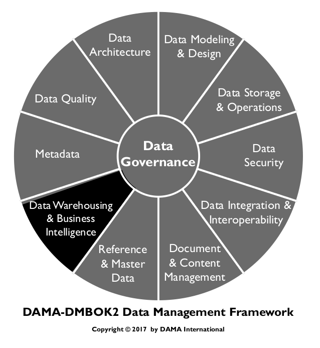
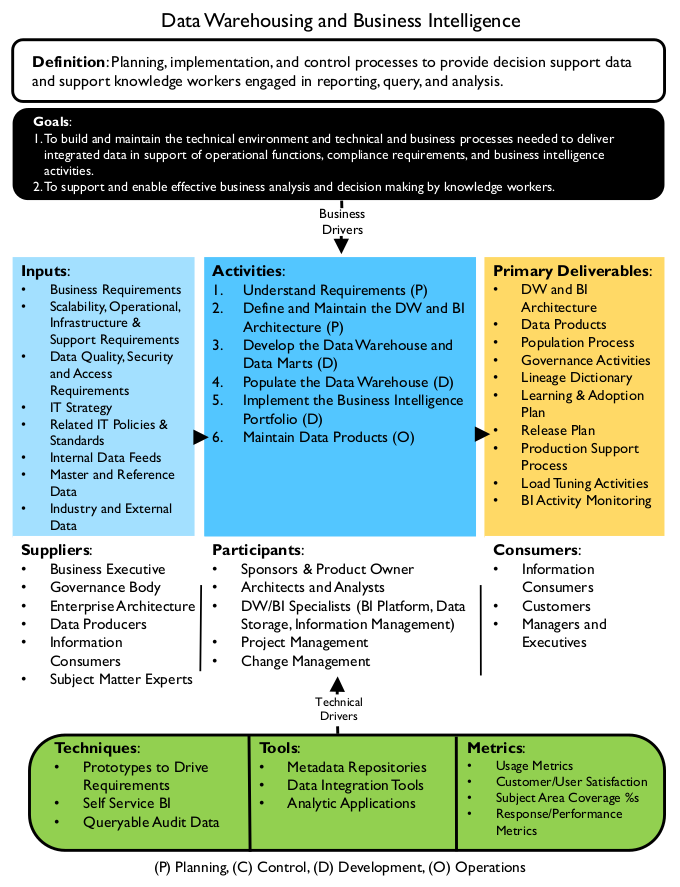
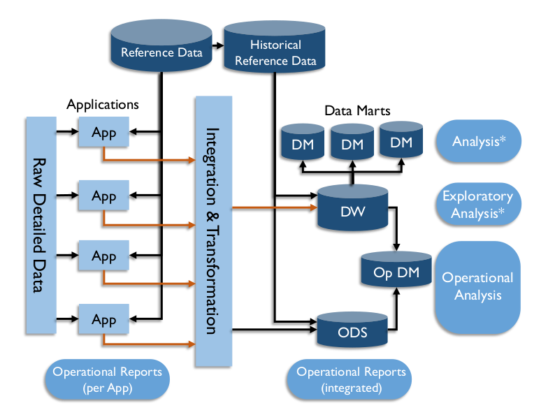
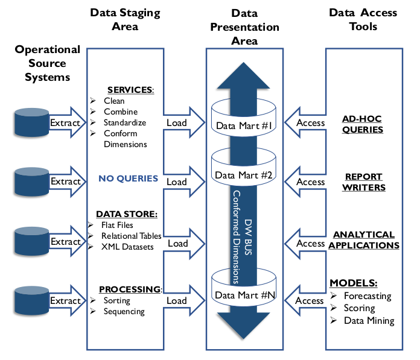
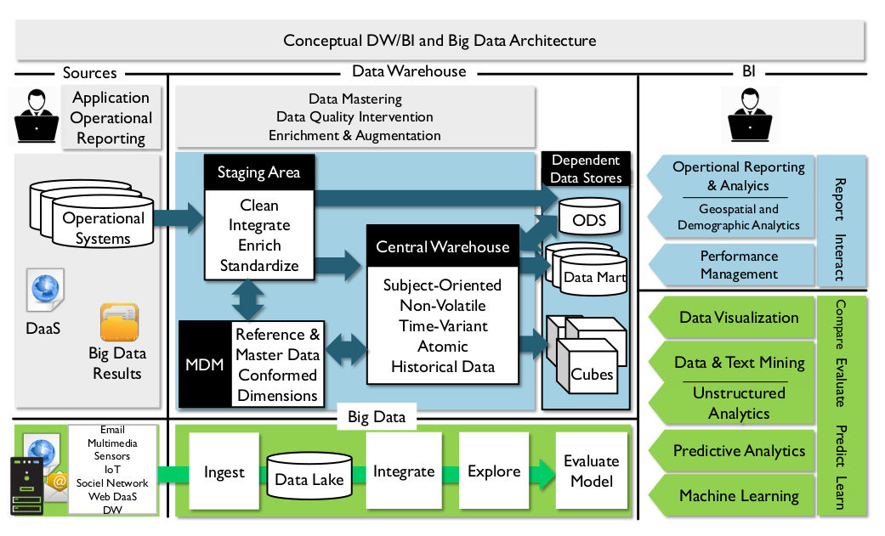
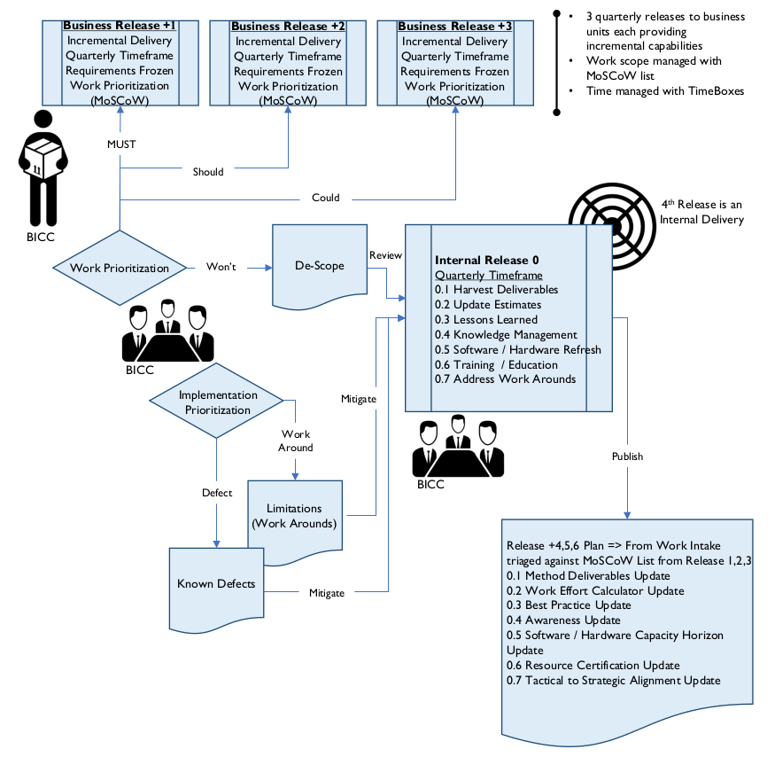

# Data Warehousing e Business Intelligence

## 1. Introdução

O conceito de Data Warehouse surgiu na década de 1980, quando a tecnologia permitiu que as organizações integrassem dados de diversas fontes em um modelo de dados comum. Dados integrados prometiam fornecer insights sobre os processos operacionais e abrir novas possibilidades de aproveitamento de dados para a tomada de decisões e a criação de valor organizacional. Igualmente importante, os data warehouses eram vistos como um meio de reduzir a proliferação de sistemas de suporte à decisão (SAD), a maioria dos quais se baseava nos mesmos dados corporativos essenciais. O conceito de data warehouse corporativo prometia uma maneira de reduzir a redundância de dados, melhorar a consistência das informações e permitir que uma empresa utilizasse seus dados para tomar decisões mais acertadas.

Figura 79 Diagrama de Contexto: DW/BI

Os data warehouses começaram a ser construídos com mais força na década de 1990. Desde então (e especialmente com a coevolução da Business Intelligence como principal impulsionador da tomada de decisões de negócios), os data warehouses se tornaram "mainstream". A maioria das empresas possui data warehouses, e o armazenamento é o núcleo reconhecido do gerenciamento de dados corporativos. [^63] Embora bem estabelecido, o data warehouse continua a evoluir. À medida que novas formas de dados são criadas com velocidade crescente, novos conceitos, como data lakes, surgem e influenciarão o futuro do data warehouse. Consulte os Capítulos 8 e 15.

## 1.1 Impulsionadores de Negócios

O principal impulsionador do data warehouse é o suporte a funções operacionais, requisitos de conformidade e atividades de Business Intelligence (BI) (embora nem todas as atividades de BI dependam de dados de warehouse). Cada vez mais, as organizações são solicitadas a fornecer dados como evidência de que cumpriram os requisitos regulatórios. Por conterem dados históricos, os warehouses costumam ser o meio para responder a essas solicitações. No entanto, o suporte de Business Intelligence continua sendo a principal razão para a existência de um warehouse. O BI promete insights sobre a organização, seus clientes e seus produtos. Uma organização que atua com base no conhecimento adquirido com o BI pode melhorar a eficiência operacional e a vantagem competitiva. À medida que mais dados se tornam disponíveis em maior velocidade, o BI evoluiu da avaliação retrospectiva para a análise preditiva.

### 1.2 Objetivos e Princípios

As organizações implementam data warehouses para:

* Apoiar a atividade de Business Intelligence
* Permitir análises de negócios e tomadas de decisão eficazes
* Encontrar maneiras de inovar com base em insights de seus dados

A implementação de um Data Warehouse deve seguir estes princípios norteadores:

* **Foco nos objetivos de negócios:** Certifique-se de que o Data Warehouse atenda às prioridades organizacionais e resolva os problemas de negócios.
* **Comece com o objetivo final em mente:** Deixe que a prioridade de negócios e o escopo da entrega de dados finais no ambiente de BI impulsionem a criação do conteúdo do Data Warehouse.
* **Pense e projete globalmente; aja e construa localmente:** Deixe que a visão final guie a arquitetura, mas construa e entregue incrementalmente, por meio de projetos focados ou sprints que permitam um retorno mais imediato sobre o investimento.
* **Resuma e otimize por último, não primeiro:** Construa com base nos dados atômicos. Agregue e resuma para atender aos requisitos e garantir o desempenho, não para substituir os detalhes.
* **Promova a transparência e o autoatendimento:** Quanto mais contexto (Metadados de todos os tipos) for fornecido, mais capazes os consumidores de dados serão de extrair valor dos dados. Mantenha as partes interessadas informadas sobre os dados e os processos pelos quais eles são integrados.
* **Construa Metadados com o warehouse:** A capacidade de explicar os dados é fundamental para o sucesso do DW. Por exemplo, ser capaz de responder a perguntas básicas como "Por que essa soma é X?", "Como isso foi calculado?" e ​​"De onde vieram os dados?". Os metadados devem ser capturados como parte do ciclo de desenvolvimento e gerenciados como parte das operações contínuas.
* **Colabore:** Colabore com outras iniciativas de dados, especialmente aquelas para Governança de Dados, Qualidade de Dados e Metadados.
* **Uma solução única não se aplica a todos:** Use as ferramentas e os produtos certos para cada grupo de consumidores de dados.

### 1.3 Conceitos Essenciais

#### 1.3.1 Business Intelligence

O termo Business Intelligence (BI) tem dois significados. Primeiro, refere-se a um tipo de análise de dados que visa compreender as atividades e oportunidades organizacionais. Os resultados dessa análise são usados ​​para aprimorar o sucesso organizacional. Quando as pessoas dizem que os dados são a chave para a vantagem competitiva, estão articulando a promessa inerente à atividade de Business Intelligence: que, se uma organização fizer as perguntas certas sobre seus próprios dados, poderá obter insights sobre seus produtos, serviços e clientes que lhe permitam tomar melhores decisões sobre como atingir seus objetivos estratégicos. Em segundo lugar, Business Intelligence refere-se a um conjunto de tecnologias que suportam esse tipo de análise de dados. Uma evolução das ferramentas de suporte à decisão, as ferramentas de BI permitem consultas, mineração de dados, análise estatística, relatórios, modelagem de cenários, visualização de dados e criação de painéis. Elas são usadas para tudo, desde orçamentos até análises avançadas.

#### 1.3.2 Data Warehouse

Um Data Warehouse (DW) é uma combinação de dois componentes principais: um banco de dados integrado de suporte à decisão e os programas de software relacionados usados ​​para coletar, limpar, transformar e armazenar dados de uma variedade de fontes operacionais e externas. Para atender aos requisitos históricos, analíticos e de BI, um data warehouse também pode incluir data marts dependentes, que são cópias de subconjuntos de dados do warehouse. Em seu contexto mais amplo, um data warehouse inclui quaisquer armazenamentos ou extrações de dados usados ​​para dar suporte à entrega de dados para fins de BI.

Um Enterprise Data Warehouse (EDW) é um data warehouse centralizado projetado para atender às necessidades de BI de toda a organização. Um EDW adere a um modelo de dados corporativo para garantir a consistência das atividades de suporte à decisão em toda a empresa.

#### 1.3.3 Data Warehousing

Data Warehousing descreve os processos operacionais de extração, limpeza, transformação, controle e carregamento que mantêm os dados em um data warehouse. O processo de data warehouse concentra-se em permitir um contexto de negócios integrado e histórico em dados operacionais, aplicando regras de negócios e mantendo relacionamentos de dados de negócios apropriados. O data warehouse também inclui processos que interagem com repositórios de metadados.

Tradicionalmente, o data warehouse concentra-se em dados estruturados: elementos em campos definidos, sejam em arquivos ou tabelas, conforme documentado em modelos de dados. Com os recentes avanços tecnológicos, o espaço de BI e DW agora abrange dados semiestruturados e não estruturados. Dados semiestruturados, definidos como elementos eletrônicos organizados como entidades semânticas sem afinidade de atributos obrigatória, são anteriores ao XML, mas não ao HTML; uma transferência EDI poderia servir de exemplo. Dados não estruturados referem-se a dados que não são predefinidos por meio de um modelo de dados. Como os dados não estruturados existem em uma variedade de formatos e abrangem itens como e-mail, texto em formato livre, documentos comerciais, vídeos, fotos e páginas da web, para citar alguns, definir uma estrutura de armazenamento viável que sustente cargas de trabalho analíticas dentro da governança de data warehouse tem sido um desafio ainda a ser superado.

#### 1.3.4 Abordagens para Data Warehousing

Grande parte da discussão sobre o que constitui um data warehouse tem sido conduzida por dois influentes líderes de pensamento – Bill Inmon e Ralph Kimball – que têm abordagens diferentes para a modelagem e o desenvolvimento de data warehouses. Inmon define um data warehouse como “uma coleção de dados orientada por assunto, integrada, variável no tempo e não volátil, em apoio ao processo de tomada de decisão da gerência”. [^64] Um modelo relacional normalizado é usado para armazenar e gerenciar dados. Kimball define um data warehouse como “uma cópia de dados de transações especificamente estruturada para consulta e análise”. A abordagem de Kimball exige um modelo dimensional. (Ver Capítulo 5.)

Embora Inmon e Kimball defendam abordagens diferentes para a construção de warehouses, suas definições reconhecem ideias centrais semelhantes:

* Warehouses armazenam dados de outros sistemas
* O ato de armazenar inclui organizar os dados de forma a aumentar seu valor
* Warehouses tornam os dados acessíveis e utilizáveis ​​para análise
* As organizações constroem warehouses porque precisam disponibilizar dados confiáveis ​​e integrados para partes interessadas autorizadas
* Os dados de warehouse atendem a diversos propósitos, desde o suporte ao fluxo de trabalho até a gestão operacional e a análise preditiva

### 1.3.5 Fábrica de Informações Corporativas (Inmon)

A Fábrica de Informações Corporativas (CIF) de Bill Inmon é um dos dois principais padrões de data warehouse. Os componentes da definição de Inmon para data warehouse, "uma coleção de dados históricos resumidos e detalhados, orientada por assunto, integrada, variável no tempo e não volátil", descrevem os conceitos que sustentam a CIF e apontam as diferenças entre data warehouses e sistemas operacionais.

* **Orientado por assunto:** O data warehouse é organizado com base nas principais entidades de negócios, em vez de focar em uma funcionalidade ou aplicação.
* **Integrado:** Os dados no data warehouse são unificados e coesos. As mesmas estruturas-chave, codificação e decodificação de estruturas, definições de dados e convenções de nomenclatura são aplicadas de forma consistente em todo o data warehouse. Como os dados são integrados, os dados do data warehouse não são simplesmente uma cópia dos dados operacionais. Em vez disso, o data warehouse se torna um sistema de registro para os dados.
* **Variante no tempo:** O data warehouse armazena os dados como eles existem em um determinado momento. Os registros no DW são como instantâneos. Cada um reflete o estado dos dados em um determinado momento. Isso significa que consultar dados com base em um período específico sempre produzirá o mesmo resultado, independentemente de quando a consulta for enviada.
* **Não volátil:** No DW, os registros normalmente não são atualizados como em sistemas operacionais. Em vez disso, novos dados são anexados aos dados existentes. Um conjunto de registros pode representar diferentes estados da mesma transação.
* **Dados agregados e detalhados:** Os dados no DW incluem detalhes de transações em nível atômico, bem como dados resumidos. Os sistemas operacionais raramente agregam dados. Quando os warehouses foram estabelecidos, considerações de custo e espaço impulsionaram a necessidade de resumir os dados. Os dados resumidos podem ser persistentes (armazenados em uma tabela) ou não persistentes (renderizados em uma visualização) em ambientes de DW contemporâneos. O fator decisivo para persistir os dados geralmente é o desempenho.
* **Histórico:** O foco dos sistemas operacionais são os dados atuais. Os warehouses também contêm dados históricos. Frequentemente, eles armazenam grandes quantidades deles.

Inmon, Claudia Imhoff e Ryan Sousa descrevem o data warehousing no contexto da Fábrica de Informações Corporativas (CIF). Veja a Figura 80. Os componentes da CIF incluem:

* **Aplicativos:** Os aplicativos executam processos operacionais. Dados detalhados dos aplicativos são trazidos para o data warehouse e para os repositórios de dados operacionais (ODS), onde podem ser analisados.
* **Área de Preparação:** Um banco de dados que fica entre os bancos de dados de origem operacional e os bancos de dados de destino. A área de preparação de dados é onde ocorrem os esforços de extração, transformação e carregamento. Ela não é utilizada pelos usuários finais. A maioria dos dados na área de preparação de dados é transitória, embora normalmente haja uma quantidade relativamente pequena de dados persistentes.
* **Integração e transformação:** Na camada de integração, dados de fontes distintas são transformados para que possam ser integrados à representação/modelo corporativo padrão no DW e no ODS.
* **Armazenamento de Dados Operacionais (ODS):** Um ODS é um banco de dados integrado de dados operacionais. Ele pode ser obtido diretamente de aplicativos ou de outros bancos de dados. Os ODS geralmente contêm dados atuais ou de curto prazo (30 a 90 dias), enquanto um DW também contém dados históricos (geralmente vários anos de dados). Os dados em ODS são voláteis, enquanto os dados de warehouse são estáveis. Nem todas as organizações utilizam ODS. Eles evoluíram para atender à necessidade de dados de baixa latência. Um ODS pode servir como fonte primária para um data warehouse; também pode ser usado para auditar um data warehouse.
* **Data marts:** Os data marts fornecem dados preparados para análise. Esses dados geralmente são um subconjunto de dados de warehouse projetados para oferecer suporte a tipos específicos de análise ou a um grupo específico de consumidores de dados. Por exemplo, os marts podem agregar dados para oferecer suporte a análises mais rápidas. A modelagem dimensional (usando técnicas de desnormalização) é frequentemente usada para projetar data marts orientados ao usuário.
* **Data Mart Operacional (OpDM):** Um OpDM é um data mart focado no suporte à decisão tática. Ele é obtido diretamente de um ODS, em vez de um DW. Ele compartilha características do ODS: contém dados atuais ou de curto prazo. Seu conteúdo é volátil.
* **Data Warehouse:** O DW fornece um ponto único de integração para dados corporativos, apoiando a tomada de decisões gerenciais, a análise e o planejamento estratégico. Os dados fluem para um DW a partir dos sistemas de aplicação e do ODS, e fluem para os data marts, geralmente em apenas uma direção. Os dados que precisam de correção são rejeitados, corrigidos na fonte e, idealmente, realimentados pelo sistema.
* **Relatórios operacionais:** Os relatórios são gerados a partir dos data warehouses.
* **Dados de referência, mestres e externos:** Além dos dados transacionais dos aplicativos, o CIF também inclui dados necessários para a compreensão das transações, como dados de referência e mestres. O acesso a dados comuns simplifica a integração no DW. Enquanto os aplicativos consomem os dados mestres e de referência atuais, o DW também requer valores históricos e os períodos em que eles foram válidos (consulte o Capítulo 10).

A Figura 80 ilustra o movimento dentro do CIF, desde a coleta e criação de dados por meio de aplicativos (à esquerda) até a criação de informações por meio de marts e análises (à direita). A movimentação da esquerda para a direita inclui outras mudanças. Por exemplo:

* O propósito muda da execução de funções operacionais para a análise
* Os usuários finais dos sistemas passam de trabalhadores da linha de frente para tomadores de decisão
* O uso do sistema passa de operações fixas para usos ad hoc
* Os requisitos de tempo de resposta são flexibilizados (decisões estratégicas levam mais tempo do que as operações diárias)
* Muito mais dados são envolvidos em cada operação, consulta ou processo

Os dados em DW e marts diferem daqueles em aplicativos:

* Os dados são organizados por assunto em vez de função
* Os dados são integrados em vez de "silos"
* Os dados são variantes no tempo em vez de apenas valores atuais
* Os dados têm maior latência em DW do que em aplicativos
* Significativamente mais dados históricos estão disponíveis em DW do que em aplicativos

Figura 80 A Fábrica de Informações Corporativas

#### 1.3.6 DW Dimensional (Kimball)

O Data Warehouse Dimensional de Kimball é o outro padrão primário para o desenvolvimento de DW. Kimball define um data warehouse simplesmente como "uma cópia de dados de transações especificamente estruturada para consulta e análise" (Kimball, 2002). A "cópia", no entanto, não é exata. Os dados do data warehouse são armazenados em um modelo de dados dimensional. O modelo dimensional é projetado para permitir que os consumidores de dados entendam e utilizem os dados, além de permitir o desempenho das consultas. [^65] Ele não é normalizado da mesma forma que um modelo de entidade-relacionamento.

Frequentemente chamados de Esquema Estrela, os modelos dimensionais são compostos por fatos, que contêm dados quantitativos sobre processos de negócios (por exemplo, números de vendas), e dimensões, que armazenam atributos descritivos relacionados aos dados de fatos e permitem que os consumidores de dados respondam a perguntas sobre os fatos (por exemplo, quantas unidades do produto X foram vendidas neste trimestre?). Uma tabela de fatos se une a muitas tabelas de dimensão e, quando visualizada como um diagrama, aparece como uma estrela. (Consulte o Capítulo 5.) Várias tabelas de fatos compartilharão as dimensões comuns, ou conformadas, por meio de um "barramento", semelhante a um barramento em um computador. [^66] Vários data marts podem ser integrados em nível empresarial conectando-se ao barramento de dimensões conformadas.

A matriz de barramento DW mostra a interseção dos processos de negócios que geram dados de fatos e áreas de assunto de dados que representam dimensões. Oportunidades para dimensões conformadas existem quando vários processos usam os mesmos dados. A Tabela 27 é um exemplo de matriz de barramento. Neste exemplo, os processos de negócios de Vendas, Estoque e Pedidos exigem dados de Data e Produto. Vendas e Estoque exigem dados de Loja, enquanto Estoque e Pedidos exigem dados de Fornecedor. Data, Produto, Loja e Fornecedor são todos candidatos a dimensões conformadas. Em contraste, Armazém não é compartilhado; é usado apenas por Estoque.

Tabela 27 Exemplo de Matriz de Barramento DW

<table>
  <thead>
    <tr>
      <th></th>
      <th colspan="4">Áreas Temáticas</th>
    </tr>
    <tr>
      <th>Processos de Negócios</th>
      <th>Data</th>
      <th>Produto</th>
      <th>Loja</th>
      <th>Fornecedor</th>
      <th>Armazém</th>
    </tr>
  </thead>
  <tbody>
    <tr>
      <td>Vendas</td>
      <td>X</td>
      <td>X</td>
      <td>X</td>
      <td></td>
      <td></td>
    </tr>
    <tr>
      <td>Estoque</td>
      <td>X</td>
      <td>X</td>
      <td>X</td>
      <td>X</td>
      <td>X</td>
    </tr>
    <tr>
      <td>Pedidos</td>
      <td>X</td>
      <td>X</td>
      <td></td>
      <td>X</td>
      <td></td>
    </tr>
    <tr>
      <td>Candidato à Dimensão Conformada</td>
      <td>Sim</td>
      <td>Sim</td>
      <td>Sim</td>
      <td>Sim</td>
      <td>Não</td>
    </tr>
  </tbody>
</table>

A matriz de barramento DW empresarial pode ser usada para representar os requisitos de conteúdo de dados de longo prazo para o sistema DW/BI, independentemente da tecnologia. Essa ferramenta permite que uma organização defina o escopo de esforços de desenvolvimento gerenciáveis. Cada implementação cria um incremento da arquitetura geral. Em algum momento, existem esquemas dimensionais suficientes para cumprir a promessa de um ambiente de data warehouse empresarial integrado. A Figura 81 representa a visão das Peças de Xadrez do Data Warehouse de Kimball da arquitetura DW/BI. Observe que o Data Warehouse de Kimball é mais abrangente que o de Inmon. O DW abrange todos os componentes das áreas de preparação e apresentação de dados.

* **Sistemas de origem operacional:** Aplicações operacionais/transacionais da empresa. Elas criam os dados que são integrados ao ODS e ao DW. Este componente é equivalente aos sistemas de aplicação no diagrama CIF.
* **Área de preparação de dados:** A preparação de Kimball inclui o conjunto de processos necessários para integrar e transformar dados para apresentação. Pode ser comparada a uma combinação dos componentes de integração, transformação e DW do CIF. O foco da Kimball está na entrega final eficiente dos dados analíticos, um escopo menor do que o gerenciamento corporativo de dados da Inmon. O DW corporativo da Kimball pode se encaixar na arquitetura da área de preparação de dados.
* **Área de apresentação de dados:** Semelhante aos Data Marts no CIF. A principal diferença arquitetônica é um paradigma integrador de um "Barramento DW", como dimensões compartilhadas ou conformadas que unificam os múltiplos data marts.
* **Ferramentas de acesso a dados:** A abordagem da Kimball concentra-se nos requisitos de dados dos usuários finais. Essas necessidades impulsionam a adoção de ferramentas de acesso a dados apropriadas.

#### 1.3.7 Componentes da Arquitetura do DW

O ambiente de data warehouse inclui um conjunto de componentes arquitetônicos que precisam ser organizados para atender às necessidades da empresa. A Figura 82 descreve os componentes arquitetônicos do DW/BI e do Ambiente de Big Data discutidos nesta seção. A evolução do Big Data mudou o cenário do DW/BI, adicionando outro caminho pelo qual os dados podem ser trazidos para uma empresa.

Figura 81 Peças de Xadrez do Data Warehouse de Kimball [^67]

A Figura 82 também descreve aspectos do ciclo de vida dos dados. Os dados são movidos dos sistemas de origem para uma área de preparação, onde podem ser limpos e enriquecidos à medida que são integrados e armazenados no DW e/ou em um ODS. Do DW, eles podem ser acessados ​​por meio de marts ou cubos e usados ​​para vários tipos de relatórios. O Big Data passa por um processo semelhante, mas com uma diferença significativa: enquanto a maioria dos data warehouses integra dados antes de colocá-los em tabelas, as soluções de Big Data os ingerem antes de integrá-los. O BI para Big Data pode incluir análise preditiva e mineração de dados, bem como formas mais tradicionais de relatórios. (Consulte o Capítulo 14.)

##### 1.3.7.1 Sistemas de Origem

Os Sistemas de Origem, no lado esquerdo da Figura 82, incluem os sistemas operacionais e os dados externos a serem trazidos para o ambiente DW/BI. Isso normalmente inclui sistemas operacionais como CRM, Contabilidade e aplicativos de Recursos Humanos, bem como sistemas operacionais que variam de acordo com o setor. Dados de fornecedores e fontes externas também podem ser incluídos, assim como DaaS, conteúdo web e quaisquer resultados de computação de Big Data.

##### 1.3.7.2 Integração de Dados

A integração de dados abrange Extração, Transformação e Carregamento (ETL), virtualização de dados e outras técnicas para obter dados em um formato e local comuns. Em um ambiente SOA, as camadas de serviços de dados fazem parte desse componente. Na Figura 82, todas as setas representam os processos de integração de dados. (Consulte o Capítulo 8.)

Figura 82: Arquitetura Conceitual de DW/BI e Big Data

##### 1.3.7.3 Áreas de Armazenamento de Dados

O data warehouse possui um conjunto de áreas de armazenamento:

* **Área de preparação:** Uma área de preparação é um armazenamento de dados intermediário entre uma fonte de dados original e o repositório de dados centralizado. Os dados são preparados para que possam ser transformados, integrados e preparados para carregamento no data warehouse.
* **Dimensões conformadas de Dados Mestres e de Referência:** Os Dados Mestres e de Referência podem ser armazenados em repositórios separados. O data warehouse alimenta novos Dados Mestres e é alimentado pelo conteúdo das dimensões conformadas dos repositórios separados.
* **Data Warehouse Central:** Uma vez transformados e preparados, os dados do DW geralmente persistem na camada central ou atômica. Essa camada mantém todos os dados atômicos históricos, bem como a instância mais recente da execução em lote. A estrutura de dados dessa área é desenvolvida e influenciada com base nas necessidades de desempenho e nos padrões de uso. Vários elementos de design são utilizados:
* A relação entre a chave de negócios e as chaves substitutas para desempenho
* Criação de índices e chaves estrangeiras para suportar dimensões
* Técnicas de Captura de Dados Alterados (CDC) usadas para detectar, manter e armazenar o histórico
* **Armazenamento de Dados Operacionais (ODS):** O ODS é uma versão de um armazenamento central persistente que suporta latências mais baixas e, portanto, uso operacional. Como o ODS contém uma janela de tempo de dados e não o histórico, ele pode ser atualizado muito mais rapidamente do que um warehouse. Às vezes, fluxos em tempo real são capturados em intervalos predefinidos no ODS para permitir relatórios e análises integrados. Com o tempo, com a frequência crescente de atualizações impulsionadas pelas necessidades de negócios e o desenvolvimento de tecnologias e técnicas para integrar dados em tempo real ao DW, muitas instalações incorporaram seus ODS à arquitetura existente de DW ou Data Mart.
* **Data marts:** Um data mart é um tipo de armazenamento de dados frequentemente usado para suportar camadas de apresentação do ambiente de data warehouse. Também é usado para apresentar um subconjunto departamental ou funcional do DW para relatórios, consultas e análises integradas de informações históricas. O data mart é orientado para uma área temática específica, um único departamento ou um único processo de negócios. Ele também pode formar a base de um warehouse virtualizado, onde os marts combinados compõem a entidade de warehouse resultante. Os processos de integração de dados atualizarão, atualizarão ou expandirão o conteúdo dos vários marts a partir da camada de persistência.
* **Cubos:** Três abordagens clássicas de implementação oferecem suporte ao Processamento Analítico Online (OLAP). Seus nomes estão relacionados aos tipos de banco de dados subjacentes, como Relacional, Multidimensional e Híbrido.

#### 1.3.8 Tipos de Processamento de Carga

O data warehouse envolve dois tipos principais de processos de integração de dados: cargas históricas e atualizações contínuas. Os dados históricos geralmente são carregados apenas uma vez, ou algumas vezes durante a resolução de problemas de dados, e nunca mais. As atualizações contínuas são agendadas e executadas de forma consistente para manter os dados no warehouse atualizados.

##### 1.3.8.1 Dados Históricos

Uma vantagem de um data warehouse é que ele pode capturar o histórico detalhado dos dados que armazena. Existem diferentes métodos para capturar esses detalhes. Uma organização que deseja capturar o histórico deve projetar com base nos requisitos. Ser capaz de reproduzir instantâneos pontuais exige uma abordagem diferente da simples apresentação do estado atual.

O data warehouse Inmon sugere que todos os dados sejam armazenados em uma única camada de data warehouse. Essa camada armazenará dados de nível atômico limpos, padronizados e governados. Uma camada comum de integração e transformação facilita a reutilização em todas as implementações de entrega. Um modelo de dados corporativo é necessário para o sucesso. Uma vez validado, esse armazenamento único fica disponível para diferentes consumidores de dados por meio de um data mart estruturado em estrela.

O data warehouse Kimball sugere que o data warehouse seja composto por uma combinação de data marts departamentais contendo dados limpos, padronizados e governados. Os data marts armazenarão o histórico em nível atômico. Dimensões e fatos conformados fornecerão informações de nível corporativo.

Outra abordagem, o Data Vault, também limpa e padroniza como parte do processo de preparação. O histórico é armazenado em uma estrutura atômica normalizada, com chaves substitutas dimensionais, primárias e alternativas definidas. Garantir que o relacionamento entre as chaves de negócio e substituta permaneça intacto torna-se a função secundária do vault – este é o histórico do data mart. Os fatos são persistidos aqui como estruturas atômicas. O vault fica então disponível para uma variedade de consumidores de dados por meio de data marts. Ao reter o histórico dentro do vault, é possível recarregar os fatos quando incrementos posteriores introduzem alterações de granularidade. É possível virtualizar a camada de apresentação, facilitando a entrega incremental ágil e o desenvolvimento colaborativo com a comunidade empresarial. Um processo de materialização final pode implementar um data mart em estrela mais tradicional para consumo do usuário final em produção.

##### 1.3.8.2 Captura de Dados de Alterações em Lote

Data warehouses geralmente são carregados diariamente e atendidos por uma janela de lote noturna. O processo de carregamento pode acomodar uma variedade de detecções de alterações, visto que cada sistema de origem pode exigir técnicas de captura de alterações diferentes.

Técnicas de log de banco de dados são prováveis ​​candidatas para aplicações desenvolvidas internamente, visto que aplicações adquiridas por fornecedores dificilmente toleram modificações com gatilhos ou sobrecarga adicional. Carregamentos com registro de data e hora ou tabelas de log são os mais comuns. Carregamentos completos ocorrem ao lidar com sistemas legados criados sem recursos nativos de registro de data e hora (sim, existem aplicações sem bancos de dados) ou quando certas condições de recuperação em lote se aplicam.

A Tabela 28 resume as diferenças entre as técnicas de captura de dados de alterações, incluindo sua complexidade e velocidade relativas. A coluna de sobreposição identifica se pode haver duplicação de dados entre as alterações do sistema de origem e o ambiente de destino. Quando a opção Sobreposição estiver definida como "Sim", esses dados de alteração podem já estar presentes. Quando o indicador Excluir estiver definido como "Sim", o Método de Dados de Alteração rastreará quaisquer exclusões ocorridas no sistema de origem – útil para dimensões expiradas que não estão mais em uso. Quando as exclusões não são rastreadas pelo sistema de origem, esforços adicionais são necessários para determinar quando elas ocorrem. (Consulte o Capítulo 8.)

*Tabela 28 - Comparação de Técnicas do CDC*

<table>
  <thead>
    <tr>
      <th>Método</th>
      <th>Requisito do Sistema de Origem</th>
      <th>Complexidade</th>
      <th>Carga de Fatos</th>
      <th>Carga de Dimensão</th>
      <th>Sobreposição</th>
      <th>Exclusões</th>
    </tr>
  </thead>
  <tbody>
    <tr>
      <td>Carregamento Delta com Carimbo de Data/Hora</td>
      <td>Alterações no sistema de origem são carimbadas com a data e hora do sistema</td>
      <td>Baixo</td>
      <td>Rápido</td>
      <td>Rápido</td>
      <td>Sim</td>
      <td>Não</td>
    </tr>
    <tr>
      <td>Carregamento Delta da Tabela de Log</td>
      <td>Alterações no sistema de origem são capturadas e armazenadas em tabelas de log</td>
      <td>Médio</td>
      <td>Nominal</td>
      <td>Nominal</td>
      <td>Sim</td>
      <td>Sim</td>
    </tr>
    <tr>
      <td>Log de Transações do Banco de Dados</td>
      <td>O banco de dados captura alterações no log de transações</td>
      <td>Alto</td>
      <td>Nominal</td>
      <td>Nominal</td>
      <td>Não</td>
      <td>Sim</td>
    </tr>
    <tr>
      <td>Delta de Mensagens</td>
      <td>Alterações no sistema de origem são publicadas como mensagens em tempo [quase] real</td>
      <td>Extremo</td>
      <td>Lento</td>
      <td>Lento</td>
      <td>Não</td>
      <td>Sim</td>
    </tr>
    <tr>
      <td>Carregamento Completo</td>
      <td>Sem indicador de alteração, tabelas extraídas integralmente e comparadas para identificar alterações</td>
      <td>Simples</td>
      <td>Lento</td>
      <td>Nominal</td>
      <td>Sim</td>
      <td>Sim</td>
    </tr>
  </tbody>
</table>

##### 1.3.8.3 Tempo Quase Real e Tempo Real

Com o surgimento do BI Operacional (ou Análise Operacional), buscando menor latência e maior integração de dados em tempo real ou quase real no data warehouse, novas abordagens arquitetônicas surgiram para lidar com a inclusão de dados voláteis. Por exemplo, uma aplicação comum do BI operacional é o provisionamento automatizado de dados em caixas eletrônicos bancários. Ao realizar uma transação bancária, os saldos históricos e os novos saldos resultantes de ações bancárias imediatas precisam ser apresentados ao cliente em tempo real. Dois conceitos-chave de design necessários para o provisionamento de dados em tempo quase real são o isolamento de alterações e alternativas ao processamento em lote.

O impacto das alterações de novos dados voláteis deve ser isolado da maior parte dos dados históricos e não voláteis do DW. As abordagens arquitetônicas típicas para isolamento incluem uma combinação de construção de partições e o uso de consultas de união para as diferentes partições. Alternativas ao processamento em lote atendem aos requisitos de latência cada vez mais curtos para a disponibilidade de dados no DW. Existem três tipos principais: feeds de gotejamento, mensagens e streaming, que diferem conforme o local onde os dados são acumulados enquanto aguardam para serem processados. (Consulte o Capítulo 8.)

* **Alimentação lenta (Acumulação de origem):** Em vez de serem executadas em um cronograma noturno, as alimentações lentas executam carregamentos em lote em um cronograma mais frequente (por exemplo, de hora em hora, a cada 5 minutos) ou quando um limite é atingido (por exemplo, 300 transações, 1 GB de dados). Isso permite que algum processamento ocorra durante o dia, mas não tão intensamente quanto em um processamento em lote noturno dedicado. É necessário cuidado para garantir que, se um lote de alimentação lenta demorar mais para ser concluído do que o tempo entre alimentações, a próxima alimentação seja atrasada para que os dados ainda sejam carregados na ordem correta.
* **Mensagens (Acumulação de barramento):** A interação de mensagens em tempo real ou quase real é útil quando pacotes de dados extremamente pequenos (mensagens, eventos ou transações) são publicados em um barramento à medida que ocorrem. Os sistemas de destino assinam o barramento e processam os pacotes incrementalmente no warehouse, conforme necessário. Os sistemas de origem e de destino são independentes entre si. Dados como Serviço (DaaS) frequentemente utilizam esse método.
* **Streaming (Acumulação de destino):** Em vez de esperar por um cronograma ou limite baseado na origem, um sistema de destino coleta dados conforme eles são recebidos em uma área de buffer ou fila e os processa em ordem. A interação resultante ou algum agregado pode posteriormente aparecer como um feed adicional para o data warehouse.

## 2. Atividades

### 2.1 Entendendo os Requisitos

Desenvolver um data warehouse é diferente de desenvolver um sistema operacional. Os sistemas operacionais dependem de requisitos precisos e específicos. Data warehouses reúnem dados que serão usados ​​de diversas maneiras. Além disso, o uso evoluirá com o tempo, à medida que os usuários analisam e exploram os dados. Reserve um tempo nas fases iniciais

para fazer perguntas relacionadas aos recursos e fontes de dados para dar suporte a esses recursos. Esse tempo de projeto compensa na redução de custos de retrabalho posteriormente, quando o processamento de dados estiver sendo testado usando as fontes de dados reais.

Ao coletar requisitos para projetos de DW/BI, comece com as metas e a estratégia de negócios. Identifique e defina o escopo das áreas de negócios e, em seguida, identifique e entreviste os profissionais de negócios apropriados. Pergunte o que eles fazem e por quê. Capture perguntas específicas que eles estão fazendo agora e aquelas que desejam fazer sobre os dados. Documente como eles distinguem e categorizam aspectos importantes das informações. Sempre que possível, defina e capture as principais métricas e cálculos de desempenho. Isso pode revelar regras de negócios que fornecem a base para a automação das expectativas de qualidade dos dados.

Catalogue os requisitos e priorize-os entre aqueles necessários para a entrada em produção e adoção do warehouse e aqueles que podem esperar. Procure itens simples e valiosos para impulsionar a produtividade da versão inicial do projeto. Uma descrição dos requisitos de um projeto de DW/BI deve enquadrar todo o contexto das áreas de negócios e/ou processos que estão no escopo.

### 2.2 Definir e Manter a Arquitetura de DW/BI

A arquitetura de DW/BI deve descrever de onde os dados vêm, para onde vão, quando vão, por que e como vão para um warehouse. O "como" inclui os detalhes de hardware e software e a estrutura organizacional para reunir todas as atividades. Os requisitos técnicos devem incluir as necessidades de desempenho, disponibilidade e tempo. (Veja Capítulos 4 e 8.)

#### 2.2.1 Definir a Arquitetura Técnica de DW/BI

As melhores arquiteturas de DW/BI projetarão um mecanismo para conectar-se aos relatórios de nível transacional e operacional em um DW atômico. Esse mecanismo protegerá o DW da necessidade de carregar todos os detalhes transacionais. Um exemplo é fornecer um mecanismo de visualização para relatórios ou formulários operacionais importantes com base em uma chave transacional, como o Número da Fatura. Os clientes sempre desejarão todos os detalhes disponíveis, mas alguns dados operacionais, como campos de descrição longos, têm valor apenas no contexto do relatório original e não fornecem valor analítico.

Uma arquitetura conceitual é um ponto de partida. Muitas atividades são necessárias para alinhar corretamente os requisitos não funcionais às necessidades do negócio. A prototipagem pode comprovar ou refutar rapidamente pontos-chave antes de assumir compromissos dispendiosos com tecnologias ou arquiteturas. Além disso, capacitar a comunidade empresarial com conhecimento e programas de adoção, defendidos por uma equipe de gerenciamento de mudanças aprovada, auxiliará na transição e no sucesso operacional contínuo.

Uma extensão natural desse processo de transformação é a manutenção, ou pelo menos a validação, com o modelo de dados corporativo. Como o foco está em quais estruturas de dados estão em uso por quais áreas organizacionais, verifique a implantação física em relação ao modelo lógico. Faça quaisquer atualizações caso ocorram omissões ou erros.

#### 2.2.2 Definir Processos de Gestão de DW/BI

Abordar a gestão da produção com um processo de manutenção coordenado e integrado, disponibilizando lançamentos regulares para a comunidade empresarial.

É crucial estabelecer um plano de lançamento padrão (consulte a Seção 2.6). Idealmente, a equipe do projeto de warehouse deve gerenciar cada atualização do produto de dados implantado como um lançamento de software que fornece funcionalidades adicionais. Estabelecer um cronograma para lançamentos permite um plano anual de demanda e recursos e um cronograma de entrega padrão. Use o lançamento interno para ajustar esse cronograma padronizado, as expectativas de recursos e as planilhas de estimativas derivadas dele.

Estabelecer um processo de lançamento funcional garante que a gestão entenda que este é um processo proativo centrado no produto de dados e não um produto instalado, abordado por meio da resolução reativa de problemas. É fundamental trabalhar de forma proativa e colaborativa em uma equipe multifuncional para o crescimento contínuo e o aprimoramento de recursos – sistemas de suporte reativos reduzem a adoção.

### 2.3 Desenvolver o Data Warehouse e os Data Marts

Normalmente, os projetos de DW/BI têm três trilhas de desenvolvimento simultâneas:

* **Dados:** Os dados necessários para dar suporte à análise que a empresa deseja realizar. Esta trilha envolve a identificação das melhores fontes de dados e a criação de regras sobre como os dados são remediados, transformados, integrados, armazenados e disponibilizados para uso pelos aplicativos. Esta etapa também inclui decidir como lidar com dados que não atendem às expectativas.
* **Tecnologia:** Os sistemas e processos de back-end que suportam o armazenamento e a movimentação de dados. A integração com a empresa existente é fundamental, pois o data warehouse não é uma ilha em si. Arquiteturas Corporativas, especificamente as especialidades em Tecnologia e Aplicativos, geralmente gerenciam esta trilha.
* **Ferramentas de Business Intelligence:** O conjunto de aplicativos necessário para que os consumidores de dados obtenham insights significativos dos produtos de dados implantados.

#### 2.3.1 Mapear Fontes para Destinos

O mapeamento da origem para o destino estabelece regras de transformação para entidades e elementos de dados de fontes individuais para um sistema de destino. Esse mapeamento também documenta a linhagem de cada elemento de dados disponível no ambiente de BI até sua(s) respectiva(s) fonte(s).

A parte mais difícil de qualquer esforço de mapeamento é determinar vínculos válidos ou equivalências entre elementos de dados em múltiplos sistemas. Considere o esforço de consolidar dados em um DW a partir de múltiplos sistemas de faturamento ou gerenciamento de pedidos. É provável que tabelas e campos que contêm dados equivalentes não tenham os mesmos nomes ou estruturas.

Uma taxonomia sólida é necessária para mapear elementos de dados em diferentes sistemas para uma estrutura consistente no DW. Na maioria das vezes, essa taxonomia é o modelo lógico de dados. O processo de mapeamento também deve considerar se os dados em diferentes estruturas devem ser anexados, alterados no local ou inseridos.

#### 2.3.2 Remediar e Transformar Dados

Atividades de remediação ou limpeza de dados impõem padrões e corrigem e aprimoram os valores de domínio de elementos de dados individuais. A remediação é particularmente necessária para cargas iniciais que envolvem histórico significativo. Para reduzir a complexidade do sistema de destino, os sistemas de origem devem ser responsabilizados pela remediação e correção de dados.

Desenvolva estratégias para linhas de dados carregadas, mas que se mostram incorretas. Uma política de exclusão de registros antigos pode causar algum estrago em tabelas e chaves substitutas relacionadas; expirar uma linha e carregar os novos dados como uma linha completamente nova pode ser uma opção melhor.

Uma estratégia de carga otimista pode incluir a criação de entradas de dimensão para acomodar dados de fatos. Tal processo deve levar em conta como atualizar e expirar essas entradas. Estratégias de carga pessimista devem incluir uma área de reciclagem para dados de fatos que não podem ser associados às chaves de dimensão correspondentes. Essas entradas exigem notificação, alertas e relatórios apropriados para garantir que sejam rastreadas e recarregadas posteriormente. As tarefas de fatos devem considerar primeiro o carregamento de entradas recicladas e, em seguida, o processamento do conteúdo recém-chegado.

A transformação de dados concentra-se em atividades que implementam regras de negócios em um sistema técnico. A transformação de dados é essencial para a integração de dados. Definir as regras corretas para integrar dados frequentemente requer o envolvimento direto de Administradores de Dados e outras PMEs. As regras devem ser documentadas para que possam ser governadas. Ferramentas de integração de dados realizam essas tarefas. (Consulte o Capítulo 8.)

### 2.4 Preencher o Data Warehouse

A maior parte do trabalho em qualquer projeto de DW/BI é a preparação e o processamento dos dados. As decisões e os princípios de design para quais detalhes de dados o DW contém são uma prioridade fundamental para a arquitetura de DW/BI. Publicar regras claras sobre quais dados estarão disponíveis apenas por meio de relatórios operacionais (como em projetos não DW) é fundamental para o sucesso dos projetos de DW/BI.

Os principais fatores a serem considerados ao definir uma abordagem de preenchimento são a latência necessária, a disponibilidade de fontes, as janelas de lote ou intervalos de upload, os bancos de dados de destino, os aspectos dimensionais e a consistência do período de tempo do data warehouse e do data mart. A abordagem também deve abordar o processamento da qualidade dos dados, o tempo para realizar transformações, as dimensões e as rejeições de dados que chegam com atraso.

Outro aspecto da definição de uma abordagem populacional gira em torno do processo de captura de dados alterados – detectar alterações no sistema de origem, integrar essas alterações e alinhar as alterações ao longo do tempo. Vários bancos de dados agora fornecem funcionalidade de captura de logs na qual as ferramentas de integração de dados podem operar diretamente, para que o banco de dados informe ao usuário o que foi alterado. Processos de script podem ser escritos ou gerados onde essa função não estiver disponível. Diversas técnicas estão disponíveis para as equipes de design e construção para integração e alinhamento de latência em feeds heterogêneos.

O primeiro incremento abre caminho para o desenvolvimento de capacidades adicionais e a integração de novas unidades de negócios. Muitas novas tecnologias, processos e habilidades são necessários, bem como planejamento cuidadoso e atenção aos detalhes. Os incrementos subsequentes devem ser construídos sobre esse elemento fundamental, portanto, mais investimentos são recomendados para sustentar dados de alta qualidade, arquitetura técnica e transição para produção. Crie processos para facilitar e automatizar a identificação oportuna de erros de dados com a integração do fluxo de trabalho do usuário final.

### 2.5 Implementar o Portfólio de Business Intelligence

A implementação do Portfólio de BI consiste em identificar as ferramentas certas para as comunidades de usuários certas dentro ou entre as unidades de negócios. Encontre semelhanças por meio do alinhamento de processos comerciais comuns, análise de desempenho, estilos de gestão e requisitos.

#### 2.5.1 Agrupar Usuários de Acordo com as Necessidades

Ao definir os grupos de usuários-alvo, há um espectro de necessidades de BI. Primeiro, conheça os grupos de usuários e, em seguida, combine a ferramenta com os grupos de usuários da empresa. Em uma extremidade do espectro estão os desenvolvedores de TI, preocupados com a extração de dados, que se concentram em funcionalidades avançadas. Na outra extremidade, os consumidores de informação podem desejar acesso rápido a relatórios previamente desenvolvidos e executados. Esses consumidores podem desejar algum grau de interatividade, como detalhamento, filtragem, classificação, ou podem querer apenas ver um relatório estático.

Os usuários podem mudar de uma classe para outra à medida que suas habilidades aumentam ou à medida que desempenham funções diferentes. Um gerente da cadeia de suprimentos, por exemplo, pode querer visualizar um relatório estático sobre finanças, mas um relatório altamente interativo para analisar o estoque. Um analista financeiro e um gerente de linha responsável por despesas podem ser usuários avançados na análise de despesas totais, mas se contentam com um relatório estático de uma conta telefônica. Executivos e gerentes usarão uma combinação de relatórios fixos, painéis e scorecards. Gerentes e usuários avançados tendem a querer detalhar esses relatórios, segmentar os dados e identificar as causas-raiz dos problemas. Clientes externos podem usar qualquer uma dessas ferramentas como parte de sua experiência.

#### 2.5.2 Adequar as Ferramentas aos Requisitos do Usuário

O marketplace oferece uma gama impressionante de ferramentas de relatórios e análises. Os principais fornecedores de BI oferecem recursos clássicos de relatórios pixel-perfect, que antes eram domínio de relatórios de aplicativos. Muitos fornecedores de aplicativos oferecem análises incorporadas com conteúdo padrão obtido de cubos pré-preenchidos ou tabelas agregadas. A virtualização tornou tênue a linha entre fontes de dados locais e dados externos adquiridos ou abertos e, em alguns casos, fornece integração sob demanda, centrada em relatórios e controlada pelo usuário. Em outras palavras, é prudente que as empresas utilizem infraestrutura e mecanismos de entrega comuns. Isso inclui a web, e-mail e aplicativos para a entrega de todos os tipos de informações e relatórios, dos quais DW/BI é um subconjunto.

Muitos fornecedores agora estão combinando ferramentas de BI relacionadas, por meio de fusões e aquisições ou novos desenvolvimentos, e oferecendo suítes de BI. As suítes são a principal opção no nível de Arquitetura Corporativa, mas, como a maioria das organizações já adquiriu ferramentas individuais ou adotou ferramentas de código aberto, é provável que surjam questões sobre substituição versus coexistência. Lembre-se de que cada ferramenta de BI tem um preço, exigindo recursos de sistema, suporte, treinamento e integração arquitetônica.

### 2.6 Manutenção de Produtos de Dados

Um warehouse implementado e suas ferramentas de BI voltadas para o cliente são um produto de dados. Aprimoramentos (extensões, ampliações ou modificações) em uma plataforma de DW existente devem ser implementados de forma incremental. Manter o escopo para um incremento e executar um caminho crítico para itens de trabalho importantes pode ser um desafio em um ambiente de trabalho dinâmico. Defina prioridades com os parceiros de negócios e concentre o trabalho nos aprimoramentos obrigatórios.

#### 2.6.1 Gerenciamento de Liberação

O Gerenciamento de Liberação é fundamental para um processo de desenvolvimento incremental que desenvolve novos recursos, aprimora a implantação da produção e garante a manutenção regular dos ativos implantados. Esse processo manterá o warehouse atualizado, limpo e operando da melhor forma possível. No entanto, esse processo exige o mesmo alinhamento entre TI e Negócios que entre o modelo de Data Warehouse e os recursos de BI. É um esforço de melhoria contínua.

A Figura 83 ilustra um exemplo de processo de liberação, baseado em um cronograma trimestral. Ao longo do ano, há três lançamentos orientados ao negócio e um lançamento baseado em tecnologia (para atender aos requisitos internos do warehouse). O processo deve permitir o desenvolvimento incremental do warehouse e o gerenciamento do backlog de requisitos.

#### 2.6.2 Gerenciar o Ciclo de Vida de Desenvolvimento de Produtos de Dados

Enquanto os consumidores de dados utilizam o DW existente, a equipe do DW se prepara para a próxima iteração, com a compreensão de que nem todos os itens entrarão em produção. Alinhe as iterações às versões com uma lista de trabalhos pendentes priorizada pelas unidades de negócios. Cada iteração estenderá um incremento existente ou adicionará uma nova funcionalidade por meio da integração de uma unidade de negócios. As versões alinharão a funcionalidade à unidade de negócios, enquanto a iteração alinhará a funcionalidade à própria configuração gerenciada pelo gerente de produto.

Figura 83 Exemplo de Processo de Liberação

Os itens que a área de negócios considera prontos e viáveis ​​para investigação posterior podem ser revisados, ajustados, se necessário, e então promovidos para um ambiente piloto ou sandbox, onde os usuários de negócios investigam novas abordagens, experimentam novas técnicas ou desenvolvem novos modelos ou algoritmos de aprendizagem. Esta área pode ter menos governança e supervisão do que outras áreas voltadas para os negócios, mas alguma forma de priorização em sandbox é necessária.

Semelhante ao ambiente tradicional de garantia de qualidade ou teste, examine os itens na área piloto para verificar sua adequação ao ambiente de produção. O desempenho dos itens piloto determina seus próximos passos. Tome cuidado para não promover cegamente e sem considerar questões de qualidade ou governança de dados posteriores. A vida útil em produção é apenas uma medida existencial: deve ser da mais alta qualidade prática para estar em produção.

Itens aprovados no piloto e considerados prontos para produção pelos representantes de negócios e de TI podem ser promovidos para produção como novos produtos de dados. Isso completa uma iteração.

Itens que não forem aprovados no piloto podem ser rejeitados completamente ou devolvidos ao desenvolvimento para ajustes finos. Talvez seja necessário suporte adicional da equipe de DW neste momento para avançar o item na próxima iteração de promoção.

#### 2.6.3 Monitorar e Ajustar Processos de Carga

Monitore o processamento de carga em todo o sistema em busca de gargalos e dependências. Empregue técnicas de ajuste de banco de dados onde e quando necessário, incluindo particionamento, backup ajustado e estratégias de recuperação. O arquivamento é um assunto complexo em data warehouse.

Os usuários frequentemente consideram o data warehouse como um arquivo ativo devido aos longos históricos que são construídos e não estão dispostos a ver o data warehouse se envolver em arquivamento, principalmente se as fontes de Processamento Analítico Online (OLAP) tiverem descartado registros. (Consulte o Capítulo 6.)

#### 2.6.4 Monitorar e Ajustar a Atividade e o Desempenho do BI

Uma prática recomendada para monitoramento e ajuste de BI é definir e exibir um conjunto de métricas de satisfação do cliente. O tempo médio de resposta a consultas e o número de usuários por dia, semana ou mês são exemplos de métricas úteis. Além das medidas estatísticas disponíveis nos sistemas, é útil pesquisar regularmente os clientes de DW/BI.

A revisão regular das estatísticas e padrões de uso é essencial. Relatórios que fornecem a frequência e o uso de recursos de dados, consultas e relatórios permitem um aprimoramento prudente. O ajuste da atividade de BI é análogo ao princípio de criação de perfil de aplicativos para saber onde estão os gargalos e onde aplicar esforços de otimização. A criação de índices e agregações é mais eficaz quando feita de acordo com os padrões e estatísticas de uso. Grandes ganhos de desempenho podem advir de soluções simples, como a publicação dos resultados diários completos em um relatório executado centenas ou milhares de vezes por dia.

Transparência e visibilidade são os princípios-chave que devem nortear o monitoramento de DW/BI. Quanto mais detalhes das atividades de DW/BI forem expostos, mais os consumidores de dados poderão ver e entender o que está acontecendo (e confiar no BI), e menos suporte direto ao cliente final será necessário. Fornecer um painel que exponha o status geral das atividades de entrega de dados, com capacidade de detalhamento, é uma prática recomendada que permite a coleta de informações sob demanda tanto pela equipe de suporte quanto pelos clientes.

A adição de medidas de qualidade de dados aumentará o valor deste painel, onde o desempenho vai além da velocidade e do tempo. Use mapas de calor para visualizar a carga de trabalho na infraestrutura, a taxa de transferência de dados e a conformidade com os níveis de acordos operacionais.

## 3. Ferramentas

Escolher o conjunto inicial de ferramentas pode ser um processo longo. Inclui a tentativa de atender aos requisitos de curto prazo, especificações não funcionais e os requisitos da próxima geração ainda a serem criados. Conjuntos de ferramentas de critérios de decisão, ferramentas de implementação de processos e ofertas de serviços profissionais podem facilitar e agilizar essa atividade. É fundamental avaliar não apenas as posições convencionais de construção ou compra, mas também a opção de aluguel provisionada como Software como Serviço. O aluguel de ferramentas SaaS e a expertise associada são ponderados em relação ao custo de construir do zero ou implantar produtos adquiridos de fornecedores. Considere também os custos contínuos de atualização e possíveis substituições. O alinhamento com um OLA (Acordo de Nível Operacional) definido pode cobrir os custos previstos e fornecer subsídios para a definição de taxas e penalidades relevantes para violações de prazo.

### 3.1 Repositório de Metadados

Grandes organizações frequentemente se deparam com muitas ferramentas de diferentes fornecedores, cada uma implantada potencialmente em versões diferentes. A chave para esse esforço é a capacidade de unir Metadados de diversas fontes. A automatização e a integração do preenchimento deste repositório podem ser alcançadas com uma variedade de técnicas. (Consulte o Capítulo 13.)

#### 3.1.1 Dicionário de Dados / Glossário

Um dicionário de dados é necessário para dar suporte ao uso de um DW. O dicionário descreve os dados em termos de negócios e inclui outras informações necessárias para o uso dos dados (por exemplo, tipos de dados, detalhes da estrutura, restrições de segurança). Frequentemente, o conteúdo do dicionário de dados vem diretamente do modelo lógico de dados. Planeje metadados de alta qualidade garantindo que os modeladores adotem uma abordagem disciplinada para gerenciar as definições como parte do processo de modelagem.

Em algumas organizações, os usuários de negócios participam ativamente do desenvolvimento do dicionário de dados, fornecendo, definindo e, em seguida, administrando correções nas definições dos elementos de dados da área de assunto. Adote essa atividade por meio de uma ferramenta de colaboração, monitore as atividades por meio de um Centro de Excelência e garanta que o conteúdo criado por meio dessa atividade seja mantido no modelo lógico. Garantir a concordância entre o conteúdo voltado para o negócio e o modelo de dados físico voltado para a área técnica reduzirá o risco de erros e retrabalho posteriores. (Ver Capítulo 13.)

#### 3.1.2 Dados e Linhagem do Modelo de Dados

Muitas ferramentas de integração de dados oferecem análise de linhagem que considera tanto o código populacional desenvolvido quanto o modelo de dados físico e o banco de dados. Algumas oferecem interfaces web para monitorar e atualizar definições e outros metadados. A linhagem de dados documentada atende a diversos propósitos:

* Investigação das causas-raiz de problemas de dados
* Análise de impacto para alterações no sistema ou problemas de dados
* Capacidade de determinar a confiabilidade dos dados com base em sua origem

Procure implementar uma ferramenta integrada de impacto e linhagem que possa compreender todas as partes móveis envolvidas no processo de carregamento, bem como relatórios e análises para o usuário final. Os relatórios de análise de impacto descreverão quais componentes são afetados por uma possível alteração, agilizando e otimizando as tarefas de estimativa e manutenção. Muitos processos, relacionamentos e terminologias importantes de negócios são capturados e explicados durante o desenvolvimento do modelo de dados. O modelo lógico de dados contém muitas dessas informações, que frequentemente são perdidas ou ignoradas durante o desenvolvimento ou a implantação em produção. É fundamental garantir que essas informações não sejam descartadas e que os modelos lógicos e físicos sejam atualizados após a implantação e estejam sincronizados.

### 3.2 Ferramentas de Integração de Dados

Ferramentas de integração de dados são usadas para preencher um data warehouse. Além de realizar o trabalho de integração de dados, elas permitem o agendamento de tarefas de forma a considerar a entrega complexa de dados de múltiplas fontes. Ao selecionar uma ferramenta, considere também os seguintes recursos que permitem o gerenciamento do sistema:

* Auditoria, controle, reinicialização e agendamento de processos
* Capacidade de extrair seletivamente elementos de dados em tempo de execução e passar essa extração para um sistema posterior para fins de auditoria
* Controlar quais operações podem ou não ser executadas e reiniciar uma execução com falha ou abortada (consulte o Capítulo 8)

Diversas ferramentas de integração de dados também oferecem recursos de integração com o portfólio de BI, suportando a importação e exportação de mensagens de fluxo de trabalho, e-mails ou até mesmo camadas semânticas. A integração de fluxos de trabalho pode impulsionar processos de identificação, resolução e escalonamento de defeitos de qualidade de dados. O envio de mensagens por e-mail ou o processamento de alertas a partir de e-mail é uma prática comum, especialmente para dispositivos móveis. Além disso, a capacidade de provisionar um destino de dados como uma camada semântica pode ser uma candidata à virtualização de dados para implementações ágeis.

### 3.3 Tipos de Ferramentas de Business Intelligence

A maturidade do mercado de BI e a ampla gama de ferramentas disponíveis tornam raro que as empresas criem suas próprias ferramentas de BI. [^68] O objetivo desta seção é apresentar os tipos de ferramentas disponíveis no mercado de BI e fornecer uma visão geral de suas principais características, com informações que ajudem a adequá-las às capacidades adequadas do cliente. As ferramentas de BI estão evoluindo rapidamente, permitindo uma transição de relatórios padronizados e orientados pela TI para a exploração de dados de autoatendimento e orientada pelos negócios. [^69]

* Relatórios operacionais são a aplicação de ferramentas de BI para analisar tendências de negócios, tanto de curto prazo (mês a mês) quanto de longo prazo (ano a ano). Os relatórios operacionais também podem ajudar a descobrir tendências e padrões. Use o BI Tático para apoiar decisões de negócios de curto prazo.
* A gestão de desempenho empresarial (BPM) inclui a avaliação formal de métricas alinhadas às metas organizacionais. Essa avaliação geralmente ocorre no nível executivo. Use o BI Estratégico para apoiar metas e objetivos corporativos de longo prazo.

* A análise descritiva e de autoatendimento fornece BI para as linhas de frente dos negócios, onde os recursos analíticos orientam as decisões operacionais. A análise operacional acopla aplicações de BI a funções e processos operacionais para orientar decisões em tempo quase real. A exigência de baixa latência (captura e entrega de dados quase em tempo real) impulsionará a abordagem arquitetônica para soluções de análise operacional. Arquitetura orientada a serviços (SOA) e Big Data tornam-se necessários para dar suporte completo à análise operacional (consulte os Capítulos 8 e 15).

#### 3.3.1 Relatórios Operacionais

Relatórios Operacionais envolvem usuários de negócios gerando relatórios diretamente de sistemas transacionais, aplicativos operacionais ou um data warehouse. Normalmente, essa é uma funcionalidade do aplicativo. Frequentemente, as áreas de negócios começarão a usar um DW para relatórios operacionais, especialmente se a governança de DW/BI for ruim ou se o DW contiver dados adicionais que aprimoram os dados operacionais e transacionais. Frequentemente, os relatórios aparecerão como consultas ad hoc, quando, na verdade, são relatórios simples ou são usados ​​para iniciar o fluxo de trabalho. Do ponto de vista do gerenciamento de dados, o fundamental é entender se os dados necessários para esse relatório existem no próprio aplicativo ou se exigem aprimoramentos de dados do DW ou do repositório de dados operacionais.

Ferramentas de exploração de dados e geração de relatórios, às vezes chamadas de ferramentas de consulta ad hoc, permitem que os usuários criem seus próprios relatórios ou saídas para uso por terceiros. Eles se preocupam menos com o layout preciso, pois não estão tentando gerar uma fatura ou algo semelhante. No entanto, desejam incluir gráficos e tabelas de forma rápida e intuitiva. Frequentemente, os relatórios criados por usuários corporativos tornam-se relatórios padrão, não sendo usados ​​exclusivamente para questões comerciais ad hoc.

As necessidades dos relatórios de operações comerciais costumam ser diferentes das necessidades das consultas e relatórios comerciais. Com consultas e relatórios comerciais, a fonte de dados geralmente é um data warehouse ou data mart (embora nem sempre). Enquanto a TI desenvolve relatórios de produção, usuários avançados e usuários corporativos ad hoc desenvolvem seus próprios relatórios com ferramentas de consulta comercial. Use os relatórios gerados com ferramentas de consulta comercial individualmente, departamentalmente ou em toda a empresa.

Os relatórios de produção cruzam a fronteira entre DW e BI e frequentemente consultam sistemas transacionais para produzir itens operacionais, como faturas ou extratos bancários. Os desenvolvedores de relatórios de produção tendem a ser profissionais de TI.

As ferramentas tradicionais de BI abrangem alguns métodos de visualização de dados, como tabelas, gráficos de pizza, gráficos de linhas, gráficos de área, gráficos de barras, histogramas e caixas prontas para uso (candlestick), por exemplo. As visualizações de dados podem ser entregues em um formato estático, como um relatório publicado, ou em um formato online mais interativo; e algumas oferecem suporte à interação do usuário final, onde recursos de detalhamento ou filtragem facilitam a análise dos dados dentro da visualização. Outras permitem que a visualização seja alterada pelo usuário sob demanda. (Consulte o Capítulo 14.)

#### 3.3.2 Gestão de Desempenho Empresarial

A gestão de desempenho é um conjunto de processos e aplicativos organizacionais integrados, projetados para otimizar a execução da estratégia de negócios; as aplicações incluem orçamento, planejamento e consolidação financeira. Houve uma série de aquisições importantes neste segmento, já que fornecedores de ERP e BI enxergam grandes oportunidades de crescimento e acreditam que BI e Gestão de Desempenho estão convergindo. A frequência com que os clientes compram BI e gestão de desempenho do mesmo fornecedor depende dos recursos do produto.

Em termos gerais, a tecnologia de Gestão de Desempenho permite que os processos ajudem a atingir as metas organizacionais. A mensuração e um ciclo de feedback com reforço positivo são elementos-chave. No âmbito do BI, isso assumiu a forma de muitas aplicações empresariais estratégicas, como orçamento, previsão ou planejamento de recursos. Outra especialização surgiu nesta área: a criação de scorecards orientados por painéis para interação do usuário. Painéis, como os encontrados em automóveis, fornecem as informações resumidas ou agregadas necessárias ao usuário final com as atualizações mais recentes (Eckerson, 2005).

#### 3.3.3 Aplicações Analíticas Operacionais

Henry Morris, da IDC, cunhou o termo Aplicações Analíticas na década de 1990, esclarecendo como elas se diferenciam das ferramentas gerais de OLAP e BI (Morris, 1999). As aplicações analíticas incluem a lógica e os processos para extrair dados de sistemas de origem conhecidos, como sistemas ERP de fornecedores, um modelo de dados para o data mart e relatórios e painéis pré-construídos. Elas fornecem às empresas uma solução pré-construída para otimizar uma área funcional (gestão de pessoas, por exemplo) ou um setor vertical (análise de varejo, por exemplo). Diferentes tipos de aplicações analíticas incluem aplicações de clientes, financeiras, da cadeia de suprimentos, de manufatura e de recursos humanos.

##### 3.3.3.1 Análise Multidimensional – OLAP

O Processamento Analítico Online (OLAP) refere-se a uma abordagem para fornecer desempenho rápido para consultas analíticas multidimensionais. O termo OLAP surgiu, em parte, para fazer uma distinção clara do OLTP, Processamento Transacional Online. A saída típica das consultas OLAP está em formato de matriz. As dimensões formam as linhas e colunas da matriz, e os fatores, ou medidas, são os valores dentro da matriz.

Conceitualmente, isso é ilustrado como um cubo. A análise multidimensional com cubos é particularmente útil quando há maneiras bem conhecidas pelas quais os analistas desejam analisar resumos de dados.

Uma aplicação tradicional é a análise financeira, na qual os analistas desejam percorrer repetidamente hierarquias conhecidas para analisar dados; por exemplo, data (como Ano, Trimestre, Mês, Semana, Dia), organização (como Região, País, Unidade de Negócios, Departamento) e hierarquia de produtos (como Categoria de Produto, Linha de Produto, Produto).

Muitas ferramentas hoje incorporam cubos OLAP em seus softwares e algumas até automatizam e integram perfeitamente o processo de definição e preenchimento. Isso significa que qualquer usuário em qualquer processo de negócios pode segmentar e segmentar seus dados. Alinhe essa capacidade com os usuários avançados nas comunidades da área de estudo e forneça-a por meio de um canal de autoatendimento, capacitando esses usuários selecionados a analisar seus dados à sua maneira.

Normalmente, as ferramentas OLAP possuem um componente de servidor e um componente voltado para o cliente final instalados no desktop ou disponíveis na web. Alguns componentes de desktop são acessíveis a partir de uma planilha, aparecendo como um menu ou item de função incorporado. A arquitetura selecionada (ROLAP, MOLAP, HOLAP) guiará os esforços de desenvolvimento, mas comum a todas será a definição da estrutura do cubo, as necessidades de agregação, o aumento de metadados e a análise da escassez de dados.

Estruturar o cubo para atender aos requisitos funcionais desejados pode exigir a divisão de dimensões maiores em cubos separados para acomodar os requisitos de armazenamento, preenchimento ou cálculo. Use níveis de agregação para garantir que o cálculo e a recuperação das fórmulas desejadas ocorram dentro dos tempos de resposta acordados. O aumento das hierarquias para o usuário final permite o atendimento aos requisitos de agregação, cálculo ou preenchimento. Além disso, a escassez de dados do cubo pode exigir a adição ou remoção de estruturas agregadas ou refinar as necessidades de materialização na camada de dados do warehouse que os provisiona.

O provisionamento de segurança baseada em funções ou texto multilíngue dentro do cubo pode exigir dimensões extras, funções adicionais, cálculos ou, às vezes, a criação de estruturas de cubo separadas. Encontrar um equilíbrio entre flexibilidade para o usuário final, desempenho e cargas de trabalho do servidor significa que alguma negociação é esperada. A negociação normalmente ocorre durante os processos de carregamento e pode exigir alterações na hierarquia, alterações na estrutura agregada ou objetos de dados materializados adicionais no warehouse. Encontre o equilíbrio certo entre a quantidade de cubos, a carga de trabalho do servidor e a flexibilidade fornecida, para que a atualização ocorra em tempo hábil e os cubos forneçam consultas confiáveis ​​e consistentes sem altos custos de armazenamento ou utilização do servidor.

O valor das ferramentas de Processamento Analítico Online (OLAP) e dos cubos é a redução da chance de confusão e interpretação errônea, alinhando o conteúdo dos dados com o modelo mental do analista. O analista pode navegar pelo banco de dados e pela tela para um subconjunto específico de dados, alterando a orientação dos dados e definindo cálculos analíticos. "Slice-and-dice" é o processo de navegação iniciado pelo usuário, chamando a exibição de páginas interativamente, por meio da especificação de fatias por meio de rotações e drill down/up. Operações OLAP comuns incluem "slice and dice", "drill down", "drill up", "roll up" e "pivot".

* **Slice:** Uma fatia é um subconjunto de uma matriz multidimensional correspondente a um único valor para um ou mais membros das dimensões que não estão no subconjunto.
* **Dice:** A operação "dice" é um fatiamento em mais de duas dimensões de um cubo de dados, ou mais de duas fatias consecutivas.
* **Drill down/up:** Drill down ou up é uma técnica analítica específica pela qual o usuário navega entre níveis de dados, desde o mais resumido (up) até o mais detalhado (down).
* **Roll-up:** Um roll-up envolve o cálculo de todos os relacionamentos de dados para uma ou mais dimensões. Para fazer isso, defina uma relação computacional ou fórmula.
* **Pivô:** Um pivô altera a orientação dimensional de um relatório ou exibição de página.

Três abordagens clássicas de implementação suportam o Processamento Analítico Online.

* **Processamento Analítico Online Relacional (ROLAP):** O ROLAP suporta o OLAP usando técnicas que implementam a multidimensionalidade nas tabelas bidimensionais de sistemas de gerenciamento de banco de dados relacional (RDBMS). Junções de esquema em estrela são uma técnica comum de projeto de banco de dados usada em ambientes ROLAP.
* **Processamento Analítico Online Multidimensional (MOLAP):** O MOLAP suporta o OLAP usando tecnologia proprietária e especializada de banco de dados multidimensional.
* **Processamento Analítico Online Híbrido (HOLAP):** Esta é simplesmente uma combinação de ROLAP e MOLAP. As implementações de HOLAP permitem que parte dos dados seja armazenada no formato MOLAP e outra parte no ROLAP. As implementações variam quanto ao controle que um projetista tem para variar a combinação de particionamento.

## 4. Técnicas

### 4.1 Protótipos para Impulsionar Requisitos

Priorize os requisitos rapidamente antes do início das atividades de implementação, criando um conjunto de dados de demonstração e aplicando etapas de descoberta em um esforço conjunto de protótipo. Os avanços nas tecnologias de virtualização de dados podem aliviar alguns dos problemas tradicionais de implementação por meio de técnicas de prototipagem colaborativa. A criação de perfil dos dados contribui para a prototipagem e ajuda a reduzir os riscos associados a dados inesperados. O DW é frequentemente o primeiro local onde os problemas de dados de baixa qualidade em sistemas de origem ou funções de entrada de dados se tornam aparentes. A criação de perfil também revela diferenças entre fontes que podem representar obstáculos à integração de dados. Os dados podem ser de alta qualidade dentro de suas fontes, mas, como as fontes diferem, o processo de integração de dados se torna mais complicado.

A avaliação do estado dos dados de origem leva a estimativas iniciais mais precisas de viabilidade e escopo do esforço. A avaliação também é importante para definir expectativas adequadas. Planeje colaborar com a(s) equipe(s) de Qualidade e Governança de Dados e aproveitar a experiência de outras PMEs para entender as discrepâncias e os riscos dos dados. (Consulte os Capítulos 11 e 13.)

### 4.2 BI de Autoatendimento

O autoatendimento é um canal de entrega fundamental dentro do portfólio de BI. Ele normalmente canaliza a atividade do usuário dentro de um portal governado onde, dependendo dos privilégios do usuário, uma variedade de funcionalidades é fornecida, desde mensagens, alertas, visualização de relatórios de produção agendados, interação com relatórios analíticos, desenvolvimento de relatórios ad hoc e, claro, dashboard e scorecards. Os relatórios podem ser enviados ao portal em horários padrão, para serem recuperados pelos usuários quando quiserem. Os usuários também podem extrair dados executando relatórios de dentro do portal. Esses portais compartilham conteúdo além das fronteiras organizacionais.

Estender a ferramenta de colaboração para a comunidade de usuários também pode fornecer dicas e truques de autoatendimento, um comunicado integrado sobre status de carga, desempenho geral e progresso de lançamento, bem como fóruns de diálogo. Mediar o conteúdo do fórum por meio do canal de suporte e, em seguida, facilitar as sessões do grupo de usuários por meio do canal de manutenção.

Ferramentas de visualização e análise estatística permitem rápida exploração e descoberta de dados. Algumas ferramentas permitem a construção centrada nos negócios de objetos semelhantes a painéis, que podem ser rapidamente compartilhados, revisados ​​e revitalizados. Antes domínio exclusivo da TI e de desenvolvedores, muitas técnicas de modelagem, cálculo e visualização de dados agora podem ser empregadas pela comunidade empresarial. Isso oferece um grau de distribuição da carga de trabalho e os esforços de integração podem ser prototipados de forma viável por meio de canais de negócios e, em seguida, materializados e otimizados pela TI.

### 4.3 Dados de Auditoria que Podem Ser Consultados

Para manter a linhagem, todas as estruturas e processos devem ter a capacidade de criar e armazenar informações de auditoria em um nível granular, útil para rastreamento e geração de relatórios. Permitir que os usuários consultem esses dados de auditoria permite que eles próprios verifiquem a condição e a chegada dos dados, o que aumenta a confiança do usuário. As informações de auditoria também permitem uma solução de problemas mais detalhada quando surgem problemas de dados.

## 5. Diretrizes de Implementação

Uma arquitetura estável e escalável para atender aos requisitos futuros é fundamental para o sucesso de um data warehouse. Uma equipe de suporte à produção capaz de lidar com o carregamento diário, a análise e o feedback do usuário final é essencial. Além disso, para manter o sucesso, garanta que as equipes do depósito e da unidade de negócios estejam alinhadas.

### 5.1 Avaliação de Prontidão / Avaliação de Risco

Pode haver uma lacuna entre o momento em que uma organização abraça um novo empreendimento e o momento em que ela tem a capacidade de sustentá-lo. Projetos bem-sucedidos começam com uma Lista de Verificação de Pré-requisitos. Todos os projetos de TI devem ter suporte de negócios, estar alinhados com a estratégia e ter uma abordagem arquitetônica definida. Além disso, um DW deve:

* Definir a sensibilidade dos dados e as restrições de segurança
* Realizar a seleção de ferramentas
* Proteger os recursos
* Criar um processo de ingestão para avaliar e receber os dados de origem

Identificar e inventariar elementos de dados sensíveis ou restritos no warehouse. Esses dados precisarão ser mascarados ou ofuscados para impedir o acesso por pessoas não autorizadas. Restrições adicionais podem ser aplicadas ao considerar a terceirização para atividades de implementação ou manutenção.

Considere as restrições de segurança antes de selecionar ferramentas e atribuir recursos. Certifique-se de que os processos de governança de dados para revisão e aprovação tenham sido seguidos. Projetos de DW/BI correm o risco de reorientação ou cancelamento total devido a esses fatores abrangentes.

### Roteiro de Lançamento 5.2

Por exigirem um grande esforço de desenvolvimento, os warehouses são construídos de forma incremental. Qualquer que seja o método escolhido para implementação, seja em cascata, iterativo ou ágil, ele deve levar em conta o estado final desejado. É por isso que um roteiro é uma ferramenta de planejamento valiosa. O método, combinado com os processos de manutenção, pode ser flexível e adaptável para equilibrar as pressões da entrega individual do projeto com os objetivos gerais de dados e infraestrutura reutilizáveis.

Sugere-se uma abordagem incremental, utilizando a matriz de barramento DW como ferramenta de comunicação e marketing. Use prioridades determinadas pelo negócio, atreladas a métricas de exposição, para determinar o rigor e a sobrecarga a serem aplicados a cada incremento; uma pequena entrega de fonte única pode permitir o relaxamento das regras, especialmente quando a exposição limitada é sentida, caso esses problemas sejam percebidos pela organização.

Cada incremento modificará as capacidades existentes ou adicionará novas capacidades, normalmente alinhadas a uma unidade de negócios recém-integrada. Aplique um processo consistente de necessidades e habilidades para determinar a próxima unidade de negócios a ser integrada. Mantenha uma lista de pedidos pendentes ou de itens de trabalho para identificar as capacidades pendentes e as prioridades do negócio. Determine quaisquer dependências técnicas que exijam entrega em uma ordem diferente. Em seguida, compacte esse trabalho em uma versão de software. Cada lançamento pode ser entregue em um ritmo acordado: trimestral, mensal, semanal ou até mais rápido, quando apropriado. Gerencie os lançamentos com os parceiros de negócios, elaborando um roteiro: uma lista de lançamentos por data e por recursos.

### 5.3 Gerenciamento de Configuração

O gerenciamento de configuração se alinha ao roteiro de lançamento e fornece a costura e os scripts de back-office necessários para automatizar o desenvolvimento, os testes e o transporte para a produção. Ele também identifica o modelo por lançamento no nível do banco de dados e vincula a base de código a essa marca de forma automatizada, de modo que os programas codificados e gerados manualmente e o conteúdo da camada semântica sejam harmonizados em todo o ambiente e controlados por versão.

### 5.4 Mudança Organizacional e Cultural

Começar e manter um foco consistente nos negócios ao longo do ciclo de vida de DW/BI é essencial para o sucesso. Observar a cadeia de valor da empresa é uma boa maneira de entender o contexto de negócios. Os processos de negócios específicos na cadeia de valor de uma empresa fornecem um contexto natural voltado para os negócios no qual se enquadram as áreas de análise.

Mais importante ainda, alinhe os projetos às necessidades reais do negócio e avalie o suporte comercial necessário, considerando estes fatores críticos de sucesso:

* **Patrocínio comercial:** Existe patrocínio executivo adequado, ou seja, um comitê diretor identificado e engajado e financiamento adequado? Projetos de DW/BI exigem forte patrocínio executivo.
* **Objetivos e escopo do negócio:** Existe uma necessidade comercial, propósito e escopo claramente identificados para o esforço?
* **Recursos comerciais:** Existe um comprometimento da gerência comercial com a disponibilidade e o engajamento dos especialistas adequados no assunto do negócio? A falta de comprometimento é um ponto comum de falha e um motivo suficiente para interromper um projeto de DW/BI até que o comprometimento seja confirmado.
* **Preparação comercial:** O parceiro comercial está preparado para uma entrega incremental de longo prazo? Ele se comprometeu a estabelecer centros de excelência para sustentar o produto em lançamentos futuros? Qual é a amplitude da lacuna média de conhecimento ou habilidade dentro da comunidade-alvo e ela pode ser superada com um único incremento?
* **Alinhamento da visão:** Quão bem a Estratégia de TI apoia a Visão Comercial? É vital garantir que os requisitos funcionais desejados correspondam às capacidades de negócios que estão ou podem ser sustentadas no roteiro de TI imediato. Quaisquer desvios significativos ou lacunas materiais no alinhamento de capacidades podem paralisar ou interromper um programa de DW/BI.

#### 5.4.1 Equipe Dedicada

Muitas organizações possuem uma equipe dedicada para gerenciar as operações contínuas do ambiente de produção. (Consulte o Capítulo 6). Um conjunto separado de pessoas operando o produto de dados entregue é benéfico para a otimização da carga de trabalho, pois esse grupo tem tarefas recorrentes em um ciclo de calendário e pode ser usado posteriormente para quaisquer itens de escalonamento, enquanto o canal de manutenção verá picos de carga de trabalho alinhados a entregas específicas. Um grupo de suporte de front-office interage com a equipe de manutenção para promover relacionamentos entre departamentos e garantir que as atividades críticas sejam abordadas nas próximas versões. Ele notifica a equipe sobre quaisquer deficiências a serem corrigidas. Uma equipe de suporte de back-office em operações garantirá que a configuração de produção tenha sido executada conforme necessário. Eles escalarão alertas e reportarão o status da taxa de transferência.

## 6. Governança de DW/BI

Setores altamente regulamentados e que precisam de relatórios centrados em conformidade se beneficiarão muito de um data warehouse bem governado. Fundamental para o suporte contínuo e vital para o planejamento de versões é garantir que as atividades de governança sejam concluídas e abordadas durante a implementação. Cada vez mais organizações estão estendendo seu Ciclo de Vida de Desenvolvimento de Software com entregas específicas destinadas a atender às necessidades de governança. Os processos de governança de warehouse devem estar alinhados com a gestão de riscos. Devem ser orientados pelos negócios, visto que diferentes tipos de negócios têm necessidades diferentes (por exemplo, empresas de marketing e publicidade usarão seus dados de forma diferente das instituições financeiras). Os processos de governança devem mitigar os riscos, não restringir a execução.

As funções mais críticas são aquelas que governam a área de descoberta ou refinamento operada pela empresa e aquelas que garantem a qualidade impecável dentro do próprio warehouse. Como a área de refinamento lidera todos os limites de iniciativa, procedimentos de handshake e execução eficiente são necessários para instanciar, operar, transferir e descartar os dados nessas áreas. O arquivamento de dados e os horizontes temporais são elementos-chave nos acordos de limites, pois ajudam a evitar a dispersão. O monitoramento desses ambientes e cronogramas para determinar os termos de longevidade são incluídos nas sessões do grupo de usuários, bem como nas reuniões de gestão. Carregar dados no warehouse significa alocar tempo, recursos e esforços de programação para que dados corrigidos, confiáveis ​​e de alta qualidade cheguem à comunidade de usuários finais, em tempo hábil, é claro.

Considere eventos pontuais ou de uso limitado como parte do ciclo de vida e, talvez, restrinja-os dentro da própria área piloto ou dentro de uma área de "sandbox" controlada pelo usuário. Processos de análise em tempo real podem retornar resultados agregados alinhados temporalmente ao data warehouse por meio de um processo automatizado. A política é definida para os procedimentos implementados no ambiente de tempo real, e a governança se aplica à intermediação dos resultados no data warehouse para consumo organizacional.

Aplique a discriminação de dados a itens conhecidos ou catalogados, gerenciados por meio de uma matriz de mitigação de exposição a riscos. Os itens com alta exposição considerada e baixa mitigação ou difícil detecção precoce justificam funções de governança para restringir o risco associado. Dependendo da sensibilidade dos dados examinados, um espaço de trabalho separado para pessoal local selecionado também pode ser necessário. Uma revisão completa com a equipe de segurança corporativa e jurídica durante a formulação da política cria uma rede de segurança final.

### 6.1 Possibilitando a Aceitação Comercial

Um fator-chave para o sucesso é a aceitação comercial dos dados, incluindo a compreensão dos dados, a qualidade verificável e a demonstração de sua origem. A aprovação dos dados pela área de negócios deve fazer parte do Teste de Aceitação do Usuário. Realize testes aleatórios estruturados dos dados na ferramenta de BI em comparação com os dados nos sistemas de origem durante o carregamento inicial e após alguns ciclos de carregamento de atualização, para atender aos critérios de aprovação. Atender a esses requisitos é fundamental para qualquer implementação de DW/BI. Considere, antecipadamente, alguns subcomponentes arquitetônicos de importância crítica, juntamente com suas atividades de suporte:

* **Modelo Conceitual de Dados:** Quais informações são essenciais para a organização? Quais são os principais conceitos de negócios e como eles se relacionam?
* **Ciclo de feedback sobre a qualidade dos dados:** Como os problemas de dados são identificados e corrigidos? Como os proprietários dos sistemas nos quais os problemas se originam são informados sobre os problemas e responsabilizados por sua correção? Qual é o processo de correção para problemas causados ​​pelos processos de integração de dados do DW?
* **Metadados de ponta a ponta:** Como a arquitetura suporta o fluxo integrado de ponta a ponta dos Metadados? Em particular, o acesso ao significado e ao contexto é projetado na arquitetura? Como os consumidores de dados respondem a perguntas básicas como "O que este relatório significa?" ou "O que esta métrica significa?"
* **Linhagem de dados verificável de ponta a ponta:** Os itens expostos aos usuários corporativos são rastreáveis ​​até os sistemas de origem de forma automatizada e mantida? Um sistema de registro é identificado para todos os dados?

### 6.2 Satisfação do Cliente/Usuário

As percepções sobre a qualidade dos dados impulsionarão a satisfação do cliente, mas a satisfação também depende de outros fatores, como a compreensão dos dados pelos consumidores e a capacidade de resposta da equipe de operações aos problemas identificados. A coleta, a compreensão e a tomada de decisões com base no feedback do cliente podem ser facilitadas por meio de reuniões regulares com representantes dos usuários. Essa interação também pode ajudar a equipe do warehouse a compartilhar informações sobre o roteiro de lançamento e a entender como os consumidores de dados estão utilizando o warehouse.

### 6.3 Acordos de Nível de Serviço

As expectativas comerciais e técnicas para os ambientes devem ser especificadas em Acordos de Nível de Serviço (ANSs). Frequentemente, os requisitos de tempo de resposta, retenção de dados e disponibilidade diferem significativamente entre as classes de necessidades comerciais e seus respectivos sistemas de suporte (por exemplo, ODS versus DW versus data mart).

### 6.4 Estratégia de Relatórios

Garanta a existência de uma estratégia de relatórios dentro e em todo o Portfólio de BI. Uma estratégia de relatórios inclui padrões, processos, diretrizes, melhores práticas e procedimentos. Ela garantirá que os usuários tenham informações claras, precisas e atualizadas. A estratégia de relatórios deve abordar

* Acesso de segurança para garantir que apenas usuários autorizados tenham acesso a elementos de dados sensíveis
* Mecanismos de acesso para descrever como os usuários desejam interagir, relatar, examinar ou visualizar seus dados
* Tipo de comunidade de usuários e ferramenta apropriada para utilizá-la
* Natureza dos relatórios: resumo, detalhes, exceções, bem como formatos de frequência, tempo, distribuição e armazenamento
* Uso potencial de recursos de visualização para fornecer saída gráfica
* Compensações entre pontualidade e desempenho

Relatórios padrão devem ser avaliados periodicamente para garantir que ainda estejam agregando valor, pois a simples execução de relatórios incorre em custos de armazenamento e processamento. Os processos de implementação e manutenção, bem como as atividades de gerenciamento, são essenciais. Alinhar as ferramentas de relatórios adequadas à comunidade empresarial é um fator crítico de sucesso. Dependendo do porte e da natureza da organização, provavelmente existem muitas ferramentas de relatórios diferentes usadas em diversos processos. Certifique-se de que o público-alvo seja capaz de fazer o melhor uso das ferramentas de relatórios; usuários mais sofisticados terão demandas cada vez mais complexas. Mantenha uma matriz de decisões com base nessas demandas para determinar atualizações ou futuras seleções de ferramentas.

O monitoramento e o controle da governança da fonte de dados também são vitais. Garanta que níveis apropriados de dados sejam provisionados com segurança para o pessoal autorizado e que os dados de assinatura sejam acessíveis de acordo com os níveis acordados.

Um Centro de Excelência pode fornecer treinamento, conjuntos de inicialização, melhores práticas de design, dicas e truques sobre fontes de dados e outras soluções pontuais ou artefatos para ajudar a capacitar os usuários corporativos em direção a um modelo de autoatendimento. Além da gestão do conhecimento, este centro pode fornecer comunicações oportunas entre as comunidades de desenvolvedores, designers, analistas e usuários assinantes.

### 6.5 Métricas

#### 6.5.1 Métricas de Uso

As métricas de uso do DW geralmente incluem o número de usuários registrados, bem como usuários conectados ou usuários conectados simultaneamente. Essas métricas mostram quantas pessoas dentro da organização estão usando o data warehouse. Quantas contas de usuário são licenciadas para cada ferramenta é um ótimo começo, especialmente para os auditores. No entanto, quantas pessoas realmente se conectam a essa ferramenta é uma métrica melhor, e quantas consultas (ou equivalentes de consulta) são despachadas por uma comunidade de usuários por período é uma métrica técnica ainda melhor, especialmente para o planejamento de capacidade. Permita múltiplas métricas de análise, como usuários de auditoria, capacidade de consulta de usuários gerada e usuários consumidores.

#### 6.5.2 Porcentagens de Cobertura da Área de Assunto

As porcentagens de cobertura da área de assunto medem quanto do warehouse (de uma perspectiva de topologia de dados) está sendo acessado por cada departamento. Elas também destacam quais dados são compartilhados entre os departamentos e quais não são, mas poderiam ser.

Mapear a(s) origem(ns) operacional(ais) para os destinos é outra extensão natural, que reforça e valida a linhagem e os metadados já coletados, e pode fornecer análise de penetração para quais sistemas de origem estão em uso analítico por quais departamentos. Isso pode ajudar a concentrar os esforços de ajuste nessas consultas analíticas de alto impacto, mitigando quaisquer alterações em objetos de origem muito utilizados.

#### 6.5.3 Métricas de Resposta e Desempenho

A maioria das ferramentas de consulta mede o tempo de resposta. Recupere métricas de resposta ou desempenho das ferramentas. Esses dados informarão as métricas sobre o número e o tipo de usuários.

Colete os tempos de carregamento para cada produto de dados em formato bruto dos processos populacionais. Estes também devem ser expressos como uma porcentagem do suporte esperado: portanto, um mart que deve ser atualizado diariamente e carregado em uma janela de quatro horas tem 100% de suporte quando carrega em quatro horas. Aplique este processo também a quaisquer extrações geradas para processamento posterior.

A maioria das ferramentas retém, em um log ou repositório, registros de consulta, atualização de dados e tempos de extração de dados para os objetos fornecidos aos usuários. Divida esses dados em objetos agendados e executados e expresse como contagens brutas as tentativas e as sucessos. Objetos muito populares ou consultas com baixo desempenho provavelmente precisam de atenção antes que as métricas de satisfação sejam afetadas. Isso pode orientar a análise de defeitos, o planejamento de manutenção e o planejamento de capacidade se um grupo de objetos estiver falhando regularmente. A correção pode variar dependendo da ferramenta, mas às vezes a criação ou remoção de um índice pode resultar em grandes melhorias. (Ver Capítulo 6.)

Uma consequência natural para isso é a validação e o ajuste dos níveis de serviço. Ajuste os itens que falharam consistentemente na próxima versão ou, na ausência de financiamento necessário, o nível de suporte deve ser reduzido.

## 7. Trabalhos Citados / Recomendados

Adamson, Christopher. Mastering Data Warehouse Aggregates: Solutions for Star Schema Performance. John Wiley and Sons, 2006. Print.

Adelman, Sid and Larissa T. Moss. Data Warehouse Project Management. Addison-Wesley Professional, 2000. Print.

Adelman, Sid, Larissa Moss and Majid Abai. Data Strategy. Addison-Wesley Professional, 2005. Print.

Adelman, Sid, et al. Impossible Data Warehouse Situations: Solutions from the Experts. Addison-Wesley, 2002. Print.

Aggarwal, Charu. Data Mining: The Textbook. Springer, 2015. Print.

Biere, Mike. Business Intelligence for the Enterprise. IBM Press, 2003. Print.

Biere, Mike. The New Era of Enterprise Business Intelligence: Using Analytics to Achieve a Global Competitive Advantage. IBM Press, 2010. Print. IBM Press.

Brown, Meta S. Data Mining for Dummies. For Dummies, 2014. Print. For Dummies.

Chorianopoulos, Antonios. Effective CRM using Predictive Analytics. Wiley, 2016. Print.

Delmater, Rhonda and Monte Hancock Jr. Data Mining Explained; A Manager's Guide to Customer-Centric Business Intelligence. Digital Press, 2001. Print.

Dyche, Jill. E-Data: Turning Data Into Information With Data Warehousing. Addison- Wesley, 2000. Print.

Eckerson, Wayne W. Performance Dashboards: Measuring, Monitoring, and Managing Your Business. Wiley, 2005. Print.

Han, Jiawei, Micheline Kamber and Jian Pei. Data Mining: Concepts and Techniques. 3rd ed. Morgan Kaufmann, 2011. Print. The Morgan Kaufmann Ser in Data Management Systems.

Hastie, Trevor, Robert Tibshirani, and Jerome Friedman. The Elements of Statistical Learning: Data Mining, Inference, and Prediction. 2nd ed. Springer, 2011. Print. Springer Series in Statistics.

Hill, Thomas, and Paul Lewicki. Statistics: Methods and Applications. Statsoft, Inc., 2005. Print.

Howson, Cindi. Successful Business Intelligence: Unlock the Value of BI and Big Data. 2nd ed. Mcgraw-Hill Osborne Media, 2013. Print.

Imhoff, Claudia, Lisa Loftis, and Jonathan G. Geiger. Building the Customer-Centric Enterprise: Data Warehousing Techniques for Supporting Customer Relationship Management. John Wiley and Sons, 2001. Print.

Imhoff, Claudia, Nicholas Galemmo, and Jonathan G. Geiger. Mastering Data Warehouse Design: Relational and Dimensional Techniques. John Wiley and Sons, 2003. Print.

Inmon, W. H., Claudia Imhoff, and Ryan Sousa. The Corporate Information Factory. 2nd ed. John Wiley and Sons, 2000. Print.

Inmon, W.H., and Krish Krishnan. Building the Unstructured Data Warehouse. Technics Publications, LLC., 2011. Print.

Josey, Andrew. TOGAF Version 9.1 Enterprise Edition: An Introduction. The Open Group, 2011. Kindle. Open Group White Paper.

Kaplan, Robert S and David P. Norton. The Balanced Scorecard: Translating Strategy into Action. Harvard Business Review Press, 1996. Kindle.

Kimball, Ralph, and Margy Ross. The Data Warehouse Toolkit: The Definitive Guide to Dimensional Modeling. 3d ed. Wiley, 2013. Print.

Kimball, Ralph, et al. The Data Warehouse Lifecycle Toolkit. 2nd ed. Wiley, 2008. Print.

Kimball, Ralph. The Data Warehouse ETL Toolkit: Practical Techniques for Extracting, Cleaning, Conforming, and Delivering Data. Amazon Digital Services, Inc., 2007. Kindle.

Linoff, Gordon S. and Michael J. A. Berry. Data Mining Techniques: For Marketing, Sales, and Customer Relationship Management. 3rd ed. Wiley, 2011. Print.

Linstedt, Dan. The Official Data Vault Standards Document (Version 1.0) (Data Warehouse Architecture). Amazon Digital Services, Inc., 2012. Kindle.

Loukides, Mike. What Is Data Science? O'Reilly Media, 2012. Kindle.

Lublinsky, Boris, Kevin T. Smith, and Alexey Yakubovich. Professional Hadoop Solutions. Wrox, 2013. Print.

Malik, Shadan. Enterprise Dashboards: Design and Best Practices for IT. Wiley, 2005. Print.

Morris, Henry. “Analytic Applications and Business Performance Management.” DM Review Magazine, March, 1999. http://bit.ly/2rRrP4x.

Moss, Larissa T., and Shaku Atre. Business Intelligence Roadmap: The Complete Project Lifecycle for Decision-Support Applications. Addison-Wesley Professional, 2003. Print.

Ponniah, Paulraj. Data Warehousing Fundamentals: A Comprehensive Guide for IT Professionals. Wiley-Interscience, 2001. Print.

Provost, Foster and Tom Fawcett. Data Science for Business: What you need to know about data mining and data-analytic thinking. O'Reilly Media, 2013. Print.

Reeves, Laura L. A Manager’s Guide to Data Warehousing. Wiley, 2009. Print.

Russell, Matthew A. Mining the Social Web: Data Mining Facebook, Twitter, LinkedIn, Google+, GitHub, and More. 2nd ed. O'Reilly Media, 2013. Print.

Silverston, Len, and Paul Agnew. The Data Model Resource Book Volume 3: Universal Patterns for Data Modeling. Wiley, 2008. Print.

Simon, Alan. Modern Enterprise Business Intelligence and Data Management: A Roadmap for IT Directors, Managers, and Architects. Morgan Kaufmann, 2014. Print.

Thomsen, Erik. OLAP Solutions: Building Multidimensional Information Systems. 2nd ed. Wiley, 2002. Print.

Vitt, Elizabeth, Michael Luckevich and Stacia Misner. Business Intelligence. Microsoft Press, 2008. Print. Developer Reference.

WAGmob. Big Data and Hadoop. WAGmob, 2013. Kindle.

Wremble, Robert and Christian Koncilia. Data Warehouses and Olap: Concepts, Architectures and Solutions. IGI Global, 2006. Print.

[^63]: http://bit.ly/2sVPIYr
[^64]: http://bit.ly/1FtgeIL, Último acesso em 27/02/2016.
[^65]: http://bit.ly/1udtNC8
[^66]: O termo barramento surgiu da formação de Kimball em engenharia elétrica, onde barramento era algo que fornecia energia comum a diversos componentes elétricos.
[^67]: Adaptado de Kimball e Ross (2002). Usado com permissão.
[^68]: O material desta seção é principalmente de “The Business Intelligence Market” de Cindi Howson, BIScorecard®, http://bit.ly/2tNirv5; usado com permissão, com pequenas alterações e acréscimos.
[^69]: A Dataversity se refere a essa tendência como a “democratização das tecnologias de dados”. Veja Ghosh, Paramita. “Um Estudo Comparativo das Tendências de Mercado de Business Intelligence e Analytics”. Dataversity. 17 de janeiro de 2017. http://bit.ly/2sTgXTJ (acessado em 22/01/2017).
