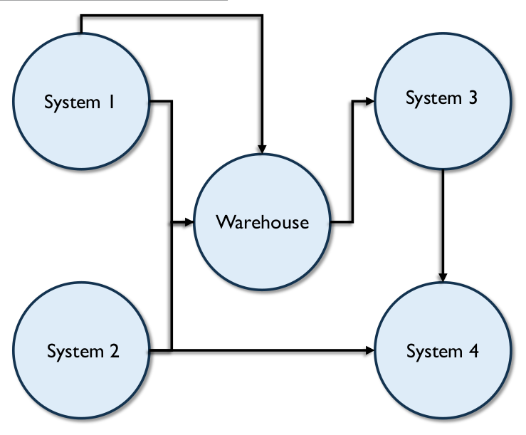

# Gerenciamento de Metadados

## 1. Introdução

A definição mais comum de Metadados, "dados sobre dados", é enganosamente simples. O tipo de informação que pode ser classificada como Metadados é abrangente. Metadados incluem informações sobre processos técnicos e de negócios, regras e restrições de dados e estruturas lógicas e físicas de dados. Eles descrevem os dados em si (por exemplo, bancos de dados, elementos de dados, modelos de dados), os conceitos que os dados representam (por exemplo, processos de negócios, sistemas de aplicativos, código de software, infraestrutura tecnológica) e as conexões (relacionamentos) entre os dados e os conceitos. Os metadados ajudam uma organização a entender seus dados, seus sistemas e seus fluxos de trabalho. Eles permitem a avaliação da qualidade dos dados e são essenciais para o gerenciamento de bancos de dados e outros aplicativos. Contribuem para a capacidade de processar, manter, integrar, proteger, auditar e governar outros dados.

Para entender o papel vital dos Metadados no gerenciamento de dados, imagine uma grande biblioteca, com centenas de milhares de livros e revistas, mas sem um catálogo de fichas. Sem um catálogo de fichas, os leitores podem nem saber como começar a procurar um livro específico ou mesmo um tópico específico. O catálogo de fichas não apenas fornece as informações necessárias (quais livros e materiais a biblioteca possui e onde estão dispostos nas prateleiras), como também permite que os usuários encontrem materiais usando diferentes pontos de partida (área temática, autor ou título). Sem o catálogo, encontrar um livro específico seria difícil, senão impossível. Uma organização sem metadados é como uma biblioteca sem um catálogo de fichas.

Os metadados são essenciais para o gerenciamento de dados, bem como para o uso de dados (veja as diversas referências a metadados ao longo do DAMA-DMBOK). Todas as grandes organizações produzem e utilizam uma grande quantidade de dados. Em uma organização, diferentes indivíduos terão diferentes níveis de conhecimento sobre dados, mas nenhum indivíduo saberá tudo sobre eles. Essas informações devem ser documentadas, caso contrário, a organização corre o risco de perder conhecimento valioso sobre si mesma. Os metadados fornecem o principal meio de capturar e gerenciar o conhecimento organizacional sobre dados. No entanto, o gerenciamento de metadados não é apenas um desafio de gerenciamento do conhecimento; é também uma necessidade de gerenciamento de riscos. Os metadados são necessários para garantir que uma organização possa identificar dados privados ou sensíveis e que possa gerenciar o ciclo de vida dos dados em seu próprio benefício, a fim de atender aos requisitos de conformidade e minimizar a exposição a riscos.

Sem Metadados confiáveis, uma organização não sabe quais dados possui, o que representam, sua origem, como se movem pelos sistemas, quem tem acesso a eles ou o que significa para a alta qualidade dos dados. Sem Metadados, uma organização não consegue gerenciar seus dados como um ativo. De fato, sem Metadados, uma organização pode não ser capaz de gerenciar seus dados de forma alguma.

Com a evolução da tecnologia, a velocidade com que os dados são gerados também aumentou. Metadados técnicos tornaram-se parte integrante da maneira como os dados são movidos e integrados. O Padrão de Registro de Metadados da ISO, ISO/IEC 11179, visa permitir a troca de dados orientada por Metadados em um ambiente heterogêneo, com base em definições exatas de dados. Metadados presentes em XML e outros formatos permitem o uso dos dados. Outros tipos de marcação de Metadados permitem que os dados sejam trocados, mantendo os significantes de propriedade, requisitos de segurança, etc. (Consulte o Capítulo 8.)

Como outros dados, os Metadados exigem gerenciamento. À medida que a capacidade das organizações de coletar e armazenar dados aumenta, o papel dos metadados na gestão de dados ganha importância. Para ser orientada por dados, uma organização precisa ser orientada por metadados.

Figura 84 Diagrama de Contexto: Metadados

### 1.1 Impulsionadores de Negócios

Dados não podem ser gerenciados sem Metadados. Além disso, os próprios Metadados devem ser gerenciados. Metadados confiáveis ​​e bem gerenciados ajudam a:

* Aumentar a confiança nos dados, fornecendo contexto e permitindo a mensuração da qualidade dos dados
* Aumentar o valor de informações estratégicas (por exemplo, Dados Mestres) ao permitir múltiplos usos
* Melhorar a eficiência operacional, identificando dados e processos redundantes
* Prevenir o uso de dados desatualizados ou incorretos
* Reduzir o tempo de pesquisa orientada a dados
* Melhorar a comunicação entre consumidores de dados e profissionais de TI
* Criar análises de impacto precisas, reduzindo assim o risco de falha do projeto
* Melhorar o tempo de lançamento no mercado, reduzindo o tempo do ciclo de vida de desenvolvimento do sistema
* Reduzir os custos de treinamento e diminuir o impacto da rotatividade de pessoal por meio da documentação completa do contexto, histórico e origem dos dados
* Apoiar a conformidade regulatória

Os metadados auxiliam na representação consistente de informações, otimizando os recursos de fluxo de trabalho e protegendo informações confidenciais, especialmente quando a conformidade regulatória é necessária. As organizações obtêm mais valor de seus ativos de dados se eles forem de alta qualidade. Dados de qualidade dependem de governança. Por explicarem os dados e processos que permitem o funcionamento das organizações, os Metadados são essenciais para a governança de dados. Se os Metadados são um guia para os dados em uma organização, eles devem ser bem gerenciados.

Metadados mal gerenciados levam a:

* Dados e processos de gerenciamento de dados redundantes
* Dicionários, repositórios e outros tipos de armazenamento de Metadados replicados e redundantes
* Definições inconsistentes de elementos de dados e riscos associados ao uso indevido de dados
* Fontes e versões de Metadados concorrentes e conflitantes, que reduzem a confiança dos consumidores de dados
* Dúvidas sobre a confiabilidade dos Metadados e dos dados

O gerenciamento de Metadados bem executado permite uma compreensão consistente dos recursos de dados e um desenvolvimento interorganizacional mais eficiente.

### 1.2 Objetivos e Princípios

Os objetivos da gestão de metadados incluem:

* Documentar e gerenciar o conhecimento organizacional da terminologia empresarial relacionada a dados para garantir que as pessoas entendam o conteúdo dos dados e possam utilizá-los de forma consistente
* Coletar e integrar metadados de diversas fontes para garantir que as pessoas entendam as semelhanças e diferenças entre os dados de diferentes partes da organização
* Garantir a qualidade, a consistência, a atualidade e a segurança dos metadados
* Fornecer maneiras padronizadas de tornar os metadados acessíveis aos consumidores de metadados (pessoas, sistemas e processos)
* Estabelecer ou impor o uso de padrões técnicos de metadados para permitir a troca de dados

A implementação de uma solução de metadados bem-sucedida segue estes princípios orientadores:

* **Compromisso organizacional:** Garantir o comprometimento organizacional (suporte e financiamento da alta gerência) com a gestão de metadados como parte de uma estratégia geral para gerenciar dados como um ativo corporativo.
* **Estratégia:** Desenvolver uma estratégia de metadados que leve em conta como os metadados serão criados, mantidos, integrados e acessados. A estratégia deve direcionar os requisitos, que devem ser definidos antes da avaliação, compra e instalação de produtos de gestão de metadados. A estratégia de Metadados deve estar alinhada às prioridades do negócio.
* **Perspectiva Corporativa:** Adote uma perspectiva corporativa para garantir extensibilidade futura, mas implemente por meio de entrega iterativa e incremental para agregar valor.
* **Socialização:** Comunique a necessidade dos Metadados e a finalidade de cada tipo de Metadado; a socialização do valor dos Metadados incentivará o uso comercial e, igualmente importante, a contribuição da expertise empresarial.
* **Acesso:** Garanta que os membros da equipe saibam como acessar e usar os Metadados.
* **Qualidade:** Reconheça que os Metadados são frequentemente produzidos por meio de processos existentes (modelagem de dados, SDLC, definição de processos de negócio) e responsabilize os responsáveis ​​pelos processos pela qualidade dos Metadados.
* **Auditoria:** Defina, aplique e audite padrões para Metadados para simplificar a integração e permitir o uso.
* **Melhoria:** Crie um mecanismo de feedback para que os consumidores possam informar a equipe de Gerenciamento de Metadados sobre Metadados incorretos ou desatualizados.

### 1.3 Conceitos Essenciais

#### 1.3.1 Metadados vs. Dados

Conforme mencionado na introdução do capítulo, Metadados são um tipo de dado e devem ser gerenciados como tal. Uma questão que algumas organizações enfrentam é onde traçar a linha entre dados que não são Metadados e dados que são Metadados. Conceitualmente, essa linha está relacionada ao nível de abstração representado pelos dados. Por exemplo, em relatórios sobre a divulgação da vigilância da Administração de Segurança Nacional dos EUA sobre o uso de telefones por pessoas nos EUA, números de telefone e horários das chamadas eram rotineiramente chamados de "Metadados", implicando que os dados "reais"

compreendiam apenas o conteúdo das conversas telefônicas. O senso comum reconhece que números de telefone e a duração das chamadas telefônicas também são apenas dados. [^70]

Uma regra geral pode ser que os Metadados de uma pessoa são os dados de outra. Mesmo algo que pareça Metadados (por exemplo, uma lista de nomes de colunas) pode ser apenas dados – se, por exemplo, esses dados forem a entrada para uma análise que visa compreender o conteúdo de dados em diferentes organizações.

Para gerenciar seus Metadados, as organizações não devem se preocupar com distinções filosóficas. Em vez disso, devem definir requisitos de Metadados com foco na finalidade para a qual precisam dos Metadados (criar novos dados, compreender os dados existentes, permitir a movimentação entre sistemas, acessar dados, compartilhar dados) e na fonte de dados para atender a esses requisitos.

#### 1.3.2 Tipos de Metadados

Os Metadados são frequentemente categorizados em três tipos: comercial, técnico e operacional. Essas categorias permitem que as pessoas entendam a gama de informações que se enquadram no escopo geral dos Metadados, bem como as funções pelas quais os Metadados são produzidos. Dito isso, as categorias também podem gerar confusão, especialmente se as pessoas se envolverem em questões sobre a qual categoria um conjunto de Metadados pertence ou quem deve usá-lo. É melhor pensar nessas categorias em relação à origem dos Metadados, em vez de como eles são usados. Em relação ao uso, as distinções entre os tipos de Metadados não são rígidas. Equipes técnicas e operacionais utilizam Metadados "de negócios" e vice-versa.

Fora da área de tecnologia da informação, por exemplo, em biblioteconomia ou ciência da informação, os Metadados são descritos usando um conjunto diferente de categorias:

* Metadados Descritivos (por exemplo, título, autor e assunto) descrevem um recurso e permitem a identificação e a recuperação.
* Metadados Estruturais descrevem relacionamentos dentro e entre recursos e seus componentes (por exemplo, número de páginas, número de capítulos).
* Metadados Administrativos (por exemplo, números de versão, datas de arquivamento) são usados ​​para gerenciar recursos ao longo de seu ciclo de vida.

Essas categorias podem ser úteis para informar o processo de definição de requisitos de Metadados.

##### 1.3.2.1 Metadados de Negócios

Os Metadados de Negócios concentram-se principalmente no conteúdo e na condição dos dados e incluem detalhes relacionados à governança de dados. Os Metadados de Negócios incluem nomes e definições não técnicos de conceitos, áreas temáticas, entidades e atributos; tipos de dados de atributos e outras propriedades de atributos; Descrições de intervalo; cálculos; algoritmos e regras de negócio; valores de domínio válidos e suas definições. Exemplos de Metadados de Negócio incluem:

* Definições e descrições de conjuntos de dados, tabelas e colunas
* Regras de negócio, regras de transformação, cálculos e derivações
* Modelos de dados
* Regras de qualidade de dados e resultados de medições
* Cronogramas de atualização dos dados
* Proveniência e linhagem dos dados
* Padrões de dados
* Designações do sistema de registro para elementos de dados
* Restrições de valor válidas
* Informações de contato das partes interessadas (por exemplo, proprietários dos dados, administradores dos dados)
* Nível de segurança/privacidade dos dados
* Problemas conhecidos com os dados
* Observações sobre o uso de dados

##### 1.3.2.2 Metadados Técnicos

Os Metadados Técnicos fornecem informações sobre os detalhes técnicos dos dados, os sistemas que os armazenam e os processos que os movem dentro e entre os sistemas. Exemplos de Metadados Técnicos incluem:

* Nomes de tabelas e colunas do banco de dados físico
* Propriedades das colunas
* Propriedades dos objetos do banco de dados
* Permissões de acesso
* Regras CRUD (criar, substituir, atualizar e excluir) de dados
* Modelos de dados físicos, incluindo nomes de tabelas de dados, chaves e índices
* Relacionamentos documentados entre os modelos de dados e os ativos físicos
* Detalhes da tarefa ETL
* Definições de esquema de formato de arquivo
* Documentação de mapeamento da origem para o destino
* Documentação da linhagem de dados, incluindo informações sobre o impacto das alterações a montante e a jusante
* Nomes e descrições de programas e aplicativos
* Cronogramas e dependências da tarefa do ciclo de atualização de conteúdo
* Regras de recuperação e backup
* Direitos, grupos e funções de acesso aos dados

##### 1.3.2.3 Metadados Operacionais

Os Metadados Operacionais descrevem detalhes do processamento e acesso aos dados. Por exemplo:

* Logs de execução de tarefas para programas em lote
* Histórico de extrações e resultados
* Anomalias de cronograma
* Resultados de auditoria, balanceamento e medições de controle
* Logs de erros
* Padrões de acesso a relatórios e consultas, frequência e tempo de execução
* Plano e execução de patches e manutenção de versões, nível atual de patch
* Backup, retenção, data de criação e disposições para recuperação de desastres
* Requisitos e disposições de SLA
* Padrões volumétricos e de uso
* Regras de arquivamento e retenção de dados, arquivos relacionados
* Critérios de limpeza
* Regras e acordos de compartilhamento de dados
* Funções e responsabilidades técnicas, contatos

#### 1.3.3 Padrão de Registro de Metadados ISO/IEC 11179

O Padrão de Registro de Metadados ISO/IEC 11179 fornece uma estrutura para a definição de um registro de metadados. Ele foi projetado para permitir a troca de dados orientada por metadados, com base em definições exatas de dados, começando pelos elementos de dados. A norma é estruturada em várias partes:

* **Parte 1:** Estrutura para a Geração e Padronização de Elementos de Dados
* **Parte 3:** Atributos Básicos de Elementos de Dados
* **Parte 4:** Regras e Diretrizes para a Formulação de Definições de Dados
* **Parte 5:** Princípios de Nomenclatura e Identificação para Elementos de Dados
* **Parte 6:** Registro de Elementos de Dados

#### 1.3.4 Metadados para Dados Não Estruturados

Por natureza, todos os dados possuem alguma estrutura, embora nem todos sejam formalmente estruturados nas linhas, colunas e registros familiares de bancos de dados relacionais. Quaisquer dados que não estejam em um banco de dados ou arquivo de dados, incluindo documentos ou outras mídias, são considerados dados não estruturados. (Consulte os Capítulos 9 e 14.)

Metadados são tão essenciais para o gerenciamento de dados não estruturados quanto para o gerenciamento de dados estruturados – talvez até mais. Pense novamente na analogia do catálogo de fichas da introdução do capítulo. Livros e revistas em uma biblioteca são bons exemplos de dados não estruturados. O principal uso dos Metadados em um catálogo de fichas é encontrar os materiais que se procura, independentemente do seu formato.

Metadados para dados não estruturados incluem Metadados descritivos, como informações de catálogo e palavras-chave de tesauros; Metadados estruturais, como tags, estruturas de campos e formato; Metadados administrativos, como fontes, cronogramas de atualização, direitos de acesso e informações de navegação; Metadados bibliográficos, como entradas de catálogo de biblioteca; Metadados de manutenção de registros, como políticas de retenção; e Metadados de preservação, como armazenamento, condições de arquivamento e regras de conservação. (Ver Capítulo 9.)

Embora a maioria das afirmações sobre Metadados para dados não estruturados esteja conectada a preocupações tradicionais de gerenciamento de conteúdo, novas práticas estão surgindo em torno do gerenciamento de dados não estruturados em data lakes. Organizações que desejam aproveitar os data lakes, utilizando plataformas de Big Data como o Hadoop, estão descobrindo que precisam catalogar os dados ingeridos para permitir o acesso posterior. A maioria implementa processos para coletar Metadados como parte da ingestão de dados. Um conjunto mínimo de atributos de metadados precisa ser coletado sobre cada objeto ingerido no data lake (por exemplo, nome, formato, fonte, versão, data de recebimento, etc.). Isso produz um catálogo do conteúdo do data lake.

#### 1.3.5 Fontes de Metadados

Como deve ficar claro a partir dos tipos de Metadados, eles podem ser coletados de diversas fontes. Além disso, se os Metadados de aplicativos e bancos de dados forem bem gerenciados, eles podem ser facilmente coletados e integrados. No entanto, a maioria das organizações não gerencia bem os Metadados no nível do aplicativo, pois eles são frequentemente criados como um subproduto do processamento do aplicativo e não como um produto final (ou seja, não são criados com o consumo em mente). Assim como acontece com outras formas de dados, há muito trabalho na preparação dos Metadados antes que eles possam ser integrados.

A maior parte dos Metadados operacionais é gerada à medida que os dados são processados. A chave para usar esses Metadados é coletá-los de forma utilizável e garantir que os responsáveis ​​por interpretá-los tenham as ferramentas necessárias para isso. Lembre-se de que interpretar dados em locais como os próprios logs de erros requer Metadados que os descrevam. Da mesma forma, uma grande parte dos Metadados técnicos pode ser coletada de objetos de banco de dados.

É possível fazer engenharia reversa do conhecimento sobre dados de sistemas existentes e coletar metadados de negócios de dicionários de dados, modelos e documentação de processos existentes (Loshin, 2001; Aiken, 1995), mas há riscos em fazê-lo. O maior risco é não saber quanto cuidado foi tomado para desenvolver e refinar as definições em primeiro lugar. Se as definições forem subdesenvolvidas ou ambíguas, elas não fornecerão aos consumidores de dados as informações necessárias para compreender os dados que estão usando.

É melhor ser intencional ao desenvolver definições do que simplesmente aceitar as existentes. O desenvolvimento de definições leva tempo e o conjunto de habilidades certo (por exemplo, habilidades de escrita e facilitação). É por isso que o desenvolvimento de metadados de negócios requer administração. (Consulte o Capítulo 3.)

Grande parte dos metadados técnicos necessários para gerenciar bancos de dados e dos metadados de negócios necessários para usar dados podem ser coletados e desenvolvidos como parte do trabalho do projeto. Por exemplo, o processo de modelagem de dados requer discussões sobre o significado dos elementos de dados e a relação entre eles. O conhecimento compartilhado durante essas discussões deve ser capturado e preparado para uso em Dicionários de Dados, Glossários de Negócios e outros repositórios. Os próprios modelos de dados incluem detalhes importantes sobre as características físicas dos dados. Tempo deve ser alocado para garantir que os artefatos do projeto contenham Metadados de alta qualidade alinhados aos padrões corporativos.

Metadados de negócios bem definidos são reutilizáveis ​​de projeto para projeto e podem impulsionar uma compreensão consistente de como os conceitos de negócios são representados em diferentes conjuntos de dados. Como parte do desenvolvimento intencional de Metadados para que possam ser reutilizados, uma organização também pode planejar a integração de Metadados. Por exemplo, ela pode desenvolver um inventário de sistemas, e todos os Metadados relacionados a um sistema específico podem ser marcados com o mesmo identificador de sistema.

Criar Metadados por si só raramente funciona bem. A maioria das organizações não financia esse tipo de esforço e, mesmo quando o faz, é improvável que implemente processos de manutenção. Nesse aspecto, como em outros, Metadados são como outros dados: devem ser criados como produto de um processo bem definido, utilizando ferramentas que suportem sua qualidade geral. Administradores e outros profissionais de gerenciamento de dados devem garantir a existência de processos para manter os Metadados relacionados a esses processos. Por exemplo, se uma organização coleta Metadados críticos de seus modelos de dados, deve garantir a existência de um processo de gerenciamento de mudanças para manter os modelos atualizados.

Para dar uma ideia da amplitude dos Metadados em qualquer organização, uma gama de fontes é descrita aqui, em ordem alfabética e não por prioridade.

##### 1.3.5.1 Repositórios de Metadados de Aplicativos

Um repositório de Metadados refere-se às tabelas físicas nas quais os Metadados são armazenados. Frequentemente, eles são incorporados a ferramentas de modelagem, ferramentas de BI e outros aplicativos. À medida que uma organização amadurece, ela desejará integrar Metadados de repositórios nesses aplicativos para permitir que os consumidores de dados visualizem toda a amplitude das informações.

##### 1.3.5.2 Glossário de Negócios

O objetivo de um glossário de negócios é documentar e armazenar os conceitos e a terminologia de negócios de uma organização, as definições e as relações entre esses termos.

Em muitas organizações, o glossário de negócios é apenas uma planilha. No entanto, à medida que as organizações amadurecem, elas frequentemente adquirem ou criam glossários que contêm informações robustas e a capacidade de gerenciá-las ao longo do tempo. Como em todos os sistemas orientados a dados, os glossários de negócios devem ser arquitetados para levar em conta hardware, software, banco de dados, processos e recursos humanos com diferentes funções e responsabilidades. O aplicativo do glossário de negócios é estruturado para atender aos requisitos funcionais dos três públicos principais:

* **Usuários de negócios:** Analistas de dados, analistas de pesquisa, gerência e equipe executiva usam o glossário de negócios para entender a terminologia e os dados.
* **Administradores de Dados:** Os Administradores de Dados usam o glossário de negócios para gerenciar o ciclo de vida de termos e definições e para aprimorar o conhecimento corporativo, associando ativos de dados aos termos do glossário; por exemplo, vinculando termos a métricas de negócios, relatórios, análise de qualidade de dados ou componentes de tecnologia. Os administradores de dados levantam questões de terminologia e uso e ajudam a resolver diferenças em toda a organização.
* **Usuários técnicos:** Usuários técnicos utilizam o glossário de negócios para tomar decisões de arquitetura, design de sistemas e desenvolvimento, além de conduzir análises de impacto.

O glossário de negócios deve capturar atributos de termos de negócios, como:

* Nome do termo, definição, sigla ou abreviação e quaisquer sinônimos
* Unidade de negócios e/ou aplicativo responsável por gerenciar os dados associados à terminologia
* Nome da pessoa que identifica o termo e data de atualização
* Associação de categorização ou taxonomia para o termo (associação funcional de negócios)
* Definições conflitantes que precisam ser resolvidas, natureza do problema, cronograma de ação
* Mal-entendidos comuns em termos
* Algoritmos que suportam definições
* Linhagem
* Fonte oficial ou autorizada para os dados que suportam o termo

Toda implementação de glossário de negócios deve ter um conjunto básico de relatórios para apoiar os processos de governança. Recomenda-se que as organizações não "imprimam o glossário", pois o conteúdo do glossário não é estático. Os administradores de dados são geralmente responsáveis ​​pelo desenvolvimento, uso, operações e relatórios do glossário. Os relatórios incluem o rastreamento de novos termos e definições que ainda não foram revisados, aqueles em status pendente e aqueles sem definições ou outros atributos. (Consulte a Seção 6.4.)

A facilidade de uso e a funcionalidade podem variar bastante. Quanto mais simples e fácil for a busca em glossários de negócios, maior a probabilidade de o conteúdo do glossário ser utilizado. No entanto, a característica mais importante de um glossário é que ele contenha conteúdo robusto.

##### 1.3.5.3 Ferramentas de Business Intelligence (BI)

As ferramentas de Business Intelligence produzem vários tipos de metadados relevantes para o design de Business Intelligence, incluindo informações gerais, classes, objetos, itens derivados e calculados, filtros, relatórios, campos de relatório, layout do relatório, usuários do relatório, frequência de distribuição do relatório e canais de distribuição do relatório.

##### 1.3.5.4 Ferramentas de Gerenciamento de Configuração

Ferramentas de Gerenciamento de Configuração ou bancos de dados (CMDB) fornecem a capacidade de gerenciar e manter Metadados especificamente relacionados aos ativos de TI, os relacionamentos entre eles e os detalhes contratuais do ativo. Cada ativo no banco de dados do CMDB é denominado item de configuração (IC). Metadados padrão são coletados e gerenciados para cada tipo de IC. Muitas organizações integram o CMDB aos processos de gerenciamento de mudanças para identificar os ativos ou aplicativos relacionados impactados por uma alteração em um ativo específico. Os repositórios fornecem mecanismos para vincular os ativos no repositório de Metadados aos detalhes reais da implementação física no CMDB para fornecer uma visão completa dos dados e das plataformas.

##### 1.3.5.5 Dicionários de Dados

Um dicionário de dados define a estrutura e o conteúdo de conjuntos de dados, geralmente para um único banco de dados, aplicativo ou warehouse. O dicionário pode ser usado para gerenciar nomes, descrições, estrutura, características, requisitos de armazenamento, valores padrão, relacionamentos, exclusividade e outros atributos de cada elemento de dados em um modelo. Ele também deve conter definições de tabelas ou arquivos. Dicionários de dados são incorporados em ferramentas de banco de dados para a criação, operação e manipulação dos dados nelas contidos. Para disponibilizar esses metadados aos consumidores de dados, eles devem ser extraídos do banco de dados ou de ferramentas de modelagem. Os dicionários de dados também podem descrever, em terminologia empresarial, quais elementos de dados estão disponíveis para a comunidade, provisionados sob quais restrições de segurança e aplicados em quais processos empresariais. É possível economizar tempo ao definir, publicar e manter uma camada semântica para relatórios e análises, aproveitando o conteúdo diretamente do modelo lógico. No entanto, como observado anteriormente, as definições existentes devem ser usadas com cautela, especialmente em uma organização com baixo nível de maturidade em gerenciamento de metadados.

Muitos processos, relacionamentos e terminologias empresariais importantes são explicados durante o desenvolvimento do modelo de dados. Essas informações, capturadas no modelo lógico de dados, frequentemente são perdidas quando estruturas físicas são implantadas em produção. Um dicionário de dados pode ajudar a garantir que essas informações não sejam totalmente perdidas para a organização e que os modelos lógico e físico sejam mantidos em conformidade após a implantação em produção.

#### 1.3.5.6 Ferramentas de Integração de Dados

Muitas ferramentas de integração de dados são usadas para executáveis ​​moverem dados de um sistema para outro ou entre vários módulos dentro do mesmo sistema. Muitas dessas ferramentas geram arquivos transitórios, que podem conter cópias ou cópias derivadas dos dados. Essas ferramentas são capazes de carregar dados de várias fontes e, em seguida, operar com os dados carregados, por meio de agrupamento, correção, reformatação, junção, filtragem ou outras operações, e, em seguida, gerar dados de saída, que são distribuídos para os locais de destino. Elas documentam a linhagem como dados à medida que se movem entre os sistemas. Qualquer solução de Metadados bem-sucedida deve ser capaz de usar os Metadados de linhagem à medida que se movem pelas ferramentas de integração e expô-los como uma linhagem holística, desde as fontes reais até os destinos finais.

Ferramentas de integração de dados fornecem interfaces de aplicação (API) para permitir que repositórios externos de metadados extraiam as informações de linhagem e os metadados de arquivos transitórios. Uma vez que o repositório de metadados coleta as informações, algumas ferramentas podem gerar um diagrama de linhagem holístico para qualquer elemento de dados. Ferramentas de integração de dados também fornecem metadados sobre a execução dos vários trabalhos de integração de dados, incluindo a última execução bem-sucedida, a duração e o status do trabalho. Alguns repositórios de metadados podem extrair as estatísticas de tempo de execução da integração de dados e os metadados e expô-los juntamente com os elementos de dados. (Consulte os Capítulos 6 e 8.)

##### 1.3.5.7 Gerenciamento de Banco de Dados e Catálogos de Sistemas

Catálogos de bancos de dados são uma fonte importante de metadados. Eles descrevem o conteúdo dos bancos de dados, juntamente com informações de dimensionamento, versões de software, status de implantação, tempo de atividade da rede, tempo de atividade da infraestrutura, disponibilidade e muitos outros atributos operacionais de metadados. A forma mais comum de banco de dados é o relacional. Bancos de dados relacionais gerenciam os dados como um conjunto de tabelas e colunas, onde uma tabela contém uma ou mais colunas, índices, restrições, visualizações e procedimentos. Uma solução de Metadados deve ser capaz de se conectar a vários bancos de dados e conjuntos de dados e ler todos os Metadados expostos pelo banco de dados. Algumas das ferramentas de repositório de Metadados podem integrar os Metadados expostos das ferramentas de gerenciamento do sistema para fornecer uma visão mais holística dos ativos físicos capturados.

##### 1.3.5.8 Ferramentas de Gerenciamento de Mapeamento de Dados

Ferramentas de gerenciamento de mapeamento são usadas durante a fase de análise e design de um projeto para transformar requisitos em especificações de mapeamento, que podem então ser consumidas diretamente por uma ferramenta de integração de dados ou usadas pelos desenvolvedores para gerar código de integração de dados. A documentação de mapeamento também é frequentemente mantida em documentos Excel em toda a empresa. Os fornecedores agora estão considerando repositórios centralizados para as especificações de mapeamento com recursos para realizar controle de versão e análise de alterações entre versões. Muitas ferramentas de mapeamento se integram com ferramentas de integração de dados para automatizar a geração dos programas de integração de dados e a maioria pode trocar dados com outros repositórios de Metadados e Dados de Referência. (Consulte o Capítulo 8.)

##### 1.3.5.9 Ferramentas de Qualidade de Dados

Ferramentas de qualidade de dados avaliam a qualidade dos dados por meio de regras de validação. A maioria dessas ferramentas oferece a capacidade de trocar pontuações de qualidade e padrões de perfis com outros repositórios de metadados, permitindo que o repositório de metadados anexe as pontuações de qualidade aos ativos físicos relevantes.

##### 1.3.5.10 Diretórios e Catálogos

Enquanto dicionários e glossários de dados contêm informações detalhadas sobre terminologia, tabelas e campos, um diretório ou catálogo contém informações sobre sistemas, fontes e locais de dados dentro de uma organização. Um diretório de Metadados é particularmente útil para desenvolvedores e superusuários de dados, como equipes de administração de dados e analistas de dados, para entender o escopo dos dados na empresa, seja para pesquisar problemas ou encontrar informações sobre o fornecimento de novas aplicações.

##### 1.3.5.11 Ferramentas de Mensagens de Eventos

Ferramentas de mensagens de eventos movem dados entre diversos sistemas. Para isso, elas requerem muitos Metadados. Elas também geram Metadados que descrevem essa movimentação. Essas ferramentas incluem interfaces gráficas por meio das quais gerenciam a lógica da movimentação de dados. Elas podem exportar os detalhes de implementação das interfaces, a lógica da movimentação e as estatísticas de processamento para outros repositórios de Metadados.

##### 1.3.5.12 Ferramentas e Repositórios de Modelagem

Ferramentas de modelagem de dados são usadas para construir vários tipos de modelos de dados: conceituais, lógicos e físicos. Essas ferramentas produzem Metadados relevantes para o design do modelo de aplicação ou sistema, como áreas temáticas, entidades lógicas, atributos lógicos, relacionamentos entre entidades e atributos, supertipos e subtipos, tabelas, colunas, índices, chaves primárias e estrangeiras, restrições de integridade e outros tipos de atribuição dos modelos. Os repositórios de Metadados podem ingerir os modelos criados por essas ferramentas e integrar os Metadados importados ao repositório. As ferramentas de modelagem são frequentemente a fonte do conteúdo do dicionário de dados.

##### 1.3.5.13 Repositórios de Dados de Referência

Os Dados de Referência documentam os valores de negócio e as descrições dos vários tipos de dados enumerados (domínios) e seu uso contextual em um sistema. As ferramentas usadas para gerenciar Dados de Referência também são capazes de gerenciar relacionamentos entre os vários valores codificados dentro do mesmo domínio ou entre domínios. Esses conjuntos de ferramentas normalmente fornecem recursos para enviar os Dados de Referência coletados para um repositório de Metadados, que, por sua vez, fornecerá mecanismos para associar os Dados de Referência ao glossário de negócios e aos locais onde são fisicamente implementados, como colunas ou campos.

##### 1.3.5.14 Registros de Serviços

Um registro de serviços gerencia e armazena informações técnicas sobre serviços e endpoints de serviços sob a perspectiva de uma arquitetura orientada a serviços (SOA). Por exemplo, definições, interfaces, operações, parâmetros de entrada e saída, políticas, versões e exemplos de cenários de uso. Alguns dos metadados mais importantes relacionados a serviços incluem versão do serviço, local do serviço, data center, disponibilidade, data de implantação, porta do serviço, endereço IP, porta de estatísticas, tempo limite de conexão e tempo limite de nova tentativa de conexão. Os registros de serviços podem ser consultados para atender a diversas necessidades, como exibir uma lista de todos os serviços disponíveis, serviços com uma versão específica, serviços obsoletos ou detalhes sobre um serviço específico. Os serviços também podem ser revisados ​​para possível reutilização. As informações contidas nesses repositórios fornecem fatos importantes sobre quais dados existem e como eles se movem entre vários sistemas ou aplicativos. Os metadados em repositórios de serviços podem ser extraídos e incorporados aos metadados coletados de outras ferramentas para fornecer uma visão completa de como os dados se movem entre os vários sistemas.

##### 1.3.5.15 Outros Armazenamentos de Metadados

Outros armazenamentos de metadados incluem listas especializadas, como registros de eventos, listas de fontes ou interfaces, conjuntos de códigos, léxicos, esquemas espaciais e temporais, referências espaciais e distribuição de conjuntos de dados geográficos digitais, repositórios de repositórios e regras de negócios.

#### 1.3.6 Tipos de Arquitetura de Metadados

Assim como outras formas de dados, os metadados têm um ciclo de vida. Conceitualmente, todas as soluções de gerenciamento de metadados incluem camadas arquitetônicas que correspondem a pontos no ciclo de vida dos metadados:

* Criação e fornecimento de metadados
* Armazenamento de metadados em um ou mais repositórios
* Integração de metadados
* Entrega de metadados
* Uso de metadados
* Controle e gerenciamento de metadados

Diferentes abordagens arquitetônicas podem ser usadas para fornecer, armazenar, integrar, manter e tornar os metadados acessíveis aos consumidores.

##### 1.3.6.1 Arquitetura de Metadados Centralizada

Uma arquitetura centralizada consiste em um único repositório de Metadados que contém cópias de Metadados de diversas fontes. Organizações com recursos de TI limitados ou que buscam automatizar o máximo possível podem optar por evitar essa opção de arquitetura. Organizações que buscam um alto grau de consistência dentro do repositório comum de Metadados podem se beneficiar de uma arquitetura centralizada.

As vantagens de um repositório centralizado incluem:

* Alta disponibilidade, pois é independente dos sistemas de origem
* Recuperação rápida de metadados, já que o repositório e a consulta residem juntos
* Estruturas de banco de dados resolvidas não afetadas pela natureza proprietária de sistemas de terceiros ou comerciais
* Os metadados extraídos podem ser transformados, personalizados ou aprimorados com metadados adicionais que podem não residir no sistema de origem, melhorando a qualidade

Algumas limitações da abordagem centralizada incluem:

* Processos complexos são necessários para garantir que as alterações nos metadados de origem sejam replicadas rapidamente para o repositório
* A manutenção de um repositório centralizado pode ser dispendiosa
* A extração pode exigir módulos ou middleware personalizados
* A validação e a manutenção de código personalizado podem aumentar as demandas tanto da equipe interna de TI quanto dos fornecedores de software

A Figura 85 mostra como os metadados são coletados em um repositório de metadados autônomo com seu próprio repositório interno de metadados. O repositório interno é preenchido por meio de uma importação agendada (setas) dos metadados a partir de várias ferramentas. Por sua vez, o repositório centralizado expõe um portal para os usuários finais enviarem suas consultas. O portal de metadados passa a solicitação para o repositório centralizado de metadados. O repositório centralizado atenderá à solicitação a partir dos metadados coletados. Nesse tipo de implementação, a capacidade de passar a solicitação do usuário diretamente para várias ferramentas não é suportada. A busca global nos metadados coletados das diversas ferramentas é possível devido à coleta de vários metadados no repositório centralizado.

Figura 85 Arquitetura Centralizada de Metadados

##### 1.3.6.2 Arquitetura Distribuída de Metadados

Uma arquitetura completamente distribuída mantém um único ponto de acesso. O mecanismo de recuperação de metadados responde às solicitações do usuário recuperando dados dos sistemas de origem em tempo real; não há um repositório persistente. Nessa arquitetura, o ambiente de gerenciamento de metadados mantém os catálogos do sistema de origem e as informações de consulta necessárias para processar consultas e pesquisas do usuário de forma eficaz. Um agente de solicitação de objeto comum ou um protocolo de middleware semelhante acessa esses sistemas de origem.

As vantagens da arquitetura de metadados distribuída incluem:

* Os metadados são sempre tão atuais e válidos quanto possível, pois são recuperados de sua fonte
* As consultas são distribuídas, possivelmente melhorando o tempo de resposta e o tempo de processamento
* As solicitações de metadados de sistemas proprietários são limitadas ao processamento de consultas, em vez de exigir um entendimento detalhado das estruturas de dados proprietárias, minimizando, portanto, o esforço de implementação e manutenção necessário
* O desenvolvimento de processamento automatizado de consultas de metadados é provavelmente mais simples, exigindo intervenção manual mínima
* O processamento em lote é reduzido, sem processos de replicação ou sincronização de metadados

As arquiteturas distribuídas também apresentam limitações:

* Não há capacidade de suportar entradas de metadados definidas pelo usuário ou inseridas manualmente, visto que não há um repositório para armazenar essas adições
* Padronização da apresentação de metadados de vários sistemas
* Os recursos de consulta são diretamente afetados pela disponibilidade dos sistemas de origem participantes
* A qualidade dos metadados depende exclusivamente dos sistemas de origem participantes

Figura 86 Arquitetura de Metadados Distribuídos

A Figura 86 ilustra uma arquitetura de metadados distribuída. Não há um repositório centralizado de metadados, e o portal encaminha as solicitações dos usuários para a ferramenta apropriada para execução. Como não há um repositório centralizado para a coleta dos metadados das diversas ferramentas, cada solicitação precisa ser delegada às fontes; portanto, não há capacidade de realizar uma busca global nas diversas fontes de metadados.

##### 1.3.6.3 Arquitetura Híbrida de Metadados

Uma arquitetura híbrida combina características de arquiteturas centralizadas e distribuídas. Os metadados ainda são movidos diretamente dos sistemas de origem para um repositório centralizado. No entanto, o design do repositório considera apenas os metadados adicionados pelo usuário, os itens padronizados críticos e as adições de fontes manuais.

A arquitetura se beneficia da recuperação quase em tempo real dos metadados de sua origem e de metadados aprimorados para atender às necessidades do usuário com mais eficácia, quando necessário. A abordagem híbrida reduz o esforço de intervenção manual de TI e a funcionalidade de acesso codificado personalizado a sistemas proprietários. Os metadados são tão atuais e válidos quanto possível no momento do uso, com base nas prioridades e requisitos do usuário. A arquitetura híbrida não melhora a disponibilidade do sistema.

A disponibilidade dos sistemas de origem é uma limitação, pois a natureza distribuída dos sistemas de back-end lida com o processamento das consultas. É necessária uma sobrecarga adicional para vincular esses resultados iniciais ao aumento dos metadados no repositório central antes de apresentar o conjunto de resultados ao usuário final.

Muitas organizações podem se beneficiar de uma arquitetura híbrida, incluindo aquelas com metadados operacionais que mudam rapidamente, aquelas que precisam de metadados consistentes e uniformes e aquelas que vivenciam um crescimento substancial em metadados e fontes de metadados. Organizações com metadados mais estáticos e perfis de crescimento menores podem não aproveitar o potencial máximo dessa alternativa de arquitetura.

##### 1.3.6.4 Arquitetura de Metadados Bidirecional

Outra abordagem arquitetônica avançada é a arquitetura de Metadados bidirecional, que permite que os Metadados mudem em qualquer parte da arquitetura (fonte, integração de dados, interface do usuário) e, em seguida, o feedback é coordenado do repositório (corretor) para sua fonte original.

Vários desafios são aparentes nessa abordagem. O design força o repositório de Metadados a conter a versão mais recente da fonte de Metadados e também a gerenciar as alterações na fonte. As alterações devem ser capturadas sistematicamente e, em seguida, resolvidas. Conjuntos adicionais de interfaces de processo para vincular o repositório à(s) fonte(s) de Metadados devem ser criados e mantidos.

Figura 87 Arquitetura de Metadados Híbridos

A Figura 87 ilustra como Metadados comuns de diferentes fontes são coletados em um repositório de Metadados centralizado. Os usuários enviam suas consultas ao portal de Metadados, que repassa a solicitação a um repositório centralizado. O repositório centralizado tentará atender à solicitação do usuário a partir dos Metadados comuns coletados inicialmente das diversas fontes. À medida que a solicitação se torna mais específica ou o usuário precisa de Metadados mais detalhados, o repositório centralizado delegará à fonte específica a pesquisa dos detalhes específicos. A busca global entre as diversas ferramentas está disponível devido aos Metadados comuns coletados no repositório centralizado.

## 2. Atividades

### 2.1 Definir a Estratégia de Metadados

Uma estratégia de metadados descreve como uma organização pretende gerenciar seus metadados e como ela passará do estado atual para as práticas futuras. Uma estratégia de metadados deve fornecer uma estrutura para as equipes de desenvolvimento aprimorarem o gerenciamento de metadados. O desenvolvimento dos requisitos de metadados ajudará a esclarecer os impulsionadores da estratégia e a identificar potenciais obstáculos à sua implementação.

A estratégia inclui a definição do estado futuro da arquitetura corporativa de metadados da organização e as fases de implementação necessárias para atingir os objetivos estratégicos. As etapas incluem:

* **Iniciar o planejamento da estratégia de metadados:** O objetivo da iniciação e do planejamento é permitir que a equipe de estratégia de metadados defina suas metas de curto e longo prazo. O planejamento inclui a elaboração de um estatuto, escopo e objetivos alinhados com os esforços gerais de governança e o estabelecimento de um plano de comunicação para apoiar o esforço. As principais partes interessadas devem ser envolvidas no planejamento.
* **Conduzir entrevistas com as principais partes interessadas:** Entrevistas com as partes interessadas de negócios e técnicas fornecem uma base de conhecimento para a estratégia de metadados.

* **Avaliar as fontes de metadados existentes e a arquitetura da informação:** A avaliação determina o grau relativo de dificuldade na resolução dos problemas de metadados e sistemas identificados nas entrevistas e na revisão da documentação. Durante esta etapa, conduza entrevistas detalhadas com a equipe principal de TI e revise a documentação das arquiteturas de sistema, modelos de dados, etc.
* **Desenvolver a arquitetura futura de metadados:** Refina e confirma a visão futura e desenvolve a arquitetura-alvo de longo prazo para o ambiente de metadados gerenciado nesta etapa. Esta fase deve levar em conta componentes estratégicos, como estrutura organizacional, alinhamento com a governança e administração de dados, arquitetura de metadados gerenciados, arquitetura de entrega de metadados, arquitetura técnica e arquitetura de segurança.
* **Desenvolver um plano de implementação em fases:** Validar, integrar e priorizar as descobertas das entrevistas e análises de dados. Documentar a estratégia de metadados e definir uma abordagem de implementação em fases para migrar do ambiente de metadados gerenciado existente para o futuro.

A estratégia evoluirá ao longo do tempo, à medida que os requisitos de metadados, a arquitetura e o ciclo de vida dos metadados forem melhor compreendidos.

### 2.2 Entendendo os Requisitos de Metadados

Os requisitos de metadados começam com o conteúdo: quais metadados são necessários e em que nível. Por exemplo, nomes físicos e lógicos precisam ser capturados para colunas e tabelas. O conteúdo dos metadados é abrangente e os requisitos virão tanto de consumidores de dados comerciais quanto técnicos. (Consulte a Seção 1.3.2.)

Existem também muitos requisitos focados em funcionalidade associados a uma solução abrangente de metadados:

* **Volatilidade:** Com que frequência os atributos e conjuntos de metadados serão atualizados
* **Sincronização:** Tempo de atualizações em relação às alterações na fonte
* **Histórico:** Se versões históricas dos metadados precisam ser mantidas
* **Direitos de acesso:** Quem pode acessar os metadados e como eles acessam, juntamente com a funcionalidade específica da interface do usuário para acesso
* **Estrutura:** Como os metadados serão modelados para armazenamento
* **Integração:** O grau de integração dos metadados de diferentes fontes; Regras para integração
* **Manutenção:** Processos e regras para atualização de Metadados (registro e encaminhamento para aprovação)
* **Gestão:** Funções e responsabilidades para gerenciar Metadados
* **Qualidade:** Requisitos de qualidade para Metadados
* **Segurança:** Alguns Metadados não podem ser expostos, pois isso revelaria a existência de dados altamente protegidos

### 2.3 Definir Arquitetura de Metadados

Um sistema de Gerenciamento de Metadados deve ser capaz de extrair Metadados de diversas fontes. Projete a arquitetura para ser capaz de escanear as diversas fontes de Metadados e atualizar periodicamente o repositório. O sistema deve suportar atualizações manuais de Metadados, solicitações, buscas e consultas de Metadados por diversos grupos de usuários.

Um ambiente de Metadados gerenciado deve isolar o usuário final das diversas e distintas fontes de Metadados. A arquitetura deve fornecer um único ponto de acesso para o repositório de Metadados. O ponto de acesso deve fornecer todos os recursos de Metadados relacionados de forma transparente ao usuário. Os usuários devem ser capazes de acessar os Metadados sem estar cientes dos diferentes ambientes das fontes de dados. Em soluções de análise e Big Data, a interface pode ter funções amplamente definidas pelo usuário (UDF) para utilizar diversos conjuntos de dados, e a exposição dos Metadados ao usuário final é inerente a essas personalizações. Com menos dependência de UDF nas soluções, os usuários finais coletarão, inspecionarão e usarão conjuntos de dados de forma mais direta, e diversos Metadados de suporte geralmente estarão mais expostos.

O design da arquitetura depende dos requisitos específicos da organização. Três abordagens técnicas de arquitetura para a construção de um repositório comum de metadados imitam as abordagens para o projeto de data warehouses: centralizado, distribuído e híbrido (consulte a Seção 1.3.6). Todas essas abordagens levam em consideração a implementação do repositório e o funcionamento dos mecanismos de atualização.

#### 2.3.1 Criar o Metamodelo

Crie um modelo de dados para o repositório de metadados, ou metamodelo, como uma das primeiras etapas do projeto após a conclusão da estratégia de metadados e a compreensão dos requisitos de negócios. Diferentes níveis de metamodelo podem ser desenvolvidos conforme necessário: um modelo conceitual de alto nível, que explica as relações entre os sistemas, e um metamodelo de nível inferior, que detalha as atribuições, para descrever os elementos e processos de um modelo. Além de ser uma ferramenta de planejamento e um meio de articular requisitos, o metamodelo é, por si só, uma fonte valiosa de metadados.

A Figura 88 ilustra um exemplo de metamodelo de repositório de metadados. As caixas representam as principais entidades de alto nível, que contêm os dados.

Figura 88 Exemplo de Metamodelo de Repositório de Metadados

#### 2.3.2 Aplicar Padrões de Metadados

A solução de Metadados deve aderir aos padrões internos e externos acordados, conforme identificados na estratégia de Metadados. A conformidade dos metadados deve ser monitorada por atividades de governança. Os padrões internos de Metadados da organização incluem convenções de nomenclatura, atribuições personalizadas, segurança, visibilidade e documentação de processamento. Os padrões externos de Metadados da organização incluem os formatos de troca de dados e o design das interfaces de programação de aplicativos.

#### 2.3.3 Gerenciar Armazenamentos de Metadados

Implementar atividades de controle para gerenciar o ambiente de Metadados. O controle de repositórios é o controle da movimentação e das atualizações de Metadados realizado pelo especialista em Metadados. Essas atividades são de natureza administrativa e envolvem o monitoramento e a resposta a relatórios, avisos, logs de tarefas e a resolução de vários problemas no ambiente de repositório implementado. Muitas atividades de controle são padrão para operações de dados e manutenção de interfaces. As atividades de controle devem ter supervisão da governança de dados.

As atividades de controle incluem:

* Agendamento e monitoramento de tarefas
* Análise estatística de carga
* Backup, recuperação, arquivamento e limpeza
* Modificações de configuração
* Ajuste de desempenho
* Análise estatística de consultas
* Geração de consultas e relatórios
* Gerenciamento de segurança
* As atividades de controle de qualidade incluem:
* Garantia de qualidade, controle de qualidade
* Frequência de atualização de dados – correspondência de conjuntos com períodos
* Relatórios de metadados ausentes
* Relatório de metadados antigos
* As atividades de gerenciamento de metadados incluem:
* Carregamento, digitalização, importação e marcação de ativos
* Mapeamento e movimentação de fontes
* Controle de versão
* Gerenciamento da interface do usuário
* Vinculação de conjuntos de dados Manutenção de metadados – para provisionamento NOSQL
* Vinculação de dados à aquisição interna de dados – links personalizados e metadados de tarefas
* Licenciamento para fontes e feeds de dados externos
* Aprimoramento de dados Metadados, por exemplo, vinculação a GIS
* E treinamento, incluindo:
* Educação e treinamento de usuários e administradores de dados
* Geração e análise de métricas de gerenciamento
* Treinamento sobre as atividades de controle, consultas e relatórios

### 2.4 Criar e Manter Metadados

Conforme descrito na Seção 1.3.5, os Metadados são criados por meio de uma série de processos e armazenados em diversos locais dentro de uma organização. Para serem de alta qualidade, os Metadados devem ser gerenciados como um produto. Bons Metadados não são criados por acidente. Requerem planejamento. (Consulte o Capítulo 13.)

Vários princípios gerais de gerenciamento de Metadados descrevem os meios para gerenciar Metadados visando à qualidade:

* **Responsabilização:** Reconhecer que os Metadados são frequentemente produzidos por meio de processos existentes (modelagem de dados, SDLC, definição de processos de negócios) e responsabilizar os responsáveis ​​pelos processos pela qualidade dos Metadados.
* **Padrões:** Definir, aplicar e auditar padrões para Metadados a fim de simplificar a integração e permitir o uso.
* **Melhoria:** Criar um mecanismo de feedback para que os consumidores possam informar a equipe de Gerenciamento de Metadados sobre metadados incorretos ou desatualizados.

Como outros dados, os Metadados podem ser perfilados e inspecionados quanto à qualidade. Sua manutenção deve ser programada ou concluída como parte auditável do trabalho do projeto.

#### 2.4.1 Integrar Metadados

Os processos de integração reúnem e consolidam Metadados de toda a empresa, incluindo Metadados de dados adquiridos fora da empresa. O repositório de Metadados deve integrar Metadados técnicos extraídos com Metadados relevantes de negócios, processos e administração. Os Metadados podem ser extraídos usando adaptadores, scanners, aplicativos de ponte ou acessando diretamente os Metadados em um repositório de dados de origem. Adaptadores estão disponíveis com diversas ferramentas de software de terceiros, bem como com ferramentas de integração de Metadados. Em alguns casos, os adaptadores serão desenvolvidos usando as APIs das ferramentas.

Surgem desafios na integração que exigirão governança. A integração de conjuntos de dados internos, dados externos, como estatísticas governamentais, e dados provenientes de formulários não eletrônicos, como white papers, artigos em revistas ou relatórios, pode levantar inúmeras questões sobre qualidade e semântica. Realize a varredura do repositório em duas abordagens distintas.

* **Interface proprietária:** Em um processo de varredura e carregamento em uma única etapa, um scanner coleta os metadados de um sistema de origem e, em seguida, chama diretamente o componente carregador específico do formato para carregar os metadados no repositório. Nesse processo, não há saída de arquivo específica do formato e a coleta e o carregamento dos metadados ocorrem em uma única etapa.
* **Interface semiproprietária:** Em um processo de duas etapas, um scanner coleta os metadados de um sistema de origem e os gera em um arquivo de dados específico do formato. O scanner produz apenas um arquivo de dados que o repositório receptor precisa para poder ler e carregar adequadamente. A interface possui uma arquitetura mais aberta, pois o arquivo pode ser lido por diversos métodos.

Um processo de varredura utiliza e produz diversos tipos de arquivos durante o processo.

* **Arquivo de controle:** Contém a estrutura de origem do modelo de dados
* **Arquivo de reutilização:** Contém as regras para gerenciar a reutilização de cargas de processo
* **Arquivos de log:** Produzidos durante cada fase do processo, um para cada varredura ou extração e um para cada ciclo de carga
* **Arquivos temporários e de backup:** Uso durante o processo ou para rastreabilidade

Use uma área de preparação de metadados não persistente para armazenar arquivos temporários e de backup. A área de preparação suporta processos de reversão e recuperação e fornece uma trilha de auditoria provisória para auxiliar os gerentes de repositório na investigação de problemas de origem ou qualidade de metadados. A área de preparação pode assumir a forma de um diretório de arquivos ou um banco de dados.

Ferramentas de integração de dados usadas para aplicações de data warehouse e Business Intelligence são frequentemente usadas com eficácia em processos de integração de metadados. (Consulte o Capítulo 8.)

#### 2.4.2 Distribuir e entregar metadados

Os metadados são entregues aos consumidores de dados e aos aplicativos ou ferramentas que exigem feeds de metadados. Os mecanismos de entrega incluem:

* Sites de intranet com metadados para navegação, pesquisa, consulta, geração de relatórios e análise
* Relatórios, glossários e outros documentos
* Data warehouses, data marts e ferramentas de BI (Business Intelligence)
* Ferramentas de modelagem e desenvolvimento de software
* Mensagens e transações
* Serviços web e Interfaces de Programação de Aplicativos (APIs)
* Soluções de interface para organizações externas (por exemplo, soluções para cadeia de suprimentos)

A solução de Metadados frequentemente se vincula a uma solução de Business Intelligence, de modo que tanto o escopo quanto a atualidade dos Metadados sejam sincronizados com o conteúdo de BI. Um vínculo fornece um meio de integração na entrega de BI ao usuário final. Da mesma forma, algumas soluções de CRM (Customer Relationship Management) ou outras soluções de ERP (Enterprise Resource Planning) podem exigir integração de Metadados na camada de entrega de aplicativos.

Os metadados são trocados com organizações externas por meio de arquivos (estruturados em XML ou JSON) ou por meio de serviços web.

### 2.5 Consultar, Relatar e Analisar Metadados

Os metadados orientam o uso de ativos de dados. Use metadados em Business Intelligence (relatórios e análises), decisões de negócios (operacionais, táticas, estratégicas) e em semântica de negócios (o que eles dizem, o que eles significam – jargão empresarial). Um repositório de metadados deve ter um aplicativo front-end que suporte a funcionalidade de busca e recuperação necessária para toda essa orientação e gerenciamento de ativos de dados. A interface fornecida aos usuários de negócios pode ter um conjunto diferente de requisitos funcionais daquela para usuários técnicos e desenvolvedores. Alguns relatórios facilitam o desenvolvimento futuro, como a análise de impacto de mudanças, ou a solução de problemas em diferentes definições para projetos de data warehouse e Business Intelligence, como relatórios de linhagem de dados.

## 3. Ferramentas

A principal ferramenta usada para gerenciar metadados é o repositório de metadados. Ele incluirá uma camada de integração e, frequentemente, uma interface para atualizações manuais. Ferramentas que produzem e usam metadados tornam-se fontes de metadados que podem ser integradas a um repositório de metadados.

### 3.1 Ferramentas de Gerenciamento de Repositórios de Metadados

As ferramentas de gerenciamento de metadados fornecem recursos para gerenciar metadados em um local centralizado (repositório). Os metadados podem ser inseridos manualmente ou extraídos de várias outras fontes por meio de conectores especializados. Os repositórios de metadados também fornecem recursos para a troca de metadados com outros sistemas.

As ferramentas de gerenciamento de metadados e os próprios repositórios também são uma fonte de metadados, especialmente em um modelo de arquitetura de metadados híbrido ou em implementações corporativas de grande porte. As ferramentas de gerenciamento de metadados permitem a troca dos metadados coletados com outros repositórios de metadados, permitindo a coleta de metadados variados e diversos de diferentes fontes em um repositório centralizado, ou possibilitando o enriquecimento e a padronização dos diversos metadados à medida que se movem entre os repositórios.

## 4. Técnicas

### 4.1 Linhagem de Dados e Análise de Impacto

Um benefício fundamental de descobrir e documentar metadados sobre os ativos físicos é fornecer informações sobre como os dados são transformados à medida que se movem entre os sistemas. Muitas ferramentas de metadados carregam informações sobre o que está acontecendo com os dados em seus ambientes e fornecem recursos para visualizar a linhagem em toda a extensão dos sistemas ou aplicativos com os quais interagem. A versão atual da linhagem baseada em código de programação é chamada de "Linhagem Conforme Implementada". Em contraste, a linhagem descrita em documentos de especificação de mapeamento é chamada de "Linhagem Conforme Projetado".

As limitações de uma construção de linhagem são baseadas na cobertura do sistema de gerenciamento de metadados. Repositórios de metadados específicos para cada função ou ferramentas de visualização de dados têm informações sobre a linhagem de dados dentro do escopo dos ambientes com os quais interagem, mas não fornecem visibilidade sobre o que está acontecendo com os dados fora de seus ambientes.

Os sistemas de gerenciamento de metadados importam a linhagem "Conforme Implementada" das diversas ferramentas que podem fornecer esses detalhes de linhagem e, em seguida, complementam a linhagem de dados com a "Conforme Projetado" dos locais onde os detalhes reais da implementação não podem ser extraídos. O processo de conectar as partes da linhagem de dados é chamado de costura. Isso resulta em uma visualização holística dos dados à medida que se movem de seus locais originais (fonte oficial ou sistema de registro) até chegarem ao seu destino final.

A Figura 89 mostra um exemplo de linhagem de elementos de dados. Ao lê-lo, o elemento de dados de negócios "Total de Pedidos em Atraso", que é fisicamente implementado como coluna zz_total, depende de 3 outros elementos de dados: "Custo Unitário em Centavos" fisicamente implementado como "yy_unit_cost", "Imposto no Estado de Entrega" implementado em "yy_tax" e "Quantidade de Pedidos em Atraso" implementado em "yy_qty".

Embora um gráfico de linhagem, como o da Figura 89, descreva o que está acontecendo com um elemento de dados específico, nem todos os usuários de negócios o compreenderão. Níveis mais altos de linhagem (por exemplo, "Linhagem do Sistema") resumem o movimento no nível do sistema ou do aplicativo. Muitas ferramentas de visualização oferecem recursos de zoom in/zoom out para mostrar a linhagem dos elementos de dados no contexto da linhagem do sistema. Por exemplo, a Figura 90 mostra um exemplo de linhagem de sistema, onde, à primeira vista, a movimentação geral de dados é compreendida e visualizada em nível de sistema ou aplicativo.

Figura 89 Exemplo de Diagrama de Fluxo de Linhagem de Elementos de Dados

Figura 90 Exemplo de Diagrama de Fluxo de Linhagem de Sistema

À medida que o número de elementos de dados em um sistema aumenta, a descoberta de linhagem se torna complexa e difícil de gerenciar. Para atingir com sucesso os objetivos de negócios, uma estratégia para descobrir e importar ativos para o repositório de metadados requer planejamento e design. Uma descoberta de linhagem bem-sucedida precisa levar em conta o foco comercial e técnico:

* **Foco comercial:** Limite a descoberta de linhagem aos elementos de dados priorizados pela empresa. Comece pelos locais de destino e rastreie até os sistemas de origem onde os dados específicos se originam. Ao limitar os ativos escaneados àqueles que movem, transferem ou atualizam os elementos de dados selecionados, essa abordagem permitirá que os consumidores de dados comerciais entendam o que está acontecendo com o elemento de dados específico à medida que ele se move pelos sistemas. Se combinada com medições de qualidade de dados, a linhagem pode ser usada para identificar onde o design do sistema impacta negativamente a qualidade dos dados.
* **Foco técnico:** Comece pelos sistemas de origem e identifique todos os consumidores imediatos, depois identifique todos os consumidores subsequentes do primeiro conjunto identificado e continue repetindo essas etapas até que todos os sistemas sejam identificados. Os usuários de tecnologia se beneficiam mais da estratégia de descoberta de sistemas para ajudar a responder às diversas perguntas sobre os dados. Essa abordagem permitirá que usuários de tecnologia e de negócios respondam a perguntas sobre a descoberta de elementos de dados em toda a empresa, como "Onde está o número do seguro social?" ou gerem relatórios de impacto como "Quais sistemas são impactados se a largura de uma coluna específica for alterada?". No entanto, essa estratégia pode ser complexa de gerenciar.

Muitas ferramentas de integração de dados oferecem análise de linhagem que considera não apenas o código populacional desenvolvido, mas também o modelo de dados e o banco de dados físico. Algumas oferecem interfaces web voltadas para usuários de negócios para monitorar e atualizar definições. Essas interfaces começam a se parecer com glossários de negócios.

A linhagem documentada ajuda tanto os profissionais de negócios quanto os técnicos a usar os dados. Sem ela, muito tempo é perdido investigando anomalias, potenciais impactos de mudanças ou resultados desconhecidos. Procure implementar uma ferramenta integrada de impacto e linhagem que possa compreender todas as partes móveis envolvidas no processo de carregamento, bem como relatórios e análises para o usuário final. Os relatórios de impacto descrevem quais componentes são afetados por uma possível mudança, agilizando e simplificando as tarefas de estimativa e manutenção.

### 4.2 Metadados para Ingestão de Big Data

Muitos profissionais de gerenciamento de dados estão familiarizados e confortáveis ​​com armazenamentos de dados estruturados, onde cada item pode ser claramente identificado e marcado. Hoje em dia, porém, muitos dados vêm em formatos menos estruturados. Algumas fontes não estruturadas serão internas à organização e outras externas. Em ambos os casos, não há mais a necessidade de trazer fisicamente os dados para um único local. Com as novas tecnologias, o programa irá até os dados em vez de movê-los para o programa, reduzindo a quantidade de movimentação de dados e acelerando a execução do processo. No entanto, o gerenciamento bem-sucedido de dados em um data lake depende do gerenciamento de metadados.

Tags de metadados devem ser aplicadas aos dados no momento da ingestão. Os metadados podem então ser usados ​​para identificar o conteúdo dos dados disponível para acesso no data lake. Muitos mecanismos de ingestão criam perfis de dados à medida que são ingeridos. A criação de perfis de dados pode identificar domínios de dados, relacionamentos e problemas de qualidade de dados. Também pode permitir a marcação. Na ingestão, tags de metadados podem ser adicionadas para identificar dados sensíveis ou privados (como Informações de Identificação Pessoal – PPI), por exemplo. Cientistas de dados podem adicionar confiança, identificadores textuais e códigos que representam grupos de comportamento. (Consulte o Capítulo 14.)

## 5. Diretrizes de Implementação

Implemente um ambiente de Metadados gerenciado em etapas incrementais para minimizar os riscos para a organização e facilitar a aceitação. Implemente repositórios de Metadados usando uma plataforma de banco de dados relacional aberta. Isso permite o desenvolvimento e a implementação de diversos controles e interfaces que podem não ser previstos no início de um projeto de desenvolvimento de repositório.

O conteúdo do repositório deve ter um design genérico, não refletindo apenas os designs do banco de dados do sistema de origem. Projete o conteúdo em alinhamento com os especialistas da área temática da empresa e com base em um modelo abrangente de Metadados. O planejamento deve levar em conta a integração de Metadados para que os consumidores de dados possam visualizar diferentes fontes de dados. A capacidade de fazer isso será um dos recursos mais valiosos do repositório. Ele deve abrigar versões atuais, planejadas e históricas dos Metadados.

Frequentemente, a primeira implementação é um piloto para comprovar conceitos e aprender sobre o gerenciamento do ambiente de Metadados. A integração de projetos de Metadados à metodologia de desenvolvimento de TI é necessária. Haverá variações dependendo da arquitetura e dos tipos de armazenamento.

### 5.1 Avaliação de Prontidão / Avaliação de Riscos

Ter uma estratégia sólida de Metadados ajuda todos a tomar decisões mais eficazes. Em primeiro lugar, as pessoas devem estar cientes dos riscos de não gerenciar Metadados. Avalie o grau em que a falta de Metadados de alta qualidade pode resultar em:

* Erros de julgamento devido a suposições incorretas, incompletas ou inválidas ou à falta de conhecimento sobre o contexto dos dados
* Exposição de dados sensíveis, que pode colocar clientes ou funcionários em risco, ou impactar a credibilidade da empresa e gerar despesas legais
* Risco de que o pequeno grupo de PMEs que conhece os dados abandone a empresa e leve seu conhecimento consigo

O risco é reduzido quando uma organização adota uma estratégia sólida de Metadados. A prontidão organizacional é abordada por uma avaliação formal da maturidade atual nas atividades de Metadados. A avaliação deve incluir os elementos críticos de dados de negócios, os glossários de Metadados disponíveis, a linhagem, os processos de criação de perfil de dados e qualidade de dados, a maturidade do MDM (Master Data Management) e outros aspectos. Os resultados da avaliação, alinhados às prioridades de negócios, fornecerão a base para uma abordagem estratégica para o aprimoramento das práticas de Gestão de Metadados. Uma avaliação formal também fornece a base para um caso de negócios, patrocínio e financiamento.

A estratégia de Metadados pode fazer parte de uma estratégia geral de governança de dados ou pode ser o primeiro passo para implementar uma governança de dados eficaz. Uma avaliação de Metadados deve ser conduzida por meio de inspeção objetiva dos Metadados existentes, juntamente com entrevistas com as principais partes interessadas. Os resultados de uma avaliação de riscos incluem uma estratégia e um roteiro.

### 5.2 Mudança Organizacional e Cultural

Assim como outros esforços de gerenciamento de dados, as iniciativas de Metadados frequentemente encontram resistência cultural. Mudar de um ambiente de Metadados não gerenciado para um gerenciado exige trabalho e disciplina. Não é fácil, mesmo que a maioria das pessoas reconheça o valor de Metadados confiáveis. A prontidão organizacional é uma grande preocupação, assim como os métodos de governança e controle.

O Gerenciamento de Metadados é uma prioridade baixa em muitas organizações. Um conjunto essencial de Metadados precisa de coordenação e comprometimento em uma organização. Podem ser estruturas de dados de identificação de funcionários, números de apólices de seguro, números de identificação de veículos ou especificações de produtos que, se alteradas, exigiriam grandes revisões de muitos sistemas corporativos. Procure aquele bom exemplo em que o controle trará benefícios imediatos de qualidade para os dados na empresa. Construa o argumento a partir de exemplos concretos relevantes para os negócios. A implementação de uma estratégia de governança de dados corporativos requer o apoio e o engajamento da alta gerência. Exige que as equipes de negócios e tecnologia sejam capazes de trabalhar em estreita colaboração e de forma multifuncional.

## 6. Governança de Metadados

As organizações devem determinar seus requisitos específicos para a gestão do ciclo de vida dos Metadados e estabelecer processos de governança para viabilizar esses requisitos. Recomenda-se que funções e responsabilidades formais sejam atribuídas a recursos dedicados, especialmente em áreas de grande porte ou críticas para os negócios. Os próprios processos de governança de Metadados dependem de Metadados confiáveis, de modo que a equipe responsável pelo gerenciamento dos Metadados possa testar os princípios nos Metadados que cria e utiliza.

### 6.1 Controles de Processo

A equipe de governança de dados deve ser responsável por definir os padrões e gerenciar as mudanças de status dos Metadados – geralmente com software de fluxo de trabalho ou colaboração – e pode ser responsável por atividades promocionais e desenvolvimento de treinamentos ou treinamentos em toda a organização.

Uma governança de Metadados mais madura exigirá que termos e definições de negócios avancem por meio de diferentes mudanças de status ou portais de governança; por exemplo, de um termo candidato a aprovado, publicado e até um ponto final no ciclo de vida de substituído ou aposentado. A equipe de governança também pode gerenciar associações de termos de negócios, como termos relacionados, bem como a categorização e o agrupamento dos termos.

A integração da estratégia de Metadados ao SDLC é necessária para garantir que os Metadados alterados sejam coletados quando alterados. Isso ajuda a garantir que os Metadados permaneçam atualizados.

### 6.2 Documentação das Soluções de Metadados

Um catálogo mestre de Metadados incluirá as fontes e os destinos atualmente em escopo. Este é um recurso para usuários de TI e de negócios e pode ser publicado para a comunidade de usuários como um guia sobre "o que está onde" e para definir expectativas sobre o que encontrarão:

* Status de implementação de metadados
* Armazenamento de metadados de origem e destino
* Informações sobre o cronograma para atualizações
* Retenção e versões mantidas
* Conteúdo
* Declarações ou avisos de qualidade (por exemplo, valores ausentes)
* Status do sistema de registro e de outras fontes de dados (por exemplo, cobertura do histórico de conteúdo de dados, desativação ou substituição de sinalizadores)
* Ferramentas, arquiteturas e pessoas envolvidas
* Informações confidenciais e estratégia de remoção ou mascaramento da fonte

Em documentos e gerenciamento de conteúdo, mapas de dados mostram informações semelhantes. Visualizações do cenário geral dos sistemas de integração de metadados também são mantidas como parte da documentação de metadados. (Consulte o Capítulo 9.)

### 6.3 Padrões e Diretrizes de Metadados

Os padrões de metadados são essenciais na troca de dados com parceiros comerciais operacionais. As empresas reconhecem o valor do compartilhamento de informações com clientes, fornecedores, parceiros e órgãos reguladores. A necessidade de compartilhar metadados comuns para dar suporte ao uso ideal das informações compartilhadas gerou muitos padrões setoriais.

Adote padrões de metadados setoriais e sensíveis ao setor no início do ciclo de planejamento. Use os padrões para avaliar tecnologias de gerenciamento de metadados. Muitos fornecedores líderes oferecem suporte a vários padrões, e alguns podem auxiliar na personalização de padrões setoriais e sensíveis ao setor.

Fornecedores de ferramentas fornecem suporte a XML e JSON ou REST para troca de dados para seus produtos de gerenciamento de dados. Eles usam a mesma estratégia para agrupar suas ferramentas em conjuntos de soluções. Tecnologias, incluindo integração de dados, bancos de dados relacionais e multidimensionais, gerenciamento de requisitos, relatórios de Business Intelligence, modelagem de dados e regras de negócios, oferecem recursos de importação e exportação de dados e metadados usando XML. Os fornecedores mantêm seus esquemas XML proprietários e definições de tipo de documento (DTD) ou, mais comumente, as definições de esquema XML (XSD). Eles são acessados ​​por meio de interfaces proprietárias. O desenvolvimento personalizado é necessário para integrar essas ferramentas a um ambiente de gerenciamento de metadados.

As diretrizes incluem modelos, exemplos associados e treinamento sobre entradas e atualizações esperadas, incluindo regras como "não defina um termo usando o termo" e declarações de completude. Diferentes modelos são desenvolvidos para diferentes tipos de metadados e são determinados, em parte, pela solução de metadados selecionada. O monitoramento contínuo das diretrizes para garantir a eficácia e as atualizações necessárias é uma responsabilidade da governança.

As normas ISO para metadados fornecem orientação para desenvolvedores de ferramentas, mas dificilmente serão uma preocupação para organizações que implementam ferramentas comerciais, uma vez que as ferramentas devem atender às normas. Independentemente disso, pode ser útil ter um bom entendimento dessas normas e suas repercussões.

### 6.4 Métricas

É difícil mensurar o impacto dos Metadados sem primeiro mensurar o impacto da falta deles. Como parte da avaliação de risco, obtenha métricas sobre o tempo que os consumidores de dados gastam buscando informações, a fim de demonstrar melhorias após a implementação da solução de Metadados. A eficácia da implementação de Metadados também pode ser medida em termos da completude dos próprios Metadados, das rotinas de gerenciamento associadas a eles e do uso dos Metadados. As métricas sugeridas para ambientes de Metadados incluem:

* Completude do repositório de Metadados: Compare a cobertura ideal dos Metadados da empresa (todos os artefatos e todas as instâncias dentro do escopo) com a cobertura real. Consulte a estratégia para definições de escopo.
* Maturidade do Gerenciamento de Metadados: Métricas desenvolvidas para avaliar a maturidade dos Metadados da empresa, com base na abordagem do Modelo de Maturidade de Capacidades (CMM-DMM) para avaliação de maturidade. (Ver Capítulo 15.)
* Representação de Steward: Comprometimento organizacional com os Metadados, avaliado pela nomeação de stewards, abrangência da administração em toda a empresa e documentação das funções nas descrições de cargos.
* Uso de Metadados: A adesão dos usuários ao uso do repositório de Metadados pode ser medida pela contagem de logins no repositório. A referência a Metadados por usuários na prática empresarial é uma medida mais difícil de rastrear. Medidas anedóticas em pesquisas qualitativas podem ser necessárias para capturar essa medida.
* Atividade do Glossário de Negócios: Uso, atualização, resolução de definições, abrangência. Conformidade de dados do serviço de Dados Mestres: Mostra a reutilização de dados em soluções SOA. Metadados nos serviços de dados auxiliam os desenvolvedores a decidir quando um novo desenvolvimento pode usar um serviço existente.
* Qualidade da documentação de Metadados: Avalie a qualidade da documentação de Metadados por meio de métodos automáticos e manuais. Os métodos automáticos incluem a execução de lógica de colisão em duas fontes, medindo o quanto elas correspondem e a tendência ao longo do tempo. Outra métrica mediria a porcentagem de atributos que possuem definições, com a tendência ao longo do tempo. Os métodos manuais incluem pesquisas aleatórias ou completas, com base nas definições de qualidade da empresa. As medidas de qualidade indicam a completude, confiabilidade, atualidade, etc., dos metadados no repositório.
* Disponibilidade do repositório de metadados: Tempo de atividade, tempo de processamento (lote e consulta).

## 7. Trabalhos Citados / Recomendados

Aiken, Peter. Data Reverse Engineering: Slaying the Legacy Dragon. 1995.

Foreman, John W. Data Smart: Using Data Science to Transform Information into Insight. Wiley, 2013. Print.

Loshin, David. Enterprise Knowledge Management: The Data Quality Approach. Morgan Kaufmann, 2001.

Marco, David. Building and Managing the Meta Data Repository: A Full Lifecycle Guide. Wiley, 2000. Print.

Milton, Nicholas Ross. Knowledge Acquisition in Practice: A Step-by-step Guide. Springer, 2007. Print. Decision Engineering.

Park, Jung-ran, ed. Metadata Best Practices and Guidelines: Current Implementation and Future Trends. Routledge, 2014. Print.

Pomerantz, Jeffrey. Metadata. The MIT Press, 2015. Print. The MIT Press Essential Knowledge ser.

Schneier, Bruce. Data and Goliath: The Hidden Battles to Collect Your Data and Control Your World. W. W. Norton and Company, 2015. Print.

Tannenbaum, Adrienne. Implementing a Corporate Repository: The Models Meet Reality. Wiley, 1994. Print. Wiley Professional Computing.

Warden, Pete. Big Data Glossary. O'Reilly Media, 2011. Print.

Zeng, Marcia Lei and Jian Qin. Metadata. 2nd ed. ALA Neal-Schuman, 2015. Print.

[^70]: Cole, David. “We kill people based on metadata.” New York Review of Books. 10 de Maio de 2014. http://bit.ly/2sV1ulS.
