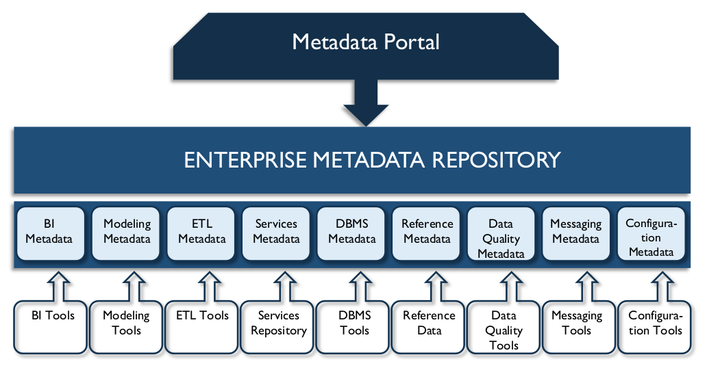

# Metadata Management

## 1. Introduction

The most common definition of Metadata, “data about data,” is misleadingly simple. The kind of information that can be classified as Metadata is wide-ranging. Metadata includes information about technical and business processes, data rules and constraints, and logical and physical data structures. It describes the data itself (e.g., databases, data elements, data models), the concepts the data represents (e.g., business processes, application systems, software code, technology infrastructure), and the connections (relationships) between the data and concepts. Metadata helps an organization understand its data, its systems, and its workflows. It enables data quality assessment and is integral to the management of databases and other applications. It contributes to the ability to process, maintain, integrate, secure, audit, and govern other data.

To understand Metadata’s vital role in data management, imagine a large library, with hundreds of thousands of books and magazines, but no card catalog. Without a card catalog, readers might not even know how to start looking for a specific book or even a specific topic. The card catalog not only provides the necessary information (which books and materials the library owns and where they are shelved) it also enables patrons to find materials using different starting points (subject area, author, or title). Without the catalog, finding a specific book would be difficult if not impossible. An organization without Metadata is like a library without a card catalog.

Metadata is essential to data management as well as data usage (see multiple references to Metadata throughout the DAMA-DMBOK). All large organizations produce and use a lot of data. Across an organization, different individuals will have different levels of data knowledge, but no individual will know everything about the data. This information must be documented or the organization risks losing valuable knowledge about itself. Metadata provides the primary means of capturing and managing organizational knowledge about data. However, Metadata management is not only a knowledge management challenge; it is also a risk management necessity. Metadata is necessary to ensure an organization can identify private or sensitive data and that it can manage the data lifecycle for its own benefit and in order to meet compliance requirements and minimize risk exposure.

Without reliable Metadata, an organization does not know what data it has, what the data represents, where it originates, how it moves through systems, who has access to it, or what it means for the data to be of high quality. Without Metadata, an organization cannot manage its data as an asset. Indeed, without Metadata, an organization may not be able to manage its data at all.

As technology has evolved, the speed at which data is generated has also increased. Technical Metadata has become integral to the way in which data is moved and integrated. ISO’s Metadata Registry Standard, ISO/IEC 11179, is intended to enable Metadata-driven exchange of data in a heterogeneous environment, based on exact definitions of data. Metadata present in XML and other formats enables use of the data. Other types of Metadata tagging allow data to be exchanged while retaining signifiers of ownership, security requirements, etc. (See Chapter 8.)

Like other data, Metadata requires management. As the capacity of organizations to collect and store data increases, the role of Metadata in data management grows in importance. To be data-driven, an organization must be Metadata-driven.

Figure 84 Context Diagram: Metadata

### 1.1 Business Drivers

Data cannot be managed without Metadata. In addition, Metadata itself must be managed. Reliable, well-managed Metadata helps:

* Increase confidence in data by providing context and enabling the measurement of data quality
* Increase the value of strategic information (e.g., Master Data) by enabling multiple uses
* Improve operational efficiency by identifying redundant data and processes
* Prevent the use of out-of-date or incorrect data
* Reduce data-oriented research time
* Improve communication between data consumers and IT professionals
* Create accurate impact analysis thus reducing the risk of project failure
* Improve time-to-market by reducing system development life-cycle time
* Reduce training costs and lower the impact of staff turnover through thorough documentation of data context, history, and origin
* Support regulatory compliance

Metadata assists in representing information consistently, streamlining workflow capabilities, and protecting sensitive information, particularly when regulatory compliance is required. Organizations get more value out of their data assets if their data is of high quality. Quality data depends on governance. Because it explains the data and processes that enable organizations to function, Metadata is critical to data governance. If Metadata is a guide to the data in an organization, then it must be well managed.

Poorly managed Metadata leads to:

* Redundant data and data management processes
* Replicated and redundant dictionaries, repositories, and other Metadata storage
* Inconsistent definitions of data elements and risks associated with data misuse
* Competing and conflicting sources and versions of Metadata which reduce the confidence of data consumers
* Doubt about the reliability of Metadata and data

Well-executed Metadata management enables a consistent understanding of data resources and more efficient cross-organizational development.

### 1.2 Goals and Principles

The goals of Metadata management include:

* Document and manage organizational knowledge of data-related business terminology in order to ensure people understand data content and can use data consistently
* Collect and integrate Metadata from diverse sources to ensure people understand similarities and differences between data from different parts of the organization
* Ensure Metadata quality, consistency, currency, and security
* Provide standard ways to make Metadata accessible to Metadata consumers (people, systems, and processes)
* Establish or enforce the use of technical Metadata standards to enable data exchange

The implementation of a successful Metadata solution follows these guiding principles:

* **Organizational commitment:** Secure organizational commitment (senior management support and funding) to Metadata management as part of an overall strategy to manage data as an enterprise asset.
* **Strategy:** Develop a Metadata strategy that accounts for how Metadata will be created, maintained, integrated, and accessed. The strategy should drive requirements, which should be defined before evaluating, purchasing, and installing Metadata management products. The Metadata strategy must align with business priorities.
* **Enterprise perspective:** Take an enterprise perspective to ensure future extensibility, but implement through iterative and incremental delivery to bring value.
* **Socialization:** Communicate the necessity of Metadata and the purpose of each type of Metadata; socialization of the value of Metadata will encourage business use and, as importantly, the contribution of business expertise.
* **Access:** Ensure staff members know how to access and use Metadata.
* **Quality:** Recognize that Metadata is often produced through existing processes (data modeling, SDLC, business process definition) and hold process owners accountable for the quality of Metadata.
* **Audit:** Set, enforce, and audit standards for Metadata to simplify integration and enable use.
* **Improvement:** Create a feedback mechanism so that consumers can inform the Metadata Management team of Metadata that is incorrect or out-of-date.

### 1.3 Essential Concepts

#### 1.3.1 Metadata vs. Data

As stated in the chapter introduction, Metadata is a kind of data, and it should be managed as such. One question that some organizations face is where to draw the line between data that is not Metadata and data that is Metadata. Conceptually, this line is related to the level of abstraction represented by the data. For example, in reporting on the release of the US National Security Administration’s surveillance of the phone usage of people in the US, phone numbers and times of calls were routinely referred to as ‘Metadata’, implying that the ‘real’

data comprised only the content of the phone conversations. Common sense recognizes that telephone numbers and duration of phone calls are also just plain data. [^70]

A rule of thumb might be that one person’s Metadata is another’s data. Even something that seems like Metadata (e.g., a list of column names) may be just plain data – if, for instance, this data was the input for an analysis aimed at understanding data content across different organizations.

To manage their Metadata, organizations should not worry about the philosophical distinctions. Instead they should define Metadata requirements focused on what they need Metadata for (to create new data, understand existing data, enable movement between systems, access data, to share data) and source data to meet these requirements.

#### 1.3.2 Types of Metadata

Metadata is often categorized into three types: business, technical, and operational. These categories enable people to understand the range of information that falls under the overall umbrella of Metadata, as well as the functions through which Metadata is produced. That said, the categories could also lead to confusion, especially if people get caught up in questions about which category a set of Metadata belongs or who is supposed to use it. It is best to think of these categories in relation to where Metadata originates, rather than how it is used. In relation to usage, the distinctions between Metadata types are not strict. Technical and operational staff use ‘business’ Metadata and vice versa.

Outside of information technology, for example, in library or information science, Metadata is described using a different set of categories:

* Descriptive Metadata (e.g., title, author, and subject) describes a resource and enables identification and retrieval.
* Structural Metadata describes relationships within and among resources and their component parts (e.g., number of pages, number of chapters).
* Administrative Metadata (e.g., version numbers, archive dates) is used to manage resources over their lifecycle.

These categories can helpful inform the process of defining Metadata requirements.

##### 1.3.2.1 Business Metadata

Business Metadata focuses largely on the content and condition of the data and includes details related to data governance. Business Metadata includes the non-technical names and definitions of concepts, subject areas, entities, and attributes; attribute data types and other attribute properties; range descriptions; calculations; algorithms and business rules; valid domain values and their definitions. Examples of Business Metadata include:

* Definitions and descriptions of data sets, tables, and columns
* Business rules, transformation rules, calculations, and derivations
* Data models
* Data quality rules and measurement results
* Schedules by which data is updated
* Data provenance and data lineage
* Data standards
* Designations of the system of record for data elements
* Valid value constraints
* Stakeholder contact information (e.g., data owners, data stewards)
* Security/privacy level of data
* Known issues with data
* Data usage notes

##### 1.3.2.2 Technical Metadata

Technical Metadata provides information about the technical details of data, the systems that store data, and the processes that move it within and between systems. Examples of Technical Metadata include:

* Physical database table and column names
* Column properties
* Database object properties
* Access permissions
* Data CRUD (create, replace, update and delete) rules
* Physical data models, including data table names, keys, and indexes
* Documented relationships between the data models and the physical assets
* ETL job details
* File format schema definitions
* Source-to-target mapping documentation
* Data lineage documentation, including upstream and downstream change impact information
* Program and application names and descriptions
* Content update cycle job schedules and dependencies
* Recovery and backup rules
* Data access rights, groups, roles

##### 1.3.2.3 Operational Metadata

Operational Metadata describes details of the processing and accessing of data. For example:

* Logs of job execution for batch programs
* History of extracts and results
* Schedule anomalies
* Results of audit, balance, control measurements
* Error Logs
* Reports and query access patterns, frequency, and execution time
* Patches and Version maintenance plan and execution, current patching level
* Backup, retention, date created, disaster recovery provisions
* SLA requirements and provisions
* Volumetric and usage patterns
* Data archiving and retention rules, related archives
* Purge criteria
* Data sharing rules and agreements
* Technical roles and responsibilities, contacts

#### 1.3.3 ISO / IEC 11179 Metadata Registry Standard

ISO’s Metadata Registry Standard, ISO/IEC 11179, provides a framework for defining a Metadata registry. It is designed to enable Metadata-driven data exchange, based on exact definitions of data, beginning with data elements. The standard is structured in several parts:

* **Part 1:** Framework for the Generation and Standardization of Data Elements
* **Part 3:** Basic Attributes of Data Elements
* **Part 4:** Rules and Guidelines for the Formulation of Data Definitions
* **Part 5:** Naming and Identification Principles for Data Elements
* **Part 6:** Registration of Data Elements

#### 1.3.4 Metadata for Unstructured Data

By its nature, all data has some structure, though not all of it is formally structured in the familiar rows, columns, and records of relational databases. Any data that is not in a database or data file, including documents or other media, is considered unstructured data. (See Chapters 9 and 14.)

Metadata is as essential to the management of unstructured data as it is to the management of structured data – perhaps even more so. Think again about the card catalog analogy from the chapter introduction. Books and magazines in a library are good examples of unstructured data. The primary use of the Metadata in a card catalog is to find the materials one is looking for, whatever their format.

Metadata for unstructured data includes descriptive Metadata, such as catalog information and thesauri keywords; structural Metadata such as tags, field structures, format; administrative Metadata, such as sources, update schedules, access rights, and navigation information; bibliographic Metadata, such as library catalog entries; record keeping Metadata, such as retention policies; and preservation Metadata, such as storage, archival condition, and rules for conservation. (See Chapter 9.)

While most assertions about Metadata for unstructured data are connected to traditional content management concerns, new practices are emerging around managing unstructured data in data lakes. Organizations wanting to take advantage of data lakes, using Big Data platforms such as Hadoop, are finding that they must catalog ingested data in order to enable later access. Most put in place processes to collect Metadata as part of data ingestion. A minimum set of Metadata attributes needs to be collected about each object ingested in the data lake (e.g., name, format, source, version, date received, etc.). This produces a catalog of data lake contents.

#### 1.3.5 Sources of Metadata

As should be clear from the types of Metadata, Metadata can be collected from many different sources. Moreover, if Metadata from applications and databases has been well-managed, it can simply be harvested and integrated. However, most organizations do not manage Metadata well at the application level, because Metadata is often created as a by-product of application processing rather than as an end product (i.e., it is not created with consumption in mind). As with other forms of data, there is a lot of work in preparing Metadata before it can be integrated.

The majority of operational Metadata is generated as data is processed. The key to using this Metadata is to collect it in a usable form, and to ensure that those responsible for interpreting it have the tools they need to do so. Keep in mind that interpreting data in places like error logs itself requires Metadata that describes the logs. Similarly, a large portion of technical Metadata can be harvested from database objects.

It is possible to reverse engineer knowledge about data from existing systems and to harvest business Metadata from existing data dictionaries, models, and process documentation (Loshin, 2001; Aiken, 1995), but there are risks in doing so. The biggest risk is not knowing how much care was taken to develop and refine the definitions in the first place. If definitions are underdeveloped or ambiguous, then they will not provide data consumers with the information they need to understand the data they are using.

It is better to be intentional about developing definitions than to simply accept existing ones. Development of definitions takes time and the right skill set (e.g., writing and facilitation skills). This is why the development of business Metadata requires stewardship. (See Chapter 3.)

Much of the technical Metadata required to manage databases and the business Metadata required to use data can be collected and developed as part of project work. For example, the process of modeling data requires discussions on the meaning of data elements and the relation between them. Knowledge shared during such discussions should be captured and groomed for use in Data Dictionaries, Business Glossaries, and other repositories. The data models themselves include important details about the physical characteristics of data. Time should be allocated to ensure that project artifacts contain high quality Metadata that aligns with enterprise standards.

Well-defined business Metadata is reusable from project-to-project and can drive a consistent understanding of how business concepts are represented in different data sets. As part of developing Metadata intentionally so that it can be reused, an organization can also plan for the integration of Metadata. For example, it can develop an inventory of systems, and all Metadata related to particular system can be tagged with the same system identifier.

Creating Metadata for its own sake rarely works well. Most organizations will not fund this type of effort and, even when they do, they are unlikely to put in place processes for maintenance. In this respect, as in others, Metadata is like other data: It should be created as the product of a well-defined process, using tools that will support its overall quality. Stewards and other data management professionals should ensure that there are processes in place to maintain Metadata related to these processes. For example, if an organization harvests critical Metadata from its data models, it should ensure that there is a change management process in place to keep models current.

To give a sense of the breadth of Metadata in any organization, a range of sources is outlined here, in alphabetical rather than priority order.

##### 1.3.5.1 Application Metadata Repositories

A Metadata repository refers to the physical tables in which the Metadata is stored. Often these are built into modeling tools, BI tools, and other applications. As an organization matures, it will want to integrate Metadata from repositories in these applications to enable data consumers to look across the breadth of information.

##### 1.3.5.2 Business Glossary

The purpose of a business glossary is to document and store an organization’s business concepts and terminology, definitions, and the relationships between those terms.

In many organizations, the business glossary is merely a spreadsheet. However, as organizations mature, they often purchase or build glossaries that contain robust information and the capability to manage it over time. As with all data-oriented systems, business glossaries should be architected to account for hardware, software, database, processes, and human resources with differing roles and responsibilities. The business glossary application is structured to meet the functional requirements of the three core audiences:

* **Business users:** Data analysts, research analysts, management, and executive staff use the business glossary to understand terminology and data.
* **Data Stewards:** Data Steward use the business glossary to manage the lifecycle of terms and definitions and to enhance enterprise knowledge by associating data assets with glossary terms; for example, linking terms to business metrics, reports, data quality analysis, or technology components. Data stewards raise terminology and usage issues and help resolve differences across the organization.
* **Technical users:** Technical users use the business glossary to make architecture, systems design, and development decisions, and to conduct impact analysis.

The business glossary should capture business terms attributes such as:

* Term name, definition, acronym or abbreviation, and any synonyms
* Business unit and or application responsible for managing the data associated with the terminology
* Name of the person identifying the term, and date updated
* Categorization or taxonomy association for the term (business functional association)
* Conflicting definitions that need resolution, nature of the problem, action timeline
* Common misunderstandings in terms
* Algorithms supporting definitions
* Lineage
* Official or authoritative source for the data supporting the term

Every business glossary implementation should have a basic set of reports to support the governance processes. It is recommended that organizations do not ‘print the glossary’ because glossary content is not static. Data stewards are generally responsible for glossary development, use, operations, and reporting. Reporting includes, tracking for new terms and definitions that have not been reviewed yet, those in a pending status, and those that are missing definitions or other attributes. (See Section 6.4.)

Ease of use and functionality can vary widely. The simpler and easier business glossary search, the more likely the glossary content will be used. However, the most important characteristic of a glossary is that it contains robust content.

##### 1.3.5.3 Business Intelligence (BI) Tools

Business Intelligence tools produce various types of Metadata relevant to the Business Intelligence design including overview information, classes, objects, derived and calculated items, filters, reports, report fields, report layout, reports users, report distribution frequency, and report distribution channels.

##### 1.3.5.4 Configuration Management Tools

Configuration management tools or databases (CMDB) provide the capability to manage and maintain Metadata specifically related to the IT assets, the relationships among them, and contractual details of the asset. Each asset in the CMDB database is referred to as a configuration item (CI). Standard Metadata is collected and managed for each CI type. Many organizations integrate the CMDB with the change management processes to identify the related assets or applications impacted by a change to a specific asset. Repositories provide mechanisms to link the assets in the Metadata repository to the actual physical implementation details in CMDB to give a complete picture of the data and the platforms.

##### 1.3.5.5 Data Dictionaries

A data dictionary defines the structure and contents of data sets, often for a single database, application, or warehouse. The dictionary can be used to manage the names, descriptions, structure, characteristics, storage requirements, default values, relationships, uniqueness, and other attributes of every data element in a model. It should also contain table or file definitions. Data dictionaries are embedded in database tools for the creation, operation, manipulation of data contained in them. To make this Metadata available to data consumers, it must be extracted from the database or modeling tools. Data dictionaries can also describe in business terminology what data elements are available to the community, provisioned under what security restrictions, and applied in which business process. Time can be saved when defining, publishing, and maintaining a semantic layer for reporting and analysis by leveraging the content directly from the logical model. However, as noted earlier, existing definitions should be used with caution, especially in an organization with a low level of maturity around Metadata management.

Many key business processes, relationships, and terminologies are explained during the development of the data model. This information, captured in the logical data model, is often lost when physical structures are deployed to production. A data dictionary can help ensure that this information is not lost entirely to the organization and that the logical and physical models are kept in agreement after production deployment.

#### 1.3.5.6 Data Integration Tools

Many data integration tools are used for executables to move data from one system to another or between various modules within the same system. Many of these tools generate transient files, which might contain copies or derived copies of the data. These tools are capable of loading data from various sources and then operating on the loaded data, through grouping, remediation, re-formatting, joining, filtering, or other operations, and then generating output data, which is distributed to the target locations. They document the lineage as data as it moves between systems. Any successful Metadata solution should be able to use the lineage Metadata as it is moves through the integration tools and expose it as a holistic lineage from the actual sources to the final destinations.

Data integration tools provide application interfaces (API) to allow external Metadata repositories to extract the lineage information and the transient files Metadata. Once the Metadata repository collects the information, some tools can generate a holistic lineage diagram for any data element. Data integration tools also provide Metadata about the execution of the various data integration jobs, including last successful run, duration, and job status. Some Metadata repositories can extract the data integration runtime statistics and Metadata and expose it alongside the data elements. (See Chapters 6 and 8.)

##### 1.3.5.7 Database Management and System Catalogs

Database catalogs are an important source of Metadata. They describe the content of databases, along with sizing information, software versions, deployment status, network uptime, infrastructure uptime, availability, and many other operational Metadata attributes. The most common form of database is relational. Relational databases manage the data as a set of tables and columns, where a table contains one or more columns, indexes, constraints, views, and procedures. A Metadata solution should be able to connect to the various databases and data sets and read all of the Metadata exposed by the database. Some of the Metadata repository tools can integrate the exposed Metadata from the system management tools to provide a more holistic picture about the captured physical assets.

##### 1.3.5.8 Data Mapping Management Tools

Mapping management tools are used during the analysis and design phase of a project to transform requirements into mapping specifications, which can then be consumed directly by a data integration tool or used by the developers to generate data integration code. Mapping documentation is also often held in excel documents across the enterprise. Vendors are now considering centralized repositories for the mapping specifications with capabilities to perform version control and change analysis between versions. Many mapping tools integrate with data integration tools to automate the generation of the data integration programs and most can exchange data with other Metadata and Reference Data repositories. (See Chapter 8.)

##### 1.3.5.9 Data Quality Tools

Data quality tools assess the quality of data through validation rules. Most of these tools provide the capability to exchange the quality scores and profiles patterns with other Metadata repositories, enabling the Metadata repository to attach the quality scores to the relevant physical assets.

##### 1.3.5.10 Directories and Catalogs

While data dictionaries and glossaries contain detailed information about terminology, tables, and fields, a directory or catalog contains information about systems, sources, and locations of data within an organization. A directory of Metadata is particularly useful to developers and data super users, such as data stewardship teams and data analysts, to understand the scope of data in the enterprise, whether to research issues or to find information about sourcing new applications.

##### 1.3.5.11 Event Messaging Tools

Event messaging tools move data between diverse systems. To do so, they require a lot of Metadata. They also generate Metadata that describes this movement. These tools include graphic interfaces through which they manage the logic of data movement. They can export the interfaces implementation details, movement logic, and processing statistics to other Metadata repositories.

##### 1.3.5.12 Modeling Tools and Repositories

Data modeling tools are used to build various types of data models: conceptual, logical, and physical. These tools produce Metadata relevant to the design of the application or system model, like subject areas, logical entities, logical attributes, entity and attribute relationships, super types and subtypes, tables, columns, indexes, primary and foreign keys, integrity constraints, and other types of attribution from the models. Metadata repositories can ingest the models created by these tools and integrate the imported Metadata into the repository. Modeling tools are often the source of data dictionary content.

##### 1.3.5.13 Reference Data Repositories

Reference Data documents the business values and descriptions of the various types of enumerated data (domains) and their contextual use in a system. Tools used to manage Reference Data are also capable of managing relationships between the various codified values within the same or across domains. These suites of tools normally provide capabilities to send the collected Reference Data to a Metadata repository, which in turn will provide mechanisms to associate the Reference Data to the business glossary and to the locations where it is physically implemented like columns or fields.

##### 1.3.5.14 Service Registries

A service registry manages and stores the technical information about services and service end-points from a service oriented architecture (SOA) perspective. For example, definitions, interfaces, operations, input and output parameters, policies, versions, and sample usage scenarios. Some of the most important Metadata related to services includes service version, location of service, data center, availability, deployment date, service port, IP address, stats port, connection timeout, and connection retry timeout. Service registries can be interrogated to satisfy various needs like displaying a list of all available services, services with a specific version, obsolete services, or details about a specific service. Services can also be reviewed for potential re-use. The information contained in these repositories provides important facts on what data exists and how it moves between various systems or applications. Metadata in service repositories can be extracted and incorporated with Metadata collected from other tools to provide a complete picture of how data is moving between the various systems.

##### 1.3.5.15 Other Metadata Stores

Other Metadata stores include specialized lists such as event registries, source lists or interfaces, code sets, lexicons, spatial and temporal schema, spatial reference, and distribution of digital geographic data sets, repositories of repositories, and business rules.

#### 1.3.6 Types of Metadata Architecture

Like other forms of data, Metadata has a lifecycle. Conceptually, all Metadata management solutions include architectural layers that correspond to points in the Metadata lifecycle:

* Metadata creation and sourcing
* Metadata storage in one or more repositories
* Metadata integration
* Metadata delivery
* Metadata usage
* Metadata control and management

Different architectural approaches can be used to source, store, integrate, maintain, and make Metadata accessible to consumers.

##### 1.3.6.1 Centralized Metadata Architecture

A centralized architecture consists of a single Metadata repository that contains copies of Metadata from the various sources. Organizations with limited IT resources, or those seeking to automate as much as possible, may choose to avoid this architecture option. Organizations seeking a high degree of consistency within the common Metadata repository can benefit from a centralized architecture.

Advantages of a centralized repository include:

* High availability, since it is independent of the source systems
* Quick Metadata retrieval, since the repository and the query reside together
* Resolved database structures not affected by the proprietary nature of third party or commercial systems
* Extracted Metadata may be transformed, customized, or enhanced with additional Metadata that may not reside in the source system, improving quality

Some limitations of the centralized approach include:

* Complex processes are necessary to ensure that changes in source Metadata are quickly replicated into the repository
* Maintenance of a centralized repository can be costly
* Extraction could require custom modules or middleware
* Validation and maintenance of customized code can increase the demands on both internal IT staff and the software vendors

Figure 85 shows how Metadata is collected in a standalone Metadata repository with its own internal Metadata store. The internal store is populated through a scheduled import (arrows) of the Metadata from the various tools. In turn, the centralized repository exposes a portal for the end users to submit their queries. The Metadata portal passes the request to the centralized Metadata repository. The centralized repository will fulfill the request from the collected Metadata. In this type of implementation, the capability to pass the request from the user to various tools directly is not supported. Global search across the Metadata collected from the various tool is possible due to the collection of various Metadata in the centralized repository.

Figure 85 Centralized Metadata Architecture

##### 1.3.6.2 Distributed Metadata Architecture

A completely distributed architecture maintains a single access point. The Metadata retrieval engine responds to user requests by retrieving data from source systems in real time; there is no persistent repository. In this architecture, the Metadata management environment maintains the necessary source system catalogs and lookup information needed to process user queries and searches effectively. A common object request broker or similar middleware protocol accesses these source systems.

Advantages of distributed Metadata architecture include:

* Metadata is always as current and valid as possible because it is retrieved from its source
* Queries are distributed, possibly improving response and process time
* Metadata requests from proprietary systems are limited to query processing rather than requiring a detailed understanding of proprietary data structures, therefore minimizing the implementation and maintenance effort required
* Development of automated Metadata query processing is likely simpler, requiring minimal manual intervention
* Batch processing is reduced, with no Metadata replication or synchronization processes

Distributed architectures also have limitations:

* No ability to support user-defined or manually inserted Metadata entries since there is no repository in which to place these additions
* Standardization of presenting Metadata from various systems
* Query capabilities are directly affected by the availability of the participating source systems
* The quality of Metadata depends solely on the participating source systems

Figure 86 Distributed Metadata Architecture

Figure 86 illustrates a distributed Metadata architecture. There is no centralized Metadata repository store and the portal passes the users’ requests to the appropriate tool to execute. As there is no centralized store for the Metadata to be collected from the various tools, every request has to be delegated down to the sources; hence, no capability exist for a global search across the various Metadata sources.

##### 1.3.6.3 Hybrid Metadata Architecture

A hybrid architecture combines characteristics of centralized and distributed architectures. Metadata still moves directly from the source systems into a centralized repository. However, the repository design only accounts for the user-added Metadata, the critical standardized items, and the additions from manual sources.

The architecture benefits from the near-real-time retrieval of Metadata from its source and enhanced Metadata to meet user needs most effectively, when needed. The hybrid approach lowers the effort for manual IT intervention and custom-coded access functionality to proprietary systems. The Metadata is as current and valid as possible at the time of use, based on user priorities and requirements. Hybrid architecture does not improve system availability.

The availability of the source systems is a limitation, because the distributed nature of the back-end systems handles processing of queries. Additional overhead is required to link those initial results with the Metadata augmentation in the central repository before presenting the result set to the end user.

Many organizations can benefit from a hybrid architecture, including those that have rapidly-changing operational Metadata, those that need consistent, uniform Metadata, and those that experience substantial growth in Metadata and Metadata sources. Organizations with more static Metadata and smaller Metadata growth profiles may not see the maximum potential from this architecture alternative.

##### 1.3.6.4 Bi-Directional Metadata Architecture

Another advanced architectural approach is bi-directional Metadata architecture, which allows Metadata to change in any part of the architecture (source, data integration, user interface) and then feedback is coordinated from the repository (broker) into its original source.

Various challenges are apparent in this approach. The design forces the Metadata repository to contain the latest version of the Metadata source and forces it to manage changes to the source, as well. Changes must be trapped systematically, and then resolved. Additional sets of process interfaces to tie the repository back to the Metadata source(s) must be built and maintained.

Figure 87 Hybrid Metadata Architecture

Figure 87 illustrates how common Metadata from different sources is collected in a centralized Metadata store. Users submit their queries to the Metadata portal, which passes the request to a centralized repository. The centralized repository will try to fulfill the user request from the common Metadata collected initially from the various sources. As the request becomes more specific or the user needs more detailed Metadata then the centralized repository will delegate down to the specific source to research the specific details. Global search across the various tools is available due to the common Metadata collected in the centralized repository.

## 2. Activities

### 2.1 Define Metadata Strategy

A Metadata strategy describes how an organization intends to manage its Metadata and how it will move from current state to future state practices. A Metadata strategy should provide a framework for development teams to improve Metadata management. Developing Metadata requirements will help clarify the drivers of the strategy and identify potential obstacles to enacting it.

The strategy includes defining the organization’s future state enterprise Metadata architecture and the implementation phases required to meet strategic objectives. Steps include:

* **Initiate Metadata strategy planning:** The goal of initiation and planning is to enable the Metadata strategy team to define its short- and long-term goals. Planning includes drafting a charter, scope, and objectives aligned with overall governance efforts and establishing a communications plan to support the effort. Key stakeholders should be involved in planning.
* **Conduct key stakeholder interviews:** Interviews with business and technical stakeholder provide a foundation of knowledge for the Metadata strategy.
* **Assess existing Metadata sources and information architecture:** Assessment determines the relative degree of difficulty in solving the Metadata and systems issues identified in the interviews and documentation review. During this stage, conduct detailed interviews of key IT staff and review documentation of the system architectures, data models, etc.
* **Develop future Metadata architecture:** Refine and confirm the future vision, and develop the long-term target architecture for the managed Metadata environment in this stage. This phase must account for strategic components, such as organization structure, alignment with data governance andstewardship, managed Metadata architecture, Metadata delivery architecture, technical architecture, and security architecture.
* **Develop a phased implementation plan:** Validate, integrate, and prioritize findings from the interviews and data analyses. Document the Metadata strategy and define a phased implementation approach to move from the existing to the future managed Metadata environment.

The strategy will evolve over time, as Metadata requirements, the architecture, and the lifecycle of Metadata are better understood.

### 2.2 Understand Metadata Requirements

Metadata requirements start with content: What Metadata is needed and at what level. For example, physical and logical names need to be captured for both columns and tables. Metadata content is wide-ranging and requirements will come from both business and technical data consumers. (See Section 1.3.2.)

There are also many functionality-focused requirements associated with a comprehensive Metadata solution:

* **Volatility:** How frequently Metadata attributes and sets will be updated
* **Synchronization:** Timing of updates in relation to source changes
* **History:** Whether historical versions of Metadata need to be retained
* **Access rights:** Who can access Metadata and how they access, along with specific user interface functionality for access
* **Structure:** How Metadata will be modeled for storage
* **Integration:** The degree of integration of Metadata from different sources; rules for integration
* **Maintenance:** Processes and rules for updating Metadata (logging and referring for approval)
* **Management:** Roles and responsibilities for managing Metadata
* **Quality:** Metadata quality requirements
* **Security:** Some Metadata cannot be exposed because it will reveal the existence of highly protected data

### 2.3 Define Metadata Architecture

A Metadata Management system must be capable of extracting Metadata from many sources. Design the architecture to be capable of scanning the various Metadata sources and periodically updating the repository. The system must support the manual updates of Metadata, requests, searches, and lookups of Metadata by various user groups.

A managed Metadata environment should isolate the end user from the various and disparate Metadata sources. The architecture should provide a single access point for the Metadata repository. The access point must supply all related Metadata resources transparently to the user. Users should be able to access Metadata without being aware of the differing environments of the data sources. In analytics and Big Data solutions, the interface may have largely user-defined functions (UDF) to draw on various data sets, and the Metadata exposure to the end user is inherent to those customizations. With less reliance on UDF in solutions, end users will be gathering, inspecting, and using data sets more directly and various supporting Metadata is usually more exposed.

Design of the architecture depends on the specific requirements of the organization. Three technical architectural approaches to building a common Metadata repository mimic the approaches to designing data warehouses: centralized, distributed, and hybrid (see Section 1.3.6). These approaches all take into account implementation of the repository, and how the update mechanisms operate.

#### 2.3.1 Create MetaModel

Create a data model for the Metadata repository, or metamodel, as one of the first design steps after the Metadata strategy is complete and the business requirements are understood. Different levels of metamodel may be developed as needed; a high-level conceptual model, that explains the relationships between systems, and a lower level metamodel that details the attributions, to describe the elements and processes of a model. In addition to being a planning tool and a means of articulating requirements, the metamodel is in itself a valuable source of Metadata.

Figure 88 depicts a sample Metadata repository metamodel. The boxes represent the high-level major entities, which contain the data.

Figure 88 Example Metadata Repository Metamodel

#### 2.3.2 Apply Metadata Standards

The Metadata solution should adhere to the agreed-upon internal and external standards as identified in the Metadata strategy. Metadata should be monitored for compliance by governance activities. Organization internal Metadata standards include naming conventions, custom attributions, security, visibility, and processing documentation. Organization external Metadata standards include the data exchange formats and application-programming interfaces design.

#### 2.3.3 Manage Metadata Stores

Implement control activities to manage the Metadata environment. Control of repositories is control of Metadata movement and repository updates performed by the Metadata specialist. These activities are administrative in nature and involve monitoring and responding to reports, warnings, job logs, and resolving various issues in the implemented repository environment. Many control activities are standard for data operations and interface maintenance. Control activities should have data governance oversight.

Control activities include:

* Job scheduling and monitoring
* Load statistical analysis
* Backup, recovery, archive, purging
* Configuration modifications
* Performance tuning
* Query statistics analysis
* Query and report generation
* Security management
* Quality control activities include:
* Quality assurance, quality control
* Frequency of data update – matching sets to timeframes
* Missing Metadata reports
* Aging Metadata report
* Metadata management activities include:
* Loading, scanning, importing and tagging assets
* Source mapping and movement
* Versioning
* User interface management
* Linking data sets Metadata maintenance – for NOSQL provisioning
* Linking data to internal data acquisition – custom links and job Metadata
* Licensing for external data sources and feeds
* Data enhancement Metadata, e.g., Link to GIS
* And training, including:
* Education and training of users and data stewards
* Management metrics generation and analysis
* Training on the control activities and query and reporting

### 2.4 Create and Maintain Metadata

As described in Section 1.3.5, Metadata is created through a range of processes and stored in many places within an organization. To be of high quality, Metadata should be managed as a product. Good Metadata is not created by accident. It requires planning. (See Chapter 13.)

Several general principles of Metadata management describe the means to manage Metadata for quality:

* **Accountability:** Recognize that Metadata is often produced through existing processes (data modeling, SDLC, business process definition) and hold process owners accountable for the quality of Metadata.
* **Standards:** Set, enforce, and audit standards for Metadata to simplify integration and enable use.
* **Improvement:** Create a feedback mechanism so that consumers can inform the Metadata Management team of metadata that is incorrect or out-of-date.

Like other data, Metadata can be profiled and inspected for quality. Its maintenance should be scheduled or completed as an auditable part of project work.

#### 2.4.1 Integrate Metadata

Integration processes gather and consolidate Metadata from across the enterprise, including Metadata from data acquired outside the enterprise. The Metadata repository should integrate extracted technical Metadata with relevant business, processes, and stewardship Metadata. Metadata can be extracted using adapters, scanners, bridge applications, or by directly accessing the Metadata in a source data store. Adapters are available with many third party vendor software tools, as well as from Metadata integration tools. In some cases, adapters will be developed using the tool API’s.

Challenges arise in integration that will require governance. Integrating internal data sets, external data such as government statistics, and data sourced from non-electronic forms, such as white papers, articles in magazines, or reports, can raise numerous questions on quality and semantics. Accomplish repository scanning in two distinct approaches.

* **Proprietary interface:** In a single-step scan and load process, a scanner collects the Metadata from a source system, then directly calls the format-specific loader component to load the Metadata into the repository. In this process, there is no format-specific file output and the collection and loading of Metadata occurs in a single step.
* **Semi-proprietary interface:** In a two-step process, a scanner collects the Metadata from a source system and outputs it into a format-specific data file. The scanner only produces a data file that the receiving repository needs to be able to read and load appropriately. The interface is a more open architecture, as the file is readable by many methods.

A scanning process uses and produces several types of files during the process.

* **Control file:** Containing the source structure of the data model
* **Reuse file:** Containing the rules for managing reuse of process loads
* **Log files:** Produced during each phase of the process, one for each scan or extract and one for each load cycle
* **Temporary and backup files:** Use during the process or for traceability

Use a non-persistent Metadata staging area to store temporary and backup files. The staging area supports rollback and recovery processes, and provides an interim audit trail to assist repository managers when investigating Metadata source or quality issues. The staging area may take the form of a directory of files or a database.

Data Integration tools used for data warehousing and Business Intelligence applications are often used effectively in Metadata integration processes. (See Chapter 8.)

#### 2.4.2 Distribute and Deliver Metadata

Metadata is delivered to data consumers and to applications or tools that require Metadata feeds. Delivery mechanisms include:

* Metadata intranet websites for browse, search, query, reporting, and analysis
* Reports, glossaries and other documents
* Data warehouses, data marts, and BI (Business Intelligence) tools
* Modeling and software development tools
* Messaging and transactions
* Web services and Application Programming Interfaces (APIs)
* External organization interface solutions (e.g., supply chain solutions)

The Metadata solution often links to a Business Intelligence solution, so that both the scope and the currency of Metadata synchronize with the BI content. A link provides a means of integration into the delivery of BI to the end user. Similarly, some CRM (Customer Relationship Management) or other ERP (Enterprise Resource Planning) solutions may require Metadata integration at the application delivery layer.

Metadata is exchanged with external organizations using files (flat, XML, or JSON structured) or through web services.

### 2.5 Query, Report, and Analyze Metadata

Metadata guides the use of data assets. Use Metadata in Business Intelligence (reporting and analysis), business decisions (operational, tactical, strategic), and in business semantics (what they say, what they mean – business lingo’). A Metadata repository must have a front-end application that supports the search-and-retrieval functionality required for all this guidance and management of data assets. The interface provided to business users may have a different set of functional requirements than that for technical users and developers. Some reports facilitate future development such as change impact analysis, or trouble shoot varying definitions for data warehouse and Business Intelligence projects, such as data lineage reports.

## 3. Tools

The primary tool used to manage Metadata is the Metadata repository. This will include an integration layer and often an interface for manual updates. Tools that produce and use Metadata become sources of Metadata that can be integrated into a Metadata repository.

### 3.1 Metadata Repository Management Tools

Metadata Management tools provide capabilities to manage Metadata in a centralized location (repository). The Metadata can be either manually entered or extracted from various other sources through specialized connecters. Metadata repositories also provide capabilities to exchange Metadata with other systems.

Metadata management tools and repositories themselves are also a source of Metadata, especially in a hybrid Metadata architectural model or in large enterprise implementations. Metadata management tools allow for the exchange of the collected Metadata with other Metadata repositories, enabling the collection of various and diverse Metadata from different sources into a centralized repository, or enabling the enriching and standardization of the diverse Metadata as it moves between the repositories.

## 4. Techniques

### 4.1 Data Lineage and Impact Analysis

A key benefit of discovering and documenting Metadata about the physical assets is to provide information on how data is transformed as it moves between systems. Many Metadata tools carry information about what is happening to the data within their environments and provide capabilities to view the lineage across the span of the systems or applications they interface. The current version of the lineage based on programming code is referred to as ‘As Implemented Lineage’. In contrast, lineage describe in mapping specification documents is referred to as ‘As Designed Lineage’.

The limitations of a lineage build are based on the coverage of the Metadata management system. Function-specific Metadata repositories or data visualization tools have information about the data lineage within the scope of the environments they interact with but will not provide visibility to what is happening to the data outside their environments.

Metadata management systems import the ‘As Implemented’ lineage from the various tools that can provide this lineage detail and then augment the data lineage with the ‘As Designed’ from the places where the actual implementation details is not extractable. The process of connecting the pieces of the data lineage referred to as stitching. It results in a holistic visualization of the data as it moves from its original locations (official source or system of record) until it lands in its final destination.

Figure 89 shows a sample data element lineage. In reading this, the ‘Total Backorder’ business data element, which is physically implemented as column zz_total, depends on 3 other data elements: ‘Units Cost in Cents’ physically implemented as ‘yy_unit_cost’, ‘Tax in Ship to State’ implemented in ‘yy_tax’ and ‘Back Order Quantity’ implemented in ‘yy_qty’.

Although a lineage graphic, such as in Figure 89, describes what is happening to a particular data element, not all business users will understand it. Higher levels of lineage (e.g., ‘System Lineage’) summarize movement at the system or application level. Many visualization tools provide zoom-in / zoom-out capability, to show data element lineage in the context of system lineage. For example, Figure 90 shows a sample system lineage, where at a glance, general data movement is understood and visualized at a system or an application level.

Figure 89 Sample Data Element Lineage Flow Diagram

Figure 90 Sample System Lineage Flow Diagram

As the number of data elements in a system grows, the lineage discovery becomes complex and difficult to manage. In order to successfully achieve the business goals, a strategy for discovering and importing assets into the Metadata repository requires planning and design. Successful lineage discovery needs to account for both business and technical focus:

* **Business focus:** Limit the lineage discovery to data elements prioritized by the business. Start from the target locations and trace back to the source systems where the specific data originates. By limiting the scanned assets to those that move, transfer, or update the selected data elements, this approach will enable business data consumers to understand what is happening to the specific data element as it moves through systems. If coupled with data quality measurements, lineage can be used to pinpoint where system design adversely impacts the quality of the data.
* **Technical focus:** Start at the source systems and identify all the immediate consumers, then identify all the subsequent consumers of the first set identified and keep repeating these steps until all systems are identified. Technology users benefit more from the system discovery strategy in order to help answer the various questions about the data. This approach will enable technology and business users to answer question about discovering data elements across the enterprise, like “Where is social security number?” or generate impact reports like “What systems are impacted if the width of a specific column is changed?” This strategy can, however, be complex to manage.

Many data integration tools offer lineage analysis that considers not only the developed population code but the data model and the physical database as well. Some offer business user facing web interfaces to monitor and update definitions. These begin to look like business glossaries.

Documented lineage helps both business and technical people use data. Without it, much time is wasted in investigating anomalies, potential change impacts, or unknown results. Look to implement an integrated impact and lineage tool that can understand all the moving parts involved in the load process as well as end user reporting and analytics. Impact reports outline which components are affected by a potential change expediting and streamlining estimating and maintenance tasks.

### 4.2 Metadata for Big Data Ingest

Many data management professionals are familiar and comfortable with structured data stores, where every item can be clearly identified and tagged. Nowadays, though, much data comes in less structured formats. Some unstructured sources will be internal to the organization, and some will be external. In either case, there is no longer a need to physically bring the data to one place. Through the new technologies, the program will go to the data as opposed to moving the data to the program, reducing the amount of data movement, and speeding up the execution of the process. Nevertheless, successful data management in a data lake depends on managing Metadata.

Metadata tags should be applied to data upon ingestion. Metadata then can be used to identify data content available for access in the data lake. Many ingestion engines profile data as it is ingested. Data profiling can identify data domains, relationships, and data quality issues. It can also enable tagging. On ingestion, Metadata tags can be added to identify sensitive or private (like Personally Identifiable Information – PPI) data, for example. Data scientists may add confidence, textual identifiers, and codes representing behavior clusters. (See Chapter 14.)

## 5. Implementation Guidelines

Implement a managed Metadata environment in incremental steps in order to minimize risks to the organization and to facilitate acceptance. Implement Metadata repositories using an open relational database platform. This allows development and implementation of various controls and interfaces that may not be anticipated at the start of a repository development project.

The repository contents should be generic in design, not merely reflecting the source system database designs. Design contents in alignment with the enterprise subject area experts, and based on a comprehensive Metadata model. Planning should account for integrating Metadata so that data consumers can see across different data sources. The ability to do so will be one of the most valuable capabilities of the repository. It should house current, planned, and historical versions of the Metadata.

Often, the first implementation is a pilot to prove concepts and learn about managing the Metadata environment. Integration of Metadata projects into the IT development methodology is necessary. There will be variations depending on architecture and types of storage.

### 5.1 Readiness Assessment / Risk Assessment

Having a solid Metadata strategy helps everyone make more effective decisions. First and foremost, people should be aware of the risks of not managing Metadata. Assess the degree to which the lack of high quality Metadata might result in:

* Errors in judgment due to incorrect, incomplete or invalid assumptions or lack of knowledge about the context of the data
* Exposure of sensitive data, which may put customers or employees at risk, or impact the credibility of the business and lead to legal expenses
* Risk that the small set of SMEs who know the data will leave and take their knowledge with them

Risk is reduced when an organization adopts a solid Metadata strategy. Organizational readiness is addressed by a formal assessment of the current maturity in Metadata activities. The assessment should include the critical business data elements, available Metadata glossaries, lineage, data profiling and data quality processes, MDM (Master Data Management) maturity, and other aspects. Findings from the assessment, aligned with business priorities, will provide the basis for a strategic approach to improvement of Metadata Management practices. A formal assessment also provides the basis for a business case, sponsorship and funding.

The Metadata strategy may be part of an overall data governance strategy or it may be the first step in implementing effective data governance. A Metadata assessment should be conducted via objective inspection of existing Metadata, along with interviews with key stakeholders. The deliverables from a risk assessment include a strategy and roadmap.

### 5.2 Organizational and Cultural Change

Like other data management efforts, Metadata initiatives often meet with cultural resistance. Moving from an unmanaged to a managed Metadata environment takes work and discipline. It is not easy to do, even if most people recognize the value of reliable Metadata. Organizational readiness is a major concern, as are methods for governance and control.

Metadata Management is a low priority in many organizations. An essential set of Metadata needs coordination and commitment in an organization. It can be structures of employee identification data, insurance policy numbers, vehicle identification numbers, or product specifications, which if changed, would require major overhauls of many enterprise systems. Look for that good example where control will reap immediate quality benefits for data in the company. Build the argument from concrete business-relevant examples. Implementation of an enterprise data governance strategy needs senior management support and engagement. It requires that business and technology staff be able to work closely together in a cross-functional manner.

## 6. Metadata Governance

Organizations should determine their specific requirements for the management of the Metadata lifecycle and establish governance processes to enable those requirements. It is recommended that formal roles and responsibilities be assigned to dedicated resources, especially in large or business critical areas. Metadata governance processes themselves depend on reliable Metadata, so the team charged with managing Metadata can test principles on the Metadata they create and use.

### 6.1 Process Controls

The data governance team should be responsible for defining the standards and managing status changes for Metadata – often with workflow or collaboration software – and may be responsible for promotional activities and training development or actual training across the organization.

More mature Metadata governance will require business terms and definitions to progress through varying status changes or governance gates; for example, from a candidate term, to approved, to published, and to a final point in the lifecycle of replaced or retired. The governance team may also manage business term associations such as related terms, as well as the categorization of and grouping of the terms.

Integration of the Metadata strategy into the SDLC is needed to ensure that changed Metadata is collected when it is changed. This helps ensure Metadata remains current.

### 6.2 Documentation of Metadata Solutions

A master catalog of Metadata will include the sources and targets currently in scope. This is a resource for IT and business users and can be published out to the user community as a guide to ‘what is where’ and to set expectations on what they will find:

* Metadata implementation status
* Source and the target Metadata store
* Schedule information for updates
* Retention and versions kept
* Contents
* Quality statements or warnings (e.g., missing values)
* System of record and other data source statuses (e.g., data contents history coverage, retiring or replacing flags)
* Tools, architectures, and people involved
* Sensitive information and removal or masking strategy for the source

In documents and content management, data maps show similar information. Visualizations of the overall Metadata integration systems landscape are also maintained as part of Metadata documentation. (See Chapter 9.)

### 6.3 Metadata Standards and Guidelines

Metadata standards are essential in the exchange of data with operational trading partners. Companies realize the value of information sharing with customers, suppliers, partners, and regulatory bodies. The need for sharing common Metadata to support the optimal usage of shared information has spawned many sector-based standards.

Adopt industry-based and sector-sensitive Metadata standards early in the planning cycle. Use the standards to evaluate Metadata Management technologies. Many leading vendors support multiple standards, and some can assist in customizing industry-based and sector-sensitive standards.

Tool vendors provide XML and JSON or REST support to exchange data for their data management products. They use the same strategy to bind their tools together into suites of solutions. Technologies, including data integration, relational and multidimensional databases, requirements management, Business Intelligence reporting, data modeling, and business rules, offer import and export capabilities for data and Metadata using XML. Vendors maintain their proprietary XML schemas and document type definitions (DTD) or more commonly the XML schema definitions (XSD). These are accessed through proprietary interfaces. Custom development is required to integrate these tools into a Metadata management environment.

Guidelines include templates and associated examples and training on expected inputs and updates including such rules as ‘do not define a term by using the term’ and completeness statements. Different templates are developed for different types of Metadata, and are driven in part by the Metadata solution selected. Ongoing monitoring of guidelines for effectiveness and necessary updates is a governance responsibility.

The ISO standards for Metadata provide guidance for tool developers but are unlikely to be a concern for organizations who implement using commercial tools, since the tools should meet the standards. Regardless, it can be helpful to have a good understanding of these standards and their repercussions.

### 6.4 Metrics

It is difficult to measure the impact of Metadata without first measuring the impact of the lack of Metadata. As part of risk assessment, obtain metrics on the amount of time data consumers spend searching for information, in order to show improvement after the Metadata solution is put in place. The effectiveness of the Metadata implementation can also be measured in terms of the completeness of the Metadata itself, of the management routines associated it with it, and of Metadata usage. Suggested metrics on Metadata environments include:

* Metadata repository completeness: Compare ideal coverage of the enterprise Metadata (all artifacts and all instances within scope) to actual coverage. Reference the strategy for scope definitions.
* Metadata Management Maturity: Metrics developed to judge the Metadata maturity of the enterprise, based on the Capability Maturity Model (CMM-DMM) approach to maturity assessment. (See Chapter 15.)
* Steward representation: Organizational commitment to Metadata as assessed by the appointment of stewards, coverage across the enterprise for stewardship, and documentation of the roles in job descriptions.
* Metadata usage: User uptake on the Metadata repository usage can be measured by repository login counts. Reference to Metadata by users in business practice is a more difficult measure to track. Anecdotal measures on qualitative surveys may be required to capture this measure.
* Business Glossary activity: Usage, update, resolution of definitions, coverage. Master Data service data compliance: Shows the reuse of data in SOA solutions. Metadata on the data services assists developers in deciding when new development could use an existing service.
* Metadata documentation quality: Assess the quality of Metadata documentation through both automatic and manual methods. Automatic methods include performing collision logic on two sources, measuring how much they match, and the trend over time. Another metric would measure the percentage of attributes that have definitions, trending over time. Manual methods include random or complete survey, based on enterprise definitions of quality. Quality measures indicate the completeness, reliability, currency, etc., of the Metadata in the repository.
* Metadata repository availability: Uptime, processing time (batch and query).

## 7. Works Cited / Recommended

Aiken, Peter. Data Reverse Engineering: Slaying the Legacy Dragon. 1995.

Foreman, John W. Data Smart: Using Data Science to Transform Information into Insight. Wiley, 2013. Print.

Loshin, David. Enterprise Knowledge Management: The Data Quality Approach. Morgan Kaufmann, 2001.

Marco, David. Building and Managing the Meta Data Repository: A Full Lifecycle Guide. Wiley, 2000. Print.

Milton, Nicholas Ross. Knowledge Acquisition in Practice: A Step-by-step Guide. Springer, 2007. Print. Decision Engineering.

Park, Jung-ran, ed. Metadata Best Practices and Guidelines: Current Implementation and Future Trends. Routledge, 2014. Print.

Pomerantz, Jeffrey. Metadata. The MIT Press, 2015. Print. The MIT Press Essential Knowledge ser.

Schneier, Bruce. Data and Goliath: The Hidden Battles to Collect Your Data and Control Your World. W. W. Norton and Company, 2015. Print.

Tannenbaum, Adrienne. Implementing a Corporate Repository: The Models Meet Reality. Wiley, 1994. Print. Wiley Professional Computing.

Warden, Pete. Big Data Glossary. O'Reilly Media, 2011. Print.

Zeng, Marcia Lei and Jian Qin. Metadata. 2nd ed. ALA Neal-Schuman, 2015. Print.

[^70]: Cole, David. “We kill people based on metadata.” New York Review of Books. 10 May 2014. http://bit.ly/2sV1ulS.

