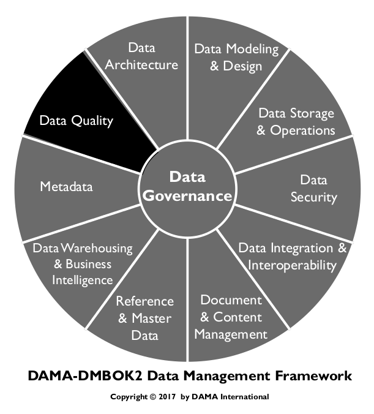
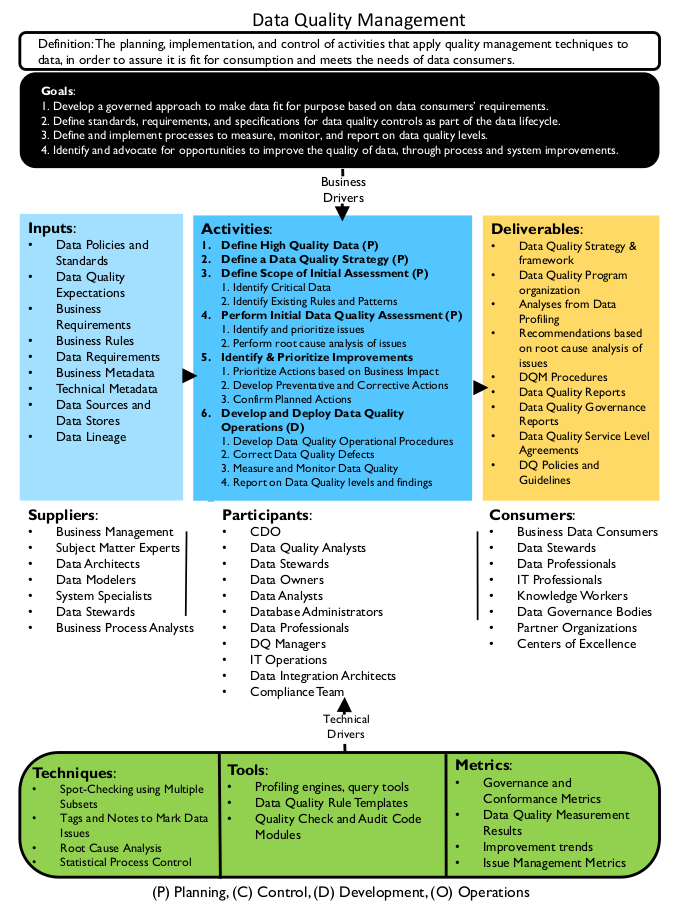
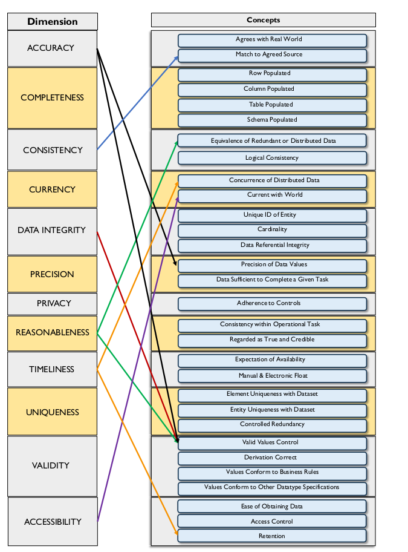
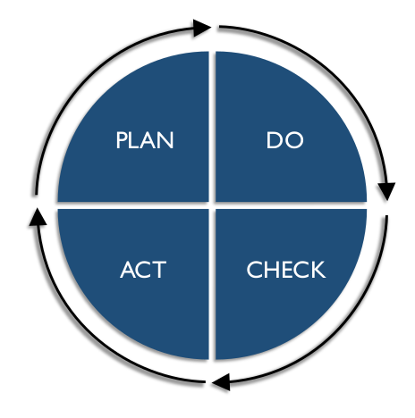
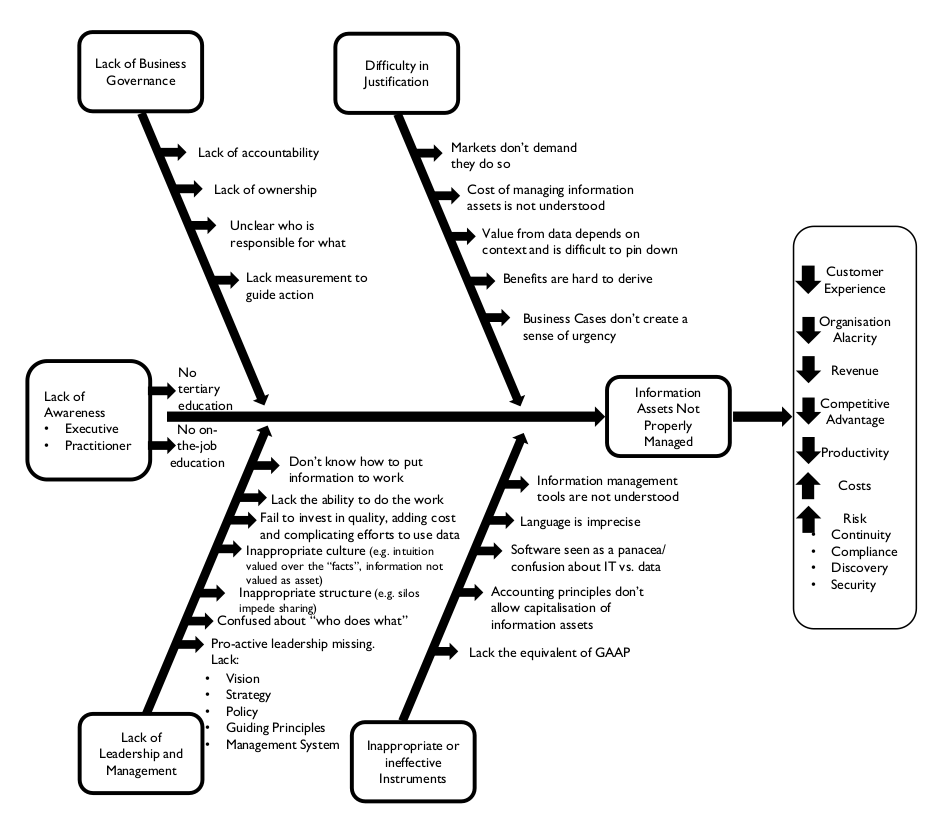
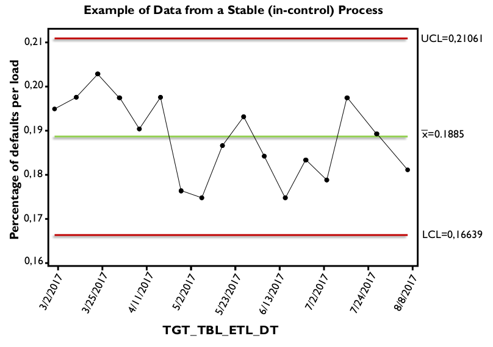

# Data Quality

## 1. Introduction

Effective data management involves a set of complex, interrelated processes that enable an organization to use its data to achieve strategic goals. Data management includes the ability to design data for applications, store and access it securely, share it appropriately, learn from it, and ensure it meets business needs. An assumption underlying assertions about the value of data is that the data itself is reliable and trustworthy. In other words, that it is of high quality.

However, many factors can undermine that assumption by contributing to poor quality data: Lack of understanding about the effects of poor quality data on organizational success, bad planning, ‘siloed’ system design, inconsistent development processes, incomplete documentation, a lack of standards, or a lack of governance. Many organizations fail to define what makes data fit for purpose.

All data management disciplines contribute to the quality of data, and high quality data that supports the organization should be the goal of all data management disciplines. Because uninformed decisions or actions by anyone who interacts with data can result in poor quality data, producing high quality data requires cross- functional commitment and coordination. Organizations and teams should be aware of this and should plan for high quality data, by executing processes and projects in ways that account for risk related to unexpected or unacceptable conditions in the data.

Because no organization has perfect business processes, perfect technical processes, or perfect data management practices, all organizations experience problems related to the quality of their data. Organizations that formally manage the quality of data have fewer problems than those that leave data quality to chance. Formal data quality management is similar to continuous quality management for other products. It includes managing data through its lifecycle by setting standards, building quality into the processes that create, transform, and store data, and measuring data against standards. Managing data to this level usually requires a

Data Quality program team. The Data Quality program team is responsible for engaging both business and technical data management professionals and driving the work of applying quality management techniques to data to ensure that data is fit for consumption for a variety of purposes. The team will likely be involved with a series of projects through which they can establish processes and best practices while addressing high priority data issues.

Because managing the quality of data involves managing the data lifecycle, a Data Quality program will also have operational responsibilities related to data usage. For example, reporting on data quality levels and engaging in the analysis, quantification, and prioritization of data issues. The team is also responsible for working with those who need data to do their jobs to ensure the data meets their needs and working with those who create, update, or delete data in the course of their jobs to ensure they are properly handling the data. Data quality depends on all who interact with the data, not just data management professionals.

As is the case with Data Governance and with data management as a whole, Data Quality Management is a program, not a project. It will include both project and maintenance work, along with a commitment to communications and training. Most importantly, the long-term success of data quality improvement program depends on getting an organization to change its culture and adopt a quality mindset. As stated in The Leader’s Data Manifesto: fundamental, lasting change requires committed leadership and involvement from people at all levels in an organization. People who use data to do their jobs – which in most organizations is a very large percentage of employees – need to drive change. One of the most critical changes to focus on is how their organizations manage and improve the quality of their data. [^71]

Figure 91 Context Diagram: Data Quality

### 1.1 Business Drivers

The business drivers for establishing a formal Data Quality Management program include:

* Increasing the value of organizational data and the opportunities to use it
* Reducing risks and costs associated with poor quality data
* Improving organizational efficiency and productivity
* Protecting and enhancing the organization’s reputation

Organizations that want to get value out of their data recognize that high quality data is more valuable than low quality data. Poor quality data is risk-laden (see Chapter 1). It can damage an organization’s reputation, resulting in fines, lost revenue, lost customers, and negative media exposure. Regulatory requirements often demand high quality data. In addition, many direct costs are associated with poor quality data. For example,

* Inability to invoice correctly
* Increased customer service calls and decreased ability to resolve them
* Revenue loss due to missed business opportunities
* Delay of integration during mergers and acquisitions
* Increased exposure to fraud
* Loss due to bad business decisions driven by bad data
* Loss of business due to lack of good credit standing

Still high quality data is not an end in itself. It is a means to organizational success. Trustworthy data not only mitigates risk and reduces costs, but also improves efficiency. Employees can answer questions more quickly and consistently, when they are working with reliable data. They spend less time trying to figure out if the data is right and more time using the data to gain insight, make decisions, and serve customers.

### 1.2 Goals and Principles

Data Quality programs focus on these general goals:

* Developing a governed approach to make data fit for purpose based on data consumers’ requirements
* Defining standards and specifications for data quality controls as part of the data lifecycle
* Defining and implementing processes to measure, monitor, and report on data quality levels
* Identifying and advocating for opportunities to improve the quality of data, through changes to processes and systems and engaging in activities that measurably improve the quality of data based on data consumer requirements

Data Quality programs should be guided by the following principles:

* **Criticality:** A Data Quality program should focus on the data most critical to the enterprise and its customers. Priorities for improvement should be based on the criticality of the data and on the level of risk if data is not correct.
* **Lifecycle management:** The quality of data should be managed across the data lifecycle, from creation or procurement through disposal. This includes managing data as it moves within and between systems (i.e., each link in the data chain should ensure data output is of high quality).
* **Prevention:** The focus of a Data Quality program should be on preventing data errors and conditions that reduce the usability of data; it should not be focused on simply correcting records.
* **Root cause remediation:** Improving the quality of data goes beyond correcting errors. Problems with the quality of data should be understood and addressed at their root causes, rather than just their symptoms. Because these causes are often related to process or system design, improving data quality often requires changes to processes and the systems that support them.
* **Governance:** Data Governance activities must support the development of high quality data and Data Quality program activities must support and sustain a governed data environment.
* **Standards-driven:** All stakeholders in the data lifecycle have data quality requirements. To the degree possible, these requirements should be defined in the form of measurable standards and expectations against which the quality of data can be measured.
* **Objective measurement and transparency:** Data quality levels need to be measured objectively and consistently. Measurements and measurement methodology should be shared with stakeholders since they are the arbiters of quality.
* **Embedded in business processes:** Business process owners are responsible for the quality of data produced through their processes. They must enforce data quality standards in their processes.
* **Systematically enforced:** System owners must systematically enforce data quality requirements.
* **Connected to service levels:** Data quality reporting and issues management should be incorporated into Service Level Agreements (SLA).

### 1.3 Essential Concepts

#### 1.3.1 Data Quality

The term data quality refers both to the characteristics associated with high quality data and to the processes used to measure or improve the quality of data. These dual usages can be confusing, so it helps to separate them and clarify what constitutes high quality data. [^72]

Data is of high quality to the degree that it meets the expectations and needs of data consumers. That is, if the data is fit for the purposes to which they want to apply it. It is of low quality if it is not fit for those purposes. Data quality is thus dependent on context and on the needs of the data consumer.

One of the challenges in managing the quality of data is that expectations related to quality are not always known. Customers may not articulate them. Often, the people managing data do not even ask about these requirements. However, if data is to be reliable and trustworthy, then data management professionals need to better understand their customers’ quality requirements and how to measure them. This needs to be an ongoing discussion, as requirements change over time as business needs and external forces evolve.

#### 1.3.2 Critical Data

Most organizations have a lot of data, not all of which is of equal importance. One principle of Data Quality Management is to focus improvement efforts on data that is most important to the organization and its customers. Doing so gives the program scope and focus and enables it to make a direct, measurable impact on business needs.

While specific drivers for criticality will differ by industry, there are common characteristics across organizations. Data can be assessed based on whether it is required by:

* Regulatory reporting
* Financial reporting
* Business policy
* Ongoing operations
* Business strategy, especially efforts at competitive differentiation

Master Data is critical by definition. Data sets or individual data elements can be assessed for criticality based on the processes that consume them, the nature of the reports they appear in, or the financial, regulatory, or reputational risk to the organization if something were to go wrong with the data. [^73]

#### 1.3.3 Data Quality Dimensions

A Data Quality dimension is a measurable feature or characteristic of data. The term dimension is used to make the connection to dimensions in the measurement of physical objects (e.g., length, width, height). Data quality dimensions provide a vocabulary for defining data quality requirements. From there, they can be used to define results of initial data quality assessment as well as ongoing measurement. In order to measure the quality of data, an organization needs to establish characteristics that are both important to business processes (worth measuring) and measurable. Dimensions provide a basis for measurable rules, which themselves should be directly connected to potential risks in critical processes.

For example, if the data in the customer email address field is incomplete, then we will not be able to send product information to our customers via email, and we will lose potential sales. Therefore, we will measure the percentage of customers for whom we have usable email addresses, and we will improve our processes until we have a usable email address for at least 98% of our customers.

Many leading thinkers in data quality have published sets of dimensions. 74 The three most influential are described here because they provide insight into how to think about what it means to have high quality data, as well as into how data quality can be measured.

The Strong-Wang framework (1996) focuses on data consumers’ perceptions of data. It describes 15 dimensions across four general categories of data quality:

* Intrinsic DQ
  * Accuracy
  * Objectivity
  * Believability
  * Reputation
* Contextual DQ
  * Value-added
  * Relevancy
  * Timeliness
  * Completeness
  * Appropriate amount of data
* Representational DQ
  * Interpretability
  * Ease of understanding
  * Representational consistency
  * Concise representation
* Accessibility DQ
  * Accessibility
  * Access security

In Data Quality for the Information Age (1996), Thomas Redman formulated a set of data quality dimension rooted in data structure. 75 Redman defines a data item as a “representable triple”: a value from the domain of an attribute within an entity. Dimensions can be associated with any of the component pieces of data – the model (entities and attributes) as well as the values. Redman includes the dimension of representation, which he defines as a set of rules for recording data items. Within these three general categories (data model, data values, representation), he describes more than two dozen dimensions. They include the following:

Data Model:

* **Content:**
  * Relevance of data
  * The ability to obtain the values
  * Clarity of definitions
* **Level of detail:**
  * Attribute granularity
  * Precision of attribute domains
* **Composition:**
  * Naturalness: The idea that each attribute should have a simple counterpart in the real world and that each attribute should bear on a single fact about the entity
  * Identify-ability: Each entity should be distinguishable from every other entity
  * Homogeneity
  * Minimum necessary redundancy
* **Consistency:**
  * Semantic consistency of the components of the model
  * Structure consistency of attributes across entity types
* **Reaction to change:**
  * Robustness
  * Flexibility

Data Values:

* Accuracy
* Completeness
* Currency
* Consistency

Representation:

* Appropriateness
* Interpretability
* Portability
* Format precision
* Format flexibility
* Ability to represent null values
* Efficient use of storage
* Physical instances of data being in accord with their formats

Redman recognizes that consistency of entities, values, and representation can be understood in terms of constraints. Different types of consistency are subject to different kinds of constraints.

In Improving Data Warehouse and Business Information Quality (1999), Larry English presents a comprehensive set of dimensions divided into two broad categories: inherent and pragmatic. [^76] Inherent characteristics are independent of data use. Pragmatic characteristics are associated with data presentation and are dynamic; their value (quality) can change depending on the uses of data.

* Inherent quality characteristics
  * Definitional conformance
  * Completeness of values
  * Validity or business rule conformance
  * Accuracy to a surrogate source
  * Accuracy to reality
  * Precision
  * Non-duplication
  * Equivalence of redundant or distributed data
  * Concurrency of redundant or distributed data
* Pragmatic quality characteristics
  * Accessibility
  * Timeliness
  * Contextual clarity
  * Usability
  * Derivation integrity
  * Rightness or fact completeness

In 2013, DAMA UK produced a white paper describing six core dimensions of data quality:

* **Completeness:** The proportion of data stored against the potential for 100%.
* **Uniqueness:** No entity instance (thing) will be recorded more than once based upon how that thing is identified.
* **Timeliness:** The degree to which data represent reality from the required point in time.
* **Validity:** Data is valid if it conforms to the syntax (format, type, range) of its definition.
* **Accuracy:** The degree to which data correctly describes the ‘real world’ object or event being described.
* **Consistency:** The absence of difference, when comparing two or more representations of a thing against a definition.

The DAMA UK white paper also describes other characteristics that have an impact on quality. While the white paper does not call these dimensions, they work in a manner similar to Strong and Wang’s contextual and representational DQ and English’s pragmatic characteristics.

* **Usability:** Is the data understandable, simple, relevant, accessible, maintainable and at the right level of precision?
* **Timing issues (beyond timeliness itself):** Is it stable yet responsive to legitimate change requests?
* **Flexibility:** Is the data comparable and compatible with other data? Does it have useful groupings and classifications? Can it be repurposed? Is it easy to manipulate?
* **Confidence:** Are Data Governance, Data Protection, and Data Security processes in place? What is the
* **Value:** Is there a good cost / benefit case for the data? Is it being optimally used? Does it endanger reputation of the data, and is it verified or verifiable? people’s safety or privacy, or the legal responsibilities of the enterprise? Does it support or contradict the corporate image or the corporate message?

While there is not a single, agreed-to set of data quality dimensions, these formulations contain common ideas. Dimensions include some characteristics that can be measured objectively (completeness, validity, format conformity) and others that depend on heavily context or on subjective interpretation (usability, reliability, reputation). Whatever names are used, dimensions focus on whether there is enough data (completeness), whether it is right (accuracy, validity), how well it fits together (consistency, integrity, uniqueness), whether it is up-to-date (timeliness), accessible, usable, and secure. Table 29 contains definitions of a set of data quality dimensions, about which there is general agreement and describes approaches to measuring them.

Table 29 Common Dimensions of Data Quality

<table>
  <thead>
    <tr>
      <th>Dimension of Quality</th>
      <th>Description</th>
    </tr>
  </thead>
  <tbody>
    <tr>
      <td>Accuracy</td>
      <td>
        Accuracy refers to the degree that data correctly represents ‘real-life’ entities. Accuracy is difficult to measure, unless an organization can reproduce data collection or manually confirm accuracy of records. Most measures of accuracy rely on comparison to a data source that has been verified as accurate, such as a system of record or data from a reliable source (e.g., Dun and Bradstreet Reference Data).
      </td>
    </tr>
    <tr>
      <td>Completeness</td>
      <td>
        Completeness refers to whether all required data is present. Completeness can be measured at the data set, record, or column level. Does the data set contain all the records expected? Are records populated correctly? (Records with different statuses may have different expectations for completeness.) Are columns/attributes populated to the level expected? (Some columns are mandatory. Optional columns are populated only under specific conditions.) Assign completeness rules to a data set with varying levels of constraint: Mandatory attributes that require a value, data elements with conditional and optional values, and inapplicable attribute values. Data set level measurements may require comparison to a source of record or may be based on historical levels of population.
      </td>
    </tr>
    <tr>
      <td>Consistency</td>
      <td>
        Consistency can refer to ensuring that data values are consistently represented within a data set and between data sets, and consistently associated across data sets. It can also refer to the size and composition of data sets between systems or across time. Consistency may be defined between one set of attribute values and another attribute set within the same record (record-level consistency), between one set of attribute values and another attribute set in different records (cross-record consistency), or between one set of attribute values and the same attribute set within the same record at different points in time (temporal consistency). Consistency can also be used to refer to consistency of format. Take care not to confuse consistency with accuracy or correctness. Characteristics that are expected to be consistent within and across data sets can be used as the basis for standardizing data. Data Standardization refers to the conditioning of input data to ensure that data meets rules for content and format. Standardizing data enables more effective matching and facilitates consistent output. Encapsulate consistency constraints as a set of rules that specify consistent relationships between values of attributes, either across a record or message, or along all values of a single attribute (such as a range or list of valid values). For example, one might expect that the number of transactions each day does not exceed 105% of the running average number of transactions for the previous 30 days.
      </td>
    </tr>
    <tr>
      <td>Integrity</td>
      <td>
        Data Integrity (or Coherence) includes ideas associated with completeness, accuracy, and consistency. In data, integrity usually refers to either referential integrity (consistency between data objects via a reference key contained in both objects) or internal consistency within a data set such that there are no holes or missing parts. Data sets without integrity are seen as corrupted, or have data loss. Data sets without referential integrity have ‘orphans’ – invalid reference keys, or ‘duplicates’ – identical rows which may negatively affect aggregation functions. The level of orphan records can be measured as a raw count or as a percentage of the data set.
      </td>
    </tr>
    <tr>
      <td>Reasonability</td>
      <td>
        Reasonability asks whether a data pattern meets expectations. For example, whether a distribution of sales across a geographic area makes sense based on what is known about the customers in that area. Measurement of reasonability can take different forms. For example, reasonability may be based on comparison to benchmark data, or past instances of a similar data set (e.g., sales from the previous quarter). Some ideas about reasonability may be perceived as subjective. If this is the case, work with data consumers to articulate the basis of their expectations of data to formulate objective comparisons. Once benchmark measurements of reasonability are established, these can be used to objectively compare new instances of the same data set in order to detect change. (See Section 4.5.)
      </td>
    </tr>
    <tr>
      <td>Timeliness</td>
      <td>
        The concept of data Timeliness refers to several characteristics of data. Measures of timeliness need to be understood in terms of expected volatility – how frequently data is likely to change and for what reasons. Data currency is the measure of whether data values are the most up-to-date version of the information. Relatively static data, for example some Reference Data values like country codes, may remain current for a long period. Volatile data remains current for a short period. Some data, for example, stock prices on financial web pages, will often be shown with an as-of-time, so that data consumers understand the risk that the data has changed since it was recorded. During the day, while the markets are open, such data will be updated frequently. Once markets close, the data will remain unchanged, but will still be current, since the market itself is inactive. Latency measures the time between when the data was created and when it was made available for use. For example, overnight batch processing can give a latency of 1 day at 8am for data entered into the system during the prior day, but only one hour for data generated during the batch processing. (See Chapter 8.)
      </td>
    </tr>
    <tr>
      <td>Uniqueness / Deduplication</td>
      <td>
        Uniqueness states that no entity exists more than once within the data set. Asserting uniqueness of the entities within a data set implies that a key value relates to each unique entity, and only that specific entity, within the data set. Measure uniqueness by testing against key structure. (See Chapter 5.)
      </td>
    </tr>
    <tr>
      <td>Validity</td>
      <td>Validity refers to whether data values are consistent with a defined domain of values. A domain of values may be a defined set of valid values (such as in a reference table), a range of values, or value that can be determined via rules. The data type, format, and precision of expected values must be accounted for in defining the domain. Data may also only be valid for a specific length of time, for example data that is generated from RFID (radio frequency ID) or some scientific data sets. Validate data by comparing it to domain constraints. Keep in mind that data may be valid (i.e., it may meet domain requirements) and still not be accurate or correctly associated with particular records.
      </td>
    </tr>
  </tbody>
</table>

Figure 92 aligns data quality dimensions and concepts associated with those dimensions. The arrows indicate significant overlaps between concepts and also demonstrate that there is not agreement on a specific set. For example, the dimension of accuracy is associated with ‘agrees with real world’ and ‘match to agreed source’ and also to the concepts associated with validity, such as ‘derivation correct’.

Figure 92 Relationship Between Data Quality Dimensions [^77]

#### 1.3.4 Data Quality and Metadata

Metadata is critical to managing the quality of data. The quality of data is based on how well it meets the requirements of data consumers. Metadata defines what the data represents. Having a robust process by which data is defined supports the ability of an organization to formalize and document the standards and requirements by which the quality of data can be measured. Data quality is about meeting expectations. Metadata is a primary means of clarifying expectations.

Well-managed Metadata can also support the effort to improve the quality of data. A Metadata repository can house results of data quality measurements so that these are shared across the organization and the Data Quality team can work toward consensus about priorities and drivers for improvement. (See Chapter 12.)

#### 1.3.5 Data Quality ISO Standard

ISO 8000, the international standard for data quality, is being developed to enable the exchange of complex data in an application-neutral form. In the introduction to the standard, ISO asserts: “The ability to create, collect, store, maintain, transfer, process and present data to support business processes in a timely and cost effective manner requires both an understanding of the characteristics of the data that determine its quality, and an ability to measure, manage and report on data quality.”

ISO 8000 defines characteristics that can be tested by any organization in the data supply chain to objectively determine conformance of the data to ISO 8000. [^78]

The first published part of ISO 8000 (part 110, published in 2008) focused on the syntax, semantic encoding, and conformance to the data specification of Master Data. Other parts projected for the standard include part 100 - Introduction, part 120 - Provenance, part 130 -Accuracy, and part 140 - Completeness. [^79] ISO defines quality data as “portable data that meets stated requirements.” [^80] The data quality standard is related to the ISO’s overall work on data portability and preservation. Data is considered ‘portable’ if it can be separated from a software application. Data that can only be used or read using a specific licensed software application is subject to the terms of the software license. An organization may not be able to use data it created unless that data can be detached from the software that was used to create it.

To meet stated requirements requires that these requirements be defined in a clear, unambiguous manner. ISO 8000 is supported through ISO 22745, a standard for defining and exchanging Master Data. ISO 22745 defines how data requirement statements should be constructed, provides examples in XML, and defines a format for the exchange of encoded data. [^81] ISO 22745 creates portable data by labeling the data using an ISO 22745 compliant Open Technical Dictionary such as the ECCMA Open Technical Dictionary (eOTD).

The intention of ISO 8000 is to help organizations define what is and is not quality data, enable them to ask for quality data using standard conventions, and verify that they have received quality data using those same standards. When standards are followed, requirements can be confirmed through a computer program. ISO 8000 - Part 61 Information and data quality management process reference model is under development. [^82]

This standard will describe the structure and organization of data quality management, including:

* Data Quality Planning
* Data Quality Control
* Data Quality Assurance
* Data Quality Improvement

#### 1.3.6 Data Quality Improvement Lifecycle

Most approaches to improving data quality are based on the techniques of quality improvement in the manufacture of physical products. 83 In this paradigm, data is understood as the product of a set of processes. At its simplest, a process is defined as a series of steps that turns inputs into outputs. A process that creates data may consist of one-step (data collection) or many steps: data collection, integration into a data warehouse, aggregation in a data mart, etc. At any step, data can be negatively affected. It can be collected incorrectly, dropped or duplicated between systems, aligned or aggregated incorrectly, etc. Improving data quality requires the ability to assess the relationship between inputs and outputs, in order to ensure that inputs meet the requirements of the process and that outputs conform to expectations. Since outputs from one process become inputs to other processes, requirements must be defined along the whole data chain.

A general approach to data quality improvement, shown in Figure 93, is a version of the Shewhart / Deming cycle. [^84] Based on the scientific method, the Shewhart / Deming cycle is a problem-solving model known as ‘plan-do-check-act’. Improvement comes through a defined set of steps. The condition of data must be measured against standards and, if it does not meet standards, root cause(s) of the discrepancy from standards must be identified and remediated. Root causes may be found in any of the steps of the process, technical or non-technical. Once remediated, data should be monitored to ensure that it continues to meet requirements.

Figure 93 The Shewhart Chart

For a given data set, a Data Quality Management cycle begins by identifying the data that does not meet data consumers’ requirements and data issues that are obstacles to the achievement of business objectives. Data needs to be assessed against key dimensions of quality and known business requirements. Root causes of issues will need to be identified so that stakeholders can understand the costs of remediation and the risks of not remediating the issues. This work is often done in conjunction with Data Stewards and other stakeholders.

In the Plan stage, the Data Quality team assesses the scope, impact, and priority of known issues, and evaluates alternatives to address them. This plan should be based on a solid foundation of analysis of the root causes of issues. From knowledge of the causes and the impact of the issues, cost / benefit can be understood, priority can be determined, and a basic plan can be formulated to address them.

In the Do stage, the DQ team leads efforts to address the root causes of issues and plan for ongoing monitoring of data. For root causes that are based on non-technical processes, the DQ team can work with process owners to implement changes. For root causes that require technical changes, the DQ team should work with technical teams to ensure that requirements are implemented correctly and that technical changes do not introduce errors.

The Check stage involves actively monitoring the quality of data as measured against requirements. As long as data meets defined thresholds for quality, additional actions are not required. The processes will be considered under control and meeting business requirements. However, if the data falls below acceptable quality thresholds, then additional action must be taken to bring it up to acceptable levels.

The Act stage is for activities to address and resolve emerging data quality issues. The cycle restarts, as the causes of issues are assessed and solutions proposed. Continuous improvement is achieved by starting a new cycle. New cycles begin as:

* Existing measurements fall below thresholds
* New data sets come under investigation
* New data quality requirements emerge for existing data sets
* Business rules, standards, or expectations change

The cost of getting data right the first time is cheaper than the costs from getting data wrong and fixing it later. Building quality into the data management processes from the beginning costs less than retrofitting it. Maintaining high quality data throughout the data lifecycle is less risky than trying to improve quality in an existing process. It also creates a far lower impact on the organization. Establishing criteria for data quality at the beginning of a process or system build is one sign of a mature Data Management Organization. Doing so takes governance and discipline, as well as cross-functional collaboration.

#### 1.3.7 Data Quality Business Rule Types

Business rules describe how business should operate internally, in order to be successful and compliant with the outside world. Data Quality Business Rules describe how data should exist in order to be useful and usable within an organization. These rules can be aligned with dimensions of quality and used to describe data quality requirements. For example, a business rule that all state code fields must comply with the US State Abbreviations can be enforced by data entry pick lists and data integration lookups. The level of valid or invalid records can then be measured.

Business rules are commonly implemented in software, or by using document templates for data entry. Some common simple business rule types are:

* **Definitional conformance:** Confirm that the same understanding of data definitions is implemented and used properly in processes across the organization. Confirmation includes algorithmic agreement on calculated fields, including any time, or local constraints, and rollup and status interdependence rules.
* **Value presence and record completeness:** Rules defining the conditions under which missing values are acceptable or unacceptable.
* **Format compliance:** One or more patterns specify values assigned to a data element, such as standards for formatting telephone numbers.
* **Value domain membership:** Specify that a data element’s assigned value is included in those enumerated in a defined data value domain, such as 2-Character United States Postal Codes for a STATE field.
* **Range conformance:** A data element assigned value must be within a defined numeric, lexicographic, or time range, such as greater than 0 and less than 100 for a numeric range.
* **Mapping conformance:** Indicating that the value assigned to a data element must correspond to one selected from a value domain that maps to other equivalent corresponding value domain(s). The STATE data domain again provides a good example, since State values may be represented using different value domains (USPS Postal codes, FIPS 2-digit codes, full names), and these types of rules validate that ‘AL’ and ‘01’ both map to ‘Alabama.’
* **Consistency rules:** Conditional assertions that refer to maintaining a relationship between two (or more) attributes based on the actual values of those attributes. For example, address validation where postal codes correspond to particular States or Provinces.
* **Accuracy verification:** Compare a data value against a corresponding value in a system of record or other verified source (e.g., marketing data purchased from a vendor) to verify that the values match.
* **Uniqueness verification:** Rules that specify which entities must have a unique representation and whether one and only one record exists for each represented real world object.
* **Timeliness validation:** Rules that indicate the characteristics associated with expectations for accessibility and availability of data.

Other types of rules may involve aggregating functions applied to sets of data instances (see Section 4.5).
Examples of aggregation checks include:

* Validate reasonableness of the number of records in a file. This requires keeping statistics over time to generate trends.
* Validate reasonableness of an average amount calculated from a set of transactions. This requires establishing thresholds for comparison, and may be based on statistics over time.
* Validate the expected variance in the count of transactions over a specified timeframe. This requires keeping statistics over time and using them to establish thresholds.

#### 1.3.8 Common Causes of Data Quality Issues

Data quality issues can emerge at any point in the data lifecycle, from creation to disposal. When investigating root causes, analysts should look for potential culprits, like problems with data entry, data processing, system design, and manual intervention in automated processes. Many issues will have multiple causes and contributing factors (especially if people have created ways to work around them). These causes of issues also imply ways to prevent issues: through improvement to interface design, testing of data quality rules as part of processing, a focus on data quality within system design, and strict controls on manual intervention in automated processes.

##### 1.3.8.1 Issues Caused by Lack of Leadership

Many people assume that most data quality issues are caused by data entry errors. A more sophisticated understanding recognizes that gaps in or poor execution of business and technical processes cause many more problems than mis-keying. However, common sense says and research indicates that many data quality problems are caused by a lack of organizational commitment to high quality data, which itself stems from a lack of leadership, in the form of both governance and management.

Every organization has information and data assets that are of value to its operations. Indeed, the operations of every organization depend on the ability to share information. Despite this, few organizations manage these assets with rigor. Within most organizations, data disparity (differences in data structure, format, and use of values) is a larger problem than just simple errors; it can be a major obstacle to the integration of data. One of the reasons data stewardship programs focus on defining terms and consolidating the language around data is because that is the starting point for getting to more consistent data.

Many governance and information asset programs are driven solely by compliance, rather than by the potential value to be derived from data as an asset. A lack of recognition on the part of leadership means a lack of commitment within an organization to managing data as an asset, including managing its quality (Evans and Price, 2012). (See Figure 94.)

Barriers to effective management of data quality include: [^85]

* Lack of awareness on the part of leadership and staff
* Lack of business governance
* Lack of leadership and management
* Difficulty in justification of improvements
* Inappropriate or ineffective instruments to measure value

These barriers have negative effects on customer experience, productivity, morale, organizational effectiveness, revenue, and competitive advantage. They increase costs of running the organization and introduce risks as well. (See Chapter 11.)

##### 1.3.8.2 Issues Caused by Data Entry Processes

* **Data entry interface issues:** Poorly designed data entry interfaces can contribute to data quality issues. If a data entry interface does not have edits or controls to prevent incorrect data from being put in the system data processors are likely to take shortcuts, such as skipping non-mandatory fields and failing to update defaulted fields.
* **List entry placement:** Even simple features of data entry interfaces, such as the order of values within a drop-down list, can contribute to data entry errors.
* **Field overloading:** Some organizations re-use fields over time for different business purposes rather than making changes to the data model and user interface. This practice results in inconsistent and confusing population of the fields.
* **Training issues:** Lack of process knowledge can lead to incorrect data entry, even if controls and edits are in place. If data processors are not aware of the impact of incorrect data or if they are incented for speed, rather than accuracy, they are likely to make choices based on drivers other than the quality of the data.

Figure 94 Barriers to Managing Information as a Business Asset [^86]

* **Changes to business processes:** Business processes change over time, and with these changes new business rules and data quality requirements are introduced. However, business rule changes are not always incorporated into systems in a timely manner or comprehensively. Data errors will result if an interface is not upgraded to accommodate new or changed requirements. In addition, data is likely to be impacted unless changes to business rules are propagated throughout the entire system.
* **Inconsistent business process execution:** Data created through processes that are executed inconsistently is likely to be inconsistent. Inconsistent execution may be due to training or documentation issues as well as to changing requirements.

##### 1.3.8.3 Issues Caused by Data Processing Functions

* **Incorrect assumptions about data sources:** Production issues can occur due to errors or changes, inadequate or obsolete system documentation, or inadequate knowledge transfer (for example, when SMEs leave without documenting their knowledge). System consolidation activities, such as those associated with mergers and acquisitions, are often based on limited knowledge about the relationship between systems. When multiple source systems and data feeds need to be integrated there is always a risk that details will be missed, especially with varying levels of source knowledge available and tight timelines.
* **Stale business rules:** Over time, business rules change. They should be periodically reviewed and updated. If there is automated measurement of rules, the technical process for measuring rules should also be updated. If it is not updated, issues may not be identified or false positives will be produced (or both).
* **Changed data structures:** Source systems may change structures without informing downstream consumers (both human and system) or without providing sufficient time to account for the changes. This can result in invalid values or other conditions that prevent data movement and loading, or in more subtle changes that may not be detected immediately.

##### 1.3.8.4 Issues Caused by System Design

* **Failure to enforce referential integrity:** Referential integrity is necessary to ensure high quality data at an application or system level. If referential integrity is not enforced or if validation is switched off (for example, to improve response times), various data quality issues can arise:
  * Duplicate data that breaks uniqueness rules
  * Orphan rows, which can be included in some reports and excluded from others, leading to multiple values for the same calculation
  * Inability to upgrade due to restored or changed referential integrity requirements
  * Inaccurate data due to missing data being assigned default values
* **Failure to enforce uniqueness constraints:** Multiple copies of data instances within a table or file expected to contain unique instances. If there are insufficient checks for uniqueness of instances, or if the unique constraints are turned off in the database to improve performance, data aggregation results can be overstated.
* **Coding inaccuracies and gaps:** If the data mapping or layout is incorrect, or the rules for processing the data are not accurate, the data processed will have data quality issues, ranging from incorrect calculations to data being assigned to or linked to improper fields, keys, or relationships.
* **Data model inaccuracies:** If assumptions within the data model are not supported by the actual data, there will be data quality issues ranging from data loss due to field lengths being exceeded by the actual data, to data being assigned to improper IDs or keys.
* **Field overloading:** Re-use of fields over time for different purposes, rather than changing the data model or code can result in confusing sets of values, unclear meaning, and potentially, structural problems, like incorrectly assigned keys.
* **Temporal data mismatches:** In the absence of a consolidated data dictionary, multiple systems could implement disparate date formats or timings, which in turn lead to data mismatch and data loss when data synchronization takes place between different source systems.
* **Weak Master Data Management:** Immature Master Data Management can lead to choosing unreliable sources for data, which can cause data quality issues that are very difficult to find until the assumption that the data source is accurate is disproved.
* **Data duplication:** Unnecessary data duplication is often a result of poor data management. There are two main types of undesirable duplication issues:
  * **Single Source – Multiple Local Instances:** For example, instances of the same customer in multiple (similar or identical) tables in the same database. Knowing which instance is the most accurate for use can be difficult without system-specific knowledge.
  * **Multiple Sources – Single Instance:** Data instances with multiple authoritative sources or systems of record. For example, single customer instances coming from multiple point-of-sale systems. When processing this data for use, there can be duplicate temporary storage areas. Merge rules determine which source has priority over others when processing into permanent production data areas.

##### 1.3.8.5 Issues Caused by Fixing Issues

Manual data patches are changes made directly on the data in the database, not through the business rules in the application interfaces or processing. These are scripts or manual commands generally created in a hurry and used to ‘fix’ data in an emergency such as intentional injection of bad data, lapse in security, internal fraud, or external source for business disruption.

Like any untested code, they have a high risk of causing further errors through unintended consequences, by changing more data than required, or not propagating the patch to all historical data affected by the original issue. Most such patches also change the data in place, rather than preserving the prior state and adding corrected rows.

These changes are generally NOT undo-able without a complete restore from backup as there is only the database log to show the changes. Therefore, these shortcuts are strongly discouraged – they are opportunities for security breaches and business disruption longer than a proper correction would cause. All changes should go through a governed change management process.

#### 1.3.9 Data Profiling

Data Profiling is a form of data analysis used to inspect data and assess quality. Data profiling uses statistical techniques to discover the true structure, content, and quality of a collection of data (Olson, 2003). A profiling engine produces statistics that analysts can use to identify patterns in data content and structure. For example:

* **Counts of nulls:** Identifies nulls exist and allows for inspection of whether they are allowable or not
* **Max/Min value:** Identifies outliers, like negatives
* **Max/Min length:** Identifies outliers or invalids for fields with specific length requirements
* **Frequency distribution of values for individual columns:** Enables assessment of reasonability (e.g., distribution of country codes for transactions, inspection of frequently or infrequently occurring values, as well as the percentage of the records populated with defaulted values)
* **Data type and format:** Identifies level of non-conformance to format requirements, as well as identification of unexpected formats (e.g., number of decimals, embedded spaces, sample values)

Profiling also includes cross-column analysis, which can identify overlapping or duplicate columns and expose embedded value dependencies. Inter-table analysis explores overlapping values sets and helps identify foreign key relationships. Most data profiling tools allow for drilling down into the analyzed data for further investigation.

Results from the profiling engine must be assessed by an analyst to determine whether data conforms to rules and other requirements. A good analyst can use profiling results to confirm known relationships and uncover hidden characteristics and patterns within and between data sets, including business rules, and validity constraints. Profiling is usually used as part of data discovery for projects (especially data integration projects; see Chapter 8) or to assess the current state of data that is targeted for improvement. Results of data profiling can be used to identify opportunities to improve the quality of both data and Metadata (Olson, 2003; Maydanchik, 2007).

While profiling is an effective way to understand data, it is just a first step to data quality improvement. It enables organizations to identify potential problems. Solving problems requires other forms of analysis, including business process analysis, analysis of data lineage, and deeper data analysis that can help isolate root causes of problems.

##### 1.3.10 Data Quality and Data Processing

While the focus of data quality improvement efforts is often on the prevention of errors, data quality can also be improved through some forms of data processing. (See Chapter 8.)

##### 1.3.10.1 Data Cleansing

Data Cleansing or Scrubbing transforms data to make it conform to data standards and domain rules. Cleansing includes detecting and correcting data errors to bring the quality of data to an acceptable level. It costs money and introduces risk to continuously remediate data through cleansing. Ideally, the need for data cleansing should decrease over time, as root causes of data issues are resolved. The need for data cleansing can be addressed by:

* Implementing controls to prevent data entry errors
* Correcting the data in the source system
* Improving the business processes that create the data

In some situations, correcting on an ongoing basis may be necessary, as re-processing the data in a midstream system is cheaper than any other alternative.

##### 1.3.10.2 Data Enhancement

Data enhancement or enrichment is the process of adding attributes to a data set to increase its quality and usability. Some enhancements are gained by integrating data sets internal to an organization. External data can also be purchased to enhance organizational data (see Chapter 10). Examples of data enhancement include:

* **Time/Date stamps:** One way to improve data is to document the time and date that data items are created, modified, or retired, which can help to track historical data events. If issues are detected with the data, timestamps can be very valuable in root cause analysis, because they enable analysts to isolate the timeframe of the issue.
* **Audit data:** Auditing can document data lineage, which is important for historical tracking as well as validation.
* **Reference vocabularies:** Business specific terminology, ontologies, and glossaries enhance understanding and control while bringing customized business context.
* **Contextual information:** Adding context such as location, environment, or access methods and tagging data for review and analysis.
* **Geographic information:** Geographic information can be enhanced through address standardization and geocoding, which includes regional coding, municipality, neighborhood mapping, latitude / longitude pairs, or other kinds of location-based data.
* **Demographic information:** Customer data can be enhanced through demographic information, such as age, marital status, gender, income, or ethnic coding. Business entity data can be associated with annual revenue, number of employees, size of occupied space, etc.
* **Psychographic information:** Data used to segment the target populations by specific behaviors, habits, or preferences, such as product and brand preferences, organization memberships, leisure activities, commuting transportation style, shopping time preferences, etc.
* **Valuation information:** Use this kind of enhancement for asset valuation, inventory, and sale.

##### 1.3.10.3 Data Parsing and Formatting

Data Parsing is the process of analyzing data using pre-determined rules to define its content or value. Data parsing enables the data analyst to define sets of patterns that feed into a rule engine used to distinguish between valid and invalid data values. Matching specific pattern(s) triggers actions.

Data parsing assigns characteristics to the data values appearing in a data instance, and those characteristics help in determining potential sources for added benefits. For example, if an attribute called ‘name’ can be determined to have values belonging to ‘business name’ embedded within it, then the data value is identified as the name of a business rather than the name of a person. Use the same approach for any situation in which data values organize into semantic hierarchies such as sub-parts, parts, and assemblies.

Many data quality issues involve situations where variation in data values representing similar concepts introduces ambiguity. Extract and rearrange the separate components (commonly referred to as ‘tokens’) can be extracted and rearranged into a standard representation to create a valid pattern. When an invalid pattern is recognized, the application may attempt to transform the invalid value into one that meets the rules. Perform standardization by mapping data from some source pattern into a corresponding target representation.

For example, consider the different ways telephone numbers expected to conform to a numbering plan are formatted. While some have digits, some have alphabetic characters, and all use different special characters for separation. People can recognize each one as a telephone number. However, to determine if these numbers are accurate (perhaps by comparing them to a master customer directory), or to investigate whether duplicate numbers exist when there should be only one for each supplier, the values must be parsed into their component segments (area code, exchange, and line number) and then transformed into a standard format.

Another good example is a customer name, since names may be represented in thousands of different forms. A good standardization tool will be able to parse the different components of a customer name, such as given name, middle name, family name, initials, titles, generational designations, and then rearrange those components into a canonical representation that other data services will be able to manipulate.

The human ability to recognize familiar patterns contributes to an ability to characterize variant data values belonging to the same abstract class of values; people recognize different types of telephone numbers because they conform to frequently used patterns. An analyst describes the format patterns that all represent a data object, such as Person Name, Product Description, and so on. A data quality tool parses data values that conform to any of those patterns, and even transforms them into a single, standardized form that will simplify the assessment, similarity analysis, and remediation processes. Pattern-based parsing can automate the recognition and subsequent standardization of meaningful value components.

##### 1.3.10.4 Data Transformation and Standardization

During normal processing, data rules trigger and transform the data into a format that is readable by the target architecture. However, readable does not always mean acceptable. Rules are created directly within a data integration stream, or rely on alternate technologies embedded in or accessible from within a tool. Data transformation builds on these types of standardization techniques. Guide rule-based transformations by mapping data values in their original formats and patterns into a target representation. Parsed components of a pattern are subjected to rearrangement, corrections, or any changes as directed by the rules in the knowledge base. In fact, standardization is a special case of transformation, employing rules that capture context, linguistics, and idioms recognized as common over time, through repeated analysis by the rules analyst or tool vendor. (See Chapter 3.)

## 2. Activities

### 2.1 Define High Quality Data

Many people recognize poor quality data when they see it. Fewer are able to define what they mean by high quality data. Alternatively, they define it in very general term: “The data has to be right.” “We need accurate data.” High quality data is fit for the purposes of data consumers. Before launching a Data Quality program, it is beneficial to understand business needs, define terms, identify organizational pain points, and start to build consensus about the drivers and priorities for data quality improvement. Ask a set of questions to understand current state and assess organizational readiness for data quality improvement:

* What do stakeholders mean by ‘high quality data’?
* What is the impact of low quality data on business operations and strategy?
* How will higher quality data enable business strategy?
* What priorities drive the need for data quality improvement?
* What is the tolerance for poor quality data?
* What governance is in place to support data quality improvement?
* What additional governance structures will be needed?

Getting a comprehensive picture of the current state of data quality in an organization requires approaching the question from different perspectives:

* An understanding of business strategy and goals
* Interviews with stakeholders to identify pain points, risks, and business drivers
* Direct assessment of data, through profiling and other form of analysis
* Documentation of data dependencies in business processes
* Documentation of technical architecture and systems support for business processes

This kind of assessment can reveal a significant number of opportunities. These need to be prioritized based on the potential benefit to the organization. Using input from stakeholders, including Data Stewards and business and technical SMEs, the Data Quality team should define the meaning of data quality and propose program priorities.

### 2.2 Define a Data Quality Strategy

Improving data quality requires a strategy that accounts for the work that needs to be done and the way people will execute it. Data quality priorities must align with business strategy. Adopting or developing a framework and methodology will help guide both strategy and tactics while providing a means to measure progress and impacts. A framework should include methods to:

* Understand and prioritize business needs
* Identify the data critical to meeting business needs
* Define business rules and data quality standards based on business requirements
* Assess data against expectations
* Share findings and get feedback from stakeholders
* Prioritize and manage issues
* Identify and prioritize opportunities for improvement
* Measure, monitor, and report on data quality
* Manage Metadata produced through data quality processes
* Integrate data quality controls into business and technical processes

A framework should also account for how to organize for data quality and how to leverage data quality tools. As noted in the chapter introduction, improving data quality requires a Data Quality program team to engage business and technical staff and define a program of work that addresses critical issues, defines best practices, and puts in place operational processes that support ongoing management of data quality. Often such a team will be part of the Data Management Organization. DQ analysts will need to work closely with Data Stewards at all levels. They should also influence policy, including policy about business processes and systems development. However, such a team will not be able to solve all of an organization’s data quality challenges. DQ work and a commitment to high quality data need to become embedded in organizational practices. The DQ Strategy should account for how to extend best practices. (See Chapter 17.)

### 2.3 Identify Critical Data and Business Rules

Not all data is of equal importance. Data Quality Management efforts should focus first on the most important data in the organization: data that, if it were of higher quality, would provide greater value to the organization and its customers. Data can be prioritized based on factors such as regulatory requirements, financial value, and direct impact on customers. Often, data quality improvement efforts start with Master Data, which is, by definition, among the most important data in any organization. The result of the importance analysis is a ranked list of data, which the Data Quality team can use to focus their work efforts.

Having identified the critical data, Data Quality analysts need to identify business rules that describe or imply expectations about the quality characteristics of data. Often rules themselves are not explicitly documented. They may need to be reverse-engineered through analysis of existing business processes, workflows, regulations, policies, standards, system edits, software code, triggers and procedures, status code assignment and use, and plain old common sense. For example, if a marketing company wants to target efforts at people in a specific demographic, then potential indexes of data quality might be the level and reasonability of population in demographic fields like birth date, age, gender, and household income.

Most business rules are associated with how data is collected or created, but data quality measurement centers around whether data is fit for use. The two (data creation and data use) are related. People want to use data because of what it represents and why it was created. For example, to understand an organization’s sales performance during a specific quarter or over time depends on having reliable data about the sales process (number and type of units sold, volume sold to existing customers vs. new customers, etc.).

It is not possible to know all the ways that data might be used, but it is possible to understand the process and rules by which data was created or collected. Measurements that describe whether data is fit for use should be developed in relation to known uses and measurable rules based on dimensions of data quality: completeness, conformity, validity, integrity, etc. that provide the basis for meaningful metrics. Dimensions of quality enable analysts to characterize both rules (field X is mandatory and must be populated) and findings (e.g., the field is not populated in 3% of the records; the data is only 97% complete).

At the field or column level, rules can be straightforward. Completeness rules are a reflection of whether a field is mandatory or optional, and, if optional, the conditions under which it should be populated. Validity rules are dependent on stipulating the domain of valid values and, in some cases, the relationship between fields. For example, a US ZIP Code needs to be valid, in and of itself, and correctly associated with a US State code. Rules should also be defined at the data set level. For example, every customer must have a valid mailing address.

Defining data quality rules is challenging because most people are not used to thinking about data in terms of rules. It may be necessary to get at the rules indirectly, by asking stakeholders about the input and output requirements of a business process. It also helps to ask about pain points, what happens when data is missing or incorrect, how they identify issues, how they recognize bad data, etc. Keep in mind that it is not necessary to know all the rules in order to assess data. Discovery and refinement of rules is an ongoing process. One of the best ways to get at rules is to share results of assessments. These results often give stakeholders a new perspective on the data from which they can articulate rules that tell them what they need to know about the data.

### 2.4 Perform an Initial Data Quality Assessment

Once the most critical business needs and the data that supports them have been identified, the most important part of the data quality assessment is actually looking at that data, querying it to understand data content and relationships, and comparing actual data to rules and expectations. The first time this is done, analysts will discover many things: undocumented relationships and dependencies within the data, implied rules, redundant data, contradictory data, etc., as well as data that actually does conform to rules. With the help of data stewards, other SMEs, and data consumers, DQ analysts will need to sort out and prioritize findings.

The goal of an initial data quality assessment is to learn about the data in order to define an actionable plan for improvement. It is usually best to start with a small, focused effort – a basic proof of concept – to demonstrate how the improvement process works. Steps include:

* Define the goals of the assessment; these will drive the work
* Identify the data to be assessed; focus should be on a small data set, even a single data element, or a specific data quality problem
* Identify uses of the data and the consumers of the data
* Identify known risks with the data to be assessed, including the potential impact of data issues onorganizational processes
* Inspect the data based on known and proposed rules
* Document levels of non-conformance and types of issues
* Perform additional, in-depth analysis based on initial findings in order to
  * Quantify findings
  * Prioritize issues based on business impact
  * Develop hypotheses about root causes of data issues
* Meet with Data Stewards, SMEs, and data consumers to confirm issues and priorities
* Use findings as a foundation for planning
  * Remediation of issues, ideally at their root causes
  * Controls and process improvements to prevent issues from recurring
  * Ongoing controls and reporting

### 2.5 Identify and Prioritize Potential Improvements

Having proven that the improvement process can work, the next goal is to apply it strategically. Doing so requires identifying and prioritizing potential improvements. Identification may be accomplished by full-scale data profiling of larger data sets to understand the breadth of existing issues. It may also be accomplished by other means, such as interviewing stakeholders about the data issues that impact them and following up with analysis of the business impact of those issues. Ultimately, prioritization requires a combination of data analysis and discussion with stakeholders.

The steps to perform a full data profiling and analysis are essentially the same as those in performing a small-scale assessment: define goals, understand data uses and risks, measure against rules, document and confirm findings with SMEs, use this information to prioritize remediation and improvement efforts. However, there are sometimes technical obstacles to full-scale profiling. And the effort will need to be coordinated across a team of analysts and overall results will need to be summarized and understood if an effective action plan is to be put in place. Large-scale profiling efforts, like those on a smaller scale, should still focus on the most critical data.

Profiling data is only the first step in analysis of data quality issues. It helps identify issues, but does not identify root causes, nor does it determine the impact of issues to business processes. Determining impact requires input from stakeholders along the data chain. When planning large scale profiling, ensure that time is allocated to share results, prioritize problems, and determine which issues require in-depth analysis.

### 2.6 Define Goals for Data Quality Improvement

The knowledge obtained through the preliminary assessments forms the basis for specific Data Quality program goals. Improvement can take different forms, from simple remediation (e.g., correction of errors on records) to remediation of root causes. Remediation and improvement plans should account for quick hits – issues that can be addressed immediately at low cost – and longer-term strategic changes. The strategic focus of such plans should be to address root causes of issues and to put in place mechanisms to prevent issues in the first place.

Be aware that many things can get in the way of improvement efforts: system constraints, age of data, ongoing project work that uses the questionable data, overall complexity of the data landscape, cultural resistance to change. To prevent these constraints from stalling the program, set specific, achievable goals based on consistent quantification of the business value of the improvements to data quality.

For example, a goal may be to improve the completeness of customer data from 90% to 95% based on process improvements and system edits. Obviously, showing improvement will involve comparing initial measurements and improved results. But the value comes with benefits of the improvement: fewer customer complaints, less time spent correcting errors, etc. Measure these things to explain the value of the improvement work. No one cares about levels of field completeness unless there is a business impact. There must be a positive return on investment for improvements to data. When issues are found, determine ROI of fixes based on:

* The criticality (importance ranking) of the data affected
* Amount of data affected
* The age of the data
* Number and type of business processes impacted by the issue
* Number of customers, clients, vendors, or employees impacted by the issue
* Risks associated with the issue
* Costs of remediating root causes
* Costs of potential work-arounds

In assessing issues, especially those where root causes are identified and technical changes are required, always seek out opportunities to prevent issues from recurring. Preventing issues generally costs less than correcting them – sometimes orders of magnitude less. (See Chapter 11.)

### 2.7 Develop and Deploy Data Quality Operations

Many Data Quality programs get started through a set of improvement projects identified via results of the data quality assessment. In order to sustain data quality, a DQ program should put in place a plan that allows the team to manage data quality rules and standards, monitor data’s ongoing conformance with rules, identify and manage data quality issues, and report on quality levels. In support of these activities, DQ analysts and Data Stewards will also be engaged in activities such as documenting data standards and business rules and establishing data quality requirements for vendors.

#### 2.7.1 Manage Data Quality Rules

The process of profiling and analyzing data will help an organization discover (or reverse engineer) business and data quality rules. As the data quality practice matures, the capture of such rules should be built into the system development and enhancement process. Defining rules upfront will:

* Set clear expectations for data quality characteristics
* Provide requirements for system edits and controls that prevent data issues from being introduced
* Provide data quality requirements to vendors and other external parties
* Create the foundation for ongoing data quality measurement and reporting

In short, data quality rules and standards are a critical form of Metadata. To be effective, they need to be managed as Metadata. Rules should be:

* **Documented consistently:** Establish standards and templates for documenting rules so that they have a consistent format and meaning.
* **Defined in terms of Data Quality dimensions:** Dimensions of quality help people understand what is being measured. Consistent application of dimensions will help with the measurement and issue management processes.
* **Tied to business impact:** While data quality dimensions enable understanding of common problems, they are not a goal in-and-of-themselves. Standards and rules should be connected directly to their impact on organizational success. Measurements that are not tied to business processes should not be taken.
* **Backed by data analysis:** Data Quality Analysts should not guess at rules. Rules should be tested against actual data. In many cases, rules will show that there are issues with the data. But analysis can also show that the rules themselves are not complete.
* **Confirmed by SMEs:** The goal of the rules is to describe how the data should look. Often, it takes knowledge of organizational processes to confirm that rules correctly describe the data. This knowledge comes when subject matter experts confirm or explain the results of data analysis.
* **Accessible to all data consumers:** All data consumers should have access to documented rules. Such access allows them to better understand the data. It also helps to ensure that the rules are correct and complete. Ensure that consumers have a means to ask questions about and provide feedback on rules.* 

#### 2.7.2 Measure and Monitor Data Quality

The operational Data Quality Management procedures depend on the ability to measure and monitor the quality of data. There are two equally important reasons to implement operational data quality measurements:

* To inform data consumers about levels of quality
* To manage risk that change may be introduced through changes to business or technical processes

Some measurements serve both purposes. Measurements should be developed based on findings from data assessment and root cause analysis. Measurements intended to inform data consumers will focus on critical data elements and relationships that, if they are not sound, will directly impact business processes. Measurements related to managing risk should focus on relationships that have gone wrong in the past and may go wrong in the future. For example, if data is derived based on a set of ETL rules and those rules may be impacted by changes to business processes, measurements should be put in place to detect changes to the data.

Knowledge of past problems should be applied to manage risk. For example, if numerous data issues are associated with complex derivations, then all derivations should be assessed – even those that have not been associated with data issues. In most cases, it is worthwhile to put in place measurements that monitor functions similar to those that have had problems.

Measurement results can be described at two levels: the detail related to the execution of individual rules and overall results aggregated from the rules. Each rule should have a standard, target, or threshold index for comparison. This function most often reflects the percentage of correct data or percentage of exceptions depending on the formula used. For example:

$$
ValidDQI(r) = \frac{TestExecutions(r) - ExceptionsFound(r)}{TestExecutions(r)}
$$

$$
InvalidDQI(r) = \frac{ExceptionsFound(r)}{TestExecutions(r)}
$$

`r` represents the rule being tested. For example, 10,000 tests of a business rule (r) found 560 exceptions. In this example, the ValidDQ result would be 9440/10,000 = 94.4%, and the Invalid DQ result would be 560/10,000 = 5.6%.

Organizing the metrics and results as shown in Table 30 can help to structure measures, metrics, and indicators across the report, reveal possible rollups, and enhance communications. The report can be more formalized and linked to projects that will remediate the issues. Filtered reports are useful for data stewards looking for trends and contributions. Table 30 provides examples of rules constructed in this manner. Where applicable, results of rules are expressed in both positive percentages (the portion of the data that conforms to rules and expectations) and negative percentages (the portion of the data that does not conform to the rule).

Data quality rules provide the foundation for operational management of data quality. Rules can be integrated into application services or data services that supplement the data lifecycle, either through Commercial Off The Shelf (COTS) data quality tools, rules engines and reporting tools for monitoring and reporting, or custom-developed applications.

Table 30 DQ Metric Examples

<table>
  <thead>
    <tr>
      <th>Dimension and Business Rule</th>
      <th>Measure</th>
      <th>Metrics</th>
      <th>Status Indicator</th>
    </tr>
  </thead>
  <tbody>
    <tr>
      <td>
        Completeness Business Rule 1: Population of field is mandatory
      </td>
      <td>
        Count the number of records where data is populated, compare to the total number of records
      </td>
      <td>
        Divide the obtained number of records where data is populated by the total number of records in the table or database and multiply it by 100 to get to percentage complete
      </td>
      <td>
        Unacceptable: Below 80% populated Above 20% not populated
      </td>
    </tr>
    <tr>
      <td>
        Example 1: Postal Code must be populated in the address table
      </td>
      <td>
        Count populated: 700,000 Count not populated: 300,000 Total count: 1,000,000
      </td>
      <td>
        Positive measure: 700,000/1,000,000*100 = 70% populated Negative measure: 300,000/1,000,000 *100 = 30% not populated
      </td>
      <td>
        Example result: Unacceptable
      </td>
    </tr>
    <tr>
      <td>
        Uniqueness Business Rule 2: There should be only one record per entity instance in a table
      </td>
      <td>
        Count the number of duplicate records identified; report on the percentage of records that represent duplicates
      </td>
      <td>
        Divide the number of duplicate records by the total number of records in the table or database and multiply it by 100
      </td>
      <td>
        Unacceptable: Above 0%
      </td>
    </tr>
    <tr>
      <td>
        Example 2: There should be one and only one current row per postal code on the Postal Codes master list
      </td>
      <td>
        Count of duplicates: 1,000 Total Count: 1,000,000
      </td>
      <td>
        10,000/1,000,000*100 = 1.0% of postal codes are present on more than one current row
      </td>
      <td>
        Example result: Unacceptable
      </td>
    </tr>
    <tr>
      <td>
        Timeliness Business Rule 3: Records must arrive within a scheduled timeframe
      </td>
      <td>
        Count the number of records failing to arrive on time from a data service for business transactions to be completed
      </td>
      <td>
        Divide the number of incomplete transactions by the total number of attempted transactions in a time period and multiply by 100
      </td>
      <td>
        Unacceptable: Below 99% completed on time Above 1% not completed on time
      </td>
    </tr>
    <tr>
      <td>
        Example 3: Equity market record should arrive within 5 minutes of being transacted
      </td>
      <td>
        Count of incomplete transactions: 2000 Count of attempted transactions: 1,000,000
      </td>
      <td>
        Positive: (1,000,000 – 2000) / 1,000,000*100 = 99.8% of transaction records arrived within defined timeframe Negative: 2000/1,000,000*100 = 0.20% of transactions did not arrive within defined timeframe
      </td>
      <td>
        Example Result: Acceptable 
      </td>
    </tr>
    <tr>
      <td>
        Validity Business Rule 4: If field X = value 1, then field Y must = value 1-prime
      </td>
      <td>
        Count the number of records where the rule is met
      </td>
      <td>
        Divide the number of records that meet the condition by the total number of records
      </td>
      <td>
        Unacceptable: Below 100% adherence to the rule
      </td>
    </tr>
    <tr>
      <td>
        Example 4: Only shipped orders should be billed
      </td>
      <td>
        Count of records where status for shipping = Shipped and status for billing = Billed: 999,000 Count of total records: 1,000,000
      </td>
      <td>
        Positive: 999,000/1,000,000*100 = 99.9% of records conform to the rule Negative: (1,000,000-999,000) / 1,000,000 *100 = 0.10% do not conform to the rule
      </td>
      <td>
        Example Result: Unacceptable
      </td>
    </tr>
  </tbody>
</table>

Provide continuous monitoring by incorporating control and measurement processes into the information processing flow. Automated monitoring of conformance to data quality rules can be done in-stream or through a batch process. Measurements can be taken at three levels of granularity: the data element value, data instance or record, or the data set. Table 31 describes techniques for collecting data quality measurements. In-stream measurements can be taken while creating data or handing data off between processing stages. Batch queries can be performed on collections of data instances assembled in a data set, usually in persistent storage. Data set measurements generally cannot be taken in-stream, since the measurement may need the entire set. Incorporating the results of the control and measurement processes into both the operational procedures and reporting frameworks enables continuous monitoring of the levels of data quality for feedback and improvement to the data generation/collection activities.

Table 31 Data Quality Monitoring Techniques

<table>
  <thead>
    <tr>
      <th>Granularity</th>
      <th>In-stream (In-Process Flow) Treatment</th>
      <th>Batch Treatment</th>
    </tr>
  </thead>
  <tbody>
    <tr>
      <td>
        Data Element
      </td>
      <td>
        Edit checks in application,
        Data element validation services,
        Specially programmed applications
      </td>
      <td>
        Direct queries,
        Data profiling or analyzer tool
      </td>
    </tr>
    <tr>
      <td>
        Data Record
      </td>
      <td>
        Edit checks in application,
        Data record validation services,
        Specially programmed applications
      </td>
      <td>
        Direct queries,
        Data profiling or analyzer tool
      </td>
    </tr>
    <tr>
      <td>
        Data set
      </td>
      <td>
        Inspection inserted between processing stages
      </td>
      <td>
        Direct queries,
        Data profiling or analyzer tool
      </td>
    </tr>
  </tbody>
</table>

#### 2.7.3 Develop Operational Procedures for Managing Data Issues

Whatever tools are used to monitor data quality, when results are assessed by Data Quality team members, they need to respond to findings in a timely and effective manner. The team must design and implement detailed operational procedures for:

* **Diagnosing issues:** The objective is to review the symptoms of the data quality incident, trace the lineage of the data in question, identify the problem and where it originated, and pinpoint potential root causes of the problem. The procedure should describe how the Data Quality Operations team would:
  * Review the data issues in the context of the appropriate information processing flows and isolate the location in the process where the flaw is introduced
  * Evaluate whether there have been any environmental changes that would cause errors entering into the system
  * Evaluate whether or not there are any other process issues that contributed to the data quality incident
  * Determine whether there are issues with external data that have affected the quality of the data

> **NOTE:** The work of root cause analysis requires input from technical and business SMEs. While the DQ team may lead and facilitate this kind of work effort, success requires cross-functional collaboration

* **Formulating options for remediation:** Based on the diagnosis, evaluate alternatives for addressing the issue. These may include:
  * Addressing non-technical root causes such as lack of training, lack of leadership support, unclear accountability and ownership, etc.
  * Modification of the systems to eliminate technical root causes
  * Developing controls to prevent the issue
  * Introducing additional inspection and monitoring
  * Directly correcting flawed data
  * Taking no action based on the cost and impact of correction versus the value of the data correction
* **Resolving issues:** Having identified options for resolving the issue, the Data Quality team must confer with the business data owners to determine the best way to resolve the issue. These procedures should detail how the analysts:
  * Assess the relative costs and merits of the alternatives
  * Recommend one of the planned alternatives
  * Provide a plan for developing and implementing the resolution
  * Implement the resolution

Decisions made during the issue management process should be tracked in an incident tracking system. When the data in such a system is managed well, it can provide valuable insight about the causes and costs of data issues. Include a description of the issue and the root causes, options for remediation, and the decision on how to resolve the issue.

The incident tracking system will collect performance data relating to issue resolution, work assignments, volume of issues, frequency of occurrence, as well as the time to respond, diagnose, plan a solution, and resolve issues. These metrics can provide valuable insights into the effectiveness of the current workflow, as well as systems and resource utilization, and they are important management data points that can drive continuous operational improvement for data quality control.

Incident tracking data also helps data consumers. Decisions based upon remediated data should be made with knowledge that it has been changed, why it has been changed, and how it has been changed. That is one reason why it is important to record the methods of modification and the rationale for them. Make this documentation available to data consumers and developers researching code changes. While changes may be obvious to the people who implement them, the history of changes will be lost to future data consumers unless it is documented. Data quality incident tracking requires staff be trained on how issues should be classified, logged, and tracked. To support effective tracking:

* **Standardize data quality issues and activities:** Since the terms used to describe data issues may vary across lines of business, it is valuable to define a standard vocabulary for the concepts used. Doing so will simplify classification and reporting. Standardization also makes it easier to measure the volume of issues and activities, identify patterns and interdependencies between systems and participants, and report on the overall impact of data quality activities. The classification of an issue may change as the investigation deepens and root causes are exposed.
* **Provide an assignment process for data issues:** The operational procedures direct the analysts to assign data quality incidents to individuals for diagnosis and to provide alternatives for resolution. Drive the assignment process within the incident tracking system by suggesting those individuals with specific areas of expertise.
* **Manage issue escalation procedures:** Data quality issue handling requires a well-defined system of escalation based on the impact, duration, or urgency of an issue. Specify the sequence of escalation within the data quality Service Level Agreement. The incident tracking system will implement the escalation procedures, which helps expedite efficient handling and resolution of data issues.
* **Manage data quality resolution workflow:** The data quality SLA specifies objectives for monitoring, control, and resolution, all of which define a collection of operational workflows. The incident tracking system can support workflow management to track progress with issues diagnosis and resolution.

#### 2.7.4 Establish Data Quality Service Level Agreements

A data quality Service Level Agreement (SLA) specifies an organization’s expectations for response and remediation for data quality issues in each system. Data quality inspections as scheduled in the SLA help to identify issues to fix, and over time, reduce the number of issues. While enabling the isolation and root cause analysis of data flaws, there is an expectation that the operational procedures will provide a scheme for remediation of root causes within an agreed timeframe. Having data quality inspection and monitoring in place increases the likelihood of detection and remediation of a data quality issue before a significant business impact can occur. Operational data quality control defined in a data quality SLA includes:

* Data elements covered by the agreement
* Business impacts associated with data flaws
* Data quality dimensions associated with each data element
* Expectations for quality for each data element for each of the identified dimensions in each application or system in the data value chain
* Methods for measuring against those expectations
* Acceptability threshold for each measurement
* Steward(s) to be notified in case the acceptability threshold is not met
* Timelines and deadlines for expected resolution or remediation of the issue
* Escalation strategy, and possible rewards and penalties

The data quality SLA also defines the roles and responsibilities associated with performance of operational data quality procedures. The operational data quality procedures provide reports in conformance with the defined business rules, as well as monitoring staff performance in reacting to data quality incidents. Data stewards and the operational data quality staff, while upholding the level of data quality service, should consider their data quality SLA constraints and connect data quality to individual performance plans.

When issues are not addressed within the specified resolution times, an escalation process must exist to communicate non-observance of the level of service up the management and governance chain. The data quality SLA establishes the time limits for notification generation, the names of those in that management chain, and when escalation needs to occur. Given the set of data quality rules, methods for measuring conformance, the acceptability thresholds defined by the business clients, and the service level agreements, the Data Quality team can monitor compliance of the data to the business expectations, as well as how well the Data Quality team performs on the procedures associated with data errors.

SLA reporting can be on a scheduled basis driven by business and operational requirements. Particular focus will be on report trend analysis in cases focused on periodic rewards and penalties if such concepts are built into the SLA framework.

#### 2.7.5 Develop Data Quality Reporting

The work of assessing the quality of data and managing data issues will not benefit the organization unless the information is shared through reporting so that data consumers understand the condition of the data. Reporting should focus around:

* Data quality scorecard, which provides a high-level view of the scores associated with various metrics, reported to different levels of the organization within established thresholds
* Data quality trends, which show over time how the quality of data is measured, and whether trending is up or down
* SLA Metrics, such as whether operational data quality staff diagnose and respond to data quality
* ncidents in a timely manner
* Data quality issue management, which monitors the status of issues and resolutions
* Conformance of the Data Quality team to governance policies
* Conformance of IT and business teams to Data Quality policies
* Positive effects of improvement projects

Reporting should align to metrics in the data quality SLA as much as possible, so that the team’s goals are aligned with those of its customers. The Data Quality program should also report on the positive effects of improvement projects. It is best to do this in business terms to continually remind the organization of the direct effect that data has on customers.

## 3. Tools

Tools should be selected and tool architectures should be set in the planning phase of the enterprise Data Quality program. Tools provide a partial rule set starter kit but organizations need to create and input their own context specific rules and actions into any tool.

### 3.1 Data Profiling Tools

Data profiling tools produce high-level statistics that enable analysts to identify patterns in data and perform initial assessment of quality characteristics. Some tools can be used to perform ongoing monitoring of data. Profiling tools are particularly important for data discovery efforts because they enable assessment of large data sets. Profiling tools augmented with data visualization capabilities will aid in the process of discovery. (See Chapters 5 and 8, and Section 1.3.9.)

### 3.2 Data Querying Tools

Data profiling is only the first step in data analysis. It helps identify potential issues. Data Quality team members also need to query data more deeply to answer questions raised by profiling results and find patterns that provide insight into root causes of data issues. For example, querying to discover and quantify other aspects of data quality, such as uniqueness and integrity.

### 3.3 Modeling and ETL Tools

The tools used to model data and create ETL processes have a direct impact on the quality of data. If used with the data in mind, these tools can enable higher quality data. If they are used without knowledge of the data, they can have detrimental effects. DQ team members should work with development teams to ensure that data quality risks are addressed and that the organization takes full advantage of the ways in which effective modeling and data processing can enable higher quality data. (See Chapters 5, 8, and 11.)

### 3.4 Data Quality Rule Templates

Rule templates allow analyst to capture expectations for data. Templates also help bridge the communications gap between business and technical teams. Consistent formulation of rules makes it easier to translate business needs into code, whether that code is embedded in a rules engine, the data analyzer component of a data-profiling tool, or a data integration tool. A template can have several sections, one for each type of business rule to implement.

### 3.5 Metadata Repositories

As noted in Section 1.3.4, defining data quality requires Metadata and definitions of high quality data are a valuable kind of Metadata. DQ teams should work closely with teams that manage Metadata to ensure that data quality requirements, rules, measurement results, and documentation of issues are made available to data consumers.

### 4.1 Preventive Actions

The best way to create high quality data is to prevent poor quality data from entering an organization. Preventive actions stop known errors from occurring. Inspecting data after it is in production will not improve its quality. Approaches include:

* **Establish data entry controls:** Create data entry rules that prevent invalid or inaccurate data from entering a system.
* **Train data producers:** Ensure staff in upstream systems understand the impact of their data on downstream users. Give incentives or base evaluations on data accuracy and completeness, rather than just speed.
* **Define and enforce rules:** Create a ‘data firewall,’ which has a table with all the business data quality rules used to check if the quality of data is good, before being used in an application such a data warehouse. A data firewall can inspect the level of quality of data processed by an application, and if the level of quality is below acceptable levels, analysts can be informed about the problem.
* **Demand high quality data from data suppliers:** Examine an external data provider’s processes to check their structures, definitions, and data source(s) and data provenance. Doing so enables assessment of how well their data will integrate and helps prevent the use of non-authoritative data or data acquired without permission from the owner.
* **Implement Data Governance and Stewardship:** Ensure roles and responsibilities are defined that describe and enforce rules of engagement, decision rights, and accountabilities for effective management of data and information assets (McGilvray, 2008). Work with data stewards to revise the process of, and mechanisms for, generating, sending, and receiving data.
* **Institute formal change control:** Ensure all changes to stored data are defined and tested before being implemented. Prevent changes directly to data outside of normal processing by establishing gating processes.

### 4.2 Corrective Actions

Corrective actions are implemented after a problem has occurred and been detected. Data quality issues should be addressed systemically and at their root causes to minimize the costs and risks of corrective actions. ‘Solve the problem where it happens’ is the best practice in Data Quality Management. This generally means that corrective actions should include preventing recurrence of the causes of the quality problems.

Perform data correction in three general ways:

* **Automated correction:** Automated correction techniques include rule-based standardization, normalization, and correction. The modified values are obtained or generated and committed without manual intervention. An example is automated address correction, which submits delivery addresses to an address standardizer that conforms and corrects delivery addresses using rules, parsing,standardization, and reference tables. Automated correction requires an environment with well-defined standards, commonly accepted rules, and known error patterns. The amount of automated correction can be reduced over time if this environment is well-managed and corrected data is shared with upstream systems.
* **Manually-directed correction:** Use automated tools to remediate and correct data but require manual review before committing the corrections to persistent storage. Apply name and address remediation, identity resolution, and pattern-based corrections automatically, and use some scoring mechanism to propose a level of confidence in the correction. Corrections with scores above a particular level of confidence may be committed without review, but corrections with scores below the level of confidence are presented to the data steward for review and approval. Commit all approved corrections, and review those not approved to understand whether to adjust the applied underlying rules. Environments in which sensitive data sets require human oversight (e.g., MDM) are good examples of where manual-directed correction may be suited.
* **Manual correction:** Sometimes manual correction is the only option in the absence of tools or automation or if it is determined that the change is better handled through human oversight. Manual corrections are best done through an interface with controls and edits, which provide an audit trail for changes. The alternative of making corrections and committing the updated records directly in production environments is extremely risky. Avoid using this method.

### 4.3 Quality Check and Audit Code Modules

Create shareable, linkable, and re-usable code modules that execute repeated data quality checks and audit processes that developers can get from a library. If the module needs to change, then all the code linked to that module will get updated. Such modules simplify the maintenance process. Well-engineered code blocks can prevent many data quality problems. As importantly, they ensure processes are executed consistently. Where laws or policy mandate reporting of specific quality results, the lineage of results often needs to be described.

Quality check modules can provide this. For data that has any questionable quality dimension and that is highly rated, qualify the information in the shared environments with quality notes, and confidence ratings.

### 4.4 Effective Data Quality Metrics

A critical component of managing data quality is developing metrics that inform data consumers about quality characteristics that are important to their uses of data. Many things can be measured, but not all of them are worth the time and effort. In developing metrics, DQ analysts should account for these characteristics:

* **Measurability:** A data quality metric must be measurable – it needs to be something that can be counted. For example, data relevancy is not measurable, unless clear criteria are set for what makes data relevant. Even data completeness needs to be objectively defined in order to be measured. Expected results should be quantifiable within a discrete range.
* **Business relevance:** While many things are measurable, not all translate into useful metrics. Measurements need to be relevant to data consumers. The value of the metric is limited if it cannot be related to some aspect of business operations or performance. Every data quality metric should correlate with the influence of the data on key business expectations.
* **Acceptability:** The data quality dimensions frame the business requirements for data quality. Quantifying along the identified dimension provides hard evidence of data quality levels. Determine whether data meets business expectations based on specified acceptability thresholds. If the score is equal to or exceeds the threshold, the quality of the data meets business expectations. If the score is below the threshold, it does not.
* **Accountability / Stewardship:** Metrics should be understood and approved by key stakeholders (e.g., business owners and Data Stewards). They are notified when the measurement for the metric shows that the quality does not meet expectations. The business data owner is accountable, while a data steward takes appropriate corrective action.
* **Controllability:** A metric should reflect a controllable aspect of the business. In other words, if the metric is out of range, it should trigger action to improve the data. If there is no way to respond, then the metric is probably not useful.
* **Trending:** Metrics enable an organization to measure data quality improvement over time. Tracking helps Data Quality team members monitor activities within the scope of a data quality SLA and data sharing agreement, and demonstrate the effectiveness of improvement activities. Once an information process is stable, statistical process control techniques can be applied to detect changes to the predictability of the measurement results and the business and technical processes on which it provides insight.

### 4.5 Statistical Process Control

Statistical Process Control (SPC) is a method to manage processes by analyzing measurements of variation in process inputs, outputs, or steps. The technique was developed in the manufacturing sector in the 1920s and has been applied in other industries, in improvement methodologies such as Six Sigma, and in Data Quality Management. [^87] Simply defined, a process is a series of steps executed to turn inputs into outputs. SPC is based on the assumption that when a process with consistent inputs is executed consistently, it will produce consistent outputs. It uses measures of central tendency (how values cluster around a central value, such as a mean, median, or mode) and of variability around a central value (e.g., range, variance, standard deviation), to establish tolerances for variation within a process.

The primary tool used for SPC is the control chart (Figure 95), which is a time series graph that includes a central line for the average (the measure of central tendency) and depicts calculated upper and lower control limits (variability around a central value). In a stable process, measurement results outside the control limits indicate a special cause.

Figure 95 Control Chart of a Process in Statistical Control

SPC measures the predictability of process outcomes by identifying variation within a process. Processes have variation of two types: Common Causes that are inherent in the process and Special Causes that are unpredictable or intermittent. When the only sources of variation are common causes, a system is said to be in (statistical) control and a range of normal variation can be established. This is the baseline against which change can be detected.

Applying SPC to data quality measurement is based on the working assumption that, like a manufactured product, data is the product of a process. Sometimes the process that creates data is very simple (e.g., a person fills out a form). Other times, processes are quite complex: a set of algorithms aggregates medical claim data in order to follow trends related to the effectiveness of particular clinical protocols. If such a process has consistent inputs and is executed consistently, it will produce consistent results each time it is run. However, if the inputs or execution change, then so will the outputs. Each of these components can be measured. The measurements can be used to detect special causes. Knowledge of the special causes can be used to mitigate risks associated with data collection or processing.

SPC is used for control, detection, and improvement. The first step is to measure the process in order to identify and eliminate special causes. This activity establishes the control state of the process. Next is to put in place measurements to detect unexpected variation as soon as it is detectable. Early detection of problems simplifies investigation of their root causes. Measurements of the process can also be used to reduce the unwanted effects of common causes of variation, allowing for increased efficiency.

### 4.6 Root Cause Analysis

A root cause of a problem is a factor that, if eliminated, would remove the problem itself. Root cause analysis is a process of understanding factors that contribute to problems and the ways they contribute. Its purpose is to identify underlying conditions that, if eliminated, would mean problems would disappear.

A data management example may clarify the definition. Let’s say a data process that runs each month requires as input a file of customer information. Measurement of the data shows that in April, July, October, and January, the quality of the data goes down. Inspection of the timing of delivery shows that in March, June, September, and December, the file is delivered on the 30th of the month, whereas at other times it is delivered on the 25th. Further analysis shows that the team responsible for delivering the file is also responsible for closing quarterly financial processes. These processes take precedence over other work and the files are delivered late during those months, impacting the quality. The root cause of the data quality problem turns out to be a process delay caused by a competing priority. It can be addressed by scheduling file delivery and ensuring that resources can deliver within the schedule.

Common techniques for root cause analysis include Pareto analysis (the 80/20 rule), fishbone diagram analysis, track and trace, process analysis, and the Five Whys (McGilvray, 2008).

## 5. Implementation Guidelines

Improving the quality of data within an organization is not an easy task – even when data quality improvement efforts are launched from within a data governance program and with the support of senior management. A classic academic discussion is whether it is better to implement a Data Quality program top-down or bottom-up. Typically, a hybrid approach works best – top-down for sponsorship, consistency, and resources, but bottom-up to discover what is actually broken and to achieve incremental successes.

Improving data quality requires changes in how people think about and behave toward data. Cultural change is challenging. It requires planning, training, and reinforcement. (See Chapter 17.) While the specifics of cultural change will differ from organization to organization, most Data Quality program implementations need to plan for:

* **Metrics on the value of data and the cost of poor quality data:** One way to raise organizational awareness of the need for Data Quality Management is through metrics that describe the value of data and the return on investment from improvements. These metrics (which differ from data quality scores) provide the basis for funding improvements and changing the behavior of both staff and management. (See Chapter 11.)
* **Operating model for IT/Business interactions:** Business people know what the important data is, and what it means. Data Custodians from IT understand where and how the data is stored, and so they are well placed to translate definitions of data quality into queries or code that identify specific records that do not comply. (See Chapter 11.)
* **Changes in how projects are executed:** Project oversight must ensure project funding includes steps related to data quality (e.g., profiling and assessment, definition of quality expectations, data issue remediation, prevention and correction, building controls and measurements). It is prudent to make sure issues are identified early and to build data quality expectations upfront in projects.
* **Changes to business processes:** Improving data quality depends on improving the processes by which data is produced. The Data Quality team needs to be able to assess and recommend changes to non- technical (as well as technical) processes that impact the quality of data.
* **Funding for remediation and improvement projects:** Some organizations do not plan for remediating data, even when they are aware of data quality issues. Data will not fix itself. The costs and benefits of remediation and improvement projects should be documented so that work on improving data can be prioritized.
* **Funding for Data Quality Operations:** Sustaining data quality requires ongoing operations to monitor data quality, report on findings, and continue to manage issues as they are discovered.

### 5.1 Readiness Assessment / Risk Assessment

Most organizations that depend on data have a lot of opportunity for improvement. How formal and well-supported a Data Quality program will be depends on how mature the organization is from a data management perspective. (See Chapter 15.) Organizational readiness to adopt data quality practices can be assessed by considering the following characteristics:

* **Management commitment to managing data as a strategic asset:** As part of asking for support for a Data Quality program, it is import to determine how well senior management understands the role that data plays in the organization. To what degree does senior management recognize the value of data to strategic goals? What risks do they associate with poor quality data? How knowledgeable are they about the benefits of data governance? How optimistic about the ability to change culture to support quality improvement?
* **The organization’s current understanding of the quality of its data:** Before most organizations start their quality improvement journey, they generally understand the obstacles and pain points that signify poor quality data. Gaining knowledge of these is important. Through them, poor quality data can be directly associated with negative effects, including direct and indirect costs, on the organization. An understanding of pain points also helps identify and prioritize improvement projects.
* **The actual state of the data:** Finding an objective way to describe the condition of data that is causing pain points is the first step to improving the data. Data can be measured and described through profiling and analysis, as well as through quantification of known issues and pain points. If the DQ team does not know the actual state of the data, then it will be difficult to prioritize and act on opportunities for improvement.
* **Risks associated with data creation, processing, or use:** Identifying what can go wrong with data and the potential damage to an organization from poor quality data provides the basis for mitigating risks. If the organization does not recognize these risks, it may be challenging to get support for the Data Quality program.
* **Cultural and technical readiness for scalable data quality monitoring:** The quality of data can be negatively impacted by business and technical processes. Improving the quality of data depends on cooperation between business and IT teams. If the relationship between business and IT teams is not collaborative, then it will be difficult to make progress.

Findings from a readiness assessment will help determine where to start and how quickly to proceed. Findings can also provide the basis for road-mapping program goals. If there is strong support for data quality improvement and the organization knows its own data, then it may be possible to launch a full strategic program. If the organization does not know the actual state of its data, then it may be necessary to focus on building that knowledge before developing a full strategy.

### 5.2 Organization and Cultural Change

The quality of data will not be improved through a collection of tools and concepts, but through a mindset that helps employees and stakeholders to act while always thinking of the quality of data and what the business and their customers need. Getting an organization to be conscientious about data quality often requires significant cultural change. Such change requires vision and leadership. (See Chapter 17.)

The first step is promoting awareness about the role and importance of data to the organization. All employees must act responsibly and raise data quality issues, ask for good quality data as consumers, and provide quality information to others. Every person who touches the data can impact the quality of that data. Data quality is not just the responsibility of a DQ team or IT group.

Just as the employees need to understand the cost to acquire a new customer or retain an existing customer, they also need to know the organizational costs of poor quality data, as well as the conditions that cause data to be of poor quality. For example, if customer data is incomplete, a customer may receive the wrong product, creating direct and indirect costs to an organization. Not only will the customer return the product, but he or she may call and complain, using call center time, with the potential for reputational damage to the organization. If customer data is incomplete because the organization has not established clear requirements, then everyone who uses this data has a stake in clarifying requirements and following standards.

Ultimately, employees need to think and act differently if they are to produce better quality data and manage data in ways that ensures quality. This requires training and reinforcement. Training should focus on:

* Common causes of data problems
* Relationships within the organization’s data ecosystem and why improving data quality requires an enterprise approach
* Consequences of poor quality data
* Necessity for ongoing improvement (why improvement is not a one-time thing)
* Becoming ‘data-lingual’, about to articulate the impact of data on organizational strategy and success, regulatory reporting, customer satisfaction

Training should also include an introduction to any process changes, with assertions about how the changes improve data quality.

## 6. Data Quality and Data Governance

A Data Quality program is more effective when part of a data governance program. Often data quality issues are the reason for establishing enterprise-wide data governance (see Chapter 3). Incorporating data quality efforts into the overall governance effort enables the Data Quality program team to work with a range of stakeholders and enablers:

* Risk and security personnel who can help identify data-related organizational vulnerabilities
* Business process engineering and training staff who can help teams implement process improvements
* Business and operational data stewards, and data owners who can identify critical data, define standards and quality expectations, and prioritize remediation of data issues

A Governance Organization can accelerate the work of a Data Quality program by:

* Setting priorities
* Identifying and coordinating access to those who should be involved in various data quality-related decisions and activities
* Developing and maintaining standards for data quality
* Reporting relevant measurements of enterprise-wide data quality
* Providing guidance that facilitates staff involvement
* Establishing communications mechanisms for knowledge-sharing
* Developing and applying data quality and compliance policies
* Monitoring and reporting on performance
* Sharing data quality inspection results to build awareness, identify opportunities for improvements, and build consensus for improvements
* Resolving variations and conflicts; providing direction

### 6.1 Data Quality Policy

Data Quality efforts should be supported by and should support data governance policies. For example, governance policies can authorize periodic quality audits and mandate compliance to standards and best practices. All Data Management Knowledge Areas require some level of policy, but data quality policies are particularly important as they often touch on regulatory requirements. Each policy should include:

* Purpose, scope and applicability of the policy
* Definitions of terms
* Responsibilities of the Data Quality program
* Responsibilities of other stakeholders
* Reporting
* Implementation of the policy, including links to risk, preventative measures, compliance, data protection, and data security

### 6.2 Metrics

Much of the work of a Data Quality team will focus on measuring and reporting on quality. High-level
categories of data quality metrics include:

* **Return on Investment:** Statements on cost of improvement efforts vs. the benefits of improved data quality
* **Levels of quality:** Measurements of the number and percentage of errors or requirement violations within a data set or across data sets
* **Data Quality trends:** Quality improvement over time (i.e., a trend) against thresholds and targets, or quality incidents per period
* **Data issue management metrics:**
  * Counts of issues by dimensions of data quality
  * Issues per business function and their statuses (resolved, outstanding, escalated)
  * Issue by priority and severity
  * Time to resolve issues
* **Conformance to service levels:** Organizational units involved and responsible staff, project interventions for data quality assessments, overall process conformance
* **Data Quality plan rollout:** As-is and roadmap for expansion

## 7. Works Cited / Recommended

Batini, Carlo, and Monica Scannapieco. Data Quality: Concepts, Methodologies and Techniques. Springer, 2006. Print.

Brackett, Michael H. Data Resource Quality: Turning Bad Habits into Good Practices. Addison-Wesley, 2000. Print.

Deming, W. Edwards. Out of the Crisis. The MIT Press, 2000. Print.

English, Larry. Improving Data Warehouse and Business Information Quality: Methods For Reducing Costs And Increasing Profits. John Wiley and Sons, 1999. Print.

English, Larry. Information Quality Applied: Best Practices for Improving Business Information, Processes, and Systems. Wiley Publishing, 2009. Print.

Evans, Nina and Price, James. “Barriers to the Effective Deployment of Information Assets: An Executive Management Perspective.” Interdisciplinary Journal of Information, Knowledge, and Management Volume 7, 2012. Accessed from http://bit.ly/2sVwvG4.

Fisher, Craig, Eitel Lauría, Shobha Chengalur-Smith and Richard Wang. Introduction to Information Quality. M.I.T. Information Quality Program Publications, 2006. Print. Advances in Information Quality Book Ser.

Gottesdiener, Ellen. Requirements by Collaboration: Workshops for Defining Needs. Addison-Wesley Professional, 2002. Print.

Hass, Kathleen B. and Rosemary Hossenlopp. Unearthing Business Requirements: Elicitation Tools and Techniques. Management Concepts, Inc, 2007. Print. Business Analysis Essential Library.

Huang, Kuan-Tsae, Yang W. Lee and Richard Y. Wang. Quality Information and Knowledge. Prentice Hall, 1999. Print.

Jugulum, Rajesh. Competing with High Quality Data. Wiley, 2014. Print.

Lee, Yang W., Leo L. Pipino, James D. Funk and Richard Y. Wang. Journey to Data Quality. The MIT Press, 2006. Print.

Loshin, David. Enterprise Knowledge Management: The Data Quality Approach. Morgan Kaufmann, 2001. Print.

Loshin, David. Master Data Management. Morgan Kaufmann, 2009. Print.

Maydanchik, Arkady. Data Quality Assessment. Technics Publications, LLC, 2007 Print.

McCallum, Ethan. Bad Data Handbook: Cleaning Up the Data So You Can Get Back to Work. 1st Edition. O'Reilly, 2012.

McGilvray, Danette. Executing Data Quality Projects: Ten Steps to Quality Data and Trusted Information. Morgan Kaufmann, 2008. Print.

Myers, Dan. “The Value of Using the Dimensions of Data Quality”, Information Management, August 2013. http://bit.ly/2tsMYiA.

Olson, Jack E. Data Quality: The Accuracy Dimension. Morgan Kaufmann, 2003. Print.

Redman, Thomas. Data Quality: The Field Guide. Digital Press, 2001. Print.

Robertson, Suzanne and James Robertson. Mastering the Requirements Process: Getting Requirements Right. 3rd ed. Addison-Wesley Professional, 2012. Print.

Sebastian-Coleman, Laura. Measuring Data Quality for Ongoing Improvement: A Data Quality Assessment Framework. Morgan Kaufmann, 2013. Print. The Morgan Kaufmann Series on Business Intelligence.

Tavares, Rossano. Qualidade de Dados em Gerenciamento de Clientes (CRM) e Tecnologia da Informação [Data Quality in Management of Customers and Information Technology]. São Paulo: Catálise. 2006. Print.

Witt, Graham. Writing Effective Business Rules: A Practical Method. Morgan Kaufmann, 2012. Print.

[^71]: For the full text of The Leader’s Data Manifesto, see http://bit.ly/2sQhcy7.
[^72]: In the DAMA-DMBOK2, we have tried to avoid using the words data quality without clarifying their context. For example, referring to high quality data or low quality data, and to data quality work efforts or data quality activities.
[^73]: See Jugulum (2014), Chapters 6 and 7 for an approach to rationalizing critical data.
[^74]: In addition to the examples detailed here and numerous academic papers on this topic, see Loshin (2001), Olson (2003), McGilvray (2008), and Sebastian-Coleman (2013) for detailed discussions on data quality dimensions. See Myers (2013) for a comparison of dimensions.
[^75]: Redman expanded and revised his set of dimensions in Data Quality: The Field Guide (2001).
[^76]: English expanded and revised his dimensions in Information Quality Applied (2009).
[^77]: Adapted from Myers (2013), used with permission.
[^78]: http://bit.ly/2ttdiZJ
[^79]: http://bit.ly/2sANGdi
[^80]: http://bit.ly/2rV1oWC
[^81]: http://bit.ly/2rUZyoz
[^82]: http://bit.ly/2sVik3Q
[^83]: See Wang (1998), English (1999), Redman (2001), Loshin (2001), and McGilvray (2008). See Pierce (2004) for an overview of literature related to the concept of data as a product.
[^84]: See American Society for Quality: http://bit.ly/1lelyBK Plan-Do-Check-Act was originated by Walter Shewhart and popularized by W. Edwards Deming. 6 Sigma’s Measure, Analyze, Improve, Control (DMAIC) is a variation on this cycle.
[^85]: Adapted from The Leader’s Data Manifesto. https://dataleaders.org/
[^86]: Diagram developed by Danette McGilvray, James Price, and Tom Redman. Used by permission. https://dataleaders.org/
[^87]: See Redman (1996 and 2001), Loshin (2000), Sebastian-Coleman (2013), Jugulum (2014).