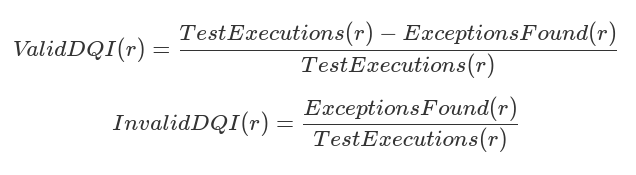

# Qualidade de Dados

## 1. Introdução

A gestão eficaz de dados envolve um conjunto de processos complexos e inter-relacionados que permitem a uma organização utilizar seus dados para atingir objetivos estratégicos. A gestão de dados inclui a capacidade de projetar dados para aplicações, armazená-los e acessá-los com segurança, compartilhá-los adequadamente, aprender com eles e garantir que atendam às necessidades do negócio. Uma premissa subjacente às afirmações sobre o valor dos dados é que os próprios dados são confiáveis ​​e confiáveis. Em outras palavras, que são de alta qualidade.

No entanto, muitos fatores podem minar essa premissa, contribuindo para a baixa qualidade dos dados: falta de compreensão sobre os efeitos de dados de baixa qualidade no sucesso organizacional, planejamento inadequado, design de sistemas "isolados", processos de desenvolvimento inconsistentes, documentação incompleta, falta de padrões ou falta de governança. Muitas organizações não conseguem definir o que torna os dados adequados à finalidade.

Todas as disciplinas de gestão de dados contribuem para a qualidade dos dados, e dados de alta qualidade que apoiam a organização devem ser o objetivo de todas as disciplinas de gestão de dados. Como decisões ou ações desinformadas por qualquer pessoa que interaja com os dados podem resultar em dados de baixa qualidade, a produção de dados de alta qualidade exige comprometimento e coordenação interfuncionais. Organizações e equipes devem estar cientes disso e planejar dados de alta qualidade, executando processos e projetos de forma a considerar os riscos relacionados a condições inesperadas ou inaceitáveis ​​nos dados.

Como nenhuma organização possui processos de negócios, processos técnicos ou práticas de gerenciamento de dados perfeitos, todas as organizações enfrentam problemas relacionados à qualidade de seus dados. Organizações que gerenciam formalmente a qualidade dos dados têm menos problemas do que aquelas que deixam a qualidade dos dados ao acaso. O gerenciamento formal da qualidade dos dados é semelhante ao gerenciamento contínuo da qualidade para outros produtos. Inclui o gerenciamento de dados ao longo de seu ciclo de vida, definindo padrões, incorporando a qualidade aos processos que criam, transformam e armazenam dados e medindo os dados em relação a padrões. Gerenciar dados nesse nível geralmente requer uma

Equipe do programa de Qualidade de Dados. A equipe do programa de Qualidade de Dados é responsável por envolver profissionais de gerenciamento de dados comerciais e técnicos e conduzir o trabalho de aplicação de técnicas de gerenciamento de qualidade aos dados para garantir que eles sejam adequados para consumo para uma variedade de propósitos. A equipe provavelmente estará envolvida em uma série de projetos por meio dos quais poderá estabelecer processos e melhores práticas, ao mesmo tempo em que aborda questões de dados de alta prioridade.

Como a gestão da qualidade dos dados envolve a gestão do ciclo de vida dos dados, um programa de Qualidade de Dados também terá responsabilidades operacionais relacionadas ao uso dos dados. Por exemplo, relatar os níveis de qualidade dos dados e se envolver na análise, quantificação e priorização de problemas de dados. A equipe também é responsável por trabalhar com aqueles que precisam de dados para realizar suas tarefas, a fim de garantir que atendam às suas necessidades, e com aqueles que criam, atualizam ou excluem dados durante suas tarefas, para garantir que estejam lidando com os dados adequadamente. A qualidade dos dados depende de todos que interagem com os dados, não apenas dos profissionais de gestão de dados.

Assim como no caso da Governança de Dados e da gestão de dados como um todo, a Gestão da Qualidade de Dados é um programa, não um projeto. Ela incluirá tanto o trabalho de projeto quanto o de manutenção, juntamente com um compromisso com a comunicação e o treinamento. Mais importante ainda, o sucesso a longo prazo de um programa de melhoria da qualidade de dados depende de fazer com que uma organização mude sua cultura e adote uma mentalidade de qualidade. Conforme declarado no Manifesto de Dados do Líder: uma mudança fundamental e duradoura requer liderança comprometida e envolvimento de pessoas em todos os níveis da organização. Pessoas que usam dados para realizar seu trabalho – o que na maioria das organizações representa uma porcentagem muito grande de funcionários – precisam impulsionar a mudança. Uma das mudanças mais críticas a serem consideradas é como suas organizações gerenciam e aprimoram a qualidade de seus dados. [^71]

Figura 91 Diagrama de Contexto: Qualidade de Dados

### 1.1 Impulsionadores de Negócios

Os impulsionadores de negócios para o estabelecimento de um programa formal de Gestão da Qualidade de Dados incluem:

* Aumentar o valor dos dados organizacionais e as oportunidades de utilizá-los
* Reduzir riscos e custos associados a dados de baixa qualidade
* Melhorar a eficiência e a produtividade organizacional
* Proteger e aprimorar a reputação da organização

Organizações que desejam extrair valor de seus dados reconhecem que dados de alta qualidade são mais valiosos do que dados de baixa qualidade. Dados de baixa qualidade são repletos de riscos (consulte o Capítulo 1). Eles podem prejudicar a reputação de uma organização, resultando em multas, perda de receita, perda de clientes e exposição negativa na mídia. Requisitos regulatórios frequentemente exigem dados de alta qualidade. Além disso, muitos custos diretos estão associados a dados de baixa qualidade. Por exemplo,

* Incapacidade de faturar corretamente
* Aumento de chamadas de atendimento ao cliente e diminuição da capacidade de resolvê-las
* Perda de receita devido à perda de oportunidades de negócios
* Atraso na integração durante fusões e aquisições
* Maior exposição a fraudes
* Prejuízo devido a más decisões de negócios motivadas por dados incorretos
* Perda de negócios devido à falta de boa reputação de crédito

Dados de alta qualidade não são um fim em si mesmos. São um meio para o sucesso organizacional. Dados confiáveis ​​não apenas mitigam riscos e reduzem custos, mas também melhoram a eficiência. Os funcionários podem responder a perguntas com mais rapidez e consistência quando trabalham com dados confiáveis. Eles gastam menos tempo tentando descobrir se os dados estão corretos e mais tempo usando os dados para obter insights, tomar decisões e atender clientes.

### 1.2 Metas e Princípios

Os programas de Qualidade de Dados concentram-se nestes objetivos gerais:

* Desenvolver uma abordagem governada para adequar os dados à finalidade, com base nos requisitos dos consumidores de dados
* Definir padrões e especificações para controles de qualidade de dados como parte do ciclo de vida dos dados
* Definir e implementar processos para mensurar, monitorar e reportar os níveis de qualidade dos dados
* Identificar e defender oportunidades para melhorar a qualidade dos dados, por meio de mudanças em processos e sistemas, e envolver-se em atividades que melhorem mensuravelmente a qualidade dos dados com base nos requisitos dos consumidores de dados

Os programas de Qualidade de Dados devem ser guiados pelos seguintes princípios:

* **Criticalidade:** Um programa de Qualidade de Dados deve se concentrar nos dados mais críticos para a empresa e seus clientes. As prioridades de melhoria devem ser baseadas na criticidade dos dados e no nível de risco caso os dados não estejam corretos.
* **Gerenciamento do ciclo de vida:** A qualidade dos dados deve ser gerenciada ao longo de todo o ciclo de vida dos dados, desde a criação ou aquisição até o descarte. Isso inclui o gerenciamento de dados conforme eles se movem dentro e entre sistemas (ou seja, cada elo na cadeia de dados deve garantir que a saída de dados seja de alta qualidade).
* **Prevenção:** O foco de um programa de Qualidade de Dados deve ser a prevenção de erros e condições de dados que reduzem a usabilidade dos dados; não deve se concentrar apenas na correção de registros.
* **Remediação da causa raiz:** Melhorar a qualidade dos dados vai além da correção de erros. Problemas com a qualidade dos dados devem ser compreendidos e tratados em suas causas raiz, e não apenas em seus sintomas. Como essas causas geralmente estão relacionadas ao design de processos ou sistemas, melhorar a qualidade dos dados geralmente requer mudanças nos processos e nos sistemas que os suportam.
* **Governança:** As atividades de Governança de Dados devem apoiar o desenvolvimento de dados de alta qualidade, e as atividades do programa de Qualidade de Dados devem apoiar e sustentar um ambiente de dados governado.
* **Orientado por padrões:** Todas as partes interessadas no ciclo de vida dos dados têm requisitos de qualidade de dados. Na medida do possível, esses requisitos devem ser definidos na forma de padrões e expectativas mensuráveis, em relação aos quais a qualidade dos dados possa ser mensurada.

* **Mensuração objetiva e transparência:** Os níveis de qualidade dos dados precisam ser medidos de forma objetiva e consistente. As medições e a metodologia de medição devem ser compartilhadas com as partes interessadas, visto que elas são os árbitros da qualidade.
* **Integrados em processos de negócios:** Os proprietários de processos de negócios são responsáveis ​​pela qualidade dos dados produzidos por meio de seus processos. Eles devem aplicar padrões de qualidade de dados em seus processos.
* **Aplicados sistematicamente:** Os proprietários de sistemas devem aplicar sistematicamente os requisitos de qualidade de dados.
* **Conectados a níveis de serviço:** Os relatórios de qualidade de dados e o gerenciamento de problemas devem ser incorporados aos Acordos de Nível de Serviço (ANS).

### 1.3 Conceitos Essenciais

#### 1.3.1 Qualidade de Dados

O termo qualidade de dados refere-se tanto às características associadas a dados de alta qualidade quanto aos processos utilizados para mensurar ou melhorar a qualidade dos dados. Esses usos duplos podem ser confusos, por isso é útil separá-los e esclarecer o que constitui dados de alta qualidade. [^72]

Os dados são de alta qualidade na medida em que atendem às expectativas e necessidades dos consumidores de dados. Ou seja, se os dados são adequados para os propósitos aos quais eles desejam aplicá-los. São de baixa qualidade se não são adequados para esses propósitos. A qualidade dos dados depende, portanto, do contexto e das necessidades do consumidor de dados.

Um dos desafios na gestão da qualidade dos dados é que as expectativas relacionadas à qualidade nem sempre são conhecidas. Os clientes podem não as articular. Muitas vezes, as pessoas que gerenciam os dados nem sequer perguntam sobre esses requisitos. No entanto, para que os dados sejam confiáveis ​​e confiáveis, os profissionais de gestão de dados precisam entender melhor os requisitos de qualidade de seus clientes e como medi-los. Esta precisa ser uma discussão contínua, visto que os requisitos mudam ao longo do tempo, à medida que as necessidades do negócio e as forças externas evoluem.

#### 1.3.2 Dados Críticos

A maioria das organizações possui muitos dados, e nem todos têm a mesma importância. Um princípio da Gestão da Qualidade de Dados é concentrar os esforços de melhoria nos dados mais importantes para a organização e seus clientes. Isso confere escopo e foco ao programa, permitindo que ele tenha um impacto direto e mensurável nas necessidades do negócio.

Embora os fatores específicos para a criticidade variem de acordo com o setor, existem características comuns entre as organizações. Os dados podem ser avaliados com base na sua necessidade por:

* Relatórios regulatórios
* Relatórios financeiros
* Política de negócios
* Operações em andamento
* Estratégia de negócios, especialmente esforços de diferenciação competitiva

Dados Mestres são críticos por definição. Conjuntos de dados ou elementos individuais de dados podem ser avaliados quanto à criticidade com base nos processos que os consomem, na natureza dos relatórios em que aparecem ou no risco financeiro, regulatório ou de reputação para a organização caso algo dê errado com os dados. [^73]

#### 1.3.3 Dimensões de Qualidade de Dados

Uma dimensão de Qualidade de Dados é uma característica ou recurso mensurável dos dados. O termo dimensão é usado para fazer a conexão com dimensões na medição de objetos físicos (por exemplo, comprimento, largura, altura). As dimensões de qualidade de dados fornecem um vocabulário para definir os requisitos de qualidade de dados. A partir daí, podem ser usadas para definir os resultados da avaliação inicial da qualidade dos dados, bem como da medição contínua. Para mensurar a qualidade dos dados, uma organização precisa estabelecer características que sejam importantes para os processos de negócios (valem a pena mensurar) e mensuráveis. As dimensões fornecem uma base para regras mensuráveis, que devem estar diretamente conectadas a riscos potenciais em processos críticos.

Por exemplo, se os dados no campo de endereço de e-mail do cliente estiverem incompletos, não poderemos enviar informações do produto aos nossos clientes por e-mail e perderemos vendas potenciais. Portanto, mensuraremos a porcentagem de clientes para os quais temos endereços de e-mail utilizáveis ​​e aprimoraremos nossos processos até que tenhamos um endereço de e-mail utilizável para pelo menos 98% dos nossos clientes.

Muitos pensadores renomados em qualidade de dados publicaram conjuntos de dimensões. [^74] As três mais influentes são descritas aqui porque fornecem insights sobre como pensar o que significa ter dados de alta qualidade, bem como sobre como a qualidade dos dados pode ser mensurada.

A estrutura de Strong-Wang (1996) concentra-se nas percepções dos consumidores de dados sobre os dados. Ela descreve 15 dimensões em quatro categorias gerais de qualidade de dados:

* DQ Intrínseca
  * Precisão
  * Objetividade
  * Credibilidade
  * Reputação
* DQ Contextual
  * Valor agregado
  * Relevância
  * Temporalidade
  * Integridade
  * Quantidade adequada de dados
* DQ Representacional
  * Interpretabilidade
  * Facilidade de compreensão
  * Consistência representacional
  * Representação concisa
* DQ de Acessibilidade
  * Acessibilidade
  * Segurança de acesso

Em Qualidade de Dados para a Era da Informação (1996), Thomas Redman formulou um conjunto de dimensões de qualidade de dados baseadas na estrutura de dados. [^75] Redman define um item de dados como uma "tripla representável": um valor do domínio de um atributo dentro de uma entidade. As dimensões podem ser associadas a qualquer um dos componentes dos dados – o modelo (entidades e atributos), bem como os valores. Redman inclui a dimensão da representação, que ele define como um conjunto de regras para o registro de itens de dados. Dentro dessas três categorias gerais (modelo de dados, valores de dados, representação), ele descreve mais de duas dúzias de dimensões. Elas incluem as seguintes:

Modelo de Dados:

* **Conteúdo:**
  * Relevância dos dados
  * Capacidade de obter os valores
  * Clareza das definições
* **Nível de detalhe:**
  * Granularidade dos atributos
  * Precisão dos domínios dos atributos
* **Composição:**
  * Naturalidade: A ideia de que cada atributo deve ter uma contrapartida simples no mundo real e que cada atributo deve se basear em um único fato sobre a entidade
  * Capacidade de identificação: Cada entidade deve ser distinguível de todas as outras
  * Homogeneidade
  * Redundância mínima necessária
* **Consistência:**
  * Consistência semântica dos componentes do modelo
  * Consistência estrutural dos atributos entre os tipos de entidade
* **Reação à mudança:**
  * Robustez
  * Flexibilidade

Valores dos Dados:

* Precisão
* Completude
* Atualidade
* Consistência

Representação:

* Adequação
* Interpretabilidade
* Portabilidade
* Precisão de formato
* Flexibilidade de formato
* Capacidade de representar valores nulos
* Uso eficiente do armazenamento
* Instâncias físicas de dados em conformidade com seus formatos

Redman reconhece que a consistência de entidades, valores e representação pode ser entendida em termos de restrições. Diferentes tipos de consistência estão sujeitos a diferentes tipos de restrições.

Em "Melhorando a Qualidade da Informação Empresarial e do Data Warehouse" (1999), Larry English apresenta um conjunto abrangente de dimensões divididas em duas grandes categorias: inerentes e pragmáticas. [^76] As características inerentes são independentes do uso dos dados. As características pragmáticas estão associadas à apresentação dos dados e são dinâmicas; seu valor (qualidade) pode mudar dependendo do uso dos dados.

* Características de qualidade inerentes
  * Conformidade definicional
  * Integridade dos valores
  * Validade ou conformidade com as regras de negócio
  * Precisão em relação a uma fonte substituta
  * Precisão em relação à realidade
  * Precisão
  * Não duplicação
  * Equivalência de dados redundantes ou distribuídos
  * Concorrência de dados redundantes ou distribuídos
* Características de qualidade pragmáticas
  * Acessibilidade
  * Temporalidade
  * Clareza contextual
  * Usabilidade
  * Integridade da derivação
  * Correção ou completude dos fatos

Em 2013, a DAMA UK produziu um white paper descrevendo seis dimensões principais da qualidade de dados:

* **Completude:** A proporção de dados armazenados em relação ao potencial de 100%.
* **Unicidade:** Nenhuma instância de entidade (coisa) será registrada mais de uma vez com base em como essa coisa é identificada.
* **Temporalidade:** O grau em que os dados representam a realidade a partir do ponto no tempo necessário.
* **Validade:** Os dados são válidos se estiverem em conformidade com a sintaxe (formato, tipo, intervalo) de sua definição.
* **Precisão:** O grau em que os dados descrevem corretamente o objeto ou evento do "mundo real" que está sendo descrito.
* **Consistência:** A ausência de diferença ao comparar duas ou mais representações de uma coisa em relação a uma definição.

O white paper da DAMA UK também descreve outras características que impactam a qualidade. Embora o white paper não nomeie essas dimensões, elas funcionam de maneira semelhante à DQ contextual e representacional de Strong e Wang e às características pragmáticas de English.

* **Usabilidade:** Os dados são compreensíveis, simples, relevantes, acessíveis, fáceis de manter e apresentam o nível adequado de precisão?
* **Questões de tempo (além da pontualidade em si):** São estáveis, mas respondem a solicitações de mudança legítimas?
* **Flexibilidade:** Os dados são comparáveis ​​e compatíveis com outros dados? Possuem agrupamentos e classificações úteis? Podem ser reaproveitados? São fáceis de manipular?
* **Confiança:** Os processos de Governança, Proteção e Segurança de Dados estão em vigor? Qual é o
* **Valor:** Existe uma boa relação custo/benefício para os dados? Estão sendo utilizados de forma otimizada? Colocam em risco a reputação dos dados e são verificados ou verificáveis? A segurança ou privacidade das pessoas, ou as responsabilidades legais da empresa? Apoiam ou contradizem a imagem corporativa ou a mensagem corporativa?

Embora não exista um conjunto único e consensual de dimensões de qualidade de dados, essas formulações contêm ideias comuns. As dimensões incluem algumas características que podem ser medidas objetivamente (integridade, validade, conformidade com o formato) e outras que dependem fortemente do contexto ou da interpretação subjetiva (usabilidade, confiabilidade, reputação). Independentemente dos nomes usados, as dimensões se concentram em verificar se há dados suficientes (integridade), se estão corretos (precisão, validade), quão bem se encaixam (consistência, integridade, unicidade), se estão atualizados (oportunidade), acessíveis, utilizáveis ​​e seguros. A Tabela 29 contém as definições de um conjunto de dimensões de qualidade de dados sobre as quais há consenso geral e descreve abordagens para mensurá-las.

Tabela 29 Dimensões Comuns da Qualidade de Dados

<table>
  <thead>
    <tr>
      <th>Dimensão da Qualidade</th>
      <th>Descrição</th>
    </tr>
  </thead>
  <tbody>
    <tr>
      <td>Precisão</td>
      <td>
        Precisão refere-se ao grau em que os dados representam corretamente entidades da "vida real". A precisão é difícil de mensurar, a menos que uma organização possa reproduzir a coleta de dados ou confirmar manualmente a precisão dos registros. A maioria das medidas de precisão depende da comparação com uma fonte de dados que foi verificada como precisa, como um sistema de registro ou dados de uma fonte confiável (por exemplo, Dados de Referência Dun and Bradstreet).
      </td>
    </tr>
    <tr>
      <td>Integridade</td>
      <td>
        Completude refere-se à presença de todos os dados necessários. A completude pode ser medida no nível do conjunto de dados, registro ou coluna. O conjunto de dados contém todos os registros esperados? Os registros estão preenchidos corretamente? (Registros com status diferentes podem ter expectativas diferentes de completude.) As colunas/atributos estão preenchidos no nível esperado? (Algumas colunas são obrigatórias. Colunas opcionais são preenchidas apenas sob condições específicas.) Atribua regras de completude a um conjunto de dados com vários níveis de restrição: atributos obrigatórios que exigem um valor, elementos de dados com valores condicionais e opcionais e valores de atributos inaplicáveis. As medições no nível do conjunto de dados podem exigir comparação com uma fonte de registro ou podem ser baseadas em níveis históricos de preenchimento.
      </td>
    </tr>
    <tr>
      <td>Consistência</td>
      <td>
        Consistência pode se referir a garantir que os valores de dados sejam representados consistentemente dentro de um conjunto de dados e entre conjuntos de dados, e consistentemente associados entre conjuntos de dados. Também pode se referir ao tamanho e à composição de conjuntos de dados entre sistemas ou ao longo do tempo. Consistência pode ser definida entre um conjunto de valores de atributos e outro conjunto de atributos dentro do mesmo registro (consistência em nível de registro), entre um conjunto de valores de atributos e outro conjunto de atributos em registros diferentes (consistência entre registros) ou entre um conjunto de valores de atributos e o mesmo conjunto de atributos dentro do mesmo registro em diferentes pontos no tempo (consistência temporal). Consistência também pode ser usada para se referir à consistência de formato. Tome cuidado para não confundir consistência com precisão ou correção. Características que devem ser consistentes dentro e entre conjuntos de dados podem ser usadas como base para padronizar dados. Padronização de dados se refere ao condicionamento de dados de entrada para garantir que os dados atendam às regras de conteúdo e formato. A padronização de dados permite uma correspondência mais eficaz e facilita a saída consistente. Encapsule restrições de consistência como um conjunto de regras que especificam relacionamentos consistentes entre valores de atributos, seja em um registro ou mensagem, ou em todos os valores de um único atributo (como um intervalo ou lista de valores válidos). Por exemplo, pode-se esperar que o número de transações por dia não exceda 105% da média móvel de transações dos 30 dias anteriores.
      </td>
    </tr>
    <tr>
      <td>Integridade</td>
      <td>
        Integridade de Dados (ou Coerência) inclui ideias associadas à completude, precisão e consistência. Em dados, integridade geralmente se refere à integridade referencial (consistência entre objetos de dados por meio de uma chave de referência contida em ambos os objetos) ou à consistência interna dentro de um conjunto de dados, de forma que não haja lacunas ou partes ausentes. Conjuntos de dados sem integridade referencial são vistos como corrompidos ou apresentam perda de dados. Conjuntos de dados sem integridade referencial têm "órfãos" – chaves de referência inválidas – ou "duplicatas" – linhas idênticas que podem afetar negativamente as funções de agregação. O nível de registros órfãos pode ser medido como uma contagem bruta ou como uma porcentagem do conjunto de dados.
      </td>
    </tr>
    <tr>
      <td>Razoabilidade</td>
      <td>
        A razoabilidade questiona se um padrão de dados atende às expectativas. Por exemplo, se uma distribuição de vendas em uma área geográfica faz sentido com base no que se sabe sobre os clientes naquela área. A mensuração da razoabilidade pode assumir diferentes formas. Por exemplo, a razoabilidade pode ser baseada na comparação com dados de referência ou instâncias anteriores de um conjunto de dados semelhante (por exemplo, vendas do trimestre anterior). Algumas ideias sobre razoabilidade podem ser percebidas como subjetivas. Se for esse o caso, trabalhe com os consumidores de dados para articular a base de suas expectativas em relação aos dados e formular comparações objetivas. Uma vez estabelecidas as mensurações de referência da razoabilidade, estas podem ser usadas para comparar objetivamente novas instâncias do mesmo conjunto de dados a fim de detectar mudanças. (Consulte a Seção 4.5.)
      </td>
    </tr>
    <tr>
      <td>Temporalidade</td>
      <td>
        O conceito de atualidade dos dados refere-se a várias características dos dados. As medidas de atualidade precisam ser entendidas em termos de volatilidade esperada – com que frequência os dados provavelmente mudarão e por quais motivos. A atualidade dos dados é a medida que determina se os valores dos dados são a versão mais atualizada das informações. Dados relativamente estáticos, por exemplo, alguns valores de Dados de Referência, como códigos de países, podem permanecer atuais por um longo período. Dados voláteis permanecem atuais por um curto período. Alguns dados, por exemplo, preços de ações em páginas da web financeiras, geralmente serão exibidos com uma data de validade, para que os consumidores de dados entendam o risco de que os dados tenham mudado desde que foram registrados. Durante o dia, enquanto os mercados estiverem abertos, esses dados serão atualizados com frequência. Uma vez que os mercados fechem, os dados permanecerão inalterados, mas ainda serão atuais, uma vez que o próprio mercado está inativo. A latência mede o tempo entre quando os dados foram criados e quando foram disponibilizados para uso. Por exemplo, o processamento em lote noturno pode gerar uma latência de 1 dia às 8h para dados inseridos no sistema no dia anterior, mas apenas uma hora para dados gerados durante o processamento em lote. (Consulte o Capítulo 8.)
      </td>
    </tr>
    <tr>
      <td>Unicidade / Desduplicação</td>
      <td>
        Unicidade afirma que nenhuma entidade existe mais de uma vez no conjunto de dados. Afirmar a unicidade das entidades em um conjunto de dados implica que um valor-chave se relaciona a cada entidade única, e apenas àquela entidade específica, dentro do conjunto de dados. Meça a unicidade testando a estrutura da chave. (Consulte o Capítulo 5.)
      </td>
    </tr>
    <tr>
      <td>Validade</td>
      <td>
        Validade refere-se à consistência dos valores dos dados com um domínio de valores definido. Um domínio de valores pode ser um conjunto definido de valores válidos (como em uma tabela de referência), um intervalo de valores ou um valor que pode ser determinado por meio de regras. O tipo de dado, o formato e a precisão dos valores esperados devem ser considerados na definição do domínio. Os dados também podem ser válidos apenas por um período específico, por exemplo, dados gerados a partir de RFID (identificação por radiofrequência) ou alguns conjuntos de dados científicos. Valide os dados comparando-os com as restrições do domínio. Tenha em mente que os dados podem ser válidos (ou seja, podem atender aos requisitos do domínio) e ainda assim não ser precisos ou associados corretamente a registros específicos.
      </td>
    </tr>
  </tbody>
</table>

A Figura 92 alinha as dimensões de qualidade de dados e os conceitos associados a essas dimensões. As setas indicam sobreposições significativas entre os conceitos e também demonstram que não há consenso sobre um conjunto específico. Por exemplo, a dimensão de precisão está associada a "concordância com o mundo real" e "correspondência com a fonte acordada", e também aos conceitos associados à validade, como "derivação correta".

Figura 92 Relação entre as Dimensões de Qualidade de Dados [^77]

#### 1.3.4 Qualidade de Dados e Metadados

Os metadados são essenciais para o gerenciamento da qualidade dos dados. A qualidade dos dados se baseia em quão bem eles atendem aos requisitos dos consumidores de dados. Os metadados definem o que os dados representam. Ter um processo robusto pelo qual os dados são definidos apoia a capacidade de uma organização de formalizar e documentar os padrões e requisitos pelos quais a qualidade dos dados pode ser mensurada. A qualidade dos dados consiste em atender às expectativas. Os metadados são um meio primário de esclarecer expectativas.

Metadados bem gerenciados também podem apoiar o esforço de melhoria da qualidade dos dados. Um repositório de metadados pode armazenar resultados de medições de qualidade de dados para que sejam compartilhados por toda a organização e a equipe de Qualidade de Dados possa trabalhar em busca de consenso sobre prioridades e motivadores de melhoria. (Consulte o Capítulo 12.)

#### 1.3.5 Norma ISO de Qualidade de Dados

A ISO 8000, a norma internacional para qualidade de dados, está sendo desenvolvida para permitir a troca de dados complexos de forma neutra em termos de aplicação. Na introdução à norma, a ISO afirma: “A capacidade de criar, coletar, armazenar, manter, transferir, processar e apresentar dados para dar suporte aos processos de negócios de forma oportuna e econômica requer tanto a compreensão das características dos dados que determinam sua qualidade quanto a capacidade de mensurar, gerenciar e relatar a qualidade dos dados.”

A ISO 8000 define características que podem ser testadas por qualquer organização na cadeia de fornecimento de dados para determinar objetivamente a conformidade dos dados com a ISO 8000. [^78]

A primeira parte publicada da ISO 8000 (parte 110, publicada em 2008) concentrou-se na sintaxe, codificação semântica e conformidade com a especificação de dados de Dados Mestres. Outras partes projetadas para a norma incluem a parte 100 - Introdução, a parte 120 - Proveniência, a parte 130 - Precisão e a parte 140 - Completude. [^79] A ISO define dados de qualidade como "dados portáteis que atendem aos requisitos estabelecidos". [^80] O padrão de qualidade de dados está relacionado ao trabalho geral da ISO sobre portabilidade e preservação de dados. Dados são considerados "portáteis" se puderem ser separados de um aplicativo de software. Dados que só podem ser usados ​​ou lidos usando um aplicativo de software licenciado específico estão sujeitos aos termos da licença de software. Uma organização pode não conseguir utilizar os dados que criou, a menos que esses dados possam ser separados do software utilizado para criá-los.

Para atender aos requisitos estabelecidos, é necessário que estes sejam definidos de forma clara e inequívoca. A ISO 8000 é respaldada pela ISO 22745, uma norma para definição e troca de Dados Mestres. A ISO 22745 define como as declarações de requisitos de dados devem ser construídas, fornece exemplos em XML e define um formato para a troca de dados codificados. [^81] A ISO 22745 cria dados portáteis, rotulando-os com um Dicionário Técnico Aberto compatível com a ISO 22745, como o Dicionário Técnico Aberto da ECCMA (eOTD).

A intenção da ISO 8000 é ajudar as organizações a definir o que são e o que não são dados de qualidade, permitir que solicitem dados de qualidade utilizando convenções padrão e verificar se receberam dados de qualidade utilizando essas mesmas normas. Quando as normas são seguidas, os requisitos podem ser confirmados por meio de um programa de computador. O modelo de referência do processo de gestão da qualidade da informação e dos dados da ISO 8000 - Parte 61 está em desenvolvimento. [^82]

Esta norma descreverá a estrutura e a organização da gestão da qualidade dos dados, incluindo:

* Planejamento da Qualidade dos Dados
* Controle da Qualidade dos Dados
* Garantia da Qualidade dos Dados
* Melhoria da Qualidade dos Dados

#### 1.3.6 Ciclo de Vida de Melhoria da Qualidade de Dados

A maioria das abordagens para melhorar a qualidade de dados baseia-se nas técnicas de melhoria da qualidade na fabricação de produtos físicos. [^83] Nesse paradigma, os dados são entendidos como o produto de um conjunto de processos. Em sua forma mais simples, um processo é definido como uma série de etapas que transforma entradas em saídas. Um processo que cria dados pode consistir em uma etapa (coleta de dados) ou em várias etapas: coleta de dados, integração em um data warehouse, agregação em um data mart, etc. Em qualquer etapa, os dados podem ser afetados negativamente. Eles podem ser coletados incorretamente, descartados ou duplicados entre sistemas, alinhados ou agregados incorretamente, etc. Melhorar a qualidade dos dados requer a capacidade de avaliar a relação entre entradas e saídas, a fim de garantir que as entradas atendam aos requisitos do processo e que as saídas estejam em conformidade com as expectativas. Como as saídas de um processo se tornam entradas para outros processos, os requisitos devem ser definidos ao longo de toda a cadeia de dados.

Uma abordagem geral para a melhoria da qualidade de dados, mostrada na Figura 93, é uma versão do ciclo de Shewhart/Deming. [^84] Baseado no método científico, o ciclo de Shewhart/Deming é um modelo de resolução de problemas conhecido como "planejar-executar-verificar-agir". A melhoria ocorre por meio de um conjunto definido de etapas. A condição dos dados deve ser medida em relação aos padrões e, caso não atenda aos padrões, a(s) causa(s) raiz(es) da discrepância em relação aos padrões deve(m) ser identificada(s) e remediada(s). As causas raiz podem ser encontradas em qualquer uma das etapas do processo, técnicas ou não técnicas. Uma vez remediados, os dados devem ser monitorados para garantir que continuem atendendo aos requisitos.

Figura 93 O Diagrama de Shewhart

Para um determinado conjunto de dados, um ciclo de Gestão da Qualidade de Dados começa com a identificação dos dados que não atendem aos requisitos dos consumidores de dados e dos problemas de dados que são obstáculos para o alcance dos objetivos de negócios. Os dados precisam ser avaliados em relação às principais dimensões de qualidade e aos requisitos de negócios conhecidos. As causas-raiz dos problemas precisarão ser identificadas para que as partes interessadas possam compreender os custos da remediação e os riscos de não remediar os problemas. Esse trabalho geralmente é realizado em conjunto com os Administradores de Dados e outras partes interessadas.

Na fase de Planejamento, a equipe de Qualidade de Dados avalia o escopo, o impacto e a prioridade dos problemas conhecidos e avalia alternativas para solucioná-los. Esse plano deve ser baseado em uma base sólida de análise das causas-raiz dos problemas. A partir do conhecimento das causas e do impacto dos problemas, a relação custo/benefício pode ser compreendida, a prioridade pode ser determinada e um plano básico pode ser formulado para solucioná-los.

Na fase de Execução, a equipe de Qualidade de Dados lidera os esforços para tratar as causas-raiz dos problemas e planeja o monitoramento contínuo dos dados. Para causas-raiz baseadas em processos não técnicos, a equipe de Qualidade de Dados pode trabalhar com os responsáveis ​​pelos processos para implementar mudanças. Para causas-raiz que exigem mudanças técnicas, a equipe de Qualidade de Dados deve trabalhar com as equipes técnicas para garantir que os requisitos sejam implementados corretamente e que as mudanças técnicas não introduzam erros.

A fase de Verificação envolve o monitoramento ativo da qualidade dos dados, medida em relação aos requisitos. Desde que os dados atendam aos limites definidos de qualidade, ações adicionais não são necessárias. Os processos serão considerados sob controle e atendendo aos requisitos de negócios. No entanto, se os dados ficarem abaixo dos limites de qualidade aceitáveis, ações adicionais deverão ser tomadas para elevá-los a níveis aceitáveis.

A fase de Ação é para atividades que abordam e resolvem problemas emergentes de qualidade de dados. O ciclo se reinicia, à medida que as causas dos problemas são avaliadas e soluções são propostas. A melhoria contínua é alcançada com o início de um novo ciclo. Novos ciclos começam quando:

* Medições existentes caem abaixo dos limites
* Novos conjuntos de dados passam a ser investigados
* Novos requisitos de qualidade de dados surgem para conjuntos de dados existentes
* Regras, padrões ou expectativas de negócios mudam

O custo de obter dados corretos na primeira vez é menor do que os custos de obter dados incorretos e corrigi-los posteriormente. Incorporar qualidade aos processos de gerenciamento de dados desde o início custa menos do que adaptá-los. Manter dados de alta qualidade ao longo do ciclo de vida dos dados é menos arriscado do que tentar melhorar a qualidade em um processo existente. Também gera um impacto muito menor na organização. Estabelecer critérios de qualidade de dados no início da construção de um processo ou sistema é um sinal de uma Organização de Gestão de Dados madura. Fazer isso exige governança e disciplina, além de colaboração multifuncional.

#### 1.3.7 Tipos de Regras de Negócios de Qualidade de Dados

As regras de negócios descrevem como as empresas devem operar internamente para serem bem-sucedidas e estarem em conformidade com o mundo externo. As Regras de Negócios de Qualidade de Dados descrevem como os dados devem existir para serem úteis e utilizáveis ​​dentro de uma organização. Essas regras podem ser alinhadas com as dimensões de qualidade e usadas para descrever os requisitos de qualidade de dados. Por exemplo, uma regra de negócios que determina que todos os campos de código de estado devem estar em conformidade com as Abreviações de Estados dos EUA pode ser aplicada por meio de listas de seleção de entrada de dados e consultas de integração de dados. O nível de registros válidos ou inválidos pode então ser mensurado.

As regras de negócios são comumente implementadas em software ou usando modelos de documentos para entrada de dados. Alguns tipos comuns de regras de negócios simples são:

* **Conformidade definicional:** Confirme se o mesmo entendimento das definições de dados é implementado e usado corretamente nos processos em toda a organização. A confirmação inclui concordância algorítmica em campos calculados, incluindo restrições de tempo ou locais, e regras de interdependência de rollup e status.
* **Presença de valor e integridade do registro:** Regras que definem as condições sob as quais valores ausentes são aceitáveis ​​ou inaceitáveis.

* **Conformidade de formato:** Um ou mais padrões especificam valores atribuídos a um elemento de dados, como padrões para formatação de números de telefone.
* **Associação ao domínio de valor:** Especifica que o valor atribuído a um elemento de dados está incluído naqueles enumerados em um domínio de valor de dados definido, como Códigos Postais dos Estados Unidos de 2 caracteres para um campo ESTADO.
* **Conformidade de intervalo:** O valor atribuído a um elemento de dados deve estar dentro de um intervalo numérico, lexicográfico ou temporal definido, como maior que 0 e menor que 100 para um intervalo numérico.
* **Conformidade de mapeamento:** Indica que o valor atribuído a um elemento de dados deve corresponder a um selecionado de um domínio de valor que mapeia para outro(s) domínio(s) de valor(es) equivalente(s). O domínio de dados STATE novamente fornece um bom exemplo, uma vez que os valores de State podem ser representados usando diferentes domínios de valor (códigos postais do USPS, códigos FIPS de 2 dígitos, nomes completos), e esses tipos de regras validam que "AL" e "01" mapeiam para "Alabama".
* **Regras de consistência:** Afirmações condicionais que se referem à manutenção de um relacionamento entre dois (ou mais) atributos com base nos valores reais desses atributos. Por exemplo, validação de endereço em que os códigos postais correspondem a estados ou províncias específicos.
* **Verificação de precisão:** Compare um valor de dados com um valor correspondente em um sistema de registro ou outra fonte verificada (por exemplo, dados de marketing adquiridos de um fornecedor) para verificar se os valores correspondem.
* **Verificação de unicidade:** Regras que especificam quais entidades devem ter uma representação única e se existe apenas um registro para cada objeto do mundo real representado.
* **Validação de pontualidade:** Regras que indicam as características associadas às expectativas de acessibilidade e disponibilidade de dados.

Outros tipos de regras podem envolver funções de agregação aplicadas a conjuntos de instâncias de dados (consulte a Seção 4.5).
Exemplos de verificações de agregação incluem:

* Validar a razoabilidade do número de registros em um arquivo. Isso requer a manutenção de estatísticas ao longo do tempo para gerar tendências.
* Validar a razoabilidade de um valor médio calculado a partir de um conjunto de transações. Isso requer o estabelecimento de limites para comparação e pode ser baseado em estatísticas ao longo do tempo.
* Validar a variância esperada na contagem de transações em um período especificado. Isso requer a manutenção de estatísticas ao longo do tempo e o uso delas para estabelecer limites.

#### 1.3.8 Causas Comuns de Problemas de Qualidade de Dados

Problemas de qualidade de dados podem surgir em qualquer ponto do ciclo de vida dos dados, desde a criação até o descarte. Ao investigar as causas-raiz, os analistas devem procurar possíveis culpados, como problemas com entrada de dados, processamento de dados, design do sistema e intervenção manual em processos automatizados. Muitos problemas terão múltiplas causas e fatores contribuintes (especialmente se as pessoas tiverem criado maneiras de contorná-los). Essas causas de problemas também implicam maneiras de preveni-los: por meio de melhorias no design da interface, testes de regras de qualidade de dados como parte do processamento, foco na qualidade de dados no design do sistema e controles rígidos na intervenção manual em processos automatizados.

##### 1.3.8.1 Problemas Causados ​​pela Falta de Liderança

Muitas pessoas presumem que a maioria dos problemas de qualidade de dados são causados ​​por erros de entrada de dados. Uma compreensão mais sofisticada reconhece que lacunas ou má execução de processos técnicos e de negócios causam muito mais problemas do que erros de digitação. No entanto, o senso comum afirma e pesquisas indicam que muitos problemas de qualidade de dados são causados ​​pela falta de comprometimento organizacional com dados de alta qualidade, o que, por sua vez, decorre da falta de liderança, tanto na governança quanto na gestão.

Toda organização possui informações e ativos de dados que são valiosos para suas operações. De fato, as operações de toda organização dependem da capacidade de compartilhar informações. Apesar disso, poucas organizações gerenciam esses ativos com rigor. Na maioria das organizações, a disparidade de dados (diferenças na estrutura, formato e uso de valores dos dados) é um problema maior do que simples erros; pode ser um grande obstáculo à integração de dados. Um dos motivos pelos quais os programas de administração de dados se concentram na definição de termos e na consolidação da linguagem em torno dos dados é porque esse é o ponto de partida para obter dados mais consistentes.

Muitos programas de governança e ativos de informação são orientados exclusivamente pela conformidade, e não pelo valor potencial a ser derivado dos dados como um ativo. A falta de reconhecimento por parte da liderança significa falta de comprometimento dentro da organização com a gestão de dados como um ativo, incluindo a gestão de sua qualidade (Evans e Price, 2012). (Ver Figura 94.)

As barreiras à gestão eficaz da qualidade dos dados incluem: [^85]

* Falta de conscientização por parte da liderança e da equipe
* Falta de governança empresarial
* Falta de liderança e gestão
* Dificuldade em justificar melhorias
* Instrumentos inadequados ou ineficazes para mensurar valor

Essas barreiras têm efeitos negativos na experiência do cliente, na produtividade, no moral, na eficácia organizacional, na receita e na vantagem competitiva. Elas aumentam os custos de administração da organização e também introduzem riscos. (Ver Capítulo 11.)

##### 1.3.8.2 Problemas Causados ​​por Processos de Entrada de Dados

* **Problemas na interface de entrada de dados:** Interfaces de entrada de dados mal projetadas podem contribuir para problemas de qualidade dos dados. Se uma interface de entrada de dados não tiver edições ou controles para impedir que dados incorretos sejam inseridos no sistema, os processadores de dados provavelmente adotarão atalhos, como ignorar campos não obrigatórios e não atualizar campos padrão.
* **Posicionamento de entradas em lista:** Mesmo recursos simples de interfaces de entrada de dados, como a ordem dos valores em uma lista suspensa, podem contribuir para erros de entrada de dados.
* **Sobrecarga de campos:** Algumas organizações reutilizam campos ao longo do tempo para diferentes fins comerciais, em vez de fazer alterações no modelo de dados e na interface do usuário. Essa prática resulta em um preenchimento inconsistente e confuso dos campos.
* **Problemas de treinamento:** A falta de conhecimento do processo pode levar à entrada incorreta de dados, mesmo com controles e edições em vigor. Se os processadores de dados não estiverem cientes do impacto de dados incorretos ou se forem incentivados pela velocidade em vez da precisão, provavelmente farão escolhas com base em outros fatores que não a qualidade dos dados.

Figura 94 Barreiras à Gestão da Informação como um Ativo de Negócios [^86]

* **Mudanças nos processos de negócios:** Os processos de negócios mudam ao longo do tempo e, com essas mudanças, novas regras de negócios e requisitos de qualidade de dados são introduzidos. No entanto, as mudanças nas regras de negócios nem sempre são incorporadas aos sistemas de forma oportuna ou abrangente. Erros de dados ocorrerão se uma interface não for atualizada para acomodar requisitos novos ou alterados. Além disso, os dados provavelmente serão afetados, a menos que as mudanças nas regras de negócios sejam propagadas por todo o sistema.
* **Execução inconsistente de processos de negócios:** Dados criados por meio de processos executados de forma inconsistente provavelmente serão inconsistentes. A execução inconsistente pode ser devido a problemas de treinamento ou documentação, bem como a mudanças de requisitos.

##### 1.3.8.3 Issues Caused by Data Processing Functions

* **Incorrect assumptions about data sources:** Production issues can occur due to errors or changes, inadequate or obsolete system documentation, or inadequate knowledge transfer (for example, when SMEs leave without documenting their knowledge). System consolidation activities, such as those associated with mergers and acquisitions, are often based on limited knowledge about the relationship between systems. When multiple source systems and data feeds need to be integrated there is always a risk that details will be missed, especially with varying levels of source knowledge available and tight timelines.
* **Stale business rules:** Over time, business rules change. They should be periodically reviewed and updated. If there is automated measurement of rules, the technical process for measuring rules should also be updated. If it is not updated, issues may not be identified or false positives will be produced (or both).
* **Changed data structures:** Source systems may change structures without informing downstream consumers (both human and system) or without providing sufficient time to account for the changes. This can result in invalid values or other conditions that prevent data movement and loading, or in more subtle changes that may not be detected immediately.

##### 1.3.8.4 Issues Caused by System Design

* **Falha na aplicação da integridade referencial:** A integridade referencial é necessária para garantir dados de alta qualidade em nível de aplicativo ou sistema. Se a integridade referencial não for aplicada ou se a validação for desativada (por exemplo, para melhorar os tempos de resposta), vários problemas de qualidade de dados podem surgir:
  * Dados duplicados que violam as regras de exclusividade
  * Linhas órfãs, que podem ser incluídas em alguns relatórios e excluídas de outros, resultando em valores múltiplos para o mesmo cálculo
  * Impossibilidade de atualização devido a requisitos de integridade referencial restaurados ou alterados
  * Dados imprecisos devido à atribuição de valores padrão a dados ausentes
* **Falha na aplicação de restrições de exclusividade:** Várias cópias de instâncias de dados em uma tabela ou arquivo devem conter instâncias únicas. Se houver verificações insuficientes para a exclusividade das instâncias, ou se as restrições de exclusividade forem desativadas no banco de dados para melhorar o desempenho, os resultados da agregação de dados podem ser superestimados.
* **Imprecisões e lacunas na codificação:** Se o mapeamento ou layout dos dados estiver incorreto, ou se as regras de processamento dos dados não forem precisas, os dados processados ​​apresentarão problemas de qualidade, que vão desde cálculos incorretos até a atribuição ou vinculação de dados a campos, chaves ou relacionamentos inadequados.
* **Imprecisões no modelo de dados:** Se as suposições contidas no modelo de dados não forem suportadas pelos dados reais, haverá problemas de qualidade dos dados, que vão desde a perda de dados devido ao excesso de comprimento dos campos pelos dados reais até a atribuição de dados a IDs ou chaves inadequadas.
* **Sobrecarga de campos:** A reutilização de campos ao longo do tempo para diferentes propósitos, em vez de alterar o modelo de dados ou o código, pode resultar em conjuntos de valores confusos, significados pouco claros e, potencialmente, problemas estruturais, como chaves atribuídas incorretamente.
* **Incompatibilidades temporais de dados:** Na ausência de um dicionário de dados consolidado, vários sistemas podem implementar formatos de data ou temporizações diferentes, o que, por sua vez, leva à incompatibilidade de dados e à perda de dados quando a sincronização ocorre entre diferentes sistemas de origem.
* **Gerenciamento de Dados Mestres Fraco:** O Gerenciamento de Dados Mestres Imaturo pode levar à escolha de fontes não confiáveis ​​para os dados, o que pode causar problemas de qualidade de dados muito difíceis de encontrar até que a suposição de que a fonte de dados é precisa seja refutada.
* **Duplicação de dados:** A duplicação desnecessária de dados geralmente é resultado de um gerenciamento de dados inadequado. Existem dois tipos principais de problemas de duplicação indesejáveis:
  * **Fonte Única – Múltiplas Instâncias Locais:** Por exemplo, instâncias do mesmo cliente em várias tabelas (semelhantes ou idênticas) no mesmo banco de dados. Saber qual instância é a mais precisa para uso pode ser difícil sem conhecimento específico do sistema.
  * **Múltiplas Fontes – Instância Única:** Instâncias de dados com múltiplas fontes autoritativas ou sistemas de registro. Por exemplo, instâncias de um único cliente provenientes de vários sistemas de ponto de venda. Ao processar esses dados para uso, pode haver áreas de armazenamento temporário duplicadas. As regras de mesclagem determinam qual fonte tem prioridade sobre as outras ao processar em áreas de dados de produção permanentes.

##### 1.3.8.5 Problemas Causados ​​pela Correção de Problemas

Patches de dados manuais são alterações feitas diretamente nos dados do banco de dados, não por meio de regras de negócios nas interfaces ou no processamento do aplicativo. São scripts ou comandos manuais geralmente criados às pressas e usados ​​para "consertar" dados em caso de emergência, como injeção intencional de dados incorretos, falha de segurança, fraude interna ou fonte externa para interrupção dos negócios.

Como qualquer código não testado, eles apresentam alto risco de causar mais erros por consequências não intencionais, alterando mais dados do que o necessário ou não propagando o patch para todos os dados históricos afetados pelo problema original. A maioria desses patches também altera os dados no local, em vez de preservar o estado anterior e adicionar linhas corrigidas.

Essas alterações geralmente NÃO podem ser desfeitas sem uma restauração completa do backup, pois há apenas o log do banco de dados para mostrar as alterações. Portanto, esses atalhos são fortemente desencorajados – eles são oportunidades para violações de segurança e interrupção dos negócios por mais tempo do que uma correção adequada causaria. Todas as alterações devem passar por um processo de gerenciamento de mudanças controlado.

#### 1.3.9 Criação de Perfil de Dados

A Criação de Perfil de Dados é uma forma de análise de dados usada para inspecionar dados e avaliar sua qualidade. A criação de perfil de dados utiliza técnicas estatísticas para descobrir a verdadeira estrutura, conteúdo e qualidade de uma coleção de dados (Olson, 2003). Um mecanismo de criação de perfil produz estatísticas que os analistas podem usar para identificar padrões no conteúdo e na estrutura dos dados. Por exemplo:

* **Contagem de nulos:** Identifica a existência de nulos e permite a inspeção para verificar se são permitidos ou não
* **Valor máx./mín.:** Identifica valores discrepantes, como negativos
* **Comprimento máx./mín.:** Identifica valores discrepantes ou inválidos para campos com requisitos de comprimento específicos
* **Distribuição de frequência de valores para colunas individuais:** Permite a avaliação da razoabilidade (por exemplo, distribuição de códigos de país para transações, inspeção de valores que ocorrem com frequência ou infrequência, bem como a porcentagem de registros preenchidos com valores padrão)
* **Tipo e formato de dados:** Identifica o nível de não conformidade com os requisitos de formato, bem como a identificação de formatos inesperados (por exemplo, número de decimais, espaços incorporados, valores de amostra)

A criação de perfil também inclui análise entre colunas, que pode identificar colunas sobrepostas ou duplicadas e expor dependências de valores incorporados. A análise entre tabelas explora conjuntos de valores sobrepostos e ajuda a identificar relacionamentos de chaves estrangeiras. A maioria das ferramentas de criação de perfil de dados permite o detalhamento dos dados analisados ​​para investigação posterior.

Os resultados do mecanismo de criação de perfil devem ser avaliados por um analista para determinar se os dados estão em conformidade com as regras e outros requisitos. Um bom analista pode usar os resultados da criação de perfil para confirmar relacionamentos conhecidos e descobrir características e padrões ocultos dentro e entre conjuntos de dados, incluindo regras de negócios e restrições de validade. A criação de perfil é geralmente usada como parte da descoberta de dados para projetos (especialmente projetos de integração de dados; consulte o Capítulo 8) ou para avaliar o estado atual dos dados que precisam ser aprimorados. Os resultados da criação de perfil de dados podem ser usados ​​para identificar oportunidades de melhoria da qualidade dos dados e dos metadados (Olson, 2003; Maydanchik, 2007).

Embora a criação de perfil seja uma maneira eficaz de entender os dados, ela é apenas um primeiro passo para a melhoria da qualidade dos dados. Ela permite que as organizações identifiquem problemas potenciais. A resolução de problemas requer outras formas de análise, incluindo análise de processos de negócios, análise da linhagem dos dados e análises mais aprofundadas dos dados, que podem ajudar a isolar as causas-raiz dos problemas.

##### 1.3.10 Qualidade e Processamento de Dados

Embora o foco dos esforços de melhoria da qualidade de dados seja frequentemente a prevenção de erros, a qualidade dos dados também pode ser aprimorada por meio de algumas formas de processamento de dados. (Consulte o Capítulo 8.)

##### 1.3.10.1 Limpeza de Dados

A Limpeza ou Depuração de Dados transforma os dados para torná-los em conformidade com os padrões de dados e regras de domínio. A limpeza inclui a detecção e a correção de erros nos dados para elevar a qualidade dos dados a um nível aceitável. A correção contínua dos dados por meio da limpeza custa dinheiro e apresenta riscos. Idealmente, a necessidade de limpeza de dados deve diminuir ao longo do tempo, à medida que as causas-raiz dos problemas de dados são resolvidas. A necessidade de limpeza de dados pode ser abordada por:

* Implementação de controles para evitar erros de entrada de dados
* Correção dos dados no sistema de origem
* Aprimoramento dos processos de negócios que criam os dados

Em algumas situações, a correção contínua pode ser necessária, pois o reprocessamento dos dados em um sistema intermediário é mais barato do que qualquer outra alternativa.

##### 1.3.10.2 Aprimoramento de Dados

O aprimoramento ou enriquecimento de dados é o processo de adicionar atributos a um conjunto de dados para aumentar sua qualidade e usabilidade. Alguns aprimoramentos são obtidos pela integração de conjuntos de dados internos a uma organização. Dados externos também podem ser adquiridos para aprimorar os dados organizacionais (consulte o Capítulo 10). Exemplos de aprimoramento de dados incluem:

* **Carimbos de data e hora:** Uma maneira de aprimorar os dados é documentar a hora e a data em que os itens de dados são criados, modificados ou descontinuados, o que pode ajudar a rastrear eventos históricos de dados. Se forem detectados problemas com os dados, os carimbos de data e hora podem ser muito valiosos na análise da causa raiz, pois permitem que os analistas isolem o período do problema.
* **Dados de auditoria:** A auditoria pode documentar a linhagem dos dados, o que é importante para o rastreamento histórico, bem como para a validação.
* **Vocabulários de referência:** Terminologia, ontologias e glossários específicos do negócio aprimoram a compreensão e o controle, ao mesmo tempo em que trazem um contexto empresarial personalizado.
* **Informações contextuais:** Adicionar contexto, como localização, ambiente ou métodos de acesso, e marcar dados para revisão e análise.

* **Informações geográficas:** As informações geográficas podem ser aprimoradas por meio da padronização de endereços e geocodificação, que inclui codificação regional, município, mapeamento de bairros, pares de latitude/longitude ou outros tipos de dados baseados em localização.
* **Informações demográficas:** Os dados do cliente podem ser aprimorados por meio de informações demográficas, como idade, estado civil, sexo, renda ou codificação étnica. Os dados da entidade comercial podem ser associados à receita anual, número de funcionários, tamanho do espaço ocupado, etc.
* **Informações psicográficas:** Dados usados ​​para segmentar as populações-alvo por comportamentos, hábitos ou preferências específicas, como preferências por produtos e marcas, associações a organizações, atividades de lazer, estilo de transporte, preferências de horário de compras, etc.
* **Informações de avaliação:** Use este tipo de aprimoramento para avaliação de ativos, inventário e venda.

##### 1.3.10.3 Análise e Formatação de Dados

A Análise de Dados é o processo de análise de dados usando regras pré-determinadas para definir seu conteúdo ou valor. A análise de dados permite que o analista de dados defina conjuntos de padrões que alimentam um mecanismo de regras usado para distinguir entre valores de dados válidos e inválidos. A correspondência de padrões específicos aciona ações.

A análise de dados atribui características aos valores de dados que aparecem em uma instância de dados, e essas características ajudam a determinar fontes potenciais de benefícios adicionais. Por exemplo, se um atributo chamado "nome" puder ser determinado como tendo valores pertencentes a "nome da empresa" incorporados, o valor dos dados será identificado como o nome de uma empresa em vez do nome de uma pessoa. Use a mesma abordagem para qualquer situação em que os valores de dados se organizem em hierarquias semânticas, como subpartes, partes e montagens.

Muitos problemas de qualidade de dados envolvem situações em que a variação nos valores de dados que representam conceitos semelhantes introduz ambiguidade. Extrair e reorganizar os componentes separados (comumente chamados de "tokens") pode ser extraído e reorganizado em uma representação padrão para criar um padrão válido. Quando um padrão inválido é reconhecido, o aplicativo pode tentar transformar o valor inválido em um que atenda às regras. Realize a padronização mapeando dados de algum padrão de origem para uma representação de destino correspondente.

Por exemplo, considere as diferentes maneiras como os números de telefone que devem estar em conformidade com um plano de numeração são formatados. Enquanto alguns têm dígitos, outros têm caracteres alfabéticos e todos usam caracteres especiais diferentes para separação. As pessoas podem reconhecer cada um como um número de telefone. No entanto, para determinar se esses números são precisos (talvez comparando-os a um diretório mestre de clientes) ou para investigar se existem números duplicados quando deveria haver apenas um para cada fornecedor, os valores devem ser analisados ​​em seus segmentos componentes (código de área, central telefônica e número de linha) e, em seguida, transformados em um formato padrão.

Outro bom exemplo é o nome de um cliente, já que os nomes podem ser representados em milhares de formas diferentes. Uma boa ferramenta de padronização será capaz de analisar os diferentes componentes do nome de um cliente, como nome próprio, nome do meio, sobrenome, iniciais, títulos, designações geracionais, e então reorganizar esses componentes em uma representação canônica que outros serviços de dados poderão manipular.

A capacidade humana de reconhecer padrões familiares contribui para a capacidade de caracterizar valores de dados variantes pertencentes à mesma classe abstrata de valores; as pessoas reconhecem diferentes tipos de números de telefone porque eles estão em conformidade com padrões usados ​​com frequência. Um analista descreve os padrões de formato que representam um objeto de dados, como Nome da Pessoa, Descrição do Produto e assim por diante. Uma ferramenta de qualidade de dados analisa valores de dados que estão em conformidade com qualquer um desses padrões e até mesmo os transforma em um formato único e padronizado que simplificará os processos de avaliação, análise de similaridade e remediação. A análise sintática baseada em padrões pode automatizar o reconhecimento e a subsequente padronização de componentes de valor significativos.

##### 1.3.10.4 Transformação e Padronização de Dados

Durante o processamento normal, as regras de dados acionam e transformam os dados em um formato legível pela arquitetura de destino. No entanto, legível nem sempre significa aceitável. As regras são criadas diretamente em um fluxo de integração de dados ou dependem de tecnologias alternativas incorporadas ou acessíveis a partir de uma ferramenta. A transformação de dados se baseia nesses tipos de técnicas de padronização. Oriente as transformações baseadas em regras mapeando os valores de dados em seus formatos e padrões originais em uma representação de destino. Os componentes analisados ​​de um padrão são submetidos a rearranjos, correções ou quaisquer alterações, conforme determinado pelas regras na base de conhecimento. De fato, a padronização é um caso especial de transformação, empregando regras que capturam contexto, linguística e expressões idiomáticas reconhecidas como comuns ao longo do tempo, por meio de análises repetidas pelo analista de regras ou pelo fornecedor da ferramenta. (Consulte o Capítulo 3.)

## 2. Atividades

### 2.1 Definir Dados de Alta Qualidade

Muitas pessoas reconhecem dados de baixa qualidade quando os veem. Menos pessoas conseguem definir o que querem dizer com dados de alta qualidade. Alternativamente, definem-nos em termos muito gerais: "Os dados têm de estar corretos". "Precisamos de dados precisos". Dados de alta qualidade são adequados aos propósitos dos consumidores de dados. Antes de lançar um programa de Qualidade de Dados, é benéfico compreender as necessidades do negócio, definir termos, identificar os pontos fracos da organização e começar a construir consenso sobre os impulsionadores e prioridades para a melhoria da qualidade dos dados. Faça uma série de perguntas para compreender o estado atual e avaliar a prontidão da organização para a melhoria da qualidade dos dados:

* O que as partes interessadas querem dizer com "dados de alta qualidade"?
* Qual é o impacto de dados de baixa qualidade nas operações e estratégias de negócios?
* Como dados de alta qualidade viabilizarão a estratégia de negócios?
* Quais prioridades impulsionam a necessidade de melhoria da qualidade dos dados?
* Qual é a tolerância para dados de baixa qualidade?
* Qual é a governança implementada para apoiar a melhoria da qualidade dos dados?
* Quais estruturas de governança adicionais serão necessárias?

Obter uma visão abrangente do estado atual da qualidade de dados em uma organização requer abordar a questão sob diferentes perspectivas:

* Compreensão da estratégia e dos objetivos do negócio
* Entrevistas com as partes interessadas para identificar pontos problemáticos, riscos e impulsionadores do negócio
* Avaliação direta dos dados, por meio de criação de perfil e outras formas de análise
* Documentação das dependências de dados nos processos de negócio
* Documentação da arquitetura técnica e do suporte de sistemas para os processos de negócio

Esse tipo de avaliação pode revelar um número significativo de oportunidades. Elas precisam ser priorizadas com base no benefício potencial para a organização. Usando a contribuição das partes interessadas, incluindo Administradores de Dados e Especialistas em negócios e tecnologia, a equipe de Qualidade de Dados deve definir o significado de qualidade de dados e propor prioridades para o programa.

### 2.2 Definir uma Estratégia de Qualidade de Dados

Melhorar a qualidade dos dados requer uma estratégia que leve em conta o trabalho que precisa ser feito e a forma como as pessoas o executarão. As prioridades da qualidade de dados devem estar alinhadas com a estratégia de negócio. Adotar ou desenvolver uma estrutura e metodologia ajudará a orientar tanto a estratégia quanto as táticas, ao mesmo tempo em que fornecerá um meio de mensurar o progresso e os impactos. Uma estrutura deve incluir métodos para:

* Entender e priorizar as necessidades do negócio
* Identificar os dados críticos para atender às necessidades do negócio
* Definir regras de negócio e padrões de qualidade de dados com base nos requisitos do negócio
* Avaliar os dados em relação às expectativas
* Compartilhar descobertas e obter feedback das partes interessadas
* Priorizar e gerenciar problemas
* Identificar e priorizar oportunidades de melhoria
* Mensurar, monitorar e relatar a qualidade dos dados
* Gerenciar metadados produzidos por meio de processos de qualidade de dados
* Integrar controles de qualidade de dados aos processos de negócios e técnicos

Uma estrutura também deve considerar como se organizar para a qualidade dos dados e como utilizar as ferramentas de qualidade de dados. Conforme observado na introdução do capítulo, a melhoria da qualidade dos dados exige que uma equipe do programa de Qualidade de Dados envolva a equipe de negócios e técnica e defina um programa de trabalho que aborde questões críticas, defina as melhores práticas e implemente processos operacionais que apoiem o gerenciamento contínuo da qualidade dos dados. Frequentemente, essa equipe fará parte da Organização de Gerenciamento de Dados. Os analistas de Qualidade de Dados precisarão trabalhar em estreita colaboração com os Administradores de Dados em todos os níveis. Eles também devem influenciar as políticas, incluindo as políticas sobre processos de negócios e desenvolvimento de sistemas. No entanto, essa equipe não será capaz de solucionar todos os desafios de qualidade de dados de uma organização. O trabalho de QD e o compromisso com dados de alta qualidade precisam ser incorporados às práticas organizacionais. A Estratégia de QD deve considerar como estender as melhores práticas. (Ver Capítulo 17.)

### 2.3 Identificar Dados Críticos e Regras de Negócios

Nem todos os dados têm a mesma importância. Os esforços de Gestão da Qualidade de Dados devem se concentrar primeiro nos dados mais importantes da organização: dados que, se fossem de maior qualidade, agregariam maior valor à organização e aos seus clientes. Os dados podem ser priorizados com base em fatores como requisitos regulatórios, valor financeiro e impacto direto sobre os clientes. Frequentemente, os esforços de melhoria da qualidade de dados começam com os Dados Mestres, que estão, por definição, entre os dados mais importantes de qualquer organização. O resultado da análise de importância é uma lista ordenada de dados, que a equipe de Qualidade de Dados pode usar para concentrar seus esforços de trabalho.

Após a identificação dos dados críticos, os analistas de Qualidade de Dados precisam identificar regras de negócios que descrevam ou impliquem expectativas sobre as características de qualidade dos dados. Frequentemente, as regras em si não são documentadas explicitamente. Elas podem precisar de engenharia reversa por meio da análise de processos de negócios existentes, fluxos de trabalho, regulamentações, políticas, padrões, edições de sistema, código de software, gatilhos e procedimentos, atribuição e uso de códigos de status e o bom senso. Por exemplo, se uma empresa de marketing deseja direcionar seus esforços para pessoas de um grupo demográfico específico, os possíveis índices de qualidade dos dados podem ser o nível e a razoabilidade da população em campos demográficos como data de nascimento, idade, sexo e renda familiar.

A maioria das regras de negócios está associada à forma como os dados são coletados ou criados, mas a mensuração da qualidade dos dados gira em torno da adequação dos dados para uso. Os dois (criação e uso dos dados) estão relacionados. As pessoas desejam usar dados pelo que eles representam e por que foram criados. Por exemplo, entender o desempenho de vendas de uma organização durante um trimestre específico ou ao longo do tempo depende da disponibilidade de dados confiáveis ​​sobre o processo de vendas (número e tipo de unidades vendidas, volume vendido para clientes existentes vs. novos clientes, etc.).

Não é possível conhecer todas as maneiras pelas quais os dados podem ser usados, mas é possível entender o processo e as regras pelos quais os dados foram criados ou coletados. As mensurações que descrevem se os dados são adequados para uso devem ser desenvolvidas em relação a usos conhecidos e regras mensuráveis ​​com base nas dimensões da qualidade dos dados: completude, conformidade, validade, integridade, etc., que fornecem a base para métricas significativas. As dimensões de qualidade permitem que os analistas caracterizem tanto as regras (o campo X é obrigatório e deve ser preenchido) quanto as descobertas (por exemplo, o campo não é preenchido em 3% dos registros; os dados estão apenas 97% completos).

No nível de campo ou coluna, as regras podem ser diretas. As regras de completude refletem se um campo é obrigatório ou opcional e, se opcional, as condições sob as quais ele deve ser preenchido. As regras de validade dependem da estipulação do domínio de valores válidos e, em alguns casos, da relação entre os campos. Por exemplo, um CEP dos EUA precisa ser válido, por si só, e corretamente associado a um código de estado dos EUA. As regras também devem ser definidas no nível do conjunto de dados. Por exemplo, todo cliente deve ter um endereço postal válido.

Definir regras de qualidade de dados é desafiador porque a maioria das pessoas não está acostumada a pensar em dados em termos de regras. Pode ser necessário abordar as regras indiretamente, perguntando às partes interessadas sobre os requisitos de entrada e saída de um processo de negócios. Também ajuda a questionar sobre os pontos problemáticos, o que acontece quando os dados estão ausentes ou incorretos, como identificar problemas, como reconhecer dados incorretos, etc. Lembre-se de que não é necessário conhecer todas as regras para avaliar os dados. A descoberta e o refinamento das regras são um processo contínuo. Uma das melhores maneiras de chegar às regras é compartilhar os resultados das avaliações. Esses resultados geralmente oferecem às partes interessadas uma nova perspectiva sobre os dados, a partir da qual podem articular regras que lhes digam o que precisam saber sobre os dados.

### 2.4 Realizar uma Avaliação Inicial da Qualidade dos Dados

Uma vez identificadas as necessidades comerciais mais críticas e os dados que as suportam, a parte mais importante da avaliação da qualidade dos dados é analisar esses dados, consultá-los para entender o conteúdo e os relacionamentos dos dados e comparar os dados reais com as regras e expectativas. Na primeira vez que isso for feito, os analistas descobrirão muitas coisas: relacionamentos e dependências não documentados nos dados, regras implícitas, dados redundantes, dados contraditórios, etc., bem como dados que realmente estão em conformidade com as regras. Com a ajuda de administradores de dados, outras PMEs e consumidores de dados, os analistas de qualidade de dados precisarão classificar e priorizar as descobertas.

O objetivo de uma avaliação inicial da qualidade dos dados é aprender sobre os dados para definir um plano de ação para melhorias. Geralmente, é melhor começar com um esforço pequeno e focado – uma prova de conceito básica – para demonstrar como o processo de melhoria funciona. As etapas incluem:

* Definir os objetivos da avaliação; estes orientarão o trabalho.
* Identificar os dados a serem avaliados; o foco deve estar em um pequeno conjunto de dados, mesmo um único elemento de dados, ou em um problema específico de qualidade de dados.
* Identificar os usos dos dados e seus consumidores.
* Identificar os riscos conhecidos dos dados a serem avaliados, incluindo o impacto potencial de problemas de dados nos processos organizacionais.
* Inspecionar os dados com base em regras conhecidas e propostas.
* Documentar os níveis de não conformidade e os tipos de problemas.
* Realizar análises adicionais e aprofundadas com base nas descobertas iniciais para
  * Quantificar descobertas
  * Priorizar problemas com base no impacto nos negócios
  * Desenvolver hipóteses sobre as causas-raiz dos problemas de dados
* Reúna-se com administradores de dados, PMEs e consumidores de dados para confirmar problemas e prioridades.
* Use as descobertas como base para o planejamento.
  * Remediar problemas, idealmente em suas causas-raiz
  * Controles e melhorias de processos para evitar que os problemas se repitam
  * Controles e relatórios contínuos

### 2.5 Identificar e Priorizar Potenciais Melhorias

Tendo comprovado que o processo de melhoria pode funcionar, o próximo objetivo é aplicá-lo estrategicamente. Para isso, é necessário identificar e priorizar potenciais melhorias. A identificação pode ser realizada por meio da criação de perfis de dados em larga escala, de conjuntos de dados maiores, para compreender a amplitude dos problemas existentes. Também pode ser realizada por outros meios, como entrevistar as partes interessadas sobre os problemas de dados que as afetam e acompanhar a análise do impacto comercial desses problemas. Em última análise, a priorização requer uma combinação de análise de dados e discussão com as partes interessadas.

As etapas para realizar uma criação de perfil e análise completas de dados são essencialmente as mesmas de uma avaliação em pequena escala: definir metas, compreender os usos e riscos dos dados, comparar as medidas com as regras, documentar e confirmar as descobertas com as PMEs e usar essas informações para priorizar os esforços de remediação e melhoria. No entanto, às vezes, existem obstáculos técnicos para a criação de perfis em larga escala. E o esforço precisará ser coordenado por uma equipe de analistas, e os resultados gerais precisarão ser resumidos e compreendidos para que um plano de ação eficaz seja implementado. Esforços de criação de perfil em larga escala, assim como aqueles em menor escala, ainda devem se concentrar nos dados mais críticos.

A criação de perfil de dados é apenas o primeiro passo na análise de problemas de qualidade de dados. Ela ajuda a identificar problemas, mas não identifica as causas-raiz, nem determina o impacto dos problemas nos processos de negócios. Determinar o impacto requer a contribuição das partes interessadas ao longo da cadeia de dados. Ao planejar a criação de perfil em larga escala, garanta que haja tempo para compartilhar resultados, priorizar problemas e determinar quais questões exigem uma análise aprofundada.

### 2.6 Definir Metas para a Melhoria da Qualidade de Dados

O conhecimento obtido por meio das avaliações preliminares forma a base para as metas específicas do programa de Qualidade de Dados. A melhoria pode assumir diferentes formas, desde a simples remediação (por exemplo, correção de erros em registros) até a remediação das causas-raiz. Os planos de remediação e melhoria devem levar em conta soluções rápidas – problemas que podem ser resolvidos imediatamente a baixo custo – e mudanças estratégicas de longo prazo. O foco estratégico desses planos deve ser abordar as causas-raiz dos problemas e implementar mecanismos para preveni-los desde o início.

Esteja ciente de que muitos fatores podem atrapalhar os esforços de melhoria: restrições do sistema, idade dos dados, trabalho em andamento no projeto que utiliza dados questionáveis, complexidade geral do cenário de dados, resistência cultural à mudança. Para evitar que essas restrições paralisem o programa, defina metas específicas e alcançáveis ​​com base na quantificação consistente do valor comercial das melhorias na qualidade dos dados.

Por exemplo, uma meta pode ser melhorar a completude dos dados do cliente de 90% para 95% com base em melhorias de processo e edições no sistema. Obviamente, demonstrar melhorias envolverá comparar as medições iniciais e os resultados aprimorados. Mas o valor vem com os benefícios da melhoria: menos reclamações de clientes, menos tempo gasto corrigindo erros, etc. Mensure esses fatores para explicar o valor do trabalho de melhoria. Ninguém se importa com os níveis de completude dos campos, a menos que haja impacto comercial. Deve haver um retorno positivo sobre o investimento em melhorias nos dados. Quando problemas forem encontrados, determine o ROI das correções com base em:

* A criticidade (classificação de importância) dos dados afetados
* Quantidade de dados afetados
* A idade dos dados
* Número e tipo de processos de negócios impactados pelo problema
* Número de clientes, fornecedores ou funcionários impactados pelo problema
* Riscos associados ao problema
* Custos de remediação das causas-raiz
* Custos de possíveis soluções alternativas

Ao avaliar problemas, especialmente aqueles em que as causas-raiz são identificadas e mudanças técnicas são necessárias, sempre busque oportunidades para evitar que os problemas se repitam. Prevenir problemas geralmente custa menos do que corrigi-los – às vezes, ordens de magnitude menos. (Consulte o Capítulo 11.)

### 2.7 Desenvolver e Implantar Operações de Qualidade de Dados

Muitos programas de Qualidade de Dados começam com um conjunto de projetos de melhoria identificados pelos resultados da avaliação da qualidade de dados. Para manter a qualidade dos dados, um programa de DQ deve implementar um plano que permita à equipe gerenciar regras e padrões de qualidade de dados, monitorar a conformidade contínua dos dados com as regras, identificar e gerenciar problemas de qualidade de dados e reportar os níveis de qualidade. Para dar suporte a essas atividades, analistas de DQ e administradores de dados também estarão envolvidos em atividades como documentar padrões de dados e regras de negócios, e estabelecer requisitos de qualidade de dados para fornecedores.

#### 2.7.1 Gerenciar Regras de Qualidade de Dados

O processo de criação de perfil e análise de dados ajudará uma organização a descobrir (ou fazer engenharia reversa) regras de negócios e de qualidade de dados. À medida que a prática de qualidade de dados amadurece, a captura dessas regras deve ser incorporada ao processo de desenvolvimento e aprimoramento do sistema. Definir regras antecipadamente irá:

* Definir expectativas claras para as características de qualidade de dados
* Fornecer requisitos para edições e controles do sistema que impeçam a introdução de problemas de dados
* Fornecer requisitos de qualidade de dados para fornecedores e outras partes externas
* Criar a base para a medição e geração de relatórios contínuos de qualidade de dados

Em resumo, regras e padrões de qualidade de dados são uma forma crítica de Metadados. Para serem eficazes, eles precisam ser gerenciados como Metadados. As regras devem ser:

* **Documentadas consistentemente:** Estabelecer padrões e modelos para documentar regras, de forma que tenham formato e significado consistentes.
* **Definidas em termos de dimensões de Qualidade de Dados:** As dimensões de qualidade ajudam as pessoas a entender o que está sendo medido. A aplicação consistente de dimensões auxiliará nos processos de medição e gerenciamento de problemas.

* **Vinculado ao impacto nos negócios:** Embora as dimensões de qualidade de dados permitam a compreensão de problemas comuns, elas não são um objetivo em si mesmas. Padrões e regras devem estar diretamente conectados ao seu impacto no sucesso organizacional. Medições que não estejam vinculadas aos processos de negócios não devem ser realizadas.
* **Apoiado pela análise de dados:** Analistas de Qualidade de Dados não devem adivinhar regras. As regras devem ser testadas com dados reais. Em muitos casos, as regras mostrarão que há problemas com os dados. Mas a análise também pode mostrar que as regras em si não estão completas.
* **Confirmado por PMEs:** O objetivo das regras é descrever a aparência dos dados. Muitas vezes, é necessário conhecimento dos processos organizacionais para confirmar que as regras descrevem os dados corretamente. Esse conhecimento surge quando especialistas no assunto confirmam ou explicam os resultados da análise de dados.
* **Acessível a todos os consumidores de dados:** Todos os consumidores de dados devem ter acesso às regras documentadas. Esse acesso permite que eles entendam melhor os dados. Também ajuda a garantir que as regras estejam corretas e completas. Garanta que os consumidores tenham meios para fazer perguntas e fornecer feedback sobre as regras.*

#### 2.7.2 Medir e Monitorar a Qualidade dos Dados

Os procedimentos operacionais de Gestão da Qualidade dos Dados dependem da capacidade de mensurar e monitorar a qualidade dos dados. Há dois motivos igualmente importantes para implementar medições operacionais da qualidade dos dados:

* Informar os consumidores de dados sobre os níveis de qualidade
* Gerenciar o risco de que mudanças possam ser introduzidas por meio de alterações nos processos comerciais ou técnicos

Algumas medições atendem a ambos os propósitos. As medições devem ser desenvolvidas com base nas descobertas da avaliação de dados e da análise da causa raiz. As medições destinadas a informar os consumidores de dados se concentrarão em elementos e relacionamentos críticos de dados que, se não forem sólidos, impactarão diretamente os processos comerciais. As medições relacionadas ao gerenciamento de riscos devem se concentrar em relacionamentos que deram errado no passado e podem dar errado no futuro. Por exemplo, se os dados são derivados com base em um conjunto de regras de ETL e essas regras podem ser impactadas por mudanças nos processos comerciais, as medições devem ser implementadas para detectar alterações nos dados.

O conhecimento de problemas passados ​​deve ser aplicado para gerenciar riscos. Por exemplo, se vários problemas de dados estiverem associados a derivações complexas, todas as derivações devem ser avaliadas – mesmo aquelas que não foram associadas a problemas de dados. Na maioria dos casos, vale a pena implementar medições que monitorem funções semelhantes àquelas que apresentaram problemas.

Os resultados das medições podem ser descritos em dois níveis: o detalhe relacionado à execução de regras individuais e os resultados gerais agregados a partir das regras. Cada regra deve ter um índice padrão, alvo ou limite para comparação. Essa função geralmente reflete a porcentagem de dados corretos ou a porcentagem de exceções, dependendo da fórmula utilizada. Por exemplo:

<!-- $$
ValidDQI(r) = \frac{TestExecutions(r) - ExceptionsFound(r)}{TestExecutions(r)}
$$

$$
InvalidDQI(r) = \frac{ExceptionsFound(r)}{TestExecutions(r)}
$$ -->

`r` representa a regra que está sendo testada. Por exemplo, 10.000 testes de uma regra de negócio (r) encontraram 560 exceções. Neste exemplo, o resultado ValidDQ seria 9440/10.000 = 94,4%, e o resultado InvalidDQ seria 560/10.000 = 5,6%.

Organizar as métricas e os resultados conforme mostrado na Tabela 30 pode ajudar a estruturar medidas, métricas e indicadores em todo o relatório, revelar possíveis rollups e aprimorar a comunicação. O relatório pode ser mais formalizado e vinculado a projetos que corrigirão os problemas. Relatórios filtrados são úteis para administradores de dados que buscam tendências e contribuições. A Tabela 30 fornece exemplos de regras construídas dessa maneira. Quando aplicável, os resultados das regras são expressos em porcentagens positivas (a parcela dos dados que está em conformidade com as regras e expectativas) e porcentagens negativas (a parcela dos dados que não está em conformidade com a regra).

As regras de qualidade de dados fornecem a base para o gerenciamento operacional da qualidade de dados. As regras podem ser integradas a serviços de aplicação ou serviços de dados que complementam o ciclo de vida dos dados, seja por meio de ferramentas de qualidade de dados prontas para uso (COTS), mecanismos de regras e ferramentas de relatórios para monitoramento e geração de relatórios, ou por meio de aplicativos personalizados.

*Tabela 30 Exemplos de Métricas DQ*

<table>
  <thead>
    <tr>
      <th>Dimensão e Regra de Negócio</th>
      <th>Medida</th>
      <th>Métrica</th>
      <th>Indicador de Status</th>
    </tr>
  </thead>
  <tbody>
    <tr>
      <td>
        Regra de Negócios de Completude 1: O preenchimento do campo é obrigatório
      </td>
      <td>
        Conte o número de registros onde os dados são preenchidos e compare com o número total de registros
      </td>
      <td>
        Divida o número obtido de registros onde os dados são preenchidos pelo número total de registros na tabela ou banco de dados e multiplique por 100 para obter a porcentagem de preenchimento
      </td>
      <td>
        Inaceitável: Abaixo de 80% preenchido Acima de 20% não preenchido
      </td>
    </tr>
    <tr>
      <td>
        Exemplo 1: O CEP deve ser preenchido na tabela de endereços
      </td>
      <td>
        Contagem preenchida: 700.000 Contagem não preenchida: 300.000 Contagem total: 1.000.000
      </td>
      <td>
        Medida positiva: 700.000/1.000.000*100 = 70% preenchido Medida negativa: 300.000/1.000.000*100 = 30% não preenchido
      </td>
      <td>
        Resultado do exemplo: Inaceitável
      </td>
    </tr>
    <tr>
      <td>
        Regra de Negócios de Unicidade 2: Deve haver apenas um registro por instância de entidade em uma tabela
      </td>
      <td>
        Conte o número de registros duplicados identificados; Relatório sobre a porcentagem de registros que representam duplicatas
      </td>
      <td>
        Divida o número de registros duplicados pelo número total de registros na tabela ou banco de dados e multiplique por 100
      </td>
      <td>
        Inaceitável: Acima de 0%
      </td>
    </tr>
    <tr>
      <td>
        Exemplo 2: Deve haver apenas uma linha atual por CEP na lista mestre de CEPs
      </td>
      <td>
        Contagem de duplicatas: 1.000 Contagem total: 1.000.000
      </td>
      <td>
        10.000/1.000.000*100 = 1,0% dos CEPs estão presentes em mais de uma linha atual
      </td>
      <td>
        Resultado do exemplo: Inaceitável
      </td>
    </tr>
    <tr>
      <td>
        Regra de Negócios de Pontualidade 3: Os registros devem chegar dentro do prazo programado
      </td>
      <td>
        Conte o número de registros que não chegam a tempo de um serviço de dados para que as transações comerciais sejam concluídas
      </td>
      <td>
        Divida o número de transações incompletas pelo número total de tentativas de transação em um período e multiplique por 100
      </td>
      <td>
        Inaceitável: Abaixo de 99% concluídos no prazo Acima de 1% não concluídos no prazo
      </td>
    </tr>
    <tr>
      <td>
        Exemplo 3: O registro do mercado de ações deve chegar em até 5 minutos após a transação.
      </td>
      <td>
        Contagem de transações incompletas: 2.000. Contagem de tentativas de transação: 1.000.000.
      </td>
      <td>
        Positivo: (1.000.000 – 2.000) / 1.000.000 * 100 = 99,8% dos registros de transações chegaram dentro do prazo definido. Negativo: 2.000/1.000.000 * 100 = 0,20% das transações não chegaram dentro do prazo definido.
      </td>
      <td>
        Resultado do Exemplo: Aceitável.
      </td>
    </tr>
    <tr>
      <td>
        Validade da Regra de Negócios 4: Se o campo X = valor 1, então o campo Y deve = valor 1-primo.
      </td>
      <td>
        Contar o número de registros em que a regra é atendida.
      </td>
      <td>
        Dividir o número de registros que atendem à condição pelo número total de registros.
      </td>
      <td>
        Inaceitável: Abaixo de 100% de adesão à regra.
      </td>
    </tr>
    <tr>
      <td>
        Exemplo 4: Somente pedidos enviados devem ser faturados.
      </td>
      <td>
        Contagem de registros em que o status de envio = Enviado e o status de faturamento = Faturado. 999.000 Total de registros: 1.000.000
      </td>
      <td>
        Positivo: 999.000/1.000.000*100 = 99,9% dos registros estão em conformidade com a regra Negativo: (1.000.000-999.000) / 1.000.000*100 = 0,10% não estão em conformidade com a regra
      </td>
      <td>
        Resultado de exemplo: Inaceitável
      </td>
    </tr>
  </tbody>
</table>

Forneça monitoramento contínuo incorporando processos de controle e medição ao fluxo de processamento de informações. O monitoramento automatizado da conformidade com as regras de qualidade de dados pode ser feito em fluxo ou por meio de um processo em lote. As medições podem ser realizadas em três níveis de granularidade: o valor do elemento de dados, a instância ou registro de dados ou o conjunto de dados. A Tabela 31 descreve técnicas para coletar medições de qualidade de dados. Medições em fluxo podem ser realizadas durante a criação de dados ou durante a transferência de dados entre os estágios de processamento. Consultas em lote podem ser realizadas em coleções de instâncias de dados reunidas em um conjunto de dados, geralmente em armazenamento persistente. As medições do conjunto de dados geralmente não podem ser realizadas em fluxo, pois a medição pode exigir o conjunto inteiro. A incorporação dos resultados dos processos de controle e medição tanto nos procedimentos operacionais quanto nas estruturas de relatórios permite o monitoramento contínuo dos níveis de qualidade dos dados para feedback e aprimoramento das atividades de geração/coleta de dados.

*Tabela 31 Técnicas de Monitoramento da Qualidade de Dados*

<table>
  <thead>
    <tr>
      <th>Granularidade</th>
      <th>Tratamento em Fluxo (Fluxo em Processo)</th>
      <th>Tratamento em lote</th>
    </tr>
  </thead>
  <tbody>
    <tr>
      <td>
        Elemento de Dados
      </td>
      <td>
        Verificações de edição em aplicativos, Serviços de validação de elementos de dados, Aplicativos especialmente programados
      </td>
      <td>
        Consultas diretas, Ferramenta de análise ou criação de perfil de dados
      </td>
    </tr>
    <tr>
      <td>
        Registro de Dados
      </td>
      <td>
        Verificações de edição em aplicativos, Serviços de validação de registros de dados, Aplicativos especialmente programados
      </td>
      <td>
        Consultas diretas, Ferramenta de análise ou criação de perfil de dados
      </td>
    </tr>
    <tr>
      <td>
        Conjunto de dados
      </td>
      <td>
        Inspeção inserida entre os estágios de processamento
      </td>
      <td>
        Consultas diretas, Ferramenta de análise ou criação de perfil de dados
      </td>
    </tr>
  </tbody>
</table>

#### 2.7.3 Desenvolver Procedimentos Operacionais para Gerenciar Problemas de Dados

Independentemente das ferramentas utilizadas para monitorar a qualidade dos dados, quando os resultados são avaliados pelos membros da equipe de Qualidade de Dados, eles precisam responder às descobertas de forma oportuna e eficaz. A equipe deve elaborar e implementar procedimentos operacionais detalhados para:

* **Diagnosticar problemas:** O objetivo é revisar os sintomas do incidente de qualidade de dados, rastrear a origem dos dados em questão, identificar o problema e sua origem, e identificar as potenciais causas-raiz do problema. O procedimento deve descrever como a equipe de Operações de Qualidade de Dados:
  * Revisar os problemas de dados no contexto dos fluxos de processamento de informações apropriados e isolar o local no processo onde a falha foi introduzida.
  * Avaliar se houve alguma alteração ambiental que possa causar erros na entrada do sistema.
  * Avaliar se há outros problemas de processo que contribuíram para o incidente de qualidade dos dados.
  * Determinar se há problemas com dados externos que afetaram a qualidade dos dados.

> **NOTA:** O trabalho de análise de causa raiz requer a contribuição de especialistas técnicos e de negócios. Embora a equipe de DQ possa liderar e facilitar esse tipo de trabalho, o sucesso requer colaboração multifuncional.

* **Formulação de opções de remediação:** Com base no diagnóstico, avalie alternativas para lidar com o problema. Estas podem incluir:
  * Abordar causas-raiz não técnicas, como falta de treinamento, falta de apoio da liderança, responsabilidade e propriedade pouco claras, etc.
  * Modificar os sistemas para eliminar as causas-raiz técnicas
  * Desenvolver controles para prevenir o problema
  * Introduzir inspeção e monitoramento adicionais
  * Corrigir diretamente os dados falhos
  * Não tomar nenhuma ação com base no custo e no impacto da correção em comparação com o valor da correção dos dados
* **Resolução de problemas:** Após identificar as opções para resolver o problema, a equipe de Qualidade de Dados deve consultar os responsáveis ​​pelos dados da empresa para determinar a melhor maneira de resolvê-lo. Esses procedimentos devem detalhar como os analistas:
  * Avaliar os custos e méritos relativos das alternativas
  * Recomendar uma das alternativas planejadas
  * Apresentar um plano para o desenvolvimento e implementação da resolução
  * Implementar a resolução

As decisões tomadas durante o processo de gerenciamento de problemas devem ser rastreadas em um sistema de rastreamento de incidentes. Quando os dados nesse sistema são bem gerenciados, eles podem fornecer insights valiosos sobre as causas e os custos dos problemas de dados. Inclua uma descrição do problema e das causas-raiz, opções de remediação e a decisão sobre como resolvê-lo.

O sistema de rastreamento de incidentes coletará dados de desempenho relacionados à resolução de problemas, atribuições de trabalho, volume de problemas, frequência de ocorrência, bem como o tempo para responder, diagnosticar, planejar uma solução e resolver problemas. Essas métricas podem fornecer insights valiosos sobre a eficácia do fluxo de trabalho atual, bem como sobre a utilização de sistemas e recursos, e são importantes pontos de dados de gerenciamento que podem impulsionar a melhoria operacional contínua para o controle de qualidade dos dados.

Os dados de rastreamento de incidentes também auxiliam os consumidores de dados. Decisões baseadas em dados remediados devem ser tomadas com o conhecimento de que eles foram alterados, por que foram alterados e como foram alterados. Esse é um dos motivos pelos quais é importante registrar os métodos de modificação e a justificativa para eles. Disponibilize essa documentação para consumidores de dados e desenvolvedores que pesquisam alterações de código. Embora as mudanças possam ser óbvias para as pessoas que as implementam, o histórico das mudanças será perdido para futuros consumidores de dados, a menos que seja documentado. O rastreamento de incidentes de qualidade de dados exige que a equipe seja treinada sobre como os problemas devem ser classificados, registrados e rastreados. Para apoiar o rastreamento eficaz:

* **Padronize problemas e atividades de qualidade de dados:** Como os termos usados ​​para descrever problemas de dados podem variar entre as linhas de negócios, é importante definir um vocabulário padrão para os conceitos usados. Isso simplificará a classificação e os relatórios. A padronização também facilita a mensuração do volume de problemas e atividades, a identificação de padrões e interdependências entre sistemas e participantes e a geração de relatórios sobre o impacto geral das atividades de qualidade de dados. A classificação de um problema pode mudar à medida que a investigação se aprofunda e as causas-raiz são expostas.
* **Forneça um processo de atribuição para problemas de dados:** Os procedimentos operacionais orientam os analistas a atribuir incidentes de qualidade de dados a indivíduos para diagnóstico e a fornecer alternativas de resolução. Conduza o processo de atribuição dentro do sistema de rastreamento de incidentes, sugerindo indivíduos com áreas específicas de especialização. * **Gerenciar procedimentos de escalonamento de problemas:** O tratamento de problemas de qualidade de dados requer um sistema de escalonamento bem definido com base no impacto, duração ou urgência de um problema. Especifique a sequência de escalonamento no Acordo de Nível de Serviço de qualidade de dados. O sistema de rastreamento de incidentes implementará os procedimentos de escalonamento, o que ajuda a agilizar o tratamento e a resolução eficientes de problemas de dados.
* **Gerenciar fluxo de trabalho de resolução de problemas de qualidade de dados:** O SLA de qualidade de dados especifica objetivos para monitoramento, controle e resolução, todos os quais definem um conjunto de fluxos de trabalho operacionais. O sistema de rastreamento de incidentes pode auxiliar o gerenciamento do fluxo de trabalho para acompanhar o progresso do diagnóstico e da resolução de problemas.

#### 2.7.4 Estabelecer Acordos de Nível de Serviço (ANS) para Qualidade de Dados

Um Acordo de Nível de Serviço (ANS) para qualidade de dados especifica as expectativas de uma organização quanto à resposta e à correção de problemas de qualidade de dados em cada sistema. As inspeções de qualidade de dados, conforme programadas no ANS, ajudam a identificar problemas a serem corrigidos e, ao longo do tempo, a reduzir o número de problemas. Ao mesmo tempo em que permitem o isolamento e a análise da causa raiz de falhas de dados, espera-se que os procedimentos operacionais forneçam um esquema para a correção das causas raiz dentro de um prazo acordado. A implementação de inspeção e monitoramento da qualidade de dados aumenta a probabilidade de detecção e correção de um problema de qualidade de dados antes que um impacto significativo nos negócios possa ocorrer. O controle de qualidade de dados operacionais definido em um SLA de qualidade de dados inclui:

* Elementos de dados abrangidos pelo acordo
* Impactos comerciais associados a falhas de dados
* Dimensões de qualidade de dados associadas a cada elemento de dados
* Expectativas de qualidade para cada elemento de dados para cada uma das dimensões identificadas em cada aplicativo ou sistema na cadeia de valor de dados
* Métodos de mensuração em relação a essas expectativas
* Limite de aceitabilidade para cada medição
* Administrador(es) a ser(em) notificado(s) caso o limite de aceitabilidade não seja atingido
* Cronogramas e prazos para resolução ou remediação esperada do problema
* Estratégia de escalonamento e possíveis recompensas e penalidades

O SLA de qualidade de dados também define as funções e responsabilidades associadas ao desempenho dos procedimentos de qualidade de dados operacionais. Os procedimentos de qualidade de dados operacionais fornecem relatórios em conformidade com as regras comerciais definidas, bem como monitoram o desempenho da equipe na reação a incidentes de qualidade de dados. Os administradores de dados e a equipe de qualidade de dados operacionais, ao mesmo tempo em que mantêm o nível de serviço de qualidade de dados, devem considerar suas restrições de SLA de qualidade de dados e conectar a qualidade de dados a planos de desempenho individuais.

Quando os problemas não são resolvidos dentro dos prazos de resolução especificados, um processo de escalonamento deve existir para comunicar a não observância do nível de serviço na cadeia de gestão e governança. O SLA de qualidade de dados estabelece os prazos para a geração de notificações, os nomes das pessoas nessa cadeia de gestão e quando o escalonamento precisa ocorrer. Dado o conjunto de regras de qualidade de dados, os métodos para medir a conformidade, os limites de aceitabilidade definidos pelos clientes comerciais e os acordos de nível de serviço, a equipe de Qualidade de Dados pode monitorar a conformidade dos dados com as expectativas comerciais, bem como o desempenho da equipe de Qualidade de Dados nos procedimentos associados a erros de dados.

Os relatórios de SLA podem ser programados, orientados por requisitos comerciais e operacionais. Um foco particular será na análise de tendências de relatórios em casos focados em recompensas e penalidades periódicas, se tais conceitos forem incorporados à estrutura do SLA.

#### 2.7.5 Desenvolver Relatórios de Qualidade de Dados

O trabalho de avaliar a qualidade dos dados e gerenciar problemas de dados não beneficiará a organização a menos que as informações sejam compartilhadas por meio de relatórios para que os consumidores de dados entendam a condição dos dados. Os relatórios devem se concentrar em:

* Scorecard de qualidade de dados, que fornece uma visão geral das pontuações associadas a diversas métricas, reportadas a diferentes níveis da organização dentro dos limites estabelecidos
* Tendências de qualidade de dados, que mostram ao longo do tempo como a qualidade dos dados é medida e se a tendência é de alta ou baixa
* Métricas de SLA, como se a equipe de qualidade de dados operacionais diagnostica e responde à qualidade dos dados
* incidentes em tempo hábil
* Gerenciamento de problemas de qualidade de dados, que monitora o status dos problemas e suas resoluções
* Conformidade da equipe de Qualidade de Dados com as políticas de governança
* Conformidade das equipes de TI e de negócios com as políticas de Qualidade de Dados
* Efeitos positivos dos projetos de melhoria

Os relatórios devem se alinhar às métricas do SLA de qualidade de dados o máximo possível, para que os objetivos da equipe estejam alinhados com os de seus clientes. O programa de Qualidade de Dados também deve reportar os efeitos positivos dos projetos de melhoria. É melhor fazer isso em termos comerciais para lembrar continuamente a organização do efeito direto que os dados têm sobre os clientes.

## 3. Ferramentas

As ferramentas devem ser selecionadas e as arquiteturas de ferramentas definidas na fase de planejamento do programa corporativo de Qualidade de Dados. As ferramentas fornecem um kit inicial de regras parcial, mas as organizações precisam criar e inserir suas próprias regras e ações específicas ao contexto em qualquer ferramenta.

### 3.1 Ferramentas de Criação de Perfil de Dados

Ferramentas de criação de perfil de dados produzem estatísticas de alto nível que permitem aos analistas identificar padrões nos dados e realizar uma avaliação inicial das características de qualidade. Algumas ferramentas podem ser usadas para realizar o monitoramento contínuo dos dados. Ferramentas de criação de perfil são particularmente importantes para os esforços de descoberta de dados, pois permitem a avaliação de grandes conjuntos de dados. Ferramentas de criação de perfil, complementadas com recursos de visualização de dados, auxiliarão no processo de descoberta. (Consulte os Capítulos 5 e 8 e a Seção 1.3.9.)

### 3.2 Ferramentas de Consulta de Dados

A criação de perfil de dados é apenas o primeiro passo na análise de dados. Ela ajuda a identificar possíveis problemas. Os membros da equipe de Qualidade de Dados também precisam consultar os dados mais profundamente para responder às perguntas levantadas pelos resultados da criação de perfil e encontrar padrões que forneçam insights sobre as causas-raiz dos problemas de dados. Por exemplo, consultas para descobrir e quantificar outros aspectos da qualidade dos dados, como unicidade e integridade.

### 3.3 Ferramentas de Modelagem e ETL

As ferramentas usadas para modelar dados e criar processos de ETL têm um impacto direto na qualidade dos dados. Se utilizadas com os dados em mente, essas ferramentas podem permitir dados de maior qualidade. Se utilizadas sem o conhecimento dos dados, podem ter efeitos prejudiciais. Os membros da equipe de DQ devem trabalhar com as equipes de desenvolvimento para garantir que os riscos à qualidade dos dados sejam abordados e que a organização aproveite ao máximo as maneiras pelas quais a modelagem e o processamento de dados eficazes podem permitir dados de maior qualidade. (Consulte os Capítulos 5, 8 e 11.)

### 3.4 Modelos de Regras de Qualidade de Dados

Os modelos de regras permitem que os analistas capturem as expectativas em relação aos dados. Os modelos também ajudam a preencher a lacuna de comunicação entre as equipes de negócios e técnicas. A formulação consistente de regras facilita a tradução das necessidades de negócios em código, seja esse código incorporado em um mecanismo de regras, no componente analisador de dados de uma ferramenta de criação de perfil de dados ou em uma ferramenta de integração de dados. Um modelo pode ter várias seções, uma para cada tipo de regra de negócios a ser implementada.

### 3.5 Repositórios de Metadados

Conforme observado na Seção 1.3.4, definir a qualidade dos dados requer Metadados, e definições de dados de alta qualidade são um tipo valioso de Metadados. As equipes de DQ devem trabalhar em estreita colaboração com as equipes que gerenciam Metadados para garantir que os requisitos de qualidade dos dados, regras, resultados de medições e documentação de problemas sejam disponibilizados aos consumidores de dados.

### 4.1 Ações Preventivas

A melhor maneira de criar dados de alta qualidade é evitar que dados de baixa qualidade entrem na organização. Ações preventivas impedem a ocorrência de erros conhecidos. Inspecionar os dados após a produção não melhorará sua qualidade. As abordagens incluem:

* **Estabelecer controles de entrada de dados:** Criar regras de entrada de dados que impeçam a entrada de dados inválidos ou imprecisos no sistema.
* **Treinar os produtores de dados:** Garantir que a equipe nos sistemas upstream entenda o impacto de seus dados nos usuários downstream. Ofereça incentivos ou baseie as avaliações na precisão e integridade dos dados, em vez de apenas na velocidade.
* **Definir e aplicar regras:** Criar um "firewall de dados", que possui uma tabela com todas as regras de qualidade de dados corporativos usadas para verificar se a qualidade dos dados é boa, antes de serem usados ​​em uma aplicação como um data warehouse. Um firewall de dados pode inspecionar o nível de qualidade dos dados processados ​​por uma aplicação e, se o nível de qualidade estiver abaixo dos níveis aceitáveis, os analistas podem ser informados sobre o problema.
* **Exija dados de alta qualidade dos fornecedores de dados:** Examine os processos de um fornecedor de dados externo para verificar suas estruturas, definições, fonte(s) de dados e procedência dos dados. Isso permite avaliar a qualidade da integração dos dados e ajuda a prevenir o uso de dados não autorizados ou adquiridos sem a permissão do proprietário.
* **Implemente a Governança e a Administração de Dados:** Garanta a definição de funções e responsabilidades que descrevam e apliquem regras de engajamento, direitos de decisão e responsabilidades para o gerenciamento eficaz de dados e ativos de informação (McGilvray, 2008). Trabalhe com os administradores de dados para revisar o processo e os mecanismos de geração, envio e recebimento de dados.
* **Institua o controle formal de alterações:** Garanta que todas as alterações nos dados armazenados sejam definidas e testadas antes de serem implementadas. Evite alterações diretamente nos dados fora do processamento normal, estabelecendo processos de controle.

### 4.2 Ações Corretivas

Ações corretivas são implementadas após a ocorrência e detecção de um problema. Problemas de qualidade de dados devem ser tratados sistemicamente e em suas causas-raiz para minimizar os custos e riscos das ações corretivas. "Resolva o problema onde ele ocorre" é a melhor prática em Gestão da Qualidade de Dados. Isso geralmente significa que as ações corretivas devem incluir a prevenção da recorrência das causas dos problemas de qualidade.

Execute a correção de dados de três maneiras gerais:

* **Correção automatizada:** As técnicas de correção automatizada incluem padronização, normalização e correção baseadas em regras. Os valores modificados são obtidos ou gerados e confirmados sem intervenção manual. Um exemplo é a correção automatizada de endereços, que envia endereços de entrega a um padronizador de endereços que os conforma e corrige usando regras, análise sintática, padronização e tabelas de referência. A correção automatizada requer um ambiente com padrões bem definidos, regras comumente aceitas e padrões de erro conhecidos. A quantidade de correção automatizada pode ser reduzida ao longo do tempo se esse ambiente for bem gerenciado e os dados corrigidos forem compartilhados com os sistemas upstream.

* **Correção direcionada manualmente:** Use ferramentas automatizadas para remediar e corrigir dados, mas exija revisão manual antes de confirmar as correções no armazenamento persistente. Aplique correção de nome e endereço, resolução de identidade e correções baseadas em padrões automaticamente e use algum mecanismo de pontuação para propor um nível de confiança na correção. Correções com pontuações acima de um determinado nível de confiança podem ser confirmadas sem revisão, mas correções com pontuações abaixo do nível de confiança são apresentadas ao administrador de dados para revisão e aprovação. Confirme todas as correções aprovadas e revise as não aprovadas para entender se as regras subjacentes aplicadas devem ser ajustadas. Ambientes nos quais conjuntos de dados sensíveis exigem supervisão humana (por exemplo, MDM) são bons exemplos de onde a correção direcionada manualmente pode ser adequada.
* **Correção manual:** Às vezes, a correção manual é a única opção na ausência de ferramentas ou automação, ou se for determinado que a alteração é melhor tratada por meio de supervisão humana. As correções manuais são melhor realizadas por meio de uma interface com controles e edições, que fornecem uma trilha de auditoria para as alterações. A alternativa de fazer correções e enviar os registros atualizados diretamente em ambientes de produção é extremamente arriscada. Evite usar esse método.

### 4.3 Módulos de Código de Verificação e Auditoria de Qualidade

Crie módulos de código compartilháveis, vinculáveis ​​e reutilizáveis ​​que executem verificações de qualidade de dados e processos de auditoria repetidos, que os desenvolvedores podem obter de uma biblioteca. Se o módulo precisar ser alterado, todo o código vinculado a ele será atualizado. Esses módulos simplificam o processo de manutenção. Blocos de código bem projetados podem evitar muitos problemas de qualidade de dados. Igualmente importante, eles garantem que os processos sejam executados de forma consistente. Quando leis ou políticas exigem o relato de resultados de qualidade específicos, a linhagem dos resultados geralmente precisa ser descrita.

Módulos de verificação de qualidade podem fornecer isso. Para dados que tenham qualquer dimensão de qualidade questionável e que sejam altamente classificados, qualifique as informações nos ambientes compartilhados com notas de qualidade e classificações de confiança.

### 4.4 Métricas Eficazes de Qualidade de Dados

Um componente crítico da gestão da qualidade de dados é o desenvolvimento de métricas que informem os consumidores de dados sobre as características de qualidade que são importantes para o uso que fazem dos dados. Muitas coisas podem ser mensuradas, mas nem todas valem o tempo e o esforço investidos. Ao desenvolver métricas, os analistas de Qualidade de Dados devem levar em conta as seguintes características:

* **Mensurabilidade:** Uma métrica de qualidade de dados deve ser mensurável – precisa ser algo que possa ser contado. Por exemplo, a relevância dos dados não é mensurável, a menos que critérios claros sejam definidos para o que torna os dados relevantes. Até mesmo a completude dos dados precisa ser definida objetivamente para ser mensurada. Os resultados esperados devem ser quantificáveis ​​dentro de uma faixa discreta.
* **Relevância para os negócios:** Embora muitas coisas sejam mensuráveis, nem todas se traduzem em métricas úteis. As medições precisam ser relevantes para os consumidores de dados. O valor da métrica é limitado se ela não puder ser relacionada a algum aspecto das operações ou do desempenho do negócio. Toda métrica de qualidade de dados deve estar correlacionada com a influência dos dados nas principais expectativas do negócio. * **Aceitabilidade:** As dimensões de qualidade de dados enquadram os requisitos de negócios para a qualidade de dados. A quantificação ao longo da dimensão identificada fornece evidências concretas dos níveis de qualidade dos dados. Determine se os dados atendem às expectativas de negócios com base nos limites de aceitabilidade especificados. Se a pontuação for igual ou superior ao limite, a qualidade dos dados atende às expectativas de negócios. Se a pontuação estiver abaixo do limite, não atende.
* **Responsabilização/Administração:** As métricas devem ser compreendidas e aprovadas pelas principais partes interessadas (por exemplo, proprietários de negócios e administradores de dados). Eles são notificados quando a medição da métrica mostra que a qualidade não atende às expectativas. O proprietário dos dados de negócios é responsável, enquanto um administrador de dados toma as medidas corretivas apropriadas.
* **Controlabilidade:** Uma métrica deve refletir um aspecto controlável do negócio. Em outras palavras, se a métrica estiver fora da faixa, ela deve desencadear ações para melhorar os dados. Se não houver como responder, a métrica provavelmente não é útil.
* **Tendências:** As métricas permitem que uma organização mensure a melhoria da qualidade dos dados ao longo do tempo. O rastreamento ajuda os membros da equipe de Qualidade de Dados a monitorar atividades dentro do escopo de um SLA de qualidade de dados e de um acordo de compartilhamento de dados, além de demonstrar a eficácia das atividades de melhoria. Uma vez que um processo de informação esteja estável, técnicas de controle estatístico de processos podem ser aplicadas para detectar mudanças na previsibilidade dos resultados da medição e nos processos técnicos e de negócios sobre os quais ele fornece insights.

### 4.5 Controle Estatístico de Processos

O Controle Estatístico de Processos (CEP) é um método para gerenciar processos por meio da análise de medições de variação nas entradas, saídas ou etapas do processo. A técnica foi desenvolvida no setor manufatureiro na década de 1920 e tem sido aplicada em outras indústrias, em metodologias de melhoria como o Seis Sigma e na Gestão da Qualidade de Dados. [^87] Em termos simples, um processo é uma série de etapas executadas para transformar entradas em saídas. O CEP baseia-se na premissa de que, quando um processo com entradas consistentes é executado consistentemente, ele produzirá saídas consistentes. Ele utiliza medidas de tendência central (como os valores se agrupam em torno de um valor central, como média, mediana ou moda) e de variabilidade em torno de um valor central (por exemplo, amplitude, variância, desvio padrão) para estabelecer tolerâncias para variação dentro de um processo.

A principal ferramenta utilizada para o CEP é o gráfico de controle (Figura 95), que é um gráfico de série temporal que inclui uma linha central para a média (a medida de tendência central) e representa os limites de controle superior e inferior calculados (variabilidade em torno de um valor central). Em um processo estável, os resultados da medição fora dos limites de controle indicam uma causa específica.

Figura 95 - Gráfico de Controle de um Processo em Controle Estatístico

O CEP mede a previsibilidade dos resultados do processo identificando variações dentro de um processo. Os processos apresentam variações de dois tipos: Causas Comuns, que são inerentes ao processo, e Causas Especiais, que são imprevisíveis ou intermitentes. Quando as únicas fontes de variação são causas comuns, diz-se que um sistema está em controle (estatístico) e uma faixa de variação normal pode ser estabelecida. Esta é a linha de base contra a qual a mudança pode ser detectada.

A aplicação do CEP à medição da qualidade de dados baseia-se na premissa de que, assim como um produto manufaturado, os dados são o produto de um processo. Às vezes, o processo que cria os dados é muito simples (por exemplo, uma pessoa preenche um formulário). Outras vezes, os processos são bastante complexos: um conjunto de algoritmos agrega dados de solicitações médicas para acompanhar tendências relacionadas à eficácia de protocolos clínicos específicos. Se tal processo tiver entradas consistentes e for executado consistentemente, produzirá resultados consistentes sempre que for executado. No entanto, se as entradas ou a execução mudarem, as saídas também mudarão. Cada um desses componentes pode ser medido. As medições podem ser usadas para detectar causas especiais. O conhecimento das causas especiais pode ser usado para mitigar riscos associados à coleta ou processamento de dados.

A CEP é usada para controle, detecção e melhoria. O primeiro passo é medir o processo para identificar e eliminar causas especiais. Essa atividade estabelece o estado de controle do processo. Em seguida, é implementar medições para detectar variações inesperadas assim que forem detectáveis. A detecção precoce de problemas simplifica a investigação de suas causas-raiz. As medições do processo também podem ser usadas para reduzir os efeitos indesejados de causas comuns de variação, permitindo maior eficiência.

### 4.6 Análise de Causa Raiz

A causa raiz de um problema é um fator que, se eliminado, removeria o próprio problema. A análise de causa raiz é um processo de compreensão dos fatores que contribuem para os problemas e as maneiras como eles contribuem. Seu objetivo é identificar condições subjacentes que, se eliminadas, fariam com que os problemas desaparecessem.

Um exemplo de gerenciamento de dados pode esclarecer a definição. Digamos que um processo de dados executado mensalmente requer como entrada um arquivo com informações do cliente. A mensuração dos dados mostra que em abril, julho, outubro e janeiro, a qualidade dos dados cai. A inspeção do prazo de entrega mostra que em março, junho, setembro e dezembro, o arquivo é entregue no dia 30 do mês, enquanto em outras ocasiões, é entregue no dia 25. Uma análise mais aprofundada mostra que a equipe responsável pela entrega do arquivo também é responsável pelo fechamento dos processos financeiros trimestrais. Esses processos têm precedência sobre outros trabalhos e os arquivos são entregues com atraso durante esses meses, impactando a qualidade. A causa raiz do problema de qualidade dos dados acaba sendo um atraso no processo causado por uma prioridade conflitante. Isso pode ser resolvido agendando a entrega do arquivo e garantindo que os recursos possam entregá-lo dentro do cronograma.

Técnicas comuns para análise de causa raiz incluem análise de Pareto (regra 80/20), análise de diagrama de espinha de peixe, rastreamento, análise de processo e os Cinco Porquês (McGilvray, 2008).

## 5. Diretrizes de Implementação

Melhorar a qualidade dos dados dentro de uma organização não é uma tarefa fácil – mesmo quando os esforços de melhoria da qualidade dos dados são iniciados a partir de um programa de governança de dados e com o apoio da alta gerência. Uma discussão acadêmica clássica é se é melhor implementar um programa de Qualidade de Dados de cima para baixo ou de baixo para cima. Normalmente, uma abordagem híbrida funciona melhor – de cima para baixo para patrocínio, consistência e recursos, mas de baixo para cima para descobrir o que está realmente quebrado e alcançar sucessos incrementais.

Melhorar a qualidade dos dados requer mudanças na forma como as pessoas pensam e se comportam em relação aos dados. A mudança cultural é desafiadora. Requer planejamento, treinamento e reforço. (Consulte o Capítulo 17.) Embora as especificidades da mudança cultural variem de organização para organização, a maioria das implementações de programas de Qualidade de Dados precisa planejar:

* **Métricas sobre o valor dos dados e o custo de dados de baixa qualidade:** Uma maneira de aumentar a conscientização organizacional sobre a necessidade da Gestão da Qualidade de Dados é por meio de métricas que descrevem o valor dos dados e o retorno sobre o investimento em melhorias. Essas métricas (que diferem das pontuações de qualidade dos dados) fornecem a base para o financiamento de melhorias e para a mudança de comportamento tanto da equipe quanto da gerência. (Consulte o Capítulo 11.)
* **Modelo operacional para interações entre TI e Negócios:** Os executivos sabem quais são os dados importantes e o que eles significam. Os Custodiantes de Dados da TI entendem onde e como os dados são armazenados e, portanto, estão bem posicionados para traduzir as definições de qualidade dos dados em consultas ou códigos que identifiquem registros específicos que não estejam em conformidade. (Consulte o Capítulo 11.)
* **Mudanças na forma como os projetos são executados:** A supervisão do projeto deve garantir que o financiamento do projeto inclua etapas relacionadas à qualidade dos dados (por exemplo, criação de perfis e avaliação, definição de expectativas de qualidade, remediação, prevenção e correção de problemas de dados, criação de controles e mensurações). É prudente garantir que os problemas sejam identificados precocemente e criar expectativas de qualidade dos dados antecipadamente nos projetos.
* **Mudanças nos processos de negócios:** A melhoria da qualidade dos dados depende da melhoria dos processos pelos quais os dados são produzidos. A equipe de Qualidade de Dados precisa ser capaz de avaliar e recomendar mudanças em processos não técnicos (e também técnicos) que impactam a qualidade dos dados.
* **Financiamento para projetos de remediação e melhoria:** Algumas organizações não planejam remediar dados, mesmo quando estão cientes de problemas de qualidade de dados. Os dados não se corrigem sozinhos. Os custos e benefícios dos projetos de remediação e melhoria devem ser documentados para que o trabalho de melhoria dos dados possa ser priorizado.
* **Financiamento para Operações de Qualidade de Dados:** Manter a qualidade dos dados requer operações contínuas para monitorar a qualidade dos dados, relatar as descobertas e continuar a gerenciar os problemas à medida que são descobertos.

### 5.1 Avaliação de Prontidão / Avaliação de Risco

A maioria das organizações que dependem de dados tem muitas oportunidades de melhoria. O nível de formalidade e suporte de um programa de Qualidade de Dados dependerá da maturidade da organização sob a perspectiva da gestão de dados. (Consulte o Capítulo 15.) A prontidão organizacional para adotar práticas de qualidade de dados pode ser avaliada considerando as seguintes características:

* **Compromisso da gerência com a gestão de dados como um ativo estratégico:** Como parte da solicitação de apoio para um programa de Qualidade de Dados, é importante determinar o quanto a alta gerência compreende o papel que os dados desempenham na organização. Até que ponto a alta gerência reconhece o valor dos dados para os objetivos estratégicos? Quais riscos ela associa a dados de baixa qualidade? Qual o seu nível de conhecimento sobre os benefícios da governança de dados? Qual o seu nível de otimismo em relação à capacidade de mudar a cultura para apoiar a melhoria da qualidade?
* **A compreensão atual da organização sobre a qualidade de seus dados:** Antes de a maioria das organizações iniciar sua jornada de melhoria da qualidade, elas geralmente entendem os obstáculos e os pontos problemáticos que indicam dados de baixa qualidade. Conhecer esses pontos é importante. Por meio deles, dados de baixa qualidade podem ser diretamente associados a efeitos negativos, incluindo custos diretos e indiretos, para a organização. A compreensão dos pontos problemáticos também ajuda a identificar e priorizar projetos de melhoria.
* **O estado real dos dados:** Encontrar uma maneira objetiva de descrever a condição dos dados que está causando os pontos problemáticos é o primeiro passo para aprimorá-los. Os dados podem ser mensurados e descritos por meio de perfis e análises, bem como pela quantificação de problemas e pontos problemáticos conhecidos. Se a equipe de DQ não conhece o estado real dos dados, será difícil priorizar e agir em relação às oportunidades de melhoria.
* **Riscos associados à criação, processamento ou uso de dados:** Identificar o que pode dar errado com os dados e os danos potenciais à organização causados ​​por dados de baixa qualidade fornece a base para a mitigação de riscos. Se a organização não reconhecer esses riscos, pode ser desafiador obter suporte para o programa de Qualidade de Dados.
* **Prontidão cultural e técnica para monitoramento escalável da qualidade de dados:** A qualidade dos dados pode ser impactada negativamente por processos técnicos e de negócios. A melhoria da qualidade dos dados depende da cooperação entre as equipes de negócios e de TI. Se a relação entre as equipes de negócios e de TI não for colaborativa, será difícil progredir.

Os resultados de uma avaliação de prontidão ajudarão a determinar por onde começar e com que rapidez prosseguir. Os resultados também podem fornecer a base para o planejamento das metas do programa. Se houver forte apoio para a melhoria da qualidade dos dados e a organização conhecer seus próprios dados, poderá ser possível lançar um programa estratégico completo. Se a organização não conhecer o estado real de seus dados, poderá ser necessário concentrar-se na construção desse conhecimento antes de desenvolver uma estratégia completa.

### 5.2 Mudança Organizacional e Cultural

A qualidade dos dados não será aprimorada por meio de um conjunto de ferramentas e conceitos, mas por meio de uma mentalidade que ajude funcionários e stakeholders a agirem sempre pensando na qualidade dos dados e nas necessidades da empresa e de seus clientes. Tornar uma organização consciente sobre a qualidade dos dados geralmente requer uma mudança cultural significativa. Essa mudança requer visão e liderança. (Consulte o Capítulo 17.)

O primeiro passo é promover a conscientização sobre o papel e a importância dos dados para a organização. Todos os funcionários devem agir com responsabilidade e levantar questões sobre a qualidade dos dados, exigir dados de boa qualidade como consumidores e fornecer informações de qualidade a terceiros. Cada pessoa que acessa os dados pode impactar sua qualidade. A qualidade dos dados não é responsabilidade apenas de uma equipe de DQ ou do grupo de TI.

Assim como os funcionários precisam entender o custo para adquirir um novo cliente ou reter um cliente existente, eles também precisam conhecer os custos organizacionais de dados de baixa qualidade, bem como as condições que causam a baixa qualidade dos dados. Por exemplo, se os dados do cliente estiverem incompletos, o cliente poderá receber o produto errado, gerando custos diretos e indiretos para a organização. O cliente não apenas devolverá o produto, como também poderá ligar e reclamar, usando o tempo do call center, com potencial para causar danos à reputação da organização. Se os dados do cliente estiverem incompletos porque a organização não estabeleceu requisitos claros, todos que utilizam esses dados têm interesse em esclarecer os requisitos e seguir os padrões.

Em última análise, os funcionários precisam pensar e agir de forma diferente se quiserem produzir dados de melhor qualidade e gerenciá-los de forma a garantir a qualidade. Isso requer treinamento e reforço. O treinamento deve se concentrar em:

* Causas comuns de problemas com dados
* Relacionamentos dentro do ecossistema de dados da organização e por que a melhoria da qualidade dos dados requer uma abordagem corporativa
* Consequências de dados de baixa qualidade
* Necessidade de melhoria contínua (por que a melhoria não é algo pontual)
* Tornar-se "linguístico em dados", pronto para articular o impacto dos dados na estratégia e no sucesso organizacional, relatórios regulatórios e satisfação do cliente

O treinamento também deve incluir uma introdução a quaisquer mudanças de processo, com afirmações sobre como as mudanças melhoram a qualidade dos dados.

## 6. Qualidade de Dados e Governança de Dados

Um programa de Qualidade de Dados é mais eficaz quando faz parte de um programa de governança de dados. Muitas vezes, problemas de qualidade de dados são o motivo para o estabelecimento de uma governança de dados em toda a empresa (consulte o Capítulo 3). Incorporar esforços de qualidade de dados ao esforço geral de governança permite que a equipe do programa de Qualidade de Dados trabalhe com uma variedade de partes interessadas e facilitadores:

* Equipe de risco e segurança que pode ajudar a identificar vulnerabilidades organizacionais relacionadas a dados
* Equipe de engenharia e treinamento de processos de negócios que pode ajudar as equipes a implementar melhorias de processo
* Administradores de dados comerciais e operacionais e proprietários de dados que podem identificar dados críticos, definir padrões e expectativas de qualidade e priorizar a correção de problemas de dados

Uma Organização de Governança pode acelerar o trabalho de um programa de Qualidade de Dados por meio de:

* Definição de prioridades
* Identificação e coordenação do acesso àqueles que devem estar envolvidos em diversas decisões e atividades relacionadas à qualidade de dados
* Desenvolvimento e manutenção de padrões de qualidade de dados
* Relatórios de medições relevantes da qualidade de dados em toda a empresa
* Fornecimento de orientações que facilitem o envolvimento da equipe
* Estabelecimento de mecanismos de comunicação para compartilhamento de conhecimento
* Desenvolvimento e aplicação de políticas de qualidade de dados e conformidade
* Monitoramento e relatórios de desempenho
* Compartilhamento de resultados de inspeções de qualidade de dados para conscientizar, identificar oportunidades de melhorias e construir consenso para melhorias
* Resolução de variações e conflitos; fornecimento de orientação

### 6.1 Política de Qualidade de Dados

Os esforços de Qualidade de Dados devem ser apoiados e devem apoiar políticas de governança de dados. Por exemplo, políticas de governança podem autorizar auditorias periódicas de qualidade e exigir a conformidade com padrões e melhores práticas. Todas as Áreas de Conhecimento em Gestão de Dados exigem algum nível de política, mas as políticas de qualidade de dados são particularmente importantes, pois frequentemente abordam requisitos regulatórios. Cada política deve incluir:

* Objetivo, escopo e aplicabilidade da política
* Definições de termos
* Responsabilidades do programa de Qualidade de Dados
* Responsabilidades de outras partes interessadas
* Relatórios
* Implementação da política, incluindo vínculos com riscos, medidas preventivas, conformidade, proteção de dados e segurança de dados

### 6.2 Métricas

Grande parte do trabalho de uma equipe de Qualidade de Dados se concentrará em mensurar e reportar a qualidade. Categorias
de alto nível de métricas de qualidade de dados incluem:

* **Retorno sobre o Investimento:** Declarações sobre o custo dos esforços de melhoria versus os benefícios da melhoria da qualidade dos dados
* **Níveis de qualidade:** Medições do número e da porcentagem de erros ou violações de requisitos em um conjunto de dados ou entre conjuntos de dados
* **Tendências de Qualidade de Dados:** Melhoria da qualidade ao longo do tempo (ou seja, uma tendência) em relação a limites e metas, ou incidentes de qualidade por período
* **Métricas de gerenciamento de problemas de dados:**
  * Contagem de problemas por dimensões de qualidade de dados
  * Problemas por função de negócio e seus status (resolvidos, pendentes, escalados)
  * Problema por prioridade e gravidade
  * Tempo para resolução de problemas
* **Conformidade com os níveis de serviço:** Unidades organizacionais envolvidas e equipe responsável, intervenções do projeto para avaliações da qualidade dos dados, conformidade geral do processo
* **Implementação do plano de qualidade de dados:** Como está e roteiro para expansão

## 7. Trabalhos Citados / Recomendados

Batini, Carlo, and Monica Scannapieco. Data Quality: Concepts, Methodologies and Techniques. Springer, 2006. Print.

Brackett, Michael H. Data Resource Quality: Turning Bad Habits into Good Practices. Addison-Wesley, 2000. Print.

Deming, W. Edwards. Out of the Crisis. The MIT Press, 2000. Print.

English, Larry. Improving Data Warehouse and Business Information Quality: Methods For Reducing Costs And Increasing Profits. John Wiley and Sons, 1999. Print.

English, Larry. Information Quality Applied: Best Practices for Improving Business Information, Processes, and Systems. Wiley Publishing, 2009. Print.

Evans, Nina and Price, James. “Barriers to the Effective Deployment of Information Assets: An Executive Management Perspective.” Interdisciplinary Journal of Information, Knowledge, and Management Volume 7, 2012. Accessed from http://bit.ly/2sVwvG4.

Fisher, Craig, Eitel Lauría, Shobha Chengalur-Smith and Richard Wang. Introduction to Information Quality. M.I.T. Information Quality Program Publications, 2006. Print. Advances in Information Quality Book Ser.

Gottesdiener, Ellen. Requirements by Collaboration: Workshops for Defining Needs. Addison-Wesley Professional, 2002. Print.

Hass, Kathleen B. and Rosemary Hossenlopp. Unearthing Business Requirements: Elicitation Tools and Techniques. Management Concepts, Inc, 2007. Print. Business Analysis Essential Library.

Huang, Kuan-Tsae, Yang W. Lee and Richard Y. Wang. Quality Information and Knowledge. Prentice Hall, 1999. Print.

Jugulum, Rajesh. Competing with High Quality Data. Wiley, 2014. Print.

Lee, Yang W., Leo L. Pipino, James D. Funk and Richard Y. Wang. Journey to Data Quality. The MIT Press, 2006. Print.

Loshin, David. Enterprise Knowledge Management: The Data Quality Approach. Morgan Kaufmann, 2001. Print.

Loshin, David. Master Data Management. Morgan Kaufmann, 2009. Print.

Maydanchik, Arkady. Data Quality Assessment. Technics Publications, LLC, 2007 Print.

McCallum, Ethan. Bad Data Handbook: Cleaning Up the Data So You Can Get Back to Work. 1st Edition. O'Reilly, 2012.

McGilvray, Danette. Executing Data Quality Projects: Ten Steps to Quality Data and Trusted Information. Morgan Kaufmann, 2008. Print.

Myers, Dan. “The Value of Using the Dimensions of Data Quality”, Information Management, August 2013. http://bit.ly/2tsMYiA.

Olson, Jack E. Data Quality: The Accuracy Dimension. Morgan Kaufmann, 2003. Print.

Redman, Thomas. Data Quality: The Field Guide. Digital Press, 2001. Print.

Robertson, Suzanne and James Robertson. Mastering the Requirements Process: Getting Requirements Right. 3rd ed. Addison-Wesley Professional, 2012. Print.

Sebastian-Coleman, Laura. Measuring Data Quality for Ongoing Improvement: A Data Quality Assessment Framework. Morgan Kaufmann, 2013. Print. The Morgan Kaufmann Series on Business Intelligence.

Tavares, Rossano. Qualidade de Dados em Gerenciamento de Clientes (CRM) e Tecnologia da Informação [Data Quality in Management of Customers and Information Technology]. São Paulo: Catálise. 2006. Print.

Witt, Graham. Writing Effective Business Rules: A Practical Method. Morgan Kaufmann, 2012. Print.

[^71]: Para o texto completo do Manifesto de Dados do Líder, consulte http://bit.ly/2sQhcy7.
[^72]: No DAMA-DMBOK2, tentamos evitar o uso da expressão "qualidade de dados" sem esclarecer seu contexto. Por exemplo, referindo-se a dados de alta qualidade ou dados de baixa qualidade, e a esforços de trabalho de qualidade de dados ou atividades de qualidade de dados.
[^73]: Consulte Jugulum (2014), Capítulos 6 e 7, para uma abordagem à racionalização de dados críticos.
[^74]: Além dos exemplos detalhados aqui e de inúmeros artigos acadêmicos sobre o tema, consulte Loshin (2001), Olson (2003), McGilvray (2008) e Sebastian-Coleman (2013) para discussões detalhadas sobre as dimensões de qualidade de dados. Consulte Myers (2013) para uma comparação de dimensões.
[^75]: Redman expandiu e revisou seu conjunto de dimensões em "Data Quality: The Field Guide" (2001).
[^76]: English expandiu e revisou suas dimensões em "Information Quality Applied" (2009).
[^77]: Adaptado de Myers (2013), usado com permissão.
[^78]: http://bit.ly/2ttdiZJ
[^79]: http://bit.ly/2sANGdi
[^80]: http://bit.ly/2rV1oWC
[^81]: http://bit.ly/2rUZyoz
[^82]: http://bit.ly/2sVik3Q
[^83]: Ver Wang (1998), English (1999), Redman (2001), Loshin (2001) e McGilvray (2008). Ver Pierce (2004) para uma visão geral da literatura relacionada ao conceito de dados como produto.
[^84]: Ver Sociedade Americana para a Qualidade: http://bit.ly/1lelyBK O ciclo Planejar-Fazer-Verificar-Agir foi criado por Walter Shewhart e popularizado por W. Edwards Deming. O ciclo Medir, Analisar, Melhorar, Controlar (DMAIC) do 6 Sigma é uma variação deste ciclo.
[^85]: Adaptado do Manifesto de Dados do Líder. https://dataleaders.org/
[^86]: Diagrama desenvolvido por Danette McGilvray, James Price e Tom Redman. Usado com permissão. https://dataleaders.org/
[^87]: Ver Redman (1996 e 2001), Loshin (2000), Sebastian-Coleman (2013), Jugulum (2014).