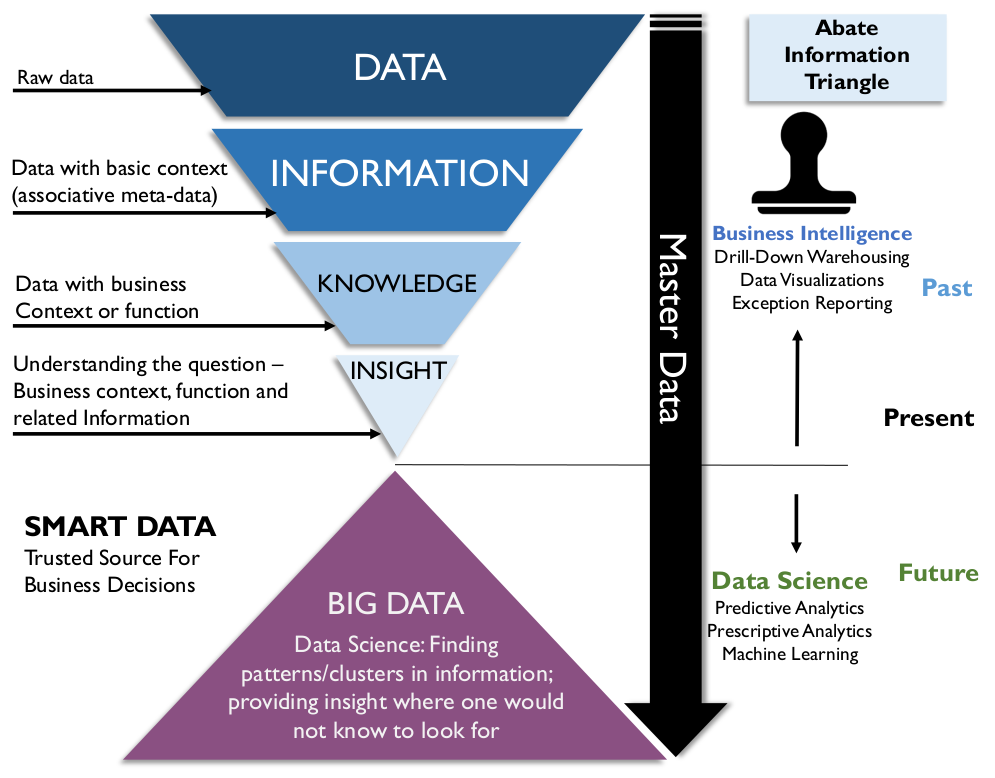
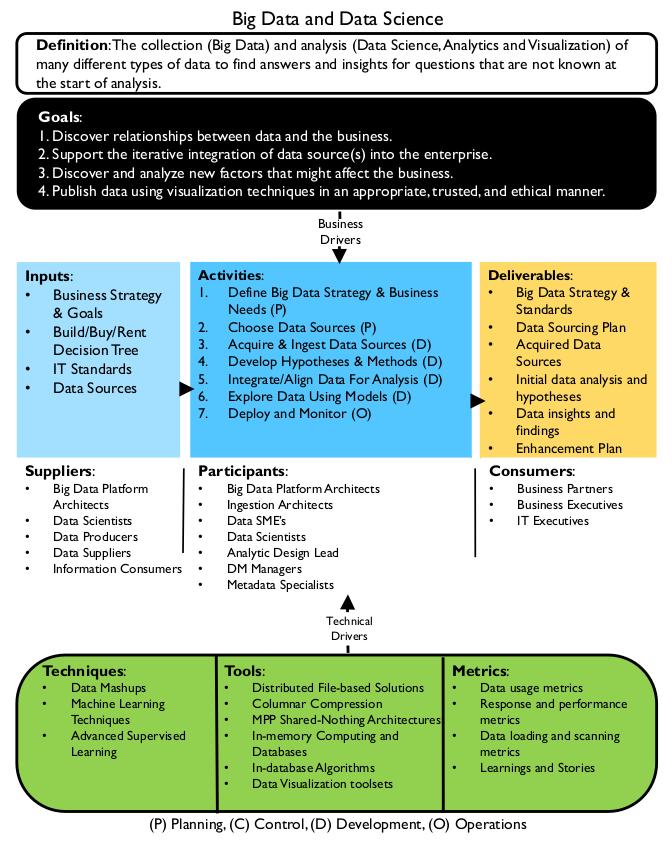
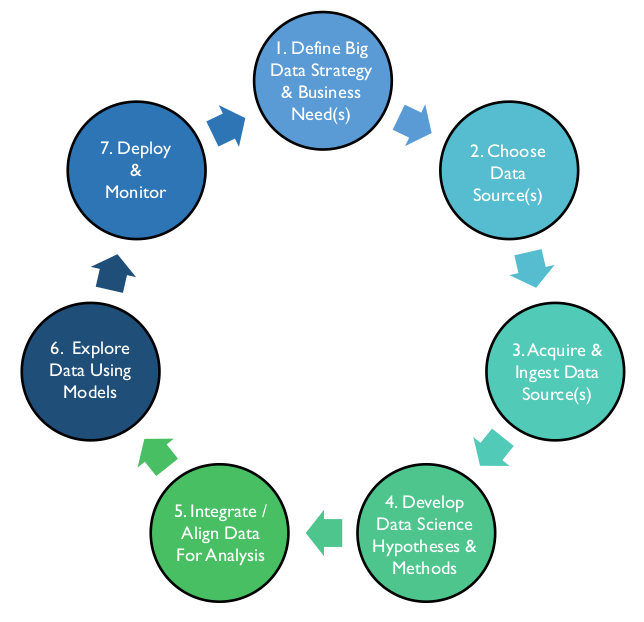
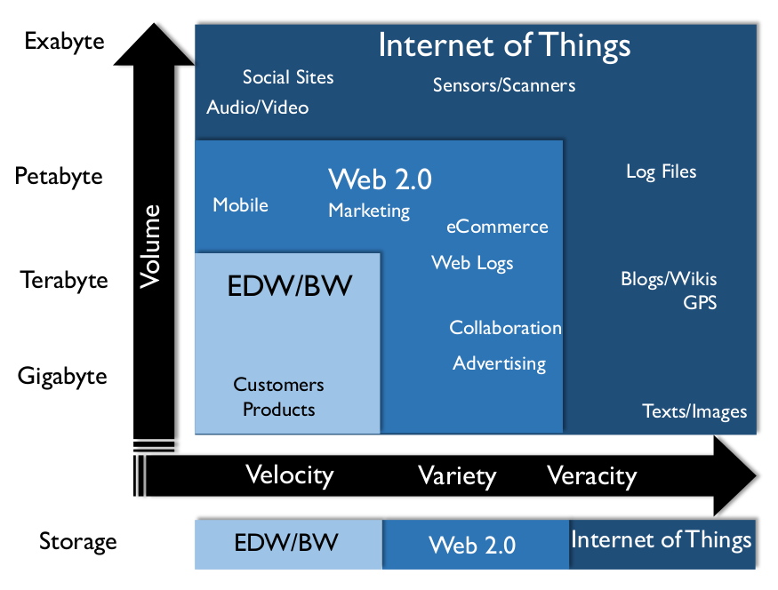
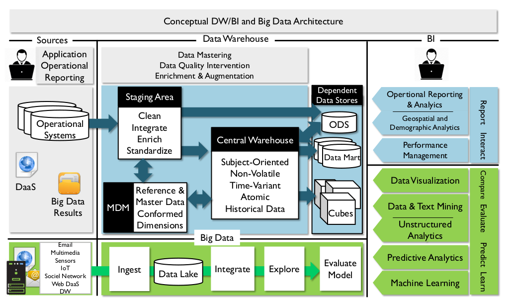
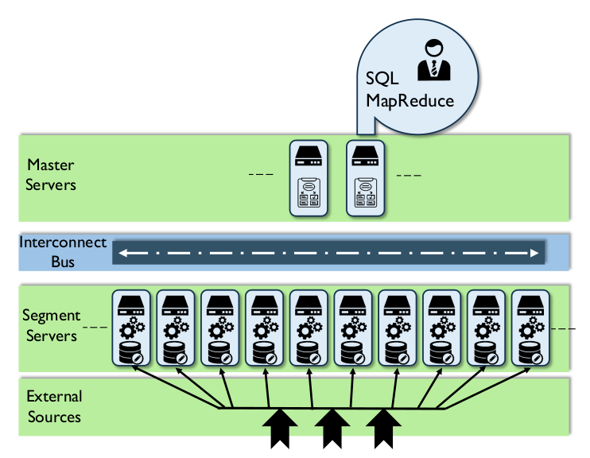

# Big Data e Ciência de Dados

## 1. Introdução

Desde o início dos anos 2000, os termos Big Data e Ciência de Dados têm sido, infelizmente, usados ​​como chavões. Os conceitos e suas implicações são mal compreendidos – ou, pelo menos, há um consenso limitado sobre seu significado. Até mesmo o significado de "Big" é relativo. Dito isso, tanto Big Data quanto Ciência de Dados estão conectados a mudanças tecnológicas significativas que permitiram às pessoas gerar, armazenar e analisar quantidades cada vez maiores de dados. Mais importante ainda, as pessoas podem usar esses dados para prever e influenciar comportamentos, bem como para obter insights sobre uma variedade de assuntos importantes, como práticas de saúde, gestão de recursos naturais e desenvolvimento econômico.

Big Data se refere não apenas ao volume de dados, mas também à sua variedade (estruturados e não estruturados, documentos, arquivos, dados de áudio, vídeo e streaming, etc.) e à velocidade com que são produzidos (velocidade). Pessoas que exploram e desenvolvem modelos e análises preditivas, de aprendizado de máquina e prescritivas a partir desses dados e os disponibilizam para análise pelas partes interessadas são chamadas de Cientistas de Dados.

A Ciência de Dados existe há muito tempo; costumava ser chamada de "estatística aplicada". Mas a capacidade de explorar padrões de dados evoluiu rapidamente no século XXI com o advento do Big Data e das tecnologias que o suportam. O Business Intelligence tradicional fornece relatórios "de espelho retrovisor" – análises de dados estruturados para descrever tendências passadas. Em alguns casos, padrões de BI são usados ​​para prever comportamentos futuros, mas não com alta confiança. Até recentemente, a análise aprofundada de enormes conjuntos de dados era limitada pela tecnologia. As análises dependiam de amostragem ou outros meios de abstração para aproximar padrões. À medida que a capacidade de coletar e analisar grandes conjuntos de dados crescia, os Cientistas de Dados integravam métodos de matemática, estatística, ciência da computação, processamento de sinais, modelagem de probabilidade, reconhecimento de padrões, aprendizado de máquina, modelagem de incertezas e visualização de dados para obter insights e prever comportamentos com base em conjuntos de Big Data. Em suma, a Ciência de Dados encontrou novas maneiras de analisar e extrair valor dos dados.

À medida que o Big Data foi incorporado aos ambientes de data warehouse e Business Intelligence, técnicas de Ciência de Dados são utilizadas para fornecer uma visão prospectiva (ou "para-brisa") da organização. Recursos preditivos, em tempo real e baseados em modelos, utilizando diferentes tipos de fontes de dados, oferecem às organizações uma melhor compreensão de para onde estão se direcionando. (Ver Figura 96.)

Figura 96 ​​Triângulo de Informações de Redução

Para aproveitar as vantagens do Big Data, no entanto, é necessária uma mudança na forma como os dados são gerenciados. A maioria dos data warehouses é baseada em modelos relacionais. O Big Data geralmente não é organizado em um modelo relacional. A maioria dos data warehouses depende do conceito de ETL (Extração, Transformação e Carregamento). Soluções de Big Data, como data lakes, dependem do conceito de ELT – carregamento e, em seguida, transformação. Igualmente importante, a velocidade e o volume de dados apresentam desafios que exigem abordagens diferentes para aspectos críticos do gerenciamento de dados, como integração, Gerenciamento de Metadados e avaliação da Qualidade dos Dados.

### 1.1 Impulsionadores de Negócios

O maior impulsionador de negócios para o desenvolvimento de capacidades organizacionais em torno de Big Data e Ciência de Dados é o desejo de encontrar e aproveitar oportunidades de negócios que podem ser descobertas por meio de conjuntos de dados gerados por meio de uma gama diversificada de processos. O Big Data pode estimular a inovação, disponibilizando conjuntos de dados maiores e em maior quantidade para exploração. Esses dados podem ser usados ​​para definir modelos preditivos que antecipam as necessidades dos clientes e permitem a apresentação personalizada de produtos e serviços. A Ciência de Dados pode aprimorar as operações. Algoritmos de aprendizado de máquina podem automatizar atividades complexas e demoradas, melhorando assim a eficiência organizacional, reduzindo custos e mitigando riscos.

Figura 97 Diagrama de Contexto: Big Data e Ciência de Dados

### 1.2 Princípios

A promessa do Big Data – de que fornecerá um tipo diferente de insight – depende da capacidade de gerenciar Big Data. De muitas maneiras, devido à ampla variação de fontes e formatos, o gerenciamento de Big Data exigirá mais disciplina do que o gerenciamento de dados relacionais. Os princípios relacionados ao gerenciamento de Big Data ainda não estão totalmente definidos, mas um é muito claro: as organizações devem gerenciar cuidadosamente os metadados relacionados às fontes de Big Data para obter um inventário preciso dos arquivos de dados, suas origens e seu valor.

### 1.3 Conceitos Essenciais

#### 1.3.1 Ciência de Dados

Conforme observado na introdução do capítulo, a Ciência de Dados combina mineração de dados, análise estatística e aprendizado de máquina com recursos de integração e modelagem de dados para construir modelos preditivos que exploram padrões de conteúdo de dados. O desenvolvimento de modelos preditivos às vezes é chamado de Ciência de Dados porque o analista de dados, ou cientista de dados, usa o método científico para desenvolver e avaliar um modelo.

O cientista de dados desenvolve uma hipótese sobre o comportamento que pode ser observado nos dados antes de uma ação específica. Por exemplo, a compra de um tipo de item geralmente é seguida pela compra de outro tipo de item (a compra de uma casa geralmente é seguida pela compra de móveis). Em seguida, o cientista de dados analisa grandes quantidades de dados históricos para determinar com que frequência a hipótese se mostrou verdadeira no passado e para verificar estatisticamente a provável precisão do modelo. Se uma hipótese for válida com frequência suficiente e se o comportamento que ela prevê for útil, o modelo pode se tornar a base para um processo de inteligência operacional para prever comportamentos futuros, possivelmente até mesmo em tempo real, como em anúncios de vendas sugestivos.

O desenvolvimento de soluções de Ciência de Dados envolve a inclusão iterativa de fontes de dados em modelos que geram insights. A Ciência de Dados depende de:

* **Fontes de dados ricas:** Dados com potencial para mostrar padrões de comportamento organizacional ou do cliente que, de outra forma, seriam invisíveis
* **Alinhamento e análise de informações:** Técnicas para compreender o conteúdo dos dados e combinar conjuntos de dados para formular hipóteses e testar padrões significativos
* **Entrega de informações:** Executar modelos e algoritmos matemáticos com os dados e produzir visualizações e outros resultados para obter insights sobre o comportamento
* **Apresentação de descobertas e insights de dados:** Análise e apresentação de descobertas para que os insights possam ser compartilhados

A Tabela 32 compara o papel do DW/BI tradicional com a análise preditiva e prescritiva que pode ser alcançada por meio de técnicas de Ciência de Dados.

<table>
  <thead>
    <tr>
      <th>DW / BI Tradicional</th>
      <th colspan="2">Ciência de Dados</th>
    </tr>
  </thead>
  <tbody>
    <tr>
      <td>Descritivo</td>
      <td>Preditivo</td>
      <td>Prescritivo</td>
    </tr>
    <tr>
      <td>Retrospectivo</td>
      <td>Insight</td>
      <td>Prospectivo</td>
    </tr>
    <tr>
      <td>
        Com base no histórico: O que aconteceu? Por que aconteceu?
      </td>
      <td>
        Com base em modelos preditivos: O que é provável que aconteça?
      </td>
      <td>
        Com base em cenários: O que devemos fazer para que as coisas aconteçam?
      </td>
    </tr>
  </tbody>
</table>

#### 1.3.2 O Processo de Ciência de Dados

A Figura 98 ilustra as fases iterativas do processo de Ciência de Dados. As saídas de cada etapa tornam-se as entradas para a próxima. (Consulte a Seção 2.)

Figura 98 Processo de Ciência de Dados

O processo de Ciência de Dados segue o método científico de refinar o conhecimento por meio de observações, formulação e teste de hipóteses, observação de resultados e formulação de teorias gerais que explicam os resultados. Na Ciência de Dados, esse processo se dá por meio da observação de dados e da criação e avaliação de modelos de comportamento:

* **Definir a estratégia de Big Data e as necessidades de negócios:** Definir os requisitos que identificam os resultados desejados com benefícios tangíveis e mensuráveis.
* **Escolher fontes de dados:** Identificar lacunas na base de ativos de dados atual e encontrar fontes de dados para preenchê-las.
* **Adquirir e ingerir fontes de dados:** Obter conjuntos de dados e integrá-los.

* **Desenvolver hipóteses e métodos de Ciência de Dados:** Explorar fontes de dados por meio de criação de perfil, visualização, mineração, etc.; refinar requisitos. Definir entradas, tipos ou hipóteses de algoritmos de modelo e métodos de análise (por exemplo, agrupamentos de dados encontrados por clustering, etc.).
* **Integrar e alinhar dados para análise:** A viabilidade do modelo depende, em parte, da qualidade dos dados de origem. Utilizar fontes confiáveis ​​e credíveis. Aplicar técnicas adequadas de integração e limpeza de dados para aumentar a qualidade e a utilidade dos conjuntos de dados provisionados.
* **Explorar dados usando modelos:** Aplicar análise estatística e algoritmos de aprendizado de máquina aos dados integrados. Validar, treinar e, ao longo do tempo, evoluir o modelo. O treinamento envolve execuções repetidas do modelo em relação a dados reais para verificar suposições e fazer ajustes, como identificar outliers. Por meio desse processo, os requisitos serão refinados. Métricas iniciais de viabilidade guiam a evolução do modelo. Novas hipóteses podem ser introduzidas, exigindo conjuntos de dados adicionais, e os resultados dessa exploração moldarão a modelagem e os resultados futuros (até mesmo alterando os requisitos).
* **Implantar e monitorar:** Os modelos que produzem informações úteis podem ser implantados na produção para monitoramento contínuo de valor e eficácia. Frequentemente, projetos de Ciência de Dados se transformam em projetos de data warehouse, onde processos de desenvolvimento mais rigorosos são implementados (ETL, DQ, Dados Mestres, etc.).

#### 1.3.3 Big Data

Os primeiros esforços para definir o significado de Big Data o caracterizaram em termos dos Três Vs: Volume, Velocidade e Variedade (Laney, 2001). À medida que mais organizações começam a aproveitar o potencial do Big Data, a lista de Vs se expande:

* **Volume:** Refere-se à quantidade de dados. O Big Data geralmente possui milhares de entidades ou elementos em bilhões de registros.
* **Velocidade:** Refere-se à velocidade com que os dados são capturados, gerados ou compartilhados. O Big Data é frequentemente gerado e também pode ser distribuído e até analisado em tempo real.
* **Variedade/Variabilidade:** Refere-se às formas em que os dados são capturados ou entregues. O Big Data exige o armazenamento de múltiplos formatos; a estrutura dos dados costuma ser inconsistente dentro ou entre conjuntos de dados.
* **Viscosidade:** Refere-se à dificuldade de uso ou integração dos dados.
* **Volatilidade:** Refere-se à frequência com que ocorrem alterações nos dados e, portanto, por quanto tempo os dados são úteis.
* **Veracidade:** Refere-se à confiabilidade dos dados.

Os volumes de Big Data são excepcionalmente grandes (maiores que 100 Terabytes e frequentemente na faixa de Petabytes e Exabytes). Em soluções de armazenamento e análise, volumes muito grandes de dados representam desafios para o carregamento, a modelagem, a limpeza e a análise de dados. Esses desafios costumam ser resolvidos por meio de processamento paralelo massivo ou processamento paralelo e soluções de dados distribuídos. No entanto, eles têm implicações muito mais amplas. O tamanho dos conjuntos de dados exige mudanças na forma como os dados são armazenados e acessados, bem como na forma como os dados são compreendidos (por exemplo, grande parte da nossa forma atual de pensar sobre dados baseia-se em estruturas de bancos de dados relacionais) e na forma como os dados são gerenciados (Adams, 2009). A Figura 99 apresenta um resumo visual da gama de dados que se tornou disponível por meio de tecnologias de Big Data e as implicações nas opções de armazenamento de dados.

Figura 99 Desafios de Armazenamento de Dados [^88]

#### 1.3.4 Componentes da Arquitetura de Big Data

A seleção, instalação e configuração de um ambiente de Big Data e Ciência de Dados exigem conhecimento especializado. Arquiteturas ponta a ponta devem ser desenvolvidas e racionalizadas em relação às ferramentas de exploração de dados existentes e às novas aquisições.

A Figura 100 descreve a Arquitetura de DW/BI e Big Data. (Detalhes sobre os componentes de DW/BI são descritos no Capítulo 11.) A maior diferença entre o processamento de DW/BI e Big Data é que, em um data warehouse tradicional, os dados são integrados à medida que são trazidos para o data warehouse (extração, TRANSFORMAÇÃO, carregamento); enquanto em um ambiente de Big Data, os dados são ingeridos e carregados antes de serem integrados (extração, CARREGAMENTO, transformação). Em alguns casos, os dados podem não ser integrados de forma alguma, no sentido tradicional. Em vez de serem integrados na preparação para o uso, eles são frequentemente integrados por meio de usos específicos (por exemplo, o processo de construção de modelos preditivos impulsiona a integração de conjuntos de dados específicos).

Figura 100 - Arquitetura Conceitual de DW/BI e Big Data

A diferença entre ETL e ELT tem implicações significativas na forma como os dados são gerenciados. Por exemplo, o processo de integração não depende necessariamente de um modelo de dados corporativo ou o produz. O risco é que muito conhecimento sobre os dados possa ser perdido se os processos de ingestão e uso forem executados de forma ad hoc. Há a necessidade de coletar e gerenciar metadados relacionados a esses processos, para que eles sejam compreendidos e aproveitados ao longo do tempo.

As seções a seguir descreverão as Fontes de Big Data e a construção do Data Lake. As atividades (Ingestão, Integração, Exploração e Avaliação do Modelo) são exploradas na seção Atividades.

#### 1.3.5 Fontes de Big Data

Como grande parte da atividade humana é executada eletronicamente, enormes quantidades de dados se acumulam todos os dias à medida que nos movemos pelo mundo, interagimos uns com os outros e realizamos transações comerciais. O Big Data é produzido por e-mail, mídias sociais, pedidos online e até mesmo videogames online. Os dados são gerados não apenas por telefones e dispositivos de ponto de venda, mas também por sistemas de vigilância, sensores em sistemas de transporte, sistemas de monitoramento médico, sistemas de monitoramento industrial e de serviços públicos, satélites e equipamentos militares. Por exemplo, um voo pode gerar um terabyte de dados. Dispositivos que interagem diretamente com a internet geram uma grande parcela de Big Data. As conexões entre dispositivos e a internet são às vezes chamadas de Internet das Coisas (IoT).

#### 1.3.6 Lago de Dados

Um lago de dados é um ambiente onde uma grande quantidade de dados de vários tipos e estruturas pode ser ingerida, armazenada, avaliada e analisada. Lagos de dados podem servir a muitas finalidades. Por exemplo, fornecendo

* Um ambiente para Cientistas de Dados minerarem e analisarem dados
* Uma área de armazenamento central para dados brutos, com transformação mínima, se houver,
* Armazenamento alternativo para dados históricos detalhados de data warehouse
* Um arquivo online para registros
* Um ambiente para ingestão de dados em streaming com identificação automatizada de padrões

Um data lake pode ser implementado como uma configuração complexa de ferramentas de tratamento de dados, incluindo Hadoop ou outros sistemas de armazenamento de dados, serviços de cluster, transformação e integração de dados. Esses manipuladores têm facilitado a integração entre infraestruturas e softwares de facilitação analítica para unir a configuração.

O risco de um data lake é que ele pode rapidamente se tornar um pântano de dados – confuso, sujo e inconsistente. Para estabelecer um inventário do que está em um data lake, é fundamental gerenciar os Metadados à medida que os dados são ingeridos. Para entender como os dados em um data lake estão associados ou conectados, arquitetos ou engenheiros de dados frequentemente usam chaves exclusivas ou outras técnicas (modelos semânticos, modelos de dados, etc.) para que cientistas de dados e outros desenvolvedores de visualização saibam como usar as informações armazenadas no data lake. (Veja Capítulo 9.)

#### 1.3.7 Arquitetura Baseada em Serviços

A arquitetura baseada em serviços (SBA) está emergindo como uma forma de fornecer dados imediatos (mesmo que não completamente precisos ou completos), bem como atualizar um conjunto de dados históricos completo e preciso, usando a mesma fonte (Abate, Aiken, Burke, 1997). A arquitetura SBA é semelhante às arquiteturas DW, que enviam dados diretamente para um ODS para acesso imediato, bem como para o DW para acumulação histórica. As arquiteturas SBA têm três componentes principais: uma camada de lote, uma camada de velocidade e uma camada de serviço. (Veja a Figura 101.)

* **Camada de lote:** Um data lake serve como camada de lote, contendo dados recentes e históricos
* **Camada de velocidade:** Contém apenas dados em tempo real
* **Camada de serviço:** Fornece uma interface para unir dados das camadas de lote e de velocidade

Os dados são carregados nas camadas de lote e de velocidade. Todos os cálculos analíticos são realizados com dados nas camadas de lote e de velocidade, o que provavelmente requer implementação em dois sistemas separados. As organizações abordam problemas de sincronização por meio de compensações entre completude, latência e complexidade das visualizações mescladas definidas na camada de serviço. Uma avaliação de custo/benefício é necessária para determinar se a redução da latência ou a melhoria da completude dos dados compensam o custo e a complexidade associados.

A camada de lote é frequentemente chamada de componente de estrutura ao longo do tempo (aqui, cada transação é uma inserção), enquanto na camada de velocidade (frequentemente chamada de Armazenamento de Dados Operacionais ou ODS), todas as transações são atualizações (ou inserções, somente se necessário). Dessa forma, a arquitetura evita problemas de sincronização e, ao mesmo tempo, cria uma camada de estado atual e uma camada de histórico. Essa arquitetura geralmente fornece seus dados por meio de uma camada de serviço ou de serviços de dados que abstrai os dados utilizando Metadados. Essa camada de serviços determina de onde os dados devem ser "servidos" e fornece adequadamente os dados solicitados.

Figura 101 Arquitetura Baseada em Serviços

#### 1.3.8 Aprendizado de Máquina

O Aprendizado de Máquina explora a construção e o estudo de algoritmos de aprendizagem. Pode ser visto como uma união de métodos de aprendizagem não supervisionada, mais comumente chamados de mineração de dados, e métodos de aprendizagem supervisionada profundamente enraizados na teoria matemática, especificamente estatística, combinatória e otimização. Um terceiro ramo está se formando, chamado aprendizado por reforço, onde o desempenho das metas é alcançado, mas não reconhecido especificamente pelo professor – dirigir um veículo, por exemplo. Programar máquinas para aprender rapidamente com consultas e se adaptar a conjuntos de dados em constante mudança levou a um campo completamente novo dentro do Big Data, conhecido como aprendizado de máquina. [^89] Os processos são executados e os resultados são armazenados, sendo então usados ​​em execuções subsequentes para informar iterativamente o processo e refinar os resultados.

O Aprendizado de Máquina explora a construção e o estudo de algoritmos de aprendizagem. Esses algoritmos se dividem em três tipos:

* **Aprendizagem supervisionada:** Baseada em regras generalizadas; Por exemplo, separando SPAM de e-mails não SPAM
* **Aprendizagem não supervisionada:** Baseada na identificação de padrões ocultos (por exemplo, mineração de dados)
* **Aprendizagem por reforço:** Baseada no alcance de um objetivo (por exemplo, derrotar um oponente no xadrez)

Modelagem estatística e aprendizado de máquina têm sido empregados para automatizar projetos de pesquisa e desenvolvimento, que de outra forma seriam custosos, realizando várias tentativas e erros em um vasto conjunto de dados, repetindo os testes com os resultados coletados, analisados ​​e corrigidos os erros. Essa abordagem pode reduzir drasticamente o tempo de resposta e orientar iniciativas organizacionais com insights baseados em processos repetíveis e com boa relação custo-benefício. Por exemplo, o CIVDDD utiliza aprendizado de máquina e técnicas complexas de visualização de dados científicos para ajudar agências governamentais e forças de manutenção da paz a enfrentar o desafio de lidar com a grande quantidade de informações relacionadas a ameaças. [^90]

Embora explore dados de novas maneiras, o aprendizado de máquina tem implicações éticas, especialmente no que diz respeito ao princípio da transparência. Evidências mostram que redes neurais de aprendizado profundo (DLNN) funcionam. Elas aprendem coisas. No entanto, nem sempre fica claro como elas aprendem. À medida que os algoritmos que impulsionam esses processos se tornam mais complexos, eles também se tornam mais opacos, funcionando como "caixas-pretas". Como consideram um número maior de variáveis ​​e essas próprias variáveis ​​são mais abstratas, os algoritmos testam os limites da capacidade humana de interpretar a máquina (Davenport, 2017). A necessidade de transparência – a capacidade de ver como as decisões são tomadas – provavelmente aumentará à medida que essa funcionalidade evolui e é utilizada em uma gama mais ampla de situações. (Ver Capítulo 2.)

#### 1.3.9 Análise de Sentimentos

Monitoramento de mídia e análise de texto são métodos automatizados para extrair insights de grandes volumes de dados não estruturados ou semiestruturados, como dados de transações, mídias sociais, blogs e sites de notícias. Isso é usado para entender o que as pessoas dizem e sentem sobre marcas, produtos, serviços ou outros tipos de tópicos. Usando Processamento de Linguagem Natural (PLN) ou analisando frases ou sentenças, a análise semântica pode detectar sentimentos e também revelar mudanças nos sentimentos para prever possíveis cenários.

Considere o caso de procurar palavras-chave em uma publicação. Se as palavras "bom" ou "ótimo" estiverem presentes, essa pode ser uma resposta positiva, enquanto ver "péssimo" ou "ruim" pode ser um sinal de que essa pode ser uma resposta negativa.

Ao categorizar os dados de acordo com os tipos de respostas, o "sentimento" de toda a comunidade ou publicação (mídias sociais como Twitter, blogs etc.) é exposto. Dito isso, o sentimento não é facilmente obtido, pois as palavras por si só não contam toda a história (por exemplo, "Tive um ótimo problema com o atendimento ao cliente"). O sentimento deve interpretar as palavras em contexto. Isso requer a compreensão do significado da publicação – essa interpretação frequentemente requer trabalho com funções de PLN encontradas em sistemas como o Watson da IBM.

#### 1.3.10 Mineração de Dados e Texto

A mineração de dados é um tipo específico de análise que revela padrões em dados usando vários algoritmos. Ela surgiu como um desdobramento do Aprendizado de Máquina, um subcampo da Inteligência Artificial. A teoria é um subconjunto da análise estatística conhecida como aprendizado não supervisionado, em que algoritmos são aplicados a um conjunto de dados sem conhecimento ou intenção do resultado desejado. Enquanto as ferramentas padrão de consulta e geração de relatórios fazem perguntas específicas, as ferramentas de mineração de dados ajudam a descobrir relações desconhecidas, revelando padrões. A mineração de dados é uma atividade fundamental durante a fase de exploração, pois facilita a identificação rápida dos elementos de dados estudados, identifica novas relações anteriormente desconhecidas, pouco claras ou não classificadas e fornece estrutura para a classificação dos elementos de dados estudados.

A mineração de texto analisa documentos com técnicas de análise de texto e mineração de dados para classificar o conteúdo automaticamente em ontologias guiadas por fluxo de trabalho e direcionadas por PMEs. Assim, a mídia de texto eletrônico pode ser analisada sem reestruturação ou reformatação. Ontologias podem ser vinculadas a mecanismos de busca, permitindo consultas via web nesses documentos. (Consulte o Capítulo 9.)

A mineração de dados e texto utiliza uma variedade de técnicas, incluindo:

* **Criação de perfil:** A criação de perfil tenta caracterizar o comportamento típico de um indivíduo, grupo ou população. A criação de perfil é usada para estabelecer normas comportamentais para aplicações de detecção de anomalias, como detecção de fraudes e monitoramento de intrusões em sistemas computacionais. Os resultados do perfil são entradas para muitos componentes de aprendizado não supervisionado.
* **Redução de dados:** A redução de dados substitui um grande conjunto de dados por um conjunto menor de dados que contém muitas das informações importantes do conjunto maior. O conjunto menor de dados pode ser mais fácil de analisar ou processar.
* **Associação:** A associação é um processo de aprendizado não supervisionado para encontrar relações entre os elementos estudados com base nas transações que os envolvem. Exemplos de associação incluem: mineração frequente de conjuntos de itens, descoberta de regras e análise baseada em mercado. Sistemas de recomendação na internet também utilizam esse processo.
* **Agrupamento:** Agrupar elementos de um estudo por suas características compartilhadas. A segmentação de clientes é um exemplo de agrupamento.
* **Mapas auto-organizáveis:** Mapas auto-organizáveis ​​são um método de rede neural para análise de agrupamentos. Às vezes chamados de Mapas de Kohonen, ou mapas topologicamente ordenados, eles visam reduzir a dimensionalidade no espaço de avaliação, preservando ao máximo as relações de distância e proximidade, semelhante à escala multidimensional. Reduzir a dimensionalidade é como remover uma variável da equação sem violar o resultado. Isso facilita a resolução e a visualização.

#### 1.3.11 Análise Preditiva

A Análise Preditiva é o subcampo da aprendizagem supervisionada em que os usuários tentam modelar elementos de dados e prever resultados futuros por meio da avaliação de estimativas de probabilidade. Profundamente enraizada na matemática, especificamente na estatística, a análise preditiva compartilha muitos componentes com a aprendizagem não supervisionada, com a diferença prescrita para a mensuração de um resultado preditivo desejado.

A Análise Preditiva é o desenvolvimento de modelos de probabilidade baseados em variáveis, incluindo dados históricos, relacionados a possíveis eventos (compras, variações de preço, etc.). Ao receber outras informações, o modelo desencadeia uma reação da organização. O fator desencadeador pode ser um evento, como um cliente adicionando um produto a uma cesta de compras online, ou podem ser dados em um fluxo de dados, como um feed de notícias ou dados de sensores de serviços públicos, ou um aumento no volume de solicitações de serviço. O fator desencadeador pode ser um evento externo. Notícias divulgadas sobre uma empresa são um grande preditor de uma variação no preço das ações. A previsão do movimento das ações deve incluir o monitoramento de notícias e a determinação da probabilidade de notícias sobre uma empresa serem boas ou ruins para o preço das ações.

Frequentemente, o fator desencadeador é o acúmulo de um grande volume de dados em tempo real, como um número extremamente alto de negociações ou solicitações de serviço ou a volatilidade do ambiente. O monitoramento de um fluxo de eventos de dados inclui a construção incremental nos modelos preenchidos até que um limite seja atingido, conforme definido no modelo. O tempo que um modelo preditivo fornece entre a previsão e o evento previsto é frequentemente muito pequeno (segundos ou menos de um segundo). O investimento em soluções tecnológicas de latência muito baixa, como bancos de dados em memória, redes de alta velocidade e até mesmo a proximidade física da fonte dos dados, otimiza a capacidade de uma organização de reagir à previsão.

A forma mais simples de modelo preditivo é a previsão. Existem muitas técnicas para tendências ou previsões baseadas em análise de regressão e se beneficiam da suavização. A maneira mais simples de suavizar dados é por meio de uma média móvel, ou mesmo uma média móvel ponderada. Técnicas mais avançadas podem ser úteis, como a média móvel exponencial, que introduz um fator de suavização a ser aplicado. Minimizar o resíduo de erro dos mínimos quadrados pode ser um ponto de partida, mas várias execuções são necessárias para determinar e otimizar o fator de suavização. Existem modelos de suavização exponencial dupla e tripla para abordar componentes de tendência e sazonalidade.

#### 1.3.12 Análise Prescritiva

A análise prescritiva leva a análise preditiva um passo adiante para definir ações que afetarão os resultados, em vez de apenas prever os resultados de ações já ocorridas. A análise prescritiva antecipa o que acontecerá, quando acontecerá e sugere por que acontecerá. Como a análise prescritiva pode mostrar as implicações de várias decisões, ela pode sugerir como aproveitar uma oportunidade ou evitar um risco. A análise prescritiva pode continuamente absorver novos dados para repredizer e represcrever. Esse processo pode melhorar a precisão da previsão e resultar em melhores prescrições.

#### 1.3.13 Análise de Dados Não Estruturados

A análise de dados não estruturados combina mineração de texto, associação, agrupamento e outras técnicas de aprendizado não supervisionado para codificar grandes conjuntos de dados. Técnicas de aprendizado supervisionado também podem ser aplicadas para fornecer orientação, supervisão e direcionamento no processo de codificação, aproveitando a intervenção humana para resolver ambiguidades quando necessário.

A análise de dados não estruturados está se tornando cada vez mais importante à medida que mais dados não estruturados são gerados. Algumas análises são impossíveis sem a capacidade de incorporar dados não estruturados em modelos analíticos. No entanto, dados não estruturados são difíceis de analisar sem alguma maneira de isolar os elementos de interesse dos elementos estranhos. A varredura e a marcação são uma maneira de adicionar "ganchos" a dados não estruturados que permitem a filtragem e a vinculação a dados estruturados relacionados. No entanto, saber quais tags gerar com base em quais condições é difícil. É um processo iterativo, desde o momento em que as condições propostas para as tags são identificadas, as tags são atribuídas à medida que os dados são ingeridos, e então a análise usa essas tags para validar a condição da tag e analisar os dados marcados, o que leva a condições de tag potencialmente alteradas ou a mais tags.

#### 1.3.14 Análise Operacional

O conceito de análise operacional (também conhecido como BI operacional ou análise de streaming) surgiu da integração da análise em tempo real às operações. A análise operacional inclui atividades como segmentação de usuários, análise de sentimentos, geocodificação e outras técnicas aplicadas a conjuntos de dados para análise de campanhas de marketing, penetração de vendas, adoção de produtos, otimização de ativos e gestão de riscos.

A análise operacional envolve o rastreamento e a integração de fluxos de informações em tempo real, a obtenção de conclusões com base em modelos preditivos de comportamento e o disparo de respostas e alertas automáticos. Projetar o modelo, os gatilhos e as respostas necessários para uma análise bem-sucedida exige uma análise mais aprofundada dos dados em si. Uma solução de análise operacional inclui a preparação de dados históricos para o pré-preenchimento dos modelos de comportamento. Por exemplo, em um modelo de produto de varejo, o preenchimento de uma análise de carrinho de compras que identifica produtos frequentemente comprados juntos. Na previsão do comportamento dos mercados financeiros, informações históricas de preços e a taxa histórica de variação de preços são usadas regularmente. Os cálculos de pré-preenchimento geralmente são realizados com antecedência para permitir respostas oportunas aos eventos desencadeadores.

Uma vez que os modelos preditivos tenham sido determinados como úteis e econômicos, soluções que integram dados históricos e atuais (incluindo dados em tempo real e em streaming, estruturados e não estruturados) são implementadas para preencher os modelos preditivos e desencadear ações com base nas previsões. A solução deve garantir que os fluxos de dados em tempo real que utilizam as regras do modelo sejam processados ​​corretamente e que as respostas automatizadas a eventos significativos nos dados sejam geradas corretamente.

#### 1.3.15 Visualização de Dados [^91]

Visualização é o processo de interpretar conceitos, ideias e fatos por meio de imagens ou representações gráficas. A visualização de dados facilita a compreensão dos dados subjacentes, apresentando-os em um resumo visual, como um gráfico. As visualizações de dados condensam e encapsulam dados característicos, tornando-os mais fáceis de visualizar. Ao fazer isso, podem revelar oportunidades, identificar riscos ou destacar mensagens. As visualizações de dados podem ser entregues em um formato estático, como um relatório publicado, ou em um formato online mais interativo; e algumas oferecem suporte à interação do usuário final, onde recursos de detalhamento ou filtragem facilitam a análise dos dados dentro da visualização. Outros permitem que a visualização seja alterada pelo usuário sob demanda por meio de exibições inovadoras, como mapas de dados e paisagens móveis de dados ao longo do tempo.

A visualização tem sido fundamental para a análise de dados há muito tempo. As ferramentas tradicionais de BI incluem opções de visualização como tabelas, gráficos de pizza, gráficos de linhas, gráficos de área, gráficos de barras, histogramas e caixas prontas para uso (candlesticks). Para atender à crescente necessidade de compreensão dos dados, o número de ferramentas de visualização aumentou e as técnicas foram aprimoradas.

À medida que a análise de dados amadurece, a visualização de dados de novas maneiras oferecerá vantagens estratégicas. Identificar novos padrões nos dados pode resultar em novas oportunidades de negócios. À medida que a visualização de dados continua a evoluir, as organizações precisarão expandir suas equipes de Business Intelligence para competir em um mundo cada vez mais orientado por dados. Os departamentos de análise de negócios buscarão especialistas em dados com habilidades de visualização, incluindo cientistas de dados, artistas de dados e especialistas em visão de dados, além dos tradicionais arquitetos de informação e modeladores de dados, especialmente considerando os riscos associados à visualização enganosa. (Ver Capítulo 2.)

#### 1.3.16 Mashups de Dados

Mashups combinam dados e serviços para criar visualizações para insights ou análises. Muitas ferramentas de virtualização permitem mashups por meio de funcionalidades que relacionam fontes de dados por elementos de dados comuns, originalmente usados ​​para relacionar um nome ou texto descritivo a um código armazenado. Essa técnica de mashup de apresentação ao cliente é ideal durante as fases de descoberta ou exploração, pois proporciona benefícios imediatos. Essa técnica pode ser facilmente aplicada à web, onde mashups de dados seguros permitem o compartilhamento de informações pessoais ou confidenciais entre fornecedores ou provedores. Eles podem ser combinados com algoritmos de aprendizado de inteligência artificial para expor serviços baseados na internet com interfaces de linguagem natural.

## 2. Atividades

### 2.1 Definir a Estratégia de Big Data e as Necessidades de Negócio

A estratégia de Big Data de uma organização precisa estar alinhada e apoiar sua estratégia geral de negócios e requisitos de negócio, além de fazer parte de sua estratégia de dados. Uma estratégia de Big Data deve incluir critérios para avaliar:

* Quais problemas a organização está tentando resolver. Para que ela precisa de análise: Embora uma vantagem da Ciência de Dados seja que ela pode fornecer uma nova perspectiva sobre uma organização, a organização ainda precisa ter um ponto de partida. Uma organização pode determinar que os dados sejam usados ​​para entender o negócio ou o ambiente de negócios; para comprovar ideias sobre o valor de novos produtos; para explorar algo desconhecido; ou para inventar uma nova maneira de fazer negócios. É importante estabelecer um processo de seleção para avaliar essas iniciativas em várias fases durante a implementação. O valor e a viabilidade das iniciativas precisam ser avaliados em vários momentos.
* Quais fontes de dados usar ou adquirir: Fontes internas podem ser fáceis de usar, mas também podem ter escopo limitado. Fontes externas podem ser úteis, mas estão fora do controle operacional (gerenciadas por terceiros ou não controladas por ninguém, como no caso das mídias sociais). Muitos fornecedores competem nesse segmento e, frequentemente, existem múltiplas fontes para os elementos ou conjuntos de dados desejados. A aquisição de dados que se integram aos itens de ingestão existentes pode reduzir os custos gerais de investimento.
* A pontualidade e o escopo dos dados a serem provisionados: Muitos elementos podem ser fornecidos em feeds em tempo real, snapshots em um determinado momento ou até mesmo integrados e resumidos. Dados de baixa latência são ideais, mas frequentemente comprometem os recursos de aprendizado de máquina – há uma enorme diferença entre algoritmos computacionais direcionados a dados em repouso e streaming. Não minimize o nível de integração necessário para uso posterior.
* O impacto e a relação com outras estruturas de dados: Pode ser necessário fazer alterações na estrutura ou no conteúdo de outras estruturas de dados para torná-las adequadas para integração com conjuntos de Big Data.
* Influências sobre dados modelados existentes: Incluindo a ampliação do conhecimento sobre clientes, produtos e abordagens de marketing.

A estratégia determinará o escopo e o cronograma do roteiro de capacidades de Big Data de uma organização.

### 2.2 Escolha das Fontes de Dados

Como em qualquer projeto de desenvolvimento, a escolha das fontes de dados para o trabalho de Ciência de Dados deve ser orientada pelos problemas que a organização está tentando resolver. A diferença com o desenvolvimento de Big Data/Ciência de Dados é que a gama de fontes de dados é mais ampla. Ela não é limitada pelo formato e pode incluir dados externos e internos à organização. A capacidade de incorporar esses dados em uma solução também traz riscos. A qualidade e a confiabilidade dos dados precisam ser avaliadas e um plano de uso ao longo do tempo precisa ser implementado. Ambientes de Big Data permitem a ingestão rápida de grandes quantidades de dados, mas para utilizá-los e gerenciá-los ao longo do tempo, ainda é necessário conhecer os fatos básicos:

* Sua origem
* Seu formato
* O que os elementos de dados representam
* Como se conectam a outros dados
* Com que frequência serão atualizados

À medida que mais dados se tornam disponíveis (como Estatísticas do US Census Bureau, dados demográficos de compras, dados de satélites meteorológicos, conjuntos de dados de pesquisa), os dados precisam ser avaliados quanto ao seu valor e confiabilidade. Revise as fontes de dados disponíveis e os processos que as criam e gerencie o plano para novas fontes.

* **Dados fundamentais:** Considere componentes de dados fundamentais, como PDV (Ponto de Venda), em uma análise de vendas.
* **Granularidade:** O ideal é obter os dados em sua forma mais granular (não agregada). Dessa forma, eles podem ser agregados para diversas finalidades.
* **Consistência:** Se possível, selecione dados que apareçam de forma adequada e consistente em todas as visualizações ou reconheça as limitações.

* **Confiabilidade:** Escolha fontes de dados que sejam significativas e confiáveis ​​ao longo do tempo. Utilize fontes confiáveis ​​e autorizadas.
* **Inspecione/perfile novas fontes:** Teste as alterações antes de adicionar novos conjuntos de dados. Material inesperado ou alterações significativas nos resultados da visualização podem ocorrer com a inclusão de novas fontes de dados.

Os riscos associados às fontes de dados incluem preocupações com a privacidade. A capacidade de ingerir e integrar rapidamente dados de uma variedade de fontes em escala oferece às comunidades a capacidade de recombinar conjuntos de dados que, de outra forma, seriam protegidos. Da mesma forma, a análise publicada pode descrever, por meio de resumo, agregação ou estado modelado, um subconjunto do público que o torna repentinamente identificável; este é um efeito colateral da capacidade de realizar cálculos em massa em populações muito grandes, mas publicar para um local ou região muito específico. Por exemplo, quando dados demográficos computados em nível nacional ou de país rapidamente se tornam não identificáveis, mas não quando publicados após a filtragem por código postal ou nível de domicílio. [^92]

Os critérios utilizados para selecionar ou filtrar dados também representam um risco. Esses critérios devem ser gerenciados objetivamente para evitar vieses ou distorções. A filtragem pode ter um impacto significativo na visualização. É necessário critério ao remover valores discrepantes, restringir conjuntos de dados a um domínio limitado ou descartar elementos esparsos. É prática comum concentrar os dados provisionados para enfatizar os resultados de isolamento, mas isso deve ser feito de forma objetiva e uniforme. [^93] (Consulte o Capítulo 2.)

### 2.3 Aquisição e Ingestão de Fontes de Dados

Uma vez identificadas as fontes, elas precisam ser encontradas, às vezes adquiridas e ingeridas (carregadas) no ambiente de Big Data. Durante esse processo, capture Metadados críticos sobre a fonte, como sua origem, tamanho, atualidade e conhecimento adicional sobre o conteúdo. Muitos mecanismos de ingestão criam perfis de dados à medida que são ingeridos, fornecendo aos analistas pelo menos Metadados parciais. Uma vez que os dados estejam em um data lake, eles podem ser avaliados quanto à sua adequação para múltiplos esforços de análise. Como a construção de modelos de Ciência de Dados é um processo iterativo, a ingestão de dados também o é. Identifique iterativamente lacunas na base atual de ativos de dados e integre essas fontes. Explore essas fontes de dados usando criação de perfil, visualização, mineração ou outros métodos de Ciência de Dados para definir entradas de algoritmos de modelo ou hipóteses de modelo.

Antes de integrar os dados, avalie sua qualidade. A avaliação pode ser tão simples quanto uma consulta para descobrir quantos campos contêm valores nulos, ou tão complexa quanto executar um conjunto de ferramentas de qualidade de dados ou um utilitário de análise de dados para criar um perfil, classificar e identificar relacionamentos entre os elementos de dados. Essa avaliação fornece insights sobre se os dados fornecem uma amostra válida para trabalhar e, em caso afirmativo, como os dados podem ser armazenados e acessados ​​(dispersos por unidades lógicas de processamento [MPP], federados, distribuídos por chave, etc.). Esse trabalho envolve especialistas (geralmente os próprios cientistas de dados) e engenheiros de plataforma.

O processo de avaliação fornece insights valiosos sobre como os dados podem ser integrados a outros conjuntos de dados, como Dados Mestres ou dados históricos de warehouse. Também fornece informações que podem ser usadas em conjuntos de treinamento de modelos e atividades de validação.

### 2.4 Desenvolver Hipóteses e Métodos de Dados

Ciência de Dados consiste em construir conjuntos de respostas que possam encontrar significado ou insights dentro dos dados. O desenvolvimento de soluções de Ciência de Dados envolve a construção de modelos estatísticos que encontrem correlações e tendências dentro e entre elementos de dados e conjuntos de dados. Haverá múltiplas respostas para uma pergunta com base nas entradas de um modelo. Por exemplo, é preciso escolher uma taxa de retorno para calcular o valor futuro de uma carteira financeira. Os modelos geralmente têm mais de uma variável, portanto, a melhor prática é encontrar resultados determinísticos – ou, em outras palavras, usar as melhores estimativas quanto aos valores esperados. No entanto, as melhores estimativas em si devem ser fundamentadas. Cada modelo operará dependendo do método de análise escolhido. Ele deve ser testado para uma gama de resultados, mesmo aqueles que parecem menos prováveis.

Os modelos dependem tanto da qualidade dos dados de entrada quanto da solidez do próprio modelo. Os modelos de dados geralmente podem fornecer insights sobre como correlacionar as informações encontradas. Um exemplo disso é o uso do agrupamento K-Means para determinar o número de agrupamentos de dados a serem analisados ​​posteriormente. (Ver Capítulo 13.)

### 2.5 Integrar/Alinhar Dados para Análise

Preparar os dados para análise envolve entender o que está nos dados, encontrar conexões entre os dados das diversas fontes e alinhar os dados comuns para uso.

Em muitos casos, unir fontes de dados é mais uma arte do que uma ciência. Por exemplo, considere um conjunto de dados baseado em atualizações diárias e outro baseado em atualizações mensais. Os dados diários, para serem alinhados, teriam que ser agregados para que houvesse um padrão de alinhamento que pudesse ser usado na investigação de Ciência de Dados. Um método é usar um modelo comum que integra os dados usando uma chave comum. Outra maneira é varrer e unir os dados usando índices dentro dos mecanismos de banco de dados para similaridade e algoritmos e métodos de vinculação de registros. Frequentemente, os dados são inspecionados durante as fases iniciais para entender como podem ser analisados. A agregação ajuda a determinar o agrupamento das saídas de dados. Outros métodos podem encontrar correlações que serão usadas para construir o modelo e exibir os resultados. Considere o uso de técnicas durante as fases iniciais que ajudarão a entender como o modelo apresentará resultados após a publicação.

A maioria das soluções exige a integração de Dados Mestres e Dados de Referência para interpretar os resultados da análise. (Consulte o Capítulo 10.)

### 2.6 Explorar Dados Usando Modelos

#### 2.6.1 Preencher Modelo Preditivo

A configuração de modelos preditivos inclui o pré-preenchimento do modelo com informações históricas sobre o cliente, mercado, produtos ou outros fatores incluídos no modelo, além do fator desencadeante. Os cálculos de pré-preenchimento geralmente são realizados com antecedência para permitir uma resposta mais rápida aos eventos desencadeantes. Por exemplo, o histórico de compras do cliente seria necessário para pré-preencher um modelo de recomendação de cesta de compras do mercado varejista. Na previsão do comportamento dos mercados varejistas, informações históricas de preços e variações de preços são combinadas com informações do cliente, demográficas e climáticas.

### 2.6.2 Treinar o Modelo

Executar o modelo em relação aos dados para "treiná-lo". O treinamento inclui execuções repetidas do modelo em relação aos dados para verificar as premissas. O treinamento resultará em alterações no modelo. O treinamento requer equilíbrio. Evite o sobreajuste treinando em uma base de dados limitada.

A validação do modelo deve ser concluída antes da transição para a produção. Corrigir quaisquer desequilíbrios populacionais ou vieses de dados com compensações do modelo treinadas e validadas; Isso pode ser ajustado na produção, à medida que o deslocamento inicial é gradualmente ajustado por meio de interações populacionais reais. A otimização da combinação de recursos pode ser realizada com cosseleção bayesiana, inversão de classificador ou indução de regras. Os modelos também podem ser combinados para aprendizado conjunto, onde o modelo preditor é construído combinando os pontos fortes coletados de modelos mais simples. Identificar outliers ou anomalias (objetos de dados que não estão em conformidade com o comportamento geral exibido pelos elementos estudados) é fundamental para a avaliação do modelo. Para conjuntos de dados mais voláteis, aplique um teste de variância baseado na média e no desvio padrão. Ambos os testes podem ser facilmente aplicados em resultados perfilados. Pode ser que os outliers sejam o alvo do exercício, em vez de encontrar e validar tendências na maioria dos dados. Para análise preditiva, use um fluxo de dados em tempo real para finalizar a população do modelo preditivo e disparar uma resposta, que pode ser um alerta ou um evento. O fluxo de dados pode exigir foco especial no projeto e desenvolvimento de uma capacidade de processamento de latência extremamente baixa. Em alguns modelos, a diferença no valor das previsões entre frações de segundo é extrema e as soluções podem exigir tecnologia inovadora com limitações de velocidade da luz.

Os modelos podem utilizar diversas funções e técnicas estatísticas disponíveis em bibliotecas de código aberto, uma delas é o "R". O Projeto R para Computação Estatística é um ambiente de software livre para computação estatística; ele contém diversas funções como chamadas de serviço. [^94] Funções personalizadas podem ser desenvolvidas utilizando a linguagem de script e compartilhadas entre ferramentas, plataformas e organizações.

Uma vez que o design da solução tenha sido criado e o desenvolvimento e a operação estimados, a organização pode decidir se desenvolverá a solução para prever o comportamento. Soluções de análise operacional em tempo real frequentemente exigem quantidades substanciais de nova arquitetura e desenvolvimento e podem não ser economicamente viáveis.

#### 2.6.3 Avaliar o Modelo

Assim que os dados são colocados em uma plataforma e estão prontos para análise, a Ciência de Dados começa. O modelo é construído, avaliado em relação a conjuntos de treinamento e validado. Refinamentos nos requisitos de negócios são esperados neste momento, e métricas de viabilidade iniciais podem orientar os esforços da gestão para processamento posterior ou descarte. É perfeitamente possível que testar uma nova hipótese exija conjuntos de dados adicionais. Cientistas de dados executam consultas e algoritmos nos dados para verificar se algum insight se torna aparente. Muitas vezes, diversas funções matemáticas diferentes são executadas para verificar se algum insight é encontrado (agrupamentos nos dados, padrões que começam a emergir entre os períodos dos elementos de dados, etc.). Durante esse período, os cientistas de dados frequentemente desenvolvem insights encontrados em lotes iterativos. A partir deles, podem ser desenvolvidos modelos que demonstram a correlação entre os elementos de dados e os insights.

Há um componente ético na prática da Ciência de Dados e ele precisa ser aplicado na avaliação de modelos. Modelos podem ter resultados inesperados ou refletir involuntariamente as suposições e vieses das pessoas que os criam. Treinamento ético deve ser obrigatório para todos os profissionais de inteligência artificial (IA). Idealmente, o currículo de todos os alunos que estudam IA, ciência da computação ou Ciência de Dados deve incluir tópicos de ética e segurança. No entanto, a ética por si só não é suficiente. A ética pode ajudar os profissionais a compreender suas responsabilidades para com todas as partes interessadas, mas o treinamento ético precisa ser complementado com a capacidade técnica para colocar boas intenções em prática, tomando precauções técnicas à medida que um sistema é construído e testado (Escritório Executivo, 2016). (Ver Capítulo 2.)

#### 2.6.4 Crie Visualizações de Dados

A visualização de dados baseada no modelo deve atender às necessidades específicas relacionadas à finalidade do modelo. Cada visualização deve responder a uma pergunta ou fornecer um insight. Estabeleça a finalidade e os parâmetros para a visualização: um status pontual, tendências versus exceções, relacionamentos entre partes móveis, diferenças geográficas ou algum outro ponto.

Selecione o visual apropriado para atender a essa finalidade. Certifique-se de que a visualização seja direcionada a um público-alvo; ajuste o layout e a complexidade para destacar e simplificar adequadamente. Nem todos os públicos estão prontos para um gráfico interativo complexo. Apoie as visualizações com texto explicativo.

As visualizações devem contar uma história. A "narrativa" de dados pode conectar novas perguntas ao contexto da exploração de dados. As histórias de dados devem ser apoiadas por visualizações de dados relacionadas para obter o melhor efeito.

### 2.7 Implantar e Monitorar

Um modelo que atenda às necessidades do negócio de maneira viável pode ser implantado em produção para monitoramento contínuo. Tais modelos exigirão refinamento e manutenção. Diversas técnicas de modelagem estão disponíveis para implementação. Os modelos podem atender a processos em lote, bem como a mensagens de integração em tempo real. Eles também podem ser incorporados a softwares analíticos como entrada para sistemas de gestão de decisões, análise histórica ou painéis de gestão de desempenho.

#### 2.7.1 Expor Insights e Descobertas

A apresentação de descobertas e insights de dados, geralmente por meio de visualização de dados, é a etapa final de uma investigação de Ciência de Dados. Os insights devem ser conectados a itens de ação para que a organização se beneficie do trabalho de Ciência de Dados.

Novos relacionamentos podem ser explorados por meio de técnicas de visualização de dados. À medida que um modelo é utilizado, mudanças nos dados e relacionamentos subjacentes podem surgir, contando uma nova história sobre os dados.

#### 2.7.2 Iterar com Fontes de Dados Adicionais

A apresentação de descobertas e insights de dados geralmente gera perguntas que iniciam um novo processo de pesquisa. A Ciência de Dados é iterativa, portanto, o desenvolvimento de Big Data é iterativo para apoiá-la. Esse processo de aprendizado a partir de um conjunto específico de fontes de dados frequentemente leva à necessidade de fontes de dados diferentes ou adicionais para apoiar as conclusões encontradas e adicionar insights ao(s) modelo(s) existente(s).

## 3. Ferramentas

Avanços tecnológicos (Lei de Moore, proliferação de dispositivos portáteis, IoT, para citar alguns) criaram a indústria de Big Data e Ciência de Dados. Para entender a indústria, é preciso entender seus impulsionadores. Esta seção explicará as ferramentas e tecnologias que possibilitaram o surgimento da Ciência de Big Data.

O advento do Processamento Paralelo Massivo (MPP) foi um dos primeiros facilitadores do Big Data e da Ciência de Dados, pois forneceu os meios para analisar enormes volumes de informação em períodos relativamente curtos. Encontrar a agulha no palheiro de informações ou usar máquinas para vasculhar toneladas de terra em busca de pepitas de ouro é o que fazemos hoje. Essa tendência continuará.

Outros avanços que mudaram a forma como olhamos para dados e informações incluem:

* Análise avançada em banco de dados
* Análise de dados não estruturados (Hadoop, MapReduce)
* Integração de resultados analíticos com sistemas operacionais
* Visualizações de dados em diversas mídias e dispositivos
* Vinculação de informações estruturadas e não estruturadas usando semântica
* Novas fontes de dados usando IoT
* Recursos avançados de visualização
* Recursos de enriquecimento de dados
* Tecnologias e conjuntos de ferramentas de colaboração

Data warehouses, data marts e armazenamentos de dados operacionais (ODS) existentes estão sendo ampliados para suportar a carga de trabalho de Big Data. As tecnologias NoSQL permitem o armazenamento e a consulta de dados não estruturados e semiestruturados.

O acesso a dados não estruturados costumava ocorrer em grande parte por meio de uma interface de consulta em lote, o que resultava em execução agendada lenta e tempos de resposta insatisfatórios. Diversos bancos de dados NoSQL estão agora disponíveis com designs que abordam limitações específicas nesse processo de aquisição. Bancos de dados distribuídos escaláveis ​​fornecem automaticamente recursos de fragmentação (a capacidade de escalar entre servidores nativamente) para execução paralela de consultas. É claro que, como em qualquer outro banco de dados, a definição estrutural e o mapeamento para conjuntos de dados não estruturados continuam sendo processos em grande parte manuais. Recursos imediatos de consulta, geração de relatórios e análise podem ser atendidos com tecnologias de Big Data em memória, que permitem aos usuários finais construir consultas semelhantes a SQL para acessar dados não estruturados. Também existem adaptadores para SQL para algumas ferramentas que transmitem um processo NoSQL e retornam uma consulta compatível com SQL – com limitações e ressalvas. Tecnologias de adaptadores podem permitir o uso de ferramentas existentes para consultas de dados não estruturados.

Conjuntos de ferramentas de critérios de decisão, ferramentas de implementação de processos e ofertas de serviços profissionais podem facilitar e agilizar o processo de escolha de um conjunto inicial de ferramentas. Assim como na aquisição de ferramentas de BI, é fundamental avaliar todas as opções: construir, comprar ou alugar (provisionado como software como serviço). Conforme observado no Capítulo 11, as ferramentas de terceirização em nuvem e a expertise associada devem ser ponderadas em relação ao custo de construir do zero ou implantar produtos adquiridos de fornecedores. Os custos contínuos de atualização e possíveis substituições também devem ser considerados. O alinhamento a um OLA definido pode reduzir os custos previstos e fornecer informações para definir taxas e penalidades atraentes para violações de termos.

### 3.1 Tecnologias e Arquitetura MPP Shared-nothing

Processamento Massivamente Paralelo (MPP) As tecnologias de banco de dados Shared-nothing tornaram-se a plataforma padrão para análises de conjuntos de Big Data orientadas para a Ciência de Dados. Em bancos de dados MPP, os dados são particionados (distribuídos logicamente) entre múltiplos servidores de processamento (nós computacionais), com cada servidor tendo sua própria memória dedicada para processar os dados localmente. A comunicação entre os servidores de processamento geralmente é controlada por um host mestre e ocorre por meio de uma interconexão de rede. Não há compartilhamento de disco ou contenção de memória, daí o nome "shared-nothing".

O MPP evoluiu porque os paradigmas tradicionais de computação (índices, conjuntos de dados distribuídos, etc.) não forneciam tempos de resposta aceitáveis ​​em tabelas massivas. Mesmo a mais poderosa das plataformas de computação (computador Cray) levaria muitas horas ou até dias para computar um algoritmo complexo em uma tabela de trilhões de linhas.

Considere agora vários servidores de hardware comuns, todos alinhados em uma fileira e controlados por um host. Cada um recebe parte da consulta para ser executada nessa tabela segmentada ou distribuída de trilhões de linhas. Se houver, por exemplo, 1.000 servidores de processamento, a consulta passa de acessar um trilhão de linhas em uma tabela para acessar tabelas com 1.000 bilhões de linhas. Esse tipo de arquitetura computacional é linearmente escalável, o que aumenta o apelo para cientistas de dados e usuários de Big Data que precisam de uma plataforma escalável para incorporar o crescimento.

Essa tecnologia também possibilitou funções analíticas no banco de dados – a capacidade de executar funções analíticas (como Clusterização K-means, Regressão, etc.) no nível do processador. A distribuição da carga de trabalho no nível do processador acelera significativamente as consultas analíticas – impulsionando, assim, a inovação em Ciência de Dados. Um sistema que distribui dados automaticamente e paraleliza as cargas de trabalho de consulta em todo o hardware disponível (localizado) é a solução ideal para análises de Big Data.

Figura 102 Arquitetura de Appliance em Coluna [^95]

Os volumes de dados estão crescendo rapidamente. As empresas podem aumentar a capacidade e o desempenho de seus sistemas ao longo do tempo, adicionando novos nós. O MPP facilita a expansão do paralelismo de centenas ou milhares de núcleos em um conjunto cada vez maior de máquinas. Uma arquitetura massivamente paralela e sem compartilhamento utiliza totalmente cada núcleo, com escalabilidade linear e desempenho de processamento aprimorado em grandes conjuntos de dados.

### 3.2 Bancos de Dados Distribuídos Baseados em Arquivos

Tecnologias de soluções distribuídas baseadas em arquivos, como o Hadoop de código aberto, são uma maneira barata de armazenar grandes quantidades de dados em diferentes formatos. O Hadoop armazena arquivos de qualquer tipo – estruturados, semiestruturados e não estruturados. Usando uma configuração semelhante ao MPP sem compartilhamento (uma base MPP para armazenamento de arquivos), ele compartilha arquivos entre servidores de processamento. É ideal para armazenar dados com segurança (já que muitas cópias são feitas), mas apresenta desafios ao tentar permitir o acesso aos dados por meio de mecanismos estruturados ou analíticos (como SQL).

Devido ao seu custo relativamente baixo, o Hadoop se tornou a zona de pouso preferida de muitas organizações. A partir do Hadoop, os dados podem ser movidos para bancos de dados MPP sem compartilhamento para que algoritmos sejam executados neles. Algumas organizações executam consultas complexas de Ciência de Dados em Hadoop e não se preocupam com tempos de resposta da ordem de horas e dias (em vez de minutos para a arquitetura anterior).

A linguagem usada em soluções baseadas em arquivos é chamada MapReduce. Essa linguagem possui três etapas principais:

* **Mapear:** Identificar e obter os dados a serem analisados
* **Embaralhar:** Combinar os dados de acordo com os padrões analíticos desejados
* **Reduzir:** Remover duplicações ou realizar agregação para reduzir o tamanho do conjunto de dados resultante para apenas o necessário

Essas etapas podem ser combinadas em diversas ferramentas de diferentes maneiras, tanto em sequência quanto em paralelo, para realizar manipulações complexas.

### 3.3 Algoritmos em Banco de Dados

Um algoritmo em Banco de Dados utiliza o princípio de que cada um dos processadores em uma plataforma MPP Shared-nothing pode executar consultas de forma independente, de modo que uma nova forma de processamento analítico poderia ser alcançada fornecendo funções matemáticas e estatísticas no nível do nó de computação. Bibliotecas de código aberto com algoritmos escaláveis ​​em banco de dados para aprendizado de máquina, estatística e outras tarefas analíticas foram projetadas tanto para execução dentro quanto fora do núcleo, e para o paralelismo sem compartilhamento oferecido pelos modernos mecanismos de banco de dados paralelos, garantindo que a computação seja realizada próxima aos dados. Ao aproximar a computação dos dados, o tempo de computação é drasticamente reduzido para algoritmos complexos (como agrupamento de K-means, regressão logística ou linear, teste U de Mann-Whitney, gradiente conjugado, análise de coorte, etc.).

### 3.4 Soluções em Nuvem para Big Data

Existem fornecedores que oferecem armazenamento em nuvem e integração para Big Data, incluindo recursos analíticos. Com base em padrões definidos, os clientes carregam seus dados em um ambiente de nuvem. O fornecedor aprimora os dados, seja como conjuntos de dados abertos ou conforme fornecidos por outras organizações. O cliente pode realizar análises e Ciência de Dados usando o conjunto de dados combinado. Uma aplicação utiliza ofertas de varejo como objeto dos dados, combina-as com dados geográficos e de vendas e oferece milhas aéreas para clientes que concordam que seus dados sejam utilizados dessa forma.

### 3.5 Computação Estatística e Linguagens Gráficas

R é uma linguagem de script e ambiente de código aberto para computação estatística e gráficos. Ela fornece uma ampla variedade de técnicas estatísticas, como modelagem linear e não linear, testes estatísticos clássicos, análise de séries temporais, classificação e agrupamento. Por ser uma linguagem de script, os modelos desenvolvidos em R podem ser implementados em uma variedade de ambientes, diferentes plataformas e desenvolvimento colaborativo em múltiplas fronteiras geográficas e organizacionais. O ambiente R também pode produzir gráficos com qualidade de publicação, incluindo símbolos matemáticos e fórmulas, sob o controle do usuário final.

### 3.6 Ferramentas de Visualização de Dados

Ferramentas tradicionais de visualização de dados possuem um componente de dados e um componente gráfico. Ferramentas avançadas de visualização e descoberta utilizam arquitetura em memória para permitir que os usuários interajam com os dados. Padrões em um grande conjunto de dados podem ser difíceis de reconhecer em uma exibição numérica. Um padrão visual pode ser captado rapidamente quando milhares de pontos de dados são carregados em uma exibição sofisticada.

Infográficos ou infográficos são representações gráficas estilizadas para interação e compreensão eficazes. O marketing os adotou para fornecer apelo visual às apresentações. Jornalistas, blogueiros e professores consideraram os infográficos úteis para análise de tendências, apresentação e distribuição. Métodos de visualização de informações, como gráficos de radar, gráficos de coordenadas paralelas, gráficos de tags, mapas de calor e mapas de dados, agora são suportados por muitos conjuntos de ferramentas. Eles permitem que os usuários identifiquem rapidamente mudanças nos dados ao longo do tempo, obtenham insights sobre itens relacionados e entendam potenciais relações de causa e efeito antes que os impactos ocorram. Essas ferramentas apresentam diversos benefícios em relação às ferramentas de visualização tradicionais:

* Tipos sofisticados de análise e visualização, como múltiplos pequenos, linhas de faísca, mapas de calor, histogramas, gráficos em cascata e gráficos de marcadores
* Adesão integrada às melhores práticas de visualização
* Interatividade que permite a descoberta visual

## 4. Técnicas

### 4.1 Modelagem Analítica

Diversas ferramentas de código aberto estão disponíveis para desenvolvimento, bem como processamento de dados em nuvem para desenvolvimento de modelos, processos de desenvolvimento visual, web scraping e otimização de programação linear. Para compartilhar e executar modelos por outros aplicativos, procure ferramentas que suportem a linguagem de marcação de modelos preditivos (PMML), um formato de arquivo baseado em XML.

O acesso em tempo real pode resolver muitos problemas de latência do processamento em lote. O Apache Mahout é um projeto de código aberto que visa criar uma biblioteca de aprendizado de máquina. O Mahout está posicionado para automatizar a exploração de Big Data por meio de mineração de recomendações, classificação de documentos e agrupamento de itens. Este ramo de esforços de desenvolvimento ignora as técnicas tradicionais de acesso a dados MapReduce de consulta em lote. Aproveitando uma interface de API diretamente na camada de armazenamento HDFS, uma variedade de técnicas de acesso a dados pode ser fornecida, como SQL, streaming de conteúdo, aprendizado de máquina e bibliotecas gráficas para visualização de dados.

Modelos analíticos estão associados a diferentes profundidades de análise:

* A modelagem descritiva resume ou representa as estruturas de dados de forma compacta. Essa abordagem nem sempre valida uma hipótese causal ou prevê resultados. No entanto, utiliza algoritmos para definir ou refinar relações entre variáveis ​​de forma a fornecer subsídios para essa análise.
* Modelagem explicativa é a aplicação de modelos estatísticos a dados para testar hipóteses causais sobre construtos teóricos. Embora utilize técnicas semelhantes à mineração de dados e à análise preditiva, seu propósito é diferente. Ela não prevê resultados; busca comparar os resultados do modelo apenas com os dados existentes.

A chave para a análise preditiva é aprender por meio do exemplo, treinando o modelo. O desempenho de um método de aprendizado relaciona suas habilidades preditivas com dados de teste independentes. A avaliação orienta a escolha do aprendizado e mede a qualidade do modelo escolhido. A seleção do modelo estima o desempenho, enquanto a avaliação avalia o erro de generalização em novos dados.

Evite o sobreajuste – uma situação que ocorre quando o modelo é treinado com conjuntos de dados não representativos, é excessivamente complexo em relação aos seus dados ou apresenta ruído descrito em vez da(s) relação(ões) subjacente(s). Use técnicas adicionais, como a validação K-fold, para indicar quando o treinamento não está mais resultando em uma melhor generalização.

O erro de treinamento diminui consistentemente com a complexidade do modelo e pode chegar a zero. Portanto, não é uma estimativa útil do erro de teste. Divida aleatoriamente o conjunto de dados em três partes para formar conjuntos de treinamento, teste e validação. O conjunto de treinamento é usado para ajustar o modelo, o conjunto de validação é usado para prever o erro de seleção e o conjunto de teste é usado para avaliar o erro de generalização do modelo final.

Reutilizar o mesmo conjunto de teste repetidamente pode subestimar o erro real do teste. Idealmente, realize a validação cruzada dividindo aleatoriamente o conjunto de dados em um conjunto de K-folds ou grupos de validação cruzada. Realize o treinamento em todos os conjuntos de dados, exceto um, com base em variáveis ​​preditoras fortemente correlacionadas. Teste o modelo na parte restante e determine o erro de generalização com base em todos os K-folds. Vários testes estatísticos podem ser aplicados e realizados para avaliar numericamente a validade contextual do modelo.

### 4.2 Modelagem de Big Data

A modelagem de Big Data é um desafio técnico, mas crucial para uma organização que deseja descrever e governar seus dados. Os princípios tradicionais da Arquitetura de Dados Corporativos se aplicam; Os dados precisam ser integrados, especificados e gerenciados.

O principal fator para modelar fisicamente um data warehouse é permitir o preenchimento de dados para o desempenho das consultas. Esse fator não se aplica ao Big Data. Isso não é desculpa para abandonar o processo de modelagem ou delegá-lo a um desenvolvedor. O valor da modelagem de dados reside no fato de permitir que as pessoas entendam o conteúdo dos dados. Aplique técnicas comprovadas de modelagem de dados, considerando a variedade de fontes. Desenvolva o modelo da área temática, pelo menos de forma resumida, para que possa ser relacionado às entidades contextuais adequadas e inserido no roteiro geral, assim como qualquer outro tipo de dado. O desafio é criar uma imagem compreensível e útil desses grandes conjuntos de dados, com um custo justificável.

Entenda como os dados se conectam entre si. Para dados com granularidade diferente, evite combinações que contem elementos ou valores de dados mais de uma vez; por exemplo, não combine conjuntos atômicos e agregados.

## 5. Diretrizes de Implementação

Muitos dos princípios gerais de gerenciamento de dados de warehouse se aplicam ao gerenciamento de Big Data: garantir que as fontes de dados sejam confiáveis, ter metadados suficientes para permitir o uso dos dados, gerenciar a qualidade dos dados, descobrir como integrar dados de diferentes fontes e garantir que os dados estejam seguros e protegidos. (Consulte os Capítulos 6, 7 e 8.) As diferenças na implementação de um ambiente de Big Data estão conectadas a um conjunto de incógnitas: como os dados serão usados, quais dados serão valiosos e por quanto tempo precisam ser retidos.

A velocidade dos dados pode levar as pessoas a pensar que não têm tempo para implementar controles. Essa é uma suposição perigosa. Com conjuntos de dados maiores, gerenciar a ingestão e o inventário de dados em um lago é fundamental para evitar que ele se torne um pântano.

A ingestão nem sempre exige propriedade organizacional ou comprometimento com o conjunto de dados em estudo. Considere alugar uma plataforma de Big Data por períodos limitados para explorar dados de interesse. A exploração pode determinar rapidamente quais áreas apresentam valor potencial. Faça isso antes de ingerir dados no lago de dados, armazenamento de dados ou área de preparação de dados da organização; Uma vez implantado, pode ser difícil removê-lo.

### 5.1 Alinhamento Estratégico

Qualquer programa de Big Data/Ciência de Dados deve estar estrategicamente alinhado com os objetivos organizacionais. Estabelecer uma estratégia de Big Data impulsiona atividades relacionadas à comunidade de usuários, segurança de dados, gerenciamento de metadados, incluindo linhagem, e Gestão da Qualidade de Dados.

A estratégia deve documentar metas, abordagem e princípios de governança. A capacidade de alavancar Big Data requer o desenvolvimento de habilidades e capacidades organizacionais. Use a gestão de capacidades para alinhar as iniciativas de negócios e de TI e projetar um roteiro. As entregas da estratégia devem levar em conta o gerenciamento de:

* Ciclo de vida da informação
* Metadados
* Qualidade dos dados
* Aquisição de dados
* Acesso e segurança de dados
* Governança de dados
* Privacidade de dados
* Aprendizado e adoção
* Operações

### 5.2 Avaliação de Prontidão/Avaliação de Riscos

Como em qualquer projeto de desenvolvimento, a implementação de uma iniciativa de Big Data ou Ciência de Dados deve estar alinhada às necessidades reais do negócio. Avalie a prontidão organizacional em relação aos fatores críticos de sucesso:

* **Relevância para os negócios:** Quão bem as iniciativas de Big Data/Ciência de Dados e seus respectivos casos de uso se alinham aos negócios da empresa? Para ter sucesso, elas devem implementar rigorosamente uma função ou processo de negócios.
* **Prontidão para os negócios:** O parceiro de negócios está preparado para uma entrega incremental de longo prazo? Ele se comprometeu a estabelecer centros de excelência para sustentar o produto em lançamentos futuros? Qual é a amplitude da lacuna média de conhecimento ou habilidades dentro da comunidade-alvo e ela pode ser superada com um único incremento?
* **Viabilidade econômica:** A solução proposta considerou de forma conservadora os benefícios tangíveis e intangíveis? A avaliação dos custos de propriedade levou em conta a opção de comprar ou alugar itens em vez de construir do zero?
* **Protótipo:** A solução proposta pode ser prototipada para um subconjunto da comunidade de usuários finais por um prazo finito para demonstrar o valor proposto? Implementações big bang podem causar grandes impactos financeiros e um campo de provas pode mitigar esses riscos de entrega.

Provavelmente, as decisões mais desafiadoras serão em relação à aquisição de dados, desenvolvimento de plataforma e recursos.

* Existem muitas fontes de armazenamento de dados digitais e nem todas precisam ser de propriedade e operadas internamente. Algumas podem ser adquiridas, enquanto outras podem ser alugadas.
* Diversas ferramentas e técnicas estão disponíveis no mercado; adequá-las às necessidades gerais será um desafio.
* Garantir a contratação de pessoal com habilidades específicas em tempo hábil e reter os melhores talentos durante uma implementação pode exigir a consideração de alternativas, incluindo serviços profissionais, terceirização em nuvem ou colaboração.
* O tempo para desenvolver talentos internos pode muito bem exceder a janela de entrega.

### 5.3 Organização e Mudança Cultural

Os executivos devem estar totalmente engajados para obter os benefícios da análise avançada. Um programa de comunicação e educação é necessário para isso. Um Centro de Excelência pode fornecer treinamento, conjuntos de inicialização, melhores práticas de design, dicas e truques sobre fontes de dados e outras soluções pontuais ou artefatos para ajudar a capacitar os usuários corporativos em direção a um modelo de autoatendimento. Além da gestão do conhecimento, este centro pode fornecer comunicações oportunas entre as comunidades de desenvolvedores, designers, analistas e consumidores de dados. Assim como com DW/BI, uma implementação de Big Data reunirá uma série de funções multifuncionais importantes, incluindo:

* **Arquiteto de Plataforma de Big Data:** Hardware, sistemas operacionais, sistemas de arquivos e serviços.
* **Arquiteto de Ingestão:** Análise de dados, sistemas de registro, modelagem de dados e mapeamento de dados. Fornece ou oferece suporte ao mapeamento de fontes para o cluster Hadoop para consulta e análise.
* **Especialista em Metadados:** Interfaces de metadados, arquitetura de metadados e conteúdo. ... * **Líder de Design Analítico:** Design analítico para o usuário final, implementação de diretrizes de melhores práticas em conjuntos de ferramentas relacionadas e facilitação de conjuntos de resultados para o usuário final.
* **Cientista de Dados:** Fornece consultoria em design de arquitetura e modelo com base em conhecimento teórico de estatística e computabilidade, entrega de ferramentas apropriadas e aplicação técnica aos requisitos funcionais.

## 6. Governança de Big Data e Ciência de Dados

Big Data, assim como outros dados, requer governança. Os processos de sourcing, análise de fontes, ingestão, enriquecimento e publicação exigem controles comerciais e técnicos, abordando questões como:

* **Sourcing:** O que sourcing, quando sourcing, qual a melhor fonte de dados para um estudo específico
* **Compartilhamento:** Quais acordos e contratos de compartilhamento de dados firmar, termos e condições dentro e fora da organização
* **Metadados:** O que os dados significam do lado da fonte, como interpretar os resultados do lado da saída
* **Enriquecimento:** Se os dados devem ser enriquecidos, como enriquecê-los e os benefícios de enriquecê-los
* **Acesso:** O que publicar, para quem, como e quando

Uma visão corporativa dos dados deve orientar as decisões sobre o manuseio de dados.

### 6.1 Gerenciamento de Canais de Visualização

Um fator crítico de sucesso na implementação de uma abordagem de Ciência de Dados é o alinhamento das ferramentas de visualização apropriadas com a comunidade de usuários. Dependendo do tamanho e da natureza da organização, é provável que existam muitas ferramentas de visualização diferentes sendo aplicadas em diversos processos. Certifique-se de que os usuários compreendam a relativa complexidade das ferramentas de visualização. Usuários sofisticados terão demandas cada vez mais complexas. A coordenação entre as equipes de arquitetura corporativa, gestão de portfólio e manutenção será necessária para controlar os canais de visualização dentro e fora do portfólio. Esteja ciente de que a alteração de provedores de dados ou critérios de seleção provavelmente terá impactos posteriores nos elementos disponíveis para visualização, o que pode afetar a eficácia das ferramentas.

### 6.2 Padrões de Ciência de Dados e Visualização

É uma prática recomendada estabelecer uma comunidade que defina e publique padrões e diretrizes de visualização e revise artefatos dentro de um método de entrega especificado; isso é particularmente vital para conteúdo voltado para clientes e órgãos reguladores. Os padrões podem incluir:

* Padrões de ferramentas por paradigma analítico, comunidade de usuários e área temática
* Solicitações de novos dados
* Padrão de processo para conjunto de dados
* Processos para apresentação neutra e especializada, a fim de evitar resultados tendenciosos e garantir que todos os elementos incluídos tenham sido feitos de forma justa e consistente, incluindo:
  * Inclusão e exclusão de dados
  * Suposições nos modelos
  * Validade estatística dos resultados
  * Validade da interpretação dos resultados
  * Métodos apropriados aplicados

### 6.3 Segurança de Dados

Ter um processo confiável para proteger dados é, em si, um ativo organizacional. Políticas para lidar e proteger Big Data devem ser estabelecidas e monitoradas. Essas políticas devem considerar como prevenir o uso indevido de dados pessoais e protegê-los durante todo o seu ciclo de vida.

Provisione com segurança níveis apropriados de dados para pessoal autorizado e torne os dados de assinatura acessíveis de acordo com os níveis acordados. Alinhe os serviços às comunidades de usuários para que serviços especiais possam ser criados para provisionar dados privados para as comunidades autorizadas a ingeri-los e mascarar os dados para outras. Frequentemente, as organizações criam políticas de acesso a informações que não devem ser violadas (como a proibição de acesso por nome, endereço ou número de telefone). Para proteger informações altamente sensíveis (número de seguridade social, números de cartão de crédito, etc.), os dados serão armazenados usando técnicas de criptografia que ofuscam as informações. Pode-se escolher uma criptografia que, por exemplo, tenha o mesmo "conteúdo" quando criptografada, de modo que os padrões possam ser expostos sem o conhecimento dos valores reais.

A recombinação mede a capacidade de reconstituir dados sensíveis ou privados. Essa capacidade deve ser gerenciada como parte da prática de segurança de Big Data. Os resultados da análise podem violar a privacidade, mesmo que os elementos de dados reais possam apenas ser inferidos. Compreender os resultados no nível de Gerenciamento de Metadados é fundamental para evitar essa e outras potenciais violações de segurança. Isso requer conhecimento do consumo ou análise pretendidos a serem realizados e por qual função. Algumas pessoas de confiança dentro da organização terão a capacidade de ler esses dados quando necessário, mas não todos, e certamente não para análises aprofundadas. (Consulte os Capítulos 2 e 7.)

### 6.4 Metadados

Como parte de uma iniciativa de Big Data, uma organização reunirá conjuntos de dados criados com diferentes abordagens e padrões. A integração desses dados é desafiadora. Os metadados relacionados a esses conjuntos de dados são essenciais para seu uso bem-sucedido. Os metadados precisam ser gerenciados cuidadosamente como parte da ingestão de dados, ou o data lake rapidamente se tornará um pântano de dados. A comunidade de usuários deve ter ferramentas que permitam criar uma lista mestre de conjuntos de dados com metadados que caracterizem a estrutura, o conteúdo e a qualidade dos dados, incluindo a origem e a linhagem dos dados e a definição e os usos pretendidos de entidades e elementos de dados. Metadados técnicos podem ser coletados de uma variedade de ferramentas de Big Data, incluindo camadas de armazenamento de dados, integração de dados, MDM e até mesmo os sistemas de arquivos de origem. Considerar feeds em tempo real versus dados em repouso versus elementos de dados computacionais é necessário para completar a linhagem do lado da origem.

### 6.5 Qualidade dos Dados

A Qualidade dos Dados é uma medida do desvio de um resultado esperado: quanto menor a diferença, melhor os dados atendem às expectativas e maior a qualidade. Em um ambiente de engenharia, os padrões de qualidade devem ser fáceis de definir (embora a prática mostre que não são ou que muitas organizações não se dão ao trabalho de defini-los). Algumas pessoas levantaram a questão de se a qualidade dos dados realmente importa para o Big Data. O senso comum diz que sim. Para que a análise seja confiável, os dados subjacentes devem ser confiáveis. Em projetos de Big Data, pode parecer muito difícil determinar a qualidade dos dados, mas é preciso um esforço para avaliar a qualidade a fim de garantir a confiança na análise. Isso pode ser feito por meio de uma avaliação inicial, necessária para a compreensão dos dados, e, por meio dela, da identificação de medições para instâncias subsequentes do conjunto de dados. A avaliação da qualidade dos dados produzirá metadados valiosos que serão uma contribuição necessária para qualquer esforço de integração de dados. Considere que a maioria das organizações de Big Data maduras examina as fontes de entrada de dados usando conjuntos de ferramentas de qualidade de dados para entender as informações nelas contidas. Os conjuntos de ferramentas de qualidade de dados mais avançados oferecem funcionalidades que permitem a uma organização testar suposições e construir conhecimento sobre seus dados. Por exemplo:

* **Descoberta:** Onde as informações residem no conjunto de dados
* **Classificação:** Quais tipos de informações estão presentes com base em padrões padronizados
* **Criação de perfil:** Como os dados são preenchidos e estruturados
* **Mapeamento:** Quais outros conjuntos de dados podem ser correspondidos a esses valores

Assim como em DW/BI, é tentador colocar a avaliação da qualidade dos dados em último lugar. Sem isso, porém, pode ser difícil saber o que Big Data representa ou como estabelecer conexões entre conjuntos de dados. A integração será necessária, e a probabilidade de que os feeds de dados sejam provisionados com estruturas e elementos idênticos é praticamente nula.

Isso significa, por exemplo, que códigos e outros dados de vinculação potenciais provavelmente variarão de provedor de dados para provedor de dados. Sem uma avaliação inicial, tais condições passarão despercebidas até que seja expressa uma necessidade analítica que tente mesclar ou combinar esses provedores.

### 6.6 Métricas

As métricas são vitais para qualquer processo de gestão; elas não apenas quantificam a atividade, mas também podem definir a variação entre o que é observado e o que é desejado.

#### 6.6.1 Métricas de Uso Técnico

Muitas ferramentas de Big Data oferecem recursos de relatórios gerenciais detalhados que interagem diretamente com o conteúdo consultado pela comunidade de usuários. A análise de uso técnico busca pontos críticos de dados (dados acessados ​​com mais frequência) para gerenciar a distribuição de dados e preservar o desempenho. As taxas de crescimento também contribuem para o planejamento de capacidade.

#### 6.6.2 Métricas de Carregamento e Varredura

As métricas de carregamento e varredura definem a taxa de ingestão e a interação com a comunidade de usuários. À medida que cada nova fonte de dados é adquirida, espera-se que as métricas de carregamento aumentem e se estabilizem à medida que a fonte for totalmente ingerida. Feeds em tempo real podem ser fornecidos por meio de consultas de serviço, mas também podem aparecer à medida que extrações agendadas são processadas; para esses feeds, espere um aumento constante no carregamento de dados.

A(s) camada(s) de aplicação provavelmente fornecerão as melhores métricas de uso de dados a partir dos logs de execução. Monitore o consumo ou o acesso por meio de metadados disponíveis, que podem orientar a análise de uso, mostrando os planos de execução de consultas que ocorreram com mais frequência.

As métricas de varredura devem ser combinadas com qualquer processamento de consulta que possa ocorrer fora do próprio processamento analítico. Ferramentas administrativas devem ser capazes de fornecer esse nível de relatório, bem como a saúde geral do serviço.

#### 6.6.3 Aprendizados e Histórias

Para demonstrar valor, o programa de Big Data/Ciência de Dados deve mensurar resultados tangíveis que justifiquem o custo do desenvolvimento de soluções e do gerenciamento de mudanças de processo. As métricas podem incluir a quantificação de benefícios, a prevenção ou a eliminação de custos, bem como o tempo entre o início e a obtenção dos benefícios. Medições comuns incluem:

* Contagens e precisão de modelos e padrões desenvolvidos
* Realização de receita a partir de oportunidades identificadas
* Redução de custos ao evitar ameaças identificadas

Às vezes, os resultados da análise contam histórias que podem levar à reorientação, revitalização e novas oportunidades da organização. Uma mensuração pode ser a contagem de novos projetos e iniciativas gerados por executivos seniores e de marketing.

## 7. Trabalhos Citados / Recomendados

Abate, Robert, Peter Aiken and Joseph Burke. Integrating Enterprise Applications Utilizing A Services Based Architecture. John Wiley and Sons, 1997. Print.

Arthur, Lisa. Big Data Marketing: Engage Your Customers More Effectively and Drive Value. Wiley, 2013. Print.

Barlow, Mike. Real-Time Big Data Analytics: Emerging Architecture. O'Reilly Media, 2013. Kindle.

Davenport, Thomas H. “Beyond the Black Box in analytics and Cognitive.” DataInformed (website), 27 February, 2017. http://bit.ly/2sq8uG0 Web.

Davenport, Thomas H. Big Data at Work: Dispelling the Myths, Uncovering the Opportunities. Harvard Business Review Press, 2014. Print.

EMC Education Services, ed. Data Science and Big Data Analytics: Discovering, Analyzing, Visualizing and Presenting Data. Wiley, 2015. Print.

Executive Office of the President, National Science and Technology Council Committee on Technology. Preparing for the Future of Artificial Intelligence. October 2016. http://bit.ly/2j3XA4k.

Inmon, W.H., and Dan Linstedt. Data Architecture: A Primer for the Data Scientist: Big Data, Data Warehouse and Data Vault. 1st Edition. Morgan Kaufmann, 2014.

Jacobs, Adam. “Pathologies of Big Data.” AMCQUEU, Volume 7, Issue 6. July 6, 2009. http://bit.ly/1vOqd80. Web

Janssens, Jeroen. Data Science at the Command Line: Facing the Future with Time-Tested Tools. O'Reilly Media, 2014. Print.

Kitchin, Rob. The Data Revolution: Big Data, Open Data, Data Infrastructures and Their Consequences. SAGE Publications Ltd, 2014. Print.

Krishnan, Krish. Data Warehousing in the Age of Big Data. Morgan Kaufmann, 2013. Print. The Morgan Kaufmann Series on Business Intelligence.

Lake, Peter and Robert Drake. Information Systems Management in the Big Data Era. Springer, 2015. Print. Advanced Information and Knowledge Processing.

Lake, Peter. A Guide to Handling Data Using Hadoop: An exploration of Hadoop, Hive, Pig, Sqoop and Flume. Peter Lake, 2015. Kindle. Advanced Information and Knowledge Processing.

Laney, Doug. “3D Data Management: Controlling Data Volume, Velocity, and Variety.” The Meta Group [Gartner]. 6 February 2001. http://gtnr.it/1bKflKH.

Loshin, David. Big Data Analytics: From Strategic Planning to Enterprise Integration with Tools, Techniques, NoSQL, and Graph. Morgan Kaufmann, 2013. Print.

Lublinsky, Boris, Kevin T. Smith, Alexey Yakubovich. Professional Hadoop Solutions. Wrox, 2013. Print.

Luisi, James. Pragmatic Enterprise Architecture: Strategies to Transform Information Systems in the Era of Big Data. Morgan Kaufmann, 2014. Print.

Marz, Nathan and James Warren. Big Data: Principles and best practices of scalable realtime data systems. Manning Publications, 2014. Print.

McCandless, David. Information is Beautiful. Collins, 2012.

Provost, Foster and Tom Fawcett. Data Science for Business: What you need to know about data mining and data-analytic thinking. O'Reilly Media, 2013. Print.

Salminen, Joni and Valtteri Kaartemo, eds. Big Data: Definitions, Business Logics, and Best Practices to Apply in Your Business. Amazon Digital Services, Inc., 2014. Kindle. Books for Managers Book 2.

Sathi, Arvind. Big Data Analytics: Disruptive Technologies for Changing the Game. Mc Press, 2013. Print.

Sawant, Nitin and Himanshu Shah. Big Data Application Architecture Q&A: A Problem - Solution Approach. Apress, 2013. Print. Expert’s Voice in Big Data.

Slovic, Scott, Paul Slovic, eds. Numbers and Nerves: Information, Emotion, and Meaning in a World of Data. Oregon State University Press, 2015. Print.

Starbird, Michael. Meaning from Data: Statistics Made Clear (The Great Courses, Parts 1 and 2). The Teaching Company, 2006. Print.

Tufte, Edward R. The Visual Display of Quantitative Information. 2nd ed. Graphics Pr., 2001. Print.

van der Lans, Rick. Data Virtualization for Business Intelligence Systems: Revolutionizing Data Integration for Data Warehouses. Morgan Kaufmann, 2012. Print. The Morgan Kaufmann Series on Business Intelligence.

van Rijmenam, Mark. Think Bigger: Developing a Successful Big Data Strategy for Your Business. AMACOM, 2014. Print.

[^88]: Fonte e uso com permissão de Robert Abate/EMC Corporation.
[^89]: Consulte a tabela periódica de recursos de Aprendizado de Máquina em http://bit.ly/1DpTrHC para um guia interativo sobre as diferentes plataformas disponíveis para desenvolvedores, cientistas e profissionais de aprendizado de máquina.
[^90]: O CIVDDD, Centro de Inovação em Design Orientado a Informação e Dados, é uma bolsa de pesquisa em análise e visualização de big data para desenvolver técnicas de descoberta, design e visualização de dados de última geração para novas ferramentas computacionais, estratégias de representação e interfaces.
[^91]: A visualização de dados é um campo em evolução. Os princípios aplicados na visualização de dados são baseados em princípios de design. Consulte Tufte, 2001 e McCandless, 2012. Existem inúmeros recursos online com exemplos e contraexemplos. Consulte a Tabela Periódica de Métodos de Visualização em Visual Literacy.Org http://bit.ly/IX1bvI.
[^92]: Consulte Martin Fowler, Datensparsamkeit. Blog, 12 de dezembro de 2013. Fowler questiona a premissa de que devemos sempre capturar o máximo de dados possível. Ele ressalta que a abordagem de "capturar tudo" traz riscos à privacidade. Em seu lugar, ele propõe a ideia de minimização de dados ou escassez de dados (do termo alemão Datensparsamkeit) http://bit.ly/1f9Nq8K.
[^93]: Para mais informações sobre o impacto do viés, que pode afetar profundamente a interpretação de resultados científicos, consulte os seguintes sites: INFORMS é a principal associação internacional para profissionais de Pesquisa Operacional e Análise de Dados. http://bit.ly/2sANQRW, Statistical Society of Canada: http://bit.ly/2oz2o5H e American Statistical Association: http://bit.ly/1rjAmHX.
[^94]: Para mais informações, visite o site do R-Project: http://bit.ly/19WExR5.
[^95]: Fonte da imagem: “Greenplum Database 4.0: Critical Mass Innovation”, White Paper, agosto de 2010.