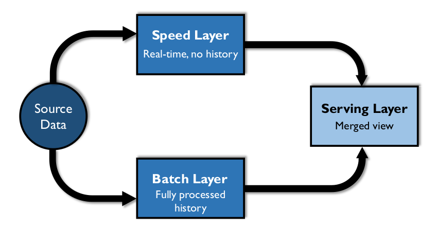

# Big Data and Data Science

## 1. Introduction

Since the early 2000s, the terms Big Data and Data Science have, unfortunately, been bandied about as buzzwords. The concepts and their implications are misunderstood – or, at least, there is limited consensus on their meaning. Even the meaning of ‘Big’ is relative. That said, both Big Data and Data Science are connected to significant technological changes that have allowed people to generate, store, and analyze larger and larger amounts of data. More importantly, people can use that data to predict and influence behavior, as well as to gain insight on a range of important subjects, such as health care practices, natural resource management, and economic development.

Big Data refers not only to the volume of data, but also to its variety (structured and unstructured, documents, files, audio, video, and streaming data, etc.), and the speed at which it is produced (velocity). People who mine and develop predictive, machine learning, and prescriptive models and analytics from these and deploy results for analysis by interested parties are called Data Scientists.

Data Science has existed for a long time; it used to be called ‘applied statistics’. But the capability to explore data patterns has quickly evolved in the twenty-first century with the advent of Big Data and the technologies that support it. Traditional Business Intelligence provides ‘rear-view mirror’ reporting – analysis of structured data to describe past trends. In some cases, BI patterns are used to predict future behavior, but not with high confidence. Until recently, in-depth analysis of enormous data sets has been limited by technology. Analyses have relied on sampling or other means of abstraction to approximate patterns. As the capacity to collect and analyze large data sets has grown, Data Scientists have integrated methods from mathematics, statistics, computer science, signal processing, probability modeling, pattern recognition, machine learning, uncertainty modeling, and data visualization in order to gain insight and predict behaviors based on Big Data sets. In short, Data Science has found new ways to analyze and get value from data.

As Big Data has been brought into data warehousing and Business Intelligence environments, Data Science techniques are used to provide a forward-looking (‘windshield’) view of the organization. Predictive capabilities, real-time and model-based, using different types of data sources, offer organizations better insight into where they are heading. (See Figure 96.)

Figure 96 Abate Information Triangle

To take advantage of Big Data, however, requires change in the way that data is managed. Most data warehouses are based on relational models. Big Data is not generally organized in a relational model. Most data warehousing depends on the concept of ETL (Extract, Transform, and Load). Big Data solutions, like data lakes, depend on the concept of ELT – loading and then transforming. As importantly, the speed and volume of data present challenges that require different approaches to critical aspects of data management, such as integration, Metadata Management, and Data Quality assessment.

### 1.1 Business Drivers

The biggest business driver for developing organizational capabilities around Big Data and Data Science is the desire to find and act on business opportunities that may be discovered through data sets generated through a diversified range of processes. Big Data can stimulate innovation by making more and larger data sets available for exploration. This data can be used to define predictive models that anticipate customer needs and enable personalized presentation of products and services. Data Science can improve operations. Machine learning algorithms can automate complex time-consuming activities, thus improving organizational efficiency, reducing costs, and mitigating risks.

Figure 97 Context Diagram: Big Data and Data Science

### 1.2 Principles

The promise of Big Data – that it will provide a different kind of insight – depends on being able to manage Big Data. In many ways, because of the wide variation in sources and formats, Big Data management will require more discipline than relational data management. Principles related to Big Data management have yet to fully form, but one is very clear: Organizations should carefully manage Metadata related to Big Data sources in order to have an accurate inventory of data files, their origins, and their value.

### 1.3 Essential Concepts

#### 1.3.1 Data Science

As noted in the chapter introduction, Data Science merges data mining, statistical analysis, and machine learning with data integration and data modeling capabilities, to build predictive models that explore data content patterns. Developing predictive models is sometimes called Data Science because the data analyst, or data scientist, uses the scientific method to develop and assess a model.

The data scientist develops a hypothesis about behavior that can be observed in the data prior to a particular action. For example, the purchase of one type of item is usually followed by the purchase of another type of item (the purchase of a house is usually followed by the purchase of furniture). Then, the data scientist analyzes large amounts of historical data to determine how frequently the hypothesis has been true in the past and to statistically verify the probable accuracy of the model. If a hypothesis is valid with sufficient frequency, and if the behavior it predicts is useful, then the model may become the basis for an operational intelligence process to predict future behavior, even possibly in real time such as suggestive selling advertisements.

Developing Data Science solutions involves the iterative inclusion of data sources into models that develop insights. Data Science depends on:

* **Rich data sources:** Data with the potential to show otherwise invisible patterns in organizational or customer behavior
* **Information alignment and analysis:** Techniques to understand data content and combine data sets to hypothesize and test meaningful patterns
* **Information delivery:** Running models and mathematical algorithms against the data and producing visualizations and other output to gain insight into behavior
* **Presentation of findings and data insights:** Analysis and presentation of findings so that insights can be shared

Table 32 compares the role of traditional DW/BI to predictive and prescriptive analytics that can be achieved through Data Science techniques.

<table>
  <thead>
    <tr>
      <th>DW / Traditional BI</th>
      <th colspan="2">Data Science</th>
    </tr>
  </thead>
  <tbody>
    <tr>
      <td>Descriptive</td>
      <td>Predictive</td>
      <td>Prescriptive</td>
    </tr>
    <tr>
      <td>Hindsight</td>
      <td>Insight</td>
      <td>Foresight</td>
    </tr>
    <tr>
      <td>
        Based on history: What happened? Why did it happen?
      </td>
      <td>
        Based on predictive models: What is likely to happen?
      </td>
      <td>
        Based on scenarios: What should we do to make things happen?
      </td>
    </tr>
  </tbody>
</table>

#### 1.3.2 The Data Science Process

Figure 98 illustrates the iterative phases of the Data Science process. The outputs of each step become the inputs into the next. (See Section 2.)

Figure 98 Data Science Process

The Data Science process follows the scientific method of refining knowledge by making observations, formulating and testing hypotheses, observing results, and formulating general theories that explain results. Within Data Science, this process takes the form of observing data and creating and evaluating models of behavior:

* **Define Big Data strategy and business needs:** Define the requirements that identify desired outcomes with measurable tangible benefits.
* **Choose data sources:** Identify gaps in the current data asset base and find data sources to fill those gaps.
* **Acquire and ingest data sources:** Obtain data sets and onboard them.
* **Develop Data Science hypotheses and methods:** Explore data sources via profiling, visualization, mining, etc.; refine requirements. Define model algorithm inputs, types, or model hypotheses and methods of analysis (i.e., groupings of data found by clustering, etc.).
* **Integrate and align data for analysis:** Model feasibility depends in part on the quality of the source data. Leverage trusted and credible sources. Apply appropriate data integration and cleansing techniques to increase quality and usefulness of provisioned data sets.
* **Explore data using models:** Apply statistical analysis and machine learning algorithms against the integrated data. Validate, train, and over time, evolve the model. Training entails repeated runs of the model against actual data to verify assumptions and make adjustments, such as identifying outliers. Through this process, requirements will be refined. Initial feasibility metrics guide evolution of the model. New hypotheses may be introduced that require additional data sets and results of this exploration will shape the future modeling and outputs (even changing the requirements).
* **Deploy and monitor:** Those models that produce useful information can be deployed to production for ongoing monitoring of value and effectiveness. Often Data Science projects turn into data warehousing projects where more vigorous development processes are put in place (ETL, DQ, Master Data, etc.).

#### 1.3.3 Big Data

Early efforts to define the meaning of Big Data characterized it in terms of the Three V’s: Volume, Velocity, Variety (Laney, 2001). As more organizations start to leverage the potential of Big Data, the list of V’s has expanded:

* **Volume:** Refers to the amount of data. Big Data often has thousands of entities or elements in billions of records.
* **Velocity:** Refers to the speed at which data is captured, generated, or shared. Big Data is often generated and can also be distributed and even analyzed in real-time.
* **Variety / Variability:** Refers to the forms in which data is captured or delivered. Big Data requires storage of multiple formats; data structure is often inconsistent within or across data sets.
* **Viscosity:** Refers to how difficult the data is to use or integrate.
* **Volatility:** Refers to how often data changes occur and therefore how long the data is useful.
* **Veracity:** Refers to how trustworthy the data is.

Big Data volumes are exceptionally large (greater than 100 Terabyte and often in the Petabyte and Exabyte range). In warehousing and analytic solutions, very large volumes of data pose challenges to data loading, modeling, cleansing, and analytics. These challenges are often solved using massively parallel processing, or parallel processing and distributed data solutions. However, they have much wider implications. The size of data sets requires changes in the overall way that data is stored and accessed, as well as in how data is understood (e.g., much of our current way of thinking about data is based on relational database structures), as well as how data is managed (Adams, 2009). Figure 99 presents a visual summary of the range of data that has become available through Big Data technologies and the implications on data storage options.

Figure 99 Data Storage Challenges [^88]

#### 1.3.4 Big Data Architecture Components

The selection, installation, and configuration of a Big Data and Data Science environment require specialized expertise. End-to-end architectures must be developed and rationalized against existing data exploratory tools and new acquisitions.

Figure 100 describes the DW/BI and Big Data Architecture. (Details about DW/BI components are described in Chapter 11.) The biggest difference between DW/BI and Big Data processing is that in a traditional data warehouse, data is integrated as it is brought into the warehouse (extract, TRANSFORM, load); while in a Big Data environment, data is ingested and loaded before it is integrated (extract, LOAD, transform). In some cases, data may not be integrated at all, in the traditional sense. Instead of being integrated in preparation for use, it is often integrated through particular uses (e.g., the process of building predictive models drives the integration of particular data sets).

Figure 100 Conceptual DW/BI and Big Data Architecture

The difference between ETL and ELT has significant implications for how data is managed. For example, the integration process does not necessarily rely on or produce an enterprise data model. The risk is that much knowledge about data can be lost if processes for ingestion and use are executed in an ad hoc way. There is a need to collect and manage Metadata related to these processes, if they are to be understood and leveraged overtime.

The following sections will describe Big Data Sources and the Data Lake construct. The activities (Ingest, Integrate, Explore, Evaluate Model) are explored under the Activities section.

#### 1.3.5 Sources of Big Data

Because so much of human activity is executed electronically, massive amounts of data are accumulating every day as we move through the world, interact with each other, and transact business. Big Data is produced through email, social media, online orders, and even online video games. Data is generated not only by phones and point-of-sale devices, but also by surveillance systems, sensors in transportation systems, medical monitoring systems, industrial and utility monitoring systems, satellites, and military equipment. For example, one airline flight can generate a terabyte of data. Devices that interact directly with the Internet generate a large portion of Big Data. The connections between devices and the Internet are sometimes called the Internet of Things (IoT).

#### 1.3.6 Data Lake

A data lake is an environment where a vast amount of data of various types and structures can be ingested, stored, assessed, and analyzed. Data lakes can serve many purposes. For example, providing

* An environment for Data Scientists to mine and analyze data
* A central storage area for raw data, with minimal, if any, transformation
* Alternate storage for detailed historical data warehouse data
* An online archive for records
* An environment to ingest streaming data with automated pattern identification

A data lake can be implemented as a complex configuration of data handling tools including Hadoop or other data storage systems, cluster services, data transformation, and data integration. These handlers have facilitated cross-infrastructure, analytic facilitation software to bring the configuration together.

The risk of a data lake is that it can quickly become a data swamp – messy, unclean, and inconsistent. In order to establish an inventory of what is in a data lake, it is critical to manage Metadata as the data is ingested. In order to understand how the data in a data lake is associated or connected, data architects or data engineers often use unique keys or other techniques (semantic models, data models, etc.) so that data scientists and other visualization developers know how to use the information stored within the data lake. (See Chapter 9.)

#### 1.3.7 Services-Based Architecture

Services-based architecture (SBA) is emerging as a way to provide immediate (if not completely accurate or complete) data, as well as update a complete, accurate historical data set, using the same source (Abate, Aiken, Burke, 1997). The SBA architecture is similar to the DW architectures which send data directly to an ODS for immediate access, as well as to the DW for historical accumulation. SBA architectures have three main components, a batch layer, a speed layer, and a serving layer. (See Figure 101.)

* **Batch layer:** A data lake serves as the batch layer, containing both recent and historical data
* **Speed layer:** Contains only real-time data
* **Serving layer:** Provides an interface to join data from the batch and speed layers

Data is loaded into both the batch and speed layers. All analytic computations are performed on data in both the batch and speed layers, which most likely requires implementation in two separate systems. Organizations address synchronization issues through trade-offs between completeness, latency, and complexity of merged views defined in the serving layer. Cost/benefit assessment is required to determine whether reducing latency or improving data completeness is worth the associated cost and complexity.

The batch layer is often referred to as the structure-over-time component (here every transaction is an insert), whereas in the speed layer (often referred to as an Operational Data Store or ODS), all transactions are updates (or inserts only if required). In this manner, the architecture prevents synchronization issues while simultaneously creating a current state and a history layer. This architecture usually provides its data through a serving or data services layer that abstracts the data utilizing Metadata. This services layer determines where the data is to be ‘served’ from and appropriately provides the data requested.

Figure 101 Services-based Architecture

#### 1.3.8 Machine Learning

Machine Learning explores the construction and study of learning algorithms. It can be viewed as a union of unsupervised learning methods, more commonly referred to as data mining, and supervised learning methods deeply rooted in mathematical theory, specifically statistics, combinatorics, and optimization. A third branch is now forming called reinforcement learning, where goal performance is earned but not specifically teacher recognized – driving a vehicle for example. Programming machines to quickly learn from queries and adapt to changing data sets led to a completely new field within Big Data referred to as machine learning. [^89] Processes run, and results are stored that are then used in subsequent runs to iteratively inform the process and refine the results.

Machine Learning explores the construction and study of learning algorithms. These algorithms fall into three types:

* **Supervised learning:** Based on generalized rules; for example, separating SPAM from non-SPAM email
* **Unsupervised learning:** Based on identifying hidden patterns (i.e., data mining)
* **Reinforcement learning:** Based on achieving a goal (e.g., beating an opponent at chess)

Statistical modeling and machine learning have been employed to automate otherwise costly research and development projects, by performing several trial and error passes on a vast set of data, repeating trials with the results collected, analyzed, and errors corrected. This approach can reduce time to answer dramatically and guide organizational initiatives with insights based on cost effective repeatable processes. For example, CIVDDD uses machine learning and complex scientific data visualization techniques to help government agencies and peacekeepers meet the challenge of dealing with the masses of threat-related information. 90

While it taps into data in new ways, machine learning has ethical implications, especially with respect to the principle of transparency. Evidence shows that deep learning neural networks (DLNN) work. They learn things. However, it is not always clear how they learn. As the algorithms that drive these processes become more complex, they also become more opaque, functioning as ‘black boxes’. As they account for a greater number of variables and as those variables themselves are more abstract, algorithms test the limits of human ability to interpret the machine (Davenport, 2017). The need for transparency – the ability to see how decisions are made – will likely increase as this functionality evolves and is put to use in a wider array of situations. (See Chapter 2.)

#### 1.3.9 Sentiment Analysis

Media monitoring and text analysis are automated methods for retrieving insights from large unstructured or semi-structured data, such as transaction data, social media, blogs, and web news sites. This is used to understand what people say and feel about brands, products, or services, or other types of topics. Using Natural Language Processing (NLP) or by parsing phrases or sentences, semantic analysis can detect sentiment and also reveal changes in sentiment to predict possible scenarios.

Consider the case of looking for key words in a posting. If the words good or great are present, this might be a positive response, versus seeing awful or bad might be signs that this could be a negative response.

Categorizing the data into the types of responses, the ‘sentiment’ of the whole community or posting (social media such as Twitter, blogs, etc.) is exposed. That said, sentiment is not easily gained, as the words by themselves do not tell the whole story (i.e., I had a Great problem with their customer service). Sentiment must interpret words in context. This requires an understanding of the meaning of the post – this interpretation often requires work using NLP functions found in such systems as IBM’s Watson.

#### 1.3.10 Data and Text Mining

Data mining is a particular kind of analysis that reveals patterns in data using various algorithms. It began as an offshoot from Machine Learning, a subfield of Artificial Intelligence. The theory is a subset of statistical analysis known as unsupervised learning where algorithms are applied to a data set without knowledge or intent of the desired outcome. While standard query and reporting tools ask specific questions, data mining tools help discover unknown relationships by revealing patterns. Data mining is a key activity during the exploration phase as it facilitates rapid identification of studied data elements, identifies new relationships previously unknown, unclear, or unclassified, and provides structure for the classification of studied data elements.

Text mining analyzes documents with text analysis and data mining techniques to classify content automatically into workflow-guided and SME-directed ontologies. Thus, electronic text media can be analyzed without restructuring or reformatting. Ontologies can be linked into search engines, allowing for web-enabled querying against these documents. (See Chapter 9.)

Data and text mining use a range of techniques, including:

* **Profiling:** Profiling attempts to characterize the typical behavior of an individual, group, or population. Profiling is used to establish behavioral norms for anomaly detection applications, such as fraud detection and monitoring for intrusions to computer systems. Profile results are inputs for many unsupervised learning components.
* **Data reduction:** Data reduction replaces a large data set with a smaller set of data that contains much of the important information in the larger set. The smaller data set may be easier to analyze or process.
* **Association:** Association is an unsupervised learning process to find relationships between studied elements based on transactions involving them. Examples of association include: Frequent item set mining, rule discovery, and market-based analysis. Recommendation systems on the internet use this process as well.
* **Clustering:** Clustering group elements in a study together by their shared characteristics. Customer segmentation is an example of clustering.
* **Self-organizing maps:** Self-organizing maps are a neural network method of cluster analysis. Sometimes referred to as Kohonen Maps, or topologically ordered maps, they aim to reduce the dimensionality in the evaluation space while preserving distance and proximity relationships as much as possible, akin to multi-dimension scaling. Reducing the dimensionality is like removing one variable from the equation without violating the outcome. This makes it easier to solve and visualize.

#### 1.3.11 Predictive Analytics

Predictive Analytics is the sub-field of supervised learning where users attempt to model data elements and predict future outcomes through evaluation of probability estimates. Rooted deeply in mathematics specifically statistics, predictive analytics shares many components with unsupervised learning, with the prescribed difference to the measurement of a desired predictive outcome.

Predictive Analytics is the development of probability models based on variables, including historical data, related to possible events (purchases, changes in price, etc.). When it receives other pieces of information, the model triggers a reaction by the organization. The triggering factor may be an event, such as a customer adding a product to an on-line shopping basket, or it may be data in a data stream, such as a news feed or utility sensor data, or an increased volume of service requests. The triggering factor may be an external event. News being reported about a company is a big predictor of a change in stock price. Predicting stock movement should include monitoring news and determining if news about a company is likely to be good or bad for the stock price.

Frequently, the triggering factor is the accumulation of a large volume of real-time data, such as an extremely high number of trades or requests for service or volatility of the environment. Monitoring a data event stream includes incrementally building on the populated models until a threshold is reached as defined in the model. The amount of time that a predictive model provides between the prediction and event predicted is frequently very small (seconds or less than a second). Investment in very low latency technology solutions, such as in-memory databases, high-speed networks, and even physically proximity to the source of the data, optimizes an organization’s ability to react to the prediction.

The simplest form of predictive model is the forecast. Many techniques exist for trending or forecasting based on regression analysis and benefit from smoothing. The simplest way to smooth data is through a moving average, or even a weighted moving average. More advanced techniques can be useful, like the exponential moving average, which introduces a smoothing factor to be applied. Minimizing the error residual from the least squares can be a starting point, but several runs are necessary to determine and optimize the smoothing factor. Double and triple exponential smoothing models exist to address trend and seasonality components.

#### 1.3.12 Prescriptive Analytics

Prescriptive analytics take predictive analytics a step farther to define actions that will affect outcomes, rather than just predicting the outcomes from actions that have occurred. Prescriptive analytics anticipates what will happen, when it will happen, and implies why it will happen. Because prescriptive analytics can show the implications of various decisions, it can suggest how to take advantage of an opportunity or avoid a risk. Prescriptive analytics can continually take in new data to re-predict and re-prescribe. This process can improve prediction accuracy and result in better prescriptions.

#### 1.3.13 Unstructured Data Analytics

Unstructured data analytics combines text mining, association, clustering, and other unsupervised learning techniques to codify large data sets. Supervised learning techniques can also be applied to provide orientation, oversight, and guidance in the coding process leveraging human intervention to resolve ambiguity when necessary.

Unstructured data analytics is becoming more important as more unstructured data is generated. Some analysis is impossible without the ability to incorporate unstructured data into analytical models. However, unstructured data is difficult to analyze without some way to isolate the elements of interest from extraneous elements. Scanning and tagging is one way to add ‘hooks’ to unstructured data that allow filtering and linking to related structured data. However, knowing what tags to generate based on what conditions is difficult. It is an iterative process, from when proposed tag conditions are identified, tags are assigned as data is ingested, then analytics uses those tags to validate the tag condition, and analyze the tagged data, which then leads to potentially changed tag conditions, or more tags.

#### 1.3.14 Operational Analytics

The concept of operational analytics (also known as operational BI or streaming analytics) has emerged from the integration of real-time analytics into operations. Operational analytics includes activities like user segmentation, sentiment analysis, geocoding, and other techniques applied to data sets for marketing campaign analysis, sales penetration, product adoption, asset optimization, and risk management.

Operational analytics involves tracking and integrating real-time streams of information, deriving conclusions based on predictive models of behavior, and triggering automatic responses and alerts. Designing the model, triggers, and responses required for successful analysis takes more analysis on the data itself. An operational analytics solution includes the preparation of historical data for pre-population of the models of behavior. For example, in a retail product model, populating a shopping basket analysis that identifies products often purchased together. In predicting behavior of financial markets, historical price information and historical price rate of change are regularly used. Pre-population calculations are usually performed in advance to enable timely responses to triggering events.

Once predictive models have been determined to be both useful and cost effective, solutions which integrate historical and current data (including real-time and streaming data, structured and unstructured) are implemented to populate the predictive models and trigger actions based on the predictions. The solution must ensure real-time data streams using the model rules are processed correctly and automated responses to meaningful events in the data are generated correctly.

#### 1.3.15 Data Visualization [^91]

Visualization is the process of interpreting concepts, ideas, and facts by using pictures or graphical representations. Data visualization facilitates understanding of the underlying data by presenting it in a visual summary, such as a chart or graph. Data visualizations condense and encapsulate characteristics data, making them easier to see. In doing so, they can surface opportunities, identify risks, or highlight messages. Data visualizations can be delivered in a static format, such as a published report, or a more interactive on-line format; and some support end-user interaction where drilling or filtering capabilities facilitate analysis of data within the visualization. Others allow the visualization to be changed by the user on demand through innovative displays, such as data maps and moving landscapes of data over time.

Visualization has long been critical to data analysis. Traditional BI tools include visualization options such as tables, pie charts, lines charts, area charts, bar charts, histograms, and turnkey boxes (candlesticks). To meet the growing need to understand data, the number of visualization tools has increased and techniques have improved.

As data analytics matures, visualizing data in new ways will offer strategic advantages. Seeing new patterns in data can result in new business opportunities. As data visualization continues to evolve, organizations will have to grow their Business Intelligence teams to compete in an increasingly data-driven world. Business analytical departments will seek data experts with visualization skills, including data scientists, data artists, and data vision experts, in addition to traditional information architects and data modelers, especially given the risks associated with misleading visualization. (See Chapter 2.)

#### 1.3.16 Data Mashups

Mashups combine data and services to create visualization for insight or analysis. Many virtualization tools enable mashups through functionality that relates data sources by common data elements, originally used to relate a name or descriptive text to a stored code. This client presentation mashup technique is ideal during discovery or exploration phases as they provide immediate benefits. This technique can be readily applied to the web where secured data mashups enable sharing of personal or confidential information across suppliers or providers. These can couple with artificial intelligence learning algorithms to expose internet-based services with natural language interfaces.

## 2. Activities

### 2.1 Define Big Data Strategy and Business Needs

An organization’s Big Data strategy needs to be aligned with and support its overall business strategy and business requirements and be part of its data strategy. A Big Data strategy must include criteria to evaluate:

* What problems the organization is trying to solve. What it needs analytics for: While one advantage of Data Science is that it can provide a new perspective on an organization, the organization still needs to have a starting point. An organization may determine that the data is to be used to understand the business or the business environment; to prove ideas about the value of new products; to explore something that is unknown; or to invent a new way to do business. It is important to establish a gating process to evaluate these initiatives at several phases during the implementation. The value and feasibility of initiatives need to be evaluated at several points in time.
* What data sources to use or acquire: Internal sources may be easy to use, but may also be limited in scope. External sources may be useful, but are outside operational control (managed by others, or not controlled by anyone, as in the case of social media). Many vendors are competing in this space and often multiple sources exist for the desired data elements or sets. Acquiring data that integrates with existing ingestion items can reduce overall investment costs.
* The timeliness and scope of the data to provision: Many elements can be provided in real-time feeds, snapshots at a point in time, or even integrated and summarized. Low latency data is ideal, but often comes at the expense of machine learning capabilities – there is a huge difference between computational algorithms directed to data-at-rest versus streaming. Do not minimize the level of integration required for downstream usage.
* The impact on and relation to other data structures: There may need to be structure or content changes in other data structures to make them suitable for integration with Big Data sets.
* Influences to existing modeled data: Including extending the knowledge on customers, products, and marketing approaches.

The strategy will drive the scope and timing of an organization’s Big Data capability roadmap.

### 2.2 Choose Data Sources

As with any development project, the choice of data sources for Data Science work must be driven by the problems the organization is trying to solve. The difference with Big Data / Data Science development is that the range of data sources is wider. It is not limited by format and can include data both external to and internal to an organization. The ability to incorporate this data into a solution also comes with risks. The quality and reliability of the data needs to be evaluated and a plan for use over time needs to be put into place. Big Data environments make it possible to quickly ingest lots of data, but to use that data and manage it over time, it is still necessary to know basic facts:

* Its origin
* Its format
* What the data elements represent
* How it connects to other data
* How frequently it will be updated

As more data becomes available (like US Census Bureau Statistics, shopping demographics, weather satellite data, research data sets), data needs to be evaluated for worth and reliability. Review the available data sources, and the processes that create those sources and manage the plan for new sources.

* **Foundational data:** Consider foundational data components such as POS (Point of Sale) in a sales analysis.
* **Granularity:** Ideally, obtain data in its most granular form (not aggregated). That way it can be aggregated for a range of purposes.
* **Consistency:** If possible, select data that will appear appropriately and consistently across visualizations, or recognize limitations.
* **Reliability:** Choose data sources that are meaningful and credible over time. Use trusted, authoritative sources.
* **Inspect/profile new sources:** Test changes before adding new data sets. Unexpected material or significant changes in visualization outcomes can occur with the inclusion of new data sources.

Risks associated with data sources include privacy concerns. The ability to rapidly ingest and integrate data from a variety of sources at scale affords communities the ability to recombine data sets that were otherwise secured. Similarly, the published analysis may describe, through summary, aggregate, or modeled state, a sub-set of the public that make it suddenly identifiable; this is a side effect of the ability to perform mass computation on very large populations, but publish to a very specific local or region. For example, when demographics computed at a national or country level quickly become non-identifiable, but not when published after filtering for a postal code or household level. [^92]

Criteria used to select or filter data also pose a risk. These criteria should be objectively managed to avoid biases or skews. Filtering can have a material impact on visualization. Discretion is necessary when removing outliers, restricting data sets to a limited domain, or dropping sparse elements. It is common practice to focus the provisioned data to emphasize isolation results, but it must be done objectively and uniformly. 93 (See Chapter 2.)

### 2.3 Acquire and Ingest Data Sources

Once the sources are identified, they need to be found, sometimes purchased, and ingested (loaded) into the Big Data environment. During this process, capture critical Metadata about the source, such as its origin, size, currency, and additional knowledge about content. Many ingestion engines profile data as it is ingested, providing analysts with at least partial Metadata. Once the data is in a data lake, it can be assessed for suitability for multiple analysis efforts. Because building Data Science models is an iterative process, so is data ingestion. Iteratively identify gaps in the current data asset base and onboard those sources. Explore these data sources using profiling, visualization, mining, or other Data Science methods to define model algorithm inputs, or model hypotheses.

Before integrating the data, assess its quality. Assessment can be as simple querying to find out how many fields contain null values, or as complex as running a data quality toolset or data analytic utility against the data to profile, classify, and identify relationships between data elements. Such assessment provides insight into whether the data provides a valid sample from which to work, and, if so, how the data can be stored and accessed (scattered across logical processing units [MPP], federated, distributed by key, etc.). This work involves SMEs (usually the data scientists themselves) and platform engineers.

The assessment process provides valuable insight into how the data can be integrated with other data sets, such as Master Data or historical warehouse data. It also provides information that can be used in model training sets and validation activities.

### 2.4 Develop Data Hypotheses and Methods

Data Science is about building answer sets that can find meaning or insights within the data. The development of Data Science solutions entails building statistical models that find correlations and trends within and between data elements and data sets. There will be multiple answers to a question based upon inputs to a model. For example, one must choose a rate of return to calculate the future value of a financial portfolio. Models often have more than one variable so the best practice is to find deterministic outcomes – or in other words, use best guesses as to the values to be expected. However, best guesses themselves should be educated. Each model will operate depending on the analysis method chosen. It should be tested for a range of outcomes, even the ones that appear least probable.

Models depend on both the quality of input data and the soundness of the model itself. Data models can often give insight into how to correlate the information found. An example of this is using K-Means clustering to determine the number of groupings of data to analyze further. (See Chapter 13.)

### 2.5 Integrate / Align Data for Analysis

Preparing the data for analysis involves understanding what is in the data, finding links between data from the various sources, and aligning common data for use.

In many cases, joining data sources is more an art than a science. For example, consider one data set based upon daily updates and another based upon monthly updates. The daily data, in order to be aligned, would have to be aggregated so that there would be an alignment pattern that could be used in the Data Science investigation. One method is to use a common model that integrates the data using a common key. Another way is to scan and join data using indexes within the database engines for similarity and record linkage algorithms and methods. Often data is inspected during the initial phases to understand how the data could be analyzed. Clustering helps determine the grouping of the data outputs. Other methods can find correlations that will be used to build the model to display results. Consider using techniques during the initial phases that will aide in understanding how the model will show results once published.

Most solutions require the integration of Master Data and Reference Data in order to interpret results of the analytics. (See Chapter 10.)

### 2.6 Explore Data Using Models

#### 2.6.1 Populate Predictive Model

Configuring predictive models includes pre-populating the model with historical information concerning the customer, market, products, or other factors that are included in the model other than the triggering factor. Pre-population calculations are usually performed in advance to enable the fastest response to triggering events. For example, customer purchase history would be needed to pre-populate a retail market-basket recommendation model. In predicting behavior of retail markets, historical price and price change information are combined with customer, demographic, and weather information.

### 2.6.2 Train the Model

Execute the model against the data in order to ‘train’ the model. Training includes repeated runs of the model against the data to verify assumptions. Training will result in changes to the model. Training requires balance. Avoid over-fitting by training against a limited data fold.

Model validation must be complete before transitioning to production. Address any population imbalances or data biases with model offsets that are trained and validated; this can be tweaked in production as the initial offset is gradually adjusted through actual population interactions. Optimizing feature mix can be accomplished with Bayesian co-selection, classifier inversion, or rule induction. Models can also be combined for ensemble learning where the predictor model is built by combining the collected strengths of simpler models. Identifying outliers or anomalies (data objects that do not comply with the general behavior exhibited by the studied elements) is critical to the evaluating the model. For more volatile datasets, apply a variance test based on the average and standard deviation. Both tests can be readily applied on profiled results. It may be that the outliers are the target of the exercise, as opposed to finding and validating trends in the majority of the data. For predictive analytics, use a real-time data stream to finish the population of the predictive model and trigger a response, which might be an alert or an event. The data stream may require special focus on design and development of an extreme low latency processing capability. In some models, the difference in value of the predictions between fractions of a second is extreme and solutions may require innovative technology with speed of light limitations.

Models can use many statistical functions and techniques that are available in open source libraries, one of which is ‘R.’ The R Project for Statistical Computing is a free software environment for statistical computing; it contains many functions as service calls. [^94] Custom functions can be developed leveraging the scripting language and shared across tools, platforms, and organizations.

Once the solution design has been created and development and operation estimated, the organization may decide whether to develop the solution to predict behavior. Real-time operational analytics solutions frequently require substantial amounts of new architecture and development and could possibly not be cost effective.

#### 2.6.3 Evaluate Model

Once the data is placed onto a platform and ready for analysis, the Data Science begins. The model is constructed, evaluated against training sets, and validated. Refinements to the business requirements are expected at this point and early feasibility metrics can guide the management efforts towards further processing or discarding. It is entirely possible that testing a new hypothesis will require additional data sets. Data scientists run queries and algorithms against the data to see if any insights become apparent. Often times a number of different mathematical functions will be run to see if any insight is found (clusters in the data, patterns that start to emerge between data element periods, etc.). During this period, data scientists are often building upon insights found in iterative batches. From these, models can be developed that display the correlation between data elements and insights.

There is an ethical component to practicing Data Science and it needs to be applied when evaluating models. Models can have unexpected results or unintentionally reflect the assumptions and biases of the people who create them. Ethical training should be required for all artificial intelligence (AI) practitioners. Ideally, the curriculum for every student learning AI, computer science, or Data Science should include ethics and security topics. However, ethics alone is not sufficient. Ethics can help practitioners understand their responsibilities to all stakeholders, but ethical training needs to be augmented with the technical capability to put good intentions into practice by taking technical precautions as a system is built and tested (Executive Office, 2016). (See Chapter 2.)

#### 2.6.4 Create Data Visualizations

Data visualization based on the model must meet the specific needs related to the purpose of the model. Each visualization should answer a question or provide an insight. Establish the purpose and parameters for the visualization: a point in time status, trends vs. exceptions, relationships between moving parts, geographical differences, or some other point.

Select the appropriate visual to fulfill that purpose. Ensure that the visualization addresses an audience; adjust the layout and complexity to highlight and simplify accordingly. Not all audiences are ready for a complex interactive chart. Support visualizations with explanatory text.

Visualizations should tell a story. Data ‘story telling’ can link new questions to the context of data exploration. Data stories must be supported by related data visualizations to have the best effect.

### 2.7 Deploy and Monitor

A model that meets business needs in a feasible manner can be deployed to production for ongoing monitoring. Such models will require refinement and maintenance. Several modeling techniques are available for implementation. Models can serve batch processes as well as real-time integration messages. They can also be embedded into analytics software as input into decision management systems, historical analysis, or performance management dashboards.

#### 2.7.1 Expose Insights and Findings

The presentation of findings and data insights, usually through data visualization, is the final step in a Data Science investigation. Insights should be connected to action items so that the organization benefits from the Data Science work.

New relationships may be explored through data visualization techniques. As a model is used, changes in the underlying data and relationships may surface, telling a new story about the data.

#### 2.7.2 Iterate with Additional Data Sources

The presentation of findings and data insights usually generates questions that start a new process of research. Data Science is iterative, so Big Data development is iterative to support it. This process of learning from a specific set of data sources often leads to the need for different or additional data sources to both support the conclusions found and to add insights to the existing model(s).

## 3. Tools

Advances in technology (Moore’s Law, the proliferation of hand held devices, IOT, to name a few) have created the Big Data and Data Science industry. To understand the industry, one must understand its drivers. This section will explain the tools and technologies that have enabled Big Data Science to emerge.

The advent of Massively Parallel Processing (MPP) was one of the first enablers to Big Data and Data Science as it provided the means to analyze huge volumes of information in relatively short amounts of time. Finding the needle in the haystack of information, or using machinery to plow through tons of dirt to find the gold nuggets is what we are doing today. This trend will continue.

Other advances that have changed the way we look at data and information include:

* Advanced in-database analytics
* Analytics on unstructured data (Hadoop, MapReduce)
* Integration of analytic results with operational systems
* Data visualizations across multiple media and devices
* Linking structured and unstructured information using semantics
* New data sources using IOT
* Advanced visualization capabilities
* Data enrichment capabilities
* Collaboration technologies and toolsets

Existing data warehouses, data marts, and operational data stores (ODS) are being augmented to carry Big Data workload. NoSQL technologies allow storage and query of unstructured and semi-structured data.

Access to unstructured data used to occur largely through a batch query interface that resulted in slow scheduled execution and poor response times. Several NoSQL databases are now available with designs that address specific limitations in this acquisition process. Scalable distributed databases automatically provide sharding capabilities (the ability to scale across servers natively) for parallel query execution. Of course, as with any other database, structural definition and mapping to unstructured data sets remain largely manual processes. Immediate query, reporting, and analysis capabilities can be satisfied with Big Data in-memory technologies that allow end users to construct SQL-like queries to access unstructured data. There are also adaptors to SQL for some tools that will transmit a NoSQL process and return a SQL compliant query – with limitations and caveats. Adaptor technologies can allow existing tools to be used for unstructured data query.

Decision criteria tool sets, process implementation tools, and professional services offerings can both facilitate and expedite the process of choosing an initial set of tools. As when acquiring BI tools, it is critical to evaluate all options: build, buy, or rent (provisioned as software-as-a-service). As noted in Chapter 11, cloud sourcing tools and the associated expertise should be weighed against the cost of building from scratch or deploying purchased products from vendors. Ongoing upgrade and potential replacement costs must be considered as well. Alignment to a set OLA can bridge forecasted costs and provide input into setting compelling fees and penalties for term violations.

### 3.1 MPP Shared-nothing Technologies and Architecture

Massively Parallel Processing (MPP) Shared-nothing Database technologies have become the standard platform for Data Science-oriented analysis of Big Data sets. In MPP databases, data is partitioned (logically distributed) across multiple processing servers (computational nodes), with each server having its own dedicated memory to process data locally. Communication between processing servers is usually controlled by a master host and occurs over a network interconnect. There is no disk sharing or memory contention, hence the name, ‘shared-nothing’.

MPP has evolved because traditional computing paradigms (indexes, distributed data sets, etc.) did not provide acceptable response times on massive tables. Even the most powerful of computing platforms (Cray computer) would take many hours or even days to compute a complex algorithm against a trillion-row table.

Consider now a number of commodity hardware servers, all lined up in a row and controlled via a host. Each is sent part of the query to run against this segmented or distributed trillion-row table. If there are, for example, 1000 processing servers, the query changes from accessing a trillion rows in one table to accessing 1000 billion-row tables. This type of computing architecture is linearly scalable, which adds to the appeal for data scientist and Big Data users requiring a scalable platform to incorporate growth.

This technology also enabled in-database analytical functions – the ability to execute analytical functions (like K-means Clustering, Regression, etc.) at the processor level. Distribution of workload to the processor level greatly speeds up analytical queries – thereby fueling innovation in Data Science. A system that automatically distributes data and parallelizes query workloads across all available (localized) hardware is the optimum solution for Big Data analytics.

Figure 102 Columnar Appliance Architecture [^95]

Data volumes are growing fast. Companies can grow the capacity and performance of their systems over time by adding new nodes. MPP makes it easy to expand the parallelism of hundreds or thousands of cores across an ever-growing pool of machines. A massively parallel, shared-nothing architecture fully uses each core, with linear scalability and increased processing performance on large data sets.

### 3.2 Distributed File-based Databases

Distributed file-based solutions technologies, such as the open source Hadoop, are an inexpensive way to store large amounts of data in different formats. Hadoop stores files of any type – structured, semi-structured, and unstructured. Using a configuration similar to MPP Shared-nothing (an MPP foundation for file storage), it shares files across processing servers. It is ideal for storing data securely (as many copies are made), but has challenges when trying to allow access to data via structured or analytical mechanism (like SQL).

Due to its relatively low cost, Hadoop has become the landing zone of choice for many organizations. From Hadoop, data can be moved to MPP Shared-nothing databases to have algorithms run against it. Some organizations run complex Data Science queries in Hadoop, and are not concerned with response times in the order of hours and days (rather than minutes for the former architecture).

The language used in file-based solutions is called MapReduce. This language has three main steps:

* **Map:** Identify and obtain the data to be analyzed
* **Shuffle:** Combine the data according to the analytical patterns desired
* **Reduce:** Remove duplication or perform aggregation in order to reduce the size of the resulting data set to only what is required

These steps can be combined in many different tools in different ways, both in sequence and in parallel, to do complex manipulations.

### 3.3 In-database Algorithms

An in-database algorithm uses the principle that each of the processors in a MPP Shared-nothing platform can run queries independently, so a new form of analytics processing could be accomplished by providing mathematical and statistical functions at the computing node level. Open-source libraries of scalable in-database algorithms for machine learning, statistics, and other analytical tasks were designed both for in- and out-of-core execution, and for the shared-nothing parallelism offered by modern parallel database engines, ensuring that computation is done close to the data. By moving the computation closer to the data, the computing time is dramatically reduced for complex algorithms (such as K-means Clustering, Logistic or Linear regression, Mann-Whitney U Test, Conjugate Gradient, Cohort Analysis, etc.).

### 3.4 Big Data Cloud Solutions

There are vendors who provide cloud storage and integration for Big Data, including analytic capabilities. Based on defined standards, customers load their data a cloud environment. The vendor enhances the data, either as open data sets or as provided by other organizations. The customer can do analytics and Data Science using the combined data set. One application uses retail offers as the subject for the data, combines it with geographic and sales data, and offers airline miles for customers who agree to have their data used in this way.

### 3.5 Statistical Computing and Graphical Languages

R is an open source scripting language and environment for statistical computing and graphics. It provides a wide variety of statistical techniques such as linear and nonlinear modeling, classical statistical tests, time-series analysis, classification, and clustering. Because it is a scripting language, models developed in R can be implemented in a variety of environments, differing platforms and collaborated development across multiple geographic and organizational boundaries. The R environment can also produce publication-quality plots, including mathematical symbols and formulae, within the control of the end user.

### 3.6 Data Visualization Tools

Traditional tools in data visualization have both a data and a graphical component. Advanced visualization and discovery tools use in-memory architecture to allow users to interact with the data. Patterns in a large data set can be difficult to recognize in a numbers display. A visual pattern can be picked up quickly when thousands of data points are loaded into a sophisticated display.

Information graphics or infographics are graphical representations stylized for effective interaction and comprehension. Marketing adopted these to provide visual appeal to presentations. Journalists, bloggers, and teachers found infographics useful for trend analysis, presentation, and distribution. Information visualization methods like radar charts, parallel coordinate plots, tag charts, heat maps, and data maps are now supported by many toolsets. These allow users to rapidly discern changes in data over time, gain insights into related items, and understand potential cause and effect relationships before impacts occur. These tools have several benefits over traditional visualization tools:

* Sophisticated analysis and visualization types, such as small multiples, spark lines, heat maps, histograms, waterfall charts, and bullet graphs
* Built-in adherence to visualization best practices
* Interactivity enabling visual discovery

## 4. Techniques

### 4.1 Analytic Modeling

Several open source tools are available for development, as well as cloud data processing for model development, for visual development process, for web scraping, and for linear programming optimization. To share and execute models by other applications, look for tools that support the predictive model markup language (PMML), an XML-based file format.

Real-time access can resolve many latency issues from batch processing. The Apache Mahout is an open source project aimed at creating a machine-learning library. Mahout is positioned to automate Big Data exploration through recommendation mining, document classification, and item clustering. This branch of development efforts bypasses the traditional batch query MapReduce data access techniques. Leveraging an API interface directly into the storage layer HDFS, a variety of data access techniques can be provided such as SQL, content streaming, machine learning, and graphics libraries for data visualization.

Analytic models are associated with different depths of analysis:

* Descriptive modeling summarizes or represents the data structures in a compact manner. This approach does not always validate a causal hypothesis or predict outcomes. However, it does use algorithms to define or refine relationships across variables in a way that could provide input to such analysis.
* Explanatory modeling is the application of statistical models to data for testing causal hypothesis about theoretical constructs. While it uses techniques similar to data mining and predictive analytics, its purpose is different. It does not predict outcomes; it seeks to match model results only with existing data.

Key to predictive analytics is to learn by example through training the model. Performance of a learning method relates its predictive abilities on independent test data. Assessment guides the choice of learning and measures the quality of the chosen model. Model selection estimates performance where assessment evaluates the generalization error on new data.

Avoid over-fitting – a situation that occurs when the model is trained against non-representative datasets, is overly complex in relation to its data, or has described noise instead of the underlying relationship(s). Use additional techniques such as K-fold validation to indicate when training is no longer resulting in better generalization.

Training error consistently decrease with model complexity and can drop off to zero. Therefore, it is not a useful estimate of the test error. Randomly divide the data set into three parts to form training, testing, and validation sets. The training set is used to fit the model, the validation set is used to predict error for selection, and the test set is used for assessment of the generalization error of the final model.

Reusing the same test-set repeatedly can underestimate the true test error. Ideally, perform cross-validation by randomly dividing the data set into a set of K-folds or cross-validation groups. Perform training on all but one set of data based on strongly correlated predictor variables. Test the model on the remaining piece and determine generalization error based on all K-folds. Several statistical tests can be applied and performed to numerically assess contextual model validity.

### 4.2 Big Data Modeling

Modeling Big Data is a technical challenge but critical if an organization that wants to describe and govern its data. Traditional Enterprise Data Architecture principles do apply; data needs to be integrated, specified, and managed.

The main driver to physically model a data warehouse is to enable population of data for query performance. This driver is not in play for Big Data. This is not an excuse to abandon the modeling process or to hand it off to a developer. The value of modeling the data is that it enables people to understand data content. Apply proven data modeling techniques while accounting for the variety of sources. Develop the subject area model, at least in a summarized way, so it can be related to proper contextual entities and placed into the overall roadmap, just like any other kind of data. The challenge is to make an understandable and useful picture out of these large data sets, and for a justifiable cost.

Understand how the data links between data sets. For data of different granularity, prevent combinations that count data elements or values more than once; for example, don’t combine atomic and aggregate sets.

## 5. Implementation Guidelines

Many of the general principles of managing warehouse data apply to managing Big Data: ensuring that the data sources are reliable, having sufficient Metadata to enable data use, managing the quality of data, figuring out how to integrate data from different sources, and ensuring that data is secure and protected. (See Chapters 6, 7, and 8.) The differences in implementing a Big Data environment are connected to a set of unknowns: how the data will be used, which data will be valuable, how long it needs to be retained.

Data velocity may lead people to think they do not have time to implement controls. This is a dangerous assumption. With larger data sets, managing ingestion and inventorying data in a lake is critical to preventing it from becoming a swamp.

Ingestion may not always require organizational ownership or commitment to the data set being studied. Consider leasing a Big Data platform for finite periods to explore data of interest. Exploration can quickly determine which areas show potential value. Do this before ingesting into the organizational data lake, data store, or data staging area; once landed, it can be awkward to remove.

### 5.1 Strategy Alignment

Any Big Data / Data Science program should be strategically aligned with organizational objectives. Establishing a Big Data strategy drives activities related to user community, data security, Metadata management, including lineage, and Data Quality Management.

The strategy should document goals, approach, and governance principles. The ability to leverage Big Data requires building organizational skills and capabilities. Use capability management to align business and IT initiatives and project a roadmap. Strategy deliverables should account for managing:

* Information lifecycle
* Metadata
* Data quality
* Data acquisition
* Data access and security
* Data governance
* Data privacy
* Learning and adoption
* Operations

### 5.2 Readiness Assessment / Risk Assessment

As with any development project, implementation of a Big Data or Data Science initiative should align with real business needs. Assess organizational readiness in relation to critical success factors:

* **Business relevance:** How well do the Big Data / Data Science initiatives and their corresponding use cases align with the company’s business? To succeed, they must strongly enforce a business function or process.
* **Business readiness:** Is the business partner prepared for a long-term incremental delivery? Have they committed themselves to establishing centers of excellence to sustain the product in future releases? How broad is the average knowledge or skill gap within the target community and can that be crossed within a single increment?
* **Economic viability:** Has the proposed solution considered conservatively the tangible and intangible benefits? Has assessment of ownership costs accounted for the option of buying or leasing items versus building from scratch?
* **Prototype:** Can the proposed solution be prototyped for a subset of the end user community for a finite timeframe to demonstrate proposed value? Big bang implementations can cause big dollar impacts and a proving ground can mitigate these delivery risks.

Likely the most challenging decisions will be around data procurement, platform development, and resourcing.

* Many sources exist for digital data stores and not all need to be in-house owned and operated. Some can be procured while others can be leased.
* Multiple tools and techniques are on the market; matching to general needs will be a challenge.
* Securing staff with specific skills in a timely manner and retaining top talent during an implementation may require consideration of alternatives including professional services, cloud sourcing or collaborating.
* The time to build in-house talent may well exceed the delivery window.

### 5.3 Organization and Cultural Change

Business people must be fully engaged in order to realize benefits from the advanced analytics. A communications and education program is required to affect this. A Center of Excellence can provide training, start-up sets, design best practices, data source tips and tricks, and other point solutions or artifacts to help empower business users towards a self-service model. In addition to knowledge management, this center can provide timely communications across the developer, designer, analyst, and data consumer communities. As with DW/BI, a Big Data implementation will bring together of a number of key cross-functional roles, including:

* **Big Data Platform Architect:** Hardware, operating systems, filesystems, and services.
* **Ingestion Architect:** Data analysis, systems of record, data modeling, and data mapping. Provides or supports mapping of sources to the Hadoop cluster for query and analysis.
* **Metadata Specialist:** Metadata interfaces, Metadata architecture, and contents.
* **Analytic Design Lead:** End user analytic design, best practice guidance implementation in related toolsets, and end user result set facilitation.
* **Data Scientist:** Provides architecture and model design consultation based on theoretical knowledge of statistics and computability, delivery on appropriate tools and technical application to functional requirements.

## 6. Big Data and Data Science Governance

Big Data, like other data, requires governance. Sourcing, source analysis, ingestion, enrichment, and publishing processes require business as well as technical controls, addressing such questions as:

* **Sourcing:** What to source, when to source, what is the best source of data for particular study
* **Sharing:** What data sharing agreements and contracts to enter into, terms and conditions both inside and outside the organization
* **Metadata:** What the data means on the source side, how to interpret the results on the output side
* **Enrichment:** Whether to enrich the data, how to enrich the data, and the benefits of enriching the data
* **Access:** What to publish, to whom, how, and when

An enterprise view of data should drive decisions on data handling.

### 6.1 Visualization Channels Management

A critical success factor in implementing a Data Science approach is the alignment of the appropriate visualization tools to the user community. Depending on the size and nature of the organization, there are likely many different visualization tools being applied in a variety of processes. Ensure that users understand the relative complexity of the visualization tools. Sophisticated users will have increasingly complex demands. Coordination between enterprise architecture, portfolio management, and maintenance teams will be necessary to control visualization channels within and across the portfolio. Be aware that changing data providers or selection criteria will likely have downstream impacts to the elements available for visualization, which can impact the effectiveness of tools.

### 6.2 Data Science and Visualization Standards

It is a best practice to establish a community that defines and publishes visualization standards and guidelines and reviews artifacts within a specified delivery method; this is particularly vital for customer and regulatory facing content. Standards may include:

* Tools standards by analytic paradigm, user community, subject area
* Requests for new data
* Data set process standard
* Processes for neutral and expert presentation to avoid biased results, and to ensure that all elements included have been done so in a fair and consistent manner including:
  * Data inclusion and exclusion
  * Assumptions in the models
  * Statistical validity of results
  * Validity of interpretation of results
  * Appropriate methods applied

### 6.3 Data Security

Having a reliable process to secure data is itself an organizational asset. Policies for handling and securing Big Data should be established and monitored. These policies should account for how to prevent misuse of personal data and to secure it through its overall lifecycle.

Securely provision appropriate levels of data for authorized personnel and make subscription data accessible according to agreed-upon levels. Align services to user communities so that special services can be created to provision private data for those communities allowed to ingest it, and mask the data for others. Often organizations create policies for access to information that are not to be violated (such as no access by name, address, or phone number). In order to secure information that is highly sensitive (social security number, credit card numbers, etc.), data will be stored using encryption techniques that obfuscate the information. Encryption can be chosen that, for example, has the same ‘content’ when encrypted, so that patterns may be exposed without knowing the actual values.

Recombination measures the ability to reconstitute sensitive or private data. This capability must be managed as part of the Big Data security practice. The outcomes of the analysis may violate privacy, even though the actual data elements can only be inferred. Understanding the outcomes at the Metadata Management level is critical to avoid this and other potential security violations. This requires knowledge of the intended consumption or analysis to be performed and by what role. Some trusted persons within the organization will be granted the ability to read this data when necessary, but not everyone, and certainly not for deep analysis. (See Chapters 2 and 7.)

### 6.4 Metadata

As part of a Big Data initiative, an organization will bring together data sets that were created using different approaches and standards. Integration of such data is challenging. Metadata related to these data sets is critical to their successful use. Metadata needs to be carefully managed as part of data ingestion, or the data lake will quickly become a data swamp. The user community must have tools that enable them to create a master list of data sets with Metadata that characterizes the structure, content, and quality of the data, including the source and lineage of the data and the definition and intended uses of entities and data elements. Technical Metadata can be harvested from a variety of Big Data tools including data storage layers, data integration, MDM, and even the source filesystems. Consideration of real-time feeds versus data at rest versus computational data elements is necessary to complete the source side lineage.

### 6.5 Data Quality

Data Quality is a measure of deviation from an expected result: the smaller the difference, the better the data meets expectation, and the higher the quality. In an engineered environment, standards for quality should be easy to define (though practice shows that they are not or that many organizations do not take the time to define them). Some people have raised the question of whether data quality even matters for Big Data. Common sense says it does. For analytics to be reliable, the underlying data must be reliable. In Big Data projects, it may seem very difficult to determine the quality of data, but an effort needs to be made to assess quality in order to have confidence in the analysis. This can be done through an initial assessment, which is necessary to understand the data, and through that, the identification of measurements for subsequent instances of the data set. Data quality assessment will produce valuable Metadata that will be necessary input to any effort to integrate data. Consider that most mature Big Data organizations scan data input sources using data quality toolsets to understand the information contained within. Most advanced data quality toolsets offer functionality that enables an organization to test assumptions and build knowledge about its data. For example:

* **Discovery:** Where information resides within the data set
* **Classification:** What types of information are present based upon standardized patterns
* **Profiling:** How the data is populated and structured
* **Mapping:** What other data sets can be matched to these values

Just as in DW/BI, it is tempting to put data quality assessment last. Without it, though, it may be difficult to know what Big Data represents or how to make connections between data sets. Integration will be necessary, and the likelihood that data feeds will be provisioned with identical structures and elements is very nearly zero.

This means for example, codes and other potential linking data will likely vary from data provider to data provider. Without initial assessment, such conditions will go unnoticed until an analytic need is expressed that attempts to merge or combine those providers.

### 6.6 Metrics

Metrics are vital to any management process; they not only quantify activity, but can define the variation between what is observed and what is desired.

#### 6.6.1 Technical Usage Metrics

Many of the Big Data tools offer insightful administrator reporting capabilities that interact directly with the contents queried by the user community. Technical usage analysis looks for data hot spots (most frequently accessed data) in order to manage data distribution and preserve performance. Growth rates also feed into capacity planning.

#### 6.6.2 Loading and Scanning Metrics

Loading and scanning metrics define the ingestion rate and interaction with the user community. As each new data source is acquired, loading metrics are expected to spike and then level as that source is fully ingested. Real-time feeds may be served through service queries, but can also appear as scheduled extracts are processed; for these feeds, expect a constant increase in data loading.

The application layer(s) would likely provide the best data usage metrics from execution logs. Monitor the consumption or access through available Metadata, which can guide usage analysis by showing query execution plans that have occurred most frequently.

Scanning metrics should be combined with any query processing that may occur outside of the analytical processing itself. Administrative tools should be able to provide this level of reporting, as well as overall service health.

#### 6.6.3 Learnings and Stories

In order to show value, the Big Data / Data Science program must measure tangible outcomes that justify the cost of developing solutions and managing process changes. Metrics can include quantification of benefits, cost prevention or avoidance, as well as length of time between initiation and realized benefits. Common measurements include

* Counts and accuracy of models and patterns developed
* Revenue realization from identified opportunities
* Cost reduction from avoiding identified threats

Sometimes, the outcomes of the analytics tell stories that can lead to organization re-direction, re-vitalization, and new opportunity. One measurement can be a count of new projects and initiatives generated by marketing and senior executives.

## 7. Works Cited / Recommended

Abate, Robert, Peter Aiken and Joseph Burke. Integrating Enterprise Applications Utilizing A Services Based Architecture. John Wiley and Sons, 1997. Print.

Arthur, Lisa. Big Data Marketing: Engage Your Customers More Effectively and Drive Value. Wiley, 2013. Print.

Barlow, Mike. Real-Time Big Data Analytics: Emerging Architecture. O'Reilly Media, 2013. Kindle.

Davenport, Thomas H. “Beyond the Black Box in analytics and Cognitive.” DataInformed (website), 27 February, 2017. http://bit.ly/2sq8uG0 Web.

Davenport, Thomas H. Big Data at Work: Dispelling the Myths, Uncovering the Opportunities. Harvard Business Review Press, 2014. Print.

EMC Education Services, ed. Data Science and Big Data Analytics: Discovering, Analyzing, Visualizing and Presenting Data. Wiley, 2015. Print.

Executive Office of the President, National Science and Technology Council Committee on Technology. Preparing for the Future of Artificial Intelligence. October 2016. http://bit.ly/2j3XA4k.

Inmon, W.H., and Dan Linstedt. Data Architecture: A Primer for the Data Scientist: Big Data, Data Warehouse and Data Vault. 1st Edition. Morgan Kaufmann, 2014.

Jacobs, Adam. “Pathologies of Big Data.” AMCQUEU, Volume 7, Issue 6. July 6, 2009. http://bit.ly/1vOqd80. Web

Janssens, Jeroen. Data Science at the Command Line: Facing the Future with Time-Tested Tools. O'Reilly Media, 2014. Print.

Kitchin, Rob. The Data Revolution: Big Data, Open Data, Data Infrastructures and Their Consequences. SAGE Publications Ltd, 2014. Print.

Krishnan, Krish. Data Warehousing in the Age of Big Data. Morgan Kaufmann, 2013. Print. The Morgan Kaufmann Series on Business Intelligence.

Lake, Peter and Robert Drake. Information Systems Management in the Big Data Era. Springer, 2015. Print. Advanced Information and Knowledge Processing.

Lake, Peter. A Guide to Handling Data Using Hadoop: An exploration of Hadoop, Hive, Pig, Sqoop and Flume. Peter Lake, 2015. Kindle. Advanced Information and Knowledge Processing.

Laney, Doug. “3D Data Management: Controlling Data Volume, Velocity, and Variety.” The Meta Group [Gartner]. 6 February 2001. http://gtnr.it/1bKflKH.

Loshin, David. Big Data Analytics: From Strategic Planning to Enterprise Integration with Tools, Techniques, NoSQL, and Graph. Morgan Kaufmann, 2013. Print.

Lublinsky, Boris, Kevin T. Smith, Alexey Yakubovich. Professional Hadoop Solutions. Wrox, 2013. Print.

Luisi, James. Pragmatic Enterprise Architecture: Strategies to Transform Information Systems in the Era of Big Data. Morgan Kaufmann, 2014. Print.

Marz, Nathan and James Warren. Big Data: Principles and best practices of scalable realtime data systems. Manning Publications, 2014. Print.

McCandless, David. Information is Beautiful. Collins, 2012.

Provost, Foster and Tom Fawcett. Data Science for Business: What you need to know about data mining and data-analytic thinking. O'Reilly Media, 2013. Print.

Salminen, Joni and Valtteri Kaartemo, eds. Big Data: Definitions, Business Logics, and Best Practices to Apply in Your Business. Amazon Digital Services, Inc., 2014. Kindle. Books for Managers Book 2.

Sathi, Arvind. Big Data Analytics: Disruptive Technologies for Changing the Game. Mc Press, 2013. Print.

Sawant, Nitin and Himanshu Shah. Big Data Application Architecture Q&A: A Problem - Solution Approach. Apress, 2013. Print. Expert’s Voice in Big Data.

Slovic, Scott, Paul Slovic, eds. Numbers and Nerves: Information, Emotion, and Meaning in a World of Data. Oregon State University Press, 2015. Print.

Starbird, Michael. Meaning from Data: Statistics Made Clear (The Great Courses, Parts 1 and 2). The Teaching Company, 2006. Print.

Tufte, Edward R. The Visual Display of Quantitative Information. 2nd ed. Graphics Pr., 2001. Print.

van der Lans, Rick. Data Virtualization for Business Intelligence Systems: Revolutionizing Data Integration for Data Warehouses. Morgan Kaufmann, 2012. Print. The Morgan Kaufmann Series on Business Intelligence.

van Rijmenam, Mark. Think Bigger: Developing a Successful Big Data Strategy for Your Business. AMACOM, 2014. Print.

[^88]: Sourced and used with permission from Robert Abate / EMC Corporation.
[^89]: Refer to the Machine Learning resources periodic table at http://bit.ly/1DpTrHC for an interactive guide to the differing platforms available for the machine learning developer, scientist, and practitioner.
[^90]: CIVDDD, the Centre for Innovation in Information and Data-Driven Design, is a research grant in big data analytics and visualization to develop next generation data discovery, design, and visualization techniques for new computational tools, representational strategies, and interfaces.
[^91]: Data visualization is an evolving field. Principles applied in data visualization are based on design principles. See Tufte, 2001 and McCandless 2012. Numerous web-based resources exist with examples and counter examples. See the Periodic Table of Visualization Methods at Visual Literacy.Org http://bit.ly/IX1bvI.
[^92]: See Martin Fowler, Datensparsamkeit. Blog, 12 December 2013. Fowler brings into question the assumption that we should always capture as much data as possible. He points out that the “capture it all” approach brings up privacy risks. In its place, he puts forth the idea of data minimization or data sparsity (from the German term Datensparsamkeit) http://bit.ly/1f9Nq8K.
[^93]: For more information on the impact of bias, which can profoundly affect the interpretation of scientific results, consult the following websites: INFORMS is the leading international association for Operations Research and Analytics professionals. http://bit.ly/2sANQRW, Statistical Society of Canada: http://bit.ly/2oz2o5H and American Statistical Association: http://bit.ly/1rjAmHX.
[^94]: For more information, visit the R-Project website: http://bit.ly/19WExR5.
[^95]: Image Source: “Greenplum Database 4.0: Critical Mass Innovation”, White Paper, August 2010.