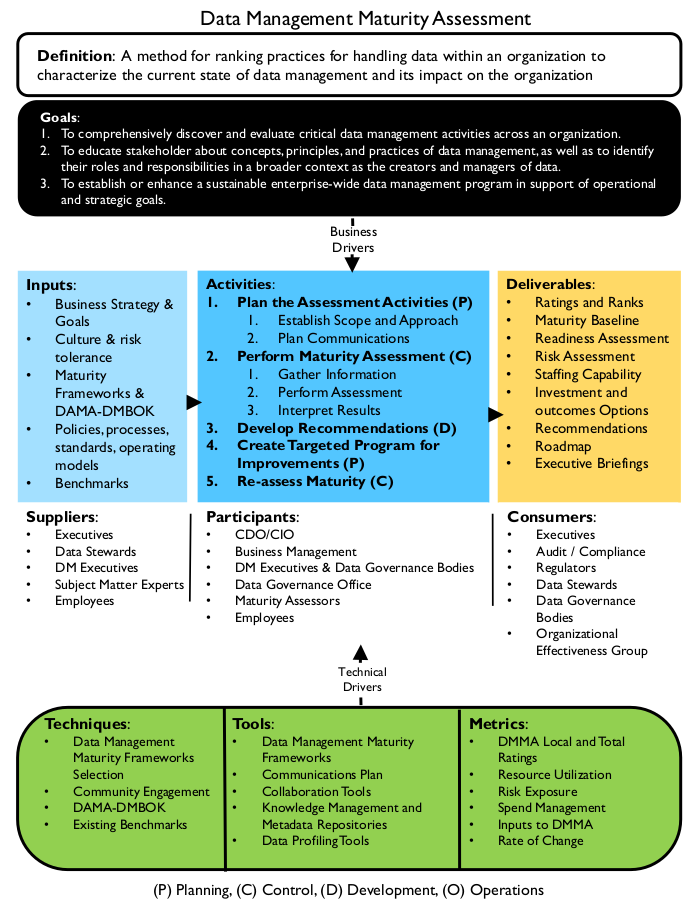
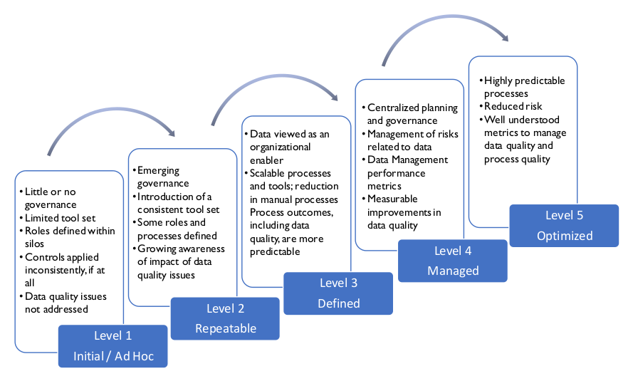
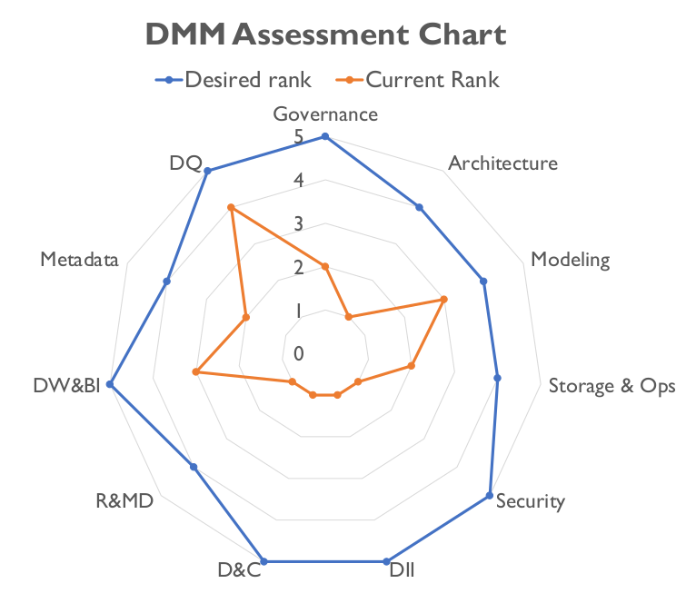

# Data Management Maturity Assessment

## 1. Introduction

Capability Maturity Assessment (CMA) is an approach to process improvement based on a framework – a Capability Maturity Model (CMM) – that describes how characteristics of a process evolve from ad hoc to optimal. The CMA concept grew out of efforts by the United States Department of Defense to establish criteria through which to evaluate software contractors. In the mid-1980s, the Capability Maturity Model for Software was published by the Software Engineering Institute of Carnegie-Mellon University. While first applied to software development, CMMs have been developed for a range of other fields, including data management.

Maturity models are defined in terms of a progression through levels that describe process characteristics. When an organization gains an understanding of process characteristics, it can evaluate its level of maturity and put in place a plan to improve its capabilities. It can also measure improvement and compare itself to competitors or partners, guided by the levels of the model. With each new level, process execution becomes more consistent, predictable, and reliable. Processes improve as they take on characteristics of the levels. Progression happens in a set order. No level can be skipped. Levels commonly include: [^96]

* **Level 0:** Absence of capability
* **Level 1:** Initial or Ad Hoc: Success depends on the competence of individuals
* **Level 2:** Repeatable: Minimum process discipline is in place
* **Level 3:** Defined: Standards are set and used
* **Level 4:** Managed: Processes are quantified and controlled
* **Level 5:** Optimized: Process improvement goals are quantified

Within each level, criteria are described across process features. For example, a maturity model may include criteria related to how processes are executed, including the level of automation of those processes. It may focus on policies and controls, as well as process details.

Such an assessment helps identify what is working well, what is not working well, and where an organization has gaps. Based on the findings, the organization can develop a roadmap to target:

* High-value improvement opportunities related to processes, methods, resources, and automation
* Capabilities that align with business strategy
* Governance processes for periodic evaluation of organizational progress based on characteristics in the model

A Data Management Maturity Assessment (DMMA) can be used to evaluate data management overall, or it can be used to focus on a single Knowledge Area or even a single process. Whatever the focus, a DMMA can help bridge the gap between business and IT perspectives on the health and effectiveness of data management practices. A DMMA provides a common language for depicting what progress looks like across Data Management Knowledge Areas and offers a stage-based path to improvement, which can be tailored to an organization’s strategic priorities. [^97] Thus, it can be used both to set and to measure organizational goals, as well as to compare one’s organization against other organizations or industry benchmarks.

Before beginning any DMMA, an organization has to establish a baseline understanding of its current state capabilities, assets, goals, and priorities. A certain level of organizational maturity is required to conduct the assessment in the first place, as well as to effectively respond to the assessment results by setting targets, establishing a roadmap, and monitoring progress.

### 1.1 Business Drivers

Organizations conduct capability maturity assessments for a number of reasons:

* Regulation: Regulatory oversight requires minimum levels of maturity in data management.
* Data Governance: The data governance function requires a maturity assessment for planning and compliance purposes.
* Organizational readiness for process improvement: An organization recognizes a need to improve its practices and begins by assessing its current state. For example, it makes a commitment to manage Master Data and needs to assess its readiness to deploy MDM processes and tools.
* Organizational change: An organizational change, such as a merger, presents data management challenges. A DMMA provides input for planning to meet these challenges.
* New technology: Advancements in technology offers new ways to manage and use data. The organization wants to understand the likelihood of successful adoption.
* Data management issues: There is need to address data quality issues or other data management challenges and the organization wants to baseline its current state in order to make better decisions about how to implement change.

Figure 103 Context Diagram: Data Management Maturity Assessment

### 1.2 Goals and Principles

The primary goal of a data management capability assessment is to evaluate the current state of critical data management activities in order to plan for improvement. The evaluation places the organization on the maturity scale by clarifying specific strengths and weaknesses. It helps the organization identify, prioritize, and implement improvement opportunities.

In meeting its primary goal, a DMMA can have a positive impact on culture. It helps:

* Educate stakeholders about data management concepts, principles, and practices
* Clarify stakeholder roles and responsibilities in relation to organizational data
* Highlight the need to manage data as a critical asset
* Broaden recognition of data management activities across the organization
* Contribute to improving the collaboration necessary for effective data governance

Based on assessment results, an organization can enhance its Data Management program so it supports the organization’s operational and strategic direction. Typically, Data Management programs develop in organizational silos. They rarely begin with an enterprise view of the data. A DMMA can equip the organization to develop a cohesive vision that supports overall organizational strategy. A DMMA enables the organization to clarify priorities, crystalize objectives, and develop an integrated plan for improvement.

### 1.3 Essential Concepts

#### 1.3.1 Assessment Levels and Characteristics

CMMs usually define five or six levels of maturity, each with its own characteristics that span from non-existent or ad hoc to optimized or high performance. See Figure 104 for a sample visualization. The following is a generic summary of macro states of data management maturity. A detailed assessment would include criteria for sub-categories like strategy, policy, standards, role definition, etc. within each of the Knowledge Areas.

* **Level 0: No Capability:** No organized data management practices or formal enterprise processes for managing data. Very few organizations exist at a Level 0. This level is acknowledged in a maturity model for purposes of definition.
* **Level 1 Initial / Ad Hoc:** General-purpose data management using a limited tool set, with little or no governance. Data handling is highly reliant on a few experts. Roles and responsibilities are defined within silos. Each data owner receives, generates, and sends data autonomously. Controls, if they exist, are applied inconsistently. Solutions for managing data are limited. Data quality issues are pervasive but not addressed. Infrastructure supports are at the business unit level.

Figure 104 Data Management Maturity Model Example

Assessment criteria may include the presence of any process controls, such as logging of data quality issues.

* **Level 2 Repeatable:** Emergence of consistent tools and role definition to support process execution. In Level 2, the organization begins to use centralized tools and to provide more oversight for data management. Roles are defined and processes are not dependent solely on specific experts. There is organizational awareness of data quality issues and concepts. Concepts of Master and Reference Data begin to be recognized.

Assessment criteria might include formal role definition in artifacts like job descriptions, the existence of process documentation, and the capacity to leverage tool sets.

* **Level 3 Defined:** Emerging data management capability. Level 3 sees the introduction and institutionalization of scalable data management processes and a view of DM as an organizational enabler. Characteristics include the replication of data across an organization with some controls in place and a general increase in overall data quality, along with coordinated policy definition and management. More formal process definition leads to a significant reduction in manual intervention. This, along with a centralized design process, means that process outcomes are more predictable.

Assessment criteria might include the existence of data management policies, the use of scalable processes, and the consistency of data models and system controls.

* **Level 4** Managed: Institutional knowledge gained from growth in Levels 1-3 enables the organization to predict results when approaching new projects and tasks and to begin to manage risks related to data. Data management includes performance metrics. Characteristics of Level 4 include standardized tools for data management from desktop to infrastructure, coupled with a well-formed centralized planning and governance function. Expressions of this level are a measurable increase in data quality and organization-wide capabilities such as end-to-end data audits.

Assessment criteria might include metrics related to project success, operational metrics for systems, and data quality metrics.

* **Level 5:** Optimization: When data management practices are optimized, they are highly predictable, due to process automation and technology change management. Organizations at this level of maturity focus on continuous improvement. At Level 5, tools enable a view data across processes. The proliferation of data is controlled to prevent needless duplication. Well-understood metrics are used to manage and measure data quality and processes.

Assessment criteria might include change management artifacts and metrics on process improvement.

#### 1.3.2 Assessment Criteria

Each capability level will have specific assessment criteria related to the processes being evaluated. For example, if the maturity of the data modeling function is being evaluated, level 1 may ask whether a data modeling practice exists at all and how many systems it extends to; level 2 may ask whether an approach to enterprise data modeling has been defined; level 3 will ask the degree to which the approach has been implemented; level 4 will ask whether modeling standards have been effectively enforced; and level 5 will ask about processes in place to improve modeling practices. (See Chapter 5.)

At any level, assessment criteria will be evaluated along a scale, such as 1 – Not started, 2 – In process, 3 – Functional, 4 – Effective, showing progress within that level and movement toward the next level. Scores can be combined or visually displayed to enable understanding of the variance between current and desired state. When assessing using a model that can be mapped to a DAMA-DMBOK Data Management Knowledge Area, criteria could be formulated based on the categories in the Context Diagram:

* **Activity:** To what degree is the activity or process in place? Are criteria defined for effective and efficient execution? How well defined and executed is the activity? Are best practice outputs produced?
* **Tools:** To what degree is the activity automated and supported by a common set of tools? Is tool training provided within specific roles and responsibilities? Are tools available when and where needed? Are they configured optimally to provide the most effective and efficient results? To what extent is long-term technology planning in place to accommodate future state capabilities?
* **Standards:** To what degree is the activity supported by a common set of standards? How well documented are the standards? Are standards enforced and supported by governance and change management?
* **People and resources:** To what degree is the organization staffed to carry out the activity? What specific skills, training, and knowledge are necessary to execute the activity? How well are roles and responsibilities defined?

Figure 105 illustrates one way of presenting a visual summary of findings from a DMMA. For each of the capabilities (Governance, Architecture, etc.) the outer ring of the display shows the level of capability the organization has determined it needs to compete successfully. The inner ring displays the level of capability as determined via the assessment. Areas where the distance between the two rings is largest represent the greatest risks to the organization. Such a report can help set priorities. It can also be used to measure progress over time.

Figure 105 Example of a Data Management Maturity Assessment Visualization

#### 1.3.3 Existing DMMA Frameworks [^98]

A data management maturity assessment framework is segmented into discrete data management topics. Framework focus and content vary depending on whether they have a general or industry-specific focus. However, most address subjects that can be mapped to DAMA-DMBOK Knowledge Areas. The examples below are intended to illustrate the range of Capability Maturity Models that have been developed in the data management space. Many vendors have developed their own models. Organizations should evaluate several models before choosing a vendor or before developing their own framework.

##### 1.3.3.1 CMMI Data Management Maturity Model (DMM)

The CMMI (Capability Maturity Model Institute) has developed the CMMI-DMM (Data Management Maturity Model) which provides assessment criteria for the following data management areas:

* Data Management Strategy
* Data Governance
* Data Quality
* Platform and Architecture
* Data Operations
* Supporting Processes

Within each of these processes, the model identifies sub-processes for evaluation. For example, the Data Quality section accounts for Data Quality Strategy and Data Quality Assessment, Profiling, and Cleansing. The model also accounts for the relation between the data management areas. For example the need for stakeholder alignment and the relation between business processes and Data Quality Management. [^99]

##### 1.3.3.2 EDM Council DCAM [^100]

The Enterprise Data Management Council, an industry advocacy organization for financial services headquartered in the United States, has developed the DCAM (Data Management Capability Assessment Model). The result of a membership-driven effort to get consensus on data management best practices, the DCAM describes 37 capabilities and 115 sub-capabilities associated with the development of a sustainable Data Management program. Scoring focuses on the level of stakeholder engagement, formality of process, and existence of artifacts that demonstrate the achievement of capabilities.

##### 1.3.3.3 IBM Data Governance Council Maturity Model [^101]

The IBM Data Governance Council Maturity Model was based on input from a council of 55 organizations. Council members collaborated to define a common set of observable and desired behaviors that organizations can use to evaluate and design their own data governance programs. The purpose of the model is to help organizations build consistency and quality control in governance through proven business technologies, collaborative methods, and best practices. The model is organized around four key categories:

* **Outcomes:** Data risk management and compliance, value creation
* **Enablers:** Organizational structure and awareness, policy, stewardship
* **Core disciplines:** Data Quality Management, information lifecycle management, information security and privacy
* **Supporting Disciplines:** Data Architecture, classification and Metadata, audit information, logging and reporting

The IBM model is presented both as a Maturity Framework and as a set of assessment questions with answers constructed to indicate maturity levels.

##### 1.3.3.4 Stanford Data Governance Maturity Model [^102]

The Stanford Data Governance Maturity Model was developed for use by the University; it was not intended to be an industry standard. Even still, it serves as a solid example of a model that provides guidance and a standard of measurement. The model focuses on data governance, not data management, but it nevertheless provides a basis for evaluating data management overall. The model differentiates between foundational (awareness, formalization, Metadata) and project (data stewardship, Data Quality, Master Data) components. Within each, it articulates drivers for people, policies, and capabilities. It then articulates characteristics of each level of maturity. It also provides qualitative and quantitative measurements for each level.

##### 1.3.3.5 Gartner’s Enterprise Information Management Maturity Model

Gartner has published an EIM maturity model, which establishes criteria for evaluating vision, strategy, metrics, governance, roles and responsibilities, lifecycle, and infrastructure.

## 2. Activities

Data Management Maturity Assessments require planning. To ensure practical, actionable results, allow time within the plan for preparation of materials and evaluation of results. Assessments should be conducted in a short, defined timeframe. The purpose of the evaluation is expose current strengths and opportunities for improvement – not to solve problems.

Evaluations are conducted by soliciting knowledge from business, data management, and information technology participants. The goal is to reach a consensus view of current state capabilities, supported by evidence. Evidence may come from examination of artifacts (such as whether database backups exist), through interviews (verifying someone is performing system of record evaluation for re-use), or both.

Assessments can and should be scaled to fit the needs of the organization. However, amend with care. Models may lose rigor or traceability to original intent if shortened or edited. Keep the integrity of the model intact when customizing.

### 2.1 Plan Assessment Activities

Planning for an assessment includes defining the overall approach and communicating with stakeholders before and during the assessment to ensure they are engaged. The assessment itself includes collecting and evaluating inputs and communicating results, recommendations, and action plans.

#### 2.1.1 Define Objectives

Any organization that decides it should assess its data management maturity level is already engaged in the effort to improve its practices. In most cases, such an organization will have identified the drivers for the assessment. These drivers must be clarified in the form of objectives that describe the focus and influence the scope of the assessment. The objectives for the assessment must be clearly understood by executives and the lines of business, who can help ensure alignment with the organization’s strategic direction.

Assessment objectives also provide criteria by which to evaluate which assessment model to adopt, which business areas to prioritize for assessment, and who should provide direct input to the process.

#### 2.1.2 Choose a Framework

As described in Section 1.3.3, existing frameworks focus on different aspects of data management. Review these frameworks in the context of assumptions about current state and assessment objectives in order to choose one that will inform the organization in meaningful ways. Focus areas of the assessment model can be customized based on organizational focus or scope.

The choice of framework influences how the assessment is conducted. The team working on it should have expertise in the model and the methodology on which it depends.

#### 2.1.3 Define Organizational Scope

Most DMM Frameworks are designed to apply to an entire enterprise. However, an enterprise-wide scope may be impractical. For a first assessment, it is usually best to define a manageable scope, such as a single business area or program. The areas chosen represent a meaningful subset of the organization and participants should be able to influence key business processes that affect the data assets within scope. As part of a phased approach, evaluation can be repeated for other parts of the organization. There are trade-offs between local and enterprise assessments:

* Localized assessments can go much deeper into the details. They can also be done more quickly because the scope is contained. To do a localized assessment, select a function that is highly regulated, such as financial reporting within a public company. The inputs, roles, tools, and consumers may be outside of the functions being assessed, which can complicate the scoping and execution of the assessment. Well-planned localized assessments can often be aggregated and weighted to form an enterprise assessment, since many data assets are shared.
* Enterprise assessments focus on the broad and sometimes disconnected parts of an organization. An enterprise assessment may be created from localized DMMA’s or it can be a separate undertaking. For example, an organization may evaluate different functions (research and development, manufacturing, and financing) based on the same criteria. The inputs, roles, tools, and consumers are typically pan- enterprise and multi-leveled.

#### 2.1.4 Define Interaction Approach

In conducting a DMMA, an organization should follow recommendations for the selected model. Information gathering activities may include workshops, interviews, surveys, and artifact reviews. Employ methods that work well within the organizational culture, minimize the time commitment from participants, and enable the assessment to be completed quickly so that actions from the assessment can be defined while the process is fresh in participants’ minds.

In all cases, responses will need to be formalized by having participants rate the assessment criteria. In many cases, assessment will also include actual inspection and evaluation of artifacts and other evidence.

If there are delays in completing the assessment, stakeholders are likely to lose enthusiasm for the Data Management program and the impetus for contributing to positive change. It is advisable to avoid detailed and comprehensive analysis and to emphasize sound judgment based on the expertise of the assessment leaders. The DMM Frameworks provide the measurement criteria and an embedded path to improvement. These enable synthesis of a complete picture of the current Data Management program and its parts.

#### 2.1.5 Plan Communications

Communications contribute to the overall success of the assessment and the action items coming out of it. Communication will be directed at participants and other stakeholders. Findings may impact people’s jobs, through changes in methodology and organizational alignment, so it is important to communicate clearly about the purpose, the process, and specific expectations for individuals and groups. Ensure participants understand the assessment model, as well as how the findings will be used.

Before the assessment begins, stakeholders should be informed about expectations for the assessment. Communications should describe:

* The purpose of the DMMA
* How it will be conducted
* What their involvement may be
* The schedule of assessment activities

During any activity of the assessment (for example, a focus group meeting), ensure there is a clear agenda, including a plan to answer any follow up questions. Continually remind participants of the goals and objectives. Always thank the participants and describe next steps.

Determine if the planned approach is likely to be successful across the targeted business scope, including such factors as resistance / cooperation, possible internal legal concerns about exposure to outside inspection if troubling gaps are found, or possible Human Resources concerns.

The communications plan should include a schedule to report on findings and recommendations at all levels, including general reports and executive briefings.

### 2.2 Perform Maturity Assessment

#### 2.2.1 Gather Information

The next step is to gather appropriate inputs for the assessment, based on the interaction model. At a minimum, the information gathered will include formal ratings of assessment criteria. It may also include input from interviews and focus groups, system analysis and design documentation, data investigation, email strings, procedure manuals, standards, policies, file repositories, approval workflows, various work products, Metadata repositories, data and integration reference architectures, templates, and forms.

#### 2.2.2 Perform the Assessment

The overall rating assignments and interpretation are typically multi-phased. Participants will have different opinions generating different ratings across the assessment topics. Discussion and rationalization will be needed to reconcile the ratings. Input is provided by the participants and then refined through artifact reviews or examination by the assessment team. The goal is to come to a consensus view of current state. This view should be supported by evidence (i.e., proof of practice demonstrated by behavior and artifacts). If stakeholders do not have consensus on current state, it is difficult to have consensus on how to improve the organization.

The refinement generally works as follows:

* Review results against the rating method and assign a preliminary rating to each work product or activity.
* Document the supporting evidence.
* Review with participants to come to consensus on a final rating for each area. If appropriate, use weight modifiers based on the importance of each criterion.
* Document the interpretation of the rating using the model criteria statements and assessor comments.
* Develop visualizations to illustrate results of the assessment.

### 2.3 Interpret Results

Interpretation of the results consists of identifying improvement opportunities aligned with organizational strategy and recommending actions required to take advantage of these opportunities. In other words, interpretation defines next steps toward a target state. When the assessment is complete, organizations need to plan for the target state that they aspire to achieve in data management. The amount of time and effort required to achieve the desired target will vary, depending on the starting point, the culture of the organization, and the drivers for change.

When presenting assessment results, start with the meaning of the ratings for the organization. The ratings can be expressed with respect to organizational and cultural drivers as well as business goals, such as customer satisfaction or increased sales. Illustrate the linkage between the current capabilities of the organization and the business processes and strategies that they support, and the benefits of improving these capabilities by moving to the target state.

#### 2.3.1 Report Assessment Results

The assessment report should include:

* Business drivers for the assessment
* Overall results of the assessment
* Ratings by topic with gaps indicated
* A recommended approach to close gaps
* Strengths of the organization as observed
* Risks to progress
* Investment and outcomes options
* Governance and metrics to measure progress
* Resource analysis and potential future utilization
* Artifacts that can be used or re-used within the organization

The assessment report is an input to the enhancement of the Data Management program, either as a whole or by Data Management Knowledge Area. From it, the organization can develop or advance its data management strategy. Strategy should include initiatives that further business goals through improved governance of processes and standards.

#### 2.3.2 Develop Executive Briefings

The assessment team should prepare executive briefings that summarize findings – strengths, gaps, and recommendations – that executives will use as input to decisions about targets, initiatives, and timelines. The team must tailor the messages to clarify likely impacts and benefits for each executive group. Often executives wish to aim higher than the assessment recommendations. In other words, they want to skip levels in the maturity model. Targeting a higher level of maturity has to be reflected in the impact analysis for the recommendations. There is a cost to this kind of acceleration, and costs must be balanced against benefits.

### 2.4 Create a Targeted Program for Improvements

The DMMA should have a direct impact on data strategy and IT governance, as well as the Data Management program and strategy. Recommendations from the DMMA should be actionable. These should describe capabilities the organizational requires. In doing so, an assessment can be a powerful tool for IT and business leaders to set organizational priorities and allocate resources.

#### 2.4.1 Identify Actions and Create a Roadmap

DMMA ratings highlight items for management attention. Initially, a rating is likely to be used as a standalone metric to determine how well an organization is doing a specific activity. However, ratings can be quickly operationalized into ongoing measures, especially for activities where change is desired (e.g., “The target is level ‘n’ because we need or want to be able to do something ‘z’”). If the assessment model is used for ongoing measurement, its criteria not only guides the organization to higher levels of maturity, its criteria also keeps organizational attention on improvement efforts.

The DMM assessment results should be detailed and comprehensive enough to support a multiple year data management improvement program, including initiatives that will build data management capability as the organization adopt best practices. Since change largely happens in organizations through projects, new projects must be influenced to adopt better practices. The roadmap or reference plan should contain:

* Sequenced activities to effect improvements in specific data management functions
* A timeline for implementing improvement activities
* Expected improvements in DMMA ratings once activities have been implemented
* Oversight activities, including the maturing this oversight over the timeline

The roadmap will give targets and a pace for change within prioritized work streams, and accompanied by an approach for measuring progress.

### 2.5 Re-assess Maturity

Re-assessments should be conducted at regular intervals. They are part of the cycle of continuous improvement:

* Establish a baseline rating through the first assessment
* Define re-assessment parameters, including organizational scope
* Repeat DMM assessment as necessary on a published schedule
* Track trends relative to the initial baseline
* Develop recommendations based on the re-assessment findings

Re-assessment can also re-invigorate or refocus effort. Measurable progress assists in maintaining commitment and enthusiasm across the organization. Changes to regulatory frameworks, internal or external policy, or innovations that could change the approach to governance and strategies are additional reasons to re-assess periodically.

## 3. Tools

* **Data Management Maturity Framework:** The primary tool used in a maturity assessment is the DMM framework itself.
* **Communication Plan:** A communication plan includes an engagement model for stakeholders, the type of information to be shared, and the schedule for sharing information.
* **Collaboration Tools:** Collaboration tools allow findings from the assessment to be shared. In addition, evidence of data management practices may be found in email, completed templates, and review documents created via standard processes for collaborative design, operations, incident tracking, reviews, and approvals.
* **Knowledge Management and Metadata Repositories:** Data standards, policies, methods, agendas, minutes of meetings or decisions, and business and technical artifacts that serve as proof of practice may be managed in these repositories. In some CMMs, lack of such repositories is an indicator of lower maturity in the organization. Metadata repositories can exist in several constructs, which may not be obvious to the participants. For example, some Business Intelligence applications rely completely on Metadata to compile their views and reports, while not referring to it as a separate distinct repository.

## 4. Techniques

Many techniques related to executing a DMMA are defined by the methodology of the DMM framework chosen. Techniques that are more general are described here.

### 4.1 Selecting a DMM Framework

The following criteria should be considered when selecting a DMM framework.

* **Accessibility:** Practices are stated in non-technical terms that convey the functional essence of the activity.
* **Comprehensiveness:** The framework addresses a broad scope of data management activities and includes business engagement, not merely IT processes.
* **Extensible and flexible:** The model is structured to enable enhancement of industry-specific or additional disciplines and can be used either in whole or in part, depending on the needs of the organization.
* **Future progress path built-in:** While specific priorities differ from organization to organization, the DMM framework outlines a logical way forward within each of the functions it describes.
* **Industry-agnostic vs. industry-specific:** Some organizations will benefit from an industry-specific approach, others from a more generic framework. Any DMM framework should also adhere to data management best practices that cross verticals.
* **Level of abstraction or detail:** Practices and evaluation criteria are expressed at a sufficient level of detail to ensure that they can be related to the organization and the work it performs.
* **Non-prescriptive:** The framework describes what needs to be performed, not how it must be performed.
* **Organized by topic:** The framework places data management activities in their appropriate context, enabling each to be evaluated separately, while recognizing the dependencies.
* **Repeatable:** The framework can be consistently interpreted, supporting repeatable results to compare an organization against others in its industry and to track progress over time.
* **Supported by a neutral, independent organization:** The model should be vendor neutral in order to avoid conflicts of interest, and widely available to ensure a broad representation of best practices.
* **Technology neutral:** The focus of the model should be on practices, rather than tools.
* **Training support included:** The model is supported by comprehensive training to enable professionals to master the framework and optimize its use.

### 4.2 DAMA-DMBOK Framework Use

The DAMA-DMBOK can be used to prepare for or establish criteria for a DMMA. Execution owners will see a direct linkage between segmented functions (the Knowledge Areas) and the corresponding tasks (activities).

The DMBOK Knowledge Areas, activities, and deliverables (work products) can be configured to a specific DMM framework based on the areas measured, their supporting activities, relevancy, and time available. This fast, checklist approach can be used to determine areas that need deeper analysis, represent gaps, or point to hot spots for remediation.

The DMBOK offers an additional advantage as an assessment-planning tool: There is a large community of knowledge professionals using the DMBOK as a guide across multiple industries, creating a community of practice around its use.

## 5. Guidelines for a DMMA

### 5.1 Readiness Assessment / Risk Assessment

Before conducting a maturity assessment, it is helpful to identify potential risks and some risk mitigation strategies. Table 33 summarizes risks and mitigation approaches.

Table 33 Typical Risks and Mitigations for a DMMA

<table>
  <thead>
    <tr>
      <th>Risk</th>
      <th colspan="2">Mitigation</th>
    </tr>
  </thead>
  <tbody>
    <tr>
      <td>
      Lack of organizational buy-in
      </td>
      <td>
      Socialize the concepts related to the assessment. Establish benefit statements before conducting the assessment. Share articles and success stories. Engage an executive sponsor to champion the effort and review the results.
      </td>
    </tr>
    <tr>
      <td>
      Lack of DMMA expertise, Lack of time or in-house expertise, Lack of communication planning or standards
      </td>
      <td>
      Use third party resources or specialists. Require knowledge transfer and training as part of the engagement.
      </td>
    </tr>
    <tr>
      <td>
      Lack of ‘Data Speak’ in the organization; Conversations on data quickly devolve into discussions about systems
      </td>
      <td>
      Relate the DMMA to specific business problems or scenarios. Address in the communications plan. The DMMA will educate all participants regardless of background and technical experience. Orient participants to key concepts prior to the DMMA.
      </td>
    </tr>
    <tr>
      <td>
      Incomplete or out-of-date assets for analysis
      </td>
      <td>
      Flag ‘as of’ or balance the rating accordingly. For example, give a -1 to everything that is over 1 year out-of-date.
      </td>
    </tr>
    <tr>
      <td>
      Narrow focus
      </td>
      <td>
      Reduce the investigation depth to a simple DMMA and go to other areas for a quick assessment to establish ratings for a later comparative baseline. Conduct the first DMMA as a pilot, then apply lessons learned to address a broader scope. Present in-scope focus of proposed assessment in context of DAMA-DMBOK Knowledge Areas. Illustrate what is being left out of scope and discuss the need to include.
      </td>
    </tr>
    <tr>
      <td>
      Inaccessible staff or systems
      </td>
      <td>
      Reduce the horizontal scope of the DMMA by focusing only on available Knowledge Areas and staff
      </td>
    </tr>
    <tr>
      <td>
      Surprises arise such as a regulation changes
      </td>
      <td>
      Add flexibility into the assessment work stream and focus.
      </td>
    </tr>
  </tbody>
</table>

### 5.2 Organizational and Cultural Change

Establishing or enhancing a Data Management program includes changes to processes, methods, and tools. With these changes, culture must also change. Organizational and cultural transformation begins with acknowledging that things can be better. Measurement functions typically usher in meaningful change. The DMMA locates the organization on a maturity scale and provides a roadmap for improvement. Doing so, it can point an organization forward through change. The DMMA results should be part of a larger discussion within an organization. When properly supported by effective data governance, DMMA results can coalesce differing perspectives, result in a shared vision, and accelerate an organization’s progress. (See Chapter 17.)

## 6. Maturity Management Governance

Typically, a DMMA is part of an overall set of data governance activities, each of which has a lifecycle. The lifecycle of a DMMA consists of the initial planning and initial assessment, followed by recommendations, an action plan, and periodic re-evaluation. The lifecycle itself should be governed.

### 6.1 DMMA Process Oversight

Oversight for the DMMA process belongs to the Data Governance team. If formal Data Governance is not in place, then oversight defaults to the steering committee or management layer that initiated the DMMA. The process should have an executive sponsor, ideally the CDO, to ensure improvements in data management activities map directly to business objectives.

The breadth and depth of oversight depend on the DMMA’s scope. Each function involved in the process has a voice in the execution, method, results, and roadmaps coming from the overall assessment. Each involved data management area and organization function will have an independent view, but also will have a common language through the DMM framework.

### 6.2 Metrics

In addition to being a core component of any improvement strategy, metrics are a key communications tool. Initial DMMA metrics are the ratings representing the current state of data management. These can be periodically reassessed to show improvement trends. Each organization should develop metrics tailored to its target state roadmap. Sample metrics could include:

* **DMMA ratings:** DMMA ratings present a snapshot of the organization’s capability level. The ratings may be accompanied by a description, perhaps a custom weighting for the rating across an assessment or specific topic area, and a recommended target state.
* **Resource utilization rates:** Powerful examples of metrics that help express the cost of data management in the form of head count. An example of this type of metric is: “Every resource in the organization spends 10% of their time manually aggregating data.”
* **Risk exposure** or the ability to respond to risk scenarios expresses an organization’s capabilities relative to their DMMA ratings. For example, if an organization wanted to begin a new business that required a high level of automation but their current operating model is based on manual data management (Level 1), they would be at risk of not delivering.
* **Spend management** expresses how the cost of data management is allocated across an organization and identifies the impacts of this cost on sustainability and value. These metrics overlap with data governance metrics.
  * Data management sustainability
  * Achievement of initiative goals and objectives
  * Effectiveness of communication
  * Effectiveness of education and training
  * Speed of change adoption
  * Data management value
  * Contributions to business objectives
  * Reductions in risks
  * Improved efficiency in operations
* Inputs to the DMMA are important to manage as they speak to the completeness of coverage, level of investigation, and detail of the scope relevant for interpretation of the scoring results. Core inputs could include the following: count, coverage, availability, number of systems, data volumes, teams involved, etc.
* Rate of Change The rate at which an organization is improving its capability. A baseline is established through the DMMA. Periodic reassessment is used to trend improvement.

## 7. Works Cited / Recommended

Afflerbach, Peter. Essential Readings on Assessment. International Reading Association, 2010. Print.

Baskarada, Sasa. IQM-CMM: Information Quality Management Capability Maturity Model. Vieweg+Teubner Verlag, 2009. Print. Ausgezeichnete Arbeiten zur Informationsqualität.

Boutros, Tristan and Tim Purdie. The Process Improvement Handbook: A Blueprint for Managing Change and Increasing Organizational Performance. McGraw-Hill Education, 2013. Print.

CMMI Institute (website). http://bit.ly/1Vev9xx.

Crawford, J. Kent. Project Management Maturity Model. 3rd ed. Auerbach Publications, 2014. Print. PM Solutions Research.

Enterprise Data Management Council (website).

Freund, Jack and Jack Jones. Measuring and Managing Information Risk: A FAIR Approach. Butterworth-Heinemann, 2014. Print.

Ghavami, Peter PhD. Big Data Governance: Modern Data Management Principles for Hadoop, NoSQL and Big Data Analytics. CreateSpace Independent Publishing Platform, 2015. Print.

Honeysett, Sarah. Limited Capability - The Assessment Phase. Amazon Digital Services LLC., 2013. Social Insecurity Book 3.

IBM Data Governance Council. https://ibm.co/2sUKIng.

Jeff Gorball, Introduction to Data Management Maturity Models. SlideShare.net, 2016-08-01. http://bit.ly/2tsIOqR.

Marchewka, Jack T. Information Technology Project Management: Providing Measurable Organizational Value. 5th ed. Wiley, 2016. Print.

McSweeney, Alan. Review of Data Management Maturity Models. SlideShare.net, 2013-10-23. http://bit.ly/2spTCY9.

Persse, James R. Implementing the Capability Maturity Model. Wiley, 2001.Print.

Saaksvuori, Antti. Product Management Maturity Assessment Framework. Sirrus Publishing Ltd., 2015. Print.

Select Business Solutions. “What is the Capability Maturity Model?” http://bit.ly/IFMJI8 (Accessed 2016-11-10).

Stanford University. Stanford Data Governance Maturity Model. http://stanford.io/2ttOMrF.

Van Haren Publishing. IT Capability Maturity Framework IT-CMF. Van Haren Pub, 2015. Print.

[^96]: Adapted from Select Business Solutions, “What is the Capability Maturity Model?” http://bit.ly/IFMJI8 (Accessed 2016-11-10).
[^97]: http://bit.ly/1Vev9xx July 18 2015.
[^98]: For additional information and review of existing Data Management CMMs, see: Alan McSweeney, Review of Data Management Maturity Models, SlideShare.net, published 2013-10-23. http://bit.ly/2spTCY9. Jeff Gorball, Introduction to Data Management Maturity Models, SlideShare.net, published 2016-08-01. McSweeney includes the DAMA-DMBOK as one of his maturity models, although the DMBOK is not structured as such.
[^99]: http://bit.ly/1Vev9xx accessed 2015-07-18
[^100]: http://bit.ly/2sqaSga accessed 2015-07-18
[^101]: https://ibm.co/2sRfBIn (accessed 2016-12-04)
[^102]: http://stanford.io/2sBR5bZ (accessed 2016-12-04) and http://stanford.io/2rVPyM2 (accessed 2016-12-04).

