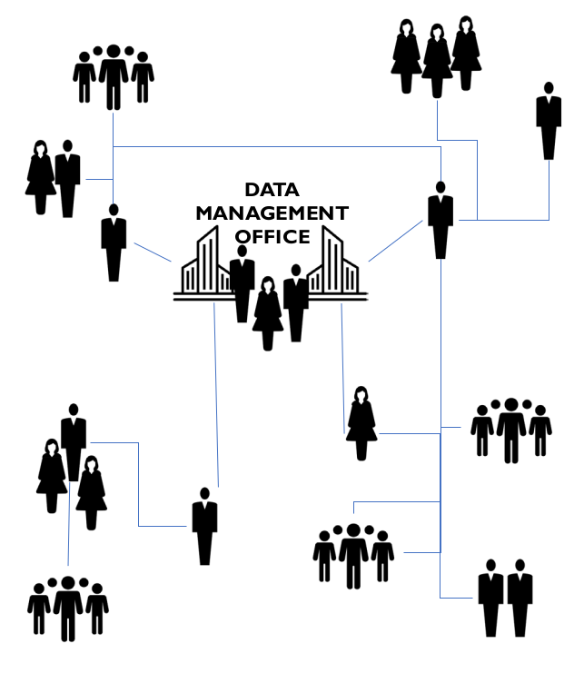
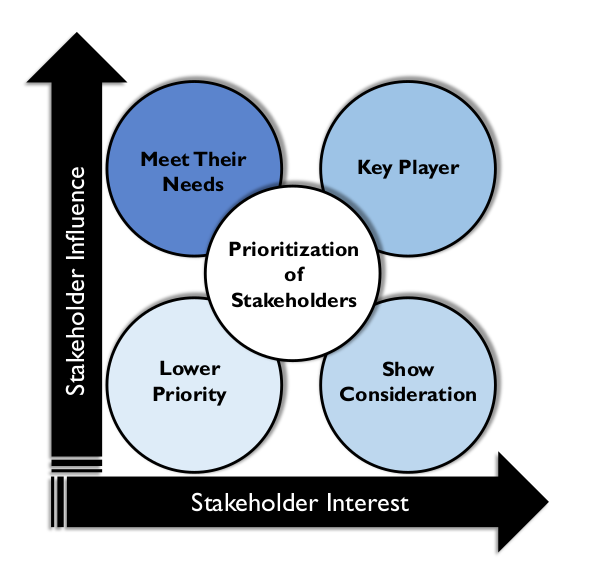

# Expectativas da Organização e do Papel da Gestão de Dados

## 1. Introdução

O cenário de dados está evoluindo rapidamente e, com ele, as organizações precisam evoluir as formas como gerenciam e governam os dados. A maioria das organizações hoje se depara com um volume crescente de dados capturados por meio de uma ampla gama de processos e em diversos formatos. O aumento do volume e da variedade adiciona complexidade à gestão de dados. Ao mesmo tempo, os consumidores de dados agora exigem acesso rápido e fácil aos dados. Eles querem ser capazes de entendê-los e usá-los para abordar questões críticas de negócios em tempo hábil. As organizações de gestão e governança de dados devem ser flexíveis o suficiente para trabalhar com eficácia neste ambiente em evolução. Para isso, precisam esclarecer questões básicas sobre propriedade, colaboração, responsabilidade e tomada de decisões.

Esta seção descreverá um conjunto de princípios que devem ser considerados ao montar uma organização de gestão ou governança de dados. Refere-se tanto à governança de dados quanto ao gerenciamento de dados, pois a governança de dados fornece a orientação e o contexto de negócios para as atividades executadas pela Organização de Gestão de Dados. Não existe uma estrutura organizacional perfeita para nenhuma delas. Embora princípios comuns devam ser aplicados à organização em torno da governança e do gerenciamento de dados, muitos dos detalhes dependerão dos impulsionadores do setor da empresa e da cultura corporativa da própria empresa.

## 2. Compreender a Organização Existente e as Normas Culturais

Conscientização, responsabilidade e responsabilização são as chaves para ativar e engajar as pessoas em iniciativas, políticas e processos de gerenciamento de dados. Antes de definir qualquer nova organização ou tentar aprimorar uma existente, é importante entender o estado atual dos componentes, relacionados à cultura, ao modelo operacional existente e às pessoas. Veja a Figura 106. Por exemplo:

* O papel dos dados na organização: Quais processos-chave são orientados por dados? Como os requisitos de dados são definidos e compreendidos? Qual é o reconhecimento do papel que os dados desempenham na estratégia organizacional?

Figura 106 Avaliar o Estado Atual para Criar um Modelo Operacional

* **Normas culturais sobre dados:** Existem potenciais obstáculos culturais para implementar ou aprimorar as estruturas de gestão e governança?
* **Práticas de gestão e governança de dados:** Como e por quem o trabalho relacionado a dados é executado? Como e por quem as decisões sobre dados são tomadas?
* **Como o trabalho é organizado e executado:** Por exemplo, qual é a relação entre a execução focada no projeto e a execução operacional? Quais estruturas de comitês estão em vigor para apoiar o esforço de gestão de dados?
* **Como os relacionamentos de subordinação são organizados:** Por exemplo, a organização é centralizada ou descentralizada, hierárquica ou horizontal?
* **Níveis de habilidade:** Qual é o nível de conhecimento de dados e de gestão de dados das PMEs e outras partes interessadas, desde a equipe de linha até os executivos?

Após formar uma imagem do estado atual, avalie o nível de satisfação com o estado atual para obter insights sobre as necessidades e prioridades de gestão de dados da organização. Por exemplo:

* A organização possui as informações necessárias para tomar decisões de negócios sólidas e oportunas?
* A organização confia em seus relatórios de receita?
* Ela consegue monitorar os indicadores-chave de desempenho da organização?
* A organização está em conformidade com todas as leis relativas à gestão de dados?

A maioria das organizações que buscam aprimorar suas práticas de gestão ou governança de dados está no meio da escala de maturidade de capacidade (ou seja, não estão nem em 0 nem em 5 na escala CMM). (Consulte o Capítulo 15.) Para criar uma Organização de Gestão de Dados relevante, é importante compreender e se adaptar à cultura empresarial e às normas organizacionais existentes. Se a Organização de Gestão de Dados não estiver alinhada às estruturas de tomada de decisão e comitês existentes, será difícil sustentá-la ao longo do tempo. Portanto, faz sentido desenvolver essas organizações, em vez de impor mudanças radicais.

Uma Organização de Gestão de Dados deve estar alinhada à hierarquia organizacional e aos recursos de uma empresa. Encontrar as pessoas certas requer uma compreensão tanto do papel funcional quanto do papel político da gestão de dados dentro de uma organização. O objetivo deve ser a participação multifuncional das diversas partes interessadas do negócio. Para isso:

* Identifique os funcionários que atualmente desempenham funções de gerenciamento de dados; reconheça-os e envolva-os primeiro. Contrate recursos adicionais somente conforme as necessidades de gerenciamento e governança de dados aumentem.
* Examine os métodos que a organização está usando para gerenciar dados e determine como os processos podem ser aprimorados. Determine o quanto de mudança provavelmente será necessário para aprimorar as práticas de gerenciamento de dados.
* Mapeie os tipos de mudanças que precisam ocorrer, de uma perspectiva organizacional, para melhor atender aos requisitos.

## 3. Construções Organizacionais de Gestão de Dados

Uma etapa crítica no projeto de uma Organização de Gestão de Dados é identificar o modelo operacional mais adequado para a organização. O modelo operacional é uma estrutura que articula funções, responsabilidades e processos de tomada de decisão. Ele descreve como as pessoas e as funções irão colaborar.

Um modelo operacional confiável ajuda a criar responsabilidade, garantindo que as funções corretas dentro da organização sejam representadas. Facilita a comunicação e fornece um processo para resolver problemas. Embora forme a base para a estrutura organizacional, o modelo operacional não é um organograma – não se trata de colocar nomes em caixas, mas de descrever o relacionamento entre os componentes da organização.

Esta seção apresentará uma visão geral de alto nível dos prós e contras dos modelos operacionais descentralizados, em rede, híbridos, federados e centralizados.

### 3.1 Modelo Operacional Descentralizado

Em um modelo descentralizado, as responsabilidades de gestão de dados são distribuídas entre diferentes linhas de negócios e TI (veja a Figura 107). A colaboração é baseada em comitês; não há um único responsável. Muitos programas de Gestão de Dados começam como esforços de base para unificar as práticas de gestão de dados em uma organização e, portanto, possuem uma estrutura descentralizada.

Os benefícios desse modelo incluem sua estrutura relativamente plana e o alinhamento da gestão de dados às linhas de negócios ou à TI. Esse alinhamento geralmente significa que há uma compreensão clara dos requisitos de dados. Também é relativamente fácil de implementar ou aprimorar.

As desvantagens incluem o desafio de ter muitos participantes envolvidos com órgãos de governança e na tomada de decisões. Geralmente, é mais difícil implementar decisões colaborativas do que decretos centralizados. Modelos descentralizados geralmente são menos formais e, por isso, podem ser mais difíceis de sustentar ao longo do tempo. Para serem bem-sucedidos, eles precisam ter maneiras de impor a consistência das práticas. Isso pode ser difícil de coordenar. Muitas vezes, também é difícil definir a propriedade dos dados com um modelo descentralizado.

Figura 107 Modelo Operacional Descentralizado

### 3.2 Modelo Operacional em Rede

A informalidade descentralizada pode ser formalizada por meio de uma série documentada de conexões e responsabilidades, por meio de uma matriz RACI (Responsável, Prestador de Contas, Consultado e Informado). Isso é chamado de modelo em rede porque opera como uma série de conexões conhecidas entre pessoas e funções e pode ser diagramado como uma "rede". (Veja a Figura 108.)

Figura 108 Modelo Operacional em Rede

Os benefícios de um modelo em rede são semelhantes aos de um modelo descentralizado (estrutura plana, alinhamento, configuração rápida). A adição de uma RACI ajuda a criar responsabilidades sem impactar os organogramas. A desvantagem adicional é a necessidade de manter e impor expectativas relacionadas à RACI.

### 3.3 Modelo Operacional Centralizado

O modelo operacional de gerenciamento de dados mais formal e maduro é o centralizado (veja a Figura 109). Aqui, tudo é de propriedade da Organização de Gerenciamento de Dados. Os envolvidos na governança e no gerenciamento de dados se reportam diretamente a um líder de gerenciamento de dados, responsável por Governança, Administração, Gerenciamento de Metadados, Gerenciamento da Qualidade de Dados, Gerenciamento de Dados Mestres e de Referência, Arquitetura de Dados, Análise de Negócios, etc.

Figura 109 Modelo Operacional Centralizado

A vantagem de um modelo centralizado é que ele estabelece uma posição executiva formal para o gerenciamento de dados ou governança de dados. Há uma pessoa no topo. A tomada de decisões é mais fácil porque a responsabilidade é clara. Dentro da organização, os dados podem ser gerenciados por tipo ou área de assunto. A desvantagem é que a implementação de um modelo centralizado geralmente requer mudanças organizacionais significativas. Há também o risco de que a separação formal da função de gerenciamento de dados a afaste dos processos essenciais do negócio e possa resultar na perda de conhecimento ao longo do tempo.

Um modelo centralizado geralmente requer uma nova organização. Surge a pergunta: onde a Organização de Gestão de Dados se encaixa na empresa como um todo? Quem a lidera e a quem o líder se reporta? É cada vez mais comum que uma Organização de Gestão de Dados não se reporte ao CIO devido ao desejo de manter uma perspectiva de negócios, em vez de TI, sobre os dados. Essas organizações também costumam fazer parte de uma equipe de serviços ou operações compartilhadas, ou da organização do Diretor de Dados. (Consulte a Seção 6.1.)

### 3.4 Modelo Operacional Híbrido

Como o próprio nome indica, o modelo operacional híbrido abrange os benefícios dos modelos descentralizado e centralizado (ver Figura 110). Em um modelo híbrido, um Centro de Excelência em gerenciamento de dados centralizado trabalha com grupos de unidades de negócios descentralizados, geralmente por meio de um comitê executivo de direção que representa as principais linhas de negócios e um conjunto de grupos de trabalho táticos que abordam problemas específicos.

Figura 110 Modelo Operacional Híbrido

Neste modelo, algumas funções permanecem descentralizadas. Por exemplo, Arquitetos de Dados podem permanecer dentro de um grupo de Arquitetura Corporativa; as linhas de negócios podem ter suas próprias equipes de Qualidade de Dados. As funções centralizadas e descentralizadas podem variar bastante, dependendo principalmente da cultura organizacional.

O principal benefício de um modelo híbrido é que ele estabelece uma direção apropriada a partir do topo da organização. Há um executivo responsável pelo gerenciamento e/ou governança de dados. As equipes das Unidades de Negócios têm ampla responsabilidade e podem se alinhar às prioridades do negócio para fornecer maior foco. Eles se beneficiam do suporte de um Centro de Excelência dedicado à gestão de dados, que pode ajudar a direcionar o foco para desafios específicos.

Os desafios incluem a estruturação da organização, visto que isso geralmente requer pessoal adicional para compor um Centro de Excelência. As equipes das Unidades de Negócios podem ter prioridades diferentes, que precisarão ser gerenciadas de uma perspectiva corporativa. Além disso, às vezes há conflitos entre as prioridades da organização central e as das organizações descentralizadas.

### 3.5 Modelo Operacional Federado

Uma variação do modelo operacional híbrido, o modelo federado fornece camadas adicionais de centralização/descentralização, frequentemente necessárias em grandes empresas globais. Imagine uma Organização de Gestão de Dados corporativa com vários modelos híbridos de gestão de dados delineados com base na divisão ou região. (Consulte a Figura 111.)

Figura 111 Modelo Operacional Federado

Um modelo federado fornece uma estratégia centralizada com execução descentralizada. Portanto, para grandes empresas, pode ser o único modelo que pode funcionar. Um executivo de gestão de dados, responsável por toda a organização, administra o Centro de Excelência da empresa. É claro que diferentes linhas de negócios têm autonomia para atender aos requisitos com base em suas necessidades e prioridades. A federação permite que a organização priorize com base em entidades de dados específicas, desafios divisionais ou prioridades regionais.

A principal desvantagem é a complexidade. Há muitas camadas e é necessário um equilíbrio entre a autonomia das linhas de negócios e as necessidades da empresa. Esse equilíbrio pode impactar as prioridades da empresa.

### 3.6 Identificando o Melhor Modelo para uma Organização

O modelo operacional é um ponto de partida para aprimorar as práticas de gestão e governança de dados. Sua implementação requer a compreensão de como ele pode impactar a organização atual e como provavelmente precisará evoluir ao longo do tempo. Como o modelo operacional servirá como a estrutura por meio da qual políticas e processos serão definidos, aprovados e executados, é fundamental identificar o mais adequado para uma organização. Avalie se a estrutura organizacional atual é centralizada, descentralizada ou uma combinação delas, hierárquica ou relativamente horizontal. Caracterize o quão independentes são as divisões ou regiões. Elas operam de forma quase autossuficiente? Seus requisitos e objetivos são muito diferentes entre si? ​​Mais importante ainda, tente determinar como as decisões são tomadas (por exemplo, democraticamente ou por decreto), bem como como são implementadas.

As respostas devem fornecer um ponto de partida para entender a posição da organização no espectro entre descentralizada e centralizada.

### 3.7 Alternativas e Considerações de Design para DMO

A maioria das organizações começa com um modelo descentralizado antes de migrar para uma Organização de Gestão de Dados (DMO) formal. À medida que a organização percebe o impacto das melhorias na qualidade dos dados, ela pode começar a formalizar a responsabilização por meio de uma matriz RACI de gestão de dados e evoluir para um modelo de rede. Com o tempo, as sinergias entre as funções distribuídas se tornarão mais evidentes e economias de escala serão identificadas, o que levará algumas funções e pessoas a grupos organizados. Eventualmente, isso pode se transformar em um modelo híbrido ou federado.

Algumas organizações não têm o luxo de passar por esse processo de maturidade. Elas são forçadas a amadurecer rapidamente com base em um choque de mercado ou em novas regulamentações governamentais. Nesse caso, é importante abordar proativamente o desconforto associado à mudança organizacional para que ela seja bem-sucedida e sustentável. (Consulte o Capítulo 17.)

Seja qual for o modelo escolhido, lembre-se de que simplicidade e usabilidade são essenciais para a aceitação e a sustentabilidade. Se o modelo operacional se adequar à cultura de uma empresa, o gerenciamento de dados e a governança adequada podem ser incorporados às operações e alinhados à estratégia. Tenha estas dicas em mente ao construir um Modelo Operacional:

* Determine o ponto de partida avaliando o estado atual
* Vincule o modelo operacional à estrutura da organização
* Leve em consideração:
  * Complexidade e Maturidade da Organização
  * Complexidade e Maturidade do Domínio
  * Escalabilidade
* Obtenha o patrocínio executivo – essencial para um modelo sustentável
* Garanta que qualquer fórum de liderança (comitê de direção, conselho consultivo, diretoria) seja um órgão decisório
* Considere programas piloto e ondas de implementação
* Foque em domínios de dados de alto valor e alto impacto
* Use o que já existe
* Nunca adote uma abordagem única para todos

## 4. Fatores Críticos de Sucesso

Dez fatores têm demonstrado consistentemente desempenhar um papel fundamental no sucesso de Organizações de Gestão de Dados eficazes, independentemente de sua estrutura:

1. Patrocínio executivo
2. Visão clara
3. Gestão proativa de mudanças
4. Alinhamento da liderança
5. Comunicação
6. Engajamento das partes interessadas
7. Orientação e treinamento
8. Mensuração da adoção
9. Adesão aos princípios orientadores
10. Evolução, não revolução

### 4.1 Patrocínio Executivo

Ter o patrocinador executivo certo garante que as partes interessadas afetadas por um programa de Gestão de Dados recebam a orientação necessária para a transição eficiente e eficaz através das mudanças necessárias para consolidar a nova organização focada em dados e sustentá-la a longo prazo. O patrocinador executivo deve compreender e acreditar na iniciativa. Ele ou ela deve ser capaz de engajar efetivamente outros líderes no apoio às mudanças.

### 4.2 Visão Clara

Uma visão clara para a Organização de Gestão de Dados, juntamente com um plano para conduzi-la, é fundamental para o sucesso. Os líderes organizacionais devem garantir que todas as partes interessadas afetadas pela gestão de dados – tanto internas quanto externas – entendam e internalizem o que é gestão de dados, por que ela é importante e como seu trabalho afetará e será afetado por ela.

### 4.3 Gestão Proativa de Mudanças

Gerenciar a mudança associada à criação de uma Organização de Gestão de Dados exige planejamento, gestão e sustentação da mudança. A aplicação da gestão de mudanças organizacionais ao estabelecimento de uma Organização de Gestão de Dados aborda os desafios relacionados às pessoas e aumenta a probabilidade de a Organização de Gestão de Dados desejada ser sustentável ao longo do tempo. (Consulte o Capítulo 17.)

### 4.4 Alinhamento da Liderança

O alinhamento da liderança garante que haja consenso – e apoio unificado – sobre a necessidade de um programa de Gestão de Dados e que haja consenso sobre como o sucesso será definido. O alinhamento da liderança inclui tanto o alinhamento entre os objetivos dos líderes e os resultados da gestão de dados quanto o valor e o alinhamento de propósito entre os líderes.

Se os líderes não estiverem alinhados entre si, acabarão enviando mensagens confusas que podem gerar resistência e, eventualmente, inviabilizar a mudança. Portanto, é fundamental avaliar – e reavaliar regularmente – os líderes em todos os níveis para identificar desconexões e tomar medidas para solucioná-las rapidamente.

### 4.5 Comunicação

A comunicação deve começar cedo e continuar aberta e frequentemente. A organização deve garantir que as partes interessadas tenham uma compreensão clara do que é gerenciamento de dados e por que ele é importante para a empresa, o que está mudando e quais mudanças de comportamento são necessárias. As pessoas não podem melhorar a maneira como gerenciam dados se não souberem o que devem fazer de diferente. Criar uma história em torno da iniciativa de gerenciamento de dados e construir mensagens-chave em torno dela auxilia nesses processos.

As mensagens devem ser consistentes, ressaltando a importância do gerenciamento de dados. Além disso, devem ser personalizadas de acordo com o grupo de partes interessadas. Por exemplo, o nível de educação ou a quantidade de treinamento necessário para diferentes grupos em relação ao gerenciamento de dados variará. As mensagens devem ser repetidas conforme necessário e testadas continuamente ao longo do tempo para garantir que estejam sendo divulgadas de forma eficaz e que a conscientização e a compreensão estejam sendo construídas.

### 4.6 Engajamento das Partes Interessadas

Indivíduos, bem como grupos, afetados por uma iniciativa de gerenciamento de dados reagirão de forma diferente ao novo programa e ao seu papel nele. A forma como a organização engaja essas partes interessadas – como elas se comunicam, respondem e as envolvem – terá um impacto significativo no sucesso da iniciativa. Uma análise das partes interessadas ajuda a organização a entender melhor aqueles afetados pelas mudanças no gerenciamento de dados. Ao obter essas informações e mapear as partes interessadas de acordo com o nível de influência dentro da organização e o nível de interesse (ou efeito devido à) implementação do gerenciamento de dados, a organização pode determinar a melhor abordagem para engajar diferentes partes interessadas no processo de mudança. (Consulte a Seção 5.3.)

### 4.7 Orientação e Treinamento

A educação é essencial para que o gerenciamento de dados aconteça, embora diferentes grupos exijam diferentes tipos e níveis de educação.

Os líderes precisarão de orientação sobre os aspectos mais amplos do gerenciamento de dados e o valor para a empresa. Administradores, proprietários e custodiantes de dados (ou seja, aqueles na linha de frente da mudança) precisarão de um conhecimento profundo da iniciativa de gerenciamento de dados. Treinamentos focados permitirão que desempenhem suas funções com eficácia. Isso significa treinamento em novas políticas, processos, técnicas, procedimentos e até mesmo ferramentas.

### 4.8 Mensuração da Adoção

É importante construir métricas em torno do progresso e da adoção das diretrizes de gerenciamento de dados e planejar para garantir que o roteiro de gerenciamento de dados esteja funcionando e que continuará funcionando. Planeje mensurar:

* Adoção
* Quantidade de melhoria ou o delta em relação a um estado anterior
* Aspectos facilitadores do gerenciamento de dados – quão bem o gerenciamento de dados influencia soluções com resultados mensuráveis?
* Processos e projetos aprimorados
* Identificação e reação aprimoradas a riscos
* O aspecto inovador do gerenciamento de dados – quão bem o gerenciamento de dados muda fundamentalmente a forma como os negócios são conduzidos?
* Análise confiável

O aspecto facilitador do gerenciamento de dados pode se concentrar na melhoria de processos centrados em dados, como fechamento mensal, identificação de riscos e eficiência na execução de projetos. O aspecto inovador do gerenciamento de dados pode se concentrar na melhoria da tomada de decisões e da análise por meio de dados aprimorados e confiáveis.

### 4.9 Adesão aos Princípios Orientadores

Um princípio orientador é uma declaração que articula valores organizacionais compartilhados, fundamenta a visão e a missão estratégicas e serve como base para a tomada de decisões integradas. Os princípios orientadores constituem as regras, restrições, critérios primordiais e comportamentos que uma organização segue em suas atividades diárias a longo prazo. Independentemente de haver um modelo operacional descentralizado ou centralizado, ou algo entre os dois, é fundamental estabelecer e concordar com os princípios orientadores para que todos os participantes se comportem de forma sincronizada. Os princípios orientadores servem como pontos de referência a partir dos quais todas as decisões serão tomadas. Estabelecê-los é um primeiro passo importante na criação de um programa de Gestão de Dados que efetivamente impulsione mudanças de comportamento.

### 4.10 Evolução, Não Revolução

Em todos os aspectos da gestão de dados, a filosofia de "evolução, não revolução" ajuda a minimizar grandes mudanças ou projetos de alto risco e larga escala. É importante estabelecer uma organização que evolua e amadureça ao longo do tempo. Aprimorar gradualmente a maneira como os dados são gerenciados e priorizados pelos objetivos de negócios garantirá que novas políticas e processos sejam adotados e que a mudança comportamental seja sustentada. A mudança incremental também é muito mais fácil de justificar, facilitando a obtenção do apoio e da adesão das partes interessadas e o envolvimento desses participantes críticos.

## 5. Construir a Organização de Gestão de Dados

### 5.1 Identificar os Participantes Atuais da Gestão de Dados

Ao implementar o modelo operacional, comece com equipes já envolvidas em atividades de gestão de dados. Isso minimizará o impacto na organização e ajudará a garantir que o foco da equipe seja os dados, não o RH ou a política.

Comece revisando as atividades de gestão de dados existentes, como quem cria e gerencia os dados, quem mede a qualidade dos dados ou até mesmo quem tem "dados" em seu cargo. Pesquise na organização para descobrir quem já está desempenhando funções e responsabilidades necessárias. Esses indivíduos podem ter diferentes cargos. Eles provavelmente fazem parte de uma organização distribuída e não são necessariamente reconhecidos pela empresa. Depois de compilar uma lista de "pessoas de dados", identifique as lacunas. Quais funções e conjuntos de habilidades adicionais são necessários para executar a estratégia de dados? Em muitos casos, pessoas em outras áreas da organização possuem conjuntos de habilidades análogos e transferíveis. Lembre-se de que as pessoas que já estão na organização trazem conhecimento e experiência valiosos para um esforço de gestão de dados.

Após a conclusão do inventário e a atribuição das funções às pessoas, revise a remuneração delas e alinhe-a com as expectativas da gestão de dados. Provavelmente, o departamento de Recursos Humanos se envolverá para validar os cargos, funções, remuneração e objetivos de desempenho. Garanta que as funções sejam atribuídas às pessoas certas, no nível certo dentro da organização, para que, quando envolvidas na tomada de decisões, tenham credibilidade para tomar decisões relevantes.

### 5.2 Identificar os Participantes do Comitê

Independentemente do modelo operacional escolhido pela organização, algum trabalho de governança precisará ser realizado por um Comitê Diretor de Governança de Dados e por grupos de trabalho. É importante incluir as pessoas certas no Comitê Diretor e usar bem o tempo delas. Mantenha-as bem informadas e focadas nas maneiras pelas quais a melhoria da gestão de dados as ajudará a atingir os objetivos de negócios, incluindo metas estratégicas.

Muitas organizações relutam em criar mais um comitê, visto que já existem muitos. Muitas vezes, é mais fácil aproveitar os comitês existentes para avançar em tópicos de gestão de dados do que criar um novo. Mas siga esse caminho com cautela. O principal risco de usar um comitê existente é que a gestão de dados pode não receber a atenção necessária, especialmente nos estágios iniciais. O processo de contratação de um comitê diretor sênior ou de um grupo de trabalho mais tático exige a realização de uma análise das partes interessadas e, por meio dela, a identificação de patrocinadores executivos.

### 5.3 Identificar e Analisar as Partes Interessadas

Uma parte interessada é qualquer pessoa ou grupo que possa influenciar ou ser afetado pelo programa de Gestão de Dados. As partes interessadas podem ser internas ou externas à organização. Elas incluem PMEs, líderes seniores, equipes de funcionários, comitês, clientes, agências governamentais ou reguladoras, corretoras, agentes, fornecedores, etc. As partes interessadas internas podem vir de TI, operações, conformidade, jurídico, RH, finanças ou outras linhas de negócios. As partes interessadas externas podem ser influentes e é importante que suas necessidades sejam consideradas pela Organização de Gestão de Dados.

Uma análise das partes interessadas pode ajudar a organização a determinar a melhor abordagem para engajar os participantes no processo de gestão de dados e potencializar suas funções dentro do modelo operacional. Os insights obtidos com a análise também são úteis para determinar a melhor forma de alocar tempo e outros recursos limitados. Quanto mais cedo essa análise for realizada, melhor, pois quanto mais a organização for capaz de antecipar reações às mudanças, mais poderá se planejar para elas. Uma análise das partes interessadas ajudará a responder a perguntas como:

* Quem será afetado pela gestão de dados?
* Como as funções e responsabilidades mudarão?

* Como os afetados podem responder às mudanças?
* Quais problemas e preocupações as pessoas terão?

A análise resultará em uma lista de stakeholders, seus objetivos e prioridades e por que esses objetivos são importantes para eles. Descubra quais ações são necessárias para os stakeholders com base na análise. Preste atenção especial ao que precisa ser feito para envolver stakeholders críticos, aqueles que podem fazer ou destruir o sucesso do gerenciamento de dados de uma organização, especialmente suas prioridades iniciais. Considere:

* Quem controla os recursos críticos
* Quem poderia bloquear iniciativas de gerenciamento de dados, direta ou indiretamente
* Quem poderia influenciar outros componentes críticos
* O quanto os stakeholders apoiam as próximas mudanças

A Figura 112 fornece um mapa simples para ajudar a priorizar os stakeholders com base em sua influência, seu nível de interesse no programa ou o grau em que o programa os impactará.

### 5.4 Envolvimento dos Stakeholders

Após identificar os stakeholders e um bom Patrocinador Executivo, ou uma lista resumida para escolher, é importante articular claramente por que cada um dos stakeholders deve ser envolvido. Eles podem não aproveitar a oportunidade. A pessoa ou equipe que lidera o esforço de gerenciamento de dados deve articular os motivos pelos quais cada parte interessada é necessária para o sucesso do programa. Isso significa compreender seus objetivos pessoais e profissionais e ser capaz de vincular os resultados dos processos de gerenciamento de dados aos seus objetivos, para que possam ver uma conexão direta. Sem a compreensão dessa conexão direta, eles podem estar dispostos a ajudar no curto prazo, mas não fornecerão suporte ou assistência a longo prazo.

Figura 112 Mapa de Interesses das Partes Interessadas

## 6. Interações entre a Organização de Gestão de Dados e Outros Órgãos Orientados a Dados

Uma vez estabelecido o modelo operacional e identificados os participantes, é hora de transferir as pessoas para as novas funções autorizadas. Operacionalizar a organização significa estabelecer os comitês e interagir com as partes interessadas. Em um modelo centralizado, a maior parte da atividade de gerenciamento de dados será controlada dentro de uma única organização. Com um modelo descentralizado ou em rede, no entanto, a Organização de Gerenciamento de Dados precisará trabalhar com outros grupos que têm um impacto significativo na forma como os dados são gerenciados. Esses grupos são normalmente:

* Organização do Diretor de Dados
* Órgãos de Governança de Dados
* Qualidade de Dados
* Arquitetura Corporativa

## 6.1 O Diretor de Dados

Embora a maioria das empresas reconheça, em algum nível, que os dados são um ativo corporativo valioso, poucas nomearam um Diretor de Dados (CDO) para ajudar a preencher a lacuna entre tecnologia e negócios e disseminar uma estratégia de gerenciamento de dados para toda a empresa em um nível sênior. Essa função está em ascensão, no entanto, com a Gartner estimando que metade de todas as empresas regulamentadas contratarão um CDO até 2017 (Gartner, 2015).

Embora os requisitos e funções de um CDO sejam específicos à cultura, estrutura organizacional e necessidades de negócios de cada empresa, muitos CDOs tendem a ser, em parte, estrategistas de negócios, consultores, administradores da qualidade de dados e embaixadores gerais do gerenciamento de dados.

Em 2014, a Dataversity publicou uma pesquisa delineando os mandatos comuns para um CDO. [^103] Isso incluiu:

* Estabelecer uma estratégia organizacional de dados
* Alinhar os requisitos centrados em dados com os recursos de TI e de negócios disponíveis
* Estabelecer padrões, políticas e procedimentos de governança de dados
* Fornecer consultoria (e talvez serviços) à empresa para iniciativas dependentes de dados, como análise de negócios, Big Data, qualidade de dados e tecnologias de dados
* Divulgar a importância de bons princípios de gestão da informação para stakeholders internos e externos da empresa
* Supervisão do uso de dados em análise e Business Intelligence

As descobertas da Dataversity também destacaram mudanças de foco em diferentes setores. Independentemente do setor, é comum que uma Organização de Gestão de Dados se reporte ao CDO. Em um modelo operacional mais descentralizado, o CDO é responsável pela estratégia de dados, mas os recursos de TI, operações ou outras linhas de negócios executam essa estratégia. Algumas DMOs são estabelecidas inicialmente com o CDO apenas definindo a estratégia e, com o tempo, outros aspectos de gestão, governança e análise de dados são incorporados ao CDO, à medida que eficiências e economias de escala são identificadas.

### 6.2 Governança de Dados

Governança de Dados é a estrutura organizacional para estabelecer a estratégia, os objetivos e a política para gerenciar dados corporativos de forma eficaz. Ela consiste nos processos, políticas, organização e tecnologias necessárias para gerenciar e garantir a disponibilidade, usabilidade, integridade, consistência, auditabilidade e segurança dos dados. Como um Programa de Governança de Dados consiste na interoperabilidade de estratégia, padrões, políticas e comunicação referentes aos dados, ele tem uma relação sinérgica com a gestão de dados. A governança fornece uma estrutura para que a gestão de dados se engaje e se alinhe com as prioridades do negócio e as partes interessadas.

Em um modelo centralizado, o Escritório de Governança de Dados pode se reportar à Organização de Gestão de Dados ou vice-versa. Quando um programa de Gestão de Dados se concentra no estabelecimento de políticas e diretrizes necessárias para gerenciar dados como um ativo, o Escritório de Governança de Dados pode atuar como líder, e a Organização de Gestão de Dados se reporta (ou é matricial) ao Escritório de Governança de Dados. Isso ocorre frequentemente em ambientes altamente regulamentados, onde a ênfase está em políticas e responsabilidade.

Mesmo em um modelo altamente descentralizado, deve haver uma parceria estreita entre o Escritório de Governança de Dados, que cria as diretrizes e políticas sobre como os dados devem ser gerenciados, e a Organização de Gestão de Dados que as implementa. John Ladley esclarece sucintamente essa relação: governança de dados é sobre

‘Fazer as coisas certas’ e gestão de dados é sobre ‘Fazer as coisas corretamente’ (Ladley, 2012). São dois lados da equação necessários para produzir dados valiosos. Dessa forma, a governança de dados fornece as ordens de marcha para a gestão de dados.

Mais importante ainda, é necessário um entendimento dessa sinergia e um acordo sobre papéis, responsabilidades e obrigações que apoiem as diretrizes da governança de dados e a eficiência da gestão de dados. Os participantes de um Grupo de Trabalho de Governança de Dados podem ser oriundos de uma Organização de Gestão de Dados, e uma Organização de Gestão de Dados pode usar o mandato e a ‘cobertura aérea’ fornecidos pela supervisão da governança.

### 6.3 Qualidade de Dados

A Gestão da Qualidade de Dados é uma capacidade essencial de uma prática e organização de gestão de dados. Muitas Organizações de Gestão de Dados começam com foco na qualidade dos dados porque há um desejo de mensurar e melhorar a qualidade dos dados em toda a organização. É possível abordar a Qualidade de Dados dentro de uma linha de negócios, ou mesmo dentro de uma aplicação, sem precisar envolver outros grupos ou gerenciar complexidades multifuncionais. No entanto, à medida que uma prática de qualidade de dados amadurece, a organização se beneficiará de uma abordagem unificada para a qualidade de dados; por exemplo, estabelecendo um Centro de Excelência. O objetivo muda para melhorar a qualidade dos dados compartilhados entre as linhas de negócios ou aplicações, frequentemente com foco na Gestão de Dados Mestres. É comum que uma Organização de Gestão de Dados se desenvolva organicamente a partir de uma iniciativa de Qualidade de Dados, à medida que o investimento na melhoria da qualidade dos dados agrega valor em toda a empresa e os esforços associados à melhoria da qualidade se expandem para outras disciplinas, como Gestão de Dados Mestres, de Referência e de Metadados.

Um programa de Qualidade de Dados pode evoluir para modelos operacionais semelhantes aos de um programa abrangente de Gestão de Dados, embora seja raro que as funções de Qualidade de Dados se tornem completamente centralizadas em qualquer empresa de grande porte, pois, na maioria das vezes, há aspectos da qualidade de dados que são executados em nível de linha de negócios ou de aplicativo. Como um programa de Qualidade de Dados pode ser descentralizado, em rede ou híbrido (usando uma abordagem de Centro de Excelência), alinhe o modelo operacional de Qualidade de Dados ao de toda a Organização de Gestão de Dados, a fim de usar stakeholders, relacionamentos, responsabilidades, padrões, processos e até mesmo ferramentas consistentes.

### 6.4 Arquitetura Corporativa

Um grupo de Arquitetura Corporativa projeta e documenta os projetos principais de uma organização para articular e otimizar a forma de atingir seus objetivos estratégicos. As disciplinas dentro de uma prática de Arquitetura Corporativa incluem:

* Arquitetura de Tecnologia
* Arquitetura de Aplicativos
* Arquitetura de Informação (ou Dados)
* Arquitetura de Negócios

A Arquitetura de Dados é uma capacidade essencial de uma Organização de Gestão de Dados eficaz. Portanto, os Arquitetos de Dados podem se enquadrar em qualquer um dos grupos, com uma linha pontilhada para o outro grupo.

Quando Arquitetos de Dados atuam em uma Organização de Gestão de Dados, normalmente eles interagem com os demais colegas de arquitetura por meio de Conselhos de Revisão de Arquitetura (ARB), comitês que revisam e orientam sobre a forma como os padrões de arquitetura são implementados ou afetados por projetos e programas. Um ARB pode aprovar ou desaprovar novos projetos e sistemas com base em seu nível de aderência aos padrões de arquitetura. Quando uma organização não possui Arquitetos de Dados, a Gestão de Dados pode interagir com a organização de Arquitetura de algumas maneiras:

* **Por meio da Governança de Dados:** Como tanto a Gestão de Dados quanto a Arquitetura Corporativa participam de um programa de Governança de Dados, o grupo de trabalho de governança e a estrutura de comitês podem fornecer uma plataforma para o alinhamento de metas, expectativas, padrões e atividades.
* **Por meio do ARB:** Conforme os projetos de gestão de dados são apresentados ao ARB, o grupo de Arquitetura fornece orientação, feedback e aprovações.
* **Ad-hoc:** Se não houver comitês formais, o Líder de Gestão de Dados deve se reunir periodicamente com o Líder de Arquitetura para garantir que haja conhecimento e compreensão compartilhados dos projetos e processos que impactam a outra parte. Com o tempo, a dificuldade de gerenciar esse processo ad hoc provavelmente levará ao desenvolvimento de uma função ou comitê formal para facilitar discussões e decisões.

Se existissem Arquitetos de Dados, eles representariam a arquitetura nas discussões de governança e liderariam as discussões no Conselho Administrativo de Administração (ARB).

### 6.5 Gerenciando uma Organização Global

Empresas globais enfrentam desafios complexos de gerenciamento de dados com base no volume e na variedade de leis e regulamentações específicas de cada país, especialmente aquelas relacionadas à privacidade e à segurança de certos tipos de dados. Adicione essas questões aos desafios típicos de gerenciamento de uma organização global (força de trabalho distribuída, sistemas, fusos horários e idiomas), e a tarefa de gerenciar dados de forma eficiente e eficaz pode parecer um exercício interminável de pastoreio de gatos.

Organizações globais precisam prestar atenção especial a:

* Aderência a padrões
* Sincronização de processos
* Alinhamento de responsabilidades
* Treinamento e comunicação
* Monitoramento e mensuração eficazes
* Desenvolvimento de economias de escala
* Redução da duplicação de esforços

À medida que os programas e organizações de Gestão de Dados se tornam mais globais, os modelos em rede ou federados tornam-se mais atraentes, onde as responsabilidades podem ser alinhadas, os padrões podem ser seguidos e as variações regionais ainda podem ser acomodadas.

## 7. Funções de Gerenciamento de Dados

As funções de gerenciamento de dados podem ser definidas em nível funcional ou individual. Os nomes das funções variam de acordo com a organização, e algumas organizações terão maior ou menor necessidade de algumas delas. Todas as funções de TI podem ser mapeadas para pontos no ciclo de vida dos dados, de modo que todas impactam o gerenciamento de dados, seja diretamente (como um Arquiteto de Dados que projeta um data warehouse) ou indiretamente (como um Desenvolvedor Web que programa um website). Da mesma forma, muitas funções de negócios criam, acessam ou manipulam dados. Algumas funções, como Analista de Qualidade de Dados, exigem uma combinação de habilidades técnicas e conhecimento de negócios. As funções e funções descritas abaixo concentram-se naquelas diretamente envolvidas no gerenciamento de dados.

### 7.1 Funções Organizacionais

As organizações de Gerenciamento de Dados de TI fornecem uma gama de serviços, desde dados, aplicativos e arquitetura técnica até administração de banco de dados. Uma Organização de Serviços de Gerenciamento de Dados centralizada concentra-se exclusivamente no gerenciamento de dados. Essa equipe pode incluir um Executivo de Gerenciamento de Dados (DM), outros Gerentes de DM, Arquitetos de Dados, Analistas de Dados, Analistas de Qualidade de Dados, Administradores de Banco de Dados, Administradores de Segurança de Dados, Especialistas em Metadados, Modeladores de Dados, Administradores de Dados, Arquitetos de Data Warehouse, Arquitetos de Integração de Dados e Analistas de Business Intelligence.

Uma abordagem federada de Serviços de Gerenciamento de Dados incluirá um conjunto de unidades de TI, cada uma focada em uma faceta do gerenciamento de dados. Especialmente em grandes organizações, as funções de TI são frequentemente descentralizadas. Por exemplo, cada função de negócios pode ter sua própria equipe de Desenvolvedores de Software. Uma abordagem híbrida também é adotada. Por exemplo, embora cada função de negócios possa ter seus próprios desenvolvedores, a função de DBA pode ser centralizada.

As funções de negócios focadas em gerenciamento de dados são mais frequentemente associadas às equipes de Governança de Dados ou Gerenciamento de Informações Corporativas. Por exemplo, Administradores de Dados geralmente fazem parte de uma Organização de Governança de Dados. Tal organização facilitará os órgãos de Governança de Dados, como o Conselho de Governança de Dados.

### 7.2 Funções Individuais

As funções individuais podem ser definidas em negócios ou TI. Algumas são funções híbridas que exigem conhecimento de sistemas e processos de negócios.

#### 7.2.1 Funções Executivas

Executivos de Gestão de Dados podem atuar na área de negócios ou de tecnologia. Diretor de Informação e Diretor de Tecnologia são funções bem estabelecidas em TI. O conceito de Diretor de Dados na área de negócios ganhou bastante credibilidade na última década e muitas organizações contrataram CDOs.

#### 7.2.2 Funções de Negócios

As funções de negócios concentram-se amplamente em funções de governança de dados, especialmente em administração. Administradores de Dados são geralmente especialistas reconhecidos no assunto, responsáveis ​​pela qualidade dos metadados e dos dados de entidades de negócios, áreas de negócios ou bancos de dados. Os administradores desempenham diferentes funções, dependendo das prioridades organizacionais. O foco inicial da administração geralmente é definir termos de negócios e valores válidos para suas áreas de negócios. Em muitas organizações, os administradores também definem e mantêm requisitos de qualidade de dados e regras de negócios para atributos de dados atribuídos, ajudam a identificar e resolver problemas de dados e fornecem informações sobre padrões, políticas e procedimentos de dados. Os administradores podem atuar no nível corporativo, de unidade de negócios ou funcional. Sua função pode ser formal (o título "administrador de dados" faz parte do título) ou informal (eles administram os dados, mas têm outro cargo).

Além dos Administradores de Dados, os Analistas de Processos de Negócios e os Arquitetos de Processos contribuem para garantir que os modelos de processos de negócios e os processos que criam dados sejam sólidos e suportem os usos posteriores. Outros trabalhadores do conhecimento baseados em negócios, como analistas de negócios, consumidores de dados e informações que agregam valor aos dados para a organização, contribuem para o gerenciamento geral dos dados.

#### 7.2.3 Funções de TI

As funções de TI incluem diferentes tipos de arquitetos, desenvolvedores em diferentes níveis, administradores de banco de dados e uma variedade de funções de suporte.

* **Arquiteto de Dados:** Um analista sênior responsável pela arquitetura e integração de dados. Arquitetos de Dados podem trabalhar no nível corporativo ou funcional. Arquitetos de Dados podem se especializar em data warehouse, data marts e seus processos de integração associados.
* **Modelador de Dados:** Responsável por capturar e modelar requisitos de dados, definições de dados, regras de negócios, requisitos de qualidade de dados e modelos de dados lógicos e físicos.
* **Administrador de Modelo de Dados:** Responsável pelo controle de versão e controle de alterações do modelo de dados.
* **Administrador de Banco de Dados:** Responsável pelo design, implementação e suporte de ativos de dados estruturados e pelo desempenho da tecnologia que torna os dados acessíveis.
* **Administrador de Segurança de Dados:** Responsável por garantir acesso controlado a dados que exigem diferentes níveis de proteção.
* **Arquiteto de Integração de Dados:** Um desenvolvedor sênior de integração de dados responsável por projetar tecnologias para integrar e melhorar a qualidade dos ativos de dados corporativos.

* **Especialista em Integração de Dados:** Designer ou desenvolvedor de software responsável por implementar sistemas para integrar (replicar, extrair, transformar, carregar) ativos de dados em lote ou quase em tempo real.
* **Desenvolvedor de Análise/Relatórios:** Desenvolvedor de software responsável por criar soluções de relatórios e aplicativos analíticos.
* **Arquiteto de Aplicações:** Desenvolvedor sênior responsável pela integração de sistemas de aplicativos.
* **Arquiteto Técnico:** Engenheiro técnico sênior responsável por coordenar e integrar a infraestrutura de TI e o portfólio de tecnologia de TI.
* **Engenheiro Técnico:** Analista técnico sênior responsável por pesquisar, implementar, administrar e dar suporte a uma parte da infraestrutura de tecnologia da informação.
* **Administrador de Help Desk:** Responsável por lidar, rastrear e resolver problemas relacionados ao uso de informações, sistemas de informação ou infraestrutura de TI.
* **Auditor de TI:** Auditor interno ou externo das responsabilidades de TI, incluindo qualidade e segurança de dados.

#### 7.2.4 Funções Híbridas

Funções híbridas exigem uma combinação de conhecimento técnico e de negócios. Dependendo da organização, pessoas nessas
funções podem se reportar à área de TI ou de negócios.

* **Analista de Qualidade de Dados:** Responsável por determinar a adequação dos dados para uso e monitorar sua condição atual; contribui para a análise da causa raiz de problemas de dados e auxilia a organização a identificar melhorias técnicas e de processos de negócios que contribuem para uma maior qualidade dos dados.
* **Especialista em Metadados:** Responsável pela integração, controle e entrega de Metadados, incluindo a administração de repositórios de Metadados.
* **Arquiteto de Business Intelligence:** Analista sênior de Business Intelligence responsável pelo design do ambiente de usuário de Business Intelligence.
* **Analista/Administrador de Business Intelligence:** Responsável por apoiar o uso eficaz dos dados de Business Intelligence por profissionais de negócios.
* **Gerente do Programa de Business Intelligence:** Coordena os requisitos e iniciativas de BI em toda a corporação e os integra em um programa e roteiro priorizados e coesos.

## 8. Trabalhos Citados / Recomendados

Aiken, Peter and Juanita Billings. Monetizing Data Management: Finding the Value in your Organization's Most Important Asset. Technics Publications, LLC, 2013. Print.

Aiken, Peter and Michael M. Gorman. The Case for the Chief Data Officer: Recasting the C-Suite to Leverage Your Most Valuable Asset. Morgan Kaufmann, 2013. Print.

Anderson, Carl. Creating a Data-Driven Organization. O'Reilly Media, 2015. Print.

Arthur, Lisa. Big Data Marketing: Engage Your Customers More Effectively and Drive Value. Wiley, 2013. Print.

Blokdijk, Gerard. Stakeholder Analysis - Simple Steps to Win, Insights and Opportunities for Maxing Out Success. Complete Publishing, 2015. Print.

Borek, Alexander et al. Total Information Risk Management: Maximizing the Value of Data and Information Assets. Morgan Kaufmann, 2013. Print.

Brestoff, Nelson E. and William H. Inmon. Preventing Litigation: An Early Warning System to Get Big Value Out of Big Data. Business Expert Press, 2015. Print.

Collier, Ken W. Agile Analytics: A Value-Driven Approach to Business Intelligence and Data Warehousing. Addison-Wesley Professional, 2011. Print. Agile Software Development Ser.

Dean, Jared. Big Data, Data Mining, and Machine Learning: Value Creation for Business Leaders and Practitioners. Wiley, 2014. Print. Wiley and SAS Business Ser.

Dietrich, Brenda L., Emily C. Plachy and Maureen F. Norton. Analytics Across the Enterprise: How IBM Realizes Business Value from Big Data and Analytics. IBM Press, 2014. Print.

Freeman, R. Edward. Strategic Management: A Stakeholder Approach. Cambridge University Press, 2010. Print.

Gartner, Tom McCall, contributor. “Understanding the Chief Data Officer Role.” 18 February 2015. http://gtnr.it/1RIDKa6.

Gemignani, Zach, et al. Data Fluency: Empowering Your Organization with Effective Data Communication. Wiley, 2014. Print.

Gibbons, Paul. The Science of Successful Organizational Change: How Leaders Set Strategy, Change Behavior, and Create an Agile Culture. Pearson FT Press, 2015. Print.

Harrison, Michael I. Diagnosing Organizations: Methods, Models, and Processes. 3rd ed. SAGE Publications, Inc, 2004. Print. Applied Social Research Methods (Book 8).

Harvard Business Review, John P. Kotter et al. HBR's 10 Must Reads on Change Management. Harvard Business Review Press, 2011. Print. HBR's 10 Must Reads.

Hatch, Mary Jo and Ann L. Cunliffe. Organization Theory: Modern, Symbolic, and Postmodern Perspectives. 3rd ed. Oxford University Press, 2013. Print.

Hiatt, Jeffrey and Timothy Creasey. Change Management: The People Side of Change. Prosci Learning Center Publications, 2012. Print.

Hillard, Robert. Information-Driven Business: How to Manage Data and Information for Maximum Advantage. Wiley, 2010. Print.

Hoverstadt, Patrick. The Fractal Organization: Creating sustainable organizations with the Viable System Model. Wiley, 2009. Print.

Howson, Cindi. Successful Business Intelligence: Unlock the Value of BI and Big Data. 2nd ed. Mcgraw-Hill Osborne Media, 2013. Print.

Kates, Amy and Jay R. Galbraith. Designing Your Organization: Using the STAR Model to Solve 5 Critical Design Challenges. Jossey-Bass, 2007. Print.

Kesler, Gregory and Amy Kates. Bridging Organization Design and Performance: Five Ways to Activate a Global Operation Model. Jossey-Bass, 2015. Print.

Little, Jason. Lean Change Management: Innovative practices for managing organizational change. Happy Melly Express, 2014. Print.

National Renewable Energy Laboratory. Stakeholder Analysis Methodologies Resource Book. BiblioGov, 2012. Print.

Prokscha, Susanne. Practical Guide to Clinical Data Management. 2nd ed. CRC Press, 2006. Print.

Schmarzo, Bill. Big Data MBA: Driving Business Strategies with Data Science. Wiley, 2015. Print.

Soares, Sunil. The Chief Data Officer Handbook for Data Governance. Mc Press, 2015. Print.

Stubbs, Evan. The Value of Business Analytics: Identifying the Path to Profitability. Wiley, 2011. Print.

Tompkins, Jonathan R. Organization Theory and Public Management. Wadsworth Publishing, 2004. Print.

Tsoukas, Haridimos and Christian Knudsen, eds. The Oxford Handbook of Organization Theory: Meta-theoretical Perspectives. Oxford University Press, 2005. Print. Oxford Handbooks.

Verhoef, Peter C., Edwin Kooge and Natasha Walk. Creating Value with Big Data Analytics: Making Smarter Marketing Decisions. Routledge, 2016. Print.

Willows, David and Brian Bedrick, eds. Effective Data Management for Schools. John Catt Educational Ltd, 2012. Print. Effective International Schools Ser.

[^103]: http://bit.ly/2sTf3Cy
