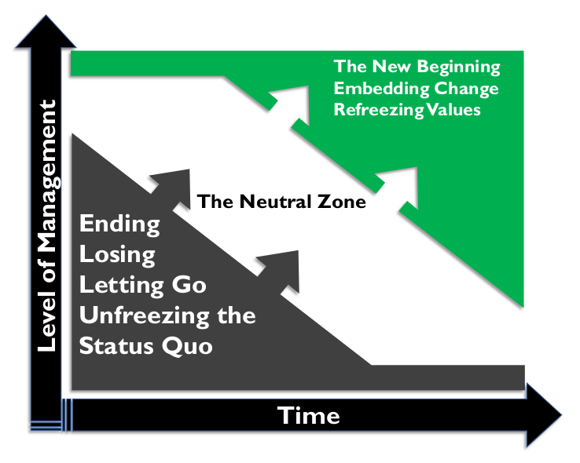

# Gestão de Dados e Gestão de Mudanças Organizacionais

## 1. Introdução

Para a maioria das organizações, aprimorar as práticas de gestão de dados exige mudar a forma como as pessoas trabalham juntas e como entendem o papel dos dados em suas organizações, bem como a maneira como utilizam os dados e implementam a tecnologia para dar suporte aos processos organizacionais. Práticas bem-sucedidas de gestão de dados exigem, entre outros fatores:

* Aprender a gerenciar horizontalmente, alinhando responsabilidades ao longo da cadeia de valor da informação
* Mudar o foco da responsabilidade vertical (silo) para a administração compartilhada da informação
* Transformar a qualidade da informação de uma preocupação de nicho de negócios ou tarefa do departamento de TI para um valor central da organização
* Mudar o pensamento sobre a qualidade da informação de "limpeza de dados e scorecards" para uma capacidade organizacional mais fundamental
* Implementar processos para mensurar o custo da má gestão de dados e o valor da gestão disciplinada de dados

Esse nível de mudança não é alcançado por meio da tecnologia, embora o uso adequado de ferramentas de software possa auxiliar na entrega. Em vez disso, é alcançado por meio de uma abordagem cuidadosa e estruturada para a gestão da mudança na organização. A mudança será necessária em todos os níveis. É fundamental gerenciar e coordenar mudanças para evitar iniciativas sem saída, perda de confiança e danos à credibilidade da função de gestão da informação e de sua liderança.

Profissionais de gestão de dados que compreendem a gestão formal de mudanças terão mais sucesso em promover mudanças que ajudarão suas organizações a obter mais valor de seus dados. Para isso, é importante entender:

* Por que a mudança falha
* Os gatilhos para uma mudança eficaz
* As barreiras à mudança
* Como as pessoas vivenciam a mudança

## 2. Leis da Mudança

Especialistas em gestão de mudanças organizacionais reconhecem um conjunto de "Leis da Mudança" fundamentais que descrevem por que a mudança não é fácil. Reconhecê-las desde o início do processo de mudança garante o sucesso.

* **As organizações não mudam, as pessoas mudam:** A mudança não acontece porque uma nova organização é anunciada ou um novo sistema é implementado. Ela ocorre quando as pessoas se comportam de maneira diferente porque reconhecem o valor de fazê-lo. O processo de aprimoramento das práticas de gestão de dados e a implementação da governança formal de dados terão efeitos de longo alcance em uma organização. As pessoas serão solicitadas a mudar a forma como trabalham com dados e como interagem entre si em atividades que envolvem dados.
* **As pessoas não resistem à mudança. Elas resistem a ser mudadas:** Indivíduos não adotarão mudanças se as considerarem arbitrárias ou ditatoriais. É mais provável que mudem se tiverem se envolvido na definição da mudança e se compreenderem a visão que a impulsiona, bem como quando e como a mudança ocorrerá. Parte da gestão de mudanças para iniciativas de dados envolve trabalhar com equipes para construir a compreensão organizacional do valor de práticas aprimoradas de gestão de dados.
* **As coisas são como são porque chegaram a ser assim:** Pode haver boas razões históricas para as coisas serem como são. Em algum momento no passado, alguém definiu os requisitos de negócios, definiu o processo, projetou os sistemas, escreveu a política ou definiu o modelo de negócios que agora requer mudança. Compreender as origens das práticas atuais de gestão de dados ajudará a organização a evitar erros do passado. Se os membros da equipe tiverem voz ativa na mudança, é mais provável que entendam as novas iniciativas como melhorias. * **A menos que haja um impulso para mudar, as coisas provavelmente permanecerão as mesmas:** Se você quer uma melhoria, algo precisa ser feito de forma diferente. Como disse Einstein: "Você não pode resolver um problema com o nível de pensamento que o criou em primeiro lugar."
* **A mudança seria fácil se não fosse por todas as pessoas:** A "tecnologia" da mudança costuma ser fácil. O desafio está em lidar com a variação natural que surge nas pessoas.

A mudança requer Agentes de Mudança, pessoas que prestem atenção às pessoas e não apenas aos sistemas. Os Agentes de Mudança ouvem ativamente funcionários, clientes e outras partes interessadas para identificar problemas antes que eles surjam e executar a mudança com mais fluidez.

Em última análise, a mudança requer uma VISÃO clara dos Objetivos da Mudança, comunicada de forma vívida e regular às partes interessadas para obter engajamento, adesão, apoio e (importante) apoio contínuo quando os desafios surgirem.

## 3. Não Gerenciando uma Mudança: Gerenciando uma Transição

O especialista em gestão de mudanças William Bridges enfatiza a centralidade da transição no processo de gestão de mudanças. Ele define transição como o processo psicológico pelo qual as pessoas passam para se adaptarem à nova situação. Embora muitas pessoas pensem na mudança apenas em termos de um novo começo, Bridges afirma que a mudança envolve passar por três fases distintas, começando com o fim do estado atual. Términos são difíceis porque as pessoas precisam se desapegar das condições existentes. As pessoas então entram na Zona Neutra, na qual o estado atual ainda não terminou e o novo estado ainda não começou. A mudança é completa quando o novo estado é estabelecido (ver Tabela 34). Dessas três, a Zona Neutra é a menos previsível e a mais confusa, pois é uma mistura do antigo e do novo. Se as pessoas na organização não fizerem a transição pela Zona Neutra, a organização corre o risco de recair em velhos hábitos e não conseguir sustentar a mudança.

Bridges sustenta que o principal motivo do fracasso das mudanças organizacionais é que as pessoas que as impulsionam raramente pensam nos finais e, portanto, não gerenciam o impacto dos finais nas pessoas. Ele afirma: “A maioria das organizações tenta começar com um começo, em vez de terminar com ele. Elas não prestam atenção aos finais. Não reconhecem a existência da zona neutra e, então, se perguntam por que as pessoas têm tanta dificuldade com a mudança” (Bridges, 2009).

Ao vivenciar uma mudança, todos os indivíduos passam pelas três fases, mas em velocidades diferentes. A progressão depende de fatores como experiência passada, estilo pessoal preferido, grau de envolvimento no reconhecimento do problema e no desenvolvimento de possíveis soluções e até que ponto se sentem impelidos a uma mudança, em vez de se moverem em direção a ela voluntariamente.

*Tabela 34 Fases de Transição de Bridges*

<table>
  <thead>
    <tr>
      <th>Fase de Transição</th>
      <th>Descrição</th>
    </tr>
  </thead>
  <tbody>
    <tr>
      <td>
        O Fim
      </td>
      <td>
      <ul>
        <li>
          Quando reconhecemos que há coisas das quais precisamos nos desapegar.
        </li>
        <li>
          Quando reconhecemos que perdemos algo.
        </li>
        <li>
          Exemplo: Mudança de emprego – mesmo quando um indivíduo opta por mudar de emprego, ainda há perdas, como a perda de amigos próximos do trabalho.
        </li>
      </ul>
      </td>
    </tr>
    <tr>
      <td>
        A Zona Neutra
      </td>
      <td>
      <ul>
        <li>
          Quando o antigo jeito acabou, mas o novo ainda não chegou.
        </li>
        <li>
          Quando tudo está em fluxo e parece que ninguém sabe o que deveria estar fazendo.
        </li>
        <li>
          Quando as coisas estão confusas e desordenadas.
        </li>
        <li>
          Exemplo: Mudança para uma nova casa. Nos primeiros dias ou até meses após a mudança, a nova casa ainda não é o seu lar e as coisas provavelmente estão em turbulência.
        </li>
      </ul>
      </td>
    </tr>
    <tr>
      <td>
        O Novo Começo
      </td>
      <td>
      <ul>
        <li>
          Quando o novo jeito parece confortável, certo e o único jeito.
        </li>
        <li>
          Exemplo: Ter um bebê. Depois de alguns meses na zona neutra da turbulência, você chega a um estágio em que não consegue imaginar a vida sem seu novo bebê.
        </li>
      </ul>
      </td>
    </tr>
  </tbody>
</table>

Bridges enfatiza que, embora a primeira tarefa do Gerente de Mudanças seja entender o Destino (ou VISÃO) e como chegar lá, o objetivo final da gestão de transição é convencer as pessoas de que elas precisam iniciar a jornada. Ao gerenciar mudanças e transições, o papel do Agente de Mudanças, e de qualquer gerente ou líder no processo, é ajudar as pessoas a reconhecer que o processo e as etapas de uma transição são perfeitamente naturais.

Figura 113 Fases de Transição de Bridges

A lista de verificação a seguir para gerenciar a transição resume os pontos-chave que os gerentes devem estar cientes ao ajudar as pessoas na transição.

* O Fim
  * Ajude todos a entender os problemas atuais e por que a mudança é necessária.
  * Identifique quem provavelmente perderá o quê. Lembre-se de que a perda de amigos e colegas de trabalho próximos é tão importante para alguns quanto a perda de status e poder para outros.
  * Perdas são subjetivas. As coisas pelas quais uma pessoa lamenta podem não significar nada para outra. Aceite a importância das perdas subjetivas. Não discuta com os outros sobre como eles percebem a perda e não se surpreenda com as reações dos outros à perda.
  * Espere e aceite os sinais de luto e reconheça as perdas de forma aberta e compreensiva.
  * Defina o que acabou e o que não acabou. As pessoas precisam romper em algum momento, e tentar se apegar aos velhos hábitos prolonga as dificuldades.
  * Trate o passado com respeito. As pessoas provavelmente trabalharam muito duro em condições que podem ter sido muito difíceis. Reconheça isso e mostre que o trabalho é valorizado.
  * Mostre como encerrar algo garante que as coisas que importam para as pessoas continuem e sejam aprimoradas.
  * Forneça informações às pessoas. Em seguida, repita o processo de diversas maneiras – com informações escritas para leitura, além da oportunidade de conversar e fazer perguntas.
  * Use a análise das partes interessadas para mapear a melhor forma de abordar diferentes indivíduos – entenda como suas perspectivas podem precisar ser consideradas para iniciar a mudança e quais prováveis ​​pontos de resistência podem existir.
* A Zona Neutra
  * Reconheça que esta é uma fase difícil (mistura do antigo e do novo), mas que todos devem passar por ela.
  * Envolva as pessoas e trabalhe em conjunto; dê-lhes tempo e espaço para experimentar e testar novas ideias.
  * Ajude as pessoas a sentirem que ainda são valorizadas.
  * Elogie as pessoas com boas ideias, mesmo que nem todas funcionem como esperado. O modelo Planejar, Fazer, Estudar, Agir (PDSA) incentiva a experimentação e o aprendizado de cada ciclo.
  * Forneça informações às pessoas; faça isso repetidamente, de várias maneiras.
  * Forneça feedback sobre os resultados das ideias que estão sendo testadas e as decisões tomadas.
* O Novo Começo
  * Não force um começo antes do tempo.
  * Certifique-se de que as pessoas saibam qual o seu papel no novo sistema.
  * Certifique-se de que as políticas, os procedimentos e as prioridades estejam claros; não envie mensagens confusas.
  * Planeje celebrar o novo começo e dê o crédito àqueles que fizeram a mudança.
  * Forneça informações às pessoas; faça isso repetidamente, de várias maneiras.

## 4. Os Oito Erros de Gestão da Mudança de Kotter

Em Liderando a Mudança, John P. Kotter, um dos pesquisadores mais respeitados na área de Gestão da Mudança, descreve oito razões pelas quais as organizações falham em implementar mudanças. Elas oferecem uma perspectiva sobre problemas que comumente surgem no contexto da gestão de informações e dados.

### 4.1 Erro nº 1: Permitir Muita Complacência

De acordo com Kotter, o maior erro que as pessoas cometem ao tentar mudar organizações é se precipitar sem antes estabelecer um senso de urgência suficientemente forte entre seus pares e superiores. (Isso está relacionado à necessidade de aumentar a insatisfação com o status quo identificada na fórmula de Gleicher; veja a Seção 6.) A análise de Kotter fornece dicas valiosas para Gerentes de Mudança que buscam evitar os erros dos outros. Agentes de Mudança frequentemente:

* Superestimam sua capacidade de forçar grandes mudanças na organização
* Subestimam a dificuldade de tirar as pessoas de suas zonas de conforto
* Não enxergam como suas ações e abordagens podem reforçar o status quo, aumentando a atitude defensiva
* Apressam-se onde os anjos temem pisar – iniciando atividades de mudança sem comunicação suficiente
* Confundem urgência com ansiedade, o que, por sua vez, leva ao medo e à resistência, à medida que as partes interessadas se retraem (muitas vezes, literalmente, sobre qual mudança é necessária ou por que a mudança é necessária (a Visão)) em seus silos

Embora seja tentador pensar que, diante de uma crise organizacional, a complacência não seria um problema, muitas vezes ocorre o oposto. As partes interessadas frequentemente se apegam ao status quo diante de muitas demandas (muitas vezes conflitantes) por mudança (que muitas vezes são processadas como "se tudo é importante, então nada é importante").

#### 4.1.1 Exemplos no Contexto de Gestão da Informação

A Tabela 35 descreve exemplos de como a complacência pode se manifestar em um contexto de gestão da informação:

<table>
  <thead>
    <tr>
      <th>
        Exemplo de cenário
      </th>
      <th>
        Como isso pode se manifestar
      </th>
    </tr>
  </thead>
  <tbody>
    <tr>
      <td>
        Resposta a uma Mudança Regulatória
      </td>
      <td>
        “Estamos bem. Não fomos multados pelas regras atuais.”
      </td>
    </tr>
    <tr>
      <td>
        Resposta a uma Mudança Comercial
      </td>
      <td>
        “Temos apoiado o negócio com sucesso há anos. Ficaremos bem.”
      </td>
    </tr>
    <tr>
      <td>
        Resposta a uma Mudança Tecnológica
      </td>
      <td>
        “Essa nova tecnologia não é comprovada. Nossos sistemas atuais são estáveis ​​e sabemos como contornar os problemas.”
      </td>
    </tr>
    <tr>
      <td>
        Resposta a Problemas ou Erros
      </td>
      <td>
        “Podemos designar uma equipe de solução de problemas para isso e resolver os problemas. Certamente haverá algumas pessoas disponíveis em [Insira o nome do Departamento ou Equipe aqui].”
      </td>
    </tr>
  </tbody>
</table>

### 4.2 Erro nº 2: Não Criar uma Coalizão Orientadora Suficientemente Poderosa

Kotter identifica que grandes mudanças são quase impossíveis sem o apoio ativo do líder da organização e sem uma coalizão de outros líderes se unindo para orientá-las. O engajamento da liderança é especialmente importante nos esforços de governança de dados, pois estes exigem mudanças comportamentais significativas. Sem o comprometimento da alta liderança, o interesse próprio de curto prazo superará o argumento a favor dos benefícios de longo prazo de uma melhor governança.

Uma Coalizão Orientadora é uma equipe poderosa e entusiasmada de voluntários de toda a organização que ajuda a colocar novas estratégias em prática e a transformar a organização. Um desafio fundamental no desenvolvimento de uma Coalizão Orientadora é identificar quem precisa estar envolvido. (Consulte a Seção 5.2.)

### 4.3 Erro nº 3: Subestimar o Poder da Visão

Urgência e uma equipe orientadora forte são inúteis sem uma visão clara e sensata da mudança. A visão fornece o contexto do esforço de mudança. Ela ajuda as pessoas a entender o significado de cada componente individual. Uma visão bem definida e comunicada pode ajudar a impulsionar o nível de energia necessário para implementar adequadamente a mudança. Sem uma declaração pública de visão para orientar a tomada de decisões, cada escolha corre o risco de se tornar um debate e qualquer ação pode inviabilizar a iniciativa de mudança ou prejudicá-la.

Visão não é a mesma coisa que planejamento ou gerenciamento de programas. A visão não é o plano do projeto, o termo de abertura do projeto ou uma análise detalhada de todos os componentes da mudança.

Uma Visão é uma Declaração Clara e Convincente de para onde a Mudança está levando. Comunicar a visão significa conectar-se com as pessoas. Para iniciativas de gerenciamento de dados, a visão deve articular os desafios com as práticas de gerenciamento de dados existentes, os benefícios da melhoria e o caminho para alcançar um futuro melhor.

#### 4.3.1 Exemplo em Gestão da Informação

Com muita frequência, na gestão da informação, a visão para um projeto específico é apresentada como a implementação de uma nova tecnologia. A tecnologia, embora importante, não é a mudança nem a visão. O que a organização pode fazer com a tecnologia constitui a visão.

Por exemplo, afirmar: "Implementaremos um novo conjunto integrado de relatórios financeiros e análises baseado em [inserir nome da tecnologia aqui] até o final do primeiro trimestre" é uma meta louvável e mensurável. No entanto, isso pouco contribui para comunicar uma declaração clara e convincente sobre para onde a mudança nos levará.

Por outro lado, afirmar: "Aprimoraremos a precisão e a pontualidade dos relatórios financeiros e os tornaremos mais facilmente disponíveis para todas as partes interessadas. Uma melhor compreensão de como os dados fluem para dentro e para fora de nossos processos de relatórios reforçará a confiança em nossos números, economizará tempo e reduzirá o estresse desnecessário durante os processos de fim de período. Daremos o primeiro passo para alcançar isso implementando o [Sistema X] até o final do primeiro trimestre" esclarece o que será feito e por que está sendo feito. Se você puder apontar os benefícios da mudança para a organização, conquistará apoio para a mudança.

### 4.4 Erro nº 4: Comunicação insuficiente da visão por um fator de 10, 100 ou 1000

Mesmo que todos concordem que a situação atual é insatisfatória, as pessoas ainda não mudarão a menos que percebam os benefícios da mudança como uma melhoria significativa em relação ao status quo.

A comunicação consistente e eficaz da visão, seguida de ações, é fundamental para o sucesso da gestão de mudanças. Kotter aconselha que a comunicação se dá tanto por meio de palavras quanto de ações. A congruência entre as duas é fundamental para o sucesso. Nada mata um esforço de mudança tão rapidamente quanto uma situação em que as pessoas recebem a mensagem: "Faça o que eu digo, não o que eu faço".

### 4.5 Erro nº 5: Permitir que Obstáculos Bloqueiem a Visão

Novas iniciativas fracassam quando as pessoas se sentem impotentes diante de enormes obstáculos em seu caminho, mesmo quando abraçam plenamente a necessidade e a direção da mudança proposta. Como parte de sua transformação, a organização deve identificar e responder a diferentes tipos de obstáculos:

* **Psicológicos:** Os obstáculos que existem na mente das pessoas devem ser abordados com base em suas causas. Eles decorrem do medo, da falta de conhecimento ou de alguma outra causa?
* **Estruturais:** Os obstáculos devido a estruturas organizacionais, como categorias de cargos restritas ou sistemas de avaliação de desempenho que forçam as pessoas a escolher entre a Visão e seus próprios interesses, devem ser abordados como parte do processo de gestão da mudança. A gestão da mudança deve abordar os incentivos e desincentivos estruturais à mudança.
* **Resistência ativa:** Quais obstáculos existem devido às pessoas que se recusam a se adaptar ao novo conjunto de circunstâncias e que fazem demandas inconsistentes com a Transformação? Se os principais membros da organização fizerem os comentários certos sobre a visão de mudança, mas não conseguirem alterar seus comportamentos ou recompensar os comportamentos necessários, ou continuarem a operar de maneiras incompatíveis, a execução da visão fracassará e poderá fracassar.

Kotter convoca "pessoas inteligentes" nas organizações para enfrentar esses obstáculos. Se não o fizerem, outros se sentirão impotentes e a mudança será prejudicada.

### 4.6 Erro nº 6: Falha em Criar Vitórias de Curto Prazo

Mudanças reais levam tempo. Qualquer pessoa que já tenha iniciado um programa de condicionamento físico ou um plano de perda de peso sabe que o segredo para continuar é ter metas regulares que mantenham o ritmo e a motivação, marcando o progresso. Qualquer coisa que envolva um compromisso de longo prazo e investimento de esforço e recursos requer algum elemento de feedback antecipado e regular de sucesso.

Esforços complexos de mudança exigem metas de curto prazo em apoio a objetivos de longo prazo. Alcançar essas metas permite que a equipe comemore e mantenha o ritmo. O fundamental é criar a vitória de curto prazo, em vez de apenas torcer por ela. Em transformações bem-sucedidas, os gestores estabelecem ativamente metas iniciais, alcançam-nas e recompensam a equipe. Sem esforços sistemáticos para garantir o sucesso, a mudança provavelmente fracassará.

#### 4.6.1 Exemplos no Contexto de Gestão da Informação

Em um contexto de gestão da informação, as vitórias e os objetivos de curto prazo frequentemente surgem da resolução de um problema identificado. Por exemplo, se o desenvolvimento de um Glossário de Negócios for uma entrega fundamental de uma iniciativa de governança de dados, uma vitória de curto prazo pode advir da resolução de um problema relacionado à compreensão inconsistente dos dados (por exemplo, duas áreas de negócios relatam resultados de KPI diferentes porque utilizaram regras diferentes em seus cálculos).

Identificar o problema, resolvê-lo e vincular a solução à visão geral de longo prazo para a mudança permite que a equipe celebre essa meta e demonstre a visão em ação. Também fornece material valioso para a comunicação sobre a visão e ajuda a reforçar a mensagem de mudança.

### 4.7 Erro nº 7: Declarar Vitória Cedo Demais

Com muita frequência, em projetos de Mudança, especialmente aqueles que se estendem por vários anos, existe a tentação de declarar sucesso na primeira grande melhoria de desempenho. Vitórias rápidas e precoces são ferramentas poderosas para manter o ritmo e o moral. No entanto, qualquer sugestão de que o trabalho está concluído geralmente é um erro. Até que as mudanças sejam incorporadas à cultura da organização, novas abordagens são frágeis e velhos hábitos e práticas podem se reafirmar. Kotter sugere que mudar uma empresa inteira pode levar de três a dez anos.

#### 4.7.1 Exemplo no Contexto de Gestão da Informação

O exemplo clássico da síndrome da "Missão Cumprida" é o cenário em que a implementação de uma tecnologia é vista como o caminho para melhorar a gestão da informação ou resolver um problema com a qualidade ou confiabilidade dos dados. Uma vez implantada a tecnologia, pode ser difícil manter o projeto avançando em direção ao objetivo, principalmente se a visão geral tiver sido mal definida. A Tabela 36 apresenta vários exemplos relacionados às consequências de declarar vitória cedo demais.

*Tabela 36 Cenários de Declaração de Vitória Muito Cedo*

<table>
  <thead>
    <tr>
      <th>
        Exemplo de cenário
      </th>
      <th>
        Como isso pode se manifestar
      </th>
    </tr>
  </thead>
  <tbody>
    <tr>
      <td>
        Abordando a Qualidade de Dados
      </td>
      <td>
        “Compramos uma ferramenta de Qualidade de Dados. Isso resolveu o problema.”
        <ul>
          <li>
            Ninguém na organização está revisando ou agindo com base nos relatórios de qualidade de dados
          </li>
        </ul>
      </td>
    </tr>
    <tr>
      <td>
        Confundindo entrega de capacidade com implementação e operação
      </td>
      <td>
        “Implementamos a pilha de relatórios para o Regulamento X. Agora estamos em conformidade com a legislação.”
        <ul>
          <li>
            Mudanças nos requisitos regulatórios
          </li>
          <li>
            Ninguém está revisando ou agindo com base nos problemas identificados nos relatórios
          </li>
        </ul>
      </td>
    </tr>
    <tr>
      <td>
        Migração de dados
      </td>
      <td>
        “Todos os dados do Sistema X agora estão no Sistema Y.”
        <ul>
          <li>
            As contagens de registros correspondem, mas os dados no Sistema Y estão incompletos ou truncados devido a falhas no processo de migração. Intervenções manuais necessárias
          </li>
        </ul>
      </td>
    </tr>
  </tbody>
</table>

### 4.8 Erro nº 8: Negligenciar a Ancoragem Firme das Mudanças na Cultura Corporativa

As organizações não mudam, as pessoas mudam. Até que novos comportamentos sejam incorporados às normas sociais e aos valores compartilhados de uma organização, eles estão sujeitos à decadência e degradação assim que o foco do esforço de mudança é removido. Kotter é claro: ignorar a cultura é um risco para você ao se envolver em qualquer atividade de mudança.

As duas chaves para ancorar a mudança na cultura da organização são:

* Mostrar conscientemente às pessoas como comportamentos e atitudes específicos influenciaram o desempenho.
* Reservar tempo suficiente para incorporar a mudança de abordagem na próxima geração de gestores.

#### 4.8.1 Exemplo no Contexto de Gestão da Informação

Este risco destaca a importância dos fatores humanos na mudança geral que pode ser implementada para gerar melhorias na execução da governança de dados, no gerenciamento e uso de metadados ou nas práticas de qualidade de dados (para citar apenas três).

Por exemplo, uma organização pode ter introduzido um requisito de marcação de metadados em toda a documentação para dar suporte a processos automatizados de classificação e arquivamento em seu sistema de gerenciamento de conteúdo. A equipe começa a cumprir nas primeiras semanas, mas, com o passar do tempo, volta aos velhos hábitos e não marca os documentos corretamente, resultando em um enorme acúmulo de registros não classificados que precisam ser revisados ​​manualmente para adequá-los aos requisitos da solução tecnológica.

Isso destaca o simples fato de que as melhorias na Gestão da Informação são alcançadas por meio de uma combinação de processos, pessoas e tecnologia. Muitas vezes, esse componente intermediário é ignorado, levando a uma entrega abaixo do ideal e ao retrocesso no progresso alcançado. É importante, ao introduzir novas tecnologias ou novos processos, considerar como as pessoas levarão a mudança adiante e sustentarão os ganhos.

## 5. O Processo de Oito Etapas de Kotter para Grandes Mudanças

Além dos Oito Erros da Gestão de Mudanças, Kotter reconhece um conjunto de obstáculos comuns à mudança:

* Culturas voltadas para dentro
* Burocracia paralisante
* Políticas paroquiais
* Baixos níveis de confiança
* Falta de trabalho em equipe
* Arrogância
* Falta ou fracasso da liderança
* Medo do desconhecido

Para combater esses obstáculos, ele propõe um modelo de oito etapas para grandes mudanças. O modelo de Kotter fornece uma estrutura dentro da qual cada uma dessas questões pode ser abordada de forma a apoiar uma mudança sustentável a longo prazo. Cada etapa está associada a um dos erros fundamentais que minam os esforços de transformação.

As quatro primeiras etapas do modelo suavizam posições arraigadas de status quo. Como Kotter afirma, esse esforço só é necessário porque mudar não é fácil.

As três etapas seguintes (5 a 7) introduzem novas práticas e formas de trabalhar. A última etapa consolida as mudanças e fornece a plataforma para ganhos e melhorias futuras.

Kotter recomenda que não haja atalhos para seguir essas etapas. Todos os esforços de mudança bem-sucedidos devem passar por todas as oito etapas. Concentrar-se nas etapas 5, 6 e 7 é tentador. No entanto, isso não fornece uma base sólida para sustentar a mudança (sem visão, sem Coalizão Orientadora, sem insatisfação com o status quo). Da mesma forma, é importante reforçar cada etapa à medida que você avança no processo, usando vitórias rápidas para reforçar a visão e a comunicação e destacar os problemas com o status quo.

Figura 114 Processo de Oito Etapas de Kotter para Grandes Mudanças

### 5.1 Estabelecendo um Senso de Urgência

As pessoas encontrarão mil maneiras de evitar a cooperação em algo que consideram desnecessário. Um senso de urgência claro e convincente é necessário para motivar uma massa crítica suficiente de pessoas a apoiar um esforço de mudança. Conquistar cooperação e colaboração requer um chamado unificador.

O oposto de urgência é complacência. Quando a complacência é alta, é difícil, senão impossível, reunir um grupo suficientemente poderoso para criar a visão de mudança e orientar o esforço de mudança. Em casos raros, indivíduos podem fazer algum progresso diante da complacência, mas isso é quase inevitavelmente insustentável. No contexto da gestão da informação, vários fatores podem criar um senso de urgência:

* Mudanças regulatórias
* Ameaças à segurança da informação
* Riscos à continuidade dos negócios
* Mudanças na estratégia de negócios
* Fusões e aquisições
* Ameaças de auditoria regulatória ou litígios
* Mudanças tecnológicas
* Mudanças na capacidade dos concorrentes no mercado
* Comentários da mídia sobre os problemas de gestão da informação de uma organização ou setor

#### 5.1.1 Fontes de Complacência

Kotter identifica nove razões pelas quais organizações e pessoas podem ser complacentes. (Ver Figura 115)

* Na ausência de uma crise visível, é difícil despertar um senso de urgência.
* Os aparatos do sucesso podem abafar a urgência de algumas situações.
* Avaliar a equipe em relação a padrões de baixo desempenho ou padrões que não se comparam a benchmarks externos ou tendências internas de longo prazo.
* Metas funcionais excessivamente limitadas, com métricas de desempenho diferentes para diferentes unidades funcionais, podem levar a uma situação em que ninguém é responsável quando o desempenho geral da organização é ruim ou está em declínio.
* Se os sistemas internos de planejamento e controle são (ou podem ser) manipulados ou manipulados para facilitar o alcance de seus objetivos por todos, é fácil ser complacente.
* Se a única fonte de feedback de desempenho vem de sistemas internos defeituosos, não há verificação de sanidade.
* Quando problemas são identificados ou feedback externo de desempenho é coletado, frequentemente se questiona a correção da complacência. como sendo prejudicial ao moral, prejudicial aos outros ou suscetível de causar uma discussão. Em vez de considerar a informação como um insumo para uma avaliação do desempenho da organização, a cultura é "matar o mensageiro".
* Por razões psicológicas muito simples, as pessoas não aceitam coisas que não querem ouvir. Quando surgem evidências de um grande problema, as pessoas frequentemente ignoram a informação ou a reinterpretam de uma forma menos dolorosa.
* Mesmo em organizações onde os oito primeiros desafios não são significativos, existe o risco de que "conversas animadas" da alta administração ou de figuras importantes da organização possam criar uma sensação injustificada de segurança e sucesso. Muitas vezes, essas "conversas animadas" são resultado de um histórico de sucessos passados. O sucesso passado pode dar aos indivíduos um ego e criar uma cultura arrogante. Ambos os fatores podem manter o senso de urgência baixo e dificultar a mudança.

Uma boa regra prática em qualquer iniciativa de mudança é nunca subestimar o poder das forças que podem reforçar a complacência e promover o status quo. O desafio da complacência deve ser enfrentado. Uma organização não pode tomar decisões importantes sem abordar os problemas reais.

#### 5.1.2 Elevando o Nível de Urgência

Elevar o nível de urgência requer a remoção das fontes de complacência ou a redução de seu impacto. Criar um forte senso de urgência exige que os líderes tomem medidas ousadas ou até mesmo arriscadas. Vale lembrar como Deming advertiu a gestão a instituir liderança como parte de seus 14 Pontos de Transformação. [^104]

Figura 115 Fontes de Complacência

Ousado significa fazer algo que pode causar dor a curto prazo, não apenas algo que pareça bom em um e-mail de marketing. Em outras palavras, requer a adoção da nova filosofia (para usar novamente Deming). Medidas ousadas o suficiente para reduzir a complacência tendem a causar conflito e ansiedade a curto prazo. No entanto, se o conflito e a ansiedade puderem ser canalizados para a visão de mudança, um líder pode capitalizar o desconforto a curto prazo para construir as metas de longo prazo.

Movimentos ousados ​​são difíceis na ausência de uma liderança apoiada e que ofereça suporte. Gerentes seniores cautelosos, incapazes de aumentar o senso de urgência, reduzirão a capacidade de mudança de uma organização.

#### 5.1.3 Usando a Crise com Cuidado

Uma maneira de elevar os níveis de urgência é agarrar-se a uma crise visível. Às vezes, diz-se que uma grande mudança não é possível até que a própria sobrevivência econômica da organização esteja em risco. No entanto, a mudança não necessariamente ocorre mesmo assim. Uma crise econômica ou financeira em uma organização pode frequentemente resultar na dificuldade de obter recursos escassos, porém necessários, para apoiar a visão de mudança.

É possível criar uma crise percebida bombardeando a organização com informações sobre problemas, problemas potenciais, oportunidades potenciais ou estabelecendo metas ambiciosas que rompam o status quo. Kotter sugere que muitas vezes é mais fácil criar um problema para o qual (coincidentemente) você já tenha um plano para lidar.

#### 5.1.4 O Papel dos Gerentes de Nível Médio e Inferior

Dependendo da escala do alvo da mudança (por exemplo, um departamento ou unidade de negócios versus uma organização inteira), os principais participantes serão os gerentes responsáveis ​​por essa unidade. Eles precisarão ser capazes de reduzir a complacência nas equipes sob seu controle direto. Se tiverem autonomia suficiente, poderão fazer isso independentemente do ritmo da mudança no restante da organização.

Se não houver autonomia suficiente, um esforço de mudança em uma unidade pequena pode estar fadado ao fracasso desde o início, à medida que as forças externas da inércia se impõem. Frequentemente, os executivos seniores precisam reduzir essas forças. No entanto, gerentes de nível médio ou inferior podem impulsionar esse tipo de mudança se agirem de forma estratégica. Por exemplo, se usarem a análise para mostrar claramente o impacto de não realizar a mudança necessária em um projeto estratégico importante. Isso é particularmente eficaz quando o debate pode ser atenuado, direcionando-o para um grupo externo, como uma consultoria externa, que pode ter ajudado na análise.

#### 5.1.5 Quanta Urgência é Suficiente?

Um senso de urgência em relação a um problema leva as pessoas a concluir que o status quo é inaceitável. Para sustentar a transformação a longo prazo, é necessário o apoio de uma massa crítica de gestores. Kotter sugere 75%. No entanto, criar muita urgência pode ser contraproducente. Urgência em excesso pode resultar em visões conflitantes de mudança ou levar a um foco em "apagar incêndios".

Um senso de urgência suficientemente convincente ajudará a iniciar o processo de mudança e a dar-lhe impulso. Urgência suficiente também ajudará a obter o nível certo de liderança na Coalizão Orientadora. Em última análise, o senso de urgência precisa ser forte o suficiente para evitar que a complacência se reafirme após os sucessos iniciais serem alcançados. Uma abordagem fundamental é explorar a "voz do cliente" e conversar com clientes externos, fornecedores, acionistas ou outras partes interessadas sobre suas perspectivas sobre o nível de urgência que está sendo criado.

### 5.2 A Coalizão Orientadora

Ninguém tem todas as respostas ou todos os insights necessários para criar uma visão, nem possui a gama e a variedade de conexões necessárias para apoiar a comunicação eficaz de uma visão. Para uma mudança bem-sucedida, dois cenários específicos devem ser evitados:

* O CEO Solitário / Campeão Solitário
* O Comitê de Baixa Credibilidade

O cenário do CEO Solitário coloca o sucesso ou o fracasso do esforço de mudança nas mãos de uma única pessoa. O ritmo da mudança na maioria das organizações hoje em dia é tal que uma única pessoa não consegue gerenciar tudo. O ritmo da tomada de decisões e da comunicação diminui, a menos que as decisões sejam tomadas sem uma avaliação completa das questões. Qualquer uma das opções é uma receita para o fracasso.

O Comitê de Baixa Credibilidade surge quando um campeão competente recebe uma "força-tarefa" com representantes de diversos departamentos funcionais (e talvez alguns consultores externos). O que falta à força-tarefa é representação suficiente (se houver) de pessoas de nível sênior na hierarquia executiva. Se for visto como "importante, mas não tão importante" (novamente, devido à falta de comprometimento da alta gerência), as pessoas não se sentem motivadas a obter uma compreensão real da situação. Inevitavelmente, a força-tarefa fracassa.

É essencial criar uma Coalizão Orientadora adequada que tenha o comprometimento da gestão necessário para apoiar a urgência da necessidade de mudança. Além disso, a equipe precisa apoiar a tomada de decisões eficaz – o que exige altos níveis de confiança dentro da equipe. Uma Coalizão Orientadora que trabalha em equipe pode processar mais informações com mais rapidez. Também acelera a implementação de ideias, pois os tomadores de decisão com poder estão verdadeiramente informados e comprometidos com as decisões-chave.

Uma Coalizão Orientadora eficaz possui quatro características principais:

* **Poder da Posição:** Há um número suficiente de participantes-chave a bordo, especialmente os principais gerentes de linha, para que aqueles que ficam de fora não possam bloquear facilmente o progresso?
* **Expertise:** Os pontos de vista relevantes estão adequadamente representados para que decisões informadas e inteligentes sejam tomadas?

* **Credibilidade:** Há pessoas suficientes com boa reputação na organização na equipe para que ela seja levada a sério?
* **Liderança:** A equipe conta com líderes experientes suficientes para conduzir o processo de mudança?

A liderança é uma preocupação fundamental. Deve haver um bom equilíbrio entre as habilidades de gestão e liderança na Coalizão Orientadora. A gestão mantém todo o processo sob controle. A liderança impulsiona a mudança. Uma sem a outra não alcançará um resultado sustentável.

As principais questões que surgem no contexto da construção da sua Coalizão Orientadora incluem:

*De quantas pessoas preciso para me ajudar a definir e orientar essa mudança?*

A resposta para isso é um "Depende" doloroso, como o de um consultor, mas o tamanho da coalizão está relacionado ao tamanho do grupo geral que está sendo influenciado. É preciso encontrar um equilíbrio entre ter um grupo muito grande e ter um grupo que deixa os principais stakeholders se sentindo "de fora da tenda".

*Quem deve ser envolvido ou convidado a integrar a Coalizão Orientadora?*

A Coalizão Orientadora difere de um comitê diretor formal de projeto ou programa, pois precisa fornecer uma plataforma para influenciar toda a organização. Como tal, a coalizão precisa incluir representantes de diferentes comunidades de stakeholders. No entanto, também não é um fórum geral para coleta de requisitos de stakeholders. Busque perspectivas de pessoas que possam ser impactadas na cadeia de valor da informação da organização. Um atributo fundamental dos membros da Coalizão Orientadora é sua capacidade de influenciar seus pares, seja por meio de autoridade formal na hierarquia ou por meio de seu status e experiência na organização.

O comportamento é fundamental na Coalizão Orientadora.

Na formulação da Coalizão Orientadora, os líderes de mudança precisam evitar comportamentos que enfraqueçam a eficácia, a função e o alcance da equipe. Por exemplo, evite:

* **Negativos:** Negativos podem dificultar o diálogo positivo e aberto necessário para que a Coalizão Orientadora desenvolva ideias criativas, refine, implemente e desenvolva a visão de mudança e identifique oportunidades de crescimento.
* **Distração:** Os membros da equipe da Coalizão Orientadora precisam estar focados na atividade de mudança. Indivíduos desfocados podem desviar a equipe do caminho, levando a atrasos ou à incapacidade de capitalizar as vitórias iniciais.
* **Egoísmo:** Os esforços da Coalizão Orientadora movem a organização como um todo e afetam a todos. Agendas ocultas não devem atrapalhar os esforços da equipe.

#### 5.2.1 A Importância de uma Liderança Eficaz na Coalizão

Há uma diferença entre gestão e liderança. Uma Coalizão Orientadora com bons gestores, mas sem líderes, não terá sucesso. A falta de liderança pode ser solucionada contratando pessoas de fora, promovendo líderes internos e incentivando a equipe a assumir o desafio de liderar.

Ao montar sua coalizão, você precisa ter cuidado com o que Kotter chama de "Egos", "Serpentes" e "Jogadores Relutantes". "Egos" são indivíduos que preenchem o ambiente e não permitem que outros contribuam. "Serpentes" são pessoas que criam e disseminam desconfiança e desconfiança. "Jogadores Relutantes" são (geralmente) figuras seniores que veem uma necessidade moderada de mudança, mas não compreendem totalmente a urgência.

Qualquer um desses tipos de personalidade pode prejudicar ou minar o esforço de mudança. Devem ser feitos esforços para mantê-los fora da equipe ou gerenciá-los de perto para mantê-los focados na mensagem.

#### 5.2.2 Exemplo no Contexto de Gestão da Informação

No contexto de uma iniciativa de mudança na gestão da informação, a Coalizão Orientadora pode ajudar a organização a identificar oportunidades para conectar iniciativas em diferentes áreas que estejam envolvidas em diferentes aspectos da mesma mudança geral.

Por exemplo, em resposta a uma exigência regulatória, o conselho interno de uma empresa pode ter começado a desenvolver um mapa dos fluxos e processos de dados na organização. Ao mesmo tempo, uma iniciativa de data warehouse pode ter começado a mapear a linhagem dos dados para verificar a precisão e a qualidade dos relatórios.

Um líder de mudança na governança de dados pode reunir o chefe do departamento jurídico e o chefe de relatórios em sua Coalizão Orientadora para aprimorar a documentação e o controle dos processos de informação no contexto da governança de dados. Isso, por sua vez, pode exigir a contribuição das equipes de linha de frente que utilizam e criam dados para compreender os impactos de quaisquer mudanças propostas.

Em última análise, uma boa compreensão da cadeia de valor da informação ajudará a identificar potenciais candidatos a serem incluídos na Coalizão Orientadora.

#### 5.2.3 Construindo uma Equipe Eficaz

Uma equipe eficaz se baseia em dois pilares simples: confiança e um objetivo comum. A ausência de confiança é frequentemente causada pela falta de comunicação e outros fatores, como rivalidade equivocada. A clássica divisão "Negócios vs. TI" é um bom exemplo de onde a confiança se rompe. Para construir confiança, participe de atividades de formação de equipe que criem e promovam compreensão, respeito e cuidado mútuos. Para alcançar esse entendimento mútuo, porém, deve-se tomar cuidado para evitar o "Pensamento de Grupo".

#### 5.2.4 Combatendo o Pensamento de Grupo

O "Pensamento de Grupo" é um efeito psicológico que surge em grupos altamente coerentes e coesos, particularmente aqueles isolados de fontes de informação que possam contradizer suas opiniões, ou aqueles dominados por um líder que incentiva as pessoas a concordarem com sua posição em vez de abrir o debate.

No Pensamento de Grupo, todos concordam com uma proposta, mesmo quando têm reservas a respeito dela. O Pensamento de Grupo provavelmente está em operação se:

* Ninguém levanta objeções
* Nenhuma alternativa é oferecida
* Perspectivas diferentes são rapidamente descartadas e desaparecem para sempre
* Informações que possam desafiar o pensamento não são ativamente buscadas

Para prevenir o Pensamento de Grupo, é importante:

* Incentivar todos os participantes a seguir o método científico de coleta de dados para ajudar a compreender a natureza e as causas de um problema
* Desenvolver uma lista de critérios para avaliar todas as decisões
* Aprender a trabalhar em conjunto de forma eficiente para que o Pensamento de Grupo não seja o atalho para fazer as coisas mais rápido
* Incentivar o brainstorming
* Os líderes devem falar por último
* Buscar ativamente conhecimento externo e contribuições para as reuniões
* Uma vez identificada uma solução, peça à equipe que desenvolva não apenas um plano, mas também um "Plano B" (que os force a repensar as premissas do plano original)

#### 5.2.5 Exemplos no Contexto de Gestão da Informação

O Pensamento de Grupo pode surgir em diversos contextos. Uma área potencial é a tradicional "divisão entre Negócios e TI", na qual diferentes partes da organização resistem às mudanças propostas umas pelas outras. Outro cenário potencial é quando o objetivo da organização é se tornar orientada por dados, com foco em análise e coleta de dados, o que pode resultar em questões de privacidade, segurança ou éticas relacionadas ao manuseio de informações sendo desconsideradas ou despriorizadas no plano de trabalho geral.

Existem muitos motivos para aplicar a disciplina de governança de dados nas organizações. Uma função fundamental é garantir clareza sobre os modelos e métodos a serem aplicados. Essa clareza permitirá que questões como a divisão entre Negócios e TI ou o equilíbrio entre prioridades conflitantes sejam abordadas de forma adequada e consistente.

#### 5.2.6 Objetivos Comuns

Se cada membro da Coalizão Orientadora estiver puxando em uma direção diferente, a confiança se romperá. Objetivos típicos que unem as pessoas são o compromisso com a excelência ou o desejo de ver a organização desempenhar o mais alto nível possível em uma determinada área. Esses objetivos não devem ser confundidos com a visão de mudança, mas devem ser complementares a ela.

### 5.3 Desenvolvendo uma Visão e Estratégia

Um erro comum em esforços de gestão de mudanças é confiar em decretos autoritários ou em microgestão para fazer a mudança acontecer. Nenhuma das abordagens é eficaz se a situação de mudança for complexa.

Se o objetivo for a mudança de comportamento, a menos que o chefe seja muito poderoso, as abordagens de decreto autoritário funcionam mal, mesmo em situações simples. Sem o "poder dos reis" por trás dele, é improvável que um decreto autoritário rompa todas as forças de resistência. Os Agentes de Mudança tendem a ser ignorados, minados ou contornados. Quase inevitavelmente, algum opositor da mudança descobrirá o blefe do Agente de Mudança para testar a autoridade e a influência por trás do processo de mudança.

A microgestão tenta contornar essa fragilidade definindo em detalhes específicos o que os funcionários devem fazer e, em seguida, monitorando o cumprimento. Isso pode superar algumas das barreiras à mudança, mas, com o tempo, levará cada vez mais tempo, pois a gerência terá que dedicar mais tempo ao detalhamento das práticas e métodos de trabalho para os novos comportamentos alterados, à medida que o nível de complexidade associado à mudança aumenta.

A única abordagem que permite consistentemente aos Agentes de Mudança romperem o status quo é basear a mudança em uma visão clara e convincente que forneça impulso.

Figura 116 A Visão Rompe o Status Quo

#### 5.3.1 Por que a Visão é Essencial

Uma visão é uma imagem do futuro com algum comentário implícito ou explícito sobre por que as pessoas devem se esforçar para criar esse futuro. Uma boa visão compartilha três propósitos importantes: Esclarecimento, motivação e alinhamento.

* **Esclarecimento:** Uma boa visão esclarece a direção da mudança e simplifica uma série de decisões mais detalhadas, definindo parâmetros-chave. Uma visão eficaz (e estratégias de apoio) ajuda a resolver problemas que surgem de divergências sobre a direção ou confusão sobre a motivação ou os impulsionadores da mudança. Debates intermináveis ​​podem ser evitados com uma simples pergunta: A ação planejada está alinhada com a visão? Da mesma forma, a visão pode ajudar a limpar o caminho, permitindo que a equipe concentre os esforços em projetos prioritários que estão contribuindo para o esforço de transformação.
* **Motivação:** Uma visão clara motiva as pessoas a darem passos na direção certa, mesmo que os passos iniciais sejam pessoalmente dolorosos. Isso é particularmente verdadeiro em organizações onde as pessoas são forçadas a sair de suas zonas de conforto regularmente. Quando o futuro é deprimente e desmoralizante, a visão correta pode dar às pessoas uma causa atraente pela qual lutar.
* **Alinhamento:** Uma visão convincente ajuda a alinhar os indivíduos e coordenar as ações de pessoas motivadas de forma eficiente. A alternativa é ter uma enxurrada de diretivas detalhadas ou reuniões intermináveis. A experiência mostra que, sem um senso compartilhado de direção, pessoas interdependentes podem acabar em ciclos de conflito constante e reuniões ininterruptas.

#### 5.3.2 A Natureza de uma Visão Eficaz

Uma visão pode ser mundana e simples. Não precisa ser grandiosa ou abrangente. É um elemento do sistema de ferramentas e processos para mudança; este sistema também inclui estratégias, planos, orçamentos e muito mais. No entanto, uma visão é um fator muito importante porque exige que as equipes se concentrem em melhorias tangíveis.

Uma visão eficaz possui várias características principais:

* Imaginável: Transmite uma imagem de como será o futuro.
* Desejável: Atende aos interesses de longo prazo de funcionários, clientes, acionistas e outras partes interessadas.
* Viável: Inclui metas realistas e atingíveis.
* Focada: É clara o suficiente para orientar a tomada de decisões.
* Flexível: É genérica o suficiente para permitir que os indivíduos tomem a iniciativa e criem planos e respostas alternativos quando as condições ou restrições mudarem.
* Comunicável: É fácil de compartilhar e comunicar em cinco minutos ou menos.

O principal teste para a eficácia de uma visão é a facilidade de imaginá-la e a sua atratividade. Uma boa visão pode exigir sacrifícios, mas deve manter os interesses de longo prazo das pessoas envolvidas no escopo. Visões que não se concentram nos benefícios para as pessoas a longo prazo acabam sendo questionadas. Da mesma forma, a visão deve estar enraizada na realidade do mercado do produto ou serviço. Na maioria dos mercados, a realidade é que o cliente final precisa ser considerado constantemente.

As principais perguntas a serem feitas são:

* Se isso se tornasse realidade, como afetaria os clientes (internos e externos)?
* Se isso se tornasse realidade, como afetaria os acionistas? Isso os deixaria mais felizes? Isso geraria valor a longo prazo para eles?
* Se isso se tornasse realidade, como afetaria os funcionários? O local de trabalho seria melhor, mais feliz, menos estressante e mais gratificante? Seremos capazes de nos tornar um lugar melhor para se trabalhar?

Outro teste fundamental é a viabilidade estratégica da visão. Uma visão viável é mais do que um desejo. Ela pode exigir recursos e capacidades, mas as pessoas reconhecem que ela pode ser alcançada. Viável não significa fácil, no entanto. A visão deve ser desafiadora o suficiente para forçar uma reformulação fundamental. Independentemente de quais metas ambiciosas sejam definidas, a organização deve fundamentar essa visão em uma compreensão racional das tendências de mercado e da capacidade da organização.

A visão deve ser focada o suficiente para orientar as pessoas, mas não tão rígida a ponto de algemar a equipe a comportamentos cada vez mais irracionais. Muitas vezes, a melhor abordagem é buscar a simplicidade da visão e, ao mesmo tempo, incorporar ganchos específicos suficientes para que a visão continue sendo um pilar fundamental e um ponto de referência valioso para a tomada de decisões:

*Nossa meta é nos tornarmos líderes mundiais em nosso setor em 5 anos. Nesse contexto, liderança significa gerenciar informações de forma mais eficaz para gerar maiores receitas, mais lucro e um ambiente de trabalho mais gratificante para nossos funcionários. Alcançar essa ambição exigirá uma base sólida de confiança em nossa capacidade de tomar decisões, clareza em nossas comunicações internas e externas, uma melhor compreensão do cenário de informações em que operamos e investimentos racionais em ferramentas e tecnologias apropriadas para apoiar uma cultura e um ethos orientados por dados. Essa cultura será confiável e admirada por acionistas, clientes, funcionários e comunidades.*

#### 5.3.3 Criando uma Visão Eficaz

Kotter recomenda que a criação de uma visão eficaz seja um processo iterativo que deve ter vários elementos claros para ser bem-sucedida.

* **Primeiro rascunho:** Um único indivíduo faz uma declaração inicial refletindo seus sonhos e as necessidades do mercado.
* **Papel da Coalizão Orientadora:** A Coalizão Orientadora reformula o primeiro rascunho para adequá-lo à perspectiva estratégica mais ampla.
* **Importância do trabalho em equipe:** O processo em grupo nunca funciona bem sem trabalho em equipe. Incentive as pessoas a se engajarem e contribuírem.
* **Papel da mente e do coração:** Tanto o pensamento analítico quanto a "sonhando alto" são necessários em toda a atividade.
* **Confusão do processo:** Este não será um procedimento simples; haverá muito debate, retrabalho e mudanças. Se não houver, algo está errado com a visão ou com a equipe.

* **Prazo:** A atividade não se resume a uma reunião única. Pode levar semanas, meses ou até mais. Idealmente, a visão deve estar em constante evolução.
* **Produto final:** Uma direção para o futuro que seja desejável, viável, focada, flexível e que possa ser transmitida em cinco minutos ou menos.

Figura 117 Contraste Gestão/Liderança

### 5.4 Comunicando a Visão da Mudança

Uma visão só tem poder quando os envolvidos na atividade de mudança têm um entendimento comum de seus objetivos e direção, uma perspectiva comum sobre o futuro desejado. Problemas que comumente surgem com a comunicação da visão incluem:

* Falha na comunicação ou comunicação insuficiente.
* Comunicação deficiente: Palavras complexas ou difíceis de manejar que escondem o senso de urgência; como resultado, as pessoas não ouvem com atenção.
* Comunicação insuficiente: Gestores são treinados para se comunicar de cima para baixo. Líderes precisam se comunicar para públicos mais amplos. Essa amplitude de comunicação exige que os líderes tenham uma noção clara do problema e de como ele pode ser resolvido.

Outro desafio é lidar com as questões relacionadas à visão, vindas das partes interessadas, da Coalizão Orientadora e da própria equipe que implementa a mudança. Frequentemente, a Coalizão Orientadora dedica muito tempo a elaborar essas questões e a preparar respostas para elas, apenas para despejá-las na organização de uma só vez (uma página de perguntas frequentes, notas para um briefing). A sobrecarga de informações resultante obscurece a visão, criando pânico e resistência a curto prazo.

Considerando que, em uma organização média, a mensagem de mudança representa pouco mais do que meio por cento do total da comunicação enviada a um funcionário, fica claro que simplesmente despejar informações não será eficaz. A mensagem precisa ser comunicada de forma a aumentar sua eficácia e amplificar a comunicação.

Kotter identifica sete elementos-chave para uma comunicação eficaz da visão:

* Mantenha a simplicidade: Elimine o jargão, o vocabulário interno e as frases complexas.
* Use metáforas, analogias e exemplos: Uma imagem verbal (ou mesmo gráfica) pode valer mais que mil palavras.
* Use múltiplos fóruns: A mensagem precisa ser comunicável em diversos fóruns, desde um discurso de elevador até um memorando de transmissão, de uma pequena reunião a um briefing geral.
* Repita, repita, repita: As ideias precisam ser ouvidas muitas vezes antes de serem internalizadas e compreendidas.
* Lidere pelo exemplo: O comportamento de pessoas importantes precisa ser consistente com a visão. Comportamentos inconsistentes sobrecarregam todas as outras formas de comunicação.
* Explique inconsistências aparentes: pontas soltas e desconexões não resolvidas minam a credibilidade de toda a comunicação.
* Dar e receber: A comunicação bidirecional é sempre mais poderosa do que a comunicação unidirecional.

#### 5.4.1 Exemplos no Contexto de Gestão da Informação

Em um contexto de gestão da informação, a falha em definir ou comunicar uma visão clara e convincente para uma mudança pode frequentemente ser observada em iniciativas em que uma nova tecnologia ou capacidade está sendo implementada, impulsionada por um foco na implantação de tecnologia. Na ausência de uma compreensão ou apreciação dos potenciais benefícios da nova tecnologia ou métodos para o tratamento de informações, pode haver resistência por parte das partes interessadas em adotar novas formas de trabalho.

Por exemplo, se uma organização estiver implementando processos de gerenciamento de documentos e conteúdo baseados em metadados, as partes interessadas da empresa podem não se envolver no esforço inicial de entender ou aplicar a marcação de metadados ou a classificação de registros se não houver uma visão claramente comunicada de como isso será um benefício para a organização e para elas. Sem isso, a iniciativa, que de outra forma seria valiosa, pode ficar atolada em níveis de adoção e conformidade abaixo do necessário.

#### 5.4.2 Mantendo a Simplicidade

É difícil conectar-se emocionalmente com uma linguagem artificial, densa ou difícil de entender. Esses exemplos ilustram os problemas de comunicação que podem surgir quando a visão não é mantida simples. O exemplo abaixo ilustra esse ponto.

Nosso objetivo é reduzir nosso parâmetro médio de "tempo de reparo" para que seja comprovadamente menor do que o de todos os principais concorrentes em nossos mercados geográficos e demográficos-alvo. Da mesma forma, direcionamos os tempos de ciclo de desenvolvimento de novos produtos, os tempos de processamento de pedidos e outros vetores de processos relacionados ao cliente para mudança.

Tradução: "Vamos nos tornar mais rápidos do que qualquer pessoa em nosso setor em atender às necessidades dos clientes." Quando a visão é articulada de forma simples, é mais fácil para equipes, stakeholders e clientes entenderem a mudança proposta, como ela pode afetá-los e seu papel nela. Isso, por sua vez, os ajuda a comunicá-la mais facilmente aos seus pares.

#### 5.4.3 Use Vários Fóruns Diferentes

A comunicação da visão geralmente é mais eficaz quando diferentes canais são utilizados. Há várias razões para isso, desde o fato de alguns canais poderem estar sobrecarregados com informações ou com a "bagagem" de iniciativas de mudança anteriores, até o fato de pessoas diferentes interpretarem e processarem as informações de forma diferente. Se as pessoas recebem a mesma mensagem por diferentes canais, aumenta a probabilidade de que a mensagem seja ouvida, internalizada e implementada. Relacionada a essa abordagem "multicanal/multiformato" está a necessidade de repetir continuamente a visão e comunicar o progresso.

#### 5.4.4 Repetição, Repetição, Repetição

Em muitos aspectos, a visão e as mensagens de mudança são como a água de um rio que encontra uma pedra que precisa ser superada. A água não rompe a barragem imediatamente (a menos que tenha muita força por trás dela, caso em que tende a fazê-lo de forma destrutiva), mas com o tempo, por meio da erosão iterativa, a água desgasta a pedra para que ela possa fluir ao seu redor.

Da mesma forma, as iniciativas de mudança precisam aplicar recontagens iterativas da visão de mudança em diferentes fóruns e formatos para gerar uma mudança que seja "pegajosa". Qual destes cenários seria mais eficaz?

* A alta gerência enviou uma mensagem de vídeo para todos os funcionários e um aviso por correio de voz para informá-los sobre a mudança. Os detalhes sobre a execução serão fornecidos pelos gerentes de linha. A intranet publicará três artigos sobre a Visão nos próximos seis meses, e haverá uma sessão de briefing na conferência trimestral da gerência (realizada no final do dia). O plano inclui seis momentos de comunicação sem detalhamento.
* A alta gerência se compromete a encontrar quatro oportunidades por dia para ter uma conversa sobre mudança e vinculá-la ao "Quadro Geral". Eles, por sua vez, incumbem seus subordinados diretos de encontrar quatro oportunidades, e de incumbir seus subordinados diretos de encontrar quatro oportunidades. Assim, quando Frank se reúne com o Desenvolvimento de Produtos, ele pede que revisem seus planos no contexto da Grande Visão. Quando Mary apresenta uma atualização de status, ela a vincula à contribuição para a Visão. Quando Garry apresenta resultados negativos da auditoria interna, ele explica o impacto em termos da Visão. Em cada nível de gestão, por gerente, há inúmeras oportunidades de comunicação por ano nas quais a visão pode ser referenciada. (Isso também é conhecido como "Adotando a Nova Filosofia" e "Instituindo Liderança", que são pontos-chave nos 14 Pontos para Transformação na Gestão da Qualidade, de W. Edwards Deming.)

#### 5.4.5 Praticando o que Fala

Não há substituto para a liderança pelo exemplo. Ela torna os valores e os aspectos culturais da mudança desejada tangíveis de uma forma que nenhuma quantidade de palavras consegue. Mesmo que seja apenas porque os gerentes seniores praticando o que falam geram o desenvolvimento de histórias sobre a visão e desencadeiam discussões sobre ela, esta é uma ferramenta excepcionalmente poderosa. O corolário é que dizer às pessoas uma coisa e fazer o oposto envia uma mensagem clara de que a visão não é tão importante e pode ser ignorada quando a situação fica crítica. Nada prejudica mais a visão e os esforços de mudança do que um membro sênior da Coalizão Orientadora agindo de forma incongruente com a visão.

#### 5.4.6 Exemplo no Contexto de Gestão da Informação

No contexto de gestão da informação, a falha em "Praticar o que Prega" pode ser tão simples quanto um gerente sênior enviar arquivos contendo informações pessoais sobre clientes por um canal de e-mail desprotegido ou não criptografado, em violação à política de segurança da informação, sem receber nenhuma sanção.

Também pode ser tão simples quanto a equipe que lidera uma iniciativa de governança da informação aplicar os princípios e o rigor que está solicitando ao restante da organização em suas próprias atividades, tratamento de informações, relatórios e respostas a problemas e erros.

Considere o impacto na implementação de um projeto de gerenciamento de metadados se a equipe aplicasse padrões e práticas de metadados aos seus próprios registros internos do projeto. No mínimo, isso os ajudaria a entender os aspectos práticos da mudança, mas também lhes proporcionaria uma boa demonstração para outros dos benefícios de registros e informações devidamente marcados e classificados.

#### 5.4.7 Explicando Inconsistências

Às vezes, a inconsistência é inevitável. Pode ser que, por razões táticas ou operacionais, ou simplesmente para fazer as coisas andarem dentro do sistema geral da organização, um Agente de Mudança precise tomar uma ação que analise a divergência em relação à visão declarada. Quando isso acontece, deve ser tratado e abordado com cuidado para garantir que a visão seja sustentada, mesmo que uma "rota cênica" esteja sendo adotada. Exemplos de inconsistências que podem surgir podem incluir o uso de consultores externos quando a organização busca reduzir custos ou pessoal. "Por que a organização está trazendo esses ternos caros se estamos racionando papel para impressora?", as pessoas podem perguntar. Há duas maneiras de lidar com uma inconsistência aparente. Uma delas certamente destruirá sua visão. A outra lhe dá uma chance de manter as coisas nos trilhos.

A primeira opção é ignorar a pergunta ou reagir defensivamente e atirar no mensageiro. Invariavelmente, isso acaba em uma descida embaraçosa, onde a inconsistência é removida, e nem sempre de uma maneira benéfica para os objetivos de longo prazo da mudança. A segunda opção é abordar a questão e explicar a justificativa para a inconsistência. A explicação deve ser simples, clara e honesta. Por exemplo, uma organização que contrata consultores pode responder assim:

*Reconhecemos que parece estranho gastar dinheiro com consultores quando estamos cortando custos em todos os outros aspectos para alcançar nossa visão de sermos enxutos, eficientes e sustentáveis. No entanto, para tornar a economia sustentável, precisamos romper com velhos hábitos de pensamento e aprender novas habilidades. Isso exige que invistamos em conhecimento. E onde não temos esse conhecimento internamente, devemos adquiri-lo no curto prazo e usar essa oportunidade para desenvolver o conhecimento internamente para o futuro. Cada consultor é designado para um projeto específico. E cada equipe de projeto foi incumbida de aprender o máximo possível sobre sua nova função, acompanhando os consultores e usando-os para treinamento formal. Dessa forma, garantiremos melhorias sustentáveis ​​no futuro.*

O fundamental é ser explícito sobre a inconsistência e sobre o motivo da sua validade e por quanto tempo ela existirá, caso seja apenas uma inconsistência transitória.

#### 5.4.8 Exemplo no Contexto de Gestão da Informação

Explicar inconsistências é um ótimo exemplo da importância dos modelos de governança de dados que criam protocolos acordados para a tomada de decisões e promovem o reconhecimento formal e o controle de exceções às regras.

Por exemplo, se um padrão de governança exige que nenhum teste seja realizado com dados de produção em tempo real, mas um projeto exige isso para verificar algoritmos de correspondência de dados ou para comprovar a eficácia de rotinas de limpeza de dados, deve haver uma explicação clara e explícita dessa variação em relação ao padrão esperado. Isso é alcançado por meio de controles de governança apropriados. Quando o projeto executa testes usando dados em tempo real sem as devidas aprovações e avaliações de risco, deve haver uma sanção (‘praticar o que prega’) ou a justificativa para a não aplicação da sanção deve ser igualmente explicada de forma clara e explícita.

#### 5.4.9 Ouvir e Ser Ouvido

Stephen Covey aconselha as pessoas que desejam ser altamente eficazes a “Buscar primeiro entender, depois ser compreendido”. Em outras palavras, ouvir para ser ouvido (Covey, 2013).

Frequentemente, a equipe de liderança não acerta na visão ou encontra uma barreira ou gargalo que poderia ter sido evitado se tivesse sido mais bem informada. Essa falta de informação leva a erros dispendiosos e enfraquece a adesão e o comprometimento com a Visão. Conversas bidirecionais são um método essencial para identificar e responder às preocupações das pessoas sobre uma mudança ou sobre uma visão para a mudança. A Voz do Cliente é tão importante para a definição e o desenvolvimento da visão quanto para qualquer métrica de qualidade nos próprios dados. E se cada conversa for considerada uma oportunidade para discutir a visão e obter feedback, então, sem precisar prender as pessoas formalmente em reuniões, é possível ter milhares de horas de discussão e desenvolver a visão e como executá-la efetivamente.

#### 5.4.10 Exemplo no Contexto de Gestão da Informação

Em um contexto de gestão da informação, a comunicação bidirecional é melhor ilustrada por um cenário em que a visão da função de TI é que todos os dados necessários para as principais partes interessadas do negócio estejam disponíveis em tempo hábil e de forma adequada, mas as partes interessadas do negócio expressam constantemente frustração com os atrasos na obtenção das informações necessárias para realizar seu trabalho, desenvolvendo, assim, uma indústria artesanal de relatórios baseados em planilhas e data marts.

Uma visão para aprimorar a capacidade de gestão e governança da informação que não identifique e aborde a lacuna de percepção entre a visão da função de TI sobre o ambiente de informação e a percepção das partes interessadas do negócio sobre seu ambiente de informação inevitavelmente fracassará e não obterá o amplo apoio necessário para garantir uma mudança eficaz e sustentável.

## 6. A Fórmula para a Mudança

Um dos métodos mais famosos para descrever a "receita" necessária para uma mudança eficaz, a Fórmula de Gleicher, descreve os fatores que precisam estar presentes para superar a resistência à mudança na organização.

𝐶 = (𝐷 × 𝑉 × 𝐹) > 𝑅

De acordo com a Fórmula de Gleicher, a Mudança (C) ocorre quando o nível de insatisfação com o status quo (D) é combinado com a visão de uma alternativa melhor (V) e alguns primeiros passos práticos para alcançá-la (F), e o resultado dos três é atraente o suficiente para superar a resistência (R) na organização.

Influenciar qualquer uma das quatro variáveis ​​da Fórmula de Gleicher aumenta a eficácia e o sucesso do esforço de mudança. No entanto, como em qualquer máquina complexa, é importante estar ciente dos riscos inerentes a apertar botões e puxar alavancas:

* O aumento da insatisfação dentro da organização com a forma como as coisas estão funcionando é uma ferramenta poderosa e precisa ser manuseada com cuidado para não aumentar a Resistência.
* Desenvolver uma visão de futuro exigirá uma visão concreta e vívida do que as pessoas farão de diferente, do que deixarão de fazer ou do que começarão a fazer e que não estão fazendo agora. Garanta que as pessoas possam apreciar as novas habilidades, atitudes ou métodos de trabalho que serão necessários. Apresente-as de forma a não assustar as pessoas nem criar barreiras políticas à mudança, levando-as a defender o status quo.
* Ao descrever os primeiros passos para a mudança, certifique-se de que sejam alcançáveis ​​e vincule-os explicitamente à visão.
* Aja para reduzir a resistência e evitar o aumento da resistência à mudança. Para ser direto: evite alienar as pessoas. Isso requer um bom entendimento das Partes Interessadas.

## 7. Difusão de Inovações e Sustentação da Mudança

Em última análise, treinamento e educação devem ser implementados para proporcionar uma mudança sustentável na qualidade da informação e na gestão de dados em uma organização. Implementar mudanças requer a compreensão de como novas ideias se espalham pela organização. Esse aspecto da mudança é conhecido como Difusão de Inovações.

Difusão de Inovações é uma teoria que busca explicar como, por que e com que velocidade novas ideias e tecnologias se espalham pelas culturas. Formulada em 1962 por Everett Rogers, ela está relacionada ao conceito da cultura pop do Vírus da Ideia (http://bit.ly/2tNwUHD), popularizado por Seth Godin. A Difusão de Inovações tem sido aplicada consistentemente em uma ampla gama de campos, desde a prescrição médica até mudanças nos métodos de criação de animais e a adoção de eletrônicos de consumo.

A teoria da Difusão de Inovações afirma que as mudanças são iniciadas por uma porcentagem muito pequena (2,5%) da população total, os Inovadores, que tendem (no contexto da sociedade em análise) a ser jovens, de classe social alta e financeiramente seguros o suficiente para absorver perdas com escolhas ruins. Eles têm contato com inovadores tecnológicos e alta tolerância ao risco. Estes são seguidos por outros 13,5% da população, os Adotantes Iniciais, que compartilham características com os Inovadores, mas são menos tolerantes ao risco. Os Adotantes Iniciais entendem como fazer a escolha certa pode ajudá-los a manter um papel central na sociedade como pessoas a serem respeitadas. A mudança é adotada em seguida pelos maiores segmentos da população, as Maiorias Inicial e Tardia, que representam 68% do total. Os Retardatários são os últimos a adotar qualquer inovação específica. (Ver Figura 118 e Tabela 37.)

Figura 118 Difusão de Inovações de Everett Rogers

*Tabela 37 Categorias de Difusão de Inovações Adaptadas à Gestão da Informação [^105]*

<table>
  <thead>
    <tr>
      <th>Categoria de Adotantes</th>
      <th>Definição (Perspectiva da Gestão da Informação)</th>
    </tr>
  </thead>
  <tbody>
    <tr>
      <td>
        Inovadores
      </td>
      <td>
        Os inovadores são os primeiros indivíduos a identificar uma maneira melhor de lidar com problemas de qualidade da informação. Eles assumem riscos ao tentar desenvolver perfis de dados, elaborar scorecards provisórios e começar a traduzir os sintomas vivenciados pela empresa na linguagem da Gestão da Informação. Frequentemente, esses inovadores utilizam seus próprios recursos para obter informações e desenvolver habilidades sobre as melhores práticas.
      </td>
    </tr>
    <tr>
      <td>
        Adotantes Iniciais
      </td>
      <td>
        Os Adotantes Iniciais são a segunda categoria de indivíduos que adotam uma inovação com mais rapidez. Esses indivíduos têm o maior grau de liderança de opinião entre as outras categorias de adotantes. São percebidos como gestores "visionários" (ou gestores experientes, ou gestores responsáveis ​​por áreas emergentes de estratégia de negócios) que perceberam que os problemas de qualidade da informação são uma barreira para o seu sucesso. Frequentemente, eles se baseiam no trabalho inicial dos Inovadores para desenvolver seu caso de negócios e começar a formalizar as práticas de informação.
      </td>
    </tr>
    <tr>
      <td>
        Maioria Inicial
      </td>
      <td>
        A Maioria Inicial leva significativamente mais tempo do que os Adotantes Iniciais para adotar uma inovação. A Maioria Inicial tende a ser mais lenta no processo de adoção, tem status social acima da média, contato com os primeiros adotantes e raramente ocupa posições de liderança de opinião em um sistema. Eles podem estar nas áreas "centrais tradicionais" da organização, onde o impacto de dados de baixa qualidade é mascarado como o "custo do negócio".
      </td>
    </tr>
    <tr>
      <td>
        Maioria Tardia
      </td>
      <td>
        Indivíduos na Maioria Tardia abordam uma inovação com alto grau de ceticismo e, após a maioria da sociedade ter adotado a inovação, geralmente têm status social abaixo da média, muito pouca lucidez financeira, contato com outros na maioria tardia e na maioria inicial e muito pouca liderança de opinião. Em termos de Gestão da Informação, essas podem ser áreas da organização onde orçamentos apertados podem se combinar com ceticismo em relação às mudanças propostas para gerar resistência.
      </td>
    </tr>
    <tr>
      <td>
        Retardatários
      </td>
      <td>
        Retardatários são os últimos a adotar uma inovação. Indivíduos nesta categoria demonstram pouca ou nenhuma liderança de opinião. Eles são tipicamente avessos a agentes de mudança e tendem a ser mais velhos. Retardatários tendem a se concentrar em "tradições". Em Gestão de Informação, esses termos geralmente são as pessoas ou áreas da empresa que resistem porque a "coisa nova" significa ter que fazer a "coisa antiga" de forma diferente ou nem fazer.
      </td>
    </tr>
  </tbody>
</table>

### 7.1 Os Desafios a Serem Superados com a Disseminação de Inovações

Existem dois desafios principais com a disseminação de inovações pela organização. O primeiro é ultrapassar o estágio de Adoção Inicial. Isso requer uma gestão cuidadosa da mudança para garantir que os Adotantes Iniciais consigam identificar um nível suficiente de insatisfação com o status quo que adotarão e persistam na mudança. Essa etapa é necessária para atingir o "Ponto de Inflexão", em que a inovação é adotada por um número suficiente de pessoas para que comece a se tornar mainstream.

O segundo desafio principal ocorre quando a inovação sai do estágio de Maioria Tardia para o estágio de Retardatários. A equipe precisa aceitar que não é possível converter necessariamente 100% da população para a nova forma de fazer as coisas. Uma certa porcentagem do grupo pode continuar a resistir à mudança e a organização precisará decidir o que fazer com esse elemento do grupo.

### 7.2 Elementos-chave na difusão da inovação

Quatro elementos-chave precisam ser considerados ao analisar como uma inovação se espalha por uma organização:

* **Inovação:** Uma ideia, prática ou objeto que é percebido como novo por um indivíduo ou outra unidade de adoção
* **Canais de comunicação:** Os meios pelos quais as mensagens passam de um indivíduo para outro
* **Tempo:** A velocidade com que a inovação é adotada pelos membros do sistema social
* **Sistema social:** O conjunto de unidades inter-relacionadas que estão engajadas na resolução conjunta de problemas para atingir um objetivo comum

No contexto da gestão da informação, uma inovação pode ser algo tão simples quanto a ideia do papel de um Administrador de Dados e a necessidade de os Administradores trabalharem de forma multifuncional em problemas de dados comuns, em vez do tradicional pensamento isolado.

O processo pelo qual essa inovação é comunicada e os canais pelos quais ela é comunicada de forma mais eficaz são os canais de comunicação que devem ser considerados e gerenciados.

Por fim, a ideia do Sistema Social como um conjunto de unidades inter-relacionadas que se engajam em um empreendimento conjunto. Isso lembra o Sistema descrito por W. Edwards Deming, que deve ser otimizado como um todo, em vez de ser otimizado individualmente. Uma inovação que não se espalha para fora de uma única unidade de negócios ou equipe não é uma mudança bem difundida.

### 7.3 Os Cinco Estágios da Adoção

A adoção de qualquer mudança tende a seguir um ciclo de cinco etapas. Começa com os indivíduos se conscientizando da inovação (Conhecimento), sendo persuadidos quanto ao valor da inovação e sua relevância para eles (Persuasão) e chegando ao ponto de tomar uma Decisão sobre sua relação com a inovação. Se não rejeitarem a inovação, eles então implementam e, finalmente, confirmam a adoção da inovação. (Ver Tabela 38 e Figura 119.)

É claro que, como uma ideia sempre pode ser Rejeitada em vez de adotada, o Ponto de Inflexão da massa crítica dos Adotantes Iniciais e da Maioria Inicial é importante.

*Tabela 38 Os Estágios da Adoção (Adaptado de Rogers, 1964)*

<table>
  <thead>
    <tr>
      <th>Estágio</th>
      <th>Definição</th>
    </tr>
  </thead>
  <tbody>
    <tr>
      <td>
        Conhecimento
      </td>
      <td>
        Na fase de conhecimento, o indivíduo é exposto pela primeira vez a uma inovação, mas carece de informações sobre ela. Durante esta fase, o indivíduo ainda não foi inspirado a buscar mais informações sobre a inovação.
      </td>
    </tr>
    <tr>
      <td>
        Persuasão
      </td>
      <td>
        Na fase de persuasão, o indivíduo se interessa pela inovação e busca ativamente informações sobre ela.
      </td>
    </tr>
    <tr>
      <td>
        Decisão
      </td>
      <td>
        Na fase de Decisão, o indivíduo pondera as vantagens e desvantagens de usar a inovação e decide se a adota ou rejeita. Rogers observa que a natureza individualista desta fase a torna a mais difícil de se obter evidências empíricas.
      </td>
    </tr>
    <tr>
      <td>
        Implementação
      </td>
      <td>
        Na fase de Implementação, o indivíduo emprega a inovação e determina sua utilidade ou busca mais informações sobre ela.
      </td>
    </tr>
    <tr>
      <td>
        Confirmação
      </td>
      <td>
        Na fase de Confirmação, o indivíduo finaliza sua decisão de continuar usando a inovação e pode acabar utilizando-a em todo o seu potencial.
      </td>
    </tr>
  </tbody>
</table>

Figura 119 Os Estágios da Adoção

### 7.4 Fatores que Afetam a Aceitação ou Rejeição de uma Inovação ou Mudança

As pessoas fazem escolhas amplamente racionais ao aceitar ou rejeitar uma inovação ou mudança. A chave para isso é se a inovação oferece alguma vantagem relativa em relação à forma anterior de fazer as coisas.

Considere o smartphone moderno. Ele apresentou uma clara vantagem sobre os smartphones anteriores porque era fácil de usar, elegante e tinha uma loja de aplicativos onde os recursos do produto podiam ser expandidos de forma rápida e fácil. Da mesma forma, a implementação de ferramentas, tecnologias e técnicas de gerenciamento de dados tem vantagens relativas em relação à digitação manual de dados, codificação personalizada ou atividades manuais de busca e descoberta de dados que exigem muitos recursos.

Por exemplo, em muitas organizações, pode haver resistência a mudanças simples no gerenciamento de documentos e conteúdo, como a marcação de arquivos com metadados para fornecer contexto. No entanto, o uso desses metadados, por sua vez, proporciona uma vantagem relativa em termos de suporte a controles de segurança, cronogramas de retenção e tarefas simples, como busca e recuperação de informações. Vincular o incômodo da marcação ao tempo economizado na busca por informações ou na resolução de problemas em que informações são compartilhadas ou divulgadas sem autorização pode ajudar a demonstrar essa vantagem relativa.

Assim que as pessoas percebem que uma melhoria foi proposta, elas se perguntam se ela é compatível com suas vidas, seu modo de trabalhar, etc. Voltando ao exemplo do smartphone, o fato de ele combinar um mp3 player de alta qualidade, e-mail, telefone, etc., significava que era compatível com o estilo de vida e o modo de trabalhar de seus usuários-alvo.

Para entender a compatibilidade, o consumidor considerará (consciente ou inconscientemente) vários fatores. Por exemplo, a complexidade ou a simplicidade da mudança. Se a inovação for muito difícil de usar, é menos provável que seja adotada. Novamente, a evolução das plataformas de smartphones e tablets está repleta de tentativas fracassadas que não atingiram o objetivo de uma interface de usuário simples. Aqueles que o fizeram redefiniram as expectativas do mercado e inspiraram interfaces semelhantes em outros dispositivos.

A experimentação refere-se à facilidade com que o consumidor experimenta a nova ferramenta ou tecnologia. Daí as ofertas freemium para ferramentas. Quanto mais fácil for "experimentar", maior a probabilidade de o usuário adotar a nova ferramenta ou inovação. A importância disso é que ajuda a estabelecer a compreensão da vantagem relativa, a compatibilidade com o estilo de vida e a cultura da organização e a simplicidade da mudança. Como um conjunto de primeiros passos em direção a uma visão de mudança, a prototipagem iterativa e a "experimentação" com as partes interessadas são essenciais e podem ajudar a consolidar a Coalizão Orientadora, bem como garantir a adesão dos primeiros usuários.

A observabilidade é o grau em que a inovação é visível. Tornar a inovação visível impulsionará a comunicação sobre ela por meio de redes formais e pessoais. Isso pode desencadear reações negativas, bem como positivas. Planeje como lidar com o feedback negativo. A experiência de ver pessoas usando uma nova tecnologia ou trabalhando com informações de uma maneira específica (por exemplo, visualização de números tradicionalmente "secos") pode influenciar a melhor forma de comunicar a experiência.

## 8. Sustentando a Mudança

Iniciar uma mudança requer uma visão clara e convincente, primeiros passos claros e imediatos, um senso de urgência ou insatisfação com o status quo, uma Coalizão Orientadora e um plano para evitar as armadilhas e ciladas em que os Agentes de Mudança podem cair ao iniciar sua jornada de mudança.

No entanto, um problema comum em iniciativas de gestão da informação (por exemplo, programas de Governança de Dados) é que elas são iniciadas em resposta a um fator específico ou a um sintoma específico de capacidade subótima na organização. À medida que o sintoma é abordado, o senso de insatisfação e urgência diminui. Torna-se mais difícil sustentar apoio político ou financeiro, especialmente quando se compete com outros projetos.

Está fora do escopo deste trabalho fornecer análises detalhadas ou ferramentas sobre como essas questões complexas podem ser abordadas. Entretanto, no contexto de um Corpo de Conhecimento, é apropriado consultar novamente os princípios de gerenciamento de mudanças descritos neste capítulo para fornecer algumas dicas sobre como as soluções podem ser encontradas.

### 8.1 Senso de Urgência / Insatisfação

É importante manter o senso de urgência. O corolário disso é estar atento às áreas emergentes de insatisfação na organização e como a mudança na gestão da informação pode ajudar a impulsionar melhorias.

Por exemplo, o escopo de uma iniciativa de governança de dados implementada para dar suporte a um requisito regulatório de privacidade de dados pode ser ampliado para abordar questões de qualidade da informação relacionadas a dados pessoais. Isso pode ser relacionado ao escopo principal da iniciativa, visto que a maioria das regulamentações de privacidade de dados tem um componente de qualidade de dados e concede o direito de acesso aos dados aos indivíduos, existindo, portanto, o risco de exposição de dados de baixa qualidade. No entanto, isso amplia a visão do programa de governança de dados para incluir métodos e práticas de qualidade da informação que podem ser implementados como uma "segunda onda", uma vez que os principais controles de governança de privacidade de dados estejam em vigor.

### 8.2 Definindo a Visão

Um erro comum é confundir o escopo do projeto com a visão da mudança. Muitos projetos podem precisar atingir a visão. É importante que a visão seja definida de forma a permitir uma ação ampla e não crie um beco sem saída para os líderes da mudança após a entrega dos projetos iniciais de "frutos mais fáceis".

Há uma diferença entre uma visão que diz:

*Implementaremos uma estrutura de governança para dados pessoais a fim de garantir a conformidade com as regras de Privacidade de Dados da UE.*

e uma que diz:

*Lideraremos nosso setor em abordagens e métodos repetíveis e escaláveis ​​para gerenciar nossos ativos de informação críticos, a fim de garantir lucros, reduzir riscos, melhorar a qualidade do serviço e equilibrar nossas obrigações éticas como administradores de informações pessoais.*

A primeira é, mais ou menos, um objetivo. A segunda fornece direcionamento para a organização.

### 8.3 A Coalizão Orientadora

Restringir a participação da Coalizão Orientadora às partes interessadas mais imediatamente afetadas restringirá a eficácia da mudança. Assim como no caso da visão, é importante não confundir os grupos de direção do projeto, que supervisionam a entrega de entregas específicas, com a coalizão que orienta e desenvolve a visão de mudança na organização.

### 8.4 Vantagem Relativa e Observabilidade

Embora a aplicação ou o foco específico de uma iniciativa de mudança possam ser restritos, na maioria dos casos, os princípios, práticas e ferramentas aplicados podem ser transferíveis para outras iniciativas. Ser capaz de demonstrar como a abordagem e os métodos podem proporcionar uma vantagem relativa a outras iniciativas na organização pode ajudar a ampliar a Coalizão Orientadora e identificar novas áreas de urgência ou insatisfação que a iniciativa de mudança pode apoiar.

Por exemplo, em uma empresa de serviços públicos, métodos e ferramentas de criação de perfis de qualidade de dados e scorecards implementados para uma visão única da implementação do cliente podem ser diretamente transferíveis para um programa de conformidade regulatória de faturamento. A vinculação dos dois se prestaria a um Scorecard de Qualidade de Dados Corporativos e iniciativas associadas de governança e remediação de dados, particularmente onde abordagens abaixo do ideal, como a limpeza manual de dados, podem ser a opção padrão para dados de faturamento.

## 9. Comunicando o Valor da Gestão de Dados

Ajudar uma organização a compreender a importância da gestão de dados geralmente requer um plano formal de gestão de mudanças organizacionais, conforme descrito neste capítulo. Esse plano ajuda a organização a reconhecer o valor de seus dados e a contribuição das práticas de gestão de dados para esse valor. Uma vez estabelecido um programa de Gestão de Dados, no entanto, também é necessário cultivar um suporte contínuo. A comunicação contínua promove a compreensão e sustenta o suporte. Se a comunicação for estruturada como um canal bidirecional, um plano de comunicação pode ajudar a fortalecer parcerias, permitindo que as partes interessadas compartilhem preocupações e ideias. Esse tipo de esforço de comunicação requer planejamento.

### 9.1 Princípios de Comunicação

O objetivo de qualquer comunicação é enviar uma mensagem a um destinatário. Ao planejar a comunicação, é preciso levar em conta a mensagem, a mídia utilizada para transmiti-la e o público a que se destina. Para sustentar essa estrutura básica, certos princípios gerais se aplicam a qualquer plano formal de comunicação, independentemente do tópico. Esses princípios são muito importantes ao se comunicar sobre gerenciamento de dados, pois muitas pessoas não entendem a importância do gerenciamento de dados para o sucesso organizacional. Um plano geral de comunicação e cada comunicação individual devem:

* Ter um objetivo claro e um resultado desejado
* Consistir em mensagens-chave para apoiar o resultado desejado
* Ser adaptado ao público/partes interessadas
* Ser veiculado por meio de mídias apropriadas ao público/partes interessadas

Embora as comunicações possam abordar uma variedade de tópicos, os objetivos gerais da comunicação se resumem a:

* Informar
* Educar
* Definir metas ou uma visão
* Definir uma solução para um problema
* Promover mudanças
* Influenciar ou motivar ações
* Obter feedback
* Gerar apoio

Mais importante ainda, para se comunicar com clareza, é necessário ter mensagens substantivas para compartilhar com as pessoas. As comunicações gerais sobre gerenciamento de dados serão mais bem-sucedidas se a equipe de gerenciamento de dados compreender o estado atual das práticas de gerenciamento de dados e tiver uma visão e uma declaração de missão que conectem a melhoria nas práticas de gerenciamento de dados diretamente aos objetivos estratégicos da organização. As comunicações de gerenciamento de dados devem se esforçar para:

* Transmitir o valor tangível e intangível das iniciativas de gerenciamento de dados
* Descrever como os recursos de gerenciamento de dados contribuem para a estratégia e os resultados do negócio
* Compartilhar exemplos concretos de como o gerenciamento de dados reduz custos, apoia o crescimento da receita, reduz riscos ou melhora a qualidade das decisões
* Educar as pessoas sobre conceitos fundamentais de gerenciamento de dados para aumentar a base de conhecimento sobre gerenciamento de dados dentro da organização

### 9.2 Avaliação e Preparação do Público

O planejamento das comunicações deve incluir uma análise das partes interessadas para ajudar a identificar os públicos para as comunicações que serão desenvolvidas. Com base nos resultados da análise, o conteúdo pode ser adaptado para ser relevante, significativo e no nível apropriado, com base nas necessidades das partes interessadas. Por exemplo, se o objetivo do plano de comunicação é obter patrocínio para uma iniciativa, direcione as comunicações para os maiores influenciadores possíveis, geralmente executivos que desejam saber o benefício final de qualquer programa que financiem. As táticas para persuadir as pessoas a agir em relação às comunicações incluem várias maneiras de fazer com que elas vejam como seus interesses se alinham com os objetivos do programa.

* **Resolva problemas:** As mensagens devem descrever como o esforço de gerenciamento de dados ajudará a resolver problemas pertinentes às necessidades das partes interessadas abordadas. Por exemplo, colaboradores individuais têm necessidades diferentes das dos executivos. A TI tem necessidades diferentes das dos executivos.
* **Aborde os pontos problemáticos:** Diferentes partes interessadas terão diferentes pontos problemáticos. Considerar esses pontos problemáticos nos materiais de comunicação ajudará o público a entender o valor do que está sendo proposto. Por exemplo, uma parte interessada em conformidade estará interessada em como um programa de Gerenciamento de Dados reduzirá riscos. Uma parte interessada em marketing estará interessada em como o programa a ajuda a gerar novas oportunidades.
* **Apresente as mudanças como melhorias:** Na maioria dos casos, a introdução de práticas de gerenciamento de dados exige que as pessoas mudem a forma como trabalham. As comunicações precisam motivar as pessoas a desejarem as mudanças propostas. Em outras palavras, elas precisam reconhecer as mudanças como melhorias das quais se beneficiarão.
* **Tenha uma visão de sucesso:** Descrever como será viver no futuro permite que as partes interessadas entendam como o programa as impacta. Compartilhar a aparência e a sensação de sucesso pode ajudar o público a entender os benefícios do programa de Gestão de Dados.
* **Evite jargões:** O jargão da gestão de dados e a ênfase em aspectos técnicos podem afastar algumas pessoas e desviar a atenção da mensagem.
* **Compartilhe histórias e exemplos:** Analogias e histórias são maneiras eficazes de descrever e ajudar as pessoas a se lembrarem dos propósitos do programa de Gestão de Dados.
* **Reconheça o medo como motivação:** Algumas pessoas são motivadas pelo medo. Compartilhar as consequências de não gerenciar dados (por exemplo, multas, penalidades) é uma maneira de demonstrar a importância de gerenciar bem os dados. Exemplos de como a falta de práticas de gestão de dados afetou negativamente uma unidade de negócios repercutirão.

A comunicação eficaz envolve monitorar as reações dos ouvintes à mensagem. Se uma determinada tática não estiver funcionando, adapte-se e tente uma abordagem diferente.

### 9.3 O Elemento Humano

Os fatos, exemplos e histórias compartilhados sobre um programa de Gestão de Dados não são os únicos fatores que influenciam a percepção das partes interessadas sobre seu valor. As pessoas são influenciadas por seus colegas e líderes. Por esse motivo, a comunicação deve utilizar a análise das partes interessadas para identificar quais grupos têm interesses e necessidades semelhantes. À medida que o apoio ao esforço de gestão de dados se amplia, os apoiadores podem ajudar a compartilhar a mensagem com seus pares e liderança.

### 9.4 Plano de Comunicação

Um plano de comunicação reúne elementos de planejamento. Um bom plano serve como um roteiro para orientar o trabalho em direção aos objetivos. O plano de comunicação deve incluir os elementos listados na Tabela 39.

*Tabela 39 Elementos do Plano de Comunicação*

<table>
  <thead>
    <tr>
      <th>Elemento</th>
      <th>Descrição</th>
    </tr>
  </thead>
  <tbody>
    <tr>
      <td>Mensagem</td>
      <td>
        As informações que precisam ser transmitidas.
      </td>
    </tr>
    <tr>
      <td>Meta/Objetivo</td>
      <td>
        O resultado desejado da transmissão de uma mensagem ou conjunto de mensagens (ou seja, por que a mensagem precisa ser transmitida).
      </td>
    </tr>
    <tr>
      <td>Público</td>
      <td>
        Grupo ou indivíduo visado pela comunicação. O plano terá objetivos diferentes para públicos diferentes.
      </td>
    </tr>
    <tr>
      <td>Estilo</td>
      <td>
        Tanto o nível de formalidade quanto o nível de detalhamento nas mensagens devem ser adaptados ao público. Executivos precisam de menos detalhes do que equipes responsáveis ​​pela implementação de projetos. O estilo também é influenciado pela cultura organizacional.
      </td>
    </tr>
    <tr>
      <td>Canal, Método, Meio</td>
      <td>
        Os meios e o formato pelos quais a mensagem será transmitida (por exemplo, página web, blog, e-mail, reuniões individuais, apresentações para pequenos ou grandes grupos, almoços e sessões de aprendizado, workshops, etc.). Diferentes mídias têm efeitos diferentes.
      </td>
    </tr>
    <tr>
      <td>Tempo</td>
      <td>
        A forma como uma mensagem é recebida pode ser influenciada pelo momento em que é recebida. Os funcionários são mais propensos a ler um e-mail que sai logo cedo na segunda-feira de manhã do que um que sai no final da tarde de sexta-feira. Se o objetivo de uma comunicação é obter apoio antecipadamente para um ciclo orçamentário, ela deve ser programada em relação ao ciclo orçamentário. Informações sobre mudanças iminentes nos processos devem ser compartilhadas em tempo hábil e antes da mudança ocorrer.
      </td>
    </tr>
    <tr>
      <td>Frequência</td>
      <td>
        A maioria das mensagens precisa ser repetida para garantir que todas as partes interessadas as ouçam. O plano de comunicação deve programar o compartilhamento de mensagens de forma que a repetição seja útil para a transmissão da mensagem e não se torne um incômodo. Além disso, comunicações contínuas (por exemplo, um boletim informativo) devem ser publicadas com base em um cronograma acordado.
      </td>
    </tr>
    <tr>
      <td>Materiais</td>
      <td>
        O plano de comunicação deve identificar quaisquer materiais que precisem ser criados para executá-lo. Por exemplo, versões curtas e longas de apresentações e outras comunicações escritas, discursos de elevador, resumos executivos e materiais de marketing, como pôsteres, canecas e outros meios de branding visual.
      </td>
    </tr>
    <tr>
      <td>Comunicadores</td>
      <td>
        O plano de comunicação deve identificar a pessoa ou pessoas que farão as comunicações. Frequentemente, a pessoa que transmite a mensagem tem uma profunda influência sobre o público-alvo. Se o patrocinador da gestão de dados ou outro executivo transmitir uma mensagem, as partes interessadas terão uma resposta diferente do que se um gerente de nível inferior a transmitisse. As decisões sobre quem comunicará quais mensagens e quais partes interessadas devem ser baseadas nos objetivos da mensagem.
      </td>
    </tr>
    <tr>
      <td>Resposta Esperada</td>
      <td>
        O plano de comunicação deve prever como diferentes grupos de stakeholders, e às vezes como stakeholders individuais, responderão às comunicações. Esse trabalho pode ser realizado antecipando perguntas ou objeções e formulando respostas. Pensar em possíveis respostas é uma boa maneira de esclarecer objetivos e construir mensagens robustas para apoiá-los.
      </td>
    </tr>
    <tr>
      <td>Métricas</td>
      <td>
        O plano de comunicação deve incluir medidas de sua própria eficácia. O objetivo é garantir que as pessoas tenham compreendido e estejam dispostas e aptas a agir de acordo com as mensagens do plano. Isso pode ser realizado por meio de pesquisas, entrevistas, grupos focais e outros mecanismos de feedback. Mudanças de comportamento são o teste definitivo do sucesso de um plano de comunicação.
      </td>
    </tr>
    <tr>
      <td>Orçamento e Plano de Recursos</td>
      <td>
        O plano de comunicação deve levar em conta quais recursos são necessários para atingir os objetivos dentro de um determinado orçamento.
      </td>
    </tr>
  </tbody>
</table>

### 9.5 Mantenha a Comunicação

Um programa de Gestão de Dados é um esforço contínuo, não um projeto único. Os esforços de comunicação que apoiam o programa precisam ser mensurados e sustentados para o sucesso contínuo.

Novos funcionários são contratados e os funcionários existentes mudam de função. À medida que as mudanças ocorrem, os planos de comunicação precisam ser atualizados. As necessidades das partes interessadas mudam ao longo do tempo, à medida que os programas de Gestão de Dados amadurecem. É necessário tempo para que as pessoas absorvam as mensagens, e ouvi-las várias vezes ajuda as partes interessadas a reter esse conhecimento. Os métodos de comunicação e as mensagens também precisarão ser adaptados ao longo do tempo, à medida que a compreensão aumenta.

A competição por financiamento nunca acaba. Um dos objetivos de um plano de comunicação é lembrar as partes interessadas do valor e dos benefícios do programa de Gestão de Dados. Mostrar o progresso e celebrar os sucessos é vital para obter apoio contínuo para o esforço.

O planejamento eficaz e a comunicação contínua demonstrarão o impacto que as práticas de gestão de dados tiveram na organização ao longo do tempo. Com o tempo, o conhecimento da importância dos dados muda a maneira como a organização pensa sobre os dados. Uma comunicação bem-sucedida proporciona uma melhor compreensão de que a gestão de dados pode gerar valor comercial a partir de ativos de informação e ter um impacto duradouro na organização.

## 10. Obras Citadas / Recomendadas

Ackerman Anderson, Linda and Dean Anderson. The Change Leader's Roadmap and Beyond Change Management. Two Book Set. 2nd ed. Pfeiffer, 2010. Print.

Ackerman Anderson, Linda, Dean Anderson. Beyond Change Management: How to Achieve Breakthrough Results Through Conscious Change Leadership. 2nd ed. Pfeiffer, 2010. Print.

Ackerman Anderson, Linda, Dean Anderson. The Change Leader's Roadmap: How to Navigate Your Organization's Transformation. 2nd ed. Pfeiffer, 2010. Print.

Barksdale, Susan and Teri Lund. 10 Steps to Successful Strategic Planning. ASTD, 2006. Print. 10 Steps.

Becker, Ethan F. and Jon Wortmann. Mastering Communication at Work: How to Lead, Manage, and Influence. McGraw-Hill, 2009. Print.

Bevan, Richard. Changemaking: Tactics and resources for managing organizational change. CreateSpace Independent Publishing Platform, 2011. Print.

Bounds, Andy. The Snowball Effect: Communication Techniques to Make You Unstoppable. Capstone, 2013. Print.

Bridges, William. Managing Transitions: Making the Most of Change. Da Capo Lifelong Books, 2009. Print.

Center for Creative Leadership (CCL), Talula Cartwright, and David Baldwin. Communicating Your Vision. Pfeiffer, 2007. Print.

Contreras, Melissa. People Skills for Business: Winning Social Skills That Put You Ahead of The Competition. CreateSpace Independent Publishing Platform, 2013. Print.

Covey, Stephen R. Franklin Covey Style Guide: For Business and Technical Communication. 5th ed. FT Press, 2012.Print.

Covey, Stephen R. The 7 Habits of Highly Effective People: Powerful Lessons in Personal Change. Simon and Schuster, 2013. Print.

Franklin, Melanie. Agile Change ManagMantenha a Comunicação

Um programa de Gestão de Dados é um esforço contínuo, não um projeto único. Os esforços de comunicação que apoiam o programa precisam ser mensurados e sustentados para o sucesso contínuo.

Novos funcionários são contratados e os funcionários existentes mudam de função. À medida que as mudanças ocorrem, os planos de comunicação precisam ser atualizados. As necessidades das partes interessadas mudam ao longo do tempo, à medida que os programas de Gestão de Dados amadurecem. É necessário tempo para que as pessoas absorvam as mensagens, e ouvi-las várias vezes ajuda as partes interessadas a reter esse conhecimento. Os métodos de comunicação e as mensagens também precisarão ser adaptados ao longo do tempo, à medida que a compreensão aumenta.

A competição por financiamento nunca acaba. Um dos objetivos de um plano de comunicação é lembrar as partes interessadas do valor e dos benefícios do programa de Gestão de Dados. Mostrar o progresso e celebrar os sucessos é vital para obter apoio contínuo para o esforço.

O planejamento eficaz e a comunicação contínua demonstrarão o impacto que as práticas de gestão de dados tiveram na organização ao longo do tempo. Com o tempo, o conhecimento da importância dos dados muda a maneira como a organização pensa sobre os dados. Uma comunicação bem-sucedida proporciona uma melhor compreensão de que a gestão de dados pode gerar valor comercial a partir de ativos de informação e ter um impacto duradouro na organização.

## 10. Obras Citadas / Recomendadasement: A Practical Framework for Successful Change Planning and Implementation. Kogan Page, 2014. Print.
Mantenha a Comunicação

Um programa de Gestão de Dados é um esforço contínuo, não um projeto único. Os esforços de comunicação que apoiam o programa precisam ser mensurados e sustentados para o sucesso contínuo.

Novos funcionários são contratados e os funcionários existentes mudam de função. À medida que as mudanças ocorrem, os planos de comunicação precisam ser atualizados. As necessidades das partes interessadas mudam ao longo do tempo, à medida que os programas de Gestão de Dados amadurecem. É necessário tempo para que as pessoas absorvam as mensagens, e ouvi-las várias vezes ajuda as partes interessadas a reter esse conhecimento. Os métodos de comunicação e as mensagens também precisarão ser adaptados ao longo do tempo, à medida que a compreensão aumenta.

A competição por financiamento nunca acaba. Um dos objetivos de um plano de comunicação é lembrar as partes interessadas do valor e dos benefícios do programa de Gestão de Dados. Mostrar o progresso e celebrar os sucessos é vital para obter apoio contínuo para o esforço.

O planejamento eficaz e a comunicação contínua demonstrarão o impacto que as práticas de gestão de dados tiveram na organização ao longo do tempo. Com o tempo, o conhecimento da importância dos dados muda a maneira como a organização pensa sobre os dados. Uma comunicação bem-sucedida proporciona uma melhor compreensão de que a gestão de dados pode gerar valor comercial a partir de ativos de informação e ter um impacto duradouro na organização.

## 10. Obras Citadas / Recomendadas
Garcia, Helio Fred. Power of Communication: The: Skills to Build Trust, Inspire Loyalty, and Lead Effectively. FT Press, 2012. Print.

Godin, Seth and Malcolm Gladwell. Unleashing the Ideavirus. Hachette Books, 2001.

Harvard Business School Press. Business Communication. Harvard Business Review Press, 2003. Print. Harvard Business Essentials.

HBR’s 10 Must Reads on Change Management. Harvard Business Review Press, 2011. Print.

Hiatt, Jeffrey, and Timothy Creasey. Change Management: The People Side of Change. Prosci Learning Center Publications, 2012. Print.

Holman, Peggy, Tom Devane, Steven Cady. The Change Handbook: The Definitive Resource on Today's Best Methods for Engaging Whole Systems. 2nd ed. Berrett-Koehler Publishers, 2007. Print.

Hood, J H. How to book of Interpersonal Communication: Improve Your Relationships. Vol. 3. WordCraft Global Pty Limited, 2013. Print. “How to” Books.

Jones, Phil. Communicating Strategy. Ashgate, 2008. Print.

Kotter, John P. Leading Change. Harvard Business Review Press, 2012. Print.

Locker, Kitty, and Stephen Kaczmarek. Business Communication: Building Critical Skills. 5th ed. McGraw-Hill/Irwin, 2010. Print.

Luecke, Richard. Managing Change and Transition. Harvard Business Review Press, 2003. Print. Harvard Business Essentials.

Rogers, Everett M. Diffusion of Innovations. 5th Ed. Free Press, 2003. Print.

[^104]: Em "Out of the Crisis" (1982), W. Edwards Deming publicou seus 14 Pontos para a Transformação da Gestão. http://bit.ly/1KJ3JIS.
[^105]: © 2014 Daragh O Brien. Usado com permissão.