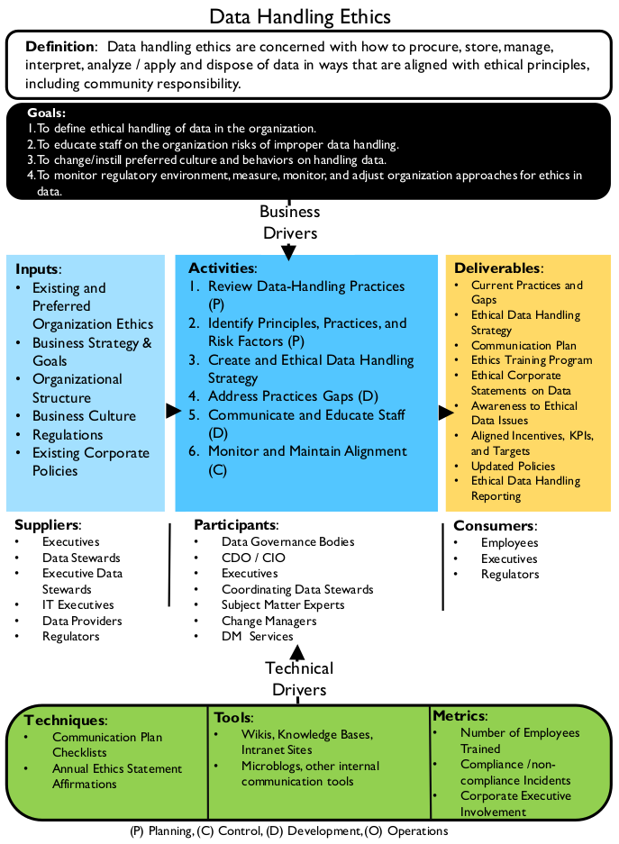
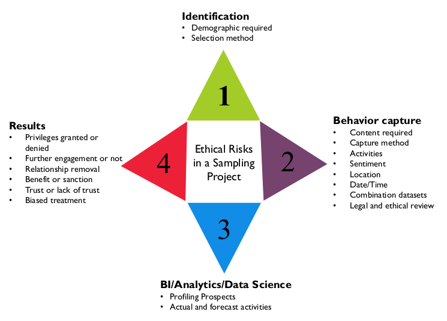

# Capítulo 2 - Ética no tratamento de dados

## 1. Introdução

Ética é, de forma simples, um conjunto de princípios de comportamento baseados em ideias de certo e errado. Princípios éticos frequentemente se concentram em conceitos como justiça, respeito, responsabilidade, integridade, qualidade, confiabilidade, transparência e confiança. No tratamento de dados, a ética se preocupa com a forma como os dados são obtidos, armazenados, gerenciados, utilizados e descartados, sempre em conformidade com esses princípios. O tratamento ético de dados é fundamental para o sucesso a longo prazo de qualquer organização que busca valorizar seus dados. O tratamento antiético de dados pode levar à perda de reputação e clientes, pois coloca em risco as pessoas cujos dados são expostos. Em alguns casos, práticas antiéticas também são ilegais.[^18] Em última análise, para os profissionais de gestão de dados e as organizações para as quais trabalham, a ética de dados é uma questão de responsabilidade social.

A ética no tratamento de dados é complexa, mas concentra-se em vários conceitos fundamentais:

* **Impacto nas pessoas:** A forma como os dados representam características de indivíduos e são utilizados para tomar decisões que afetam suas vidas exige a gestão cuidadosa de sua qualidade e confiabilidade.
* **Potencial para uso indevido:** O uso indevido de dados pode afetar negativamente pessoas e organizações, o que impõe um imperativo ético para prevenir tais usos.
* **Valor econômico dos dados:** Dados possuem valor econômico, e a ética da propriedade de dados deve determinar como esse valor pode ser acessado e por quem.

As organizações protegem os dados, em grande parte, com base em leis e requisitos regulatórios. No entanto, como os dados representam pessoas (clientes, funcionários, pacientes, fornecedores, etc.), os profissionais de gestão de dados devem reconhecer que existem razões éticas (e legais) para proteger os dados e garantir que não sejam utilizados indevidamente. Mesmo dados que não representam diretamente indivíduos ainda podem ser usados para tomar decisões que afetam a vida das pessoas.

Existe um imperativo ético não apenas para proteger os dados, mas também para gerenciar sua qualidade. Pessoas que tomam decisões, bem como aquelas impactadas por elas, esperam que os dados sejam completos e precisos. Tanto da perspectiva comercial quanto técnica, os profissionais de gestão de dados têm a responsabilidade ética de gerenciar os dados de forma a reduzir o risco de que sejam deturpados, mal utilizados ou mal interpretados. Essa responsabilidade se estende por todo o ciclo de vida dos dados, desde a sua criação até a sua destruição.

Figura 12 Diagrama de Contexto: Ética no Tratamento de Dados

Infelizmente, muitas organizações não reconhecem nem cumprem as obrigações éticas inerentes ao tratamento de dados. Elas podem adotar uma perspectiva técnica tradicional e alegar não compreender os dados, ou presumir que, ao seguirem a lei rigorosamente, não correm riscos relacionados a essa prática. Essa é uma suposição perigosa.

O ambiente de dados está em rápida evolução. As organizações estão utilizando os dados de maneiras que não imaginariam há alguns anos. Embora as leis codifiquem alguns princípios éticos, a legislação não consegue acompanhar os riscos associados à evolução desse ambiente. As organizações devem reconhecer e cumprir sua obrigação ética de proteger os dados que lhes são confiados, promovendo e sustentando uma cultura que valorize o tratamento ético das informações.

## 2. Impulsionadores de Negócios

Assim como as declarações de W. Edward Deming sobre qualidade, a ética implica "fazer o certo quando ninguém está olhando”. Uma abordagem ética para o uso de dados é cada vez mais reconhecida como uma vantagem competitiva para os negócios (Hasselbalch e Tranberg, 2016). O tratamento ético de dados pode aumentar a confiabilidade de uma organização e a qualidade de seus dados e processos. Isso pode, por sua vez, criar melhores relacionamentos entre a organização e seus stakeholders. Promover uma cultura ética implica introduzir uma governança adequada, incluindo a instituição de controles para garantir que tanto os resultados pretendidos quanto os resultantes do processamento de dados sejam éticos e não violem a confiança ou a dignidade humana.

O tratamento de dados não ocorre no vácuo, e clientes e stakeholders esperam comportamento e resultados éticos das empresas e de seus processos de dados. Reduzir o risco de que os dados sob a responsabilidade da organização sejam utilizados indevidamente por funcionários, clientes ou parceiros é um dos principais motivos para que uma organização cultive princípios éticos no tratamento de dados. Há também uma responsabilidade ética em proteger os dados de indivíduos vulneráveis (ou seja, proteger contra invasões e potenciais violações de dados). (Consulte o Capítulo 7.)

Diferentes modelos de propriedade de dados influenciam a ética do tratamento de dados. Por exemplo, a tecnologia melhorou a capacidade das organizações de compartilhar dados entre si. Essa capacidade exige que as organizações tomem decisões éticas sobre sua responsabilidade ao compartilhar dados que não lhes pertencem.

As funções emergentes de Diretor de Dados, Diretor de Riscos, Diretor de Privacidade e Diretor de Análise de Dados concentram-se no controle de riscos, estabelecendo práticas aceitáveis ​​para o tratamento de dados. No entanto, a responsabilidade vai além dessas funções. O tratamento ético de dados exige o reconhecimento, por toda a organização, dos riscos associados ao uso indevido de dados e o compromisso da organização com o tratamento de dados baseado em princípios que protejam os indivíduos e respeitem os imperativos relacionados à propriedade de dados.

## 3. Conceitos Essenciais

### 3.1 Princípios Éticos para Dados

Os princípios aceitos da bioética, que se concentram na preservação da dignidade humana, fornecem um bom ponto de partida para os princípios da ética de dados. Por exemplo, os Princípios de Belmont para pesquisa médica podem ser adaptados às disciplinas de Gestão da Informação (US-HSS, 1979).

* **Respeito às Pessoas:** Este princípio reflete o requisito ético fundamental de que as pessoas sejam tratadas com respeito à sua dignidade e autonomia, especialmente em casos em que sua autonomia seja diminuída, exigindo cuidados extras para proteger seus direitos.

Quando consideramos dados como um ativo, é fundamental questionar se eles afetam, representam ou tocam as pessoas? Dados pessoais são distintos de outros “ativos” brutos, como petróleo ou carvão. O uso antiético de dados pessoais pode influenciar diretamente as interações das pessoas, suas oportunidades de emprego e seu lugar na comunidade. Projetamos sistemas de informação de forma a limitar a autonomia ou a liberdade de escolha? Consideramos como o processamento de dados pode afetar pessoas com deficiências mentais ou físicas? Como elas acessarão e utilizarão os dados? O processamento de dados ocorre com base em consentimento informado e válido?

* **Beneficência:** Este princípio possui dois elementos: primeiro, evitar causar danos; segundo, maximizar possíveis benefícios e minimizar possíveis danos.

O princípio ético de “não causar dano” tem uma longa história na ética médica e também possui aplicação clara no contexto da gestão de dados e informações. Profissionais éticos de dados e informações devem identificar as partes interessadas e considerar os resultados do processamento de dados, trabalhando para maximizar os benefícios e minimizar os riscos de danos decorrentes dos processos projetados. O processo foi projetado de forma a pressupor um resultado de soma zero, em vez de uma situação vantajosa para todos? O processamento de dados é excessivamente invasivo, e existe uma maneira menos arriscada de atender aos requisitos do negócio? O tratamento de dados em questão carece de transparência, podendo ocultar possíveis danos às pessoas?

* Justiça: Este princípio considera o tratamento justo e equitativo das pessoas.

Algumas perguntas que podem ser feitas em relação a este princípio: Pessoas ou grupos de pessoas estão sendo tratados de forma desigual em circunstâncias semelhantes? O resultado de um processo ou algoritmo resulta em efeitos que beneficiam ou prejudicam desproporcionalmente um determinado grupo de pessoas? O aprendizado de máquina está sendo treinado usando conjuntos de dados que contêm dados que, inadvertidamente, reforçam preconceitos culturais?

O Relatório Menlo do Departamento de Segurança Interna dos Estados Unidos adapta os Princípios de Belmont à Pesquisa em Tecnologia da Informação e Comunicação, adicionando um quarto princípio: Respeito à Lei e ao Interesse Público (US-DHS, 2012).

Em 2015, a Autoridade Europeia para a Proteção de Dados publicou um parecer sobre ética digital, destacando as "implicações de engenharia, filosóficas, jurídicas e morais" dos desenvolvimentos em processamento de dados e Big Data. O relatório solicitou um foco no processamento de dados que defenda a dignidade humana e estabeleceu quatro pilares necessários para um ecossistema de informação que garanta o tratamento ético dos dados (EDPS, 2015):

*   Regulamentação do processamento de dados orientada para o futuro e respeito pelos direitos à privacidade e à proteção de dados
*   Controladores responsáveis que determinam o processamento de informações pessoais
*   Engenharia e design de produtos e serviços de processamento de dados com foco na privacidade
*   Indivíduos empoderados

Esses princípios se alinham amplamente ao princípio estabelecido no Relatório de Belmont, com foco na promoção da dignidade humana e da autonomia. A EDPS afirma que a privacidade é um direito humano fundamental. Desafia os inovadores a enxergarem a dignidade, a privacidade e a autonomia como elementos centrais na construção de um ambiente digital sustentável, em vez de obstáculos ao desenvolvimento, e apela à transparência e à comunicação com as partes interessadas.

A Governança de Dados é uma ferramenta vital para garantir que esses princípios sejam considerados na tomada de decisão sobre quem pode fazer o quê com quais dados e em que circunstâncias o processamento é apropriado ou necessário. Os impactos e riscos éticos do processamento de dados devem ser considerados pelos profissionais e gerenciados com a mesma qualidade dos dados, levando em conta todas as partes interessadas.

### 3.2 Princípios por Trás da Lei de Privacidade de Dados

Políticas públicas e leis buscam codificar o que é certo e errado com base em princípios éticos. No entanto, não conseguem abranger todas as circunstâncias. Por exemplo, as leis de privacidade na União Europeia, Canadá e Estados Unidos apresentam abordagens distintas para a codificação da ética de dados. Esses princípios também podem fornecer uma estrutura para políticas organizacionais.

A lei de privacidade não é um conceito novo. Privacidade e proteção da informação, como conceitos, estão firmemente ligados ao imperativo ético de respeitar os direitos humanos. Em 1890, os juristas americanos Samuel Warren e Louis Brandeis descreveram a privacidade e a proteção da informação como direitos humanos, com proteções na common law que sustentam vários direitos na Constituição dos EUA. Em 1973, um código de Práticas Justas de Informação foi proposto, e o conceito de proteção da informação como um direito fundamental foi reafirmado na Lei de Privacidade dos EUA de 1974, que afirma que “o direito à privacidade é um direito pessoal e fundamental protegido pela Constituição dos Estados Unidos”.

Após as violações de direitos humanos durante a Segunda Guerra Mundial, a Convenção Europeia dos Direitos Humanos (1950) estabeleceu tanto o direito geral à privacidade quanto o direito específico à proteção da informação (ou o direito à proteção de dados pessoais) como direitos humanos fundamentais para a defesa do direito à dignidade humana. Em 1980, a Organização para a Cooperação e Desenvolvimento Econômico (OCDE) estabeleceu Diretrizes e Princípios para o Processamento Justo de Informações, que se tornaram a base para as leis de proteção de dados da União Europeia.

Os oito princípios fundamentais da OCDE, os Padrões de Processamento Justo de Informações, visam garantir que os dados pessoais sejam processados de forma a respeitar o direito dos indivíduos à privacidade. Eles incluem: limitações na coleta de dados; a expectativa de que os dados sejam de alta qualidade; a exigência de que, quando os dados são coletados, isso seja feito para uma finalidade específica; limitações no uso de dados; salvaguardas de segurança; a expectativa de abertura e transparência; o direito de um indivíduo contestar a exatidão dos dados relacionados a si mesmo; e a responsabilidade das organizações em seguir as diretrizes.

Os princípios da OCDE foram substituídos pelos princípios subjacentes ao Regulamento Geral sobre a Proteção de Dados da UE (RGPD, 2016). Veja a Tabela 1.

Tabela 1 Princípios do GDPR

| Princípios do GDPR                | Descrição do Princípio |
|-----------------------------------|------------------------|
| Justiça, Licitude, Transparência  | Os dados pessoais serão tratados de forma lícita, leal e transparente em relação ao titular dos dados. |
| Limitação da Finalidade           | Os dados pessoais devem ser coletados para finalidades específicas, explícitas e legítimas, e não tratados de forma incompatível com essas finalidades. |
| Minimização de Dados              | Os dados pessoais devem ser adequados, relevantes e limitados ao necessário em relação às finalidades para as quais são tratados. |
| Precisão                          | Os dados pessoais devem ser precisos e, quando necessário, mantidos atualizados. Todas as medidas razoáveis ​​devem ser tomadas para garantir que os dados pessoais imprecisos, tendo em conta a finalidade para a qual são tratados, sejam apagados ou retificados sem demora. |
| Limitação de Armazenamento        | Os dados devem ser mantidos de forma a permitir a identificação dos titulares dos dados [indivíduos] apenas durante o período necessário para as finalidades para as quais são tratados. |
| Integridade e Confidencialidade   | Os dados devem ser processados ​​de forma a garantir a segurança adequada dos dados pessoais, incluindo a proteção contra o processamento não autorizado ou ilícito e contra a perda, destruição ou danos acidentais, utilizando medidas técnicas ou organizacionais adequadas. |
| Responsabilidade                  | Os Controladores de Dados serão responsáveis ​​e serão capazes de demonstrar a conformidade com [estes princípios]. |

Esses princípios são equilibrados e respaldam certos direitos qualificados que os indivíduos possuem sobre seus dados, incluindo os direitos de acesso, retificação de dados imprecisos, portabilidade, o direito de se opor ao processamento de dados pessoais que possam causar danos ou sofrimento, e apagamento. Quando o processamento de dados pessoais é realizado com base em consentimento, este deve ser uma ação afirmativa, dada livremente, específica, informada e inequívoca. O GDPR exige governança e documentação eficazes para permitir e demonstrar a conformidade, exigindo a Privacidade desde a Concepção (Privacy by Design).

A lei canadense de privacidade combina um regime abrangente de proteção da privacidade com a autorregulamentação do setor. A PIPEDA (Lei de Proteção de Informações Pessoais e Documentos Eletrônicos) se aplica a todas as organizações que coletam, utilizam e disseminam informações pessoais no curso de atividades comerciais. Ela estipula regras, com exceções, que as organizações devem seguir no uso das informações pessoais dos consumidores. A Tabela 2 descreve as obrigações legais baseadas na PIPEDA[^19].

No Canadá, o Comissário Federal de Privacidade é o único responsável por lidar com reclamações de privacidade contra organizações. No entanto, ele desempenha o papel de ombudsman, cujas decisões são apenas recomendações (não juridicamente vinculativas e sem valor precedente, mesmo dentro do gabinete do comissário).

Tabela 2: Obrigações Estatutárias de Privacidade do Canadá

| Princípio PIPEDA                                | Descrição do Princípio    |
|-------------------------------------------------|---------------------------|
| Responsabilidade                                | Uma organização é responsável pelas informações pessoais sob seu controle e deve designar um indivíduo responsável pela conformidade da organização com o princípio. |
| Identificação de Finalidades                    | Uma organização deve identificar as finalidades para as quais as informações pessoais são coletadas no momento ou antes da coleta das informações. |
| Consentimento                                   | Uma organização deve obter o conhecimento e o consentimento do indivíduo para a coleta, uso ou divulgação de informações pessoais, exceto quando inapropriado. |
| Limitação da Coleta, Uso, Divulgação e Retenção | A coleta de informações pessoais deve ser limitada ao necessário para os fins identificados pela organização. As informações devem ser coletadas por meios justos e lícitos. As informações pessoais não devem ser usadas ou divulgadas para fins diferentes daqueles para os quais foram coletadas, exceto com o consentimento do indivíduo ou conforme exigido por lei. As informações pessoais devem ser retidas apenas pelo tempo necessário para o cumprimento dessas finalidades. |
| Precisão                                        | As informações pessoais devem ser tão precisas, completas e atualizadas quanto necessário para os fins para os quais serão utilizadas. |
| Salvaguardas                                    | As informações pessoais devem ser protegidas por salvaguardas de segurança adequadas à sua sensibilidade. |
| Abertura                                        | Uma organização deve disponibilizar prontamente aos indivíduos informações específicas sobre suas políticas e práticas relacionadas à gestão de suas informações pessoais. |
| Acesso Individual                               | Mediante solicitação, o indivíduo deverá ser informado sobre a existência, o uso e a divulgação de suas informações pessoais e deverá ter acesso a essas informações. O indivíduo deverá poder contestar a exatidão e a integralidade das informações e solicitar que sejam alteradas conforme apropriado. |
| Desafios de Conformidade                        | O indivíduo deverá poder encaminhar uma contestação referente à conformidade com os princípios acima ao(s) indivíduo(s) designado(s) responsável(is) pela conformidade da organização. |

Em março de 2012, a Comissão Federal de Comércio dos EUA (FTC) emitiu um relatório recomendando que as organizações elaborassem e implementassem seus próprios programas de privacidade, com base nas melhores práticas descritas no relatório (ou seja, Privacidade desde a Concepção) (FTC 2012). O relatório reafirma o foco da FTC nos Princípios de Processamento Justo de Informações (ver Tabela 3).

Tabela 3: Critérios do Programa de Privacidade dos Estados Unidos.

| Princípio                                 | Descrição do Princípio    |
|-------------------------------------------|---------------------------|
| Aviso / Conscientização                   | Os coletores de dados devem divulgar suas práticas de informação antes de coletar informações pessoais dos consumidores.
| Escolha / Consentimento                   | Os consumidores devem ter opções quanto a se e como as informações pessoais coletadas deles podem ser usadas para fins além daqueles para os quais as informações foram fornecidas.
| Acesso / Participação                     | Os consumidores devem poder visualizar e contestar a exatidão e a integralidade dos dados coletados sobre eles.
| Integridade / Segurança                   | Os coletores de dados devem tomar medidas razoáveis ​​para garantir que as informações coletadas dos consumidores sejam precisas e protegidas contra uso não autorizado.
| Aplicação/Reparação                       | O uso de um mecanismo confiável para impor sanções pelo descumprimento dessas práticas justas de informação.

Esses princípios foram desenvolvidos para incorporar os conceitos das Diretrizes da OCDE para o Processamento Justo de Informações, com ênfase na minimização de dados (limitação razoável da coleta) e na retenção segura (limitação do armazenamento), precisão e na exigência de que as empresas forneçam segurança adequada aos dados dos consumidores. Outros pontos importantes para práticas justas de informação incluem:

*   Escolha simplificada do consumidor para reduzir o ônus imposto aos consumidores
*   A recomendação de manter um procedimento abrangente de gerenciamento de dados durante todo o ciclo de vida da informação
*   Opção “Não Rastrear”
*   Requisitos para consentimento expresso e afirmativo
*   Preocupações com a capacidade de coleta de dados por grandes provedores de plataforma; transparência e avisos e políticas de privacidade claros
*   Acesso de indivíduos aos seus dados
*   Educação dos consumidores sobre práticas de privacidade de dados
*   Privacidade desde a concepção

Há uma tendência global para aumentar a proteção legislativa da privacidade das informações dos indivíduos, seguindo os padrões estabelecidos pela legislação da UE. Leis em todo o mundo impõem diferentes tipos de restrições à movimentação de dados através de fronteiras internacionais. Mesmo dentro de uma organização multinacional, haverá limites legais para o compartilhamento global de informações. Portanto, é importante que as organizações tenham políticas e diretrizes que permitam que os funcionários sigam os requisitos legais e utilizem os dados dentro do apetite de risco da organização.

### 3.3 Dados Online em um Contexto Ético

Existem atualmente dezenas de iniciativas e programas emergentes projetados para criar um conjunto de princípios codificados que orientem o comportamento ético online nos Estados Unidos (Davis, 2012). Os tópicos incluem:

*   **Propriedade dos dados:** O direito de controlar os dados pessoais de uma pessoa em relação a sites de mídia social e corretores de dados. Agregadores de dados podem incorporar informações em perfis detalhados, dos quais os indivíduos não têm conhecimento.
*   **Direito ao Esquecimento:** A possibilidade de ter informações sobre uma pessoa apagadas da web, especialmente para ajustar a reputação online. Este tópico está relacionado às práticas de retenção de dados.
*   **Identidade:** O direito de esperar uma identidade precisa e de optar por uma identidade privada.
*   **Liberdade de expressão online:** A capacidade de expressar opiniões, em contraposição ao bullying, incitação ao terrorismo, trollagem ou insultos.

### 3.4 Riscos de Práticas Antiéticas de Tratamento de Dados

A maioria das pessoas que trabalha com dados sabe que é possível usá-los para distorcer fatos. O livro clássico “Como Mentir com Estatísticas”, de Darrell Huff (1954), descreve uma série de maneiras pelas quais os dados podem ser utilizados para criar uma aparência de factualidade, distorcendo-os. Os métodos incluem a seleção criteriosa de dados, a manipulação de escala e a omissão de alguns pontos de dados. Essas abordagens ainda são utilizadas atualmente.

Compreender as implicações do tratamento ético de dados passa por examinar práticas que a maioria das pessoas consideraria antiéticas. O tratamento ético de dados implica um dever positivo de tratar os dados de acordo com princípios éticos, como a confiabilidade. Garantir a confiabilidade dos dados pode incluir medi-los em relação a dimensões da Qualidade de Dados, como precisão e atualização. Além disso, envolve um nível básico de veracidade e transparência – evitar o uso de dados para mentir ou enganar, e ser transparente em relação às fontes, usos e intenções por trás do tratamento de dados de uma organização. Os cenários a seguir descrevem práticas antiéticas de dados que violam esses princípios, entre outros.

### 3.4.1 Tempo

É possível distorcer informações pela omissão ou inclusão de determinados pontos de dados em um relatório ou atividade, com base no tempo. A manipulação do mercado de ações por meio de negociações de ações no “fim do dia” pode elevar artificialmente o preço de uma ação no fechamento do mercado, dando uma visão artificial do valor da ação. Isso se chama “*market timing*” e é ilegal.

A equipe de *Business Intelligence* pode ser a primeira a notar anomalias. Na verdade, eles são agora vistos como participantes valiosos nos centros de negociação de ações do mundo, recriando padrões de negociação em busca de tais problemas, além de analisar relatórios e revisar e monitorar regras e alertas. A equipe de *Business Intelligence* ética pode precisar alertar as funções de governança ou gestão apropriadas sobre tais anomalias.

### 3.4.2 Visualizações Enganosas

Gráficos e tabelas podem ser usados para apresentar dados de forma enganosa. Por exemplo, alterar a escala pode fazer com que uma linha de tendência pareça melhor ou pior. Deixar de lado pontos de dados, comparar dois fatos sem esclarecer sua relação ou ignorar convenções visuais aceitas (como a de que os números em um gráfico de pizza representando porcentagens devem somar 100 e somente 100) também pode ser utilizado para induzir as pessoas a interpretarem visualizações de maneiras que não são suportadas pelos próprios dados. [^20]

### 3.4.3 Definições pouco claras ou comparações inválidas

Um veículo de notícias dos EUA relatou, com base em dados do US Census Bureau de 2011, que 108,6 milhões de pessoas nos EUA recebiam assistência social, enquanto apenas 101,7 milhões de pessoas tinham empregos em tempo integral, o que sugeria uma porcentagem desproporcional da população total que recebia assistência social. [^21] A Media Matters explicou a discrepância: o número de 108,6 milhões se referia ao número de indivíduos que participavam de programas com comprovação de renda, incluindo "qualquer pessoa que residisse em uma residência na qual uma ou mais pessoas receberam benefícios" no quarto trimestre de 2011, o que abrangia indivíduos que não receberam benefícios do governo. Por outro lado, o número de "pessoas com emprego em tempo integral" incluía apenas aqueles que estavam empregados, e não aqueles que residiam em uma residência onde pelo menos uma pessoa trabalhava. [^22]

A atitude ética a ser tomada ao apresentar informações é fornecer um contexto que informe seu significado, como uma definição clara e inequívoca da população que está sendo medida e do que significa estar "recebendo benefícios sociais". A omissão desse contexto pode levar a uma apresentação superficial que implica um significado que os dados não sustentam, seja por intenção ou por falta de rigor. Trata-se de um uso antiético de dados.

Além disso, é simplesmente necessário, de uma perspectiva ética, evitar o uso inadequado de estatísticas.

A "suavização" estatística de números ao longo de um período pode alterar completamente a percepção do valor numérico. "Data Mining Snooping" é um termo recentemente cunhado para descrever um fenômeno em investigações estatísticas de mineração de dados, onde correlações exaustivas são realizadas em um conjunto de dados, essencialmente sobrecarregando um modelo estatístico. Devido ao comportamento da "significância estatística", é razoável esperar que alguns resultados aparentemente estatisticamente significativos sejam, na verdade, resultados aleatórios. Pessoas não treinadas podem ser enganadas. Este fenômeno é comum nos setores financeiro e médico (Jensen, 2000; ma.utexas.edu, 2012). [^23]

### 3.4.4 Viés (Bias)

Viés refere-se a uma inclinação de perspectiva. No nível pessoal, o termo está associado a julgamentos ou preconceitos irracionais. Em estatística, viés refere-se a desvios dos valores esperados, frequentemente introduzidos por erros sistemáticos na amostragem ou seleção de dados. [^24] O viés pode ser inserido em diferentes etapas do ciclo de vida dos dados: na coleta e criação dos dados, na seleção para inclusão na análise, nos métodos de análise e na forma como os resultados são apresentados.

O princípio ético da justiça impõe um dever positivo de estar ciente de possíveis vieses que possam influenciar a coleta, o processamento, a análise ou a interpretação de dados. Isso é particularmente relevante no processamento de dados em larga escala, que pode afetar desproporcionalmente grupos historicamente sujeitos a preconceito ou tratamento injusto. Utilizar dados sem considerar as maneiras pelas quais o viés pode ser inserido pode agravar o preconceito, ao mesmo tempo em que reduz a transparência do processo, conferindo aos resultados uma aparência de imparcialidade ou neutralidade, quando não são neutros. Existem diversos tipos de viés:

* **Coleta de dados para resultados predefinidos:** O analista é pressionado a coletar dados e produzir resultados para confirmar uma conclusão predefinida, em vez de buscar uma conclusão objetiva.
* **Uso tendencioso dos dados coletados:** Os dados podem ser coletados com viés limitado, mas o analista é pressionado a usá-los para confirmar uma abordagem predefinida. Os dados podem ser manipulados para esse fim (por exemplo, descartando dados que não confirmam a abordagem).
* **Palpite e busca:** O analista tem um palpite e utiliza apenas os dados que o confirmam, ignorando outras possibilidades que os dados possam apresentar.
* **Metodologia de amostragem tendenciosa:** A amostragem é frequentemente necessária na coleta de dados, mas o viés pode ser introduzido pelo método de seleção do conjunto amostral. É virtualmente impossível para humanos amostrar sem viés de algum tipo. Para limitar o viés, utilize ferramentas estatísticas para selecionar amostras e estabelecer tamanhos amostrais adequados. A conscientização sobre viés em conjuntos de dados utilizados para treinamento é particularmente importante.
* **Contexto e cultura:** Vieses frequentemente se baseiam em cultura ou contexto, sendo necessária uma visão neutra, fora desse contexto.

Questões de viés dependem de diversos fatores, como o tipo de processamento de dados, as partes interessadas envolvidas, a forma como os dados são preenchidos, as necessidades de negócios e os resultados esperados do processo. No entanto, nem sempre é possível ou desejável remover todo o viés. O viés de negócios contra clientes insatisfeitos (clientes com quem não se busca mais negócio) é uma peça fundamental em muitos cenários construídos por analistas de negócios; eles são desmarcados das amostras ou ignorados na análise. Nesse caso, os analistas devem documentar os critérios utilizados para definir a população que estão estudando. Em contraste, algoritmos preditivos que determinam o “risco criminal” de indivíduos ou o policiamento preditivo que envia recursos para bairros específicos teriam um risco muito maior de violar princípios éticos de justiça ou equidade, e deveriam ter maiores precauções para garantir a transparência e a responsabilização algorítmica e para combater o viés em conjuntos de dados que treinam quaisquer algoritmos preditivos. [^25]

### 3.4.5 Transformando e Integrando Dados

A integração de dados apresenta desafios éticos, uma vez que os dados são alterados em cada transferência entre sistemas. Se a integração não for realizada com cuidado, há risco de manuseio antiético ou até mesmo ilegal. Esses riscos éticos se complementam com problemas fundamentais na gestão de dados, incluindo:

* **Conhecimento limitado da origem e linhagem dos dados:** Se uma organização não souber de onde os dados vieram e como eles foram modificados durante a transferência entre sistemas, ela não poderá comprovar que os dados representam o que afirmam representar.
* **Dados de baixa qualidade:** As organizações devem estabelecer padrões claros e mensuráveis para a qualidade dos dados e devem monitorá-los para garantir que atendam a esses padrões. Sem essa verificação, uma organização não poderá assegurar a qualidade dos dados, e os usuários desses dados correm risco ou podem colocar outros em risco ao utilizá-los.
* **Metadados não confiáveis:** Os usuários de dados dependem de metadados confiáveis, incluindo definições consistentes dos elementos individuais dos dados, documentação da origem dos dados e documentação da linhagem (por exemplo, as regras pelas quais os dados são integrados). Sem metadados confiáveis, os dados podem ser mal interpretados e potencialmente utilizados indevidamente. Em casos de transferência de dados entre organizações, especialmente quando ocorrem fronteiras, os metadados devem incluir tags que indiquem sua procedência, o detentor dos dados e se requerem proteção específica.
* **Falta de documentação do histórico de correções de dados:** As organizações também devem manter informações auditáveis relacionadas à forma como os dados foram alterados. Mesmo que a intenção da correção de dados seja melhorar a qualidade dos dados, essa ação pode ser ilegal. As correções de dados devem sempre seguir um processo formal e auditável de controle de alterações.

### 3.4.6 Ofuscação/Redação de Dados

A ofuscação ou redação de dados consiste em tornar informações anônimas ou remover informações sensíveis. Contudo, a ofuscação por si só pode não ser suficiente para proteger os dados, caso uma atividade posterior (análise ou combinação com outros conjuntos de dados) possa expô-los. Este risco está presente nos seguintes casos:

* **Agregação de dados:** Ao agregar dados em dimensões e remover dados de identificação, um conjunto de dados ainda pode servir a uma finalidade analítica sem a preocupação de divulgar informações de identificação pessoal (PII). Agregações em áreas geográficas são uma prática comum (consulte os Capítulos 7 e 14).
* **Marcação de dados:** A marcação de dados é utilizada para classificar a sensibilidade dos dados (secreta, confidencial, pessoal, etc.) e para controlar a divulgação para comunidades apropriadas, como o público ou fornecedores, ou até mesmo fornecedores de determinados países ou outras considerações da comunidade.
* **Mascaramento de dados:** O mascaramento de dados é uma prática em que apenas os dados enviados de forma adequada desbloqueiam processos. Os operadores não têm acesso aos dados originais; eles simplesmente digitam as respostas que lhes são fornecidas, e, se essas respostas estiverem corretas, outras atividades são permitidas. Os processos de negócios que utilizam mascaramento de dados incluem call centers terceirizados ou subcontratados que devem ter acesso apenas parcial às informações.

O uso de conjuntos de dados extremamente grandes em análises de Ciência de Dados levanta preocupações práticas, e não meramente teóricas, sobre a eficácia da anonimização. Em grandes conjuntos de dados, é possível combinar dados de forma a permitir a identificação específica de indivíduos, mesmo que os conjuntos de dados de entrada tenham sido anonimizados. Ao chegarem a um data lake, a primeira etapa é analisar os dados em busca de informações sensíveis e aplicar métodos de proteção aceitos. No entanto, esses métodos, por si só, podem não oferecer proteção suficiente, sendo vital que as organizações tenham uma governança sólida e um compromisso com o tratamento ético de dados (Ver Capítulo 14).

### 3.5 Estabelecendo uma Cultura Ética de Dados

Estabelecer uma cultura de tratamento ético de dados exige a compreensão das práticas existentes, a definição dos comportamentos esperados, a codificação destes em políticas e um código de ética, e o fornecimento de treinamento e supervisão para garantir a aplicação desses comportamentos. Assim como em outras iniciativas relacionadas à governança de dados e à mudança cultural, esse processo demanda uma liderança forte.

O tratamento ético de dados inclui, obviamente, o cumprimento da lei, mas também influencia a forma como os dados são analisados e interpretados, bem como a forma como são utilizados internamente e externamente. Uma cultura organizacional que valoriza claramente o comportamento ético não apenas terá códigos de conduta, mas também garantirá que a comunicação e os controles de governança estejam em vigor para auxiliar os funcionários com dúvidas e fornecer caminhos de escalonamento adequados. Dessa forma, se os funcionários tomarem conhecimento de práticas antiéticas ou riscos éticos, poderão reportá-los ou interromper o processo sem medo de retaliação. Melhorar o comportamento ético de uma organização em relação aos dados requer um processo formal de Gestão de Mudanças Organizacionais (GMO) (Ver Capítulo 17).

### 3.5.1 Revisar o Estado Atual das Práticas de Tratamento de Dados

Para a melhoria, o primeiro passo é compreender o estado atual. O objetivo da revisão das práticas existentes de tratamento de dados é determinar em que medida elas estão diretamente conectadas aos fatores éticos e de conformidade. Essa revisão também deve identificar o nível de compreensão dos funcionários sobre as implicações éticas das práticas atuais na construção e manutenção da confiança de clientes, parceiros e outras partes interessadas. O resultado da revisão deverá documentar os princípios éticos que fundamentam a coleta, o uso e a supervisão de dados pela organização, ao longo de todo o ciclo de vida dos dados, incluindo as atividades de compartilhamento de dados.

### 3.5.2 Identificar Princípios, Práticas e Fatores de Risco

O objetivo da formalização de práticas éticas em torno do tratamento de dados é reduzir o risco de uso indevido e causar danos a clientes, funcionários, fornecedores, outras partes interessadas ou à organização. Uma organização que busca aprimorar suas práticas deve estar ciente dos princípios gerais, como a necessidade de proteger a privacidade dos indivíduos, bem como das preocupações específicas do setor, como a proteção de informações financeiras ou de saúde.

A abordagem de uma organização em relação à ética de dados deve estar alinhada aos requisitos de conformidade legal e regulatória. Por exemplo, organizações que operam globalmente precisam ter amplo conhecimento dos princípios éticos que fundamentam as leis dos países em que atuam, bem como conhecimento específico dos acordos internacionais. Além disso, a maioria das organizações apresenta riscos específicos, que podem estar relacionados à sua pegada tecnológica, à taxa de rotatividade de funcionários, aos métodos de coleta de dados de clientes ou a outros fatores.

Os princípios devem ser alinhados aos riscos (possíveis consequências negativas do não cumprimento) e às práticas (métodos corretos para evitar riscos). As práticas devem ser apoiadas por controles, conforme ilustrado no exemplo a seguir:

* **Princípio norteador:** As pessoas têm direito à privacidade em relação às informações sobre sua saúde. Portanto, os dados pessoais de saúde dos pacientes não devem ser acessados, exceto por pessoas autorizadas a acessá-los como parte do atendimento aos pacientes.
* **Risco:** Se houver amplo acesso aos dados pessoais de saúde dos pacientes, informações sobre os indivíduos poderão se tornar de conhecimento público, colocando em risco seu direito à privacidade.
* **Prática:** Somente enfermeiros e médicos terão permissão para acessar os dados pessoais de saúde dos pacientes e somente para fins de prestação de cuidados.
* **Controle:** Haverá uma revisão anual de todos os usuários dos sistemas que contêm informações pessoais de saúde dos pacientes para garantir que apenas as pessoas que necessitam tenham acesso.

### 3.5.3 Crie uma Estratégia e um Roteiro para o Tratamento Ético de Dados

Após uma revisão do estado atual e o desenvolvimento de princípios, uma organização pode formalizar uma estratégia para aprimorar suas práticas de tratamento de dados. Essa estratégia deve expressar tanto os princípios éticos quanto o comportamento esperado em relação aos dados, através de declarações de valores e um código de conduta ética. Seus componentes incluem:

* **Declarações de Valores:** As declarações de valores descrevem aquilo em que a organização acredita. Exemplos podem ser a verdade, a imparcialidade ou a justiça. Essas declarações fornecem uma estrutura para o tratamento ético de dados e a tomada de decisões.
* **Princípios de Tratamento Ético de Dados:** Os princípios de tratamento ético de dados descrevem como a organização aborda os desafios relacionados aos dados, como o respeito ao direito dos indivíduos à privacidade. Esses princípios e comportamentos esperados podem ser resumidos em um código de ética, apoiados por uma política de ética. A socialização do código e da política deve ser integrada ao plano de treinamento e comunicação.
* **Estrutura de Conformidade:** Uma estrutura de conformidade inclui fatores que impulsionam as obrigações organizacionais, garantindo que os comportamentos éticos permitam que a organização atenda aos requisitos de conformidade, influenciados por questões geográficas e setoriais.
* **Avaliações de Risco:** As avaliações de risco identificam a probabilidade e as implicações de problemas específicos que surgem na organização. Elas devem ser utilizadas para priorizar ações de mitigação, incluindo o cumprimento dos princípios éticos pelos funcionários.
* **Treinamento e Comunicação:** O treinamento deve incluir a revisão do código de ética, e os funcionários devem declarar familiaridade com ele e suas implicações no manuseio antiético de dados. O treinamento deve ser contínuo, por exemplo, através da exigência de uma declaração anual de ética. As comunicações devem alcançar todos os funcionários.
* **Roteiro:** O roteiro deve incluir um cronograma com atividades que possam ser aprovadas pela gerência, incluindo a execução do plano de treinamento e comunicação, a identificação e correção de lacunas nas práticas existentes, a mitigação de riscos e os planos de monitoramento. Desenvolva declarações detalhadas que reflitam a posição da organização sobre o manuseio adequado de dados, incluindo funções, responsabilidades e processos, e referências a especialistas para obter mais informações. O roteiro deve abranger todas as leis aplicáveis ​​e os fatores culturais.
* **Abordagem para Auditoria e Monitoramento:** As ideias éticas e o código de ética podem ser reforçados por meio de treinamento e, adicionalmente, é aconselhável monitorar atividades específicas para garantir que elas estejam sendo executadas em conformidade com os princípios éticos.

### 3.5.4 Adote um Modelo de Risco Ético Socialmente Responsável

Profissionais de dados envolvidos em Business Intelligence, analytics e Ciência de Dados frequentemente lidam com informações que descrevem:

* Quem são as pessoas, incluindo seus países de origem e características raciais, étnicas e religiosas;
* O que as pessoas fazem, incluindo atividades políticas, sociais e potencialmente criminosas;
* Onde as pessoas moram, seus recursos financeiros, seus hábitos de consumo e com quem interagem, por meio de conversas, mensagens de texto ou e-mails;
* Como as pessoas são tratadas, incluindo os resultados de análises, como pontuações e rastreamento de preferências que as classificam como prioritárias ou não para futuras oportunidades de negócio.

Esses dados podem ser mal utilizados, comprometendo os princípios subjacentes à ética de dados: respeito às pessoas, beneficência e justiça.

A execução justa de atividades de BI, analytics e Ciência de Dados exige uma perspectiva ética que ultrapasse os limites da organização para a qual os profissionais trabalham, considerando as implicações para a comunidade em geral. Essa perspectiva é necessária não apenas pela facilidade com que os dados podem ser mal utilizados, mas também pela responsabilidade social das organizações em evitar causar danos com seus dados.

Por exemplo, uma organização pode definir critérios para identificar clientes "ruins" com o objetivo de interromper seus relacionamentos comerciais com esses indivíduos. No entanto, se a organização detiver o monopólio de um serviço essencial em uma determinada área geográfica, alguns desses indivíduos podem ficar sem esse serviço e enfrentar riscos devido à decisão da organização.

Projetos que utilizam dados pessoais devem adotar uma abordagem disciplinada em seu uso. Consulte a Figura 13. Eles devem considerar:

* Como selecionam suas populações para estudo (seta 1);
* Como os dados serão coletados (seta 2);
* Em quais atividades a análise se concentrará (seta 3);
* Como os resultados serão disponibilizados (seta 4).

Dentro de cada área de consideração, devem ser abordados os potenciais riscos éticos, com foco especial nos possíveis efeitos negativos sobre clientes ou cidadãos.

Um modelo de risco pode ser usado para determinar se o projeto deve ser executado, influenciando também a forma como ele será conduzido. Por exemplo, os dados podem ser anonimizados, informações privadas removidas, a segurança dos arquivos reforçada ou confirmada, e uma revisão das leis de privacidade locais e outras aplicáveis será realizada com o departamento jurídico. A perda de clientes pode ser ilegal se a organização for um monopólio em uma jurisdição e os cidadãos não tiverem outras opções de fornecedores, como energia ou água.

Como os projetos de análise de dados são complexos, os profissionais podem não identificar os desafios éticos. As organizações precisam identificar ativamente os riscos potenciais, e também proteger os denunciantes que identificam riscos e levantam preocupações. O monitoramento automatizado não é proteção suficiente contra atividades antiéticas. Os próprios analistas precisam refletir sobre possíveis vieses. Normas culturais e éticas no local de trabalho influenciam o comportamento corporativo – aprenda e utilize o modelo de risco ético. A DAMA International incentiva os profissionais de dados a adotarem uma postura profissional e a apresentarem situações de risco a líderes empresariais, que podem não ter reconhecido as implicações de usos específicos de dados e dessas implicações em seu trabalho.

Figura 13 Modelo de Risco Ético para Projetos de Amostragem

### 3.6 Ética e Governança de Dados

A supervisão do tratamento adequado de dados é de responsabilidade conjunta da governança de dados e da assessoria jurídica. Ambas devem se manter atualizadas sobre as mudanças legais, reduzindo o risco de impropriedade ética e garantindo que os funcionários estejam cientes de suas obrigações. A Governança de Dados deve definir padrões e políticas e supervisionar as práticas de tratamento de dados. Os funcionários devem esperar tratamento justo, proteção contra possíveis violações e não interferência em suas vidas pessoais. A Governança de Dados possui um requisito específico de supervisão para revisar planos e decisões propostas por estudos de BI, análise e Ciência de Dados.

A certificação Certified Data Management Professional (CDMP) da DAMA International exige que o profissional de gestão de dados assine um código de ética formal, incluindo a obrigação de tratar dados de forma ética em benefício da sociedade, além da organização que o emprega.

## 4. Trabalhos Citados / Recomendados

Blann, Andrew. Data Handling and Analysis. Oxford University Press, 2015. Print. Fundamentals of Biomedical Science.

Council for Big Data, Ethics, and Society (website) http://bit.ly/2sYAGAq.

Davis, Kord. Ethics of Big Data: Balancing Risk and Innovation. O'Reilly Media, 2012. Print.

European Data Protection Supervisor (EDPS). Opinion 4/2015 “Towards a new digital ethics: Data, dignity and technology.” http://bit.ly/2sTFVlI.

Federal Trade Commission, US (FTC). Federal Trade Commission Report Protecting Consumer Privacy in an Era of Rapid Change. March 2012. http://bit.ly/2rVgTxQ and http://bit.ly/1SHOpRB.

GDPR REGULATION (EU) 2016/679 OF THE EUROPEAN PARLIAMENT AND OF THE COUNCIL of 27 April 2016 on the protection of natural persons with regard to the processing of personal data and on the free movement of such data, and repealing Directive 95/46/EC (General Data Protection Regulation).

Hasselbalch, Gry and Pernille Tranberg. Data Ethics: The New Competitive Advantage. Publishare. 2016.

Huff, Darrell. How to Lie with Statistics. Norton, 1954. Print.

Jensen, David. “Data Snooping, Dredging and Fishing: The Dark Side of Data Mining A SIGKDD99 Panel Report.” SIGKDD Explorations. ACM SIGKDD, Vol. 1, Issue 2. January 2000. http://bit.ly/2tNThMK.

Johnson, Deborah G. Computer Ethics. 4th ed. Pearson, 2009. Print.

Kaunert, C. and S. Leonard, eds. European Security, Terrorism and Intelligence: Tackling New Security Challenges in Europe. Palgrave Macmillan, 2013. Print. Palgrave Studies in European Union Politics.

Kim, Jae Kwan and Jun Shao. Statistical Methods for Handling Incomplete Data. Chapman and Hall/CRC, 2013. Chapman and Hall/CRC Texts in Statistical Science.

Lake, Peter. A Guide to Handling Data Using Hadoop: An exploration of Hadoop, Hive, Pig, Sqoop and Flume. Peter Lake, 2015.

Lewis, Colin and Dagmar Monett. AI and Machine Learning Black Boxes: The Need for Transparency and Accountability. KD Nuggets (website), April 2017. http://bit.ly/2q3jXLr.

Lipschultz, Jeremy Harris. Social Media Communication: Concepts, Practices, Data, Law and Ethics. Routledge, 2014. Print.

Mayfield, M.I. On Handling the Data. CreateSpace Independent Publishing Platform, 2015. Print.

Mazurczyk, Wojciech et al. Information Hiding in Communication Networks: Fundamentals, Mechanisms, and Applications. Wiley-IEEE Press, 2016. Print. IEEE Press Series on Information and Communication Networks Security.

Naes, T. and E. Risvik eds. Multivariate Analysis of Data in Sensory Science. Volume 16. Elsevier Science, 1996. Print. Data Handling in Science and Technology (Book 16).

Olivieri, Alejandro C. et al, eds. Fundamentals and Analytical Applications of Multi-way Calibration. Volume 29. Elsevier, 2015. Print. Data Handling in Science and Technology (Book 29).

ProPublica (website). “Machine Bias: Algorithmic injustice and the formulas that increasingly influence our lives.” May 2016 http://bit.ly/2oYmNRu.

Provost, Foster and Tom Fawcett. Data Science for Business: What you need to know about data mining and data-analytic thinking. O'Reilly Media, 2013. Print.

Quinn, Michael J. Ethics for the Information Age. 6th ed. Pearson, 2014. Print.

Richards, Lyn. Handling Qualitative Data: A Practical Guide. 3 Pap/Psc ed. SAGE Publications Ltd, 2014. Print.

Thomas, Liisa M. Thomas on Data Breach: A Practical Guide to Handling Data Breach Notifications Worldwide. LegalWorks, 2015. Print.

Tufte, Edward R. The Visual Display of Quantitative Information. 2nd ed. Graphics Pr., 2001. Print.

University of Texas at Austin, Department of Mathematics (website). Common Misteaks Mistakes in Using Statistics. http://bit.ly/2tsWthM. Web.

US Department of Health and Human Services. The Belmont Report. 1979. http://bit.ly/2tNjb3u (US-HSS, 2012).

US Department of Homeland Security. “Applying Principles to Information and Communication Technology Research: A Companion to the Department of Homeland Security Menlo Report”. January 3, 2012. http://bit.ly/2rV2mSR (US-DHS, 1979).

Witten, Ian H., Eibe Frank and Mark A. Hall. Data Mining: Practical Machine Learning Tools and Techniques. 3rd ed. Morgan Kaufmann, 2011. Print. Morgan Kaufmann Series in Data Management Systems.

[^18]: A HIPAA (Lei de Portabilidade e Responsabilidade de Seguros de Saúde) nos EUA, a PIPEDA (Lei de Proteção de Informações Pessoais e Documentos Eletrônicos) no Canadá, o Regulamento Geral de Proteção de Dados (GDPR) da UE e outras leis de proteção de dados/privacidade de informações descrevem obrigações em relação ao tratamento de dados de identificação pessoal (por exemplo, nome, endereços, afiliação religiosa ou orientação sexual) e privacidade (acesso ou restrição a essas informações).
[^19]: http://bit.ly/2tNM53c.
[^20]: Como Fazer Estatísticas (Site). Gráficos Enganosos: Exemplos da Vida Real. 24 de janeiro de 2014. http://bit.ly/1jRLgRH. Veja também io9 (Site). Os Infográficos Mais Inúteis e Enganosos da Internet. http://bit.ly/1YDgURl. Veja http://bit.ly/2tNktve. Google "visualização de dados enganosa" para exemplos adicionais. Para exemplos contrários, ou seja, visuais com base ética, veja Tufte (2001).
[^21]: Em 2015, a população total dos EUA era estimada em 321,4 milhões de pessoas. http://bit.ly/2iMlP58
[^22]: http://mm4a.org/2spKToU O exemplo também demonstra visuais enganosos, pois no gráfico de barras, a barra de 108,6 milhões foi mostrada como aproximadamente 5 vezes maior que a coluna de 101,7 milhões.
[^23]: Veja também vários artigos de W. Edwards Deming em: http://bit.ly/2tNnlZh
[^24]: http://bit.ly/2lOzJqU
[^25]: Para exemplos de viés de aprendizado de máquina, veja Brennan (2015) e os sites da Fundação Ford e da ProPublica. Além do viés, há o problema da opacidade. À medida que os algoritmos preditivos das máquinas de aprendizagem se tornam mais complexos, torna-se difícil rastrear a lógica e a origem de suas decisões. Veja Lewis e Monett (2017). http://bit.ly/1Om41ap; http://bit.ly/2oYmNRu.
