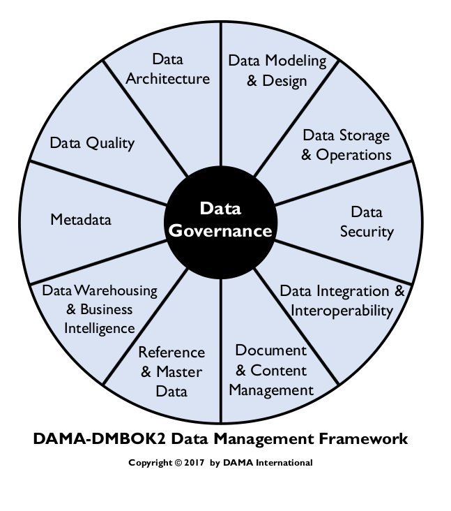
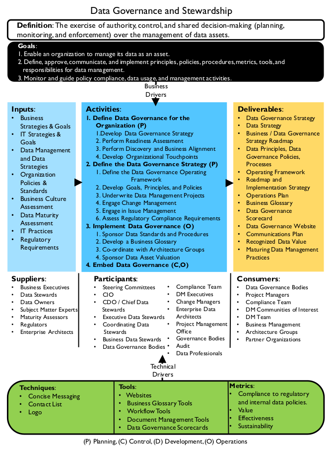
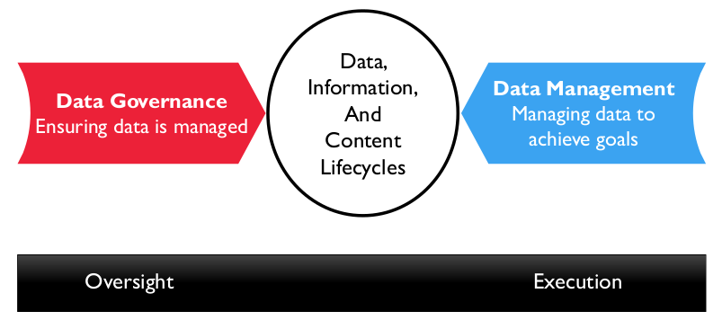
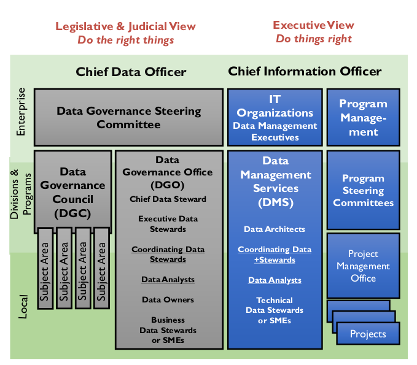
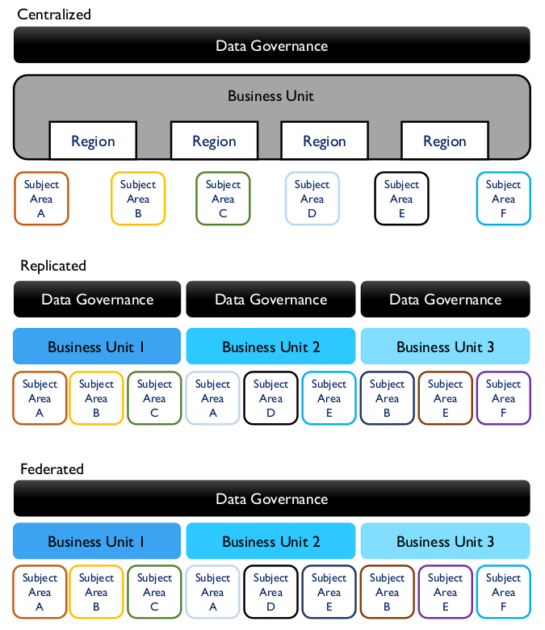
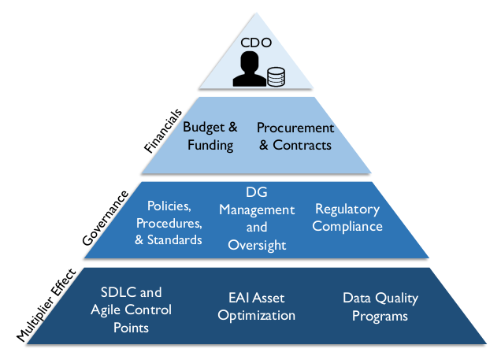
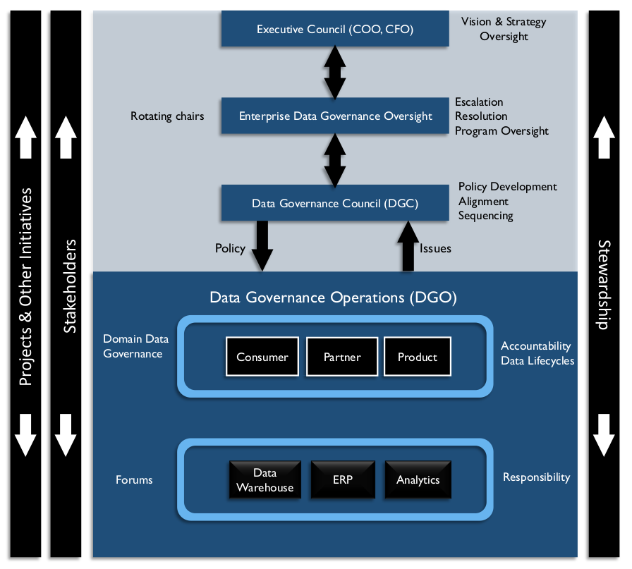
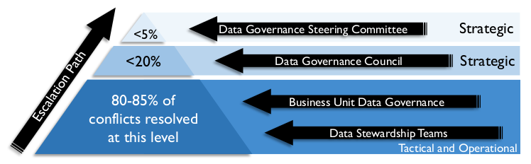

# Capítulo 3 - Governança de Dados

## 1. Introdução

Governança de Dados (GD) é definida como o exercício da autoridade e do controle (planejamento, monitoramento e execução) sobre o gerenciamento de ativos de dados. Todas as organizações tomam decisões sobre dados, independentemente de possuírem ou não uma função formal de Governança de Dados. Aquelas que estabelecem um programa formal de Governança de Dados exercem autoridade e controle com maior intencionalidade (Seiner, 2014). Essas organizações são mais capazes de aumentar o valor que obtêm de seus ativos de dados.

A função de Governança de Dados orienta todas as demais funções de gerenciamento de dados. O objetivo da GD é garantir que os dados sejam gerenciados adequadamente, em conformidade com as políticas e as melhores práticas (Ladley, 2012). Embora o principal motivador do gerenciamento de dados seja garantir que uma organização obtenha valor de seus dados, a GD se concentra em como as decisões são tomadas sobre os dados e como as pessoas e os processos devem se comportar em relação a eles. O escopo e o foco de um programa específico de governança de dados dependerão das necessidades da organização, mas a maioria dos programas inclui:

* **Estratégia:** Definir, comunicar e impulsionar a execução da Estratégia de Dados e da Estratégia de Governança de Dados.
* **Política:** Definir e aplicar políticas relacionadas ao gerenciamento, acesso, uso, segurança e qualidade de dados e metadados.
* **Padrões e Qualidade:** Definir e aplicar padrões de Qualidade e Arquitetura de Dados.
* **Supervisão:** Fornecer observação prática, auditoria e correção em áreas-chave de qualidade, política e gerenciamento de dados (frequentemente chamada de administração).
* **Conformidade:** Garantir que a organização possa atender aos requisitos de conformidade regulatória relacionados a dados.
* **Gerenciamento de Problemas:** Identificar, definir, escalar e resolver problemas relacionados à segurança de dados, acesso a dados, qualidade de dados, conformidade regulatória, propriedade de dados, política, padrões, terminologia ou procedimentos de governança de dados.
* **Projetos de Gerenciamento de Dados:** Patrocinar esforços para aprimorar as práticas de gerenciamento de dados.
* **Avaliação de Ativos de Dados:** Definir padrões e processos para definir consistentemente o valor comercial dos ativos de dados.

Para atingir esses objetivos, um programa de Governança de Dados desenvolverá políticas e procedimentos, cultivará práticas de administração de dados em vários níveis da organização e se envolverá em esforços de gestão de mudanças organizacionais que comuniquem ativamente à organização os benefícios de uma governança de dados aprimorada e os comportamentos necessários para gerenciar dados com sucesso como um ativo.

Para a maioria das organizações, a adoção formal da Governança de Dados requer o apoio da gestão de mudanças organizacionais (consulte o Capítulo 17) e o patrocínio de um executivo de nível C, como o Diretor de Riscos, o Diretor Financeiro ou o Diretor de Dados.

A capacidade de criar e compartilhar dados e informações transformou nossas interações pessoais e econômicas. As condições dinâmicas do mercado e a crescente conscientização sobre os dados como diferencial competitivo estão levando as organizações a realinhar suas responsabilidades de gestão de dados. Essa mudança é evidente nos setores financeiro, de comércio eletrônico, governamental e varejista. As organizações se esforçam cada vez mais para se tornarem orientadas por dados, considerando proativamente os requisitos de dados como parte do desenvolvimento de estratégias, planejamento de programas e implementação de tecnologia. No entanto, isso frequentemente acarreta desafios culturais significativos. Ademais, uma cultura inadequada pode inviabilizar qualquer estratégia, portanto, os esforços de Governança de Dados devem incluir um componente de mudança cultural – novamente, apoiados por uma liderança forte.

Para se beneficiar dos dados como um ativo corporativo, a cultura organizacional deve aprender a valorizar os dados e as atividades de gestão de dados. Mesmo com a melhor estratégia de dados, os planos de governança e gestão de dados não terão sucesso a menos que a organização aceite e gerencie as mudanças. Para muitas organizações, a mudança cultural representa um grande desafio. Um dos princípios fundamentais da gestão de mudanças é que a mudança organizacional requer mudança individual (Hiatt e Creasey, 2012). Quando a governança e a gestão de dados exigem mudanças comportamentais significativas, a gestão formal de mudanças é necessária para o sucesso.

### 1.1 Impulsionadores de Negócios

O principal motivador para a governança de dados costuma ser a conformidade regulatória, especialmente em setores altamente regulamentados, como serviços financeiros e saúde. Responder à legislação em evolução exige processos rigorosos de governança de dados. A crescente demanda por análises avançadas e Ciência de Dados também é um fator importante.

Embora a conformidade ou a análise de dados possam impulsionar a governança, muitas organizações retornam a ela através de um programa de gerenciamento de informações, motivado por outras necessidades de negócios, como o Gerenciamento de Dados Mestres (MDM), por grandes problemas de dados ou ambos. Um cenário comum: uma empresa necessita de dados de clientes melhores, opta por desenvolver o MDM de Clientes e, posteriormente, percebe que um MDM bem-sucedido demanda governança de dados.

A governança de dados não é um fim em si mesma; ela precisa estar diretamente alinhada com a estratégia organizacional. Quanto mais claramente ela contribui para a resolução de problemas organizacionais, maior a probabilidade de as pessoas mudarem seu comportamento e adotarem práticas de governança. Os impulsionadores da governança de dados geralmente se concentram na redução de riscos ou na melhoria de processos.

* Redução de Riscos
  * Gestão geral de riscos: Supervisão dos riscos que os dados representam para as finanças ou reputação, incluindo a resposta a questões legais (E-Discovery) e regulatórias.
  * Segurança de dados: Proteção dos ativos de dados por meio de controles de disponibilidade, usabilidade, integridade, consistência, auditabilidade e segurança dos dados.
  * Privacidade: Controle de Informações de Identificação Pessoal (PII) privadas/confidenciais por meio do monitoramento de políticas e conformidade.
* Aprimoramento de Processos
  * Conformidade regulatória: Capacidade de responder de forma eficiente e consistente aos requisitos regulatórios.
  * Melhoria da qualidade dos dados: Capacidade de contribuir para a melhoria do desempenho dos negócios, tornando os dados mais confiáveis.
  * Gestão de Metadados: Estabelecimento de um glossário de negócios para definir e localizar dados na organização; garantindo que a ampla gama de outros Metadados seja gerenciada e disponibilizada à organização.
  * Eficiência em projetos de desenvolvimento: Melhorias no SDLC para abordar problemas e oportunidades na gestão de dados em toda a organização, incluindo a gestão de dívida técnica específica de dados por meio da governança do ciclo de vida dos dados.
  * Gerenciamento de fornecedores: controle de contratos que lidam com dados, como armazenamento em nuvem, compra de dados externos, vendas de dados como produto e terceirização de operações de dados.

É essencial esclarecer os motivadores de negócios específicos para a governança de dados dentro de uma organização e alinhá-los com a estratégia geral de negócios. Concentrar-se na “organização da DG” frequentemente aliena a liderança, que percebe custos indiretos extras sem benefícios aparentes. A sensibilidade à cultura organizacional é necessária para determinar a linguagem, o modelo operacional e as funções adequadas para o programa. No momento da redação do DMBOK2, o termo “organização” estava sendo substituído por termos como “modelo operacional” ou “estrutura operacional”.

Embora algumas pessoas afirmem ser difícil entender o que é governança de dados, o conceito de governança de dados é, na verdade, comum. Em vez de inventar novas abordagens, os profissionais de gestão de dados podem aplicar os conceitos e princípios de outros tipos de governança à governança de dados. Uma analogia comum é equiparar a governança de dados à auditoria e à contabilidade. Auditores e controladores definem as regras para o gerenciamento de ativos financeiros. Profissionais de governança de dados definem regras para o gerenciamento de ativos de dados. Outras áreas implementam essas regras.

A governança de dados não é algo pontual. Governar dados requer um programa contínuo focado em garantir que uma organização obtenha valor de seus dados e reduza os riscos relacionados a eles. Uma equipe de Governança de Dados pode ser uma organização virtual ou uma organização de linha, com responsabilidades específicas. Para serem eficazes, as funções e atividades da governança de dados precisam ser bem compreendidas e construídas em torno de uma estrutura operacional que funcione bem na organização. Um programa de governança de dados deve levar em consideração questões organizacionais e culturais distintas, bem como os desafios e oportunidades específicos de gerenciamento de dados dentro da organização. (Consulte os Capítulos 1 e 16.)

A governança de dados é independente da governança de TI. A governança de TI toma decisões sobre investimentos em TI, o portfólio de aplicativos de TI e o portfólio de projetos de TI – em outras palavras, hardware, software e arquitetura técnica geral. A governança de TI alinha as estratégias e os investimentos de TI com as metas e estratégias da empresa. A estrutura COBIT (Control Objectives for Information and Related Technology) fornece padrões para governança de TI, mas apenas uma pequena parte da estrutura COBIT aborda o gerenciamento de dados e informações. Alguns tópicos críticos, como a conformidade com a Lei Sarbanes-Oxley (EUA), abrangem as preocupações de governança corporativa, governança de TI e governança de dados. Em contraste, a Governança de Dados concentra-se exclusivamente na gestão de ativos de dados e dos dados como um ativo.

### 1.2 Objetivos e Princípios

O objetivo da Governança de Dados é permitir que uma organização gerencie seus dados como um ativo. A Governança de Dados (GD) fornece princípios, políticas, processos, estrutura, métricas e supervisão para gerenciar dados como um ativo e orientar as atividades de gerenciamento de dados em todos os níveis. Para alcançar esse objetivo geral, um programa de GD deve ser:

* **Sustentável:** O programa de GD precisa ser persistente. A GD não é um projeto com um fim definido; é um processo contínuo que exige compromisso organizacional. A GD exige mudanças na forma como os dados são gerenciados e utilizados, o que nem sempre significa mudanças radicais ou a criação de novas organizações. Significa, sim, gerenciar a mudança de forma sustentável, além da implementação inicial de qualquer componente de governança de dados, dependendo do apoio da liderança, do patrocínio e da propriedade da empresa.
* **Incorporada:** A GD não é um processo adicional. As atividades da GD devem ser integradas aos métodos de desenvolvimento de software, ao uso de dados para análise, ao gerenciamento de Dados Mestres e ao gerenciamento de riscos.
* **Mensurável:** A GD bem-sucedida pode gerar impacto financeiro positivo, mas demonstrar esse impacto requer a compreensão do ponto de partida e o planejamento de melhorias mensuráveis.

Implementar um programa de GD exige comprometimento com a mudança. Os princípios a seguir, desenvolvidos desde os anos 2000, podem ajudar a estabelecer uma base sólida para a governança de dados[^26]:

* **Liderança e estratégia:** Uma Governança de Dados bem-sucedida começa com uma liderança visionária e comprometida. As atividades de gerenciamento de dados são guiadas por uma estratégia de dados que, por sua vez, é impulsionada pela estratégia de negócios da empresa.
* **Orientada pelos negócios:** A Governança de Dados é um programa de negócios e, como tal, deve governar as decisões de TI relacionadas aos dados tanto quanto governa a interação dos negócios com os dados.
* **Responsabilidade compartilhada:** Em todas as áreas de conhecimento de gerenciamento de dados, a governança de dados é uma responsabilidade compartilhada entre administradores de dados de negócios e profissionais técnicos de gerenciamento de dados.
* **Multicamadas:** A governança de dados ocorre tanto no nível empresarial quanto no local e, frequentemente, em níveis intermediários.
* **Baseada em estrutura:** Como as atividades de governança de dados exigem coordenação entre áreas funcionais, o programa de GD deve estabelecer uma estrutura operacional que defina responsabilidades e interações.
* **Baseada em princípios:** Os princípios norteadores são a base das atividades de GD, e especialmente de suas políticas.
* **Frequentemente, as organizações desenvolvem políticas sem princípios formais – elas estão tentando resolver problemas específicos**. Às vezes, os princípios podem ser revertidos a partir de políticas. No entanto, é melhor articular um conjunto central de princípios e melhores práticas como parte do trabalho com políticas. A referência a princípios pode mitigar possíveis resistências. Princípios norteadores adicionais surgirão ao longo do tempo dentro de uma organização. Publique-os em um ambiente interno compartilhado, juntamente com outros artefatos de governança de dados.

### 1.3 Conceitos Essenciais

Assim como um auditor controla os processos financeiros, mas não executa a gestão financeira, a governança de dados garante que os dados sejam gerenciados adequadamente, sem executar diretamente a gestão de dados (ver Figura 15). A governança de dados representa uma separação inerente entre supervisão e execução.

Figura 15 Governança e Gerenciamento de Dados

### 1.3.1 Organização Centrada em Dados

Uma organização centrada em dados valoriza os dados como um ativo e os gerencia em todas as fases do seu ciclo de vida, incluindo o desenvolvimento de projetos e as operações contínuas. Para se tornar centrada em dados, uma organização precisa repensar a forma como traduz a estratégia em ação. Os dados deixam de ser vistos como um subproduto de processos e aplicativos. Garantir a alta qualidade dos dados é uma meta fundamental dos processos de negócios. À medida que as organizações buscam tomar decisões com base em insights obtidos por meio de análises, o gerenciamento eficaz de dados se torna uma prioridade crítica.

As pessoas frequentemente confundem dados e tecnologia da informação. Para se tornarem centradas em dados, as organizações precisam adotar uma perspectiva diferente e reconhecer que gerenciar dados é distinto de gerenciar TI. Essa mudança não é trivial. A cultura existente, com suas políticas internas, ambiguidades sobre a propriedade dos dados, competição por recursos e sistemas legados, pode representar um obstáculo significativo para o estabelecimento de uma visão corporativa de governança e gerenciamento de dados.

Embora cada organização precise desenvolver seus próprios princípios, aquelas que buscam obter mais valor de seus dados provavelmente compartilham os seguintes elementos:

*   Os dados devem ser gerenciados como um ativo corporativo.
*   As melhores práticas de gerenciamento de dados devem ser incentivadas em toda a organização.
*   A estratégia de dados corporativos deve estar diretamente alinhada com a estratégia geral de negócios.
*   Os processos de gerenciamento de dados devem ser continuamente aprimorados.

### 1.3.2 Organização de Governança de Dados

A palavra-chave em governança é gerir. A governança de dados pode ser entendida em termos de gestão política. Inclui funções legislativas (definição de políticas, padrões e a Arquitetura de Dados Corporativos), judiciais (gerenciamento e resolução de problemas) e executivas (proteção e suporte, responsabilidades administrativas). Para melhor gerir riscos, a maioria das organizações adota uma forma representativa de governança de dados, para que todas as partes interessadas possam ser consideradas.

Cada organização deve adotar um modelo de governança que suporte sua estratégia de negócios e tenha probabilidade de sucesso em seu próprio contexto cultural. As organizações também devem estar preparadas para desenvolver esse modelo para enfrentar novos desafios. Os modelos diferem em relação à sua estrutura organizacional, nível de formalidade e abordagem para a tomada de decisões. Alguns modelos são centralizados, enquanto outros são descentralizados.

As organizações de governança de dados também podem ter múltiplas camadas para abordar preocupações em diferentes níveis dentro de uma empresa – local, divisional e corporativa. O trabalho de governança é frequentemente dividido entre vários comitês, cada um com um propósito e um nível de supervisão distintos.

A Figura 16 representa um modelo genérico de governança de dados, com atividades em diferentes níveis dentro da organização (eixo vertical), bem como a separação das responsabilidades de governança dentro das funções organizacionais e entre as áreas técnicas (TI) e de negócios. A Tabela 4 descreve os comitês típicos que podem ser estabelecidos dentro de uma estrutura operacional de governança de dados. Observe que este não é um organograma. O diagrama explica como as diversas áreas trabalham em conjunto para executar a GD, em linha com a tendência de reduzir a ênfase no termo "organização".

Figura 16 Partes da organização de governança de dados

Tabela 4 Comitês/Órgãos Típicos de Governança de Dados

| Órgão de Governança de Dados            | Descrição   |
|-----------------------------------------|-------------|
| Comitê Diretor de Governança de Dados   | A principal e mais alta autoridade em governança de dados em uma organização, responsável pela supervisão, suporte e financiamento das atividades de governança de dados. Consiste em um grupo multifuncional de executivos seniores. Normalmente, libera recursos para governança de dados e atividades patrocinadas pela governança de dados, conforme recomendado pelo DGC e pelo CDO. Este comitê pode, por sua vez, ter supervisão de comitês diretores de financiamento de nível superior ou baseados em iniciativas. |
| Conselho de Governança de Dados (DGC)   | Gerencia iniciativas de governança de dados (por exemplo, desenvolvimento de políticas ou métricas), problemas e escalonamentos. Consiste em executivos de acordo com o modelo operacional utilizado. Veja a Figura 17. |
| Escritório de Governança de Dados (DGO) | Foco contínuo em definições de dados de nível empresarial e padrões de gerenciamento de dados em todas as Áreas de Conhecimento do DAMA-DMBOK. Consiste em funções de coordenação, rotuladas como administradores ou custodiantes de dados, e proprietários de dados. |
| Equipes de Administração de Dados       | Comunidades de interesse focadas em uma ou mais áreas temáticas ou projetos específicos, colaborando ou consultando equipes de projeto sobre definições de dados e padrões de gerenciamento de dados relacionados ao foco. Consiste em administradores de dados técnicos e de negócios e analistas de dados. |
| Comitê Local de Governança de Dados     | Grandes organizações podem ter conselhos de governança de dados divisionais ou departamentais trabalhando sob os auspícios de um DGC Corporativo. Organizações menores devem tentar evitar tal complexidade. |

### 1.3.3 Tipos de Modelo Operacional de Governança de Dados

Em um modelo centralizado, uma organização de Governança de Dados supervisiona todas as atividades em todas as áreas temáticas. Em um modelo replicado, o mesmo modelo operacional e padrões de GD são adotados por cada unidade de negócios. Em um modelo federado, uma organização de Governança de Dados coordena-se com diversas Unidades de Negócios para garantir definições e padrões consistentes. (Consulte a Figura 17 e o Capítulo 16.)

Figura 17 Exemplos de Estrutura Operacional de GD Empresarial [^27]

### 1.3.4 Administração de Dados

Administração de Dados é o termo mais comum para descrever a responsabilidade pela gestão de dados e processos que garantem o controle e o uso eficaz dos ativos de dados. Essa gestão pode ser formalizada através de cargos e descrições, ou pode ser desempenhada de forma mais informal, por indivíduos que buscam auxiliar uma organização na extração de valor de seus dados. Frequentemente, termos como custodiante ou administrador são utilizados como sinônimos para aqueles que exercem funções semelhantes.

O foco das atividades de administração varia de organização para organização, dependendo da estratégia organizacional, da cultura, dos problemas que a organização busca resolver, do seu nível de maturidade em gerenciamento de dados e da formalidade do seu programa de administração. No entanto, em geral, as atividades de administração de dados se concentram em alguns, senão todos, dos seguintes aspectos:

* **Criação e gerenciamento de metadados essenciais:** Definição e gerenciamento de terminologia de negócios, valores de dados válidos e outros metadados críticos. Os administradores são frequentemente responsáveis pelo Glossário de Negócios de uma organização, que se torna o sistema de registro para termos de negócios relacionados a dados.
* **Documentação de regras e padrões:** Definição e documentação de regras de negócios, padrões de dados e regras de qualidade de dados. As expectativas para dados de alta qualidade geralmente são expressas em termos de regras enraizadas nos processos de negócios que criam ou utilizam os dados. Os administradores auxiliam na identificação e formalização dessas regras, garantindo o consenso organizacional e sua aplicação consistente.
* **Gerenciamento de problemas de qualidade de dados:** Os administradores estão frequentemente envolvidos na identificação e resolução de problemas relacionados a dados, ou na facilitação do processo de resolução.
* **Execução de atividades de governança de dados operacionais:** Os administradores são responsáveis por assegurar que, no dia a dia e em cada projeto, as políticas e iniciativas de governança de dados sejam cumpridas. Eles devem influenciar as decisões para garantir que os dados sejam gerenciados de forma a apoiar os objetivos gerais da organização.

### 1.3.5 Tipos de Administradores de Dados

Um administrador é uma pessoa cuja função é gerenciar a propriedade de outros. Administradores de Dados gerenciam ativos de dados em nome de terceiros e no melhor interesse da organização (McGilvray, 2008). Os Administradores de Dados representam os interesses de todas as partes interessadas e devem adotar uma perspectiva corporativa para garantir que os dados corporativos sejam de alta qualidade e possam ser utilizados de forma eficaz. Administradores de Dados eficazes são responsáveis pelas atividades de governança de dados e dedicam parte do seu tempo a essas atividades.

Dependendo da complexidade da organização e dos objetivos do seu programa de governança de dados (GD), Administradores de Dados formalmente nomeados podem ser diferenciados por sua posição na organização, pelo foco do seu trabalho ou por ambos. Por exemplo:

*   Administradores de Dados Chefe podem presidir órgãos de governança de dados em substituição ao Diretor de Governança de Dados (CDO) ou podem atuar como CDO em uma organização de governança de dados virtual (baseada em comitês) ou distribuída. Eles também podem ser Patrocinadores Executivos.
*   Administradores de Dados Executivos são gerentes seniores que atuam em um Conselho de Governança de Dados.
*   Administradores de Dados Corporativos supervisionam um domínio de dados em todas as funções de negócios.
*   Administradores de Dados Corporativos são profissionais de negócios, geralmente especialistas reconhecidos no assunto, responsáveis por um subconjunto de dados. Eles trabalham com as partes interessadas para definir e controlar os dados.
*   Um Proprietário de Dados é um Administrador de Dados corporativo, que tem autoridade de aprovação para decisões sobre dados dentro de seu domínio.
*   Administradores de Dados Técnicos são profissionais de TI que atuam em uma das Áreas de Conhecimento, como Especialistas em Integração de Dados, Administradores de Banco de Dados, Especialistas em Business Intelligence, Analistas de Qualidade de Dados ou Administradores de Metadados.
*   Administradores de Dados Coordenadores lideram e representam equipes de Administradores de Dados corporativos e técnicos em discussões entre equipes e com Administradores de Dados executivos. Administradores de Dados Coordenadores são particularmente importantes em grandes organizações.

A primeira edição do DAMA-DMBOK afirmou que “os melhores Administradores de Dados são frequentemente encontrados, não criados” (DAMA, 2009). Essa afirmação reconhece que, na maioria das organizações, existem pessoas que administram os dados, mesmo na ausência de um programa formal de governança de dados. Essas pessoas já estão envolvidas em ajudar a organização a reduzir os riscos relacionados aos dados e a obter mais valor deles. Formalizar suas responsabilidades de administração reconhece o trabalho que estão realizando e permite que sejam mais bem-sucedidos e contribuam mais. Dito isso, é possível "formar" Administradores de Dados; pessoas podem ser treinadas para serem Administradores de Dados. E as pessoas que já administram os dados podem desenvolver suas habilidades e conhecimentos para se tornarem melhores no trabalho de administração (Plotkin, 2014).

### 1.3.6 Políticas de Dados

As políticas de dados são diretrizes que codificam princípios e intenções de gestão em regras que regem a criação, aquisição, integridade, segurança, qualidade e uso de dados e informações.

As políticas de dados são globais e apoiam os padrões de dados, bem como os comportamentos esperados relacionados aos principais aspectos do gerenciamento e uso de dados. No entanto, variam amplamente entre as organizações. As políticas de dados descrevem o “o quê” da governança de dados (o que fazer e o que não fazer), enquanto os padrões e procedimentos descrevem “como” implementar a governança de dados. É recomendável que existam relativamente poucas políticas de dados, e que estas sejam declaradas de forma breve e direta.

### 1.3.7 Avaliação de Ativos de Dados

A avaliação de ativos de dados é o processo de compreender e calcular o valor econômico dos dados para uma organização. Dado que dados, informações e até mesmo Business Intelligence são conceitos abstratos, as pessoas frequentemente têm dificuldade em alinhá-los ao seu impacto econômico. A chave para compreender o valor de um item não fungível – como dados – é entender como ele é utilizado e o valor agregado por seu uso (Redman, 1996). Ao contrário de muitos outros ativos (por exemplo, dinheiro, equipamentos físicos), os conjuntos de dados não são intercambiáveis (fungíveis). Os dados dos clientes de uma organização diferem dos de outras em aspectos importantes; não apenas os clientes, mas também os dados associados a eles (histórico de compras, preferências, etc.). A maneira como uma organização obtém valor dos dados dos clientes (ou seja, o que aprende sobre seus clientes a partir desses dados e como aplica o que aprende) pode ser um diferencial competitivo.

A maioria das fases do ciclo de vida dos dados envolve custos (incluindo aquisição, armazenamento, administração e descarte de dados). Os dados só agregam valor quando são utilizados. Quando utilizados, os dados também geram custos relacionados à gestão de riscos. Portanto, o valor surge quando o benefício econômico do uso de dados supera os custos de aquisição e armazenamento, bem como o gerenciamento de riscos relacionados ao seu uso.

Algumas outras maneiras de mensurar o valor incluem:

* Custo de substituição: O custo de substituição ou recuperação de dados perdidos em um desastre ou violação de dados, incluindo transações, domínios, catálogos, documentos e métricas dentro de uma organização.
* Valor de mercado: O valor como ativo comercial no momento de uma fusão ou aquisição.
* Oportunidades identificadas: O valor da receita que pode ser obtida com oportunidades identificadas nos dados (em Business Intelligence), usando os dados para transações ou vendendo os dados.
* Venda de dados: Algumas organizações empacotam dados como um produto ou vendem insights obtidos a partir de seus dados.
* Custo de risco: Uma avaliação baseada em potenciais penalidades, custos de remediação e despesas com litígios, derivados de riscos legais ou regulatórios de:
  * Ausência de dados que são obrigatórios.
  * Presença de dados que não deveriam estar presentes (por exemplo, dados inesperados encontrados durante a descoberta legal; dados que deveriam ser eliminados, mas não foram).
  * Dados incorretos, causando danos aos clientes, às finanças da empresa e à reputação, além dos custos mencionados acima.
  * A redução do risco e do custo do risco é compensada pelos custos de intervenção operacional para aprimorar e certificar os dados.

Para descrever o conceito de valor de ativos de informação, pode-se traduzir os Princípios Contábeis Geralmente Aceitos em Princípios de Informação Geralmente Aceitos[^28] (ver Tabela 5).

Tabela 5 Princípios para Contabilidade de Ativos de Dados

| Princípio                             | Descrição   |
|---------------------------------------|-------------|
| Princípio da Responsabilidade         | Uma organização deve identificar os indivíduos que são, em última análise, responsáveis ​​por dados e conteúdo de todos os tipos. |
| Princípio dos Ativos                  | Dados e conteúdo de todos os tipos são ativos e possuem características de outros ativos. Eles devem ser gerenciados, protegidos e contabilizados como outros ativos materiais ou financeiros. |
| Princípio da Auditoria                | A precisão dos dados e do conteúdo está sujeita a auditoria periódica por um órgão independente. |
| Princípio da *Due Diligence*          | Se um risco for conhecido, ele deve ser relatado. Se um risco for possível, ele deve ser confirmado. Riscos de dados incluem riscos relacionados a práticas inadequadas de gerenciamento de dados. |
| Princípio da Continuidade Operacional | Dados e conteúdo são essenciais para o sucesso das operações e da gestão empresarial contínua (ou seja, não são vistos como meios temporários para alcançar resultados ou meramente como um subproduto do negócio). |
| Princípio do Nível de Valoração       | Valorize os dados como um ativo em um nível que faça mais sentido ou seja o mais fácil de mensurar. |
| Princípio da Responsabilidade         | Existe uma responsabilidade financeira associada a dados ou conteúdo com base no uso indevido ou na má gestão regulatória e ética. |
| Princípio da Qualidade                | O significado, a precisão e o ciclo de vida dos dados e do conteúdo podem afetar a situação financeira da organização. |
| Princípio do Risco                    | Existe um risco associado a dados e conteúdo. Esse risco deve ser formalmente reconhecido, seja como um passivo ou por meio da incorreção de custos para gerenciar e reduzir o risco inerente. |
| Princípio do Valor                    | Há valor em dados e conteúdo, com base nas maneiras como são usados ​​para atingir os objetivos de uma organização, sua comercialização intrínseca e/ou sua contribuição para a avaliação do goodwill (balanço patrimonial) da organização. O valor da informação reflete sua contribuição para a organização, compensada pelo custo de manutenção e movimentação. |

## 2. Atividades

### 2.1 Definir a Governança de Dados para a Organização

Os esforços de Governança de Dados devem apoiar a estratégia e os objetivos de negócios. A estratégia e os objetivos de negócios de uma organização influenciam tanto a estratégia de dados corporativos quanto a forma como as atividades de governança e gerenciamento de dados devem ser operacionalizadas.

A governança de dados promove a responsabilidade compartilhada em relação às decisões relacionadas a dados. As atividades de governança de dados transcendem as fronteiras organizacionais e de sistemas, em apoio a uma visão integrada dos dados. Uma governança de dados bem-sucedida requer uma compreensão clara do que está sendo governado, de quem está sendo governado e de quem está governando.

A governança de dados é mais eficaz quando é um esforço corporativo, e não restrito a uma área funcional específica. Definir o escopo da governança de dados em uma empresa geralmente envolve definir o que significa "empresa", sendo a governança de dados responsável por essa empresa definida.

### 2.2 Realizar Avaliação de Prontidão

Avaliações que descrevem o estado atual das capacidades, maturidade e eficácia da gestão de informações de uma organização são cruciais para o planejamento de um programa de Governança de Dados (GD). Essas avaliações podem ser usadas para medir a eficácia de um programa e também são valiosas na gestão e sustentação desse programa.

Avaliações típicas incluem:

* **Maturidade em Governança de Dados:** Esta avaliação busca entender o que a organização faz com os dados, mensurando suas capacidades e níveis atuais de Governança de Dados. O foco reside nas percepções dos executivos sobre a gestão e o uso dos dados em benefício da empresa, bem como em critérios objetivos, como o uso de ferramentas e níveis de relatórios. (Ver Capítulo 15.)
* **Capacidade de Mudança:** Dada a necessidade de mudança comportamental inerente à Governança de Dados, é importante mensurar a capacidade da organização de alterar os comportamentos necessários para a adaptação. Essa avaliação também auxilia na identificação de potenciais resistências. Frequentemente, a implementação da Governança de Dados requer uma gestão formal de mudanças organizacionais. Ao avaliar a capacidade de mudança, o processo de gestão de mudanças examinará a estrutura organizacional existente, as percepções da cultura e o próprio processo de gestão de mudanças (Hiatt e Creasey, 2012). (Ver Capítulo 17.)
* **Prontidão Colaborativa:** Esta avaliação caracteriza a capacidade da organização de colaborar na gestão e no uso de dados. Considerando que a Governança de Dados, por definição, atravessa áreas funcionais, ela é intrinsecamente colaborativa. Não se presume que uma organização já domine a colaboração. Quando realizada em conjunto com a capacidade de mudança, esta avaliação oferece insights sobre a capacidade cultural para implementar a Governança de Dados.
* **Alinhamento aos Negócios:** Às vezes, incluída com a avaliação de capacidade de mudança, esta avaliação examina o quão bem a organização alinha os usos de dados com a estratégia de negócios. Frequentemente, é surpreendente descobrir o quão ad hoc podem ser as atividades relacionadas a dados.

### 2.3 Realizar Descoberta e Alinhamento aos Negócios

Um programa de Governança de Dados (GD) deve contribuir para a organização identificando e entregando benefícios específicos – por exemplo, reduzir multas pagas a órgãos reguladores. A atividade de descoberta identificará e avaliará a eficácia das políticas e diretrizes existentes: quais riscos elas abordam, quais comportamentos incentivam e em que medida foram implementadas. A descoberta também pode identificar oportunidades para a GD melhorar a utilidade dos dados e do conteúdo. O alinhamento aos negócios atribui benefícios aos elementos do programa de GD.

A análise da Qualidade de Dados (QD) faz parte da descoberta. A avaliação da Qualidade de Dados (DQ) fornecerá insights sobre problemas e obstáculos existentes, bem como o impacto e os riscos associados a dados de baixa qualidade. A avaliação da Qualidade de Dados (DQ) pode identificar processos de negócios que correm risco se executados com dados de baixa qualidade, além de apresentar os benefícios financeiros e outros da criação de um programa de Qualidade de Dados como parte dos esforços de governança de dados. (Consulte o Capítulo 13.)

A avaliação das práticas de gerenciamento de dados é outro aspecto fundamental do processo de descoberta da governança de dados. Por exemplo, isso pode significar identificar usuários-chave para criar uma lista inicial de potenciais agentes para a atividade contínua da GD.

É possível derivar uma lista de requisitos da GD a partir das atividades de descoberta e alinhamento. Por exemplo, se os riscos regulatórios gerarem uma preocupação financeira para o negócio, especifique as atividades da GD que apoiam a gestão de riscos. Esses requisitos orientarão a estratégia e as táticas da GD.

### 2.4 Desenvolver Pontos de Contato Organizacionais

Parte do alinhamento inclui o desenvolvimento de pontos de contato organizacionais para o trabalho de Governança de Dados. A Figura 18 ilustra exemplos de pontos de contato que apoiam o alinhamento e a coesão de uma abordagem de governança e gerenciamento de dados corporativos em áreas fora da autoridade direta do Diretor de Dados.

* **Aquisição e Contratos:** O CDO trabalha com a Gerência de Fornecedores/Parceiros ou com o Departamento de Aquisição para desenvolver e aplicar a linguagem contratual padrão em relação aos contratos de gerenciamento de dados. Isso pode incluir aquisições de Dados como Serviço (DaaS) e relacionadas à nuvem, outros acordos de terceirização, esforços de desenvolvimento de terceiros ou acordos de aquisição/licenciamento de conteúdo, e possivelmente, aquisições e atualizações de ferramentas de TI centradas em dados.
* **Orçamento e Financiamento:** Se o CDO não estiver diretamente no controle de todos os orçamentos relacionados à aquisição de dados, o escritório pode ser um ponto focal para evitar esforços duplicados e garantir a otimização dos ativos de dados adquiridos.
* **Conformidade Regulatória:** O CDO entende e trabalha dentro dos ambientes regulatórios locais, nacionais e internacionais exigidos e como estes impactam a organização e suas atividades de gerenciamento de dados. O monitoramento contínuo é realizado para identificar e rastrear impactos e requisitos novos e potenciais.
* **SDLC / Estrutura de Desenvolvimento:** O programa de governança de dados identifica pontos de controle onde políticas, processos e padrões corporativos podem ser desenvolvidos nos ciclos de vida de desenvolvimento de sistemas ou aplicativos.

Os pontos de contato que o CDO influencia apoiam a coesão da organização no gerenciamento de seus dados, aumentando, portanto, sua agilidade no uso dos dados. Em essência, esta é uma visão de como a GD será percebida pela organização.

Figura 18 Pontos de Contato Organizacionais do CDO

### 2.5 Desenvolver a Estratégia de Governança de Dados

Uma estratégia de governança de dados define o escopo e a abordagem para os esforços de governança. A estratégia de GD deve ser definida de forma abrangente e articulada em relação à estratégia geral de negócios, bem como às estratégias de gerenciamento de dados e de TI. Sua implementação deve ser iterativa, acompanhando o desenvolvimento e a aprovação das peças. O conteúdo específico será adaptado a cada organização, mas os resultados incluem:

* **Estatuto:** Identifica os impulsionadores de negócios, a visão, a missão e os princípios para a governança de dados, incluindo a avaliação de prontidão, a descoberta de processos internos e a identificação de problemas ou critérios de sucesso.
* **Estrutura operacional e responsabilidades:** Define a estrutura e a responsabilidade pelas atividades de governança de dados.
* **Roteiro de implementação:** Cronogramas para a implementação de políticas e diretrizes, glossário de negócios, arquitetura, avaliação de ativos, padrões e procedimentos, as mudanças esperadas nos processos de negócios e tecnologia, e os resultados para apoiar atividades de auditoria e conformidade regulatória.
* **Plano para o sucesso operacional:** Descreve um estado-alvo para atividades sustentáveis de governança de dados.

### 2.6 Definir a Estrutura Operacional da GD

Embora seja fácil desenvolver uma definição básica de Governança de Dados (GD), criar um modelo operacional que uma organização adote pode ser desafiador. Ao construir esse modelo, considere as seguintes áreas:

* **Valor dos Dados para a Organização:** Se a organização vende dados, a GD terá um impacto significativo nos negócios. Organizações que utilizam dados como uma mercadoria fundamental (por exemplo, Facebook, Amazon) precisarão de um modelo operacional que reflita o papel dos dados. Para organizações onde os dados são um lubrificante operacional, a abordagem da GD será menos intensa.
* **Modelo de Negócios:** Fatores como negócios descentralizados versus centralizados, presença local versus internacional, influenciam a forma como os negócios operam e, consequentemente, o modelo operacional da GD. É crucial que os vínculos com a estratégia específica de TI, a Arquitetura de Dados e as funções de integração de aplicativos sejam considerados no design da estrutura operacional alvo (conforme Figura 16).
* **Fatores Culturais:** A aceitação da disciplina e a adaptabilidade à mudança são fatores importantes. Algumas organizações resistirão à imposição de governança baseada em políticas e princípios. A estratégia de governança deve defender um modelo operacional que se adapte à cultura organizacional, ao mesmo tempo em que promove a mudança.
* **Impacto da Regulamentação:** Organizações altamente regulamentadas terão uma mentalidade e um modelo operacional de GD distintos daqueles menos regulamentados. Pode haver vínculos com o grupo de Gestão de Riscos ou com o Jurídico.

Os níveis de governança de dados frequentemente fazem parte da solução. Isso significa determinar onde a responsabilidade pelas atividades de administração deve residir, quem é o proprietário dos dados, etc. O modelo operacional também define a interação entre a organização de governança e as pessoas responsáveis por projetos ou iniciativas de gestão de dados, o engajamento das atividades de gestão de mudanças para implementar esse novo programa e o modelo para os caminhos de resolução de problemas por meio da governança. A Figura 19 mostra um exemplo de estrutura operacional. O exemplo é ilustrativo e deve ser personalizado para atender às necessidades específicas de cada organização.

Figura 19: Exemplo de uma Estrutura Operacional

### 2.7 Desenvolver Metas, Princípios e Políticas

O desenvolvimento de metas, princípios e políticas derivados da Estratégia de Governança de Dados guiará a organização em direção ao estado futuro desejado.

Metas, princípios e políticas são normalmente elaborados por profissionais de gestão de dados, pela equipe de políticas de negócios ou em conjunto, sob a égide da governança de dados. Em seguida, os Administradores de Dados e a gerência os revisam e aprimoram. Posteriormente, o Conselho de Governança de Dados (ou órgão similar) conduz a revisão final, a validação e a adoção.

As políticas podem assumir diferentes formatos, como nos exemplos a seguir:

*   O Escritório de Governança de Dados (DGO) certificará os dados para uso pela organização.
*   Os proprietários de negócios serão aprovados pelo Escritório de Governança de Dados.
*   Os proprietários de negócios designarão Administradores de Dados de suas áreas de competência de negócios. Estes, por sua vez, terão a responsabilidade de coordenar as atividades de governança de dados.
*   Sempre que possível, relatórios padronizados e/ou painéis/scorecards serão disponibilizados para atender à maioria das necessidades do negócio.
*   Usuários Certificados terão acesso aos Dados Certificados para relatórios ad hoc/não padronizados.
*   Todos os dados certificados serão avaliados regularmente para verificar sua precisão, integralidade, consistência, acessibilidade, exclusividade, conformidade e eficiência.

As políticas de dados devem ser comunicadas, monitoradas, aplicadas e reavaliadas periodicamente de forma eficaz. O Conselho de Governança de Dados poderá delegar essa autoridade ao Comitê Diretor de Administração de Dados.

### 2.8 Subscrever Projetos de Gestão de Dados

Iniciativas para aprimorar os recursos de gestão de dados proporcionam benefícios para toda a empresa. Geralmente, exigem patrocínio multifuncional ou visibilidade do Diretor de Gestão de Dados (DGC). Podem ser difíceis de implementar, pois podem ser percebidas como obstáculos à execução das atividades cotidianas. A chave para promovê-las é articular como elas melhoram a eficiência e reduzem os riscos. Organizações que buscam obter mais valor de seus dados precisam priorizar o desenvolvimento ou o aprimoramento de seus recursos de gestão de dados.

O DGC ajuda a definir o business case e supervisiona o status e o progresso dos projetos de melhoria da gestão de dados. Ele coordena seus esforços com um Escritório de Gestão de Projetos (PMO), sempre que houver. Projetos de gestão de dados podem ser considerados parte do portfólio geral de projetos de TI.

O DGC também pode coordenar esforços de melhoria da gestão de dados com grandes programas de escopo corporativo. Projetos de Gestão de Dados Mestres, como Planejamento de Recursos Empresariais (ERP), Gestão de Relacionamento com Clientes ou Cidadãos (CRM) e listas globais de peças, são bons candidatos para essa coordenação.

A atividade de gerenciamento de dados em outros projetos deve ser integrada pelo SDLC interno, gerenciamento de entrega de serviços, outros componentes da Biblioteca de Infraestrutura de Tecnologia da Informação (ITIL) e processos do PMO.  Todo projeto com um componente de dados significativo (e quase todos os projetos incluem esse elemento) deve capturar os requisitos de gerenciamento de dados logo no início do SDLC (fases de planejamento e design). Estes incluem arquitetura, conformidade regulatória, identificação e análise do sistema de registro e inspeção e remediação da qualidade dos dados. Além disso, podem existir atividades de suporte ao gerenciamento de dados, incluindo testes de verificação de requisitos utilizando bancos de testes padrão.

### 2.9 Engajar a Gestão da Mudança

A Gestão da Mudança Organizacional (GMO) é o instrumento para promover mudanças nos sistemas e processos de uma organização. O Change Management Institute defende que a gestão da mudança organizacional é mais do que apenas o “lado humano dos projetos”. Deve ser vista como a abordagem que toda a organização utiliza para gerenciar bem as mudanças. As organizações frequentemente gerenciam as transições de projetos em vez da evolução da organização (Anderson e Ackerson, 2012). Uma organização madura na gestão da mudança constrói uma visão organizacional clara, lidera e monitora ativamente as mudanças a partir da alta administração e projeta e gerencia esforços menores de mudança. Ela adapta iniciativas de mudança com base no feedback e na colaboração de toda a organização (Change Management Institute, 2012). (Ver Capítulo 17.)

Para muitas organizações, a formalidade e a disciplina inerentes à GMO diferem das práticas existentes. Adotá-las exige que as pessoas mudem seus comportamentos e interações. Um programa formal de GMO, com o patrocinador executivo adequado, é fundamental para impulsionar as mudanças comportamentais necessárias para sustentar a GMO. As organizações devem criar uma equipe responsável por:

* **Planejamento:** Planejar a gestão de mudanças, incluindo a realização de análises de stakeholders, a busca por patrocínio e o estabelecimento de uma abordagem de comunicação para superar a resistência à mudança.
* **Treinamento:** Desenvolver e executar planos de treinamento para programas de governança de dados.
* **Influenciar o Desenvolvimento de Sistemas:** Engajar-se com o PMO para incorporar etapas de governança de dados ao SDLC.
* **Implementação de Políticas:** Comunicar as políticas de dados e o compromisso da organização com as atividades de gestão de dados.
* **Comunicações:** Aumentar a conscientização sobre o papel e as responsabilidades dos Administradores de Dados e outros profissionais de governança de dados, bem como os objetivos e expectativas para projetos de gestão de dados.

A comunicação é fundamental para o processo de gestão de mudanças. Um programa de gestão de mudanças que apoie a Governança de Dados formal deve focar a comunicação em:

* Promover o valor dos ativos de dados: Educar e informar os funcionários sobre o papel que os dados desempenham no alcance das metas organizacionais.
* Monitorar e agir com base no feedback sobre as atividades de governança de dados: Além de compartilhar informações, os planos de comunicação devem gerar feedback que possa orientar tanto o programa de GD quanto o processo de gestão de mudanças. Buscar e utilizar ativamente as contribuições das partes interessadas pode gerar comprometimento com os objetivos do programa, além de identificar sucessos e oportunidades de melhoria.
* Implementação de treinamento em gestão de dados: Treinamentos em todos os níveis da organização aumentam a conscientização sobre as melhores práticas e processos de gestão de dados.
* Mensuração dos efeitos da gestão de mudanças em cinco áreas principais:
  * Consciência da necessidade de mudança
  * Desejo de participar e apoiar a mudança
  * Conhecimento sobre como mudar
  * Capacidade de implementar novas habilidades e comportamentos
  * Reforço para manter a mudança em vigor
* Implementação de novas métricas e KPIs: Os incentivos aos funcionários devem ser realinhados para apoiar comportamentos relacionados às melhores práticas de gestão de dados. Como a governança de dados corporativos exige cooperação interfuncional, os incentivos devem incentivar atividades e colaboração entre unidades.

### 2.10 Engajar-se na Gestão de Problemas

Gerenciamento de problemas é o processo de identificação, quantificação, priorização e resolução de problemas relacionados à governança de dados, que incluem:

* **Autoridade:** Dúvidas sobre direitos e procedimentos de decisão.
* **Escalações de gerenciamento de mudanças:** Problemas decorrentes do processo de gerenciamento de mudanças.
* **Conformidade:** Problemas com o cumprimento dos requisitos de conformidade.
* **Conflitos:** Políticas, procedimentos, regras de negócios, nomes, definições, padrões, arquitetura, propriedade de dados e interesses conflitantes de partes interessadas em dados e informações.
* **Conformidade:** Problema relacionado ao cumprimento de políticas, padrões, arquitetura e procedimentos.
* **Contratos:** Negociação e revisão de acordos de compartilhamento de dados, compra e venda de dados e armazenamento em nuvem.
* **Segurança e identidade de dados:** Problemas de privacidade e confidencialidade, incluindo investigações de violações.
* **Qualidade de dados:** Detecção e resolução de problemas de qualidade de dados, incluindo desastres ou violações de segurança.

Muitos problemas podem ser resolvidos localmente nas equipes de Administração de Dados. Problemas que exigem comunicação e/ou escalonamento devem ser registrados e podem ser escalonados para as equipes de Administração de Dados ou, em níveis superiores, para o DGC, conforme mostrado na Figura 20. Um Scorecard de Governança de Dados pode ser utilizado para identificar tendências relacionadas a problemas, como sua ocorrência dentro da organização e suas causas raízes. Problemas que não podem ser resolvidos pelo DGC devem ser escalonados para a governança corporativa e/ou gerência.

Figura 20 Caminho de Escalonamento de Problemas de Dados

A governança de dados requer mecanismos e procedimentos de controle para:

* Identificar, capturar, registrar, rastrear e atualizar problemas
* Atribuir e rastrear itens de ação
* Documentar os pontos de vista das partes interessadas e alternativas de resolução
* Determinar, documentar e comunicar as resoluções de problemas
* Facilitar discussões objetivas e neutras, onde todos os pontos de vista são ouvidos
* Escalar problemas para níveis mais altos de autoridade

O gerenciamento de problemas de dados é de grande importância. Isso confere credibilidade à equipe de GD, produz efeitos diretos e positivos sobre os consumidores de dados e alivia a carga sobre as equipes de suporte à produção. A resolução de problemas também comprova que os dados podem ser gerenciados e sua qualidade pode ser aprimorada. Um gerenciamento bem-sucedido de problemas requer mecanismos de controle que demonstrem o esforço de trabalho e o impacto da resolução.

### 2.11 Avaliar os Requisitos de Conformidade Regulatória

Todas as empresas são afetadas por regulamentações governamentais e setoriais, incluindo aquelas que determinam o gerenciamento de dados e informações. Uma parte da função de governança de dados é monitorar e garantir a conformidade regulatória. Essa conformidade frequentemente impulsiona a implementação da governança de dados, que orienta a adoção de controles adequados para monitorar e documentar a conformidade com as regulamentações relacionadas a dados.

Diversas regulamentações globais têm implicações significativas nas práticas de gerenciamento de dados, como:

* **Normas Contábeis:** As normas do Conselho de Normas Contábeis Governamentais (GASB) e do Conselho de Normas Contábeis Financeiras (FASB) também influenciam o gerenciamento de ativos de informação (nos EUA).
* **BCBS 239 e Basileia II:** Esses documentos se referem aos Princípios para Agregação Eficaz de Dados de Risco e Relatórios de Risco, um amplo conjunto de regulamentações para bancos. Desde 2006, instituições financeiras que operam na União Europeia são obrigadas a reportar informações padronizadas que comprovam sua liquidez.
* **CPG 235:** A Autoridade Australiana de Regulação Prudencial (APRA) supervisiona entidades bancárias e de seguros, publicando normas e guias para auxiliar no cumprimento delas. A CPG 235 é uma norma para gerenciamento de risco de dados, focada em identificar e gerenciar as fontes de risco de dados ao longo de seu ciclo de vida.
* **PCI-DSS:** Padrões de Segurança de Dados do Setor de Cartões de Pagamento.
* **Solvência II:** Regulamentações da União Europeia, semelhantes a Basileia II, para o setor de seguros.
* **Leis de privacidade:** Aplicam-se leis locais, soberanas e internacionais.

Organizações de governança de dados trabalham em colaboração com outras lideranças empresariais e técnicas para avaliar as implicações das regulamentações. A organização deve determinar, por exemplo:

* Qual a relevância da regulamentação para a organização?
* O que constitui conformidade e quais políticas e procedimentos são necessários para alcançá-la?
* Quando a conformidade é exigida e como e quando ela é monitorada?
* A organização pode adotar padrões do setor para atingir a conformidade?
* Como a conformidade é demonstrada?
* Qual é o risco e a penalidade pela não conformidade?
* Como a não conformidade é identificada, reportada e gerenciada?

A DG monitora a resposta da organização aos requisitos regulatórios ou às auditorias envolvendo dados e práticas de dados (por exemplo, certificando a qualidade dos dados em relatórios regulatórios). (Consulte o Capítulo 6.)

### 2.12 Implementar a Governança de Dados

A governança de dados não pode ser implementada de forma imediata. Ela exige planejamento – não apenas para considerar as mudanças organizacionais, mas também porque engloba diversas atividades complexas que necessitam de coordenação. É recomendável criar um roteiro de implementação que demonstre os prazos e a relação entre as diferentes atividades. Por exemplo, se o programa de GD estiver focado em aprimorar a conformidade, as prioridades podem ser definidas por requisitos regulatórios específicos. Em uma organização de GD federada, a implementação em diversas linhas de negócios pode ocorrer em cronogramas distintos, com base em seu nível de engajamento e maturidade, bem como no orçamento disponível.

Alguns trabalhos de GD são cruciais. Outros dependem deles. Essa iniciativa tem um lançamento inicial e um desenvolvimento contínuo. As atividades prioritárias nos estágios iniciais incluem:

*   Definir os procedimentos de governança de dados necessários para atingir metas de alta prioridade
*   Estabelecer um glossário de negócios e documentar a terminologia e os padrões
*   Coordenar com a Arquitetura Corporativa e a Arquitetura de Dados para promover uma melhor compreensão dos dados e dos sistemas
*   Atribuir valor financeiro aos ativos de dados para viabilizar uma tomada de decisões mais informada e aumentar a compreensão do papel que os dados desempenham no sucesso organizacional.

### 2.13 Padrões e Procedimentos de Dados do Patrocinador

Um padrão é definido como “algo que é considerado muito bom e que serve como referência para julgar a qualidade de outras coisas” ou como “algo estabelecido e formalizado por uma autoridade, utilizado como critério para medir quantidade, peso, extensão, valor ou qualidade”. 31 Os padrões ajudam a definir qualidade porque fornecem um meio de comparação. Eles também oferecem o potencial de simplificar processos. Ao adotar um padrão, uma organização toma uma decisão uma vez e a codifica em um conjunto de afirmações (o padrão), evitando a necessidade de repetir a mesma decisão em projetos subsequentes. A aplicação de padrões deve promover resultados consistentes nos processos que os utilizam.

Infelizmente, a criação ou a adoção de padrões costuma ser um processo politizado, o que pode levar à perda de objetivos. Muitas organizações carecem de experiência no desenvolvimento e na aplicação de padrões de dados ou de governança de dados. Em alguns casos, elas não reconheceram o valor de fazê-lo, e, portanto, não dedicaram tempo para isso. Em outros casos, simplesmente não sabem como. Consequentemente, os "padrões" variam amplamente dentro e entre as organizações, assim como as expectativas de conformidade. Os padrões de GD devem ser obrigatórios.

Os padrões de dados podem assumir diferentes formas, dependendo do que descrevem: afirmações sobre como um campo deve ser preenchido, regras que regem os relacionamentos entre campos, documentação detalhada de valores aceitáveis ​​e inaceitáveis, formato, etc. Geralmente, são elaborados por profissionais de gerenciamento de dados. Os padrões de dados devem ser revisados, aprovados e adotados pelo GCD ou por um grupo de trabalho delegado, como um Comitê Diretor de Padrões de Dados. O nível de detalhamento na documentação dos padrões de dados depende, em parte, da cultura organizacional. Lembre-se de que documentar padrões de dados representa uma oportunidade de capturar detalhes e conhecimento que, de outra forma, poderiam ser perdidos. Recriar ou fazer engenharia reversa para acessar esse conhecimento é muito caro, em comparação com documentá-lo antecipadamente.

Os padrões de dados devem ser comunicados, monitorados e revisados ​​e atualizados periodicamente de forma eficaz. Mais importante ainda, deve haver um mecanismo para aplicá-los. Os dados podem ser medidos em relação aos padrões. As atividades de gerenciamento de dados podem ser auditadas quanto à conformidade com os padrões pelo DGC ou pelo Comitê Diretor de Padrões de Dados, em um cronograma definido ou como parte dos processos de aprovação do SDLC.

Procedimentos de gerenciamento de dados são os métodos, técnicas e etapas documentados seguidos para realizar atividades específicas que produzem determinados resultados e artefatos de suporte. Assim como políticas e padrões, os procedimentos variam amplamente entre as organizações. Assim como acontece com os padrões de dados, os documentos de procedimentos capturam o conhecimento organizacional de forma explícita. A documentação de procedimentos geralmente é elaborada por profissionais de gerenciamento de dados.

Exemplos de conceitos que podem ser padronizados nas Áreas de Conhecimento de Gestão de Dados incluem:

* **Arquitetura de Dados:** Modelos de dados corporativos, padrões de ferramentas e convenções de nomenclatura de sistemas.
* **Modelagem e Design de Dados:** Procedimentos de gerenciamento de modelos de dados, convenções de nomenclatura de modelagem de dados, padrões de definição, domínios padrão e abreviações padrão.
* **Armazenamento e Operações de Dados:** Padrões de ferramentas, padrões para recuperação de banco de dados e continuidade de negócios, desempenho de banco de dados, retenção de dados e aquisição externa de dados.
* **Segurança de Dados:** Padrões de segurança de acesso a dados, procedimentos de monitoramento e auditoria, padrões de segurança de armazenamento e requisitos de treinamento.
* **Integração de Dados:** Métodos e ferramentas padronizados para integração e interoperabilidade de dados.
* **Documentos e Conteúdo:** Padrões e procedimentos de gerenciamento de conteúdo, incluindo o uso de taxonomias corporativas, suporte para descoberta legal, períodos de retenção de documentos e e-mails, assinaturas eletrônicas e abordagens de distribuição de relatórios.
* **Dados Mestres e de Referência:** Procedimentos de controle de Gestão de Dados de Referência, sistemas de registro de dados, asserções que estabelecem e exigem o uso, padrões para resolução de entidades.
* **Armazenamento de Dados e Inteligência de Negócios:** Padrão de ferramentas, padrões e procedimentos de processamento, padrões de formatação de relatórios e visualizações, padrões para Big Data Manuseio.
* **Metadados:** Metadados comerciais e técnicos padronizados a serem capturados, procedimentos de integração e uso de metadados.
* **Qualidade dos Dados:** Regras de qualidade de dados, metodologias de medição padronizadas, padrões e procedimentos de remediação de dados.
* **Big Data e Ciência de Dados:** Identificação da fonte de dados, autoridade, aquisição, sistema de registro, compartilhamento e atualização.

### 2.14 Desenvolver um Glossário de Negócios

Os Administradores de Dados são geralmente responsáveis pelo conteúdo dos glossários de negócios. Um glossário é essencial porque as pessoas utilizam as palavras de maneiras diferentes. É particularmente importante ter definições claras para dados, pois os dados representam conceitos distintos (Chisholm, 2010). Além disso, muitas organizações desenvolvem seus próprios vocabulários internos, e um glossário serve como um meio de compartilhá-los dentro da organização. Desenvolver e documentar definições de dados padronizadas reduz a ambiguidade e aprimora a comunicação. As definições devem ser claras, precisas na redação e explicar quaisquer exceções, sinônimos ou variantes. Os aprovadores da terminologia devem incluir representantes dos principais grupos de usuários. A Arquitetura de Dados frequentemente pode fornecer rascunhos de definições e detalhamentos de tipos a partir de modelos de áreas temáticas.

Os glossários de negócios têm os seguintes objetivos:

* Permitir a compreensão comum dos principais conceitos e terminologias de negócios;
* Reduzir o risco de uso inadequado de dados devido à compreensão inconsistente dos conceitos de negócios;
* Melhorar o alinhamento entre os ativos tecnológicos (com suas convenções técnicas de nomenclatura) e a organização empresarial;
* Maximizar a capacidade de busca e permitir o acesso ao conhecimento institucional documentado.

Um glossário de negócios não é apenas uma lista de termos e definições. Cada termo também será associado a outros metadados valiosos, como sinônimos, métricas, linhagem, regras de negócios e o administrador responsável pelo termo, etc.

### 2.15 Coordenar com Grupos de Arquitetura

O DGC patrocina e aprova artefatos de arquitetura de dados, como um modelo de dados corporativo orientado aos negócios. Para supervisionar o programa e seus projetos iterativos, o DGC pode nomear ou interagir com um Comitê Diretor de Arquitetura de Dados Corporativos ou um Conselho de Revisão de Arquitetura (ARB). O modelo de dados corporativo deve ser desenvolvido e mantido em conjunto por arquitetos de dados e administradores de dados, em equipes de áreas temáticas. Dependendo da organização, esse trabalho pode ser coordenado pelo Arquiteto de Dados Corporativos ou pelo Administrador. À medida que os requisitos de negócios evoluem, as equipes de Administração de Dados devem propor mudanças e desenvolver extensões para o modelo de dados corporativo.

O modelo de dados corporativo deve ser revisado, aprovado e formalmente adotado pelo Diretor de Gestão de Dados (DGC). Esse modelo deve estar alinhado com as principais estratégias, processos, organizações e sistemas de negócios. A estratégia e a Arquitetura de Dados são fundamentais para a coordenação entre as iniciativas de "Fazer as coisas certas" e "Fazer as coisas certas" no gerenciamento de ativos de dados. 

### 2.16 Avaliação de Ativos de Dados do Patrocinador

Dados e informações são ativos porque têm ou podem criar valor. As práticas contábeis atuais consideram os dados um ativo intangível, assim como software, documentação, conhecimento especializado, segredos comerciais e outras propriedades intelectuais. Dito isso, as organizações têm dificuldade em atribuir valor monetário aos dados. O Diretor de Gestão de Dados deve organizar o esforço e definir padrões para isso.

Algumas organizações começam estimando o valor das perdas comerciais decorrentes de informações inadequadas. Lacunas de informação – a diferença entre as informações necessárias e as disponíveis – representam passivos empresariais. O custo de fechar ou prevenir essas lacunas pode ser utilizado para estimar o valor empresarial dos dados ausentes. A partir daí, a organização pode desenvolver modelos para estimar o valor das informações existentes.

As estimativas de valor podem ser incorporadas a um roteiro de estratégia de dados que justificará casos de negócios para soluções de causa raiz de problemas de qualidade, bem como para outras iniciativas de governança.

### 2.17 Incorporar Governança de Dados

Um objetivo da organização de governança de dados é incorporar em uma série de processos comportamentos relacionados à gestão de dados como um ativo. A operação contínua da GD requer planejamento. O plano de operações contém a lista de eventos necessários para implementar e operar as atividades da GD, descrevendo as atividades, o cronograma e as técnicas necessárias para sustentar o sucesso.

Sustentabilidade implica garantir que os processos e o financiamento estejam em vigor para permitir o desempenho contínuo da estrutura organizacional da GD. Um ponto central para este requisito é que a organização aceite a governança de dados, que a função seja gerenciada, seus resultados sejam monitorados e mensurados, e os obstáculos que tantas vezes causam o fracasso ou o fracasso dos programas de GD sejam superados.

Para aprofundar o entendimento da organização sobre governança de dados, sua aplicação local e para aprender uns com os outros, crie uma Comunidade de Interesse em Governança de Dados. Isso é particularmente útil nos primeiros anos de governança e provavelmente diminuirá à medida que as operações da GD amadurecerem.

## 3. Ferramentas e Técnicas

A governança de dados é fundamentalmente sobre o comportamento organizacional. Não é um problema resolvido apenas pela tecnologia, embora existam ferramentas que o apoiem. Por exemplo, a GD exige comunicação contínua. Um programa de GD deve aproveitar os canais de comunicação existentes para comunicar mensagens-chave de forma consistente e manter as partes interessadas informadas sobre políticas, padrões e requisitos.

Além disso, um programa de GD deve gerenciar seu trabalho e seus dados de forma eficaz. As ferramentas auxiliam nessas tarefas e nas métricas que as suportam. Antes de escolher uma ferramenta para uma função específica, como uma solução de glossário de negócios, uma organização deve definir seus objetivos e requisitos gerais de governança, visando construir um conjunto de ferramentas. Algumas soluções de glossário incluem componentes adicionais para gerenciamento de políticas e fluxos de trabalho. Se essa funcionalidade adicional for desejada, os requisitos devem ser esclarecidos e testados antes da adoção de uma ferramenta, para evitar a utilização de múltiplas ferramentas que não atendam às necessidades da organização.

### 3.1 Presença Online / Websites

O programa de Governança de Dados deve ter presença online. Ele pode disponibilizar documentos essenciais por meio de um site central ou portal de colaboração. Os sites podem abrigar bibliotecas de documentação, fornecer acesso a recursos de pesquisa e auxiliar no gerenciamento de fluxos de trabalho simples. Um site também pode estabelecer uma marca para o programa por meio de logotipos e representação visual consistente. Um site de programa de Governança de Dados deve incluir:

* Estratégia de Governança de Dados e estatuto do programa, incluindo visão, benefícios, metas, princípios e roteiro de implementação
* Políticas e padrões de dados
* Descrições das funções e responsabilidades de administração de dados
* Anúncios de notícias do programa
* Links para fóruns de uma Comunidade de Interesse em Governança de Dados
* Links para mensagens executivas sobre tópicos de governança de dados
* Relatórios sobre medições de Qualidade de Dados
* Procedimentos para identificação e escalonamento de problemas
* Links para solicitar serviços ou capturar problemas
* Documentos, apresentações e programas de treinamento com links para recursos online relacionados
* Informações de contato do programa de Governança de Dados

### 3.2 Glossário de Negócios

Um Glossário de Negócios é uma ferramenta essencial da Governança de Dados. Ele abrange definições concordadas de termos de negócios e os relaciona aos dados. Diversas ferramentas de glossário de negócios estão disponíveis, algumas como parte de sistemas ERP maiores, ferramentas de integração de dados ou ferramentas de gerenciamento de metadados, e outras como ferramentas autônomas.

### 3.3 Ferramentas de Fluxo de Trabalho

Organizações maiores podem considerar uma ferramenta de fluxo de trabalho robusta para gerenciar processos, como a implementação de novas políticas de governança de dados. Essas ferramentas conectam processos a documentos e podem ser úteis na administração de políticas e na resolução de problemas.

### 3.4 Ferramentas de Gerenciamento de Documentos

Muitas vezes, uma ferramenta de gerenciamento de documentos é usada por equipes de governança para auxiliar no gerenciamento de políticas e procedimentos.

### 3.5 Scorecards de Governança de Dados

A coleta de métricas para monitorar as atividades de governança de dados e a conformidade com as políticas pode ser reportada ao Conselho de Governança de Dados e aos Comitês Diretores de Governança de Dados em um scorecard automatizado.

## 4. Diretrizes de Implementação

Uma vez definido o programa de governança de dados, desenvolvido um plano operacional e preparado um roteiro de implementação com o suporte das informações coletadas na avaliação de maturidade de dados (ver Capítulo 15), a organização pode começar a implementar processos e políticas. A maioria das estratégias de implementação é incremental, aplicando a GD primeiro a um grande esforço, como o MDM, ou por região ou divisão. Raramente a GD é implantada em toda a empresa como um primeiro esforço.

### 4.1 Organização e Cultura

Conforme observado na Seção 2.9, a formalidade e a disciplina inerentes à governança de dados serão novas e diferentes para muitas organizações. A governança de dados agrega valor ao promover mudanças de comportamento. Pode haver resistência à mudança e uma curva de aprendizado ou adoção de novos métodos de tomada de decisões e governança de projetos.

Programas de governança de dados eficazes e duradouros exigem uma mudança cultural no pensamento e no comportamento organizacional em relação aos dados, bem como um programa contínuo de gestão de mudanças para apoiar o novo pensamento, comportamentos, políticas e processos, a fim de alcançar o estado futuro desejado de comportamento em relação aos dados. Ignorar a cultura diminuirá as chances de sucesso. O foco na gestão da mudança deve fazer parte da estratégia de implementação.

O objetivo da mudança organizacional é a sustentabilidade, que mede a facilidade com que o processo continua agregando valor. Sustentar um programa de governança de dados requer planejamento para a mudança. (Consulte o Capítulo 17.)

### 4.2 Ajuste e Comunicação

Os programas de Governança de Dados são implementados de forma incremental dentro do contexto de uma estratégia de negócios e gestão de dados mais ampla. O sucesso exige manter os objetivos mais amplos em mente enquanto se implementam as peças. A equipe de GD precisará ser flexível e ajustar sua abordagem conforme as condições mudam. As ferramentas necessárias para gerenciar e comunicar mudanças incluem:

* Mapa estratégico de negócios/GD: Este mapa conecta a atividade da GD com as necessidades do negócio. Medir e comunicar periodicamente como a GD está auxiliando o negócio é vital para obter suporte contínuo para o programa.
* Roteiro da GD: O roteiro da GD não deve ser rígido; ele deve ser adaptado às mudanças no ambiente de negócios ou nas prioridades.
* Caso de negócios contínuo para a GD: O caso de negócios deve ser ajustado periodicamente para refletir as mudanças de prioridades e as realidades financeiras da organização.
* Métricas da GD: As métricas precisarão evoluir e mudar à medida que o programa de GD amadurece.

## 5. Metrics

Para combater a resistência ou o desafio de uma longa curva de aprendizado, um programa de DG deve ser capaz de medir o progresso e o sucesso por meio de métricas que demonstrem como os participantes da DG adicionaram valor comercial e alcançaram objetivos.

Para gerenciar as mudanças de comportamento necessárias, é importante medir o progresso da implantação da governança de dados, a conformidade com os requisitos de governança de dados e o valor que a governança de dados traz para a organização. As métricas que reforçam o valor da DG e aquelas que verificam se a organização possui os recursos necessários para apoiar a DG após a implementação também são importantes para sustentar um programa de DG. Métricas de amostra incluem:

* Valor
  * Contribuições para os objetivos de negócios
  * Redução de riscos
  * Maior eficiência nas operações
* Eficácia
  * Alcance de metas e objetivos
  * Avaliação do uso das ferramentas relevantes pelos administradores
  * Eficácia da comunicação
  * Eficácia da educação/treinamento
  * Velocidade de adoção de mudanças
* Sustentabilidade
  * Desempenho de políticas e processos (ou seja, estão funcionando adequadamente?)
  * Conformidade com padrões e procedimentos (ou seja, a equipe está seguindo as orientações e mudando o comportamento conforme necessário?)

## 6. Trabalhos Citados / Recomendados

Adelman, Sid, Larissa Moss and Majid Abai. Data Strategy. Addison-Wesley Professional, 2005. Print.

Anderson, Dean and Anderson, Linda Ackerson. Beyond Change Management. Pfeiffer, 2012.

Avramov, Lucien and Maurizio Portolani. The Policy Driven Data Center with ACI: Architecture, Concepts, and Methodology. Cisco Press, 2014. Print. Networking Technology.

Axelos Global Best Practice (ITIL website). http://bit.ly/1H6SwxC.

Brzezinski, Robert. HIPAA Privacy and Security Compliance - Simplified: Practical Guide for Healthcare Providers and Practice Managers. CreateSpace Independent Publishing Platform, 2014. Print.

Calder, Alan. IT Governance: Implementing Frameworks and Standards for the Corporate Governance of IT. IT Governance Publishing, 2009. Print.

Change Management Institute and Carbon Group. Organizational Change Maturity Model, 2012. http://bit.ly/1Q62tR1.

Change Management Institute (website). http://bit.ly/1Q62tR1.

Chisholm, Malcolm and Roblyn-Lee, Diane. Definitions in Data Management: A Guide to Fundamental Semantic Metadata. Design Media, 2008. Print.

Cokins, Gary et al. CIO Best Practices: Enabling Strategic Value with Information Technology, 2nd ed. Wiley, 2010. Print.

De Haes, Steven and Wim Van Grembergen. Enterprise Governance of Information Technology: Achieving Alignment and Value, Featuring COBIT 5. 2nd ed. Springer, 2015. Print. Management for Professionals.

DiStefano, Robert S. Asset Data Integrity Is Serious Business. Industrial Press, Inc., 2010. Print.

Doan, AnHai, Alon Halevy and Zachary Ives. Principles of Data Integration. Morgan Kaufmann, 2012. Print.

Fisher, Tony. The Data Asset: How Smart Companies Govern Their Data for Business Success. Wiley, 2009. Print.

Giordano, Anthony David. Performing Information Governance: A Step-by-step Guide to Making Information Governance Work. IBM Press, 2014. Print. IBM Press.

Hiatt, Jeff and Creasey, Timothy. Change Management: The People Side of Change. Prosci, 2012.

Huwe, Ruth A. Metrics 2.0: Creating Scorecards for High-Performance Work Teams and Organizations. Praeger, 2010. Print.

Ladley, John. Data Governance: How to Design, Deploy and Sustain an Effective Data Governance Program. Morgan Kaufmann, 2012. Print. The Morgan Kaufmann Series on Business Intelligence.

Ladley, John. Making Enterprise Information Management (EIM) Work for Business: A Guide to Understanding Information as an Asset. Morgan Kaufmann, 2010. Print.

Marz, Nathan and James Warren. Big Data: Principles and best practices of scalable realtime data systems. Manning
Publications, 2015. Print.

McGilvray, Danette. Executing Data Quality Projects: Ten Steps to Quality Data and Trusted Information. Morgan Kaufmann, 2008. Print.

Osborne, Jason W. Best Practices in Data Cleaning: A Complete Guide to Everything You Need to Do Before and After Collecting Your Data. SAGE Publications, Inc, 2013. Print.

Plotkin, David. Data Stewardship: An Actionable Guide to Effective Data Management and Data Governance. Morgan Kaufmann, 2013. Print.

PROSCI (website). http://bit.ly/2tt1bf9.

Razavi, Behzad. Principles of Data Conversion System Design. Wiley-IEEE Press, 1994. Print.

Redman, Thomas C. Data Driven: Profiting from Your Most Important Business Asset. Harvard Business Review Press, 2008. Print.

Reinke, Guido. The Regulatory Compliance Matrix: Regulation of Financial Services, Information and Communication Technology, and Generally Related Matters. GOLD RUSH Publishing, 2015. Print. Regulatory Compliance.

Seiner, Robert S. Non-Invasive Data Governance. Technics Publications, LLC, 2014. Print.

Selig, Gad. Implementing IT Governance: A Practical Guide to Global Best Practices in IT Management. Van Haren Publishing, 2008. Print. Best Practice.

Smallwood, Robert F. Information Governance: Concepts, Strategies, and Best Practices. Wiley, 2014. Print. Wiley CIO.

Soares, Sunil. Selling Information Governance to the Business: Best Practices by Industry and Job Function. Mc Press, 2011. Print.

Tarantino, Anthony. The Governance, Risk, and Compliance Handbook: Technology, Finance, Environmental, and International Guidance and Best Practices. Wiley, 2008. Print.

The Data Governance Institute (website). http://bit.ly/1ef0tnb.

The KPI Institute and Aurel Brudan, ed. The Governance, Compliance and Risk KPI Dictionary: 130+ Key Performance Indicator Definitions. CreateSpace Independent Publishing Platform, 2015. Print.

[^26]: The Data Governance Institute. http://bit.ly/1ef0tnb.
[^27]: Adapted from Ladley (2012).
[^28]: Adapted from Ladley (2010). See pp 108-09, Generally Accepted Information Principles.