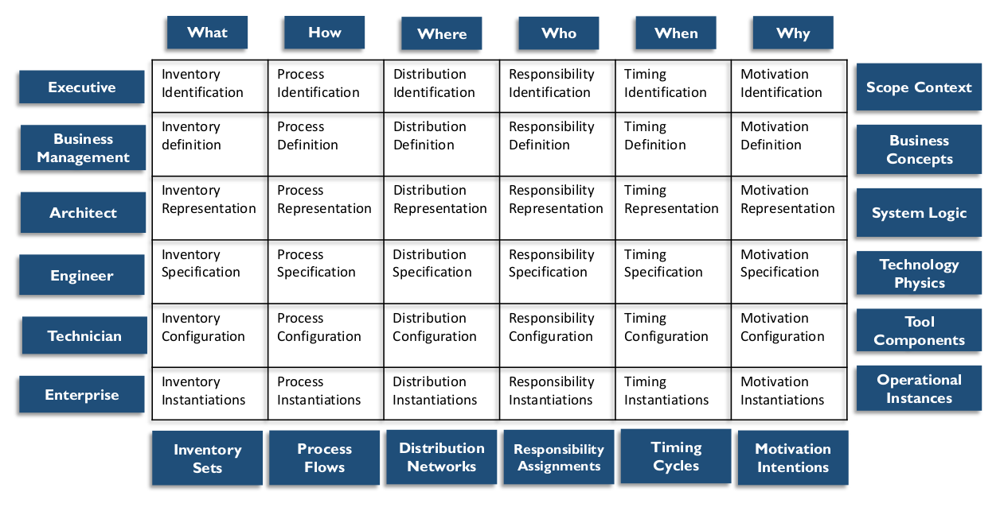

# Arquitetura de Dados

## 1. Introdução

Arquitetura refere-se à arte e à ciência de construir coisas (especialmente estruturas habitáveis) e aos resultados do processo de construção – os próprios edifícios. Em um sentido mais geral, arquitetura refere-se a um arranjo organizado de elementos componentes com o objetivo de otimizar a função, o desempenho, a viabilidade, o custo e a estética de uma estrutura ou sistema geral.

O termo arquitetura tem sido adotado para descrever diversas facetas do projeto de sistemas de informação. A ISO/IEC 42010:2007 Engenharia de Sistemas e Software – Descrição da Arquitetura (2011) define arquitetura como “a organização fundamental de um sistema, incorporada em seus componentes, suas relações entre si e com o ambiente, e os princípios que regem seu projeto e evolução”. No entanto, dependendo do contexto, a palavra arquitetura pode se referir à descrição do estado atual dos sistemas, dos componentes de um conjunto de sistemas, da disciplina de projeto de sistemas (prática de arquitetura), do projeto intencional de um sistema ou conjunto de sistemas (estado futuro ou arquitetura proposta), dos artefatos que descrevem um sistema (documentação da arquitetura) ou da equipe que realiza o trabalho de projeto (os Arquitetos ou a equipe de Arquitetura).

A prática de arquitetura é realizada em diferentes níveis dentro de uma organização (empresa, domínio, projeto, etc.) e com diferentes áreas de foco (infraestrutura, aplicação e dados). O que exatamente os arquitetos fazem pode ser confuso para pessoas que não são arquitetos e que não reconhecem as distinções implícitas nesses níveis e áreas de foco. Um dos motivos pelos quais os frameworks arquitetônicos são valiosos é que eles permitem que pessoas não arquitetas entendam essas relações.

A disciplina de Arquitetura Corporativa abrange arquiteturas de domínio, incluindo negócios, dados, aplicação e tecnologia. Práticas de arquitetura empresarial bem gerenciadas ajudam as organizações a compreender o estado atual de seus sistemas, promover mudanças desejáveis ​​em direção ao estado futuro, permitir a conformidade regulatória e aumentar a eficácia. A gestão eficaz de dados e dos sistemas nos quais os dados são armazenados e utilizados é um objetivo comum da ampla gama de disciplinas de arquitetura.

Neste capítulo, a Arquitetura de Dados será considerada sob as seguintes perspectivas:

* Resultados da Arquitetura de Dados, como modelos, definições e fluxos de dados em vários níveis, geralmente chamados de artefatos da Arquitetura de Dados
* Atividades da Arquitetura de Dados, para formar, implementar e cumprir as intenções da Arquitetura de Dados
* Comportamento da Arquitetura de Dados, como colaborações, mentalidades e habilidades entre as várias funções que afetam a Arquitetura de Dados da empresa

Juntos, esses três formam os componentes essenciais da Arquitetura de Dados.

A Arquitetura de Dados é fundamental para o gerenciamento de dados. Como a maioria das organizações possui mais dados do que as pessoas individualmente conseguem compreender, é necessário representar os dados organizacionais em diferentes níveis de abstração para que possam ser compreendidos e a gestão possa tomar decisões sobre eles.

Artefatos da Arquitetura de Dados incluem especificações usadas para descrever o estado existente, definir requisitos de dados, orientar a integração de dados e controlar ativos de dados, conforme estabelecido em uma estratégia de dados. A Arquitetura de Dados de uma organização é descrita por um conjunto integrado de documentos mestres de projeto em diferentes níveis de abstração, incluindo padrões que regem como os dados são coletados, armazenados, organizados, usados ​​e removidos. Ela também é classificada por descrições de todos os contêineres e caminhos que os dados percorrem nos sistemas de uma organização.

O documento de projeto de Arquitetura de Dados mais detalhado é um modelo formal de dados corporativos, contendo nomes de dados, definições abrangentes de dados e Metadados, entidades e relacionamentos conceituais e lógicos, e regras de negócios. Modelos de dados físicos são incluídos, mas como um produto da modelagem e do projeto de dados, e não da Arquitetura de Dados.

A Arquitetura de Dados é mais valiosa quando atende totalmente às necessidades de toda a empresa. A Arquitetura de Dados Corporativos permite a padronização e a integração consistentes de dados em toda a empresa.

Os artefatos criados pelos arquitetos constituem Metadados valiosos. Idealmente, os artefatos arquitetônicos devem ser armazenados e gerenciados em um repositório de artefatos de arquitetura corporativa.

Estamos no meio da terceira onda de digitalização do cliente final. Bancos e transações financeiras vieram primeiro; diversas interações de serviços digitais estavam na segunda onda; e a internet das coisas e a telemática impulsionam a terceira. Indústrias tradicionais, como automotiva, equipamentos para saúde e ferramentas, estão se tornando digitais nesta terceira onda.

Isso acontece em quase todos os setores. Os novos carros Volvo agora contam com serviço de plantão 24 horas por dia, 7 dias por semana, não apenas para questões relacionadas ao veículo, mas também para localizar restaurantes e lojas. Pontes rolantes, carregadores de paletes e equipamentos de anestesia estão coletando e enviando dados operacionais que permitem serviços de disponibilidade. As ofertas migraram do fornecimento de equipamentos para contratos de pagamento por uso ou disponibilidade. Muitas dessas empresas têm pouca ou nenhuma experiência nessas áreas, visto que antes eram atendidas por varejistas ou prestadores de serviços de pós-venda.

Organizações com visão de futuro devem incluir profissionais de gerenciamento de dados (por exemplo, Arquitetos de Dados Corporativos ou Administradores de Dados estratégicos) ao projetar novas ofertas de mercado, pois hoje em dia elas geralmente incluem hardware, software e serviços que capturam dados, dependem do acesso a dados ou ambos.

### 1.1 Impulsionadores de Negócios

O objetivo da Arquitetura de Dados é ser uma ponte entre a estratégia de negócios e a execução da tecnologia. Como parte da Arquitetura Corporativa, os Arquitetos de Dados:

* Preparam estrategicamente as organizações para a rápida evolução de seus produtos, serviços e dados, aproveitando as oportunidades de negócios inerentes às tecnologias emergentes;
* Traduzem as necessidades de negócios em dados e requisitos de sistema para que os processos tenham consistentemente os dados necessários;
* Gerenciam a entrega complexa de dados e informações em toda a empresa;
* Facilitam o alinhamento entre Negócios e TI;
* Atuam como agentes de mudança, transformação e agilidade.

Esses impulsionadores de negócios devem influenciar as medidas do valor da Arquitetura de Dados.

Os arquitetos de dados criam e mantêm o conhecimento organizacional sobre os dados e os sistemas pelos quais eles se movem. Esse conhecimento permite que uma organização gerencie seus dados como um ativo e aumente o valor obtido com eles, identificando oportunidades de uso de dados, redução de custos e mitigação de riscos.

### 1.2 Resultados e Práticas da Arquitetura de Dados

Os principais resultados da Arquitetura de Dados incluem:

* Requisitos de armazenamento e processamento de dados
* Projetos de estruturas e planos que atendam aos requisitos de dados atuais e de longo prazo da empresa

Figura 21 Diagrama de Contexto: Arquitetura de Dados

Os arquitetos buscam projetar de forma a agregar valor à organização. Esse valor advém de uma estrutura técnica ideal, eficiência operacional e de projeto, e da maior capacidade da organização de utilizar seus dados. Para atingir esse objetivo, é necessário um bom design, planejamento e a capacidade de garantir que os projetos e planos sejam executados de forma eficaz.

Para atingir esses objetivos, os Arquitetos de Dados definem e mantêm especificações que:

* Definem o estado atual dos dados na organização
* Fornecem um vocabulário comercial padrão para dados e componentes
* Alinham a Arquitetura de Dados com a estratégia empresarial e a arquitetura de negócios
* Expressam os requisitos estratégicos de dados
* Delineiam projetos integrados de alto nível para atender a esses requisitos
* Integram-se ao roteiro geral da arquitetura empresarial

Uma prática geral de Arquitetura de Dados inclui:

* Utilizam artefatos da Arquitetura de Dados (projetos mestres) para definir requisitos de dados e orientar os dados
* Colaboram, aprendem e influenciam as diversas partes interessadas envolvidas na integração, controlam os ativos de dados e alinham os investimentos em dados com a estratégia de negócios, aprimorando o desenvolvimento de negócios ou sistemas de TI
* Utilizam a Arquitetura de Dados para estabelecer a semântica de uma empresa, por meio de um vocabulário comercial comum

### 1.3 Conceitos Essenciais

#### 1.3.1 Domínios da Arquitetura Corporativa

A Arquitetura de Dados opera no contexto de outros domínios da arquitetura, incluindo arquitetura de negócios, de aplicações e técnica. A Tabela 6 descreve e compara esses domínios. Arquitetos de diferentes domínios devem abordar as direções e os requisitos de desenvolvimento de forma colaborativa, pois cada domínio influencia e impõe restrições aos outros domínios. (Veja também a Figura 22.)

Tabela 6 Domínios da Arquitetura

<table>
  <thead>
    <tr>
      <th>Domínio</th>
      <th>Arquitetura de Negócios Corporativos</th>
      <th>Arquitetura de Dados Corporativos</th>
      <th>Arquitetura de Aplicações Corporativas</th>
      <th>Arquitetura de Tecnologia Corporativa</th>
    </tr>
  </thead>
  <tbody>
    <tr>
      <td>
        Objetivo
      </td>
      <td>
        Identificar como uma empresa cria valor para clientes e outras partes interessadas
      </td>
      <td>
        Descrever como os dados devem ser organizados e gerenciados
      </td>
      <td>
        Descrever a estrutura e a funcionalidade dos aplicativos em uma empresa
      </td>
      <td>
        Descrever a tecnologia física necessária para permitir que os sistemas funcionem e agreguem valor
      </td>
    </tr>
    <tr>
      <td>
        Elementos
      </td>
      <td>
        Modelos de negócios, processos, capacidades, serviços, eventos, estratégias, vocabulário
      </td>
      <td>
        Modelos de dados, definições de dados, especificações de mapeamento de dados, fluxos de dados, APIs de dados estruturados
      </td>
      <td>
        Sistemas de negócios, pacotes de software, bancos de dados
      </td>
      <td>
        Plataformas técnicas, redes, segurança, ferramentas de integração
      </td>
    </tr>
    <tr>
      <td>
        Dependências
      </td>
      <td>
        Estabelece requisitos para os outros domínios
      </td>
      <td>
        Gerencia os dados criados e exigidos pela arquitetura de negócios
      </td>
      <td>
        Atua nos dados especificados de acordo com os requisitos de negócios
      </td>
      <td>
        Hospeda e executa a arquitetura da aplicação
      </td>
    </tr>
    <tr>
      <td>
        Funções
      </td>
      <td>
        Arquitetos e analistas de negócios, administradores de dados de negócios
      </td>
      <td>
        Arquitetos e modeladores de dados, administradores de dados
      </td>
      <td>
        Arquitetos de aplicações
      </td>
      <td>
        Arquitetos de infraestrutura
      </td>
    </tr>
  </tbody>
</table>

#### 1.3.2 Frameworks de Arquitetura Corporativa

Um framework de arquitetura é uma estrutura fundamental usada para desenvolver uma ampla gama de arquiteturas relacionadas. Frameworks de arquitetura fornecem maneiras de pensar e compreender a arquitetura. Eles representam uma "arquitetura para arquitetura" geral.

A IEEE Computer Society mantém um padrão para Frameworks de Arquitetura Corporativa, ISO/IEC/IEEE 42010:2011, Engenharia de Sistemas e Software — Descrição da Arquitetura e uma Tabela Comparativa. [^32] Frameworks e métodos comuns incluem a Arquitetura de Dados como um dos domínios da arquitetura.

#### 1.3.2.1 Framework Zachman para Arquitetura Corporativa

O framework de arquitetura corporativa mais conhecido, o Framework Zachman, foi desenvolvido por John A. Zachman na década de 1980. (Veja a Figura 22.) Ele continuou a evoluir. Zachman reconheceu que, ao criar edifícios, aviões, empresas, cadeias de valor, projetos ou sistemas, há muitos públicos-alvo, e cada um tem uma perspectiva diferente sobre arquitetura. Ele aplicou esse conceito aos requisitos para diferentes tipos e níveis de arquitetura dentro de uma empresa.

O Framework Zachman é uma ontologia – a matriz 6x6 compreende o conjunto completo de modelos necessários para descrever uma empresa e os relacionamentos entre eles. Ela não define como criar os modelos. Ela simplesmente mostra quais modelos devem existir.

Figura 22 Framework Zachman Simplificado

As duas dimensões no framework matricial são as interrogativas de comunicação (ou seja, o quê, como, onde, quem, quando, por quê) como colunas e as transformações de reificação (Identificação, Definição, Representação, Especificação, Configuração e Instanciação) como linhas. As classificações do framework são representadas pelas células (a interseção entre as interrogativas e as transformações). Cada célula no Framework Zachman representa um tipo único de artefato de design.

As interrogativas de comunicação são as perguntas fundamentais que podem ser feitas sobre qualquer entidade. Traduzindo para a arquitetura empresarial, as colunas podem ser entendidas da seguinte forma:

* O quê (coluna de inventário): Entidades utilizadas para construir a arquitetura
* Como (coluna de processo): Atividades realizadas
* Onde (coluna de distribuição): Localização da empresa e localização da tecnologia
* Quem (coluna de responsabilidade): Funções e organizações
* Quando (coluna de tempo): Intervalos, eventos, ciclos e cronogramas
* Por quê (coluna de motivação): Metas, estratégias e meios

As transformações de reificação representam as etapas necessárias para traduzir uma ideia abstrata em uma instância concreta (uma instanciação). Elas são representadas nas linhas: planejador, proprietário, projetista, construtor, implementador e usuário. Cada uma tem uma perspectiva diferente sobre o processo geral e diferentes problemas a serem resolvidos. Essas perspectivas são representadas como linhas. Por exemplo, cada perspectiva tem uma relação diferente com a coluna O quê (inventário ou dados):

* **A perspectiva executiva (contexto de negócios):** Listas de elementos de negócios que definem o escopo em modelos de identificação.
* **A perspectiva da gestão de negócios (conceitos de negócios):** Esclarecimento das relações entre os conceitos de negócios definidos pelos Líderes Executivos como Proprietários em modelos de definição.
* **A perspectiva do arquiteto (lógica de negócios):** Modelos lógicos de sistemas que detalham os requisitos do sistema e o design irrestrito, representados pelos Arquitetos como Designers em modelos de representação.
* **A perspectiva do engenheiro (física de negócios):** Modelos físicos que otimizam o design para implementação para uso específico sob as restrições de tecnologia, pessoas, custos e prazos específicos, especificados pelos Engenheiros como Construtores em modelos de especificação.
* **A perspectiva do técnico (montagens de componentes):** Uma visão específica da tecnologia, fora do contexto, de como os componentes são montados e operam, configurados pelos Técnicos como Implementadores em modelos de configuração.
* **A perspectiva do usuário (classes de operações):** Instâncias funcionais reais usadas pelos Trabalhadores como Participantes. Não há modelos nesta perspectiva.

Como observado anteriormente, cada célula no Framework Zachman representa um tipo único de artefato de design, definido pela interseção de sua linha e coluna. Cada artefato representa como a perspectiva específica responde às perguntas fundamentais.

#### 1.3.3 Arquitetura de Dados Corporativos

A Arquitetura de Dados Corporativos define termos e designs padrão para os elementos importantes para a organização. O design de uma Arquitetura de Dados Corporativos inclui a representação dos dados de negócios como tais, incluindo a coleta, o armazenamento, a integração, a movimentação e a distribuição de dados.

À medida que os dados fluem em uma organização por meio de feeds ou interfaces, eles são protegidos, integrados, armazenados, registrados, catalogados, compartilhados, reportados, analisados ​​e entregues às partes interessadas. Ao longo do caminho, os dados podem ser verificados, aprimorados, vinculados, certificados, agregados, anonimizados e usados ​​para análises até serem arquivados ou eliminados. As descrições da Arquitetura de Dados Corporativos devem, portanto, incluir tanto os Modelos de Dados Corporativos (por exemplo, estruturas e especificações de dados), quanto o Design de Fluxo de Dados:

* Modelo de Dados Corporativos (EDM): O EDM é um modelo de dados conceitual ou lógico holístico, de nível corporativo e independente de implementação, que fornece uma visão comum e consistente dos dados em toda a empresa. É comum usar o termo para se referir a um modelo de dados simplificado e de alto nível, mas essa é uma questão de abstração para apresentação. Um EDM inclui entidades de dados empresariais essenciais (ou seja, conceitos de negócios), seus relacionamentos, regras de negócios orientadoras essenciais e alguns atributos críticos. Ele estabelece a base para todos os dados e projetos relacionados a dados. Qualquer modelo de dados em nível de projeto deve ser baseado no EDM. O EDM deve ser revisado pelas partes interessadas para que haja consenso de que ele representa efetivamente a empresa.
* Design de Fluxo de Dados: Define os requisitos e o modelo mestre para armazenamento e processamento em bancos de dados, aplicativos, plataformas e redes (os componentes). Esses fluxos de dados mapeiam a movimentação de dados para processos de negócios, locais, funções de negócios e componentes técnicos.

Esses dois tipos de especificações precisam se encaixar bem. Como mencionado, ambos precisam ser refletidos no estado atual e no estado-alvo (perspectiva da arquitetura) e também no estado de transição (perspectiva do projeto).

#### 1.3.3.1 Modelo de Dados Corporativos

Algumas organizações criam um GED como um artefato independente. Em outras organizações, ele é entendido como composto por modelos de dados de diferentes perspectivas e em diferentes níveis de detalhe, que descrevem consistentemente a compreensão da organização sobre entidades de dados, atributos de dados e seus relacionamentos em toda a empresa. Um GED inclui modelos de dados universais (Modelos Conceituais e Lógicos para toda a empresa) e específicos para aplicações ou projetos, juntamente com definições, especificações, mapeamentos e regras de negócios.

Adotar um modelo padrão do setor pode impulsionar o processo de desenvolvimento de um GED. Esses modelos fornecem um guia e referências úteis. No entanto, mesmo que uma organização comece com um modelo de dados adquirido, a produção de modelos de dados para toda a empresa exige um investimento significativo. O trabalho inclui definir e documentar o vocabulário, as regras de negócios e o conhecimento de negócios de uma organização. Manter e enriquecer um GED exige um compromisso contínuo de tempo e esforço.

Uma organização que reconhece a necessidade de um modelo de dados corporativo deve decidir quanto tempo e esforço pode dedicar à sua construção e manutenção. Os EDMs podem ser construídos em diferentes níveis de detalhe, portanto, a disponibilidade de recursos influenciará o escopo inicial. Com o tempo, conforme as necessidades da empresa exigem, o escopo e o nível de detalhe capturados em um modelo de dados corporativo geralmente se expandem. A maioria dos modelos de dados corporativos bem-sucedidos é construída de forma incremental e iterativa, usando camadas. A Figura 23 mostra como diferentes tipos de modelos se relacionam e como os modelos conceituais são, em última análise, vinculáveis ​​a modelos de dados de aplicativos físicos. Ela distingue:

* Uma visão geral conceitual das áreas temáticas da empresa
* Visões de entidades e relacionamentos para cada área temática
* Visões lógicas detalhadas e parcialmente atribuídas dessas mesmas áreas temáticas
* Modelos lógicos e físicos específicos para uma aplicação ou projeto

Todos os níveis fazem parte do Modelo de Dados Corporativos, e as vinculações criam caminhos para rastrear uma entidade de cima para baixo e entre modelos no mesmo nível.

* Vertical: Os modelos em cada nível mapeiam para modelos em outros níveis. A linhagem do modelo é criada usando esses mapas. Por exemplo, uma tabela ou arquivo MobileDevice em um modelo físico específico do projeto pode ser vinculado a uma entidade MobileDevice no modelo lógico específico do projeto, a uma entidade MobileDevice na área de assunto Produto no Modelo Lógico Corporativo, a uma entidade conceitual Produto no Modelo de Área de Assunto Produto e à entidade Produto no Modelo Conceitual Corporativo.
* Horizontal: Entidades e relacionamentos podem aparecer em vários modelos no mesmo nível; entidades em modelos lógicos centralizados em um tópico podem se relacionar a entidades em outros tópicos, marcadas ou identificadas como externas à área de assunto nas imagens do modelo. Uma entidade Product Part pode aparecer nos modelos de área de assunto Produto e nas áreas de assunto Pedido de Venda, Estoque e Marketing, relacionadas como links externos.

Um modelo de dados corporativo em todos os níveis é desenvolvido utilizando técnicas de modelagem de dados. (Consulte o Capítulo 5.)

Figura 23 Modelo de Dados Corporativos

A Figura 24 ilustra três diagramas de Área de Assunto (exemplos simplificados), cada um contendo um Modelo de Dados Conceitual com um conjunto de entidades. Relacionamentos podem cruzar as fronteiras das Áreas de Assunto; cada entidade em um modelo de dados corporativo deve residir em apenas uma Área de Assunto, mas pode estar relacionada a entidades em qualquer outra Área de Assunto.

Portanto, o modelo conceitual de dados corporativos é construído pela combinação de modelos de Área de Assunto. O modelo de dados corporativos pode ser construído usando uma abordagem de cima para baixo ou de baixo para cima. A abordagem de cima para baixo significa começar com a formação das Áreas de Assunto e, em seguida, preenchê-las com modelos. Ao usar uma abordagem de baixo para cima, a estrutura da Área de Assunto é baseada em modelos de dados existentes. Uma combinação das abordagens geralmente é recomendada; começando de baixo para cima usando modelos existentes e completando o modelo de dados corporativos preenchendo os modelos, delegando a modelagem da Área de Assunto aos projetos.

Figura 24 Exemplo de Diagrama de Modelos de Área de Assunto

O discriminador da Área de Assunto (ou seja, os princípios que formam a estrutura da Área de Assunto) deve ser consistente em todo o modelo de dados corporativo. Os princípios discriminadores de áreas temáticas frequentemente utilizados incluem: usar regras de normalização, separar as Áreas Temáticas de portfólios de sistemas (ou seja, financiamento), formar Áreas Temáticas a partir da estrutura de governança de dados e propriedade de dados (organizacional), usar processos de nível superior (com base nas cadeias de valor do negócio) ou usar capacidades de negócio (com base na arquitetura empresarial). A estrutura da Área Temática geralmente é mais eficaz para o trabalho de Arquitetura de Dados se for formada usando regras de normalização. O processo de normalização estabelecerá as principais entidades que carregam/constituem cada Área Temática.

##### 1.3.3.2 Projeto de Fluxo de Dados

Fluxos de dados são um tipo de documentação de linhagem de dados que descreve como os dados se movem pelos processos e sistemas de negócios. Fluxos de dados de ponta a ponta ilustram onde os dados se originaram, onde são armazenados e utilizados e como são transformados à medida que se movem dentro e entre diversos processos e sistemas. A análise de linhagem de dados pode ajudar a explicar o estado dos dados em um determinado ponto do fluxo de dados.

Fluxos de dados mapeiam e documentam as relações entre dados e

* Aplicativos dentro de um processo de negócios
* Armazenamentos de dados ou bancos de dados em um ambiente
* Segmentos de rede (úteis para mapeamento de segurança)
* Funções de negócios, descrevendo quais funções são responsáveis ​​por criar, atualizar, usar e excluir dados (CRUD)
* Locais onde ocorrem diferenças locais

Fluxos de dados podem ser documentados em diferentes níveis de detalhe: Área de Assunto, entidade de negócios ou até mesmo nível de atributo. Os sistemas podem ser representados por segmentos de rede, plataformas, conjuntos de aplicativos comuns ou servidores individuais. Os fluxos de dados podem ser representados por matrizes bidimensionais (Figura 25) ou em diagramas de fluxo de dados (Figura 26).

Figura 25 Fluxo de Dados Representado em uma Matriz

Uma matriz fornece uma visão geral clara de quais dados os processos criam e utilizam. A vantagem de mostrar os requisitos de dados em uma matriz é que ela leva em consideração que os dados não fluem em apenas uma direção; a troca de dados entre processos ocorre de muitos para muitos de uma forma bastante complexa, onde qualquer dado pode aparecer em qualquer lugar. Além disso, uma matriz pode ser usada para esclarecer as responsabilidades de aquisição de dados dos processos e as dependências de dados entre os processos, o que, por sua vez, melhora a documentação do processo. Aqueles que preferem trabalhar com capacidades de negócios podem mostrar isso da mesma forma – apenas trocando o eixo dos processos por capacidades. A construção dessas matrizes é uma prática antiga na modelagem empresarial. A IBM introduziu essa prática em seu método de Planejamento de Sistemas de Negócios (BSP). James Martin posteriormente a popularizou em seu método de Planejamento de Sistemas de Informação (ISP) na década de 1980.

O fluxo de dados na Figura 26 é um diagrama de fluxo de dados tradicional de alto nível que descreve o tipo de fluxo de dados entre sistemas. Esses diagramas podem ser descritos em diversos formatos e níveis de detalhe.

Figura 26 Exemplo de Diagrama de Fluxo de Dados## 2. Atividades

Dados e arquitetura corporativa lidam com a complexidade de dois pontos de vista:

* Orientado para a qualidade: Foco na melhoria da execução dentro dos ciclos de desenvolvimento de negócios e de TI. A menos que a arquitetura seja gerenciada, ela se deteriorará. Os sistemas se tornarão gradualmente mais complexos e inflexíveis, criando riscos para a organização. Entrega descontrolada de dados, cópias de dados e relacionamentos de interface "espaguete" tornam as organizações menos eficientes e reduzem a confiança nos dados.
* Orientado para a inovação: Foco na transformação de negócios e de TI para atender a novas expectativas e oportunidades. Impulsionar a inovação com tecnologias disruptivas e usos de dados tornou-se uma função do Arquiteto Corporativo moderno.

Esses dois fatores exigem abordagens distintas. A abordagem orientada para a qualidade se alinha ao trabalho tradicional de Arquitetura de Dados, em que as melhorias na qualidade da arquitetura são realizadas de forma incremental. As tarefas de arquitetura são distribuídas entre os projetos, nos quais os arquitetos participam ou o projeto é executado por delegação. Normalmente, o arquiteto mantém toda a arquitetura em mente e se concentra em objetivos de longo prazo diretamente conectados à governança, padronização e desenvolvimento estruturado. A abordagem orientada para a inovação pode ter uma perspectiva de curto prazo e utilizar lógica de negócios não comprovada e tecnologias de ponta. Essa orientação frequentemente exige que os arquitetos entrem em contato com pessoas dentro da organização com as quais os profissionais de TI normalmente não interagem (por exemplo, representantes de desenvolvimento de produtos e designers de negócios).

### 2.1 Estabelecer a Prática de Arquitetura de Dados

Idealmente, a Arquitetura de Dados deve ser parte integrante da arquitetura corporativa. Se não houver uma função de arquitetura corporativa, uma equipe de Arquitetura de Dados ainda pode ser estabelecida. Nessas condições, uma organização deve adotar uma estrutura que ajude a articular os objetivos e os direcionadores da Arquitetura de Dados. Esses direcionadores influenciarão a abordagem, o escopo e as prioridades do roteiro.

Escolha uma estrutura aplicável ao tipo de negócio (por exemplo, use uma estrutura governamental para uma organização governamental). As visões e a taxonomia na estrutura devem ser úteis na comunicação com as diversas partes interessadas. Isso é especialmente importante para iniciativas de Arquitetura de Dados, pois elas abordam a terminologia de negócios e sistemas. A Arquitetura de Dados tem uma relação inerentemente próxima com a arquitetura de negócios.

Uma prática de Arquitetura de Dados Corporativos geralmente inclui os seguintes fluxos de trabalho, executados em série ou em paralelo:

* **Estratégia:** Selecionar frameworks, definir abordagens, desenvolver um roteiro
* **Aceitação e cultura:** Informar e motivar mudanças de comportamento
* **Organização:** Organizar o trabalho de Arquitetura de Dados atribuindo responsabilidades
* **Métodos de trabalho:** Definir as melhores práticas e executar o trabalho de Arquitetura de Dados em projetos de desenvolvimento, em coordenação com a Arquitetura Corporativa
* **Resultados:** Produzir artefatos de Arquitetura de Dados dentro de um roteiro geral

A Arquitetura de Dados Corporativos também influencia os limites do escopo de projetos e lançamentos de sistemas:

* **Definir os requisitos de dados do projeto:** Arquitetos de Dados fornecem os requisitos de dados corporativos para projetos individuais.
* **Revisar os designs de dados do projeto:** As revisões de design garantem que os modelos de dados conceituais, lógicos e físicos sejam consistentes com a arquitetura e em suporte à estratégia organizacional de longo prazo.
* **Determinar o impacto da linhagem de dados:** Garante que as regras de negócios nos aplicativos ao longo do fluxo de dados sejam consistentes e rastreáveis.
* **Controle de replicação de dados:** A replicação é uma maneira comum de melhorar o desempenho de aplicativos e tornar os dados mais prontamente disponíveis, mas também pode criar inconsistências nos dados. A governança da Arquitetura de Dados garante que haja controle de replicação suficiente (métodos e mecanismos) para atingir a consistência necessária. (Nem todos os aplicativos precisam de consistência estrita.)
* **Aplicação de padrões de Arquitetura de Dados:** Formulação e aplicação de padrões para o ciclo de vida da Arquitetura de Dados Corporativos. Os padrões podem ser expressos como princípios e procedimentos, diretrizes e também como projetos com expectativas de conformidade.
* **Orientação sobre tecnologia de dados e decisões de renovação:** O Arquiteto de Dados trabalha com Arquitetos Corporativos para gerenciar versões, patches e políticas de tecnologia de dados que cada aplicativo utiliza, como um roteiro para a tecnologia de dados.

#### 2.1.1 Avalie as Especificações de Arquitetura de Dados Existentes

Toda organização possui algum tipo de documentação para seus sistemas. Identifique esses documentos e avalie sua precisão, integralidade e nível de detalhe. Se necessário, atualize-os para refletir o estado atual.

#### 2.1.2 Desenvolver um Roteiro

Se uma empresa fosse desenvolvida do zero (livre da dependência de processos existentes), uma arquitetura ideal seria baseada exclusivamente nos dados necessários para o funcionamento da empresa, as prioridades seriam definidas pela estratégia de negócios e as decisões poderiam ser tomadas sem a dependência do passado. Pouquíssimas organizações chegam a esse ponto. Mesmo em uma situação ideal, dependências de dados surgiriam rapidamente e precisariam ser gerenciadas. Um roteiro fornece um meio de gerenciar essas dependências e tomar decisões com visão de futuro. Um roteiro ajuda uma organização a enxergar compensações e formular um plano pragmático, alinhado às necessidades e oportunidades de negócios, requisitos externos e recursos disponíveis.

Um roteiro para Arquitetura de Dados Corporativos descreve o caminho de desenvolvimento da arquitetura ao longo de 3 a 5 anos. Juntamente com os requisitos de negócios, a consideração das condições reais e as avaliações técnicas, o roteiro descreve como a arquitetura-alvo se tornará realidade. O roteiro da Arquitetura de Dados Corporativos deve ser integrado a um roteiro geral da arquitetura corporativa, que inclui marcos de alto nível, recursos necessários e estimativas de custos, divididos em fluxos de trabalho de capacidades de negócios. O roteiro deve ser guiado por uma avaliação da maturidade do gerenciamento de dados. (Consulte o Capítulo 15.)

A maioria das capacidades de negócios requer dados como entrada; outras também produzem dados dos quais outras capacidades de negócios dependem. A arquitetura corporativa e a Arquitetura de Dados Corporativos podem ser formadas de forma coerente, resolvendo esse fluxo de dados em uma cadeia de dependências entre as capacidades de negócios. Um roteiro orientado por dados de negócios começa com as capacidades de negócios que são mais independentes (ou seja, têm a menor dependência de outras atividades) e termina com aquelas que são mais dependentes umas das outras. Lidar com cada capacidade de negócios em sequência seguirá uma ordem geral de origem dos dados de negócios. A Figura 27 mostra um exemplo de cadeia de dependência, com a menor dependência no topo. A Gestão de Produtos e a Gestão de Clientes não dependem de mais nada e, portanto, constituem Dados Mestres. Os itens com maior dependência estão na parte inferior, onde o Gerenciamento de Faturas do Cliente depende do Gerenciamento de Clientes e do Gerenciamento de Pedidos de Vendas, que por sua vez dependem de outros dois.

Figura 27 Dependências de Dados das Capacidades de Negócios

Portanto, o roteiro recomendaria, idealmente, começar pelas capacidades de Gerenciamento de Produtos e Gerenciamento de Clientes e, em seguida, resolver cada dependência em etapas, de cima para baixo.

#### 2.1.3 Gerenciar Requisitos Corporativos em Projetos

A arquitetura não deve ficar presa às limitações vigentes no momento de seu desenvolvimento. Modelos de dados e outras especificações que descrevem a Arquitetura de Dados de uma organização devem ser flexíveis o suficiente para acomodar requisitos futuros. Um modelo de dados no nível da arquitetura deve ter uma visão global da empresa, juntamente com definições claras que possam ser compreendidas por toda a organização.

Projetos de desenvolvimento implementam soluções para capturar, armazenar e distribuir dados com base nos requisitos de negócios e nos padrões estabelecidos pela Arquitetura de Dados Corporativos. Esse processo, por sua natureza, é realizado de forma incremental.

No nível do projeto, o processo de especificação de requisitos por meio de um modelo de dados começa com a revisão das necessidades de negócios. Frequentemente, essas necessidades serão específicas aos objetivos do projeto e não terão implicações corporativas. O processo ainda deve incluir o desenvolvimento de definições de termos e outras atividades que suportem o uso dos dados. É importante ressaltar que os arquitetos de dados devem ser capazes de compreender os requisitos em relação à arquitetura geral. Quando uma especificação de projeto é concluída, os arquitetos de dados devem determinar:

É importante ressaltar que os arquitetos de dados devem ser capazes de compreender os requisitos em relação à arquitetura geral. Após a conclusão da especificação de um projeto, os arquitetos de dados devem determinar:

* Se as entidades corporativas representadas na especificação estão em conformidade com os padrões acordados
* Quais entidades na especificação de requisitos devem ser incluídas na Arquitetura de Dados Corporativos como um todo
* Se as entidades e definições nesta especificação precisam ser generalizadas ou aprimoradas para lidar com tendências futuras
* Se novas arquiteturas de entrega de dados são indicadas ou se devem orientar os desenvolvedores na direção da reutilização

As organizações geralmente aguardam para abordar as preocupações com a Arquitetura de Dados até que os projetos precisem projetar o armazenamento e a integração de dados. No entanto, é preferível incluir essas considerações no início do planejamento e ao longo de todo o ciclo de vida do projeto.

As atividades relacionadas ao projeto de Arquitetura de Dados Corporativos incluem:

* Definir o escopo: Garantir que o escopo e a interface estejam alinhados com o modelo de dados corporativo. Entender a contribuição potencial do projeto para a Arquitetura de Dados Corporativos como um todo, em relação ao que o projeto modelará e projetará e em termos de quais componentes existentes devem (ou podem) ser reutilizados. Nas áreas que devem ser projetadas, o projeto precisa determinar as dependências com as partes interessadas fora do escopo do projeto, como os processos subsequentes. Os artefatos de dados que o projeto determinar como compartilháveis ​​ou reutilizáveis ​​precisam ser incorporados ao modelo de dados lógicos corporativos e aos repositórios designados.
* Compreender os requisitos de negócios: Capturar requisitos relacionados a dados, como entidade, fonte(s), disponibilidade, qualidade e pontos problemáticos, e estimar o valor comercial do atendimento a esses requisitos.
* Design: Formular especificações detalhadas de metas, incluindo regras de negócios em uma perspectiva de ciclo de vida de dados. Validar o resultado e, quando necessário, atender às necessidades de modelos padronizados estendidos e aprimorados. O modelo de dados lógicos corporativos e o repositório de arquitetura corporativa são bons lugares para os arquitetos de dados do projeto procurarem e reutilizarem construções compartilháveis ​​em toda a empresa. Revisar e utilizar padrões de tecnologia de dados.
* Implementar:
  * Ao comprar, faça engenharia reversa dos aplicativos adquiridos (Commercial Off the Shelf – COTS) e mapeie-os em relação à estrutura de dados. Identifique e documente lacunas e diferenças em estruturas, definições e regras. Idealmente, os fornecedores fornecerão modelos de dados para seus produtos; no entanto, muitos não o fazem, por considerá-los proprietários. Se possível, negocie um modelo com definições aprofundadas.
  * Ao reutilizar dados, mapeie os modelos de dados do aplicativo em relação a estruturas de dados comuns e processos existentes e novos para entender as operações CRUD. Imponha o uso do sistema de registro ou outros dados autoritativos. Identifique e documente lacunas.
  * Ao construir, implemente o armazenamento de dados de acordo com a estrutura de dados. Integre de acordo com especificações padronizadas ou projetadas. (Consulte o Capítulo 8.)

O papel dos Arquitetos de Dados Corporativos em projetos depende da metodologia de desenvolvimento. O processo de incorporação de atividades arquitetônicas em projetos também difere entre as metodologias.

* **Métodos em cascata:** Entenda os requisitos e construa sistemas em fases sequenciais como parte de um projeto corporativo geral. Este método inclui pedágios projetados para controlar mudanças. Geralmente, não há problema em incluir atividades de Arquitetura de Dados em tais modelos. Certifique-se de incluir uma perspectiva corporativa.
* **Métodos incrementais:** Aprenda e construa em etapas graduais (ou seja, mini-cascatas). Este método cria protótipos com base em requisitos gerais vagos. A fase de iniciação é crucial; é melhor criar um projeto de dados abrangente nas primeiras iterações.
* **Métodos ágeis e iterativos:** Aprenda, construa e teste em pacotes de entrega discretos (chamados de "sprints") que são pequenos o suficiente para que, se o trabalho precisar ser descartado, pouca perda seja feita. Métodos ágeis (Scrum, Desenvolvimento Rápido e Processo Unificado) promovem a modelagem orientada a objetos que enfatiza o design da interface do usuário, o design de software e o comportamento dos sistemas. Complemente esses métodos com especificações para modelos de dados, captura, armazenamento e distribuição de dados. A experiência com DevOps, uma abordagem ágil emergente e popular, comprova a melhoria no design de dados e as escolhas eficazes de design quando programadores e arquitetos de dados mantêm um forte relacionamento de trabalho e cumprem padrões e diretrizes.

### 2.2 Integração com a Arquitetura Corporativa

O trabalho de desenvolvimento de especificações da Arquitetura de Dados Corporativos, desde o nível da área temática até níveis mais detalhados e em relação a outros domínios da arquitetura, é normalmente realizado em projetos financiados. Projetos financiados geralmente direcionam as prioridades da arquitetura. No entanto, questões de Arquitetura de Dados em toda a empresa devem ser abordadas proativamente. De fato, a Arquitetura de Dados pode influenciar o escopo dos projetos. Portanto, é melhor integrar as questões da Arquitetura de Dados Corporativos ao gerenciamento do portfólio de projetos. Isso permite a implementação do roteiro e contribui para melhores resultados do projeto.

Da mesma forma, os Arquitetos de Dados Corporativos precisam ser incluídos no desenvolvimento de aplicações corporativas e no planejamento da integração. Aplique a visão da Arquitetura de Dados ao cenário de aplicações alvo e o roteiro a esse cenário.

## 3. Ferramentas

### 3.1 Ferramentas de Modelagem de Dados

Ferramentas de modelagem de dados e repositórios de modelos são necessários para gerenciar o modelo de dados corporativo em todos os níveis. A maioria das ferramentas de modelagem de dados inclui funções de rastreamento de linhagem e relacionamento, que permitem aos arquitetos gerenciar as ligações entre modelos criados para diferentes propósitos e em diferentes níveis de abstração. (Consulte o Capítulo 5.)

### 3.2 Software de Gestão de Ativos

Softwares de gestão de ativos são usados ​​para inventariar sistemas, descrever seu conteúdo e rastrear os relacionamentos entre eles. Entre outras coisas, essas ferramentas permitem que uma organização garanta o cumprimento das obrigações contratuais relacionadas a licenças de software e colete dados relacionados a ativos que podem ser usados ​​para minimizar custos e otimizar sua infraestrutura de TI. Como compilam um inventário de ativos de TI, essas ferramentas coletam e armazenam Metadados valiosos sobre os sistemas e os dados que eles contêm. Esses Metadados são muito úteis na criação de fluxos de dados ou na pesquisa do estado atual.

### 3.3 Aplicações de Design Gráfico

Aplicações de design gráfico são usadas para criar diagramas de design arquitetônico, fluxos de dados, cadeias de valor de dados e outros artefatos arquitetônicos.

## 4. Técnicas

### 4.1 Projeções do Ciclo de Vida

Os projetos de arquitetura podem ser aspiracionais ou voltados para o futuro, implementados e ativos, ou com planos de aposentadoria. O que eles representam deve ser claramente documentado. Por exemplo:

* Atuais: Produtos atualmente suportados e utilizados
* Período de implantação: Produtos implantados para uso nos próximos 1 a 2 anos
* Período estratégico: Produtos com previsão de disponibilidade para uso nos próximos 2 anos ou mais
* Aposentadoria: Produtos que a organização aposentou ou pretende aposentar dentro de um ano
* Preferenciais: Produtos preferidos para uso pela maioria das aplicações
* Contenção: Produtos com uso limitado por determinadas aplicações
* Emergentes: Produtos em pesquisa e teste piloto para possível implantação futura
* Revisados: Produtos que foram avaliados, cujos resultados da avaliação e que atualmente não estão em nenhum outro status acima

Consulte o Capítulo 6 para mais informações sobre o gerenciamento de tecnologias de dados.

### 4.2 Clareza na Diagramação

Modelos e diagramas apresentam informações com base em um conjunto estabelecido de convenções visuais. Estas precisam ser usadas de forma consistente, caso contrário, serão mal interpretadas e podem, de fato, estar incorretas. Características que minimizam distrações e maximizam informações úteis incluem:

• Uma legenda clara e consistente: A legenda deve identificar todos os objetos e linhas e o que eles significam. A legenda deve ser colocada no mesmo local em todos os diagramas.
• Uma correspondência entre todos os objetos do diagrama e a legenda: Em legendas usadas como modelos, nem todos os objetos da legenda podem aparecer no diagrama, mas todos os objetos do diagrama devem corresponder a um objeto da legenda.
• Uma direção de linha clara e consistente: Todos os fluxos devem começar em um lado ou canto (geralmente à esquerda) e fluir em direção ao lado ou canto oposto, tanto quanto possível. Loops e círculos ocorrerão, portanto, faça com que as linhas que retornam fluam para fora e ao redor para ficarem claras.
• Um método consistente de exibição de cruzamento de linhas: As linhas podem se cruzar, desde que fique claro que o ponto de cruzamento não é uma junção. Use saltos de linha para todas as linhas em uma direção. Não una linhas com linhas. Minimize o número de linhas que se cruzam.
• Atributos de objeto consistentes: Qualquer diferença em tamanhos, cores, espessura de linha, etc. deve significar algo, caso contrário, as diferenças são distrativas.
• Simetria linear: Diagramas com objetos dispostos em linhas e colunas são mais legíveis do que aqueles com posicionamento aleatório. Embora raramente seja possível alinhar todos os objetos, alinhar pelo menos metade (horizontal e/ou verticalmente) melhorará muito a legibilidade de qualquer diagrama.

## 5. Diretrizes de Implementação

Conforme declarado na introdução do capítulo, a Arquitetura de Dados trata de artefatos, atividades e comportamento. Implementar
A Arquitetura de Dados Corporativos envolve, portanto:

* Organizar as equipes e fóruns de Arquitetura de Dados Corporativos
* Produzir as versões iniciais dos artefatos da Arquitetura de Dados, como o modelo de dados corporativo, o fluxo de dados corporativo e os roteiros
* Formar e estabelecer uma forma de trabalhar com arquitetura de dados em projetos de desenvolvimento
* Conscientizar toda a organização sobre o valor dos esforços da Arquitetura de Dados

Uma implementação de Arquitetura de Dados deve incluir pelo menos dois desses recursos, pois eles se beneficiam de serem lançados simultaneamente ou, pelo menos, como atividades paralelas. A implementação pode começar em uma parte da organização ou em um domínio de dados, como dados de produtos ou dados de clientes. Após o aprendizado e a maturação, a implementação pode se expandir.

Modelos de dados e outros artefatos da Arquitetura de Dados geralmente são capturados em projetos de desenvolvimento e, em seguida, padronizados e gerenciados por arquitetos de dados. Portanto, os primeiros projetos terão porções maiores de trabalho de Arquitetura de Dados antes que haja artefatos para reutilização. Esses projetos iniciais podem se beneficiar de financiamento especial para arquitetura.

O Arquiteto de Dados Corporativos colabora com outros arquitetos de negócios e tecnologia que compartilham o objetivo comum de melhorar a eficácia e a agilidade organizacional. Os impulsionadores de negócios para a arquitetura corporativa geral também influenciam significativamente a estratégia de implementação da Arquitetura de Dados Corporativos.

Estabelecer uma Arquitetura de Dados Corporativos em uma cultura orientada a soluções, onde novas invenções são testadas usando tecnologias disruptivas, exigirá uma abordagem de implementação ágil. Isso pode incluir ter um modelo de área de estudo delineado em um nível geral, enquanto participa detalhadamente de sprints ágeis. Assim, a Arquitetura de Dados Corporativos evoluirá incrementalmente. No entanto, essa abordagem ágil precisa garantir que os arquitetos de dados sejam envolvidos desde o início nas iniciativas de desenvolvimento, visto que estas evoluem rapidamente em uma cultura inventiva.

Ter um impulsionador de qualidade para a arquitetura corporativa pode forçar algum trabalho inicial de Arquitetura de Dados em nível corporativo para projetos de desenvolvimento planejados. Normalmente, a Arquitetura de Dados Corporativos começa com áreas de Dados Mestres que necessitam de grande melhoria e, uma vez estabelecidas e aceitas, expande-se para incluir dados orientados a eventos de negócios (ou seja, dados transacionais). Esta é a abordagem de implementação tradicional, na qual os Arquitetos de Dados Corporativos produzem projetos e modelos para serem usados ​​em todo o cenário do sistema e garantem a conformidade usando vários meios de governança.

### 5.1 Avaliação de Prontidão / Avaliação de Riscos

Projetos de iniciação de arquitetura expõem mais riscos do que outros projetos, especialmente durante a primeira tentativa dentro da organização. Os riscos mais significativos são:

* Falta de suporte da gerência: Qualquer reorganização da empresa durante a execução planejada do projeto afetará o processo de arquitetura. Por exemplo, novos tomadores de decisão podem questionar o processo e ficar tentados a se retirar das oportunidades para os participantes continuarem seu trabalho na Arquitetura de Dados. É estabelecendo suporte entre a gerência que um processo de arquitetura pode sobreviver à reorganização. Portanto, certifique-se de incluir no processo de desenvolvimento da Arquitetura de Dados mais de um membro da alta gerência, ou pelo menos da alta gerência, que entenda os benefícios da Arquitetura de Dados.
* Nenhum histórico comprovado de realização: Ter um patrocinador é essencial para o sucesso do esforço, assim como sua confiança naqueles que executam a função de Arquitetura de Dados. Conte com a ajuda de um colega arquiteto sênior para auxiliar na execução das etapas mais importantes.
* Patrocinador apreensivo: Se o patrocinador exigir que toda a comunicação passe por ele, isso pode ser um indício de que essa pessoa não tem certeza de sua função, tem interesses diferentes dos objetivos do processo de Arquitetura de Dados ou não tem certeza da capacidade do arquiteto de dados. Independentemente do motivo, o patrocinador deve permitir que o gerente de projeto e o arquiteto de dados assumam os papéis de liderança no projeto. Tente estabelecer independência no local de trabalho, juntamente com a confiança do patrocinador.
* Decisões executivas contraproducentes: Pode ser que, embora a gerência compreenda o valor de uma Arquitetura de Dados bem organizada, ela não saiba como alcançá-la. Portanto, pode tomar decisões que contrariem os esforços do arquiteto de dados. Isso não é um sinal de deslealdade da gerência, mas sim uma indicação de que o arquiteto de dados precisa se comunicar de forma mais clara e frequente com a gerência.
* Choque cultural: Considere como a cultura de trabalho mudará entre aqueles que serão afetados pela Arquitetura de Dados. Tente imaginar o quão fácil ou difícil será para os funcionários mudarem seu comportamento dentro da organização. * Líder de projeto inexperiente: Certifique-se de que o gerente de projeto tenha experiência com Arquitetura de Dados Corporativos, especialmente se o projeto tiver um componente pesado de dados. Caso contrário, incentive o patrocinador a mudar ou educar o gerente de projeto (Edvinsson, 2013).
* Predomínio de uma visão unidimensional: Às vezes, o(s) proprietário(s) de uma aplicação de negócios pode(m) tender a ditar sua visão sobre a Arquitetura de Dados corporativa como um todo (por exemplo, os proprietários de um sistema ERP) em detrimento de uma visão mais equilibrada e abrangente.

### 5.2 Mudança Organizacional e Cultural

A velocidade com que uma organização adota práticas arquitetônicas depende de quão adaptável é sua cultura. A natureza do trabalho de design exige que os arquitetos colaborem com desenvolvedores e outros pensadores criativos em toda a organização. Muitas vezes, essas pessoas estão acostumadas a trabalhar à sua maneira. Elas podem aceitar ou resistir à mudança necessária para adotar princípios e ferramentas formais de arquitetura.

Organizações orientadas para resultados e estrategicamente alinhadas estão na melhor posição para adotar práticas arquitetônicas. Essas organizações são frequentemente orientadas a objetivos, cientes dos desafios de clientes e parceiros e capazes de priorizar com base em objetivos comuns.

A capacidade de uma organização de adotar práticas de Arquitetura de Dados depende de vários fatores:

* Receptividade cultural à abordagem arquitetônica (desenvolvendo uma cultura favorável à arquitetura)
* Reconhecimento organizacional dos dados como um ativo de negócios, não apenas uma preocupação de TI
* Capacidade organizacional de abrir mão de uma perspectiva local e adotar uma perspectiva corporativa sobre os dados
* Capacidade organizacional de integrar entregas arquitetônicas à metodologia do projeto
* Nível de aceitação da governança formal de dados
* Capacidade de olhar holisticamente para a empresa, em vez de se concentrar apenas na entrega do projeto e nas soluções de TI (Edvinsson, 2013)

## 6. Governança da Arquitetura de Dados

As atividades de Arquitetura de Dados apoiam diretamente o alinhamento e o controle dos dados. Arquitetos de dados frequentemente atuam como intermediários de negócios para as atividades de governança de dados. Portanto, a Arquitetura de Dados Corporativos e a organização de Governança de Dados precisam estar bem alinhadas. Idealmente, tanto um arquiteto de dados quanto um Administrador de Dados devem ser designados para cada área temática e até mesmo para cada entidade dentro de uma área temática. Além disso, a supervisão de negócios deve estar alinhada à supervisão de processos. As áreas temáticas de eventos de negócios devem estar alinhadas com a governança de processos de negócios, visto que cada entidade de evento geralmente corresponde a um processo de negócios. As atividades de governança da Arquitetura de Dados incluem:

* **Supervisão de Projetos:** Isso inclui garantir que os projetos estejam em conformidade com as atividades de Arquitetura de Dados exigidas, utilizem e aprimorem os ativos arquitetônicos e implementem de acordo com os padrões arquitetônicos estabelecidos.
* **Gerenciamento de projetos arquitetônicos, ciclo de vida e ferramentas:** Os projetos arquitetônicos devem ser definidos, avaliados e mantidos. A Arquitetura de Dados Corporativos serve como um "plano de zoneamento" para integração a longo prazo. A arquitetura do estado futuro afeta os objetivos do projeto e influencia a prioridade dos projetos no portfólio de projetos. * Definição de padrões: Estabelecer regras, diretrizes e especificações sobre como os dados são usados ​​dentro da organização.
* **Criação de artefatos relacionados a dados:** Artefatos que permitem a conformidade com as diretrizes de governança.

### 6.1 Métricas

As métricas de desempenho da Arquitetura de Dados Corporativos refletem os objetivos arquitetônicos: conformidade arquitetônica,
tendências de implementação e valor comercial da Arquitetura de Dados. As métricas da Arquitetura de Dados são frequentemente
monitoradas anualmente como parte da satisfação geral do cliente empresarial com os projetos.

* **Taxa de conformidade com os padrões de arquitetura** mede o grau de conformidade dos projetos com as Arquiteturas de Dados estabelecidas e a aderência dos projetos aos processos de engajamento com a arquitetura corporativa. Métricas que monitoram exceções em projetos também podem ser úteis para compreender os obstáculos à adoção.
* **Tendências de implementação** monitoram o grau em que a arquitetura corporativa melhorou a capacidade da organização de implementar projetos, em pelo menos duas linhas:
  * **Medidas de uso/reutilização/substituição/retirada:** Determine a proporção de novos artefatos de arquitetura em relação aos artefatos reutilizados, substituídos ou retirados.
  * **Medidas de eficiência na execução de projetos:** Medem os prazos de entrega dos projetos e seus custos de recursos para melhorias na entrega com artefatos reutilizáveis ​​e artefatos de orientação.
* **As medições de valor comercial** acompanham o progresso em direção aos efeitos e benefícios comerciais esperados.
  * **Melhorias na agilidade dos negócios:** Medições que levam em conta os benefícios das melhorias no ciclo de vida ou, alternativamente, o custo do atraso.
  * **Qualidade dos negócios:** Medições que avaliam se os casos de negócios são cumpridos conforme o esperado; medindo se os projetos realmente geram mudanças que levam a melhorias nos negócios com base em dados recém-criados ou integrados.
  * **Qualidade da operação dos negócios:** Medições de eficiência aprimorada. Exemplos incluem maior precisão e redução do tempo e do custo de correção de erros devido a erros de dados.
  * **Melhorias no ambiente de negócios:** Exemplos incluem maior taxa de retenção de clientes relacionada à redução de erros de dados e menor incidência de comentários de autoridades sobre os relatórios enviados.

## 7. Trabalhos Citados / Recomendados

Ahlemann, Frederik, Eric Stettiner, Marcus Messerschmidt, and Christine Legner, eds. Strategic Enterprise Architecture
Management: Challenges, Best Practices, and Future Developments. Springer, 2012. Print. Management for Professionals.

Bernard, Scott A. An Introduction to Enterprise Architecture. 2nd ed. Authorhouse, 2005. Print.

Brackett, Michael H. Data Sharing Using a Common Data Architecture. John Wiley and Sons, 1994. Print.

Carbone, Jane. IT Architecture Toolkit. Prentice Hall, 2004. Print.

Cook, Melissa. Building Enterprise Information Architectures: Re-Engineering Information Systems. Prentice Hall, 1996.
Print.

Edvinsson, Hakan and Lottie Aderinne. Enterprise Architecture Made Simple Using the Ready, Set, Go Approach to
Achieving Information Centricity. Technics Publications, LCC, 2013. Print.

Executive Office of the President of the United States. The Common Approach to Federal Enterprise Architecture.
whitehouse.gov, 2012. Web.

Fong, Joseph. Information Systems Reengineering and Integration. 2nd ed. Springer, 2006. Print.

Gane, Chris and Trish Sarson. Structured Systems Analysis: Tools and Techniques. Prentice Hall, 1979. Print.

Hagan, Paula J., ed. EABOK: Guide to the (Evolving) Enterprise Architecture Body of Knowledge. mitre.org MITRE
Corporation, 2004. Web.

Harrison, Rachel. TOGAF Version 8.1.1 Enterprise Edition - Study Guide. The Open Group. 2nd ed. Van Haren Publishing,
2007. Print. TOGAF.

Hoberman, Steve, Donna Burbank, and Chris Bradley. Data Modeling for the Business: A Handbook for Aligning the
Business with IT using High-Level Data Models. Technics Publications, LLC, 2009. Print. Take It with You Guides.

Hoberman, Steve. Data Modeling Made Simple: A Practical Guide for Business and Information Technology Professionals.
2nd ed. Technics Publications, LLC, 2009. Print.

Hoogervorst, Jan A. P. Enterprise Governance and Enterprise Engineering. Springer, 2009. Print. The Enterprise
Engineering Ser.

ISO (website). http://bit.ly/2sTp2rA, http://bit.ly/2ri8Gqk.

Inmon, W. H., John A. Zachman, and Jonathan G. Geiger. Data Stores, Data Warehousing and the Zachman Framework:
Managing Enterprise Knowledge. McGraw-Hill, 1997. Print.

Lankhorst, Marc. Enterprise Architecture at Work: Modeling, Communication and Analysis. Springer, 2005. Print.

Martin, James and Joe Leben. Strategic Information Planning Methodologies, 2nd ed. Prentice Hall, 1989. Print.

Osterwalder, Alexander and Yves Pigneur. Business Model Generation: A Handbook for Visionaries, Game Changers, and
Challengers. Wiley, 2010. Print.

Perks, Col and Tony Beveridge. Guide to Enterprise IT Architecture. Springer, 2003. Print. Springer Professional
Computing.

Poole, John, Dan Chang, Douglas Tolbert, and David Mellor. Common Warehouse Metamodel. Wiley, 2001. Print. OMG
(Book 17).

Radhakrishnan, Rakesh. Identity and Security: A Common Architecture and Framework For SOA and Network
Convergence. futuretext, 2007. Print.

Ross, Jeanne W., Peter Weill, and David Robertson. Enterprise Architecture As Strategy: Creating a Foundation For
Business Execution. Harvard Business School Press, 2006. Print.

Schekkerman, Jaap. How to Survive in the Jungle of Enterprise Architecture Frameworks: Creating or Choosing an
Enterprise Architecture Framework. Trafford Publishing, 2006. Print.

Spewak, Steven and Steven C. Hill. Enterprise Architecture Planning: Developing a Blueprint for Data, Applications, and
Technology. 2nd ed. A Wiley-QED Publication, 1993. Print.

Ulrich, William M. and Philip Newcomb. Information Systems Transformation: Architecture-Driven Modernization Case
Studies. Morgan Kaufmann, 2010. Print. The MK/OMG Press.

[^32]: http://bit.ly/2tNnD2j; http://bit.ly/2rVinIq.