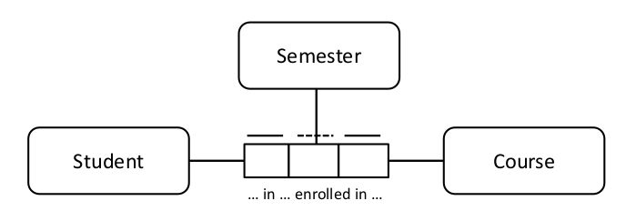

# Modelagem e Design de Dados

## 1. Introdução

Modelagem de dados é o processo de descobrir, analisar e delimitar os requisitos de dados e, em seguida, representar e comunicar esses requisitos de dados em um formato preciso, denominado modelo de dados. A modelagem de dados é um componente crítico do gerenciamento de dados. O processo de modelagem exige que as organizações descubram e documentem como seus dados se encaixam. O próprio processo de modelagem projeta como os dados se encaixam (Simsion, 2013). Os modelos de dados descrevem e permitem que uma organização compreenda seus ativos de dados.

Existem diversos esquemas diferentes usados ​​para representar dados. Os seis esquemas mais comumente usados ​​são: Relacional, Dimensional, Orientado a Objetos, Baseado em Fatos, Baseado em Tempo e NoSQL. Os modelos desses esquemas existem em três níveis de detalhe: conceitual, lógico e físico. Cada modelo contém um conjunto de componentes. Exemplos de componentes são entidades, relacionamentos, fatos, chaves e atributos. Uma vez construído, um modelo precisa ser revisado e, uma vez aprovado, mantido.

Figura 28 Diagrama de Contexto: Modelagem e Design de Dados

Os modelos de dados compreendem e contêm metadados essenciais para os consumidores de dados. Muitos desses metadados descobertos durante o processo de modelagem de dados são essenciais para outras funções de gerenciamento de dados. Por exemplo, definições para governança de dados e linhagem para data warehousing e análise de dados.

Este capítulo descreverá a finalidade dos modelos de dados, os conceitos essenciais e o vocabulário comum usado na modelagem de dados, bem como os objetivos e princípios da modelagem de dados. Utilizará um conjunto de exemplos de dados relacionados à educação para ilustrar como os modelos de dados funcionam e mostrar as diferenças entre eles.

### 1.1 Impulsionadores de Negócios

Os modelos de dados são essenciais para o gerenciamento eficaz de dados. Eles:

* Fornecem um vocabulário comum sobre dados
* Capturam e documentam o conhecimento explícito sobre os dados e sistemas de uma organização
* Servem como uma ferramenta de comunicação primária durante os projetos
* Fornecem o ponto de partida para personalização, integração ou até mesmo substituição de um aplicativo

### 1.2 Objetivos e Princípios

O objetivo da modelagem de dados é confirmar e documentar a compreensão de diferentes perspectivas, o que leva a aplicações que se alinham melhor com os requisitos de negócios atuais e futuros, e cria uma base para a conclusão bem-sucedida de iniciativas de amplo escopo, como Gestão de Dados Mestres e programas de governança de dados. A modelagem de dados adequada reduz os custos de suporte e aumenta as oportunidades de reutilização para iniciativas futuras, reduzindo assim os custos de construção de novas aplicações. Modelos de dados são uma forma importante de Metadados.

Confirmar e documentar a compreensão de diferentes perspectivas facilita:

* Formalização: Um modelo de dados documenta uma definição concisa de estruturas e relacionamentos de dados. Ele permite a avaliação de como os dados são afetados pelas regras de negócios implementadas, para os estados atuais ou para os estados-alvo desejados. A definição formal impõe uma estrutura disciplinada aos dados que reduz a possibilidade de ocorrência de anomalias ao acessá-los e persisti-los. Ao ilustrar as estruturas e relacionamentos nos dados, um modelo de dados facilita o consumo dos dados.

* Definição do escopo: Um modelo de dados pode ajudar a explicar os limites do contexto de dados e da implementação de pacotes de aplicativos adquiridos, projetos, iniciativas ou sistemas existentes.
* Retenção/documentação de conhecimento: Um modelo de dados pode preservar a memória corporativa em relação a um sistema ou projeto, capturando o conhecimento de forma explícita. Ele serve como documentação para projetos futuros, como a versão atual. Os modelos de dados nos ajudam a entender uma organização ou área de negócios, um aplicativo existente ou o impacto da modificação de uma estrutura de dados existente. O modelo de dados se torna um mapa reutilizável para ajudar profissionais de negócios, gerentes de projeto, analistas, modeladores e desenvolvedores a entender a estrutura de dados dentro do ambiente. Da mesma forma que o cartógrafo aprendeu e documentou uma paisagem geográfica para outros usarem para navegação, o modelador permite que outros entendam uma paisagem de informações (Hoberman, 2009).

### 1.3 Conceitos Essenciais

Esta seção explicará os diferentes tipos de dados que podem ser modelados, os componentes dos modelos de dados, os tipos de modelos de dados que podem ser desenvolvidos e os motivos para a escolha de diferentes tipos em diferentes situações. Este conjunto de definições é extenso, em parte, porque a modelagem de dados em si envolve o processo de definição. É importante entender o vocabulário que embasa a prática.

#### 1.3.1 Modelagem de Dados e Modelos de Dados

A modelagem de dados é mais frequentemente realizada no contexto de esforços de desenvolvimento e manutenção de sistemas, conhecido como ciclo de vida de desenvolvimento de sistemas (SDLC). A modelagem de dados também pode ser realizada para iniciativas de amplo escopo (por exemplo, Arquitetura de Negócios e Dados, Gestão de Dados Mestres e iniciativas de governança de dados), nas quais o resultado final imediato não é um banco de dados, mas a compreensão dos dados organizacionais.

Um modelo é uma representação de algo que existe ou um padrão para algo a ser criado. Um modelo pode conter um ou mais diagramas. Os diagramas de modelo utilizam símbolos padrão que permitem a compreensão do conteúdo. Mapas, organogramas e plantas de edifícios são exemplos de modelos em uso diário.

Um modelo de dados descreve os dados de uma organização como a organização os entende ou como a organização deseja que sejam. Um modelo de dados contém um conjunto de símbolos com rótulos de texto que tentam representar visualmente os requisitos de dados conforme comunicados ao modelador de dados, para um conjunto específico de dados que pode variar em tamanho, desde pequeno, para um projeto, até grande, para uma organização. O modelo é uma forma de documentação dos requisitos de dados e das definições de dados resultantes do processo de modelagem. Os modelos de dados são o principal meio utilizado para comunicar os requisitos de dados da área de negócios para a TI e, dentro da TI, de analistas, modeladores e arquitetos a designers e desenvolvedores de banco de dados.

#### 1.3.2 Tipos de Dados Modelados

Quatro tipos principais de dados podem ser modelados (Edvinsson, 2013). Os tipos de dados modelados em qualquer organização refletem as prioridades da organização ou do projeto que requer um modelo de dados:

* Informações de categoria: Dados usados ​​para classificar e atribuir tipos a coisas. Por exemplo, clientes classificados por categorias de mercado ou setores de negócios; produtos classificados por cor, modelo, tamanho, etc.; pedidos classificados por estarem abertos ou fechados.
* Informações de recursos: Perfis básicos de recursos necessários para conduzir processos operacionais, como Produto, Cliente, Fornecedor, Instalação, Organização e Conta. Entre os profissionais de TI, as entidades de recursos são às vezes chamadas de Dados de Referência.
* Informações de eventos de negócios: Dados criados enquanto os processos operacionais estão em andamento. Exemplos incluem Pedidos de Clientes, Faturas de Fornecedores, Saques de Dinheiro e Reuniões de Negócios. Entre os profissionais de TI, as entidades de eventos são às vezes chamadas de dados de negócios transacionais.
* Informações detalhadas de transações: Informações detalhadas de transações são frequentemente produzidas por meio de sistemas de ponto de venda (em lojas ou online). Também é produzido por meio de sistemas de mídia social, outras interações na internet (fluxo de cliques, etc.) e por sensores em máquinas, que podem ser partes de embarcações e veículos, componentes industriais ou dispositivos pessoais (GPS, RFID, Wi-Fi, etc.). Esse tipo de informação detalhada pode ser agregado, usado para derivar outros dados e analisado em busca de tendências, de forma semelhante à utilização de eventos de informações comerciais. Esse tipo de dado (de grande volume e/ou que mudam rapidamente) é geralmente chamado de Big Data.

Esses tipos se referem a "dados em repouso". Dados em movimento também podem ser modelados, por exemplo, em esquemas para sistemas, incluindo protocolos, e esquemas para sistemas de mensagens e baseados em eventos.

#### 1.3.3 Componentes do Modelo de Dados

Como será discutido posteriormente neste capítulo, diferentes tipos de modelos de dados representam dados por meio de diferentes convenções (consulte a Seção 1.3.4). No entanto, a maioria dos modelos de dados contém os mesmos blocos de construção básicos: entidades, relacionamentos, atributos e domínios.

##### 1.3.3.1 Entidade

Fora da modelagem de dados, a definição de entidade é algo que existe separadamente de outras coisas. Dentro da modelagem de dados, uma entidade é algo sobre o qual uma organização coleta informações. Entidades são, às vezes, chamadas de substantivos de uma organização. Uma entidade pode ser considerada a resposta a uma pergunta fundamental – quem, o quê, quando, onde, por que ou como – ou a uma combinação dessas perguntas (ver Capítulo 4). A Tabela 7 define e fornece exemplos de categorias de entidades comumente usadas (Hoberman, 2009).

Tabela 7 Categorias de Entidades Comumente Usadas

<table>
  <thead>
    <tr>
      <th>Categoria</th>
      <th>Definição</th>
      <th>Exemplos</th>
    </tr>
  </thead>
  <tbody>
    <tr>
      <td>
        Quem
      </td>
      <td>
        Pessoa ou organização de interesse. Ou seja, quem é importante para o negócio? Frequentemente, um "quem" está associado a uma generalização de parte ou a uma função, como Cliente ou Fornecedor. Pessoas ou organizações podem ter múltiplas funções ou ser incluídas em múltiplas partes.
      </td>
      <td>
        Funcionário, Paciente, Jogador, Suspeito, Cliente, Fornecedor, Aluno, Passageiro, Concorrente, Autor
      </td>
    </tr>
    <tr>
      <td>
        O quê
      </td>
      <td>
        Produto ou serviço de interesse da empresa. Geralmente se refere ao que a organização fabrica ou ao serviço que presta. Ou seja, o que é importante para o negócio? Atributos para categorias, tipos, etc. são muito importantes aqui.
      </td>
      <td>
        Produto, Serviço, Matéria-Prima, Produto Acabado, Curso, Música, Fotografia, Livro
      </td>
    </tr>
    <tr>
      <td>
        Quando
      </td>
      <td>
        Calendário ou intervalo de tempo de interesse da empresa. Ou seja, Quando o negócio está em operação?
      </td>
      <td>
        Hora, Data, Mês, Trimestre, Ano, Calendário, Semestre, Período Fiscal, Minuto, Horário de Partida
      </td>
    </tr>
    <tr>
      <td>
        Onde
      </td>
      <td>
        Local de interesse da empresa. O local pode se referir a locais reais, bem como locais eletrônicos. Ou seja, Onde os negócios são conduzidos?
      </td>
      <td>
        Endereço para Correspondência, Ponto de Distribuição, URL do Site, Endereço IP
      </td>
    </tr>
    <tr>
      <td>
        Por quê
      </td>
      <td>
        Evento ou transação de interesse da empresa. Esses eventos mantêm o negócio funcionando. Ou seja, Por que o negócio está em operação?
      </td>
      <td>
        Pedido, Devolução, Reclamação, Saque, Depósito, Elogio, Consulta, Troca, Reclamação
      </td>
    </tr>
    <tr>
      <td>
        Como
      </td>
      <td>
        Documentação do evento de interesse da empresa. Documentos fornecem evidências de que os eventos ocorreram, como uma Ordem de Compra registrando um evento de Ordem. Ou seja, como sabemos que um evento ocorreu?
      </td>
      <td>
        Fatura, Contrato, Acordo, Conta, Ordem de Compra, Multa por Excesso de Velocidade, Guia de Remessa, Confirmação Comercial
      </td>
    </tr>
    <tr>
      <td>
        Medição
      </td>
      <td>
        Contagens, somas, etc. das outras categorias (o quê, onde) em ou em pontos no tempo (quando).
      </td>
      <td>
        Vendas, Contagem de Itens, Pagamentos, Saldo
      </td>
    </tr>
  </tbody>
</table>

##### 1.3.3.1.1 Aliases de Entidades

O termo genérico entidade pode ter outros nomes. O mais comum é tipo-entidade, pois um tipo de algo está sendo representado (por exemplo, Jane é do tipo Funcionário), portanto Jane é a entidade e Funcionário é o tipo de entidade. No entanto, o uso mais comum hoje em dia é o uso do termo entidade para Funcionário e instância de entidade para Jane.

Tabela 8 Entidade, Tipo de Entidade e Instância de Entidade

<table>
  <thead>
    <tr>
      <th>Uso</th>
      <th>Entidade</th>
      <th>Tipo de Entidade</th>
      <th>Instância da Entidade</th>
    </tr>
  </thead>
  <tbody>
    <tr>
      <td>
        Uso Comum
      </td>
      <td>
        Jane
      </td>
      <td>
        Funcionária
      </td>
      <td>
      </td>
    </tr>
    <tr>
      <td>
        Uso Recomendado
      </td>
      <td>
        Funcionária
      </td>
      <td>
      </td>
      <td>
        Jane
      </td>
    </tr>
  </tbody>
</table>

Instâncias de entidade são as ocorrências ou valores de uma entidade específica. A entidade Aluno pode ter várias instâncias de aluno, com os nomes Bob Jones, Joe Jackson, Jane Smith e assim por diante. A entidade Curso pode ter instâncias de Fundamentos de Modelagem de Dados, Geologia Avançada e Literatura Inglesa no Século XVII.

Os aliases de entidade também podem variar de acordo com o esquema. (Os esquemas serão discutidos na Seção 1.3.4.) Em esquemas relacionais, o termo entidade é frequentemente usado; em esquemas dimensionais, os termos dimensão e tabela de fatos são frequentemente usados; em esquemas orientados a objetos, os termos classe ou objeto são frequentemente usados; em esquemas baseados em tempo, os termos hub, satélite e link são frequentemente usados; e em esquemas NoSQL, termos como documento ou nó são usados.

Os aliases de entidade também podem variar de acordo com o nível de detalhe. (Os três níveis de detalhe serão discutidos na Seção 1.3.5.) Uma entidade no nível conceitual pode ser chamada de conceito ou termo, uma entidade no nível lógico é chamada de entidade (ou um termo diferente, dependendo do esquema) e, no nível físico, os termos variam de acordo com a tecnologia de banco de dados, sendo o termo mais comum "tabela".

##### 1.3.3.1.2 Representação Gráfica de Entidades

Em modelos de dados, as entidades são geralmente representadas como retângulos (ou retângulos com bordas arredondadas) com seus nomes dentro, como na Figura 29, onde há três entidades: Aluno, Curso e Instrutor.

Figura 29 Entidades

##### 1.3.3.1.3 Definição de Entidades

As definições de entidades são contribuintes essenciais para o valor comercial de qualquer modelo de dados. Elas são Metadados essenciais. Definições de alta qualidade esclarecem o significado do vocabulário comercial e fornecem rigor às regras de negócio que regem os relacionamentos entre entidades. Eles auxiliam profissionais de negócios e de TI a tomar decisões inteligentes de negócios e design de aplicativos. Definições de dados de alta qualidade apresentam três características essenciais:

* Clareza: A definição deve ser fácil de ler e compreender. Frases simples e bem escritas, sem siglas obscuras ou termos ambíguos inexplicáveis, como "às vezes" ou "normalmente".
* Precisão: A definição é uma descrição precisa e correta da entidade. As definições devem ser revisadas por especialistas nas áreas de negócios relevantes para garantir sua precisão.
* Completude: Todas as partes da definição estão presentes. Por exemplo, ao definir um código, exemplos dos valores do código são incluídos. Ao definir um identificador, o escopo da exclusividade é incluído na definição.

#### 1.3.3.2 Relacionamento

Um relacionamento é uma associação entre entidades (Chen, 1976). Um relacionamento captura as interações de alto nível entre entidades conceituais, as interações detalhadas entre entidades lógicas e as restrições entre entidades físicas.

##### 1.3.3.2.1 Aliases de Relacionamento

O termo genérico relacionamento pode ter outros nomes. Aliases de relacionamento podem variar de acordo com o esquema. Em esquemas relacionais, o termo relacionamento é frequentemente usado, em esquemas dimensionais, o termo caminho de navegação é frequentemente usado e, em esquemas NoSQL, termos como aresta ou link são usados, por exemplo. Aliases de relacionamento também podem variar de acordo com o nível de detalhe. Um relacionamento nos níveis conceitual e lógico é chamado de relacionamento, mas um relacionamento no nível físico pode ser chamado por outros nomes, como restrição ou referência, dependendo da tecnologia do banco de dados.

##### 1.3.3.2.2 Representação Gráfica de Relacionamentos

Os relacionamentos são mostrados como linhas no diagrama de modelagem de dados. Veja a Figura 30 para um exemplo de Engenharia da Informação.

Figura 30 Relacionamentos

Neste exemplo, o relacionamento entre Aluno e Curso captura a regra de que um Aluno pode frequentar Cursos. O relacionamento entre Instrutor e Curso captura a regra que um Instrutor pode ensinar em Cursos. Os símbolos na linha (chamados de cardinalidade) capturam as regras em uma sintaxe precisa. (Estes serão explicados na Seção 1.3.3.2.3.) Um relacionamento é representado por chaves estrangeiras em um banco de dados relacional e por métodos alternativos para bancos de dados NoSQL, como por arestas ou links.

##### 1.3.3.2.3 Cardinalidade do Relacionamento

Em um relacionamento entre duas entidades, a cardinalidade captura quantas instâncias de uma entidade (instâncias de entidade) participam do relacionamento com quantas da outra entidade. A cardinalidade é representada pelos símbolos que aparecem em ambas as extremidades de uma linha de relacionamento. As regras de dados são especificadas e aplicadas por meio da cardinalidade. Sem cardinalidade, o máximo que se pode dizer sobre um relacionamento é que duas entidades estão conectadas de alguma forma.

Para cardinalidade, as opções são simples: zero, um ou muitos. Cada lado de um relacionamento pode ter qualquer combinação de zero, um ou muitos ('muitos' significa que pode ser mais de 'um'). Especificar zero ou um nos permite capturar se uma instância de entidade é ou não necessária em um relacionamento. Especificar um ou muitos nos permite capturar quantas instâncias de uma instância específica participam de um determinado relacionamento.

Esses símbolos de cardinalidade são ilustrados no seguinte exemplo de engenharia da informação de Aluno e Curso.

Figura 31 Símbolos de Cardinalidade

As regras de negócio são:

* Cada aluno pode frequentar um ou vários cursos.
* Cada curso pode ser frequentado por um ou vários alunos.

##### 1.3.3.2.4 Aridade dos Relacionamentos

O número de entidades em um relacionamento é a "aridade" do relacionamento. Os mais comuns são relacionamentos unários, binários e ternários.

##### 1.3.3.2.4.1 Relacionamento Unário (Recursivo)

Um relacionamento unário (também conhecido como recursivo ou autorreferencial) envolve apenas uma entidade. Um relacionamento recursivo um-para-muitos descreve uma hierarquia, enquanto um relacionamento muitos-para-muitos descreve uma rede ou grafo. Em uma hierarquia, uma instância de entidade tem no máximo um pai (ou entidade de nível superior). Na modelagem relacional, as entidades filhas estão no lado múltiplo do relacionamento, com as entidades pai em um lado. Em uma rede, uma instância de entidade pode ter mais de um pai.

Por exemplo, um Curso pode exigir pré-requisitos. Se, para participar do Workshop de Biologia, for necessário primeiro concluir a Aula de Biologia, a Aula de Biologia é o pré-requisito para o Workshop de Biologia. Nos seguintes modelos de dados relacionais, que utilizam a notação de engenharia da informação, pode-se modelar esse relacionamento recursivo como uma hierarquia ou rede:

Figura 32 Relacionamento Unário - Hierarquia

Figura 33 Relacionamento Unário - Rede

Este primeiro exemplo (Figura 32) é uma hierarquia e o segundo (Figura 33) é uma rede. No primeiro exemplo, o Workshop de Biologia exige primeiro a realização da Aula de Biologia e da Aula de Química. Uma vez que a Aula de Biologia é escolhida como pré-requisito para o Workshop de Biologia, a Aula de Biologia não pode ser pré-requisito para nenhum outro curso. O segundo exemplo permite que a Aula de Biologia seja pré-requisito para outros cursos também.

##### 1.3.3.2.4.2 Relacionamento Binário

Uma aridade de dois também é conhecida como binária. Um relacionamento binário, o mais comum em um diagrama de modelo de dados tradicional, envolve duas entidades. A Figura 34, um diagrama de classes UML, mostra que tanto Aluno quanto Curso são entidades que participam de um relacionamento binário.

Figura 34 Relacionamento Binário

##### 1.3.3.2.4.3 Relacionamento Ternário

Uma aridade de três, conhecida como ternário, é um relacionamento que inclui três entidades. Um exemplo em modelagem baseada em fatos (notação objeto-papel) aparece na Figura 35. Aqui, o Aluno pode se matricular em um Curso específico em um determinado Semestre.

Figura 35 Relacionamento Ternário

##### 1.3.3.2.5 Chave Estrangeira

Uma chave estrangeira é usada em esquemas de modelagem de dados relacionais físicos e, às vezes, lógicos, para representar um relacionamento. Uma chave estrangeira pode ser criada implicitamente quando um relacionamento é definido entre duas entidades, dependendo da tecnologia de banco de dados ou da ferramenta de modelagem de dados, e se as duas entidades envolvidas têm dependências mútuas.

No exemplo mostrado na Figura 36, ​​Matrícula contém duas chaves estrangeiras, Número do Aluno de Aluno e Código do Curso de Curso. As chaves estrangeiras aparecem na entidade no lado múltiplo do relacionamento, frequentemente chamada de entidade filha. Aluno e Curso são entidades-mãe e Matrícula é a entidade filha.

Figura 36 Chaves Estrangeiras

#### 1.3.3.3 Atributo

Um atributo é uma propriedade que identifica, descreve ou mede uma entidade. Atributos podem ter domínios, que serão discutidos na Seção 1.3.3.4. O correspondente físico de um atributo em uma entidade é uma coluna, campo, tag ou nó em uma tabela, visualização, documento, gráfico ou arquivo.

##### 1.3.3.3.1 Representação Gráfica de Atributos

Em modelos de dados, os atributos são geralmente representados como uma lista dentro do retângulo da entidade, conforme mostrado na Figura 37, onde os atributos da entidade Aluno incluem Número do Aluno, Nome do Aluno, Sobrenome do Aluno e Data de Nascimento do Aluno.

Figura 37 Atributos

##### 1.3.3.3.2 Identificadores

Um identificador (também chamado de chave) é um conjunto de um ou mais atributos que define exclusivamente uma instância de uma entidade. Esta seção define os tipos de chaves por construção (simples, composta, composta, substituta) e função (candidata, primária, alternativa).

###### 1.3.3.3.2.1 Chaves do Tipo Construção

Uma chave simples é um atributo que identifica exclusivamente uma instância de entidade. Códigos Universais de Produto (UPCs) e Números de Identificação de Veículos (VINs) são exemplos de chaves simples. Uma chave substituta também é um exemplo de chave simples. Uma chave substituta é um identificador exclusivo para uma tabela. Frequentemente um contador e sempre gerado pelo sistema sem inteligência, uma chave substituta é um inteiro cujo significado não está relacionado ao seu valor nominal. (Em outras palavras, um Identificador de Mês de 1 não pode ser considerado como representando janeiro.) Chaves substitutas desempenham funções técnicas e não devem ser visíveis aos usuários finais de um banco de dados. Elas permanecem em segundo plano para ajudar a manter a exclusividade, permitir uma navegação mais eficiente entre estruturas e facilitar a integração entre aplicativos.

Uma chave composta é um conjunto de dois ou mais atributos que, juntos, identificam exclusivamente uma instância de entidade. Exemplos são número de telefone nos EUA (código de área + central telefônica + número local) e número de cartão de crédito (ID do emissor + ID da conta + dígito verificador).

Uma chave composta contém uma chave composta e pelo menos uma outra chave simples ou composta ou atributo não chave. Um exemplo é uma chave em uma tabela de fatos multidimensional, que pode conter várias chaves compostas, chaves simples e, opcionalmente, um carimbo de data/hora de carregamento.

###### 1.3.3.3.2.2 Chaves do Tipo Função

Uma superchave é qualquer conjunto de atributos que identificam exclusivamente uma instância de entidade. Uma chave candidata é um conjunto mínimo de um ou mais atributos (ou seja, uma chave simples ou composta) que identifica a instância de entidade à qual pertence. Mínimo significa que nenhum subconjunto da chave candidata identifica exclusivamente a instância da entidade. Uma entidade pode ter várias chaves candidatas. Exemplos de chaves candidatas para uma entidade cliente são endereço de e-mail, número de telefone celular e número da conta do cliente. Chaves candidatas podem ser chaves comerciais (às vezes chamadas de chaves naturais). Uma chave de negócio é um ou mais atributos que um profissional de negócios usaria para recuperar uma única instância de entidade. Chaves de negócio e chaves substitutas são mutuamente exclusivas.

Uma chave primária é a chave candidata escolhida para ser o identificador único de uma entidade. Mesmo que uma entidade possa conter mais de uma chave candidata, apenas uma chave candidata pode servir como chave primária para uma entidade. Uma chave alternativa é uma chave candidata que, embora única, não foi escolhida como chave primária. Uma chave alternativa ainda pode ser usada para encontrar instâncias específicas de entidade. Frequentemente, a chave primária é uma chave substituta e as chaves alternativas são chaves de negócio.

###### 1.3.3.3.2.3 Relacionamentos de Identificação vs. Não Identificação

Uma entidade independente é aquela em que a chave primária contém apenas atributos que pertencem a essa entidade. Uma entidade dependente é aquela em que a chave primária contém pelo menos um atributo de outra entidade. Em esquemas relacionais, a maioria das notações representa entidades independentes no diagrama de modelagem de dados como retângulos e entidades dependentes como retângulos com cantos arredondados.

No exemplo de aluno mostrado na Figura 38, Aluno e Curso são entidades independentes e Matrícula é uma entidade dependente.

Figura 38 Entidade Dependente e Independente

Entidades dependentes possuem pelo menos um relacionamento de identificação. Um relacionamento de identificação é aquele em que a chave primária da entidade-mãe (a entidade de um lado do relacionamento) é migrada como uma chave estrangeira para a chave primária da entidade-filha, como pode ser visto no relacionamento de Aluno para Matrícula e de Curso para Matrícula. Em relacionamentos não-identificadores, a chave primária da entidade-mãe é migrada como um atributo de chave estrangeira não primária para a entidade-filha.

#### 1.3.3.4 Domínio

Na modelagem de dados, um domínio é o conjunto completo de valores possíveis aos quais um atributo pode ser atribuído. Um domínio pode ser articulado de diferentes maneiras (consulte os pontos no final desta seção). Um domínio fornece um meio de padronizar as características dos atributos. Por exemplo, o domínio Data, que contém todas as datas válidas possíveis, pode ser atribuído a qualquer atributo de data em um modelo de dados lógico ou a colunas/campos de data em um modelo de dados físico, como:

* EmployeeHireDate
* OrderEntryDate
* ClaimSubmitDate
* CourseStartDate

Todos os valores dentro do domínio são válidos. Aqueles fora do domínio são chamados de valores inválidos. Um atributo não deve conter valores fora do seu domínio atribuído. EmployeeGenderCode, por exemplo, pode ser limitado aos domínios feminino e masculino. O domínio para EmployeeHireDate pode ser definido simplesmente como datas válidas. Segundo essa regra, o domínio para EmployeeHireDate não inclui 30 de fevereiro de nenhum ano.

É possível restringir um domínio com regras adicionais, chamadas restrições. As regras podem estar relacionadas ao formato, à lógica ou a ambos. Por exemplo, ao restringir o domínio EmployeeHireDate a datas anteriores à data de hoje, eliminar-se-ia 10 de março de 2050 do domínio de valores válidos, mesmo sendo uma data válida. EmployeeHireDate também pode ser restrito a dias de uma semana de trabalho típica (por exemplo, datas que caem em uma segunda, terça, quarta, quinta ou sexta-feira).

Os domínios podem ser definidos de diferentes maneiras.

* Tipo de Dado: Domínios que especificam os tipos padrão de dados que podem ser encontrados em um atributo atribuído a esse domínio. Por exemplo, Inteiro, Caractere(30) e Data são todos domínios de tipos de dados.
* Formato de Dado: Domínios que utilizam padrões, incluindo modelos e máscaras, como os encontrados em códigos postais e números de telefone, e limitações de caracteres (somente alfanuméricos, alfanuméricos com certos caracteres especiais permitidos, etc.) para definir valores válidos.
* Lista: Domínios que contêm um conjunto finito de valores. Estes são familiares para muitas pessoas por funcionalidades como listas suspensas. Por exemplo, o domínio de lista para OrderStatusCode pode restringir os valores a apenas {Aberto, Enviado, Fechado, Devolvido}.
* Intervalo: Domínios que permitem todos os valores do mesmo tipo de dados que estejam entre um ou mais valores mínimos e/ou máximos. Alguns intervalos podem ser abertos. Por exemplo, OrderDeliveryDate deve estar entre OrderDate e três meses no futuro.
* Baseado em regras: Domínios definidos pelas regras que os valores devem obedecer para serem válidos. Isso inclui regras que comparam valores com valores calculados ou outros valores de atributos em uma relação ou conjunto. Por exemplo, ItemPrice deve ser maior que ItemCost.

### 1.3.4 Esquemas de Modelagem de Dados

Os seis esquemas mais comuns usados ​​para representar dados são: Relacional, Dimensional, Orientado a Objetos, Baseado em Fatos, Baseado em Tempo e NoSQL. Cada esquema utiliza notações de diagramação específicas (consulte a Tabela 9).

Tabela 9 Esquemas e Notações de Modelagem

<table>
  <thead>
    <tr>
      <th>Esquema</th>
      <th>Amostras de Notações</th>
    </tr>
  </thead>
  <tbody>
    <tr>
      <td>
        Relacional
      </td>
      <td>
        Engenharia da Informação (IE), Definição de Integração para Modelagem da Informação (IDEF1X), Notação de Barker, Chen
      </td>
    </tr>
    <tr>
      <td>Dimensional</td>
      <td>Dimensional</td>
    </tr>
    <tr>
      <td>
        Orientada a Objetos
      </td>
      <td>
        Linguagem de Modelagem Unificada (UML)
      </td>
    </tr>
    <tr>
      <td>
        Baseada em Fatos
      </td>
      <td>
        Modelagem de Função de Objeto (ORM ou ORM2), Modelagem Totalmente Orientada à Comunicação (FCO-IM)
      </td>
    </tr>
    <tr>
      <td>
        Baseada em Tempo
      </td>
      <td>
        Cofre de Dados, Modelagem de Âncora
      </td>
    </tr>
    <tr>
      <td>
        NoSQL
      </td>
      <td>
        Documento, Coluna, Gráfico, Chave-Valor
      </td>
    </tr>
  </tbody>
</table>

Esta seção explicará brevemente cada um desses esquemas e notações. O uso de esquemas depende, em parte, do banco de dados que está sendo construído, visto que alguns são adequados para tecnologias específicas, como mostrado na Tabela 10.

Para o esquema relacional, todos os três níveis de modelos podem ser construídos para SGBDR, mas apenas modelos conceituais e lógicos podem ser construídos para os outros tipos de bancos de dados. Isso também se aplica ao esquema baseado em fatos. Para o esquema dimensional, todos os três níveis de modelos podem ser construídos para bancos de dados SGBDR e SGBDR. O esquema orientado a objetos funciona bem para SGBDR e bancos de dados de objetos.

O esquema baseado em tempo é uma técnica de modelagem física de dados, principalmente para data warehouses em um ambiente SGBDR. O esquema NoSQL é fortemente dependente da estrutura subjacente do banco de dados (documento, coluna, gráfico ou chave-valor) e, portanto, é uma técnica de modelagem física de dados. A Tabela 10 ilustra vários pontos importantes, incluindo que mesmo com um banco de dados não tradicional, como um baseado em documentos, um CDM e um LDM relacionais podem ser construídos, seguidos por um PDM de documentos.

Tabela 10 Esquema para Referência Cruzada de Banco de Dados

<table>
  <thead>
    <tr>
      <th>
        Esquema
      </th>
      <th>
        Sistema de Gerenciamento de Banco de Dados Relacional (SGBD)
      </th>
      <th>
        Sistema (SGBD) Gerenciamento de Banco de Dados Multidimensional
      </th>
      <th>
        Bancos de Dados de Objetos
      </th>
      <th>
        Documento
      </th>
      <th>
        Coluna
      </th>
      <th>
        Gráfico
      </th>
      <th>
        Chave-Valor
      </th>
    </tr>
  </thead>
  <tbody>
    <tr>
      <td>
        Relacional
      </td>
      <td>
        CDM, LDM, PDM
      </td>
      <td>
        CDM, LDM
      </td>
      <td>
        CDM, LDM
      </td>
      <td>
        CDM, LDM
      </td>
      <td>
        CDM, LDM
      </td>
      <td>
        CDM, LDM
      </td>
      <td>
        CDM, LDM
      </td>
    </tr>
    <tr>
      <td>
        Dimensional
      </td>
      <td>
        CDM, LDM, PDM
      </td>
      <td>
        CDM, LDM, PDM
      </td>
      <td>
      </td>
      <td>
      </td>
      <td>
      </td>
      <td>
      </td>
      <td>
      </td>
    </tr>
    <tr>
      <td>
        Orientado a Objetos
      </td>
      <td>
        CDM, LDM, PDM
      </td>
      <td>
      </td>
      <td>
        CDM, LDM, PDM
      </td>
      <td>
      </td>
      <td>
      </td>
      <td>
      </td>
      <td>
      </td>
    </tr>
    <tr>
      <td>
        Baseado em Fatos
      </td>
      <td>
        CDM, LDM, PDM
      </td>
      <td>
        CDM, LDM
      </td>
      <td>
        CDM, LDM
      </td>
      <td>
        CDM, LDM
      </td>
      <td>
        CDM, LDM
      </td>
      <td>
        CDM, LDM
      </td>
      <td>
        CDM, LDM
      </td>
    </tr>
    <tr>
      <td>
        Baseado em Tempo
      </td>
      <td>
        PDM
      </td>
      <td>
      </td>
      <td>
      </td>
      <td>
      </td>
      <td>
      </td>
      <td>
      </td>
      <td>
      </td>
    </tr>
    <tr>
      <td>
        NoSQL
      </td>
      <td>
      </td>
      <td>
      </td>
      <td>
        PDM
      </td>
      <td>
        PDM
      </td>
      <td>
        PDM
      </td>
      <td>
        PDM
      </td>
      <td>
        PDM
      </td>
    </tr>
  </tbody>
</table>

#### 1.3.4.1 Relacional

Articulada pela primeira vez pelo Dr. Edward Codd em 1970, a teoria relacional fornece uma maneira sistemática de organizar dados para que reflitam seu significado (Codd, 1970). Essa abordagem teve o efeito adicional de reduzir a redundância no armazenamento de dados. A percepção de Codd era de que os dados poderiam ser gerenciados de forma mais eficaz em termos de relações bidimensionais. O termo relação deriva da matemática (teoria dos conjuntos) na qual sua abordagem se baseava. (Ver Capítulo 6.)

Os objetivos de projeto do modelo relacional são ter uma expressão exata dos dados de negócios e ter um fato em um só lugar (a remoção da redundância). A modelagem relacional é ideal para o projeto de sistemas operacionais, que exigem a entrada rápida de informações e seu armazenamento preciso (Hay, 2011).

Existem vários tipos diferentes de notação para expressar a associação entre entidades na modelagem relacional, incluindo Engenharia da Informação (IE), Definição de Integração para Modelagem da Informação (IDEF1X), Notação de Barker e Notação de Chen. A forma mais comum é a sintaxe do IE, com seus conhecidos tridentes ou "pés de galinha" para representar a cardinalidade. (Veja a Figura 39.)

#### 1.3.4.2 Dimensional

O conceito de modelagem dimensional teve origem em um projeto de pesquisa conjunto conduzido pela General Mills e pelo Dartmouth College na década de 1960. [^33] Em modelos dimensionais, os dados são estruturados para otimizar a consulta e a análise de grandes quantidades de dados. Em contraste, os sistemas operacionais que suportam o processamento de transações são otimizados para o processamento rápido de transações individuais.

Modelos de dados dimensionais capturam questões de negócios focadas em um processo de negócios específico. O processo medido no modelo dimensional da Figura 40 é o de Admissões. As admissões podem ser visualizadas pela Zona de origem do aluno, Nome da Escola, Semestre e se o aluno está recebendo auxílio financeiro. A navegação pode ser feita de Zona para Região e País, de Semestre para Ano e de Nome da Escola para Nível Escolar.

A notação de diagramação usada para construir este modelo – a "notação de eixo" – pode ser uma ferramenta de comunicação muito eficaz para aqueles que preferem não ler a sintaxe tradicional de modelagem de dados.

Tanto os modelos de dados conceituais relacionais quanto os dimensionais podem ser baseados no mesmo processo de negócio (como neste exemplo com Admissões). A diferença está no significado dos relacionamentos, onde no modelo relacional as linhas de relacionamento capturam regras de negócio e, no modelo dimensional, capturam os caminhos de navegação necessários para responder a perguntas de negócio.

##### 1.3.4.2.1 Tabelas de Fatos

Dentro de um esquema dimensional, as linhas de uma tabela de fatos correspondem a medições específicas e são numéricas, como quantidades, quantidades ou contagens. Algumas medições são resultados de algoritmos, e nesse caso os metadados são essenciais para a compreensão e o uso adequados. As tabelas de fatos ocupam a maior parte do espaço no banco de dados (90% é uma regra geral razoável) e tendem a ter um grande número de linhas.

##### 1.3.4.2.2 Tabelas de Dimensões

As tabelas de dimensões representam os objetos importantes do negócio e contêm principalmente descrições textuais. As dimensões servem como a fonte primária para restrições de "consulta por" ou "relatório por", atuando como pontos de entrada ou links para as tabelas de fatos. As dimensões são tipicamente altamente desnormalizadas e normalmente representam cerca de 10% do total de dados.

As dimensões devem ter um identificador exclusivo para cada linha. As duas principais abordagens para identificar chaves para tabelas de dimensões são chaves substitutas e chaves naturais.

As dimensões também possuem atributos que mudam em taxas diferentes. Dimensões de mudança lenta (SCDs) gerenciam as mudanças com base na taxa e no tipo de mudança. Os três principais tipos de mudança são às vezes conhecidos por ORC.

* Sobrescrever (Tipo 1): O novo valor substitui o valor antigo no local.
* Nova Linha (Tipo 2): Os novos valores são gravados em uma nova linha, e a linha antiga é marcada como não atual.
* Nova Coluna (Tipo 3): Múltiplas instâncias de um valor são listadas em colunas na mesma linha, e um novo valor significa escrever os valores da série uma posição abaixo para abrir espaço na frente para o novo valor. O último valor é descartado.

##### 1.3.4.2.3 Floco de Neve

Floco de Neve é ​​o termo usado para normalizar a estrutura dimensional plana, de tabela única, em um esquema em estrela nas respectivas estruturas hierárquicas ou de rede dos componentes.

##### 1.3.4.2.4 Granulação

O termo granulação representa o significado ou a descrição de uma única linha de dados em uma tabela de fatos; este é o nível máximo de detalhes que qualquer linha terá. Definir a granulação de uma tabela de fatos é uma das etapas principais no projeto dimensional. Por exemplo, se um modelo dimensional estiver medindo o processo de matrícula de alunos, a granulação pode ser aluno, dia e turma.

##### 1.3.4.2.5 Dimensões Conformadas

As dimensões conformadas são construídas com toda a organização em mente, em vez de apenas um projeto específico; isso permite que essas dimensões sejam compartilhadas entre os modelos dimensionais, por conterem terminologia e valores consistentes. Por exemplo, se Calendário for uma dimensão conformada, um modelo dimensional construído para contabilizar os alunos inscritos por Semestre conterá os mesmos valores e a mesma definição de Semestre que um modelo dimensional construído para contabilizar os alunos formados.

##### 1.3.4.2.6 Fatos Conformados

Os fatos conformados usam definições padronizadas de termos em mercados individuais. Diferentes usuários de negócios podem usar o mesmo termo de maneiras diferentes. "Adições de clientes" pode ser diferente de "adições brutas" ou "adições ajustadas". Os desenvolvedores precisam estar atentos a coisas que podem ter o mesmo nome, mas, na verdade, representam conceitos diferentes entre as organizações, ou, inversamente, coisas que têm nomes diferentes, mas, na verdade, são o mesmo conceito entre as organizações.

#### 1.3.4.3 Orientação a Objetos (UML)

A Linguagem Unificada de Modelagem (UML) é uma linguagem gráfica para modelagem de software. A UML possui uma variedade de notações, das quais uma (o modelo de classes) se refere a bancos de dados. O modelo de classes da UML especifica classes (tipos de entidade) e seus tipos de relacionamento (Blaha, 2013).

Figura 41 Modelo de Classes da UML

A Figura 41 ilustra as características de um Modelo de Classes da UML:

* Um diagrama de Classes se assemelha a um diagrama ER, exceto pelo fato de que a seção Operações ou Métodos não está presente na ER.
* Em ER, o equivalente mais próximo de Operações seriam os Procedimentos Armazenados.
* Os tipos de atributos (por exemplo, Data, Minutos) são expressos na linguagem de código do aplicativo implementável e não na terminologia implementável do banco de dados físico.
* Os valores padrão podem ser opcionalmente mostrados na notação.
* O acesso aos dados se dá por meio da interface exposta da classe. O encapsulamento ou ocultação de dados se baseia em um "efeito de localização". Uma classe e as instâncias que ela mantém são expostas por meio de Operações.

A classe possui Operações ou Métodos (também chamados de "comportamento"). O comportamento da classe tem apenas uma conexão fraca com a lógica de negócios, pois ainda precisa ser sequenciado e cronometrado. Em termos de ER, a tabela possui procedimentos/gatilhos armazenados.

Operações de Classe podem ser:

* Públicas: Visíveis externamente
* Visíveis internamente: Visíveis para objetos filhos
* Privadas: Ocultas

Em comparação, os modelos físicos de ER oferecem apenas acesso Público; todos os dados são igualmente expostos a processos, consultas ou manipulações.

#### 1.3.4.4 Modelagem Baseada em Fatos (FBM)

A Modelagem Baseada em Fatos, uma família de linguagens de modelagem conceitual, teve origem no final da década de 1970. Essas linguagens baseiam-se na análise da verbalização natural (frases plausíveis) que pode ocorrer no âmbito empresarial. As linguagens baseadas em fatos veem o mundo em termos de objetos, dos fatos que os relacionam ou caracterizam e de cada papel que cada objeto desempenha em cada fato. Um sistema de restrições abrangente e poderoso depende da verbalização automática fluente e da verificação automática em relação a exemplos concretos. Os modelos baseados em fatos não utilizam atributos, reduzindo a necessidade de julgamento intuitivo ou especializado ao expressar as relações exatas entre os objetos (entidades e valores). A variante mais amplamente utilizada da FBM é a Modelagem de Papéis de Objetos (ORM), formalizada como lógica de primeira ordem por Terry Halpin em 1989.

##### 1.3.4.4.1 Modelagem de Papéis de Objetos (ORM ou ORM2)

A Modelagem de Papéis de Objetos (ORM) é uma abordagem de engenharia orientada a modelos que começa com exemplos típicos de informações ou consultas necessárias, apresentados em qualquer formulação externa familiar aos usuários, e então verbaliza esses exemplos no nível conceitual, em termos de fatos simples expressos em uma linguagem natural controlada. Essa linguagem é uma versão restrita da linguagem natural que é inequívoca, de modo que a semântica é facilmente compreendida por humanos; ela também é formal, podendo ser usada para mapear automaticamente as estruturas para níveis inferiores para implementação (Halpin, 2015).

A Figura 42 ilustra um modelo ORM.

##### 1.3.4.4.2 Modelagem Totalmente Orientada à Comunicação (FCO-IM)

A FCO-IM é semelhante em notação e abordagem à ORM. Os números na Figura 43 são referências a verbalizações de fatos. Por exemplo, 2 pode se referir a várias verbalizações, incluindo "O aluno 1234 tem o primeiro nome Bill".

Figura 43 Modelo FCO-IM

#### 1.3.4.5 Baseado em Tempo

Padrões baseados em tempo são usados ​​quando os valores dos dados devem ser associados em ordem cronológica e a valores de tempo específicos.

##### 1.3.4.5.1 Cofre de Dados

O Cofre de Dados é um conjunto de tabelas normalizadas, orientado a detalhes, baseado em tempo e exclusivamente vinculado, que oferece suporte a uma ou mais áreas funcionais de negócios. É uma abordagem híbrida, abrangendo o que há de melhor entre a terceira forma normal (3NF, a ser discutida na Seção 1.3.6) e o esquema em estrela. Os Data Vaults são projetados especificamente para atender às necessidades de data warehouses corporativos. Existem três tipos de entidades: hubs, links e satélites. O design do Data Vault é focado nas áreas funcionais dos negócios, com o hub representando a chave primária. Os links fornecem integração de transações entre os hubs. Os satélites fornecem o contexto da chave primária do hub (Linstedt, 2012).

Na Figura 44, Aluno e Curso são hubs, que representam os principais conceitos de uma disciplina. Frequência é um link que relaciona dois hubs entre si. Contato do Aluno, Características do Aluno e Descrição do Curso são satélites que fornecem informações descritivas sobre os conceitos do hub e podem suportar diversos tipos de histórico.

A Modelagem de Âncoras é uma técnica adequada para informações que mudam ao longo do tempo, tanto em estrutura quanto em conteúdo. Ela fornece notação gráfica usada para modelagem conceitual semelhante à modelagem de dados tradicional, com extensões para trabalhar com dados temporais. A Modelagem de Âncoras possui quatro conceitos básicos de modelagem: âncoras, atributos, laços e nós. Âncoras modelam entidades e eventos, atributos modelam propriedades de âncoras, laços modelam os relacionamentos entre âncoras e nós são usados ​​para modelar propriedades compartilhadas, como estados.

Figura 44 Modelo de Cofre de Dados

##### 1.3.4.5.2 Modelagem de Âncoras

No modelo de âncoras da Figura 45, Aluno, Curso e Frequência são âncoras, os losangos cinzas representam laços e os círculos representam atributos.

Figura 45 Modelo de Âncoras

##### 1.3.4.6 NoSQL

NoSQL é um nome para a categoria de bancos de dados construídos com base em tecnologia não relacional. Alguns acreditam que NoSQL não é um bom nome para o que representa, pois se refere menos a como consultar o banco de dados (que é onde o SQL entra) e mais a como os dados são armazenados (que é onde as estruturas relacionais entram).

Existem quatro tipos principais de bancos de dados NoSQL: documento, chave-valor, orientado a colunas e gráfico.

##### 1.3.4.6.1 Documento

Em vez de pegar um assunto de negócio e dividi-lo em várias estruturas relacionais, os bancos de dados de documentos frequentemente armazenam o assunto de negócio em uma estrutura chamada documento. Por exemplo, em vez de armazenar informações de Aluno, Curso e Matrícula em três estruturas relacionais distintas, as propriedades de todas as três existirão em um único documento chamado Matrícula.

##### 1.3.4.6.2 Chave-valor

Os bancos de dados de chave-valor permitem que uma aplicação armazene seus dados em apenas duas colunas ('chave' e 'valor'), com a funcionalidade de armazenar informações simples (por exemplo, datas, números, códigos) e complexas (texto não formatado, vídeo, música, documentos, fotos) armazenadas na coluna 'valor'.

##### 1.3.4.6.3 Orientado a colunas

Dos quatro tipos de bancos de dados NoSQL, o orientado a colunas é o mais próximo do SGBDR. Ambos têm uma maneira semelhante de analisar dados como linhas e valores. A diferença, porém, é que os SGBDR trabalham com uma estrutura predefinida e tipos de dados simples, como valores e datas, enquanto bancos de dados orientados a colunas, como o Cassandra, podem trabalhar com tipos de dados mais complexos, incluindo texto não formatado e imagens. Além disso, bancos de dados orientados a colunas armazenam cada coluna em sua própria estrutura.

##### 1.3.4.6.4 Grafo

Um banco de dados de grafos é projetado para dados cujas relações são bem representadas como um conjunto de nós com um número indeterminado de conexões entre esses nós. Exemplos em que um banco de dados de grafos pode funcionar melhor são relações sociais (onde os nós são pessoas), conexões de transporte público (onde os nós podem ser estações de ônibus ou trem) ou roteiros (onde os nós podem ser cruzamentos de ruas ou saídas de rodovias). Frequentemente, os requisitos levam à necessidade de percorrer o grafo para encontrar as rotas mais curtas, os vizinhos mais próximos, etc., o que pode ser complexo e demorado para navegar com um RDMBS tradicional. Bancos de dados de grafos incluem Neo4J, Allegro e Virtuoso.

### 1.3.5 Níveis de Detalhe do Modelo de Dados

Em 1975, o Comitê de Planejamento e Requisitos de Padrões (SPARC) do Instituto Nacional de Padrões Americano (American National Standards Institute) publicou sua abordagem de três esquemas para o gerenciamento de bancos de dados. Os três componentes principais eram:

* Conceitual: Incorpora a visão do "mundo real" da empresa que está sendo modelada no banco de dados. Representa o "melhor modelo" atual ou a "maneira de fazer negócios" para a empresa.
* Externo: Os vários usuários do sistema de gerenciamento de banco de dados operam em subconjuntos do modelo corporativo total que são relevantes para suas necessidades específicas. Esses subconjuntos são representados como "esquemas externos".
* Interno: A "visão de máquina" dos dados é descrita pelo esquema interno. Este esquema descreve a representação armazenada das informações da empresa (Hay, 2011).

Esses três níveis geralmente se traduzem nos níveis de detalhe conceitual, lógico e físico, respectivamente. Em projetos, a modelagem conceitual de dados e a modelagem lógica de dados fazem parte das atividades de planejamento e análise de requisitos, enquanto a modelagem física de dados é uma atividade de projeto. Esta seção fornece uma visão geral da modelagem de dados conceitual, lógica e física. Além disso, cada nível será ilustrado com exemplos de dois esquemas: relacional e dimensional.

#### 1.3.5.1 Conceitual

Um modelo de dados conceitual captura os requisitos de dados de alto nível como um conjunto de conceitos relacionados. Ele contém apenas as entidades de negócio básicas e críticas dentro de um determinado domínio e função, com uma descrição de cada entidade e os relacionamentos entre elas.

Por exemplo, se modelássemos o relacionamento entre alunos e uma escola como um modelo de dados conceitual relacional usando a notação IE, a aparência seria a da Figura 46.

Cada Escola pode conter um ou mais Alunos, e cada Aluno deve ser oriundo de uma Escola. Além disso, cada Aluno pode enviar uma ou mais Inscrições, e cada Inscrição deve ser enviada por um Aluno.

As linhas de relacionamento capturam regras de negócio em um modelo de dados relacional. Por exemplo, o aluno Bob pode frequentar a County High School ou a Queens College, mas não pode frequentar ambas ao se candidatar a essa universidade específica. Além disso, a candidatura deve ser submetida por um único aluno, não por dois e não por zero.

Lembre-se da Figura 40, reproduzida abaixo como Figura 47. Este modelo de dados conceituais dimensional, utilizando a notação Axis, ilustra conceitos relacionados à escola:

Figura 47 Modelo Conceitual Dimensional

#### 1.3.5.2 Lógico

Um modelo de dados lógico é uma representação detalhada dos requisitos de dados, geralmente em suporte a um contexto de uso específico, como requisitos de aplicação. Modelos de dados lógicos ainda são independentes de qualquer tecnologia ou restrições específicas de implementação. Um modelo de dados lógico geralmente começa como uma extensão de um modelo de dados conceituais.

Em um modelo de dados lógico relacional, o modelo de dados conceituais é estendido pela adição de atributos. Atributos são atribuídos a entidades aplicando a técnica de normalização (consulte a Seção 1.3.6), conforme mostrado na Figura 48. Há uma relação muito forte entre cada atributo e a chave primária da entidade na qual ele reside. Por exemplo, o Nome da Escola tem uma forte relação com o Código da Escola. Por exemplo, cada valor de um Código da Escola retorna, no máximo, um valor de um Nome da Escola.

Figura 48 Modelo de Dados Lógico Relacional

Um modelo de dados lógico dimensional é, em muitos casos, uma perspectiva totalmente atribuída do modelo de dados conceitual dimensional, conforme ilustrado na Figura 49. Enquanto o modelo de dados relacional lógico captura as regras de negócio de um processo de negócio, o modelo dimensional lógico captura as questões de negócio para determinar a integridade e o desempenho de um processo de negócio.

A Contagem de Admissões na Figura 49 é a medida que responde às questões de negócio relacionadas às Admissões. As entidades que envolvem as Admissões fornecem o contexto para visualizar a Contagem de Admissões em diferentes níveis de granularidade, como por Semestre e Ano.

Figura 49 Modelo de Dados Lógico Dimensional

#### 1.3.5.3 Físico

Um modelo de dados físico (PDM) representa uma solução técnica detalhada, frequentemente utilizando o modelo lógico de dados como ponto de partida e, em seguida, adaptado para funcionar em um conjunto de ferramentas de hardware, software e rede. Modelos de dados físicos são construídos para uma tecnologia específica. SGBDs relacionais, por exemplo, devem ser projetados com os recursos específicos de um sistema de gerenciamento de banco de dados em mente (por exemplo, IBM DB2, UDB, Oracle, Teradata, Sybase, Microsoft SQL Server ou Microsoft Access).

A Figura 50 ilustra um modelo de dados físico relacional. Nesse modelo de dados, a entidade Escola foi desnormalizada para a entidade Aluno para acomodar uma tecnologia específica. Talvez, sempre que um Aluno for acessado, suas informações escolares também sejam acessadas e, portanto, armazenar informações escolares com o Aluno seja uma estrutura com melhor desempenho do que ter duas estruturas separadas.

Figura 50 Modelo de Dados Físicos Relacionais

Como o modelo de dados físicos acomoda limitações tecnológicas, as estruturas são frequentemente combinadas (desnormalizadas) para melhorar o desempenho da recuperação, como mostrado neste exemplo com Aluno e Escola.

A Figura 51 ilustra um modelo de dados físicos dimensional (geralmente um esquema em estrela, o que significa que há uma estrutura para cada dimensão).

Semelhante ao modelo de dados físicos relacionais, essa estrutura foi modificada de sua contraparte lógica para funcionar com uma tecnologia específica, garantindo que questões de negócios possam ser respondidas com simplicidade e rapidez.

##### 1.3.5.3.1 Canônico

Uma variante de um esquema físico é o Modelo Canônico, usado para dados em movimento entre sistemas. Este modelo descreve a estrutura de dados que são transmitidos entre sistemas como pacotes ou mensagens. Ao enviar dados por meio de serviços web, um Barramento de Serviços Corporativos (ESB) ou por meio da Integração de Aplicações Corporativas (EAI), o modelo canônico descreve qual estrutura de dados o serviço de envio e quaisquer serviços de recebimento devem usar. Essas estruturas devem ser projetadas para serem o mais genéricas possível, a fim de permitir a reutilização e simplificar os requisitos de interface.

Essa estrutura só pode ser instanciada como um buffer ou estrutura de fila em um sistema de mensagens intermediário (middleware) para armazenar temporariamente o conteúdo da mensagem.

Figura 51 Modelo de Dados Físicos Dimensionais

##### 1.3.5.3.2 Visualizações

Uma visualização é uma tabela virtual. As visualizações fornecem um meio de visualizar dados de uma ou mais tabelas que contêm ou referenciam os atributos reais. Uma visualização padrão executa SQL para recuperar dados no momento em que um atributo na visualização é solicitado. Uma visualização instanciada (frequentemente chamada de "materializada") é executada em um momento predeterminado. As visualizações são usadas para simplificar consultas, controlar o acesso a dados e renomear colunas, sem a redundância e a perda de integridade referencial devido à desnormalização.

##### 1.3.5.3.3 Particionamento

Particionamento refere-se ao processo de dividir uma tabela. Ele é realizado para facilitar o arquivamento e melhorar
o desempenho da recuperação. O particionamento pode ser vertical (separando grupos de colunas) ou horizontal
(separando grupos de linhas).

* Divisão vertical: para reduzir conjuntos de consultas, crie tabelas de subconjuntos que contenham subconjuntos de colunas. Por exemplo, divida uma tabela de clientes em duas com base no fato de os campos serem predominantemente estáticos ou voláteis (para melhorar o desempenho de carga/índice) ou com base no fato de os campos serem comumente ou raramente incluídos em consultas (para melhorar o desempenho da varredura de tabelas).
* Divisão horizontal: para reduzir conjuntos de consultas, crie tabelas de subconjuntos usando o valor de uma coluna como diferenciador. Por exemplo, crie tabelas de clientes regionais que contenham apenas clientes de uma região específica.

##### 1.3.5.3.4 Desnormalização

A desnormalização é a transformação deliberada de entidades de modelos de dados lógicos normalizados em tabelas físicas com estruturas de dados redundantes ou duplicadas. Em outras palavras, a desnormalização coloca intencionalmente um atributo em vários lugares. Há vários motivos para desnormalizar dados. O primeiro é melhorar o desempenho por meio de:

* Combinação antecipada de dados de várias outras tabelas para evitar junções dispendiosas em tempo de execução
* Criação de cópias menores e pré-filtradas de dados para reduzir cálculos dispendiosos em tempo de execução e/ou varreduras de tabelas grandes
* Pré-cálculo e armazenamento de cálculos dispendiosos de dados para evitar competição por recursos do sistema em tempo de execução

A desnormalização também pode ser usada para reforçar a segurança do usuário, segregando os dados em várias visualizações ou cópias de tabelas, de acordo com as necessidades de acesso.

Esse processo apresenta o risco de erros de dados devido à duplicação. Portanto, a desnormalização é frequentemente escolhida se estruturas como visualizações e partições não forem suficientes para produzir um design físico eficiente. É uma boa prática implementar verificações de qualidade de dados para garantir que as cópias dos atributos sejam armazenadas corretamente. Em geral, desnormalize apenas para melhorar o desempenho das consultas ao banco de dados ou para facilitar a aplicação da segurança do usuário.

Embora o termo desnormalização seja usado nesta seção, o processo não se aplica apenas a modelos de dados relacionais. Por exemplo, é possível desnormalizar um banco de dados de documentos, mas o processo teria um nome diferente – como incorporação.

Na modelagem dimensional de dados, a desnormalização é chamada de colapso ou combinação. Se cada dimensão for colapsada em uma única estrutura, o modelo de dados resultante é chamado de Esquema Estrela (veja a Figura 51). Se as dimensões não forem colapsadas, o modelo de dados resultante é chamado de Floco de Neve (veja a Figura 49).

### 1.3.6 Normalização

Normalização é o processo de aplicação de regras para organizar a complexidade do negócio em estruturas de dados estáveis. O objetivo básico da normalização é manter cada atributo em apenas um lugar para eliminar redundância e as inconsistências que podem resultar dela. O processo requer um profundo entendimento de cada atributo e de sua relação com sua chave primária.

As regras de normalização classificam os atributos de acordo com as chaves primárias e estrangeiras. As regras de normalização classificam em níveis, com cada nível aplicando granularidade e especificidade na busca pelas chaves primárias e estrangeiras corretas. Cada nível compreende uma forma normal separada, e cada nível sucessivo não precisa incluir níveis anteriores. Os níveis de normalização incluem:

* Primeira forma normal (1NF): Garante que cada entidade tenha uma chave primária válida e que cada atributo dependa da chave primária; remove grupos repetidos e garante que cada atributo seja atômico (não multivalorado). A 1NF inclui a resolução de relacionamentos muitos-para-muitos com uma entidade adicional, frequentemente chamada de entidade associativa.
* Segunda forma normal (2NF): Garante que cada entidade tenha a chave primária mínima e que cada atributo dependa da chave primária completa.
* Terceira forma normal (3NF): Garante que cada entidade não tenha chaves primárias ocultas e que cada atributo não dependa de atributos externos à chave (“a chave, a chave inteira e nada além da chave”).
* Forma normal de Boyce/Codd (BCNF): Resolve chaves candidatas compostas sobrepostas. Uma chave candidata é uma chave primária ou alternativa. "Composto" significa mais de um (ou seja, dois ou mais atributos nas chaves primárias ou alternativas de uma entidade), e "sobreposto" significa que existem regras de negócio ocultas entre as chaves.
* Quarta forma normal (4NF): Resolve todos os relacionamentos muitos-para-muitos-para-muitos (e além) em pares até que não possam ser decompostos em partes menores.
* Quinta forma normal (5NF): Resolve dependências entre entidades em pares básicos, e todas as dependências de junção usam partes de chaves primárias.

O termo modelo normalizado geralmente significa que os dados estão na 3NF. Situações que exigem BCNF, 4NF e 5NF ocorrem raramente.

### 1.3.7 Abstração

Abstração é a remoção de detalhes de forma a ampliar a aplicabilidade a uma ampla classe de situações, preservando as propriedades importantes e a natureza essencial de conceitos ou assuntos. Um exemplo de abstração é a estrutura Parte/Papel, que pode ser usada para capturar como pessoas e organizações desempenham determinados papéis (por exemplo, funcionário e cliente). Nem todos os modeladores ou desenvolvedores se sentem confortáveis ​​ou têm a capacidade de trabalhar com abstração. O modelador precisa ponderar o custo de desenvolver e manter uma estrutura abstrata versus a quantidade de retrabalho necessária se a estrutura não abstrata precisar ser modificada no futuro (Giles 2011).

A abstração inclui generalização e especialização. A generalização agrupa os atributos e relacionamentos comuns de entidades em entidades de supertipo, enquanto a especialização separa atributos distintivos dentro de uma entidade em entidades de subtipo. Essa especialização geralmente se baseia em valores de atributos dentro de uma instância de entidade.

Subtipos também podem ser criados usando papéis ou classificação para separar instâncias de uma entidade em grupos por função. Um exemplo é Party, que pode ter subtipos de Individual e Organization.

O relacionamento de subtipificação implica que todas as propriedades do supertipo são herdadas pelo subtipo. No exemplo relacional mostrado na Figura 52, University e High School são subtipos de School.

Figura 52 Relacionamentos de Supertipo e Subtipo

A subtipificação reduz a redundância em um modelo de dados. Também facilita a comunicação de similaridades entre o que, de outra forma, pareceriam entidades distintas e separadas.

## 2. Atividades

Esta seção abordará brevemente as etapas para a construção de modelos de dados conceituais, lógicos e físicos, bem como a manutenção e a revisão de modelos de dados. Tanto a engenharia direta quanto a engenharia reversa serão discutidas.

### 2.1 Plano para Modelagem de Dados

Um plano para modelagem de dados contém tarefas como avaliar requisitos organizacionais, criar padrões e determinar o armazenamento do modelo de dados.

Os resultados do processo de modelagem de dados incluem:

* Diagrama: Um modelo de dados contém um ou mais diagramas. O diagrama é o elemento visual que captura os requisitos de forma precisa. Ele descreve um nível de detalhe (por exemplo, conceitual, lógico ou físico), um esquema (relacional, dimensional, orientado a objetos, baseado em fatos, baseado em tempo ou NoSQL) e uma notação dentro desse esquema (por exemplo, engenharia da informação, linguagem de modelagem unificada, modelagem de papéis e objetos).
* Definições: Definições para entidades, atributos e relacionamentos são essenciais para manter a precisão de um modelo de dados.
* Problemas e questões pendentes: Frequentemente, o processo de modelagem de dados levanta problemas e questões que podem não ser abordados durante a fase de modelagem de dados. Além disso, muitas vezes as pessoas ou grupos responsáveis ​​por resolver esses problemas ou responder a essas perguntas residem fora do grupo que constrói o modelo de dados. Portanto, frequentemente, é entregue um documento contendo o conjunto atual de problemas e questões pendentes. Um exemplo de problema pendente para o modelo de aluno pode ser: "Se um aluno sai e depois retorna, ele recebe um número de aluno diferente ou mantém o número de aluno original?"
* Linhagem: Para modelos de dados físicos e, às vezes, lógicos, é importante conhecer a linhagem dos dados, ou seja, a origem dos dados. Frequentemente, a linhagem assume a forma de um mapeamento de origem/destino, onde é possível capturar os atributos do sistema de origem e como eles preenchem os atributos do sistema de destino. A linhagem também pode rastrear os componentes da modelagem de dados, do conceitual ao lógico e ao físico, dentro do mesmo esforço de modelagem. Há dois motivos pelos quais a linhagem é importante para capturar durante a modelagem de dados. Primeiro, o modelador de dados obterá uma compreensão muito sólida dos requisitos de dados e, portanto, estará na melhor posição para determinar os atributos de origem. Segundo, determinar os atributos de origem pode ser uma ferramenta eficaz para validar a precisão do modelo e do mapeamento (ou seja, uma verificação da realidade).

### 2.2 Construindo o Modelo de Dados

Para construir os modelos, os modeladores frequentemente se baseiam fortemente em análises e trabalhos de modelagem anteriores. Eles podem estudar modelos de dados e bancos de dados existentes, consultar padrões publicados e incorporar quaisquer requisitos de dados. Após estudar essas entradas, eles começam a construir o modelo. A modelagem é um processo bastante iterativo (Figura 53). Os modeladores elaboram o modelo e, em seguida, retornam aos profissionais e analistas de negócios para esclarecer os termos e as regras de negócios. Em seguida, eles atualizam o modelo e fazem mais perguntas (Hoberman, 2014).

Figura 53 Modelagem Iterativa

#### 2.2.1 Engenharia Avançada

Engenharia avançada é o processo de construção de uma nova aplicação, começando com os requisitos. O MDL é concluído primeiro para entender o escopo da iniciativa e a terminologia-chave dentro desse escopo. Em seguida, o MDL é concluído para documentar a solução de negócios, seguido pelo MDP para documentar a solução técnica.

##### 2.2.1.1 Modelagem Conceitual de Dados

A criação do MDL envolve as seguintes etapas:

* **Selecionar o Esquema:** Decida se o modelo de dados deve ser construído seguindo um esquema relacional, dimensional, baseado em fatos ou NoSQL. Consulte a discussão anterior sobre esquema e quando escolher cada esquema (consulte a Seção 1.3.4).
* **Selecionar a Notação:** Após selecionar o esquema, escolha a notação apropriada, como engenharia da informação ou modelagem de papéis de objetos. A escolha de uma notação depende dos padrões dentro de uma organização e da familiaridade dos usuários de um modelo específico com uma notação específica.
* **Concluir o MDL Inicial:** O MDL inicial deve capturar o ponto de vista de um grupo de usuários. Ele não deve complicar o processo tentando descobrir como o ponto de vista deles se encaixa com o de outros departamentos ou com o da organização como um todo.
  * Reúna os conceitos de nível mais alto (substantivos) existentes para a organização. Conceitos comuns
  * Em seguida, reúna as atividades (verbos) que conectam esses conceitos. Os relacionamentos podem ser de ambas as formas: Tempo, Geografia, Cliente/Membro/Cliente, Produto/Serviço e Transação, ou envolver mais de dois conceitos. Exemplos: Clientes têm múltiplas localizações geográficas (residência, trabalho, etc.); Localizações geográficas têm muitos clientes. As transações ocorrem em um momento, em uma instalação, para um cliente, vendendo um produto.
* **Incorporar Terminologia Empresarial:** Após o modelador de dados capturar a visão dos usuários nas caixas e linhas, o modelador de dados captura a perspectiva empresarial, garantindo a consistência com a terminologia e as regras empresariais. Por exemplo, haveria algum trabalho de reconciliação envolvido se o modelo de dados conceitual do público tivesse uma entidade chamada Cliente e a perspectiva empresarial chamasse esse mesmo conceito de Cliente.
* **Obter Aprovação:** Após a conclusão do modelo inicial, certifique-se de que ele seja revisado quanto às melhores práticas de modelagem de dados, bem como sua capacidade de atender aos requisitos. Normalmente, a verificação por e-mail de que o modelo parece preciso é suficiente.

##### 2.2.1.2 Modelagem Lógica de Dados

Um modelo lógico de dados (MLD) captura os requisitos detalhados de dados dentro do escopo de um MDL.

###### 2.2.1.2.1 Analisar Requisitos de Informação

Para identificar os requisitos de informação, é necessário primeiro identificar as necessidades de informação do negócio, no contexto de um ou mais processos de negócio. Como entrada, os processos de negócio requerem produtos de informação que são, eles próprios, a saída de outros processos de negócio. Os nomes desses produtos de informação frequentemente identificam um vocabulário empresarial essencial que serve de base para a modelagem de dados. Independentemente de os processos ou dados serem modelados sequencialmente (em qualquer ordem) ou simultaneamente, a análise e o design eficazes devem garantir uma visão relativamente equilibrada dos dados (substantivos) e dos processos (verbos), com igual ênfase na modelagem de processos e dados.

A análise de requisitos inclui a elicitação, organização, documentação, revisão, refinamento, aprovação e controle de mudanças dos requisitos de negócio. Alguns desses requisitos identificam as necessidades de dados e informações do negócio. Expresse as especificações de requisitos tanto em palavras quanto em diagramas.

A modelagem lógica de dados é um meio importante de expressar os requisitos de dados de negócio. Para muitas pessoas, como diz o velho ditado, "uma imagem vale mais que mil palavras". No entanto, algumas pessoas não se identificam facilmente com imagens; elas se identificam melhor com relatórios e tabelas criados por ferramentas de modelagem de dados.

Muitas organizações possuem requisitos formais. A gerência pode orientar a elaboração e o refinamento de declarações formais de requisitos, como "O sistema deve...". Documentos escritos de especificação de requisitos de dados podem ser mantidos usando ferramentas de gerenciamento de requisitos. As especificações coletadas por meio do conteúdo de qualquer documentação devem ser cuidadosamente sincronizadas com os requisitos capturados com modelos de dados para facilitar a análise de impacto, permitindo responder a perguntas como "Quais partes dos meus modelos de dados representam ou implementam o Requisito X?" ou "Por que esta entidade está aqui?".

###### 2.2.1.2.2 Analisar a Documentação Existente

Muitas vezes, pode ser um ótimo ponto de partida usar artefatos de dados preexistentes, incluindo modelos de dados e bancos de dados já construídos. Mesmo que os modelos de dados estejam desatualizados, algumas partes podem ser úteis para iniciar um novo modelo. No entanto, certifique-se de que qualquer trabalho realizado com base em artefatos existentes seja validado pelas PMEs quanto à precisão e atualidade. As empresas frequentemente utilizam aplicativos prontos, como sistemas de Planejamento de Recursos Empresariais (ERP), que possuem seus próprios modelos de dados. A criação do LDM deve levar em consideração esses modelos de dados e utilizá-los, quando aplicável, ou mapeá-los para o novo modelo de dados corporativo. Além disso, pode haver padrões úteis de modelagem de dados, como uma maneira padrão de modelar o conceito de Função da Parte. Inúmeros modelos de dados setoriais capturam como um setor genérico, como varejo ou manufatura, deve ser modelado. Esses padrões ou modelos de dados setoriais podem então ser personalizados para funcionar em um projeto ou iniciativa específica.

###### 2.2.1.2.3 Adicionar Entidades Associativas

Entidades associativas são usadas para descrever relacionamentos Muitos-para-Muitos (ou Muitos-para-Muitos-para-Muitos, etc.). Uma entidade associativa pega os atributos de identificação das entidades envolvidas no relacionamento e os coloca em uma nova entidade que apenas descreve o relacionamento entre as entidades. Isso permite a adição de atributos para descrever esse relacionamento, como em datas de vigência e expiração. Entidades associativas podem ter mais de dois pais. Entidades associativas podem se tornar nós em bancos de dados de grafos. Na modelagem dimensional, entidades associativas geralmente se tornam tabelas de fatos.

###### 2.2.1.2.4 Adicionar Atributos

Adicione atributos às entidades conceituais. Um atributo em um modelo de dados lógico deve ser atômico. Ele deve conter um e apenas um dado (fato) que não pode ser dividido em partes menores. Por exemplo, um atributo conceitual chamado número de telefone se divide em vários atributos lógicos para código de tipo de telefone (residencial, comercial, fax, celular, etc.), código do país (1 para EUA e Canadá), código de área, prefixo, número de telefone base e ramal.

###### 2.2.1.2.5 Atribuir Domínios

Domínios, que foram discutidos na Seção 1.3.3.4, permitem consistência no formato e nos conjuntos de valores dentro e entre projetos. O Valor da Mensalidade do Aluno e o Valor do Salário do Instrutor podem ser atribuídos ao domínio Valor, por exemplo, que será um domínio monetário padrão.

###### 2.2.1.2.6 Atribuir Chaves

Atributos atribuídos a entidades são atributos-chave ou não-chave. Um atributo-chave ajuda a identificar uma instância de entidade única de todas as outras, seja total (por si só) ou parcialmente (em combinação com outros elementos-chave). Atributos não-chave descrevem a instância da entidade, mas não ajudam a identificá-la exclusivamente. Identifique chaves primárias e alternativas.

##### 2.2.1.3 Modelagem de Dados Físicos

Modelos lógicos de dados exigem modificações e adaptações para que o design resultante tenha um bom desempenho em aplicativos de armazenamento. Por exemplo, as alterações necessárias para acomodar o Microsoft Access seriam diferentes das alterações necessárias para acomodar o Teradata. A partir de agora, o termo tabela será usado para se referir a tabelas, arquivos e esquemas; o termo coluna para se referir a colunas, campos e elementos; e o termo linha para se referir a linhas, registros ou instâncias.

###### 2.2.1.3.1 Resolver Abstrações Lógicas

Entidades de abstração lógica (supertipos e subtipos) tornam-se objetos separados no design do banco de dados físico usando um de dois métodos.

* Absorção de subtipo: Os atributos da entidade de subtipo são incluídos como colunas anuláveis ​​em uma tabela que representa a entidade de supertipo.
* Partição de supertipo: Os atributos da entidade de supertipo são incluídos em tabelas separadas criadas para cada subtipo.

###### 2.2.1.3.2 Adicionar Detalhes de Atributos

Adicione detalhes ao modelo físico, como o nome técnico de cada tabela e coluna (bancos de dados relacionais), ou arquivo e campo (bancos de dados não relacionais), ou esquema e elemento (bancos de dados XML).

Defina o domínio físico, o tipo de dado físico e o comprimento de cada coluna ou campo. Adicione restrições apropriadas (por exemplo, valores padrão e de nulidade) para colunas ou campos, especialmente para restrições NOT NULL.

###### 2.2.1.3.3 Adicionar Objetos de Dados de Referência

Pequenos conjuntos de valores de Dados de Referência no modelo de dados lógico podem ser implementados em um modelo físico de três maneiras comuns:

* Crie uma tabela de códigos separada correspondente: Dependendo do modelo, elas podem ser numerosas demais.
* Crie uma tabela de códigos compartilhada principal: Para modelos com um grande número de tabelas de códigos, isso pode compactá-las em uma única tabela; no entanto, isso significa que uma alteração em uma lista de referências alterará a tabela inteira. Tome cuidado também para evitar colisões de valores de código.
* Incorpore regras ou códigos válidos na definição do objeto apropriado: Crie uma restrição no código de definição do objeto que incorpore a regra ou lista. Para listas de códigos que são usadas apenas como referência para um outro objeto, esta pode ser uma boa solução.

###### 2.2.1.3.4 Atribuir Chaves Substitutas

Atribua valores de chave exclusivos que não sejam visíveis para a empresa e não tenham significado ou relação com os dados com os quais são correspondidos. Esta é uma etapa opcional e depende principalmente se a chave natural é grande, composta e cujos atributos recebem valores que podem mudar ao longo do tempo.

Se uma chave substituta for atribuída como chave primária de uma tabela, certifique-se de que haja uma chave alternativa na chave primária original. Por exemplo, se no LDM a chave primária para o Aluno era Nome do Aluno, Sobrenome do Aluno e Data de Nascimento do Aluno (ou seja, uma chave primária composta), no PDM a chave primária para o Aluno pode ser a chave substituta ID do Aluno. Neste caso, deve haver uma chave alternativa definida na chave primária original de Nome do Aluno, Sobrenome do Aluno e Data de Nascimento do Aluno.

###### 2.2.1.3.5 Desnormalizar para Desempenho

Em algumas circunstâncias, a desnormalização ou a adição de redundância pode melhorar o desempenho a ponto de compensar o custo do armazenamento duplicado e do processamento de sincronização. Estruturas dimensionais são o principal meio de desnormalização.

###### 2.2.1.3.6 Índice para Desempenho

Um índice é um caminho alternativo para acessar dados no banco de dados a fim de otimizar o desempenho da consulta (recuperação de dados). A indexação pode melhorar o desempenho da consulta em muitos casos. O administrador ou desenvolvedor do banco de dados deve selecionar e definir índices apropriados para as tabelas do banco de dados. Os principais produtos RDBMS suportam muitos tipos de índices. Os índices podem ser únicos ou não únicos, agrupados ou não agrupados, particionados ou não particionados, de coluna única ou multicoluna, de árvore B, bitmap ou hash. Sem um índice apropriado, o SGBD voltará a ler todas as linhas da tabela (varredura de tabela) para recuperar quaisquer dados. Em tabelas grandes, isso é muito custoso. Tente criar índices em tabelas grandes para suportar as consultas executadas com mais frequência, usando as colunas mais referenciadas, especialmente as chaves (primária, alternativa e estrangeira).

###### 2.2.1.3.7 Particionamento para Desempenho

Deve-se considerar bastante a estratégia de particionamento do modelo de dados geral (dimensional), especialmente quando os fatos contêm muitas chaves dimensionais opcionais (esparsas). Idealmente, recomenda-se o particionamento por uma chave de data; quando isso não for possível, é necessário um estudo baseado em resultados perfilados e análise da carga de trabalho para propor e refinar o modelo de particionamento subsequente.

###### 2.2.1.3.8 Criar Visualizações

As visualizações podem ser usadas para controlar o acesso a determinados elementos de dados ou para incorporar condições de junção ou filtros comuns para padronizar objetos ou consultas comuns. As visualizações em si devem ser orientadas por requisitos. Em muitos casos, elas precisarão ser desenvolvidas por meio de um processo que espelhe o desenvolvimento do LDM e do PDM.

#### 2.2.2 Engenharia Reversa

Engenharia reversa é o processo de documentar um banco de dados existente. O PDM é concluído primeiro para compreender o projeto técnico de um sistema existente, seguido por um LDM para documentar a solução de negócios que o sistema existente atende, seguido pelo CDM para documentar o escopo e a terminologia principal do sistema existente. A maioria das ferramentas de modelagem de dados suporta engenharia reversa a partir de uma variedade de bancos de dados; no entanto, a criação de um layout legível dos elementos do modelo ainda requer um modelador. Existem vários layouts comuns (ortogonais, dimensionais e hierárquicos) que podem ser selecionados para iniciar o processo, mas a organização contextual (agrupamento de entidades por área temática ou função) ainda é, em grande parte, um processo manual.

### 2.3 Revisão dos Modelos de Dados

Assim como outras áreas de TI, os modelos exigem controle de qualidade. Práticas de melhoria contínua devem ser empregadas. Técnicas como tempo para valorização, custos de suporte e validadores de qualidade do modelo de dados, como o Data Model Scorecard® (Hoberman, 2009), podem ser usadas para avaliar a correção, a completude e a consistência do modelo. Uma vez concluídos o CDM, o LDM e o PDM, eles se tornam ferramentas muito úteis para qualquer função que precise entender o modelo, desde analistas de negócios até desenvolvedores.

### 2.4 Manutenção dos Modelos de Dados

Uma vez construídos, os modelos de dados precisam ser mantidos atualizados. Atualizações no modelo de dados precisam ser feitas quando os requisitos mudam e frequentemente quando os processos de negócios mudam. Dentro de um projeto específico, frequentemente, quando um nível do modelo precisa mudar, um nível superior correspondente do modelo precisa mudar. Por exemplo, se uma nova coluna é adicionada a um modelo de dados físico, essa coluna frequentemente precisa ser adicionada como um atributo ao modelo de dados lógico correspondente. Uma boa prática ao final de cada iteração de desenvolvimento é fazer a engenharia reversa do modelo de dados físico mais recente e garantir que ele ainda seja consistente com o modelo de dados lógico correspondente. Muitas ferramentas de modelagem de dados ajudam a automatizar esse processo de comparação entre o físico e o lógico.

## 3. Ferramentas

Existem muitos tipos de ferramentas que podem auxiliar os modeladores de dados a concluir seu trabalho, incluindo modelagem de dados, linhagem, ferramentas de criação de perfil de dados e repositórios de metadados.

### 3.1 Ferramentas de Modelagem de Dados

Ferramentas de modelagem de dados são softwares que automatizam muitas das tarefas executadas pelo modelador de dados. Ferramentas de modelagem de dados de nível básico fornecem funcionalidades básicas de desenho, incluindo uma paleta de modelagem de dados para que o usuário possa criar entidades e relacionamentos facilmente. Essas ferramentas de nível básico também suportam o método rubber banding, que é o redesenho automático das linhas de relacionamento quando as entidades são movidas. Ferramentas de modelagem de dados mais sofisticadas suportam engenharia avançada, desde estruturas conceituais para lógicas, físicas e de banco de dados, permitindo a geração de linguagem de definição de dados (DDL) de banco de dados. A maioria também suporta engenharia reversa, desde o banco de dados até o modelo de dados conceitual. Essas ferramentas mais sofisticadas geralmente suportam funcionalidades como validação de padrões de nomenclatura, corretores ortográficos, um local para armazenar metadados (por exemplo, definições e linhagem) e recursos de compartilhamento (como publicação na Web).

### 3.2 Ferramentas de Linhagem

Uma ferramenta de linhagem é um software que permite a captura e a manutenção das estruturas de origem para cada atributo no modelo de dados. Essas ferramentas permitem a análise de impacto; ou seja, pode-se usá-los para verificar se uma alteração em um sistema ou parte dele afeta outro sistema. Por exemplo, o atributo Valor Bruto de Vendas pode ser obtido de vários aplicativos e exigir um cálculo para ser preenchido – ferramentas de linhagem armazenariam essas informações. O Microsoft Excel® é uma ferramenta de linhagem frequentemente utilizada. Embora fácil de usar e relativamente barato, o Excel não permite uma análise de impacto real e leva ao gerenciamento manual de Metadados. A linhagem também é frequentemente capturada em uma ferramenta de modelagem de dados, repositório de Metadados ou ferramenta de integração de dados. (Consulte os Capítulos 11 e 12.)

### 3.3 Ferramentas de Criação de Perfil de Dados

Uma ferramenta de criação de perfil de dados pode ajudar a explorar o conteúdo dos dados, validá-lo em relação aos Metadados existentes e identificar lacunas/deficiências na Qualidade dos Dados, bem como deficiências em artefatos de dados existentes, como modelos lógicos e físicos, DDL e descrições de modelos. Por exemplo, se a empresa espera que um Funcionário possa ter apenas um cargo por vez, mas o sistema mostra que os Funcionários têm mais de um cargo no mesmo período, isso será registrado como uma anomalia de dados. (Consulte os Capítulos 8 e 13.)

### 3.4 Repositórios de Metadados

Um repositório de Metadados é uma ferramenta de software que armazena informações descritivas sobre o modelo de dados, incluindo o diagrama e o texto que o acompanha, como definições, juntamente com Metadados importados de outras ferramentas e processos (ferramentas de desenvolvimento de software e BPM, catálogos de sistemas, etc.). O próprio repositório deve permitir a integração e a troca de Metadados. Ainda mais importante do que armazenar os Metadados é compartilhá-los. Os repositórios de metadados devem ter uma maneira facilmente acessível para que as pessoas visualizem e naveguem pelo conteúdo do repositório. Ferramentas de modelagem de dados geralmente incluem um repositório limitado. (Consulte o Capítulo 13.)

### 3.5 Padrões de Modelo de Dados

Padrões de modelo de dados são estruturas de modelagem reutilizáveis ​​que podem ser aplicadas a uma ampla classe de situações. Existem padrões de modelo de dados elementares, de montagem e de integração. Padrões elementares são os "parafusos e porcas" da modelagem de dados. Eles incluem maneiras de resolver relacionamentos muitos-para-muitos e construir hierarquias autorreferenciadas. Padrões de montagem representam os blocos de construção que abrangem os mundos de negócios e de modelagem de dados. Pessoas de negócios podem entendê-los – ativos, documentos, pessoas e organizações, e assim por diante. Igualmente importante, eles são frequentemente objeto de padrões de modelo de dados publicados que podem fornecer ao modelador designs comprovados, robustos, extensíveis e implementáveis. Padrões de integração fornecem a estrutura para vincular os padrões de montagem de maneiras comuns (Giles, 2011).

### 3.6 Modelos de Dados Setoriais

Modelos de dados setoriais são modelos de dados pré-construídos para um setor inteiro, como saúde, telecomunicações, seguros, bancos ou manufatura. Esses modelos costumam ser amplos em escopo e muito detalhados. Alguns modelos de dados setoriais contêm milhares de entidades e atributos. Modelos de dados setoriais podem ser adquiridos de fornecedores ou obtidos por meio de grupos setoriais, como ARTS (para varejo), SID (para comunicações) ou ACORD (para seguros).

Qualquer modelo de dados adquirido precisará ser personalizado para se adequar a uma organização, pois terá sido desenvolvido a partir das necessidades de diversas outras organizações. O nível de personalização necessário dependerá da proximidade do modelo com as necessidades da organização e do nível de detalhamento das partes mais importantes. Em alguns casos, pode ser uma referência para os esforços em andamento da organização, ajudando os modeladores a criar modelos mais completos. Em outros, pode simplesmente economizar o esforço do modelador de dados na entrada de dados para elementos comuns anotados.

## 4. Melhores Práticas

### 4.1 Melhores Práticas em Convenções de Nomenclatura

O Registro de Metadados ISO 11179, um padrão internacional para representação de Metadados em uma organização, contém várias seções relacionadas a padrões de dados, incluindo atributos de nomenclatura e definição de escrita.

Os padrões de modelagem de dados e design de banco de dados servem como princípios orientadores para atender efetivamente às necessidades de dados corporativos, estar em conformidade com a Arquitetura Corporativa e de Dados (consulte o Capítulo 4) e garantir a qualidade dos dados (consulte o Capítulo 14). Arquitetos de dados, analistas de dados e administradores de banco de dados devem desenvolver esses padrões em conjunto. Eles devem complementar e não entrar em conflito com os padrões de TI relacionados.

Publique padrões de nomenclatura de modelos de dados e bancos de dados para cada tipo de objeto de modelagem e objeto de banco de dados. Os padrões de nomenclatura são particularmente importantes para entidades, tabelas, atributos, chaves, visualizações e índices. Os nomes devem ser exclusivos e o mais descritivos possível.

Nomes lógicos devem ser significativos para os usuários corporativos, usando palavras completas o máximo possível e evitando todas as abreviações, exceto as mais familiares. Nomes físicos devem estar em conformidade com o comprimento máximo permitido pelo SGBD, portanto, use abreviações quando necessário. Enquanto nomes lógicos usam espaços em branco como separadores entre palavras, nomes físicos normalmente usam sublinhados como separadores de palavras.

Os padrões de nomenclatura devem minimizar as alterações de nomes entre ambientes. Os nomes não devem refletir seu ambiente específico, como teste, QA ou produção. Palavras de classe, que são os últimos termos em nomes de atributos como Quantidade, Nome e Código, podem ser usadas para distinguir atributos de entidades e nomes de colunas de nomes de tabelas. Elas também podem mostrar quais atributos e colunas são quantitativos em vez de qualitativos, o que pode ser importante ao analisar o conteúdo dessas colunas.

### 4.2 Melhores Práticas em Design de Banco de Dados

Ao projetar e construir o banco de dados, o DBA deve ter em mente os seguintes princípios de design (lembre-se da sigla PRISM):

* Desempenho e facilidade de uso: Garanta acesso rápido e fácil aos dados por usuários aprovados de forma utilizável e relevante para os negócios, maximizando o valor comercial tanto dos aplicativos quanto dos dados. * Reutilização: A estrutura do banco de dados deve garantir que, quando apropriado, vários aplicativos possam usar os dados e que os dados possam atender a múltiplos propósitos (por exemplo, análise de negócios, melhoria da qualidade, planejamento estratégico, gestão de relacionamento com o cliente e melhoria de processos). Evite acoplar um banco de dados, estrutura de dados ou objeto de dados a um único aplicativo.
* Integridade: Os dados devem sempre ter um significado e valor comercial válidos, independentemente do contexto, e devem sempre refletir um estado válido do negócio. Aplique restrições de integridade de dados o mais próximo possível dos dados e detecte e relate imediatamente violações de restrições de integridade de dados.
* Segurança: Dados verdadeiros e precisos devem estar sempre disponíveis imediatamente para usuários autorizados, mas apenas para usuários autorizados. As preocupações com a privacidade de todas as partes interessadas, incluindo clientes, parceiros de negócios e órgãos reguladores governamentais, devem ser atendidas. Aplique a segurança dos dados, como a integridade dos dados, o mais próximo possível dos dados e detecte e relate imediatamente violações de segurança.
* Manutenibilidade: Execute todo o trabalho com dados a um custo que gere valor, garantindo que o custo de criação, armazenamento, manutenção, uso e descarte de dados não exceda seu valor para a organização. Garanta a resposta mais rápida possível às mudanças nos processos de negócios e aos novos requisitos de negócios.

## 5. Governança do Modelo de Dados

### 5.1 Gestão da Qualidade do Modelo de Dados e do Design

Analistas e designers de dados atuam como intermediários entre os consumidores de informação (as pessoas com requisitos de negócios para dados) e os produtores de dados, que capturam os dados em um formato utilizável. Os profissionais de dados devem equilibrar os requisitos de dados dos consumidores de informação e os requisitos de aplicação dos produtores de dados.

Os profissionais de dados também devem equilibrar os interesses comerciais de curto e longo prazo. Os consumidores de informação precisam de dados em tempo hábil para cumprir com as obrigações comerciais de curto prazo e aproveitar as oportunidades de negócios atuais. As equipes de projetos de desenvolvimento de sistemas devem atender às restrições de tempo e orçamento. No entanto, eles também devem atender aos interesses de longo prazo de todas as partes interessadas, garantindo que os dados de uma organização residam em estruturas de dados seguras, recuperáveis, compartilháveis ​​e reutilizáveis, e que esses dados sejam tão corretos, oportunos, relevantes e utilizáveis ​​quanto possível. Portanto, os modelos de dados e os designs de bancos de dados devem encontrar um equilíbrio razoável entre as necessidades de curto e longo prazo da empresa.

#### 5.1.1 Desenvolver Padrões de Modelagem e Design de Dados

Conforme observado anteriormente (na Seção 4.1), os padrões de modelagem de dados e design de banco de dados fornecem princípios orientadores para atender aos requisitos de dados de negócios, estar em conformidade com os padrões de Arquitetura Corporativa e de Dados e garantir a qualidade dos dados. Os padrões de modelagem de dados e design de banco de dados devem incluir o seguinte:

* Uma lista e descrição dos resultados padrão de modelagem de dados e design de banco de dados
* Uma lista de nomes padrão, abreviações aceitáveis ​​e regras de abreviação para palavras incomuns, que se aplicam a todos os objetos de modelo de dados
* Uma lista de formatos de nomenclatura padrão para todos os objetos de modelo de dados, incluindo palavras de atributo e classe de coluna
* Uma lista e descrição dos métodos padrão para criar e manter esses resultados
* Uma lista e descrição das funções e responsabilidades de modelagem de dados e design de banco de dados
* Uma lista e descrição de todas as propriedades de Metadados capturadas na modelagem de dados e design de banco de dados, incluindo Metadados de negócios e Metadados técnicos. Por exemplo, as diretrizes podem definir a expectativa de que o modelo de dados capture a linhagem de cada atributo.
* Expectativas e requisitos de qualidade de metadados (ver Capítulo 13)
* Diretrizes sobre como usar ferramentas de modelagem de dados
* Diretrizes para preparar e conduzir revisões de projeto
* Diretrizes para versionamento de modelos de dados
* Práticas desencorajadas

#### 5.1.2 Revisão da Qualidade do Modelo de Dados e do Projeto do Banco de Dados

As equipes de projeto devem conduzir revisões de requisitos e revisões de projeto do modelo de dados conceitual, do modelo de dados lógico e do projeto do banco de dados físico. A pauta das reuniões de revisão deve incluir itens para revisão do modelo inicial (se houver), as alterações feitas no modelo e quaisquer outras opções que foram consideradas e rejeitadas, e a conformidade do novo modelo com os padrões de modelagem ou arquitetura em vigor.

Conduza revisões de projeto com um grupo de especialistas no assunto que representem diferentes formações, habilidades, expectativas e opiniões. Pode ser necessário um mandato executivo para alocar recursos especializados a essas revisões. Os participantes devem ser capazes de discutir diferentes pontos de vista e chegar a um consenso grupal sem conflitos pessoais, visto que todos compartilham o objetivo comum de promover o projeto mais prático, de melhor desempenho e mais utilizável. Presidir cada revisão de projeto com um líder que facilite a reunião. O líder cria e segue uma pauta, garante que toda a documentação necessária esteja disponível e distribuída, solicita contribuições de todos os participantes, mantém a ordem e o andamento da reunião e resume as conclusões consensuais do grupo. Muitas revisões de design também utilizam um escriba para registrar os pontos de discussão.

Em revisões sem aprovação, o modelador deve retrabalhar o design para resolver os problemas. Se houver problemas que o modelador não consiga resolver sozinho, a palavra final deve ser dada pelo proprietário do sistema refletido no modelo.

#### 5.1.3 Gerenciar o Versionamento e a Integração do Modelo de Dados

Modelos de dados e outras especificações de design exigem um controle cuidadoso de alterações, assim como as especificações de requisitos e outras entregas do SDLC. Anote cada alteração em um modelo de dados para preservar a linhagem das alterações ao longo do tempo. Se uma alteração afetar o modelo lógico de dados, como um requisito de dados de negócios novo ou alterado, o analista ou arquiteto de dados deve revisar e aprovar a alteração no modelo.

Cada alteração deve observar:

* Por que o projeto ou situação exigiu a alteração
* O que e como o(s) objeto(s) foi(ram) alterado(s), incluindo quais tabelas tiveram colunas adicionadas, modificadas ou removidas, etc.
* Quando a alteração foi aprovada e quando a alteração foi feita no modelo (não necessariamente quando a alteração foi implementada em um sistema)
* Quem fez a alteração
* Onde a alteração foi feita (em quais modelos)

Algumas ferramentas de modelagem de dados incluem repositórios que fornecem funcionalidades de versionamento e integração de modelos de dados. Caso contrário, preserve os modelos de dados em exportações DDL ou arquivos XML, fazendo o check-in e check-out deles em um sistema de gerenciamento de código-fonte padrão, assim como o código do aplicativo.

### 5.2 Métricas de Modelagem de Dados

Existem várias maneiras de medir a qualidade de um modelo de dados, e todas requerem um padrão para comparação. Um método que será usado para fornecer um exemplo de validação de modelo de dados é o Data Model Scorecard®, que fornece 11 métricas de qualidade do modelo de dados: uma para cada uma das dez categorias que compõem o Scorecard e uma pontuação geral para todas as dez categorias (Hoberman, 2015). A Tabela 11 contém o modelo do Scorecard.

Tabela 11 Modelo do Data Model Scorecard®

<table>
  <thead>
    <tr>
      <th>
      #
      </th>
      <th>
      Categoria
      </th>
      <th>
      Pontuação total
      </th>
      <th>
      Pontuação do modelo
      </th>
      <th>
      %
      </th>
      <th>
      Comentários
      </th>
    </tr>
  </thead>
  <tbody>
    <tr>
      <td>1</td>
      <td>Quão bem o modelo captura os requisitos?</td>
      <td>15</td>
      <td></td>
      <td></td>
      <td></td>
    </tr>
    <tr>
      <td>2</td>
      <td>Quão completo é o modelo?</td>
      <td>15</td>
      <td></td>
      <td></td>
      <td></td>
    </tr>
    <tr>
      <td>3</td>
      <td>Quão bem o modelo corresponde ao seu esquema?</td>
      <td>10</td>
      <td></td>
      <td></td>
      <td></td>
    </tr>
    <tr>
      <td>4</td>
      <td>Quão estruturalmente sólido é o modelo?</td>
      <td>15</td>
      <td></td>
      <td></td>
      <td></td>
    </tr>
    <tr>
      <td>5</td>
      <td>Quão bem o modelo aproveita estruturas genéricas?</td>
      <td>10</td>
      <td></td>
      <td></td>
      <td></td>
    </tr>
    <tr>
      <td>6</td>
      <td>Quão bem o modelo segue os padrões de nomenclatura?</td>
      <td>5</td>
      <td></td>
      <td></td>
      <td></td>
    </tr>
    <tr>
      <td>7</td>
      <td>Quão bem o modelo foi organizado para facilitar a leitura?</td>
      <td>5</td>
      <td></td>
      <td></td>
      <td></td>
    </tr>
    <tr>
      <td>8</td>
      <td>Quão boas são as definições?</td>
      <td>10</td>
      <td></td>
      <td></td>
      <td></td>
    </tr>
    <tr>
      <td>9</td>
      <td>Qual é a consistência do modelo com a empresa?</td>
      <td>5</td>
      <td></td>
      <td></td>
      <td></td>
    </tr>
    <tr>
      <td>10</td>
      <td>Qual a compatibilidade dos metadados com os dados?</td>
      <td>10</td>
      <td></td>
      <td></td>
      <td></td>
    </tr>
    <tr>
      <td></td>
      <td>PONTUAÇÃO TOTAL</td>
      <td>100</td>
      <td></td>
      <td></td>
      <td></td>
    </tr>
  </tbody>
</table>

A coluna de pontuação do modelo contém a avaliação do revisor sobre o quão bem um modelo específico atendeu aos critérios de pontuação, sendo a pontuação máxima o valor que aparece na coluna de pontuação total. Por exemplo, um revisor pode atribuir a um modelo uma pontuação de 10 em "Quão bem o modelo captura os requisitos?". A coluna % apresenta a Pontuação do Modelo para a categoria dividida pela Pontuação Total da categoria. Por exemplo, receber 10 de 15 resultaria em 66%. A coluna de comentários deve documentar informações que expliquem a pontuação com mais detalhes ou capturem as ações necessárias para corrigir o modelo. A última linha contém a pontuação geral atribuída ao modelo, uma soma de cada uma das colunas.

A seguir, uma breve descrição de cada categoria:

1. Quão bem o modelo captura os requisitos? Aqui, garantimos que o modelo de dados representa os requisitos. Se houver um requisito para capturar informações de ordem, nesta categoria, verificamos o modelo para garantir que ele capture as informações de ordem. Se houver um requisito para visualizar a Contagem de Alunos por Semestre e Curso, nesta categoria, garantimos que o modelo de dados suporte essa consulta. 2. Quão completo é o modelo? Aqui, completude significa duas coisas: completude dos requisitos e completude dos metadados. Completude dos requisitos significa que cada requisito solicitado aparece no modelo. Também significa que o modelo de dados contém apenas o que está sendo solicitado e nada extra. É fácil adicionar estruturas ao modelo antecipando que elas serão usadas em um futuro próximo; anotamos essas seções do modelo durante a revisão. O projeto pode se tornar muito difícil de entregar se o modelador incluir algo que nunca foi solicitado. Precisamos considerar o custo provável de incluir um requisito futuro caso ele nunca se concretize. Completude dos metadados significa que todas as informações descritivas que envolvem o modelo também estão presentes; por exemplo, se estivermos revisando um modelo de dados físico, esperaríamos que a formatação e a nulidade aparecessem no modelo de dados.
3. Quão bem o modelo corresponde ao seu esquema? Aqui, garantimos que o nível de detalhe do modelo (conceitual, lógico ou físico) e o esquema (por exemplo, relacional, dimensional, NoSQL) do modelo em análise correspondem à definição para este tipo de modelo.
4. Quão estruturalmente sólido é o modelo? Aqui, validamos as práticas de design empregadas para construir o modelo, a fim de garantir que seja possível, eventualmente, construir um banco de dados a partir do modelo de dados. Isso inclui evitar problemas de design, como ter dois atributos com o mesmo nome exato na mesma entidade ou ter um atributo nulo em uma chave primária.
5. Quão bem o modelo utiliza estruturas genéricas? Aqui, confirmamos o uso apropriado da abstração. Ir da Localização do Cliente para uma Localização mais genérica, por exemplo, permite que o design lide com outros tipos de localizações, como armazéns e centros de distribuição, com mais facilidade.
6. Quão bem o modelo segue os padrões de nomenclatura? Aqui, garantimos que padrões de nomenclatura corretos e consistentes foram aplicados ao modelo de dados. Concentramo-nos na estrutura, no termo e no estilo padrão de nomenclatura. Estrutura significa que os blocos de construção adequados estão sendo usados ​​para entidades, relacionamentos e atributos. Por exemplo, um bloco de construção para um atributo seria o sujeito do atributo, como "Cliente" ou "Produto". "Termo" significa que o nome próprio é dado ao atributo ou entidade. "Termo" também inclui ortografia e abreviação corretas. "Estilo" significa que a aparência, como letras maiúsculas ou minúsculas, é consistente com as práticas padrão.
7. Quão bem o modelo foi organizado para facilitar a leitura? Aqui, garantimos que o modelo de dados seja fácil de ler. Esta questão não é a mais importante das dez categorias. No entanto, se o seu modelo for difícil de ler, você pode não abordar com precisão as categorias mais importantes no scorecard. Colocar entidades-mãe acima de suas entidades-filhas, exibir entidades relacionadas juntas e minimizar o comprimento da linha de relacionamento melhoram a legibilidade do modelo.
8. Quão boas são as definições? Aqui, garantimos que as definições sejam claras, completas e precisas.
9. Quão consistente é o modelo com a empresa? Aqui, garantimos que as estruturas no modelo de dados sejam representadas em um contexto amplo e consistente, para que um conjunto de terminologia e regras possa ser usado na organização. As estruturas que aparecem em um modelo de dados devem ser consistentes em terminologia e uso com as estruturas que aparecem em modelos de dados relacionados e, idealmente, com o modelo de dados corporativo (EDM), se houver.
10. Qual é a correspondência entre os metadados e os dados? Aqui, confirmamos se o modelo e os dados reais que serão armazenados nas estruturas resultantes são consistentes. A coluna "Sobrenome_do_Cliente" realmente contém o sobrenome do cliente, por exemplo? A categoria "Dados" foi criada para reduzir essas surpresas e ajudar a garantir que as estruturas no modelo correspondam aos dados que essas estruturas armazenarão.

O scorecard fornece uma avaliação geral da qualidade do modelo e identifica áreas específicas para melhoria.

## 6. Trabalhos Citados / Recomendados

Ambler, Scott. Agile Database Techniques: Effective Strategies for the Agile Software Developer. Wiley and Sons, 2003. Print.

Avison, David and Christine Cuthbertson. A Management Approach to Database Applications. McGraw-Hill Publishing Co., 2002. Print. Information systems ser.

Blaha, Michael. UML Database Modeling Workbook. Technics Publications, LLC, 2013. Print.

Brackett, Michael H. Data Resource Design: Reality Beyond Illusion. Technics Publications, LLC, 2012. Print.

Brackett, Michael H. Data Resource Integration: Understanding and Resolving a Disparate Data Resource. Technics Publications, LLC, 2012. Print.

Brackett, Michael H. Data Resource Simplexity: How Organizations Choose Data Resource Success or Failure. Technics Publications, LLC, 2011. Print.

Bruce, Thomas A. Designing Quality Databases with IDEF1X Information Models. Dorset House, 1991. Print.

Burns, Larry. Building the Agile Database: How to Build a Successful Application Using Agile Without Sacrificing Data Management. Technics Publications, LLC, 2011. Print.

Carlis, John and Joseph Maguire. Mastering Data Modeling - A User-Driven Approach. Addison-Wesley Professional, 2000. Print.

Codd, Edward F. “A Relational Model of Data for Large Shared Data Banks”. Communications of the ACM, 13, No. 6 (June 1970).

DAMA International. The DAMA Dictionary of Data Management. 2nd Edition: Over 2,000 Terms Defined for IT and Business Professionals. 2nd ed. Technics Publications, LLC, 2011. Print.

Daoust, Norman. UML Requirements Modeling for Business Analysts: Steps to Modeling Success. Technics Publications, LLC, 2012. Print.

Date, C. J. An Introduction to Database Systems. 8th ed. Addison-Wesley, 2003. Print.

Date, C. J. and Hugh Darwen. Databases, Types and the Relational Model. 3d ed. Addison Wesley, 2006. Print.

Date, Chris J. The Relational Database Dictionary: A Comprehensive Glossary of Relational Terms and Concepts, with Illustrative Examples. O'Reilly Media, 2006. Print.

Dorsey, Paul. Enterprise Data Modeling Using UML. McGraw-Hill Osborne Media, 2009. Print.

Edvinsson, Håkan and Lottie Aderinne. Enterprise Architecture Made Simple: Using the Ready, Set, Go Approach to Achieving Information Centricity. Technics Publications, LLC, 2013. Print.

Fleming, Candace C. and Barbara Von Halle. The Handbook of Relational Database Design. Addison Wesley, 1989. Print.

Giles, John. The Nimble Elephant: Agile Delivery of Data Models using a Pattern-based Approach. Technics Publications, LLC, 2012. Print.

Golden, Charles. Data Modeling 152 Success Secrets - 152 Most Asked Questions On Data Modeling - What You Need to Know. Emereo Publishing, 2015. Print. Success Secrets.

Halpin, Terry, Ken Evans, Pat Hallock, and Bill McLean. Database Modeling with Microsoft Visio for Enterprise Architects. Morgan Kaufmann, 2003. Print. The Morgan Kaufmann Series in Data Management Systems.

Halpin, Terry. Information Modeling and Relational Databases. Morgan Kaufmann, 2001. Print. The Morgan Kaufmann Series in Data Management Systems.

Halpin, Terry. Information Modeling and Relational Databases: From Conceptual Analysis to Logical Design. Morgan Kaufmann, 2001. Print. The Morgan Kaufmann Series in Data Management Systems.

Harrington, Jan L. Relational Database Design Clearly Explained. 2nd ed. Morgan Kaufmann, 2002. Print. The Morgan Kaufmann Series in Data Management Systems.

Hay, David C. Data Model Patterns: A Metadata Map. Morgan Kaufmann, 2006. Print. The Morgan Kaufmann Series in Data Management Systems.

Hay, David C. Enterprise Model Patterns: Describing the World (UML Version). Technics Publications, LLC, 2011. Print.

Hay, David C. Requirements Analysis from Business Views to Architecture. Prentice Hall, 2002. Print.

Hay, David C. UML and Data Modeling: A Reconciliation. Technics Publications, LLC, 2011. Print.

Hernandez, Michael J. Database Design for Mere Mortals: A Hands-On Guide to Relational Database Design. 2nd ed. Addison-Wesley Professional, 2003. Print.

Hoberman, Steve, Donna Burbank, Chris Bradley, et al. Data Modeling for the Business: A Handbook for Aligning the Business with IT using High-Level Data Models. Technics Publications, LLC, 2009. Print. Take It with You Guides.

Hoberman, Steve. Data Model Scorecard. Technics Publications, LLC, 2015. Print.

Hoberman, Steve. Data Modeling Made Simple with ER/Studio Data Architect. Technics Publications, LLC, 2013. Print.

Hoberman, Steve. Data Modeling Made Simple: A Practical Guide for Business and IT Professionals. 2nd ed. Technics Publications, LLC, 2009. Print.

Hoberman, Steve. Data Modeling Master Class Training Manual. 7th ed. Technics Publications, LLC, 2017. Print.

Hoberman, Steve. The Data Modeler's Workbench. Tools and Techniques for Analysis and Design. Wiley, 2001. Print.

Hoffer, Jeffrey A., Joey F. George, and Joseph S. Valacich. Modern Systems Analysis and Design. 7th ed. Prentice Hall, 2013. Print.

IIBA and Kevin Brennan, ed. A Guide to the Business Analysis Body of Knowledge (BABOK Guide). International Institute of Business Analysis, 2009. Print.

Kent, William. Data and Reality: A Timeless Perspective on Perceiving and Managing Information in Our Imprecise World. 3d ed. Technics Publications, LLC, 2012. Print.

Krogstie, John, Terry Halpin, and Keng Siau, eds. Information Modeling Methods and Methodologies: Advanced Topics in Database Research. Idea Group Publishing, 2005. Print. Advanced Topics in Database Research.

Linstedt, Dan. Super Charge Your Data Warehouse: Invaluable Data Modeling Rules to Implement Your Data Vault. Amazon Digital Services. 2012. Data Warehouse Architecture Book 1.

Muller, Robert. J. Database Design for Smarties: Using UML for Data Modeling. Morgan Kaufmann, 1999. Print. The Morgan Kaufmann Series in Data Management Systems.

Needham, Doug. Data Structure Graphs: The structure of your data has meaning. Doug Needham Amazon Digital Services, 2015. Kindle.

Newton, Judith J. and Daniel Wahl, eds. Manual for Data Administration. NIST Special Publications, 1993. Print.

Pascal, Fabian. Practical Issues in Database Management: A Reference for The Thinking Practitioner. Addison-Wesley Professional, 2000. Print.

Reingruber, Michael. C. and William W. Gregory. The Data Modeling Handbook: A Best-Practice Approach to Building Quality Data Models. Wiley, 1994. Print.

Riordan, Rebecca M. Designing Effective Database Systems. Addison-Wesley Professional, 2005. Print. 

Rob, Peter and Carlos Coronel. Database Systems: Design, Implementation, and Management. 7th ed. Cengage Learning, 2006. Print.

Schmidt, Bob. Data Modeling for Information Professionals. Prentice Hall, 1998. Print.

Silverston, Len and Paul Agnew. The Data Model Resource Book, Volume 3: Universal Patterns for Data Modeling. Wiley, 2008. Print.

Silverston, Len. The Data Model Resource Book, Volume 1: A Library of Universal Data Models for All Enterprises. Rev. ed. Wiley, 2001. Print.

Silverston, Len. The Data Model Resource Book, Volume 2: A Library of Data Models for Specific Industries. Rev. ed. Wiley, 2001. Print.

Simsion, Graeme C. and Graham C. Witt. Data Modeling Essentials. 3rd ed. Morgan Kaufmann, 2004. Print.

Simsion, Graeme. Data Modeling: Theory and Practice. Technics Publications, LLC, 2007. Print.

Teorey, Toby, et al. Database Modeling and Design: Logical Design, 4th ed. Morgan Kaufmann, 2010. Print. The Morgan Kaufmann Series in Data Management Systems.

Thalheim, Bernhard. Entity-Relationship Modeling: Foundations of Database Technology. Springer, 2000. Print.

Watson, Richard T. Data Management: Databases and Organizations. 5th ed. Wiley, 2005. Print.

[^33]: http://bit.ly/2tsSP7w.