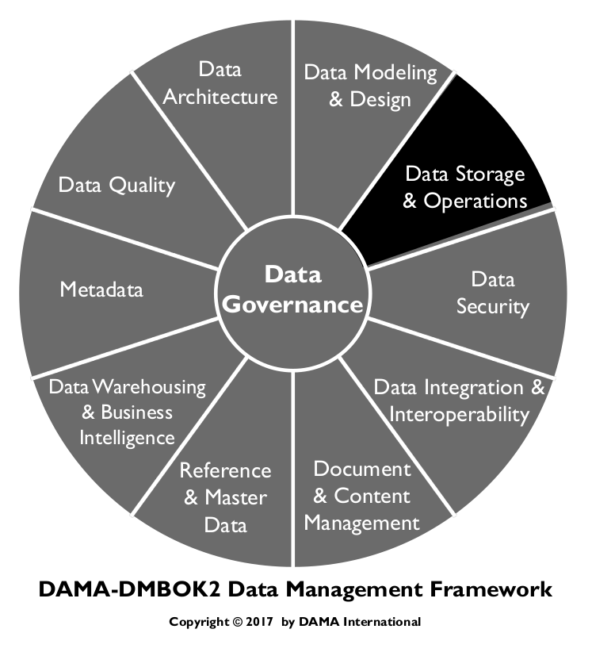
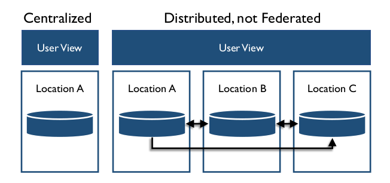
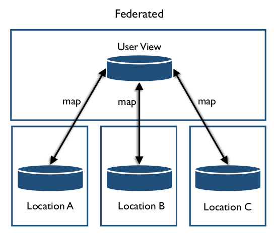
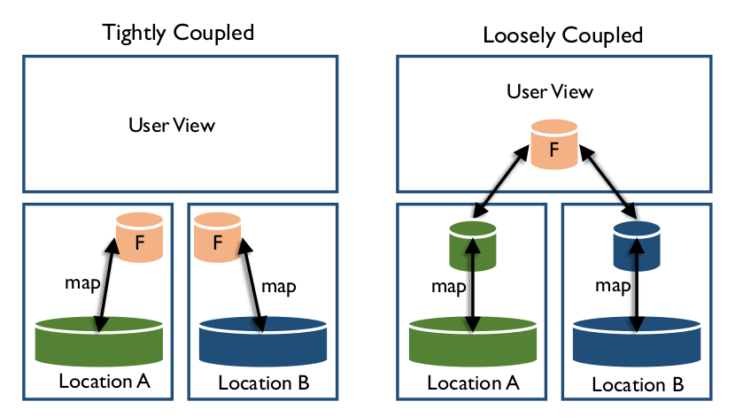
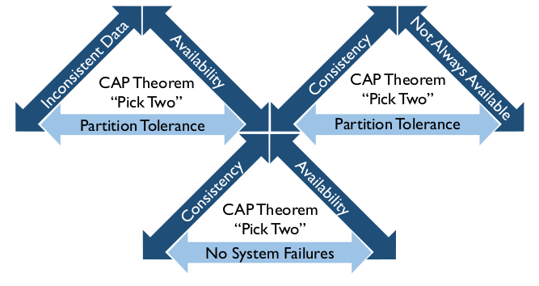
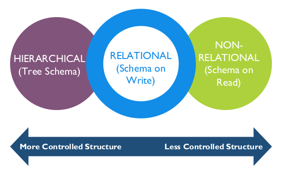
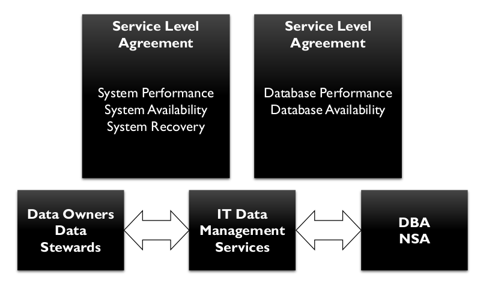

# Armazenamento e Operações de Dados

## 1. Introdução

Armazenamento e Operações de Dados inclui o design, a implementação e o suporte de dados armazenados, para
maximizar seu valor ao longo de seu ciclo de vida, desde a criação/aquisição até o descarte (consulte o Capítulo 1).
Armazenamento e Operações de Dados inclui duas subatividades:

* O suporte a bancos de dados concentra-se em atividades relacionadas ao ciclo de vida dos dados, desde a implementação inicial de um ambiente de banco de dados até a obtenção, o backup e a eliminação de dados. Também inclui garantir o bom desempenho do banco de dados. O monitoramento e o ajuste são essenciais para o suporte a bancos de dados.
* O suporte à tecnologia de banco de dados inclui a definição de requisitos técnicos que atendam às necessidades organizacionais, a definição da arquitetura técnica, a instalação e a administração da tecnologia e a resolução de problemas relacionados à tecnologia.

Administradores de banco de dados (DBAs) desempenham papéis fundamentais tanto em aspectos de armazenamento quanto de operações de dados. A função de DBA é a mais estabelecida e amplamente adotada por profissionais de dados, e as práticas de administração de banco de dados são talvez as mais maduras de todas as práticas de gerenciamento de dados. Os DBAs também desempenham papéis dominantes em operações e segurança de dados. (Ver Capítulo 7.)

Figura 54 Diagrama de Contexto: Armazenamento de Dados e Operações

### 1.1 Impulsionadores de Negócios

As empresas dependem de seus sistemas de informação para executar suas operações. As atividades de Armazenamento de Dados e Operações são cruciais para organizações que dependem de dados. A continuidade dos negócios é o principal impulsionador dessas atividades. Se um sistema ficar indisponível, as operações da empresa podem ser prejudicadas ou completamente interrompidas. Uma infraestrutura confiável de armazenamento de dados para as operações de TI minimiza o risco de interrupção.

### 1.2 Objetivos e Princípios

Os objetivos do armazenamento de dados e das operações incluem:

* Gerenciar a disponibilidade dos dados ao longo do ciclo de vida dos dados
* Garantir a integridade dos ativos de dados
* Gerenciar o desempenho das transações de dados

O Armazenamento de Dados e as Operações representam um aspecto altamente técnico do gerenciamento de dados. DBAs e outros envolvidos neste trabalho podem desempenhar melhor seu trabalho e auxiliar o trabalho geral de gerenciamento de dados ao seguirem estes princípios orientadores:

* Identificar e aproveitar oportunidades de automação: Automatizar processos de desenvolvimento de banco de dados, ferramentas de desenvolvimento e processos que encurtam cada ciclo de desenvolvimento, reduzem erros e retrabalho e minimizam o impacto na equipe de desenvolvimento. Dessa forma, os DBAs podem se adaptar a abordagens mais iterativas (ágeis) para o desenvolvimento de aplicações. Esse trabalho de melhoria deve ser realizado em colaboração com a modelagem de dados e a Arquitetura de Dados.
* Construir com foco na reutilização: Desenvolver e promover o uso de objetos de dados abstratos e reutilizáveis ​​que impeçam que as aplicações sejam fortemente acopladas a esquemas de banco de dados (a chamada "incompatibilidade de impedância objeto-relacional"). Existem diversos mecanismos para esse fim, incluindo visualizações de banco de dados, gatilhos, funções e procedimentos armazenados, objetos de dados de aplicações e camadas de acesso a dados, XML e XSLT, conjuntos de dados tipados em ADO.NET e serviços web. O DBA deve ser capaz de avaliar a melhor abordagem para a virtualização de dados. O objetivo final é tornar o uso do banco de dados o mais rápido, fácil e indolor possível.
* Compreender e aplicar adequadamente as melhores práticas: Os administradores de banco de dados devem promover os padrões e as melhores práticas de banco de dados como requisitos, mas ser flexíveis o suficiente para se desviar deles se houver motivos aceitáveis ​​para esses desvios. Os padrões de banco de dados nunca devem ser uma ameaça ao sucesso de um projeto.
* Conectar os padrões de banco de dados aos requisitos de suporte: Por exemplo, o Acordo de Nível de Serviço (ANS) pode refletir os métodos recomendados pelo administrador de banco de dados e aceitos pelo desenvolvedor para garantir a integridade e a segurança dos dados. O ANS deve refletir a transferência de responsabilidade dos administradores de banco de dados para a equipe de desenvolvimento, caso esta codificar seus próprios procedimentos de atualização de banco de dados ou a camada de acesso aos dados. Isso evita uma abordagem de "tudo ou nada" em relação aos padrões.
* Definir expectativas para a função do administrador de banco de dados no trabalho do projeto: Garantir que a metodologia do projeto inclua a integração do administrador de banco de dados na fase de definição do projeto pode ajudar durante todo o SDLC. O administrador de banco de dados pode entender as necessidades do projeto e os requisitos de suporte antecipadamente. Isso melhorará a comunicação, esclarecendo as expectativas da equipe do projeto com o grupo de dados. Ter um DBA primário e um secundário dedicados durante a análise e o design esclarece as expectativas sobre as tarefas, os padrões, o esforço de trabalho e os cronogramas do DBA para o desenvolvimento. As equipes também devem esclarecer as expectativas de suporte após a implementação.

### 1.3 Conceitos Essenciais

#### 1.3.1 Termos de Banco de Dados

A terminologia de banco de dados é específica e técnica. Ao trabalhar como DBA ou com DBAs, é importante entender as especificidades dessa linguagem técnica:

* Banco de Dados: Qualquer coleção de dados armazenados, independentemente de estrutura ou conteúdo. Alguns bancos de dados grandes referem-se a instâncias e esquemas.
* Instância: Uma execução de software de banco de dados que controla o acesso a uma determinada área de armazenamento. Uma organização geralmente terá várias instâncias em execução simultânea, usando diferentes áreas de armazenamento. Cada instância é independente de todas as outras instâncias.
* Esquema: Um subconjunto de objetos de um banco de dados contidos no próprio banco de dados ou em uma instância. Esquemas são usados ​​para organizar objetos em partes mais gerenciáveis. Normalmente, um esquema tem um proprietário e uma lista de acesso específica para o conteúdo do esquema. Usos comuns de esquemas são isolar objetos que contêm dados confidenciais da base geral de usuários ou isolar visualizações somente leitura das tabelas subjacentes em bancos de dados relacionais. Esquema também pode ser usado para se referir a uma coleção de estruturas de banco de dados com algo em comum.
* Nó: Um computador individual que hospeda processamento ou dados como parte de um banco de dados distribuído.
* Abstração de banco de dados significa que uma interface de aplicação comum (API) é usada para chamar funções de banco de dados, de forma que um aplicativo possa se conectar a vários bancos de dados diferentes sem que o programador precise conhecer todas as chamadas de função para todos os bancos de dados possíveis. ODBC (Open Database Connectivity) é um exemplo de API que permite a abstração de banco de dados. As vantagens incluem portabilidade; as desvantagens incluem a impossibilidade de usar funções específicas de banco de dados que não são comuns a todos os bancos de dados.

#### 1.3.2 Gerenciamento do Ciclo de Vida de Dados

Os DBAs mantêm e garantem a precisão e a consistência dos dados ao longo de todo o seu ciclo de vida por meio do design, implementação e uso de qualquer sistema que armazene, processe ou recupere dados. O DBA é o guardião de todas as alterações no banco de dados. Embora muitas partes possam solicitar alterações, o DBA define as alterações precisas a serem feitas no banco de dados, implementa as alterações e as controla.

O gerenciamento do ciclo de vida de dados inclui a implementação de políticas e procedimentos para aquisição, migração, retenção, expiração e descarte de dados. É prudente preparar listas de verificação para garantir que todas as tarefas sejam executadas com alto nível de qualidade. Os administradores de banco de dados (DBAs) devem usar um processo controlado, documentado e auditável para mover as alterações no banco de dados do aplicativo para os ambientes de Garantia da Qualidade ou Certificação (QA) e Produção. Uma solicitação de serviço ou solicitação de alteração aprovada pelo gerente geralmente inicia o processo. O DBA deve ter um plano de retorno para reverter as alterações em caso de problemas.

#### 1.3.3 Administradores

A função de Administrador de Banco de Dados (DBA) é a mais estabelecida e amplamente adotada entre os profissionais de dados. Os DBAs desempenham funções dominantes em Armazenamento e Operações de Dados, além de funções críticas em Segurança de Dados (consulte o Capítulo 7), no aspecto físico da modelagem de dados e no design de banco de dados (consulte o Capítulo 5). Os DBAs fornecem suporte para ambientes de banco de dados de desenvolvimento, teste, QA e uso especial.

Os DBAs não realizam exclusivamente todas as atividades de Armazenamento e Operações de Dados. Administradores de dados, arquitetos de dados, administradores de rede, analistas de dados e analistas de segurança participam do planejamento de desempenho, retenção e recuperação. Essas equipes também podem participar da obtenção e do processamento de dados de fontes externas.

Muitos DBAs são especializados em Produção, Aplicação, Procedimentos e Desenvolvimento. Algumas organizações também possuem Administradores de Armazenamento de Rede (NSA), especializados em dar suporte ao sistema de armazenamento de dados separadamente dos aplicativos ou estruturas de armazenamento de dados.

Em algumas organizações, cada função especializada se reporta a uma organização diferente dentro da TI. Os DBAs de Produção podem fazer parte de grupos de suporte a operações de infraestrutura ou de aplicações de produção. DBAs de Aplicação, Desenvolvimento e Procedimentos às vezes são integrados a organizações de desenvolvimento de aplicações. Os NSAs geralmente estão conectados a organizações de Infraestrutura.

##### 1.3.3.1 DBAs de Produção

Os DBAs de Produção são os principais responsáveis ​​pelo gerenciamento das operações de dados, incluindo:

* Garantir o desempenho e a confiabilidade do banco de dados, por meio de ajustes de desempenho, monitoramento, relatórios de erros e outras atividades
* Implementar mecanismos de backup e recuperação para garantir que os dados possam ser recuperados em caso de perda em qualquer circunstância
* Implementar mecanismos para clusterização e failover do banco de dados, caso a disponibilidade contínua dos dados seja um requisito
* Executar outras atividades de manutenção do banco de dados, como a implementação de mecanismos para arquivamento de dados

Como parte do gerenciamento das operações de dados, os DBAs de Produção criam os seguintes entregáveis:

* Um ambiente de banco de dados de produção, incluindo uma instância do SGBD (Sistema de Gerenciamento de Banco de Dados) no servidor de suporte, com tamanho e capacidade suficientes para garantir desempenho adequado, configurado para o nível apropriado de segurança, confiabilidade e disponibilidade. A Administração do Sistema de Banco de Dados é responsável pelo ambiente do SGBD.

* Mecanismos e processos para implementação controlada de alterações em bancos de dados no ambiente de produção
* Mecanismos para garantir a disponibilidade, integridade e recuperabilidade dos dados em resposta a todas as circunstâncias que possam resultar em perda ou corrupção de dados
* Mecanismos para detectar e reportar qualquer erro que ocorra no banco de dados, no SGBD ou no servidor de dados
* Disponibilidade, recuperação e desempenho do banco de dados de acordo com os acordos de nível de serviço
* Mecanismos e processos para monitorar o desempenho do banco de dados conforme as cargas de trabalho e os volumes de dados variam

##### 1.3.3.2 DBA de Aplicação

Um DBA de aplicação é responsável por um ou mais bancos de dados em todos os ambientes (desenvolvimento/teste, QA e produção), em oposição à administração de sistemas de banco de dados para qualquer um desses ambientes. Às vezes, os DBAs de aplicação se reportam às unidades organizacionais responsáveis ​​pelo desenvolvimento e manutenção dos aplicativos suportados por seus bancos de dados. Há prós e contras em contratar DBAs de aplicação.

Os DBAs de aplicação são vistos como membros integrais de uma equipe de suporte a aplicações. Ao se concentrarem em um banco de dados específico, eles podem fornecer um serviço melhor aos desenvolvedores de aplicações. No entanto, os DBAs de aplicação podem facilmente se isolar e perder de vista as necessidades gerais de dados da organização e as práticas comuns de DBA. DBAs de aplicação colaboram estreitamente com analistas de dados, modeladores e arquitetos.

##### 1.3.3.3 DBAs de Procedimento e Desenvolvimento

DBAs de Procedimento lideram a revisão e a administração de objetos de banco de dados procedural. Um DBA de procedimento é especializado no desenvolvimento e suporte da lógica procedural controlada e executada pelo SGBD: procedimentos armazenados, gatilhos e funções definidas pelo usuário (UDFs). O DBA de procedimento garante que essa lógica procedural seja planejada, implementada, testada e compartilhada (reutilizada).

DBAs de desenvolvimento concentram-se em atividades de design de dados, incluindo a criação e o gerenciamento de bancos de dados de uso especial, como áreas de "sandbox" ou de exploração.

Em muitos casos, essas duas funções são combinadas em uma única posição.

##### 1.3.3.4 NSA
Administradores de Armazenamento de Rede se preocupam com o hardware e o software que suportam os arrays de armazenamento de dados. Sistemas com múltiplos conjuntos de armazenamento em rede têm necessidades e requisitos de monitoramento diferentes dos sistemas de banco de dados simples.

#### 1.3.4 Tipos de Arquitetura de Banco de Dados

Um banco de dados pode ser classificado como centralizado ou distribuído. Um sistema centralizado gerencia um único banco de dados, enquanto um sistema distribuído gerencia múltiplos bancos de dados em múltiplos sistemas. Os componentes de um sistema distribuído podem ser classificados, dependendo da autonomia dos sistemas componentes, em dois tipos: federados (autônomos) ou não federados (não autônomos). A Figura 55 ilustra a diferença entre centralizado e distribuído.

Figura 55 Centralizado vs. Distribuído

##### 1.3.4.1 Bancos de Dados Centralizados

Bancos de dados centralizados reúnem todos os dados em um único sistema, em um só lugar. Todos os usuários acessam o sistema para acessá-los. Para determinados dados restritos, a centralização pode ser ideal, mas para dados que precisam estar amplamente disponíveis, os bancos de dados centralizados apresentam riscos. Por exemplo, se o sistema centralizado não estiver disponível, não há outras alternativas para acessar os dados.

##### 1.3.4.2 Bancos de Dados Distribuídos

Bancos de dados distribuídos possibilitam acesso rápido aos dados em um grande número de nós. As tecnologias populares de bancos de dados distribuídos baseiam-se no uso de servidores de hardware comuns. Eles são projetados para escalar de servidores individuais para milhares de máquinas, cada uma oferecendo computação e armazenamento locais. Em vez de depender de hardware para fornecer alta disponibilidade, o próprio software de gerenciamento de banco de dados é projetado para replicar dados entre os servidores, fornecendo, assim, um serviço de alta disponibilidade sobre um cluster de computadores. O software de gerenciamento de banco de dados também é projetado para detectar e lidar com falhas. Embora qualquer computador possa falhar, é improvável que o sistema como um todo falhe.

Alguns bancos de dados distribuídos implementam um paradigma computacional chamado MapReduce para melhorar ainda mais o desempenho. No MapReduce, a solicitação de dados é dividida em vários pequenos fragmentos de trabalho, cada um dos quais pode ser executado ou reexecutado em qualquer nó do cluster. Além disso, os dados são co-localizados nos nós de computação, fornecendo uma largura de banda agregada muito alta em todo o cluster. Tanto o sistema de arquivos quanto o aplicativo são projetados para lidar automaticamente com falhas de nós.

###### 1.3.4.2.1 Bancos de Dados Federados

A federação provisiona dados sem persistência adicional ou duplicação dos dados de origem. Um sistema de banco de dados federado mapeia vários sistemas de banco de dados autônomos em um único banco de dados federado. Os bancos de dados constituintes, às vezes geograficamente separados, são interconectados por meio de uma rede de computadores. Eles permanecem autônomos, mas participam de uma federação para permitir o compartilhamento parcial e controlado de seus dados. A federação oferece uma alternativa à fusão de bancos de dados distintos. Não há integração real de dados nos bancos de dados constituintes devido à federação de dados; em vez disso, a interoperabilidade de dados gerencia a visão dos bancos de dados federados como um grande objeto (consulte o Capítulo 8). Em contraste, um sistema de banco de dados não federado é uma integração de SGBDs componentes que não são autônomos; eles são controlados, gerenciados e governados por um SGBD centralizado.

Bancos de dados federados são mais adequados para projetos de integração heterogêneos e distribuídos, como integração de informações corporativas, virtualização de dados, correspondência de esquemas e Gerenciamento de Dados Mestres.

As arquiteturas federadas diferem com base nos níveis de integração com os sistemas de banco de dados de componentes e na extensão dos serviços oferecidos pela federação. Um FDBMS pode ser categorizado como fracamente acoplado ou fortemente acoplado.

Figura 56 Bancos de Dados Federados

Sistemas fracamente acoplados exigem que os bancos de dados de componentes construam seu próprio esquema federado. Um usuário normalmente acessa outros sistemas de banco de dados de componentes usando uma linguagem multibanco de dados, mas isso remove qualquer nível de transparência de localização, forçando o usuário a ter conhecimento direto do esquema federado. Um usuário importa os dados necessários de outros bancos de dados de componentes e os integra aos seus para formar um esquema federado.

Sistemas fortemente acoplados consistem em sistemas de componentes que usam processos independentes para construir e publicar um esquema federado integrado, conforme ilustrado na Figura 57. O mesmo esquema pode ser aplicado a todas as partes da federação, sem replicação de dados.

Figura 57 Acoplamento

###### 1.3.4.2.2 Banco de Dados Blockchain

Bancos de dados blockchain são um tipo de banco de dados federado usado para gerenciar transações financeiras com segurança. Eles também podem ser usados ​​para gerenciamento de contratos ou troca de informações de saúde. Existem dois tipos de estruturas: registros individuais e blocos. Cada transação possui um registro. O banco de dados cria cadeias de grupos de transações (blocos) com limite de tempo que também contêm informações do bloco anterior na cadeia. Algoritmos de hash são usados ​​para criar informações sobre transações para armazenar em blocos enquanto o bloco é o fim da cadeia. Uma vez que um novo bloco é criado, o hash do bloco antigo nunca deve mudar, o que significa que nenhuma transação contida naquele bloco pode mudar. Qualquer alteração em transações ou blocos (adulteração) será aparente quando os valores de hash não corresponderem mais.

##### 1.3.4.3 Virtualização / Plataformas em Nuvem

A virtualização (também chamada de "computação em nuvem") fornece serviços de computação, software, acesso a dados e armazenamento que não exigem o conhecimento do usuário final sobre a localização física e a configuração do sistema que fornece o(s) serviço(s). Paralelos são frequentemente traçados entre o conceito de computação em nuvem e a rede elétrica: os usuários finais consomem energia sem precisar entender os dispositivos ou a infraestrutura necessários para fornecer o serviço. No entanto, a virtualização pode ser local ou externa.

A computação em nuvem é uma evolução natural da ampla adoção da virtualização, arquiteturas orientadas a serviços e computação utilitária. Aqui estão alguns métodos para implementar bancos de dados na nuvem:

* Imagem de máquina virtual: As plataformas em nuvem permitem que os usuários adquiram instâncias de máquinas virtuais por tempo limitado. É possível executar um banco de dados nessas máquinas virtuais. Os usuários podem carregar sua própria imagem de máquina com um banco de dados instalado ou usar imagens de máquina prontas que já incluem uma instalação otimizada de um banco de dados.
* Banco de dados como serviço (DaaS): Algumas plataformas em nuvem oferecem opções para usar um banco de dados como serviço, sem iniciar fisicamente uma instância de máquina virtual para o banco de dados. Nessa configuração, os proprietários de aplicativos não precisam instalar e manter o banco de dados por conta própria. Em vez disso, o provedor de serviços de banco de dados é responsável por instalar e manter o banco de dados, e os proprietários de aplicativos pagam de acordo com o uso.
* Hospedagem de banco de dados gerenciado na nuvem: Aqui, o banco de dados não é oferecido como um serviço; em vez disso, o provedor de nuvem hospeda o banco de dados e o gerencia em nome do proprietário do aplicativo.

Os administradores de banco de dados (DBAs), em coordenação com os administradores de rede e de sistema, precisam estabelecer uma abordagem sistemática e integrada ao projeto, que inclua padronização, consolidação, virtualização e automação das funções de backup e recuperação de dados, bem como a segurança dessas funções.

* Padronização/consolidação: A consolidação reduz o número de locais de armazenamento de dados que uma organização possui, incluindo o número de repositórios de dados e processos dentro de um data center. Com base na política de Governança de Dados, Arquitetos de Dados e DBAs podem desenvolver procedimentos padrão que incluem a identificação de dados críticos para a missão, a duração da retenção de dados, os procedimentos de criptografia de dados e as políticas de replicação de dados.
* Virtualização de servidores: As tecnologias de virtualização permitem que equipamentos, como servidores de vários data centers, sejam substituídos ou consolidados. A virtualização reduz as despesas de capital e operacionais e reduz o consumo de energia. As tecnologias de virtualização também são usadas para criar desktops virtuais, que podem ser hospedados em data centers e alugados por assinatura. A Gartner vê a virtualização como um catalisador para a modernização (Bittman, 2009). A virtualização proporciona às operações de armazenamento de dados muito mais flexibilidade no provisionamento de armazenamento em ambientes locais ou em nuvem.
* Automação: A automação de dados envolve a automação de tarefas como provisionamento, configuração, aplicação de patches, gerenciamento de versões e conformidade.
* Segurança: A segurança dos dados em sistemas virtuais precisa ser integrada à segurança existente das infraestruturas físicas (consulte o Capítulo 7).

#### 1.3.5 Tipos de Processamento de Banco de Dados

Existem dois tipos básicos de processamento de banco de dados. ACID e BASE estão em extremos opostos de um espectro, portanto, os nomes coincidentes que correspondem aos extremos de um espectro de pH são úteis. O Teorema CAP é usado para definir o quão próximo um sistema distribuído pode corresponder a ACID ou BASE.

##### 1.3.5.1 ACID

A sigla ACID foi cunhada no início da década de 1980 como a restrição indispensável para alcançar a confiabilidade em transações de banco de dados. Por décadas, ela forneceu ao processamento de transações uma base confiável sobre a qual construir. [^34]

* Atomicidade: Todas as operações são executadas, ou nenhuma delas, de modo que, se uma parte da transação falhar, toda a transação falhará.
* Consistência: A transação deve atender a todas as regras definidas pelo sistema o tempo todo e deve anular transações incompletas.
* Isolamento: Cada transação é independente.
* Durabilidade: Uma vez concluída, a transação não pode ser desfeita.

As tecnologias ACID relacionais são as ferramentas dominantes no armazenamento de bancos de dados relacionais; a maioria utiliza SQL como interface.

##### 1.3.5.2 BASE

O aumento sem precedentes nos volumes e na variabilidade de dados, a necessidade de documentar e armazenar dados não estruturados, a necessidade de cargas de trabalho de dados otimizadas para leitura e a subsequente necessidade de maior flexibilidade em escala, design, processamento, custo e recuperação de desastres deram origem ao oposto do ACID, apropriadamente denominado BASE:

* **Basicamente Disponível:** O sistema garante algum nível de disponibilidade dos dados mesmo quando há falhas nos nós. Os dados podem estar obsoletos, mas o sistema ainda fornecerá e aceitará respostas.
* **Estado Suave:** Os dados estão em um estado constante de fluxo; embora uma resposta possa ser fornecida, não há garantia de que os dados estejam atualizados.
* **Consistência Eventual:** Os dados eventualmente serão consistentes em todos os nós e em todos os bancos de dados, mas nem todas as transações serão consistentes o tempo todo.

Sistemas do tipo BASE são comuns em ambientes de Big Data. Grandes organizações online e empresas de mídia social comumente usam implementações BASE, pois a precisão imediata de todos os elementos de dados em todos os momentos não é necessária. A Tabela 12 resume as diferenças entre ACID e BASE.

Tabela 12 ACID vs. BASE

<table>
  <thead>
    <tr>
      <th>Item</th>
      <th>ACID</th>
      <th>BASE</th>
    </tr>
  </thead>
  <tbody>
    <tr>
      <td rowspan="3">Casting (estrutura de dados)</td>
      <td>O esquema deve existir</td>
      <td>Dinâmico</td>
    </tr>
    <tr>
      <td>A estrutura da tabela existe</td>
      <td>Ajuste em tempo real</td>
    </tr>
    <tr>
      <td>Colunas com tipo de dados</td>
      <td>Armazenamento de dados diferentes</td>
    </tr>
    <tr>
      <td>Consistência</td>
      <td>Consistência forte disponível</td>
      <td>Forte, Eventual ou Nenhuma</td>
    </tr>
    <tr>
      <td>Foco no Processamento</td>
      <td>Transacional</td>
      <td>Armazenamentos de chave-valor</td>
    </tr>
    <tr>
      <td>Foco no Processamento</td>
      <td>Linha/Coluna</td>
      <td>Armazenamentos de colunas largas</td>
    </tr>
    <tr>
      <td>Histórico</td>
      <td>Armazenamento de aplicativos da década de 1970</td>
      <td>Armazenamento não estruturado da década de 2000</td>
    </tr>
    <tr>
      <td>Escalamento</td>
      <td>Dependente do Produto</td>
      <td>Distribui dados automaticamente entre servidores comuns</td>
    </tr>
    <tr>
      <td>Origem</td>
      <td>Mistura</td>
      <td>Código aberto</td>
    </tr>
    <tr>
      <td>Transação</td>
      <td>Sim</td>
      <td>Possível</td>
    </tr>
  </tbody>
</table>

##### 1.3.5.3 CAP

O Teorema CAP (ou Teorema de Brewer) foi desenvolvido em resposta à mudança para sistemas mais distribuídos (Brewer, 2000). O teorema afirma que um sistema distribuído não pode estar em conformidade com todas as partes do ACID o tempo todo. Quanto maior o sistema, menor a conformidade. Um sistema distribuído deve, em vez disso, equilibrar as propriedades.

* **Consistência:** O sistema deve operar conforme projetado e esperado o tempo todo.
* **Disponibilidade:** O sistema deve estar disponível quando solicitado e deve responder a cada solicitação.
* **Tolerância à Partição:** O sistema deve ser capaz de continuar operando durante situações de perda de dados ou falha parcial do sistema.

O Teorema CAP afirma que, no máximo, duas das três propriedades podem existir em qualquer sistema de dados compartilhados. Isso geralmente é expresso com uma declaração de "escolha dois", ilustrada na Figura 58.

Figura 58 Teorema CAP

Um uso interessante deste teorema orienta o projeto da Arquitetura Lambda discutido no Capítulo 14. A Arquitetura Lambda utiliza dois caminhos para dados: um caminho de Velocidade, onde a disponibilidade e a tolerância à partição são mais importantes, e um caminho de Lote, onde a consistência e a disponibilidade são mais importantes.

#### 1.3.6 Mídia de Armazenamento de Dados

Os dados podem ser armazenados em uma variedade de mídias, incluindo discos, memória volátil e pen drives. Alguns sistemas podem combinar vários tipos de armazenamento. Os mais comumente usados ​​são Redes de Disco e Área de Armazenamento (SAN), In-Memory, Soluções de Compressão Colunar, Redes de Área de Armazenamento Virtual (VSAN), soluções de armazenamento em nuvem, Identificação por Radiofrequência (RFID), carteiras digitais, data centers e armazenamento em nuvem privada, pública e híbrida. (Consulte o Capítulo 14.)

##### 1.3.6.1 Redes de Disco e Área de Armazenamento (SAN)

O armazenamento em disco é um método muito estável de armazenamento persistente de dados. Vários tipos de disco podem existir no mesmo sistema. Os dados podem ser armazenados de acordo com os padrões de uso, com os dados menos utilizados armazenados em discos de acesso mais lento, que geralmente são mais baratos do que os sistemas de disco de alto desempenho.

Matrizes de disco podem ser coletadas em Redes de Área de Armazenamento (SAN). A movimentação de dados em uma SAN pode não exigir uma rede, pois os dados podem ser movidos no backplane.

##### 1.3.6.2 Na Memória

Bancos de dados na memória (IMDB) são carregados do armazenamento permanente para a memória volátil quando o sistema é ligado, e todo o processamento ocorre dentro da matriz de memória, proporcionando um tempo de resposta mais rápido do que os sistemas baseados em disco. A maioria dos bancos de dados na memória também possui recursos para definir e configurar a durabilidade em caso de desligamento inesperado.

Se for possível garantir razoavelmente que a aplicação acomodará a maioria/todos os dados na memória, uma otimização significativa poderá ser disponibilizada por sistemas de banco de dados em memória. Esses IMDBs fornecem tempo de acesso aos dados mais previsível do que mecanismos de armazenamento em disco, mas exigem um investimento muito maior. Os IMDBs fornecem funcionalidade para processamento de análises em tempo real e geralmente são reservados para esse fim devido ao investimento necessário.

##### 1.3.6.3 Soluções de Compressão em Colunas

Bancos de dados baseados em colunas são projetados para lidar com conjuntos de dados nos quais os valores dos dados são amplamente repetidos. Por exemplo, em uma tabela com 256 colunas, uma busca por um valor existente em uma linha recuperará todos os dados da linha (e será, de certa forma, limitada ao disco). O armazenamento em colunas reduz essa largura de banda de E/S ao armazenar dados de coluna usando compressão – onde o estado (por exemplo) é armazenado como um ponteiro para uma tabela de estados, comprimindo significativamente a tabela mestre.

##### 1.3.6.4 Memória Flash

Avanços recentes no armazenamento em memória tornaram a memória flash ou unidades de estado sólido (SSDs) uma alternativa atraente aos discos. A memória flash combina a velocidade de acesso do armazenamento baseado em memória com a persistência do armazenamento baseado em disco.

#### 1.3.7 Ambientes de Banco de Dados

Bancos de dados são usados ​​em diversos ambientes durante o ciclo de vida de desenvolvimento de sistemas. Ao testar alterações, os DBAs devem estar envolvidos no projeto das estruturas de dados no ambiente de Desenvolvimento. A equipe de DBAs deve implementar quaisquer alterações no ambiente de Controle de Qualidade e deve ser a única equipe a implementar alterações no ambiente de Produção. As alterações na produção devem obedecer rigorosamente aos processos e procedimentos padrão.

Embora a maior parte da tecnologia de dados seja composta por softwares executados em hardware de uso geral, ocasionalmente hardware especializado é usado para atender a requisitos específicos de gerenciamento de dados. Tipos de hardware especializado incluem dispositivos de dados – servidores construídos especificamente para transformação e distribuição de dados. Esses servidores se integram à infraestrutura existente, seja diretamente como um plug-in ou perifericamente como uma conexão de rede.

##### 1.3.7.1 Ambiente de Produção

O ambiente de produção é o ambiente técnico onde todos os processos de negócios ocorrem. A produção é crítica para a missão – se esse ambiente parar de operar, os processos de negócios serão interrompidos, resultando em perdas nos resultados financeiros, bem como em um impacto negativo para os clientes que não conseguem acessar os serviços. Em uma emergência, ou para sistemas de serviço público, a perda inesperada de funções pode ser desastrosa.

O ambiente de produção é o ambiente "real" de uma perspectiva de negócios. No entanto, para ter um ambiente de produção confiável, outros ambientes não relacionados à produção devem existir e ser usados ​​adequadamente. Por exemplo, ambientes de produção não devem ser usados ​​para desenvolvimento e testes, pois essas atividades colocam os processos de produção e os dados em risco.

##### 1.3.7.2 Ambientes de Pré-produção

Os ambientes de pré-produção são usados ​​para desenvolver e testar mudanças antes que elas sejam introduzidas no ambiente de produção. Em ambientes de pré-produção, problemas com mudanças podem ser detectados e resolvidos sem afetar os processos normais de negócios. Para detectar possíveis problemas, a configuração dos ambientes de pré-produção deve ser muito semelhante à do ambiente de produção.

Devido ao espaço e ao custo, geralmente não é possível replicar exatamente a produção nos ambientes de pré-produção. Quanto mais próximo o ambiente de não produção estiver do ambiente de produção no caminho de desenvolvimento, mais próximo o ambiente de não produção precisa ser do ambiente de produção. Qualquer desvio do equipamento e da configuração do sistema de produção pode, por si só, criar problemas ou erros não relacionados à mudança, complicando a pesquisa e a resolução de problemas.

Os tipos comuns de ambientes de pré-produção incluem ambientes de desenvolvimento, teste, suporte e uso especial.

###### 1.3.7.2.1 Desenvolvimento

O ambiente de desenvolvimento geralmente é uma versão mais enxuta do ambiente de produção. Geralmente, possui menos espaço em disco, menos CPUs, menos RAM, etc. Os desenvolvedores usam esse ambiente para criar e testar código para alterações em ambientes separados, que são então combinados no ambiente de QA para testes de integração completos. O desenvolvimento pode ter muitas cópias dos modelos de dados de produção, dependendo de como os projetos de desenvolvimento são gerenciados. Organizações maiores podem conceder a desenvolvedores individuais seus próprios ambientes para gerenciar com todos os direitos apropriados.

O ambiente de desenvolvimento deve ser o primeiro local onde quaisquer patches ou atualizações são aplicados para testes. Este ambiente deve ser isolado e estar em hardware físico diferente dos ambientes de produção. Devido ao isolamento, os dados dos sistemas de produção podem precisar ser copiados para os ambientes de desenvolvimento. No entanto, em muitos setores, os dados de produção são protegidos por regulamentação. Não mova dados de ambientes de produção sem primeiro determinar quais são as restrições para isso. (Consulte o Capítulo 7.)

###### 1.3.7.2.2 Teste

O ambiente de teste é usado para executar testes de garantia de qualidade e de aceitação do usuário e, em alguns casos, testes de estresse ou de desempenho. Para evitar que os resultados dos testes sejam distorcidos devido a diferenças ambientais, o ambiente de teste, idealmente, também possui o mesmo software e hardware que o ambiente de produção. Isso é especialmente importante para testes de desempenho. O teste pode ou não estar conectado via rede aos sistemas de produção para ler os dados de produção. Os ambientes de teste nunca devem gravar em sistemas de produção.

Os ambientes de teste atendem a diversos usos:

* Teste de Garantia de Qualidade (QA): Usado para testar a funcionalidade em relação aos requisitos.
* Teste de Integração: Usado para testar como um todo várias partes de um sistema que foram desenvolvidas ou atualizadas independentemente.
* Teste de Aceitação do Usuário (UAT): Utilizado para testar a funcionalidade do sistema sob a perspectiva do usuário. Casos de Uso são as entradas mais comuns para testes realizados neste ambiente.
* Teste de Desempenho: Utilizado para realizar testes de alto volume ou alta complexidade a qualquer momento, sem precisar esperar por horários de pico ou afetar negativamente o horário de pico do sistema de produção.

###### 1.3.7.2.3 Sandboxes ou Ambientes Experimentais

Um sandbox é um ambiente alternativo que permite conexões somente leitura com dados de produção e pode ser gerenciado pelos usuários. Sandboxes são usados ​​para experimentar opções de desenvolvimento e testar hipóteses sobre dados ou mesclar dados de produção com dados desenvolvidos pelo usuário ou dados suplementares obtidos de fontes externas. Sandboxes são valiosos, por exemplo, ao realizar uma Prova de Conceito.

Um ambiente sandbox pode ser um subconjunto do sistema de produção, isolado do processamento de produção, ou um ambiente completamente separado. Os usuários do sandbox geralmente têm direitos CRUD sobre seu próprio espaço para que possam validar rapidamente ideias e opções de alterações no sistema. Os DBAs geralmente têm pouco a ver com esses ambientes, além de configurá-los, conceder acesso e monitorar o uso. Se as áreas do sandbox estiverem localizadas em sistemas de banco de dados de produção, elas devem ser isoladas para evitar afetar negativamente as operações de produção. Esses ambientes nunca devem retornar dados para os sistemas de produção.

Ambientes sandbox podem ser gerenciados por máquinas virtuais (VMs), a menos que os custos de licenciamento para instâncias separadas se tornem proibitivos.

#### 1.3.8 Organização de Banco de Dados

Os sistemas de armazenamento de dados fornecem uma maneira de encapsular as instruções necessárias para colocar dados em discos e gerenciar o processamento, permitindo que os desenvolvedores simplesmente usem instruções para manipular os dados. Os bancos de dados são organizados de três maneiras gerais: Hierárquica, Relacional e Não Relacional. Essas classes não são mutuamente exclusivas (veja a Figura 59). Alguns sistemas de banco de dados podem ler e gravar dados organizados em estruturas relacionais e não relacionais. Bancos de dados hierárquicos podem ser mapeados para tabelas relacionais. Arquivos simples com delimitadores de linha podem ser lidos como tabelas com linhas, e uma ou mais colunas podem ser definidas para descrever o conteúdo das linhas.

Figura 59 Espectro de Organização de Banco de Dados

##### 1.3.8.1 Hierárquica

A organização hierárquica de banco de dados é o modelo de banco de dados mais antigo, usado nos primeiros SGBDs de mainframe, e é a mais rígida das estruturas. Em bancos de dados hierárquicos, os dados são organizados em uma estrutura semelhante a uma árvore com relacionamentos pai/filho obrigatórios: cada pai pode ter muitos filhos, mas cada filho tem apenas um pai (também conhecido como relacionamento 1-para-muitos). Árvores de diretórios são um exemplo de hierarquia. XML também utiliza um modelo hierárquico. Ele pode ser representado como um banco de dados relacional, embora a estrutura real seja a de um caminho de travessia em árvore.

##### 1.3.8.2 Relacional

Às vezes, as pessoas pensam que os bancos de dados relacionais são nomeados em homenagem à relação entre tabelas. Este não é o caso. Bancos de dados relacionais são baseados na teoria dos conjuntos e na álgebra relacional, onde elementos de dados ou atributos (colunas) são relacionados em tuplas (linhas). (Consulte o Capítulo 5.) Tabelas são conjuntos de relações com estrutura idêntica. Operações de conjunto (como união, interseção e subtração) são usadas para organizar e recuperar dados de bancos de dados relacionais, na forma de Linguagem de Consulta Estruturada (SQL). Para gravar dados, a estrutura (esquema) precisa ser conhecida antecipadamente (esquema na gravação). Bancos de dados relacionais são orientados a linhas.

O sistema de gerenciamento de banco de dados (SGBD) de um banco de dados relacional é chamado de SGBDR. Um banco de dados relacional é a escolha predominante para armazenar dados que mudam constantemente. Variações de bancos de dados relacionais incluem Multidimensional e Temporal.

###### 1.3.8.2.1 Multidimensional

Tecnologias de banco de dados multidimensional armazenam dados em uma estrutura que permite a busca usando vários filtros de elementos de dados simultaneamente. Esse tipo de estrutura é usado com mais frequência em Data Warehousing e Business Intelligence. Alguns desses tipos de banco de dados são proprietários, embora a maioria dos grandes bancos de dados tenha tecnologia de cubo incorporada como objetos. O acesso aos dados usa uma variante de SQL chamada MDX ou Multidimensional eXpression.

###### 1.3.8.2.2 Temporal

Um banco de dados temporal é um banco de dados relacional com suporte integrado para manipulação de dados envolvendo tempo. Os aspectos temporais geralmente incluem o tempo de validade e o tempo de transação. Esses atributos podem ser combinados para formar dados bitemporais.

* Tempo de validade é o período em que um fato é verdadeiro em relação à entidade que representa no mundo real.
* Tempo de transação é o período durante o qual um fato armazenado no banco de dados é considerado verdadeiro.

É possível ter linhas do tempo diferentes do Tempo de validade e do Tempo de transação, como o Tempo de decisão, no banco de dados. Nesse caso, o banco de dados é chamado de banco de dados multitemporal, em oposição a um banco de dados bitemporal. Bancos de dados temporais permitem que desenvolvedores de aplicações e administradores de banco de dados gerenciem versões atuais, propostas e históricas de dados no mesmo banco de dados.

##### 1.3.8.3 Não relacional

Bancos de dados não relacionais podem armazenar dados como strings simples ou arquivos completos. Os dados nesses arquivos podem ser lidos de diferentes maneiras, dependendo da necessidade (essa característica é chamada de "esquema na leitura"). Bancos de dados não relacionais podem ser orientados a linhas, mas isso não é obrigatório.

Um banco de dados não relacional fornece um mecanismo para armazenamento e recuperação de dados que emprega modelos de consistência menos restritos do que bancos de dados relacionais tradicionais. As motivações para essa abordagem incluem simplicidade de design, escalabilidade horizontal e controle mais preciso sobre a disponibilidade.

Bancos de dados não relacionais são geralmente chamados de NoSQL (que significa "Not Only SQL" ou "Não Somente SQL"). O principal fator de diferenciação é a própria estrutura de armazenamento, onde a estrutura de dados não está mais vinculada a um design relacional tabular. Pode ser uma árvore, um grafo, uma rede ou um par chave-valor. A tag NoSQL enfatiza que algumas edições podem, de fato, suportar diretivas SQL convencionais. Esses bancos de dados são frequentemente armazenamentos de dados altamente otimizados, destinados a operações simples de recuperação e acréscimo. O objetivo é melhorar o desempenho, especialmente em relação à latência e à taxa de transferência. Bancos de dados NoSQL são cada vez mais utilizados em Big Data e aplicações web em tempo real. (Consulte o Capítulo 5.)

###### 1.3.8.3.1 Orientado a colunas

Bancos de dados orientados a colunas são utilizados principalmente em aplicações de Business Intelligence, pois podem compactar dados redundantes. Por exemplo, uma coluna de ID de estado possui apenas valores únicos, em vez de um valor para cada um de um milhão de linhas.

Existem compensações entre a organização orientada a colunas (não relacional) e a organização orientada a linhas (geralmente relacional).

* A organização orientada a colunas é mais eficiente quando um agregado precisa ser computado em muitas linhas. Isso só se aplica a um subconjunto consideravelmente menor de todas as colunas de dados, pois a leitura desse subconjunto menor de dados pode ser mais rápida do que a leitura de todos os dados.

* A organização orientada a colunas é mais eficiente quando novos valores de uma coluna são fornecidos para todas as linhas de uma só vez, pois os dados dessa coluna podem ser gravados com eficiência para substituir os dados antigos da coluna sem afetar nenhuma outra coluna para as linhas.
* A organização orientada a linhas é mais eficiente quando muitas colunas de uma única linha são necessárias simultaneamente e quando o tamanho da linha é relativamente pequeno, pois a linha inteira pode ser recuperada com uma única busca em disco.
* A organização orientada a linhas é mais eficiente ao gravar uma nova linha se todos os dados da linha forem fornecidos simultaneamente; a linha inteira pode ser gravada com uma única busca em disco.
* Na prática, layouts de armazenamento orientados a linhas são adequados para cargas de trabalho semelhantes ao Processamento de Transações Online (OLTP), que são mais carregadas com transações interativas. Layouts de armazenamento orientados a colunas são adequados para cargas de trabalho semelhantes ao Processamento Analítico Online (OLAP) (por exemplo, data warehouses), que normalmente envolvem um número menor de consultas altamente complexas sobre todos os dados (possivelmente terabytes).

###### 1.3.8.3.2 Espacial

Um banco de dados espacial é otimizado para armazenar e consultar dados que representam objetos definidos em um espaço geométrico. Bancos de dados espaciais suportam diversos tipos primitivos (formas geométricas simples, como caixa, retângulo, cubo, cilindro, etc.) e geometrias compostas por conjuntos de pontos, linhas e formas geométricas.

Sistemas de bancos de dados espaciais usam índices para consultar valores rapidamente; a forma como a maioria dos bancos de dados indexa dados não é ideal para consultas espaciais. Em vez disso, bancos de dados espaciais usam um índice espacial para acelerar as operações do banco de dados.

Bancos de dados espaciais podem realizar uma ampla variedade de operações espaciais. De acordo com o padrão do Open Geospatial Consortium, um banco de dados espacial pode realizar uma ou mais das seguintes operações:

* Medidas Espaciais: Calcula o comprimento da linha, a área do polígono, a distância entre geometrias, etc.
* Funções Espaciais: Modifica feições existentes para criar novas; por exemplo, fornecendo um buffer ao redor deles, interseccionando recursos, etc.
* Predicados Espaciais: Permitem consultas verdadeiro/falso sobre relações espaciais entre geometrias. Exemplos incluem "Dois polígonos se sobrepõem?" ou "Existe uma residência localizada a menos de 1,6 km da área do aterro sanitário proposto?"
* Construtores de Geometria: Cria novas geometrias, geralmente especificando os vértices (pontos ou nós) que definem a forma.
* Funções de Observação: Consultas que retornam informações específicas sobre um recurso, como a localização do centro de um círculo.

###### 1.3.8.3.3 Objeto / Multimídia

Um banco de dados multimídia inclui um sistema de Gerenciamento de Armazenamento Hierárquico para o gerenciamento eficiente de uma hierarquia de mídias de armazenamento magnéticas e ópticas. Ele também inclui uma coleção de classes de objetos, que representa a base do sistema.

###### 1.3.8.3.4 Banco de Dados de Arquivo Simples

Um banco de dados de arquivo simples descreve qualquer um dos vários meios para codificar um conjunto de dados como um único arquivo. Um arquivo simples pode ser um arquivo de texto simples ou um arquivo binário. Em termos estritos, um banco de dados de arquivo simples consiste apenas em dados e contém registros que podem variar em comprimento e delimitadores. De forma mais ampla, o termo se refere a qualquer banco de dados que exista em um único arquivo na forma de linhas e colunas, sem relacionamentos ou vínculos entre registros e campos, exceto a estrutura. Arquivos de texto simples geralmente contêm um registro por linha. Uma lista de nomes, endereços e números de telefone, escrita à mão em uma folha de papel, é um exemplo de banco de dados de arquivo simples. Arquivos simples são usados ​​não apenas como ferramentas de armazenamento de dados em sistemas SGBD, mas também como ferramentas de transferência de dados. Bancos de dados Hadoop utilizam armazenamento em arquivo simples.

###### 1.3.8.3.5 Par Chave-Valor

Bancos de dados de pares Chave-Valor contêm conjuntos de dois itens: um identificador de chave e um valor. Existem alguns usos específicos para esses tipos de bancos de dados.

* Bancos de Dados de Documentos: Bancos de dados orientados a documentos contêm coleções de arquivos, incluindo estrutura e dados. Cada documento recebe uma chave. Bancos de dados orientados a documentos mais avançados também podem armazenar atributos para o conteúdo do documento, como datas ou tags. Esse tipo de banco de dados pode armazenar documentos completos e incompletos. Bancos de dados de documentos podem utilizar estruturas XML ou JSON (Java Script Object Notation).
* Bancos de Dados de Grafos: Bancos de dados de grafos armazenam pares chave-valor onde o foco está no relacionamento entre os nós, em vez dos nós em si.

###### 1.3.8.3.6 Triplestore

Uma entidade de dados composta por sujeito-predicado-objeto é conhecida como triplestore. Na terminologia do Resource Description Framework (RDF), um triplestore é composto por um sujeito que denota um recurso, o predicado que expressa uma relação entre o sujeito e o objeto, e o próprio objeto. Um triplestore é um banco de dados criado especificamente para o armazenamento e a recuperação de triples na forma de expressões sujeito-predicado-objeto.

Triplestores podem ser amplamente classificados em três categorias: triplestores nativos, triplestores suportados por RDBMS e triplestores NoSQL.

* Triplestores nativos são aqueles implementados do zero e que exploram o modelo de dados RDF para armazenar e acessar os dados RDF de forma eficiente.
* Triplestores suportados por RDBMS são construídos adicionando uma camada específica para RDF a um RDBMS existente.
* Triplestores NoSQL estão sendo investigados como possíveis gerenciadores de armazenamento para RDF.

Bancos de dados triplestore são ideais para gerenciamento de taxonomia e tesauros, integração de dados vinculados e portais de conhecimento.

#### 1.3.9 Bancos de Dados Especializados

Algumas situações específicas exigem tipos especializados de bancos de dados que são gerenciados de forma diferente dos bancos de dados relacionais tradicionais. Exemplos incluem:

* Aplicativos de Projeto e Manufatura Assistida por Computador (CAD/CAM) exigem um banco de dados de objetos, assim como a maioria dos aplicativos embarcados de tempo real.
* Sistemas de Informação Geográfica (SIG) utilizam bancos de dados geoespaciais especializados, que têm atualizações anuais de seus Dados de Referência. Alguns SIGs especializados são usados ​​para serviços públicos (rede elétrica, gasodutos, etc.), para telecomunicações no gerenciamento de redes ou para navegação oceânica.
* Aplicativos de carrinho de compras encontrados na maioria dos sites de varejo online utilizam bancos de dados XML para armazenar inicialmente os dados dos pedidos dos clientes e podem ser usados ​​em tempo real por bancos de dados de mídias sociais para veiculação de anúncios em outros sites.

Alguns desses dados são então copiados para um ou mais bancos de dados OLTP (Processamento de Transações Online) tradicionais ou data warehouses. Além disso, muitos aplicativos de fornecedores prontos para uso podem usar seus próprios bancos de dados proprietários. No mínimo, seus esquemas serão proprietários e, em grande parte, ocultos, mesmo que estejam sobrepostos a SGBDs relacionais tradicionais.

#### 1.3.10 Processos Comuns de Banco de Dados

Todos os bancos de dados, independentemente do tipo, compartilham os seguintes processos de alguma forma.

###### 1.3.10.1 Arquivamento

Arquivamento é o processo de mover dados de uma mídia de armazenamento imediatamente acessível para uma mídia com menor desempenho de recuperação. Os arquivos podem ser restaurados no sistema de origem para uso de curto prazo. Dados que não são ativamente necessários para suportar processos de aplicativos devem ser movidos para um arquivo em um disco, fita ou jukebox de CD/DVD mais barato. A restauração de um arquivo deve ser uma questão de simplesmente copiar os dados do arquivo de volta para o sistema.

Os processos de arquivamento devem estar alinhados com a estratégia de particionamento para garantir disponibilidade e retenção ideais. Uma abordagem robusta envolve:

* Criar uma área de armazenamento secundária, de preferência em um servidor de banco de dados secundário
* Particionar tabelas de banco de dados existentes em blocos de arquivamento
* Replicar os dados necessários com menos frequência para o banco de dados separado
* Criar backups em fita ou disco
* Criar tarefas de banco de dados que excluam periodicamente dados desnecessários

É aconselhável agendar testes regulares de restauração de arquivos para evitar surpresas em caso de emergência.

Quando são feitas alterações na tecnologia ou estrutura de um sistema de produção, o arquivo também precisa ser avaliado para garantir que os dados movidos do arquivo para o armazenamento atual sejam legíveis. Existem várias maneiras de lidar com arquivos fora de sincronia:

* Determine se ou quanto do arquivo precisa ser preservado. O que não for necessário pode ser considerado eliminado.
* Para grandes mudanças na tecnologia, restaure os arquivos para o sistema de origem antes da mudança de tecnologia, atualize ou migre para a nova tecnologia e re-arquive os dados usando a nova tecnologia.
* Para arquivos de alto valor em que as estruturas do banco de dados de origem mudam, restaure o arquivo, faça quaisquer alterações nas estruturas de dados e re-arquive os dados com a nova estrutura.
* Para arquivos de acesso pouco frequente em que a tecnologia ou estrutura de origem muda, mantenha uma versão reduzida do sistema antigo em execução com acesso limitado e extraia dos arquivos usando o sistema antigo conforme necessário.

Arquivos que não podem ser recuperados com a tecnologia atual são inúteis, e manter máquinas antigas para ler arquivos que não podem ser lidos de outra forma não é eficiente nem econômico.

##### 1.3.10.2 Projeções de Capacidade e Crescimento

Pense em um banco de dados como uma caixa, os dados como frutas e os overheads (índices, etc.) como material de embalagem. A caixa tem divisórias, e as frutas e o material de embalagem vão nas células:

* Primeiro, decida o tamanho da caixa que comportará todas as frutas e qualquer material de embalagem necessário – essa é a Capacidade.
* Quantas frutas entram na caixa e com que rapidez?
* Quantas frutas saem da caixa e com que rapidez?

Decida se a caixa permanecerá do mesmo tamanho ao longo do tempo ou se precisará ser expandida ao longo do tempo para comportar mais frutas. Essa projeção de quanto e com que rapidez a caixa deve se expandir para comportar as frutas e o material de embalagem que chegam é a projeção de crescimento. Se a caixa não puder se expandir, as frutas deverão ser retiradas tão rapidamente quanto são colocadas, e a projeção de crescimento é zero.

Por quanto tempo a fruta deve permanecer nas células? Se a fruta em uma célula desidratar com o tempo ou, por qualquer motivo, deixar de ser útil, ela deve ser colocada em uma caixa separada para armazenamento a longo prazo (ou seja, arquivada)? Haverá necessidade de trazer a fruta desidratada de volta para a caixa principal? Mover a fruta para outra caixa, com a possibilidade de movê-la de volta para a primeira, é uma parte importante do arquivamento. Isso permite que a caixa não precise ser expandida com tanta frequência ou frequência.

Se uma fruta ficar muito estagnada para ser usada, descarte-a (ou seja, limpe os dados).

##### 1.3.10.3 Captura de Dados de Alterações (CDC)

A captura de dados de alterações refere-se ao processo de detectar alterações nos dados e garantir que as informações relevantes para a alteração sejam armazenadas adequadamente. Frequentemente chamada de replicação baseada em log, a CDC é uma maneira não invasiva de replicar alterações de dados para um destino sem afetar a origem. Em um contexto simplificado de CDC, um sistema computacional possui dados que podem ter sido alterados em relação a um ponto anterior no tempo, e um segundo sistema computacional precisa refletir a mesma alteração. Em vez de enviar todo o banco de dados pela rede para refletir apenas algumas pequenas alterações, a ideia é enviar apenas o que mudou (deltas), para que o sistema receptor possa fazer as atualizações apropriadas.

Existem dois métodos diferentes para detectar e coletar alterações: versionamento de dados, que avalia colunas que identificam linhas que foram alteradas (por exemplo, colunas de carimbo de data/hora da última atualização, colunas de número de versão, colunas de indicador de status), ou pela leitura de logs que documentam as alterações e permitem que sejam replicadas em sistemas secundários.

##### 1.3.10.4 Limpeza

É incorreto presumir que todos os dados residirão para sempre no armazenamento primário. Eventualmente, os dados preencherão o espaço disponível e o desempenho começará a cair. Nesse ponto, os dados precisarão ser arquivados, limpos ou ambos. Tão importante quanto isso, alguns dados perderão valor e não valerão a pena mantê-los. Limpeza é o processo de remover completamente os dados da mídia de armazenamento, de forma que não possam ser recuperados. Um dos principais objetivos do gerenciamento de dados é que o custo de manutenção dos dados não exceda seu valor para a organização. A limpeza de dados reduz custos e riscos. Os dados a serem limpos são geralmente considerados obsoletos e desnecessários, mesmo para fins regulatórios. Alguns dados podem se tornar um passivo se mantidos por mais tempo do que o necessário. A limpeza reduz os riscos de uso indevido.

##### 1.3.10.5 Replicação

Replicação de dados significa que os mesmos dados são armazenados em vários dispositivos de armazenamento. Em algumas situações, ter bancos de dados duplicados é útil, como em um ambiente de alta disponibilidade, onde a distribuição da carga de trabalho entre bancos de dados idênticos em diferentes hardwares ou até mesmo data centers pode preservar a funcionalidade durante horários de pico ou desastres.

A replicação pode ser ativa ou passiva:

* A replicação ativa é realizada recriando e armazenando os mesmos dados em todas as réplicas a partir de todas as outras réplicas.
* A replicação passiva envolve recriar e armazenar dados em uma única réplica primária e, em seguida, transformar seu estado resultante em outras réplicas secundárias.

A replicação tem duas dimensões de escalonamento:

* O escalonamento horizontal de dados tem mais réplicas de dados.
* O escalonamento vertical de dados tem réplicas de dados localizadas geograficamente mais distantes.

A replicação multimestre, na qual as atualizações podem ser enviadas para qualquer nó do banco de dados e, em seguida, propagadas para outros servidores, é frequentemente desejada, mas aumenta a complexidade e o custo.

A transparência da replicação ocorre quando os dados são replicados entre servidores de banco de dados para que as informações permaneçam consistentes em todo o sistema de banco de dados e os usuários não consigam identificar ou mesmo saber qual cópia do banco de dados estão usando.

Os dois principais padrões de replicação são espelhamento e envio de logs (veja a Figura 60).

* No espelhamento, as atualizações no banco de dados primário são replicadas imediatamente (relativamente falando) para o banco de dados secundário, como parte de um processo de confirmação em duas fases.
* No envio de logs, um servidor secundário recebe e aplica cópias dos logs de transações do banco de dados primário em intervalos regulares.

A escolha do método de replicação depende da criticidade dos dados e da importância de que o failover para o servidor secundário seja imediato. O espelhamento geralmente é uma opção mais cara do que o envio de logs. Para um servidor secundário, o espelhamento é eficaz; o envio de logs pode ser usado para atualizar servidores secundários adicionais.

Figura 60 Envio de Logs vs. Espelhamento

##### 1.3.10.6 Resiliência e Recuperação

Resiliência em bancos de dados é a medida da tolerância de um sistema a condições de erro. Se um sistema consegue tolerar um alto nível de erros de processamento e ainda funcionar conforme o esperado, ele é altamente resiliente. Se uma aplicação travar na primeira condição inesperada, esse sistema não é resiliente. Se o banco de dados consegue detectar e abortar ou se recuperar automaticamente de erros comuns de processamento (consultas descontroladas, por exemplo), ele é considerado resiliente. Sempre há algumas condições que nenhum sistema consegue detectar antecipadamente, como uma falha de energia, e essas condições são consideradas desastres.

Três tipos de recuperação fornecem diretrizes sobre a rapidez com que a recuperação ocorre e em que ela se concentra:

* A recuperação imediata de alguns problemas às vezes pode ser resolvida por meio do design; por exemplo, prevendo e resolvendo automaticamente problemas, como aqueles que podem ser causados ​​por um failover para o sistema de backup.
* Recuperação crítica refere-se a um plano para restaurar o sistema o mais rápido possível, a fim de minimizar atrasos ou paralisações de processos de negócios. * Recuperação não crítica significa que a restauração da função pode ser adiada até que sistemas mais críticos sejam restaurados.

Erros de processamento de dados incluem falhas no carregamento de dados, falhas no retorno de consultas e obstáculos à conclusão de ETL ou outros processos. Maneiras comuns de aumentar a resiliência em sistemas de processamento de dados são capturar e redirecionar dados que causam erros, detectar e ignorar dados que causam erros e implementar sinalizadores no processamento para etapas concluídas, a fim de evitar o reprocessamento de dados ou a repetição de etapas concluídas ao reiniciar um processo.

Cada sistema deve exigir um determinado nível de resiliência (alto ou baixo). Alguns aplicativos podem exigir que qualquer erro interrompa todo o processamento (baixa resiliência), enquanto outros podem exigir apenas que os erros sejam capturados e redirecionados para revisão, se não completamente ignorados.

Para dados extremamente críticos, o administrador de banco de dados precisará implementar um padrão de replicação no qual os dados sejam movidos para outra cópia do banco de dados em um servidor remoto. Em caso de falha do banco de dados, os aplicativos podem então fazer failover para o banco de dados remoto e continuar o processamento.

##### 1.3.10.7 Retenção

A retenção de dados refere-se ao tempo durante o qual os dados são mantidos disponíveis. O planejamento da retenção de dados deve fazer parte do projeto do banco de dados físico. Os requisitos de retenção também afetam o planejamento de capacidade.

A segurança de dados também afeta os planos de retenção de dados, visto que alguns dados precisam ser retidos por períodos específicos por motivos legais. A não retenção de dados pelo período apropriado pode ter consequências legais. Da mesma forma, existem regulamentações relacionadas à eliminação de dados. Os dados podem se tornar um passivo se mantidos por mais tempo do que o especificado. As organizações devem formular políticas de retenção com base em requisitos regulatórios e diretrizes de gerenciamento de riscos. Essas políticas devem orientar as especificações para eliminação e arquivamento de dados.

##### 1.3.10.8 Fragmentação

A fragmentação é um processo em que pequenos pedaços do banco de dados são isolados e podem ser atualizados independentemente de outros fragmentos, portanto, a replicação é apenas uma cópia de arquivo. Como os fragmentos são pequenos, atualizações/sobrescrições podem ser ideais.

## 2. Atividades

As duas principais atividades em Operações e Armazenamento de Dados são Suporte à Tecnologia de Banco de Dados e Suporte às Operações de Banco de Dados. O Suporte à Tecnologia de Banco de Dados é específico para selecionar e manter o software que armazena e gerencia os dados. O Suporte às Operações de Banco de Dados é específico para os dados e processos que o software gerencia.

### 2.1 Gerenciar a Tecnologia de Banco de Dados

O gerenciamento da tecnologia de banco de dados deve seguir os mesmos princípios e padrões para o gerenciamento de qualquer tecnologia.

O principal modelo de referência para gerenciamento de tecnologia é a Information Technology Infrastructure Library (ITIL), um modelo de processo de gerenciamento de tecnologia desenvolvido no Reino Unido. Os princípios do ITIL se aplicam ao gerenciamento de tecnologia de dados. [^35]

#### 2.1.1 Compreender as Características da Tecnologia de Banco de Dados

É importante entender como a tecnologia funciona e como ela pode agregar valor no contexto de um negócio específico. O DBA, juntamente com as demais equipes de serviços de dados, trabalha em estreita colaboração com usuários e gerentes de negócios para entender as necessidades de dados e informações da empresa. DBAs e Arquitetos de Banco de Dados combinam seu conhecimento das ferramentas disponíveis com os requisitos de negócios para sugerir as melhores aplicações possíveis da tecnologia para atender às necessidades organizacionais.

Os profissionais de dados devem primeiro entender as características de uma tecnologia de banco de dados candidata antes de determinar qual recomendar como solução. Por exemplo, tecnologias de banco de dados que não possuem recursos baseados em transações (por exemplo, commit e rollback) não são adequadas para situações operacionais que suportam processos de Ponto de Venda.

Não presuma que um único tipo de arquitetura de banco de dados ou SGBD funcione para todas as necessidades. A maioria das organizações possui diversas ferramentas de banco de dados instaladas para executar uma variedade de funções, desde ajustes de desempenho a backups, passando pelo gerenciamento do próprio banco de dados. Apenas alguns desses conjuntos de ferramentas possuem padrões obrigatórios.

#### 2.1.2 Avaliar a Tecnologia do Banco de Dados

A seleção de um software de SGBD estratégico é particularmente importante. O software de SGBD tem um grande impacto na integração de dados, no desempenho das aplicações e na produtividade dos negócios. Alguns dos fatores a serem considerados ao selecionar um software de SGBD incluem:

* Arquitetura e complexidade do produto
* Limites de volume e velocidade, incluindo taxa de streaming
* Perfil da aplicação, como processamento de transações, Business Intelligence e perfis pessoais
* Funcionalidade específica, como suporte a cálculos temporais
* Suporte à plataforma de hardware e ao sistema operacional
* Disponibilidade de ferramentas de software de suporte
* Benchmarks de desempenho, incluindo estatísticas em tempo real
* Escalabilidade
* Requisitos de software, memória e armazenamento
* Resiliência, incluindo tratamento de erros e relatórios

Alguns fatores não estão diretamente relacionados à tecnologia em si, mas sim à organização de compras e aos fornecedores das ferramentas. Por exemplo:

* Apetite organizacional para risco técnico
* Oferta disponível de profissionais técnicos treinados
* Custo de propriedade, como licenciamento, manutenção e recursos de computação
* Reputação do fornecedor
* Política de suporte do fornecedor e cronograma de lançamento
* Referências de clientes

O custo do produto, incluindo administração, licenciamento e suporte, não deve exceder o valor do produto para a empresa. Idealmente, a tecnologia deve ser o mais amigável possível ao usuário, automonitorável e autoadministrada. Caso contrário, pode ser necessário contratar uma equipe com experiência no uso da ferramenta.

É uma boa ideia começar com um pequeno projeto piloto ou uma prova de conceito (POC) para ter uma boa ideia dos verdadeiros custos e benefícios antes de prosseguir com uma implementação completa em produção.

#### 2.1.3 Gerenciar e Monitorar a Tecnologia de Banco de Dados

Os DBAs geralmente atuam como suporte técnico de Nível 2, trabalhando com help desks e o suporte do fornecedor de tecnologia para entender, analisar e resolver os problemas dos usuários. A chave para a compreensão e o uso eficazes de qualquer tecnologia é o treinamento. As organizações devem garantir que possuam planos de treinamento e orçamentos para todos os envolvidos na implementação, suporte e utilização de dados e tecnologia de banco de dados. Os planos de treinamento devem incluir níveis apropriados de treinamento cruzado para melhor apoiar o desenvolvimento de aplicações, especialmente o desenvolvimento ágil. Os DBAs devem ter conhecimento prático de habilidades de desenvolvimento de aplicações, como modelagem de dados, análise de casos de uso e acesso a dados de aplicações.

O DBA será responsável por garantir que os bancos de dados tenham backups regulares e por realizar testes de recuperação. No entanto, se os dados desses bancos de dados precisarem ser mesclados com outros dados existentes em um ou mais bancos de dados, pode haver um desafio de integração de dados. Os DBAs não devem simplesmente mesclar os dados. Em vez disso, devem trabalhar com outras partes interessadas para garantir que os dados possam ser integrados de forma correta e eficaz.

Quando uma empresa precisa de uma nova tecnologia, os DBAs trabalharão com usuários corporativos e desenvolvedores de aplicações para garantir o uso mais eficaz da tecnologia, explorar novas aplicações da tecnologia e solucionar quaisquer problemas ou questões que surjam com seu uso. Os DBAs então implantam novos produtos tecnológicos em ambientes de pré-produção e produção. Eles precisarão criar e documentar processos e procedimentos para administrar o produto com o mínimo de esforço e despesa.

### 2.2 Gerenciar Bancos de Dados

O suporte a bancos de dados, fornecido por Administradores de Bancos de Dados (DBAs) e Administradores de Armazenamento de Rede (NSAs), é a essência do gerenciamento de dados. Os bancos de dados residem em áreas de armazenamento gerenciadas. O armazenamento gerenciado pode ser tão pequeno quanto uma unidade de disco em um computador pessoal (gerenciada pelo sistema operacional) ou tão grande quanto matrizes RAID em uma rede de área de armazenamento (Storage Area Network) ou SAN. Mídias de backup também são armazenamento gerenciado.

Os DBAs gerenciam diversos aplicativos de armazenamento de dados atribuindo estruturas de armazenamento, mantendo bancos de dados físicos (incluindo modelos de dados físicos e layouts físicos dos dados, como atribuições a arquivos ou áreas de disco específicos) e estabelecendo ambientes de SGBD em servidores.

#### 2.2.1 Entendendo os Requisitos

##### 2.2.1.1 Definir Requisitos de Armazenamento

Os DBAs estabelecem sistemas de armazenamento para aplicativos de SGBD e sistemas de armazenamento de arquivos para oferecer suporte a NoSQL. Os NSAs e os DBAs, juntos, desempenham um papel vital no estabelecimento de sistemas de armazenamento de arquivos. Os dados entram na mídia de armazenamento durante as operações comerciais normais e, dependendo dos requisitos, podem permanecer permanente ou temporariamente. É importante planejar a adição de espaço adicional com bastante antecedência em relação à sua real necessidade. Realizar qualquer tipo de manutenção em caso de emergência é um risco.

Todos os projetos devem ter uma estimativa inicial de capacidade para o primeiro ano de operação e uma projeção de crescimento para os anos seguintes. A capacidade e o crescimento devem ser estimados não apenas para o espaço que os dados em si ocupam, mas também para índices, logs e quaisquer imagens redundantes, como espelhos.

Os requisitos de armazenamento de dados devem levar em conta a regulamentação relacionada à retenção de dados. Por motivos legais, as organizações são obrigadas a reter alguns dados por períodos definidos (consulte o Capítulo 9). Em alguns casos, elas também podem ser obrigadas a eliminar os dados após um período definido. É uma boa ideia discutir as necessidades de retenção de dados com os proprietários dos dados no momento do projeto e chegar a um acordo sobre como tratar os dados ao longo de seu ciclo de vida.

Os administradores de banco de dados trabalharão com desenvolvedores de aplicativos e outras equipes de operações, incluindo administradores de servidores e armazenamento, para implementar o plano de retenção de dados aprovado.

##### 2.2.1.2 Identificar Padrões de Uso

Bancos de dados têm padrões de uso previsíveis. Os tipos básicos de padrões incluem:

* Baseado em transações
* Baseado em gravação ou recuperação de grandes conjuntos de dados
* Baseado em tempo (mais intenso no final do mês, menos intenso nos fins de semana, etc.),
* Baseado em localização (áreas mais densamente povoadas têm mais transações, etc.)
* Baseado em prioridade (alguns departamentos ou IDs de lote têm prioridade mais alta do que outros)

Alguns sistemas terão uma combinação desses padrões básicos. Os administradores de banco de dados precisam ser capazes de prever os altos e baixos dos padrões de uso e ter processos implementados para lidar com picos (como controladores de consulta ou gerenciamento de prioridades), bem como para aproveitar os vales (atrasar processos que exigem grandes quantidades de recursos até que um padrão de vale se estabeleça). Essas informações podem ser usadas para manter o desempenho do banco de dados.

##### 2.2.1.3 Definir Requisitos de Acesso

O acesso a dados inclui atividades relacionadas ao armazenamento, recuperação ou atuação em dados armazenados em um banco de dados ou outro repositório. O acesso a dados é simplesmente a autorização para acessar diferentes arquivos de dados.

Existem diversas linguagens, métodos e formatos padrão para acessar dados de bancos de dados e outros repositórios: SQL, ODBC, JDBC, XQJ, ADO.NET, XML, X Query, X Path e Web Services para sistemas do tipo ACID. Os padrões de métodos de acesso do tipo BASE incluem C, C++, REST, XML e Java [^36]. Alguns padrões permitem a conversão de dados não estruturados (como HTML ou arquivos de texto livre) para dados estruturados (como XML ou SOL).

Arquitetos de dados e administradores de banco de dados podem auxiliar as organizações a selecionar os métodos e ferramentas apropriados para o acesso a dados.

#### 2.2.2 Planeje a Continuidade dos Negócios

As organizações precisam planejar a continuidade dos negócios em caso de desastre ou evento adverso que afete seus sistemas e sua capacidade de usar seus dados. Os administradores de banco de dados (DBAs) devem garantir que exista um plano de recuperação para todos os bancos de dados e servidores de banco de dados, abrangendo cenários que possam resultar em perda ou corrupção de dados, como:

* Perda do servidor físico do banco de dados
* Perda de um ou mais dispositivos de armazenamento em disco
* Perda de um banco de dados, incluindo o Banco de Dados Mestre do SGBD, banco de dados de armazenamento temporário, segmento de log de transações, etc.
* Corrupção do índice do banco de dados ou páginas de dados
* Perda dos sistemas de arquivos do banco de dados ou do segmento de log
* Perda dos arquivos de backup do banco de dados ou do log de transações

Cada banco de dados deve ser avaliado quanto à criticidade para que sua restauração possa ser priorizada. Alguns bancos de dados serão essenciais para as operações comerciais e precisarão ser restaurados imediatamente. Bancos de dados menos críticos não serão restaurados até que os sistemas primários estejam funcionando. Outros ainda podem não precisar ser restaurados; por exemplo, se forem apenas cópias que são atualizadas quando carregadas.

A gerência e o grupo de continuidade de negócios da organização, se houver, devem revisar e aprovar o plano de recuperação de dados. O grupo de DBA deve revisar regularmente os planos para garantir sua precisão e abrangência. Mantenha uma cópia do plano, juntamente com todo o software necessário para instalar e configurar o SGBD, instruções e códigos de segurança (por exemplo, a senha do administrador) em um local seguro e externo para o caso de um desastre.

Nenhum sistema pode ser recuperado de um desastre se os backups estiverem indisponíveis ou ilegíveis. Backups regulares são essenciais para qualquer esforço de recuperação, mas se estiverem ilegíveis, são mais do que inúteis; o tempo de processamento que tornou os backups ilegíveis terá sido desperdiçado, juntamente com a oportunidade de corrigir o problema que os tornou ilegíveis. Mantenha todos os backups em um local seguro e externo.

##### 2.2.2.1 Fazer Backups

Faça backups dos bancos de dados e, se apropriado, dos logs de transações do banco de dados. O Acordo de Nível de Serviço (ANS) do sistema deve especificar a frequência dos backups. Equilibre a importância dos dados com o custo de protegê-los. Para bancos de dados grandes, backups frequentes podem consumir grandes quantidades de armazenamento em disco e recursos do servidor. Além dos backups incrementais, faça periodicamente um backup completo de cada banco de dados. Além disso, os bancos de dados devem residir em uma área de armazenamento gerenciada, idealmente um conjunto RAID em uma rede de área de armazenamento ou SAN, com backup diário em mídias de armazenamento separadas. Para bancos de dados OLTP, a frequência dos backups do log de transações dependerá da frequência de atualização e da quantidade de dados envolvidos. Para bancos de dados atualizados com frequência, dumps de log mais frequentes não apenas fornecerão maior proteção, mas também reduzirão o impacto dos backups nos recursos do servidor e nos aplicativos.

Os arquivos de backup devem ser mantidos em um sistema de arquivos separado dos bancos de dados e devem ser copiados para uma mídia de armazenamento separada, conforme especificado no SLA. Armazene cópias dos backups diários em um local externo seguro. A maioria dos SGBDs suporta backups dinâmicos do banco de dados – backups feitos enquanto os aplicativos estão em execução. Quando algumas atualizações ocorrem em trânsito, elas serão revertidas para a frente até a conclusão ou revertidas quando o backup for recarregado. A alternativa é um backup a frio realizado quando o banco de dados estiver offline. No entanto, um backup a frio pode não ser uma opção viável se os aplicativos precisarem estar continuamente disponíveis.

##### 2.2.2.2 Recuperação de Dados

A maioria dos softwares de backup inclui a opção de ler o backup para o sistema. O administrador de banco de dados trabalha com a equipe de infraestrutura para remontar a mídia que contém o backup e executar a restauração. Os utilitários específicos usados ​​para executar a restauração dos dados dependem do tipo de banco de dados.

Dados em bancos de dados de sistema de arquivos podem ser mais fáceis de restaurar do que aqueles em sistemas de gerenciamento de banco de dados relacional, que podem ter informações de catálogo que precisam ser atualizadas durante a recuperação de dados, especialmente se a recuperação for a partir de logs em vez de um backup completo.

É fundamental testar periodicamente a recuperação de dados. Isso reduzirá surpresas desagradáveis ​​durante um desastre ou emergência. Execuções de prática podem ser executadas em cópias do sistema que não seja de produção com infraestrutura e configuração idênticas ou, se o sistema tiver um failover, no sistema secundário.

#### 2.2.3 Desenvolver Instâncias de Banco de Dados

Os DBAs são responsáveis ​​pela criação de instâncias de banco de dados. As atividades relacionadas incluem:

* Instalação e atualização do software do SGBD: Os DBAs instalam novas versões do software do SGBD e aplicam patches de manutenção fornecidos pelo fornecedor do SGBD em todos os ambientes (do desenvolvimento à produção), conforme indicado pelo fornecedor e verificado e priorizado por especialistas em DBAs, especialistas em segurança e pela gerência. Esta é uma atividade crítica para garantir a proteção contra vulnerabilidades a ataques, bem como para garantir a integridade contínua dos dados em instalações centralizadas e descentralizadas.
* Manutenção de instalações em múltiplos ambientes, incluindo diferentes versões do SGBD: Os DBAs podem instalar e manter múltiplas instâncias do software do SGBD em ambientes sandbox, desenvolvimento, teste, teste de aceitação do usuário, teste de aceitação do sistema, garantia de qualidade, pré-produção, hot-fix, recuperação de desastres e produção, e gerenciar a migração das versões do software do SGBD entre ambientes, em relação ao versionamento e às alterações de aplicativos e sistemas.
* Instalação e administração de tecnologias de dados relacionadas: Os DBAs podem estar envolvidos na instalação de software de integração de dados e ferramentas de administração de dados de terceiros.

##### 2.2.3.1 Gerenciar o Ambiente de Armazenamento Físico

O gerenciamento do ambiente de armazenamento precisa seguir os processos tradicionais de Gerenciamento de Configuração de Software (SCM) ou os métodos da Biblioteca de Infraestrutura de Tecnologia da Informação (ITIL) para registrar modificações na configuração, estruturas, restrições, permissões, limites, etc. do banco de dados. Os administradores de banco de dados (DBAs) precisam atualizar o modelo de dados físico para refletir as alterações nos objetos de armazenamento como parte de um processo padrão de gerenciamento de configuração. Com o desenvolvimento ágil e métodos de programação extrema, as atualizações do modelo de dados físico desempenham papéis importantes na prevenção de erros de projeto ou desenvolvimento.

Os DBAs precisam aplicar o processo de SCM para rastrear alterações e verificar se os bancos de dados nos ambientes de desenvolvimento, teste e produção possuem todos os aprimoramentos incluídos em cada versão – mesmo que as alterações sejam cosméticas ou apenas em uma camada de dados virtualizada.

Os quatro procedimentos necessários para garantir um processo de SCM sólido são a identificação da configuração, o controle de alterações na configuração, a contabilização do status da configuração e as auditorias de configuração.

* Durante o processo de identificação da configuração, os administradores de dados (DBAs) trabalharão com administradores de dados, arquitetos de dados e modeladores de dados para identificar os atributos que definem cada aspecto de uma configuração para fins do usuário final. Esses atributos são registrados na documentação da configuração e definidos como linha de base. Uma vez definido o valor de linha de base de um atributo, um processo formal de controle de alterações de configuração é necessário para alterá-lo.
* O controle de alterações de configuração é um conjunto de processos e etapas de aprovação necessários para alterar os atributos de um item de configuração e redefini-los como linha de base.
* A contabilização do status da configuração é a capacidade de registrar e relatar a linha de base de configuração associada a cada item de configuração a qualquer momento.
* As auditorias de configuração ocorrem tanto na entrega quanto na efetivação de uma alteração. Existem dois tipos. Uma auditoria de configuração física garante que um item de configuração seja instalado de acordo com os requisitos de sua documentação detalhada de projeto, enquanto uma auditoria de configuração funcional garante que os atributos de desempenho de um item de configuração sejam alcançados.

Para manter a integridade e a rastreabilidade dos dados durante todo o ciclo de vida dos dados, os DBAs comunicam as alterações nos atributos físicos do banco de dados aos modeladores, desenvolvedores e gerentes de metadados.

Os administradores de banco de dados também devem manter métricas sobre volume de dados, projeções de capacidade e desempenho de consultas, bem como estatísticas sobre objetos físicos, a fim de identificar necessidades de replicação de dados, volumes de migração de dados e pontos de verificação de recuperação de dados. Bancos de dados maiores também terão particionamento de objetos, que deve ser monitorado e mantido ao longo do tempo para garantir que o objeto mantenha a distribuição de dados desejada.

##### 2.2.3.2 Gerenciar Controles de Acesso ao Banco de Dados

Os DBAs são responsáveis ​​por gerenciar os controles que permitem o acesso aos dados. Eles supervisionam as seguintes
funções para proteger os ativos de dados e a integridade dos dados:

* Ambiente controlado: Os DBAs trabalham com as NSAs para gerenciar um ambiente controlado para ativos de dados; isso inclui gerenciamento de funções e permissões de rede, monitoramento 24 horas por dia, 7 dias por semana e monitoramento da integridade da rede, gerenciamento de firewall, gerenciamento de patches e integração com o Microsoft Baseline Security Analyzer (MBSA).
* Segurança física: A segurança física dos ativos de dados é gerenciada por monitoramento baseado em Protocolo Simples de Gerenciamento de Rede (SNMP), registro de auditoria de dados, gerenciamento de desastres e planejamento de backup de banco de dados. Os DBAs configuram e monitoram esses protocolos. O monitoramento é especialmente importante para protocolos de segurança.
* Monitoramento: Os sistemas de banco de dados são disponibilizados pelo monitoramento contínuo de hardware e software de servidores críticos.
* Controles: Os DBAs mantêm a segurança das informações por meio de controles de acesso, auditoria de banco de dados, detecção de intrusão e ferramentas de avaliação de vulnerabilidades.

Os conceitos e atividades envolvidos na configuração da segurança de dados são discutidos no Capítulo 7.

##### 2.2.3.3 Criar Contêineres de Armazenamento

Todos os dados devem ser armazenados em uma unidade física e organizados para facilitar o carregamento, a pesquisa e a recuperação. Os próprios contêineres de armazenamento podem conter objetos de armazenamento, e cada nível deve ser mantido apropriado ao nível do objeto. Por exemplo, bancos de dados relacionais possuem esquemas que contêm tabelas, e bancos de dados não relacionais possuem sistemas de arquivos que contêm arquivos.

##### 2.2.3.4 Implementar Modelos de Dados Físicos

Os DBAs normalmente são responsáveis ​​por criar e gerenciar o ambiente completo de armazenamento físico de dados com base no modelo de dados físico. O modelo de dados físico inclui objetos de armazenamento, objetos de indexação e quaisquer objetos de código encapsulados necessários para aplicar regras de qualidade de dados, conectar objetos de banco de dados e atingir o desempenho do banco de dados.

Dependendo da organização, os modeladores de dados podem fornecer o modelo de dados e os DBAs implementam o layout físico do modelo de dados no armazenamento. Em outras organizações, os administradores de banco de dados podem pegar um esqueleto de um modelo físico e adicionar todos os detalhes de implementação específicos do banco de dados, incluindo índices, restrições, partições ou clusters, estimativas de capacidade e detalhes de alocação de armazenamento.

Para estruturas de banco de dados de terceiros fornecidas como parte de um aplicativo, a maioria das ferramentas de modelagem de dados permite a engenharia reversa de bancos de dados de sistemas comerciais prontos para uso (COTS) ou de planejamento de recursos empresariais (ERP), desde que a ferramenta de modelagem consiga ler o catálogo de ferramentas de armazenamento. Essas ferramentas podem ser usadas para desenvolver um modelo físico. Os administradores de banco de dados ou modeladores de dados ainda precisarão revisar e, potencialmente, atualizar o modelo físico para restrições ou relacionamentos baseados em aplicativo; nem todas as restrições e relacionamentos estão instalados em catálogos de banco de dados, especialmente para aplicativos mais antigos, onde a abstração do banco de dados era desejada.

Modelos físicos bem mantidos são necessários quando os administradores de banco de dados fornecem Dados como Serviço.

##### 2.2.3.5 Carregar Dados

Quando construídos pela primeira vez, os bancos de dados estão vazios. Os administradores de banco de dados os preenchem. Se os dados a serem carregados tiverem sido exportados usando um utilitário de banco de dados, pode não ser necessário usar uma ferramenta de integração de dados para carregá-los no novo banco de dados. A maioria dos sistemas de banco de dados possui recursos de carregamento em massa, exigindo que os dados estejam em um formato que corresponda ao objeto do banco de dados de destino ou que possuam uma função de mapeamento simples para vincular os dados da origem ao objeto de destino.

A maioria das organizações também obtém alguns dados de fontes externas de terceiros, como listas de clientes em potencial adquiridas de um corretor de informações, informações postais e de endereço ou dados de produtos fornecidos por um fornecedor. Os dados podem ser licenciados ou fornecidos como um serviço de dados abertos, gratuitamente; fornecidos em diversos formatos diferentes (CD, DVD, EDI, XML, feeds RSS, arquivos de texto); ou fornecidos mediante solicitação ou atualizados regularmente por meio de um serviço de assinatura. Algumas aquisições exigem acordos legais. Os administradores de banco de dados precisam estar cientes dessas restrições antes de carregar os dados.

Os administradores de banco de dados podem ser solicitados a lidar com esses tipos de carregamentos ou a criar o mapa de carregamento inicial. Limite a execução manual desses carregamentos a instalações ou outras situações pontuais, ou garanta que sejam automatizadas e agendadas.

Uma abordagem gerenciada para aquisição de dados centraliza a responsabilidade pelos serviços de assinatura de dados com os analistas de dados. O analista de dados precisará documentar a fonte de dados externa no modelo lógico de dados e no dicionário de dados. Um desenvolvedor pode projetar e criar scripts ou programas para ler os dados e carregá-los em um banco de dados. O DBA será responsável por implementar os processos necessários para carregar os dados no banco de dados e/ou disponibilizá-los para o aplicativo.

##### 2.2.3.6 Gerenciar a Replicação de Dados

Os administradores de banco de dados (DBAs) podem influenciar as decisões sobre o processo de replicação de dados, aconselhando sobre:

* Replicação ativa ou passiva
* Controle de simultaneidade distribuída a partir de sistemas de dados distribuídos
* Métodos apropriados para identificar atualizações de dados por meio de carimbos de data/hora ou números de versão no processo de Controle de Dados Alterados

Para sistemas ou objetos de dados pequenos, atualizações completas de dados podem satisfazer os requisitos de simultaneidade. Para objetos maiores, onde a maioria dos dados NÃO muda, mesclar as alterações no objeto de dados é mais eficiente do que copiar completamente todos os dados para cada alteração. Para objetos grandes, onde a maioria dos dados é alterada, ainda pode ser melhor fazer uma atualização do que incorrer na sobrecarga de tantas atualizações.

#### 2.2.4 Gerenciar o Desempenho do Banco de Dados

O desempenho do banco de dados depende de duas facetas interdependentes: disponibilidade e velocidade. O desempenho inclui garantir a disponibilidade de espaço, a otimização de consultas e outros fatores que permitem que um banco de dados retorne dados de forma eficiente. O desempenho não pode ser medido sem disponibilidade. Um banco de dados indisponível tem uma medida de desempenho de zero. DBAs e NSAs gerenciam o desempenho do banco de dados por meio de:

* Definição e ajuste de parâmetros do sistema operacional e de aplicativos.
* Gerenciamento da conectividade do banco de dados. NSAs e DBAs fornecem orientação técnica e suporte para usuários de TI e de negócios que precisam de conectividade com o banco de dados, com base em políticas aplicadas por meio de padrões e protocolos da organização.
* Trabalho com programadores de sistemas e administradores de rede para ajustar sistemas operacionais, redes e middleware de processamento de transações para funcionar com o banco de dados.
* Dedicação de armazenamento apropriado e habilitação do banco de dados para funcionar com dispositivos de armazenamento e software de gerenciamento de armazenamento. O software de gerenciamento de armazenamento otimiza o uso de diferentes tecnologias de armazenamento para o armazenamento econômico de dados mais antigos e menos referenciados, migrando esses dados para dispositivos de armazenamento mais baratos. Isso resulta em um tempo de recuperação mais rápido para os dados principais. DBAs trabalham com administradores de armazenamento para configurar e monitorar procedimentos eficazes de gerenciamento de armazenamento.
* Fornecimento de estudos de crescimento volumétrico para dar suporte à aquisição de armazenamento e às atividades gerais de gerenciamento do ciclo de vida dos dados, como retenção, ajuste, arquivamento, backup, limpeza e recuperação de desastres. * Trabalhar com administradores de sistema para fornecer cargas de trabalho operacionais e benchmarks de ativos de dados implantados que suportem o gerenciamento de SLAs, cálculos de chargeback, capacidade de servidor e rotação do ciclo de vida dentro do horizonte de planejamento prescrito.

##### 2.2.4.1 Definir Níveis de Serviço de Desempenho do Banco de Dados

O desempenho do sistema, as expectativas de disponibilidade e recuperação de dados e as expectativas de resposta das equipes a problemas são geralmente regidos por Acordos de Nível de Serviço (SLAs) entre as organizações de serviços de gerenciamento de dados de TI e os proprietários dos dados (Figura 61).

Figura 61 SLAs para Desempenho do Sistema e do Banco de Dados

Normalmente, um SLA identificará os prazos durante os quais se espera que o banco de dados esteja disponível para uso. Frequentemente, um SLA identificará um tempo máximo de execução permitido para algumas transações do aplicativo (uma combinação de consultas e atualizações complexas). Se o banco de dados não estiver disponível conforme o combinado, ou se os tempos de execução do processo violarem o SLA, os proprietários dos dados solicitarão ao DBA que identifique e corrija as causas do problema.

##### 2.2.4.2 Gerenciar a Disponibilidade do Banco de Dados

Disponibilidade é a porcentagem de tempo que um sistema ou banco de dados pode ser usado para trabalho produtivo. À medida que as organizações aumentam o uso de dados, os requisitos de disponibilidade aumentam, assim como os riscos e custos de dados indisponíveis. Para atender à demanda mais alta, as janelas de manutenção estão diminuindo. Quatro fatores relacionados afetam a disponibilidade:

* Gerenciabilidade: A capacidade de criar e manter um ambiente
* Recuperabilidade: A capacidade de restabelecer o serviço após uma interrupção e corrigir erros causados ​​por eventos imprevistos ou falhas de componentes
* Confiabilidade: A capacidade de fornecer serviço em níveis especificados por um período determinado
* Facilidade de Manutenção: A capacidade de identificar a existência de problemas, diagnosticar suas causas e repará-los/resolvê-los

Muitos fatores podem impedir que os bancos de dados estejam disponíveis, incluindo:

* Interrupções planejadas
  * Para manutenção
  * Para atualizações
* Interrupções não planejadas
  * Perda do hardware do servidor
  * Falha do hardware do disco
  * Falha do sistema operacional
  * Falha do software DBMS
  * Perda do local do data center
  * Falha da rede
* Problemas com aplicativos
  * Problemas de segurança e autorização
  * Problemas graves de desempenho
  * Falhas de recuperação
* Problemas com dados
  * Corrupção de dados (devido a bugs, design inadequado ou erro do usuário)
  * Perda de objetos do banco de dados
  * Perda de dados
  * Falha na replicação de dados
* Erro humano

Os administradores de bancos de dados são responsáveis ​​por fazer todo o possível para garantir que os bancos de dados permaneçam online e operacionais, incluindo:

* Execução de utilitários de backup de banco de dados
* Execução de utilitários de reorganização de banco de dados
* Execução de utilitários de coleta de estatísticas
* Execução de utilitários de verificação de integridade
* Automatização da execução desses utilitários
* Exploração de clustering e particionamento de tablespace
* Replicação de dados em bancos de dados espelho para garantir alta disponibilidade

##### 2.2.4.3 Gerenciar a Execução do Banco de Dados

Os DBAs também estabelecem e monitoram a execução do banco de dados, o uso de logs de alterações de dados e a sincronização de ambientes duplicados. Os tamanhos e locais dos logs exigem espaço e, em alguns casos, podem ser tratados como bancos de dados baseados em arquivos. Outros aplicativos que consomem logs também devem ser gerenciados para garantir o uso dos logs corretos no nível de registro necessário. Quanto mais detalhes forem registrados, mais espaço e processamento serão necessários, o que pode afetar negativamente o desempenho.

##### 2.2.4.4 Manter os Níveis de Serviço de Desempenho do Banco de Dados

Os DBAs otimizam o desempenho do banco de dados de forma proativa e reativa, monitorando o desempenho e respondendo a problemas de forma rápida e competente. A maioria dos SGBDs oferece a capacidade de monitorar o desempenho, permitindo que os DBAs gerem relatórios de análise. A maioria dos sistemas operacionais de servidor possui recursos semelhantes de monitoramento e geração de relatórios. Os DBAs devem gerar relatórios de atividade e desempenho tanto no SGBD quanto no servidor regularmente, inclusive durante períodos de alta atividade. Eles devem comparar esses relatórios com relatórios anteriores para identificar tendências negativas e salvá-los para ajudar a analisar problemas ao longo do tempo.

###### 2.2.4.4.1 Desempenho de Transações vs. Desempenho em Lote

A movimentação de dados pode ocorrer em tempo real por meio de transações online. No entanto, muitas atividades de movimentação e transformação de dados são realizadas por meio de programas em lote, que podem mover dados entre sistemas ou simplesmente executar operações em dados dentro de um sistema. Essas tarefas em lote devem ser concluídas dentro de janelas especificadas no cronograma operacional. Administradores de banco de dados (DBAs) e especialistas em integração de dados monitoram o desempenho das tarefas de dados em lote, observando tempos de conclusão excepcionais e erros, determinando a causa raiz dos erros e resolvendo esses problemas.

###### 2.2.4.4.2 Solução de Problemas

Quando ocorrem problemas de desempenho, as equipes de Administração de Bancos de Dados (DBA), Administração de Serviços de Nuvem (NSA) e Administração de Servidores devem usar as ferramentas de monitoramento e administração do SGBD para ajudar a identificar a origem do problema. Os motivos comuns para o baixo desempenho do banco de dados incluem:

* Alocação ou contenção de memória: Um buffer ou cache para dados.
* Bloqueio e travamento: Em alguns casos, um processo em execução no banco de dados pode travar recursos do banco de dados, como tabelas ou páginas de dados, e bloquear outro processo que precise deles. Se o problema persistir, o DBA pode encerrar o processo de bloqueio. Em alguns casos, dois processos podem entrar em "deadlock", com cada processo bloqueando recursos necessários para o outro. A maioria dos SGBDs encerra automaticamente um desses processos após um intervalo de tempo. Esses tipos de problemas geralmente são resultado de codificação inadequada, seja no banco de dados ou na aplicação.
* Estatísticas imprecisas do banco de dados: A maioria dos SGBDs relacionais possui um otimizador de consultas integrado, que se baseia em estatísticas armazenadas sobre os dados e índices para tomar decisões sobre como executar uma determinada consulta com mais eficiência. Essas estatísticas devem ser atualizadas com frequência, especialmente em bancos de dados ativos. A não observância dessa recomendação resultará em consultas com baixo desempenho.
* Codificação ruim: Talvez a causa mais comum de baixo desempenho de bancos de dados seja a codificação SQL incorreta. Os codificadores de consultas precisam ter um conhecimento básico de como o otimizador de consultas SQL funciona. Eles devem codificar o SQL de forma a aproveitar ao máximo os recursos do otimizador. Alguns sistemas permitem o encapsulamento de SQL complexo em procedimentos armazenados, que podem ser pré-compilados e pré-otimizados, em vez de incorporados ao código do aplicativo ou em arquivos de script.
* Junções de tabelas complexas ineficientes: Use visualizações para predefinir junções de tabelas complexas. Além disso, evite usar SQL complexo (por exemplo, junções de tabelas) em funções de banco de dados; ao contrário dos procedimentos armazenados, eles são opacos para o otimizador de consultas.
* Indexação insuficiente: Codifique consultas complexas e consultas que envolvam tabelas grandes para usar índices criados a partir delas. Crie os índices necessários para suportar essas consultas. Tenha cuidado ao criar muitos índices em tabelas com muitas atualizações, pois isso tornará o processamento de atualizações mais lento.

* Atividade da aplicação: Idealmente, as aplicações devem ser executadas em um servidor separado do SGBD, para que não compitam por recursos. Configure e ajuste os servidores de banco de dados para obter o máximo desempenho. Além disso, os novos SGBDs permitem que objetos da aplicação, como classes Java e .NET, sejam encapsulados em objetos do banco de dados e executados no SGBD. Tenha cuidado ao usar esse recurso. Ele pode ser muito útil em certos casos, mas a execução do código da aplicação no servidor do banco de dados pode afetar a interoperabilidade, a arquitetura da aplicação e o desempenho dos processos do banco de dados.
* Servidores sobrecarregados: Para SGBDs que suportam múltiplos bancos de dados e aplicações, pode haver um ponto de ruptura em que a adição de mais bancos de dados tenha um efeito adverso no desempenho dos bancos de dados existentes. Nesse caso, crie um novo servidor de banco de dados. Além disso, realoque os bancos de dados que cresceram muito ou que estão sendo usados ​​com mais intensidade do que antes para um servidor diferente. Em alguns casos, resolva problemas com bancos de dados grandes arquivando dados menos utilizados em outro local ou excluindo dados expirados ou obsoletos.
* Volatilidade do banco de dados: Em alguns casos, um grande número de inserções e exclusões de tabelas em um curto período pode gerar estatísticas de distribuição do banco de dados imprecisas. Nesses casos, desative a atualização das estatísticas do banco de dados para essas tabelas, pois estatísticas incorretas afetarão negativamente o otimizador de consultas.
* Consultas descontroladas: Os usuários podem enviar consultas involuntariamente que usam a maioria dos recursos compartilhados do sistema. Use classificações ou controladores de consulta para interromper ou pausar essas consultas até que possam ser avaliadas e aprimoradas.

Após a identificação da causa do problema, o administrador de banco de dados tomará as medidas necessárias para resolvê-lo, incluindo trabalhar com os desenvolvedores de aplicativos para aprimorar e otimizar o código do banco de dados e arquivar ou excluir dados que não sejam mais ativamente necessários para os processos do aplicativo. Em casos excepcionais, para bancos de dados do tipo OLTP, o administrador de banco de dados pode considerar trabalhar com o modelador de dados para reestruturar a parte afetada do banco de dados. Faça isso somente após outras medidas (por exemplo, a criação de visualizações e índices e a reescrita do código SQL) terem sido testadas e somente após uma análise cuidadosa das possíveis consequências, como perda de integridade dos dados ou aumento da complexidade de consultas SQL em tabelas desnormalizadas.

Para relatórios somente leitura e bancos de dados analíticos, a desnormalização para desempenho e facilidade de acesso é a regra, e não a exceção, e não representa nenhuma ameaça ou risco.

##### 2.2.4.5 Manter Ambientes Alternativos

Bancos de dados não aparecem uma única vez e permanecem inalterados. Regras de negócios mudam, processos de negócios mudam e a tecnologia muda. Ambientes de desenvolvimento e teste permitem que as mudanças sejam testadas antes de serem trazidas para um ambiente de produção. DBAs podem fazer cópias completas ou de subconjuntos de estruturas de banco de dados e dados em outros ambientes para permitir o desenvolvimento e o teste de mudanças no sistema. Existem vários tipos de ambientes alternativos.

* Ambientes de desenvolvimento são usados ​​para criar e testar mudanças que serão implementadas em produção. O desenvolvimento deve ser mantido para se assemelhar ao ambiente de produção, embora com recursos reduzidos.
* Ambientes de teste atendem a vários propósitos: QA, testes de integração, UAT e testes de desempenho. O ambiente de teste idealmente também possui o mesmo software e hardware que a produção. Em particular, ambientes usados ​​para testes de desempenho não devem ter recursos reduzidos.
* Sandboxes ou ambientes experimentais são usados ​​para testar hipóteses e desenvolver novos usos de dados. Os DBAs geralmente configuram, concedem acesso e monitoram o uso desses ambientes. Eles também devem garantir que os sandboxes sejam isolados e não afetem negativamente as operações de produção.

* Ambientes de produção alternativos são necessários para suportar backups offline, failover e sistemas de suporte à resiliência. Esses sistemas devem ser idênticos aos sistemas de produção, embora o sistema de backup (e recuperação) possa ter sua capacidade computacional reduzida, visto que é principalmente dedicado a atividades de E/S.

#### 2.2.5 Gerenciar Conjuntos de Dados de Teste

Testes de software exigem muita mão de obra e representam quase metade do custo de desenvolvimento do sistema. Testes eficientes exigem dados de teste de alta qualidade, e esses dados devem ser gerenciados. A geração de dados de teste é uma etapa crítica nos testes de software.

Dados de teste são dados que foram especificamente identificados para testar um sistema. O teste pode incluir a verificação de que um determinado conjunto de entradas produz a saída esperada ou desafiar a capacidade da programação de responder a entradas incomuns, extremas, excepcionais ou inesperadas. Os dados de teste podem ser completamente fabricados ou gerados usando valores sem sentido ou podem ser dados de amostra. Os dados de amostra podem ser um subconjunto de dados de produção reais (por conteúdo ou estrutura) ou gerados a partir de dados de produção. Os dados de produção podem ser filtrados ou agregados para criar múltiplos conjuntos de dados de amostra, dependendo da necessidade. Nos casos em que os dados de produção contêm dados protegidos ou restritos, os dados de amostra devem ser mascarados.

Os dados de teste podem ser produzidos de forma focada ou sistemática (como é tipicamente o caso em testes de funcionalidade) usando estatísticas ou filtros, ou usando outras abordagens menos focadas (como é tipicamente o caso em testes automatizados randomizados de alto volume). Os dados de teste podem ser produzidos pelo testador, por um programa ou função que o auxilie, ou por uma cópia dos dados de produção que tenha sido selecionada e rastreada para esse propósito. Os dados de teste podem ser registrados para reutilização em curto prazo, criados e gerenciados para suportar testes de regressão, ou usados ​​uma vez e depois removidos – embora na maioria das organizações, a limpeza após os projetos não inclua essa etapa. Os administradores de banco de dados devem monitorar os dados de teste do projeto e garantir que os dados de teste obsoletos sejam eliminados regularmente para preservar a capacidade.

Nem sempre é possível produzir dados suficientes para alguns testes, especialmente testes de desempenho. A quantidade de dados de teste a ser gerada é determinada ou limitada por considerações como tempo, custo e qualidade. Ele também é impactado pela regulamentação que limita o uso de dados de produção em um ambiente de teste. (Consulte o Capítulo 7.)

#### 2.2.6 Gerenciar a Migração de Dados

Migração de dados é o processo de transferência de dados entre tipos de armazenamento, formatos ou sistemas de computador, com o mínimo de alterações possível. A alteração de dados durante a migração é discutida no Capítulo 8.

A migração de dados é uma consideração fundamental para qualquer implementação, atualização ou consolidação de sistemas. Geralmente, ela é realizada programaticamente, sendo automatizada com base em regras. No entanto, é necessário garantir que as regras e os programas sejam executados corretamente. A migração de dados ocorre por diversos motivos, incluindo substituição ou atualização de servidores ou equipamentos de armazenamento, consolidação de sites, manutenção de servidores ou realocação de data centers. A maioria das implementações permite que isso seja feito de forma não disruptiva, como simultaneamente enquanto o host continua a executar E/S no disco lógico (ou LUN).

A granularidade do mapeamento determina a rapidez com que os Metadados podem ser atualizados, quanta capacidade extra é necessária durante a migração e a rapidez com que o local anterior é marcado como livre. Uma granularidade menor significa atualização mais rápida, menos espaço necessário e liberação mais rápida do armazenamento antigo.

Muitas tarefas diárias que um administrador de armazenamento precisa executar podem ser concluídas de forma simples e simultânea usando técnicas de migração de dados:

* Mover dados de um dispositivo de armazenamento superutilizado para um ambiente separado
* Mover dados para um dispositivo de armazenamento mais rápido, conforme necessário
* Implementar uma política de Gestão do Ciclo de Vida da Informação
* Migrar dados de dispositivos de armazenamento mais antigos (sejam eles descartados ou fora de locação) para armazenamento offline ou em nuvem

A remediação de dados automatizada e manual é comumente realizada na migração para melhorar a qualidade dos dados, eliminar informações redundantes ou obsoletas e atender aos requisitos do novo sistema. As fases de migração de dados (design, extração, remediação, carregamento, verificação) para aplicativos de moderada a alta complexidade são comumente repetidas várias vezes antes da implantação do novo sistema.

## 3. Ferramentas

Além dos próprios sistemas de gerenciamento de banco de dados, os administradores de banco de dados utilizam diversas outras ferramentas para gerenciar bancos de dados. Por exemplo, ferramentas de modelagem e outras ferramentas de desenvolvimento de aplicativos, interfaces que permitem aos usuários escrever e executar consultas, ferramentas de avaliação e modificação de dados para melhoria da qualidade dos dados e ferramentas de monitoramento de carga de desempenho.

### 3.1 Ferramentas de Modelagem de Dados

Ferramentas de modelagem de dados automatizam muitas das tarefas executadas pelo modelador de dados. Algumas ferramentas de modelagem de dados permitem a geração de linguagem de definição de dados (DDL) para o banco de dados. A maioria suporta engenharia reversa do banco de dados para um modelo de dados. Ferramentas mais sofisticadas validam padrões de nomenclatura, verificam a ortografia, armazenam metadados, como definições e linhagens, e até permitem a publicação na web. (Consulte o Capítulo 5.)

### 3.2 Ferramentas de Monitoramento de Banco de Dados

Ferramentas de monitoramento de banco de dados automatizam o monitoramento de métricas-chave, como capacidade, disponibilidade, desempenho do cache, estatísticas do usuário, etc., e alertam DBAs e NSAs sobre problemas no banco de dados. A maioria dessas ferramentas pode monitorar simultaneamente vários tipos de banco de dados.

### 3.3 Ferramentas de Gerenciamento de Banco de Dados

Os sistemas de banco de dados frequentemente incluem ferramentas de gerenciamento. Além disso, diversos pacotes de software de terceiros permitem que os DBAs gerenciem vários bancos de dados. Esses aplicativos incluem funções para configuração, instalação de patches e atualizações, backup e restauração, clonagem de banco de dados, gerenciamento de testes e rotinas de limpeza de dados.

### 3.4 Ferramentas de Suporte ao Desenvolvedor

As ferramentas de Suporte ao Desenvolvedor contêm uma interface visual para conectar-se e executar comandos em um banco de dados. Algumas estão incluídas no software de gerenciamento de banco de dados. Outras incluem aplicativos de terceiros.

## 4. Técnicas

### 4.1 Teste em Ambientes Inferiores

Para atualizações e patches em sistemas operacionais, software de banco de dados, alterações em banco de dados e alterações de código, instale e teste primeiro no ambiente de nível mais baixo – geralmente o de desenvolvimento. Após o teste no nível mais baixo, instale nos níveis imediatamente superiores e, por último, instale no ambiente de produção. Isso garante que os instaladores tenham experiência com a atualização ou patch e pode minimizar a interrupção nos ambientes de produção.

### 4.2 Padrões Físicos de Nomenclatura

A consistência na nomenclatura acelera o entendimento. Arquitetos de dados, desenvolvedores de banco de dados e administradores de banco de dados podem usar padrões de nomenclatura para definir metadados ou criar regras para a troca de documentos entre organizações. A ISO/IEC 11179 – Registros de Metadados (MDR) aborda a semântica dos dados, a representação dos dados e o registro das descrições desses dados. É por meio dessas descrições que se obtém uma compreensão precisa da semântica e uma representação útil dos dados. A seção significativa para bancos de dados físicos dentro dessa norma é a Parte 5 – Princípios de Nomenclatura e Identificação, que descreve como formar convenções para nomear elementos de dados e seus componentes.

### 4.3 Uso de Script para Todas as Alterações

É extremamente arriscado alterar dados diretamente em um banco de dados. No entanto, pode haver uma necessidade, como uma mudança anual na estrutura do plano de contas, ou em fusões e aquisições, ou emergências, onde estas são indicadas devido à natureza "pontual" da solicitação e/ou à falta de ferramentas apropriadas para essas circunstâncias.

É útil inserir as alterações a serem feitas em arquivos de script de atualização e testá-las exaustivamente em ambientes não produtivos antes de aplicá-las à produção.

## 5. Diretrizes de Implementação

### 5.1 Avaliação de Prontidão / Avaliação de Risco

Uma avaliação de risco e prontidão gira em torno de duas ideias centrais: risco de perda de dados e riscos relacionados à prontidão tecnológica.

* **Perda de dados:** Os dados podem ser perdidos por erros técnicos ou processuais, ou por intenção maliciosa. As organizações precisam implementar estratégias para mitigar esses riscos. Os Acordos de Nível de Serviço (SLAs) geralmente especificam os requisitos gerais de proteção. Os SLAs precisam ser apoiados por procedimentos bem documentados. Uma avaliação contínua é necessária para garantir que respostas técnicas robustas estejam em vigor para evitar a perda de dados por intenção maliciosa, visto que as ameaças cibernéticas estão em constante evolução. Auditorias de SLA e de dados são recomendadas para avaliar e planejar mitigações de riscos.
* **Preparação tecnológica:** Tecnologias mais recentes, como NoSQL, Big Data, armazenamento triplo e FDMS, exigem habilidades e experiência em TI. Muitas organizações não possuem as habilidades necessárias para aproveitar essas novas tecnologias. Administradores de banco de dados, engenheiros de sistemas, desenvolvedores de aplicativos e usuários corporativos devem estar prontos para aproveitar os benefícios dessas tecnologias em BI e outros aplicativos.

### 5.2 Mudança Organizacional e Cultural

Os administradores de banco de dados (DBAs) frequentemente não promovem efetivamente o valor de seu trabalho para a organização. Eles precisam reconhecer as preocupações legítimas dos proprietários e consumidores de dados, equilibrar as necessidades de dados de curto e longo prazo, educar outros na organização sobre a importância de boas práticas de gerenciamento de dados e otimizar as práticas de desenvolvimento de dados para garantir o máximo benefício para a organização e o mínimo impacto sobre os consumidores de dados.

Ao considerar o trabalho com dados como um conjunto abstrato de princípios e práticas, e desconsiderando os elementos humanos envolvidos, os DBAs correm o risco de propagar uma mentalidade de "nós contra eles" e serem considerados dogmáticos, impraticáveis, inúteis e obstrucionistas.

Muitas desconexões – principalmente conflitos de referenciais – contribuem para esse problema. As organizações geralmente consideram a tecnologia da informação em termos de aplicativos específicos, não de dados, e geralmente veem os dados de um ponto de vista centrado em aplicativos. O valor a longo prazo para as organizações de dados seguros, reutilizáveis ​​e de alta qualidade, como dados como um recurso corporativo, não é tão facilmente reconhecido ou apreciado.

O desenvolvimento de aplicações frequentemente vê o gerenciamento de dados como um impedimento, como algo que torna os projetos de desenvolvimento mais demorados e caros, sem trazer benefícios adicionais. Os DBAs têm se adaptado lentamente às mudanças tecnológicas (por exemplo, XML, objetos e arquiteturas orientadas a serviços) e aos novos métodos de desenvolvimento de aplicações (por exemplo, Desenvolvimento Ágil, XP e Scrum). Os desenvolvedores, por outro lado, frequentemente não reconhecem como boas práticas de gerenciamento de dados podem ajudá-los a atingir seus objetivos de longo prazo de reutilização de objetos e aplicações, e uma arquitetura de aplicações verdadeiramente orientada a serviços.

DBAs e outros profissionais de gerenciamento de dados podem ajudar a superar esses obstáculos organizacionais e culturais. Eles podem promover uma abordagem mais útil e colaborativa para atender às necessidades de dados e informações da organização, seguindo os princípios orientadores para identificar e atuar em oportunidades de automação, construindo com a reutilização em mente, aplicando as melhores práticas, conectando padrões de banco de dados aos requisitos de suporte e definindo expectativas para os DBAs no trabalho do projeto. Além disso, eles devem:

* **Comunicar-se proativamente:** Os administradores de banco de dados devem manter uma comunicação próxima com as equipes do projeto, tanto durante o desenvolvimento quanto após a implementação, para detectar e resolver quaisquer problemas o mais cedo possível. Eles devem revisar o código de acesso a dados, procedimentos armazenados, visualizações e funções de banco de dados escritos pelas equipes de desenvolvimento e ajudar a identificar quaisquer problemas com o design do banco de dados.
* **Comunicar-se com as pessoas no nível e nos termos delas:** É melhor conversar com pessoas da área de negócios sobre as necessidades do negócio e o ROI, e com desenvolvedores sobre orientação a objetos, baixo acoplamento e facilidade de desenvolvimento.
* **Manter o foco no negócio:** O objetivo do desenvolvimento de aplicativos é atender aos requisitos do negócio e extrair o máximo valor do projeto.
* **Ser prestativo:** Dizer "não" sempre às pessoas as incentiva a ignorar os padrões e encontrar outro caminho. Reconhecer que as pessoas precisam fazer o que precisam fazer e não ajudá-las a ter sucesso torna-se mutuamente prejudicial.
* **Aprender continuamente:** Avalie os contratempos encontrados durante um projeto para obter lições aprendidas e aplique-as em projetos futuros. Se surgirem problemas por terem feito algo errado, aponte-os posteriormente como razões para fazer as coisas corretamente.

Em resumo, entenda as partes interessadas e suas necessidades. Desenvolva padrões claros, concisos, práticos e focados no negócio para realizar o melhor trabalho possível da melhor maneira possível. Além disso, ensine e implemente esses padrões de forma a gerar o máximo valor para as partes interessadas e conquistar seu respeito.

## 6. Armazenamento de Dados e Governança de Operações

### 6.1 Métricas

As métricas de Armazenamento de Dados podem incluir:

* Contagem de bancos de dados por tipo
* Estatísticas de transações agregadas
* Métricas de capacidade, como
  * Quantidade de armazenamento utilizada
  * Número de contêineres de armazenamento
  * Número de objetos de dados em termos de blocos ou páginas confirmados e não confirmados
  * Dados na fila
* Uso do serviço de armazenamento
* Solicitações feitas aos serviços de armazenamento
* Melhorias no desempenho dos aplicativos que utilizam um serviço

Métricas de desempenho podem ser usadas para medir:

* Frequência e quantidade de transações
* Desempenho da consulta
* Desempenho do serviço de API (interface de programação de aplicativos)

Métricas operacionais podem consistir em:

* Estatísticas agregadas sobre o tempo de recuperação de dados
* Tamanho do backup
* Medição da qualidade dos dados
* Disponibilidade

As métricas de serviço podem incluir

* Envio, resolução e escalonamento de problemas por tipo
* Tempo de resolução de problemas

Os administradores de banco de dados precisam discutir a necessidade de métricas com arquitetos de dados e equipes de Qualidade de Dados.

### 6.2 Rastreamento de Ativos de Informação

Parte da governança de armazenamento de dados inclui garantir que uma organização esteja em conformidade com todos os contratos de licenciamento e requisitos regulatórios. Acompanhe e realize auditorias anuais criteriosas dos custos de licença de software e suporte anual, bem como dos contratos de locação de servidores e outros custos fixos. O não cumprimento dos contratos de licenciamento representa sérios riscos financeiros e jurídicos para uma organização.

Os dados de auditoria podem ajudar a determinar o custo total de propriedade (TCO) para cada tipo de tecnologia e produto tecnológico. Avalie regularmente tecnologias e produtos que estão se tornando obsoletos, sem suporte, menos úteis ou muito caros.

### 6.3 Auditorias de Dados e Validação de Dados

Uma auditoria de dados é a avaliação de um conjunto de dados com base em critérios definidos. Normalmente, uma auditoria é realizada para investigar preocupações específicas sobre um conjunto de dados e é projetada para determinar se os dados foram armazenados em conformidade com os requisitos contratuais e metodológicos. A abordagem de auditoria de dados pode incluir uma lista de verificação abrangente e específica para o projeto, entregas necessárias e critérios de controle de qualidade.

Validação de dados é o processo de avaliação de dados armazenados em relação a critérios de aceitação estabelecidos para determinar sua qualidade e usabilidade. Os procedimentos de validação de dados dependem dos critérios estabelecidos pela equipe de Qualidade de Dados (se houver) ou de outros requisitos do consumidor de dados. Os DBAs apoiam parte das auditorias e validação de dados por meio de:

* Ajudando a desenvolver e revisar a abordagem
* Realizando a triagem e revisão preliminar dos dados
* Desenvolvendo métodos de monitoramento de dados
* Aplicando técnicas estatísticas, geoestatísticas e bioestatísticas para otimizar a análise de dados
* Apoiando a amostragem e a análise
* Revisando os dados
* Fornecendo suporte para a descoberta de dados
* Atuando como Especialistas em Gestão de Dados (SMEs) para questões relacionadas à administração de bancos de dados

## 7. Trabalhos Citados / Recomendados

Amir, Obaid. Storage Data Migration Guide. 2012. Kindle.

Armistead, Leigh. Information Operations Matters: Best Practices. Potomac Books Inc., 2010. Print.

Axelos Global Best Practice (ITIL website). http://bit.ly/1H6SwxC.

Bittman, Tom. “Virtualization with VMWare or HyperV: What you need to know.” Gartner Webinar, 25 November, 2009. http://gtnr.it/2rRl2aP, Web.

Brewer, Eric. “Toward Robust Distributed Systems.” PODC Keynote 2000. http://bit.ly/2sVsYYv Web.

Dunham, Jeff. Database Performance Tuning Handbook. McGraw-Hill, 1998. Print.

Dwivedi, Himanshu. Securing Storage: A Practical Guide to SAN and NAS Security. Addison-Wesley Professional, 2005. Print.

EMC Education Services, ed. Information Storage and Management: Storing, Managing, and Protecting Digital Information in Classic, Virtualized, and Cloud Environments. 2nd ed. Wiley, 2012. Print.

Finn, Aidan, et al. Microsoft Private Cloud Computing. Sybex, 2013. Print.

Finn, Aidan. Mastering Hyper-V Deployment. Sybex. 2010. Print.

Fitzsimmons, James A. and Mona J. Fitzsimmons. Service Management: Operations, Strategy, Information Technology. 6th ed. Irwin/McGraw-Hill, 2007. Print with CDROM.

Gallagher, Simon, et al. VMware Private Cloud Computing with vCloud Director. Sybex. 2013. Print.

Haerder, T. and A Reuter. “Principles of transaction-oriented database recovery”. ACM Computing Surveys 15 (4) (1983). https://web.stanford.edu/class/cs340v/papers/recovery.pdf Web.

Hitachi Data Systems Academy, Storage Concepts: Storing and Managing Digital Data. Volume 1. HDS Academy, Hitachi Data Systems, 2012. Print.

Hoffer, Jeffrey, Mary Prescott, and Fred McFadden. Modern Database Management. 7th Edition. Prentice Hall, 2004. Print.

Khalil, Mostafa. Storage Implementation in vSphere 5.0. VMware Press, 2012. Print.

Kotwal, Nitin. Data Storage Backup and Replication: Effective Data Management to Ensure Optimum Performance and Business Continuity. Nitin Kotwal, 2015. Amazon Digital Services LLC.

Kroenke, D. M. Database Processing: Fundamentals, Design, and Implementation. 10th Edition. Pearson Prentice Hall, 2005. Print.

Liebowitz, Matt et al. VMware vSphere Performance: Designing CPU, Memory, Storage, and Networking for Performance-Intensive Workloads. Sybex, 2014. Print.

Matthews, Jeanna N. et al. Running Xen: A Hands-On Guide to the Art of Virtualization. Prentice Hall, 2008. Print.

Mattison, Rob. Understanding Database Management Systems. 2nd Edition. McGraw-Hill, 1998. Print.

McNamara, Michael J. Scale-Out Storage: The Next Frontier in Enterprise Data Management. FriesenPress, 2014. Kindle.

Mullins, Craig S. Database Administration: The Complete Guide to Practices and Procedures. Addison-Wesley, 2002. Print.

Parsaye, Kamran and Mark Chignell. Intelligent Database Tools and Applications: Hyperinformation Access, Data Quality, Visualization, Automatic Discovery. John Wiley and Sons, 1993. Print.

Pascal, Fabian. Practical Issues in Database Management: A Reference for The Thinking Practitioner. Addison-Wesley, 2000. Print.

Paulsen, Karl. Moving Media Storage Technologies: Applications and Workflows for Video and Media Server Platforms. Focal Press, 2011. Print.

Piedad, Floyd, and Michael Hawkins. High Availability: Design, Techniques and Processes. Prentice Hall, 2001. Print.

Rob, Peter, and Carlos Coronel. Database Systems: Design, Implementation, and Management. 7th Edition. Course Technology, 2006. Print.

Sadalage, Pramod J., and Martin Fowler. NoSQL Distilled: A Brief Guide to the Emerging World of Polyglot Persistence. Addison-Wesley, 2012. Print. Addison-Wesley Professional.

Santana, Gustavo A. Data Center Virtualization Fundamentals: Understanding Techniques and Designs for Highly Efficient Data Centers with Cisco Nexus, UCS, MDS, and Beyond. Cisco Press, 2013. Print. Fundamentals.

Schulz, Greg. Cloud and Virtual Data Storage Networking. Auerbach Publications, 2011. Print.

Simitci, Huseyin. Storage Network Performance Analysis. Wiley, 2003. Print.

Tran, Duc A. Data Storage for Social Networks: A Socially Aware Approach. 2013 ed. Springer, 2012. Print. Springer Briefs in Optimization.

Troppens, Ulf, et al. Storage Networks Explained: Basics and Application of Fibre Channel SAN, NAS, iSCSI, InfiniBand and FCoE. Wiley, 2009. Print.

US Department of Defense. Information Operations: Doctrine, Tactics, Techniques, and Procedures. 2011. Kindle.

VMware. VMware vCloud Architecture Toolkit (vCAT): Technical and Operational Guidance for Cloud Success. VMwarePress, 2013. Print.

Wicker, Stephen B. Error Control Systems for Digital Communication and Storage. US ed. Prentice-Hall, 1994. Print.

Zarra, Marcus S. Core Data: Data Storage and Management for iOS, OS X, and iCloud. 2nd ed. Pragmatic Bookshelf, 2013. Print. Pragmatic Programmers.

[^34]: Jim Gray established the concept. Haerder and Rueter (1983) coined the term ACID.
[^35]: http://bit.ly/1gA4mpr.
[^36]: http://bit.ly/1rWAUxS (accessed 2/28/2016) has a list of all data access methods for BASE-type systems.