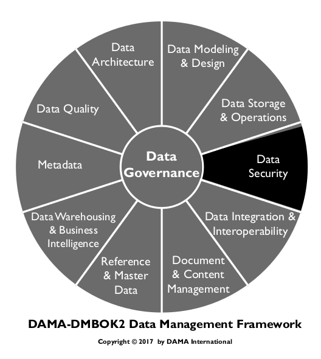
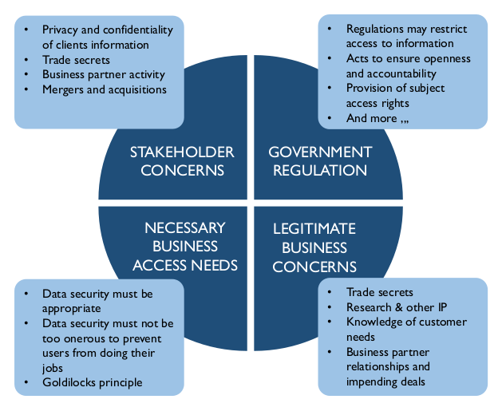
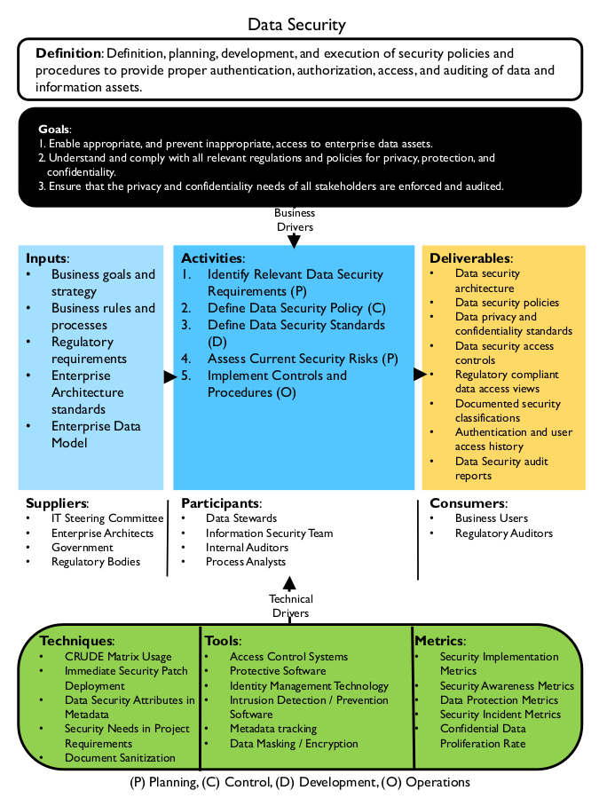
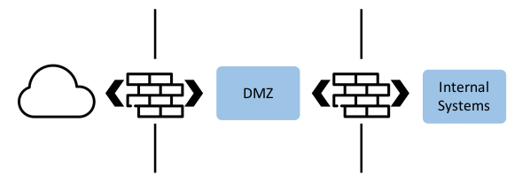
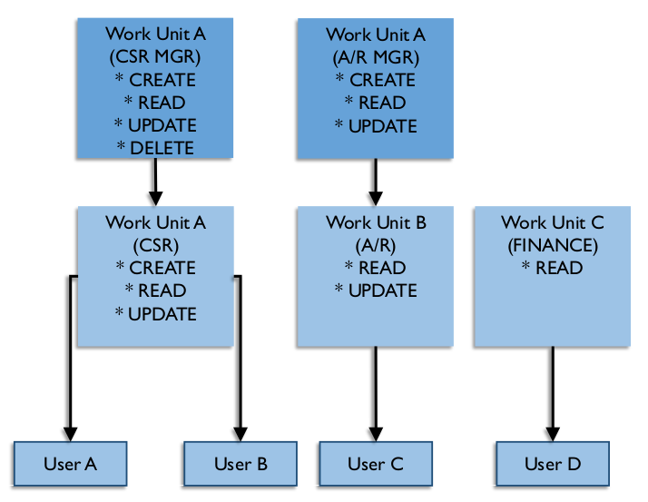

# Segurança de Dados

## 1. Introdução

A Segurança de Dados inclui o planejamento, o desenvolvimento e a execução de políticas e procedimentos de segurança para fornecer autenticação, autorização, acesso e auditoria adequados de dados e ativos de informação. As especificidades da segurança de dados (por exemplo, quais dados precisam ser protegidos) diferem entre setores e países. No entanto, o objetivo das práticas de segurança de dados é o mesmo: proteger os ativos de informação em conformidade com as normas de privacidade e confidencialidade, acordos contratuais e requisitos comerciais.

Esses requisitos vêm de:

* **Partes Interessadas:** As organizações devem reconhecer as necessidades de privacidade e confidencialidade de suas partes interessadas, incluindo clientes, pacientes, alunos, cidadãos, fornecedores ou parceiros comerciais. Todos em uma organização devem ser responsáveis ​​pelos dados das partes interessadas.
* **Regulamentações governamentais:** As regulamentações governamentais existem para proteger os interesses de algumas partes interessadas. As regulamentações têm objetivos diferentes. Algumas restringem o acesso à informação, enquanto outras garantem abertura, transparência e responsabilidade.
* **Preocupações comerciais proprietárias:** Cada organização tem dados proprietários a proteger. Os dados de uma organização fornecem insights sobre seus clientes e, quando aproveitados de forma eficaz, podem proporcionar uma vantagem competitiva. Se dados confidenciais forem roubados ou violados, uma organização pode perder vantagem competitiva.
* **Necessidades de acesso legítimo:** Ao proteger dados, as organizações também devem permitir o acesso legítimo. Os processos de negócios exigem que indivíduos em determinadas funções sejam capazes de acessar, usar e manter dados.
* **Obrigações contratuais:** Acordos contratuais e de confidencialidade também influenciam os requisitos de segurança de dados. Por exemplo, o Padrão PCI, um acordo entre empresas de cartão de crédito e empresas individuais, exige que certos tipos de dados sejam protegidos de maneiras definidas (por exemplo, criptografia obrigatória para senhas de clientes).

Políticas e procedimentos eficazes de segurança de dados garantem que as pessoas certas possam usar e atualizar os dados da maneira correta e que todo acesso e atualização inapropriados sejam restritos (Ray, 2012) (ver Figura 62). Compreender e cumprir os interesses e necessidades de privacidade e confidencialidade de todas as partes interessadas é do melhor interesse de todas as organizações. Os relacionamentos com clientes, fornecedores e constituintes confiam e dependem do uso responsável dos dados.

Figura 62 Fontes dos Requisitos de Segurança de Dados

Figura 63 Diagrama de Contexto: Segurança de Dados

### 1.1 Impulsionadores de Negócios
A redução de riscos e o crescimento dos negócios são os principais impulsionadores das atividades de segurança de dados. Garantir a segurança dos dados de uma organização reduz os riscos e adiciona vantagem competitiva. A segurança em si é um ativo valioso.

Os riscos de segurança de dados estão associados à conformidade regulatória, à responsabilidade fiduciária para com a empresa e os acionistas, à reputação e à responsabilidade legal e moral de proteger as informações privadas e sensíveis de funcionários, parceiros de negócios e clientes. As organizações podem ser multadas pelo descumprimento de regulamentações e obrigações contratuais. Violações de dados podem causar perda de reputação e da confiança do cliente. (Consulte o Capítulo 2.)

O crescimento dos negócios inclui atingir e sustentar as metas operacionais de negócios. Problemas de segurança de dados, violações e restrições injustificadas ao acesso de funcionários aos dados podem impactar diretamente o sucesso operacional.

Os objetivos de mitigação de riscos e crescimento do negócio podem ser complementares e mutuamente benéficos se integrados a uma estratégia coerente de gestão e proteção de informações.

#### 1.1.1 Redução de Riscos

À medida que as regulamentações de dados aumentam — geralmente em resposta a roubos e violações de dados — também aumentam os requisitos de conformidade. As organizações de segurança frequentemente são encarregadas de gerenciar não apenas os requisitos de conformidade de TI, mas também políticas, práticas, classificações de dados e regras de autorização de acesso em toda a organização.

Assim como em outros aspectos do gerenciamento de dados, é melhor abordar a segurança de dados como uma iniciativa corporativa. Sem um esforço coordenado, as unidades de negócios encontrarão soluções diferentes para as necessidades de segurança, aumentando o custo geral e potencialmente reduzindo a segurança devido à proteção inconsistente. Arquitetura ou processos de segurança ineficazes podem custar às organizações violações e perda de produtividade. Uma estratégia de segurança operacional devidamente financiada, orientada a sistemas e consistente em toda a empresa reduzirá esses riscos.

A segurança da informação começa pela classificação dos dados de uma organização para identificar quais dados requerem proteção. O processo geral inclui as seguintes etapas:

* **Identificar e classificar ativos de dados sensíveis:** Dependendo do setor e da organização, pode haver poucos ou muitos ativos e uma variedade de dados sensíveis (incluindo dados de identificação pessoal, médicos, financeiros e outros).
* **Localize dados sensíveis em toda a empresa:** Os requisitos de segurança podem variar dependendo de onde os dados são armazenados. Uma quantidade significativa de dados sensíveis em um único local representa um alto risco devido aos danos que podem ocorrer em uma única violação.
* **Determine como cada ativo precisa ser protegido:** As medidas necessárias para garantir a segurança podem variar entre os ativos, dependendo do conteúdo dos dados e do tipo de tecnologia.
* **Identifique como essas informações interagem com os processos de negócios:** A análise dos processos de negócios é necessária para determinar qual acesso é permitido e em que condições.

Além de classificar os dados em si, é necessário avaliar ameaças externas (como as de hackers e criminosos) e riscos internos (representados por funcionários e processos). Muitos dados são perdidos ou expostos pela ignorância de funcionários que não perceberam que as informações eram altamente sensíveis ou que burlaram as políticas de segurança. [^37] Os dados de vendas de clientes deixados em um servidor web que é hackeado, o banco de dados de funcionários baixado para o laptop de um contratado que é posteriormente roubado e segredos comerciais deixados sem criptografia no computador de um executivo que desaparece, tudo isso resulta de controles de segurança ausentes ou não aplicados.

O impacto das violações de segurança em marcas consolidadas nos últimos anos resultou em enormes perdas financeiras e na queda da confiança do cliente. Não apenas as ameaças externas da comunidade de hackers criminosos estão se tornando mais sofisticadas e direcionadas, como também a quantidade de danos causados ​​por ameaças externas e internas, intencionais ou não, tem aumentado constantemente ao longo dos anos (Kark, 2009).

Em um mundo com infraestrutura empresarial quase totalmente eletrônica, sistemas de informação confiáveis ​​tornaram-se um diferencial nos negócios.

#### 1.1.2 Crescimento Empresarial

Globalmente, a tecnologia eletrônica está presente no escritório, no mercado e em casa. Computadores desktop e laptop, smartphones, tablets e outros dispositivos são elementos importantes da maioria das operações comerciais e governamentais. O crescimento explosivo do comércio eletrônico mudou a forma como as organizações oferecem bens e serviços. Em suas vidas pessoais, os indivíduos se acostumaram a realizar negócios online com fornecedores de bens, agências médicas, empresas de serviços públicos, órgãos governamentais e instituições financeiras. O comércio eletrônico confiável impulsiona o lucro e o crescimento. A qualidade dos produtos e serviços está diretamente relacionada à segurança da informação: uma segurança da informação robusta possibilita transações e gera confiança do cliente.

#### 1.1.3 Segurança como um Ativo

Uma abordagem para gerenciar dados sensíveis é por meio de Metadados. Classificações de segurança e sensibilidade regulatória podem ser capturadas no nível do elemento e do conjunto de dados. Existe tecnologia para marcar dados para que os Metadados acompanhem as informações à medida que elas fluem pela empresa. Desenvolver um repositório mestre de características de dados significa que todas as partes da empresa podem saber precisamente qual nível de proteção as informações sensíveis exigem.

Se um padrão comum for aplicado, essa abordagem permite que vários departamentos, unidades de negócios e fornecedores utilizem os mesmos Metadados. Segurança padrão: Metadados podem otimizar a proteção de dados e orientar o uso comercial e os processos de suporte técnico, resultando em custos mais baixos. Essa camada de segurança da informação pode ajudar a prevenir o acesso não autorizado e o uso indevido de ativos de dados. Quando dados sensíveis são corretamente identificados como tal, as organizações constroem confiança com seus clientes e parceiros. Os próprios Metadados relacionados à segurança se tornam um ativo estratégico, aumentando a qualidade das transações, relatórios e análises de negócios, ao mesmo tempo que reduzem o custo de proteção e os riscos associados causados ​​pela perda ou roubo de informações.

### 1.2 Objetivos e Princípios

#### 1.2.1 Objetivos

Os objetivos das atividades de segurança de dados incluem:

* Permitir o acesso apropriado e impedir o acesso indevido aos ativos de dados corporativos
* Permitir a conformidade com os regulamentos e políticas de privacidade, proteção e confidencialidade
* Garantir que os requisitos de privacidade e confidencialidade das partes interessadas sejam atendidos

#### 1.2.2 Princípios

A segurança de dados em uma organização segue estes princípios orientadores:

* **Colaboração:** A Segurança de Dados é um esforço colaborativo que envolve administradores de segurança de TI, administradores/governança de dados, equipes de auditoria interna e externa e o departamento jurídico.
* **Abordagem empresarial:** Os padrões e políticas de Segurança de Dados devem ser aplicados de forma consistente em toda a organização.
* **Gestão proativa:** O sucesso na gestão da segurança de dados depende de proatividade e dinamismo, do envolvimento de todas as partes interessadas, da gestão de mudanças e da superação de gargalos organizacionais ou culturais, como a tradicional separação de responsabilidades entre segurança da informação, tecnologia da informação, administração de dados e partes interessadas do negócio.
* **Responsabilidade clara:** Funções e responsabilidades devem ser claramente definidas, incluindo a "cadeia de custódia" dos dados entre organizações e funções.
* **Orientado por metadados:** A classificação de segurança dos elementos de dados é uma parte essencial das definições de dados.
* **Reduzir riscos reduzindo a exposição:** Minimizar a proliferação de dados sensíveis/confidenciais, especialmente em ambientes não produtivos.

### 1.3 Conceitos Essenciais

A segurança da informação possui um vocabulário específico. O conhecimento dos termos-chave permite uma articulação mais clara dos requisitos de governança.

#### 1.3.1 Vulnerabilidade

Uma vulnerabilidade é uma fraqueza ou defeito em um sistema que permite que ele seja atacado e comprometido com sucesso – essencialmente uma brecha nas defesas de uma organização. Algumas vulnerabilidades são chamadas de exploits.

Exemplos incluem computadores em rede com patches de segurança desatualizados, páginas da web não protegidas com senhas robustas, usuários não treinados para ignorar anexos de e-mail de remetentes desconhecidos ou softwares corporativos desprotegidos contra comandos técnicos que darão ao invasor o controle do sistema.

Em muitos casos, ambientes não produtivos são mais vulneráveis ​​a ameaças do que ambientes produtivos. Portanto, é fundamental manter os dados de produção fora de ambientes não produtivos.

#### 1.3.2 Ameaça

Uma ameaça é uma ação ofensiva potencial que pode ser tomada contra uma organização. As ameaças podem ser internas ou externas. Nem sempre são maliciosas. Um infiltrado uniformizado pode tomar ações ofensivas contra a organização sem sequer saber. As ameaças podem estar relacionadas a vulnerabilidades específicas, que podem ser priorizadas para correção. Cada ameaça deve corresponder a uma capacidade que a previna ou limite os danos que ela pode causar. A ocorrência de uma ameaça também é chamada de superfície de ataque.

Exemplos de ameaças incluem anexos de e-mail infectados por vírus enviados à organização, processos que sobrecarregam os servidores de rede e resultam na incapacidade de realizar transações comerciais (também chamados de ataques de negação de serviço) e exploração de vulnerabilidades conhecidas.

#### 1.3.3 Risco

O termo risco refere-se tanto à possibilidade de perda quanto à coisa ou condição que representa a perda potencial. O risco pode ser calculado para cada ameaça possível usando os seguintes fatores.

* Probabilidade de ocorrência da ameaça e sua provável frequência
* O tipo e a quantidade de danos que cada ocorrência pode causar, incluindo danos à reputação
* O efeito que o dano terá na receita ou nas operações comerciais
* O custo para corrigir o dano após uma ocorrência
* O custo para prevenir a ameaça, incluindo a correção de vulnerabilidades
* O objetivo ou a intenção do provável invasor

Os riscos podem ser priorizados pela gravidade potencial do dano à empresa ou pela probabilidade de ocorrência, com vulnerabilidades facilmente exploráveis ​​criando uma probabilidade maior de ocorrência. Frequentemente, uma lista de prioridades combina ambas as métricas. A priorização de riscos deve ser um processo formal entre as partes interessadas.

#### 1.3.4 Classificações de Risco

As classificações de risco descrevem a sensibilidade dos dados e a probabilidade de que eles sejam procurados para fins maliciosos. As classificações são usadas para determinar quem (ou seja, pessoas em quais funções) pode acessar os dados. A classificação de segurança mais alta de qualquer dado dentro de uma autorização de usuário determina a classificação de segurança de toda a agregação. Exemplos de classificações incluem:

* **Dados de Risco Crítico (DRC):** Informações pessoais buscadas agressivamente para uso não autorizado por partes internas e externas devido ao seu alto valor financeiro direto. O comprometimento dos DRC não apenas prejudicaria os indivíduos, mas também resultaria em prejuízos financeiros para a empresa, devido a penalidades significativas, custos para reter clientes e funcionários, bem como danos à marca e à reputação.
* **Dados de Alto Risco (DRH):** Os DHR são ativamente buscados para uso não autorizado devido ao seu potencial valor financeiro direto. Os DHR proporcionam à empresa uma vantagem competitiva. Se comprometidos, podem expor a empresa a prejuízos financeiros devido à perda de oportunidades. A perda de DHR pode causar desconfiança, levando à perda de negócios e pode resultar em exposição legal, multas e penalidades regulatórias, bem como danos à marca e à reputação.
* **Dados de Risco Moderado (DRM):** Informações da empresa que têm pouco valor tangível para partes não autorizadas; no entanto, o uso não autorizado dessas informações não públicas provavelmente teria um efeito negativo sobre a empresa.

#### 1.3.5 Organização de Segurança de Dados

Dependendo do porte da empresa, a função geral de Segurança da Informação pode ser a principal responsabilidade de um grupo dedicado à Segurança da Informação, geralmente dentro da área de Tecnologia da Informação (TI). Empresas maiores geralmente têm um Diretor de Segurança da Informação (CISO) que se reporta ao CIO ou ao CEO. Em organizações sem pessoal dedicado à Segurança da Informação, a responsabilidade pela segurança dos dados recairá sobre os gerentes de dados. Em todos os casos, os gerentes de dados precisam estar envolvidos nos esforços de segurança de dados.

Em grandes empresas, a equipe de segurança da informação pode deixar que funções específicas de governança de dados e autorização de usuários sejam orientadas pelos gerentes de negócios. Exemplos incluem a concessão de autorizações de usuários e a conformidade regulatória de dados. A equipe dedicada à Segurança da Informação geralmente se preocupa mais com os aspectos técnicos da proteção da informação, como o combate a softwares maliciosos e ataques a sistemas. No entanto, há amplo espaço para colaboração durante o desenvolvimento ou um projeto de instalação.

Essa oportunidade de sinergia costuma ser perdida quando as duas entidades de governança, TI e Gestão de Dados, não possuem um processo organizado para compartilhar os requisitos regulatórios e de segurança. Eles precisam de um procedimento padrão para se informarem mutuamente sobre regulamentações de dados, ameaças de perda de dados e requisitos de proteção de dados, e fazê-lo no início de cada projeto de desenvolvimento ou instalação de software.

O primeiro passo na Estrutura de Gestão de Riscos do NIST (Instituto Nacional de Padrões e Tecnologia), por exemplo, é categorizar todas as informações corporativas. [^38] A criação de um modelo de dados corporativo é essencial para esse objetivo. Sem visibilidade clara da localização de todas as informações confidenciais, é impossível criar um programa de proteção de dados abrangente e eficaz.

Os gerentes de dados precisam estar ativamente envolvidos com desenvolvedores de tecnologia da informação e profissionais de segurança cibernética para que os dados regulamentados possam ser identificados, os sistemas confidenciais possam ser adequadamente protegidos e os controles de acesso dos usuários possam ser projetados para garantir a confidencialidade, a integridade e a conformidade regulatória dos dados. Quanto maior a empresa, mais importante se torna a necessidade de trabalho em equipe e a confiança em um modelo de dados corporativo correto e atualizado.

#### 1.3.6 Processos de Segurança

Os requisitos e procedimentos de segurança de dados são categorizados em quatro grupos, conhecidos como os quatro As: Acesso, Auditoria, Autenticação e Autorização. Recentemente, foi incluído um E, Entitlement, para garantir a conformidade regulatória efetiva de dados. Classificação de informações, direitos de acesso, grupos de funções, usuários e senhas são os meios para implementar políticas e atender aos quatro As. O monitoramento de segurança também é essencial para comprovar o sucesso dos demais processos. Tanto o monitoramento quanto a auditoria podem ser realizados de forma contínua ou intermitente. Auditorias formais devem ser realizadas por terceiros para serem consideradas válidas. O terceiro pode ser interno ou externo.

##### 1.3.6.1 Os Quatro As

* **Acesso:** Permitir que indivíduos com autorização acessem sistemas em tempo hábil. Usado como verbo, acesso significa conectar-se ativamente a um sistema de informação e trabalhar com os dados. Usado como substantivo, acesso indica que a pessoa possui uma autorização válida para acessar os dados.
* **Auditoria:** Revisar as ações de segurança e as atividades dos usuários para garantir a conformidade com os regulamentos e as políticas e padrões da empresa. Profissionais de segurança da informação revisam periodicamente registros e documentos para validar a conformidade com os regulamentos, políticas e padrões de segurança. Os resultados dessas auditorias são publicados periodicamente.
* **Autenticação:** Validar o acesso dos usuários. Quando um usuário tenta fazer login em um sistema, o sistema precisa verificar se a pessoa é quem afirma ser. Senhas são uma maneira de fazer isso. Métodos de autenticação mais rigorosos incluem a pessoa ter um token de segurança, responder a perguntas ou enviar uma impressão digital. Todas as transmissões durante a autenticação são criptografadas para evitar o roubo das informações de autenticação.
* **Autorização:** Conceder aos indivíduos privilégios para acessar visualizações específicas de dados, adequadas à sua função. Após a decisão de autorização, o Sistema de Controle de Acesso verifica, sempre que um usuário efetua login, se ele possui um token de autorização válido. Tecnicamente, trata-se de uma entrada em um campo de dados no Active Directory corporativo, indicando que a pessoa foi autorizada por alguém a acessar os dados. Indica ainda que uma pessoa responsável tomou a decisão de conceder essa autorização porque o usuário tem direito a ela em virtude de seu cargo ou status corporativo.
* **Autorização:** Uma Autorização é a soma total de todos os elementos de dados que são expostos a um usuário por uma única decisão de autorização de acesso. Um gerente responsável deve decidir se uma pessoa tem "autorização" para acessar essas informações antes que uma solicitação de autorização seja gerada. Um inventário de todos os dados expostos por cada autorização é necessário para determinar os requisitos regulatórios e de confidencialidade para as decisões de Autorização.

##### 1.3.6.2 Monitoramento

Os sistemas devem incluir controles de monitoramento que detectem eventos inesperados, incluindo potenciais violações de segurança. Sistemas que contêm informações confidenciais, como dados salariais ou financeiros, geralmente implementam monitoramento ativo em tempo real que alerta o administrador de segurança sobre atividades suspeitas ou acesso inapropriado.

Alguns sistemas de segurança interrompem ativamente atividades que não seguem perfis de acesso específicos. A conta ou atividade permanece bloqueada até que a equipe de suporte de segurança avalie os detalhes.

Em contraste, o monitoramento passivo rastreia mudanças ao longo do tempo, capturando snapshots do sistema em intervalos regulares e comparando tendências com um benchmark ou outros critérios. O sistema envia relatórios aos administradores de dados ou administradores de segurança responsáveis ​​pelos dados. Enquanto o monitoramento ativo é um mecanismo de detecção, o monitoramento passivo é um mecanismo de avaliação.

#### 1.3.7 Integridade de Dados

Em segurança, integridade de dados é o estado de ser íntegro – protegido contra alteração, exclusão ou inclusão indevidas. Por exemplo, nos EUA, as regulamentações Sarbanes-Oxley se preocupam principalmente com a proteção da integridade das informações financeiras, identificando regras sobre como as informações financeiras podem ser criadas e editadas.

#### 1.3.8 Criptografia

Criptografia é o processo de traduzir texto simples em códigos complexos para ocultar informações privilegiadas, verificar a transmissão completa ou verificar a identidade do remetente. Dados criptografados não podem ser lidos sem a chave ou algoritmo de descriptografia, que geralmente é armazenado separadamente e não pode ser calculado com base em outros elementos de dados no mesmo conjunto de dados. Existem quatro métodos principais de criptografia – hash, simétrica, chave privada e chave pública – com diferentes níveis de complexidade e estrutura de chave.

##### 1.3.8.1 Hash

A criptografia por hash utiliza algoritmos para converter dados em uma representação matemática. Os algoritmos exatos utilizados e a ordem de aplicação devem ser conhecidos para reverter o processo de criptografia e revelar os dados originais. Às vezes, o hash é usado para verificar a integridade ou identidade da transmissão. Algoritmos de hash comuns são o Message Digest 5 (MD5) e o Secure Hashing Algorithm (SHA).

##### 1.3.8.2 Chave privada

A criptografia por chave privada utiliza uma chave para criptografar os dados. Tanto o remetente quanto o destinatário devem ter a chave para ler os dados originais. Os dados podem ser criptografados um caractere por vez (como em um fluxo) ou em blocos. Algoritmos comuns de chave privada incluem o Padrão de Criptografia de Dados (DES), o Triple DES (3DES), o Padrão Avançado de Criptografia (AES) e o Algoritmo Internacional de Criptografia de Dados (IDEA). As cifras Twofish e Serpent também são consideradas seguras. O uso de DES simples não é aconselhável, pois é suscetível a muitos ataques fáceis.

##### 1.3.8.3 Chave pública

Na criptografia de chave pública, o remetente e o destinatário possuem chaves diferentes. O remetente usa uma chave pública disponível gratuitamente, e o destinatário usa uma chave privada para revelar os dados originais. Esse tipo de criptografia é útil quando muitas fontes de dados precisam enviar informações protegidas para apenas alguns destinatários, como ao enviar dados para câmaras de compensação. Os métodos de chave pública incluem a Troca de Chaves Rivest-Shamir-Adelman (RSA) e o Acordo de Chaves Diffie-Hellman. PGP (Pretty Good Privacy) é uma aplicação de criptografia de chave pública disponível gratuitamente.

##### 1.3.9 Ofuscação ou Mascaramento

Os dados podem se tornar menos disponíveis por meio de ofuscação (torná-los obscuros ou pouco claros) ou mascaramento, que remove, embaralha ou altera de alguma forma a aparência dos dados, sem perder o significado dos dados ou os relacionamentos que eles têm com outros conjuntos de dados, como relacionamentos de chave estrangeira com outros objetos ou sistemas. Os valores dentro dos atributos podem mudar, mas os novos valores ainda são válidos para esses atributos. A ofuscação é útil ao exibir informações confidenciais em telas para referência ou ao criar conjuntos de dados de teste a partir de dados de produção que estejam em conformidade com a lógica esperada do aplicativo.

O mascaramento de dados é um tipo de segurança centrada em dados. Existem dois tipos de mascaramento de dados: persistente e dinâmico. O mascaramento persistente pode ser executado em trânsito ou no local.

##### 1.3.9.1 Mascaramento de Dados Persistente

O mascaramento de dados persistente altera os dados de forma permanente e irreversível. Esse tipo de mascaramento não é normalmente usado em ambientes de produção, mas sim entre um ambiente de produção e ambientes de desenvolvimento ou teste. O mascaramento persistente altera os dados, mas eles ainda devem ser viáveis ​​para uso em processos de teste, aplicativos, relatórios, etc.

* O mascaramento persistente em trânsito ocorre quando os dados são mascarados ou ofuscados enquanto se movem entre o ambiente de origem (tipicamente produção) e o ambiente de destino (tipicamente não produção). O mascaramento em trânsito é muito seguro quando executado corretamente, pois não deixa um arquivo ou banco de dados intermediário com dados desmascarados. Outro benefício é que ele pode ser executado novamente caso sejam encontrados problemas no meio do mascaramento.
* O mascaramento persistente no local é usado quando a origem e o destino são os mesmos. Os dados desmascarados são lidos da origem, mascarados e, em seguida, usados ​​para sobrescrever os dados desmascarados. O mascaramento no local pressupõe que os dados confidenciais estejam em um local onde não deveriam existir e que o risco precise ser mitigado, ou que haja uma cópia extra dos dados em um local seguro para mascarar antes de movê-los para o local não seguro. Há riscos nesse processo. Se o processo de mascaramento falhar no meio do mascaramento, pode ser difícil restaurar os dados para um formato utilizável. Essa técnica tem alguns usos específicos, mas, em geral, o mascaramento em execução atenderá às necessidades do projeto com mais segurança.

##### 1.3.9.2 Mascaramento Dinâmico de Dados

O mascaramento dinâmico de dados altera a aparência dos dados para o usuário final ou sistema sem alterar os dados subjacentes. Isso pode ser extremamente útil quando os usuários precisam acessar alguns dados de produção sensíveis, mas não todos. Por exemplo, em um banco de dados, o número do seguro social é armazenado como 123456789, mas para o atendente do call center que precisa verificar com quem está falando, os dados aparecem como ***-**-6789.

##### 1.3.9.3 Métodos de Mascaramento

Existem vários métodos para mascarar ou ofuscar dados.

* Substituição: Substitui caracteres ou valores inteiros por aqueles em uma consulta ou como um padrão. Por exemplo, nomes próprios podem ser substituídos por valores aleatórios de uma lista.
* Embaralhamento: Troca elementos de dados do mesmo tipo dentro de um registro ou troca elementos de dados de um atributo entre linhas. Por exemplo, misturar nomes de fornecedores entre faturas de fornecedores de forma que o fornecedor original seja substituído por um fornecedor válido diferente em uma fatura.
* Variância temporal: Move datas +/– um número de dias – pequeno o suficiente para preservar tendências, mas significativo o suficiente para torná-las não identificáveis.
* Variância de valor: Aplica um fator aleatório +/– uma porcentagem, novamente pequeno o suficiente para preservar tendências, mas significativo o suficiente para ser não identificável.
* Anulação ou exclusão: Remove dados que não deveriam estar presentes em um sistema de teste.
* Randomização: Substitui parte ou todos os elementos de dados por caracteres aleatórios ou uma série de um único caractere.

* Criptografia: Converte um fluxo de caracteres reconhecível e significativo em um fluxo de caracteres irreconhecível por meio de um código cifrado. Uma versão extrema de ofuscação in-loco.
* Mascaramento de expressão: Altera todos os valores para o resultado de uma expressão. Por exemplo, uma expressão simples codificaria todos os valores em um campo grande e livre de um banco de dados (que poderia conter dados confidenciais) como "Este é um campo de comentário".
* Mascaramento de chave: Designa que o resultado do algoritmo/processo de mascaramento deve ser único e repetível, pois está sendo usado para mascarar um campo de chave do banco de dados (ou similar). Esse tipo de mascaramento é extremamente importante para testes que visam manter a integridade em toda a organização.

#### 1.3.10 Termos de Segurança de Rede

A segurança de dados inclui dados em repouso e dados em movimento. Dados em movimento requerem uma rede para se moverem entre sistemas. Não é mais suficiente para uma organização confiar totalmente no firewall para protegê-la de softwares maliciosos, e-mails envenenados ou ataques de engenharia social. Cada máquina na rede precisa ter uma linha de defesa, e os servidores web precisam de proteção sofisticada, pois estão continuamente expostos ao mundo inteiro na internet.

##### 1.3.10.1 Backdoor

Um backdoor refere-se a uma entrada ignorada ou oculta em um sistema ou aplicativo de computador. Ele permite que usuários não autorizados ignorem a exigência de senha para obter acesso. Backdoors são frequentemente criados por desenvolvedores para fins de manutenção. Qualquer backdoor representa um risco à segurança. Outros backdoors são implementados pelos criadores de pacotes de software comerciais.

Senhas padrão deixadas inalteradas ao instalar qualquer sistema de software ou pacote de página web constituem um backdoor e, sem dúvida, serão conhecidas pelos hackers. Qualquer backdoor representa um risco à segurança.

##### 1.3.10.2 Bot ou Zumbi

Um bot (abreviação de robô) ou Zumbi é uma estação de trabalho que foi invadida por um hacker malicioso usando um Trojan, um vírus, um phishing ou o download de um arquivo infectado. Controlados remotamente, os bots são usados ​​para executar tarefas maliciosas, como enviar grandes quantidades de spam, atacar empresas legítimas com pacotes de internet que congestionam a rede, realizar transferências ilegais de dinheiro e hospedar sites fraudulentos. Uma Bot-Net é uma rede de computadores robôs (máquinas infectadas). [^39]

Estimou-se em 2012 que, globalmente, 17% de todos os computadores (aproximadamente 187 milhões de um total de 1,1 bilhão de computadores) não possuíam proteção antivírus. [^40] Nos EUA, naquele ano, 19,32% dos usuários navegavam desprotegidos. Uma grande porcentagem deles são Zumbis. Estima-se que dois bilhões de computadores estivessem em operação em 2016. [^41] Considerando que computadores desktop e laptops estão sendo eclipsados ​​em número por smartphones, tablets, wearables e outros dispositivos, muitos dos quais são usados ​​para transações comerciais, os riscos de exposição de dados só aumentarão. [^42]

##### 1.3.10.3 Cookie

Um cookie é um pequeno arquivo de dados que um site instala no disco rígido de um computador para identificar visitantes recorrentes e criar um perfil de suas preferências. Cookies são usados ​​para comércio online. No entanto, eles também são controversos, pois levantam questões de privacidade, já que spywares às vezes os utilizam.

##### 1.3.10.4 Firewall

Um firewall é um software e/ou hardware que filtra o tráfego de rede para proteger um computador individual ou uma rede inteira de tentativas não autorizadas de acesso ou ataque ao sistema. Um firewall pode verificar as comunicações de entrada e saída em busca de informações restritas ou regulamentadas e impedir que elas passem sem permissão (Prevenção contra Perda de Dados). Alguns firewalls também restringem o acesso a sites externos específicos.

##### 1.3.10.5 Perímetro

Um perímetro é o limite entre os ambientes de uma organização e os sistemas externos. Normalmente, um firewall estará instalado entre todos os ambientes internos e externos.

##### 1.3.10.6 DMZ

Abreviação de zona desmilitarizada, uma DMZ é uma área na borda ou perímetro de uma organização, com um firewall entre ela e a organização. Um ambiente de DMZ sempre terá um firewall entre ele e a internet (veja a Figura 64). Ambientes de DMZ são usados ​​para passar ou armazenar temporariamente dados que se movem entre organizações.

Figura 64 Exemplo de DMZ

##### 1.3.10.7 Conta de Superusuário

Uma Conta de Superusuário é uma conta que possui acesso de administrador ou root a um sistema, para ser usada apenas em caso de emergência. As credenciais para essas contas são altamente seguras, liberadas apenas em caso de emergência com a documentação e as aprovações apropriadas, e expiram em um curto espaço de tempo. Por exemplo, a equipe designada para o controle de produção pode exigir autorizações de acesso a vários sistemas grandes, mas essas autorizações devem ser rigorosamente controladas por tempo, ID do usuário, local ou outros requisitos para evitar abusos.

##### 1.3.10.8 Key Logger

Key Loggers são um tipo de software de ataque que registra todas as teclas digitadas por uma pessoa e as envia para outros sites na internet. Assim, cada senha, memorando, fórmula, documento e endereço da web é capturado. Frequentemente, um site infectado ou download de software malicioso instala um keylogger. Alguns tipos de download de documentos também permitem que isso aconteça.

##### 1.3.10.9 Teste de Penetração

A configuração de uma rede e um site seguros é incompleta sem testá-los para garantir que sejam realmente seguros. No Teste de Penetração (às vezes chamado de "teste penn"), um hacker ético, seja da própria organização ou contratado de uma empresa de segurança externa, tenta invadir o sistema de fora, como faria um hacker malicioso, a fim de identificar vulnerabilidades do sistema. Vulnerabilidades encontradas por meio de testes de penetração podem ser corrigidas antes do lançamento do aplicativo.

Algumas pessoas se sentem ameaçadas por auditorias de hacking ético porque acreditam que essas auditorias resultarão apenas em acusações. A realidade é que, no conflito crescente entre a segurança empresarial e o hacking criminoso, todos os softwares adquiridos e desenvolvidos internamente contêm vulnerabilidades potenciais que não eram conhecidas no momento de sua criação. Portanto, todas as implementações de software devem ser testadas periodicamente. Encontrar vulnerabilidades é um procedimento contínuo e nenhuma culpa deve ser atribuída – apenas patches de segurança.

Como prova da necessidade de mitigação contínua de vulnerabilidades de software, observe um fluxo constante de patches de segurança chegando de fornecedores de software. Esse processo contínuo de atualização de patches de segurança é um sinal de diligência prévia e suporte profissional ao cliente por parte desses fornecedores. Muitos desses patches são resultado de hacking ético realizado em nome dos fornecedores.

##### 1.3.10.10 Rede Privada Virtual (VPN)

As conexões VPN usam a internet desprotegida para criar um caminho seguro ou "túnel" para o ambiente de uma organização. O túnel é altamente criptografado. Permite a comunicação entre usuários e a rede interna utilizando múltiplos elementos de autenticação para se conectar a um firewall no perímetro do ambiente de uma organização. Em seguida, criptografa fortemente todos os dados transmitidos.

##### 1.3.11 Tipos de Segurança de Dados

A segurança de dados envolve não apenas a prevenção de acessos inapropriados, mas também a habilitação de acesso apropriado aos dados. O acesso a dados sensíveis deve ser controlado pela concessão de permissões (opt-in). Sem permissão, um usuário não deve ter permissão para visualizar dados ou realizar ações no sistema. "Privilégio Mínimo" é um princípio de segurança importante. Um usuário, processo ou programa deve ter permissão para acessar apenas as informações permitidas por sua finalidade legítima.

##### 1.3.11.1 Segurança das Instalações

A segurança das instalações é a primeira linha de defesa contra agentes mal-intencionados. As instalações devem ter, no mínimo, um data center trancado com acesso restrito a funcionários autorizados. Ameaças sociais à segurança (consulte a Seção 1.3.15) reconhecem os humanos como o ponto mais fraco na segurança das instalações. Garanta que os funcionários tenham as ferramentas e o treinamento para proteger os dados nas instalações.

##### 1.3.11.2 Segurança de Dispositivos

Dispositivos móveis, incluindo laptops, tablets e smartphones, são inerentemente inseguros, pois podem ser perdidos, roubados e atacados física e eletronicamente por hackers criminosos. Eles frequentemente contêm e-mails, planilhas, endereços e documentos corporativos que, se expostos, podem ser prejudiciais à organização, seus funcionários ou clientes.

Com a explosão de dispositivos e mídias portáteis, um plano para gerenciar a segurança desses dispositivos (tanto os da empresa quanto os pessoais) deve fazer parte da arquitetura estratégica de segurança geral de qualquer empresa. Esse plano deve incluir ferramentas de software e hardware.

Os padrões de segurança de dispositivos incluem:

* Políticas de acesso referentes a conexões usando dispositivos móveis
* Armazenamento de dados em dispositivos portáteis, como laptops, DVDs, CDs ou pen drives
* Limpeza de dados e descarte de dispositivos em conformidade com as políticas de gerenciamento de registros
* Instalação de software antimalware e de criptografia
* Conscientização sobre vulnerabilidades de segurança

##### 1.3.11.3 Segurança de Credenciais

Cada usuário recebe credenciais para usar ao obter acesso a um sistema. A maioria das credenciais é uma combinação de um ID de Usuário e uma Senha. Há um espectro de como as credenciais são usadas nos sistemas de um ambiente, dependendo da sensibilidade dos dados do sistema e da capacidade do sistema de se conectar a repositórios de credenciais.

###### 1.3.11.3.1 Sistemas de Gerenciamento de Identidades

Tradicionalmente, os usuários têm contas e senhas diferentes para cada recurso, plataforma, sistema de aplicação ou estação de trabalho. Essa abordagem exige que os usuários gerenciem várias senhas e contas. Organizações com diretórios de usuários corporativos podem ter um mecanismo de sincronização estabelecido entre os recursos heterogêneos para facilitar o gerenciamento de senhas de usuários. Nesses casos, o usuário precisa inserir a senha apenas uma vez, geralmente ao efetuar login na estação de trabalho, após o qual toda a autenticação e autorização são executadas por meio de uma referência ao diretório de usuários corporativos. Um sistema de gerenciamento de identidades que implementa esse recurso é conhecido como "login único" e é ideal da perspectiva do usuário.

###### 1.3.11.3.2 Padrões de ID de Usuário para Sistemas de E-mail

Os IDs de usuário devem ser únicos dentro do domínio de e-mail. A maioria das empresas utiliza um nome ou inicial, e um sobrenome completo ou parcial, como ID de e-mail ou de rede, com um número para diferenciar conflitos. Nomes são geralmente conhecidos e mais úteis para fins de contato comercial.

IDs de e-mail ou de rede contendo números de identificação de funcionários do sistema são desencorajados, pois essas informações geralmente não estão disponíveis fora da organização e fornecem dados que devem estar seguros dentro dos sistemas.

###### 1.3.11.3.3 Padrões de Senha

As senhas são a primeira linha de defesa na proteção do acesso aos dados. Cada conta de usuário deve ter uma senha definida pelo usuário (proprietário da conta) com um nível suficiente de complexidade de senha definido nos padrões de segurança, comumente chamadas de senhas "fortes".

Ao criar uma nova conta de usuário, a senha temporária gerada deve ser configurada para expirar imediatamente após o primeiro uso e o usuário deve escolher uma nova senha para acesso subsequente. Não permita senhas em branco.

A maioria dos especialistas em segurança recomenda exigir que os usuários alterem suas senhas a cada 45 a 180 dias, dependendo da natureza do sistema, do tipo de dados e da sensibilidade da empresa. No entanto, alterar senhas com muita frequência apresenta riscos, pois muitas vezes faz com que os funcionários anote as novas senhas.

###### 1.3.11.3.4 Identificação de Múltiplos Fatores

Alguns sistemas exigem procedimentos adicionais de identificação. Estes podem incluir um retorno de chamada para o dispositivo móvel do usuário contendo um código, o uso de um item de hardware que deve ser usado para login ou um fator biométrico, como impressão digital, reconhecimento facial ou escaneamento de retina. A identificação de dois fatores torna muito mais difícil invadir uma conta ou fazer login no dispositivo de um usuário. Todos os usuários com direito a autorização para informações altamente sensíveis devem usar a identificação de dois fatores para fazer login na rede.

##### 1.3.11.4 Segurança da Comunicação Eletrônica

Os usuários devem ser treinados para evitar o envio de suas informações pessoais ou quaisquer informações restritas ou confidenciais da empresa por e-mail ou aplicativos de comunicação direta. Esses métodos inseguros de comunicação podem ser lidos ou interceptados por fontes externas. Depois que um usuário envia um e-mail, ele perde o controle sobre as informações nele contidas. O e-mail pode ser encaminhado a outras pessoas sem o conhecimento ou consentimento do remetente. As mídias sociais também se aplicam aqui. Blogs, portais, wikis, fóruns e outras mídias sociais da internet ou intranet devem ser considerados inseguros e não devem conter informações confidenciais ou restritas.

#### 1.3.12 Tipos de Restrições de Segurança de Dados

Dois conceitos norteiam as restrições de segurança: o nível de confidencialidade dos dados e a regulamentação relacionada a eles.

* **Nível de confidencialidade:** Confidencial significa secreto ou privado. As organizações determinam quais tipos de dados não devem ser conhecidos fora da organização, ou mesmo dentro de determinadas áreas da organização. Informações confidenciais são compartilhadas apenas com base na "necessidade de conhecimento". Os níveis de confidencialidade dependem de quem precisa ter conhecimento de determinados tipos de informação.
* **Regulamentação:** As categorias regulatórias são atribuídas com base em regras externas, como leis, tratados, acordos aduaneiros e regulamentações do setor. As informações regulatórias são compartilhadas com base na "permissão de conhecimento". As maneiras pelas quais os dados podem ser compartilhados são regidas pelos detalhes da regulamentação.

A principal diferença entre restrições confidenciais e regulatórias é a origem da restrição: as restrições de confidencialidade se originam internamente, enquanto as restrições regulatórias são definidas externamente.

Outra diferença é que qualquer conjunto de dados, como um documento ou uma visualização de banco de dados, pode ter apenas um nível de confidencialidade. Este nível é estabelecido com base no item mais sensível (e com a classificação mais alta) do conjunto de dados. As categorizações regulatórias, no entanto, são aditivas. Um único conjunto de dados pode ter dados restritos com base em várias categorias regulatórias. Para garantir a conformidade regulatória, aplique todas as ações necessárias para cada categoria, juntamente com os requisitos de confidencialidade.

Quando aplicadas à titularidade do usuário (a agregação dos elementos de dados específicos aos quais uma autorização de usuário fornece acesso), todas as políticas de proteção devem ser seguidas, independentemente de terem origem interna ou externa.

##### 1.3.12.1 Dados Confidenciais

Os requisitos de confidencialidade variam de alto (pouquíssimas pessoas têm acesso, por exemplo, a dados sobre remuneração de funcionários) a baixo (todos têm acesso a catálogos de produtos). Um esquema de classificação típico pode incluir dois ou mais dos cinco níveis de classificação de confidencialidade listados aqui:

* **Para o público em geral:** Informações disponíveis a qualquer pessoa, incluindo o público.
* **Somente para uso interno:** Informações limitadas a funcionários ou membros, mas com risco mínimo se compartilhadas. Somente para uso interno; podem ser exibidas ou discutidas, mas não copiadas, fora da organização.
* **Confidencial:** Informações que não podem ser compartilhadas fora da organização sem um acordo de confidencialidade devidamente executado ou similar em vigor. Informações confidenciais de clientes não podem ser compartilhadas com outros clientes.
* **Confidencial restrito:** Informações limitadas a indivíduos que desempenham determinadas funções com a "necessidade de conhecimento". Confidencial restrito pode exigir que os indivíduos se qualifiquem por meio de autorização. 
* **Confidencial registrado:** Informações tão confidenciais que qualquer pessoa que as acesse deve assinar um acordo legal para acessar os dados e assumir a responsabilidade por seu sigilo. O nível de confidencialidade não implica em nenhum detalhe sobre restrições devido a requisitos regulatórios. Por exemplo, não informa ao gestor de dados que os dados não podem ser expostos fora de seu país de origem ou que alguns funcionários estão proibidos de ver determinadas informações com base em regulamentações como a HIPAA.

##### 1.3.12.2 Dados Regulamentados

Certos tipos de informação são regulamentados por leis externas, padrões do setor ou contratos que influenciam como os dados podem ser usados, bem como quem pode acessá-los e para quais finalidades. Como há muitas regulamentações sobrepostas, é mais fácil agrupá-las por área temática em algumas categorias ou famílias regulatórias para melhor informar os gestores de dados sobre os requisitos regulatórios.

Cada empresa, é claro, deve desenvolver categorias regulatórias que atendam às suas próprias necessidades de conformidade. Além disso, é importante que esse processo e as categorias sejam o mais simples possível para permitir uma capacidade de proteção acionável. Quando as ações de proteção por categoria forem semelhantes, elas devem ser combinadas em uma "família" de regulamentações. Cada categoria regulatória deve incluir ações de proteção auditáveis. Esta não é uma ferramenta organizacional, mas um método de fiscalização.

Como diferentes setores são afetados por diferentes tipos de regulamentações, a organização precisa desenvolver grupos regulatórios que atendam às suas necessidades operacionais. Por exemplo, empresas que não realizam negócios fora de seu país de origem podem não precisar incorporar regulamentações relativas a exportações.

No entanto, como todos os países possuem alguma combinação de leis de privacidade de dados pessoais, e os clientes provavelmente são de qualquer lugar do mundo, pode ser sensato e mais fácil reunir todas as regulamentações de privacidade de dados dos clientes em uma única família regulatória e cumprir os requisitos para todos os países. Isso garante a conformidade em todos os lugares e oferece um padrão único a ser aplicado.

Um exemplo de possível detalhamento da conformidade regulatória é aquele que proíbe por lei que um único tipo de elemento de dados no banco de dados viaje para fora das fronteiras físicas do país de origem. Diversas regulamentações, tanto nacionais quanto internacionais, exigem isso.

Um número ideal de categorias de ações regulatórias é nove ou menos. Exemplos de categorias regulatórias a seguir.

###### 1.3.12.2.1 Exemplos de Famílias Regulatórias

Certas regulamentações governamentais especificam elementos de dados por nome e exigem que eles sejam protegidos de maneiras específicas. Cada elemento não precisa de uma categoria diferente; em vez disso, use uma única família de ações para proteger todos os campos de dados especificamente direcionados. Alguns dados PCI podem ser incluídos nessas categorias, mesmo que seja uma obrigação contratual e não uma regulamentação governamental. As obrigações contratuais do PCI são, em sua maioria, uniformes em todo o mundo.

* **Informações de Identificação Pessoal (PII):** Também conhecidas como Informações Pessoais Privadas (PPI), incluem qualquer informação que possa identificar pessoalmente o indivíduo (individualmente ou em conjunto), como nome, endereço, números de telefone, agenda, número de identidade, números de conta, idade, raça, religião, etnia, data de nascimento, nomes de familiares ou amigos, informações de emprego (dados de RH) e, em muitos casos, remuneração. Ações de proteção altamente semelhantes atenderão às Diretivas de Privacidade da UE, à Lei de Privacidade Canadense (PIPEDA), à Lei PIP de 2003 no Japão, aos padrões PCI, aos requisitos da FTC dos EUA, à GLB, aos padrões da FTC e à maioria das Leis de Violação de Segurança de Informações.
* **Dados Financeiramente Sensíveis:** Todas as informações financeiras, incluindo o que pode ser denominado como dados de "acionistas" ou "privilegiados", incluindo todas as informações financeiras atuais que ainda não foram divulgadas publicamente. Inclui também quaisquer planos de negócios futuros não tornados públicos, fusões, aquisições ou cisões planejadas, relatórios não públicos de problemas significativos da empresa, mudanças inesperadas na alta administração, dados abrangentes de vendas, pedidos e faturamento. Todos esses dados podem ser incluídos nessa categoria e protegidos pelas mesmas políticas. Nos EUA, isso é coberto pelas Leis de Negociação com Informações Privilegiadas, SOX (Lei Sarbanes-Oxley) ou GLBA (Lei Gramm-Leach-Bliley/Lei de Modernização de Serviços Financeiros). Observação: a Lei Sarbanes-Oxley restringe e controla quem pode alterar dados financeiros, garantindo assim a integridade dos dados, enquanto as leis de Negociação com Informações Privilegiadas afetam todos aqueles que podem ver os dados financeiros.
* **Dados Sensíveis à Saúde/Informações Pessoais de Saúde (PHI):** Todas as informações relativas à saúde ou aos tratamentos médicos de uma pessoa. Nos EUA, isso é coberto pela HIPAA (Lei de Portabilidade e Responsabilidade de Informações de Saúde). Outros países também possuem leis restritivas em relação à proteção de informações pessoais e médicas. À medida que estas evoluem, certifique-se de que o Consultor Jurídico Corporativo esteja ciente da necessidade de cumprir os requisitos legais no país onde a organização atua ou possui clientes.
* **Histórico Educacional:** Todas as informações relativas à educação de uma pessoa. Nos EUA, isso é coberto pela FERPA (Lei de Direitos Educacionais e Privacidade da Família).

###### 1.3.12.2.2 Regulamentação Setorial ou Contratual

Alguns setores possuem padrões específicos sobre como registrar, reter e criptografar informações. Alguns também proíbem a exclusão, edição ou distribuição para locais proibidos. Por exemplo, regulamentações para produtos farmacêuticos, outras substâncias perigosas, alimentos, cosméticos e tecnologia avançada impedem a transmissão ou o armazenamento de determinadas informações fora do país de origem ou exigem que os dados sejam criptografados durante o transporte.

* **Padrão de Segurança de Dados do Setor de Cartões de Pagamento (PCI-DSS):** O PCI-DSS é o padrão de segurança de dados do setor mais conhecido. Ele aborda qualquer informação que possa identificar um indivíduo com uma conta em uma instituição financeira, como nome, número do cartão de crédito (qualquer número no cartão), número da conta bancária ou data de validade da conta. A maioria desses campos de dados é regulamentada por leis e políticas. Quaisquer dados com essa classificação em sua definição de Metadados devem ser revisados ​​cuidadosamente pelos administradores de dados quando incluídos em qualquer banco de dados, aplicativo, relatório, painel ou visualização do usuário.
* **Vantagem competitiva ou segredos comerciais:** Empresas que utilizam métodos, misturas, fórmulas, fontes, designs, ferramentas, receitas ou técnicas operacionais proprietárias para obter vantagem competitiva podem ser protegidas por regulamentações do setor e/ou leis de propriedade intelectual.
* **Restrições contratuais:** Em seus contratos com fornecedores e parceiros, uma organização pode estipular como informações específicas podem ou não ser usadas e quais informações podem ou não ser compartilhadas. Por exemplo, registros ambientais, relatórios de materiais perigosos, números de lote, tempos de cozimento, pontos de origem, senhas de clientes, números de contas e determinados números de identidade nacionais de cidadãos não americanos. Empresas técnicas específicas podem precisar incluir determinados produtos ou ingredientes restritos nesta categoria.

#### 1.3.13 Riscos de Segurança do Sistema

O primeiro passo para identificar riscos é identificar onde os dados confidenciais estão armazenados e quais proteções são necessárias para esses dados. Também é necessário identificar os riscos inerentes aos sistemas. Os riscos de segurança do sistema incluem elementos que podem comprometer uma rede ou banco de dados. Essas ameaças permitem que funcionários legítimos façam uso indevido de informações, intencional ou acidentalmente, e possibilitam o sucesso de hackers mal-intencionados.

##### 1.3.13.1 Abuso de Privilégio Excessivo

Ao conceder acesso a dados, o princípio do privilégio mínimo deve ser aplicado. Um usuário, processo ou programa deve ter permissão para acessar apenas as informações permitidas por sua finalidade legítima. O risco é que usuários com privilégios que excedem os requisitos de sua função possam abusar desses privilégios para fins maliciosos ou acidentalmente. Os usuários podem receber mais acesso do que deveriam (privilégio excessivo) simplesmente porque é difícil gerenciar os direitos dos usuários. O DBA pode não ter tempo ou metadados para definir e atualizar mecanismos granulares de controle de privilégios de acesso para cada direito de usuário. Como resultado, muitos usuários recebem privilégios de acesso padrão genéricos que excedem em muito os requisitos específicos da função. Essa falta de supervisão dos direitos dos usuários é um dos motivos pelos quais muitas regulamentações de dados especificam a segurança do gerenciamento de dados.

A solução para o excesso de privilégios é o controle de acesso em nível de consulta, um mecanismo que restringe os privilégios do banco de dados às operações SQL e aos dados mínimos necessários. A granularidade do controle de acesso aos dados deve se estender além da tabela, para linhas e colunas específicas dentro de uma tabela. O controle de acesso em nível de consulta é útil para detectar abuso excessivo de privilégios por funcionários mal-intencionados.

A maioria das implementações de software de banco de dados integra algum nível de controle de acesso em nível de consulta (gatilhos, segurança em nível de linha, segurança em tabela, visualizações), mas a natureza manual desses recursos "integrados" os torna impraticáveis ​​para todas as implantações, exceto as mais limitadas. O processo de definir manualmente uma política de controle de acesso em nível de consulta para todos os usuários em linhas, colunas e operações do banco de dados é demorado. Para piorar a situação, à medida que as funções dos usuários mudam ao longo do tempo, as políticas de consulta precisam ser atualizadas para refletir essas novas funções. A maioria dos administradores de banco de dados teria dificuldade em definir uma política de consulta útil para um pequeno número de usuários em um único momento, muito menos para centenas de usuários ao longo do tempo. Como resultado, em um grande número de organizações, ferramentas automatizadas geralmente são necessárias para tornar o controle de acesso em nível de consulta real funcional.

##### 1.3.13.2 Abuso de Privilégio Legítimo

Usuários podem abusar de privilégios legítimos de bancos de dados para fins não autorizados. Considere um profissional de saúde com inclinações criminosas e privilégios para visualizar registros individuais de pacientes por meio de um aplicativo Web personalizado. A estrutura dos aplicativos Web corporativos normalmente limita os usuários à visualização do histórico médico de um paciente individual, onde vários registros não podem ser visualizados simultaneamente e cópias eletrônicas não são permitidas. No entanto, o profissional pode contornar essas limitações conectando-se ao banco de dados usando um sistema alternativo, como o MS-Excel. Usando o MS-Excel e suas credenciais de login legítimas, o profissional pode recuperar e salvar todos os registros de pacientes.

Há dois riscos a serem considerados: abuso intencional e não intencional. O abuso intencional ocorre quando um funcionário faz uso indevido deliberado de dados organizacionais. Por exemplo, um funcionário errante que deseja trocar registros de pacientes por dinheiro ou por danos intencionais, como divulgar (ou ameaçar divulgar) informações confidenciais publicamente.

O abuso não intencional é um risco mais comum: o funcionário diligente que recupera e armazena grandes quantidades de informações de pacientes em uma máquina de trabalho para o que ele ou ela considera fins legítimos de trabalho. Uma vez que os dados existam em uma máquina endpoint, eles se tornam vulneráveis ​​a roubo e perda de laptops.

A solução parcial para o abuso de privilégios legítimos é o controle de acesso ao banco de dados, que não se aplica apenas a consultas específicas, mas também impõe políticas para máquinas endpoint, considerando o horário do dia, o monitoramento de localização e a quantidade de informações baixadas, e reduz a capacidade de qualquer usuário de ter acesso ilimitado a todos os registros que contêm informações confidenciais, a menos que seja especificamente exigido por seu trabalho e aprovado por seu supervisor. Por exemplo, embora possa ser necessário que um agente de campo acesse os registros pessoais de seus clientes, ele pode não ter permissão para baixar todo o banco de dados do cliente para seu laptop apenas para "economizar tempo".

##### 1.3.13.3 Elevação de Privilégio Não Autorizada

Invasores podem se aproveitar de vulnerabilidades de software da plataforma de banco de dados para converter privilégios de acesso de um usuário comum para os de um administrador. Vulnerabilidades podem ocorrer em procedimentos armazenados, funções integradas, implementações de protocolos e até mesmo em instruções SQL. Por exemplo, um desenvolvedor de software em uma instituição financeira pode se aproveitar de uma função vulnerável para obter privilégios administrativos no banco de dados. Com privilégios administrativos, o desenvolvedor infrator pode desativar mecanismos de auditoria, criar contas falsas, transferir fundos ou encerrar contas.

Previna explorações de elevação de privilégios com uma combinação de sistemas tradicionais de prevenção de intrusão (IPS) e prevenção de intrusão por controle de acesso em nível de consulta. Esses sistemas inspecionam o tráfego do banco de dados para identificar padrões que correspondam a vulnerabilidades conhecidas. Por exemplo, se uma determinada função for vulnerável a um ataque, um IPS pode bloquear todo o acesso ao procedimento ou bloqueá-lo, permitindo ataques incorporados.

Combine o IPS com indicadores de ataque alternativos, como o controle de acesso à consulta, para melhorar a precisão na identificação de ataques. O IPS pode detectar se uma solicitação de banco de dados acessa uma função vulnerável, enquanto o controle de acesso à consulta detecta se a solicitação corresponde ao comportamento normal do usuário. Se uma única solicitação indicar tanto acesso a uma função vulnerável quanto comportamento incomum, é quase certo que um ataque esteja ocorrendo.

##### 1.3.13.4 Abuso de Conta de Serviço ou Conta Compartilhada

O uso de contas de serviço (IDs de lote) e contas compartilhadas (IDs genéricos) aumenta o risco de violações de segurança de dados e dificulta o rastreamento da violação até sua origem. Algumas organizações aumentam ainda mais o risco ao configurar sistemas de monitoramento para ignorar quaisquer alertas relacionados a essas contas. Os gerentes de segurança da informação devem considerar a adoção de ferramentas para gerenciar contas de serviço com segurança.

###### 1.3.13.4.1 Contas de Serviço

As contas de serviço são convenientes porque podem personalizar o acesso aprimorado para os processos que as utilizam. No entanto, se forem usadas para outros fins, não podem ser rastreadas até um usuário ou administrador específico. A menos que tenham acesso a chaves de descriptografia, as contas de serviço não ameaçam os dados criptografados. Isso pode ser especialmente importante para dados armazenados em servidores que armazenam documentos legais, informações médicas, segredos comerciais ou planejamento executivo confidencial.

Restrinja o uso de contas de serviço a tarefas ou comandos específicos em sistemas específicos e exija documentação e aprovação para a distribuição das credenciais. Considere atribuir uma nova senha sempre que ocorrer uma distribuição, usando processos como os utilizados para contas de Superusuário.

###### 1.3.13.4.2 Contas Compartilhadas

Contas compartilhadas são criadas quando um aplicativo não consegue lidar com o número de contas de usuário necessário ou quando adicionar usuários específicos exige um grande esforço ou incorre em custos adicionais de licenciamento. Para contas compartilhadas, as credenciais são fornecidas a vários usuários e a senha raramente é alterada devido ao esforço de notificar todos os usuários. Como elas fornecem acesso essencialmente não governado, qualquer uso de contas compartilhadas deve ser cuidadosamente avaliado. Elas nunca devem ser usadas por padrão.

##### 1.3.13.5 Ataques de Intrusão de Plataforma

Atualizações de software e proteção contra intrusão de ativos de banco de dados exigem uma combinação de atualizações regulares de software (patches) e a implementação de um Sistema de Prevenção de Intrusão (IPS) dedicado. Um IPS geralmente, mas nem sempre, é implementado em conjunto com um Sistema de Detecção de Intrusão (IDS). O objetivo é impedir a grande maioria das tentativas de intrusão na rede e responder rapidamente a qualquer intrusão que tenha conseguido passar por um sistema de prevenção. A forma mais primitiva de proteção contra intrusão é um firewall, mas com usuários móveis, acesso à web e equipamentos de computação móvel fazendo parte da maioria dos ambientes corporativos, um simples firewall, embora ainda necessário, não é mais suficiente.

Atualizações fornecidas pelo fornecedor reduzem as vulnerabilidades encontradas em plataformas de banco de dados ao longo do tempo. Infelizmente, as atualizações de software são frequentemente implementadas pelas empresas de acordo com ciclos de manutenção periódicos, em vez de o mais rápido possível após a disponibilização dos patches. Entre os ciclos de atualização, os bancos de dados não são protegidos. Além disso, problemas de compatibilidade às vezes impedem completamente as atualizações de software. Para resolver esses problemas, implemente o IPS.

##### 1.3.13.6 Vulnerabilidade de Injeção de SQL

Em um ataque de injeção de SQL, um perpetrador insere (ou "injeta") instruções de banco de dados não autorizadas em um canal de dados SQL vulnerável, como procedimentos armazenados e espaços de entrada de aplicativos web. Essas instruções SQL injetadas são passadas para o banco de dados, onde geralmente são executadas como comandos legítimos. Usando a injeção de SQL, os invasores podem obter acesso irrestrito a um banco de dados inteiro.

Injeções de SQL também são usadas para atacar o SGBD, passando comandos SQL como parâmetro de uma função ou procedimento armazenado. Por exemplo, um componente que fornece funcionalidade de backup geralmente é executado com privilégios altos; chamar uma função vulnerável a injeção de SQL nesse componente específico pode permitir que um usuário comum aumente seus privilégios, torne-se um DBA e assuma o controle do banco de dados.

Mitigue esse risco limpando todas as entradas antes de repassá-las ao servidor.

##### 1.3.13.7 Senhas Padrão

É uma prática antiga na indústria de software criar contas padrão durante a instalação de pacotes de software. Algumas são usadas na própria instalação. Outras fornecem aos usuários um meio de testar o software imediatamente.

Senhas padrão fazem parte de muitos pacotes de demonstração. A instalação de software de terceiros cria outras. Por exemplo, um pacote de CRM pode criar várias contas no banco de dados de back-end, para instalação, teste e administração, e para usuários comuns. A SAP cria vários usuários padrão do banco de dados no momento da instalação. A indústria de SGBD também adota essa prática.

Os invasores estão constantemente procurando uma maneira fácil de roubar dados confidenciais. Reduza as ameaças a dados confidenciais criando as combinações necessárias de nome de usuário e senha e garantindo que nenhuma senha padrão seja mantida no SGBD. Eliminar as senhas padrão é uma etapa importante de segurança após cada implementação.

##### 1.3.13.8 Abuso de Dados de Backup

Os backups são feitos para reduzir os riscos associados à perda de dados, mas também representam um risco à segurança. As notícias oferecem muitas histórias sobre mídias de backup perdidas. Criptografe todos os backups do banco de dados. A criptografia evita a perda de um backup, seja em mídia tangível ou em trânsito eletrônico. Gerencie com segurança as chaves de descriptografia de backup. As chaves devem estar disponíveis externamente para serem úteis na recuperação de desastres.

#### 1.3.14 Hacking / Hacker

O termo hacking surgiu de uma época em que o objetivo era encontrar maneiras inteligentes de executar alguma tarefa no computador. Um hacker é uma pessoa que encontra operações e caminhos desconhecidos em sistemas computacionais complexos. Hackers podem ser bons ou maus.

Um hacker ético ou "White Hat" trabalha para aprimorar um sistema. ("White Hat" refere-se a filmes de faroeste americanos nos quais o herói sempre usava um chapéu branco.) Sem hackers éticos, vulnerabilidades do sistema que poderiam ser corrigidas seriam descobertas apenas por acidente. A aplicação sistemática de patches (atualizações) em computadores para aumentar a segurança resulta do hacking ético.

Um hacker malicioso é alguém que intencionalmente viola ou "hackeia" um sistema de computador para roubar informações confidenciais ou causar danos. Hackers maliciosos geralmente buscam informações financeiras ou pessoais para roubar dinheiro ou identidades. Eles tentam adivinhar senhas simples e buscam encontrar vulnerabilidades e backdoors não documentadas em sistemas existentes. Às vezes, são chamados de "hackers Black Hat". (Nos mesmos filmes de faroeste americanos em que os heróis usavam chapéus brancos, os vilões usavam chapéus pretos.)

#### 1.3.15 Ameaças Sociais à Segurança / Phishing

Ameaças sociais à segurança frequentemente envolvem comunicações diretas (seja pessoalmente, por telefone ou pela internet) projetadas para induzir pessoas com acesso a dados protegidos a fornecer essas informações (ou acesso às informações) a pessoas que as usarão para fins criminosos ou maliciosos.

Engenharia social refere-se à forma como hackers mal-intencionados tentam induzir as pessoas a fornecer informações ou acesso a elas. Os hackers usam qualquer informação que obtêm para convencer outros funcionários de que têm solicitações legítimas. Às vezes, os hackers entram em contato com várias pessoas em sequência, coletando informações em cada etapa, úteis para ganhar a confiança do funcionário imediatamente superior.

Phishing refere-se a uma chamada telefônica, mensagem instantânea ou e-mail com o objetivo de induzir os destinatários a fornecer informações valiosas ou privadas sem perceber. Muitas vezes, essas chamadas ou mensagens parecem ser de uma fonte legítima. Por exemplo, às vezes são enquadradas como argumentos de venda para descontos ou taxas de juros mais baixas. Mas eles solicitam informações pessoais, como nomes, senhas, números de Seguro Social ou informações de cartão de crédito. Para reduzir suspeitas, essas mensagens frequentemente solicitam que o destinatário "atualize" ou "confirme" informações. Mensagens instantâneas e e-mails de phishing também podem direcionar os usuários a sites falsos para induzi-los a fornecer informações pessoais. E-mails falsos direcionados especificamente a executivos seniores pelo nome são especialmente perigosos. Isso é chamado de "spear-phishing para baleias". Além de telefonar e fazer spoofing, hackers são conhecidos por ir fisicamente aos sites alvo e falar diretamente com funcionários, às vezes usando disfarces ou se passando por fornecedores, a fim de obter acesso a informações confidenciais. [^43]

#### 1.3.16 Malware

Malware refere-se a qualquer software malicioso criado para danificar, alterar ou acessar indevidamente um computador ou rede. Vírus de computador, worms, spyware, keyloggers e adware são exemplos de malware. Qualquer software instalado sem autorização pode ser considerado malware, mesmo que seja apenas por ocupar espaço em disco e possivelmente ciclos de processamento não autorizados pelo proprietário do sistema. O malware pode assumir diversas formas, dependendo de sua finalidade (replicação, destruição, roubo de informações ou processamento ou monitoramento de comportamento).

##### 1.3.16.1 Adware

Adware é uma forma de spyware que entra em um computador a partir de um download da internet. O adware monitora o uso do computador, como os sites visitados. O adware também pode inserir objetos e barras de ferramentas no navegador do usuário. O adware não é ilegal, mas é usado para desenvolver perfis completos dos hábitos de navegação e compra do usuário para vender a outras empresas de marketing. Também pode ser facilmente explorado por softwares maliciosos para roubo de identidade.

##### 1.3.16.2 Spyware

Spyware refere-se a qualquer programa de software que se infiltra em um computador sem consentimento, a fim de rastrear a atividade online. Esses programas tendem a se aproveitar de outros programas de software. Quando um usuário baixa e instala software gratuito de um site na internet, spyware também pode ser instalado, geralmente sem o conhecimento do usuário. Diferentes tipos de spyware rastreiam diferentes tipos de atividade. Alguns programas monitoram quais sites são visitados, enquanto outros registram as teclas digitadas pelo usuário para roubar informações pessoais, como números de cartão de crédito, informações de contas bancárias e senhas.

Muitos sites legítimos, incluindo mecanismos de busca, instalam spyware de rastreamento, que é uma forma de adware.

##### 1.3.16.3 Cavalo de Troia

O cavalo de Troia era uma grande estátua de madeira de um cavalo, presenteada pelos gregos ao povo de Troia, que rapidamente a trouxe para dentro das muralhas da cidade. Infelizmente para eles, ela escondeu soldados gregos que, uma vez dentro de Troia, escaparam e atacaram a cidade.

Em termos de segurança informática, um cavalo de Troia refere-se a um programa malicioso que entra em um sistema de computador disfarçado ou incorporado em software legítimo. Uma vez instalado, um cavalo de Troia apaga arquivos, acessa informações pessoais, instala malware, reconfigura o computador, instala um keylogger ou até mesmo permite que hackers usem o computador como uma arma (bot ou zumbi) contra outros computadores em uma rede.

##### 1.3.16.4 Vírus

Um vírus é um programa que se anexa a um arquivo executável ou aplicativo vulnerável e libera uma carga útil que varia de irritante a extremamente destrutiva. Um vírus de arquivo é executado quando um arquivo infectado é aberto. Um vírus sempre precisa acompanhar outro programa. Abrir programas baixados e infectados pode liberar um vírus.

##### 1.3.16.5 Worm

Um worm de computador é um programa criado para se reproduzir e se espalhar por uma rede por conta própria. Um computador infectado por um worm enviará um fluxo contínuo de mensagens infectadas. Um worm pode realizar diversas atividades maliciosas, embora a principal função seja danificar redes consumindo grandes quantidades de largura de banda, potencialmente desativando a rede.

##### 1.3.16.6 Fontes de Malware

###### 1.3.16.6.1 Mensagens Instantâneas (MI)

As MIs permitem que os usuários retransmitam mensagens entre si em tempo real. As MIs também estão se tornando uma nova ameaça à segurança da rede. Como muitos sistemas de MI têm demorado a adicionar recursos de segurança, hackers mal-intencionados descobriram que as MIs são um meio útil para disseminar vírus, spyware, golpes de phishing e uma ampla variedade de worms. Normalmente, essas ameaças se infiltram nos sistemas por meio de anexos e mensagens contaminados.

###### 1.3.16.6.2 Sites de Redes Sociais

Sites de redes sociais, como Facebook, Twitter, Vimeo, Google+, LinkedIn, Xanga, Instagram, Pinterest ou MySpace, onde os usuários criam perfis online e compartilham informações pessoais, opiniões, fotografias, posts de blogs e outras informações, tornaram-se alvos de predadores online, spammers e ladrões de identidade.

Além de representar uma ameaça por parte de pessoas mal-intencionadas, esses sites representam riscos para funcionários que podem publicar informações confidenciais da empresa ou informações privilegiadas que podem afetar o preço das ações de uma organização pública. Informe os usuários sobre os perigos e a realidade de que tudo o que eles publicarem ficará permanente na internet. Mesmo que removam os dados posteriormente, muitos terão feito cópias. Algumas empresas bloqueiam esses sites em seus firewalls.

###### 1.3.16.6.3 Spam

Spam refere-se a mensagens de e-mail comerciais não solicitadas enviadas em massa, geralmente para dezenas de milhões de usuários, na esperança de que alguns respondam. Uma taxa de retorno de 1% pode render milhões de dólares. A maioria dos sistemas de roteamento de e-mail possui armadilhas para filtrar padrões conhecidos de mensagens de spam e reduzir o tráfego interno. Esses padrões de exclusão incluem:

* Domínios conhecidos por transmissão de spam
* Contagem de endereços CC: ou BCC: acima de certos limites
* O corpo do e-mail contém apenas uma imagem como hiperlink
* Sequências de texto ou palavras específicas

Responder a uma mensagem de spam confirmará ao remetente que ele chegou a um endereço de e-mail legítimo e aumentará o spam futuro, pois listas de e-mails válidos podem ser vendidas a outros spammers.

Mensagens de spam também podem ser fraudes da internet ou incluir anexos de malware, com nomes e extensões de anexos, texto da mensagem e imagens dando a aparência de uma comunicação legítima. Uma maneira de detectar e-mails de spam é passar o ponteiro do mouse sobre qualquer hiperlink, o que mostrará o link real que não tem nada em comum com a empresa mostrada no texto. Outra maneira é a falta de uma maneira de cancelar a assinatura. Nos EUA, e-mails publicitários são obrigados a listar um link de cancelamento para impedir o envio de novos e-mails.

## 2. Atividades

Não existe uma maneira prescrita de implementar a segurança de dados para atender a todos os requisitos de privacidade e confidencialidade necessários. As regulamentações se concentram nos fins da segurança, não nos meios para alcançá-la. As organizações devem projetar seus próprios controles de segurança, demonstrar que os controles atendem ou excedem os requisitos das leis ou regulamentações, documentar a implementação desses controles e monitorá-los e medi-los ao longo do tempo. Assim como em outras Áreas de Conhecimento, as atividades incluem a identificação de requisitos, a avaliação do ambiente atual em busca de lacunas ou riscos, a implementação de ferramentas e processos de segurança e a auditoria das medidas de segurança de dados para garantir sua eficácia.

### 2.1 Identificar Requisitos de Segurança de Dados

É importante distinguir entre requisitos de negócios, restrições regulatórias externas e as regras impostas por produtos de software aplicativo. Embora os sistemas aplicativos sirvam como veículos para aplicar regras e procedimentos de negócios, é comum que esses sistemas tenham seus próprios requisitos de segurança de dados, além daqueles exigidos pelos processos de negócios. Esses requisitos estão se tornando mais comuns em sistemas prontos e prontos para uso. No entanto, é necessário garantir que eles também suportem os padrões de segurança de dados da organização.

#### 2.1.1 Requisitos de Negócios

A implementação da segurança de dados em uma empresa começa com uma compreensão completa dos requisitos de negócios. As necessidades de negócios de uma empresa, sua missão, estratégia e porte, e o setor ao qual pertence, definem o grau de rigidez necessário para a segurança de dados. Por exemplo, empresas financeiras e de valores mobiliários nos Estados Unidos são altamente regulamentadas e obrigadas a manter padrões rigorosos de segurança de dados. Em contrapartida, uma pequena empresa varejista pode optar por não ter o mesmo tipo de função de segurança de dados que um grande varejista, mesmo que ambos tenham atividades comerciais principais semelhantes.

Analise as regras e os processos de negócios para identificar pontos de contato de segurança. Cada evento no fluxo de trabalho empresarial pode ter seus próprios requisitos de segurança. Matrizes de relacionamento entre dados e processos e entre dados e funções são ferramentas úteis para mapear essas necessidades e orientar a definição de grupos de funções, parâmetros e permissões de segurança de dados. Planeje abordar metas de curto e longo prazo para alcançar uma função de segurança de dados equilibrada e eficaz.

#### 2.1.2 Requisitos Regulatórios

O ambiente global e em rápida mudança de hoje exige que as organizações cumpram um conjunto crescente de leis e regulamentos. As questões éticas e legais enfrentadas pelas organizações na Era da Informação estão levando os governos a estabelecer novas leis e padrões. Todos eles impuseram controles de segurança rigorosos na gestão da informação. (Consulte o Capítulo 2.)

Crie um inventário central de todos os regulamentos de dados relevantes e a área de assunto dos dados afetada por cada regulamento. Adicione links para as políticas de segurança correspondentes desenvolvidas para a conformidade com esses regulamentos (consulte a Tabela 13) e os controles implementados. Regulamentos, políticas, ações necessárias e dados afetados mudarão ao longo do tempo, portanto, este inventário deve estar em um formato simples de gerenciar e manter.

Tabela 13 - Exemplo de Tabela de Inventário de Regulamentação

| Regulamentação | Área Temática Afetada | Links da Política de Segurança | Controles Implementados |
|------------|-----------------------|-----------------------|----------------------|
|            |                       |                       |                      |
|            |                       |                       |                      |

Exemplos de leis que influenciam a segurança de dados incluem:

* EUA
  * Lei Sarbanes-Oxley de 2002
  * Lei de Tecnologia da Informação em Saúde para a Saúde Econômica e Clínica (HITECH), promulgada como parte da Lei de Recuperação e Reinvestimento dos Estados Unidos de 2009
  * Regulamentos de Segurança da Lei de Portabilidade e Responsabilidade de Seguros de Saúde de 1996 (HIPAA)
  * Gramm-Leach-Bliley I e II
  * Leis da SEC e Lei de Responsabilidade de Segurança da Informação Corporativa
  * Lei de Segurança Interna e Lei Patriota dos EUA
  * Lei Federal de Gestão de Segurança da Informação (FISMA)
  * Califórnia: SB 1386, Lei de Informações sobre Violações de Segurança da Califórnia
* UE
  * Diretiva de Proteção de Dados (UE DPD 95/46/) AB 1901, Roubo de arquivos ou bancos de dados eletrônicos
* Canadá
  * Projeto de Lei Canadense 198
* Austrália
  * Lei CLERP da Austrália

As regulamentações que impactam a segurança de dados incluem:

* Padrão de Segurança de Dados da Indústria de Cartões de Pagamento (PCI DSS), na forma de um acordo contratual para todas as empresas que trabalham com cartões de crédito
* UE: Acordo de Basileia II, que impõe controles de informações para todas as instituições financeiras que operam em seus países relacionados
* EUA: Padrões da FTC para a Proteção de Informações do Cliente

A conformidade com as políticas da empresa ou restrições regulatórias frequentemente exigirá ajustes nos processos de negócios. Por exemplo, a necessidade de autorizar o acesso a informações de saúde (elementos de dados regulamentados) para vários grupos exclusivos de usuários, a fim de atender à HIPAA.

### 2.2 Definir a Política de Segurança de Dados

As organizações devem criar políticas de segurança de dados com base nos requisitos comerciais e regulatórios. Uma política é uma declaração de um curso de ação selecionado e uma descrição geral do comportamento desejado para atingir um conjunto de objetivos.

As políticas de segurança de dados descrevem comportamentos que são determinados como sendo do melhor interesse de uma organização que deseja proteger seus dados. Para que as políticas tenham um impacto mensurável, elas devem ser auditáveis ​​e passíveis de auditoria. As políticas corporativas frequentemente têm implicações legais. Um tribunal pode considerar uma política instituída para respaldar um requisito legal ou regulatório como parte intrínseca do esforço da organização para cumprir esse requisito legal. O não cumprimento de uma política corporativa pode ter ramificações jurídicas negativas após uma violação de dados.

A definição de uma política de segurança exige a colaboração entre administradores de segurança de TI, arquitetos de segurança, comitês de governança de dados, administradores de dados, equipes de auditoria interna e externa e o departamento jurídico. Os administradores de dados também devem colaborar com todos os responsáveis ​​pela privacidade (supervisores da Lei Sarbanes-Oxley, responsáveis ​​pela HIPAA, etc.) e gerentes de negócios com experiência em dados para desenvolver metadados de categorias regulatórias e aplicar classificações de segurança adequadas de forma consistente. Todas as ações de conformidade com a regulamentação de dados devem ser coordenadas para reduzir custos, confusão nas instruções de trabalho e disputas desnecessárias por território.

#### 2.2.1 Conteúdo da Política de Segurança

Diferentes níveis de política são necessários para governar o comportamento relacionado à segurança corporativa. Por exemplo:

* Política de Segurança Corporativa: Políticas globais para acesso de funcionários a instalações e outros ativos, padrões e políticas de e-mail, níveis de acesso de segurança com base em cargo ou cargo e políticas de relatórios de violações de segurança
* Política de Segurança de TI: Padrões de estruturas de diretório, políticas de senha e uma estrutura de gerenciamento de identidades
* Política de Segurança de Dados: Categorias para aplicativos individuais, funções de banco de dados, grupos de usuários e sensibilidade das informações

Normalmente, a Política de Segurança de TI e a Política de Segurança de Dados fazem parte de uma política de segurança combinada. A preferência, no entanto, deve ser separá-las. As políticas de segurança de dados são mais granulares por natureza, específicas ao conteúdo e exigem controles e procedimentos diferentes. O Conselho de Governança de Dados deve revisar e aprovar a Política de Segurança de Dados. O Executivo de Gestão de Dados é o responsável e mantém a política.

Os funcionários precisam entender e seguir as políticas de segurança. Desenvolva políticas de segurança para que os processos necessários e as razões por trás deles sejam claramente definidos e alcançáveis. A conformidade deve ser facilitada em vez da não conformidade. As políticas precisam proteger e proteger os dados sem restringir o acesso do usuário.

As políticas de segurança devem estar em um formato facilmente acessível a fornecedores, consumidores e outras partes interessadas. Elas devem estar disponíveis e mantidas na intranet da empresa ou em um portal de colaboração similar.

As políticas, procedimentos e atividades de segurança de dados devem ser reavaliados periodicamente para atingir o melhor equilíbrio possível entre os requisitos de segurança de dados de todas as partes interessadas.

### 2.3 Definir Padrões de Segurança de Dados

As políticas fornecem diretrizes de comportamento. Elas não descrevem todas as contingências possíveis. Os padrões complementam as políticas e fornecem detalhes adicionais sobre como atender à intenção das políticas. Por exemplo, uma política pode determinar que as senhas devem seguir as diretrizes para senhas fortes; os padrões para senhas fortes seriam detalhados separadamente; e a política seria aplicada por meio de tecnologia que impede a criação de senhas que não atendam aos padrões para senhas fortes.

#### 2.3.1 Definir Níveis de Confidencialidade dos Dados

A classificação de confidencialidade é uma característica importante dos Metadados, orientando como os usuários recebem privilégios de acesso. Cada organização deve criar ou adotar um esquema de classificação que atenda aos seus requisitos de negócios. Qualquer método de classificação deve ser claro e fácil de aplicar. Ele conterá uma variedade de níveis, do menos ao mais confidencial (por exemplo, de “para uso geral” a “confidencial registrado”). (Consulte a Seção 1.3.12.1.)

#### 2.3.2 Definir Categorias Regulatórias de Dados

Um número crescente de violações de dados amplamente divulgadas, nas quais informações pessoais sensíveis foram comprometidas, resultou na introdução de leis específicas para dados. Incidentes de dados com foco financeiro levaram governos em todo o mundo a implementar regulamentações adicionais.

Isso criou uma nova classe de dados, que pode ser chamada de "Informações Regulamentadas". Os requisitos regulatórios são uma extensão da segurança da informação. Medidas adicionais são necessárias para gerenciar os requisitos regulatórios de forma eficaz. Consultar um advogado corporativo costuma ser útil para determinar quais ações determinadas regulamentações exigem da empresa. Frequentemente, as regulamentações implicam um objetivo, e cabe à corporação determinar os meios para atingir esse objetivo de proteção de informações. Ações que podem ser auditadas fornecem prova legal de conformidade.

Uma maneira útil de lidar com as regulamentações específicas de dados é analisar e agrupar regulamentações semelhantes em categorias, como foi feito agrupando vários riscos em algumas classificações de segurança.

Com mais de cem diferentes regulamentações específicas de dados em todo o mundo, seria inútil desenvolver uma categoria diferente para cada regulamentação. A maioria das regulamentações de dados, impostas por entidades jurídicas distintas, busca o mesmo objetivo. Por exemplo, as obrigações contratuais para a proteção de dados confidenciais de clientes são notavelmente semelhantes às regulamentações governamentais dos EUA, Japão e Canadá para a proteção de Informações Pessoais Identificáveis, e semelhantes para a conformidade com os requisitos de privacidade da UE. Esse padrão é fácil de observar quando as ações de conformidade auditáveis ​​para cada regulamentação são listadas e comparadas. Assim, todas elas podem ser gerenciadas adequadamente usando a mesma categoria de ação de proteção.

Um princípio fundamental tanto para a classificação de segurança quanto para a categorização regulatória é que a maioria das informações pode ser agregada para que tenha maior ou menor sensibilidade. Os desenvolvedores precisam saber como as agregações afetam a classificação geral de segurança e as categorias regulatórias. Quando um desenvolvedor de um painel, relatório ou visualização de banco de dados sabe que alguns dos dados necessários podem ser pessoais, internos ou relacionados a vantagens competitivas, o sistema pode ser projetado para eliminar aspectos disso da titularidade ou, se os dados precisarem permanecer na titularidade do usuário, para aplicar todos os requisitos de segurança e regulatórios no momento da autorização do usuário.

Os resultados deste trabalho de classificação serão um conjunto formalmente aprovado de classificações de segurança e categorias regulatórias, além de um processo para capturar esses metadados em um repositório central, para que os funcionários, tanto da área comercial quanto técnica, conheçam a sensibilidade das informações que estão manipulando, transmitindo e autorizando.

#### 2.3.3 Definir Funções de Segurança

O controle de acesso aos dados pode ser organizado em nível individual ou de grupo, dependendo da necessidade. Dito isso, conceder privilégios de acesso e atualização a contas de usuários individuais envolve um grande esforço redundante. Organizações menores podem achar aceitável gerenciar o acesso aos dados em nível individual. No entanto, organizações maiores se beneficiarão muito do controle de acesso baseado em funções, concedendo permissões a grupos de funções e, portanto, a cada membro do grupo.

Os grupos de funções permitem que os administradores de segurança definam privilégios por função e os concedam inscrevendo usuários no grupo de funções apropriado. Embora seja tecnicamente possível inscrever um usuário em mais de um grupo, essa prática pode dificultar a compreensão dos privilégios concedidos a um usuário específico. Sempre que possível, tente atribuir cada usuário a apenas um grupo de funções. Isso pode exigir a criação de diferentes visualizações de usuários para determinados direitos de dados, a fim de cumprir as regulamentações.

A consistência dos dados no gerenciamento de usuários e funções é um desafio. Informações do usuário, como nome, cargo e ID do funcionário, devem ser armazenadas de forma redundante em vários locais. Essas ilhas de dados frequentemente entram em conflito, representando

múltiplas versões da "verdade". Para evitar problemas de integridade dos dados, gerencie os dados de identidade do usuário e a associação a grupos de funções de forma centralizada. Este é um requisito para a qualidade dos dados utilizados para um controle de acesso eficaz. Os administradores de segurança criam, modificam e excluem contas de usuários e grupos de funções. Alterações feitas na taxonomia e na associação do grupo devem receber a aprovação adequada. As alterações devem ser rastreadas por meio de um sistema de gerenciamento de mudanças.

A aplicação inconsistente ou inadequada de medidas de segurança de dados dentro de uma organização pode levar à insatisfação dos funcionários e a riscos significativos para a organização. A segurança baseada em funções depende de funções claramente definidas e atribuídas de forma consistente.

Há duas maneiras de definir e organizar funções: em grade (começando pelos dados) ou em hierarquia (começando pelo usuário).

##### 2.3.3.1 Grade de Atribuição de Funções

Uma grade pode ser útil para mapear funções de acesso a dados, com base na confidencialidade dos dados, regulamentações e funções do usuário. A função de Usuário Público pode ter acesso a todos os dados classificados para Públicos Gerais e não estar sujeita a nenhuma regulamentação. Uma função de Marketing pode ter acesso a algumas informações de Identificação Pessoal (PII) para uso no desenvolvimento de campanhas, mas não a quaisquer dados restritos ou dados confidenciais do cliente. A Tabela 14 mostra um exemplo bastante simplificado.

Tabela 14 Exemplo de Grade de Atribuição de Funções

<table>
  <thead>
    <tr>
      <th rowspan="2"></th>
      <th colspan="3">Nível de Confidencialidade</th>
    </tr>
    <tr>
      <th>
        Público em Geral
      </th>
      <th>
        Confidencial do Cliente
      </th>
      <th>
        Confidencial Restrito
      </th>
    </tr>
  <thead>
  <tbody>
    <tr>
      <td>
        Não regulamentado
      </td>
      <td>
        Função de Usuário Público
      </td>
      <td>
        Função de Gerente de Clientes
      </td>
      <td>
        Função de Acesso Restrito
      </td>
    </tr>
    <tr>
      <td>
        PII
      </td>
      <td>
        Função de Marketing
      </td>
      <td>
        Função de Marketing de Clientes
      </td>
      <td>
        Função de RH
      </td>
    </tr>
    <tr>
      <td>
        PCI
      </td>
      <td>
        Função Financeira
      </td>
      <td>
        Função Financeira do Cliente
      </td>
      <td>
        Função Financeira Restrita
      </td>
    </tr>
  <tbody>
</table>

##### 2.3.3.2 Hierarquia de Atribuição de Funções

Construa definições de grupo em nível de grupo de trabalho ou unidade de negócios. Organize essas funções em uma hierarquia, de modo que as funções filhas restrinjam ainda mais os privilégios das funções pai. A manutenção contínua dessas hierarquias é uma operação complexa que exige sistemas de relatórios capazes de detalhar os privilégios de usuários individuais. Um exemplo de hierarquia de funções de segurança é mostrado na Figura 65.

#### 2.3.4 Avaliar os Riscos de Segurança Atuais

Os riscos de segurança incluem elementos que podem comprometer uma rede e/ou banco de dados. O primeiro passo para identificar riscos é identificar onde os dados confidenciais estão armazenados e quais proteções são necessárias para esses dados. Avalie cada sistema quanto aos seguintes pontos:

* A sensibilidade dos dados armazenados ou em trânsito
* Os requisitos para proteger esses dados e
* As proteções de segurança atuais em vigor

Figura 65 Diagrama de Exemplo de Hierarquia de Funções de Segurança

Documente as descobertas, pois elas criam uma linha de base para avaliações futuras. Esta documentação também pode ser um requisito para a conformidade com a privacidade, como na União Europeia. As lacunas devem ser corrigidas por meio de processos de segurança aprimorados, apoiados por tecnologia. O impacto das melhorias deve ser medido e monitorado para garantir que os riscos sejam mitigados.

Em organizações maiores, hackers white hat podem ser contratados para avaliar vulnerabilidades. Um exercício white hat pode ser usado como prova da impenetrabilidade de uma organização, o que pode ser usado em publicidade para reputação no mercado.

#### 2.3.5 Implementar Controles e Procedimentos

A implementação e a administração da política de segurança de dados são de responsabilidade principal dos administradores de segurança, em coordenação com os administradores de dados e as equipes técnicas. Por exemplo, a segurança do banco de dados geralmente é responsabilidade do DBA.

As organizações devem implementar controles adequados para atender aos requisitos da política de segurança. Os controles e procedimentos devem (no mínimo) abranger:

* Como os usuários obtêm e perdem acesso a sistemas e/ou aplicativos
* Como os usuários são atribuídos e removidos de funções
* Como os níveis de privilégio são monitorados
* Como as solicitações de alterações de acesso são tratadas e monitoradas
* Como os dados são classificados de acordo com a confidencialidade e as regulamentações aplicáveis
* Como as violações de dados são tratadas após a detecção

Documente os requisitos para permitir as autorizações originais do usuário, para que a desautorização possa ocorrer quando essas condições não se aplicarem mais.

Por exemplo, uma política para "manter privilégios de usuário apropriados" poderia ter como objetivo de controle "Revisar os direitos e privilégios do DBA e do Usuário mensalmente". O procedimento da organização para satisfazer esse controle pode ser implementar e manter processos para:

* Validar as permissões atribuídas em um sistema de gerenciamento de mudanças usado para rastrear todas as solicitações de permissão de usuários
* Exigir um processo de aprovação de fluxo de trabalho ou um formulário impresso assinado para registrar e documentar cada solicitação de mudança
* Incluir um procedimento para eliminar autorizações para pessoas cujo cargo ou departamento não as qualifica mais para determinados direitos de acesso

Algum nível de gestão deve solicitar, rastrear e aprovar formalmente todas as autorizações iniciais e alterações subsequentes nas autorizações de usuários e grupos

##### 2.3.5.1 Atribuir Níveis de Confidencialidade

Os Administradores de Dados são responsáveis ​​por avaliar e determinar o nível de confidencialidade apropriado para os dados com base no esquema de classificação da organização.

A classificação de documentos e relatórios deve ser baseada no mais alto nível de confidencialidade para qualquer informação encontrada no documento. (Consulte o Capítulo 9.) Identifique cada página ou tela com a classificação no cabeçalho ou rodapé. Produtos de informação classificados como menos confidenciais (por exemplo, "Para o Público em Geral") não precisam de rótulos. Suponha que quaisquer produtos não rotulados sejam destinados ao público em geral.

Autores de documentos e designers de produtos de informação são responsáveis ​​por avaliar, classificar corretamente e rotular o nível de confidencialidade apropriado para cada documento, bem como para cada banco de dados, incluindo tabelas relacionais, colunas e visualizações de direitos de usuário.

Em organizações maiores, grande parte da classificação de segurança e do esforço de proteção será de responsabilidade de uma organização dedicada à segurança da informação. Embora a Segurança da Informação tenha prazer em ter os Administradores de Dados trabalhando com essas classificações, eles geralmente assumem a responsabilidade pela aplicação e pela proteção física da rede.

##### 2.3.5.2 Atribuir Categorias Regulatórias

As organizações devem criar ou adotar uma abordagem de classificação para garantir que possam atender às demandas de conformidade regulatória. (Consulte a Seção 3.3.) Esse esquema de classificação fornece uma base para responder a auditorias internas e externas. Uma vez implementado, as informações precisam ser avaliadas e classificadas dentro do esquema. A equipe de segurança pode não estar familiarizada com esse conceito, pois não trabalha com regulamentações de dados individuais, mas com sistemas de infraestrutura. Ela precisará ter requisitos documentados para proteção de dados relacionados a essas categorias, definindo ações que possam implementar.

##### 2.3.5.3 Gerenciar e Manter a Segurança de Dados

Uma vez implementados todos os requisitos, políticas e procedimentos, a principal tarefa é garantir que não ocorram violações de segurança e, se ocorrerem, detectá-las o mais rápido possível. O monitoramento contínuo dos sistemas e a auditoria da execução dos procedimentos de segurança são cruciais para preservar a segurança dos dados.

###### 2.3.5.3.1 Controle da Disponibilidade de Dados / Segurança Centrada em Dados

Controlar a disponibilidade de dados requer o gerenciamento dos direitos do usuário e das estruturas (mascaramento de dados, criação de visualizações, etc.) que controlam tecnicamente o acesso com base nos direitos. Alguns bancos de dados são melhores do que outros no fornecimento de estruturas e processos para proteger os dados armazenados. (Consulte a Seção 3.7.)

Gerentes de Conformidade de Segurança podem ter responsabilidade direta pela criação de perfis de direitos do usuário que permitam que a empresa funcione sem problemas, respeitando as restrições relevantes.

Definir direitos e conceder autorizações requer um inventário de dados, uma análise cuidadosa das necessidades de dados e a documentação dos dados expostos em cada direito do usuário. Frequentemente, informações altamente sensíveis são misturadas com informações não sensíveis. Um modelo de dados corporativo é essencial para identificar e localizar dados sensíveis. (Consulte a Seção 1.1.1.)

O mascaramento de dados pode proteger os dados mesmo que sejam expostos inadvertidamente. Certas regulamentações de dados exigem criptografia, uma versão extrema do mascaramento local. A autorização para as chaves de descriptografia pode fazer parte do processo de autorização do usuário. Usuários autorizados a acessar as chaves de descriptografia podem ver os dados não criptografados, enquanto outros veem apenas caracteres aleatórios.

Visualizações de banco de dados relacional podem ser usadas para impor níveis de segurança de dados. As visualizações podem restringir o acesso a determinadas linhas com base em valores de dados ou restringir o acesso a determinadas colunas, limitando o acesso a campos confidenciais ou regulamentados.

###### 2.3.5.3.2 Monitorar a Autenticação do Usuário e o Comportamento de Acesso

Relatórios sobre acesso são um requisito básico para auditorias de conformidade. Monitorar a autenticação e o comportamento de acesso fornece informações sobre quem está se conectando e acessando ativos de informação. O monitoramento também ajuda a detectar transações incomuns, imprevistas ou suspeitas que justifiquem investigação. Dessa forma, compensa lacunas no planejamento, design e implementação da segurança de dados.

Decidir o que precisa ser monitorado, por quanto tempo e quais ações tomar em caso de alerta requer uma análise cuidadosa, orientada por requisitos comerciais e regulatórios. O monitoramento envolve uma ampla gama de atividades. Pode ser específico para determinados conjuntos de dados, usuários ou funções. Pode ser usado para validar a integridade dos dados, configurações ou metadados principais. Pode ser implementado dentro de um sistema ou em sistemas heterogêneos dependentes. Pode se concentrar em privilégios específicos, como a capacidade de baixar grandes conjuntos de dados ou acessá-los fora do horário comercial.

O monitoramento pode ser automatizado ou executado manualmente, ou executado por meio de uma combinação de automação e supervisão. O monitoramento automatizado impõe sobrecarga aos sistemas subjacentes e pode afetar o desempenho do sistema. Snapshots periódicos da atividade podem ser úteis para entender tendências e comparar com critérios padrão. Alterações iterativas de configuração podem ser necessárias para atingir os parâmetros ideais para um monitoramento adequado.

O registro automatizado de transações sensíveis ou incomuns em bancos de dados deve fazer parte de qualquer implantação de banco de dados. A falta de monitoramento automatizado representa sérios riscos:

* **Risco regulatório:** Organizações com mecanismos de auditoria de banco de dados frágeis descobrirão cada vez mais que estão em desacordo com os requisitos regulatórios governamentais. A Lei Sarbanes-Oxley (SOX) no setor de serviços financeiros e a Lei de Portabilidade e Responsabilidade de Informações sobre Saúde (HIPAA) no setor de saúde são apenas dois exemplos de regulamentações do governo dos EUA com requisitos claros de auditoria de banco de dados.
* **Risco de detecção e recuperação:** Os mecanismos de auditoria representam a última linha de defesa. Se um invasor contornar outras defesas, os dados de auditoria podem identificar a existência de uma violação posteriormente. Os dados de auditoria também podem ser usados ​​para vincular uma violação a um usuário específico ou como um guia para reparar o sistema.
* **Risco de tarefas administrativas e de auditoria:** Usuários com acesso administrativo ao servidor de banco de dados – seja esse acesso obtido de forma legítima ou maliciosa – podem desativar a auditoria para ocultar atividades fraudulentas. Idealmente, as tarefas de auditoria devem ser separadas tanto dos administradores de banco de dados quanto da equipe de suporte da plataforma do servidor de banco de dados.
* **Risco de dependência de ferramentas de auditoria nativas inadequadas:** Plataformas de software de banco de dados frequentemente tentam integrar recursos básicos de auditoria, mas frequentemente sofrem de diversas fragilidades que limitam ou impedem a implantação. Quando os usuários acessam o banco de dados por meio de aplicativos Web (como SAP, Oracle E-Business Suite ou PeopleSoft), os mecanismos de auditoria nativos não reconhecem as identidades específicas do usuário e toda a atividade do usuário é associada ao nome da conta do aplicativo Web. Portanto, quando os logs de auditoria nativos revelam transações fraudulentas no banco de dados, não há vínculo com o usuário responsável.

Para mitigar os riscos, implemente um dispositivo de auditoria baseado em rede, que pode solucionar a maioria das fragilidades associadas às ferramentas de auditoria nativas, mas que não substitui auditorias regulares por auditores treinados. Esse tipo de dispositivo apresenta os seguintes benefícios:

* **Alto desempenho:** Dispositivos de auditoria baseados em rede podem operar em velocidade de linha com pouco impacto no desempenho do banco de dados.
* **Separação de responsabilidades:** Dispositivos de auditoria baseados em rede devem operar independentemente dos administradores de banco de dados, possibilitando a separação das tarefas de auditoria das administrativas, conforme apropriado.

O rastreamento granular de transações oferece suporte à detecção avançada de fraudes, análise forense e recuperação. Os logs incluem detalhes como nome do aplicativo de origem, texto completo da consulta, atributos da resposta da consulta, sistema operacional de origem, hora e nome da fonte.

##### 2.3.5.4 Gerenciar a Conformidade com as Políticas de Segurança

Gerenciar a conformidade com as políticas de segurança inclui atividades contínuas para garantir que as políticas sejam seguidas e os controles sejam mantidos de forma eficaz. A gestão também inclui o fornecimento de recomendações para atender a novos requisitos. Em muitos casos, os Administradores de Dados atuarão em conjunto com a Segurança da Informação e o Conselho Corporativo para que as políticas operacionais e os controles técnicos estejam alinhados.

###### 2.3.5.4.1 Gerenciar a Conformidade Regulatória

Gerenciar a conformidade regulatória inclui:

* Mensurar a conformidade com os padrões e procedimentos de autorização
* Garantir que todos os requisitos de dados sejam mensuráveis ​​e, portanto, auditáveis ​​(ou seja, afirmações como "tenha cuidado" não são mensuráveis)
* Garantir que os dados regulamentados, armazenados e em movimento, sejam protegidos por meio de ferramentas e processos padrão
* Utilizar procedimentos de escalonamento e mecanismos de notificação quando potenciais problemas de não conformidade forem descobertos e em caso de violação de conformidade regulatória

Os controles de conformidade exigem trilhas de auditoria. Por exemplo, se a política determina que os usuários devem realizar treinamento antes de acessar determinados dados, a organização deve ser capaz de comprovar que determinado usuário realizou o treinamento. Sem uma trilha de auditoria, não há evidências de conformidade. Os controles devem ser projetados para garantir que sejam auditáveis.

###### 2.3.5.4.2 Auditoria de Segurança de Dados e Atividades de Conformidade

Auditorias internas de atividades para garantir que as políticas de segurança de dados e conformidade regulatória sejam seguidas devem ser realizadas regularmente e consistentemente. Os próprios controles de conformidade devem ser revisados ​​quando uma nova regulamentação de dados for promulgada, quando a regulamentação existente for alterada e periodicamente para garantir sua utilidade. Auditores internos ou externos podem realizar auditorias. Em todos os casos, os auditores devem ser independentes dos dados e/ou processos envolvidos na auditoria para evitar qualquer conflito de interesses e garantir a integridade da atividade e dos resultados da auditoria.

A auditoria não é uma missão de busca de falhas. O objetivo da auditoria é fornecer à administração e ao conselho de governança de dados avaliações objetivas e imparciais, além de recomendações racionais e práticas.

Declarações de política de segurança de dados, documentos de padrões, guias de implementação, solicitações de mudança, logs de monitoramento de acesso, saídas de relatórios e outros registros (eletrônicos ou impressos) constituem a entrada para uma auditoria. Além de examinar as evidências existentes, as auditorias frequentemente incluem a realização de testes e verificações, como:

* Analisar políticas e padrões para garantir que os controles de conformidade sejam definidos claramente e atendam aos requisitos regulatórios
* Analisar procedimentos de implementação e práticas de autorização de usuários para garantir a conformidade com as metas, políticas, padrões e resultados regulatórios
* Avaliar se os padrões e procedimentos de autorização são adequados e estão alinhados com os requisitos tecnológicos
* Avaliar procedimentos de escalonamento e mecanismos de notificação a serem executados quando potenciais problemas de não conformidade forem descobertos ou em caso de violação de conformidade regulatória
* Revisar contratos, acordos de compartilhamento de dados e obrigações de conformidade regulatória de fornecedores terceirizados e externos, que garantam que os parceiros de negócios cumpram suas obrigações e que a organização cumpra suas obrigações legais de proteção de dados regulamentados
* Avaliar a maturidade das práticas de segurança dentro da organização e reportar à alta administração e outras partes interessadas sobre o "Estado da Conformidade Regulatória"
* Recomendar mudanças na política de Conformidade Regulatória e melhorias na conformidade operacional

A auditoria de segurança de dados não substitui a gestão da segurança de dados. É um processo de apoio que avalia objetivamente se a gestão está atingindo as metas.

## 3. Ferramentas

As ferramentas utilizadas para gerenciar a segurança da informação dependem, em grande parte, do porte da organização, da arquitetura da rede e das políticas e padrões utilizados por uma organização de segurança.

### 3.1 Software Antivírus / Software de Segurança

O software antivírus protege os computadores contra vírus encontrados na Web. Novos vírus e outros malwares surgem todos os dias, por isso é importante atualizar o software de segurança regularmente.

### 3.2 HTTPS

Se um endereço da Web começar com https://, indica que o site está equipado com uma camada de segurança criptografada. Normalmente, os usuários precisam fornecer uma senha ou outro meio de autenticação para acessar o site. Fazer pagamentos online ou acessar informações confidenciais usa essa proteção de criptografia. Treine os usuários para procurar isso no endereço URL quando estiverem realizando operações confidenciais na Internet ou mesmo dentro da empresa. Sem criptografia, pessoas no mesmo segmento de rede podem ler as informações em texto simples.

### 3.3 Tecnologia de Gerenciamento de Identidade

A tecnologia de gerenciamento de identidade armazena credenciais atribuídas e as compartilha com os sistemas mediante solicitação, como quando um usuário efetua login em um sistema. Alguns aplicativos gerenciam seu próprio repositório de credenciais, embora seja mais conveniente para os usuários que a maioria ou todos os aplicativos utilizem um repositório central de credenciais. Existem protocolos para gerenciar credenciais: o Lightweight Directory Access Protocol (LDAP) é um deles.

Algumas empresas escolhem e fornecem um produto "Password Safe" aprovado pela empresa, que cria um arquivo de senhas criptografado no computador de cada usuário. Os usuários precisam apenas aprender uma senha longa para abrir o programa e podem armazenar todas as suas senhas com segurança no arquivo criptografado. Um sistema de login único também pode desempenhar essa função.

### 3.4 Software de Detecção e Prevenção de Intrusão

Ferramentas que podem detectar invasões e negar acesso dinamicamente são necessárias quando hackers conseguem penetrar firewalls ou outras medidas de segurança.

Um Sistema de Detecção de Intrusão (IDS) notificará as pessoas apropriadas quando um incidente inapropriado ocorrer. O IDS deve ser conectado de forma ideal a um Sistema de Prevenção de Intrusão (IPS) que responda automaticamente a ataques conhecidos e combinações ilógicas de comandos do usuário. A detecção geralmente é realizada pela análise de padrões dentro da organização. O conhecimento dos padrões esperados permite a detecção de eventos fora do comum. Quando estes ocorrem, o sistema pode enviar alertas.

### 3.5 Firewalls (Prevenção)

Firewalls seguros e sofisticados, com capacidade para permitir a transmissão de dados em alta velocidade e, ao mesmo tempo, realizar análises detalhadas de pacotes, devem ser instalados no gateway corporativo. Para servidores web expostos à internet, recomenda-se uma estrutura de firewall mais complexa, visto que muitos ataques maliciosos de hackers exploram tráfego aparentemente legítimo, que é intencionalmente malformado para explorar vulnerabilidades de bancos de dados e servidores web.

### 3.6 Rastreamento de Metadados

Ferramentas que rastreiam Metadados podem ajudar uma organização a rastrear a movimentação de dados confidenciais. Essas ferramentas criam o risco de que agentes externos detectem informações internas a partir de metadados associados a documentos. A identificação de informações confidenciais usando Metadados fornece a melhor maneira de garantir que os dados sejam protegidos adequadamente. Como o maior número de incidentes de perda de dados resulta da falta de proteção de dados sensíveis devido ao desconhecimento de sua sensibilidade, a documentação de Metadados ofusca completamente qualquer risco hipotético que possa ocorrer se os Metadados forem de alguma forma expostos a partir do repositório de Metadados. Esse risco se torna ainda mais insignificante, visto que é trivial para um hacker experiente localizar dados sensíveis desprotegidos na rede. As pessoas que provavelmente desconhecem a necessidade de proteger dados sensíveis parecem ser funcionários e gerentes.

### 3.7 Mascaramento/Criptografia de Dados

Ferramentas que realizam mascaramento ou criptografia são úteis para restringir a movimentação de dados sensíveis. (Consulte a Seção 1.3.9.)

## 4. Técnicas

As técnicas para gerenciar a segurança da informação dependem do porte da organização, da arquitetura da rede, do tipo de dados que devem ser protegidos e das políticas e padrões utilizados por uma organização de segurança.

### 4.1 Uso da Matriz CRUD

A criação e o uso de matrizes de relacionamento entre dados e processos e dados e funções (CRUD – Criar, Ler, Atualizar, Excluir) ajudam a mapear as necessidades de acesso aos dados e orientar a definição de grupos de funções de segurança de dados, parâmetros e permissões. Algumas versões adicionam um E para Executar, tornando-o BRUTO.

### 4.2 Implantação Imediata de Patches de Segurança

Um processo para instalar patches de segurança o mais rápido possível em todas as máquinas deve estar em vigor. Um hacker mal-intencionado precisa apenas de acesso root a uma máquina para conduzir seu ataque com sucesso na rede. Os usuários não devem poder atrasar essa atualização.

### 4.3 Atributos de Segurança de Dados em Metadados

Um repositório de Metadados é essencial para garantir a integridade e o uso consistente de um Modelo de Dados Corporativo em todos os processos de negócios. Os Metadados devem incluir classificações de segurança e regulatórias para os dados. (Consulte a Seção 1.1.3.) Ter Metadados de Segurança em vigor protege uma organização de funcionários que podem não reconhecer os dados como sensíveis. Quando os administradores de dados aplicam categorias de confidencialidade e regulamentação, as informações da categoria devem ser documentadas no repositório de metadados e, se a tecnologia permitir, marcadas nos dados. (Consulte as Seções 3.3.1 e 3.3.2.) Essas classificações podem ser usadas para definir e gerenciar direitos e autorizações de usuários, bem como para informar as equipes de desenvolvimento sobre riscos relacionados a dados confidenciais.

### 4.4 Métricas

É essencial mensurar os processos de proteção da informação para garantir que estejam funcionando conforme o necessário. As métricas também permitem a melhoria desses processos. Algumas métricas medem o progresso dos processos: o número de auditorias realizadas, os sistemas de segurança instalados, os incidentes relatados e a quantidade de dados não examinados nos sistemas. Métricas mais sofisticadas se concentrarão nas descobertas das auditorias ou no movimento da organização ao longo de um modelo de maturidade.

Em organizações maiores, com equipe de segurança da informação já existente, um número significativo dessas métricas pode já existir. É útil reutilizar as métricas existentes como parte de um processo geral de mensuração do gerenciamento de ameaças e para evitar a duplicação de esforços. Crie uma linha de base (leitura inicial) de cada métrica para mostrar o progresso ao longo do tempo.

Embora um grande número de atividades e condições de segurança possam ser mensuradas e rastreadas, concentre-se em métricas acionáveis. Algumas métricas-chave em grupos organizados são mais fáceis de gerenciar do que páginas de indicadores aparentemente não relacionados. As ações de melhoria podem incluir treinamento de conscientização sobre políticas regulatórias de dados e ações de conformidade.

Muitas organizações enfrentam desafios semelhantes de segurança de dados. As listas a seguir podem auxiliar na seleção de métricas aplicáveis.

#### 4.4.1 Métricas de Implementação de Segurança

Estas métricas gerais de segurança podem ser enquadradas como porcentagens de valor positivo:

* Porcentagem de computadores corporativos com os patches de segurança mais recentes instalados
* Porcentagem de computadores com software antimalware atualizado instalado e em execução
* Porcentagem de novos contratados que passaram por verificações de antecedentes bem-sucedidas
* Porcentagem de funcionários com pontuação superior a 80% no teste anual de práticas de segurança
* Porcentagem de unidades de negócios para as quais uma análise formal de avaliação de risco foi concluída
* Porcentagem de processos de negócios testados com sucesso para recuperação de desastres em caso de incêndio, terremoto, tempestade, inundação, explosão ou outro desastre
* Porcentagem de constatações de auditoria que foram resolvidas com sucesso

As tendências podem ser monitoradas em métricas enquadradas como listas ou estatísticas:

* Métricas de desempenho de todos os sistemas de segurança
* Investigações de antecedentes e resultados
* Status do plano de contingência e continuidade de negócios
* Incidentes criminais e investigações
* Exames de due diligence para conformidade e número de constatações que precisam ser abordadas
* Análise de gestão de risco informacional realizada e número dessas análises resultaram em mudanças acionáveis
* Implicações e resultados de auditorias de políticas, como verificações da política de mesa limpa, realizadas por turno noturno
* Estatísticas de operações de segurança, segurança física e proteção de instalações
* Número de padrões de segurança documentados e acessíveis (também conhecidos como políticas)
* A motivação das partes relevantes para cumprir as políticas de segurança também pode ser medida pelos agentes de segurança durante as rondas
* Análise de conduta empresarial e risco reputacional, incluindo treinamento de funcionários
* Higiene empresarial e potencial de risco interno com base em tipos específicos de dados, como informações financeiras, médicas, segredos comerciais e informações privilegiadas
* Indicadores de confiança e influência entre gerentes e funcionários como uma indicação de como os esforços e políticas de segurança da informação de dados são percebidos

Selecione e mantenha um número razoável de métricas acionáveis ​​em categorias apropriadas ao longo do tempo para garantir a conformidade, identificar problemas antes que se tornem crises e indicar à alta gerência a determinação de proteger informações corporativas valiosas.

#### 4.4.2 Métricas de Conscientização de Segurança

Considere estas áreas gerais para selecionar as métricas apropriadas:

* As conclusões da avaliação de risco fornecem dados qualitativos que precisam ser repassados ​​às unidades de negócios apropriadas para torná-las mais conscientes de sua responsabilidade.
* Eventos e perfis de risco identificam exposições não gerenciadas que precisam ser corrigidas. Determine a ausência ou o grau de melhoria mensurável na exposição ao risco ou na conformidade com a política, realizando testes de acompanhamento da iniciativa de conscientização para verificar a eficácia da transmissão das mensagens.
* Pesquisas formais de feedback e entrevistas identificam o nível de conscientização sobre segurança. Além disso, meça o número de funcionários que concluíram com sucesso o treinamento de conscientização sobre segurança entre as populações-alvo.
* Post mortems de incidentes, lições aprendidas e entrevistas com vítimas fornecem uma rica fonte de informações sobre lacunas na conscientização sobre segurança. As medidas podem incluir o quanto a vulnerabilidade foi mitigada.
* As auditorias de eficácia de patches envolvem máquinas específicas que trabalham com informações confidenciais e regulamentadas para avaliar a eficácia da aplicação de patches de segurança. (Um sistema automatizado de patches é recomendado sempre que possível.)

#### 4.4.3 Métricas de Proteção de Dados

Os requisitos determinarão quais destes são pertinentes para uma organização:

* Classificação de criticidade de tipos específicos de dados e sistemas de informação que, se inoperantes, teriam um impacto profundo na empresa.
* Expectativa anualizada de perdas por acidentes, invasões, roubos ou desastres relacionados à perda, comprometimento ou corrupção de dados.
* Risco de perdas específicas de dados relacionadas a determinadas categorias de informações regulamentadas e classificação de prioridade de remediação.
* Mapeamento de riscos de dados para processos de negócios específicos. Os riscos associados a dispositivos de ponto de venda seriam incluídos no perfil de risco do sistema de pagamento financeiro.
* Avaliações de ameaças realizadas com base na probabilidade de um ataque contra determinados recursos de dados valiosos e a mídia pela qual eles trafegam.
* Avaliações de vulnerabilidade de partes específicas do processo de negócios onde informações confidenciais podem ser expostas, acidental ou intencionalmente.

Lista auditável de locais onde dados confidenciais são propagados por toda a organização.

#### 4.4.4 Métricas de Incidentes de Segurança

* Tentativas de intrusão detectadas e prevenidas
* Retorno sobre o Investimento em custos de segurança, utilizando a economia gerada por intrusões prevenidas

#### 4.4.5 Proliferação de Dados Confidenciais

O número de cópias de dados confidenciais deve ser medido para reduzir essa proliferação. Quanto mais locais os dados confidenciais forem armazenados, maior o risco de violação.

### 4.5 Necessidades de Segurança nos Requisitos do Projeto

Todo projeto que envolve dados deve abordar a segurança do sistema e dos dados. Identifique os requisitos detalhados de segurança de dados e aplicativos na fase de análise. A identificação antecipada orienta o projeto e evita a necessidade de retrofit nos processos de segurança. Se as equipes de implementação compreenderem os requisitos de proteção de dados desde o início, poderão incorporar a conformidade à arquitetura básica do sistema. Essas informações também podem ser usadas para selecionar os pacotes de software apropriados de fornecedores/comprados.

### 4.6 Busca Eficiente de Dados Criptografados

A busca por dados criptografados obviamente inclui a necessidade de descriptografá-los. Uma maneira de reduzir a quantidade de dados que precisam ser descriptografados é criptografar os critérios de busca (como uma string) usando o mesmo método de criptografia usado para os dados e, em seguida, buscar correspondências. A quantidade de dados que correspondem aos critérios de busca criptografados será muito menor e, portanto, menos custosa (e arriscada) para descriptografar. Em seguida, pesquise usando texto não criptografado no conjunto de resultados para obter correspondências exatas.

### 4.7 Sanitização de Documentos

A sanitização de documentos é o processo de limpeza de metadados, como o histórico de alterações rastreadas, dos documentos antes do compartilhamento. A sanitização mitiga o risco de compartilhamento de informações confidenciais que podem estar inseridas em comentários. Especialmente em contratos, o acesso a essas informações pode afetar negativamente as negociações.

## 5. Diretrizes de Implementação

A implementação de práticas de segurança de dados depende da cultura corporativa, da natureza dos riscos, da sensibilidade dos dados que a empresa gerencia e dos tipos de sistemas implementados. Os componentes do sistema de implementação devem ser guiados por um plano estratégico de segurança e uma arquitetura de suporte.

### 5.1 Avaliação de Prontidão / Avaliação de Risco

Manter os dados seguros está profundamente conectado à cultura corporativa. As organizações frequentemente acabam reagindo a crises, em vez de gerenciar proativamente a responsabilização e garantir a auditabilidade. Embora a segurança perfeita dos dados seja quase impossível, a melhor maneira de evitar violações de segurança de dados é conscientizar e compreender os requisitos, políticas e procedimentos de segurança. As organizações podem aumentar a conformidade por meio de:

* **Treinamento:** Promoção de padrões por meio de treinamento sobre iniciativas de segurança em todos os níveis da organização. Complemente o treinamento com mecanismos de avaliação, como testes online, focados em aumentar a conscientização dos funcionários. Esses treinamentos e testes devem ser obrigatórios e um pré-requisito para a avaliação de desempenho dos funcionários.
* **Políticas consistentes:** Definição de políticas de segurança de dados e políticas de conformidade regulatória para grupos de trabalho e departamentos que complementem e se alinhem às políticas corporativas. Adotar uma mentalidade de "agir localmente" ajuda a engajar as pessoas de forma mais ativa.
* **Mensurar os benefícios da segurança:** Vincular os benefícios da segurança de dados às iniciativas organizacionais. As organizações devem incluir métricas objetivas para as atividades de segurança de dados em suas medições de balanced scorecard e avaliações de projetos.
* **Definir requisitos de segurança para fornecedores:** Incluir requisitos de segurança de dados em acordos de nível de serviço e obrigações contratuais de terceirização. Os acordos de SLA devem incluir todas as ações de proteção de dados.
* **Crie um senso de urgência:** Enfatize os requisitos legais, contratuais e regulatórios para criar um senso de urgência e uma estrutura interna para a gestão da segurança de dados.
* **Comunicação contínua:** Apoie um programa contínuo de treinamento em segurança para os funcionários, informando-os sobre práticas de computação segura e ameaças atuais. Um programa contínuo comunica que a computação segura é importante o suficiente para que a gerência o apoie.

### 5.2 Mudança Organizacional e Cultural

As organizações precisam desenvolver políticas de dados que lhes permitam atingir seus objetivos, protegendo informações sensíveis e regulamentadas contra uso indevido ou exposição não autorizada. Elas devem levar em conta os interesses de todas as partes interessadas, equilibrando riscos com facilidade de acesso. Frequentemente, a arquitetura técnica deve acomodar a Arquitetura de Dados para equilibrar essas necessidades e criar um ambiente eletrônico eficaz e seguro. Na maioria das organizações, o comportamento da gerência e dos funcionários precisará mudar para que possam proteger seus dados com sucesso.

Em muitas empresas maiores, o grupo de segurança da informação existente terá políticas, salvaguardas, ferramentas de segurança, sistemas de controle de acesso e dispositivos e sistemas de proteção da informação em vigor. Deve haver um claro entendimento e reconhecimento de que esses elementos complementam o trabalho realizado pelos Administradores de Dados e administradores de dados. Os Administradores de Dados são geralmente responsáveis ​​pela categorização de dados. As equipes de segurança da informação auxiliam na aplicação da conformidade e estabelecem procedimentos operacionais com base em políticas de proteção de dados e na categorização de segurança e regulamentação.

Implementar medidas de segurança de dados sem levar em conta as expectativas de clientes e funcionários pode resultar em insatisfação de funcionários, insatisfação de clientes e risco organizacional. Para promover a conformidade, as medidas de segurança de dados devem levar em conta o ponto de vista daqueles que trabalharão com os dados e sistemas. Medidas de segurança técnica bem planejadas e abrangentes devem facilitar o acesso seguro para as partes interessadas.

### 5.3 Visibilidade dos Direitos de Dados do Usuário

Cada direito de dados do usuário, que é a soma total de todos os dados disponibilizados por uma única autorização, deve ser revisado durante a implementação do sistema para determinar se contém alguma informação regulamentada. Saber quem pode ver quais dados requer o gerenciamento de Metadados que descrevem a confidencialidade e as classificações regulatórias dos dados, bem como o gerenciamento dos próprios direitos e autorizações. A classificação da sensibilidade regulatória deve ser uma parte padrão do processo de definição de dados.

### 5.4 Segurança de Dados em um Mundo Terceirizado

Tudo pode ser terceirizado, exceto a responsabilidade.

A terceirização das operações de TI introduz desafios e responsabilidades adicionais em relação à segurança de dados. A terceirização aumenta o número de pessoas que compartilham a responsabilidade pelos dados além das fronteiras organizacionais e geográficas. Funções e responsabilidades anteriormente informais devem ser explicitamente definidas como obrigações contratuais.

Os contratos de terceirização devem especificar as responsabilidades e expectativas de cada função. Qualquer forma de terceirização aumenta o risco para a organização, incluindo alguma perda de controle sobre o ambiente técnico e as pessoas que trabalham com os dados da organização. As medidas e os processos de segurança de dados devem considerar o risco do fornecedor terceirizado como um risco externo e interno.

A maturidade da terceirização de TI permitiu que as organizações reavaliassem os serviços terceirizados. Surgiu um amplo consenso de que a arquitetura e a propriedade da TI, que inclui a arquitetura de segurança de dados, devem ser uma função terceirizada. Em outras palavras, a organização interna é proprietária e gerencia a arquitetura corporativa e de segurança. O parceiro terceirizado pode assumir a responsabilidade pela implementação da arquitetura.

Transferir o controle, mas não a responsabilidade, requer mecanismos mais rigorosos de gerenciamento de riscos e controle. Alguns desses mecanismos incluem:

* Acordos de nível de serviço
* Cláusulas de responsabilidade limitada no contrato de terceirização
* Cláusulas de direito de auditoria no contrato
* Consequências claramente definidas para o descumprimento de obrigações contratuais
* Relatórios frequentes de segurança de dados do fornecedor do serviço
* Monitoramento independente da atividade do sistema do fornecedor
* Auditoria frequente e completa de segurança de dados
* Comunicação constante com o fornecedor do serviço
* Conscientização sobre as diferenças legais na legislação contratual, caso o fornecedor esteja localizado em outro país e surja uma disputa

Em um ambiente terceirizado, é fundamental rastrear a linhagem, ou fluxo, de dados entre sistemas e indivíduos para manter uma "cadeia de custódia". As organizações de terceirização se beneficiam especialmente do desenvolvimento de matrizes CRUD (Criar, Ler, Atualizar e Excluir) que mapeiam as responsabilidades de dados entre processos de negócios, aplicativos, funções e organizações, rastreando a transformação, a linhagem e a cadeia de custódia dos dados. Além disso, a capacidade de executar decisões de negócios ou funcionalidades do aplicativo, como aprovar verificações ou ordens, deve ser incluída como parte da matriz.

As matrizes de Responsável, Prestador de Contas, Consultado e Informado (RACI) também ajudam a esclarecer papéis, a separação de tarefas e as responsabilidades de diferentes funções, incluindo suas obrigações de segurança de dados.

A matriz RACI pode se tornar parte dos acordos contratuais e das políticas de segurança de dados. Definir matrizes de responsabilidade como a RACI estabelecerá uma clara responsabilização e propriedade entre as partes envolvidas no contrato de terceirização, levando ao apoio às políticas gerais de segurança de dados e à sua implementação. Na terceirização de operações de tecnologia da informação, a responsabilidade pela manutenção dos dados ainda é da organização. É fundamental ter mecanismos de conformidade adequados e expectativas realistas das partes que firmam os contratos de terceirização.

### 5.5 Segurança de Dados em Ambientes de Nuvem

O rápido surgimento da computação web e da interação entre empresas e empresas (B2B) fez com que os limites dos dados se estendessem além das quatro paredes da organização. Os recentes avanços na computação em nuvem ampliaram ainda mais esses limites. A nomenclatura "como serviço" agora é comum em todas as camadas de tecnologia e negócios. "Dados como serviço", "Software como serviço" e "Plataforma como serviço" são termos comumente usados ​​atualmente. A computação em nuvem, ou a distribuição de recursos pela internet para processar dados e informações, está complementando o provisionamento "X como serviço".

As políticas de segurança de dados precisam levar em conta a distribuição de dados entre os diferentes modelos de serviço. Isso inclui a necessidade de utilizar padrões externos de segurança de dados.

A responsabilidade compartilhada, definindo a cadeia de custódia de dados e os direitos de propriedade e custódia, é especialmente importante na computação em nuvem. Considerações sobre infraestrutura (por exemplo, quem é responsável pelo firewall quando o provedor de nuvem entrega o software pela web? Quem é responsável pelos direitos de acesso nos servidores?) têm impactos diretos no gerenciamento e nas políticas de segurança de dados.

O ajuste fino ou mesmo a criação de uma nova política de gerenciamento de segurança de dados voltada para a computação em nuvem é necessário para organizações de todos os portes. Mesmo que uma organização não tenha implementado recursos diretamente na nuvem, os parceiros de negócios podem ter. Em um mundo de dados conectado, ter um parceiro de negócios usando computação em nuvem significa colocar os dados da organização na nuvem. Os mesmos princípios de segurança contra proliferação de dados se aplicam a dados de produção sensíveis/confidenciais.

A arquitetura interna do data center em nuvem, incluindo máquinas virtuais, embora potencialmente mais seguras, deve seguir a mesma política de segurança que o restante da empresa.

## 6. Governança da Segurança de Dados

A proteção dos sistemas corporativos e dos dados que eles armazenam exige a cooperação entre a TI e as partes interessadas da empresa. Políticas e procedimentos fortes e claros são a base da governança de segurança.

### 6.1 Segurança de Dados e Arquitetura Corporativa

A Arquitetura Corporativa define os ativos e componentes de informação de uma empresa, seus inter-relacionamentos e regras de negócios relativas à transformação, princípios e diretrizes. A Arquitetura de Segurança de Dados é o componente da arquitetura corporativa que descreve como a segurança de dados é implementada dentro da empresa para atender às regras de negócios e regulamentações externas. A arquitetura influencia:

* Ferramentas utilizadas para gerenciar a segurança de dados
* Padrões e mecanismos de criptografia de dados
* Diretrizes de acesso a fornecedores e contratados externos
* Protocolos de transmissão de dados pela internet
* Requisitos de documentação
* Padrões de acesso remoto
* Procedimentos de relato de incidentes de violação de segurança

A arquitetura de segurança é particularmente importante para a integração de dados entre:

* Sistemas internos e unidades de negócios
* Uma organização e seus parceiros de negócios externos
* Uma organização e agências reguladoras

Por exemplo, um padrão arquitetônico de um mecanismo de integração orientado a serviços entre partes internas e externas exigiria uma implementação de segurança de dados diferente da arquitetura tradicional de integração de intercâmbio eletrônico de dados (EDI).

Para uma grande empresa, a função formal de ligação entre essas disciplinas é essencial para proteger as informações contra uso indevido, roubo, exposição e perda. Cada parte deve estar ciente dos elementos que preocupam as outras, para que possam falar uma linguagem comum e trabalhar em prol de objetivos compartilhados.

## 7. Trabalhos Citados / Recomendados

Andress, Jason. The Basics of Information Security: Understanding the Fundamentals of InfoSec in Theory and Practice. Syngress, 2011. Print.

Calder, Alan, and Steve Watkins. IT Governance: An International Guide to Data Security and ISO27001/ISO27002. 5th ed. Kogan Page, 2012. Print.

Fuster, Gloria González. The Emergence of Personal Data Protection as a Fundamental Right of the EU. Springer, 2014. Print. Law, Governance and Technology Series / Issues in Privacy and Data Protection.

Harkins, Malcolm. Managing Risk and Information Security: Protect to Enable (Expert's Voice in Information Technology). Apress, 2012. Kindle.

Hayden, Lance. IT Security Metrics: A Practical Framework for Measuring Security and Protecting Data. McGraw-Hill Osborne Media, 2010. Print.

Kark, Khalid. “Building A Business Case for Information Security”. Computer World. 2009-08-10 http://bit.ly/2rCu7QQ Web.

Kennedy, Gwen, and Leighton Peter Prabhu. Data Privacy: A Practical Guide. Interstice Consulting LLP, 2014. Kindle. Amazon Digital Services.

Murdoch, Don GSE. Blue Team Handbook: Incident Response Edition: A condensed field guide for the Cyber Security Incident Responder. 2nd ed. CreateSpace Independent Publishing Platform, 2014. Print.

National Institute for Standards and Technology (US Department of Commerce website) http://bit.ly/1eQYolG.

Rao, Umesh Hodeghatta and Umesha Nayak. The InfoSec Handbook: An Introduction to Information Security. Apress, 2014. Kindle. Amazon Digital Services.

Ray, Dewey E. The IT professional’s merger and acquisition handbook. Cognitive Diligence, 2012. Schlesinger, David. The Hidden Corporation: A Data Management Security Novel. Technics Publications, LLC, 2011. Print.

Singer, P.W. and Allan Friedman. Cybersecurity and Cyberwar: What Everyone Needs to Know®. Oxford University Press, 2014. Print. What Everyone Needs to Know.

Watts, John. Certified Information Privacy Professional Study Guide: Pass the IAPP's Certification Foundation Exam with Ease! CreateSpace Independent Publishing Platform, 2014. Print.

Williams, Branden R., Anton Chuvakin Ph.D. PCI Compliance: Understand and Implement Effective PCI Data Security Standard Compliance. 4th ed. Syngress, 2014. Print.

[^37]: One survey stated, “70 percent of IT professionals believe the use of unauthorized programs resulted in as many as half of their companies’ data loss incidents. This belief was most common in the United States (74 percent), Brazil (75 percent), and India (79 percent).” A report from the Ponomon group and Symantic Anti-Virus found that, “human errors and system problems caused two-thirds of data breaches in 2012. http://bit.ly/1dGChAz, http://symc.ly/1FzNo5l, http://bit.ly/2sQ68Ba, http://bit.ly/2tNEkKY.
[^38]: National Institute of Standards and Technology (US) http://bit.ly/1eQYolG.
[^39]: http://bit.ly/1FrKWR8, http://bit.ly/2rQQuWJ.
[^40]: http://tcrn.ch/2rRnsGr (17% globally lack AV), http://bit.ly/2rUE2R4, http://bit.ly/2sPLBN4, http://ubm.io/1157kyO (Windows 8 lack of AV).
[^41]: http://bit.ly/2tNLO0i (2016 number reaches 2 billion.), http://bit.ly/2rCzDCV, http://bit.ly/2tNpwfg.
[^42]: Cisco Corporation estimated that “By 2018, there will be 8.2 billion handheld or personal mobile-ready devices and 2 billion machine-to-machine connections (e.g., GPS systems in cars, asset tracking systems in shipping and manufacturing sectors, or medical applications making patient records and health status more readily available.)” http://bit.ly/Msevdw ( future numbers of computers and devices).
[^43]: The FBI report on Russian Hacking during the 2016 US Presidential Election outlines how these techniques were used in that instance. http://bit.ly/2iKStXO.