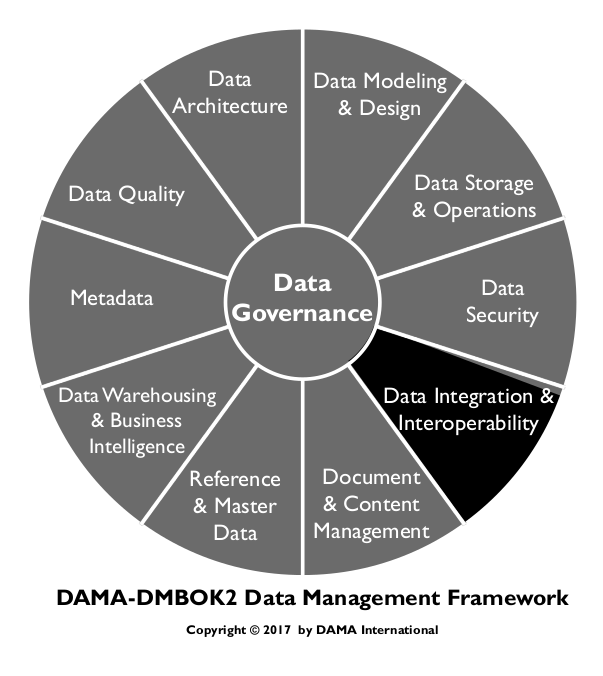
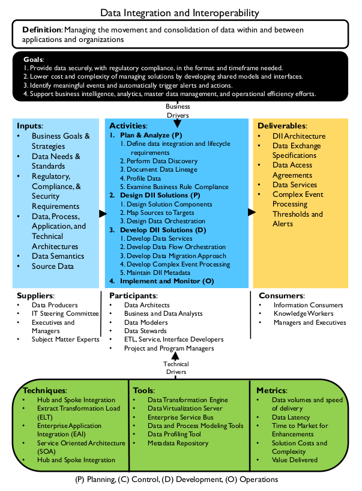
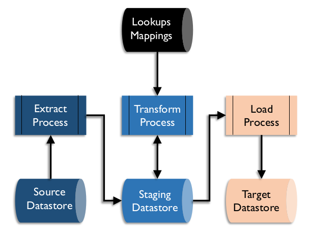
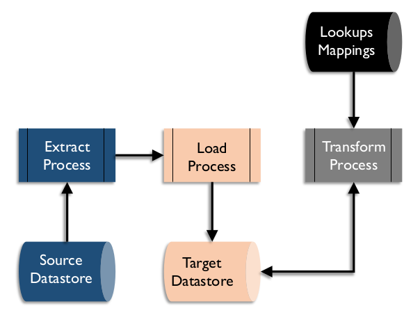
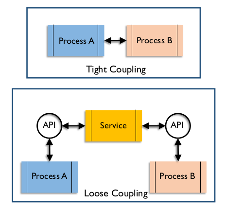
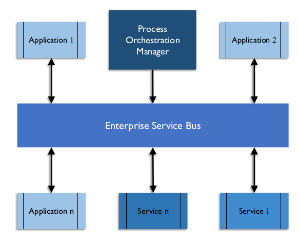

# Integração e Interoperabilidade de Dados

## 1. Introdução

Integração e Interoperabilidade de Dados (DII) descreve processos relacionados à movimentação e consolidação de dados dentro e entre armazenamentos de dados, aplicativos e organizações. A integração consolida dados em formatos consistentes, físicos ou virtuais. Interoperabilidade de Dados é a capacidade de comunicação de vários sistemas. As soluções DII permitem funções básicas de gerenciamento de dados das quais a maioria das organizações depende:

* Migração e conversão de dados
* Consolidação de dados em hubs ou marts
* Integração de pacotes de fornecedores ao portfólio de aplicativos de uma organização
* Compartilhamento de dados entre aplicativos e entre organizações
* Distribuição de dados entre datastores e data centers
* Arquivamento de dados
* Gerenciamento de interfaces de dados
* Obtenção e ingestão de dados externos
* Integração de dados estruturados e não estruturados
* Fornecimento de inteligência operacional e suporte a decisões de gestão

A DII depende destas outras áreas de gerenciamento de dados:

* **Governança de Dados:** Para governar as regras de transformação e estruturas de mensagens
* **Arquitetura de Dados:** Para projetar soluções
* **Segurança de Dados:** Para garantir que as soluções protejam adequadamente a segurança dos dados, sejam eles persistentes, virtuais ou em movimento entre aplicativos e organizações
* **Metadados:** Para rastrear o inventário técnico de dados (persistentes, virtuais e em movimento), o significado comercial dos dados, as regras de negócios para a transformação dos dados e o histórico operacional e a linhagem dos dados
* **Armazenamento e Operações de Dados:** Para gerenciar a instanciação física das soluções
* **Modelagem e Design de Dados:** Para projetar estruturas de dados, incluindo persistência física em bancos de dados, estruturas de dados virtuais e mensagens que transmitem informações entre aplicativos e organizações.

A Integração e a Interoperabilidade de Dados são cruciais para Data Warehouse e Business Intelligence, bem como para Dados de Referência e Gestão de Dados Mestres, pois todos se concentram na transformação e integração de dados de sistemas de origem para hubs de dados consolidados e de hubs para sistemas de destino, onde podem ser entregues aos consumidores de dados, tanto de sistemas quanto humanos.

A Integração e a Interoperabilidade de Dados são centrais para a área emergente da gestão de Big Data. O Big Data busca integrar vários tipos de dados, incluindo dados estruturados e armazenados em bancos de dados, dados de texto não estruturados em documentos ou arquivos e outros tipos de dados não estruturados, como áudio, vídeo e streaming. Esses dados integrados podem ser minerados, usados ​​para desenvolver modelos preditivos e implantados em atividades de inteligência operacional.

### 1.1 Impulsionadores de Negócios

A necessidade de gerenciar a movimentação de dados com eficiência é um dos principais impulsionadores da DII. Como a maioria das organizações possui centenas ou milhares de bancos de dados e repositórios, gerenciar os processos de movimentação de dados entre os repositórios de dados dentro da organização e de e para outras organizações tornou-se uma responsabilidade central de toda organização de tecnologia da informação. Se não for gerenciado adequadamente, o processo de movimentação de dados pode sobrecarregar os recursos e capacidades de TI e ofuscar os requisitos de suporte das áreas tradicionais de aplicativos e gerenciamento de dados.

O advento das organizações que compram aplicativos de fornecedores de software, em vez de desenvolver aplicativos personalizados, ampliou a necessidade de integração e interoperabilidade de dados corporativos. Cada aplicativo adquirido vem com seu próprio conjunto de repositórios de Dados Mestres, repositórios de dados de transações e repositórios de dados de relatórios que devem se integrar aos outros repositórios de dados da organização. Mesmo os sistemas de Planejamento de Recursos Empresariais (ERP) que executam as funções comuns da organização raramente, ou nunca, abrangem todos os repositórios de dados da organização. Eles também precisam ter seus dados integrados a outros dados organizacionais.

Figura 66 Diagrama de Contexto: Integração e Interoperabilidade de Dados

A necessidade de gerenciar a complexidade e os custos associados a ela são motivos para arquitetar a integração de dados sob uma perspectiva corporativa. Um projeto corporativo de integração de dados é comprovadamente mais eficiente e econômico do que soluções distribuídas ou ponto a ponto. O desenvolvimento de soluções ponto a ponto entre aplicativos pode resultar em milhares a milhões de interfaces e pode rapidamente sobrecarregar as capacidades até mesmo da organização de suporte de TI mais eficaz e eficiente.

Hubs de dados, como data warehouses e soluções de Dados Mestres, ajudam a aliviar esse problema, consolidando os dados necessários para muitos aplicativos e fornecendo a esses aplicativos visualizações consistentes dos dados. Da mesma forma, a complexidade do gerenciamento de dados operacionais e transacionais que precisam ser compartilhados por toda a organização pode ser bastante simplificada usando técnicas de integração de dados corporativos, como integração hub-and-spoke e modelos de mensagens canônicas.

Outro impulsionador de negócios é o gerenciamento do custo do suporte. A movimentação de dados por meio de diversas tecnologias, cada uma exigindo habilidades específicas de desenvolvimento e manutenção, pode aumentar os custos de suporte. Implementações de ferramentas padrão podem reduzir os custos de suporte e pessoal, além de aumentar a eficiência dos esforços de solução de problemas. Reduzir a complexidade do gerenciamento de interfaces pode reduzir o custo de manutenção de interfaces e permitir que os recursos de suporte sejam alocados de forma mais eficaz em outras prioridades organizacionais.

A DII também auxilia na capacidade da organização de cumprir os padrões e regulamentações de tratamento de dados. Sistemas de DII de nível empresarial permitem a reutilização de código para implementar regras de conformidade e simplificar a verificação da conformidade.

### 1.2 Objetivos e Princípios

A implementação de práticas e soluções de Integração e Interoperabilidade de Dados visa:

* Disponibilizar os dados no formato e no prazo necessários para os consumidores de dados, tanto humanos quanto de sistemas;
* Consolidar os dados física e virtualmente em hubs de dados;
* Reduzir o custo e a complexidade do gerenciamento de soluções por meio do desenvolvimento de modelos e interfaces compartilhados;
* Identificar eventos significativos (oportunidades e ameaças) e disparar alertas e ações automaticamente;
* Apoiar os esforços de Business Intelligence, analytics, Master Data Management e eficiência operacional;

Ao implementar a DII, uma organização deve seguir estes princípios:

* Adotar uma perspectiva corporativa no design para garantir a extensibilidade futura, mas implementar por meio de entrega iterativa e incremental;
* Equilibrar as necessidades locais de dados com as necessidades corporativas de dados, incluindo suporte e manutenção.
* Garantir a responsabilidade da empresa pelo design e pelas atividades de Integração e Interoperabilidade de Dados. Especialistas de negócios devem estar envolvidos no design e na modificação das regras de transformação de dados, tanto persistentes quanto virtuais.

### 1.3 Conceitos Essenciais

#### 1.3.1 Extrair, Transformar e Carregar

O processo básico de Extrair, Transformar e Carregar (ETL) é central para todas as áreas de Integração e Interoperabilidade de Dados. Sejam executadas física ou virtualmente, em lote ou em tempo real, essas são as etapas essenciais para a movimentação de dados entre aplicativos e organizações.

Dependendo dos requisitos de integração de dados, o ETL pode ser executado como um evento agendado periodicamente (lote) ou sempre que dados novos ou atualizados estiverem disponíveis (em tempo real ou orientado a eventos). O processamento operacional de dados tende a ser em tempo real ou quase real, enquanto os dados necessários para análise ou geração de relatórios são frequentemente agendados em tarefas em lote.

Os requisitos de integração de dados também determinam se os dados extraídos e transformados são armazenados fisicamente em estruturas de preparação. A preparação física permite um registro de auditoria das etapas que ocorreram com os dados e possíveis reinicializações do processo a partir de um ponto intermediário. No entanto, as estruturas de preparação ocupam espaço em disco e levam tempo para gravar e ler. As necessidades de integração de dados que exigem latência muito baixa geralmente não incluem a preparação física dos resultados intermediários da integração de dados.

##### 1.3.1.1 Extração

O processo de extração inclui a seleção dos dados necessários e sua extração da origem. Os dados extraídos são então armazenados em um armazenamento físico de dados em disco ou na memória. Se estiverem fisicamente armazenados em disco, o armazenamento de dados de preparação pode ser co-localizado com o armazenamento de dados de origem ou com o armazenamento de dados de destino, ou ambos. Idealmente, se esse processo for executado em um sistema operacional, ele será projetado para usar o mínimo de recursos possível, a fim de evitar afetar negativamente os processos operacionais. O processamento em lote fora do horário de pico é uma opção para extrações que incluem processamento complexo para realizar a seleção ou identificar dados alterados a serem extraídos.

##### 1.3.1.2 Transformação

O processo de transformação torna os dados selecionados compatíveis com a estrutura do armazenamento de dados de destino. A transformação inclui casos em que os dados são removidos da origem quando são movidos para o destino, em que os dados são copiados para vários destinos e em que os dados são usados ​​para acionar eventos, mas não são persistidos.

Exemplos de transformação podem incluir:

* **Alterações de formato:** Conversão do formato técnico dos dados; por exemplo, do formato EBCDIC para o formato ASCII
* **Alterações de estrutura:** Alterações na estrutura dos dados; por exemplo, de registros desnormalizados para normalizados
* **Conversão semântica:** Conversão de valores de dados para manter uma representação semântica consistente. Por exemplo, os códigos de gênero de origem podem incluir 0, 1, 2 e 3, enquanto os códigos de gênero de destino podem ser representados como DESCONHECIDO, FEMININO, MASCULINO ou NÃO FORNECIDO.
* **Desduplicação:** Garantir que, se as regras exigirem valores-chave ou registros exclusivos, um meio de escanear o destino e detectar e remover linhas duplicadas seja incluído
* **Reordenação:** Alterar a ordem dos elementos de dados ou registros para se adequar a um padrão definido

A transformação pode ser realizada em lote ou em tempo real, armazenando fisicamente o resultado em uma área de preparação ou armazenando virtualmente os dados transformados na memória até que estejam prontos para passar para a etapa de carregamento. Os dados resultantes da etapa de transformação devem estar prontos para integração com os dados na estrutura de destino.

##### 1.3.1.3 Carregamento

A etapa de carregamento do ETL consiste em armazenar ou apresentar fisicamente o resultado das transformações no sistema de destino. Dependendo das transformações realizadas, da finalidade do sistema de destino e do uso pretendido, os dados podem precisar de processamento adicional para serem integrados a outros dados ou podem estar em um formato final, prontos para serem apresentados aos consumidores.

Figura 67 Fluxo do Processo ETL

##### 1.3.1.4 ELT

Se o sistema de destino tiver mais capacidade de transformação do que o sistema de origem ou um sistema de aplicação intermediário, a ordem dos processos pode ser alterada para ELT – Extração, Carregamento e Transformação. O ELT permite que as transformações ocorram após o carregamento no sistema de destino, geralmente como parte do processo. O ELT permite que os dados de origem sejam instanciados no sistema de destino como dados brutos, o que pode ser útil para outros processos. Isso é comum em ambientes de Big Data, onde o ELT carrega o data lake. (Ver Capítulo 14.)

Figura 68 Fluxo do Processo ELT

##### 1.3.1.5 Mapeamento

Sinônimo de transformação, um mapeamento é tanto o processo de desenvolvimento da matriz de consulta das estruturas de origem para destino quanto o resultado desse processo. Um mapeamento define as fontes a serem extraídas, as regras para identificar os dados para extração, os destinos a serem carregados, as regras para identificar as linhas de destino para atualização (se houver) e quaisquer regras ou cálculos de transformação a serem aplicados. Muitas ferramentas de integração de dados oferecem visualizações de mapeamentos que permitem aos desenvolvedores usar interfaces gráficas para criar código de transformação.

#### 1.3.2 Latência

Latência é a diferença de tempo entre o momento em que os dados são gerados no sistema de origem e o momento em que os dados estão disponíveis para uso no sistema de destino. Diferentes abordagens para o processamento de dados resultam em diferentes graus de latência de dados. A latência pode ser alta (lote) ou baixa (orientada por eventos) a muito baixa (síncrona em tempo real).

##### 1.3.2.1 Lote

A maioria dos dados se move entre aplicativos e organizações em grupos ou arquivos, seja mediante solicitação de um consumidor de dados humano ou automaticamente em um cronograma periódico. Esse tipo de interação é chamado de lote ou ETL.

Os dados que se movimentam em lote representam o conjunto completo de dados em um determinado momento, como saldos de contas no final de um período, ou dados que mudaram de valor desde o último envio, como alterações de endereço feitas em um dia. O conjunto de dados alterados é chamado de delta, e os dados de um momento específico são chamados de snapshot.

Com soluções de integração de dados em lote, geralmente há um atraso significativo entre o momento em que os dados mudam na origem e o momento em que são atualizados no destino, resultando em alta latência. O processamento em lote é muito útil para processar grandes volumes de dados em um curto espaço de tempo. Ele tende a ser usado em soluções de integração de dados de data warehouse, mesmo quando soluções de menor latência estão disponíveis.

Para obter um processamento rápido e menor latência, algumas soluções de integração de dados usam o processamento em microlotes, que programa o processamento em lote para ser executado em uma frequência muito maior do que a diária, como a cada cinco minutos.

A integração de dados em lote é usada para conversões, migrações e arquivamento de dados, bem como para extração e carregamento de data warehouses e data marts. Há riscos associados ao tempo de processamento em lote. Para minimizar problemas com atualizações de aplicativos, agende a movimentação de dados entre aplicativos ao final do processamento lógico do dia útil ou após o processamento especial dos dados ter ocorrido à noite. Para evitar conjuntos de dados incompletos, as tarefas de movimentação de dados para um data warehouse devem ser agendadas com base no cronograma de relatórios diário, semanal ou mensal.

##### 1.3.2.2 Captura de Dados de Alterações

A Captura de Dados de Alterações é um método de redução de largura de banda por meio de filtragem para incluir apenas dados que foram alterados dentro de um período definido. A Captura de Dados de Alterações monitora um conjunto de dados em busca de alterações (inserções, alterações, exclusões) e, em seguida, repassa essas alterações (os deltas) para outros conjuntos de dados, aplicativos e organizações que consomem os dados. Os dados também podem ser marcados com identificadores, como sinalizadores ou carimbos de data/hora, como parte do processo. A Captura de Dados de Alterações pode ser baseada em dados ou em logs. (Ver Capítulo 6.)

Existem três técnicas para captura de dados de alterações baseadas em dados.

* O sistema de origem preenche elementos de dados específicos, como registros de data e hora dentro de um intervalo, ou códigos ou sinalizadores, que servem como indicadores de alterações. O processo de extração usa regras para identificar as linhas a serem extraídas.
* Os processos do sistema de origem adicionam dados a uma lista simples de objetos e identificadores ao alterar os dados, que é então usada para controlar a seleção de dados para extração.
* O sistema de origem processa dados copiados que foram alterados para um objeto separado como parte da transação, que é então usado para o processamento de extração. Este objeto não precisa estar dentro do sistema de gerenciamento de banco de dados.

Esses tipos de extração usam recursos incorporados ao aplicativo de origem, que podem consumir muitos recursos e exigir a capacidade de modificar o aplicativo de origem.

Na captura de dados de alterações baseada em log, os logs de atividades de dados criados pelo sistema de gerenciamento de banco de dados são copiados e processados, buscando alterações específicas que são então traduzidas e aplicadas a um banco de dados de destino. Traduções complexas podem ser difíceis, mas estruturas intermediárias semelhantes ao objeto de origem podem ser usadas como uma forma de preparar as alterações para processamento posterior.

##### 1.3.2.3 Quase em tempo real e orientado a eventos

A maioria das soluções de integração de dados que não são executadas em lotes utiliza uma solução quase em tempo real ou orientada a eventos. Os dados são processados ​​em conjuntos menores distribuídos ao longo do dia em um cronograma definido, ou são processados ​​quando um evento ocorre, como uma atualização de dados. O processamento quase em tempo real tem uma latência menor do que o processamento em lote e, frequentemente, uma carga menor no sistema, pois o trabalho é distribuído ao longo do tempo, mas geralmente é mais lento do que uma solução de integração de dados sincronizada. Soluções de integração de dados quase em tempo real geralmente são implementadas usando um barramento de serviços corporativo.

Informações de estado e dependências de processo devem ser monitoradas pelo processo de carregamento do aplicativo de destino. Os dados que chegam ao destino podem não estar disponíveis na ordem exata em que o destino precisa para construir os dados de destino corretos. Por exemplo, processe Dados Mestres ou dados dimensionais antes dos dados transacionais que utilizam esses Dados Mestres.

##### 1.3.2.4 Assíncrono

Em um fluxo de dados assíncrono, o sistema que fornece os dados não espera que o sistema receptor confirme a atualização antes de continuar o processamento. Assíncrono implica que tanto o sistema emissor quanto o receptor podem ficar off-line por algum período sem que o outro sistema também fique off-line.

A integração assíncrona de dados não impede que o aplicativo de origem continue seu processamento, nem faz com que o aplicativo de origem fique indisponível caso algum dos aplicativos de destino esteja indisponível. Como as atualizações de dados feitas nos aplicativos em uma configuração assíncrona não são imediatas, a integração é chamada de integração quase em tempo real. O atraso entre as atualizações feitas na origem e retransmitidas aos conjuntos de dados de destino em um ambiente quase em tempo real é geralmente medido em segundos ou minutos.

##### 1.3.2.5 Tempo Real, Síncrono

Existem situações em que nenhum atraso ou outras diferenças entre os dados de origem e de destino são aceitáveis. Quando os dados em um conjunto de dados precisam ser mantidos perfeitamente sincronizados com os dados em outro conjunto de dados, uma solução síncrona em tempo real deve ser usada.

Em uma solução de integração síncrona, um processo em execução aguarda a confirmação de outros aplicativos ou processos antes de executar sua próxima atividade ou transação. Isso significa que a solução pode processar menos transações porque precisa aguardar a confirmação da sincronização dos dados. Se algum dos aplicativos que precisam da atualização não estiver disponível, a transação não poderá ser concluída no aplicativo principal. Essa situação mantém os dados sincronizados, mas tem o potencial de tornar os aplicativos estratégicos dependentes de aplicativos menos críticos.

Soluções que utilizam esse tipo de arquitetura existem em um continuum baseado na possível diferença entre os conjuntos de dados e no valor de tal solução. Os conjuntos de dados podem ser mantidos sincronizados por meio de recursos de banco de dados, como confirmações em duas fases, que garantem que todas as atualizações em uma transação comercial sejam bem-sucedidas ou que nenhuma seja feita. Por exemplo, instituições financeiras utilizam soluções de confirmação em duas fases para garantir que as tabelas de transações financeiras estejam absolutamente sincronizadas com as tabelas de balanço financeiro. A maioria dos programas não utiliza confirmação em duas fases. Há uma possibilidade muito pequena de que, se um aplicativo for interrompido inesperadamente, um conjunto de dados seja atualizado, mas outro não.

Soluções síncronas em tempo real exigem menos gerenciamento de estado do que soluções assíncronas, pois a ordem em que as transações são processadas é claramente gerenciada pelos aplicativos de atualização. No entanto, eles também podem levar ao bloqueio e atraso de outras transações.

##### 1.3.2.6 Baixa Latência ou Streaming

Avanços tremendos foram feitos no desenvolvimento de soluções de integração de dados extremamente rápidas. Essas soluções exigem um grande investimento em hardware e software. Os custos extras de soluções de baixa latência são justificados se uma organização precisa de movimentação de dados extremamente rápida em grandes distâncias. "Dados de streaming" fluem de sistemas de computador em tempo real e contínuo, imediatamente após a ocorrência de eventos. Os fluxos de dados capturam eventos como a compra de bens ou títulos financeiros, comentários em mídias sociais e leituras de sensores que monitoram localização, temperatura, uso ou outros valores.

Soluções de integração de dados de baixa latência são projetadas para minimizar o tempo de resposta a eventos. Elas podem incluir o uso de soluções de hardware, como discos de estado sólido, ou soluções de software, como bancos de dados em memória, para que o processo não precise ficar lento para ler ou gravar em discos tradicionais. Os processos de leitura e gravação em unidades de disco tradicionais são milhares de vezes mais lentos do que o processamento de dados em memória ou em unidades de disco de estado sólido.

Soluções assíncronas são geralmente utilizadas em soluções de baixa latência para que as transações não precisem aguardar a confirmação de processos subsequentes antes de processar o próximo dado.

O multiprocessamento massivo, ou processamento simultâneo, também é uma configuração comum em soluções de baixa latência, para que o processamento dos dados recebidos possa ser distribuído por vários processadores simultaneamente, sem ser restringido por um único ou um pequeno número de processadores.

#### 1.3.3 Replicação

Para proporcionar um melhor tempo de resposta para usuários localizados em todo o mundo, alguns aplicativos mantêm cópias exatas de conjuntos de dados em vários locais físicos. As soluções de replicação minimizam o impacto no desempenho de análises e consultas no ambiente operacional transacional primário.

Essa solução deve sincronizar as cópias do conjunto de dados fisicamente distribuídas. A maioria dos sistemas de gerenciamento de banco de dados possui utilitários de replicação para realizar esse trabalho. Esses utilitários funcionam melhor quando todos os conjuntos de dados são mantidos na mesma tecnologia do sistema de gerenciamento de banco de dados. As soluções de replicação geralmente monitoram o log de alterações no conjunto de dados, não o conjunto de dados em si. Elas minimizam o impacto em quaisquer aplicativos operacionais, pois não competem com os aplicativos pelo acesso ao conjunto de dados. Somente os dados do log de alterações são transmitidos entre as cópias replicadas. As soluções de replicação padrão são quase em tempo real; há um pequeno atraso entre uma alteração em uma cópia do conjunto de dados e outra.

Como os benefícios das soluções de replicação — efeito mínimo no conjunto de dados de origem e quantidade mínima de dados transmitidos — são muito desejáveis, a replicação é usada em muitas soluções de integração de dados, mesmo aquelas que não incluem distribuição física de longa distância. Os utilitários de gerenciamento de banco de dados não exigem programação extensa, portanto, tendem a haver poucos bugs de programação.

Os utilitários de replicação funcionam de forma ideal quando os conjuntos de dados de origem e destino são cópias exatas um do outro. Diferenças entre origem e destino apresentam riscos à sincronização. Se o destino final não for uma cópia exata da origem, é necessário manter uma área de preparação para armazenar uma cópia exata das fontes. Isso requer uso extra de disco e possivelmente tecnologia de banco de dados adicional.

As soluções de replicação de dados não são ideais se alterações nos dados puderem ocorrer em vários locais de cópia. Se for possível que o mesmo dado seja alterado em dois locais diferentes, existe o risco de os dados ficarem dessincronizados ou de um dos locais ter suas alterações substituídas sem aviso prévio. (Consulte o Capítulo 6.)

#### 1.3.4 Arquivamento

Dados usados ​​com pouca frequência ou que não são usados ​​ativamente podem ser movidos para uma estrutura de dados ou solução de armazenamento alternativa que seja menos custosa para a organização. Funções ETL podem ser usadas para transportar e possivelmente transformar os dados de arquivo para as estruturas de dados no ambiente de arquivo. Use arquivos para armazenar dados de aplicativos que estão sendo descontinuados, bem como dados de sistemas operacionais de produção que não são usados ​​há muito tempo, para melhorar a eficiência operacional.

É fundamental monitorar a tecnologia de arquivo para garantir que os dados ainda estejam acessíveis quando a tecnologia muda. Ter um arquivo em uma estrutura ou formato antigo, ilegível por tecnologias mais recentes, pode ser um risco, especialmente para dados que ainda são exigidos por lei. (Consulte o Capítulo 9.)

#### 1.3.5 Formato de Mensagem Corporativa / Modelo Canônico

Um modelo de dados canônico é um modelo comum usado por uma organização ou grupo de troca de dados que padroniza o formato no qual os dados serão compartilhados. Em um padrão de design de interação de dados hub-and-spoke, todos os sistemas que desejam fornecer ou receber dados interagem apenas com um hub central de informações. Os dados são transformados de ou para um sistema emissor ou receptor com base em um formato de mensagem comum ou corporativo para a organização (um modelo canônico). (Consulte o Capítulo 5.) O uso de um modelo canônico limita o número de transformações de dados necessárias para qualquer sistema ou organização que troque dados. Cada sistema precisa transformar dados apenas de e para o modelo canônico central, em vez de para o formato da multiplicidade de sistemas com os quais deseja trocar dados.

Embora desenvolver e concordar com um formato de mensagem compartilhado seja uma tarefa importante, ter um modelo canônico pode reduzir significativamente a complexidade da interoperabilidade de dados em uma empresa e, assim, reduzir significativamente o custo de suporte. A criação e o gerenciamento do modelo de dados canônico comum para todas as interações de dados representam um item complexo de overhead necessário na implementação de uma solução de integração de dados corporativos utilizando um modelo de interação hub-and-spoke. É justificável para auxiliar no gerenciamento das interações de dados entre mais de três sistemas e essencial para o gerenciamento de interações de dados em ambientes com mais de 100 sistemas de aplicação.

#### 1.3.6 Modelos de Interação

Os modelos de interação descrevem maneiras de estabelecer conexões entre sistemas para transferir dados.

##### 1.3.6.1 Ponto a ponto

A grande maioria das interações entre sistemas que compartilham dados o fazem "ponto a ponto"; eles passam dados diretamente entre si. Este modelo faz sentido no contexto de um pequeno conjunto de sistemas. No entanto, torna-se rapidamente ineficiente e aumenta o risco organizacional quando muitos sistemas exigem os mesmos dados das mesmas fontes.

* Impactos no processamento: Se os sistemas de origem estiverem operacionais, a carga de trabalho do fornecimento de dados poderá afetar o processamento.

* Gerenciamento de interfaces: O número de interfaces necessárias em um modelo de interação ponto a ponto se aproxima do número de sistemas ao quadrado (s²). Uma vez construídas, essas interfaces precisam ser mantidas e suportadas. A carga de trabalho para gerenciar e suportar interfaces entre os sistemas pode rapidamente se tornar maior do que suportar os próprios sistemas.
* Potencial para inconsistência: Problemas de projeto surgem quando múltiplos sistemas exigem diferentes versões ou formatos de dados. O uso de múltiplas interfaces para obter dados levará a inconsistências nos dados enviados aos sistemas posteriores.

##### 1.3.6.2 Hub-and-spoke

O modelo hub-and-spoke, uma alternativa ao modelo ponto a ponto, consolida dados compartilhados (física ou virtualmente) em um hub de dados central que pode ser usado por diversas aplicações. Todos os sistemas que desejam trocar dados o fazem por meio de um sistema central de controle de dados comum, em vez de diretamente entre si (ponto a ponto). Data Warehouses, Data Marts, Armazenamentos de Dados Operacionais e hubs de Gerenciamento de Dados Mestres são os exemplos mais conhecidos de hubs de dados.

Os hubs fornecem visualizações consistentes dos dados com impacto limitado no desempenho dos sistemas de origem. Os hubs de dados minimizam até mesmo o número de sistemas e extrações que precisam acessar as fontes de dados, minimizando assim o impacto nos recursos do sistema de origem. Adicionar novos sistemas ao portfólio requer apenas a construção de interfaces para o hub de dados. A interação hub-and-spoke é mais eficiente e pode ser justificada em termos de custo, mesmo que o número de sistemas envolvidos seja relativamente pequeno, mas torna-se crítica para gerenciar um portfólio de sistemas na casa das centenas ou milhares.

Enterprise Service Buses (ESB) são a solução de integração de dados para compartilhamento de dados quase em tempo real entre vários sistemas, onde o hub é um conceito virtual do formato padrão ou do modelo canônico para compartilhamento de dados na organização.

O hub-and-spoke pode nem sempre ser a melhor solução. Algumas latências do modelo hub-and-spoke são inaceitáveis ​​ou o desempenho é insuficiente. O próprio hub cria sobrecarga em uma arquitetura hub-and-spoke. Uma solução ponto a ponto não exigiria o hub. No entanto, os benefícios do hub superam as desvantagens da sobrecarga assim que três ou mais sistemas estão envolvidos no compartilhamento de dados. O uso do padrão de design hub-and-spoke para o intercâmbio de dados pode reduzir drasticamente a proliferação de soluções de transformação e integração de dados e, assim, simplificar drasticamente o suporte organizacional necessário.

##### 1.3.6.3 Publicar - Assinar

Um modelo de publicação e assinatura envolve sistemas que enviam dados (publicar) e outros sistemas que recebem dados (assinar). Os sistemas que fornecem dados são listados em um catálogo de serviços de dados, e os sistemas que buscam consumir dados assinam esses serviços. Quando os dados são publicados, eles são enviados automaticamente aos assinantes.

Quando vários consumidores de dados desejam um determinado conjunto de dados ou dados em um determinado formato, desenvolver esse conjunto de dados centralmente e disponibilizá-lo a todos que precisam garante que todos os constituintes recebam um conjunto de dados consistente em tempo hábil.

#### 1.3.7 Conceitos da Arquitetura DII

##### 1.3.7.1 Acoplamento de Aplicações

O acoplamento descreve o grau em que dois sistemas estão interligados. Dois sistemas fortemente acoplados geralmente têm uma interface síncrona, onde um sistema aguarda uma resposta do outro. O acoplamento fortemente acoplado representa uma operação mais arriscada: se um sistema estiver indisponível, ambos estarão efetivamente indisponíveis, e o plano de continuidade de negócios para ambos deve ser o mesmo. (Ver Capítulo 6.)

Sempre que possível, o acoplamento fraco é um projeto de interface preferencial, onde os dados são transmitidos entre sistemas sem aguardar uma resposta e um sistema pode ficar indisponível sem causar a indisponibilidade do outro. O acoplamento fraco pode ser implementado usando várias técnicas com serviços, APIs ou filas de mensagens. A Figura 69 ilustra um possível projeto de acoplamento fraco.

Figura 69 Acoplamento de Aplicações

A Arquitetura Orientada a Serviços utilizando um Barramento de Serviços Corporativos é um exemplo de um padrão de projeto de interação de dados com acoplamento fraco.

Quando os sistemas são fracamente acoplados, a substituição de sistemas no inventário de aplicações pode, teoricamente, ser realizada sem reescrever os sistemas com os quais eles interagem, pois os pontos de interação são bem definidos.

##### 1.3.7.2 Orquestração e Controles de Processos

Orquestração é o termo usado para descrever como múltiplos processos são organizados e executados em um sistema. Todos os sistemas que manipulam mensagens ou pacotes de dados devem ser capazes de gerenciar a ordem de execução desses processos, a fim de preservar a consistência e a continuidade.

Controles de Processo são os componentes que garantem que o envio, a entrega, a extração e o carregamento de dados sejam precisos e completos. Um aspecto frequentemente negligenciado da arquitetura básica de movimentação de dados, os controles incluem:

* Logs de atividades do banco de dados
* Logs de tarefas em lote
* Alertas
* Logs de exceções
* Gráficos de dependência de tarefas com opções de correção e respostas padrão
* Informações do "relógio" da tarefa, como o tempo das tarefas dependentes, a duração esperada das tarefas e o tempo da janela de computação (disponível)

##### 1.3.7.3 Integração de Aplicações Corporativas (EAI)

Em um modelo de integração de aplicações corporativas (EAI), os módulos de software interagem entre si apenas por meio de chamadas de interface bem definidas (interfaces de programação de aplicações – APIs). Os repositórios de dados são atualizados apenas por seus próprios módulos de software e outros softwares não conseguem acessar os dados em uma aplicação, apenas por meio das APIs definidas. O EAI é construído com base em conceitos orientados a objetos, que enfatizam a reutilização e a capacidade de substituir qualquer módulo sem afetar os demais.

##### 1.3.7.4 Barramento de Serviços Corporativos (ESB)

Um Barramento de Serviços Corporativos é um sistema que atua como intermediário entre sistemas, transmitindo mensagens entre eles. Os aplicativos podem enviar e receber mensagens ou arquivos usando o ESB e são encapsulados de outros processos existentes no ESB. Um exemplo de acoplamento fraco: o ESB atua como o serviço entre os aplicativos. (Veja a Figura 70.)

Figura 70 Barramento de Serviços Corporativos

##### 1.3.7.5 Arquitetura Orientada a Serviços (SOA)

A maioria das estratégias maduras de integração de dados corporativos utiliza a ideia de arquitetura orientada a serviços (SOA), na qual a funcionalidade de fornecer ou atualizar dados (ou outros serviços de dados) pode ser fornecida por meio de chamadas de serviço bem definidas entre aplicativos. Com essa abordagem, os aplicativos não precisam ter interação direta ou conhecimento do funcionamento interno de outros aplicativos. A SOA permite a independência de aplicativos e a capacidade de uma organização substituir sistemas sem a necessidade de fazer alterações significativas nos sistemas que interagem com eles.

O objetivo da arquitetura orientada a serviços é ter uma interação bem definida entre módulos de software autocontidos. Cada módulo executa funções (ou seja, fornece serviços) para outros módulos de software ou para consumidores humanos. O conceito-chave é que a arquitetura SOA fornece serviços independentes: o serviço não tem conhecimento prévio do aplicativo que o solicita e a implementação do serviço é uma caixa-preta para o aplicativo que o solicita. Uma arquitetura orientada a serviços pode ser implementada com diversas tecnologias, incluindo serviços web, mensagens, APIs RESTful, etc. Os serviços geralmente são implementados como APIs (interfaces de programação de aplicações) disponíveis para serem chamadas por sistemas de aplicação (ou consumidores humanos). Um registro de API bem definido descreve quais opções estão disponíveis, os parâmetros que precisam ser fornecidos e as informações resultantes que são fornecidas.

Os serviços de dados, que podem incluir a adição, exclusão, atualização e recuperação de dados, são especificados em um catálogo de serviços disponíveis. Para atingir os objetivos corporativos de escalabilidade (suportar integrações entre todas as aplicações da empresa sem usar quantidades excessivas de recursos para isso) e reutilização (ter serviços que sejam aproveitados por todos os solicitantes de dados de um tipo), um modelo de governança forte deve ser estabelecido em torno do design e registro de serviços e APIs. Antes de desenvolver novos serviços de dados, é necessário garantir que nenhum serviço já exista que possa fornecer os dados solicitados. Além disso, novos serviços precisam ser projetados para atender a requisitos amplos, de modo que não se limitem à necessidade imediata, mas possam ser reutilizados.

##### 1.3.7.6 Processamento de Eventos Complexos (CEP)

O processamento de eventos é um método de rastrear e analisar (processar) fluxos de informações (dados) sobre coisas que acontecem (eventos) e derivar uma conclusão a partir deles. O processamento de eventos complexos (CEP) combina dados de múltiplas fontes para identificar eventos significativos (como oportunidades ou ameaças) para prever comportamentos ou atividades e acionar automaticamente respostas em tempo real, como sugerir um produto para um consumidor comprar. Regras são definidas para orientar o processamento e o roteamento de eventos.

As organizações podem usar o processamento de eventos complexos para prever comportamentos ou atividades e acionar automaticamente respostas em tempo real. Eventos como leads de vendas, cliques na web, pedidos ou chamadas de atendimento ao cliente podem ocorrer em várias camadas de uma organização. Alternativamente, podem incluir notícias, mensagens de texto, postagens em mídias sociais, feeds do mercado de ações, boletins de trânsito, boletins meteorológicos ou outros tipos de dados. Um evento também pode ser definido como uma mudança de estado, quando uma medição excede um limite predefinido de tempo, temperatura ou outro valor.

O CEP apresenta alguns desafios de dados. Em muitos casos, a taxa de ocorrência dos eventos torna impraticável a recuperação dos dados adicionais necessários para interpretá-los à medida que ocorrem. O processamento eficiente normalmente exige o pré-posicionamento de alguns dados na memória do mecanismo CEP.

O suporte ao processamento complexo de eventos requer um ambiente capaz de integrar grandes quantidades de dados de vários tipos. Devido ao volume e à variedade de dados geralmente envolvidos na criação de previsões, o processamento complexo de eventos frequentemente está vinculado ao Big Data. Frequentemente, ele requer o uso de tecnologias que suportam requisitos de latência ultrabaixa, como o processamento de dados de streaming em tempo real e bancos de dados na memória. (Consulte o Capítulo 14.)

##### 1.3.7.7 Federação e Virtualização de Dados

Quando os dados existem em armazenamentos de dados distintos, eles podem ser reunidos de outras maneiras além da integração física. A Federação de Dados fornece acesso a uma combinação de armazenamentos de dados individuais, independentemente da estrutura. A Virtualização de Dados permite que bancos de dados distribuídos, bem como vários armazenamentos de dados heterogêneos, sejam acessados ​​e visualizados como um único banco de dados. (Consulte o Capítulo 6.)

##### 1.3.7.8 Dados como Serviço (DaaS)

Software como Serviço (SaaS) é um modelo de entrega e licenciamento. Uma aplicação é licenciada para fornecer serviços, mas o software e os dados estão localizados em um data center controlado pelo fornecedor do software, e não no data center da organização licenciadora. Existem conceitos semelhantes para o fornecimento de vários níveis de infraestrutura de computação como serviço (TI como serviço, plataforma como serviço, banco de dados como serviço).

Uma definição de Dados como Serviço (DaaS) são dados licenciados de um fornecedor e fornecidos sob demanda, em vez de armazenados e mantidos no data center da organização licenciadora. Um exemplo comum inclui informações sobre os títulos vendidos em uma bolsa de valores e os preços associados (atuais e históricos).

Embora Dados como Serviço certamente se aplique a fornecedores que vendem dados para stakeholders dentro de um setor, o conceito de "serviço" também é usado dentro de uma organização para fornecer dados corporativos ou serviços de dados para diversas funções e sistemas operacionais. As organizações de serviços fornecem um catálogo de serviços disponíveis, níveis de serviço e tabelas de preços.

##### 1.3.7.9 Integração baseada em nuvem

A integração baseada em nuvem (também conhecida como plataforma de integração como serviço ou IPaaS) é uma forma de integração de sistemas fornecida como um serviço em nuvem que aborda dados, processos, arquitetura orientada a serviços (SOA) e casos de uso de integração de aplicações.

Antes do surgimento da computação em nuvem, a integração podia ser categorizada como interna ou business-to-business (B2B). Os requisitos de integração interna são atendidos por meio de uma plataforma de middleware local e normalmente utilizam um barramento de serviço (ESB) para gerenciar a troca de dados entre sistemas. A integração business-to-business é atendida por meio de gateways EDI (intercâmbio eletrônico de dados), redes de valor agregado (VAN) ou marketplaces.

O advento dos aplicativos SaaS criou um novo tipo de demanda por integração de dados localizados fora do data center de uma organização, atendida por meio da integração baseada em nuvem. Desde o seu surgimento, muitos desses serviços também desenvolveram a capacidade de integrar aplicativos locais, bem como funcionar como gateways EDI. Soluções de integração baseadas em nuvem geralmente são executadas como aplicativos SaaS nos data centers dos fornecedores e não nas organizações proprietárias dos dados a serem integrados. A integração baseada em nuvem envolve a interação com os dados do aplicativo SaaS a serem integrados usando serviços de interação SOA. (Consulte o Capítulo 6.)

#### 1.3.8 Padrões de Troca de Dados

Os Padrões de Troca de Dados são regras formais para a estrutura de elementos de dados. A ISO (Organização Internacional de Padronização) desenvolveu padrões de troca de dados, assim como muitos setores. Uma especificação de troca de dados é um modelo comum usado por uma organização ou grupo de troca de dados que padroniza o formato no qual os dados serão compartilhados. Um padrão de troca define uma estrutura para as transformações de dados necessárias para qualquer sistema ou organização que troque dados. Os dados precisam ser mapeados para a especificação de troca.

Embora desenvolver e concordar com um formato de mensagem compartilhado seja uma tarefa árdua, ter um formato de troca ou layout de dados acordado entre sistemas pode simplificar significativamente a interoperabilidade de dados em uma empresa, reduzindo o custo de suporte e permitindo uma melhor compreensão dos dados.

O Modelo Nacional de Troca de Informações (NIEM) foi desenvolvido para a troca de documentos e transações entre organizações governamentais nos Estados Unidos. A intenção é que o remetente e o destinatário das informações compartilhem uma compreensão comum e inequívoca do significado dessas informações. A conformidade com o NIEM garante que um conjunto básico de informações seja bem compreendido e tenha o mesmo significado consistente em várias comunidades, permitindo assim a interoperabilidade.

O NIEM utiliza a Linguagem de Marcação Extensível (XML) para definições de esquemas e representação de elementos, o que permite que a estrutura e o significado dos dados sejam definidos por meio de regras de sintaxe XML simples, mas cuidadosamente definidas.

## 2. Atividades de Integração de Dados

Integração e Interoperabilidade de Dados envolve obter dados onde e quando necessários. As atividades de integração de dados seguem um ciclo de vida de desenvolvimento. Começam com o planejamento e passam pelo design, desenvolvimento, testes e implementação. Uma vez implementados, os sistemas integrados precisam ser gerenciados, monitorados e aprimorados.

### 2.1 Planejar e Analisar

#### 2.1.1 Definir Requisitos de Integração e Ciclo de Vida de Dados

Definir os requisitos de integração de dados envolve a compreensão dos objetivos de negócios da organização, bem como dos dados necessários e das iniciativas tecnológicas propostas para atingi-los. Também é necessário reunir todas as leis ou regulamentações relevantes relativas aos dados a serem utilizados. Algumas atividades podem precisar ser restringidas devido ao conteúdo dos dados, e conhecê-los antecipadamente evitará problemas posteriores. Os requisitos também devem levar em conta a política organizacional sobre retenção de dados e outras partes do ciclo de vida dos dados. Frequentemente, os requisitos para retenção de dados variam de acordo com o domínio e o tipo de dados.

Os requisitos de integração e ciclo de vida de dados são geralmente definidos por analistas de negócios, administradores de dados e arquitetos em diversas funções, incluindo TI, que desejam obter dados em um determinado local, em um determinado formato e integrados a outros dados. Os requisitos determinarão o tipo de modelo de interação DII, que, por sua vez, determinará a tecnologia e os serviços necessários para atender aos requisitos.

O processo de definição de requisitos cria e revela Metadados valiosos. Esses Metadados devem ser gerenciados ao longo de todo o ciclo de vida dos dados, desde a descoberta até as operações. Quanto mais completos e precisos forem os Metadados de uma organização, maior será sua capacidade de gerenciar os riscos e custos da integração de dados.

#### 2.1.2 Realizar a Descoberta de Dados

A descoberta de dados deve ser realizada antes do projeto. O objetivo da descoberta de dados é identificar potenciais fontes de dados para o esforço de integração. A descoberta identificará onde os dados podem ser adquiridos e onde podem ser integrados. O processo combina uma busca técnica, utilizando ferramentas que examinam os Metadados e/ou o conteúdo real dos conjuntos de dados de uma organização, com expertise no assunto (ou seja, entrevistar pessoas que trabalham com os dados de interesse).

A descoberta também inclui uma avaliação de alto nível da qualidade dos dados, para determinar se os dados são adequados para os propósitos da iniciativa de integração. Essa avaliação requer não apenas a revisão da documentação existente, entrevistando especialistas no assunto, mas também a verificação das informações coletadas em relação aos dados reais por meio de perfis de dados ou outras análises. (Consulte a Seção 2.1.4.) Em quase todos os casos, haverá discrepâncias entre o que se acredita sobre um conjunto de dados e o que realmente se constata ser verdadeiro.

A descoberta de dados produz ou adiciona dados organizacionais a um inventário. Esse inventário deve ser mantido em um repositório de metadados. Garanta que esse inventário seja mantido como parte padrão dos esforços de integração: adicione ou remova repositórios de dados, documente alterações na estrutura.

A maioria das organizações precisa integrar dados de seus sistemas internos. No entanto, as soluções de integração de dados também podem envolver a aquisição de dados de fora da organização. Há uma quantidade vasta e crescente de informações valiosas disponíveis gratuitamente ou de fornecedores de dados. Dados de fontes externas podem ser extremamente valiosos quando integrados a dados internos de uma organização. No entanto, a aquisição e a integração de dados externos exigem planejamento.

#### 2.1.3 Documentar a Linhagem de Dados

O processo de descoberta de dados também revelará informações sobre como os dados fluem por uma organização. Essas informações podem ser usadas para documentar a linhagem de dados de alto nível: como os dados em análise são adquiridos ou criados pela organização, para onde se movem e são alterados dentro da organização e como os dados são usados ​​pela organização para análises, tomada de decisões ou acionamento de eventos. A linhagem detalhada pode incluir as regras segundo as quais os dados são alterados e a frequência das alterações.

A análise da linhagem pode identificar atualizações necessárias na documentação dos sistemas em uso. ETL com codificação personalizada e outros objetos de manipulação de dados legados devem ser documentados para garantir que a organização possa analisar o impacto de quaisquer alterações no fluxo de dados.

O processo de análise também pode identificar oportunidades de melhorias no fluxo de dados existente. Por exemplo, descobrir que o código pode ser atualizado para uma simples chamada de função em uma ferramenta ou pode ser descartado por não ser mais relevante. Às vezes, uma ferramenta antiga está realizando uma transformação que é desfeita posteriormente no processo. Encontrar e remover essas ineficiências pode contribuir significativamente para o sucesso do projeto e para a capacidade geral da organização de usar seus dados.

#### 2.1.4 Dados de Perfil

Compreender o conteúdo e a estrutura dos dados é essencial para uma integração bem-sucedida. A criação de perfil de dados contribui para esse objetivo. A estrutura e o conteúdo reais dos dados sempre diferem do que se supõe. Às vezes, as diferenças são pequenas; outras vezes, são grandes o suficiente para inviabilizar um esforço de integração. A criação de perfil pode ajudar as equipes de integração a descobrir essas diferenças e usar esse conhecimento para tomar melhores decisões sobre sourcing e design. Se a criação de perfil de dados for ignorada, as informações que deveriam influenciar o design só serão descobertas durante os testes ou as operações.

A criação de perfil básica envolve a análise de:

* Formato dos dados conforme definido nas estruturas de dados e inferido a partir dos dados reais
* População de dados, incluindo os níveis de dados nulos, em branco ou padrão
* Valores dos dados e sua correspondência com um conjunto definido de valores válidos
* Padrões e relacionamentos internos ao conjunto de dados, como campos relacionados e regras de cardinalidade
* Relacionamentos com outros conjuntos de dados

Uma criação de perfil mais abrangente dos potenciais conjuntos de dados de origem e destino é necessária para entender o quão bem os dados atendem aos requisitos da iniciativa específica de integração de dados. Crie o perfil das fontes e dos alvos para entender como transformar os dados para atender aos requisitos.

Um dos objetivos da criação de perfil é avaliar a qualidade dos dados. Avaliar a adequação dos dados para um uso específico requer a documentação das regras de negócios e a mensuração do grau de conformidade dos dados com essas regras. Avaliar a precisão requer a comparação com um conjunto definitivo de dados que foi determinado como correto. Esses conjuntos de dados nem sempre estão disponíveis, portanto, mensurar a precisão pode não ser possível, especialmente como parte de um esforço de criação de perfil.

Assim como na descoberta de dados de alto nível, a criação de perfil de dados inclui a verificação de suposições sobre os dados em relação aos dados reais. Capture os resultados da criação de perfil de dados em um repositório de metadados para uso em projetos posteriores e use o que for aprendido com o processo para melhorar a precisão dos metadados existentes (Olson, 2003). (Consulte o Capítulo 13.)

O requisito para criar o perfil de dados deve ser equilibrado com as normas de segurança e privacidade de uma organização. (Consulte o Capítulo 7.)

#### 2.1.5 Coletar Regras de Negócios

As regras de negócios são um subconjunto crítico de requisitos. Uma regra de negócios é uma declaração que define ou restringe um aspecto do processamento de negócios. As regras de negócios têm como objetivo afirmar a estrutura do negócio ou controlar ou influenciar o comportamento do negócio. As regras de negócios se enquadram em uma das quatro categorias: definições de termos de negócios, fatos que relacionam os termos entre si, restrições ou afirmações de ação e derivações.

Use regras de negócios para dar suporte à Integração e Interoperabilidade de Dados em vários pontos, para:

* Avaliar dados em conjuntos de dados de origem e destino em potencial
* Direcionar o fluxo de dados na organização
* Monitorar os dados operacionais da organização
* Direcionar quando acionar eventos e alertas automaticamente

Para o Gerenciamento de Dados Mestres, as regras de negócios incluem regras de correspondência, regras de mesclagem, regras de sobrevivência e regras de confiança. Para arquivamento de dados, data warehouse e outras situações em que um armazenamento de dados está em uso, as regras de negócios também incluem regras de retenção de dados.

A coleta de regras de negócios também é chamada de coleta de regras ou mineração de regras de negócios. O analista de negócios ou administrador de dados pode extrair as regras da documentação existente (como casos de uso, especificações ou código do sistema), ou pode também organizar workshops e entrevistas com especialistas no assunto (SMEs), ou ambos.

### 2.2 Projetar Soluções de Integração de Dados

#### 2.2.1 Projetar Arquitetura de Integração de Dados

As soluções de integração de dados devem ser especificadas tanto no nível corporativo quanto no nível da solução individual (consulte o Capítulo 4). Ao estabelecer padrões corporativos, a organização economiza tempo na implementação de soluções individuais, pois as avaliações e negociações são realizadas antecipadamente. Uma abordagem corporativa economiza dinheiro no custo de licenças por meio de descontos para grupos e nos custos de operação de um conjunto consistente e menos complexo de soluções. Recursos operacionais que se apoiam e respaldam mutuamente podem fazer parte de um pool compartilhado.

Projete uma solução para atender aos requisitos, reutilizando o máximo possível dos componentes existentes de Integração de Dados e Interoperabilidade. Uma arquitetura de solução indica as técnicas e tecnologias que serão utilizadas. Incluirá um inventário das estruturas de dados envolvidas (persistentes e transitivas, existentes e necessárias), uma indicação da orquestração e frequência do fluxo de dados, preocupações regulatórias e de segurança e remediação, e preocupações operacionais em torno de backup e recuperação, disponibilidade e arquivamento e retenção de dados.

##### 2.2.1.1 Selecione o Modelo de Interação

Determine qual modelo ou combinação de interação atenderá aos requisitos – hub-and-spoke, ponto a ponto ou publicação-assinatura. Se os requisitos corresponderem a um padrão de interação já implementado, reutilize o sistema existente o máximo possível para reduzir os esforços de desenvolvimento.

##### 2.2.1.2 Projetar Serviços de Dados ou Padrões de Troca

Crie ou reutilize fluxos de integração existentes para mover os dados. Esses serviços de dados devem ser complementares a serviços de dados semelhantes existentes, mas tome cuidado para não criar vários serviços quase idênticos, pois a solução de problemas e o suporte se tornam cada vez mais difíceis com a proliferação de serviços. Se um fluxo de dados existente puder ser modificado para atender a múltiplas necessidades, pode valer a pena fazer essa alteração em vez de criar um novo serviço. Qualquer projeto de especificação de troca de dados deve começar com padrões do setor ou outros padrões de troca já existentes. Sempre que possível, faça alterações nos padrões existentes de forma genérica o suficiente para serem úteis a outros sistemas; ter padrões de troca específicos que se relacionam apenas a uma troca apresenta os mesmos problemas que as conexões ponto a ponto.

#### 2.2.2 Hubs de Dados, Interfaces, Mensagens e Serviços de Dados do Modelo

As estruturas de dados necessárias para a Integração e Interoperabilidade de Dados incluem aquelas nas quais os dados persistem, como hubs de Gerenciamento de Dados Mestres, data warehouses e marts e armazenamentos de dados operacionais, e aquelas que são transitórias e usadas apenas para mover ou transformar dados, como interfaces, layouts de mensagens e modelos canônicos. Ambos os tipos devem ser modelados. (Consulte o Capítulo 5.)

#### 2.2.3 Mapear Fontes de Dados para Destinos

Quase todas as soluções de integração de dados incluem a transformação de dados de estruturas de origem para destino. O mapeamento de fontes para destinos envolve a especificação das regras para a transformação de dados de um local e formato para outro. Para cada atributo mapeado, uma especificação de mapeamento

* Indica o formato técnico da origem e do destino
* Especifica as transformações necessárias para todos os pontos intermediários de preparação entre a origem e o destino
* Descreve como cada atributo em um armazenamento de dados de destino final ou intermediário será preenchido
* Descreve se os valores de dados precisam ser transformados; Por exemplo, consultando o valor de origem em uma tabela que indica o valor de destino apropriado.
* Descreve quais cálculos são necessários.

A transformação pode ser realizada em um agendamento em lote ou acionada pela ocorrência de um evento em tempo real. Ela pode ser realizada por meio da persistência física do formato de destino ou por meio da apresentação virtual dos dados no formato de destino.

#### 2.2.4 Projetar a Orquestração de Dados

O fluxo de dados em uma solução de integração de dados deve ser projetado e documentado. A orquestração de dados é o padrão de fluxos de dados do início ao fim, incluindo etapas intermediárias, necessárias para concluir a transformação e/ou transação.

A orquestração da integração de dados em lote indicará a frequência da movimentação e transformação dos dados. A integração de dados em lote geralmente é codificada em um agendador que aciona o início em um determinado horário, periodicidade ou quando um evento ocorre. O agendamento pode incluir várias etapas com dependências.

A orquestração da integração de dados em tempo real geralmente é acionada por um evento, como dados novos ou atualizados. A orquestração da integração de dados em tempo real geralmente é mais complexa e implementada em várias ferramentas. Pode não ser linear por natureza.

### 2.3 Desenvolver Soluções de Integração de Dados

#### 2.3.1 Desenvolver Serviços de Dados

Desenvolver serviços para acessar, transformar e entregar dados conforme especificado, de acordo com o modelo de interação selecionado. Ferramentas ou conjuntos de fornecedores são usados ​​com mais frequência para implementar soluções de integração de dados, como transformação de dados, Gestão de Dados Mestres, data warehousing, etc. O uso de ferramentas consistentes ou conjuntos de fornecedores padrão em toda a organização para esses diversos propósitos pode simplificar o suporte operacional e reduzir os custos operacionais, permitindo soluções de suporte compartilhadas.

#### 2.3.2 Desenvolver Fluxos de Dados

Fluxos de dados de integração ou ETL geralmente são desenvolvidos em ferramentas especializadas para gerenciar esses fluxos de forma proprietária. Fluxos de dados em lote são desenvolvidos em um agendador (geralmente o agendador padrão corporativo) que gerencia a ordem, a frequência e a dependência da execução das partes de integração de dados desenvolvidas.

Requisitos de interoperabilidade podem incluir o desenvolvimento de mapeamentos ou pontos de coordenação entre armazenamentos de dados. Algumas organizações usam um ESB para assinar dados criados ou alterados na organização e outros aplicativos para publicar alterações nos dados. O barramento de serviços corporativos pesquisa os aplicativos constantemente para verificar se eles têm dados para publicar e entrega a eles dados novos ou alterados para os quais se inscreveram.

O desenvolvimento de fluxos de integração de dados em tempo real envolve o monitoramento de eventos que devem acionar a execução de serviços para adquirir, transformar ou publicar dados. Isso geralmente é implementado em uma ou várias tecnologias proprietárias e é melhor implementado com uma solução que possa gerenciar a operação entre tecnologias.

#### 2.3.3 Desenvolver a Abordagem de Migração de Dados

Os dados precisam ser movidos quando novos aplicativos são implementados ou quando aplicativos são descontinuados ou mesclados. Esse processo envolve a transformação dos dados para o formato do aplicativo receptor. Quase todos os projetos de desenvolvimento de aplicativos envolvem alguma migração de dados, mesmo que isso envolva apenas o preenchimento de Dados de Referência. A migração não é um processo único, pois precisa ser executada tanto nas fases de teste quanto na implementação final.

Projetos de migração de dados são frequentemente subestimados ou subprojetados, porque os programadores são instruídos a simplesmente mover os dados; eles não se envolvem nas atividades de análise e design necessárias para a integração dos dados. Quando os dados são migrados sem uma análise adequada, eles geralmente parecem diferentes dos dados que chegaram por meio do processamento normal. Ou os dados migrados podem não funcionar com o aplicativo conforme o esperado. A criação de perfil de dados de aplicativos operacionais principais geralmente destaca dados que foram migrados de uma ou mais gerações de sistemas operacionais anteriores e que não atendem aos padrões dos dados que entram no conjunto de dados por meio do código do aplicativo atual. (Ver Capítulo 6.)

#### 2.3.4 Desenvolver uma Abordagem de Publicação

Sistemas onde dados críticos são criados ou mantidos precisam disponibilizá-los para outros sistemas na organização. Dados novos ou alterados devem ser enviados por aplicativos produtores de dados para outros sistemas (especialmente hubs de dados e barramentos de dados corporativos) no momento da alteração dos dados (orientado por eventos) ou em um cronograma periódico.

A melhor prática é definir definições de mensagens comuns (modelo canônico) para os vários tipos de dados na organização e permitir que os consumidores de dados (aplicativos ou indivíduos) que tenham autoridade de acesso apropriada se inscrevam para receber notificações sobre quaisquer alterações nos dados de interesse.

#### 2.3.5 Desenvolver Fluxos de Processamento de Eventos Complexos

O desenvolvimento de soluções complexas de processamento de eventos requer:

* Preparação dos dados históricos sobre um indivíduo, organização, produto ou mercado e pré-preenchimento dos modelos preditivos
* Processamento do fluxo de dados em tempo real para preencher completamente o modelo preditivo e identificar eventos significativos (oportunidades ou ameaças)
* Execução da ação acionada em resposta à previsão

A preparação e o pré-processamento dos dados históricos necessários ao modelo preditivo podem ser realizados em processos em lote noturnos ou quase em tempo real. Normalmente, parte do modelo preditivo pode ser preenchida antes do evento acionador, como a identificação de quais produtos são geralmente comprados juntos, em preparação para sugerir um item adicional para compra.

Alguns fluxos de processamento acionam uma resposta a cada evento no fluxo em tempo real, como adicionar um item ao carrinho de compras; outros fluxos de processamento tentam identificar eventos particularmente significativos que acionam a ação, como uma suspeita de tentativa de cobrança fraudulenta no cartão de crédito.

A resposta à identificação de um evento significativo pode ser tão simples quanto o envio de um alerta ou tão complexa quanto o envio automático de forças armadas.

#### 2.3.6 Manter Metadados de Integração de Dados (DII)

Conforme observado anteriormente (consulte a Seção 2.1), uma organização criará e descobrirá Metadados valiosos durante o processo de desenvolvimento de soluções de DII. Esses Metadados devem ser gerenciados e mantidos para garantir a compreensão adequada dos dados no sistema e evitar a necessidade de redescobri-los para soluções futuras. Metadados confiáveis ​​melhoram a capacidade de uma organização de gerenciar riscos, reduzir custos e obter mais valor de seus dados. Documente as estruturas de dados de todos os sistemas envolvidos na integração de dados, como origem, destino ou preparação. Inclua definições de negócios e técnicas (estrutura, formato, tamanho), bem como a transformação de dados entre os armazenamentos de dados persistentes. Independentemente de os Metadados de integração de dados serem armazenados em documentos ou em um repositório de Metadados, eles não devem ser alterados sem um processo de revisão e aprovação das partes interessadas, tanto de negócios quanto técnicas.

A maioria dos fornecedores de ferramentas ETL inclui em seus repositórios de Metadados funcionalidades adicionais que permitem a supervisão da governança e da administração. Se o repositório de Metadados for utilizado como uma ferramenta operacional, ele poderá até incluir Metadados operacionais sobre quando os dados foram copiados e transformados entre os sistemas.

De particular importância para soluções DII é o registro SOA, que fornece acesso controlado a um catálogo em constante evolução de informações sobre os serviços disponíveis para acessar e usar os dados e funcionalidades de uma aplicação.

### 2.4 Implementar e Monitorar

Ative os serviços de dados que foram desenvolvidos e testados. O processamento de dados em tempo real requer monitoramento em tempo real de problemas. Estabeleça parâmetros que indiquem potenciais problemas com o processamento, bem como a notificação direta de problemas. O monitoramento automatizado e humano de problemas deve ser estabelecido, especialmente à medida que a complexidade e o risco das respostas acionadas aumentam. Há casos, por exemplo, em que problemas com algoritmos automatizados de negociação de títulos financeiros desencadearam ações que afetaram mercados inteiros ou levaram organizações à falência.

Os recursos de interação de dados devem ser monitorados e atendidos no mesmo nível de serviço que o aplicativo-alvo ou consumidor de dados mais exigente.

## 3. Ferramentas

### 3.1 Mecanismo de Transformação de Dados/Ferramenta ETL

Um mecanismo de transformação de dados (ou ferramenta ETL) é a principal ferramenta na caixa de ferramentas de integração de dados, central para todo programa de integração de dados corporativos. Essas ferramentas geralmente suportam a operação e o design das atividades de transformação de dados.

Existem ferramentas extremamente sofisticadas para desenvolver e executar ETL, seja em lote ou em tempo real, física ou virtualmente. Para soluções ponto a ponto de uso único, o processamento de integração de dados é frequentemente implementado por meio de codificação personalizada. Soluções de nível empresarial geralmente exigem o uso de ferramentas para executar esse processamento de forma padronizada em toda a organização.

Considerações básicas na seleção de um mecanismo de transformação de dados devem incluir a necessidade de lidar com funcionalidades em lote e em tempo real, e se dados não estruturados e estruturados precisam ser acomodados, visto que as ferramentas mais maduras existem apenas para processamento orientado a lote de dados estruturados.

### 3.2 Servidor de Virtualização de Dados

Os mecanismos de transformação de dados geralmente realizam extração, transformação e carregamento físico dos dados; no entanto, os servidores de virtualização de dados realizam extração, transformação e integração de dados virtualmente. Os servidores de virtualização de dados podem combinar dados estruturados e não estruturados. Um data warehouse é frequentemente uma entrada para um servidor de virtualização de dados, mas um servidor de virtualização de dados não substitui o data warehouse na arquitetura de informações corporativas.

### 3.3 Barramento de Serviços Empresariais

Um barramento de serviços empresarial (ESB) refere-se tanto a um modelo de arquitetura de software quanto a um tipo de middleware orientado a mensagens, usado para implementar mensagens quase em tempo real entre armazenamentos de dados, aplicativos e servidores heterogêneos que residem na mesma organização. A maioria das soluções internas de integração de dados que precisam ser executadas com mais frequência do que diariamente utiliza essa arquitetura e essa tecnologia. Mais comumente, um ESB é usado em formato assíncrono para permitir o livre fluxo de dados. Um ESB também pode ser usado de forma síncrona em determinadas situações.

O barramento de serviços empresarial implementa filas de mensagens de entrada e saída em cada um dos sistemas participantes da troca de mensagens, com um adaptador ou agente instalado em cada ambiente. O processador central do ESB geralmente é implementado em um servidor separado dos outros sistemas participantes. O processador monitora quais sistemas assinaram interesse em quais tipos de mensagens. O processador central pesquisa continuamente cada sistema participante em busca de mensagens de saída e deposita as mensagens recebidas na fila de mensagens para os tipos de mensagens assinados e as mensagens que foram diretamente endereçadas a esse sistema.

Este modelo é chamado de "quase em tempo real" porque os dados podem levar até alguns minutos para ir do sistema emissor ao receptor. Este é um modelo fracamente acoplado e o sistema que envia os dados não aguarda a confirmação de recebimento e atualização do sistema receptor antes de continuar o processamento.

### 3.4 Mecanismo de Regras de Negócios

Muitas soluções de integração de dados dependem de regras de negócios. Uma forma importante de metadados, essas regras podem ser usadas na integração básica e em soluções que incorporam processamento de eventos complexos para permitir que uma organização responda a eventos quase em tempo real. Um mecanismo de regras de negócios que permite que usuários não técnicos gerenciem regras de negócios implementadas por software é uma ferramenta muito valiosa que permitirá a evolução da solução a um custo menor, pois um mecanismo de regras de negócios pode suportar alterações em modelos preditivos sem alterações técnicas no código. Por exemplo, modelos que preveem o que um cliente pode querer comprar podem ser definidos como regras de negócios em vez de alterações no código.

### 3.5 Ferramentas de Modelagem de Dados e Processos

Ferramentas de modelagem de dados devem ser usadas para projetar não apenas o destino, mas também as estruturas de dados intermediárias necessárias em soluções de integração de dados. A estrutura das mensagens ou fluxos de dados que transitam entre sistemas e organizações, e que geralmente não são persistentes, deve, no entanto, ser modelada. O fluxo de dados entre sistemas e organizações também deve ser projetado, assim como processos de eventos complexos.

### 3.6 Ferramenta de Criação de Perfil de Dados

A criação de perfil de dados envolve a análise estatística do conteúdo do conjunto de dados para compreender o formato, a integridade, a consistência, a validade e a estrutura dos dados. Todo o desenvolvimento de integração e interoperabilidade de dados deve incluir uma avaliação detalhada das potenciais fontes e alvos de dados para determinar se os dados reais atendem às necessidades da solução proposta. Como a maioria dos projetos de integração envolve uma quantidade significativa de dados, o meio mais eficiente de conduzir essa análise é usar uma ferramenta de criação de perfil de dados. (Consulte a Seção 2.1.4 e o Capítulo 13.)

### 3.7 Repositório de Metadados

Um repositório de metadados contém informações sobre os dados de uma organização, incluindo a estrutura dos dados, o conteúdo e as regras de negócios para o gerenciamento dos dados. Durante projetos de integração de dados, um ou mais repositórios de metadados podem ser usados ​​para documentar a estrutura técnica e o significado comercial dos dados que estão sendo originados, transformados e direcionados.

Normalmente, as regras relativas à transformação, linhagem e processamento de dados utilizadas pelas ferramentas de integração de dados também são armazenadas em um repositório de metadados, assim como as instruções para processos agendados, como gatilhos e frequência.

Cada ferramenta geralmente possui seu próprio repositório de metadados. Conjuntos de ferramentas do mesmo fornecedor podem compartilhar um repositório de metadados. Um repositório de metadados pode ser designado como um ponto central para a consolidação de dados das diversas ferramentas operacionais. (Consulte o Capítulo 12.)

## 4. Técnicas

Várias das técnicas importantes para o projeto de soluções de integração de dados são descritas nos Conceitos Essenciais deste capítulo. Os objetivos básicos são manter os aplicativos acoplados de forma flexível, limitar o número de interfaces desenvolvidas e que exigem gerenciamento usando uma abordagem hub-and-spoke e criar interfaces padrão (ou canônicas).

## 5. Diretrizes de Implementação

### 5.1 Avaliação de Prontidão/Avaliação de Risco

Todas as organizações já possuem alguma forma de DII em vigor – portanto, a avaliação de prontidão/risco deve envolver a implementação de ferramentas de integração empresarial ou o aprimoramento de recursos para permitir a interoperabilidade.

A implementação de soluções de integração de dados empresariais geralmente se justifica em termos de custo com base na implementação entre vários sistemas. Projete uma solução de integração de dados empresariais para suportar a movimentação de dados entre vários aplicativos e organizações, e não apenas a primeira a ser implementada.

Muitas organizações gastam seu tempo retrabalhando soluções existentes em vez de agregar valor adicional. Concentre-se na implementação de soluções de integração de dados onde atualmente não há integração ou há integração limitada, em vez de substituir as soluções de integração de dados existentes por uma solução empresarial comum para toda a organização.

Certos projetos de dados podem justificar uma solução de integração de dados focada apenas em um aplicativo específico, como um data warehouse ou um hub de Gerenciamento de Dados Mestres. Nesses casos, qualquer uso adicional da solução de integração de dados agrega valor ao investimento, pois o primeiro uso do sistema já atendeu à justificativa.

As equipes de suporte a aplicativos preferem gerenciar as soluções de integração de dados localmente. Eles perceberão que o custo disso é menor do que utilizar uma solução corporativa. Os fornecedores de software que dão suporte a essas equipes também preferirão que elas utilizem as ferramentas de integração de dados que vendem. Portanto, é necessário patrocinar a implementação de um programa de integração de dados corporativos a partir de um nível que tenha autoridade suficiente sobre o design da solução e a compra de tecnologia, como a arquitetura corporativa de TI. Além disso, pode ser necessário incentivar a participação de sistemas de aplicativos por meio de incentivos positivos, como o financiamento centralizado da tecnologia de integração de dados, e por meio de incentivos negativos, como a recusa em aprovar a implementação de novas tecnologias alternativas de integração de dados.

Projetos de desenvolvimento que implementam novas tecnologias de integração de dados frequentemente se concentram na tecnologia e perdem o foco nos objetivos de negócio. É necessário garantir que a implementação da solução de integração de dados mantenha o foco nos objetivos e requisitos de negócio, incluindo a garantia de que alguns participantes em cada projeto sejam orientados para o negócio ou para a aplicação, e não apenas especialistas em ferramentas de integração de dados.

### 5.2 Mudança Organizacional e Cultural

As organizações devem determinar se a responsabilidade pelo gerenciamento das implementações de integração de dados é centralizada ou se reside em equipes descentralizadas de aplicativos. Equipes locais compreendem os dados em seus aplicativos. Equipes centrais podem desenvolver um profundo conhecimento de ferramentas e tecnologias. Muitas organizações desenvolvem um Centro de Excelência especializado no design e na implantação de soluções de integração de dados corporativos. Equipes locais e centrais colaboram para desenvolver soluções que conectam um aplicativo a uma solução de integração de dados corporativos. A equipe local deve assumir a responsabilidade primária pelo gerenciamento da solução e pela resolução de quaisquer problemas, encaminhando-os ao Centro de Excelência, se necessário.

As soluções de integração de dados são frequentemente percebidas como puramente técnicas; no entanto, para agregar valor com sucesso, elas devem ser desenvolvidas com base em profundo conhecimento do negócio. As atividades de análise e modelagem de dados devem ser realizadas por recursos voltados para o negócio. O desenvolvimento de um modelo de mensagem canônica, ou um padrão consistente de como os dados são compartilhados na organização, requer um grande comprometimento de recursos, que deve envolver recursos de modelagem de negócios, bem como recursos técnicos. Revise todo o design e as alterações do mapeamento de transformação de dados com especialistas no assunto de negócios em cada sistema envolvido.

## 6. Governança de DII

Decisões sobre o design de mensagens de dados, modelos de dados e regras de transformação de dados têm um impacto direto na capacidade de uma organização de usar seus dados. Essas decisões devem ser orientadas pelos negócios. Embora existam muitas considerações técnicas na implementação de regras de negócios, uma abordagem puramente técnica para DII pode levar a erros nos mapeamentos e transformações de dados à medida que os dados fluem para dentro, através e para fora de uma organização.

As partes interessadas do negócio são responsáveis ​​por definir regras sobre como os dados devem ser modelados e transformados. As partes interessadas do negócio devem aprovar alterações em qualquer uma dessas regras de negócio. As regras devem ser capturadas como metadados e consolidadas para análise entre empresas. Identificar e verificar os modelos preditivos e definir quais ações devem ser acionadas automaticamente pelas previsões também são funções de negócio.

Sem a confiança de que a integração ou o design interoperável funcionará conforme prometido, de forma segura e confiável, não pode haver valor comercial efetivo. Em DII, o cenário de controles de governança para sustentar a confiança pode ser complexo e detalhado. Uma abordagem é determinar quais eventos acionam revisões de governança (exceções ou eventos críticos). Mapeie cada gatilho para revisões que envolvam órgãos de governança. Os gatilhos de eventos podem fazer parte do Ciclo de Vida de Desenvolvimento de Sistemas (SDLC) nos Stage Gates, ao passar de uma fase para outra, ou como parte das Histórias de Usuário. Por exemplo, listas de verificação de conformidade do projeto de arquitetura podem incluir perguntas como: Se possível, você está usando o ESB e as ferramentas? Houve uma busca por serviços reutilizáveis?

Os controles podem vir de rotinas de gerenciamento orientadas pela governança, como revisões obrigatórias de modelos, auditoria de metadados, controle de entregas e aprovações necessárias para alterações nas regras de transformação.

Em Acordos de Nível de Serviço e em planos de Continuidade de Negócios/Recuperação de Desastres, as soluções de integração de dados operacionais em tempo real devem ser incluídas na mesma camada de backup e recuperação do sistema mais crítico para o qual fornecem dados.

Políticas precisam ser estabelecidas para garantir que a organização se beneficie de uma abordagem corporativa para a DII. Por exemplo, políticas podem ser implementadas para garantir que os princípios da SOA sejam seguidos, que novos serviços sejam criados somente após uma revisão dos serviços existentes e que todos os dados que fluem entre os sistemas passem pelo barramento de serviços corporativos.

### 6.1 Acordos de Compartilhamento de Dados

Antes do desenvolvimento de interfaces ou do fornecimento eletrônico de dados, desenvolva um acordo de compartilhamento de dados ou memorando de entendimento (MOU) que estipule as responsabilidades e o uso aceitável dos dados a serem trocados, aprovado pelos administradores de dados corporativos em questão. Os acordos de compartilhamento de dados devem especificar o uso e o acesso previstos aos dados, as restrições de uso, bem como os níveis de serviço esperados, incluindo os tempos de atividade e de resposta do sistema necessários. Esses acordos são especialmente críticos para setores regulamentados ou quando informações pessoais ou seguras estão envolvidas.

### 6.2 DII e Linhagem de Dados

A linhagem de dados é útil para o desenvolvimento de soluções de DII. Ela também é frequentemente necessária para que os consumidores de dados utilizem os dados, mas está se tornando ainda mais importante à medida que os dados são integrados entre as organizações. A governança é necessária para garantir que o conhecimento das origens e da movimentação dos dados seja documentado. Acordos de compartilhamento de dados podem estipular limitações ao uso dos dados e, para cumpri-los, é necessário saber para onde os dados se movem e persistem. Existem padrões de conformidade emergentes (por exemplo, a regulamentação Solvência II na Europa) que exigem que as organizações descrevam a origem de seus dados e como eles foram alterados ao se moverem por vários sistemas.

Além disso, informações sobre a linhagem dos dados são necessárias ao fazer alterações nos fluxos de dados. Essas informações devem ser gerenciadas como parte crítica dos metadados da solução. A linhagem de dados para frente e para trás (ou seja, onde os dados foram usados ​​e de onde vieram) é fundamental como parte da análise de impacto necessária ao fazer alterações em estruturas de dados, fluxos de dados ou processamento de dados.

### 6.3 Métricas de Integração de Dados

Para mensurar a escala e os benefícios da implementação de soluções de Integração de Dados, inclua métricas de disponibilidade, volume, velocidade, custo e uso:

* Disponibilidade de Dados
  * Disponibilidade dos dados solicitados
* Volume e Velocidade de Dados
  * Volumes de dados transportados e transformados
  * Volumes de dados analisados
  * Velocidade de transmissão
  * Latência entre a atualização e a disponibilidade dos dados
  * Latência entre o evento e a ação acionada
  * Tempo para disponibilidade de novas fontes de dados
* Custos e Complexidade da Solução
  * Custo de desenvolvimento e gerenciamento de soluções
  * Facilidade de aquisição de novos dados
  * Complexidade das soluções e operações
  * Número de sistemas que utilizam soluções de integração de dados

## 7. Trabalhos Citados / Recomendados

Aiken, P. and Allen, D. M. XML in Data Management. Morgan Kaufmann, 2004. Print.

Bahga, Arshdeep, and Vijay Madisetti. Cloud Computing: A Hands-On Approach. CreateSpace Independent Publishing Platform, 2013. Print.

Bobak, Angelo R. Connecting the Data: Data Integration Techniques for Building an Operational Data Store (ODS). Technics Publications, LLC, 2012. Print.

Brackett, Michael. Data Resource Integration: Understanding and Resolving a Disparate Data Resource. Technics Publications, LLC, 2012. Print.

Carstensen, Jared, Bernard Golden, and JP Morgenthal. Cloud Computing - Assessing the Risks. IT Governance Publishing, 2012. Print.

Di Martino, Beniamino, Giuseppina Cretella, and Antonio Esposito. Cloud Portability and Interoperability: Issues and Current Trend. Springer, 2015. Print. SpringerBriefs in Computer Science.

Doan, AnHai, Alon Halevy, and Zachary Ives. Principles of Data Integration. Morgan Kaufmann, 2012. Print.

Erl, Thomas, Ricardo Puttini, and Zaigham Mahmood. Cloud Computing: Concepts, Technology and Architecture. Prentice Hall, 2013. Print. The Prentice Hall Service Technology Ser. from Thomas Erl.

Ferguson, M. Maximizing the Business Value of Data Virtualization. Enterprise Data World, 2012. Web. http://bit.ly/2sVAsui.

Giordano, Anthony David. Data Integration Blueprint and Modeling: Techniques for a Scalable and Sustainable Architecture. IBM Press, 2011. Print.

Haley, Beard. Cloud Computing Best Practices for Managing and Measuring Processes for On-demand Computing, Applications and Data Centers in the Cloud with SLAs. Emereo Publishing, 2008. Print.

Hohpe, Gregor and Bobby Woolf. Enterprise Integration Patterns: Designing, Building, and Deploying Messaging Solutions. Addison-Wesley Professional, 2003. Print.

Inmon, W. Building the Data Warehouse. 4th ed. Wiley, 2005. Print.

Inmon, W., Claudia Imhoff, and Ryan Sousa. The Corporate Information Factory. 2nd ed. Wiley 2001, Print.

Jamsa, Kris. Cloud Computing: SaaS, PaaS, IaaS, Virtualization, Business Models, Mobile, Security and More. Jones and Bartlett Learning, 2012. Print.

Kavis, Michael J. Architecting the Cloud: Design Decisions for Cloud Computing Service Models (SaaS, PaaS, and IaaS). Wiley, 2014. Print. Wiley CIO.

Kimball, Ralph and Margy Ross. The Data Warehouse Toolkit: The Complete Guide to Dimensional Modeling. 2nd ed. Wiley, 2002. Print.

Linthicum, David S. Cloud Computing and SOA Convergence in Your Enterprise: A Step-by-Step Guide. Addison-Wesley Professional, 2009. Print.

Linthicum, David S. Enterprise Application Integration. Addison-Wesley Professional, 1999. Print.

Linthicum, David S. Next Generation Application Integration: From Simple Information to Web Services. Addison-Wesley Professional, 2003. Print.

Loshin, David. Master Data Management. Morgan Kaufmann, 2009. Print.

Majkic, Zoran. Big Data Integration Theory: Theory and Methods of Database Mappings, Programming Languages, and Semantics. Springer, 2014. Print. Texts in Computer Science.

Mather, Tim, Subra Kumaraswamy, and Shahed Latif. Cloud Security and Privacy: An Enterprise Perspective on Risks and Compliance. O'Reilly Media, 2009. Print. Theory in Practice.

Reese, George. Cloud Application Architectures: Building Applications and Infrastructure in the Cloud. O'Reilly Media, 2009. Print. Theory in Practice (O'Reilly).

Reeve, April. Managing Data in Motion: Data Integration Best Practice Techniques and Technologies. Morgan Kaufmann, 2013. Print. The Morgan Kaufmann Series on Business Intelligence.

Rhoton, John. Cloud Computing Explained: Implementation Handbook for Enterprises. Recursive Press, 2009. Print.

Sarkar, Pushpak. Data as a Service: A Framework for Providing Reusable Enterprise Data Services. Wiley-IEEE Computer Society Pr, 2015. Print.

Sears, Jonathan. Data Integration 200 Success Secrets - 200 Most Asked Questions On Data Integration - What You Need to Know. Emereo Publishing, 2014. Kindle.

Sherman, Rick. Business Intelligence Guidebook: From Data Integration to Analytics. Morgan Kaufmann, 2014. Print.

U.S. Department of Commerce. Guidelines on Security and Privacy in Public Cloud Computing. CreateSpace Independent Publishing Platform, 2014. Print.

Van der Lans, Rick. Data Virtualization for Business Intelligence Systems: Revolutionizing Data Integration for Data Warehouses. Morgan Kaufmann, 2012. Print. The Morgan Kaufmann Series on Business Intelligence.

Zhao, Liang, Sherif Sakr, Anna Liu, and Athman Bouguettaya. Cloud Data Management. Springer; 2014. Print.

