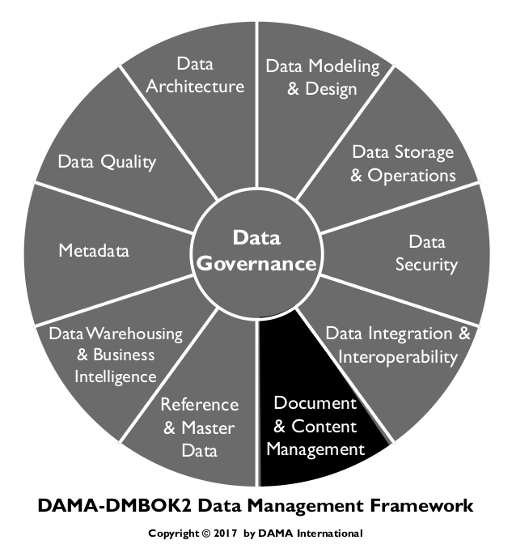
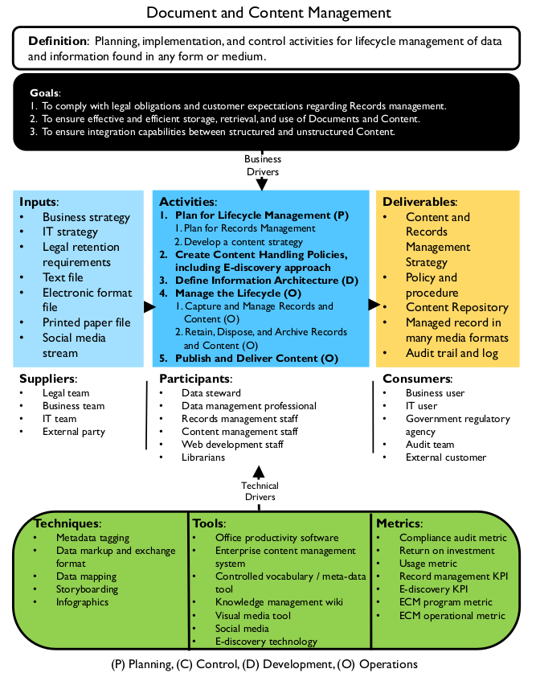
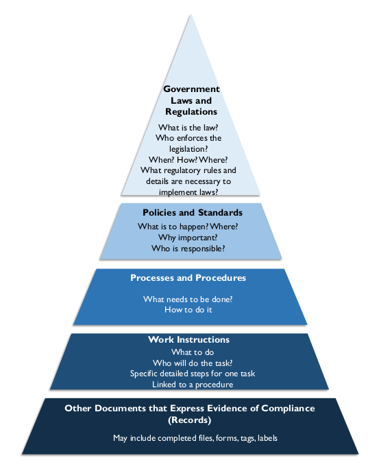

# Gerenciamento de documentos e conteúdo

A Gestão de Documentos e Conteúdo envolve o controle da captura, armazenamento, acesso e uso de dados e informações armazenados fora de bancos de dados relacionais. [^44] Seu foco é manter a integridade e permitir o acesso a documentos e outras informações não estruturadas ou semiestruturadas, o que a torna aproximadamente equivalente à gestão de operações de dados para bancos de dados relacionais. No entanto, também possui motivadores estratégicos. Em muitas organizações, dados não estruturados têm uma relação direta com dados estruturados. As decisões de gestão sobre esse conteúdo devem ser aplicadas de forma consistente. Além disso, assim como outros tipos de dados, espera-se que documentos e conteúdo não estruturado sejam seguros e de alta qualidade. Garantir a segurança e a qualidade requer governança, arquitetura confiável e metadados bem gerenciados.

Figura 71 Diagrama de Contexto: Documentos e Conteúdo

### 1.1 Motivadores de Negócios

Os principais motivadores de negócios para a gestão de documentos e conteúdo incluem a conformidade regulatória, a capacidade de responder a litígios e solicitações de descoberta eletrônica, e os requisitos de continuidade de negócios. Uma boa gestão de registros também pode ajudar as organizações a se tornarem mais eficientes. Sites bem organizados e pesquisáveis, resultantes da gestão eficaz de ontologias e outras estruturas que facilitam a pesquisa, ajudam a melhorar a satisfação de clientes e funcionários.

Leis e regulamentos exigem que as organizações mantenham registros de determinados tipos de atividades. A maioria das organizações também possui políticas, padrões e melhores práticas para manutenção de registros. Os registros incluem documentos em papel e informações armazenadas eletronicamente (ESI). Uma boa gestão de registros é necessária para a continuidade dos negócios. Ela também permite que uma organização responda em caso de litígio.

Descoberta eletrônica é o processo de encontrar registros eletrônicos que possam servir como evidência em uma ação judicial. À medida que a tecnologia para criar, armazenar e usar dados se desenvolveu, o volume de ESI aumentou exponencialmente. Alguns desses dados, sem dúvida, acabarão em litígios ou solicitações regulatórias.

A capacidade de uma organização de responder a uma solicitação de descoberta eletrônica depende de quão proativamente ela gerencia registros como e-mails, chats, sites e documentos eletrônicos, bem como dados brutos de aplicativos e metadados. O Big Data tornou-se um impulsionador para a descoberta eletrônica mais eficiente, retenção de registros e forte governança da informação.

O ganho de eficiência é um impulsionador para a melhoria da gestão de documentos. Os avanços tecnológicos na gestão de documentos estão ajudando as organizações a otimizar processos, gerenciar o fluxo de trabalho, eliminar tarefas manuais repetitivas e permitir a colaboração. Essas tecnologias têm o benefício adicional de permitir que as pessoas localizem, acessem e compartilhem documentos com mais rapidez. Elas também podem evitar a perda de documentos. Isso é muito importante para a descoberta eletrônica. Além disso, economiza-se dinheiro ao liberar espaço em arquivos e reduzir os custos de manuseio de documentos.

### 1.2 Objetivos e Princípios

Os objetivos da implementação das melhores práticas em Gestão de Documentos e Conteúdo incluem:

* Garantir a recuperação e o uso eficaz e eficiente de dados e informações em formatos não estruturados
* Garantir a capacidade de integração entre dados estruturados e não estruturados
* Cumprir as obrigações legais e as expectativas dos clientes

A Gestão de Documentos e Conteúdo segue os seguintes princípios orientadores:

* Todos em uma organização têm um papel a desempenhar na proteção do futuro da organização. Todos devem criar, usar, recuperar e descartar registros de acordo com as políticas e procedimentos estabelecidos.
* Especialistas no tratamento de registros e conteúdo devem estar totalmente envolvidos na política e no planejamento. As normas e as melhores práticas podem variar significativamente de acordo com o setor da indústria e a jurisdição legal.

Mesmo que profissionais de gestão de registros não estejam disponíveis para a organização, todos podem ser treinados para compreender os desafios, as melhores práticas e os problemas. Uma vez treinados, os administradores de negócios e outros podem colaborar em uma abordagem eficaz para a gestão de registros.

Em 2009, a ARMA International, uma associação profissional sem fins lucrativos para a gestão de registros e informações, publicou um conjunto de Princípios de Manutenção de Registros Geralmente Aceitáveis® (GARP) [^45] que descreve como os registros empresariais devem ser mantidos. Ele também fornece uma estrutura de manutenção de registros e governança da informação com métricas associadas. A primeira frase de cada princípio é apresentada abaixo. Mais explicações podem ser encontradas no site da ARMA.

* Princípio da Responsabilidade: Uma organização deve designar um executivo sênior para os indivíduos apropriados, adotar políticas e processos para orientar a equipe e garantir a auditabilidade do programa.
* Princípio da Integridade: Um programa de governança da informação deve ser elaborado de forma que os registros e informações gerados ou gerenciados pela ou para a organização tenham uma garantia razoável e adequada de autenticidade e confiabilidade.
* Princípio da Proteção: Um programa de governança da informação deve ser elaborado para garantir um nível razoável de proteção às informações pessoais ou que de outra forma requeiram proteção.
* Princípio da Conformidade: Um programa de governança da informação deve ser elaborado para estar em conformidade com as leis aplicáveis ​​e outras autoridades vinculativas, bem como com as políticas da organização.

* Princípio da Disponibilidade: Uma organização deve manter suas informações de forma a garantir sua recuperação tempestiva, eficiente e precisa.
* Princípio da Retenção: Uma organização deve reter suas informações por um período apropriado, levando em consideração todos os requisitos operacionais, legais, regulatórios e fiscais, bem como os de todas as autoridades vinculantes relevantes.
* Princípio da Disposição: Uma organização deve fornecer disposição segura e apropriada das informações, de acordo com suas políticas e leis, regulamentos e outras autoridades vinculantes aplicáveis.
* Princípio da Transparência: Uma organização deve documentar suas políticas, processos e atividades, incluindo seu programa de governança da informação, de forma que estejam disponíveis e sejam compreendidos por funcionários e partes interessadas apropriadas.

### 1.3 Conceitos Essenciais

#### 1.3.1 Conteúdo

Um documento é para o conteúdo o que um balde é para a água: um recipiente. Conteúdo se refere aos dados e informações contidos no arquivo, documento ou website. O conteúdo é frequentemente gerenciado com base nos conceitos representados pelos documentos, bem como no tipo ou status dos documentos. O conteúdo também tem um ciclo de vida. Em sua forma completa, parte do conteúdo se torna um registro para uma organização. Registros oficiais são tratados de forma diferente de outros conteúdos.

##### 1.3.1.1 Gestão de Conteúdo

A gestão de conteúdo inclui os processos, técnicas e tecnologias para organizar, categorizar e estruturar recursos de informação para que possam ser armazenados, publicados e reutilizados de diversas maneiras.

O ciclo de vida do conteúdo pode ser ativo, com alterações diárias por meio de processos controlados de criação e modificação; ou pode ser mais estático, com apenas pequenas alterações ocasionais. O conteúdo pode ser gerenciado formalmente (armazenado, gerenciado, auditado, retido ou descartado rigorosamente) ou informalmente por meio de atualizações ad hoc.

A gestão de conteúdo é particularmente importante em sites e portais, mas as técnicas de indexação com base em palavras-chave e organização com base em taxonomias podem ser aplicadas em todas as plataformas tecnológicas. Quando o escopo da gestão de conteúdo abrange toda a empresa, ela é chamada de Gestão de Conteúdo Empresarial (ECM).

##### 1.3.1.2 Metadados de Conteúdo

Metadados são essenciais para o gerenciamento de dados não estruturados, tanto o que tradicionalmente se considera conteúdo e documentos quanto o que hoje entendemos como "Big Data". Sem metadados, não é possível inventariar e organizar o conteúdo. Os metadados para conteúdo de dados não estruturados baseiam-se em:

* Formato: Frequentemente, o formato dos dados determina o método de acesso aos dados (como um índice eletrônico para dados não estruturados eletrônicos).
* Capacidade de busca: Se já existem ferramentas de busca para uso com dados não estruturados relacionados. Autodocumentação: Se os metadados são autodocumentados (como em sistemas de arquivos). Nesse caso, o desenvolvimento é mínimo, pois a ferramenta existente é simplesmente adotada.
* Padrões existentes: Se métodos e padrões existentes podem ser adotados ou adaptados (como em catálogos de bibliotecas).
* Assuntos de conteúdo: As coisas que as pessoas provavelmente estarão procurando.
* Requisitos: Necessidade de rigor e detalhes na recuperação (como na indústria farmacêutica ou nuclear [^46]). Portanto, Metadados detalhados no nível do conteúdo podem ser necessários, assim como uma ferramenta capaz de marcar o conteúdo.

Geralmente, a manutenção de Metadados para dados não estruturados se torna a manutenção de uma referência cruzada entre vários padrões locais e o conjunto oficial de Metadados corporativos. Gerentes de registros e profissionais de Metadados reconhecem que existem métodos incorporados de longo prazo em toda a organização para documentos, registros e outros conteúdos que devem ser retidos por muitos anos, mas que esses métodos costumam ser dispendiosos para reorganizar. Em algumas organizações, uma equipe centralizada mantém padrões de referência cruzada entre índices de gerenciamento de registros, taxonomias e até mesmo tesauros variantes.

##### 1.3.1.3 Modelagem de Conteúdo

Modelagem de conteúdo é o processo de conversão de conceitos lógicos de conteúdo em tipos de conteúdo, atributos e tipos de dados com relacionamentos. Um atributo descreve algo específico e distinguível sobre o conteúdo ao qual se relaciona. Um tipo de dado restringe o tipo de dados que o atributo pode conter, permitindo a validação e o processamento.

Técnicas de gerenciamento de metadados e modelagem de dados são utilizadas no desenvolvimento de um modelo de conteúdo. Existem dois níveis de modelagem de conteúdo. O primeiro é no nível do produto de informação, que cria uma entrega real, como um website. O segundo é no nível do componente, que detalha ainda mais os elementos que compõem o modelo do produto de informação. O nível de detalhe do modelo depende da granularidade desejada para reutilização e estrutura.

Os modelos de conteúdo apoiam a estratégia de conteúdo, orientando a criação de conteúdo e promovendo a reutilização. Eles apoiam o conteúdo adaptável, que é independente de formato e dispositivo. Os modelos tornam-se as especificações para o conteúdo implementado em estruturas como definição de esquema XML (XSDs), formulários ou folhas de estilo.

##### 1.3.1.4 Métodos de Entrega de Conteúdo

O conteúdo precisa ser modular, estruturado, reutilizável e independente de dispositivo e plataforma. Os métodos de entrega incluem páginas da web, aplicativos impressos e móveis, bem como e-books com vídeo e áudio interativos. A conversão de conteúdo em XML no início do fluxo de trabalho permite a reutilização em diferentes canais de mídia.

Os sistemas de entrega de conteúdo são "push", "pull" ou interativos.

* Push: Em um sistema de entrega push, os usuários escolhem o tipo de conteúdo a ser entregue a eles em um cronograma pré-determinado. A sindicação envolve a criação do conteúdo por uma única parte, publicada em diversos locais. A sindicação realmente simples (RSS) é um exemplo de mecanismo de entrega push. Ela distribui conteúdo (ou seja, um feed) para sindicar notícias e outros conteúdos da web mediante solicitação.
* Pull: Em um sistema de entrega pull, os usuários extraem o conteúdo pela internet. Um exemplo de sistema pull é quando os compradores visitam lojas de varejo online.
* Interativo: Métodos interativos de entrega de conteúdo, como aplicativos de ponto de venda eletrônico (EPOS) de terceiros ou sites voltados para o cliente (por exemplo, para cadastro), precisam trocar altos volumes de dados em tempo real entre aplicativos corporativos. As opções para compartilhamento de dados entre aplicativos incluem Integração de Aplicativos Corporativos (EAI), Captura de Dados Alterados, Integração de Dados e EII. (Consulte o Capítulo 8.)

#### 1.3.2 Vocabulários Controlados

Um vocabulário controlado é uma lista definida de termos explicitamente permitidos, usados ​​para indexar, categorizar, marcar, classificar e recuperar conteúdo por meio de navegação e busca. Um vocabulário controlado é necessário para organizar sistematicamente documentos, registros e conteúdo. Os vocabulários variam em complexidade, desde listas simples ou listas de seleção, passando por anéis de sinônimos ou listas de autoridade, taxonomias e, os mais complexos, tesauros e ontologias. Um exemplo de vocabulário controlado é o Dublin Core, usado para catalogar publicações.

Políticas definidas controlam quem adiciona termos ao vocabulário (por exemplo, um taxonomista, indexador ou bibliotecário). Bibliotecários são particularmente treinados na teoria e no desenvolvimento de vocabulários controlados. Os usuários da lista podem aplicar apenas termos da lista para sua área temática de escopo. (Consulte o Capítulo 10.)

Idealmente, os vocabulários controlados devem estar alinhados com os nomes e definições das entidades em um modelo conceitual de dados corporativo. Uma abordagem de baixo para cima para coletar termos e conceitos é compilá-los em uma folksonomia, que é uma coleção de termos e conceitos obtidos por meio de marcação social.

Vocabulários controlados constituem um tipo de Dado de Referência. Assim como outros Dados de Referência, seus valores e definições precisam ser gerenciados para garantir sua integralidade e atualidade. Eles também podem ser considerados Metadados, pois ajudam a explicar e apoiar o uso de outros dados. Eles são descritos neste capítulo porque o Gerenciamento de Documentos e Conteúdo são os principais casos de uso para vocabulários controlados.

##### 1.3.2.1 Gerenciamento de Vocabulário

Como os vocabulários evoluem com o tempo, eles exigem gerenciamento. ANSI/NISO Z39.19-2005 é uma norma americana que fornece diretrizes para a Construção, Formatação e Gerenciamento de Vocabulários Controlados Monolíngues e descreve o gerenciamento de vocabulário como uma forma de "melhorar a eficácia dos sistemas de armazenamento e recuperação de informações, sistemas de navegação na web e outros ambientes que buscam identificar e localizar o conteúdo desejado por meio de algum tipo de descrição usando a linguagem. O objetivo principal do controle de vocabulário é alcançar consistência na descrição dos objetos de conteúdo e facilitar a recuperação". [^47]

O gerenciamento de vocabulário é a função de definir, obter, importar e manter qualquer vocabulário. As perguntas-chave para permitir o gerenciamento de vocabulário concentram-se em usos, consumidores, padrões e manutenção:

* Quais conceitos de informação este vocabulário suportará?
* Qual é o público-alvo deste vocabulário? Quais processos eles suportam? Quais papéis eles desempenham?
* Por que o vocabulário é necessário? Ele suportará um aplicativo, gerenciamento de conteúdo ou análise?
* Qual órgão decisório é responsável por designar os termos preferenciais?

* Quais vocabulários existentes os diferentes grupos utilizam para classificar essas informações? Onde estão localizados? Como foram criados? Quem são os especialistas no assunto? Há alguma preocupação com segurança ou privacidade para algum deles?
* Existe um padrão existente que possa atender a essa necessidade? Há preocupações em usar um padrão externo em vez de um interno? Com ​​que frequência o padrão é atualizado e qual o grau de alteração de cada atualização? Os padrões são acessíveis em um formato fácil de importar/manter, de forma econômica?

Os resultados desta avaliação permitirão a integração dos dados. Eles também ajudarão a estabelecer padrões internos, incluindo o vocabulário preferencial associado por meio de funções de gerenciamento de termos e relacionamentos entre termos.

Se esse tipo de avaliação não for realizado, os vocabulários preferenciais ainda serão definidos em uma organização, exceto que serão feitos em silos, projeto por projeto, o que levará a um custo de integração mais alto e maiores chances de problemas de qualidade dos dados. (Consulte o Capítulo 13.)

##### 1.3.2.2 Visualizações de Vocabulário e Vocabulário Microcontrolado

Uma visualização de vocabulário é um subconjunto de um vocabulário controlado, abrangendo uma gama limitada de tópicos dentro do domínio do vocabulário controlado. Visualizações de vocabulário são necessárias quando o objetivo é usar um vocabulário padrão contendo um grande número de termos, mas nem todos os termos são relevantes para alguns consumidores da informação. Por exemplo, uma visualização que contém apenas termos relevantes para uma Unidade de Negócios de Marketing não conteria termos relevantes apenas para Finanças.

Visualizações de vocabulário aumentam a usabilidade da informação, limitando o conteúdo ao que é apropriado para os usuários. Construa uma visualização de vocabulário de termos de vocabulário preferenciais manualmente ou por meio de regras de negócios que atuem sobre dados de termos de vocabulário preferenciais ou Metadados. Defina regras para quais termos são incluídos em cada visualização de vocabulário.

Um vocabulário microcontrolado é uma visualização de vocabulário que contém termos altamente especializados não presentes no vocabulário geral. Um exemplo de vocabulário microcontrolado é um dicionário médico com subconjuntos para disciplinas médicas. Tais termos devem ser mapeados para a estrutura hierárquica do vocabulário controlado amplo. Um vocabulário microcontrolado é internamente consistente em relação às relações entre os termos.

Vocabulários microcontrolados são necessários quando o objetivo é aproveitar um vocabulário padrão, mas o conteúdo não é suficiente e há a necessidade de gerenciar adições/extensões para um grupo específico de consumidores de informação. A construção de um vocabulário microcontrolado começa com as mesmas etapas de uma visualização de vocabulário, mas também inclui a adição ou associação de termos preferenciais adicionais que são diferenciados dos termos preferenciais preexistentes pela indicação de uma fonte diferente.

##### 1.3.2.3 Listas de Termos e Seleção

Listas de termos são apenas isso: listas. Elas não descrevem as relações entre os termos. Listas de seleção, listas suspensas da web e listas de opções de menu em sistemas de informação usam listas de termos. Elas fornecem pouca ou nenhuma orientação ao usuário, mas ajudam a controlar a ambiguidade, reduzindo o domínio de valores.

As listas de seleção costumam estar ocultas em aplicativos. Softwares de gerenciamento de conteúdo podem ajudar a transformar listas de seleção e vocabulários controlados em listas de seleção pesquisáveis ​​na página inicial. Essas listas de seleção são gerenciadas como taxonomias facetadas dentro do software.

##### 1.3.2.4 Gerenciamento de Termos

A norma ANSI/NISO Z39.19-2005 define um termo como “Uma ou mais palavras que designam um conceito”. [^48] Assim como os vocabulários, termos individuais também requerem gerenciamento. O Gerenciamento de Termos inclui a especificação de como os termos são inicialmente definidos e classificados e como essa informação é mantida após começar a ser usada em diferentes sistemas. Os termos devem ser gerenciados por meio de processos de governança. Os administradores podem precisar arbitrar para garantir que o feedback das partes interessadas seja considerado antes que os termos sejam alterados. A Z39.19 define um termo preferencial como um de dois ou mais sinônimos ou variantes lexicais selecionados como um termo para inclusão em um vocabulário controlado.

O gerenciamento de termos inclui o estabelecimento de relacionamentos entre termos dentro de um vocabulário controlado. Existem três tipos de relacionamentos:

* Relacionamento de termo equivalente: Um relacionamento entre termos em um vocabulário controlado que leva a um ou mais termos a serem usados ​​em vez do termo do qual a referência cruzada é feita. Este é o mapeamento de termos mais comumente usado em funções de TI, indicando que um termo ou valor de um sistema ou vocabulário é o mesmo que o de outro, permitindo que tecnologias de integração realizem seu mapeamento e padronização.
* Relacionamento hierárquico: Um relacionamento entre termos em um vocabulário controlado que descreve relacionamentos mais amplos (gerais) a mais restritos (específicos) ou do todo-parte.
* Relacionamento de termos relacionados: Um termo que está associado, mas não hierarquicamente, a outro termo em um vocabulário controlado.

##### 1.3.2.5 Anéis de Sinônimos e Listas de Autoridade

Um anel de sinônimos é um conjunto de termos com significado aproximadamente equivalente. Um anel de sinônimos permite que usuários que pesquisam um dos termos acessem conteúdo relacionado a qualquer um deles. O desenvolvimento manual de anéis de sinônimos é para recuperação, não para indexação. Eles oferecem controle de sinônimos e tratam sinônimos e termos quase sinônimos igualmente. O uso ocorre quando o ambiente de indexação possui um vocabulário não controlado ou onde não há indexação. Mecanismos de busca e diferentes registros de metadados possuem anéis de sinônimos (consulte o Capítulo 13). Eles podem ser difíceis de implementar em interfaces de usuário.

Uma lista de autoridades é um vocabulário controlado de termos descritivos, projetado para facilitar a recuperação de informações dentro de um domínio ou escopo específico. O tratamento dos termos não é igual ao de um anel de sinônimos; em vez disso, um termo é preferido e os outros são variantes. Um arquivo de autoridades faz referências cruzadas de sinônimos e variantes para cada termo para guiar o usuário de um termo não preferido para um preferido. A lista pode ou não conter definições desses termos. As listas de autoridades devem ter gerentes designados. Elas podem ter estrutura. Um exemplo são os Cabeçalhos de Assunto da Biblioteca do Congresso dos EUA. (Consulte a Seção 1.3.2.1.)

##### 1.3.2.6 Taxonomias

Taxonomia é um termo abrangente que se refere a qualquer classificação ou vocabulário controlado. O exemplo mais conhecido de taxonomia é o sistema de classificação para todos os seres vivos desenvolvido pelo biólogo sueco Lineu.

Na gestão de conteúdo, uma taxonomia é uma estrutura de nomenclatura que contém um vocabulário controlado usado para delinear tópicos e habilitar sistemas de navegação e busca. As taxonomias ajudam a reduzir a ambiguidade e controlar sinônimos. Uma taxonomia hierárquica pode conter diferentes tipos de relacionamentos pai/filho, úteis tanto para indexadores quanto para buscadores. Essas taxonomias são usadas para criar interfaces do tipo drill-down.

As taxonomias podem ter diferentes estruturas:

* Uma taxonomia plana não possui relacionamentos entre o conjunto de categorias controladas. Todas as categorias são iguais. Isso é semelhante a uma lista; por exemplo, uma lista de países.
* Uma taxonomia hierárquica é uma estrutura em árvore onde os nós são relacionados por uma regra. Uma hierarquia tem pelo menos dois níveis e é bidirecional. Subir na hierarquia expande a categoria; descer a refina. Um exemplo é a geografia, do continente até o endereço da rua.
* Uma poli-hierarquia é uma estrutura em forma de árvore com mais de uma regra de relação de nós. Os nós filhos podem ter vários pais. Esses pais também podem compartilhar avós. Como tal, os caminhos de travessia podem ser complicados e deve-se tomar cuidado para evitar potenciais travessias inválidas: suba na árvore a partir de um nó que se relaciona com o pai, mas não com um dos avós. Estruturas poli-hierárquicas complicadas podem ser melhor atendidas com uma taxonomia de facetas.
* Uma taxonomia de facetas se parece com uma estrela, onde cada nó está associado ao nó central. Facetas são atributos do objeto no centro. Um exemplo são os Metadados, onde cada atributo (criador, título, direitos de acesso, palavras-chave, versão, etc.) é uma faceta de um objeto de conteúdo.

* Uma taxonomia de rede utiliza estruturas hierárquicas e facetadas. Quaisquer dois nós em uma taxonomia de rede estabelecem ligações com base em suas associações. Um exemplo é um mecanismo de recomendação (…se você gostou disso, também pode gostar disto…). Outro exemplo é um dicionário de sinônimos.

Com a quantidade de dados gerados, mesmo as taxonomias mais bem definidas exigem regras automatizadas de sinalização, correção e roteamento. Se as taxonomias não forem mantidas, serão subutilizadas ou produzirão resultados incorretos. Isso cria o risco de que entidades e funcionários regidos pelas regulamentações aplicáveis ​​estejam fora de conformidade. Por exemplo, em uma taxonomia financeira, o termo preferencial pode ser "Pós-Emprego". O conteúdo pode vir de sistemas que o classificam como "Pós-Emprego", "Pós-Emprego" ou mesmo "Pós-Aposentadoria". Para fundamentar esses casos, deve-se definir o anel de sinônimos apropriado e as relações de termos relacionados (US GAAP, 2008).

As organizações desenvolvem suas próprias taxonomias para formalizar o pensamento coletivo sobre tópicos específicos de seu trabalho. As taxonomias são particularmente importantes para apresentar e encontrar informações em sites, já que muitos mecanismos de busca dependem de correspondências exatas de palavras e só conseguem encontrar itens marcados ou usando as mesmas palavras da mesma maneira.

##### 1.3.2.7 Esquemas de Classificação e Marcação

Esquemas de classificação são códigos que representam vocabulário controlado. Esses esquemas são frequentemente hierárquicos e podem ter palavras associadas a eles, como o Sistema Decimal de Dewey e a Classificação da Biblioteca do Congresso dos EUA (classes e subclasses principais). Uma taxonomia baseada em números, o Sistema Decimal de Dewey também é uma expressão multilíngue para codificação de assuntos, uma vez que os números podem ser "decodificados" para qualquer idioma.

Folksonomias são esquemas de classificação para termos e nomes de conteúdo online obtidos por meio de marcação social. Usuários individuais e grupos as utilizam para anotar e categorizar conteúdo digital. Normalmente, elas não possuem estruturas hierárquicas ou termos preferenciais. As folksonomias geralmente não são consideradas autoritativas ou aplicadas à indexação de documentos, pois não são compiladas por especialistas. No entanto, como refletem diretamente o vocabulário dos usuários, oferecem o potencial de aprimorar a recuperação de informações. Termos de folksonomia podem ser vinculados a vocabulários controlados estruturados.

##### 1.3.2.8 Tesauros

Um tesauro é um tipo de vocabulário controlado usado para recuperação de conteúdo. Ele combina características de listas de sinônimos e taxonomias. Um tesauro fornece informações sobre cada termo e sua relação com outros termos. As relações são hierárquicas (pai/filho ou amplo/mais restrito), associativas (‘ver também’) ou equivalentes (sinônimo ou usado/usado de). Os sinônimos devem ser aceitavelmente equivalentes em todos os cenários de contexto. Um tesauro também pode incluir definições, citações, etc.

Os tesauros podem ser usados ​​para organizar conteúdo não estruturado, descobrir relações entre conteúdo de diferentes mídias, melhorar a navegação em sites e otimizar a busca. Quando um usuário insere um termo, um sistema pode usar um tesauro não exposto (um que não está diretamente disponível para o usuário) para direcionar automaticamente a busca para um termo semelhante. Alternativamente, o sistema pode sugerir termos relacionados com os quais o usuário pode continuar a busca.

As normas que fornecem orientação sobre a criação de tesauros incluem ISO 25964 e ANSI/NISO Z39.19. 10.2.2.1.5 Ontologias.

##### 1.3.2.9 Ontologia

Uma ontologia é um tipo de taxonomia que representa um conjunto de conceitos e seus relacionamentos dentro de um domínio. Ontologias fornecem a principal representação do conhecimento na Web Semântica e são usadas na troca de informações entre aplicações da Web Semântica. [^49]

Linguagens de ontologia, como o Resource Description Framework Schema (RDFS), são usadas para desenvolver ontologias, codificando o conhecimento sobre domínios específicos. Elas podem incluir regras de raciocínio para dar suporte ao processamento desse conhecimento. OWL (Web Ontology Language), uma extensão do RDFS, é uma sintaxe formal para definir ontologias.

Ontologias descrevem classes (conceitos), indivíduos (instâncias), atributos, relações e eventos. Uma ontologia pode ser uma coleção de taxonomias e tesauros de vocabulário comum para representação de conhecimento e troca de informações. Ontologias frequentemente se relacionam a uma hierarquia taxonômica de classes e definições com a relação de subsunção, como a decomposição do comportamento inteligente em vários módulos de comportamento mais simples e, em seguida, em camadas.

Existem duas diferenças principais entre uma taxonomia (como um modelo de dados) e uma ontologia:

* Uma taxonomia fornece classificações de conteúdo de dados para uma determinada área conceitual. Um modelo de dados identifica especificamente a entidade à qual um atributo pertence e o valor válido para esse atributo. Em uma ontologia, porém, os conceitos de entidade, atributo e conteúdo podem ser completamente misturados. As diferenças são identificadas por meio de metadados ou outros relacionamentos.
* Em uma taxonomia ou modelo de dados, o que é definido é o que é conhecido – e nada mais. Isso é chamado de suposição de mundo fechado. Em uma ontologia, relacionamentos possíveis são inferidos com base na natureza dos relacionamentos existentes, portanto, algo que não é explicitamente declarado pode ser verdadeiro. Isso é chamado de suposição de mundo aberto.

Embora a gestão de taxonomia tenha evoluído sob a responsabilidade das Ciências Bibliotecárias, hoje a arte e a ciência da gestão de taxonomia e ontologia se enquadram no âmbito da gestão semântica. (Ver Capítulo 10.)

Como o processo de modelagem de ontologias é um tanto subjetivo, é importante evitar armadilhas comuns que causam ambiguidade e confusão:

* Falha em distinguir entre um relacionamento de instância de e um relacionamento de subclasse de
* Modelagem de eventos como relações
* Falta de clareza e unicidade de termos
* Modelagem de papéis como classes
* Falha em reutilização
* Mistura de semântica de linguagem e conceitos de modelagem
* O uso de uma ferramenta web independente de plataforma (por exemplo, OOPS!) para validação de ontologias auxilia no diagnóstico e na correção de armadilhas

#### 1.3.3 Documentos e Registros

Documentos são objetos eletrônicos ou em papel que contêm instruções para tarefas, requisitos de como e quando executar uma tarefa ou função, e registros da execução e das decisões de tarefas. Documentos podem comunicar e compartilhar informações e conhecimento. Exemplos de documentos incluem procedimentos, protocolos, métodos e especificações.

Apenas um subconjunto de documentos será designado como registros. Registros fornecem evidências de que ações foram tomadas e decisões foram tomadas em conformidade com os procedimentos; eles podem servir como evidência das atividades comerciais da organização e da conformidade regulatória. As pessoas geralmente criam registros, mas instrumentos e equipamentos de monitoramento também podem fornecer dados para gerá-los automaticamente.

##### 1.3.3.1 Gestão de Documentos

A gestão de documentos abrange os processos, técnicas e tecnologias para controlar e organizar documentos e registros ao longo de seu ciclo de vida. Inclui armazenamento, inventário e controle, tanto para documentos eletrônicos quanto em papel. Mais de 90% dos documentos criados hoje são eletrônicos. Embora documentos sem papel estejam se tornando mais amplamente utilizados, o mundo ainda está repleto de documentos históricos em papel.

Em geral, a gestão de documentos se concentra em arquivos, com pouca atenção ao seu conteúdo. O conteúdo informativo de um arquivo pode orientar como gerenciá-lo, mas a gestão de documentos trata o arquivo como uma entidade única.

Tanto as pressões do mercado quanto as regulatórias se concentram nos cronogramas de retenção de registros, localização, transporte e destruição. Por exemplo, alguns dados sobre indivíduos não podem cruzar fronteiras internacionais.

Regulamentações e estatutos, como a Lei Sarbanes-Oxley dos EUA e as Emendas de Descoberta Eletrônica às Regras Federais de Processo Civil, e o Projeto de Lei 198 do Canadá, são agora preocupações dos responsáveis ​​pela conformidade corporativa que pressionam pela padronização das práticas de gestão de registros em suas organizações. Gerenciar o ciclo de vida de documentos e registros inclui:

* Inventário: Identificação de documentos/registros existentes e recém-criados.
* Política: Criação, aprovação e aplicação de políticas de documentos/registros, incluindo uma política de retenção de documentos/registros.
* Classificação de documentos/registros.
* Armazenamento: Armazenamento de curto e longo prazo de documentos/registros físicos e eletrônicos.

* Recuperação e Circulação: Permitir o acesso e a circulação de documentos/registros de acordo com as políticas, padrões de segurança e controle e requisitos legais.
* Preservação e Descarte: Arquivar e destruir documentos/registros de acordo com as necessidades, estatutos e regulamentos organizacionais.

Profissionais de gestão de dados são partes interessadas nas decisões sobre classificação e retenção de documentos. Eles devem manter a consistência entre os dados estruturados básicos e dados não estruturados específicos. Por exemplo, se os relatórios de saída finalizados forem considerados documentação histórica apropriada, os dados estruturados em um ambiente OLTP ou de armazenamento podem ser dispensados ​​do armazenamento dos dados básicos do relatório.

Os documentos são frequentemente desenvolvidos dentro de uma hierarquia, com alguns documentos mais detalhados do que outros. A Figura 72, baseada no texto da Introdução e Pacote de Suporte da ISO 9000: Orientações sobre os Requisitos de Documentação da ISO 9001, Cláusula 4.2, descreve um paradigma centrado na documentação, apropriado para o governo ou para o setor militar. A ISO 9001 descreve os componentes mínimos de um sistema básico de gestão da qualidade. Entidades comerciais podem ter diferentes hierarquias ou fluxos de documentos para dar suporte às práticas comerciais.

##### 1.3.3.2 Gestão de Registros

A gestão de documentos inclui a gestão de registros. A gestão de registros possui requisitos especiais. [^50] A gestão de registros abrange todo o ciclo de vida: desde a criação ou recebimento do registro, passando pelo processamento, distribuição, organização e recuperação, até a disposição. Os registros podem ser físicos (por exemplo, documentos, memorandos, contratos, relatórios ou microfichas); eletrônicos (por exemplo, conteúdo de e-mail, anexos e mensagens instantâneas); conteúdo em um website; documentos em todos os tipos de mídia e hardware; e dados capturados em bancos de dados de todos os tipos. Registros híbridos, como cartões de abertura (registro em papel com uma janela de microficha incorporada com detalhes ou material de apoio), combinam formatos. Um Registro Vital é um tipo de registro necessário para retomar as operações de uma organização em caso de desastre.

Figura 72 Hierarquia de Documentos baseada na ISO 9001-4.2

Registros confiáveis ​​são importantes não apenas para a manutenção de registros, mas também para a conformidade regulatória. Ter assinaturas no registro contribui para a integridade do mesmo. Outras ações de integridade incluem a verificação do evento (ou seja, testemunhar em tempo real) e a dupla verificação das informações após o evento.

Registros bem elaborados apresentam características como:

* Conteúdo: O conteúdo deve ser preciso, completo e verdadeiro.
* Contexto: Informações descritivas (metadados) sobre o criador do registro, a data de criação ou o relacionamento com outros registros devem ser coletadas, estruturadas e mantidas com o registro no momento da criação.
* Pontualidade: Um registro deve ser criado imediatamente após a ocorrência do evento, ação ou decisão.

* Permanência: Uma vez designados como registros, os registros não podem ser alterados durante o período legal de sua existência.
* Estrutura: A aparência e a organização do conteúdo de um registro devem ser claras. Eles devem ser registrados nos formulários ou modelos corretos. O conteúdo deve ser legível e a terminologia deve ser usada de forma consistente.

Muitos registros existem em formato eletrônico e em papel. A Gestão de Registros exige que a organização saiba qual cópia (eletrônica ou em papel) é a "cópia oficial do registro" para cumprir as obrigações de manutenção de registros. Uma vez determinada a cópia do registro, a outra cópia pode ser destruída com segurança.

##### 1.3.3.3 Gestão de Ativos Digitais

A Gestão de Ativos Digitais (GAD) é um processo semelhante à gestão de documentos que se concentra no armazenamento, rastreamento e uso de documentos de mídia avançada, como vídeos, logotipos, fotografias, etc.

#### 1.3.4 Mapa de Dados

Um Mapa de Dados é um inventário de todas as fontes de dados, aplicativos e ambientes de TI do ESI, incluindo os proprietários dos aplicativos, custodiantes, localizações geográficas relevantes e tipos de dados.

#### 1.3.5 Descoberta eletrônica

Descoberta é um termo jurídico que se refere à fase pré-julgamento de um processo judicial, na qual ambas as partes solicitam informações uma à outra para encontrar fatos para o caso e verificar a solidez dos argumentos de cada lado. As Regras Federais de Processo Civil (FRCP) dos EUA regem a descoberta de provas em processos judiciais e outros casos civis desde 1938. Durante décadas, as regras de descoberta em papel foram aplicadas à descoberta eletrônica. Em 2006, emendas às FRCP acomodaram a prática de descoberta e os requisitos da ESI no processo litigioso.

Outras regulamentações globais têm requisitos específicos para a capacidade de uma organização produzir provas eletrônicas. Exemplos incluem a Lei Antissuborno do Reino Unido, a Lei Dodd-Frank, a Lei de Conformidade Tributária de Contas no Exterior (FATCA), a Lei de Práticas de Corrupção no Exterior, os Regulamentos e Regras de Proteção de Dados da UE, regulamentações antitruste globais, regulamentações setoriais específicas e regras processuais judiciais locais.

Documentos eletrônicos geralmente contêm metadados (que podem não estar disponíveis para documentos em papel) que desempenham um papel importante na produção de provas. Os requisitos legais advêm dos principais processos legais, como a descoberta eletrônica, bem como das práticas de retenção de dados e registros, do processo de notificação de retenção legal (LHN) e de práticas de disposição legalmente defensáveis. A LHN inclui a identificação de informações que podem ser solicitadas em um processo judicial, o bloqueio desses dados ou documentos para impedir sua edição ou exclusão e, em seguida, a notificação a todas as partes da organização de que os dados ou documentos em questão estão sujeitos à retenção legal.

A Figura 73 descreve um Modelo de Referência de Descoberta Eletrônica de alto nível desenvolvido pela EDRM, uma organização de padrões e diretrizes para descoberta eletrônica. Essa estrutura fornece uma abordagem para descoberta eletrônica útil para pessoas envolvidas na identificação de como e onde os dados internos relevantes são armazenados, quais políticas de retenção se aplicam, quais dados não estão acessíveis e quais ferramentas estão disponíveis para auxiliar no processo de identificação.

Figura 73 Modelo de Referência de Descoberta Eletrônica [^51]

O modelo EDRM pressupõe a existência de governança de dados ou informações. O modelo inclui oito fases de descoberta eletrônica que podem ser iterativas. À medida que a descoberta eletrônica avança, o volume de dados e informações detectáveis ​​é bastante reduzido, à medida que sua relevância aumenta significativamente.

A primeira fase, Identificação, possui duas subfases: Avaliação Inicial do Caso e Avaliação Inicial dos Dados (não representada no diagrama). Na Avaliação Inicial do Caso, o próprio caso jurídico é avaliado em busca de informações pertinentes, chamadas de informações descritivas ou Metadados (por exemplo, palavras-chave, intervalos de datas, etc.). Na Avaliação Inicial dos Dados, são avaliados os tipos e a localização dos dados relevantes para o caso. A avaliação de dados deve identificar políticas relacionadas à retenção ou destruição de dados relevantes para que o ESI possa ser preservado. Entrevistas devem ser realizadas com o pessoal de gestão de registros, custodiantes ou proprietários de dados e pessoal de tecnologia da informação para obter informações pertinentes. Além disso, os profissionais envolvidos precisam entender o histórico do caso, a guarda legal e seu papel no litígio.

As próximas fases do modelo são a Preservação e a Coleta. A preservação garante que os dados identificados como potencialmente relevantes sejam colocados em guarda legal para que não sejam destruídos. A coleta inclui a aquisição e a transferência dos dados identificados da empresa para seus assessores jurídicos de forma legalmente defensável.

Durante a fase de Processamento, os dados são desduplicados, pesquisados ​​e analisados ​​para determinar quais itens de dados passarão para a fase de Revisão. Na fase de Revisão, os documentos são identificados para serem apresentados em resposta à solicitação. A Revisão também identifica documentos privilegiados que serão retidos. Grande parte da seleção depende dos Metadados associados aos documentos. O Processamento ocorre após a fase de Revisão porque aborda a análise de conteúdo para entender as circunstâncias, os fatos e as possíveis evidências em litígios ou investigações e para aprimorar os processos de pesquisa e revisão.

O Processamento e a Revisão dependem da análise, mas a Análise é considerada uma fase separada com foco no conteúdo. O objetivo da análise de conteúdo é compreender as circunstâncias, os fatos e as potenciais evidências em litígios ou investigações, a fim de formular uma estratégia em resposta à situação jurídica.

Na fase de Produção, os dados e as informações são entregues ao advogado da parte contrária, com base nas especificações acordadas. As fontes originais de informação podem ser arquivos, planilhas, e-mails, bancos de dados, desenhos, fotografias, dados de aplicativos proprietários, dados de sites, correio de voz e muito mais. O ESI pode ser coletado, processado e gerado em diversos formatos. A produção nativa mantém o formato original dos arquivos. A produção quase nativa altera o formato original por meio de extração e conversão. O ESI pode ser produzido em formato de imagem ou quase papel. Dados de campo são metadados e outras informações extraídas de arquivos nativos quando o ESI é processado e produzido em um arquivo delimitado por texto ou em um arquivo XML de carregamento. A origem dos materiais fornecidos durante a fase de Produção é importante, pois ninguém quer ser acusado de alterar dados ou informações fornecidas.

A exibição do ESI em depoimentos, audiências e julgamentos faz parte da fase de Apresentação. As exposições ESI podem ser apresentadas em formato papel, quase papel, quase nativo e nativo para apoiar ou refutar elementos do caso. Elas podem ser usadas para obter mais informações, validar fatos ou posições existentes ou persuadir o público.

#### 1.3.6 Arquitetura da Informação

Arquitetura da Informação é o processo de criação de estrutura para um conjunto de informações ou conteúdo. Ela inclui os seguintes componentes:

* Vocabulários controlados
* Taxonomias e ontologias
* Mapas de navegação
* Mapas de metadados
* Especificações da funcionalidade de pesquisa
* Casos de uso
* Fluxos de usuários

A arquitetura da informação e a estratégia de conteúdo, juntas, descrevem o "o quê" – qual conteúdo será gerenciado em um sistema. As fases de design descrevem "como" a estratégia de gerenciamento de conteúdo será implementada.

Para um sistema de gerenciamento de documentos ou conteúdo, a arquitetura da informação identifica os vínculos e relacionamentos entre documentos e conteúdo, especifica os requisitos e atributos do documento e define a estrutura do conteúdo em um sistema de gerenciamento de documentos ou conteúdo. A arquitetura da informação é fundamental para o desenvolvimento de websites eficazes. Um storyboard fornece um modelo para um projeto web. Ele serve como um esboço da abordagem de design, define os elementos que devem estar presentes em cada página da web e mostra a navegação e o fluxo de informações de como as páginas devem funcionar em conjunto. Isso permite o desenvolvimento de modelos de navegação, menus e outros componentes necessários para o gerenciamento e o uso do site.

#### 1.3.7 Mecanismo de Busca

Um mecanismo de busca é um software que busca informações com base em termos e recupera sites que contêm esses termos em seu conteúdo. Um exemplo é o Google. A funcionalidade de busca requer vários componentes: o software do mecanismo de busca propriamente dito, um software de rastreamento que percorre a web e armazena os Localizadores Uniformes de Recursos (URLs) do conteúdo encontrado, a indexação das palavras-chave e do texto encontrados e regras de classificação.

#### 1.3.8 Modelo Semântico

A modelagem semântica é um tipo de modelagem do conhecimento que descreve uma rede de conceitos (ideias ou tópicos de interesse) e seus relacionamentos. Incorporados aos sistemas de informação, os modelos semânticos permitem que os usuários façam perguntas sobre as informações de forma não técnica. Por exemplo, um modelo semântico pode mapear tabelas e visualizações de banco de dados para conceitos que sejam significativos para usuários corporativos.

Modelos semânticos contêm objetos e ligações semânticas. Objetos semânticos são coisas representadas no modelo. Eles podem ter atributos com cardinalidade, domínios e identificadores. Suas estruturas podem ser simples, compostas, híbridas, de associação, pai/subtipo ou arquétipo/versão. Ligações representam associações ou classes de associação em UML. Esses modelos ajudam a identificar padrões e tendências e a descobrir relacionamentos entre informações que, de outra forma, poderiam parecer díspares. Ao fazer isso, eles ajudam a permitir a integração de dados em diferentes domínios de conhecimento ou áreas temáticas. Ontologias e vocabulários controlados são essenciais para a modelagem semântica.

A integração de dados utiliza ontologias de diversas maneiras. Uma única ontologia pode ser o modelo de referência. Se houver múltiplas fontes de dados, cada fonte de dados individual é modelada usando uma ontologia e posteriormente mapeada para as outras ontologias. A abordagem híbrida utiliza múltiplas ontologias que se integram a um vocabulário geral comum.

#### 1.3.9 Busca Semântica

A busca semântica se concentra no significado e no contexto, em vez de palavras-chave predeterminadas. Um mecanismo de busca semântica pode usar inteligência artificial para identificar correspondências de consulta com base em palavras e seu contexto. Esse mecanismo de busca pode analisar por localização, intenção, variações de palavras, sinônimos e correspondência de conceitos.

Os requisitos para a busca semântica envolvem descobrir o que os usuários desejam, o que significa pensar como eles. Se os usuários desejam que os mecanismos de busca funcionem como uma linguagem natural, provavelmente desejarão que o conteúdo da web se comporte dessa maneira. O desafio para as organizações de marketing é incorporar associações e palavras-chave relevantes para seus usuários e também para suas marcas.

O conteúdo da web otimizado para semântica incorpora palavras-chave naturais, em vez de depender da inserção rígida de palavras-chave. Os tipos de palavras-chave semânticas incluem: palavras-chave principais que contêm variações; palavras-chave temáticas para termos conceitualmente relacionados; e palavras-chave-tronco que antecipam o que as pessoas podem perguntar. O conteúdo pode ser ainda mais otimizado por meio da relevância do conteúdo e do "compartilhamento", além do compartilhamento de conteúdo por meio da integração com as mídias sociais.

Usuários de ferramentas de Business Intelligence (BI) e analytics frequentemente têm requisitos de busca semântica. As ferramentas de BI precisam ser flexíveis para que os usuários de negócios possam encontrar as informações de que precisam para análises, relatórios e dashboards. Usuários de Big Data têm uma necessidade semelhante de encontrar significados comuns em dados de formatos distintos.

#### 1.3.10 Dados Não Estruturados

Estima-se que cerca de 80% de todos os dados armazenados sejam mantidos fora de bancos de dados relacionais. Esses dados não estruturados não possuem um modelo de dados que permita aos usuários compreender seu conteúdo ou como estão organizados; não são marcados ou estruturados em linhas e colunas. O termo "não estruturado" é um tanto enganoso, pois frequentemente há estrutura em documentos, gráficos e outros formatos, por exemplo, capítulos ou cabeçalhos. Alguns se referem aos dados armazenados fora de bancos de dados relacionais como dados não tabulares ou semiestruturados. Nenhum termo descreve adequadamente o vasto volume e a diversidade de formatos de informações eletrônicas criadas e armazenadas no mundo atual.

Dados não estruturados são encontrados em vários formatos eletrônicos: documentos de processamento de texto, e-mails, mídias sociais, chats, arquivos simples, planilhas, arquivos XML, mensagens transacionais, relatórios, gráficos, imagens digitais, microfichas, gravações de vídeo e áudio. Uma enorme quantidade de dados não estruturados também existe em arquivos de papel.

Os princípios fundamentais da gestão de dados se aplicam tanto a dados estruturados quanto a dados não estruturados. Dados não estruturados são um ativo corporativo valioso. Armazenamento, integridade, segurança, qualidade do conteúdo, acesso e uso eficaz orientam o gerenciamento de dados não estruturados. Dados não estruturados exigem governança de dados, arquitetura, segurança, metadados e qualidade dos dados.

Dados não estruturados e semiestruturados tornaram-se mais importantes para data warehouse e Business Intelligence. Data warehouses e seus modelos de dados podem incluir índices estruturados para ajudar os usuários a encontrar e analisar dados não estruturados. Alguns bancos de dados incluem a capacidade de manipular URLs para dados não estruturados que funcionam como hiperlinks quando recuperados da tabela do banco de dados. Dados não estruturados em data lakes são descritos no Capítulo 14.

#### 1.3.11 Fluxo de Trabalho

O desenvolvimento de conteúdo deve ser gerenciado por meio de um fluxo de trabalho que garanta que o conteúdo seja criado dentro do cronograma e receba as devidas aprovações. Os componentes do fluxo de trabalho podem incluir criação, processamento, roteamento, regras, administração, segurança, assinatura eletrônica, prazo, escalonamento (se ocorrerem problemas), relatórios e entrega. Deve ser automatizado por meio do uso de um sistema de gerenciamento de conteúdo (CMS) ou de um sistema independente, em vez de processos manuais.

Um CMS tem o benefício adicional de fornecer controle de versão. Quando o conteúdo é inserido em um CMS, ele recebe um registro de data e hora, um número de versão e é marcado com o nome da pessoa que fez as atualizações. O fluxo de trabalho precisa ser repetível, idealmente contendo etapas de processo comuns a uma variedade de conteúdos. Um conjunto de fluxos de trabalho e modelos pode ser necessário se houver diferenças significativas entre os tipos de conteúdo. O alinhamento das partes interessadas e dos pontos de distribuição (incluindo tecnologia) é importante. Os prazos precisam ser refinados para aprimorar os fluxos de trabalho; caso contrário, você pode rapidamente descobrir que seus fluxos de trabalho estão desatualizados ou que há confusão sobre qual parte interessada é responsável por qual parte.

## 2. Atividades

### 2.1 Planejar o Gerenciamento do Ciclo de Vida

A prática do gerenciamento de documentos envolve o planejamento do ciclo de vida de um documento, desde sua criação ou recebimento, passando por sua distribuição, armazenamento, recuperação, arquivamento e possível destruição. O planejamento inclui o desenvolvimento de sistemas de classificação/indexação e taxonomias que permitam o armazenamento e a recuperação de documentos. É importante ressaltar que o planejamento do ciclo de vida requer a criação de políticas específicas para registros.

Primeiramente, identifique a unidade organizacional responsável pelo gerenciamento dos documentos e registros. Essa unidade coordena o acesso e a distribuição interna e externamente e integra as melhores práticas e os fluxos de processos com outros departamentos da organização. Ela também desenvolve um plano geral de gerenciamento de documentos que inclui um plano de continuidade de negócios para documentos e registros vitais. A unidade garante o cumprimento das políticas de retenção alinhadas aos padrões da empresa e às regulamentações governamentais. Ela garante que os registros necessários para necessidades de longo prazo sejam arquivados adequadamente e que outros sejam destruídos adequadamente ao final de seu ciclo de vida, de acordo com os requisitos, estatutos e regulamentações organizacionais.

#### 2.1.1 Plano para Gerenciamento de Registros

O gerenciamento de registros começa com uma definição clara do que constitui um registro. A equipe que define os registros para uma área funcional deve incluir especialistas dessa área, juntamente com pessoas que entendam os sistemas que permitem o gerenciamento dos registros.

Gerenciar registros eletrônicos exige decisões sobre onde armazenar registros atuais e ativos e como arquivar registros mais antigos. Apesar do uso generalizado de mídia eletrônica, os registros em papel não desaparecerão no curto prazo. Uma abordagem de gestão de registros deve levar em conta registros em papel e dados não estruturados, bem como registros eletrônicos estruturados.

#### 2.1.2 Desenvolver uma Estratégia de Conteúdo

O planejamento para a gestão de conteúdo deve apoiar diretamente a abordagem da organização para fornecer conteúdo relevante e útil de forma eficiente e abrangente. Um plano deve levar em conta os motivadores de conteúdo (os motivos pelos quais o conteúdo é necessário), a criação e a entrega de conteúdo. Os requisitos de conteúdo devem orientar as decisões tecnológicas, como a seleção de um sistema de gestão de conteúdo.

Uma estratégia de conteúdo deve começar com um inventário do estado atual e uma avaliação de lacunas. A estratégia define como o conteúdo será priorizado, organizado e acessado. A avaliação frequentemente revela maneiras de otimizar os processos de produção, fluxo de trabalho e aprovação para a criação de conteúdo. Uma estratégia de conteúdo unificada enfatiza o design de componentes de conteúdo modulares para reutilização, em vez da criação de conteúdo independente.

Permitir que as pessoas encontrem diferentes tipos de conteúdo por meio da categorização de metadados e da otimização para mecanismos de busca (SEO) é fundamental para qualquer estratégia de conteúdo. Forneça recomendações sobre criação, publicação e governança de conteúdo. Políticas, padrões e diretrizes aplicáveis ​​ao conteúdo e seu ciclo de vida são úteis para sustentar e desenvolver a estratégia de conteúdo de uma organização.

#### 2.1.3 Criar Políticas de Tratamento de Conteúdo

As políticas codificam requisitos descrevendo princípios, direções e diretrizes de ação. Elas ajudam os funcionários a compreender e cumprir os requisitos de gerenciamento de documentos e registros.

A maioria dos programas de gerenciamento de documentos possui políticas relacionadas a:

* Escopo e conformidade com auditorias
* Identificação e proteção de registros vitais
* Finalidade e cronograma para retenção de registros (também conhecido como cronograma de retenção)
* Como responder a ordens de retenção de informações (ordens especiais de proteção); estes são requisitos para retenção de informações para uma ação judicial, mesmo que os cronogramas de retenção tenham expirado
* Requisitos para armazenamento de registros no local e fora do local
* Uso e manutenção de discos rígidos e unidades de rede compartilhadas
* Gerenciamento de e-mails, abordado sob a perspectiva do gerenciamento de conteúdo
* Métodos adequados de destruição de registros (por exemplo, com fornecedores pré-aprovados e recebimento de certificados de destruição)

##### 2.1.3.1 Políticas de Mídias Sociais

Além desses tópicos padrão, muitas organizações estão desenvolvendo políticas para responder às novas mídias. Por exemplo, uma organização precisa definir se o conteúdo de mídia social publicado no Facebook, Twitter, LinkedIn, salas de bate-papo, blogs, wikis ou fóruns online constitui um registro, especialmente se os funcionários publicarem durante a condução de negócios usando contas organizacionais.

##### 2.1.3.2 Políticas de Acesso a Dispositivos

Como o pêndulo está pendendo para uma TI orientada pelo usuário com BYOD (traga seus próprios dispositivos), BYOA (traga seus próprios aplicativos) e WYOD (use seus próprios dispositivos), as funções de gerenciamento de conteúdo e registros precisam trabalhar com esses cenários para garantir conformidade, segurança e privacidade.

As políticas devem distinguir entre conteúdo informal (por exemplo, Dropbox ou Evernote) e conteúdo formal (por exemplo, contratos e acordos), a fim de impor controles sobre o conteúdo formal. As políticas também podem fornecer orientações sobre conteúdo informal.

##### 2.1.3.3 Lidando com Dados Sensíveis

As organizações são legalmente obrigadas a proteger a privacidade, identificando e protegendo dados sensíveis. A Segurança de Dados e/ou a Governança de Dados geralmente estabelecem os esquemas de confidencialidade e identificam quais ativos são confidenciais ou restritos. As pessoas que produzem ou montam o conteúdo devem aplicar essas classificações. Documentos, páginas da web e outros componentes de conteúdo devem ser marcados como sensíveis com base em políticas e requisitos legais. Uma vez marcados, os dados confidenciais são mascarados ou excluídos, quando apropriado. (Consulte o Capítulo 7.)

##### 2.1.3.4 Respondendo a Litígios

As organizações devem se preparar para a possibilidade de solicitações de litígio por meio de e-discovery proativo. (Espere pelo melhor; prepare-se para o pior.) Elas devem criar e gerenciar um inventário de suas fontes de dados e os riscos associados a cada uma. Ao identificar fontes de dados que podem conter informações relevantes, elas podem responder em tempo hábil a uma notificação de retenção por litígio e evitar a perda de dados. As tecnologias apropriadas devem ser implantadas para automatizar os processos de e-discovery.

#### 2.1.4 Definir Arquitetura de Informação de Conteúdo

Muitos sistemas de informação, como a web semântica, mecanismos de busca, mineração social na web, conformidade de registros e gerenciamento de riscos, sistemas de informação geográfica (SIG) e aplicativos de Business Intelligence, contêm dados estruturados e não estruturados, documentos, textos, imagens, etc. Os usuários precisam submeter suas necessidades em um formato compreensível pelo mecanismo de recuperação do sistema para obter informações desses sistemas. Da mesma forma, o inventário de documentos e dados estruturados e não estruturados precisa ser descrito/indexado em um formato que permita ao mecanismo de recuperação identificar rapidamente os dados e informações relevantes correspondentes. As consultas do usuário podem ser imperfeitas, pois recuperam informações relevantes e irrelevantes, ou não recuperam todas as informações relevantes.

As buscas utilizam indexação baseada em conteúdo ou metadados. Os projetos de indexação analisam as opções de decisão para aspectos ou atributos-chave dos índices com base nas necessidades e preferências dos usuários. Eles também analisam o gerenciamento do vocabulário e a sintaxe para combinar termos individuais em títulos ou declarações de busca.

Profissionais de gestão de dados podem se envolver com vocabulários e termos controlados ao lidar com Dados de Referência (consulte a Seção 1.3.2.1) e Metadados para dados e conteúdo não estruturados. (Consulte o Capítulo 12.) Eles devem garantir a coordenação com os esforços para construir vocabulários controlados, índices, esquemas de classificação para recuperação de informações e modelagem de dados, além dos esforços de Metadados executados como parte de projetos e aplicações de gestão de dados.

### 2.2 Gerenciar o Ciclo de Vida

#### 2.2.1 Capturar Registros e Conteúdo

Capturar conteúdo é o primeiro passo para gerenciá-lo. O conteúdo eletrônico geralmente já está em um formato para ser armazenado em repositórios eletrônicos. Para reduzir o risco de perda ou dano de registros, o conteúdo em papel precisa ser digitalizado e, em seguida, carregado no sistema corporativo, indexado e armazenado no repositório. Use assinaturas eletrônicas, se possível.

Quando o conteúdo é capturado, ele deve ser marcado (indexado) com metadados apropriados, como (no mínimo) um identificador de documento ou imagem, a data e a hora da captura, o título e o(s) autor(es). Os metadados são necessários para a recuperação das informações, bem como para a compreensão do contexto do conteúdo. Fluxos de trabalho automatizados e tecnologias de reconhecimento podem auxiliar no processo de captura e ingestão, fornecendo trilhas de auditoria.

Algumas plataformas de mídia social oferecem a capacidade de capturar registros. Salvar o conteúdo da mídia social em um repositório o torna disponível para revisão, meta marcação e classificação, e gerenciamento como registros. Rastreadores da web podem capturar versões de sites. Ferramentas de captura da web, interfaces de programação de aplicativos (APIs) e feeds RSS podem capturar conteúdo ou ferramentas de exportação para mídias sociais. Registros de mídia social também podem ser capturados manualmente ou por meio de fluxos de trabalho automatizados predefinidos.

#### 2.2.2 Gerenciar Versionamento e Controle

A Norma ANSI 859 possui três níveis de controle de dados, com base na criticidade dos dados e no dano percebido que ocorreria se os dados fossem corrompidos ou indisponíveis: formal, revisão e custódia:

* O controle formal requer a iniciação formal da mudança, uma avaliação completa do impacto, uma decisão por uma autoridade de mudança e a prestação de contas completa do status da implementação e validação para as partes interessadas.
* O controle de revisão é menos formal, notificando as partes interessadas e incrementando versões quando uma mudança é necessária.
* O controle de custódia é o menos formal, exigindo apenas armazenamento seguro e um meio de recuperação.

A Tabela 15 mostra uma lista de exemplos de ativos de dados e possíveis níveis de controle.

*Tabela 15 Níveis de Controle para Documentos segundo a ANSI-859*

<table>
  <thead>
    <tr>
      <th>
        Ativo de Dados
      </th>
      <th>
        Revisão
      </th>
      <th>
        Formal
      </th>
      <th>
        Custódia
      </th>
    </tr>
  </thead>
  <tbody>
    <tr>
      <td>
        Listas de itens de ação
      </td>
      <td></td>
      <td>X</td>
      <td></td>
    </tr>
    <tr>
      <td>
        Agendas
      </td>
      <td></td>
      <td></td>
      <td>X</td>
    </tr>
    <tr>
      <td>
        Resultados da auditoria
      </td>
      <td></td>
      <td>X</td>
      <td>X</td>
    </tr>
    <tr>
      <td>
        Orçamentos
      </td>
      <td>X</td>
      <td></td>
      <td></td>
    </tr>
    <tr>
      <td>
        DD 250s
      </td>
      <td></td>
      <td></td>
      <td>X</td>
    </tr>
    <tr>
      <td>
        Proposta final
      </td>
      <td></td>
      <td></td>
      <td>X</td>
    </tr>
    <tr>
      <td>
        Dados e relatórios financeiros
      </td>
      <td>X</td>
      <td>X</td>
      <td>X</td>
    </tr>
    <tr>
      <td>
        Dados de Recursos Humanos
      </td>
      <td></td>
      <td>X</td>
      <td></td>
    </tr>
    <tr>
      <td>
        Atas de reunião
      </td>
      <td></td>
      <td></td>
      <td>X</td>
    </tr>
    <tr>
      <td>
        Avisos de reunião e listas de presença
      </td>
      <td></td>
      <td>X</td>
      <td>X</td>
    </tr>
    <tr>
      <td>
        Planos de projeto (incluindo planos de gerenciamento de dados e de configuração)
      </td>
      <td>X</td>
      <td></td>
      <td></td>
    </tr>
    <tr>
      <td>
        Proposta (em andamento)
      </td>
      <td></td>
      <td>X</td>
      <td></td>
    </tr>
    <tr>
      <td>
        Cronogramas
      </td>
      <td>X</td>
      <td></td>
      <td></td>
    </tr>
    <tr>
      <td>
        Declarações de trabalho
      </td>
      <td>X</td>
      <td></td>
      <td></td>
    </tr>
    <tr>
      <td>
        Estudos comerciais
      </td>
      <td></td>
      <td>X</td>
      <td></td>
    </tr>
    <tr>
      <td>
        Material de treinamento
      </td>
      <td>X</td>
      <td>X</td>
      <td></td>
    </tr>
    <tr>
      <td>
        Documentos de trabalho
      </td>
      <td></td>
      <td></td>
      <td>X</td>
    </tr>
  </tbody>
</table>

A ANSI 859 recomenda levar em consideração os seguintes critérios ao determinar qual nível de controle se aplica a um ativo de dados:

* Custo de fornecimento e atualização do ativo
* Impacto no projeto, caso as alterações tenham consequências significativas em termos de custo ou cronograma
* Outras consequências da mudança para a empresa ou projeto
* Necessidade de reutilização do ativo ou de versões anteriores do ativo
* Manutenção de um histórico de alterações (quando exigido pela empresa ou pelo projeto)

#### 2.2.3 Backup e Recuperação

O sistema de gerenciamento de documentos/registros precisa ser incluído nas atividades corporativas gerais de backup e recuperação da organização, incluindo o planejamento de continuidade de negócios e recuperação de desastres. Um programa de registros vitais fornece à organização acesso aos registros necessários para conduzir seus negócios durante um desastre e para retomar as atividades normais posteriormente. Os registros vitais devem ser identificados e planos para sua proteção e recuperação devem ser desenvolvidos e mantidos. Um gerente de registros deve estar envolvido na mitigação de riscos e no planejamento de continuidade de negócios, para garantir que essas atividades sejam responsáveis ​​pela segurança dos registros vitais.

Desastres podem incluir quedas de energia, erro humano, falhas de rede e hardware, mau funcionamento de software, ataques maliciosos e desastres naturais. Um Plano de Continuidade de Negócios (ou Plano de Recuperação de Desastres) contém políticas, procedimentos e informações escritas, projetadas para mitigar o impacto de ameaças aos dados de uma organização, incluindo documentos, e recuperá-los o mais rápido possível, com o mínimo de interrupção, em caso de desastre.

#### 2.2.4 Gerenciar Retenção e Descarte

O gerenciamento eficaz de documentos/registros requer políticas e procedimentos claros, especialmente em relação à retenção e ao descarte de registros. Uma política de retenção e descarte definirá os prazos durante os quais os documentos, para fins operacionais, legais, fiscais ou históricos, devem ser mantidos. Ela define quando documentos inativos podem ser transferidos para uma unidade de armazenamento secundária, como um armazenamento externo. A política especifica os processos de conformidade e os métodos e cronogramas para o descarte de documentos. Requisitos legais e regulatórios devem ser considerados ao definir cronogramas de retenção.

Gerentes de registros ou proprietários de ativos de informação supervisionam para garantir que as equipes levem em conta os requisitos de privacidade e proteção de dados e tomem medidas para prevenir o roubo de identidade.

A retenção de documentos apresenta considerações sobre software. O acesso a registros eletrônicos pode exigir versões específicas de software e sistemas operacionais. Mudanças tecnológicas tão simples quanto a instalação de um novo software podem tornar os documentos ilegíveis ou inacessíveis.

Informações sem valor agregado devem ser removidas dos acervos da organização e descartadas para evitar o desperdício de espaço físico e eletrônico, bem como o custo associado à sua manutenção. Há também o risco associado à retenção de registros além dos prazos legalmente exigidos. Essas informações permanecem passíveis de litígio.

Ainda assim, muitas organizações não priorizam a remoção de informações sem valor agregado porque:

* As políticas não são adequadas
* A informação sem valor agregado de uma pessoa é a informação valiosa de outra
* Incapacidade de prever possíveis necessidades futuras de registros físicos e/ou eletrônicos sem valor agregado
* Não há adesão à Gestão de Registros
* Incapacidade de decidir quais registros excluir
* Custo percebido de tomar uma decisão e remover registros físicos e eletrônicos
* O espaço eletrônico é barato. Comprar mais espaço quando necessário é mais fácil do que arquivar e remover processos

#### 2.2.5 Auditar Documentos/Registros

A gestão de documentos/registros requer auditoria periódica para garantir que as informações corretas cheguem às pessoas certas no momento certo para a tomada de decisões ou execução de atividades operacionais. A Tabela 16 contém exemplos de medidas de auditoria.

<table>
  <thead>
    <tr>
      <th>
        Componente de Gestão de Documentos/Registros
      </th>
      <th>
        Exemplo de Medida de Auditoria
      </th>
    </tr>
  </thead>
  <tbody>
    <tr>
      <td>
        Inventário
      </td>
      <td>
        Cada local no inventário é identificado de forma única.
      </td>
    </tr>
    <tr>
      <td>
        Armazenamento
      </td>
      <td>
        As áreas de armazenamento para documentos/registros físicos possuem espaço adequado para acomodar o crescimento.
      </td>
    </tr>
    <tr>
      <td>
        Confiabilidade e Precisão
      </td>
      <td>
        Verificações pontuais são realizadas para confirmar que os documentos/registros refletem adequadamente o que foi criado ou recebido.
      </td>
    </tr>
    <tr>
      <td>
        Esquemas de Classificação e Indexação
      </td>
      <td>
        Os planos de metadados e arquivos de documentos são bem descritos.
      </td>
    </tr>
    <tr>
      <td>
        Acesso e Recuperação
      </td>
      <td>
        Os usuários finais encontram e recuperam informações críticas facilmente.
      </td>
    </tr>
    <tr>
      <td>
        Processos de Retenção
      </td>
      <td>
        O cronograma de retenção é estruturado de forma lógica, seja por departamento, função ou principais funções organizacionais.
      </td>
    </tr>
    <tr>
      <td>
        Métodos de Descarte
      </td>
      <td>
        Documentos/registros são descartados conforme recomendado.
      </td>
    </tr>
    <tr>
      <td>
        Segurança e Confidencialidade
      </td>
      <td>
        Violações da confidencialidade de documentos/registros e perdas de documentos/registros são registradas como incidentes de segurança e gerenciadas adequadamente.
      </td>
    </tr>
    <tr>
      <td>
        Compreensão organizacional da gestão de documentos/registros
      </td>
      <td>
        Treinamento adequado é fornecido às partes interessadas e à equipe sobre as funções e responsabilidades relacionadas à gestão de documentos/registros.
      </td>
    </tr>
  </tbody>
</table>

Uma auditoria geralmente envolve as seguintes etapas:

* Definir os motivadores organizacionais e identificar as partes interessadas que compõem o "porquê" do documento /
* Coletar dados sobre o processo (o "como"), uma vez determinado o que examinar/medir e quais ferramentas de gestão de registros utilizar (como padrões, benchmarks, pesquisas de entrevista)
* Relatar os resultados
* Desenvolver um plano de ação com as próximas etapas e prazos

### 2.3 Publicar e Entregar Conteúdo

#### 2.3.1 Fornecer Acesso, Busca e Recuperação

Depois que o conteúdo for descrito por Metadados/marcação por palavras-chave e classificado dentro da arquitetura de conteúdo de informação apropriada, ele estará disponível para recuperação e uso. A tecnologia de portal que mantém perfis de usuários pode ajudá-los a encontrar dados não estruturados. Os mecanismos de busca podem retornar conteúdo com base em palavras-chave. Algumas organizações têm profissionais que recuperam informações por meio de ferramentas de busca internas.

#### 2.3.2 Entrega por Canais Aceitáveis

Há uma mudança nas expectativas de entrega, pois os usuários agora desejam consumir ou usar o conteúdo em um dispositivo de sua escolha. Muitas organizações ainda criam conteúdo em algo como o MS Word e o transferem para HTML, ou entregam conteúdo para uma determinada plataforma, uma determinada resolução de tela ou um determinado tamanho de tela. Se outro canal de entrega for desejado, esse conteúdo precisa ser preparado para esse canal (por exemplo, impressão). Existe a possibilidade de que qualquer conteúdo alterado precise ser restaurado ao formato original.

Quando dados estruturados de bancos de dados são formatados em HTML, torna-se difícil recuperar os dados estruturados originais, pois separar os dados da formatação nem sempre é simples.

## 3. Ferramentas

### 3.1 Sistemas de Gerenciamento de Conteúdo Corporativo

Um ECM pode consistir em uma plataforma de componentes principais ou um conjunto de aplicativos que podem ser integrados totalmente ou usados ​​separadamente. Esses componentes, discutidos abaixo, podem ser internos ou externos à empresa, na nuvem.

Os relatórios podem ser entregues por meio de diversas ferramentas, incluindo impressoras, e-mail, sites, portais e mensagens, bem como por meio de uma interface de sistema de gerenciamento de documentos. Dependendo da ferramenta, os usuários podem pesquisar por detalhamento, visualizar, baixar/fazer check-in e check-out e imprimir relatórios sob demanda. A capacidade de adicionar, alterar ou excluir relatórios organizados em pastas facilita o gerenciamento de relatórios. A retenção de relatórios pode ser configurada para limpeza automática ou arquivamento em outras mídias, como disco, CD-ROM, COLD (Computer Output to Laser Disk), etc. Os relatórios também podem ser armazenados em nuvem. Como observado, reter conteúdo em formatos ilegíveis e desatualizados representa um risco para a organização. (Consulte os Capítulos 6 e 8 e a Seção 3.1.8.)

Os limites entre gerenciamento de documentos e gerenciamento de conteúdo estão se esvaindo à medida que os processos e funções de negócios se entrelaçam, e os fornecedores buscam ampliar os mercados para seus produtos.

#### 3.1.1 Gestão de Documentos

Um sistema de gestão de documentos é um aplicativo usado para rastrear e armazenar documentos eletrônicos e imagens eletrônicas de documentos em papel. Sistemas de biblioteca de documentos, sistemas de correio eletrônico e sistemas de gestão de imagens são sistemas especializados em gestão de documentos. Sistemas de gestão de documentos geralmente oferecem recursos de armazenamento, controle de versão, segurança, gestão de metadados, indexação de conteúdo e recuperação. Recursos estendidos de alguns sistemas podem incluir visualizações de metadados de documentos.

Os documentos são criados em um sistema de gestão de documentos ou capturados por scanners ou software de OCR. Esses documentos eletrônicos devem ser indexados por palavras-chave ou texto durante o processo de captura para que possam ser encontrados. Metadados, como o nome do criador e as datas em que o documento foi criado, revisado ou armazenado, normalmente são armazenados para cada documento. Os documentos podem ser categorizados para recuperação usando um identificador de documento exclusivo ou especificando termos de busca parciais envolvendo o identificador do documento e/ou partes dos metadados esperados. Os metadados podem ser extraídos do documento automaticamente ou adicionados pelo usuário. Registros bibliográficos de documentos são dados estruturados descritivos, normalmente no formato padrão de Catalogação Legível por Máquina (MARC), armazenados em bancos de dados de bibliotecas localmente e disponibilizados por meio de catálogos compartilhados em todo o mundo, conforme a privacidade e as permissões permitirem.

Alguns sistemas possuem recursos avançados, como suporte a documentos compostos e replicação de conteúdo. Softwares de processamento de texto criam o documento composto e integram elementos não textuais, como planilhas, vídeos, áudio e outros tipos de multimídia. Além disso, um documento composto pode ser uma coleção organizada de interfaces de usuário para formar uma visualização única e integrada. O armazenamento de documentos inclui funções para gerenciar documentos. Um repositório de documentos permite recursos de check-in e check-out, controle de versão, colaboração, comparação, arquivamento, estados de status, migração de uma mídia de armazenamento para outra e disposição. Ele pode oferecer algum acesso e gerenciamento de versões de documentos externos ao seu próprio repositório (por exemplo, em um compartilhamento de arquivos ou ambiente de nuvem).

Alguns sistemas de gerenciamento de documentos possuem um módulo que pode suportar diferentes tipos de fluxos de trabalho, como:

* Fluxos de trabalho manuais que indicam para onde o usuário envia o documento
* Fluxo de trabalho baseado em regras, onde são criadas regras que ditam o fluxo do documento dentro de uma organização
* Regras dinâmicas que permitem diferentes fluxos de trabalho com base no conteúdo

Os sistemas de gerenciamento de documentos possuem um módulo de gerenciamento de direitos onde o administrador concede acesso com base no tipo de documento e nas credenciais do usuário. As organizações podem determinar que certos tipos de documentos exigem procedimentos adicionais de segurança ou controle. Restrições de segurança, incluindo restrições de privacidade e confidencialidade, aplicam-se durante a criação e o gerenciamento do documento, bem como durante a entrega. Uma assinatura eletrônica garante a identidade do remetente do documento e a autenticidade da mensagem, entre outras coisas.

Alguns sistemas se concentram mais no controle e na segurança de dados e informações do que em seu acesso, uso ou recuperação, particularmente nos setores de inteligência, militar e de pesquisa científica. Indústrias altamente competitivas ou altamente regulamentadas, como os setores farmacêutico e financeiro, também implementam medidas abrangentes de segurança e controle.

##### 3.1.1.1 Gestão de Ativos Digitais

Como a funcionalidade necessária é semelhante, muitos sistemas de gestão de documentos incluem a gestão de ativos digitais. Trata-se da gestão de ativos digitais, como áudio, vídeo, música e fotografias digitais. As tarefas envolvem catalogação, armazenamento e recuperação de ativos digitais.

##### 3.1.1.2 Processamento de Imagens

Um sistema de processamento de imagens captura, transforma e gerencia imagens de documentos impressos e eletrônicos. A capacidade de captura utiliza tecnologias como digitalização, reconhecimento óptico e inteligente de caracteres ou processamento de formulários. Os usuários podem indexar ou inserir metadados no sistema e salvar a imagem digitalizada em um repositório.

As tecnologias de reconhecimento incluem o reconhecimento óptico de caracteres (OCR), que é a conversão mecânica ou eletrônica de texto impresso ou manuscrito digitalizado em um formato que pode ser reconhecido por softwares de computador. O reconhecimento inteligente de caracteres (ICR) é um sistema de OCR mais avançado que pode lidar com caligrafia impressa e cursiva. Ambos são importantes para converter grandes quantidades de formulários ou dados não estruturados para um formato CMS.

O processamento de formulários é a captura de formulários impressos por meio de tecnologias de digitalização ou reconhecimento. Formulários enviados por meio de um website podem ser capturados, desde que o sistema reconheça o layout, a estrutura, a lógica e o conteúdo.

Além das imagens de documentos, outras imagens digitalizadas, como fotografias digitais, infográficos e imagens de dados espaciais ou não espaciais, podem ser armazenadas em repositórios. Alguns sistemas de ECM conseguem incorporar diversos tipos de documentos e imagens digitalizados, como informações COLD, arquivos .wav e .wmv (áudio), XML e mensagens HL7 de saúde em um repositório integrado.

As imagens são frequentemente criadas usando softwares de computador ou câmeras, em vez de papel. Os formatos de arquivo binário incluem os tipos vetorial e raster (bitmap), bem como o formato .DOC do MS Word. Imagens vetoriais usam fórmulas matemáticas em vez de blocos coloridos individuais e são muito boas para criar gráficos que frequentemente exigem redimensionamento. Os formatos de arquivo incluem .EPS, .AI ou .PDF. Imagens raster usam um número fixo de pixels coloridos para formar uma imagem completa e não podem ser redimensionadas facilmente sem comprometer sua resolução. Exemplos de arquivos raster incluem .JPEG, .GIF, .PNG ou .TIFF.

##### 3.1.1.3 Sistema de Gestão de Registros

Um sistema de gestão de registros pode oferecer recursos como automação de retenção e descarte, suporte para descoberta eletrônica e arquivamento de longo prazo para atender a requisitos legais e regulatórios. Ele deve oferecer suporte a um programa de registros vitais para reter registros comerciais críticos. Esse tipo de sistema pode ser integrado a um sistema de gestão de documentos.

#### 3.1.2 Sistema de Gestão de Conteúdo

Um sistema de gestão de conteúdo é usado para coletar, organizar, indexar e recuperar conteúdo, armazenando-o como componentes ou documentos inteiros, mantendo os links entre os componentes. Um CMS também pode fornecer controles para revisão de conteúdo em documentos. Embora um sistema de gestão de documentos possa fornecer funcionalidade de gerenciamento de conteúdo sobre os documentos sob seu controle, um sistema de gestão de conteúdo é essencialmente independente de onde e como os documentos são armazenados.

Os sistemas de gestão de conteúdo gerenciam o conteúdo ao longo de seu ciclo de vida. Por exemplo, um sistema de gestão de conteúdo web controla o conteúdo de um site por meio de ferramentas de autoria, colaboração e gerenciamento baseadas em um repositório central. Ele pode conter funções de criação de conteúdo, fluxo de trabalho e gerenciamento de mudanças fáceis de usar, além de funções de implantação para lidar com aplicativos de intranet, internet e extranet. As funções de entrega podem incluir design responsivo e recursos adaptáveis ​​para suportar uma variedade de dispositivos clientes. Componentes adicionais podem incluir pesquisa, composição de documentos, assinatura eletrônica, análise de conteúdo e aplicativos móveis.

#### 3.1.3 Fluxo de Trabalho de Conteúdo e Documentos

Ferramentas de fluxo de trabalho dão suporte a processos de negócios, encaminham conteúdo e documentos, atribuem tarefas de trabalho, rastreiam status e criam trilhas de auditoria. Um fluxo de trabalho permite a revisão e aprovação do conteúdo antes de sua publicação.

### 3.2 Ferramentas de Colaboração

Ferramentas de colaboração em equipe permitem a coleta, o armazenamento, o fluxo de trabalho e o gerenciamento de documentos pertinentes às atividades da equipe. As redes sociais permitem que indivíduos e equipes compartilhem documentos e conteúdo dentro da equipe e entrem em contato com um grupo externo para obter informações por meio de blogs, wikis, RSS e tags.

### 3.3 Ferramentas de Vocabulário Controlado e Metadados

As ferramentas que ajudam a desenvolver ou gerenciar vocabulários controlados e metadados variam de softwares de produtividade de escritório, repositórios de metadados e ferramentas de BI a sistemas de gerenciamento de documentos e conteúdo. Por exemplo:

* Modelos de dados usados ​​como guias para os dados em uma organização
* Sistemas de gerenciamento de documentos e softwares de produtividade de escritório
* Repositórios de metadados, glossários ou diretórios
* Taxonomias e esquemas de referência cruzada entre taxonomias
* Índices para coleções (por exemplo, produto, mercado ou instalação específicos), sistemas de arquivos, pesquisas de opinião, arquivos, locais ou acervos externos
* Mecanismos de busca
* Ferramentas de BI que incorporam dados não estruturados
* Tesauros corporativos e departamentais
* Bibliotecas de relatórios publicados, conteúdos, bibliografias e catálogos

### 3.4 Formatos Padrão de Marcação e Troca

Aplicativos de computador não podem processar dados/conteúdo não estruturados diretamente. Formatos padrão de marcação e troca facilitam o compartilhamento de dados entre sistemas de informação e a internet.

#### 3.4.1 XML

A Linguagem de Marcação Extensível (XML) fornece uma linguagem para representar dados e informações estruturados e não estruturados. XML usa Metadados para descrever o conteúdo, a estrutura e as regras de negócio de qualquer documento ou banco de dados.

XML requer a tradução da estrutura dos dados em uma estrutura de documento para troca de dados. XML marca elementos de dados para identificar o significado dos dados. Aninhamento simples e referências fornecem os relacionamentos entre os elementos de dados.

Namespaces XML fornecem um método para evitar conflitos de nomes quando dois documentos diferentes usam os mesmos nomes de elementos. Métodos mais antigos de marcação incluem HTML e SGML, para citar alguns.

A necessidade de gerenciamento de conteúdo compatível com XML cresceu por vários motivos:

* XML fornece a capacidade de integrar dados estruturados em bancos de dados relacionais com dados não estruturados. Dados não estruturados podem ser armazenados em um BLOB (objeto binário grande) de um SGBD relacional ou em arquivos XML.
* O XML pode integrar dados estruturados com dados não estruturados em documentos, relatórios, e-mails, imagens, gráficos, arquivos de áudio e vídeo. A modelagem de dados deve levar em consideração a geração de relatórios não estruturados a partir de dados estruturados e incluí-los na criação de fluxos de trabalho de correção de erros, backup, recuperação e arquivamento.
* O XML também pode criar portais corporativos (Business-to-Business [B2B], Business-to-Customer [B2C]), que fornecem aos usuários um único ponto de acesso a uma variedade de conteúdos.
* O XML fornece identificação e rotulagem de dados/conteúdo não estruturados para que os aplicativos de computador possam compreendê-los e processá-los. Dessa forma, os dados estruturados são anexados ao conteúdo não estruturado. Uma especificação de Interface de Marcação Extensível (XMI) consiste em regras para gerar o documento XML que contém os metadados reais e, portanto, é uma "estrutura" para XML.

#### 3.4.2 JSON

JSON (JavaScript Object Notation) é um formato padrão aberto e leve para intercâmbio de dados. Seu formato de texto é independente de linguagem e fácil de analisar, mas utiliza convenções da família de linguagens C. JSON possui duas estruturas: uma coleção de pares nome/valor não ordenados, conhecidos como objetos, e uma lista ordenada de valores, representada como um array. Ele está emergindo como o formato preferido em bancos de dados NoSQL centrados na web.

Uma alternativa ao XML, o JSON é usado para transmitir dados entre um servidor e uma aplicação web. JSON é uma forma semelhante, porém mais compacta, de representar, transmitir e interpretar dados do que XML. Conteúdo XML ou JSON pode ser retornado ao usar a tecnologia REST.

### 3.4.3 RDF e Especificações W3C Relacionadas

O Resource Description Framework (RDF), um framework comum usado para descrever informações sobre qualquer recurso da Web, é um modelo padrão para intercâmbio de dados na Web. Os recursos RDF são salvos em um triplestore, que é um banco de dados usado para armazenar e recuperar consultas semânticas usando SPARQL.

O RDF faz declarações sobre um recurso na forma de expressões sujeito (recurso)-predicado (nome da propriedade)-objeto (valor da propriedade) ou triplas. Normalmente, o sujeito-predicado-objeto é descrito por um URI (Uniform Resource Identifier), mas o sujeito e o objeto podem ser nós em branco e o objeto pode ser um literal (valores nulos e strings nulas não são suportados). Um URI nomeia o relacionamento entre os recursos, bem como duas extremidades do link ou tripla. A forma mais comum de URI é um URL (Uniform Resource Locator). Isso permite que dados estruturados e semiestruturados sejam compartilhados entre aplicativos.

A Web Semântica precisa de acesso tanto aos dados quanto aos relacionamentos entre conjuntos de dados. A coleção de conjuntos de dados inter-relacionados também é conhecida como Dados Vinculados. URIs fornecem uma maneira genérica de identificar qualquer entidade existente. HTML fornece um meio de estruturar e vincular documentos na Web. RDF fornece um modelo de dados genérico, baseado em grafos, para vincular dados que descrevem coisas.

RDF usa XML como sintaxe de codificação. Ele considera metadados como dados (por exemplo, autor, data de criação, etc.). Os recursos descritos de RDF permitem a associação de significados semânticos a recursos. RDFS (Esquema RDF) fornece um vocabulário de modelagem de dados para dados RDF e é uma extensão do vocabulário básico de RDF. SKOS (Simple Knowledge Organization System) é um vocabulário RDF (ou seja, uma aplicação do modelo de dados RDF para capturar dados representados como uma hierarquia de conceitos). Qualquer tipo de classificação, taxonomia ou tesauro pode ser representado em SKOS.

OWL (W3C Web Ontology Language) é uma extensão de vocabulário de RDF. É uma linguagem de marcação semântica para publicação e compartilhamento de documentos OWL (ontologias) na Web. É utilizada quando as informações contidas em documentos precisam ser processadas por aplicativos em vez de humanos. Tanto RDF quanto OWL são padrões da Web Semântica que fornecem uma estrutura para compartilhamento e reutilização de dados, além de permitir a integração e a interoperabilidade de dados na Web.

RDF pode auxiliar na característica de "variedade" do Big Data. Se os dados forem acessíveis usando o modelo triplo RDF, dados de diferentes fontes podem ser misturados e a linguagem de consulta SPARQL pode ser usada para encontrar conexões e padrões sem predefinir um esquema. Como descreve o W3C, "RDF possui recursos que facilitam a fusão de dados mesmo que os esquemas subjacentes sejam diferentes, e suporta especificamente a evolução de esquemas ao longo do tempo sem exigir que todos os consumidores de dados sejam alterados". [^52] Ela pode integrar dados díspares de diversas fontes e formatos e, em seguida, reduzir ou substituir os conjuntos de dados (conhecido como fusão de dados) por meio do alinhamento semântico. (Ver Capítulo 14.)

#### 3.4.4 Schema.org

Rotular o conteúdo com marcação semântica (por exemplo, conforme definido pelo Schema.org de código aberto) facilita a indexação de conteúdo por mecanismos de busca semântica e a correspondência de conteúdo com uma consulta de pesquisa por rastreadores da web. O Schema.org fornece um conjunto de vocabulários ou esquemas compartilhados para marcação na página, para que os principais mecanismos de busca possam entendê-los. Ele se concentra no significado das palavras nas páginas da web, bem como em termos e palavras-chave.

Snippets são o texto que aparece abaixo de cada resultado de pesquisa. Rich snippets são as informações detalhadas sobre pesquisas específicas (por exemplo, avaliações com estrelas douradas sob o link). Para criar rich snippets, o conteúdo das páginas da web precisa ser formatado corretamente com dados estruturados como Microdados (um conjunto de tags introduzido com HTML5) e vocabulários compartilhados do Schema.org.

O conjunto de vocabulários do Schema.org também pode ser usado para interoperabilidade de dados estruturados (por exemplo, com JSON).

### 3.5 Tecnologia de E-discovery

A e-discovery frequentemente envolve a revisão de grandes volumes de documentos. As tecnologias de e-discovery oferecem diversos recursos e técnicas, como avaliação inicial de casos, coleta, identificação, preservação, processamento, reconhecimento óptico de caracteres (OCR), seleção, análise de similaridade e análise de sequências de e-mails. A revisão assistida por tecnologia (TAR) é um fluxo de trabalho ou processo em que uma equipe pode revisar documentos selecionados e marcá-los como relevantes ou não. Essas decisões são inseridas no mecanismo de codificação preditiva, que revisa e classifica os documentos restantes de acordo com a relevância. O suporte à governança da informação também pode ser um recurso.

## 4. Técnicas

### 4.1 Manual de Resposta a Litígios

A e-discovery começa no início de um processo judicial. No entanto, uma organização pode planejar a resposta a litígios por meio do desenvolvimento de um manual contendo objetivos, métricas e responsabilidades antes do início de um grande projeto de descoberta.

O manual define o ambiente-alvo para a e-discovery e avalia se existem lacunas entre os ambientes atual e o alvo. Ele documenta os processos de negócios para o ciclo de vida das atividades de e-discovery e identifica as funções e responsabilidades da equipe de e-discovery. Um manual também pode permitir que uma organização identifique riscos e previna proativamente situações que possam resultar em litígios.

Para compilar um manual,

* Estabeleça um inventário de políticas e procedimentos para departamentos específicos (Jurídico, Gestão de Registros, TI).
* Elabore políticas para tópicos como retenções em litígios, retenção de documentos, arquivamento e backups.
* Avaliar os recursos das ferramentas de TI, como indexação, busca e coleta de e-discovery, ferramentas de segregação e proteção de dados, bem como fontes/sistemas ESI não estruturados.
* Identificar e analisar questões jurídicas pertinentes.
* Desenvolver um plano de comunicação e treinamento para orientar os funcionários sobre o que é esperado.
* Identificar materiais que podem ser preparados com antecedência para adaptação a um caso jurídico.
* Analisar os serviços do fornecedor, caso sejam necessários serviços externos.
* Desenvolver processos sobre como lidar com uma notificação e manter o manual atualizado.

### 4.2 Mapa de Dados de Resposta a Litígios

O e-discovery geralmente tem um prazo limitado (por exemplo, 90 dias). Fornecer aos advogados um mapa de dados do ambiente de TI e ESI disponível pode permitir que uma organização responda com mais eficácia. Um mapa de dados é um catálogo de sistemas de informação. Ele descreve os sistemas e seus usos, as informações que eles contêm, as políticas de retenção e outras características. Os catálogos geralmente identificam sistemas de registro, aplicativos de origem, arquivos, cópias de recuperação de desastres ou backups e a mídia usada para cada um. Um mapa de dados deve ser abrangente, contendo todos os sistemas. Como o e-mail é frequentemente objeto de análise em litígios, o mapa também deve descrever como o e-mail é armazenado, processado e consumido. Mapear os processos de negócios para a lista de sistemas e documentar as funções e privilégios dos usuários permitirá a avaliação e a documentação dos fluxos de informações.

O processo de criação do mapa de dados demonstrará o valor da criação de Metadados como parte do processo de gerenciamento de documentos. Os metadados são essenciais para a pesquisa. Eles também fornecem contexto aos documentos ESI e permitem que casos, transcrições, compromissos, etc., sejam associados a documentos comprobatórios.

Um mapa de dados de e-discovery deve indicar quais registros são facilmente acessíveis e quais não são. Existem diferentes regras de e-discovery para essas duas categorias. Os dados inacessíveis precisam ser identificados e os motivos pelos quais estão inacessíveis precisam ser documentados. Para responder adequadamente a litígios, uma organização deve ter um inventário de registros em armazenamento externo, incluindo armazenamento em nuvem externa.

Frequentemente, os inventários de sistemas já existem. Por exemplo, eles podem ser mantidos pela Arquitetura de Dados, Gerenciamento de Metadados ou Gerenciamento de Ativos de TI. As funções jurídicas e/ou de gestão de registros devem determinar se estas podem ser estendidas para fins de e-discovery.

## 5. Diretrizes de Implementação

A implementação do ECM é um esforço de longo prazo que pode ser percebido como caro. Como qualquer esforço que envolva toda a empresa, requer a adesão de uma ampla gama de partes interessadas e o apoio financeiro de um comitê executivo para o financiamento. Em um projeto grande, existe o risco de ele ser vítima de cortes orçamentários, oscilações de negócios, mudanças de gestão ou inércia. Para minimizar os riscos, certifique-se de que o conteúdo, e não a tecnologia, oriente as decisões para a implementação do ECM. Configure o fluxo de trabalho de acordo com as necessidades da organização para demonstrar valor.

### 5.1 Avaliação de Prontidão / Avaliação de Risco

O objetivo de uma avaliação de prontidão do ECM é identificar áreas onde melhorias na gestão de conteúdo são necessárias e determinar o quão bem a organização está adaptada à mudança de seus processos para atender a essas necessidades. Um modelo de Avaliação de Maturidade em Gestão de Dados pode auxiliar nesse processo. (Consulte o Capítulo 15.)

Alguns fatores críticos de sucesso do ECM são semelhantes aos de projetos de TI (por exemplo, suporte executivo, envolvimento de usuários, treinamento de usuários, gestão de mudanças, cultura corporativa e comunicação). Os fatores críticos de sucesso específicos do ECM incluem auditoria e classificação de conteúdo existente, arquitetura de informações apropriada, suporte ao ciclo de vida do conteúdo, definições de tags de metadados apropriadas e a capacidade de personalizar funções em uma solução de ECM. Como as soluções de ECM envolvem complexidade técnica e de processos, a organização precisa garantir que tenha os recursos apropriados para dar suporte ao processo.

Riscos podem surgir com implementações de ECM devido ao tamanho do projeto, à complexidade na integração com outros aplicativos de software, a questões processuais e organizacionais e ao esforço necessário para migrar o conteúdo. A falta de treinamento para os membros principais da equipe e para a equipe interna pode levar a um uso desigual. Outros riscos incluem a falha na implementação de políticas, processos e procedimentos ou a falta de comunicação com as partes interessadas.

#### 5.1.1 Maturidade da Gestão de Registros

Os Princípios de Manutenção de Registros Geralmente Aceitos® da ARMA (consulte a seção 1.2) podem orientar a avaliação de uma organização sobre suas políticas e práticas de Gestão de Registros. Além do GARP, a ARMA International possui um Modelo de Maturidade de Governança da Informação que pode ajudar a avaliar o programa e as práticas de manutenção de registros de uma organização. [^53] Este Modelo de Maturidade descreve as características do ambiente de governança da informação e manutenção de registros em cinco níveis de maturidade para cada um dos oito princípios do GARP:

* **Nível 1 Subpadrão:** As questões de governança da informação e manutenção de registros não são abordadas ou são abordadas de forma mínima
* **Nível 2 Em Desenvolvimento:** Desenvolvendo o reconhecimento de que a governança da informação e a manutenção de registros podem ter um impacto na organização
* **Nível 3 Essencial:** Requisitos mínimos que devem ser abordados para atender aos requisitos legais e regulatórios
* **Nível 4 Proativo:** Um programa proativo de governança da informação foi estabelecido com foco na melhoria contínua
* **Nível 5 Transformacional:** A governança da informação é integrada à infraestrutura corporativa e aos processos de negócios

Diversos padrões podem ser aplicados para avaliações técnicas de sistemas e aplicativos de gestão de registros. Por exemplo,

* DoD 5015.2 - Padrão de Critérios de Design para Aplicativos de Software de Gerenciamento de Registros Eletrônicos
* ISO 16175, Princípios e Requisitos Funcionais para Registros em Ambientes de Escritório Eletrônico
* Requisitos do Modelo para o Gerenciamento de Registros Eletrônicos (MoReq2)
* Especificação de Serviços de Gerenciamento de Registros (RMS) do Grupo de Gerenciamento de Objetos (OMG)

Lacunas e riscos identificados nas avaliações de prontidão para o gerenciamento de registros devem ser analisados ​​quanto ao seu potencial impacto na organização. As empresas estão sujeitas a leis que exigem a manutenção e a destruição segura de registros. Se uma organização não inventariar seus registros, ela já estará em risco, pois não pode saber se os registros foram roubados ou destruídos. Uma organização pode gastar muito tempo e dinheiro tentando encontrar registros se não tiver um programa funcional de retenção de registros. A falta de adesão aos requisitos legais e regulatórios pode levar a multas onerosas. A falha em identificar e proteger registros vitais pode levar uma empresa à falência.

#### 5.1.2 Avaliação de E-discovery

Uma avaliação de prontidão deve examinar e identificar oportunidades de melhoria para o programa de resposta a litígios. Um programa maduro especificará funções e responsabilidades claras, protocolos de preservação, metodologias de coleta de dados e processos de divulgação. Tanto o programa quanto os processos resultantes devem ser documentados, defensáveis ​​e auditáveis.

O programa precisa compreender o ciclo de vida das informações da organização e desenvolver um mapa de dados ESI para as fontes de dados (consulte a Seção 2.1.3.4). Como a preservação de dados é um requisito legal crítico, as políticas de retenção de dados devem ser revisadas e avaliadas proativamente em antecipação a litígios. Deve haver um plano para trabalhar com a TI a fim de implementar rapidamente as retenções de litígio, conforme necessário.

Os riscos de não ter definido uma resposta proativa a litígios devem ser avaliados e quantificados. Às vezes, as organizações respondem apenas se houver litígios previstos e, em seguida, há uma luta para encontrar documentos e informações relevantes para revisar. Muito provavelmente, esse tipo de organização especifica excessivamente a quantidade de dados a serem mantidos (ou seja, tudo) ou não possui políticas de exclusão de dados em vigor. Não ter um cronograma de retenção para dados e informações pode levar a responsabilidades legais se registros antigos não eliminados forem necessários para descoberta eletrônica, mas não estiverem disponíveis.

### 5.2 Mudança Organizacional e Cultural

As pessoas podem ser um desafio maior do que a tecnologia. Pode haver problemas na adaptação das práticas de gestão às atividades diárias e na capacitação das pessoas para o uso do ECM. Em alguns casos, o ECM pode levar a mais tarefas; por exemplo, digitalizar documentos em papel e definir os metadados necessários.

Frequentemente, as organizações gerenciam informações, incluindo registros, departamentalmente, criando silos de informações que dificultam o compartilhamento e o gerenciamento adequado dos dados. Uma abordagem empresarial holística para o gerenciamento de conteúdo e registros pode eliminar a percepção dos usuários de que precisam armazenar cópias do conteúdo. A solução ideal é um repositório único, gerenciado de forma centralizada e segura, com políticas e processos claramente definidos e aplicados em toda a empresa. Treinamento e comunicação sobre os processos, políticas e ferramentas são essenciais para o sucesso de um programa de gerenciamento de registros ou ECM.

Privacidade, proteção de dados, confidencialidade, propriedade intelectual, criptografia, uso ético e identidade são questões importantes com as quais os profissionais de gerenciamento de documentos e conteúdo devem lidar em cooperação com outros funcionários, a gerência e os órgãos reguladores. Uma organização centralizada frequentemente lida com processos para melhorar o acesso à informação, controlar o crescimento de materiais que ocupam espaço no escritório, reduzir custos operacionais, minimizar riscos de litígios, proteger informações vitais e apoiar uma melhor tomada de decisões.

Tanto a gestão de conteúdo quanto a de registros precisam ser elevadas organizacionalmente e não vistas como funções de baixo nível ou baixa prioridade. Em setores altamente regulamentados, a função de Gestão de Registros e Informações (RIM) precisa estar estreitamente alinhada com a função jurídica corporativa, juntamente com a função de e-discovery. Se a organização tem como objetivo melhorar a eficiência operacional por meio do gerenciamento aprimorado das informações, a RIM deve estar alinhada com o marketing ou com um grupo de suporte operacional. Se a organização enxerga a RIM como parte da TI, a função de RIM deve se reportar diretamente ao CIO ou ao CDO. Frequentemente, a função de RIM é encontrada no programa de ECM ou no programa de Gestão de Informações Corporativas (EIM).

## 6. Governança de Documentos e Conteúdo

### 6.1 Estruturas de Governança da Informação

Documentos, registros e outros conteúdos não estruturados representam riscos para uma organização. Gerenciar esse risco e extrair valor dessas informações exigem governança. Os impulsionadores incluem:

* Conformidade legal e regulatória
* Descarte defensável de registros
* Preparação proativa para e-discovery
* Segurança de informações sensíveis
* Gestão de áreas de risco, como e-mail e Big Data

Princípios de programas bem-sucedidos de Governança da Informação estão surgindo. Um conjunto de princípios são os princípios ARMA GARP® (consulte a Seção 1.2). Outros princípios incluem:

* Atribuir patrocínio executivo para responsabilização
* Educar os funcionários sobre as responsabilidades de governança da informação
* Classificar as informações sob o código de registro ou categoria de taxonomia corretos
* Garantir a autenticidade e a integridade das informações
* Determinar que o registro oficial seja eletrônico, a menos que especificado de outra forma
* Desenvolver políticas para o alinhamento dos sistemas de negócios e de terceiros aos padrões de governança da informação
* Armazenar, gerenciar, tornar acessível, monitorar e auditar repositórios e sistemas corporativos aprovados para registros e conteúdo
* Proteger informações confidenciais ou de identificação pessoal
* Controlar o crescimento desnecessário de informações
* Descartar as informações quando elas atingirem o fim de seu ciclo de vida
* Atender às solicitações de informações (por exemplo, descoberta, intimação, etc.)
* Melhorar continuamente

O Modelo de Referência de Governança da Informação (IGRM) (Figura 74) mostra a relação da Governança da Informação com outras funções organizacionais. O anel externo inclui as partes interessadas que implementam políticas, padrões, processos, ferramentas e infraestrutura para gerenciar as informações. O centro mostra um diagrama de ciclo de vida com cada componente do ciclo de vida na cor ou cores do(s) stakeholder(s) que o executa(m). O IGRM complementa o GARP® da ARMA.

Figura 74 Modelo de Referência de Governança da Informação [^54]

O patrocínio de alguém próximo ou pertencente à alta administração é um requisito crítico para a formação e a sustentabilidade do programa de Governança da Informação. Um Conselho de Informação ou Comitê Diretor multifuncional de nível sênior é estabelecido e se reúne regularmente. O Conselho é responsável por uma estratégia de Governança da Informação corporativa, procedimentos operacionais, orientações sobre tecnologia e padrões, comunicações e treinamento, monitoramento e financiamento. As políticas de Governança da Informação são elaboradas para as áreas de stakeholders e, em seguida, idealmente, a tecnologia é aplicada para sua implementação.

### 6.2 Proliferação de Informações

Geralmente, dados não estruturados crescem muito mais rápido do que dados estruturados. Isso aumenta o desafio da governança. Dados não estruturados não estão necessariamente vinculados a uma função ou departamento da empresa. Sua propriedade pode ser difícil de determinar. Também pode ser difícil classificar o conteúdo de dados não estruturados, uma vez que a finalidade comercial do conteúdo nem sempre pode ser inferida a partir do sistema. Dados não estruturados não gerenciados, sem os Metadados necessários, representam risco. Podem ser mal interpretados e, se o conteúdo não for conhecido, podem ser mal manuseados ou apresentar problemas de privacidade. (Consulte o Capítulo 14.)

### 6.3 Governança para Conteúdo de Qualidade

Gerenciar dados não estruturados requer uma parceria eficaz entre administradores de dados e outros profissionais de gerenciamento de dados e gerentes de registros. Por exemplo, administradores de dados corporativos podem ajudar a definir portais da web, taxonomias corporativas, índices de mecanismos de busca e questões de gerenciamento de conteúdo.

A governança de documentos e conteúdo concentra-se em políticas relacionadas à retenção, assinaturas eletrônicas, formatos de relatórios e distribuição de relatórios. As políticas implicarão ou declararão expectativas sobre qualidade. Informações precisas, completas e atualizadas auxiliarão na tomada de decisões. Informações de alta qualidade melhoram a vantagem competitiva e aumentam a eficácia organizacional. Definir conteúdo de qualidade requer a compreensão do contexto de sua produção e uso.

* **Produtores:** Quem cria o conteúdo e por que o cria?
* **Consumidores:** Quem usa a informação e para quais propósitos?
* **Momento:** Quando a informação é necessária? Com ​​que frequência ela precisa ser atualizada ou acessada?
* **Formato:** Os consumidores precisam do conteúdo em um formato específico para atingir seus objetivos? Existem formatos inaceitáveis?
* **Entrega:** Como as informações serão entregues? Como os consumidores acessarão as informações? Como a segurança será reforçada para impedir o acesso indevido ao conteúdo eletrônico?

### 6.4 Métricas

Indicadores-chave de desempenho (KPIs) são medidas quantitativas e qualitativas usadas para avaliar o desempenho organizacional em relação às suas metas. Os KPIs podem ser desenvolvidos nos níveis estratégico e operacional. Alguns KPIs podem ser apropriados para ambos os níveis, especialmente se medirem funções ou riscos do ciclo de vida.

#### 6.4.1 Gestão de Registros

No nível estratégico, os KPIs podem ser desenvolvidos em áreas como conformidade da gestão de registros com requisitos regulatórios (por exemplo, tempo gasto para atender aos requisitos) e/ou governança (por exemplo, conformidade com as políticas). No nível operacional, os KPIs podem ser desenvolvidos em áreas como recursos de gestão de registros (por exemplo, custos operacionais e de capital), treinamento (por exemplo, número de aulas ministradas, número de funcionários treinados e em qual nível), prestação de serviços e operações diárias de gestão de registros (por exemplo, porcentagem de cumprimento dos SLAs dos usuários) e/ou integração das funções de gestão de registros com outros sistemas de negócios (por exemplo, porcentagem de integração).

Os critérios para medir o sucesso da implementação de um sistema de gestão de registros podem incluir as seguintes porcentagens:

* Porcentagem do total de documentos e e-mails por usuário identificados como registros corporativos
* Porcentagem dos registros corporativos identificados declarados como tal e colocados sob controle de registros
* Porcentagem do total de registros armazenados que possuem as regras de retenção adequadas aplicadas

Essas porcentagens podem então ser comparadas para determinar as porcentagens de melhores práticas.

Às vezes, medir o sucesso da implementação da gestão de registros é uma simples questão orçamentária. Uma avaliação financeira examina em que ponto a implementação de um sistema de gestão de registros eletrônicos se torna menos dispendiosa do que adquirir mais espaço para armazenar registros em papel.

As categorias de princípios GARP e o modelo de maturidade da ARMA podem orientar a definição de KPIs. A plataforma de software de Avaliação de Governança da Informação da ARMA pode identificar riscos de conformidade relacionados à informação e desenvolver métricas para a maturidade do programa de governança em áreas como registros eletrônicos e descoberta eletrônica (por exemplo, retenções em litígios).

#### 6.4.2 Descoberta eletrônica

Um KPI comum da descoberta eletrônica é a redução de custos. Outro KPI é a eficiência obtida na coleta antecipada de informações, em vez de forma reativa (por exemplo, tempo médio em dias para processar solicitações de descoberta eletrônica). A rapidez com que uma organização consegue implementar um processo de notificação de retenção legal (LHN) é o terceiro tipo de KPI.

A mensuração da descoberta eletrônica é fundamental para uma melhor taxa de vitórias em litígios. O modelo EDRM pode orientar o desenvolvimento de KPIs com base no que é exigido em cada fase. O ERDM também publica um Modelo de Métricas para métricas de e-discovery. [^55] Os elementos principais de Volume, Tempo e Custo estão no centro, cercados pelos sete aspectos do trabalho de e-discovery (Atividades, Custodiantes, Sistemas, Mídia, Status, Formato e QA) que afetam o resultado dos elementos centrais.

#### 6.4.3 ECM

Devem ser desenvolvidos KPIs para mensurar os benefícios tangíveis e intangíveis do ECM. Os benefícios tangíveis incluem aumento de produtividade, redução de custos, melhoria da qualidade da informação e melhoria da conformidade. Os benefícios intangíveis incluem melhoria da colaboração e simplificação das rotinas de trabalho e do fluxo de trabalho.

À medida que o ECM for sendo estabelecido, os KPIs se concentrarão em métricas operacionais e de programa. As métricas de programa incluem o número de projetos de ECM, a adoção e os níveis de satisfação do usuário. As métricas operacionais incluem os KPIs típicos de sistemas, como tempo de inatividade, número de usuários, etc.

Métricas específicas de ECM, como utilização de armazenamento (por exemplo, comparação da quantidade usada com a implementação do ECM versus a quantidade usada antes do ECM) e desempenho de recuperação de pesquisa, também podem ser usadas como KPIs. A recuperação de informações é medida pela precisão e recall. Precisão é a proporção dos documentos recuperados que são realmente relevantes. Recall é a proporção de todos os documentos relevantes que são realmente recuperados.

Com o tempo, KPIs relacionados ao valor das soluções de negócios podem ser desenvolvidos.

* Os KPIs financeiros podem incluir o custo do sistema ECM, a redução de custos relacionados ao armazenamento físico e a redução percentual nos custos operacionais.
* Os KPIs do cliente podem incluir a porcentagem de incidentes resolvidos no primeiro contato e o número de reclamações de clientes.
* Os KPIs que representam processos internos de negócios mais eficazes e produtivos podem incluir a porcentagem de redução de papelada, a porcentagem de redução de erros usando o fluxo de trabalho e a automação de processos.
* Os KPIs de treinamento podem incluir o número de sessões de treinamento para a gerência e não gerência.
* Os KPIs de mitigação de riscos podem incluir a redução dos custos de descoberta e o número de trilhas de auditoria rastreando solicitações de descoberta eletrônica.

## 7. Trabalhos Citados / Recomendados

Boiko, Bob. Content Management Bible. 2nd ed. Wiley, 2004. Print.

Diamond, David. Metadata for Content Management: Designing taxonomy, metadata, policy and workflow to make digital content systems better for users. CreateSpace, 2016. Print.

Hedden, Heather. The Accidental Taxonomist. Information Today, Inc., 2010. Print.

Lambe, Patrick. Organising Knowledge: Taxonomies, Knowledge and Organisational Effectiveness. Chandos Publishing, 2007. Print. Chandos Knowledge Management.

Liu, Bing. Web Data Mining: Exploring Hyperlinks, Contents, and Usage Data. 2nd ed. Springer, 2011. Print. Data-Centric Systems and Applications.

Nichols, Kevin. Enterprise Content Strategy: A Project Guide. XML Press, 2015. Print.

Read, Judith and Mary Lea Ginn. Records Management. 9th ed. Cengage Learning, 2015. Print. Advanced Office Systems and Procedures.

Rockley, Ann and Charles Cooper. Managing Enterprise Content: A Unified Content Strategy. 2nd ed. New Riders, 2012. Print. Voices That Matter.

Smallwood, Robert F. Information Governance: Concepts, Strategies, and Best Practices. Wiley, 2014. Print. Wiley CIO.

US GAAP Financial Statement Taxonomy Project. XBRL US GAAP Taxonomies. v1.0 Technical Guide Document Number: SECOFM-USGAAPT-TechnicalGuide. Version 1.0. April 28, 2008 http://bit.ly/2rRauZt.

[^44]: Os tipos de dados não estruturados evoluíram desde o início dos anos 2000, à medida que a capacidade de capturar e armazenar informações digitais cresceu. O conceito de dados não estruturados continua a se referir a dados que não são predefinidos por meio de um modelo de dados, seja relacional ou não.
[^45]: ARMA International, ARMA Generally Accepted Recordkeeping Principles®, http://bit.ly/2tNF1E4.
[^46]: Esses setores são responsáveis ​​por fornecer evidências de como certos tipos de materiais são manuseados. Os fabricantes de produtos farmacêuticos, por exemplo, devem manter registros detalhados de como um composto surgiu e foi testado e manuseado, antes de ser autorizado para uso humano.
[^47]: http://bit.ly/2sTaI2h
[^48]: http://bit.ly/2sTaI2h
[^49]: Web Semântica, também conhecida como Web de Dados Conectados ou Web 3.0, é um aprimoramento da Web atual, onde o significado (ou seja, a semântica) é processável por máquina. Ter uma máquina (computador) com maior capacidade de compreensão facilita a busca, o compartilhamento e a combinação de dados/informações.
[^50]: A norma ISO 15489 define gestão de registros como “A área da gestão responsável pelo controle eficiente e sistemático da criação, recebimento, manutenção, uso e descarte de registros, incluindo os processos de captura e manutenção de evidências e informações sobre atividades e transações comerciais na forma de registros.” http://bit.ly/2sVG8EW.
[^51]: EDRM (edrm.net). O conteúdo publicado em EDRM.net está licenciado sob uma Licença Creative Commons Atribuição 3.0 Não Adaptada.
[^52]: W3C, “Resource Description Framework (RDF),” http://bit.ly/1k9btZQ.
[^53]: ARMA International, Modelo de Maturidade da Governança da Informação, http://bit.ly/2sPWGOe.
[^54]: EDRM (edrm.net). O conteúdo publicado em EDRM.net está licenciado sob uma Licença Creative Commons Atribuição 3.0 Não Adaptada.
[^55]: Modelo de Métricas EDRM, http://bit.ly/2rURq7R.
